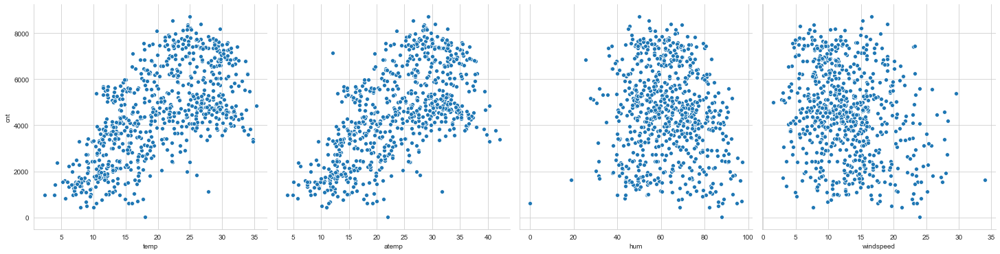
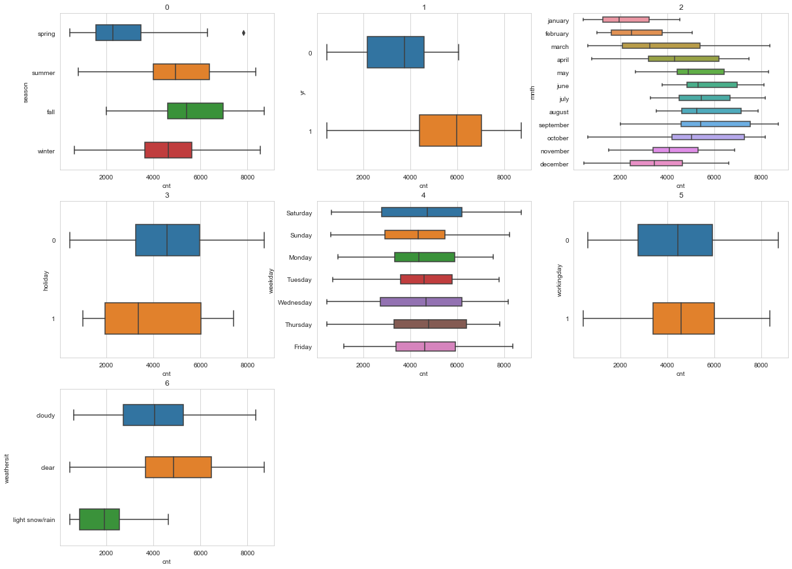
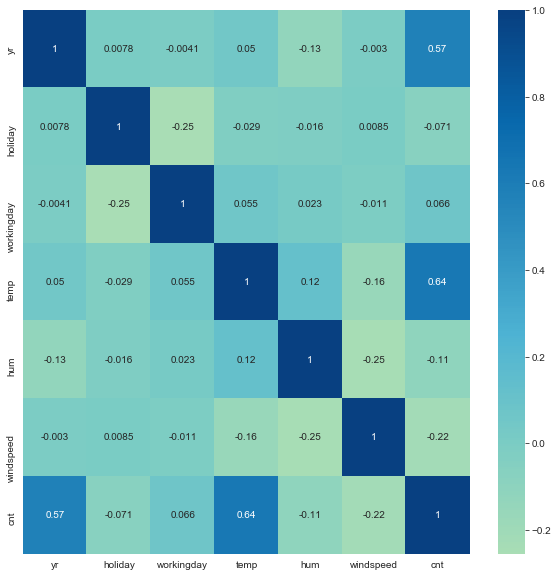
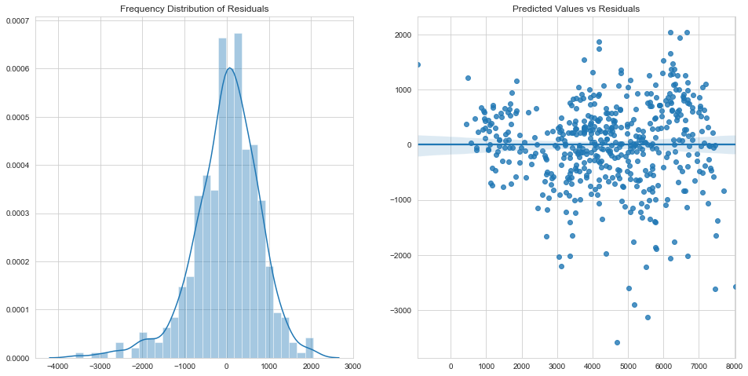
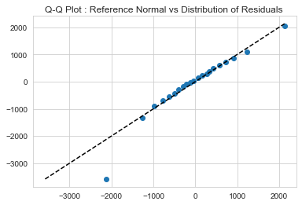
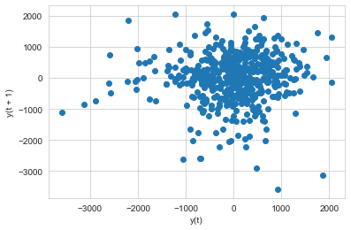
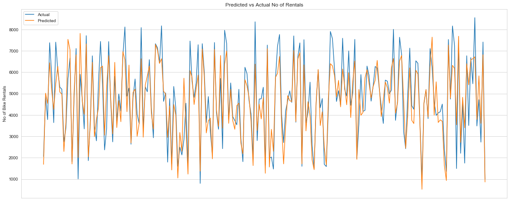
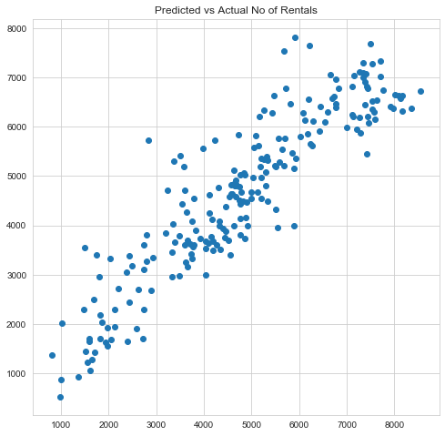

## Problem Statement

A bike-sharing system is a service in which bikes are made available for shared use to individuals on a short term basis for a price or free. Many bike share systems allow people to borrow a bike from a "dock" which is usually computer-controlled wherein the user enters the payment information, and the system unlocks it. This bike can then be returned to another dock belonging to the same system.

A US bike-sharing provider BoomBikes has recently suffered considerable dips in their revenues due to the ongoing Corona pandemic. The company is finding it very difficult to sustain in the current market scenario. So, it has decided to come up with a mindful business plan to be able to accelerate its revenue as soon as the ongoing lockdown comes to an end, and the economy restores to a healthy state.

In such an attempt, BoomBikes aspires to understand the demand for shared bikes among the people after this ongoing quarantine situation ends across the nation due to Covid-19. They have planned this to prepare themselves to cater to the people's needs once the situation gets better all around and stand out from other service providers and make huge profits.

They have contracted a consulting company to understand the factors on which the demand for these shared bikes depends. Specifically, they want to understand the factors affecting the demand for these shared bikes in the American market. The company wants to know:

- Which variables are significant in predicting the demand for shared bikes.
- How well those variables describe the bike demands  
  Based on various meteorological surveys and people's styles, the service provider firm has gathered a large dataset on daily bike demands across the American market based on some factors.

## Business Goals

The company needs to model the demand for shared bikes with the available independent variables. It will be used by the management to understand how exactly the demands vary with different features. They can accordingly manipulate the business strategy to meet the demand levels and meet the customer's expectations. Further, the model will be a good way for management to understand the demand dynamics of a new market.

## Analysis Approach & Conclusions

This problem can be solved using Multiple Linear Regression Analysis. The company requires a two fold solution.

1. A model to predict demand with accuracy.
2. Insight into the significant relationships that exist between demand and available predictors.

Analysis is carried out using a Mixed Feature Selection Approach. 15 features are selected algorithmically using Recursive Feature Elimination. Further selection is done manually by looking at multicollinearity and statistical significance of features and overall fit of the model.
The 10 most significant features to understand demand have been reported.

The data set is randomly divided into training and test data.
`Final Model` built on training data set explains 84% of the variability and achieves 81% on test data.  
The final relationship between demand and predictors is as follows.

- `cnt` = 2392.0791 + 1946.7864 _ `yr` + 444.4907 _ `Saturday` + 466.0136 _ `winter` - 890.3115 _ `july` -1063.6669 _ `spring` + 296.8008 _ `workingday` - 1749.8275 _ `hum` + 4471.6602 _ `temp` - 1110.3191 _ `windspeed` - 1273.7519 _ `light snow/rain`

where `temp` , `windspeed` and `hum` are normalized.

Note :

- Data has been cleaned to drop outliers that might affect the model adversely
- The model has been verified for Multicollinearity effects.
- Residual Analysis has been carried out and the model satisfies the assumptions of Linear Regression (Residuals follow a normal distribution, Errors exhibit homoscedasticity)
- Q-Q plot between residual distribution and normal distribution shows that residuals approximately follow a normal distribution. Some points significant deviation which deems further analysis
- Further Lag plot shows there is no auto-correlation in data.
- Model is stable at 81%(+/-14%) coefficient of determination at 95% CI, ascertained through cross validation.
- Features in the order of influence has been reported by standardizing all predictor values.
- Outliers dropped during Data Understanding phase deems further analysis from business perspective.

## Reading and Understanding Data

```python
data = pd.read_csv('./day.csv')
```

```python
data.head()
```

### Data Quality Checks

```python
data.info()
```

    <class 'pandas.core.frame.DataFrame'>
    RangeIndex: 730 entries, 0 to 729
    Data columns (total 16 columns):
     #   Column      Non-Null Count  Dtype
    ---  ------      --------------  -----
     0   instant     730 non-null    int64
     1   dteday      730 non-null    object
     2   season      730 non-null    int64
     3   yr          730 non-null    int64
     4   mnth        730 non-null    int64
     5   holiday     730 non-null    int64
     6   weekday     730 non-null    int64
     7   workingday  730 non-null    int64
     8   weathersit  730 non-null    int64
     9   temp        730 non-null    float64
     10  atemp       730 non-null    float64
     11  hum         730 non-null    float64
     12  windspeed   730 non-null    float64
     13  casual      730 non-null    int64
     14  registered  730 non-null    int64
     15  cnt         730 non-null    int64
    dtypes: float64(4), int64(11), object(1)
    memory usage: 91.4+ KB

- No missing values

### Visualizing Continuous Variables

```python
# dropping `instant`,`dteday`,`casual`,`registered`

data = data.drop(columns=['instant','dteday','casual','registered'])
```

These variables were dropped since `instant` is the just the serial number of the record,
`dteday` is redundant coz the required data for analysis is contained in mnth,yr
`casual` + `registered` = `cnt`

```python
# summary statistics of numerical variables
data[['temp','atemp','hum','windspeed']].describe()
```

```python
# Scatter Plots of Continuous variables vs 'cnt'
sns.set_style("whitegrid")
sns.pairplot(data=data,x_vars=['temp','atemp','hum','windspeed'],y_vars='cnt',kind='scatter',height=5,aspect=1);
```



- The number of rentals per day seem to be increasing with temperature and adjusted temperature
- adjusted temperature and temperature have similar trends
- temp vs cnt has two outliers between 15 and 30
- atemp vs cnt has two outliers between 20 and 35
- hum vs cnt has two outliers below 20
- windspeed vs cnt has one outlier above 30

### Outliers in Continuous Variables vs cnt

```python
## Dropping outliers in continuous variables
# outliers in temp
data = data.drop(index = data[(data['temp'] > 15) & (data['temp'] < 20) & (data['cnt'] < 100)].index)
data = data.drop(index = data[(data['temp'] > 25) & (data['temp'] < 30) & (data['cnt'] < 2000)].index)


# outliers in atemp
data = data.drop(index = data[(data['atemp'] > 20) & (data['atemp'] < 25) & (data['cnt'] < 100)].index)
data = data.drop(index = data[(data['atemp'] > 30) & (data['atemp'] < 35) & (data['cnt'] < 2000)].index)


#outliers in hum
data = data.drop(index = data[(data['hum'] < 20)].index)

#outliers in windspeed
data = data.drop(index = data[(data['windspeed'] > 30)].index)


```

```python
# Looking at correlation with continuous variables
correlation = data[['temp','atemp','hum','windspeed','cnt']].corr()['cnt'].apply(lambda x : round(x,4))
correlation = pd.DataFrame(correlation).sort_values(by='cnt',ascending=False)
correlation.drop(index=['cnt'],inplace=True)
# dropping registered,casual, instant
correlation.style.background_gradient(cmap='GnBu')
```

- There's no signifcant correlation between `atemp` and `hum` , `windspeed`.
- Hence these are not dropped for now.

### Visualizing Categorical Variables

```python
# Converting variables into categorical type
data[['season','weathersit','mnth']] = data[['season','weathersit','mnth']].astype('category')
```

```python
# Unique values in each categorical variable / [To check for disguised missing values]
cat_vars = ['season','yr','mnth','holiday','weekday','workingday','weathersit']
for i in cat_vars :
    print('Unique values in ',i, data[i].unique())
```

    Unique values in  season [1, 2, 3, 4]
    Categories (4, int64): [1, 2, 3, 4]
    Unique values in  yr [0 1]
    Unique values in  mnth [1, 2, 3, 4, 5, ..., 8, 9, 10, 11, 12]
    Length: 12
    Categories (12, int64): [1, 2, 3, 4, ..., 9, 10, 11, 12]
    Unique values in  holiday [0 1]
    Unique values in  weekday [6 0 1 2 3 4 5]
    Unique values in  workingday [0 1]
    Unique values in  weathersit [2, 1, 3]
    Categories (3, int64): [2, 1, 3]

- No disguised missing values exist

```python
# Replacing numbers with labels
season_labels = {
    1 : 'spring',
    2 : 'summer',
    3 : 'fall',
    4 : 'winter'
}

mnth_labels = {
    1 : 'january',
    2 : 'february',
    3 : 'march',
    4 : 'april',
    5 : 'may',
    6 : 'june',
    7 : 'july',
    8 : 'august',
    9 : 'september',
    10 : 'october',
    11 : 'november',
    12 : 'december'
}

weekday_labels = { # considering the first row of dteday to be 01-01-2011
    0 : 'Sunday',
    1 : 'Monday',
    2 : 'Tuesday',
    3 : 'Wednesday',
    4 : 'Thursday',
    5 : 'Friday',
    6 : 'Saturday'
}

weathersit_labels = {
    1 : 'clear',
    2 : 'cloudy',
    3 : 'light snow/rain'
}

# replacing numerals with labels
data['season'] = data['season'].replace(season_labels)
data['mnth'] = data['mnth'].replace(mnth_labels)
data['weekday'] = data['weekday'].replace(weekday_labels)
data['weathersit'] = data['weathersit'].replace(weathersit_labels)

data.head()
```

```python
cat_vars = ['season','yr','mnth','holiday','weekday',  'workingday','weathersit']
data1 = data[cat_vars]
data1.loc[:,'cnt'] = data['cnt'].values
data1[['yr','holiday','workingday']] = data1[['yr','holiday','workingday']].astype('category')
plot_dim = [3,3]
fig,axs = plt.subplots(*plot_dim)
fig.set_figheight(15)
fig.set_figwidth(20)
for i in range(plot_dim[0]) :
    for j in range(plot_dim[1]) :
        axs[i,j].set(title = i*plot_dim[1]+j)
        sns.boxplot(data=data1,x='cnt',y=cat_vars[i*plot_dim[1]+j],width=0.4,ax=axs[i,j])
        if i*plot_dim[1]+j == 6 :
            break
axs[2,1].set_axis_off()
axs[2,2].set_axis_off()
```



- From the season vs rentals per day plot , fall has the highest average rentals followed by summer.
- Looking at year by year rentals, 2019 has had a median 2000 increase in rentals compared to 2018.
- From the month wise plot, September has the highest rentals, followed by the two months surrounding it. It seems like the trend is explained by seasonal rentals too
- Holidays show lower rental count compared to working days, with greater variability in demand on holidays.
- There is no significant difference between rentals vs weekdays, except that Thursdays and sundays have a higher variation in rentals than others.

### Outliers in Categorical Variables vs cnt

```python
# Dropping outliers in Categorical Variables
data = data.drop(index = data[(data['season'] == 'spring') & (data['cnt'] > 7000)].index)

```

### Correlation

```python
# correlation among variables
plt.figure(figsize=[10,10])
sns.heatmap(data.corr(),cmap='GnBu',center=0,annot=True)
```

    <matplotlib.axes._subplots.AxesSubplot at 0x7fde4bfdd610>



- Highest correlation with `cnt` is seen in `temp` followed by `yr`

## Data Preparation

### Creating Indictor Variables

```python
# creating indicator variable columns
season_indicators = pd.get_dummies(data['season'],drop_first=True)
mnth_indicators = pd.get_dummies(data['mnth'],drop_first=True)
weekday_indicators = pd.get_dummies(data['weekday'],drop_first=True)
weathersit_indicators = pd.get_dummies(data['weathersit'],drop_first=True)
```

```python
# adding indicator variable columns to the dataset . Dropping original columns
data = pd.concat([data,season_indicators,mnth_indicators,weekday_indicators,weathersit_indicators],axis=1)
data = data.drop(columns=['season','mnth','weekday','weathersit'])
```

```python
data.head()
```

```python
data.columns
```

    Index(['yr', 'holiday', 'workingday', 'temp', 'hum', 'windspeed', 'cnt',
           'spring', 'summer', 'winter', 'august', 'december', 'february',
           'january', 'july', 'june', 'march', 'may', 'november', 'october',
           'september', 'Monday', 'Saturday', 'Sunday', 'Thursday', 'Tuesday',
           'Wednesday', 'cloudy', 'light snow/rain'],
          dtype='object')

| Variable   | Reference Label |
| ---------- | --------------- |
| season     | fall            |
| mnth       | april           |
| weekday    | Friday          |
| weathersit | clear           |

### Splitting the data set into Test & Train subsets

```python
from sklearn.model_selection import train_test_split
```

```python
dtrain,dtest = train_test_split(data,train_size=0.7,test_size=0.3,random_state=120)
```

### Scaling Numerical Features

```python
# normalization of continuous variables
from sklearn.preprocessing import MinMaxScaler
numerical_scaler = MinMaxScaler()
num_vars = ['temp','hum','windspeed']

numerical_scaler.fit(dtrain[num_vars])
dtrain[num_vars] = numerical_scaler.transform(dtrain[num_vars])
```

#### X_train , y_train

```python
y_train = dtrain.pop('cnt')
X_train = dtrain
```

```python
y_train.head()
```

    231    5191
    717    5267
    107    3429
    595    4549
    485    5740
    Name: cnt, dtype: int64

```python
X_train.head()
```

```python
X_train.columns
```

    Index(['yr', 'holiday', 'workingday', 'temp', 'hum', 'windspeed', 'spring',
           'summer', 'winter', 'august', 'december', 'february', 'january', 'july',
           'june', 'march', 'may', 'november', 'october', 'september', 'Monday',
           'Saturday', 'Sunday', 'Thursday', 'Tuesday', 'Wednesday', 'cloudy',
           'light snow/rain'],
          dtype='object')

## Modelling

Approach

- A mixed approach is followed.
- 15 Best columns are chosen using RFE
- And then p-value method is followed for further elimination.

#### Recursive Feature Elimination

```python
# Selecting 15 Features using RFE

from sklearn.feature_selection import RFE
from sklearn.linear_model import LinearRegression

lr_estimator = LinearRegression()
rfe = RFE(lr_estimator,n_features_to_select=15, step=1)
selector = rfe.fit(X_train,y_train)

```

```python
# RFE Feature Ranking
rfe_ranking = pd.DataFrame({'rank' : selector.ranking_, 'support': selector.support_, 'features' : X_train.columns}).sort_values(by='rank',ascending=True)
rfe_ranking
```

```python
# Selected Features
selected_features = rfe_ranking.loc[rfe_ranking['rank'] == 1,'features'].values
selected_features
```

    array(['yr', 'Sunday', 'Saturday', 'november', 'january', 'december',
           'winter', 'july', 'spring', 'holiday', 'workingday', 'hum', 'temp',
           'windspeed', 'light snow/rain'], dtype=object)

### Manual Elimination

```python
# Following a stepwise elimination
import statsmodels.api as sm
def ols_fit(y,X) :
    X_train_sm = sm.add_constant(X)
    model = sm.OLS(y,X_train_sm).fit()
    print(model.summary())
    return model
def vif(X) :
    df = sm.add_constant(X)
    vif = [variance_inflation_factor(df.values,i) for i in range(df.shape[1])]
    vif_frame = pd.DataFrame({'vif' : vif[0:]},index = df.columns).reset_index()
    print(vif_frame.sort_values(by='vif',ascending=False))
```

#### Model 1

- Using features selected by RFE : 'yr', 'Sunday', 'Saturday', 'november', 'january', 'december',
  'winter', 'july', 'spring', 'holiday', 'workingday', 'hum', 'temp',
  'windspeed', 'light snow/rain'

```python
features_1 = selected_features
ols_fit(y_train,X_train[features_1])
vif(X_train[selected_features])
```

                                OLS Regression Results
    ==============================================================================
    Dep. Variable:                    cnt   R-squared:                       0.844
    Model:                            OLS   Adj. R-squared:                  0.840
    Method:                 Least Squares   F-statistic:                     189.8
    Date:                Thu, 30 Jul 2020   Prob (F-statistic):          9.27e-188
    Time:                        20:41:57   Log-Likelihood:                -4072.4
    No. Observations:                 506   AIC:                             8175.
    Df Residuals:                     491   BIC:                             8238.
    Df Model:                          14
    Covariance Type:            nonrobust
    ===================================================================================
                          coef    std err          t      P>|t|      [0.025      0.975]
    -----------------------------------------------------------------------------------
    const            2278.2820    192.838     11.815      0.000    1899.393    2657.171
    yr               1959.7590     69.543     28.180      0.000    1823.120    2096.398
    Sunday            497.0421     97.123      5.118      0.000     306.214     687.871
    Saturday          874.2613     95.093      9.194      0.000     687.422    1061.101
    november         -617.4927    158.994     -3.884      0.000    -929.885    -305.100
    january          -391.9320    149.160     -2.628      0.009    -685.002     -98.862
    december         -475.8630    142.634     -3.336      0.001    -756.112    -195.614
    winter            687.2832    121.588      5.653      0.000     448.387     926.180
    july             -804.3128    141.415     -5.688      0.000   -1082.166    -526.459
    spring          -1010.6061    134.437     -7.517      0.000   -1274.749    -746.464
    holiday           165.4153    160.101      1.033      0.302    -149.152     479.982
    workingday        741.5633     73.655     10.068      0.000     596.846     886.280
    hum             -1782.6033    198.667     -8.973      0.000   -2172.947   -1392.260
    temp             4036.2727    275.497     14.651      0.000    3494.974    4577.571
    windspeed       -1167.6983    188.628     -6.190      0.000   -1538.315    -797.081
    light snow/rain -1276.7947    234.425     -5.446      0.000   -1737.395    -816.194
    ==============================================================================
    Omnibus:                       74.940   Durbin-Watson:                   1.920
    Prob(Omnibus):                  0.000   Jarque-Bera (JB):              164.191
    Skew:                          -0.800   Prob(JB):                     2.22e-36
    Kurtosis:                       5.286   Cond. No.                     6.67e+15
    ==============================================================================

    Warnings:
    [1] Standard Errors assume that the covariance matrix of the errors is correctly specified.
    [2] The smallest eigenvalue is 3.03e-29. This might indicate that there are
    strong multicollinearity problems or that the design matrix is singular.
                  index       vif
    2            Sunday       inf
    3          Saturday       inf
    10          holiday       inf
    11       workingday       inf
    13             temp  3.530342
    9            spring  2.972066
    7            winter  2.265754
    5           january  1.667765
    4          november  1.649107
    6          december  1.384399
    8              july  1.332786
    12              hum  1.302061
    15  light snow/rain  1.179013
    14        windspeed  1.161178
    1                yr  1.035227
    0             const  0.000000

#### Model 2 :

- Dropping `holiday` because of high p-value

```python
del_feature = 'holiday'
selected_features = selected_features[selected_features!=del_feature]
ols_fit(y_train,X_train[selected_features])
vif(X_train[selected_features])
```

                                OLS Regression Results
    ==============================================================================
    Dep. Variable:                    cnt   R-squared:                       0.844
    Model:                            OLS   Adj. R-squared:                  0.840
    Method:                 Least Squares   F-statistic:                     189.8
    Date:                Thu, 30 Jul 2020   Prob (F-statistic):          9.27e-188
    Time:                        20:41:57   Log-Likelihood:                -4072.4
    No. Observations:                 506   AIC:                             8175.
    Df Residuals:                     491   BIC:                             8238.
    Df Model:                          14
    Covariance Type:            nonrobust
    ===================================================================================
                          coef    std err          t      P>|t|      [0.025      0.975]
    -----------------------------------------------------------------------------------
    const            2443.6973    302.113      8.089      0.000    1850.103    3037.291
    yr               1959.7590     69.543     28.180      0.000    1823.120    2096.398
    Sunday            331.6268    208.945      1.587      0.113     -78.910     742.164
    Saturday          708.8460    208.062      3.407      0.001     300.043    1117.649
    november         -617.4927    158.994     -3.884      0.000    -929.885    -305.100
    january          -391.9320    149.160     -2.628      0.009    -685.002     -98.862
    december         -475.8630    142.634     -3.336      0.001    -756.112    -195.614
    winter            687.2832    121.588      5.653      0.000     448.387     926.180
    july             -804.3128    141.415     -5.688      0.000   -1082.166    -526.459
    spring          -1010.6061    134.437     -7.517      0.000   -1274.749    -746.464
    workingday        576.1480    191.468      3.009      0.003     199.950     952.346
    hum             -1782.6033    198.667     -8.973      0.000   -2172.947   -1392.260
    temp             4036.2727    275.497     14.651      0.000    3494.974    4577.571
    windspeed       -1167.6983    188.628     -6.190      0.000   -1538.315    -797.081
    light snow/rain -1276.7947    234.425     -5.446      0.000   -1737.395    -816.194
    ==============================================================================
    Omnibus:                       74.940   Durbin-Watson:                   1.920
    Prob(Omnibus):                  0.000   Jarque-Bera (JB):              164.191
    Skew:                          -0.800   Prob(JB):                     2.22e-36
    Kurtosis:                       5.286   Cond. No.                         20.6
    ==============================================================================

    Warnings:
    [1] Standard Errors assume that the covariance matrix of the errors is correctly specified.
                  index        vif
    0             const  78.227579
    10       workingday   6.747604
    3          Saturday   4.580552
    2            Sunday   4.352788
    12             temp   3.530342
    9            spring   2.972066
    7            winter   2.265754
    5           january   1.667765
    4          november   1.649107
    6          december   1.384399
    8              july   1.332786
    11              hum   1.302061
    14  light snow/rain   1.179013
    13        windspeed   1.161178
    1                yr   1.035227

#### Model 3 :

- Dropping `Sunday` because of high p-value

```python
del_feature = 'Sunday'
selected_features = selected_features[selected_features!=del_feature]
ols_fit(y_train,X_train[selected_features])
vif(X_train[selected_features])
```

                                OLS Regression Results
    ==============================================================================
    Dep. Variable:                    cnt   R-squared:                       0.843
    Model:                            OLS   Adj. R-squared:                  0.839
    Method:                 Least Squares   F-statistic:                     203.6
    Date:                Thu, 30 Jul 2020   Prob (F-statistic):          2.22e-188
    Time:                        20:41:57   Log-Likelihood:                -4073.7
    No. Observations:                 506   AIC:                             8175.
    Df Residuals:                     492   BIC:                             8234.
    Df Model:                          13
    Covariance Type:            nonrobust
    ===================================================================================
                          coef    std err          t      P>|t|      [0.025      0.975]
    -----------------------------------------------------------------------------------
    const            2717.6842    248.317     10.944      0.000    2229.791    3205.578
    yr               1958.8083     69.648     28.124      0.000    1821.964    2095.652
    Saturday          442.9774    123.597      3.584      0.000     200.134     685.820
    november         -627.3327    159.118     -3.943      0.000    -939.968    -314.698
    january          -391.6152    149.390     -2.621      0.009    -685.136     -98.095
    december         -485.7607    142.718     -3.404      0.001    -766.172    -205.350
    winter            687.9955    121.774      5.650      0.000     448.733     927.258
    july             -808.0743    141.613     -5.706      0.000   -1086.316    -529.833
    spring          -1018.8530    134.544     -7.573      0.000   -1283.204    -754.502
    workingday        310.9383     93.623      3.321      0.001     126.989     494.888
    hum             -1777.8858    198.952     -8.936      0.000   -2168.785   -1386.986
    temp             4023.0506    275.796     14.587      0.000    3481.168    4564.933
    windspeed       -1166.7398    188.918     -6.176      0.000   -1537.925    -795.555
    light snow/rain -1274.2371    234.781     -5.427      0.000   -1735.535    -812.939
    ==============================================================================
    Omnibus:                       76.586   Durbin-Watson:                   1.907
    Prob(Omnibus):                  0.000   Jarque-Bera (JB):              168.964
    Skew:                          -0.814   Prob(JB):                     2.04e-37
    Kurtosis:                       5.316   Cond. No.                         17.6
    ==============================================================================

    Warnings:
    [1] Standard Errors assume that the covariance matrix of the errors is correctly specified.
                  index        vif
    0             const  52.686107
    11             temp   3.527114
    8            spring   2.967626
    6            winter   2.265723
    4           january   1.667762
    3          november   1.646599
    2          Saturday   1.611416
    9        workingday   1.608346
    5          december   1.381753
    7              july   1.332412
    10              hum   1.301769
    13  light snow/rain   1.178957
    12        windspeed   1.161167
    1                yr   1.035151

#### Model 4

- Dropping `january` because this information might also be contained in `winter`.

```python
del_feature = 'january'
selected_features = selected_features[selected_features!=del_feature]
ols_fit(y_train,X_train[selected_features])
vif(X_train[selected_features])
```

                                OLS Regression Results
    ==============================================================================
    Dep. Variable:                    cnt   R-squared:                       0.841
    Model:                            OLS   Adj. R-squared:                  0.837
    Method:                 Least Squares   F-statistic:                     217.4
    Date:                Thu, 30 Jul 2020   Prob (F-statistic):          4.41e-188
    Time:                        20:41:58   Log-Likelihood:                -4077.2
    No. Observations:                 506   AIC:                             8180.
    Df Residuals:                     493   BIC:                             8235.
    Df Model:                          12
    Covariance Type:            nonrobust
    ===================================================================================
                          coef    std err          t      P>|t|      [0.025      0.975]
    -----------------------------------------------------------------------------------
    const            2563.5282    242.686     10.563      0.000    2086.701    3040.355
    yr               1951.9279     70.012     27.880      0.000    1814.370    2089.486
    Saturday          437.2585    124.312      3.517      0.000     193.013     681.504
    november         -576.6481    158.877     -3.630      0.000    -888.808    -264.489
    december         -380.3554    137.749     -2.761      0.006    -651.004    -109.707
    winter            696.8818    122.450      5.691      0.000     456.294     937.470
    july             -846.1814    141.702     -5.972      0.000   -1124.595    -567.768
    spring          -1101.5863    131.566     -8.373      0.000   -1360.086    -843.087
    workingday        310.1011     94.178      3.293      0.001     125.061     495.141
    hum             -1775.7238    200.131     -8.873      0.000   -2168.939   -1382.508
    temp             4232.4252    265.545     15.939      0.000    3710.686    4754.164
    windspeed       -1126.2015    189.402     -5.946      0.000   -1498.335    -754.068
    light snow/rain -1259.9614    236.112     -5.336      0.000   -1723.871    -796.052
    ==============================================================================
    Omnibus:                       70.215   Durbin-Watson:                   1.923
    Prob(Omnibus):                  0.000   Jarque-Bera (JB):              144.730
    Skew:                          -0.775   Prob(JB):                     3.74e-32
    Kurtosis:                       5.112   Cond. No.                         16.9
    ==============================================================================

    Warnings:
    [1] Standard Errors assume that the covariance matrix of the errors is correctly specified.
                  index        vif
    0             const  49.731331
    10             temp   3.231303
    7            spring   2.804334
    5            winter   2.263968
    3          november   1.622287
    2          Saturday   1.610914
    8        workingday   1.608327
    6              july   1.318372
    9               hum   1.301747
    4          december   1.272074
    12  light snow/rain   1.178323
    11        windspeed   1.153386
    1                yr   1.033680

#### Model 5

- Dropping `december` because this information might also be contained in `winter`.

```python
del_feature = 'december'
selected_features = selected_features[selected_features!=del_feature]
ols_fit(y_train,X_train[selected_features])
vif(X_train[selected_features])
```

                                OLS Regression Results
    ==============================================================================
    Dep. Variable:                    cnt   R-squared:                       0.839
    Model:                            OLS   Adj. R-squared:                  0.835
    Method:                 Least Squares   F-statistic:                     233.3
    Date:                Thu, 30 Jul 2020   Prob (F-statistic):          1.22e-187
    Time:                        20:41:58   Log-Likelihood:                -4081.1
    No. Observations:                 506   AIC:                             8186.
    Df Residuals:                     494   BIC:                             8237.
    Df Model:                          11
    Covariance Type:            nonrobust
    ===================================================================================
                          coef    std err          t      P>|t|      [0.025      0.975]
    -----------------------------------------------------------------------------------
    const            2484.0272    242.583     10.240      0.000    2007.406    2960.648
    yr               1945.4495     70.440     27.619      0.000    1807.051    2083.848
    Saturday          435.8371    125.141      3.483      0.001     189.962     681.712
    november         -443.0313    152.340     -2.908      0.004    -742.345    -143.718
    winter            603.4461    118.468      5.094      0.000     370.683     836.209
    july             -874.0132    142.287     -6.143      0.000   -1153.576    -594.450
    spring          -1106.1972    132.435     -8.353      0.000   -1366.402    -845.992
    workingday        296.4789     94.677      3.131      0.002     110.459     482.499
    hum             -1801.9289    201.242     -8.954      0.000   -2197.325   -1406.533
    temp             4372.9630    262.363     16.668      0.000    3857.478    4888.448
    windspeed       -1096.9814    190.369     -5.762      0.000   -1471.015    -722.948
    light snow/rain -1259.4132    237.690     -5.299      0.000   -1726.420    -792.406
    ==============================================================================
    Omnibus:                       67.769   Durbin-Watson:                   1.914
    Prob(Omnibus):                  0.000   Jarque-Bera (JB):              129.549
    Skew:                          -0.778   Prob(JB):                     7.39e-29
    Kurtosis:                       4.929   Cond. No.                         16.7
    ==============================================================================

    Warnings:
    [1] Standard Errors assume that the covariance matrix of the errors is correctly specified.
                  index        vif
    0             const  49.031354
    9              temp   3.112593
    6            spring   2.803882
    4            winter   2.091074
    2          Saturday   1.610886
    7        workingday   1.603914
    3          november   1.471790
    5              july   1.311701
    8               hum   1.298820
    11  light snow/rain   1.178322
    10        windspeed   1.149786
    1                yr   1.032520

#### Model 6

- Dropping `november` because this information might also be contained in `winter`.

```python
del_feature = 'november'
selected_features = selected_features[selected_features!=del_feature]
final_model = ols_fit(y_train,X_train[selected_features])
vif(X_train[selected_features])
```

                                OLS Regression Results
    ==============================================================================
    Dep. Variable:                    cnt   R-squared:                       0.836
    Model:                            OLS   Adj. R-squared:                  0.833
    Method:                 Least Squares   F-statistic:                     252.0
    Date:                Thu, 30 Jul 2020   Prob (F-statistic):          4.89e-187
    Time:                        20:41:58   Log-Likelihood:                -4085.3
    No. Observations:                 506   AIC:                             8193.
    Df Residuals:                     495   BIC:                             8239.
    Df Model:                          10
    Covariance Type:            nonrobust
    ===================================================================================
                          coef    std err          t      P>|t|      [0.025      0.975]
    -----------------------------------------------------------------------------------
    const            2392.0791    242.318      9.872      0.000    1915.980    2868.178
    yr               1946.7864     70.967     27.432      0.000    1807.353    2086.220
    Saturday          444.4907    126.045      3.526      0.000     196.842     692.139
    winter            466.0136    109.450      4.258      0.000     250.970     681.057
    july             -890.3115    143.244     -6.215      0.000   -1171.752    -608.871
    spring          -1063.6669    132.613     -8.021      0.000   -1324.220    -803.114
    workingday        296.8008     95.388      3.112      0.002     109.386     484.216
    hum             -1749.8275    201.947     -8.665      0.000   -2146.607   -1353.048
    temp             4471.6602    262.111     17.060      0.000    3956.673    4986.648
    windspeed       -1110.3191    191.742     -5.791      0.000   -1487.049    -733.590
    light snow/rain -1273.7519    239.422     -5.320      0.000   -1744.160    -803.344
    ==============================================================================
    Omnibus:                       69.587   Durbin-Watson:                   1.898
    Prob(Omnibus):                  0.000   Jarque-Bera (JB):              136.276
    Skew:                          -0.788   Prob(JB):                     2.56e-30
    Kurtosis:                       4.995   Cond. No.                         16.5
    ==============================================================================

    Warnings:
    [1] Standard Errors assume that the covariance matrix of the errors is correctly specified.
                  index        vif
    0             const  48.198446
    8              temp   3.060511
    5            spring   2.769692
    3            winter   1.758336
    2          Saturday   1.609975
    6        workingday   1.603912
    4              july   1.309666
    7               hum   1.288526
    10  light snow/rain   1.177815
    9         windspeed   1.149118
    1                yr   1.032476

## Verifying MultiCollinearity

```python
vif(X_train[selected_features])
```

                  index        vif
    0             const  48.198446
    8              temp   3.060511
    5            spring   2.769692
    3            winter   1.758336
    2          Saturday   1.609975
    6        workingday   1.603912
    4              july   1.309666
    7               hum   1.288526
    10  light snow/rain   1.177815
    9         windspeed   1.149118
    1                yr   1.032476

- VIF < 5 for selected features. No significant multicollinearity observed. Similar indicating comparison of R-squared and adjusted R-squared.

## Final Model

```python
final_model = ols_fit(y_train,X_train[selected_features])
```

                                OLS Regression Results
    ==============================================================================
    Dep. Variable:                    cnt   R-squared:                       0.836
    Model:                            OLS   Adj. R-squared:                  0.833
    Method:                 Least Squares   F-statistic:                     252.0
    Date:                Thu, 30 Jul 2020   Prob (F-statistic):          4.89e-187
    Time:                        20:41:58   Log-Likelihood:                -4085.3
    No. Observations:                 506   AIC:                             8193.
    Df Residuals:                     495   BIC:                             8239.
    Df Model:                          10
    Covariance Type:            nonrobust
    ===================================================================================
                          coef    std err          t      P>|t|      [0.025      0.975]
    -----------------------------------------------------------------------------------
    const            2392.0791    242.318      9.872      0.000    1915.980    2868.178
    yr               1946.7864     70.967     27.432      0.000    1807.353    2086.220
    Saturday          444.4907    126.045      3.526      0.000     196.842     692.139
    winter            466.0136    109.450      4.258      0.000     250.970     681.057
    july             -890.3115    143.244     -6.215      0.000   -1171.752    -608.871
    spring          -1063.6669    132.613     -8.021      0.000   -1324.220    -803.114
    workingday        296.8008     95.388      3.112      0.002     109.386     484.216
    hum             -1749.8275    201.947     -8.665      0.000   -2146.607   -1353.048
    temp             4471.6602    262.111     17.060      0.000    3956.673    4986.648
    windspeed       -1110.3191    191.742     -5.791      0.000   -1487.049    -733.590
    light snow/rain -1273.7519    239.422     -5.320      0.000   -1744.160    -803.344
    ==============================================================================
    Omnibus:                       69.587   Durbin-Watson:                   1.898
    Prob(Omnibus):                  0.000   Jarque-Bera (JB):              136.276
    Skew:                          -0.788   Prob(JB):                     2.56e-30
    Kurtosis:                       4.995   Cond. No.                         16.5
    ==============================================================================

    Warnings:
    [1] Standard Errors assume that the covariance matrix of the errors is correctly specified.

- 10 features have been selected.
- All the features are statistically significant [low p-value]
- The model over is a good fit with Prob (F-statistic): 4.89e-187
- The model explains 83.6% variability in the training data. Adjusted R-square being 83.3%

## Residual Analysis

```python
# Residual Analysis of Trained Data
X_train_sm = sm.add_constant(X_train[selected_features])

y_train_pred = final_model.predict(X_train_sm)
fig,ax = plt.subplots(1,2)
fig.set_figheight(8)
fig.set_figwidth(16)

ax[0].set(title='Frequency Distribution of Residuals')
sns.distplot(y_train-y_train_pred, bins=30, ax=ax[0])

ax[1].set(title='Predicted Values vs Residuals')
\
sns.regplot(y_train_pred,y_train-y_train_pred,ax=ax[1])
plt.show()
```



```python
# Mean of Residuals
(y_train-y_train_pred).mean()
```

    4.763163951972846e-12

- Residual errors follow a normal distribution with mean=0
- Variance of Errors doesnt follow any trends
- Residual errors are independent of each other since the Predicted values vs Residuals plot doesn't show any trend.

```python
# Verifying the normality of distribution of residuals
mean = (y_train-y_train_pred).mean()
std = (y_train-y_train_pred).std()

ref_normal = np.random.normal(mean,std,(y_train-y_train_pred).shape[0])


percs = np.linspace(0,100,21)
qn_ref_normal = np.percentile(ref_normal, percs)
qn_residual = np.percentile(y_train - y_train_pred , percs)

plt.plot(qn_ref_normal,qn_residual, ls="", marker="o")

x = np.linspace(np.min((qn_ref_normal.min(),qn_residual.min())), np.max((qn_ref_normal.max(),qn_residual.max())))
m = plt.plot(x,x, color="k", ls="--")
plt.title('Q-Q Plot : Reference Normal vs Distribution of Residuals ')
plt.savefig('q-q-plot.png')
plt.show()
```



- This plot further shows that the residual distribution is approximately normal for all test data with values within range of training data.

```python
# lag plot to assess independence of data points
from pandas.plotting import lag_plot
lag_plot(y_train-y_train_pred)
```

    <matplotlib.axes._subplots.AxesSubplot at 0x7fde4fb985d0>



- Lagplot of residuals shows no trend. Hence the error terms have constant variance

**Hence, assumptions of Linear Regression are satisfied by this model**

## Prediction

```python
y_test = dtest.pop('cnt')
X_test = dtest
X_test[num_vars] = numerical_scaler.transform(X_test[num_vars])
X_test = X_test[selected_features]
```

```python
X_test = sm.add_constant(X_test)
y_test_pred = final_model.predict(X_test)
```

## Model Evaluation

```python
# Plotting Actual vs Predicted No of rentals
fig,ax = plt.subplots()
fig.set_figheight(8)
fig.set_figwidth(20)
l1,=ax.plot(range(len(y_test)),y_test)
l2, = ax.plot(range(len(y_test_pred)),y_test_pred)
plt.legend([l1,l2],['Actual','Predicted'])
plt.title('Predicted vs Actual No of Rentals');
plt.ylabel('No of Bike Rentals')
plt.xticks([])
plt.show()

plt.figure(figsize=[8,8])
plt.scatter(y_test,y_test_pred);
plt.title('Predicted vs Actual No of Rentals');
```





- Predicted vs observed value plots shows that the model is reasonably accurate.

```python
from sklearn.metrics import mean_squared_error,r2_score
mse = mean_squared_error(y_test, y_test_pred)
rsquared_test = r2_score(y_test, y_test_pred)
rsquared_train = r2_score(y_train, y_train_pred)
print('R-squared for train data:',round(rsquared_train,2))
print('R-squared for test data:',round(rsquared_test,2))
print('Mean Squared Error',round(mse,3))
```

    R-squared for train data: 0.84
    R-squared for test data: 0.81
    Mean Squared Error 666097.695

## Model Stability

```python
# R-square using cross validation

from sklearn.model_selection import cross_val_score
from sklearn.linear_model import LinearRegression
lr = LinearRegression()
clr = cross_val_score(lr,X_train[selected_features],y_train,cv=10, scoring='r2')
clr
```

    array([0.76577509, 0.89378885, 0.73439962, 0.87831664, 0.84127272,
           0.85375903, 0.87521829, 0.68697543, 0.73861901, 0.87571386])

```python
print("R-square at 0.95 confidence level : %0.2f (+/- %0.2f)" % (clr.mean(), clr.std() * 2))
```

    R-square at 0.95 confidence level : 0.81 (+/- 0.14)

```python
selected_features
```

    array(['yr', 'Saturday', 'winter', 'july', 'spring', 'workingday', 'hum',
           'temp', 'windspeed', 'light snow/rain'], dtype=object)

## Top Features

```python
# standardizing numerical variables

from sklearn.preprocessing import StandardScaler
reg_features = selected_features
scaler = StandardScaler()
data = X_train[selected_features]
std_num = scaler.fit(data[['temp','windspeed','hum']])


std_X_train = pd.DataFrame(data = scaler.transform(data[['temp','windspeed','hum']]), columns=['temp','windspeed','hum'])
for i in reg_features :
    std_X_train[i] = data[i].values


reshaped_y_train = y_train.values.reshape(-1,1)

# Fitting linear regression model
std_model = lr.fit(std_X_train, reshaped_y_train)

# Coefficients and intercept
result = pd.DataFrame(data = std_model.coef_, columns = std_X_train.columns, index=['MLR Coefficients']).T
result = result.sort_values(by='MLR Coefficients',ascending=False)
print('\nIntercept :',std_model.intercept_)
result
```

    Intercept : [2392.07911232]

- Upon standardized the values of predictor variables, the above shows that the top features influencing demand are `temp`, followed by `yr` and `hum`
- In case of continuous variables, the above data could be interpreted as - With every standard deviation increase in continuous variables, demand increases by `xxx`, when all other modelled paramters are held unchanged.
- In case of categorical variables, the above data could be interpreted as - Compared to the reference level, the change in demand is `xxx`,, when all other modelled paramters are held unchanged.

## Conclusion

Analysis is carried out using a Mixed Feature Selection Approach. 15 features are selected algorithmically using Recursive Feature Elimination. Further selection is done manually by looking at multicollinearity and statistical significance of features and overall fit of the model.
The 10 most significant features to understand demand have been reported.

The data set is randomly divided into training and test data.
`Final Model` built on training data set explains 84% of the variability and achieves 81% on test data.  
The final relationship between demand and predictors is as follows.

- `cnt` = 2392.0791 + 1946.7864 _ `yr` + 444.4907 _ `Saturday` + 466.0136 _ `winter` - 890.3115 _ `july` -1063.6669 _ `spring` + 296.8008 _ `workingday` - 1749.8275 _ `hum` + 4471.6602 _ `temp` - 1110.3191 _ `windspeed` - 1273.7519 _ `light snow/rain`

where `temp` , `windspeed` and `hum` are normalized.

Note :

- Data has been cleaned to drop outliers that might affect the model adversely
- The model has been verified for Multicollinearity effects.
- Residual Analysis has been carried out and the model satisfies the assumptions of Linear Regression (Residuals follow a normal distribution, Errors exhibit homoscedasticity)
- Q-Q plot between residual distribution and normal distribution shows that residuals follow a normal distribution for all interpolations. Extraplorations show significant deviation, not affecting Linear Regression applicability.
- Further Lag plot shows there is no auto-correlation in data.
- Model is stable at 81%(+/-14%) coefficient of determination at 95% CI, ascertained through cross validation.
- Features in the order of influence has been reported by standardizing all predictor values.

```python

```
