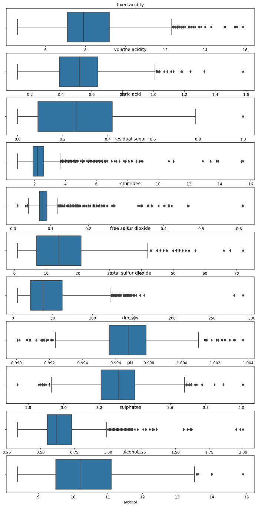
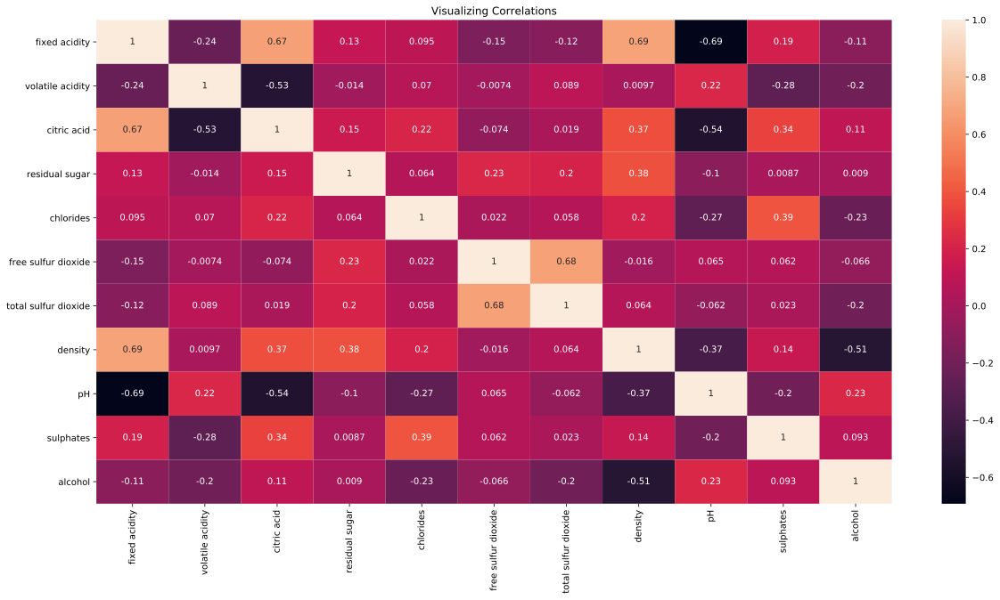
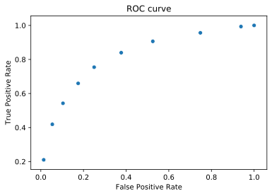
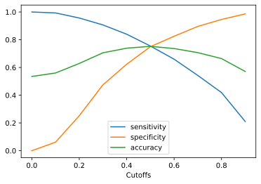
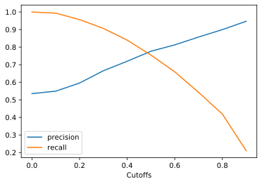

Photo by [EVGENIY KONEV]("https://unsplash.com/@ekonev?utm_source=unsplash&utm_medium=referral&utm_content=creditCopyText") on [Unsplash]("https://unsplash.com/@ekonev?utm_source=unsplash&utm_medium=referral&utm_content=creditCopyText")

### Data Set

This Data set contains the information related to red wine , Various factors affecting the quality. This data set was prepossessed and downloaded from the UCI Machine Learning Repository. This data set was simple, cleaned, practice data set for classification modelling. Source of this Dataset: https://archive.ics.uci.edu/ml/datasets/wine+quality

Attribute Information:  
Input variables (based on physicochemical tests):

1. fixed acidity
2. volatile acidity
3. citric acid
4. residual sugar
5. chlorides
6. free sulfur dioxide
7. total sulfur dioxide
8. density
9. pH
10. sulphates
11. alcohol  
    Output variable (based on sensory data):
12. quality ('good' and 'bad' based on score >5 and <5)

### Analysis Approach & Conclusions

This analysis focuses on finding attributes that significantly affect wine quality classification and training a predictive model to classify wine quality into `good` and `bad` based on attributes. Analysis is pivoted on the variable `quality`(target variable). Exploratory data analysis steps like removing null values, observing summary statistics, visualizing the variables, removing oultiers, checking for correlations are carried out.

Following significant correlations are observed.

- Fixed acidity vs pH : -0.69
- Fixed acidity vs density : 0.69
- fixed acidity vs citric acid : 0.67
- Volatile acidity vs citric acid : -0.53
- citric acid vs pH : -0.54
- density vs alcohol : -0.51

A 70-30 split is done to divide dataset into test and train sets.  
10 variables are selected using automated RFE. Further, manual selection is carried out using p-value method.
Models are build on train data using `statsmodels.api` package.
Final Model is build on the following variables.  
`citric acid`,`fixed acidity`,`volatile acidity`,`alcohol`,`sulphates`,`total sulfur dioxide`  
Variance inflation factor is calculated for all final selection of variables. VIF < 5. No significant Multicollinearity observed.

ROC, Precision-Recall / Sensitivity - Specificity curves have been plotted. The optimum threshold for classification seems to be 0.5

**Model metrics on train data at classification threshold of 0.5 :**

- Accuracy : 0.752
- Misclassification Rate / Error Rate : 0.248
- Sensitivity / True Positive Rate / Recall : 0.755
- Specificity / True Negative Rate : 0.75
- False Positive Rate : 0.25
- Precision / Positive Predictive Value : 0.777
- Prevalance : 0.535
- Negative Predictive Value 0.726
- Likelihood Ratio : Sensitivity / 1-Specificity : 3.02
- F1-score : 0.766

**Model metrics on test data at classification threshold of 0.5 :**

- Accuracy : 0.746
- Misclassification Rate / Error Rate : 0.254
- Sensitivity / True Positive Rate / Recall : 0.797
- Specificity / True Negative Rate : 0.688
- False Positive Rate : 0.312
- Precision / Positive Predictive Value : 0.745
- Prevalance : 0.533
- Negative Predictive Value 0.748
- Likelihood Ratio : Sensitivity / 1-Specificity : 2.554
- F1-score : 0.77

## Analysis

```python
import pandas as pd, numpy as np
import matplotlib.pyplot as plt
import seaborn as sns
```

### Importing Data

```python
data = pd.read_csv('./wine_quality_classification.csv')
```

```python
print(data.head())
```

    fixed acidity  volatile acidity  citric acid  residual sugar  chlorides  \
    0            7.4              0.70         0.00             1.9      0.076
    1            7.8              0.88         0.00             2.6      0.098
    2            7.8              0.76         0.04             2.3      0.092
    3           11.2              0.28         0.56             1.9      0.075
    4            7.4              0.70         0.00             1.9      0.076

       free sulfur dioxide  total sulfur dioxide  density    pH  sulphates  \
    0                 11.0                  34.0   0.9978  3.51       0.56
    1                 25.0                  67.0   0.9968  3.20       0.68
    2                 15.0                  54.0   0.9970  3.26       0.65
    3                 17.0                  60.0   0.9980  3.16       0.58
    4                 11.0                  34.0   0.9978  3.51       0.56

       alcohol quality
    0      9.4     bad
    1      9.8     bad
    2      9.8     bad
    3      9.8    good
    4      9.4     bad

```python
data.info()
```

    <class 'pandas.core.frame.DataFrame'>
    RangeIndex: 1599 entries, 0 to 1598
    Data columns (total 12 columns):
     #   Column                Non-Null Count  Dtype
    ---  ------                --------------  -----
     0   fixed acidity         1599 non-null   float64
     1   volatile acidity      1599 non-null   float64
     2   citric acid           1599 non-null   float64
     3   residual sugar        1599 non-null   float64
     4   chlorides             1599 non-null   float64
     5   free sulfur dioxide   1599 non-null   float64
     6   total sulfur dioxide  1599 non-null   float64
     7   density               1599 non-null   float64
     8   pH                    1599 non-null   float64
     9   sulphates             1599 non-null   float64
     10  alcohol               1599 non-null   float64
     11  quality               1599 non-null   object
    dtypes: float64(11), object(1)
    memory usage: 150.0+ KB

```python
data.isnull().sum()
```

    fixed acidity           0
    volatile acidity        0
    citric acid             0
    residual sugar          0
    chlorides               0
    free sulfur dioxide     0
    total sulfur dioxide    0
    density                 0
    pH                      0
    sulphates               0
    alcohol                 0
    quality                 0
    dtype: int64

`quality` is our target variable. It has two levels - good & bad. No null or missing values. All the other variables are continuous variables.

### Replacing `quality` levels with 0,1

```python
data['quality'] = data['quality'].replace({'good' : 1, 'bad' : 0})
```

### Summary Statistics

```python
print(data.describe())
```

    fixed acidity  volatile acidity  citric acid  residual sugar  \
    count    1599.000000       1599.000000  1599.000000     1599.000000
    mean        8.319637          0.527821     0.270976        2.538806
    std         1.741096          0.179060     0.194801        1.409928
    min         4.600000          0.120000     0.000000        0.900000
    25%         7.100000          0.390000     0.090000        1.900000
    50%         7.900000          0.520000     0.260000        2.200000
    75%         9.200000          0.640000     0.420000        2.600000
    max        15.900000          1.580000     1.000000       15.500000

             chlorides  free sulfur dioxide  total sulfur dioxide      density  \
    count  1599.000000          1599.000000           1599.000000  1599.000000
    mean      0.087467            15.874922             46.467792     0.996747
    std       0.047065            10.460157             32.895324     0.001887
    min       0.012000             1.000000              6.000000     0.990070
    25%       0.070000             7.000000             22.000000     0.995600
    50%       0.079000            14.000000             38.000000     0.996750
    75%       0.090000            21.000000             62.000000     0.997835
    max       0.611000            72.000000            289.000000     1.003690

                    pH    sulphates      alcohol      quality
    count  1599.000000  1599.000000  1599.000000  1599.000000
    mean      3.311113     0.658149    10.422983     0.534709
    std       0.154386     0.169507     1.065668     0.498950
    min       2.740000     0.330000     8.400000     0.000000
    25%       3.210000     0.550000     9.500000     0.000000
    50%       3.310000     0.620000    10.200000     1.000000
    75%       3.400000     0.730000    11.100000     1.000000
    max       4.010000     2.000000    14.900000     1.000000

### Checking for Outliers

```python
print(data.quantile(np.linspace(0.90,1,12)))
```

    fixed acidity  volatile acidity  citric acid  residual sugar  \
    0.900000      10.700000          0.745000     0.522000        3.600000
    0.909091      10.872727          0.760000     0.537273        3.800000
    0.918182      11.100000          0.775000     0.550000        4.000000
    0.927273      11.300000          0.785000     0.560000        4.200000
    0.936364      11.500000          0.810000     0.580000        4.400000
    0.945455      11.600000          0.834182     0.590000        4.783636
    0.954545      11.900000          0.851818     0.630000        5.500000
    0.963636      12.089091          0.880000     0.640000        5.789091
    0.972727      12.500000          0.910000     0.660000        6.141818
    0.981818      12.794545          0.965000     0.680000        6.983636
    0.990909      13.300000          1.022364     0.714727        8.694545
    1.000000      15.900000          1.580000     1.000000       15.500000

              chlorides  free sulfur dioxide  total sulfur dioxide   density  \
    0.900000   0.109000            31.000000             93.200000  0.999140
    0.909091   0.111000            31.000000             96.000000  0.999300
    0.918182   0.114000            32.000000             99.000000  0.999400
    0.927273   0.117000            33.000000            102.781818  0.999478
    0.936364   0.120000            34.000000            106.000000  0.999700
    0.945455   0.123000            35.000000            110.000000  0.999800
    0.954545   0.136364            36.000000            115.000000  1.000000
    0.963636   0.164564            38.000000            121.000000  1.000200
    0.972727   0.187673            40.000000            129.000000  1.000400
    0.981818   0.234727            42.945455            136.000000  1.000989
    0.990909   0.368473            51.000000            145.945455  1.001942
    1.000000   0.611000            72.000000            289.000000  1.003690

                    pH  sulphates  alcohol  quality
    0.900000  3.510000   0.850000     12.0      1.0
    0.909091  3.520000   0.860000     12.0      1.0
    0.918182  3.530000   0.870000     12.1      1.0
    0.927273  3.540000   0.887818     12.2      1.0
    0.936364  3.543091   0.903091     12.4      1.0
    0.945455  3.560000   0.930000     12.5      1.0
    0.954545  3.573636   0.953636     12.5      1.0
    0.963636  3.590000   0.998909     12.7      1.0
    0.972727  3.610000   1.060000     12.8      1.0
    0.981818  3.660000   1.140000     12.9      1.0
    0.990909  3.710000   1.280000     13.4      1.0
    1.000000  4.010000   2.000000     14.9      1.0

- There are outlier in `fixed acidity`, `volatile acidity`, `citric acid`, `residual sugar`, `chlorides`, `free sulfur dioxide`, `total sulfur dioxide`, `pH`, `sulphates`, `alcohol`

### Visualizing Independent Variables

```python
x_vars = data.columns[data.columns != 'quality']
fig,ax = plt.subplots(len(x_vars))
fig.set_figheight(24)
fig.set_figwidth(12)
for num,i in enumerate(x_vars) :
    ax[num].set_title(i)
    ax[num].set_xlabel('')
    sns.boxplot(data[i],ax=ax[num])
```



```python
# removing outliers :
x_vars = data.columns[data.columns != 'quality']
for i in x_vars :
    q1 = data[i].quantile(0.25)
    q3 = data[i].quantile(0.75)
    upper_extreme = data[i].quantile(0.75) + 1.5*(q3-q1) # q3-q1 is IQR
    lower_extreme = data[i].quantile(0.75) - 1.5*(q3-q1)
    mask =  (data[i] > lower_extreme) & (data[i] < upper_extreme)  # sans outliers
    outliers = data[mask].index
    data.drop(index=outliers)

```

### Test Train Split

```python
from sklearn.model_selection import train_test_split
y = data.pop('quality')
X = data

```

```python
X_train,X_test,y_train,y_test = train_test_split(X,y,test_size=0.3,random_state=100)
```

### Scaling Continuous Variables

```python
# In our case, all the independent variables are continuous
from sklearn.preprocessing import StandardScaler
scaler = StandardScaler()
X_train[X_train.columns] = scaler.fit_transform(X_train[X_train.columns])

# Scaling test set for later use
X_test[X_train.columns] = scaler.transform(X_test[X_train.columns])
```

### Correlations

```python
plt.figure(figsize=[20,10])
sns.heatmap(X_train.corr(),annot=True)
plt.title('Visualizing Correlations')
plt.show()
```



High Correlations :

- Fixed acidity vs pH : -0.69
- Fixed acidity vs density : 0.69
- fixed acidity vs citric acid : 0.67
- Volatile acidity vs citric acid : -0.53
- citric acid vs pH : -0.54
- density vs alcohol : -0.51

### Model Building

```python
import statsmodels.api as sm
```

```python
# Logistic Regression Model
logm1 = sm.GLM(y_train, sm.add_constant(X_train),family=sm.families.Binomial())
logm1.fit().summary()
```

<table class="simpletable">
<caption>Generalized Linear Model Regression Results</caption>
<tr>
  <th>Dep. Variable:</th>        <td>quality</td>     <th>  No. Observations:  </th>  <td>  1119</td> 
</tr>
<tr>
  <th>Model:</th>                  <td>GLM</td>       <th>  Df Residuals:      </th>  <td>  1107</td> 
</tr>
<tr>
  <th>Model Family:</th>        <td>Binomial</td>     <th>  Df Model:          </th>  <td>    11</td> 
</tr>
<tr>
  <th>Link Function:</th>         <td>logit</td>      <th>  Scale:             </th> <td>  1.0000</td>
</tr>
<tr>
  <th>Method:</th>                <td>IRLS</td>       <th>  Log-Likelihood:    </th> <td> -570.86</td>
</tr>
<tr>
  <th>Date:</th>            <td>Fri, 07 Aug 2020</td> <th>  Deviance:          </th> <td>  1141.7</td>
</tr>
<tr>
  <th>Time:</th>                <td>18:45:03</td>     <th>  Pearson chi2:      </th> <td>1.08e+03</td>
</tr>
<tr>
  <th>No. Iterations:</th>          <td>5</td>        <th>                     </th>     <td> </td>   
</tr>
<tr>
  <th>Covariance Type:</th>     <td>nonrobust</td>    <th>                     </th>     <td> </td>   
</tr>
</table>
<table class="simpletable">
<tr>
            <td></td>              <th>coef</th>     <th>std err</th>      <th>z</th>      <th>P>|z|</th>  <th>[0.025</th>    <th>0.975]</th>  
</tr>
<tr>
  <th>const</th>                <td>    0.2632</td> <td>    0.076</td> <td>    3.478</td> <td> 0.001</td> <td>    0.115</td> <td>    0.411</td>
</tr>
<tr>
  <th>fixed acidity</th>        <td>    0.3550</td> <td>    0.204</td> <td>    1.742</td> <td> 0.082</td> <td>   -0.045</td> <td>    0.755</td>
</tr>
<tr>
  <th>volatile acidity</th>     <td>   -0.5883</td> <td>    0.103</td> <td>   -5.706</td> <td> 0.000</td> <td>   -0.790</td> <td>   -0.386</td>
</tr>
<tr>
  <th>citric acid</th>          <td>   -0.3117</td> <td>    0.132</td> <td>   -2.356</td> <td> 0.018</td> <td>   -0.571</td> <td>   -0.052</td>
</tr>
<tr>
  <th>residual sugar</th>       <td>    0.2039</td> <td>    0.093</td> <td>    2.185</td> <td> 0.029</td> <td>    0.021</td> <td>    0.387</td>
</tr>
<tr>
  <th>chlorides</th>            <td>   -0.1757</td> <td>    0.091</td> <td>   -1.931</td> <td> 0.054</td> <td>   -0.354</td> <td>    0.003</td>
</tr>
<tr>
  <th>free sulfur dioxide</th>  <td>    0.1652</td> <td>    0.107</td> <td>    1.546</td> <td> 0.122</td> <td>   -0.044</td> <td>    0.375</td>
</tr>
<tr>
  <th>total sulfur dioxide</th> <td>   -0.5286</td> <td>    0.115</td> <td>   -4.584</td> <td> 0.000</td> <td>   -0.755</td> <td>   -0.303</td>
</tr>
<tr>
  <th>density</th>              <td>   -0.2451</td> <td>    0.186</td> <td>   -1.320</td> <td> 0.187</td> <td>   -0.609</td> <td>    0.119</td>
</tr>
<tr>
  <th>pH</th>                   <td>   -0.0311</td> <td>    0.133</td> <td>   -0.233</td> <td> 0.815</td> <td>   -0.292</td> <td>    0.230</td>
</tr>
<tr>
  <th>sulphates</th>            <td>    0.4795</td> <td>    0.093</td> <td>    5.143</td> <td> 0.000</td> <td>    0.297</td> <td>    0.662</td>
</tr>
<tr>
  <th>alcohol</th>              <td>    0.9432</td> <td>    0.134</td> <td>    7.014</td> <td> 0.000</td> <td>    0.680</td> <td>    1.207</td>
</tr>
</table>

### Feature Selection using RFE

```python
from sklearn.linear_model import LogisticRegression
logReg = LogisticRegression()
```

```python
from sklearn.feature_selection import RFE
rfe = RFE(logReg,10)
rfe = rfe.fit(X_train,y_train)
```

```python
## RFE results
rfe_results = list(zip(X_train.columns,rfe.support_,rfe.ranking_))
sorted(rfe_results,key=lambda x : (x[2]))
```

    [('fixed acidity', True, 1),
     ('volatile acidity', True, 1),
     ('citric acid', True, 1),
     ('residual sugar', True, 1),
     ('chlorides', True, 1),
     ('free sulfur dioxide', True, 1),
     ('total sulfur dioxide', True, 1),
     ('density', True, 1),
     ('sulphates', True, 1),
     ('alcohol', True, 1),
     ('pH', False, 2)]

- RFE results show that `pH` can be dropped.

```python
X_train.drop(columns=['pH'],inplace=True)
X_test.drop(columns=['pH'],inplace=True)

```

### Assessing Model

#### Model 1

```python
X_train.columns = X_train.columns[X_train.columns !='pH']
logm1 = sm.GLM(y_train, sm.add_constant(X_train),family=sm.families.Binomial())
logm1.fit().summary()
```

<table class="simpletable">
<caption>Generalized Linear Model Regression Results</caption>
<tr>
  <th>Dep. Variable:</th>        <td>quality</td>     <th>  No. Observations:  </th>  <td>  1119</td> 
</tr>
<tr>
  <th>Model:</th>                  <td>GLM</td>       <th>  Df Residuals:      </th>  <td>  1108</td> 
</tr>
<tr>
  <th>Model Family:</th>        <td>Binomial</td>     <th>  Df Model:          </th>  <td>    10</td> 
</tr>
<tr>
  <th>Link Function:</th>         <td>logit</td>      <th>  Scale:             </th> <td>  1.0000</td>
</tr>
<tr>
  <th>Method:</th>                <td>IRLS</td>       <th>  Log-Likelihood:    </th> <td> -570.89</td>
</tr>
<tr>
  <th>Date:</th>            <td>Fri, 07 Aug 2020</td> <th>  Deviance:          </th> <td>  1141.8</td>
</tr>
<tr>
  <th>Time:</th>                <td>18:45:03</td>     <th>  Pearson chi2:      </th> <td>1.08e+03</td>
</tr>
<tr>
  <th>No. Iterations:</th>          <td>5</td>        <th>                     </th>     <td> </td>   
</tr>
<tr>
  <th>Covariance Type:</th>     <td>nonrobust</td>    <th>                     </th>     <td> </td>   
</tr>
</table>
<table class="simpletable">
<tr>
            <td></td>              <th>coef</th>     <th>std err</th>      <th>z</th>      <th>P>|z|</th>  <th>[0.025</th>    <th>0.975]</th>  
</tr>
<tr>
  <th>const</th>                <td>    0.2631</td> <td>    0.076</td> <td>    3.478</td> <td> 0.001</td> <td>    0.115</td> <td>    0.411</td>
</tr>
<tr>
  <th>fixed acidity</th>        <td>    0.3894</td> <td>    0.141</td> <td>    2.762</td> <td> 0.006</td> <td>    0.113</td> <td>    0.666</td>
</tr>
<tr>
  <th>volatile acidity</th>     <td>   -0.5904</td> <td>    0.103</td> <td>   -5.750</td> <td> 0.000</td> <td>   -0.792</td> <td>   -0.389</td>
</tr>
<tr>
  <th>citric acid</th>          <td>   -0.3128</td> <td>    0.132</td> <td>   -2.367</td> <td> 0.018</td> <td>   -0.572</td> <td>   -0.054</td>
</tr>
<tr>
  <th>residual sugar</th>       <td>    0.2110</td> <td>    0.088</td> <td>    2.389</td> <td> 0.017</td> <td>    0.038</td> <td>    0.384</td>
</tr>
<tr>
  <th>chlorides</th>            <td>   -0.1705</td> <td>    0.088</td> <td>   -1.933</td> <td> 0.053</td> <td>   -0.343</td> <td>    0.002</td>
</tr>
<tr>
  <th>free sulfur dioxide</th>  <td>    0.1609</td> <td>    0.105</td> <td>    1.528</td> <td> 0.127</td> <td>   -0.045</td> <td>    0.367</td>
</tr>
<tr>
  <th>total sulfur dioxide</th> <td>   -0.5228</td> <td>    0.113</td> <td>   -4.645</td> <td> 0.000</td> <td>   -0.743</td> <td>   -0.302</td>
</tr>
<tr>
  <th>density</th>              <td>   -0.2686</td> <td>    0.156</td> <td>   -1.722</td> <td> 0.085</td> <td>   -0.574</td> <td>    0.037</td>
</tr>
<tr>
  <th>sulphates</th>            <td>    0.4816</td> <td>    0.093</td> <td>    5.196</td> <td> 0.000</td> <td>    0.300</td> <td>    0.663</td>
</tr>
<tr>
  <th>alcohol</th>              <td>    0.9287</td> <td>    0.119</td> <td>    7.803</td> <td> 0.000</td> <td>    0.695</td> <td>    1.162</td>
</tr>
</table>

#### Model 2

- Dropping `free sulfur dioxide` because of high p-value

```python
X = X_train.loc[:,X_train.columns != 'free sulfur dioxide']
logm2 = sm.GLM(y_train, sm.add_constant(X),family=sm.families.Binomial())
logm2.fit().summary()
```

<table class="simpletable">
<caption>Generalized Linear Model Regression Results</caption>
<tr>
  <th>Dep. Variable:</th>        <td>quality</td>     <th>  No. Observations:  </th>  <td>  1119</td> 
</tr>
<tr>
  <th>Model:</th>                  <td>GLM</td>       <th>  Df Residuals:      </th>  <td>  1109</td> 
</tr>
<tr>
  <th>Model Family:</th>        <td>Binomial</td>     <th>  Df Model:          </th>  <td>     9</td> 
</tr>
<tr>
  <th>Link Function:</th>         <td>logit</td>      <th>  Scale:             </th> <td>  1.0000</td>
</tr>
<tr>
  <th>Method:</th>                <td>IRLS</td>       <th>  Log-Likelihood:    </th> <td> -572.06</td>
</tr>
<tr>
  <th>Date:</th>            <td>Fri, 07 Aug 2020</td> <th>  Deviance:          </th> <td>  1144.1</td>
</tr>
<tr>
  <th>Time:</th>                <td>18:45:03</td>     <th>  Pearson chi2:      </th> <td>1.08e+03</td>
</tr>
<tr>
  <th>No. Iterations:</th>          <td>5</td>        <th>                     </th>     <td> </td>   
</tr>
<tr>
  <th>Covariance Type:</th>     <td>nonrobust</td>    <th>                     </th>     <td> </td>   
</tr>
</table>
<table class="simpletable">
<tr>
            <td></td>              <th>coef</th>     <th>std err</th>      <th>z</th>      <th>P>|z|</th>  <th>[0.025</th>    <th>0.975]</th>  
</tr>
<tr>
  <th>const</th>                <td>    0.2687</td> <td>    0.075</td> <td>    3.561</td> <td> 0.000</td> <td>    0.121</td> <td>    0.417</td>
</tr>
<tr>
  <th>fixed acidity</th>        <td>    0.4006</td> <td>    0.141</td> <td>    2.845</td> <td> 0.004</td> <td>    0.125</td> <td>    0.677</td>
</tr>
<tr>
  <th>volatile acidity</th>     <td>   -0.6186</td> <td>    0.102</td> <td>   -6.089</td> <td> 0.000</td> <td>   -0.818</td> <td>   -0.420</td>
</tr>
<tr>
  <th>citric acid</th>          <td>   -0.3548</td> <td>    0.130</td> <td>   -2.738</td> <td> 0.006</td> <td>   -0.609</td> <td>   -0.101</td>
</tr>
<tr>
  <th>residual sugar</th>       <td>    0.2323</td> <td>    0.088</td> <td>    2.629</td> <td> 0.009</td> <td>    0.059</td> <td>    0.406</td>
</tr>
<tr>
  <th>chlorides</th>            <td>   -0.1646</td> <td>    0.088</td> <td>   -1.868</td> <td> 0.062</td> <td>   -0.337</td> <td>    0.008</td>
</tr>
<tr>
  <th>total sulfur dioxide</th> <td>   -0.4099</td> <td>    0.083</td> <td>   -4.911</td> <td> 0.000</td> <td>   -0.574</td> <td>   -0.246</td>
</tr>
<tr>
  <th>density</th>              <td>   -0.2762</td> <td>    0.156</td> <td>   -1.771</td> <td> 0.077</td> <td>   -0.582</td> <td>    0.029</td>
</tr>
<tr>
  <th>sulphates</th>            <td>    0.4918</td> <td>    0.093</td> <td>    5.279</td> <td> 0.000</td> <td>    0.309</td> <td>    0.674</td>
</tr>
<tr>
  <th>alcohol</th>              <td>    0.9411</td> <td>    0.119</td> <td>    7.892</td> <td> 0.000</td> <td>    0.707</td> <td>    1.175</td>
</tr>
</table>

### Model 3

- dropping `free sulfur dioxide` because of high p-value

```python
X = X.loc[:,X.columns != 'free sulfur dioxide']
logm3 = sm.GLM(y_train, sm.add_constant(X),family=sm.families.Binomial())
logm3.fit().summary()
```

<table class="simpletable">
<caption>Generalized Linear Model Regression Results</caption>
<tr>
  <th>Dep. Variable:</th>        <td>quality</td>     <th>  No. Observations:  </th>  <td>  1119</td> 
</tr>
<tr>
  <th>Model:</th>                  <td>GLM</td>       <th>  Df Residuals:      </th>  <td>  1109</td> 
</tr>
<tr>
  <th>Model Family:</th>        <td>Binomial</td>     <th>  Df Model:          </th>  <td>     9</td> 
</tr>
<tr>
  <th>Link Function:</th>         <td>logit</td>      <th>  Scale:             </th> <td>  1.0000</td>
</tr>
<tr>
  <th>Method:</th>                <td>IRLS</td>       <th>  Log-Likelihood:    </th> <td> -572.06</td>
</tr>
<tr>
  <th>Date:</th>            <td>Fri, 07 Aug 2020</td> <th>  Deviance:          </th> <td>  1144.1</td>
</tr>
<tr>
  <th>Time:</th>                <td>18:45:03</td>     <th>  Pearson chi2:      </th> <td>1.08e+03</td>
</tr>
<tr>
  <th>No. Iterations:</th>          <td>5</td>        <th>                     </th>     <td> </td>   
</tr>
<tr>
  <th>Covariance Type:</th>     <td>nonrobust</td>    <th>                     </th>     <td> </td>   
</tr>
</table>
<table class="simpletable">
<tr>
            <td></td>              <th>coef</th>     <th>std err</th>      <th>z</th>      <th>P>|z|</th>  <th>[0.025</th>    <th>0.975]</th>  
</tr>
<tr>
  <th>const</th>                <td>    0.2687</td> <td>    0.075</td> <td>    3.561</td> <td> 0.000</td> <td>    0.121</td> <td>    0.417</td>
</tr>
<tr>
  <th>fixed acidity</th>        <td>    0.4006</td> <td>    0.141</td> <td>    2.845</td> <td> 0.004</td> <td>    0.125</td> <td>    0.677</td>
</tr>
<tr>
  <th>volatile acidity</th>     <td>   -0.6186</td> <td>    0.102</td> <td>   -6.089</td> <td> 0.000</td> <td>   -0.818</td> <td>   -0.420</td>
</tr>
<tr>
  <th>citric acid</th>          <td>   -0.3548</td> <td>    0.130</td> <td>   -2.738</td> <td> 0.006</td> <td>   -0.609</td> <td>   -0.101</td>
</tr>
<tr>
  <th>residual sugar</th>       <td>    0.2323</td> <td>    0.088</td> <td>    2.629</td> <td> 0.009</td> <td>    0.059</td> <td>    0.406</td>
</tr>
<tr>
  <th>chlorides</th>            <td>   -0.1646</td> <td>    0.088</td> <td>   -1.868</td> <td> 0.062</td> <td>   -0.337</td> <td>    0.008</td>
</tr>
<tr>
  <th>total sulfur dioxide</th> <td>   -0.4099</td> <td>    0.083</td> <td>   -4.911</td> <td> 0.000</td> <td>   -0.574</td> <td>   -0.246</td>
</tr>
<tr>
  <th>density</th>              <td>   -0.2762</td> <td>    0.156</td> <td>   -1.771</td> <td> 0.077</td> <td>   -0.582</td> <td>    0.029</td>
</tr>
<tr>
  <th>sulphates</th>            <td>    0.4918</td> <td>    0.093</td> <td>    5.279</td> <td> 0.000</td> <td>    0.309</td> <td>    0.674</td>
</tr>
<tr>
  <th>alcohol</th>              <td>    0.9411</td> <td>    0.119</td> <td>    7.892</td> <td> 0.000</td> <td>    0.707</td> <td>    1.175</td>
</tr>
</table>

### Model 4

- Dropping `density` because of high p-value

```python
X = X.loc[:,X.columns != 'density']
logm4 = sm.GLM(y_train, sm.add_constant(X),family=sm.families.Binomial())
logm4.fit().summary()
```

<table class="simpletable">
<caption>Generalized Linear Model Regression Results</caption>
<tr>
  <th>Dep. Variable:</th>        <td>quality</td>     <th>  No. Observations:  </th>  <td>  1119</td> 
</tr>
<tr>
  <th>Model:</th>                  <td>GLM</td>       <th>  Df Residuals:      </th>  <td>  1110</td> 
</tr>
<tr>
  <th>Model Family:</th>        <td>Binomial</td>     <th>  Df Model:          </th>  <td>     8</td> 
</tr>
<tr>
  <th>Link Function:</th>         <td>logit</td>      <th>  Scale:             </th> <td>  1.0000</td>
</tr>
<tr>
  <th>Method:</th>                <td>IRLS</td>       <th>  Log-Likelihood:    </th> <td> -573.64</td>
</tr>
<tr>
  <th>Date:</th>            <td>Fri, 07 Aug 2020</td> <th>  Deviance:          </th> <td>  1147.3</td>
</tr>
<tr>
  <th>Time:</th>                <td>18:45:03</td>     <th>  Pearson chi2:      </th> <td>1.10e+03</td>
</tr>
<tr>
  <th>No. Iterations:</th>          <td>5</td>        <th>                     </th>     <td> </td>   
</tr>
<tr>
  <th>Covariance Type:</th>     <td>nonrobust</td>    <th>                     </th>     <td> </td>   
</tr>
</table>
<table class="simpletable">
<tr>
            <td></td>              <th>coef</th>     <th>std err</th>      <th>z</th>      <th>P>|z|</th>  <th>[0.025</th>    <th>0.975]</th>  
</tr>
<tr>
  <th>const</th>                <td>    0.2590</td> <td>    0.075</td> <td>    3.451</td> <td> 0.001</td> <td>    0.112</td> <td>    0.406</td>
</tr>
<tr>
  <th>fixed acidity</th>        <td>    0.2393</td> <td>    0.107</td> <td>    2.234</td> <td> 0.025</td> <td>    0.029</td> <td>    0.449</td>
</tr>
<tr>
  <th>volatile acidity</th>     <td>   -0.6496</td> <td>    0.101</td> <td>   -6.426</td> <td> 0.000</td> <td>   -0.848</td> <td>   -0.451</td>
</tr>
<tr>
  <th>citric acid</th>          <td>   -0.3570</td> <td>    0.130</td> <td>   -2.747</td> <td> 0.006</td> <td>   -0.612</td> <td>   -0.102</td>
</tr>
<tr>
  <th>residual sugar</th>       <td>    0.1478</td> <td>    0.074</td> <td>    1.998</td> <td> 0.046</td> <td>    0.003</td> <td>    0.293</td>
</tr>
<tr>
  <th>chlorides</th>            <td>   -0.1540</td> <td>    0.088</td> <td>   -1.748</td> <td> 0.080</td> <td>   -0.327</td> <td>    0.019</td>
</tr>
<tr>
  <th>total sulfur dioxide</th> <td>   -0.4002</td> <td>    0.083</td> <td>   -4.822</td> <td> 0.000</td> <td>   -0.563</td> <td>   -0.238</td>
</tr>
<tr>
  <th>sulphates</th>            <td>    0.4584</td> <td>    0.090</td> <td>    5.090</td> <td> 0.000</td> <td>    0.282</td> <td>    0.635</td>
</tr>
<tr>
  <th>alcohol</th>              <td>    1.0615</td> <td>    0.099</td> <td>   10.722</td> <td> 0.000</td> <td>    0.867</td> <td>    1.255</td>
</tr>
</table>

### Model 5

- dropping `chlorides` because of high p-value

```python
X = X.loc[:,X.columns != 'chlorides']
logm5 = sm.GLM(y_train, sm.add_constant(X),family=sm.families.Binomial())
logm5.fit().summary()
```

<table class="simpletable">
<caption>Generalized Linear Model Regression Results</caption>
<tr>
  <th>Dep. Variable:</th>        <td>quality</td>     <th>  No. Observations:  </th>  <td>  1119</td> 
</tr>
<tr>
  <th>Model:</th>                  <td>GLM</td>       <th>  Df Residuals:      </th>  <td>  1111</td> 
</tr>
<tr>
  <th>Model Family:</th>        <td>Binomial</td>     <th>  Df Model:          </th>  <td>     7</td> 
</tr>
<tr>
  <th>Link Function:</th>         <td>logit</td>      <th>  Scale:             </th> <td>  1.0000</td>
</tr>
<tr>
  <th>Method:</th>                <td>IRLS</td>       <th>  Log-Likelihood:    </th> <td> -575.22</td>
</tr>
<tr>
  <th>Date:</th>            <td>Fri, 07 Aug 2020</td> <th>  Deviance:          </th> <td>  1150.4</td>
</tr>
<tr>
  <th>Time:</th>                <td>18:45:03</td>     <th>  Pearson chi2:      </th> <td>1.11e+03</td>
</tr>
<tr>
  <th>No. Iterations:</th>          <td>5</td>        <th>                     </th>     <td> </td>   
</tr>
<tr>
  <th>Covariance Type:</th>     <td>nonrobust</td>    <th>                     </th>     <td> </td>   
</tr>
</table>
<table class="simpletable">
<tr>
            <td></td>              <th>coef</th>     <th>std err</th>      <th>z</th>      <th>P>|z|</th>  <th>[0.025</th>    <th>0.975]</th>  
</tr>
<tr>
  <th>const</th>                <td>    0.2577</td> <td>    0.075</td> <td>    3.438</td> <td> 0.001</td> <td>    0.111</td> <td>    0.405</td>
</tr>
<tr>
  <th>fixed acidity</th>        <td>    0.2787</td> <td>    0.105</td> <td>    2.659</td> <td> 0.008</td> <td>    0.073</td> <td>    0.484</td>
</tr>
<tr>
  <th>volatile acidity</th>     <td>   -0.6975</td> <td>    0.098</td> <td>   -7.105</td> <td> 0.000</td> <td>   -0.890</td> <td>   -0.505</td>
</tr>
<tr>
  <th>citric acid</th>          <td>   -0.4242</td> <td>    0.125</td> <td>   -3.401</td> <td> 0.001</td> <td>   -0.669</td> <td>   -0.180</td>
</tr>
<tr>
  <th>residual sugar</th>       <td>    0.1398</td> <td>    0.073</td> <td>    1.914</td> <td> 0.056</td> <td>   -0.003</td> <td>    0.283</td>
</tr>
<tr>
  <th>total sulfur dioxide</th> <td>   -0.3884</td> <td>    0.082</td> <td>   -4.712</td> <td> 0.000</td> <td>   -0.550</td> <td>   -0.227</td>
</tr>
<tr>
  <th>sulphates</th>            <td>    0.3856</td> <td>    0.078</td> <td>    4.946</td> <td> 0.000</td> <td>    0.233</td> <td>    0.538</td>
</tr>
<tr>
  <th>alcohol</th>              <td>    1.1119</td> <td>    0.096</td> <td>   11.633</td> <td> 0.000</td> <td>    0.925</td> <td>    1.299</td>
</tr>
</table>

### Model 6

-- Dropping `residual sugar` because of high p-value

```python
X = X.loc[:,X.columns != 'residual sugar']
logm6 = sm.GLM(y_train, sm.add_constant(X),family=sm.families.Binomial())
logm6.fit().summary()
```

<table class="simpletable">
<caption>Generalized Linear Model Regression Results</caption>
<tr>
  <th>Dep. Variable:</th>        <td>quality</td>     <th>  No. Observations:  </th>  <td>  1119</td> 
</tr>
<tr>
  <th>Model:</th>                  <td>GLM</td>       <th>  Df Residuals:      </th>  <td>  1112</td> 
</tr>
<tr>
  <th>Model Family:</th>        <td>Binomial</td>     <th>  Df Model:          </th>  <td>     6</td> 
</tr>
<tr>
  <th>Link Function:</th>         <td>logit</td>      <th>  Scale:             </th> <td>  1.0000</td>
</tr>
<tr>
  <th>Method:</th>                <td>IRLS</td>       <th>  Log-Likelihood:    </th> <td> -577.02</td>
</tr>
<tr>
  <th>Date:</th>            <td>Fri, 07 Aug 2020</td> <th>  Deviance:          </th> <td>  1154.0</td>
</tr>
<tr>
  <th>Time:</th>                <td>18:45:03</td>     <th>  Pearson chi2:      </th> <td>1.10e+03</td>
</tr>
<tr>
  <th>No. Iterations:</th>          <td>5</td>        <th>                     </th>     <td> </td>   
</tr>
<tr>
  <th>Covariance Type:</th>     <td>nonrobust</td>    <th>                     </th>     <td> </td>   
</tr>
</table>
<table class="simpletable">
<tr>
            <td></td>              <th>coef</th>     <th>std err</th>      <th>z</th>      <th>P>|z|</th>  <th>[0.025</th>    <th>0.975]</th>  
</tr>
<tr>
  <th>const</th>                <td>    0.2593</td> <td>    0.075</td> <td>    3.465</td> <td> 0.001</td> <td>    0.113</td> <td>    0.406</td>
</tr>
<tr>
  <th>fixed acidity</th>        <td>    0.2883</td> <td>    0.105</td> <td>    2.753</td> <td> 0.006</td> <td>    0.083</td> <td>    0.494</td>
</tr>
<tr>
  <th>volatile acidity</th>     <td>   -0.6874</td> <td>    0.097</td> <td>   -7.064</td> <td> 0.000</td> <td>   -0.878</td> <td>   -0.497</td>
</tr>
<tr>
  <th>citric acid</th>          <td>   -0.4051</td> <td>    0.124</td> <td>   -3.271</td> <td> 0.001</td> <td>   -0.648</td> <td>   -0.162</td>
</tr>
<tr>
  <th>total sulfur dioxide</th> <td>   -0.3479</td> <td>    0.079</td> <td>   -4.402</td> <td> 0.000</td> <td>   -0.503</td> <td>   -0.193</td>
</tr>
<tr>
  <th>sulphates</th>            <td>    0.3769</td> <td>    0.078</td> <td>    4.846</td> <td> 0.000</td> <td>    0.224</td> <td>    0.529</td>
</tr>
<tr>
  <th>alcohol</th>              <td>    1.1186</td> <td>    0.095</td> <td>   11.716</td> <td> 0.000</td> <td>    0.931</td> <td>    1.306</td>
</tr>
</table>

- All the p-values are very low. So the variable which remain have statistically significant relationships.

### Checking Multi-Collinearity

```python
from statsmodels.stats.outliers_influence import variance_inflation_factor
def vif(X) :
    df = sm.add_constant(X)
    vif = [variance_inflation_factor(df.values,i) for i in range(df.shape[1])]
    vif_frame = pd.DataFrame({'vif' : vif[0:]},index = df.columns).reset_index()
    print(vif_frame.sort_values(by='vif',ascending=False))
```

```python
vif(X)
```

    index       vif
    3           citric acid  2.735105
    1         fixed acidity  2.113091
    2      volatile acidity  1.498180
    6               alcohol  1.163675
    5             sulphates  1.150064
    4  total sulfur dioxide  1.121176
    0                 const  1.000000

- As we can see, there's no multi collinearity since VIF < 5

### Final Model

```python
print('Selected columns :' , X.columns)
```

    Selected columns : Index(['fixed acidity', 'volatile acidity', 'citric acid',
           'total sulfur dioxide', 'sulphates', 'alcohol'],
          dtype='object')

```python
logm_final = sm.GLM(y_train, sm.add_constant(X_train[X.columns]),family=sm.families.Binomial())
res = logm_final.fit()
res.summary()
```

<table class="simpletable">
<caption>Generalized Linear Model Regression Results</caption>
<tr>
  <th>Dep. Variable:</th>        <td>quality</td>     <th>  No. Observations:  </th>  <td>  1119</td> 
</tr>
<tr>
  <th>Model:</th>                  <td>GLM</td>       <th>  Df Residuals:      </th>  <td>  1112</td> 
</tr>
<tr>
  <th>Model Family:</th>        <td>Binomial</td>     <th>  Df Model:          </th>  <td>     6</td> 
</tr>
<tr>
  <th>Link Function:</th>         <td>logit</td>      <th>  Scale:             </th> <td>  1.0000</td>
</tr>
<tr>
  <th>Method:</th>                <td>IRLS</td>       <th>  Log-Likelihood:    </th> <td> -577.02</td>
</tr>
<tr>
  <th>Date:</th>            <td>Fri, 07 Aug 2020</td> <th>  Deviance:          </th> <td>  1154.0</td>
</tr>
<tr>
  <th>Time:</th>                <td>18:45:04</td>     <th>  Pearson chi2:      </th> <td>1.10e+03</td>
</tr>
<tr>
  <th>No. Iterations:</th>          <td>5</td>        <th>                     </th>     <td> </td>   
</tr>
<tr>
  <th>Covariance Type:</th>     <td>nonrobust</td>    <th>                     </th>     <td> </td>   
</tr>
</table>
<table class="simpletable">
<tr>
            <td></td>              <th>coef</th>     <th>std err</th>      <th>z</th>      <th>P>|z|</th>  <th>[0.025</th>    <th>0.975]</th>  
</tr>
<tr>
  <th>const</th>                <td>    0.2593</td> <td>    0.075</td> <td>    3.465</td> <td> 0.001</td> <td>    0.113</td> <td>    0.406</td>
</tr>
<tr>
  <th>fixed acidity</th>        <td>    0.2883</td> <td>    0.105</td> <td>    2.753</td> <td> 0.006</td> <td>    0.083</td> <td>    0.494</td>
</tr>
<tr>
  <th>volatile acidity</th>     <td>   -0.6874</td> <td>    0.097</td> <td>   -7.064</td> <td> 0.000</td> <td>   -0.878</td> <td>   -0.497</td>
</tr>
<tr>
  <th>citric acid</th>          <td>   -0.4051</td> <td>    0.124</td> <td>   -3.271</td> <td> 0.001</td> <td>   -0.648</td> <td>   -0.162</td>
</tr>
<tr>
  <th>total sulfur dioxide</th> <td>   -0.3479</td> <td>    0.079</td> <td>   -4.402</td> <td> 0.000</td> <td>   -0.503</td> <td>   -0.193</td>
</tr>
<tr>
  <th>sulphates</th>            <td>    0.3769</td> <td>    0.078</td> <td>    4.846</td> <td> 0.000</td> <td>    0.224</td> <td>    0.529</td>
</tr>
<tr>
  <th>alcohol</th>              <td>    1.1186</td> <td>    0.095</td> <td>   11.716</td> <td> 0.000</td> <td>    0.931</td> <td>    1.306</td>
</tr>
</table>

### Making Predictions on Train Set

```python
selected_vars = X.columns
y_train_pred = res.predict(sm.add_constant(X_train[X.columns]))
```

```python
print(y_train_pred.head())
```

    858    0.855444
    654    0.255470
    721    0.172042
    176    0.388875
    692    0.379338
    dtype: float64

### Wine Quality vs Predicted Probability

```python
predictions = pd.DataFrame({'Quality' : y_train.values,'class_probability' : y_train_pred.values.reshape(-1)}, index=X_train.index)
print(predictions.head())
```

    Quality  class_probability
    858        1           0.855444
    654        0           0.255470
    721        0           0.172042
    176        0           0.388875
    692        0           0.379338

### Classification Threshold

- Let us assume that any probability < 0.5 is Bad and >0.5 is Good

```python
predictions['Predicted_Quality'] = predictions['class_probability'].apply(lambda x : 1 if x > 0.5 else 0)
print(predictions.head())
```

    Quality  class_probability  Predicted_Quality
    858        1           0.855444                  1
    654        0           0.255470                  0
    721        0           0.172042                  0
    176        0           0.388875                  0
    692        0           0.379338                  0

### Simple Metrics

```python
from sklearn import metrics
```

#### Confusion Matrix

```python
confusion = metrics.confusion_matrix(predictions['Quality'],predictions['Predicted_Quality'])
print(confusion)
```

    [[390 130]
     [147 452]]

- The above result could be interpreted in the following manner
- a\[i,j\] is the no of times class j was predicted when actual was class i
- So TN : 390, FP : 130, FN : 147, TP : 452

| Predicted > | 0        | 1        |
| ----------- | -------- | -------- |
| Actual      |          |          |
| 0           | TN = 390 | FP =130  |
| 1           | FN =147  | TP = 452 |

0 : bad, 1 : good

```python
# Accuracy of the model
print(metrics.accuracy_score(predictions['Quality'],predictions['Predicted_Quality']))
```

    0.7524575513851653

### Metrics beyond Simple Accuracy

```python
TP = confusion[1,1]
TN = confusion[0,0]
FP = confusion[0,1]
FN = confusion[1,0]
```

```python
#### Metrics
import math
def model_metrics(TP,TN,FP,FN) :
    print('Accuracy :' , round((TP + TN)/float(TP+TN+FP+FN),3))
    print('Misclassification Rate / Error Rate :', round((FP + FN)/float(TP+TN+FP+FN),3))
    print('Sensitivity / True Positive Rate / Recall :', round(TP/float(FN + TP),3))
    sensitivity = round(TP/float(FN + TP),3)
    print('Specificity / True Negative Rate : ', round(TN/float(TN + FP),3))
    specificity = round(TN/float(TN + FP),3)
    print('False Positive Rate :',round(FP/float(TN + FP),3))
    print('Precision / Positive Predictive Value :', round(TP/float(TP + FP),3))
    precision = round(TP/float(TP + FP),3)
    print('Prevalance :',round((FN + TP)/float(TP+TN+FP+FN),3))
    print('Negative Predictive Value', round(TN/float(TN + FN),3))
    print('Likelihood Ratio : Sensitivity / 1-Specificity :', round(sensitivity/float(1-specificity) ,3))
    print('F1-score :', round(2*precision*sensitivity/(precision + sensitivity),3))
```

```python
model_metrics(TP,TN,FP,FN)
```

    Accuracy : 0.752
    Misclassification Rate / Error Rate : 0.248
    Sensitivity / True Positive Rate / Recall : 0.755
    Specificity / True Negative Rate :  0.75
    False Positive Rate : 0.25
    Precision / Positive Predictive Value : 0.777
    Prevalance : 0.535
    Negative Predictive Value 0.726
    Likelihood Ratio : Sensitivity / 1-Specificity : 3.02
    F1-score : 0.766

### ROC curve

```python
print(predictions.head())
```

    Quality  class_probability  Predicted_Quality
    858        1           0.855444                  1
    654        0           0.255470                  0
    721        0           0.172042                  0
    176        0           0.388875                  0
    692        0           0.379338                  0

```python
# generating predictions for cutoffs between 0 and 1
cutoffs = pd.DataFrame()
for i in np.arange(0,1,0.1) :
    cutoffs[i] = predictions['class_probability'].map(lambda x : 1 if x > i else 0)
```

```python
tpr = []
fpr = []
for column in cutoffs.columns :
    confusion = metrics.confusion_matrix(predictions['Quality'],cutoffs[column])
    TP = confusion[1,1] # true positive
    TN = confusion[0,0] # true negatives
    FP = confusion[0,1] # false positives
    FN = confusion[1,0] # false negatives
    tpr.append(TP/float(TP + FN))
    fpr.append(FP/float(FP + TN))
plt.title('ROC curve')
plt.xlabel('False Positive Rate')
plt.ylabel('True Positive Rate')
sns.scatterplot(fpr,tpr);


```



### Optimum Cut Off

```python
sensitivity = []
specificity = []
accuracy = []
coffs = []
for column in cutoffs.columns :
    confusion = metrics.confusion_matrix(predictions['Quality'],cutoffs[column])
    TP = confusion[1,1] # true positive
    TN = confusion[0,0] # true negatives
    FP = confusion[0,1] # false positives
    FN = confusion[1,0] # false negatives
    sensitivity.append(TP/float(TP + FN))
    specificity.append(1 - FP/float(FP + TN))
    accuracy.append((TP + TN)/(TP + TN + FP + FN))
fig,ax = plt.subplots()
ax.set_xlabel('Cutoffs')
ax.plot(cutoffs.columns,sensitivity,label='sensitivity')
ax.plot(cutoffs.columns,specificity,label='specificity')
ax.plot(cutoffs.columns,accuracy,label='accuracy')
ax.legend(('sensitivity','specificity','accuracy'))
plt.show()
```



- From the above plot, 0.5 seems like the optimum Threshold for classification

```python
predictions['Final_Predictions'] = predictions['Predicted_Quality'].map(lambda x : 1 if x > 0.5 else 0)
```

```python
confusion_final = metrics.confusion_matrix(predictions['Quality'],predictions['Final_Predictions'])
TP = confusion_final[1,1]
TN = confusion_final[0,0]
FP = confusion_final[0,1]
FN = confusion_final[1,0]
```

```python
#### Metrics
model_metrics(TP,TN,FP,FN)
```

    Accuracy : 0.752
    Misclassification Rate / Error Rate : 0.248
    Sensitivity / True Positive Rate / Recall : 0.755
    Specificity / True Negative Rate :  0.75
    False Positive Rate : 0.25
    Precision / Positive Predictive Value : 0.777
    Prevalance : 0.535
    Negative Predictive Value 0.726
    Likelihood Ratio : Sensitivity / 1-Specificity : 3.02
    F1-score : 0.766

### Precision and Recall

```python
precision = [] # positive predictive power - TP / TP + FP
recall = []   ## same as sensitivity

for column in cutoffs.columns :
    confusion = metrics.confusion_matrix(predictions['Quality'],cutoffs[column])
    TP = confusion[1,1] # true positive
    TN = confusion[0,0] # true negatives
    FP = confusion[0,1] # false positives
    FN = confusion[1,0] # false negatives
    precision.append(TP/float(TP + FP))
    recall.append(TP/float(FN + TP))

fig,ax = plt.subplots()
ax.set_xlabel('Cutoffs')
ax.plot(cutoffs.columns,precision,label='precision')
ax.plot(cutoffs.columns,recall,label='recall')
ax.legend(('precision','recall'))
plt.show()
```



```python
# using sklearn utilities
from sklearn.metrics import precision_score, recall_score
print('Precision',precision_score(predictions['Quality'],predictions['Predicted_Quality']))
print('Recall', recall_score(predictions['Quality'],predictions['Predicted_Quality']))
```

    Precision 0.7766323024054983
    Recall 0.7545909849749582

### Predictions on Test set

```python
print(X_test[X.columns].head())
```

    fixed acidity  volatile acidity  citric acid  total sulfur dioxide  \
    1254      -0.302046          0.908335    -1.056968             -0.341840
    1087      -0.244545         -1.905494     0.765915             -0.496144
    822       -0.934554          0.025565    -0.702518             -0.310980
    1514      -0.819552          1.680759    -0.297433              0.583983
    902       -0.532049          0.549710    -0.854425             -0.403562

          sulphates   alcohol
    1254   0.203567  0.482194
    1087   0.203567  0.766538
    822   -0.099025 -0.560402
    1514   0.385122 -1.097497
    902    0.203567  0.387412

```python
test_predictions = pd.DataFrame()
X_test_ = X_test[X.columns]
test_predictions['Class_Probabilities'] = res.predict(sm.add_constant(X_test_))
```

```python
test_predictions['Original'] = y_test
test_predictions.index = y_test.index
```

```python
# Predictions are made using 0.5 as the threshold
test_predictions['Predicted'] = test_predictions['Class_Probabilities'].map(lambda x : 1 if x > 0.5 else 0)
```

```python
#### Metrics
TN,FP,FN,TP = metrics.confusion_matrix(test_predictions['Original'],test_predictions['Predicted']).reshape(-1)
model_metrics(TP,TN,FP,FN)

```

    Accuracy : 0.746
    Misclassification Rate / Error Rate : 0.254
    Sensitivity / True Positive Rate / Recall : 0.797
    Specificity / True Negative Rate :  0.688
    False Positive Rate : 0.312
    Precision / Positive Predictive Value : 0.745
    Prevalance : 0.533
    Negative Predictive Value 0.748
    Likelihood Ratio : Sensitivity / 1-Specificity : 2.554
    F1-score : 0.77
