<h1>Table of Contents<span class="tocSkip"></span></h1>
<div class="toc"><ul class="toc-item"><li><span><a href="#Problem-Statement" data-toc-modified-id="Problem-Statement-1"><span class="toc-item-num">1&nbsp;&nbsp;</span>Problem Statement</a></span></li><li><span><a href="#Analysis-Approach-&amp;-Conclusions" data-toc-modified-id="Analysis-Approach-&amp;-Conclusions-2"><span class="toc-item-num">2&nbsp;&nbsp;</span>Analysis Approach &amp; Conclusions</a></span></li><li><span><a href="#Importing-data" data-toc-modified-id="Importing-data-3"><span class="toc-item-num">3&nbsp;&nbsp;</span>Importing data</a></span></li><li><span><a href="#Data-Quality-Checks" data-toc-modified-id="Data-Quality-Checks-4"><span class="toc-item-num">4&nbsp;&nbsp;</span>Data Quality Checks</a></span></li><li><span><a href="#Exploratory-Data-Analysis" data-toc-modified-id="Exploratory-Data-Analysis-5"><span class="toc-item-num">5&nbsp;&nbsp;</span>Exploratory Data Analysis</a></span><ul class="toc-item"><li><span><a href="#Univariate-Analysis-/-Outlier-Treatment" data-toc-modified-id="Univariate-Analysis-/-Outlier-Treatment-5.1"><span class="toc-item-num">5.1&nbsp;&nbsp;</span>Univariate Analysis / Outlier Treatment</a></span><ul class="toc-item"><li><span><a href="#Child-Mortality" data-toc-modified-id="Child-Mortality-5.1.1"><span class="toc-item-num">5.1.1&nbsp;&nbsp;</span>Child Mortality</a></span></li><li><span><a href="#Life-Expectancy" data-toc-modified-id="Life-Expectancy-5.1.2"><span class="toc-item-num">5.1.2&nbsp;&nbsp;</span>Life Expectancy</a></span></li><li><span><a href="#Fertility" data-toc-modified-id="Fertility-5.1.3"><span class="toc-item-num">5.1.3&nbsp;&nbsp;</span>Fertility</a></span></li><li><span><a href="#Health-Spending" data-toc-modified-id="Health-Spending-5.1.4"><span class="toc-item-num">5.1.4&nbsp;&nbsp;</span>Health Spending</a></span></li><li><span><a href="#GDP-per-capita" data-toc-modified-id="GDP-per-capita-5.1.5"><span class="toc-item-num">5.1.5&nbsp;&nbsp;</span>GDP per capita</a></span></li><li><span><a href="#Inflation-Index" data-toc-modified-id="Inflation-Index-5.1.6"><span class="toc-item-num">5.1.6&nbsp;&nbsp;</span>Inflation Index</a></span></li><li><span><a href="#Net-Income-per-person" data-toc-modified-id="Net-Income-per-person-5.1.7"><span class="toc-item-num">5.1.7&nbsp;&nbsp;</span>Net Income per person</a></span></li><li><span><a href="#Imports-per-capita" data-toc-modified-id="Imports-per-capita-5.1.8"><span class="toc-item-num">5.1.8&nbsp;&nbsp;</span>Imports per capita</a></span></li><li><span><a href="#Exports-per-capita" data-toc-modified-id="Exports-per-capita-5.1.9"><span class="toc-item-num">5.1.9&nbsp;&nbsp;</span>Exports per capita</a></span></li><li><span><a href="#Trade-Deficit-per-capita" data-toc-modified-id="Trade-Deficit-per-capita-5.1.10"><span class="toc-item-num">5.1.10&nbsp;&nbsp;</span>Trade Deficit per capita</a></span></li></ul></li><li><span><a href="#Bivariate-Analysis" data-toc-modified-id="Bivariate-Analysis-5.2"><span class="toc-item-num">5.2&nbsp;&nbsp;</span>Bivariate Analysis</a></span><ul class="toc-item"><li><span><a href="#Pairplot" data-toc-modified-id="Pairplot-5.2.1"><span class="toc-item-num">5.2.1&nbsp;&nbsp;</span>Pairplot</a></span></li><li><span><a href="#Child-Mortality-vs-Life-Expectancy" data-toc-modified-id="Child-Mortality-vs-Life-Expectancy-5.2.2"><span class="toc-item-num">5.2.2&nbsp;&nbsp;</span>Child Mortality vs Life Expectancy</a></span></li><li><span><a href="#Child-Mortality-vs-Total-Fertility" data-toc-modified-id="Child-Mortality-vs-Total-Fertility-5.2.3"><span class="toc-item-num">5.2.3&nbsp;&nbsp;</span>Child Mortality vs Total Fertility</a></span></li><li><span><a href="#GDP-per-capita-vs-Health-Spending" data-toc-modified-id="GDP-per-capita-vs-Health-Spending-5.2.4"><span class="toc-item-num">5.2.4&nbsp;&nbsp;</span>GDP per capita vs Health Spending</a></span></li><li><span><a href="#Imports-vs-GDP-per-capita" data-toc-modified-id="Imports-vs-GDP-per-capita-5.2.5"><span class="toc-item-num">5.2.5&nbsp;&nbsp;</span>Imports vs GDP per capita</a></span></li><li><span><a href="#Exports-vs-GDP-per-capita" data-toc-modified-id="Exports-vs-GDP-per-capita-5.2.6"><span class="toc-item-num">5.2.6&nbsp;&nbsp;</span>Exports vs GDP per capita</a></span></li><li><span><a href="#GDP-per-capita-vs-Trade-Deficit" data-toc-modified-id="GDP-per-capita-vs-Trade-Deficit-5.2.7"><span class="toc-item-num">5.2.7&nbsp;&nbsp;</span>GDP per capita vs Trade Deficit</a></span></li><li><span><a href="#Net-Income-per-person-vs-Inflation" data-toc-modified-id="Net-Income-per-person-vs-Inflation-5.2.8"><span class="toc-item-num">5.2.8&nbsp;&nbsp;</span>Net Income per person vs Inflation</a></span></li><li><span><a href="#GDP-per-capita-vs-Inflation" data-toc-modified-id="GDP-per-capita-vs-Inflation-5.2.9"><span class="toc-item-num">5.2.9&nbsp;&nbsp;</span>GDP per capita vs Inflation</a></span></li></ul></li><li><span><a href="#Correlation-Analysis" data-toc-modified-id="Correlation-Analysis-5.3"><span class="toc-item-num">5.3&nbsp;&nbsp;</span>Correlation Analysis</a></span></li></ul></li><li><span><a href="#Hopkin's-Statistic" data-toc-modified-id="Hopkin's-Statistic-6"><span class="toc-item-num">6&nbsp;&nbsp;</span>Hopkin's Statistic</a></span></li><li><span><a href="#Standardizing-Values" data-toc-modified-id="Standardizing-Values-7"><span class="toc-item-num">7&nbsp;&nbsp;</span>Standardizing Values</a></span></li><li><span><a href="#K-Means-Clustering" data-toc-modified-id="K-Means-Clustering-8"><span class="toc-item-num">8&nbsp;&nbsp;</span>K-Means Clustering</a></span><ul class="toc-item"><li><span><a href="#Finding-Optimal-Number-of-Clusters" data-toc-modified-id="Finding-Optimal-Number-of-Clusters-8.1"><span class="toc-item-num">8.1&nbsp;&nbsp;</span>Finding Optimal Number of Clusters</a></span><ul class="toc-item"><li><span><a href="#Elbow-curve" data-toc-modified-id="Elbow-curve-8.1.1"><span class="toc-item-num">8.1.1&nbsp;&nbsp;</span>Elbow curve</a></span></li><li><span><a href="#Sihoutte-Analysis" data-toc-modified-id="Sihoutte-Analysis-8.1.2"><span class="toc-item-num">8.1.2&nbsp;&nbsp;</span>Sihoutte Analysis</a></span></li></ul></li><li><span><a href="#Final-k---Means-Clustering" data-toc-modified-id="Final-k---Means-Clustering-8.2"><span class="toc-item-num">8.2&nbsp;&nbsp;</span>Final k - Means Clustering</a></span></li></ul></li><li><span><a href="#Hierarchical-Clustering" data-toc-modified-id="Hierarchical-Clustering-9"><span class="toc-item-num">9&nbsp;&nbsp;</span>Hierarchical Clustering</a></span><ul class="toc-item"><li><span><a href="#HAC-:-Single-Linkage,-Euclidean-Measure" data-toc-modified-id="HAC-:-Single-Linkage,-Euclidean-Measure-9.1"><span class="toc-item-num">9.1&nbsp;&nbsp;</span>HAC : Single Linkage, Euclidean Measure</a></span></li><li><span><a href="#HAC-:-Complete-Linkage,-Euclidean-Measure" data-toc-modified-id="HAC-:-Complete-Linkage,-Euclidean-Measure-9.2"><span class="toc-item-num">9.2&nbsp;&nbsp;</span>HAC : Complete Linkage, Euclidean Measure</a></span></li><li><span><a href="#HAC-:-Average-Linkage,-Euclidean-Measure" data-toc-modified-id="HAC-:-Average-Linkage,-Euclidean-Measure-9.3"><span class="toc-item-num">9.3&nbsp;&nbsp;</span>HAC : Average Linkage, Euclidean Measure</a></span></li><li><span><a href="#HAC-:-Complete-Linkage-,-Correlation-Measure" data-toc-modified-id="HAC-:-Complete-Linkage-,-Correlation-Measure-9.4"><span class="toc-item-num">9.4&nbsp;&nbsp;</span>HAC : Complete Linkage , Correlation Measure</a></span></li></ul></li><li><span><a href="#Mixed-K-Means-Clustering" data-toc-modified-id="Mixed-K-Means-Clustering-10"><span class="toc-item-num">10&nbsp;&nbsp;</span>Mixed K-Means Clustering</a></span></li><li><span><a href="#Cluster-Profiling" data-toc-modified-id="Cluster-Profiling-11"><span class="toc-item-num">11&nbsp;&nbsp;</span>Cluster Profiling</a></span><ul class="toc-item"><li><span><a href="#K-Means" data-toc-modified-id="K-Means-11.1"><span class="toc-item-num">11.1&nbsp;&nbsp;</span>K-Means</a></span></li><li><span><a href="#Hierarchical-Clustering---Complete-Linkage,-Correlation-based-distance" data-toc-modified-id="Hierarchical-Clustering---Complete-Linkage,-Correlation-based-distance-11.2"><span class="toc-item-num">11.2&nbsp;&nbsp;</span>Hierarchical Clustering - Complete Linkage, Correlation based distance</a></span></li><li><span><a href="#Mixed-Clustering-:-K-means-initialized-with-Hierarchical-Cluster-Centroids" data-toc-modified-id="Mixed-Clustering-:-K-means-initialized-with-Hierarchical-Cluster-Centroids-11.3"><span class="toc-item-num">11.3&nbsp;&nbsp;</span>Mixed Clustering : K-means initialized with Hierarchical Cluster Centroids</a></span></li></ul></li><li><span><a href="#Conclusion" data-toc-modified-id="Conclusion-12"><span class="toc-item-num">12&nbsp;&nbsp;</span>Conclusion</a></span></li></ul></div>

# HELP - Countries to Aid

**Jayanth Boddu**  
Clustering

## Problem Statement

An NGO wants to use their funding strategically so that they could aid five countries in dire need of help. The analyst's objective is to use clustering algorithms to group countries based on socio-economic and health factors to judge the overall development of countries. Further,the final deliverable is - suggesting 5 countries that need the aid the most.

## Analysis Approach & Conclusions

- The objective of the analysis is to recommend 05 countries in dire need of aid of help.
- The achieve this, the following features of 167 countries have been analyzed.
  - GDP per capita
  - Child mortality per 1000 live births
  - Net Income per person
  - Fertility rates at the current previaling age/fertility rate
  - Inflation index
  - Life Expectancy
  - Imports per capita
  - Exports per capita
  - Total Health Spending per capita
- The above features are further grouped into health, economic and policy indicators
  - Health Indicators
    - Child mortality per 1000 births
    - Fertility rates at the current previaling age/fertility index
    - Life Expectancy
  - Economic Indicators
    - Net Income per person
    - Imports per capita
    - Exports per capita
    - Inflation Index
  - Policy Indicators
    - Total Health Spending per capita
- From the above, countries deduced to be in dire need of aid are countries with bad economic indicators and bad health indicators having low health spending
- Further on the feature level, the following are general indicators of need of aid.

| Feature           | High / Low |
| ----------------- | ---------- |
| Child Mortality   | High       |
| Life Expectancy   | Low        |
| Fertility         | High       |
| Health Spending   | Low        |
| GDP per capita    | Low        |
| Inflation Index   | High       |
| Income per Person | Low        |
| Imports           | High       |
| Exports           | Low        |

- Data has been check for quality.No Data Quality Issues have been found - No missing values, No duplicates , No incorrect data types
- A new feature 'Trade Deficit' has been derived.

  - Trade Deficit = Imports - Exports
  - Trade Deficit or Trade balance is a good indicator of economic health of countries with low GDP per capita
  - Lower or negative is better than higher and positive.

- Univariate analysis revealed the following information

| Feature                  | Highest              | Lowest                   |
| ------------------------ | -------------------- | ------------------------ |
| Child Mortality          | Haiti,Sierra Leone   | Iceland                  |
| Life Expectancy          | Japan , Singapore    | Haiti, Lesotho           |
| Total fertility          | Chad, Niger          | Singapore, South Korea   |
| Health Spending          | Switzerland, US      | Madagascar, Eritrea      |
| GDP per capita           | Luxemborg , Norway   | Burundi , Liberia        |
| Inflation Index          | Nigeria, Venezuela   | Seycelles, Ireland       |
| Net Income per person    | Qatar, Luxemborg     | Liberia, Congo Dem. Rep. |
| Imports per capita       | Luxemborg, Singapore | Myanmar, Burundi         |
| Exports per capita       | Luxemborg, Singapore | Myanmar, Burundi         |
| Trade Deficit per capita | Bahamas, Greece      | Luxemborg, Qatar         |

- Since there's less data per cluster, soft range of 1st percentile - 99th perentile has been used to classify and cap outliers. Only those outliers which do not skew the areas of interest have been capped.
- Outlier Treatment Summary

| Feature           | Upper Outliers | Lower Outliers |
| ----------------- | -------------- | -------------- |
| Child Mortality   | Not Changed    | Capped         |
| Life Expectancy   | Capped         | Not Changed    |
| Fertility         | Not Changed    | Capped         |
| Health Spending   | Capped         | Not Capped     |
| GDP per capita    | Capped         | Not Changed    |
| Inflation Index   | Not Changed    | Capped         |
| Income per Person | Capped         | Not Changed    |
| Imports           | Capped         | Not Changed    |
| Exports           | Capped         | Not Changed    |

- Bivariate Analysis revealed the following insights
  - There is a negative relationship between Child Mortality and Life expectancy. As child mortality increases, Life Expectancy decreases. Haiti and Sierra Leone have the highest child mortality and lowest life expectancy.
  - There is positive relationship between child mortality and total fertility. Ex : Chad and Mali
  - Health Spending has a positive relationship with GDP per capita , but the situation is dire in case of low GDP countries like Eritrea & Madagascar.
  - There's very high correlation between child mortality and life expectancy , child mortality and total fertility.

* Columns : 'child_mort', 'exports', 'health', 'imports', 'income','inflation', 'life_expec', 'total_fer', 'gdpp','trade_deficit' were used for clustering.

* Hopkin's Statistic was calculated which showed a very high mean clustering tendency of 96% with a standard deviation of 4%
* The dataset was standardized with mean = 0 , standard deviation = 1 before clustering.
* Optimum no of clusters for k-means was found to be 4 , both from Elbow curve and Silhoeutte Analysis curve.
* Clustering with k-means was performed (Cluster centers initialized with k-means++)
* Hierarchical Clustering with Single, Complete and Average linkages and Euclidean , correlation based distances were explored.
* Mixed Clustering - K-Means clustering initialised with centroids of Hierarchical clusters , 6 no of clusters - was carried out.
* Finally, Hierarchical Clustering with Complete linkage and correlation based distance measure was chosen to arrive at the results. Choice was made based on interpretability of results.
* Characteristics of Clusters obtained :

| Cluster | GDP       | Income    | Child Mortality |
| ------- | --------- | --------- | --------------- |
| 0       | Very low  | Very Low  | Very High       |
| 1       | low       | low       | low             |
| 2       | Moderate  | Moderate  | Moderate        |
| 3       | High      | High      | Low             |
| 4       | Very High | Very High | Low             |
| 5       | Very Low  | Very Low  | Low             |

- From the characteristics , we see that the Cluster 0 is our area of interest.
- According to the UN goals of 2030, the top priority is health and then poverty.
- Hence countries in cluster 0 were ranked based on Child Mortality followed by income and GDP per capita.
- By that criteria, the following are the five countries HELP should consider extending their aid.
  - Haiti
  - Sierra Leone
  - Chad
  - Central African Republic
  - Mali

```python
import numpy as np
import pandas as pd
import matplotlib.pyplot as plt

import seaborn as sns
sns.set_style('whitegrid')

from sklearn.cluster import KMeans
from scipy.cluster.hierarchy import linkage
from scipy.cluster.hierarchy import dendrogram
from scipy.cluster.hierarchy import cut_tree

import warnings
warnings.filterwarnings('ignore')

!pip install tabulate
!jt -f roboto -fs 12 -cellw 100%

from tabulate import tabulate

from bokeh.models import ColumnDataSource, HoverTool
from bokeh.plotting import figure,show,output_notebook,reset_output
from bokeh.transform import factor_cmap
from bokeh.layouts import row
output_notebook()
```

    Requirement already satisfied: tabulate in /Users/jayanth/opt/anaconda3/lib/python3.7/site-packages (0.8.7)

<div class="bk-root">
    <a href="https://bokeh.org" target="_blank" class="bk-logo bk-logo-small bk-logo-notebook"></a>
    <span id="4237">Loading BokehJS ...</span>
</div>

```python
# to table print  a dataframe
def tab(ser) :
    print(tabulate(pd.DataFrame(ser), headers='keys', tablefmt='psql'))
```

## Importing data

```python
countries = pd.read_csv('./Country-data.csv')
tab(countries.head())
```

    +----+---------------------+--------------+-----------+----------+-----------+----------+-------------+--------------+-------------+--------+
    |    | country             |   child_mort |   exports |   health |   imports |   income |   inflation |   life_expec |   total_fer |   gdpp |
    |----+---------------------+--------------+-----------+----------+-----------+----------+-------------+--------------+-------------+--------|
    |  0 | Afghanistan         |         90.2 |      10   |     7.58 |      44.9 |     1610 |        9.44 |         56.2 |        5.82 |    553 |
    |  1 | Albania             |         16.6 |      28   |     6.55 |      48.6 |     9930 |        4.49 |         76.3 |        1.65 |   4090 |
    |  2 | Algeria             |         27.3 |      38.4 |     4.17 |      31.4 |    12900 |       16.1  |         76.5 |        2.89 |   4460 |
    |  3 | Angola              |        119   |      62.3 |     2.85 |      42.9 |     5900 |       22.4  |         60.1 |        6.16 |   3530 |
    |  4 | Antigua and Barbuda |         10.3 |      45.5 |     6.03 |      58.9 |    19100 |        1.44 |         76.8 |        2.13 |  12200 |
    +----+---------------------+--------------+-----------+----------+-----------+----------+-------------+--------------+-------------+--------+

- The dataset contains `exports`, `imports`,`health` as a proportion of GDP per capita
- Let's convert them to actual values

```python
# conversion to actual values
countries['exports'] = 0.01 * countries['exports'] * countries['gdpp']
countries['imports'] = 0.01 * countries['imports'] * countries['gdpp']
countries['health'] = 0.01 * countries['health'] * countries['gdpp']
```

## Data Quality Checks

```python
tab(countries.info())
```

    <class 'pandas.core.frame.DataFrame'>
    RangeIndex: 167 entries, 0 to 166
    Data columns (total 10 columns):
     #   Column      Non-Null Count  Dtype
    ---  ------      --------------  -----
     0   country     167 non-null    object
     1   child_mort  167 non-null    float64
     2   exports     167 non-null    float64
     3   health      167 non-null    float64
     4   imports     167 non-null    float64
     5   income      167 non-null    int64
     6   inflation   167 non-null    float64
     7   life_expec  167 non-null    float64
     8   total_fer   167 non-null    float64
     9   gdpp        167 non-null    int64
    dtypes: float64(7), int64(2), object(1)
    memory usage: 13.2+ KB

- 167 countries
- No apparent missing values
- No incorrect data types

```python
# taking a closer look to see if any country is duplicated
countries[countries.duplicated(subset=['country'])].index.values
```

    array([], dtype=int64)

- No duplicate countries

```python
# exports, health, imports are a percentage of GDPP . Checking if there are any anomalies
condition1 = countries['health'] < countries['gdpp']
condition2 = countries['imports'] < countries['gdpp']
condition3 = countries['exports'] < countries['gdpp']

# countries which don't satisfy the above conditions
index = countries[~(condition1 & condition2 & condition3)].index.values
countries.loc[index]
```

<div>
<table border="1" class="dataframe">
  <thead>
    <tr style="text-align: right;">
      <th></th>
      <th>country</th>
      <th>child_mort</th>
      <th>exports</th>
      <th>health</th>
      <th>imports</th>
      <th>income</th>
      <th>inflation</th>
      <th>life_expec</th>
      <th>total_fer</th>
      <th>gdpp</th>
    </tr>
  </thead>
  <tbody>
    <tr>
      <th>73</th>
      <td>Ireland</td>
      <td>4.2</td>
      <td>50161.00</td>
      <td>4475.53</td>
      <td>42125.5</td>
      <td>45700</td>
      <td>-3.220</td>
      <td>80.4</td>
      <td>2.05</td>
      <td>48700</td>
    </tr>
    <tr>
      <th>87</th>
      <td>Lesotho</td>
      <td>99.7</td>
      <td>460.98</td>
      <td>129.87</td>
      <td>1181.7</td>
      <td>2380</td>
      <td>4.150</td>
      <td>46.5</td>
      <td>3.30</td>
      <td>1170</td>
    </tr>
    <tr>
      <th>91</th>
      <td>Luxembourg</td>
      <td>2.8</td>
      <td>183750.00</td>
      <td>8158.50</td>
      <td>149100.0</td>
      <td>91700</td>
      <td>3.620</td>
      <td>81.3</td>
      <td>1.63</td>
      <td>105000</td>
    </tr>
    <tr>
      <th>98</th>
      <td>Malta</td>
      <td>6.8</td>
      <td>32283.00</td>
      <td>1825.15</td>
      <td>32494.0</td>
      <td>28300</td>
      <td>3.830</td>
      <td>80.3</td>
      <td>1.36</td>
      <td>21100</td>
    </tr>
    <tr>
      <th>131</th>
      <td>Seychelles</td>
      <td>14.4</td>
      <td>10130.40</td>
      <td>367.20</td>
      <td>11664.0</td>
      <td>20400</td>
      <td>-4.210</td>
      <td>73.4</td>
      <td>2.17</td>
      <td>10800</td>
    </tr>
    <tr>
      <th>133</th>
      <td>Singapore</td>
      <td>2.8</td>
      <td>93200.00</td>
      <td>1845.36</td>
      <td>81084.0</td>
      <td>72100</td>
      <td>-0.046</td>
      <td>82.7</td>
      <td>1.15</td>
      <td>46600</td>
    </tr>
  </tbody>
</table>
</div>

- Some countries have greater imports than GDP per capita

```python
# child mortality rate is calculated for 1000 live births. Let's check if its above 1000
countries[countries['child_mort'] > 1000].index.values
```

    array([], dtype=int64)

- Sanity checks completed.
- No Data Quality issues found.

## Exploratory Data Analysis

```python
# summary statistics
tab(countries.describe())
```

    +-------+--------------+--------------+-----------+---------------+----------+-------------+--------------+-------------+----------+
    |       |   child_mort |      exports |    health |       imports |   income |   inflation |   life_expec |   total_fer |     gdpp |
    |-------+--------------+--------------+-----------+---------------+----------+-------------+--------------+-------------+----------|
    | count |     167      |    167       |  167      |    167        |    167   |   167       |    167       |   167       |    167   |
    | mean  |      38.2701 |   7420.62    | 1056.73   |   6588.35     |  17144.7 |     7.78183 |     70.5557  |     2.94796 |  12964.2 |
    | std   |      40.3289 |  17973.9     | 1801.41   |  14710.8      |  19278.1 |    10.5707  |      8.89317 |     1.51385 |  18328.7 |
    | min   |       2.6    |      1.07692 |   12.8212 |      0.651092 |    609   |    -4.21    |     32.1     |     1.15    |    231   |
    | 25%   |       8.25   |    447.14    |   78.5355 |    640.215    |   3355   |     1.81    |     65.3     |     1.795   |   1330   |
    | 50%   |      19.3    |   1777.44    |  321.886  |   2045.58     |   9960   |     5.39    |     73.1     |     2.41    |   4660   |
    | 75%   |      62.1    |   7278       |  976.94   |   7719.6      |  22800   |    10.75    |     76.8     |     3.88    |  14050   |
    | max   |     208      | 183750       | 8663.6    | 149100        | 125000   |   104       |     82.8     |     7.49    | 105000   |
    +-------+--------------+--------------+-----------+---------------+----------+-------------+--------------+-------------+----------+

- The Maximum values of all the attributes are much higher than their 75% values.

```python
# let's look at quantiles are to take a closer look at outliers
tab(countries.quantile(np.linspace(0.75,1,25)).reset_index())
```

    +----+----------+--------------+-----------+----------+-----------+----------+-------------+--------------+-------------+----------+
    |    |    index |   child_mort |   exports |   health |   imports |   income |   inflation |   life_expec |   total_fer |     gdpp |
    |----+----------+--------------+-----------+----------+-----------+----------+-------------+--------------+-------------+----------|
    |  0 | 0.75     |      62.1    |   7278    |   976.94 |   7719.6  |  22800   |     10.75   |      76.8    |     3.88    |  14050   |
    |  1 | 0.760417 |      62.2917 |   7846.5  |  1004.03 |   7977.36 |  23581.2 |     11.1229 |      76.9458 |     4.11667 |  16137.5 |
    |  2 | 0.770833 |      62.6958 |   7935.28 |  1012.41 |   8220.78 |  27116.7 |     11.5833 |      77.4833 |     4.26875 |  17079.2 |
    |  3 | 0.78125  |      63.6688 |   9400.55 |  1028.18 |   8366.03 |  28300   |     12.1    |      77.8688 |     4.36062 |  19300   |
    |  4 | 0.791667 |      64.1083 |   9937.67 |  1141.28 |   9561.67 |  28700   |     12.3833 |      78.025  |     4.53083 |  20175   |
    |  5 | 0.802083 |      67.5438 |  10220.6  |  1276.05 |   9904.05 |  29600   |     12.6313 |      78.2729 |     4.60146 |  21245.8 |
    |  6 | 0.8125   |      74.35   |  10655.8  |  1436.87 |  10029.1  |  30300   |     13.75   |      79.05   |     4.6625  |  22450   |
    |  7 | 0.822917 |      78.0292 |  10815.5  |  1548.88 |  10070.1  |  32420.8 |     14.1208 |      79.5    |     4.8225  |  25514.6 |
    |  8 | 0.833333 |      80.5333 |  10933.1  |  1829.69 |  10318.9  |  33766.7 |     14.5    |      79.6    |     4.90333 |  28866.7 |
    |  9 | 0.84375  |      83.4188 |  11075.8  |  1867.65 |  10882.2  |  35825   |     15.1125 |      79.8063 |     4.9825  |  30706.2 |
    | 10 | 0.854167 |      89.0708 |  12677.1  |  2207.69 |  11610.8  |  36200   |     15.5375 |      79.9792 |     5.04375 |  33095.8 |
    | 11 | 0.864583 |      90.2521 |  13445.8  |  2407.81 |  11848.4  |  37889.6 |     16.0042 |      80.0521 |     5.08604 |  35156.3 |
    | 12 | 0.875    |      90.9    |  14457.8  |  2810.22 |  12290.6  |  39950   |     16.2    |      80.15   |     5.2025  |  36475   |
    | 13 | 0.885417 |      93.5687 |  15038.4  |  3393.81 |  12905.2  |  40693.7 |     16.5979 |      80.3    |     5.21    |  38891.7 |
    | 14 | 0.895833 |      99.0292 |  17034    |  3651.31 |  14711.4  |  41100   |     16.6    |      80.4    |     5.29833 |  41450   |
    | 15 | 0.90625  |     104.062  |  19846.1  |  4024.48 |  16043.1  |  42056.2 |     16.9187 |      80.4437 |     5.34875 |  42993.8 |
    | 16 | 0.916667 |     109.333  |  23836.8  |  4265.13 |  17350.7  |  43333.3 |     17.4833 |      80.7333 |     5.405   |  44783.3 |
    | 17 | 0.927083 |     111      |  24069.1  |  4525.11 |  18097.6  |  45164.6 |     19.4375 |      80.9896 |     5.54646 |  46558.3 |
    | 18 | 0.9375   |     112.875  |  26626.7  |  4801.18 |  21864.3  |  45462.5 |     20.2875 |      81.3    |     5.77875 |  47212.5 |
    | 19 | 0.947917 |     116      |  30350    |  4908.45 |  23340.7  |  47010.4 |     20.8354 |      81.4    |     5.85062 |  48506.2 |
    | 20 | 0.958333 |     119.333  |  33999.5  |  5175.43 |  25846.6  |  55675   |     22.4333 |      81.5167 |     6.15083 |  50433.3 |
    | 21 | 0.96875  |     128.688  |  35961.1  |  5867.67 |  32399.7  |  61418.8 |     23.45   |      81.8625 |     6.21688 |  52062.5 |
    | 22 | 0.979167 |     143.5    |  45934.9  |  7449.69 |  36739.1  |  73779.2 |     25.7667 |      82      |     6.41167 |  64662.5 |
    | 23 | 0.989583 |     152.708  |  61817.4  |  8392.65 |  52676.8  |  83606.2 |     41.0146 |      82.3354 |     6.56083 |  78175   |
    | 24 | 1        |     208      | 183750    |  8663.6  | 149100    | 125000   |    104      |      82.8    |     7.49    | 105000   |
    +----+----------+--------------+-----------+----------+-----------+----------+-------------+--------------+-------------+----------+

- `exports`,`child_mort`, `imports`, `income`, `inflation`, `life_expec`, `total_fer` and `gdpp` have outliers.
- These outliers shall be treated in Univariate analysis

### Univariate Analysis / Outlier Treatment

```python
# function to perform outlier analysis
def outlier_analysis(column) :
    '''
    This function prints a violin plot and box plot of the column provided.
    It also prints the five major quantiles, lower oultier threshold value, upper outlier threshold value, tables of countries which are outliers
    Output : lower outlier threshold condition, upper outlier threshold condition
    Input : column name
    Side effects : Violin plot, box plot, outlier tables
    '''
    plt.figure(figsize=[12,6])
    plt.subplot(121)
    plt.title('Violin Plot of '+column)
    sns.violinplot(countries[column])

    plt.subplot(122)
    plt.title('Box Plot of '+column)
    sns.boxplot(countries[column])

    print('Quantiles\n')
    print(tab(countries[column].quantile([.1,0.25,.50,0.75,0.99])))

    lower_outlier_threshold = countries[column].quantile(0.01)
    upper_outlier_threshold = countries[column].quantile(0.99)

    print('\n\nLOWER OUTLIER THRESHOLD [1st PERCENTILE] FOR' ,column,': ',lower_outlier_threshold)
    l_condition = countries[column] < lower_outlier_threshold
    l_outliers = countries[l_condition][['country',column]].sort_values(by=column)

    if l_outliers.shape[0] :
        print('\n\nLower Outliers : ')
        tab(l_outliers)
    else :
        print('No lower outliers found in ' + column)

    print('\n\nUPPER OUTLIER THRESHOLD [99th PERCENTILE] FOR' ,column,': ',upper_outlier_threshold)
    u_condition = countries[column] > upper_outlier_threshold
    u_outliers = countries[u_condition][['country',column]].sort_values(by=column)

    if u_outliers.shape[0] :
        print('\n\nUpper Outliers : ')
        tab(u_outliers)
        print('\n\n')

    return l_condition, u_condition

```

#### Child Mortality

```python
# Countries with oultiers in child mortality
column = 'child_mort'
l_condition, u_condition = outlier_analysis(column)
```

    Quantiles

    +------+--------------+
    |      |   child_mort |
    |------+--------------|
    | 0.1  |         4.2  |
    | 0.25 |         8.25 |
    | 0.5  |        19.3  |
    | 0.75 |        62.1  |
    | 0.99 |       153.4  |
    +------+--------------+
    None


    LOWER OUTLIER THRESHOLD [1st PERCENTILE] FOR child_mort :  2.8


    Lower Outliers :
    +----+-----------+--------------+
    |    | country   |   child_mort |
    |----+-----------+--------------|
    | 68 | Iceland   |          2.6 |
    +----+-----------+--------------+


    UPPER OUTLIER THRESHOLD [99th PERCENTILE] FOR child_mort :  153.40000000000003


    Upper Outliers :
    +-----+--------------+--------------+
    |     | country      |   child_mort |
    |-----+--------------+--------------|
    | 132 | Sierra Leone |          160 |
    |  66 | Haiti        |          208 |
    +-----+--------------+--------------+

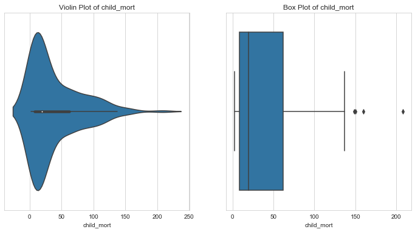

- Notice that half of the countries have a child mortality below 20.
- Further,countries with child mortality less than 1st percentile might not need aid at all. We shall cap their child mortalities to 1st percentile values.
- Countries with extremely high child mortality rate - upper outliers (> 99th percentile) are the perfect candidates for aid. Let's keep them as they are for further analysis.

```python
# Removing countries with lower outliers in `child_mort`
countries.loc[l_condition, column] = countries[column].quantile(0.01)
```

#### Life Expectancy

```python
# LIFE EXPECTANCY
column = 'life_expec'
l_condition, u_condition = outlier_analysis(column)

```

    Quantiles

    +------+--------------+
    |      |   life_expec |
    |------+--------------|
    | 0.1  |        57.82 |
    | 0.25 |        65.3  |
    | 0.5  |        73.1  |
    | 0.75 |        76.8  |
    | 0.99 |        82.37 |
    +------+--------------+
    None


    LOWER OUTLIER THRESHOLD [1st PERCENTILE] FOR life_expec :  47.160000000000004


    Lower Outliers :
    +----+-----------+--------------+
    |    | country   |   life_expec |
    |----+-----------+--------------|
    | 66 | Haiti     |         32.1 |
    | 87 | Lesotho   |         46.5 |
    +----+-----------+--------------+


    UPPER OUTLIER THRESHOLD [99th PERCENTILE] FOR life_expec :  82.37


    Upper Outliers :
    +-----+-----------+--------------+
    |     | country   |   life_expec |
    |-----+-----------+--------------|
    | 133 | Singapore |         82.7 |
    |  77 | Japan     |         82.8 |
    +-----+-----------+--------------+

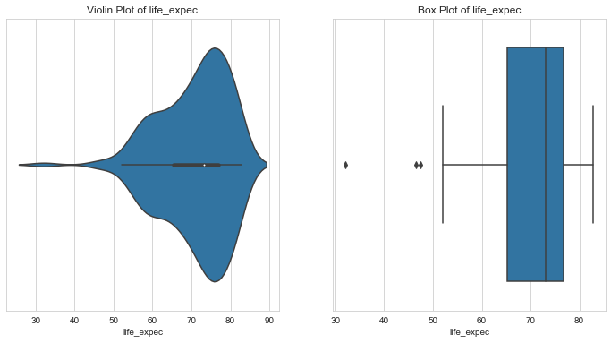

- Some of the lowest life expectancy is seen in Haiti and Lesoto.
- About 50% of the countries have a life expectany of 73 or below and the other 50% have above 73.
- Countries like Singapore and Japan have the highest life expective, better than 99% of the countries.
- Countries with very low life expectancy are possible candidates for aid.
- Hence, let's keep the lower outliers.
- One the other hand, countries like Singapore and Japan might not need aid but these values would skew our analysis. Let's cap these outliers.

```python
# Capping upper outliers in life expectancy
countries.loc[u_condition, column] = countries[column].quantile(0.99)
```

#### Fertility

```python
column = 'total_fer'
l_condition, u_condition = outlier_analysis(column)
```

    Quantiles

    +------+-------------+
    |      |   total_fer |
    |------+-------------|
    | 0.1  |      1.452  |
    | 0.25 |      1.795  |
    | 0.5  |      2.41   |
    | 0.75 |      3.88   |
    | 0.99 |      6.5636 |
    +------+-------------+
    None


    LOWER OUTLIER THRESHOLD [1st PERCENTILE] FOR total_fer :  1.2431999999999999


    Lower Outliers :
    +-----+-------------+-------------+
    |     | country     |   total_fer |
    |-----+-------------+-------------|
    | 133 | Singapore   |        1.15 |
    | 138 | South Korea |        1.23 |
    +-----+-------------+-------------+


    UPPER OUTLIER THRESHOLD [99th PERCENTILE] FOR total_fer :  6.563599999999999


    Upper Outliers :
    +-----+-----------+-------------+
    |     | country   |   total_fer |
    |-----+-----------+-------------|
    |  32 | Chad      |        6.59 |
    | 112 | Niger     |        7.49 |
    +-----+-----------+-------------+

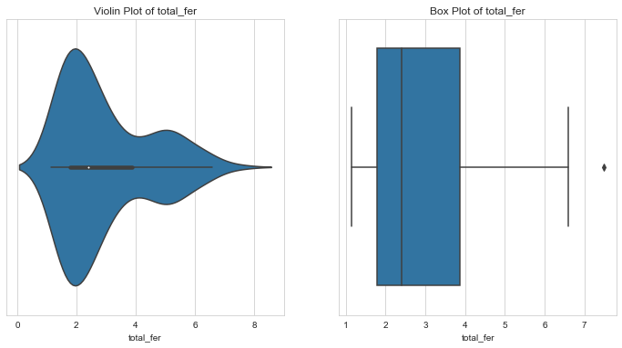

- About 50% of the countries have a fertility of 2.41 or less.
- Lower fertility is seen in developed nations like Singapore and South Korea, where the fertility is less than 99% countries.
- Countries with higher total fertility might need the aid more since this mean more health risk.
- Fertility in Chad and Niger is higher than 99 percent of the countries.
- Since these countries might need the aid, let's leave these values for further analysis.
- Countries with fertility rates less than 1 perecent of the population look like they are developed nations. Let's cap these outlier so that they don't skew our analysis.
- Further, from the violin plot, notice that fertility has two peaks - 2 and 5. This indicates that fertility rate could be used to effectively segregate countries. More analysis is needed here.

```python
# capping lower outliers in fertility
countries.loc[l_condition,column] = countries[column].quantile(.1)
```

#### Health Spending

```python
# health spending per capita
column = 'health'
l_condition, u_condition = outlier_analysis(column)
```

    Quantiles

    +------+-----------+
    |      |    health |
    |------+-----------|
    | 0.1  |   36.5026 |
    | 0.25 |   78.5355 |
    | 0.5  |  321.886  |
    | 0.75 |  976.94   |
    | 0.99 | 8410.33   |
    +------+-----------+
    None


    LOWER OUTLIER THRESHOLD [1st PERCENTILE] FOR health :  17.009362000000003


    Lower Outliers :
    +----+------------+----------+
    |    | country    |   health |
    |----+------------+----------|
    | 50 | Eritrea    |  12.8212 |
    | 93 | Madagascar |  15.5701 |
    +----+------------+----------+


    UPPER OUTLIER THRESHOLD [99th PERCENTILE] FOR health :  8410.3304


    Upper Outliers :
    +-----+---------------+----------+
    |     | country       |   health |
    |-----+---------------+----------|
    | 145 | Switzerland   |   8579   |
    | 159 | United States |   8663.6 |
    +-----+---------------+----------+

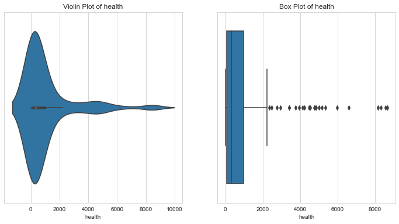

- The countries with more health spending are less in need of aid.
- Like Switzerland and United States, whose health spending is higher than 99% of the countries. But values like these would skew the entire analysis for aid needing countries. Hence, we'd cap these values with the 99th percentile value.
- The countries with less health spending might have variety of reasons like - optimum general health , or bad economic conditions. Let's keep these values for further analysis.

```python
# removing upper outliers in health spending
countries.loc[u_condition,column] = countries[column].quantile(0.99)
```

#### GDP per capita

```python
# GDP per capita
column = 'gdpp'
l_condition, u_condition = outlier_analysis(column)
```

    Quantiles

    +------+---------+
    |      |    gdpp |
    |------+---------|
    | 0.1  |   593.8 |
    | 0.25 |  1330   |
    | 0.5  |  4660   |
    | 0.75 | 14050   |
    | 0.99 | 79088   |
    +------+---------+
    None


    LOWER OUTLIER THRESHOLD [1st PERCENTILE] FOR gdpp :  331.62


    Lower Outliers :
    +----+-----------+--------+
    |    | country   |   gdpp |
    |----+-----------+--------|
    | 26 | Burundi   |    231 |
    | 88 | Liberia   |    327 |
    +----+-----------+--------+


    UPPER OUTLIER THRESHOLD [99th PERCENTILE] FOR gdpp :  79088.00000000004


    Upper Outliers :
    +-----+------------+--------+
    |     | country    |   gdpp |
    |-----+------------+--------|
    | 114 | Norway     |  87800 |
    |  91 | Luxembourg | 105000 |
    +-----+------------+--------+

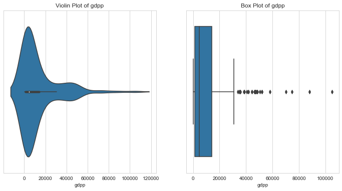

- GDP per capita is a very good indicator of a country's prosperity
- Notice that there are three peaks in the violin plot of GDP. These might indicate the three clusters - under developed, developing and developed nations.
- Under developed nations are the most in need of aid. Countries like Burundi and Libera have GDPs less than 99% of the countries. Even though they are outliers, let's keep them for further analysis.
- But, we could cap GDPs which are greater than GDPs of 99% of the countries (Luxembourg & Norway)

```python
# capping upper outliers in gdpp
countries.loc[u_condition, column] = countries[column].quantile(.99)
```

#### Inflation Index

```python
column = 'inflation'
l_condition, u_condition = outlier_analysis(column)
```

    Quantiles

    +------+-------------+
    |      |   inflation |
    |------+-------------|
    | 0.1  |      0.5878 |
    | 0.25 |      1.81   |
    | 0.5  |      5.39   |
    | 0.75 |     10.75   |
    | 0.99 |     41.478  |
    +------+-------------+
    None


    LOWER OUTLIER THRESHOLD [1st PERCENTILE] FOR inflation :  -2.3487999999999998


    Lower Outliers :
    +-----+------------+-------------+
    |     | country    |   inflation |
    |-----+------------+-------------|
    | 131 | Seychelles |       -4.21 |
    |  73 | Ireland    |       -3.22 |
    +-----+------------+-------------+


    UPPER OUTLIER THRESHOLD [99th PERCENTILE] FOR inflation :  41.47800000000002


    Upper Outliers :
    +-----+-----------+-------------+
    |     | country   |   inflation |
    |-----+-----------+-------------|
    | 163 | Venezuela |        45.9 |
    | 113 | Nigeria   |       104   |
    +-----+-----------+-------------+

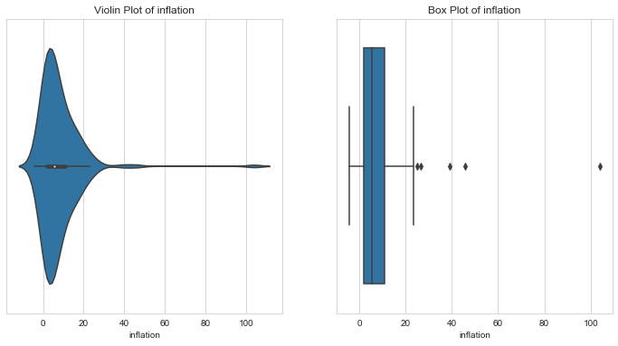

- Very high inflation indicates a bad economic state.
- The violinplot again indicates three peaks - indicating three possible clusters of inflation - each with progressively less countries.
- Countries with very high inflation are might need aid. Since this is our area of interest, let's keep the upper outliers in inflation as they are for further analysis.
- Let's cap lower outliers since these look like good economies with no need of aid.

```python
# capping lower outliers in inflation
countries.loc[l_condition, column] = countries[column].quantile(0.01)
```

#### Net Income per person

```python
# income
column = 'income'
l_condition, u_condition = outlier_analysis(column)
```

    Quantiles

    +------+----------+
    |      |   income |
    |------+----------|
    | 0.1  |     1524 |
    | 0.25 |     3355 |
    | 0.5  |     9960 |
    | 0.75 |    22800 |
    | 0.99 |    84374 |
    +------+----------+
    None


    LOWER OUTLIER THRESHOLD [1st PERCENTILE] FOR income :  742.24


    Lower Outliers :
    +----+------------------+----------+
    |    | country          |   income |
    |----+------------------+----------|
    | 37 | Congo, Dem. Rep. |      609 |
    | 88 | Liberia          |      700 |
    +----+------------------+----------+


    UPPER OUTLIER THRESHOLD [99th PERCENTILE] FOR income :  84374.00000000003


    Upper Outliers :
    +-----+------------+----------+
    |     | country    |   income |
    |-----+------------+----------|
    |  91 | Luxembourg |    91700 |
    | 123 | Qatar      |   125000 |
    +-----+------------+----------+

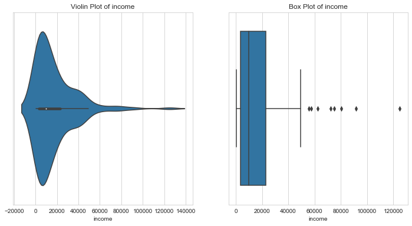

- High net income per person is an indicator of general prosperity of a country. Such countries do not need aid.
- Hence, we shall cap the upper outliers i,e net incomes greater than 99% of that of the other countries.
- Lower outliers, countries with net incomes less than 1% of that of the other countries is our area of interest. Lets leave these values as they are for further analysis.

#### Imports per capita

```python
column = 'imports'
l_condition, u_condition = outlier_analysis(column)
```

    Quantiles

    +------+-----------+
    |      |   imports |
    |------+-----------|
    | 0.1  |   211.006 |
    | 0.25 |   640.215 |
    | 0.5  |  2045.58  |
    | 0.75 |  7719.6   |
    | 0.99 | 55371.4   |
    +------+-----------+
    None


    LOWER OUTLIER THRESHOLD [1st PERCENTILE] FOR imports :  104.90964000000002


    Lower Outliers :
    +-----+-----------+-----------+
    |     | country   |   imports |
    |-----+-----------+-----------|
    | 107 | Myanmar   |  0.651092 |
    |  26 | Burundi   | 90.552    |
    +-----+-----------+-----------+


    UPPER OUTLIER THRESHOLD [99th PERCENTILE] FOR imports :  55371.39000000013


    Upper Outliers :
    +-----+------------+-----------+
    |     | country    |   imports |
    |-----+------------+-----------|
    | 133 | Singapore  |     81084 |
    |  91 | Luxembourg |    149100 |
    +-----+------------+-----------+

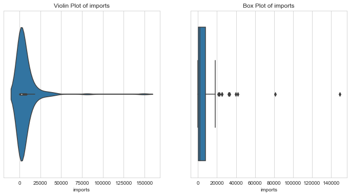

#### Exports per capita

```python
column = 'exports'
l_condition, u_condition = outlier_analysis(column)
```

    Quantiles

    +------+-----------+
    |      |   exports |
    |------+-----------|
    | 0.1  |   110.225 |
    | 0.25 |   447.14  |
    | 0.5  |  1777.44  |
    | 0.75 |  7278     |
    | 0.99 | 64794.3   |
    +------+-----------+
    None


    LOWER OUTLIER THRESHOLD [1st PERCENTILE] FOR exports :  22.243716


    Lower Outliers :
    +-----+-----------+-----------+
    |     | country   |   exports |
    |-----+-----------+-----------|
    | 107 | Myanmar   |   1.07692 |
    |  26 | Burundi   |  20.6052  |
    +-----+-----------+-----------+


    UPPER OUTLIER THRESHOLD [99th PERCENTILE] FOR exports :  64794.26000000014


    Upper Outliers :
    +-----+------------+-----------+
    |     | country    |   exports |
    |-----+------------+-----------|
    | 133 | Singapore  |     93200 |
    |  91 | Luxembourg |    183750 |
    +-----+------------+-----------+

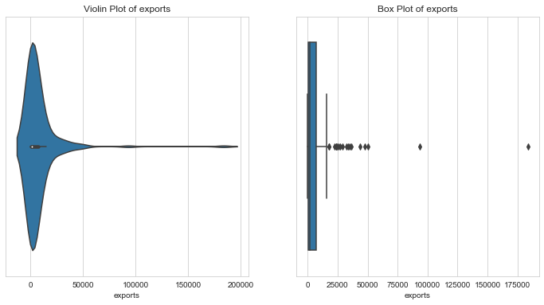

#### Trade Deficit per capita

```python
# trade deficit
countries['trade_deficit'] = countries['imports'] - countries['exports']
column = 'trade_deficit'
l_condition, u_condition = outlier_analysis(column)
```

    Quantiles

    +------+-----------------+
    |      |   trade_deficit |
    |------+-----------------|
    | 0.1  |      -3000.82   |
    | 0.25 |       -327.05   |
    | 0.5  |         89.2182 |
    | 0.75 |        518.57   |
    | 0.99 |       2270.5    |
    +------+-----------------+
    None


    LOWER OUTLIER THRESHOLD [1st PERCENTILE] FOR trade_deficit :  -18426.1


    Lower Outliers :
    +-----+------------+-----------------+
    |     | country    |   trade_deficit |
    |-----+------------+-----------------|
    |  91 | Luxembourg |        -34650   |
    | 123 | Qatar      |        -27065.5 |
    +-----+------------+-----------------+


    UPPER OUTLIER THRESHOLD [99th PERCENTILE] FOR trade_deficit :  2270.500000000002


    Upper Outliers :
    +----+-----------+-----------------+
    |    | country   |   trade_deficit |
    |----+-----------+-----------------|
    | 60 | Greece    |          2313.4 |
    | 10 | Bahamas   |          2436   |
    +----+-----------+-----------------+

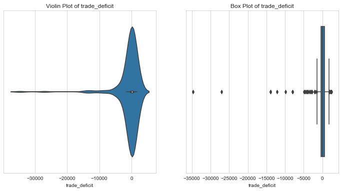

- Trade deficit indicates the balance between exports and imports. Negative trade deficit is favourable indicator of economic health. It means that the country has higher exports compared to imports.
- When the trade deficit is negative, it means that the country is import predominant.
- From the above plot, Greece and Bahamas have a trade deficit higher than 99% of the countries. This could mean a bad economic state. Since this is our key area of interest, we could leave these outliers as they are.
- Countries with negative trade deficit , i.e export predominant countries could be capped to 1st percentile values.

```python
# capping lower outliers of trade_deficit
countries.loc[l_condition,column] = countries[column].quantile(0.01)
```

### Bivariate Analysis

#### Pairplot

```python
# Pair Plots of all variables
sns.pairplot(countries[['child_mort', 'exports', 'health', 'imports', 'income',
       'inflation', 'life_expec', 'total_fer', 'gdpp']]);
```

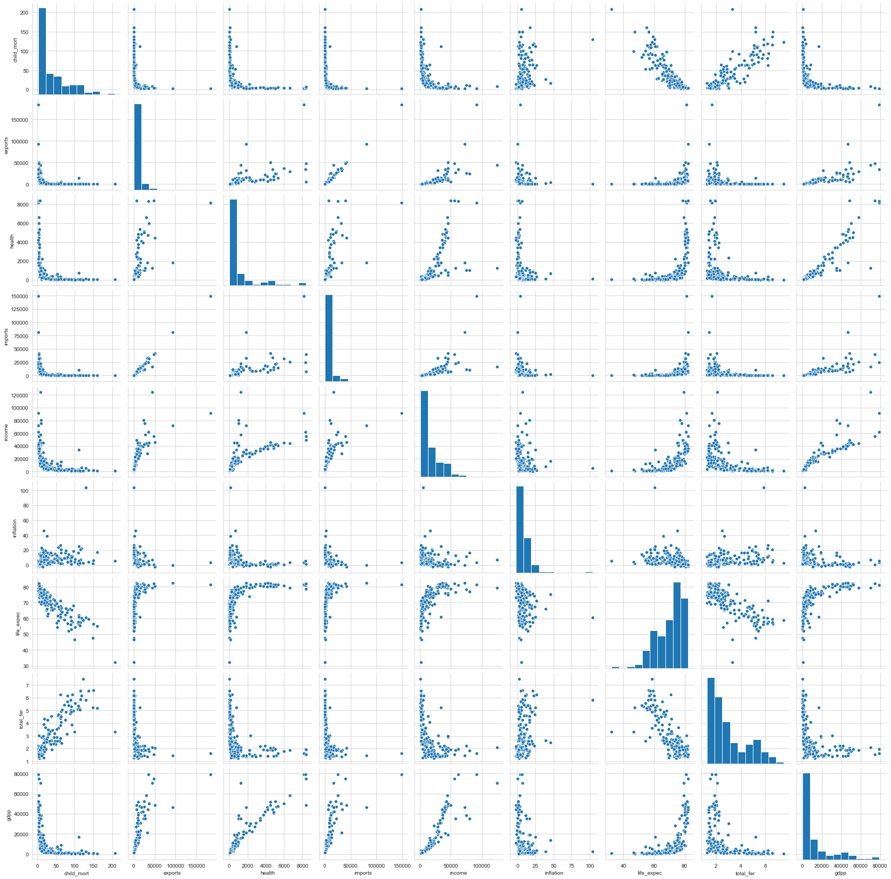

```python
## bivariate analysis boken function
def bivariate_analysis(x_var,y_var,dataframe=countries) :
    # Bivariate Plots with tooltips : country,x,y

    dataframe = dataframe.copy()
    source =ColumnDataSource(dataframe)

    # pallete = ["rgba(38, 70, 83, 1)", 'rgba(42, 157, 143, 1)', "rgba(233, 196, 106, 1)", "rgba(244, 162, 97, 1)", "rgba(231, 111, 81, 1)", '#009cc7']
    pallete = ["#9b59b6", "#3498db", "#95a5a6", "#e74c3c", "#34495e","#38895e",'rgba(42, 157, 143, 1)']

    # tooltips
    tooltips1 = [
    ("Country", "@country"),
    (x_var,'@'+x_var),
    (y_var,'@'+y_var)
    ]

    p = figure(plot_width=420, plot_height=400,title='Scatter Plot : '+ x_var+' vs '+y_var, tooltips=tooltips1)

    p.scatter(x=x_var,y=y_var, fill_alpha=0.6, size=8, source=source, fill_color = "#3498db")
    p.xaxis.axis_label = x_var
    p.yaxis.axis_label = y_var
    reset_output()
    output_notebook()
    show(p)
```

#### Child Mortality vs Life Expectancy

```python
# CHILD MORTALITY vs LIFE EXPECTANCY

x='child_mort'
y = 'life_expec'
bivariate_analysis(x,y)
```

<div class="bk-root">
    <a href="https://bokeh.org" target="_blank" class="bk-logo bk-logo-small bk-logo-notebook"></a>
    <span id="4280">Loading BokehJS ...</span>
</div>

<div class="bk-root" id="d0c539bb-95bd-4e33-9e81-fb0c9e227383" data-root-id="4239"></div>

- looks like `child_mort` and `life_expec` are almost linearly related.
- Life expectancy decreases as child mortality increases.
- One of these features is enough for analysis.

```python
# Countries with high child mortality and low life expectancy
life_expect_cond = countries['life_expec'] < 60
child_mort_cond = countries['child_mort'] > 100

print('Countries with low life expectancy and low Child Mortality Rate')
tab(countries[life_expect_cond & child_mort_cond][['country','child_mort','life_expec']].sort_values(by=['child_mort','life_expec'], ascending=[False,True])[:10])
```

    Countries with low life expectancy and low Child Mortality Rate
    +-----+--------------------------+--------------+--------------+
    |     | country                  |   child_mort |   life_expec |
    |-----+--------------------------+--------------+--------------|
    |  66 | Haiti                    |          208 |         32.1 |
    | 132 | Sierra Leone             |          160 |         55   |
    |  32 | Chad                     |          150 |         56.5 |
    |  31 | Central African Republic |          149 |         47.5 |
    |  97 | Mali                     |          137 |         59.5 |
    | 112 | Niger                    |          123 |         58.8 |
    |  37 | Congo, Dem. Rep.         |          116 |         57.5 |
    |  25 | Burkina Faso             |          116 |         57.9 |
    |  64 | Guinea-Bissau            |          114 |         55.6 |
    |  40 | Cote d'Ivoire            |          111 |         56.3 |
    +-----+--------------------------+--------------+--------------+

#### Child Mortality vs Total Fertility

```python
# CHILD MORTALITY vs TOTAL FERTILITY

x='child_mort'
y = 'total_fer'
bivariate_analysis(x,y)
```

<div class="bk-root">
    <a href="https://bokeh.org" target="_blank" class="bk-logo bk-logo-small bk-logo-notebook"></a>
    <span id="4379">Loading BokehJS ...</span>
</div>

<div class="bk-root" id="39efd891-a25e-4778-b4c8-8042c7cab935" data-root-id="4338"></div>

```python
# countries with high fertility and child mortality rate
total_fer_cond = countries['total_fer'] > 6
child_mort_cond = countries['child_mort'] > 100

print('Countries with High Total Fertility and Child Mortality Rate')
tab(countries[total_fer_cond & child_mort_cond][['country','total_fer','child_mort']].sort_values(by=['child_mort','total_fer'], ascending=[False,False]))
```

    Countries with High Total Fertility and Child Mortality Rate
    +-----+------------------+-------------+--------------+
    |     | country          |   total_fer |   child_mort |
    |-----+------------------+-------------+--------------|
    |  32 | Chad             |        6.59 |          150 |
    |  97 | Mali             |        6.55 |          137 |
    | 112 | Niger            |        7.49 |          123 |
    |   3 | Angola           |        6.16 |          119 |
    |  37 | Congo, Dem. Rep. |        6.54 |          116 |
    +-----+------------------+-------------+--------------+

```python
# Fertility in countries with extremely high mortality rate
child_mort_cond = countries['child_mort'] > 150

print('Countries with High Total Fertility and Child Mortality Rate')
tab(countries[child_mort_cond][['country','total_fer','child_mort']].sort_values(by=['child_mort','total_fer'], ascending=[False,False]))
```

    Countries with High Total Fertility and Child Mortality Rate
    +-----+--------------+-------------+--------------+
    |     | country      |   total_fer |   child_mort |
    |-----+--------------+-------------+--------------|
    |  66 | Haiti        |        3.33 |          208 |
    | 132 | Sierra Leone |        5.2  |          160 |
    +-----+--------------+-------------+--------------+

#### GDP per capita vs Health Spending

```python
# GDP per capita vs Health Spending
y='health'
x= 'gdpp'
bivariate_analysis(x,y)
```

<div class="bk-root">
    <a href="https://bokeh.org" target="_blank" class="bk-logo bk-logo-small bk-logo-notebook"></a>
    <span id="4478">Loading BokehJS ...</span>
</div>

<div class="bk-root" id="53b689bf-fa82-4a92-8ef8-01f341984175" data-root-id="4437"></div>

```python
# Countries with Low GDPP and health spending might need aid
health_cond = countries['health'] < 200
gdpp_cond = countries['gdpp'] < 2500
print('Countries with Low GDP and low Health Spending')
tab(countries[health_cond & gdpp_cond][['country','health','gdpp']].sort_values(by=['health','gdpp'], ascending=[True,True])[:10])

```

    Countries with Low GDP and low Health Spending
    +-----+--------------------------+----------+--------+
    |     | country                  |   health |   gdpp |
    |-----+--------------------------+----------+--------|
    |  50 | Eritrea                  |  12.8212 |    482 |
    |  93 | Madagascar               |  15.5701 |    413 |
    |  31 | Central African Republic |  17.7508 |    446 |
    | 112 | Niger                    |  17.9568 |    348 |
    | 107 | Myanmar                  |  19.4636 |    988 |
    | 106 | Mozambique               |  21.8299 |    419 |
    | 116 | Pakistan                 |  22.88   |   1040 |
    |  37 | Congo, Dem. Rep.         |  26.4194 |    334 |
    |  12 | Bangladesh               |  26.6816 |    758 |
    |  26 | Burundi                  |  26.796  |    231 |
    +-----+--------------------------+----------+--------+

#### Imports vs GDP per capita

```python
# IMPORTS vs GDPP
y='imports'
x= 'gdpp'
bivariate_analysis(x,y)
```

<div class="bk-root">
    <a href="https://bokeh.org" target="_blank" class="bk-logo bk-logo-small bk-logo-notebook"></a>
    <span id="4577">Loading BokehJS ...</span>
</div>

<div class="bk-root" id="153e9dda-2f3e-4732-90c2-5d75f56d27e2" data-root-id="4536"></div>

#### Exports vs GDP per capita

```python
# Exports vs GDPP
y='exports'
x= 'gdpp'
bivariate_analysis(x,y)
```

<div class="bk-root">
    <a href="https://bokeh.org" target="_blank" class="bk-logo bk-logo-small bk-logo-notebook"></a>
    <span id="4676">Loading BokehJS ...</span>
</div>

<div class="bk-root" id="cfb65052-59bc-4ecc-85e8-822e41dce171" data-root-id="4635"></div>

#### GDP per capita vs Trade Deficit

```python
y='trade_deficit'
x= 'gdpp'
bivariate_analysis(x,y)
```

<div class="bk-root">
    <a href="https://bokeh.org" target="_blank" class="bk-logo bk-logo-small bk-logo-notebook"></a>
    <span id="4775">Loading BokehJS ...</span>
</div>

<div class="bk-root" id="863e4a7b-5b64-4ab8-ae39-88deb1251c1e" data-root-id="4734"></div>

- Trade deficit is a country's net imports minus exports.
- It indicates the dependence of a country on imports
- Countries with low GDP per capita and positive trade deficit are likely to require aid
- From the above plot, one can see that there are many such countries

```python
# Countries with positive high trade deficit and low GDP per capita
tr_deficit_cond = countries['trade_deficit'] > 1000
gdpp_cond = countries['gdpp'] < 10000
print('Countries with high Trade Deficit and Low GDP')
tab(countries[tr_deficit_cond & gdpp_cond][['country','gdpp','trade_deficit']].sort_values(by=['trade_deficit','gdpp'], ascending=[True,False])[:10])
```

    Countries with high Trade Deficit and Low GDP
    +-----+--------------------------------+--------+-----------------+
    |     | country                        |   gdpp |   trade_deficit |
    |-----+--------------------------------+--------+-----------------|
    | 101 | Micronesia, Fed. Sts.          |   2860 |         1644.5  |
    | 151 | Tonga                          |   3550 |         1700.45 |
    | 104 | Montenegro                     |   6680 |         1716.76 |
    |  61 | Grenada                        |   7370 |         1871.98 |
    | 141 | St. Vincent and the Grenadines |   6230 |         1881.46 |
    |  86 | Lebanon                        |   8860 |         2161.84 |
    +-----+--------------------------------+--------+-----------------+

#### Net Income per person vs Inflation

```python
# Income vs Inflation
x = 'inflation'
y = 'income'
bivariate_analysis(x,y)
```

<div class="bk-root">
    <a href="https://bokeh.org" target="_blank" class="bk-logo bk-logo-small bk-logo-notebook"></a>
    <span id="4874">Loading BokehJS ...</span>
</div>

<div class="bk-root" id="149b40e8-9af2-402c-a856-2c434fd30081" data-root-id="4833"></div>

```python
# Low Income - High inflation countries might require aid
inflation_cond = countries['inflation'] > 20
income_condition = countries['income'] < 10000
print('Countries with high inflation and low income')
tab(countries[inflation_cond & income_condition][['country','inflation','income']].sort_values(by=['inflation','income'], ascending=[False, True]))
```

    Countries with high inflation and low income
    +-----+------------------+-------------+----------+
    |     | country          |   inflation |   income |
    |-----+------------------+-------------+----------|
    | 113 | Nigeria          |       104   |     5150 |
    | 103 | Mongolia         |        39.2 |     7710 |
    | 149 | Timor-Leste      |        26.5 |     1850 |
    | 165 | Yemen            |        23.6 |     4480 |
    | 140 | Sri Lanka        |        22.8 |     8560 |
    |   3 | Angola           |        22.4 |     5900 |
    |  37 | Congo, Dem. Rep. |        20.8 |      609 |
    |  38 | Congo, Rep.      |        20.7 |     5190 |
    +-----+------------------+-------------+----------+

- Countries with High inflation and low income are possible candidates for aid requirement.

#### GDP per capita vs Inflation

```python
x = 'gdpp'
y = 'inflation'
bivariate_analysis(x,y)
```

<div class="bk-root">
    <a href="https://bokeh.org" target="_blank" class="bk-logo bk-logo-small bk-logo-notebook"></a>
    <span id="4973">Loading BokehJS ...</span>
</div>

<div class="bk-root" id="944d651b-0ce8-4668-bc64-4ec6a259bc95" data-root-id="4932"></div>

- Countries with low GDP percapita and high Inflation are in dire need of support.
- For example, Nigeria has an inflation > 100 while its GDP is 2330.

### Correlation Analysis

```python
plt.figure(figsize=[12,12])
sns.heatmap(countries.corr(),annot=True,cmap='YlGnBu', center=0)
```

    <matplotlib.axes._subplots.AxesSubplot at 0x7fe87cdf8510>

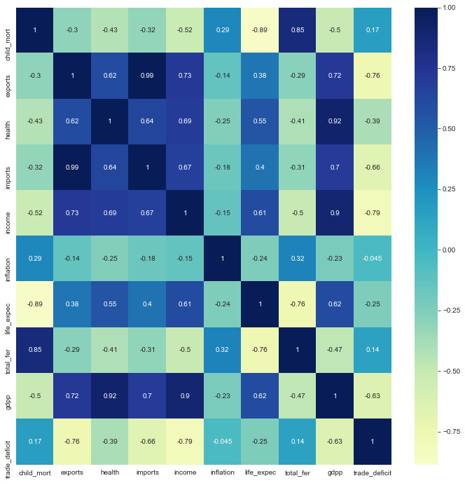

**Top Correlations**

- Negative Correlation between `life_expec` and `child_mort`
- Positive Correlation between `total_fer` and `child_mort`

Although clustering analysis is not affected by multicollinearity, this plot shows us the possible linear relationships between different features to help with results obtained from cluster analysis.

## Hopkin's Statistic

```python
# hopkins test function
from sklearn.neighbors import NearestNeighbors
from random import sample
from numpy.random import uniform
from math import isnan

def hopkins(X):
    d = X.shape[1]
    #d = len(vars) # columns
    n = len(X) # rows
    m = int(0.1 * n)
    nbrs = NearestNeighbors(n_neighbors=1).fit(X.values)

    rand_X = sample(range(0, n, 1), m)

    ujd = []
    wjd = []
    for j in range(0, m):
        u_dist, _ = nbrs.kneighbors(uniform(np.amin(X,axis=0),np.amax(X,axis=0),d).reshape(1, -1), 2, return_distance=True)
        ujd.append(u_dist[0][1])
        w_dist, _ = nbrs.kneighbors(X.iloc[rand_X[j]].values.reshape(1, -1), 2, return_distance=True)
        wjd.append(w_dist[0][1])

    H = sum(ujd) / (sum(ujd) + sum(wjd))
    if isnan(H):
        print(ujd, wjd)
        H = 0

    return H

```

```python
## Data used for Clustering
columns_for_clustering = ['child_mort', 'exports', 'health', 'imports', 'income',
       'inflation', 'life_expec', 'total_fer', 'gdpp', 'trade_deficit']
clustering_data = countries[columns_for_clustering].copy()
```

```python
# Hopkin's test
n = 10
hopkins_statistic = []
for i in range(n) :
    hopkins_statistic.append(hopkins(clustering_data))
print('Min Hopkin\'s Statistic in ',n,'iterations :', min(hopkins_statistic))
print('Max Hopkin\'s Statistic in ',n,'iterations :', max(hopkins_statistic))
print('Mean Hopkin\'s Statistic in ',n,'iterations :', np.mean(hopkins_statistic))
print('Std deviation of Hopkin\'s Statistic in ',n,'iterations :', np.std(hopkins_statistic))
```

    Min Hopkin's Statistic in  10 iterations : 0.8594851780754723
    Max Hopkin's Statistic in  10 iterations : 0.9789539440735269
    Mean Hopkin's Statistic in  10 iterations : 0.9482587172561626
    Std deviation of Hopkin's Statistic in  10 iterations : 0.03487962411406433

**Since hopkin's statistic is greater than 80% , the data shows good clustering tendency**

## Standardizing Values

```python
from sklearn.preprocessing import StandardScaler
scaler = StandardScaler()
clustering_data[columns_for_clustering] = scaler.fit_transform(clustering_data[columns_for_clustering])

tab(clustering_data.describe())


```

    +-------+---------------+--------------+---------------+---------------+---------------+---------------+--------------+---------------+---------------+-----------------+
    |       |    child_mort |      exports |        health |       imports |        income |     inflation |   life_expec |     total_fer |          gdpp |   trade_deficit |
    |-------+---------------+--------------+---------------+---------------+---------------+---------------+--------------+---------------+---------------+-----------------|
    | count | 167           | 167          | 167           | 167           | 167           | 167           | 167          | 167           | 167           |   167           |
    | mean  |  -7.97765e-18 |   9.1743e-17 |   2.26033e-17 |   4.65363e-17 |  -7.51229e-17 |   8.31005e-17 |   3.7229e-17 |   8.24357e-17 |   8.04413e-17 |     6.18268e-17 |
    | std   |   1.00301     |   1.00301    |   1.00301     |   1.00301     |   1.00301     |   1.00301     |   1.00301    |   1.00301     |   1.00301     |     1.00301     |
    | min   |  -0.882217    |  -0.414037   |  -0.583254    |  -0.44916     |  -0.860326    |  -0.964355    |  -4.33969    |  -1.12962     |  -0.720789    |    -5.67561     |
    | 25%   |  -0.746668    |  -0.389145   |  -0.546449    |  -0.405554    |  -0.717456    |  -0.569109    |  -0.592657   |  -0.767708    |  -0.657548    |     0.113986    |
    | 50%   |  -0.47184     |  -0.31491    |  -0.410154    |  -0.309734    |  -0.373808    |  -0.228871    |   0.287671   |  -0.359318    |  -0.465925    |     0.247143    |
    | 75%   |   0.592652    |  -0.00795865 |  -0.0432751   |   0.0771304   |   0.294237    |   0.280535    |   0.705262   |   0.616834    |   0.0744147   |     0.384486    |
    | max   |   4.22138     |   9.83981    |   4.11998     |   9.71668     |   5.61154     |   9.14287     |   1.33391    |   3.01405     |   3.81697     |     0.997842    |
    +-------+---------------+--------------+---------------+---------------+---------------+---------------+--------------+---------------+---------------+-----------------+

## K-Means Clustering

### Finding Optimal Number of Clusters

#### Elbow curve

```python
# Plotting Elbow curve of Sum of Squared distances of points in each cluster from the centroid of the nearest cluster.
ssd = []
range_n_clusters = np.arange(2,9)
for num_clusters in range_n_clusters :
    kmeans = KMeans(n_clusters=num_clusters)
    kmeans.fit(clustering_data)
    ssd.append(kmeans.inertia_)
plt.plot(range_n_clusters,ssd)
plt.title('Elbow Curve');
plt.xlabel('No of clusters');
plt.ylabel('SSD');
```

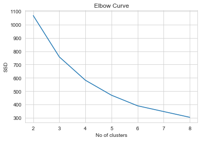

- From the above Elbow curve, one can clearly see that there is a high gradient descent from k=2 to k=4 and then the curve tapers (Change in slope is not as SIGNIFICANT as earlier)
- Hence, k=4 is optimum no of clusters, statistically.

#### Sihoutte Analysis

```python
from sklearn.metrics import silhouette_score

no_of_clusters = np.arange(2,10)
score = []

for n_cluster in no_of_clusters :
    kmeans = KMeans(n_clusters=n_cluster, init='k-means++')
    kmeans = kmeans.fit(clustering_data)
    labels = kmeans.labels_
    score.append(silhouette_score(clustering_data,labels))


plt.title('Silhouette Analysis Plot')
plt.xlabel('No of Clusters')
plt.ylabel('Silhouette Score')
plt.plot(no_of_clusters, score);
print(score)

```

    [0.46329893684299267, 0.40889975765795494, 0.4113959420115351, 0.40485071262968453, 0.41404360987563693, 0.31039501753497534, 0.302668856614785, 0.30746584335288263]

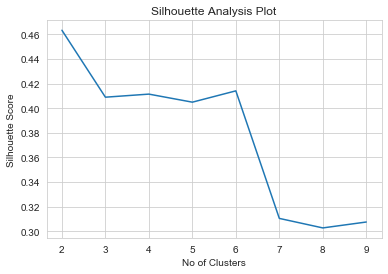

- Higher the silhouette score the better
- However , from the above plot, we see silhouette score is the highest for k = 2, sharply falls at 3 and there's a local maximum at k=4
- k = 4 seems to be the optimum no of clusters

### Final k - Means Clustering

```python
# k - means clustering algo with k = 4
n_cluster = 4
kmeans = KMeans(n_clusters=n_cluster, init='k-means++', random_state = 100)
kmeans = kmeans.fit(clustering_data)
labels = kmeans.labels_
countries['k_means_cluster_id'] = labels
```

```python
# Countries in each Cluster - k means
for cluster_no in range(n_cluster) :
    condition = countries['k_means_cluster_id'] == cluster_no
    print( 'CLUSTER #',cluster_no,'\n',countries.loc[condition,'country'].values,'\n\n')
```

    CLUSTER # 0
     ['Australia' 'Austria' 'Belgium' 'Brunei' 'Canada' 'Cyprus' 'Denmark'
     'Finland' 'France' 'Germany' 'Greece' 'Iceland' 'Ireland' 'Israel'
     'Italy' 'Japan' 'Kuwait' 'Malta' 'Netherlands' 'New Zealand' 'Norway'
     'Slovenia' 'Spain' 'Sweden' 'Switzerland' 'United Arab Emirates'
     'United Kingdom' 'United States']


    CLUSTER # 1
     ['Afghanistan' 'Angola' 'Benin' 'Botswana' 'Burkina Faso' 'Burundi'
     'Cameroon' 'Central African Republic' 'Chad' 'Comoros' 'Congo, Dem. Rep.'
     'Congo, Rep.' "Cote d'Ivoire" 'Equatorial Guinea' 'Eritrea' 'Gabon'
     'Gambia' 'Ghana' 'Guinea' 'Guinea-Bissau' 'Haiti' 'Iraq' 'Kenya'
     'Kiribati' 'Lao' 'Lesotho' 'Liberia' 'Madagascar' 'Malawi' 'Mali'
     'Mauritania' 'Mozambique' 'Namibia' 'Niger' 'Nigeria' 'Pakistan' 'Rwanda'
     'Senegal' 'Sierra Leone' 'Solomon Islands' 'South Africa' 'Sudan'
     'Tanzania' 'Timor-Leste' 'Togo' 'Uganda' 'Yemen' 'Zambia']


    CLUSTER # 2
     ['Albania' 'Algeria' 'Antigua and Barbuda' 'Argentina' 'Armenia'
     'Azerbaijan' 'Bahamas' 'Bahrain' 'Bangladesh' 'Barbados' 'Belarus'
     'Belize' 'Bhutan' 'Bolivia' 'Bosnia and Herzegovina' 'Brazil' 'Bulgaria'
     'Cambodia' 'Cape Verde' 'Chile' 'China' 'Colombia' 'Costa Rica' 'Croatia'
     'Czech Republic' 'Dominican Republic' 'Ecuador' 'Egypt' 'El Salvador'
     'Estonia' 'Fiji' 'Georgia' 'Grenada' 'Guatemala' 'Guyana' 'Hungary'
     'India' 'Indonesia' 'Iran' 'Jamaica' 'Jordan' 'Kazakhstan'
     'Kyrgyz Republic' 'Latvia' 'Lebanon' 'Libya' 'Lithuania' 'Macedonia, FYR'
     'Malaysia' 'Maldives' 'Mauritius' 'Micronesia, Fed. Sts.' 'Moldova'
     'Mongolia' 'Montenegro' 'Morocco' 'Myanmar' 'Nepal' 'Oman' 'Panama'
     'Paraguay' 'Peru' 'Philippines' 'Poland' 'Portugal' 'Romania' 'Russia'
     'Samoa' 'Saudi Arabia' 'Serbia' 'Seychelles' 'Slovak Republic'
     'South Korea' 'Sri Lanka' 'St. Vincent and the Grenadines' 'Suriname'
     'Tajikistan' 'Thailand' 'Tonga' 'Tunisia' 'Turkey' 'Turkmenistan'
     'Ukraine' 'Uruguay' 'Uzbekistan' 'Vanuatu' 'Venezuela' 'Vietnam']


    CLUSTER # 3
     ['Luxembourg' 'Qatar' 'Singapore']

## Hierarchical Clustering

### HAC : Single Linkage, Euclidean Measure

```python
# Agglomerative Single Linkage
mergings = linkage(clustering_data,method='single',metric='euclidean')
plt.figure(figsize=[16,10])
plt.title('Single Linkage - Hierarchical Clustering')
dendrogram(mergings);
```

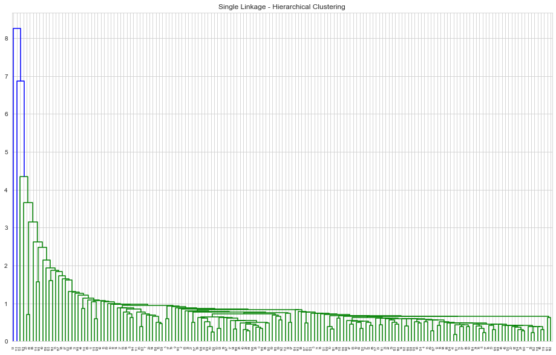

### HAC : Complete Linkage, Euclidean Measure

```python
# Complete Linkage
mergings = linkage(clustering_data,method='complete',metric='euclidean')
plt.figure(figsize=[16,10])
plt.title('Complete Linkage - Hierarchical Clustering')
dendrogram(mergings);
```

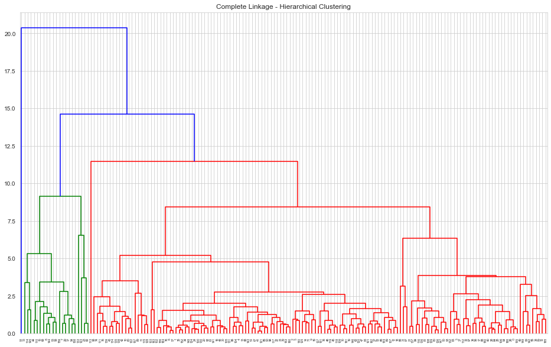

- Hierarchical clustering with complete linkage has a more discriminative dendrogram

```python
# Using Complete Linkage, cutting the tree for 6 clusters
n_clusters = 6
cluster_labels = cut_tree(mergings, n_clusters=n_clusters)
countries['hac_complete_cluster_id'] = cluster_labels
```

```python
# Countries in each Cluster - Hierarchical - Complete Linkage
for cluster_no in range(n_clusters) :
    condition = countries['hac_complete_cluster_id'] == cluster_no
    print( 'CLUSTER #',cluster_no,'\n',countries.loc[condition,'country'].values,'\n\n')
```

    CLUSTER # 0
     ['Afghanistan' 'Angola' 'Benin' 'Botswana' 'Burkina Faso' 'Burundi'
     'Cameroon' 'Central African Republic' 'Chad' 'Comoros' 'Congo, Dem. Rep.'
     'Congo, Rep.' "Cote d'Ivoire" 'Equatorial Guinea' 'Eritrea' 'Gabon'
     'Gambia' 'Ghana' 'Guinea' 'Guinea-Bissau' 'Haiti' 'Iraq' 'Kenya'
     'Kiribati' 'Lao' 'Lesotho' 'Liberia' 'Madagascar' 'Malawi' 'Mali'
     'Mauritania' 'Mozambique' 'Namibia' 'Niger' 'Pakistan' 'Rwanda' 'Senegal'
     'Sierra Leone' 'Solomon Islands' 'South Africa' 'Sudan' 'Tanzania'
     'Timor-Leste' 'Togo' 'Uganda' 'Yemen' 'Zambia']


    CLUSTER # 1
     ['Albania' 'Algeria' 'Antigua and Barbuda' 'Argentina' 'Armenia'
     'Azerbaijan' 'Bahamas' 'Bahrain' 'Bangladesh' 'Barbados' 'Belarus'
     'Belize' 'Bhutan' 'Bolivia' 'Bosnia and Herzegovina' 'Brazil' 'Bulgaria'
     'Cambodia' 'Cape Verde' 'Chile' 'China' 'Colombia' 'Costa Rica' 'Croatia'
     'Cyprus' 'Czech Republic' 'Dominican Republic' 'Ecuador' 'Egypt'
     'El Salvador' 'Estonia' 'Fiji' 'Georgia' 'Greece' 'Grenada' 'Guatemala'
     'Guyana' 'Hungary' 'India' 'Indonesia' 'Iran' 'Israel' 'Italy' 'Jamaica'
     'Jordan' 'Kazakhstan' 'Kyrgyz Republic' 'Latvia' 'Lebanon' 'Libya'
     'Lithuania' 'Macedonia, FYR' 'Malaysia' 'Maldives' 'Malta' 'Mauritius'
     'Micronesia, Fed. Sts.' 'Moldova' 'Mongolia' 'Montenegro' 'Morocco'
     'Myanmar' 'Nepal' 'New Zealand' 'Oman' 'Panama' 'Paraguay' 'Peru'
     'Philippines' 'Poland' 'Portugal' 'Romania' 'Russia' 'Samoa'
     'Saudi Arabia' 'Serbia' 'Seychelles' 'Slovak Republic' 'Slovenia'
     'South Korea' 'Spain' 'Sri Lanka' 'St. Vincent and the Grenadines'
     'Suriname' 'Tajikistan' 'Thailand' 'Tonga' 'Tunisia' 'Turkey'
     'Turkmenistan' 'Ukraine' 'United Arab Emirates' 'Uruguay' 'Uzbekistan'
     'Vanuatu' 'Venezuela' 'Vietnam']


    CLUSTER # 2
     ['Australia' 'Austria' 'Belgium' 'Canada' 'Denmark' 'Finland' 'France'
     'Germany' 'Iceland' 'Ireland' 'Japan' 'Netherlands' 'Norway' 'Sweden'
     'Switzerland' 'United Kingdom' 'United States']


    CLUSTER # 3
     ['Brunei' 'Kuwait' 'Qatar' 'Singapore']


    CLUSTER # 4
     ['Luxembourg']


    CLUSTER # 5
     ['Nigeria']

### HAC : Average Linkage, Euclidean Measure

```python
# Average Linkage
mergings = linkage(clustering_data,method='average',metric='euclidean')
plt.figure(figsize=[16,10])
plt.title('Average Linkage - Hierarchical Clustering')
dendrogram(mergings);
```

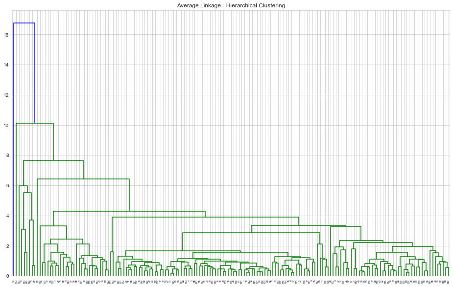

```python
# Using Average Linkage, cutting the tree for 6 clusters
n_clusters = 6
cluster_labels = cut_tree(mergings, n_clusters=n_clusters)
countries['hac_average_cluster_id'] = cluster_labels
```

```python
# Countries in each Cluster - Hierarchical - average Linkage
for cluster_no in range(n_clusters) :
    condition = countries['hac_average_cluster_id'] == cluster_no
    print( 'CLUSTER #',cluster_no,'\n',countries.loc[condition,'country'].values,'\n\n')
```

    CLUSTER # 0
     ['Afghanistan' 'Albania' 'Algeria' 'Angola' 'Antigua and Barbuda'
     'Argentina' 'Armenia' 'Australia' 'Austria' 'Azerbaijan' 'Bahamas'
     'Bahrain' 'Bangladesh' 'Barbados' 'Belarus' 'Belgium' 'Belize' 'Benin'
     'Bhutan' 'Bolivia' 'Bosnia and Herzegovina' 'Botswana' 'Brazil'
     'Bulgaria' 'Burkina Faso' 'Burundi' 'Cambodia' 'Cameroon' 'Canada'
     'Cape Verde' 'Central African Republic' 'Chad' 'Chile' 'China' 'Colombia'
     'Comoros' 'Congo, Dem. Rep.' 'Congo, Rep.' 'Costa Rica' "Cote d'Ivoire"
     'Croatia' 'Cyprus' 'Czech Republic' 'Denmark' 'Dominican Republic'
     'Ecuador' 'Egypt' 'El Salvador' 'Equatorial Guinea' 'Eritrea' 'Estonia'
     'Fiji' 'Finland' 'France' 'Gabon' 'Gambia' 'Georgia' 'Germany' 'Ghana'
     'Greece' 'Grenada' 'Guatemala' 'Guinea' 'Guinea-Bissau' 'Guyana'
     'Hungary' 'Iceland' 'India' 'Indonesia' 'Iran' 'Iraq' 'Israel' 'Italy'
     'Jamaica' 'Japan' 'Jordan' 'Kazakhstan' 'Kenya' 'Kiribati'
     'Kyrgyz Republic' 'Lao' 'Latvia' 'Lebanon' 'Lesotho' 'Liberia' 'Libya'
     'Lithuania' 'Macedonia, FYR' 'Madagascar' 'Malawi' 'Malaysia' 'Maldives'
     'Mali' 'Malta' 'Mauritania' 'Mauritius' 'Micronesia, Fed. Sts.' 'Moldova'
     'Mongolia' 'Montenegro' 'Morocco' 'Mozambique' 'Myanmar' 'Namibia'
     'Nepal' 'Netherlands' 'New Zealand' 'Niger' 'Oman' 'Pakistan' 'Panama'
     'Paraguay' 'Peru' 'Philippines' 'Poland' 'Portugal' 'Romania' 'Russia'
     'Rwanda' 'Samoa' 'Saudi Arabia' 'Senegal' 'Serbia' 'Seychelles'
     'Sierra Leone' 'Slovak Republic' 'Slovenia' 'Solomon Islands'
     'South Africa' 'South Korea' 'Spain' 'Sri Lanka'
     'St. Vincent and the Grenadines' 'Sudan' 'Suriname' 'Sweden' 'Tajikistan'
     'Tanzania' 'Thailand' 'Timor-Leste' 'Togo' 'Tonga' 'Tunisia' 'Turkey'
     'Turkmenistan' 'Uganda' 'Ukraine' 'United Arab Emirates' 'United Kingdom'
     'United States' 'Uruguay' 'Uzbekistan' 'Vanuatu' 'Venezuela' 'Vietnam'
     'Yemen' 'Zambia']


    CLUSTER # 1
     ['Brunei' 'Ireland' 'Kuwait' 'Norway' 'Qatar' 'Switzerland']


    CLUSTER # 2
     ['Haiti']


    CLUSTER # 3
     ['Luxembourg']


    CLUSTER # 4
     ['Nigeria']


    CLUSTER # 5
     ['Singapore']

### HAC : Complete Linkage , Correlation Measure

```python
## HAC Clustering : Dissimilarity Measure : Correlation
hac_correlation_mergings = linkage(clustering_data,method='complete', metric='correlation')
plt.figure(figsize=[12,12])
plt.title('Hierarchical Clustering : Complete Linkage, Correlation Measure')
dendrogram(hac_correlation_mergings);
```

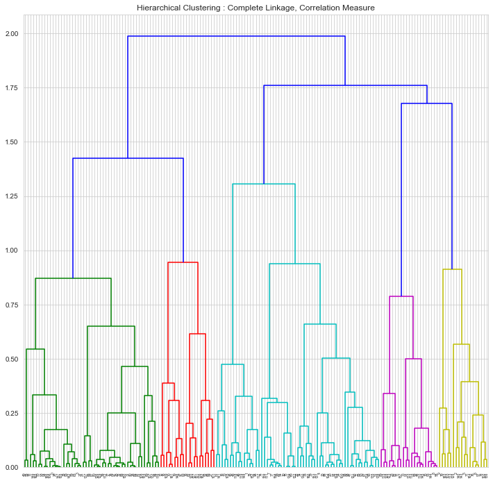

```python
n_clusters = 6
labels = cut_tree(hac_correlation_mergings, n_clusters=n_clusters)
countries['hac_correlation_cluster_id'] = labels
```

```python
# HAC clustering : Correlation measure : complete distance : Countries in each cluster

for cluster_no in range(n_clusters) :
    condition = countries['hac_correlation_cluster_id'] == cluster_no
    print( 'CLUSTER #',cluster_no,'\n',countries.loc[condition,'country'].values,'\n\n')
```

    CLUSTER # 0
     ['Afghanistan' 'Angola' 'Benin' 'Botswana' 'Burkina Faso' 'Burundi'
     'Cameroon' 'Central African Republic' 'Chad' 'Comoros' 'Congo, Dem. Rep.'
     'Congo, Rep.' "Cote d'Ivoire" 'Equatorial Guinea' 'Eritrea' 'Gabon'
     'Gambia' 'Ghana' 'Guinea' 'Guinea-Bissau' 'Haiti' 'India' 'Iraq' 'Kenya'
     'Kiribati' 'Lao' 'Lesotho' 'Liberia' 'Madagascar' 'Malawi' 'Mali'
     'Mauritania' 'Mozambique' 'Myanmar' 'Namibia' 'Niger' 'Pakistan' 'Rwanda'
     'Senegal' 'Sierra Leone' 'South Africa' 'Sudan' 'Tanzania' 'Timor-Leste'
     'Togo' 'Turkmenistan' 'Uganda' 'Yemen' 'Zambia']


    CLUSTER # 1
     ['Albania' 'Belize' 'Cape Verde' 'Colombia' 'Dominican Republic' 'Ecuador'
     'El Salvador' 'Grenada' 'Maldives' 'Morocco' 'Panama' 'Paraguay' 'Peru'
     'St. Vincent and the Grenadines' 'Thailand' 'Tunisia']


    CLUSTER # 2
     ['Algeria' 'Argentina' 'Armenia' 'Azerbaijan' 'Belarus' 'Georgia' 'Iran'
     'Jamaica' 'Kazakhstan' 'Moldova' 'Mongolia' 'Nigeria' 'Russia'
     'Sri Lanka' 'Suriname' 'Ukraine' 'Venezuela' 'Vietnam']


    CLUSTER # 3
     ['Antigua and Barbuda' 'Australia' 'Bahamas' 'Barbados'
     'Bosnia and Herzegovina' 'Brazil' 'Bulgaria' 'Canada' 'Chile' 'China'
     'Costa Rica' 'Croatia' 'Cyprus' 'Czech Republic' 'Estonia' 'France'
     'Greece' 'Hungary' 'Israel' 'Italy' 'Japan' 'Latvia' 'Lebanon'
     'Lithuania' 'Macedonia, FYR' 'Malaysia' 'Malta' 'Mauritius' 'Montenegro'
     'New Zealand' 'Poland' 'Portugal' 'Romania' 'Serbia' 'Seychelles'
     'Slovak Republic' 'Slovenia' 'South Korea' 'Spain' 'Turkey'
     'United Kingdom' 'United States' 'Uruguay']


    CLUSTER # 4
     ['Austria' 'Bahrain' 'Belgium' 'Brunei' 'Denmark' 'Finland' 'Germany'
     'Iceland' 'Ireland' 'Kuwait' 'Libya' 'Luxembourg' 'Netherlands' 'Norway'
     'Oman' 'Qatar' 'Saudi Arabia' 'Singapore' 'Sweden' 'Switzerland'
     'United Arab Emirates']


    CLUSTER # 5
     ['Bangladesh' 'Bhutan' 'Bolivia' 'Cambodia' 'Egypt' 'Fiji' 'Guatemala'
     'Guyana' 'Indonesia' 'Jordan' 'Kyrgyz Republic' 'Micronesia, Fed. Sts.'
     'Nepal' 'Philippines' 'Samoa' 'Solomon Islands' 'Tajikistan' 'Tonga'
     'Uzbekistan' 'Vanuatu']

## Mixed K-Means Clustering

```python
# Performing k-means using results of Hierarchical clustering
# 1. No of clusters of Hierarchical Clustering
# 2. Centroids obtainded from Hierarchical Clustering as the initialization points.
clustering_data['k_means_cluster_id'] = countries['k_means_cluster_id']
clustering_data['hac_correlation_cluster_id'] = countries['hac_correlation_cluster_id']
columns = columns_for_clustering.copy()
columns.extend(['hac_correlation_cluster_id'])
centroids = clustering_data[columns].groupby(['hac_correlation_cluster_id']).mean()
n_clusters = 6
mixed_kmeans = KMeans(n_clusters=6 , init = centroids.values, random_state=100)
results = mixed_kmeans.fit(clustering_data[columns_for_clustering])
```

```python
countries['mixed_cluster_id'] = results.labels_
```

```python
# Mixed clustering : Euclidean measure : k-means : Countries in each cluster

for cluster_no in range(n_clusters) :
    condition = countries['mixed_cluster_id'] == cluster_no
    print( 'CLUSTER #',cluster_no,'\n',countries.loc[condition,'country'].values,'\n\n')
```

    CLUSTER # 0
     ['Afghanistan' 'Angola' 'Benin' 'Burkina Faso' 'Burundi' 'Cameroon'
     'Central African Republic' 'Chad' 'Comoros' 'Congo, Dem. Rep.'
     'Congo, Rep.' "Cote d'Ivoire" 'Equatorial Guinea' 'Gambia' 'Guinea'
     'Guinea-Bissau' 'Haiti' 'Lesotho' 'Liberia' 'Malawi' 'Mali' 'Mauritania'
     'Mozambique' 'Niger' 'Sierra Leone' 'Sudan' 'Tanzania' 'Timor-Leste'
     'Togo' 'Uganda' 'Zambia']


    CLUSTER # 1
     ['Albania' 'Algeria' 'Antigua and Barbuda' 'Argentina' 'Armenia'
     'Azerbaijan' 'Bahrain' 'Barbados' 'Belarus' 'Belize'
     'Bosnia and Herzegovina' 'Brazil' 'Bulgaria' 'Cape Verde' 'Chile' 'China'
     'Colombia' 'Costa Rica' 'Croatia' 'Czech Republic' 'Dominican Republic'
     'Ecuador' 'El Salvador' 'Estonia' 'Georgia' 'Grenada' 'Hungary' 'Iran'
     'Jamaica' 'Jordan' 'Kazakhstan' 'Latvia' 'Lebanon' 'Libya' 'Lithuania'
     'Macedonia, FYR' 'Malaysia' 'Maldives' 'Mauritius' 'Moldova' 'Montenegro'
     'Morocco' 'Oman' 'Panama' 'Paraguay' 'Peru' 'Poland' 'Romania' 'Russia'
     'Saudi Arabia' 'Serbia' 'Seychelles' 'Slovak Republic' 'South Korea'
     'Sri Lanka' 'St. Vincent and the Grenadines' 'Suriname' 'Thailand'
     'Tunisia' 'Turkey' 'Ukraine' 'Uruguay' 'Vietnam']


    CLUSTER # 2
     ['Mongolia' 'Nigeria' 'Venezuela']


    CLUSTER # 3
     ['Australia' 'Austria' 'Bahamas' 'Belgium' 'Canada' 'Cyprus' 'Denmark'
     'Finland' 'France' 'Germany' 'Greece' 'Iceland' 'Israel' 'Italy' 'Japan'
     'Malta' 'Netherlands' 'New Zealand' 'Portugal' 'Slovenia' 'Spain'
     'Sweden' 'United Arab Emirates' 'United Kingdom' 'United States']


    CLUSTER # 4
     ['Brunei' 'Ireland' 'Kuwait' 'Luxembourg' 'Norway' 'Qatar' 'Singapore'
     'Switzerland']


    CLUSTER # 5
     ['Bangladesh' 'Bhutan' 'Bolivia' 'Botswana' 'Cambodia' 'Egypt' 'Eritrea'
     'Fiji' 'Gabon' 'Ghana' 'Guatemala' 'Guyana' 'India' 'Indonesia' 'Iraq'
     'Kenya' 'Kiribati' 'Kyrgyz Republic' 'Lao' 'Madagascar'
     'Micronesia, Fed. Sts.' 'Myanmar' 'Namibia' 'Nepal' 'Pakistan'
     'Philippines' 'Rwanda' 'Samoa' 'Senegal' 'Solomon Islands' 'South Africa'
     'Tajikistan' 'Tonga' 'Turkmenistan' 'Uzbekistan' 'Vanuatu' 'Yemen']

```python
# silhouette scores of all the methods
print('Mixed Clustering',silhouette_score(clustering_data[columns_for_clustering],countries['mixed_cluster_id']))
print('K-means Clustering',silhouette_score(clustering_data[columns_for_clustering],countries['k_means_cluster_id']))
print('Hierarchical Correlation Clustering',silhouette_score(clustering_data[columns_for_clustering],countries['hac_correlation_cluster_id']))


```

    Mixed Clustering 0.295025902261296
    K-means Clustering 0.4113959420115351
    Hierarchical Correlation Clustering 0.06816978634185641

## Cluster Profiling

```python
# Clustering Profling -  Plots using Bokeh

cluster_id_column = 'hierarchical-c-link-cluster-id'
title="Hierarchical Clustering"

def cluster_analysis_plot(cluster_id_column,title,x_var='income',y_var='child_mort',z_var='gdpp',dataframe=countries) :
    # Plots
    # works upto 6 clusters

    dataframe = dataframe.copy()
    dataframe[cluster_id_column] = dataframe[cluster_id_column].astype('str')
    source =ColumnDataSource(dataframe)

    cluster_ids = sorted(dataframe[cluster_id_column].unique())

    # pallete = ["rgba(38, 70, 83, 1)", 'rgba(42, 157, 143, 1)', "rgba(233, 196, 106, 1)", "rgba(244, 162, 97, 1)", "rgba(231, 111, 81, 1)", '#009cc7']
    pallete = ["#9b59b6", "#3498db", "#95a5a6", "#e74c3c", "#34495e","#38895e",'rgba(42, 157, 143, 1)']

    mapper = factor_cmap(cluster_id_column,palette=pallete[:len(cluster_ids)], factors = cluster_ids)

    # plot 1
    tooltips1 = [
    ("Country", "@country"),
    (z_var,'@'+z_var),
    (x_var,'@'+x_var),
    ('Cluster', '@'+cluster_id_column)
    ]

    p = figure(plot_width=420, plot_height=400,title=title+ ' : '+ z_var+' vs '+x_var, tooltips=tooltips1, toolbar_location=None)
    for num,index in enumerate(cluster_ids) :
        condition = dataframe[cluster_id_column] == index
        source = dataframe[condition]
        p.scatter(x=z_var,y=x_var, fill_alpha=0.6, size=8, source=source, fill_color = pallete[num] , muted_alpha=0.1, legend_label=index)
    p.xaxis.axis_label = z_var
    p.yaxis.axis_label = x_var
    p.legend.click_policy="mute"
    # ----------------------------
    #Plot 2

    tooltips2 = [
    ("Country", "@country"),
    (z_var,'@'+z_var),
    (y_var,'@'+y_var),
    ('Cluster', '@'+cluster_id_column)
    ]


    q = figure(plot_width=420, plot_height=400,title=title+ ' : '+ z_var+' vs '+y_var, tooltips=tooltips2, toolbar_location=None)

    for num,index in enumerate(cluster_ids) :
        condition = dataframe[cluster_id_column] == index
        source = dataframe[condition]
        q.scatter(x=z_var,y=y_var, fill_alpha=0.6, size=8, source=source, fill_color = pallete[num] , muted_alpha=0.1,  legend_label=index)
    q.xaxis.axis_label = z_var
    q.yaxis.axis_label = y_var
    q.legend.click_policy="mute"

    # ----------------------------
    #Plot 3

    tooltips3 = [
    ("Country", "@country"),
    (x_var,'@'+x_var),
    (y_var,'@'+y_var),
    ('Cluster', '@'+cluster_id_column)
    ]

    r = figure(plot_width=420, plot_height=400,title=title+ ' : '+ x_var+' vs '+y_var, tooltips=tooltips3, toolbar_location=None)

    for num,index in enumerate(cluster_ids) :
        condition = dataframe[cluster_id_column] == index
        source = dataframe[condition]
        r.scatter(x=x_var,y=y_var, fill_alpha=0.6, size=8, source=source, fill_color = pallete[num] , legend_label=index, muted_alpha=0.1 )

    r.xaxis.axis_label = x_var
    r.yaxis.axis_label = y_var
    r.legend.click_policy="mute"


    show(row(p,q,r))
```

### K-Means

```python
# Cluster Profiling for k-means with 4 clusters
# hover for country names and x, y values , cluster no
# Click on legend to selectively view clusters
cluster_analysis_plot('k_means_cluster_id','k-means clusters')
```

<div class="bk-root" id="215faca5-0f51-48d3-8d8e-0894728f91f5" data-root-id="5347"></div>

```python
# Comparing k-means Clusters using mean values of features
clustering_data[['child_mort','income','gdpp','k_means_cluster_id']].groupby('k_means_cluster_id').mean().plot(kind='barh')
plt.title('Comparison of Cluster Means for K-means results');
```

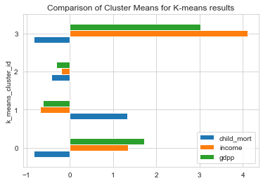

```python
plot_columns = ['child_mort','income','gdpp']

for idx,column in enumerate(plot_columns) :
    plt.suptitle('Comparison of Clusters Characteristics for K-means');
    plt.subplot('13'+str(idx+1))
    sns.boxplot(y=column, x='k_means_cluster_id',data=clustering_data)

```

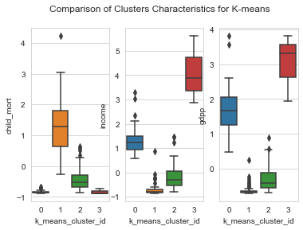

```python
plt.figure(figsize=[8,8])
pd.plotting.parallel_coordinates(clustering_data, 'k_means_cluster_id', color=["#9b59b6", "#3498db", "#95a5a6", "#e74c3c", "#34495e"]);
plt.title('Parallel Coordinate Plot for K-means')
plt.xticks(rotation=45);
```

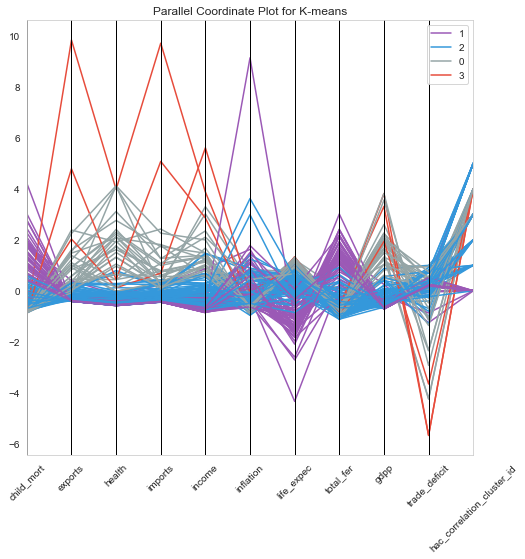

- From the above plots, we could characterize features of each cluster as within the following levels.

  - Levels : Low, Moderate, High , very high

- Characteristics of each cluster

| Cluster | GDP             | Income            | Child Mortality   |
| ------- | --------------- | ----------------- | ----------------- |
| 0       | High            | High to Very High | Low               |
| 1       | Low             | Low               | High to Very High |
| 2       | Low to Moderate | Low to Moderate   | Low to Moderate   |
| 3       | Very High       | Very High         | Low               |

From the characteristics , we see that the Cluster 1 is our area of interest. Lets look at the countries in Cluster 1.

```python
# Countries in cluster with area of interest
condition = countries['k_means_cluster_id'] == 1
countries.loc[condition,['country','child_mort','income','gdpp']].sort_values(by=['child_mort','income','gdpp'], ascending=[False,True,True])[:5]
```

<div>
<table border="1" class="dataframe">
  <thead>
    <tr style="text-align: right;">
      <th></th>
      <th>country</th>
      <th>child_mort</th>
      <th>income</th>
      <th>gdpp</th>
    </tr>
  </thead>
  <tbody>
    <tr>
      <th>66</th>
      <td>Haiti</td>
      <td>208.0</td>
      <td>1500</td>
      <td>662.0</td>
    </tr>
    <tr>
      <th>132</th>
      <td>Sierra Leone</td>
      <td>160.0</td>
      <td>1220</td>
      <td>399.0</td>
    </tr>
    <tr>
      <th>32</th>
      <td>Chad</td>
      <td>150.0</td>
      <td>1930</td>
      <td>897.0</td>
    </tr>
    <tr>
      <th>31</th>
      <td>Central African Republic</td>
      <td>149.0</td>
      <td>888</td>
      <td>446.0</td>
    </tr>
    <tr>
      <th>97</th>
      <td>Mali</td>
      <td>137.0</td>
      <td>1870</td>
      <td>708.0</td>
    </tr>
  </tbody>
</table>
</div>

### Hierarchical Clustering - Complete Linkage, Correlation based distance

```python
# HAC : Complete linkage, Correlation based distance :  cluster analysis plot
# hover for country names and x, y values , cluster no
# Click on legend to selectively view clusters
cluster_analysis_plot('hac_correlation_cluster_id','HAC CORRELATION CLUSTERS')
```

<div class="bk-root" id="ba9d1628-14a6-4e3f-9898-ad624573e17f" data-root-id="6105"></div>

```python
# Comparing Hierarchical Clusters using mean values of features
clustering_data['hac_correlation_cluster_id'] = countries['hac_correlation_cluster_id']
clustering_data[['child_mort','income','gdpp','hac_correlation_cluster_id']].groupby('hac_correlation_cluster_id').mean().plot(kind='barh');
plt.title('Comparison of Cluster Means for Hierarchical Clustering');
```

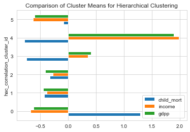

```python
# box plots
plot_columns = ['child_mort','income','gdpp']

for idx,column in enumerate(plot_columns) :
    plt.suptitle('Comparison of Clusters Characteristics for Hierarchical Clustering');
    plt.subplot('13'+str(idx+1))
    sns.boxplot(y=column, x='hac_correlation_cluster_id',data=clustering_data)
```

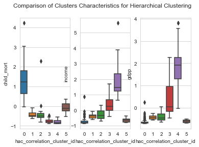

```python
# Parallel Coordinates plot for Hierarchical clustering with correlation measure and complet linkage
plt.figure(figsize=[8,8])
pd.plotting.parallel_coordinates(clustering_data, 'hac_correlation_cluster_id', color=["#9b59b6", "#3498db", "#95a5a6", "#e74c3c", "#34495e","#38895e",'rgba(42, 157, 143, 1)']);
plt.title('Parallel Coordinate Plot for HAC with Correlation Measure and Complete Linkage')
plt.xticks(rotation=45);
```

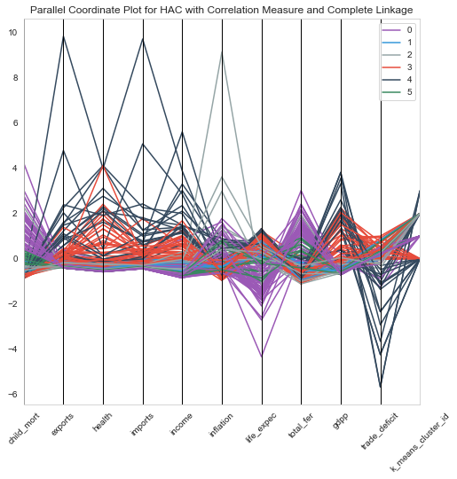

- From the above plots, we could characterize features of each cluster as within the following levels.

  - Levels : Very low , low, Moderate, High , very high

- Characteristics of each cluster

| Cluster | GDP       | Income    | Child Mortality |
| ------- | --------- | --------- | --------------- |
| 0       | Very low  | Very Low  | Very High       |
| 1       | low       | low       | low             |
| 2       | Moderate  | Moderate  | Moderate        |
| 3       | High      | High      | Low             |
| 4       | Very High | Very High | Low             |
| 5       | Very Low  | Very Low  | Low             |

From the characteristics , we see that the Cluster 0 is our area of interest. Lets look at the countries in Cluster 0.

```python
# Countries in cluster with area of interest
condition = countries['hac_correlation_cluster_id'] == 0
countries.loc[condition,['country','child_mort','income','gdpp']].sort_values(by=['child_mort','income','gdpp'], ascending=[False,True,True])[:5]
```

<div>
<table border="1" class="dataframe">
  <thead>
    <tr style="text-align: right;">
      <th></th>
      <th>country</th>
      <th>child_mort</th>
      <th>income</th>
      <th>gdpp</th>
    </tr>
  </thead>
  <tbody>
    <tr>
      <th>66</th>
      <td>Haiti</td>
      <td>208.0</td>
      <td>1500</td>
      <td>662.0</td>
    </tr>
    <tr>
      <th>132</th>
      <td>Sierra Leone</td>
      <td>160.0</td>
      <td>1220</td>
      <td>399.0</td>
    </tr>
    <tr>
      <th>32</th>
      <td>Chad</td>
      <td>150.0</td>
      <td>1930</td>
      <td>897.0</td>
    </tr>
    <tr>
      <th>31</th>
      <td>Central African Republic</td>
      <td>149.0</td>
      <td>888</td>
      <td>446.0</td>
    </tr>
    <tr>
      <th>97</th>
      <td>Mali</td>
      <td>137.0</td>
      <td>1870</td>
      <td>708.0</td>
    </tr>
  </tbody>
</table>
</div>

### Mixed Clustering : K-means initialized with Hierarchical Cluster Centroids

```python
cluster_analysis_plot('mixed_cluster_id','MIXED K-MEANS CLUSTERS')
```

<div class="bk-root" id="0455cd79-c4cf-491d-95ae-32571f98b6cf" data-root-id="6989"></div>

```python
# Comparing MIXED k-means Clusters using mean values of features
clustering_data['mixed_cluster_id'] = countries['mixed_cluster_id']
clustering_data[['child_mort','income','gdpp','mixed_cluster_id']].groupby('mixed_cluster_id').mean().plot(kind='barh')
plt.title('Comparison of cluster means for Mixed Clustering');
```

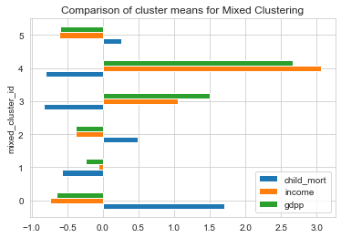

```python
# box plots
plot_columns = ['child_mort','income','gdpp']

for idx,column in enumerate(plot_columns) :
    plt.suptitle('Comparison of Clusters Characteristics for Mixed Clustering');
    plt.subplot('13'+str(idx+1))
    sns.boxplot(y=column, x='mixed_cluster_id',data=clustering_data)
```

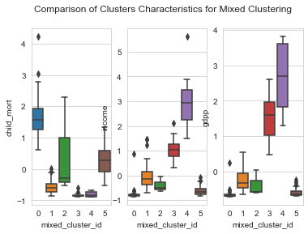

```python
# parallel coordinate plot
plt.figure(figsize=[8,8])
pd.plotting.parallel_coordinates(clustering_data, 'mixed_cluster_id', color=["#9b59b6", "#3498db", "#95a5a6", "#e74c3c", "#34495e","#38895e",'rgba(42, 157, 143, 1)']);
plt.title('Parallel Coordinate Plot for Mixed Clustering');
plt.xticks(rotation=45);
```

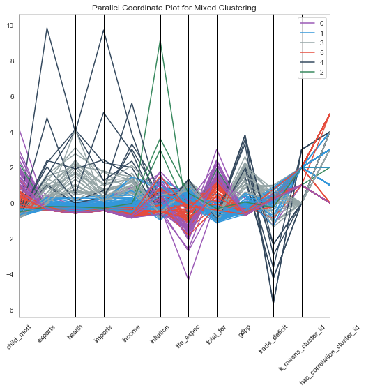

- From the above plots, Cluster 0 has the very low income and gdpp and very high child mortality. Hence, Cluster 0 is the area of interest.

```python
# Countries in cluster with area of interest
condition = countries['mixed_cluster_id'] == 0
countries.loc[condition,['country','child_mort','income','gdpp']].sort_values(by=['child_mort','income','gdpp'], ascending=[False,True,True])[:5]
```

<div>
<table border="1" class="dataframe">
  <thead>
    <tr style="text-align: right;">
      <th></th>
      <th>country</th>
      <th>child_mort</th>
      <th>income</th>
      <th>gdpp</th>
    </tr>
  </thead>
  <tbody>
    <tr>
      <th>66</th>
      <td>Haiti</td>
      <td>208.0</td>
      <td>1500</td>
      <td>662.0</td>
    </tr>
    <tr>
      <th>132</th>
      <td>Sierra Leone</td>
      <td>160.0</td>
      <td>1220</td>
      <td>399.0</td>
    </tr>
    <tr>
      <th>32</th>
      <td>Chad</td>
      <td>150.0</td>
      <td>1930</td>
      <td>897.0</td>
    </tr>
    <tr>
      <th>31</th>
      <td>Central African Republic</td>
      <td>149.0</td>
      <td>888</td>
      <td>446.0</td>
    </tr>
    <tr>
      <th>97</th>
      <td>Mali</td>
      <td>137.0</td>
      <td>1870</td>
      <td>708.0</td>
    </tr>
  </tbody>
</table>
</div>

- Hence , the top five countries to extend aid are
  - Haiti
  - Sierra Leone
  - Chad
  - Central African Republic
  - Mali

## Conclusion

- Columns : 'child_mort', 'exports', 'health', 'imports', 'income','inflation', 'life_expec', 'total_fer', 'gdpp','trade_deficit' were used for clustering.

- Hopkin's Statistic was calculated which showed a very high mean clustering tendency of 96% with a standard deviation of 4%
- The dataset was standardized with mean = 0 , standard deviation = 1 before clustering.
- Optimum no of clusters for k-means was found to be 4 , both from Elbow curve and Silhoeutte Analysis curve.
- Clustering with k-means was performed (Cluster centers initialized with k-means++)
- Hierarchical Clustering with Single, Complete and Average linkages and Euclidean , correlation based distances were explored.
- Mixed k-means clustering - K-means initialized with centroids of hierarchical clustering - was also explored.
- Due to more interpretable results, Hierarchical Clustering with Complete linkage and correlation based distance measure was chosen to arrive at the results.

- Characteristics of Clusters obtained :

| Cluster | GDP       | Income    | Child Mortality |
| ------- | --------- | --------- | --------------- |
| 0       | Very low  | Very Low  | Very High       |
| 1       | low       | low       | low             |
| 2       | Moderate  | Moderate  | Moderate        |
| 3       | High      | High      | Low             |
| 4       | Very High | Very High | Low             |
| 5       | Very Low  | Very Low  | Low             |

- From the characteristics , we see that the Cluster 0 is our area of interest.
- According to the UN goals of 2030, the top priority is health and then poverty.
- Hence countries in cluster 0 were ranked based on Child Mortality followed by income and GDP per capita.
- By that criteria, the following are the five countries HELP should consider extending their aid.
  - Haiti
  - Sierra Leone
  - Chad
  - Central African Republic
  - Mali
