Photo by <a href="https://unsplash.com/@will_myers">Will Myers</a> on <a href="https://unsplash.com/s/photos/puyallup">Unsplash</a>  
This analysis is the combined effort of <a href="https://www.kaggle.com/umaer369">Umaer</a> and me.

# Lead Scoring for X Education

## Problem Statement

An education company named X Education sells online courses to industry professionals. On any given day, many professionals who are interested in the courses land on their website and browse for courses.

The company markets its courses on several websites and search engines like Google. Once these people land on the website, they might browse the courses or fill up a form for the course or watch some videos. When these people fill up a form providing their email address or phone number, they are classified to be a lead. Moreover, the company also gets leads through past referrals. Once these leads are acquired, employees from the sales team start making calls, writing emails, etc. Through this process, some of the leads get converted while most do not. The typical lead conversion rate at X education is around 30%.

Now, although X Education gets a lot of leads, its lead conversion rate is very poor. For example, if, say, they acquire 100 leads in a day, only about 30 of them are converted. To make this process more efficient, the company wishes to identify the most potential leads, also known as ‘Hot Leads’. If they successfully identify this set of leads, the lead conversion rate should go up as the sales team will now be focusing more on communicating with the potential leads rather than making calls to everyone. A typical lead conversion process can be represented using the following funnel:

X Education has appointed us to help them select the most promising leads, i.e. the leads that are most likely to convert into paying customers. The company requires us to build a model wherein we need to assign a lead score to each of the leads such that the customers with higher lead score have a higher conversion chance and the customers with lower lead score have a lower conversion chance. The CEO, in particular, has given a ballpark of the target lead conversion rate to be around 80%.

## Business Goals

- X-Education wants to improve their lead conversion.
- Rather than randomly pursuing leads, the company wants to create a pool of Hot Leads the sales team could focus on.
- They have tasked us to score their leads betwen 0-100 based on the probability of conversion. 100 being the most likely to convert and 0 being unlikely to convert.

## Analysis Approach & Conclusions

Lead scoring is a class probability estimation problem, a form of classification problem. The target variable in the data set has two classes : 0 - Un converted and 1 - Converted. The objective is to model the probability(p) that each lead belongs to the class - `Converetd`. Since there are just two classes - it follows that the probability of belonging to class - Un-Converted is (1-p). The relationship between probability of conversion of each lead and its characteristics is modelled using Logistic Regression. And the leads are scored on a scale of 0-100, 100 being most probable conversion candidate.

The final solution has been provided in two parts. 1. Scoring the leads provided by the company in the order of probability of conversion (0-100) 2. Insights into the relationship between characteristics of a lead and the log-odds probability of conversion that could help the company score leads in the future.

A logistic regression model is created using lead features. To arrive at the list of features which significantly affect conversion probability, a mixed feature elimination approach is followed. 25 most important features are obtained through Recursive Feature Elimination and then reduced to 15 via p-value / VIF approach. The dataset is randomly divided into train and test set. (70 - 30 split).

The final relationship between log Odds of Conversion Probability and lead features is

`logOdds(Conversion Probability)` = -0.6821 - 1.5442 _ `Do Not Email` -1.2691 _ `Unknown Occupation` -0.8891 _ `No Specialization` -0.8856 _ `Hospitality Management` - 0.6636 _ `Outside India` + 1.7926 _ `SMS Sent` + 1.1818 _ `Other Last Activity` + 2.3799 _ `Working Professional` - 0.8591 _ `Olark Chat Conversation` + 5.4168 _ `Welingak Website` + 3.0622 _ `Reference` + 0.6577 _ `Other Lead Sources` + 1.2170 _ `Olark Chat` -0.9929 _ `Landing Page Submission` + 1.1330 _ `Total Time Spent on Website` + 0.6052 _ `Email Opened`

where `Total Time Spent on Website` is standardized to $\mu=0,\sigma=1$

Interpreting Top 6 features affecting Conversion Probability :

- A lead from `Welingak Website` has 5.41 times higher odds of conversion than those from `Google`.
- Leads through `Reference` have 3.1 times higher odds of conversion than those from `Google`.
- Leads from `Working Professional` have 2.38 times higher odds of conversion than those from `Businessman`.
- Leads with `SMS Sent` have 1.8 times higher odds of conversion than those with no SMS sent.
- Leads with `Do Not Email` have 1.5 times lesser odds of conversion compared to leads who would like email updates.
- Leads with `Unknown Occupation` have 1.2691 times lesser odds of conversion compared to those from `Businessman`.

Lead Scores :

- Score sheet can be generated by running coding in the cell named `Score Sheet for X Education` cell in the analysis notebook.

At an optimum cut-off probability of 0.36, model performance is as follows.

Model Performance on Training Set :

- Accuracy : 81.7%
- Sensitivity / Recall: 80.393 %
- Specificity : 81.772 %
- Precision / Positive Predictive Power : 72.924 %
- False Positive Rate : 18.228 %
- AUC Score : 0.81

Model Performance for Test Set :

- Accuracy : 79.593 %
- Sensitivity / Recall : 77.605 %
- Specificity : 80.81%
- Precision / Positive Predictive Power : 71.224 %
- False Positive Rate : 19.19 %
- AUC Score : 0.79

KS statistic :

- Max KS Statistic is 59.76 for 5th decile
- This model discriminates between Converted and Non-converted leads well since KS Statistic in 4th decile (58.11) is greater than 40%. Hence, this is a reasonably good model.

Gain :

- Inside of pursuing leads randomly, pursuing the top 40% leads scored by the model would let the sales team reach 80% of leads likely to convert.

Lift :

- The model outperforms a random model by alteast 2 times compared to a random model in the top 40% potentially convertible leads.
- As opposed to 10% conversions from 10% leads pursued randomly, pursuing the top 10% leads scored by this model would lead to 24% conversions.

Note :

- Incorrect data types have been corrected
- Columns with high missing values have been dropped.
- Columns which do not explain variability in the model have been dropped.
- Columns with sales teams notes like `Tags` where the classes are not mutually exclusive have been dropped.
- Features with low missing values have been imputed with the most frequent values.
- Categories in a feature with less than 1% contribution have been grouped together to reduce the number of levels.
- Inconsistencies in Categories have been corrected.
- 97.5 % of the leads provided by the company have been used for analysis.
- Class imbalance = 0.6
- Indicator variables have been created for all categorical variables with the first category as the reference.
- Continuous variables have been standardized $\mu : 0 , \sigma = 1$ before modelling.

```python
import numpy as np
import pandas as pd
import matplotlib.pyplot as plt

import seaborn as sns
sns.set_style('whitegrid')

import warnings
warnings.filterwarnings('ignore')

!pip install tabulate
from tabulate import tabulate

import sidetable

!jt -t grade3 -f roboto -fs 12 -cellw 100%
```

    Requirement already satisfied: tabulate in /opt/anaconda3/lib/python3.7/site-packages (0.8.7)
    /bin/sh: jt: command not found

```python
# to table print  a dataframe
def tab(ser) :
        print(tabulate(pd.DataFrame(ser), headers='keys', tablefmt="psql"))
```

## Importing Data

```python
# importing the dataset
leads = pd.read_csv('./leads.csv')

# Inspecting few column heads at a time
for i in range(0,leads.shape[1], 5) :
    if i+4 <= leads.shape[1] :
        print('Columns : ',i,' to ',i+4)
    else :
        print('Columns : ',i,' to last')
    tab(leads.iloc[:,i : i+5].head())
    print('\n')
```

    Columns :  0  to  4
    +----+--------------------------------------+---------------+-------------------------+----------------+----------------+
    |    | Prospect ID                          |   Lead Number | Lead Origin             | Lead Source    | Do Not Email   |
    |----+--------------------------------------+---------------+-------------------------+----------------+----------------|
    |  0 | 7927b2df-8bba-4d29-b9a2-b6e0beafe620 |        660737 | API                     | Olark Chat     | No             |
    |  1 | 2a272436-5132-4136-86fa-dcc88c88f482 |        660728 | API                     | Organic Search | No             |
    |  2 | 8cc8c611-a219-4f35-ad23-fdfd2656bd8a |        660727 | Landing Page Submission | Direct Traffic | No             |
    |  3 | 0cc2df48-7cf4-4e39-9de9-19797f9b38cc |        660719 | Landing Page Submission | Direct Traffic | No             |
    |  4 | 3256f628-e534-4826-9d63-4a8b88782852 |        660681 | Landing Page Submission | Google         | No             |
    +----+--------------------------------------+---------------+-------------------------+----------------+----------------+


    Columns :  5  to  9
    +----+---------------+-------------+---------------+-------------------------------+------------------------+
    |    | Do Not Call   |   Converted |   TotalVisits |   Total Time Spent on Website |   Page Views Per Visit |
    |----+---------------+-------------+---------------+-------------------------------+------------------------|
    |  0 | No            |           0 |             0 |                             0 |                    0   |
    |  1 | No            |           0 |             5 |                           674 |                    2.5 |
    |  2 | No            |           1 |             2 |                          1532 |                    2   |
    |  3 | No            |           0 |             1 |                           305 |                    1   |
    |  4 | No            |           1 |             2 |                          1428 |                    1   |
    +----+---------------+-------------+---------------+-------------------------------+------------------------+


    Columns :  10  to  14
    +----+-------------------------+-----------+-------------------------+--------------------------------------+-----------------------------------+
    |    | Last Activity           | Country   | Specialization          | How did you hear about X Education   | What is your current occupation   |
    |----+-------------------------+-----------+-------------------------+--------------------------------------+-----------------------------------|
    |  0 | Page Visited on Website | nan       | Select                  | Select                               | Unemployed                        |
    |  1 | Email Opened            | India     | Select                  | Select                               | Unemployed                        |
    |  2 | Email Opened            | India     | Business Administration | Select                               | Student                           |
    |  3 | Unreachable             | India     | Media and Advertising   | Word Of Mouth                        | Unemployed                        |
    |  4 | Converted to Lead       | India     | Select                  | Other                                | Unemployed                        |
    +----+-------------------------+-----------+-------------------------+--------------------------------------+-----------------------------------+


    Columns :  15  to  19
    +----+-------------------------------------------------+----------+------------+---------------------+----------------------+
    |    | What matters most to you in choosing a course   | Search   | Magazine   | Newspaper Article   | X Education Forums   |
    |----+-------------------------------------------------+----------+------------+---------------------+----------------------|
    |  0 | Better Career Prospects                         | No       | No         | No                  | No                   |
    |  1 | Better Career Prospects                         | No       | No         | No                  | No                   |
    |  2 | Better Career Prospects                         | No       | No         | No                  | No                   |
    |  3 | Better Career Prospects                         | No       | No         | No                  | No                   |
    |  4 | Better Career Prospects                         | No       | No         | No                  | No                   |
    +----+-------------------------------------------------+----------+------------+---------------------+----------------------+


    Columns :  20  to  24
    +----+-------------+-------------------------+---------------------------+------------------------------------------+-------------------------------------+
    |    | Newspaper   | Digital Advertisement   | Through Recommendations   | Receive More Updates About Our Courses   | Tags                                |
    |----+-------------+-------------------------+---------------------------+------------------------------------------+-------------------------------------|
    |  0 | No          | No                      | No                        | No                                       | Interested in other courses         |
    |  1 | No          | No                      | No                        | No                                       | Ringing                             |
    |  2 | No          | No                      | No                        | No                                       | Will revert after reading the email |
    |  3 | No          | No                      | No                        | No                                       | Ringing                             |
    |  4 | No          | No                      | No                        | No                                       | Will revert after reading the email |
    +----+-------------+-------------------------+---------------------------+------------------------------------------+-------------------------------------+


    Columns :  25  to  29
    +----+------------------+-------------------------------------+-----------------------------+----------------+--------+
    |    | Lead Quality     | Update me on Supply Chain Content   | Get updates on DM Content   | Lead Profile   | City   |
    |----+------------------+-------------------------------------+-----------------------------+----------------+--------|
    |  0 | Low in Relevance | No                                  | No                          | Select         | Select |
    |  1 | nan              | No                                  | No                          | Select         | Select |
    |  2 | Might be         | No                                  | No                          | Potential Lead | Mumbai |
    |  3 | Not Sure         | No                                  | No                          | Select         | Mumbai |
    |  4 | Might be         | No                                  | No                          | Select         | Mumbai |
    +----+------------------+-------------------------------------+-----------------------------+----------------+--------+


    Columns :  30  to  34
    +----+-------------------------------+------------------------------+-------------------------------+------------------------------+--------------------------------------------+
    |    | Asymmetrique Activity Index   | Asymmetrique Profile Index   |   Asymmetrique Activity Score |   Asymmetrique Profile Score | I agree to pay the amount through cheque   |
    |----+-------------------------------+------------------------------+-------------------------------+------------------------------+--------------------------------------------|
    |  0 | 02.Medium                     | 02.Medium                    |                            15 |                           15 | No                                         |
    |  1 | 02.Medium                     | 02.Medium                    |                            15 |                           15 | No                                         |
    |  2 | 02.Medium                     | 01.High                      |                            14 |                           20 | No                                         |
    |  3 | 02.Medium                     | 01.High                      |                            13 |                           17 | No                                         |
    |  4 | 02.Medium                     | 01.High                      |                            15 |                           18 | No                                         |
    +----+-------------------------------+------------------------------+-------------------------------+------------------------------+--------------------------------------------+


    Columns :  35  to last
    +----+------------------------------------------+-------------------------+
    |    | A free copy of Mastering The Interview   | Last Notable Activity   |
    |----+------------------------------------------+-------------------------|
    |  0 | No                                       | Modified                |
    |  1 | No                                       | Email Opened            |
    |  2 | Yes                                      | Email Opened            |
    |  3 | No                                       | Modified                |
    |  4 | No                                       | Modified                |
    +----+------------------------------------------+-------------------------+

```python
# dataset information
leads.info()
```

    <class 'pandas.core.frame.DataFrame'>
    RangeIndex: 9240 entries, 0 to 9239
    Data columns (total 37 columns):
     #   Column                                         Non-Null Count  Dtype
    ---  ------                                         --------------  -----
     0   Prospect ID                                    9240 non-null   object
     1   Lead Number                                    9240 non-null   int64
     2   Lead Origin                                    9240 non-null   object
     3   Lead Source                                    9204 non-null   object
     4   Do Not Email                                   9240 non-null   object
     5   Do Not Call                                    9240 non-null   object
     6   Converted                                      9240 non-null   int64
     7   TotalVisits                                    9103 non-null   float64
     8   Total Time Spent on Website                    9240 non-null   int64
     9   Page Views Per Visit                           9103 non-null   float64
     10  Last Activity                                  9137 non-null   object
     11  Country                                        6779 non-null   object
     12  Specialization                                 7802 non-null   object
     13  How did you hear about X Education             7033 non-null   object
     14  What is your current occupation                6550 non-null   object
     15  What matters most to you in choosing a course  6531 non-null   object
     16  Search                                         9240 non-null   object
     17  Magazine                                       9240 non-null   object
     18  Newspaper Article                              9240 non-null   object
     19  X Education Forums                             9240 non-null   object
     20  Newspaper                                      9240 non-null   object
     21  Digital Advertisement                          9240 non-null   object
     22  Through Recommendations                        9240 non-null   object
     23  Receive More Updates About Our Courses         9240 non-null   object
     24  Tags                                           5887 non-null   object
     25  Lead Quality                                   4473 non-null   object
     26  Update me on Supply Chain Content              9240 non-null   object
     27  Get updates on DM Content                      9240 non-null   object
     28  Lead Profile                                   6531 non-null   object
     29  City                                           7820 non-null   object
     30  Asymmetrique Activity Index                    5022 non-null   object
     31  Asymmetrique Profile Index                     5022 non-null   object
     32  Asymmetrique Activity Score                    5022 non-null   float64
     33  Asymmetrique Profile Score                     5022 non-null   float64
     34  I agree to pay the amount through cheque       9240 non-null   object
     35  A free copy of Mastering The Interview         9240 non-null   object
     36  Last Notable Activity                          9240 non-null   object
    dtypes: float64(4), int64(3), object(30)
    memory usage: 2.6+ MB

- This data set has a total of 9240 records ,each with 36 features.
- Each record represents the characteristics of a lead and whether the lead was converted.
- `Converted` column indicates whether the particular lead was converted to a client. This is our target variable.

## Data Cleaning

### Incorrect data types

```python
# 'Converted' is a binary categorical variable but the info shows it is `int64`. Converting to `category` data type
leads['Converted'] = leads['Converted'].astype('category')
```

### Duplicates

```python
# Checking for any duplicate leads / prospects

duplicate_prospect_ids = leads['Prospect ID'][leads['Prospect ID'].duplicated()].sum()
duplicate_lead_no = leads['Lead Number'][leads['Lead Number'].duplicated()].sum()
print('No of Duplicate Prospect IDs : ', duplicate_prospect_ids)
print('No of Duplicate Lead Nos : ', duplicate_lead_no)
```

    No of Duplicate Prospect IDs :  0
    No of Duplicate Lead Nos :  0

- There are no duplicate prospect IDs or Lead Numbers
- Since, these are dimensions (i.e identification columns) not required for analysis, they could be popped for re-indentification at a later step.

### Separating ID columns

```python
# Popping Prospect ID and Lead Number columns for later use
prospect_ids = leads.pop('Prospect ID')
lead_no = leads.pop('Lead Number')
```

### Missing Values

```python
# Null values in each Column
nulls = pd.DataFrame(100*leads.isnull().sum()/leads.shape[0])
nulls.columns = ['Null Percentage']

# Sorting null percentages in descending order and highlighting null % > 45
nulls[nulls['Null Percentage'] !=0].sort_values(by ='Null Percentage', ascending=False).style.applymap(lambda x : 'color : red' if x > 45 else '')
```

<table id="T_14c71e3a_f00d_11ea_8784_88e9fe4e6667" ><thead>    <tr>        <th class="blank level0" ></th>        <th class="col_heading level0 col0" >Null Percentage</th>    </tr></thead>
<tbody>
<tr>
                        <th id="T_14c71e3a_f00d_11ea_8784_88e9fe4e6667level0_row0" class="row_heading level0 row0" >Lead Quality</th>
                        <td id="T_14c71e3a_f00d_11ea_8784_88e9fe4e6667row0_col0" class="data row0 col0" >51.590909</td>
            </tr>
            <tr>
                        <th id="T_14c71e3a_f00d_11ea_8784_88e9fe4e6667level0_row1" class="row_heading level0 row1" >Asymmetrique Profile Score</th>
                        <td id="T_14c71e3a_f00d_11ea_8784_88e9fe4e6667row1_col0" class="data row1 col0" >45.649351</td>
            </tr>
            <tr>
                        <th id="T_14c71e3a_f00d_11ea_8784_88e9fe4e6667level0_row2" class="row_heading level0 row2" >Asymmetrique Activity Score</th>
                        <td id="T_14c71e3a_f00d_11ea_8784_88e9fe4e6667row2_col0" class="data row2 col0" >45.649351</td>
            </tr>
            <tr>
                        <th id="T_14c71e3a_f00d_11ea_8784_88e9fe4e6667level0_row3" class="row_heading level0 row3" >Asymmetrique Profile Index</th>
                        <td id="T_14c71e3a_f00d_11ea_8784_88e9fe4e6667row3_col0" class="data row3 col0" >45.649351</td>
            </tr>
            <tr>
                        <th id="T_14c71e3a_f00d_11ea_8784_88e9fe4e6667level0_row4" class="row_heading level0 row4" >Asymmetrique Activity Index</th>
                        <td id="T_14c71e3a_f00d_11ea_8784_88e9fe4e6667row4_col0" class="data row4 col0" >45.649351</td>
            </tr>
            <tr>
                        <th id="T_14c71e3a_f00d_11ea_8784_88e9fe4e6667level0_row5" class="row_heading level0 row5" >Tags</th>
                        <td id="T_14c71e3a_f00d_11ea_8784_88e9fe4e6667row5_col0" class="data row5 col0" >36.287879</td>
            </tr>
            <tr>
                        <th id="T_14c71e3a_f00d_11ea_8784_88e9fe4e6667level0_row6" class="row_heading level0 row6" >Lead Profile</th>
                        <td id="T_14c71e3a_f00d_11ea_8784_88e9fe4e6667row6_col0" class="data row6 col0" >29.318182</td>
            </tr>
            <tr>
                        <th id="T_14c71e3a_f00d_11ea_8784_88e9fe4e6667level0_row7" class="row_heading level0 row7" >What matters most to you in choosing a course</th>
                        <td id="T_14c71e3a_f00d_11ea_8784_88e9fe4e6667row7_col0" class="data row7 col0" >29.318182</td>
            </tr>
            <tr>
                        <th id="T_14c71e3a_f00d_11ea_8784_88e9fe4e6667level0_row8" class="row_heading level0 row8" >What is your current occupation</th>
                        <td id="T_14c71e3a_f00d_11ea_8784_88e9fe4e6667row8_col0" class="data row8 col0" >29.112554</td>
            </tr>
            <tr>
                        <th id="T_14c71e3a_f00d_11ea_8784_88e9fe4e6667level0_row9" class="row_heading level0 row9" >Country</th>
                        <td id="T_14c71e3a_f00d_11ea_8784_88e9fe4e6667row9_col0" class="data row9 col0" >26.634199</td>
            </tr>
            <tr>
                        <th id="T_14c71e3a_f00d_11ea_8784_88e9fe4e6667level0_row10" class="row_heading level0 row10" >How did you hear about X Education</th>
                        <td id="T_14c71e3a_f00d_11ea_8784_88e9fe4e6667row10_col0" class="data row10 col0" >23.885281</td>
            </tr>
            <tr>
                        <th id="T_14c71e3a_f00d_11ea_8784_88e9fe4e6667level0_row11" class="row_heading level0 row11" >Specialization</th>
                        <td id="T_14c71e3a_f00d_11ea_8784_88e9fe4e6667row11_col0" class="data row11 col0" >15.562771</td>
            </tr>
            <tr>
                        <th id="T_14c71e3a_f00d_11ea_8784_88e9fe4e6667level0_row12" class="row_heading level0 row12" >City</th>
                        <td id="T_14c71e3a_f00d_11ea_8784_88e9fe4e6667row12_col0" class="data row12 col0" >15.367965</td>
            </tr>
            <tr>
                        <th id="T_14c71e3a_f00d_11ea_8784_88e9fe4e6667level0_row13" class="row_heading level0 row13" >TotalVisits</th>
                        <td id="T_14c71e3a_f00d_11ea_8784_88e9fe4e6667row13_col0" class="data row13 col0" >1.482684</td>
            </tr>
            <tr>
                        <th id="T_14c71e3a_f00d_11ea_8784_88e9fe4e6667level0_row14" class="row_heading level0 row14" >Page Views Per Visit</th>
                        <td id="T_14c71e3a_f00d_11ea_8784_88e9fe4e6667row14_col0" class="data row14 col0" >1.482684</td>
            </tr>
            <tr>
                        <th id="T_14c71e3a_f00d_11ea_8784_88e9fe4e6667level0_row15" class="row_heading level0 row15" >Last Activity</th>
                        <td id="T_14c71e3a_f00d_11ea_8784_88e9fe4e6667row15_col0" class="data row15 col0" >1.114719</td>
            </tr>
            <tr>
                        <th id="T_14c71e3a_f00d_11ea_8784_88e9fe4e6667level0_row16" class="row_heading level0 row16" >Lead Source</th>
                        <td id="T_14c71e3a_f00d_11ea_8784_88e9fe4e6667row16_col0" class="data row16 col0" >0.389610</td>
            </tr>
    </tbody></table>

- More than 45% of the leads have missing values in `Lead Quality`,`Asymmetrique Profile Score`,
  `Asymmetrique Activity Score`,
  `Asymmetrique Profile Index`,
  `Asymmetrique Activity Index`
- Further, the data in these columns is filled by the sales team and the values depend heavily on the team's judgement. These columns are not good candidates for modelling since the values are subjective.
- Hence these columns could be dropped.

```python
# Dropping columns with null percentage > 45
high_null_col = nulls[nulls['Null Percentage'] >=45].index
leads.drop(columns=high_null_col, inplace=True)
```

```python
# Rows Missing Target Variable
print('Number of rows with missing Target Variable : ',leads['Converted'].isnull().sum())
```

    Number of rows with missing Target Variable :  0

- No rows with missing target value

```python
# Rows missing more than 50% of values
highNullRowsCondition = leads.isnull().sum(axis=1)/leads.shape[1] > 0.5
leads[highNullRowsCondition].index
```

    Int64Index([], dtype='int64')

- No rows missing more than 50% of values.

### Disguised missing Values

```python
# Categorical columns
condition = leads.dtypes == 'object'
categoricalColumns = leads.dtypes[condition].index.values
categoricalColumns
```

    array(['Lead Origin', 'Lead Source', 'Do Not Email', 'Do Not Call',
           'Last Activity', 'Country', 'Specialization',
           'How did you hear about X Education',
           'What is your current occupation',
           'What matters most to you in choosing a course', 'Search',
           'Magazine', 'Newspaper Article', 'X Education Forums', 'Newspaper',
           'Digital Advertisement', 'Through Recommendations',
           'Receive More Updates About Our Courses', 'Tags',
           'Update me on Supply Chain Content', 'Get updates on DM Content',
           'Lead Profile', 'City', 'I agree to pay the amount through cheque',
           'A free copy of Mastering The Interview', 'Last Notable Activity'],
          dtype=object)

```python
# value counts of each label in a categorical feature
def cat_value_counts(column_name) :
    '''
    prints unique values and value counts of each label in categorical column
    '''
    print(tabulate(pd.DataFrame(leads.stb.freq([column_name])), headers='keys', tablefmt='psql'))
    print(pd.DataFrame(leads[column_name]).stb.missing(),'\n\n\n')
```

```python
# Looking at value counts of each label in categorical variables
for col in sorted(categoricalColumns) :
    print(col)
    cat_value_counts(col)
```

    A free copy of Mastering The Interview
    +----+------------------------------------------+---------+-----------+--------------------+----------------------+
    |    | A free copy of Mastering The Interview   |   Count |   Percent |   Cumulative Count |   Cumulative Percent |
    |----+------------------------------------------+---------+-----------+--------------------+----------------------|
    |  0 | No                                       |    6352 |  0.687446 |               6352 |             0.687446 |
    |  1 | Yes                                      |    2888 |  0.312554 |               9240 |             1        |
    +----+------------------------------------------+---------+-----------+--------------------+----------------------+
                                            Missing  Total  Percent
    A free copy of Mastering The Interview        0   9240      0.0


    City
    +----+-----------------------------+---------+------------+--------------------+----------------------+
    |    | City                        |   Count |    Percent |   Cumulative Count |   Cumulative Percent |
    |----+-----------------------------+---------+------------+--------------------+----------------------|
    |  0 | Mumbai                      |    3222 | 0.41202    |               3222 |             0.41202  |
    |  1 | Select                      |    2249 | 0.287596   |               5471 |             0.699616 |
    |  2 | Thane & Outskirts           |     752 | 0.0961637  |               6223 |             0.79578  |
    |  3 | Other Cities                |     686 | 0.0877238  |               6909 |             0.883504 |
    |  4 | Other Cities of Maharashtra |     457 | 0.0584399  |               7366 |             0.941944 |
    |  5 | Other Metro Cities          |     380 | 0.0485934  |               7746 |             0.990537 |
    |  6 | Tier II Cities              |      74 | 0.00946292 |               7820 |             1        |
    +----+-----------------------------+---------+------------+--------------------+----------------------+
          Missing  Total  Percent
    City     1420   9240  0.15368


    Country
    +----+----------------------+---------+-------------+--------------------+----------------------+
    |    | Country              |   Count |     Percent |   Cumulative Count |   Cumulative Percent |
    |----+----------------------+---------+-------------+--------------------+----------------------|
    |  0 | India                |    6492 | 0.957663    |               6492 |             0.957663 |
    |  1 | United States        |      69 | 0.0101785   |               6561 |             0.967842 |
    |  2 | United Arab Emirates |      53 | 0.00781826  |               6614 |             0.97566  |
    |  3 | Singapore            |      24 | 0.00354035  |               6638 |             0.9792   |
    |  4 | Saudi Arabia         |      21 | 0.0030978   |               6659 |             0.982298 |
    |  5 | United Kingdom       |      15 | 0.00221272  |               6674 |             0.984511 |
    |  6 | Australia            |      13 | 0.00191769  |               6687 |             0.986429 |
    |  7 | Qatar                |      10 | 0.00147514  |               6697 |             0.987904 |
    |  8 | Hong Kong            |       7 | 0.0010326   |               6704 |             0.988936 |
    |  9 | Bahrain              |       7 | 0.0010326   |               6711 |             0.989969 |
    | 10 | Oman                 |       6 | 0.000885086 |               6717 |             0.990854 |
    | 11 | France               |       6 | 0.000885086 |               6723 |             0.991739 |
    | 12 | unknown              |       5 | 0.000737572 |               6728 |             0.992477 |
    | 13 | South Africa         |       4 | 0.000590058 |               6732 |             0.993067 |
    | 14 | Nigeria              |       4 | 0.000590058 |               6736 |             0.993657 |
    | 15 | Kuwait               |       4 | 0.000590058 |               6740 |             0.994247 |
    | 16 | Germany              |       4 | 0.000590058 |               6744 |             0.994837 |
    | 17 | Canada               |       4 | 0.000590058 |               6748 |             0.995427 |
    | 18 | Sweden               |       3 | 0.000442543 |               6751 |             0.99587  |
    | 19 | Uganda               |       2 | 0.000295029 |               6753 |             0.996165 |
    | 20 | Philippines          |       2 | 0.000295029 |               6755 |             0.99646  |
    | 21 | Netherlands          |       2 | 0.000295029 |               6757 |             0.996755 |
    | 22 | Italy                |       2 | 0.000295029 |               6759 |             0.99705  |
    | 23 | Ghana                |       2 | 0.000295029 |               6761 |             0.997345 |
    | 24 | China                |       2 | 0.000295029 |               6763 |             0.99764  |
    | 25 | Belgium              |       2 | 0.000295029 |               6765 |             0.997935 |
    | 26 | Bangladesh           |       2 | 0.000295029 |               6767 |             0.99823  |
    | 27 | Asia/Pacific Region  |       2 | 0.000295029 |               6769 |             0.998525 |
    | 28 | Vietnam              |       1 | 0.000147514 |               6770 |             0.998672 |
    | 29 | Tanzania             |       1 | 0.000147514 |               6771 |             0.99882  |
    | 30 | Switzerland          |       1 | 0.000147514 |               6772 |             0.998967 |
    | 31 | Sri Lanka            |       1 | 0.000147514 |               6773 |             0.999115 |
    | 32 | Russia               |       1 | 0.000147514 |               6774 |             0.999262 |
    | 33 | Malaysia             |       1 | 0.000147514 |               6775 |             0.99941  |
    | 34 | Liberia              |       1 | 0.000147514 |               6776 |             0.999557 |
    | 35 | Kenya                |       1 | 0.000147514 |               6777 |             0.999705 |
    | 36 | Indonesia            |       1 | 0.000147514 |               6778 |             0.999852 |
    | 37 | Denmark              |       1 | 0.000147514 |               6779 |             1        |
    +----+----------------------+---------+-------------+--------------------+----------------------+
             Missing  Total   Percent
    Country     2461   9240  0.266342


    Digital Advertisement
    +----+-------------------------+---------+-----------+--------------------+----------------------+
    |    | Digital Advertisement   |   Count |   Percent |   Cumulative Count |   Cumulative Percent |
    |----+-------------------------+---------+-----------+--------------------+----------------------|
    |  0 | No                      |    9236 | 0.999567  |               9236 |             0.999567 |
    |  1 | Yes                     |       4 | 0.0004329 |               9240 |             1        |
    +----+-------------------------+---------+-----------+--------------------+----------------------+
                           Missing  Total  Percent
    Digital Advertisement        0   9240      0.0


    Do Not Call
    +----+---------------+---------+------------+--------------------+----------------------+
    |    | Do Not Call   |   Count |    Percent |   Cumulative Count |   Cumulative Percent |
    |----+---------------+---------+------------+--------------------+----------------------|
    |  0 | No            |    9238 | 0.999784   |               9238 |             0.999784 |
    |  1 | Yes           |       2 | 0.00021645 |               9240 |             1        |
    +----+---------------+---------+------------+--------------------+----------------------+
                 Missing  Total  Percent
    Do Not Call        0   9240      0.0


    Do Not Email
    +----+----------------+---------+-----------+--------------------+----------------------+
    |    | Do Not Email   |   Count |   Percent |   Cumulative Count |   Cumulative Percent |
    |----+----------------+---------+-----------+--------------------+----------------------|
    |  0 | No             |    8506 | 0.920563  |               8506 |             0.920563 |
    |  1 | Yes            |     734 | 0.0794372 |               9240 |             1        |
    +----+----------------+---------+-----------+--------------------+----------------------+
                  Missing  Total  Percent
    Do Not Email        0   9240      0.0


    Get updates on DM Content
    +----+-----------------------------+---------+-----------+--------------------+----------------------+
    |    | Get updates on DM Content   |   Count |   Percent |   Cumulative Count |   Cumulative Percent |
    |----+-----------------------------+---------+-----------+--------------------+----------------------|
    |  0 | No                          |    9240 |         1 |               9240 |                    1 |
    +----+-----------------------------+---------+-----------+--------------------+----------------------+
                               Missing  Total  Percent
    Get updates on DM Content        0   9240      0.0


    How did you hear about X Education
    +----+--------------------------------------+---------+------------+--------------------+----------------------+
    |    | How did you hear about X Education   |   Count |    Percent |   Cumulative Count |   Cumulative Percent |
    |----+--------------------------------------+---------+------------+--------------------+----------------------|
    |  0 | Select                               |    5043 | 0.717048   |               5043 |             0.717048 |
    |  1 | Online Search                        |     808 | 0.114887   |               5851 |             0.831935 |
    |  2 | Word Of Mouth                        |     348 | 0.049481   |               6199 |             0.881416 |
    |  3 | Student of SomeSchool                |     310 | 0.0440779  |               6509 |             0.925494 |
    |  4 | Other                                |     186 | 0.0264468  |               6695 |             0.951941 |
    |  5 | Multiple Sources                     |     152 | 0.0216124  |               6847 |             0.973553 |
    |  6 | Advertisements                       |      70 | 0.00995308 |               6917 |             0.983506 |
    |  7 | Social Media                         |      67 | 0.00952652 |               6984 |             0.993033 |
    |  8 | Email                                |      26 | 0.00369686 |               7010 |             0.99673  |
    |  9 | SMS                                  |      23 | 0.0032703  |               7033 |             1        |
    +----+--------------------------------------+---------+------------+--------------------+----------------------+
                                        Missing  Total   Percent
    How did you hear about X Education     2207   9240  0.238853


    I agree to pay the amount through cheque
    +----+--------------------------------------------+---------+-----------+--------------------+----------------------+
    |    | I agree to pay the amount through cheque   |   Count |   Percent |   Cumulative Count |   Cumulative Percent |
    |----+--------------------------------------------+---------+-----------+--------------------+----------------------|
    |  0 | No                                         |    9240 |         1 |               9240 |                    1 |
    +----+--------------------------------------------+---------+-----------+--------------------+----------------------+
                                              Missing  Total  Percent
    I agree to pay the amount through cheque        0   9240      0.0


    Last Activity
    +----+------------------------------+---------+-------------+--------------------+----------------------+
    |    | Last Activity                |   Count |     Percent |   Cumulative Count |   Cumulative Percent |
    |----+------------------------------+---------+-------------+--------------------+----------------------|
    |  0 | Email Opened                 |    3437 | 0.376163    |               3437 |             0.376163 |
    |  1 | SMS Sent                     |    2745 | 0.300427    |               6182 |             0.67659  |
    |  2 | Olark Chat Conversation      |     973 | 0.10649     |               7155 |             0.78308  |
    |  3 | Page Visited on Website      |     640 | 0.0700449   |               7795 |             0.853125 |
    |  4 | Converted to Lead            |     428 | 0.0468425   |               8223 |             0.899967 |
    |  5 | Email Bounced                |     326 | 0.0356791   |               8549 |             0.935646 |
    |  6 | Email Link Clicked           |     267 | 0.0292218   |               8816 |             0.964868 |
    |  7 | Form Submitted on Website    |     116 | 0.0126956   |               8932 |             0.977564 |
    |  8 | Unreachable                  |      93 | 0.0101784   |               9025 |             0.987742 |
    |  9 | Unsubscribed                 |      61 | 0.00667615  |               9086 |             0.994418 |
    | 10 | Had a Phone Conversation     |      30 | 0.00328335  |               9116 |             0.997702 |
    | 11 | Approached upfront           |       9 | 0.000985006 |               9125 |             0.998687 |
    | 12 | View in browser link Clicked |       6 | 0.000656671 |               9131 |             0.999343 |
    | 13 | Email Received               |       2 | 0.00021889  |               9133 |             0.999562 |
    | 14 | Email Marked Spam            |       2 | 0.00021889  |               9135 |             0.999781 |
    | 15 | Visited Booth in Tradeshow   |       1 | 0.000109445 |               9136 |             0.999891 |
    | 16 | Resubscribed to emails       |       1 | 0.000109445 |               9137 |             1        |
    +----+------------------------------+---------+-------------+--------------------+----------------------+
                   Missing  Total   Percent
    Last Activity      103   9240  0.011147


    Last Notable Activity
    +----+------------------------------+---------+-------------+--------------------+----------------------+
    |    | Last Notable Activity        |   Count |     Percent |   Cumulative Count |   Cumulative Percent |
    |----+------------------------------+---------+-------------+--------------------+----------------------|
    |  0 | Modified                     |    3407 | 0.368723    |               3407 |             0.368723 |
    |  1 | Email Opened                 |    2827 | 0.305952    |               6234 |             0.674675 |
    |  2 | SMS Sent                     |    2172 | 0.235065    |               8406 |             0.90974  |
    |  3 | Page Visited on Website      |     318 | 0.0344156   |               8724 |             0.944156 |
    |  4 | Olark Chat Conversation      |     183 | 0.0198052   |               8907 |             0.963961 |
    |  5 | Email Link Clicked           |     173 | 0.0187229   |               9080 |             0.982684 |
    |  6 | Email Bounced                |      60 | 0.00649351  |               9140 |             0.989177 |
    |  7 | Unsubscribed                 |      47 | 0.00508658  |               9187 |             0.994264 |
    |  8 | Unreachable                  |      32 | 0.0034632   |               9219 |             0.997727 |
    |  9 | Had a Phone Conversation     |      14 | 0.00151515  |               9233 |             0.999242 |
    | 10 | Email Marked Spam            |       2 | 0.00021645  |               9235 |             0.999459 |
    | 11 | View in browser link Clicked |       1 | 0.000108225 |               9236 |             0.999567 |
    | 12 | Resubscribed to emails       |       1 | 0.000108225 |               9237 |             0.999675 |
    | 13 | Form Submitted on Website    |       1 | 0.000108225 |               9238 |             0.999784 |
    | 14 | Email Received               |       1 | 0.000108225 |               9239 |             0.999892 |
    | 15 | Approached upfront           |       1 | 0.000108225 |               9240 |             1        |
    +----+------------------------------+---------+-------------+--------------------+----------------------+
                           Missing  Total  Percent
    Last Notable Activity        0   9240      0.0


    Lead Origin
    +----+-------------------------+---------+-------------+--------------------+----------------------+
    |    | Lead Origin             |   Count |     Percent |   Cumulative Count |   Cumulative Percent |
    |----+-------------------------+---------+-------------+--------------------+----------------------|
    |  0 | Landing Page Submission |    4886 | 0.528788    |               4886 |             0.528788 |
    |  1 | API                     |    3580 | 0.387446    |               8466 |             0.916234 |
    |  2 | Lead Add Form           |     718 | 0.0777056   |               9184 |             0.993939 |
    |  3 | Lead Import             |      55 | 0.00595238  |               9239 |             0.999892 |
    |  4 | Quick Add Form          |       1 | 0.000108225 |               9240 |             1        |
    +----+-------------------------+---------+-------------+--------------------+----------------------+
                 Missing  Total  Percent
    Lead Origin        0   9240      0.0


    Lead Profile
    +----+-----------------------------+---------+------------+--------------------+----------------------+
    |    | Lead Profile                |   Count |    Percent |   Cumulative Count |   Cumulative Percent |
    |----+-----------------------------+---------+------------+--------------------+----------------------|
    |  0 | Select                      |    4146 | 0.634819   |               4146 |             0.634819 |
    |  1 | Potential Lead              |    1613 | 0.246976   |               5759 |             0.881795 |
    |  2 | Other Leads                 |     487 | 0.0745674  |               6246 |             0.956362 |
    |  3 | Student of SomeSchool       |     241 | 0.0369009  |               6487 |             0.993263 |
    |  4 | Lateral Student             |      24 | 0.00367478 |               6511 |             0.996938 |
    |  5 | Dual Specialization Student |      20 | 0.00306232 |               6531 |             1        |
    +----+-----------------------------+---------+------------+--------------------+----------------------+
                  Missing  Total   Percent
    Lead Profile     2709   9240  0.293182


    Lead Source
    +----+-------------------+---------+-------------+--------------------+----------------------+
    |    | Lead Source       |   Count |     Percent |   Cumulative Count |   Cumulative Percent |
    |----+-------------------+---------+-------------+--------------------+----------------------|
    |  0 | Google            |    2868 | 0.311604    |               2868 |             0.311604 |
    |  1 | Direct Traffic    |    2543 | 0.276293    |               5411 |             0.587897 |
    |  2 | Olark Chat        |    1755 | 0.190678    |               7166 |             0.778575 |
    |  3 | Organic Search    |    1154 | 0.12538     |               8320 |             0.903955 |
    |  4 | Reference         |     534 | 0.0580183   |               8854 |             0.961973 |
    |  5 | Welingak Website  |     142 | 0.0154281   |               8996 |             0.977401 |
    |  6 | Referral Sites    |     125 | 0.0135811   |               9121 |             0.990982 |
    |  7 | Facebook          |      55 | 0.00597566  |               9176 |             0.996958 |
    |  8 | bing              |       6 | 0.00065189  |               9182 |             0.99761  |
    |  9 | google            |       5 | 0.000543242 |               9187 |             0.998153 |
    | 10 | Click2call        |       4 | 0.000434594 |               9191 |             0.998588 |
    | 11 | Social Media      |       2 | 0.000217297 |               9193 |             0.998805 |
    | 12 | Press_Release     |       2 | 0.000217297 |               9195 |             0.999022 |
    | 13 | Live Chat         |       2 | 0.000217297 |               9197 |             0.999239 |
    | 14 | youtubechannel    |       1 | 0.000108648 |               9198 |             0.999348 |
    | 15 | welearnblog_Home  |       1 | 0.000108648 |               9199 |             0.999457 |
    | 16 | testone           |       1 | 0.000108648 |               9200 |             0.999565 |
    | 17 | blog              |       1 | 0.000108648 |               9201 |             0.999674 |
    | 18 | WeLearn           |       1 | 0.000108648 |               9202 |             0.999783 |
    | 19 | Pay per Click Ads |       1 | 0.000108648 |               9203 |             0.999891 |
    | 20 | NC_EDM            |       1 | 0.000108648 |               9204 |             1        |
    +----+-------------------+---------+-------------+--------------------+----------------------+
                 Missing  Total   Percent
    Lead Source       36   9240  0.003896


    Magazine
    +----+------------+---------+-----------+--------------------+----------------------+
    |    | Magazine   |   Count |   Percent |   Cumulative Count |   Cumulative Percent |
    |----+------------+---------+-----------+--------------------+----------------------|
    |  0 | No         |    9240 |         1 |               9240 |                    1 |
    +----+------------+---------+-----------+--------------------+----------------------+
              Missing  Total  Percent
    Magazine        0   9240      0.0


    Newspaper
    +----+-------------+---------+-------------+--------------------+----------------------+
    |    | Newspaper   |   Count |     Percent |   Cumulative Count |   Cumulative Percent |
    |----+-------------+---------+-------------+--------------------+----------------------|
    |  0 | No          |    9239 | 0.999892    |               9239 |             0.999892 |
    |  1 | Yes         |       1 | 0.000108225 |               9240 |             1        |
    +----+-------------+---------+-------------+--------------------+----------------------+
               Missing  Total  Percent
    Newspaper        0   9240      0.0


    Newspaper Article
    +----+---------------------+---------+------------+--------------------+----------------------+
    |    | Newspaper Article   |   Count |    Percent |   Cumulative Count |   Cumulative Percent |
    |----+---------------------+---------+------------+--------------------+----------------------|
    |  0 | No                  |    9238 | 0.999784   |               9238 |             0.999784 |
    |  1 | Yes                 |       2 | 0.00021645 |               9240 |             1        |
    +----+---------------------+---------+------------+--------------------+----------------------+
                       Missing  Total  Percent
    Newspaper Article        0   9240      0.0


    Receive More Updates About Our Courses
    +----+------------------------------------------+---------+-----------+--------------------+----------------------+
    |    | Receive More Updates About Our Courses   |   Count |   Percent |   Cumulative Count |   Cumulative Percent |
    |----+------------------------------------------+---------+-----------+--------------------+----------------------|
    |  0 | No                                       |    9240 |         1 |               9240 |                    1 |
    +----+------------------------------------------+---------+-----------+--------------------+----------------------+
                                            Missing  Total  Percent
    Receive More Updates About Our Courses        0   9240      0.0


    Search
    +----+----------+---------+------------+--------------------+----------------------+
    |    | Search   |   Count |    Percent |   Cumulative Count |   Cumulative Percent |
    |----+----------+---------+------------+--------------------+----------------------|
    |  0 | No       |    9226 | 0.998485   |               9226 |             0.998485 |
    |  1 | Yes      |      14 | 0.00151515 |               9240 |             1        |
    +----+----------+---------+------------+--------------------+----------------------+
            Missing  Total  Percent
    Search        0   9240      0.0


    Specialization
    +----+-----------------------------------+---------+------------+--------------------+----------------------+
    |    | Specialization                    |   Count |    Percent |   Cumulative Count |   Cumulative Percent |
    |----+-----------------------------------+---------+------------+--------------------+----------------------|
    |  0 | Select                            |    1942 | 0.248911   |               1942 |             0.248911 |
    |  1 | Finance Management                |     976 | 0.125096   |               2918 |             0.374007 |
    |  2 | Human Resource Management         |     848 | 0.10869    |               3766 |             0.482697 |
    |  3 | Marketing Management              |     838 | 0.107408   |               4604 |             0.590105 |
    |  4 | Operations Management             |     503 | 0.0644706  |               5107 |             0.654576 |
    |  5 | Business Administration           |     403 | 0.0516534  |               5510 |             0.706229 |
    |  6 | IT Projects Management            |     366 | 0.046911   |               5876 |             0.75314  |
    |  7 | Supply Chain Management           |     349 | 0.0447321  |               6225 |             0.797872 |
    |  8 | Banking, Investment And Insurance |     338 | 0.0433222  |               6563 |             0.841195 |
    |  9 | Travel and Tourism                |     203 | 0.026019   |               6766 |             0.867214 |
    | 10 | Media and Advertising             |     203 | 0.026019   |               6969 |             0.893233 |
    | 11 | International Business            |     178 | 0.0228147  |               7147 |             0.916047 |
    | 12 | Healthcare Management             |     159 | 0.0203794  |               7306 |             0.936427 |
    | 13 | Hospitality Management            |     114 | 0.0146116  |               7420 |             0.951038 |
    | 14 | E-COMMERCE                        |     112 | 0.0143553  |               7532 |             0.965393 |
    | 15 | Retail Management                 |     100 | 0.0128172  |               7632 |             0.978211 |
    | 16 | Rural and Agribusiness            |      73 | 0.00935658 |               7705 |             0.987567 |
    | 17 | E-Business                        |      57 | 0.00730582 |               7762 |             0.994873 |
    | 18 | Services Excellence               |      40 | 0.00512689 |               7802 |             1        |
    +----+-----------------------------------+---------+------------+--------------------+----------------------+
                    Missing  Total   Percent
    Specialization     1438   9240  0.155628


    Tags
    +----+---------------------------------------------------+---------+-------------+--------------------+----------------------+
    |    | Tags                                              |   Count |     Percent |   Cumulative Count |   Cumulative Percent |
    |----+---------------------------------------------------+---------+-------------+--------------------+----------------------|
    |  0 | Will revert after reading the email               |    2072 | 0.351962    |               2072 |             0.351962 |
    |  1 | Ringing                                           |    1203 | 0.204349    |               3275 |             0.556311 |
    |  2 | Interested in other courses                       |     513 | 0.0871412   |               3788 |             0.643452 |
    |  3 | Already a student                                 |     465 | 0.0789876   |               4253 |             0.722439 |
    |  4 | Closed by Horizzon                                |     358 | 0.060812    |               4611 |             0.783251 |
    |  5 | switched off                                      |     240 | 0.0407678   |               4851 |             0.824019 |
    |  6 | Busy                                              |     186 | 0.031595    |               5037 |             0.855614 |
    |  7 | Lost to EINS                                      |     175 | 0.0297265   |               5212 |             0.885341 |
    |  8 | Not doing further education                       |     145 | 0.0246305   |               5357 |             0.909971 |
    |  9 | Interested  in full time MBA                      |     117 | 0.0198743   |               5474 |             0.929845 |
    | 10 | Graduation in progress                            |     111 | 0.0188551   |               5585 |             0.948701 |
    | 11 | invalid number                                    |      83 | 0.0140989   |               5668 |             0.962799 |
    | 12 | Diploma holder (Not Eligible)                     |      63 | 0.0107015   |               5731 |             0.973501 |
    | 13 | wrong number given                                |      47 | 0.00798369  |               5778 |             0.981485 |
    | 14 | opp hangup                                        |      33 | 0.00560557  |               5811 |             0.98709  |
    | 15 | number not provided                               |      27 | 0.00458638  |               5838 |             0.991677 |
    | 16 | in touch with EINS                                |      12 | 0.00203839  |               5850 |             0.993715 |
    | 17 | Lost to Others                                    |       7 | 0.00118906  |               5857 |             0.994904 |
    | 18 | Want to take admission but has financial problems |       6 | 0.00101919  |               5863 |             0.995923 |
    | 19 | Still Thinking                                    |       6 | 0.00101919  |               5869 |             0.996942 |
    | 20 | Interested in Next batch                          |       5 | 0.000849329 |               5874 |             0.997792 |
    | 21 | In confusion whether part time or DLP             |       5 | 0.000849329 |               5879 |             0.998641 |
    | 22 | Lateral student                                   |       3 | 0.000509597 |               5882 |             0.999151 |
    | 23 | University not recognized                         |       2 | 0.000339732 |               5884 |             0.99949  |
    | 24 | Shall take in the next coming month               |       2 | 0.000339732 |               5886 |             0.99983  |
    | 25 | Recognition issue (DEC approval)                  |       1 | 0.000169866 |               5887 |             1        |
    +----+---------------------------------------------------+---------+-------------+--------------------+----------------------+
          Missing  Total   Percent
    Tags     3353   9240  0.362879


    Through Recommendations
    +----+---------------------------+---------+-------------+--------------------+----------------------+
    |    | Through Recommendations   |   Count |     Percent |   Cumulative Count |   Cumulative Percent |
    |----+---------------------------+---------+-------------+--------------------+----------------------|
    |  0 | No                        |    9233 | 0.999242    |               9233 |             0.999242 |
    |  1 | Yes                       |       7 | 0.000757576 |               9240 |             1        |
    +----+---------------------------+---------+-------------+--------------------+----------------------+
                             Missing  Total  Percent
    Through Recommendations        0   9240      0.0


    Update me on Supply Chain Content
    +----+-------------------------------------+---------+-----------+--------------------+----------------------+
    |    | Update me on Supply Chain Content   |   Count |   Percent |   Cumulative Count |   Cumulative Percent |
    |----+-------------------------------------+---------+-----------+--------------------+----------------------|
    |  0 | No                                  |    9240 |         1 |               9240 |                    1 |
    +----+-------------------------------------+---------+-----------+--------------------+----------------------+
                                       Missing  Total  Percent
    Update me on Supply Chain Content        0   9240      0.0


    What is your current occupation
    +----+-----------------------------------+---------+------------+--------------------+----------------------+
    |    | What is your current occupation   |   Count |    Percent |   Cumulative Count |   Cumulative Percent |
    |----+-----------------------------------+---------+------------+--------------------+----------------------|
    |  0 | Unemployed                        |    5600 | 0.854962   |               5600 |             0.854962 |
    |  1 | Working Professional              |     706 | 0.107786   |               6306 |             0.962748 |
    |  2 | Student                           |     210 | 0.0320611  |               6516 |             0.994809 |
    |  3 | Other                             |      16 | 0.00244275 |               6532 |             0.997252 |
    |  4 | Housewife                         |      10 | 0.00152672 |               6542 |             0.998779 |
    |  5 | Businessman                       |       8 | 0.00122137 |               6550 |             1        |
    +----+-----------------------------------+---------+------------+--------------------+----------------------+
                                     Missing  Total   Percent
    What is your current occupation     2690   9240  0.291126


    What matters most to you in choosing a course
    +----+-------------------------------------------------+---------+-------------+--------------------+----------------------+
    |    | What matters most to you in choosing a course   |   Count |     Percent |   Cumulative Count |   Cumulative Percent |
    |----+-------------------------------------------------+---------+-------------+--------------------+----------------------|
    |  0 | Better Career Prospects                         |    6528 | 0.999541    |               6528 |             0.999541 |
    |  1 | Flexibility & Convenience                       |       2 | 0.000306232 |               6530 |             0.999847 |
    |  2 | Other                                           |       1 | 0.000153116 |               6531 |             1        |
    +----+-------------------------------------------------+---------+-------------+--------------------+----------------------+
                                                   Missing  Total   Percent
    What matters most to you in choosing a course     2709   9240  0.293182


    X Education Forums
    +----+----------------------+---------+-------------+--------------------+----------------------+
    |    | X Education Forums   |   Count |     Percent |   Cumulative Count |   Cumulative Percent |
    |----+----------------------+---------+-------------+--------------------+----------------------|
    |  0 | No                   |    9239 | 0.999892    |               9239 |             0.999892 |
    |  1 | Yes                  |       1 | 0.000108225 |               9240 |             1        |
    +----+----------------------+---------+-------------+--------------------+----------------------+
                        Missing  Total  Percent
    X Education Forums        0   9240      0.0

- The following columns have a label `Select` which is a disguised missing value.
- `Select` is the default option in online forms and this value might mean that the lead hasn't selected any option.
- We shall replace them with `np.nan`.
  - `Specialization`
  - `Lead Profile`
  - `City`
  - `How did you hear about X Education`

```python
# Replacing Select with NaN value
leads.replace({'Select' : np.nan},inplace=True)
```

```python
# Looking at Missing Values again

# Null values in each Column
nulls = pd.DataFrame(100*leads.isnull().sum()/leads.shape[0])
nulls.columns = ['Null Percentage']

# Sorting null percentages in descending order and highlighting null % > 50
nulls[nulls['Null Percentage'] !=0].sort_values(by ='Null Percentage', ascending=False).style.applymap(lambda x : 'color : red' if x > 50 else '')
```

<table id="T_15f5c478_f00d_11ea_8784_88e9fe4e6667" ><thead>    <tr>        <th class="blank level0" ></th>        <th class="col_heading level0 col0" >Null Percentage</th>    </tr></thead><tbody>
<tr>
                        <th id="T_15f5c478_f00d_11ea_8784_88e9fe4e6667level0_row0" class="row_heading level0 row0" >How did you hear about X Education</th>
                        <td id="T_15f5c478_f00d_11ea_8784_88e9fe4e6667row0_col0" class="data row0 col0" >78.463203</td>
            </tr>
            <tr>
                        <th id="T_15f5c478_f00d_11ea_8784_88e9fe4e6667level0_row1" class="row_heading level0 row1" >Lead Profile</th>
                        <td id="T_15f5c478_f00d_11ea_8784_88e9fe4e6667row1_col0" class="data row1 col0" >74.188312</td>
            </tr>
            <tr>
                        <th id="T_15f5c478_f00d_11ea_8784_88e9fe4e6667level0_row2" class="row_heading level0 row2" >City</th>
                        <td id="T_15f5c478_f00d_11ea_8784_88e9fe4e6667row2_col0" class="data row2 col0" >39.707792</td>
            </tr>
            <tr>
                        <th id="T_15f5c478_f00d_11ea_8784_88e9fe4e6667level0_row3" class="row_heading level0 row3" >Specialization</th>
                        <td id="T_15f5c478_f00d_11ea_8784_88e9fe4e6667row3_col0" class="data row3 col0" >36.580087</td>
            </tr>
            <tr>
                        <th id="T_15f5c478_f00d_11ea_8784_88e9fe4e6667level0_row4" class="row_heading level0 row4" >Tags</th>
                        <td id="T_15f5c478_f00d_11ea_8784_88e9fe4e6667row4_col0" class="data row4 col0" >36.287879</td>
            </tr>
            <tr>
                        <th id="T_15f5c478_f00d_11ea_8784_88e9fe4e6667level0_row5" class="row_heading level0 row5" >What matters most to you in choosing a course</th>
                        <td id="T_15f5c478_f00d_11ea_8784_88e9fe4e6667row5_col0" class="data row5 col0" >29.318182</td>
            </tr>
            <tr>
                        <th id="T_15f5c478_f00d_11ea_8784_88e9fe4e6667level0_row6" class="row_heading level0 row6" >What is your current occupation</th>
                        <td id="T_15f5c478_f00d_11ea_8784_88e9fe4e6667row6_col0" class="data row6 col0" >29.112554</td>
            </tr>
            <tr>
                        <th id="T_15f5c478_f00d_11ea_8784_88e9fe4e6667level0_row7" class="row_heading level0 row7" >Country</th>
                        <td id="T_15f5c478_f00d_11ea_8784_88e9fe4e6667row7_col0" class="data row7 col0" >26.634199</td>
            </tr>
            <tr>
                        <th id="T_15f5c478_f00d_11ea_8784_88e9fe4e6667level0_row8" class="row_heading level0 row8" >TotalVisits</th>
                        <td id="T_15f5c478_f00d_11ea_8784_88e9fe4e6667row8_col0" class="data row8 col0" >1.482684</td>
            </tr>
            <tr>
                        <th id="T_15f5c478_f00d_11ea_8784_88e9fe4e6667level0_row9" class="row_heading level0 row9" >Page Views Per Visit</th>
                        <td id="T_15f5c478_f00d_11ea_8784_88e9fe4e6667row9_col0" class="data row9 col0" >1.482684</td>
            </tr>
            <tr>
                        <th id="T_15f5c478_f00d_11ea_8784_88e9fe4e6667level0_row10" class="row_heading level0 row10" >Last Activity</th>
                        <td id="T_15f5c478_f00d_11ea_8784_88e9fe4e6667row10_col0" class="data row10 col0" >1.114719</td>
            </tr>
            <tr>
                        <th id="T_15f5c478_f00d_11ea_8784_88e9fe4e6667level0_row11" class="row_heading level0 row11" >Lead Source</th>
                        <td id="T_15f5c478_f00d_11ea_8784_88e9fe4e6667row11_col0" class="data row11 col0" >0.389610</td>
            </tr>
    </tbody></table>

- `Lead Profile` & `How did you hear about X Education` have very high percentage of nulls. Let's drop these columns

```python
leads.drop(columns=['Lead Profile','How did you hear about X Education'],inplace=True)
```

### Imputation

```python
# Sorting null percentages in ascending order and highlighting null % < 16
def lowNulls() :
    nulls = pd.DataFrame(100*leads.isnull().sum()/leads.shape[0])
    nulls.columns = ['Null Percentage']
    return nulls[nulls['Null Percentage'] !=0].sort_values(by ='Null Percentage', ascending=True).style.applymap(lambda x : 'color : green' if x < 16 else '')

lowNulls()
```

<table id="T_160942aa_f00d_11ea_8784_88e9fe4e6667" ><thead>    <tr>        <th class="blank level0" ></th>        <th class="col_heading level0 col0" >Null Percentage</th>    </tr></thead><tbody>
<tr>
                        <th id="T_160942aa_f00d_11ea_8784_88e9fe4e6667level0_row0" class="row_heading level0 row0" >Lead Source</th>
                        <td id="T_160942aa_f00d_11ea_8784_88e9fe4e6667row0_col0" class="data row0 col0" >0.389610</td>
            </tr>
            <tr>
                        <th id="T_160942aa_f00d_11ea_8784_88e9fe4e6667level0_row1" class="row_heading level0 row1" >Last Activity</th>
                        <td id="T_160942aa_f00d_11ea_8784_88e9fe4e6667row1_col0" class="data row1 col0" >1.114719</td>
            </tr>
            <tr>
                        <th id="T_160942aa_f00d_11ea_8784_88e9fe4e6667level0_row2" class="row_heading level0 row2" >TotalVisits</th>
                        <td id="T_160942aa_f00d_11ea_8784_88e9fe4e6667row2_col0" class="data row2 col0" >1.482684</td>
            </tr>
            <tr>
                        <th id="T_160942aa_f00d_11ea_8784_88e9fe4e6667level0_row3" class="row_heading level0 row3" >Page Views Per Visit</th>
                        <td id="T_160942aa_f00d_11ea_8784_88e9fe4e6667row3_col0" class="data row3 col0" >1.482684</td>
            </tr>
            <tr>
                        <th id="T_160942aa_f00d_11ea_8784_88e9fe4e6667level0_row4" class="row_heading level0 row4" >Country</th>
                        <td id="T_160942aa_f00d_11ea_8784_88e9fe4e6667row4_col0" class="data row4 col0" >26.634199</td>
            </tr>
            <tr>
                        <th id="T_160942aa_f00d_11ea_8784_88e9fe4e6667level0_row5" class="row_heading level0 row5" >What is your current occupation</th>
                        <td id="T_160942aa_f00d_11ea_8784_88e9fe4e6667row5_col0" class="data row5 col0" >29.112554</td>
            </tr>
            <tr>
                        <th id="T_160942aa_f00d_11ea_8784_88e9fe4e6667level0_row6" class="row_heading level0 row6" >What matters most to you in choosing a course</th>
                        <td id="T_160942aa_f00d_11ea_8784_88e9fe4e6667row6_col0" class="data row6 col0" >29.318182</td>
            </tr>
            <tr>
                        <th id="T_160942aa_f00d_11ea_8784_88e9fe4e6667level0_row7" class="row_heading level0 row7" >Tags</th>
                        <td id="T_160942aa_f00d_11ea_8784_88e9fe4e6667row7_col0" class="data row7 col0" >36.287879</td>
            </tr>
            <tr>
                        <th id="T_160942aa_f00d_11ea_8784_88e9fe4e6667level0_row8" class="row_heading level0 row8" >Specialization</th>
                        <td id="T_160942aa_f00d_11ea_8784_88e9fe4e6667row8_col0" class="data row8 col0" >36.580087</td>
            </tr>
            <tr>
                        <th id="T_160942aa_f00d_11ea_8784_88e9fe4e6667level0_row9" class="row_heading level0 row9" >City</th>
                        <td id="T_160942aa_f00d_11ea_8784_88e9fe4e6667row9_col0" class="data row9 col0" >39.707792</td>
            </tr>
    </tbody></table>

- 'Lead Source','Last Activity','TotalVisits','Page Views Per Visit' have less than 2% missing values. These rows could be dropped.
- We could impute columns with higher missing values on a case by case basis.
- Missing values are imputed by the metric most representative of the feature's distribution.
- For categorical features, missing values could be imputed by the most frequently occuring label i.e **MODE** value, since this is the most representative metric of a categorical feature.
- For continuous features, if there are outliers, the most representative metric of the feature's distribution is **MEDIAN**, else it is **MEAN**. Continuous feature imputations are thus dependent on presence of outliers.

- About 26% of data in Country Column is missing.

```python
# Country Imputation :
leads.stb.freq(['Country'])
```

<div>
<table border="1" class="dataframe">
  <thead>
    <tr style="text-align: right;">
      <th></th>
      <th>Country</th>
      <th>Count</th>
      <th>Percent</th>
      <th>Cumulative Count</th>
      <th>Cumulative Percent</th>
    </tr>
  </thead>
  <tbody>
    <tr>
      <th>0</th>
      <td>India</td>
      <td>6492</td>
      <td>0.957663</td>
      <td>6492</td>
      <td>0.957663</td>
    </tr>
    <tr>
      <th>1</th>
      <td>United States</td>
      <td>69</td>
      <td>0.010178</td>
      <td>6561</td>
      <td>0.967842</td>
    </tr>
    <tr>
      <th>2</th>
      <td>United Arab Emirates</td>
      <td>53</td>
      <td>0.007818</td>
      <td>6614</td>
      <td>0.975660</td>
    </tr>
    <tr>
      <th>3</th>
      <td>Singapore</td>
      <td>24</td>
      <td>0.003540</td>
      <td>6638</td>
      <td>0.979200</td>
    </tr>
    <tr>
      <th>4</th>
      <td>Saudi Arabia</td>
      <td>21</td>
      <td>0.003098</td>
      <td>6659</td>
      <td>0.982298</td>
    </tr>
    <tr>
      <th>5</th>
      <td>United Kingdom</td>
      <td>15</td>
      <td>0.002213</td>
      <td>6674</td>
      <td>0.984511</td>
    </tr>
    <tr>
      <th>6</th>
      <td>Australia</td>
      <td>13</td>
      <td>0.001918</td>
      <td>6687</td>
      <td>0.986429</td>
    </tr>
    <tr>
      <th>7</th>
      <td>Qatar</td>
      <td>10</td>
      <td>0.001475</td>
      <td>6697</td>
      <td>0.987904</td>
    </tr>
    <tr>
      <th>8</th>
      <td>Hong Kong</td>
      <td>7</td>
      <td>0.001033</td>
      <td>6704</td>
      <td>0.988936</td>
    </tr>
    <tr>
      <th>9</th>
      <td>Bahrain</td>
      <td>7</td>
      <td>0.001033</td>
      <td>6711</td>
      <td>0.989969</td>
    </tr>
    <tr>
      <th>10</th>
      <td>Oman</td>
      <td>6</td>
      <td>0.000885</td>
      <td>6717</td>
      <td>0.990854</td>
    </tr>
    <tr>
      <th>11</th>
      <td>France</td>
      <td>6</td>
      <td>0.000885</td>
      <td>6723</td>
      <td>0.991739</td>
    </tr>
    <tr>
      <th>12</th>
      <td>unknown</td>
      <td>5</td>
      <td>0.000738</td>
      <td>6728</td>
      <td>0.992477</td>
    </tr>
    <tr>
      <th>13</th>
      <td>South Africa</td>
      <td>4</td>
      <td>0.000590</td>
      <td>6732</td>
      <td>0.993067</td>
    </tr>
    <tr>
      <th>14</th>
      <td>Nigeria</td>
      <td>4</td>
      <td>0.000590</td>
      <td>6736</td>
      <td>0.993657</td>
    </tr>
    <tr>
      <th>15</th>
      <td>Kuwait</td>
      <td>4</td>
      <td>0.000590</td>
      <td>6740</td>
      <td>0.994247</td>
    </tr>
    <tr>
      <th>16</th>
      <td>Germany</td>
      <td>4</td>
      <td>0.000590</td>
      <td>6744</td>
      <td>0.994837</td>
    </tr>
    <tr>
      <th>17</th>
      <td>Canada</td>
      <td>4</td>
      <td>0.000590</td>
      <td>6748</td>
      <td>0.995427</td>
    </tr>
    <tr>
      <th>18</th>
      <td>Sweden</td>
      <td>3</td>
      <td>0.000443</td>
      <td>6751</td>
      <td>0.995870</td>
    </tr>
    <tr>
      <th>19</th>
      <td>Uganda</td>
      <td>2</td>
      <td>0.000295</td>
      <td>6753</td>
      <td>0.996165</td>
    </tr>
    <tr>
      <th>20</th>
      <td>Philippines</td>
      <td>2</td>
      <td>0.000295</td>
      <td>6755</td>
      <td>0.996460</td>
    </tr>
    <tr>
      <th>21</th>
      <td>Netherlands</td>
      <td>2</td>
      <td>0.000295</td>
      <td>6757</td>
      <td>0.996755</td>
    </tr>
    <tr>
      <th>22</th>
      <td>Italy</td>
      <td>2</td>
      <td>0.000295</td>
      <td>6759</td>
      <td>0.997050</td>
    </tr>
    <tr>
      <th>23</th>
      <td>Ghana</td>
      <td>2</td>
      <td>0.000295</td>
      <td>6761</td>
      <td>0.997345</td>
    </tr>
    <tr>
      <th>24</th>
      <td>China</td>
      <td>2</td>
      <td>0.000295</td>
      <td>6763</td>
      <td>0.997640</td>
    </tr>
    <tr>
      <th>25</th>
      <td>Belgium</td>
      <td>2</td>
      <td>0.000295</td>
      <td>6765</td>
      <td>0.997935</td>
    </tr>
    <tr>
      <th>26</th>
      <td>Bangladesh</td>
      <td>2</td>
      <td>0.000295</td>
      <td>6767</td>
      <td>0.998230</td>
    </tr>
    <tr>
      <th>27</th>
      <td>Asia/Pacific Region</td>
      <td>2</td>
      <td>0.000295</td>
      <td>6769</td>
      <td>0.998525</td>
    </tr>
    <tr>
      <th>28</th>
      <td>Vietnam</td>
      <td>1</td>
      <td>0.000148</td>
      <td>6770</td>
      <td>0.998672</td>
    </tr>
    <tr>
      <th>29</th>
      <td>Tanzania</td>
      <td>1</td>
      <td>0.000148</td>
      <td>6771</td>
      <td>0.998820</td>
    </tr>
    <tr>
      <th>30</th>
      <td>Switzerland</td>
      <td>1</td>
      <td>0.000148</td>
      <td>6772</td>
      <td>0.998967</td>
    </tr>
    <tr>
      <th>31</th>
      <td>Sri Lanka</td>
      <td>1</td>
      <td>0.000148</td>
      <td>6773</td>
      <td>0.999115</td>
    </tr>
    <tr>
      <th>32</th>
      <td>Russia</td>
      <td>1</td>
      <td>0.000148</td>
      <td>6774</td>
      <td>0.999262</td>
    </tr>
    <tr>
      <th>33</th>
      <td>Malaysia</td>
      <td>1</td>
      <td>0.000148</td>
      <td>6775</td>
      <td>0.999410</td>
    </tr>
    <tr>
      <th>34</th>
      <td>Liberia</td>
      <td>1</td>
      <td>0.000148</td>
      <td>6776</td>
      <td>0.999557</td>
    </tr>
    <tr>
      <th>35</th>
      <td>Kenya</td>
      <td>1</td>
      <td>0.000148</td>
      <td>6777</td>
      <td>0.999705</td>
    </tr>
    <tr>
      <th>36</th>
      <td>Indonesia</td>
      <td>1</td>
      <td>0.000148</td>
      <td>6778</td>
      <td>0.999852</td>
    </tr>
    <tr>
      <th>37</th>
      <td>Denmark</td>
      <td>1</td>
      <td>0.000148</td>
      <td>6779</td>
      <td>1.000000</td>
    </tr>
  </tbody>
</table>
</div>

- Since 95% of leads come from India, it is probable that missing values are from India.

```python
#  Imputing missing values in Country feature with "India"
leads['Country'].fillna('India', inplace=True)
```

- `Specialization` feature has 36% of missing values.
- Since there's no one label that's driving leads, replacement would mislead the analysis.
- Hence, we could impute missing values with a new label 'No Specialization'

```python
# Imputing Null Values by filling it using "No Specialization".
leads['Specialization'].fillna("No Specialization",inplace=True)
print('Missing values in Specialization feature ', leads['Specialization'].isnull().sum())
```

    Missing values in Specialization feature  0

```python
leads['Specialization'].value_counts()
```

    No Specialization                    3380
    Finance Management                    976
    Human Resource Management             848
    Marketing Management                  838
    Operations Management                 503
    Business Administration               403
    IT Projects Management                366
    Supply Chain Management               349
    Banking, Investment And Insurance     338
    Media and Advertising                 203
    Travel and Tourism                    203
    International Business                178
    Healthcare Management                 159
    Hospitality Management                114
    E-COMMERCE                            112
    Retail Management                     100
    Rural and Agribusiness                 73
    E-Business                             57
    Services Excellence                    40
    Name: Specialization, dtype: int64

- About 39% of values in `City` column are missing

```python
# Imputation of missing cities
leads.stb.freq(['City'])
```

<div>
<table border="1" class="dataframe">
  <thead>
    <tr style="text-align: right;">
      <th></th>
      <th>City</th>
      <th>Count</th>
      <th>Percent</th>
      <th>Cumulative Count</th>
      <th>Cumulative Percent</th>
    </tr>
  </thead>
  <tbody>
    <tr>
      <th>0</th>
      <td>Mumbai</td>
      <td>3222</td>
      <td>0.578352</td>
      <td>3222</td>
      <td>0.578352</td>
    </tr>
    <tr>
      <th>1</th>
      <td>Thane and Outskirts</td>
      <td>752</td>
      <td>0.134985</td>
      <td>3974</td>
      <td>0.713337</td>
    </tr>
    <tr>
      <th>2</th>
      <td>Other Cities</td>
      <td>686</td>
      <td>0.123138</td>
      <td>4660</td>
      <td>0.836475</td>
    </tr>
    <tr>
      <th>3</th>
      <td>Other Cities of Maharashtra</td>
      <td>457</td>
      <td>0.082032</td>
      <td>5117</td>
      <td>0.918507</td>
    </tr>
    <tr>
      <th>4</th>
      <td>Other Metro Cities</td>
      <td>380</td>
      <td>0.068210</td>
      <td>5497</td>
      <td>0.986717</td>
    </tr>
    <tr>
      <th>5</th>
      <td>Tier II Cities</td>
      <td>74</td>
      <td>0.013283</td>
      <td>5571</td>
      <td>1.000000</td>
    </tr>
  </tbody>
</table>
</div>

```python
# Missing Cities vs Country
condition_india = leads['Country'] == 'India'
print('Total Missing City values :', leads['City'].isnull().sum())
print('Missing City values in leads from India : ',leads.loc[condition_india,'City'].isnull().sum())
```

    Total Missing City values : 3669
    Missing City values in leads from India :  3609

- Looks like 3609 out 3669 leads with Missing City label are from India.
- As can be seen from the value counts of `City` feature, 60% of the leads come from Mumbai.
- Since, we could impute missing `City` value for leads from India with `Mumbai`

```python
# Replacing Null Cities in India with Mumbai
condition = (leads['City'].isnull()) & condition_india
leads.loc[condition,'City'] = 'Mumbai'
```

- 29% of values in `What is your current occupation` column are missing.
- Let's look at the distribution of levels in this column

```python
tab(leads.stb.freq(['What is your current occupation']))
tab(leads['What is your current occupation'].reset_index().stb.missing())
```

    +----+-----------------------------------+---------+------------+--------------------+----------------------+
    |    | What is your current occupation   |   Count |    Percent |   Cumulative Count |   Cumulative Percent |
    |----+-----------------------------------+---------+------------+--------------------+----------------------|
    |  0 | Unemployed                        |    5600 | 0.854962   |               5600 |             0.854962 |
    |  1 | Working Professional              |     706 | 0.107786   |               6306 |             0.962748 |
    |  2 | Student                           |     210 | 0.0320611  |               6516 |             0.994809 |
    |  3 | Other                             |      16 | 0.00244275 |               6532 |             0.997252 |
    |  4 | Housewife                         |      10 | 0.00152672 |               6542 |             0.998779 |
    |  5 | Businessman                       |       8 | 0.00122137 |               6550 |             1        |
    +----+-----------------------------------+---------+------------+--------------------+----------------------+
    +---------------------------------+-----------+---------+-----------+
    |                                 |   Missing |   Total |   Percent |
    |---------------------------------+-----------+---------+-----------|
    | What is your current occupation |      2690 |    9240 |  0.291126 |
    | index                           |         0 |    9240 |  0        |
    +---------------------------------+-----------+---------+-----------+

- Since, the business problem clearly says the company targets working professionals, this is an extremely important variable.
- So to keep the analysis unbiased, we could impute missing values with a new level for now.
- Let's replace missing values in `What is your current occupation` with 'Unknown Occupation'

```python
leads['What is your current occupation'].fillna('Unknown Occupation',inplace=True)
```

```python
# Missing Values in `What matters most to you in choosing a course`
ftr = 'What matters most to you in choosing a course'
tab(leads.stb.freq([ftr]))
tab(leads[ftr].reset_index().stb.missing())
```

    +----+-------------------------------------------------+---------+-------------+--------------------+----------------------+
    |    | What matters most to you in choosing a course   |   Count |     Percent |   Cumulative Count |   Cumulative Percent |
    |----+-------------------------------------------------+---------+-------------+--------------------+----------------------|
    |  0 | Better Career Prospects                         |    6528 | 0.999541    |               6528 |             0.999541 |
    |  1 | Flexibility & Convenience                       |       2 | 0.000306232 |               6530 |             0.999847 |
    |  2 | Other                                           |       1 | 0.000153116 |               6531 |             1        |
    +----+-------------------------------------------------+---------+-------------+--------------------+----------------------+
    +-----------------------------------------------+-----------+---------+-----------+
    |                                               |   Missing |   Total |   Percent |
    |-----------------------------------------------+-----------+---------+-----------|
    | What matters most to you in choosing a course |      2709 |    9240 |  0.293182 |
    | index                                         |         0 |    9240 |  0        |
    +-----------------------------------------------+-----------+---------+-----------+

- Almost all leads ( >99%) show interest in the company's offerings for `Better Career Prospects` , excluding leads who havent filled this feature.
- Since this might be a very important feature from the analysis perspective, to keep the analysis unbiased, instead of imputation with an existing label, let's impute with a new label for now.
- Let's replace missing values in `What matters most to you in choosing a course` with 'Unknown Target' for now.

```python
# Filling Missing Values with `Unknown`
leads[ftr].fillna('Unknown Target',inplace=True)
```

### Incorrect Labels

```python
# Looking at labels in each Categorical Variable to check for incorrect labels.
categoricalFeatures = leads.dtypes[leads.dtypes == 'object'].index.values
print('Categorical Features : ', categoricalFeatures,'\n\n')
for feature in categoricalFeatures :
    print('Levels in ',feature,' are ' , leads[feature].unique(),'\n\n')
```

    Categorical Features :  ['Lead Origin' 'Lead Source' 'Do Not Email' 'Do Not Call' 'Last Activity'
     'Country' 'Specialization' 'What is your current occupation'
     'What matters most to you in choosing a course' 'Search' 'Magazine'
     'Newspaper Article' 'X Education Forums' 'Newspaper'
     'Digital Advertisement' 'Through Recommendations'
     'Receive More Updates About Our Courses' 'Tags'
     'Update me on Supply Chain Content' 'Get updates on DM Content' 'City'
     'I agree to pay the amount through cheque'
     'A free copy of Mastering The Interview' 'Last Notable Activity']


    Levels in  Lead Origin  are  ['API' 'Landing Page Submission' 'Lead Add Form' 'Lead Import'
     'Quick Add Form']


    Levels in  Lead Source  are  ['Olark Chat' 'Organic Search' 'Direct Traffic' 'Google' 'Referral Sites'
     'Welingak Website' 'Reference' 'google' 'Facebook' nan 'blog'
     'Pay per Click Ads' 'bing' 'Social Media' 'WeLearn' 'Click2call'
     'Live Chat' 'welearnblog_Home' 'youtubechannel' 'testone' 'Press_Release'
     'NC_EDM']


    Levels in  Do Not Email  are  ['No' 'Yes']


    Levels in  Do Not Call  are  ['No' 'Yes']


    Levels in  Last Activity  are  ['Page Visited on Website' 'Email Opened' 'Unreachable'
     'Converted to Lead' 'Olark Chat Conversation' 'Email Bounced'
     'Email Link Clicked' 'Form Submitted on Website' 'Unsubscribed'
     'Had a Phone Conversation' 'View in browser link Clicked' nan
     'Approached upfront' 'SMS Sent' 'Visited Booth in Tradeshow'
     'Resubscribed to emails' 'Email Received' 'Email Marked Spam']


    Levels in Country  are  ['India' 'Russia' 'Kuwait' 'Oman' 'United Arab Emirates' 'United States'
     'Australia' 'United Kingdom' 'Bahrain' 'Ghana' 'Singapore' 'Qatar'
     'Saudi Arabia' 'Belgium' 'France' 'Sri Lanka' 'China' 'Canada'
     'Netherlands' 'Sweden' 'Nigeria' 'Hong Kong' 'Germany'
     'Asia/Pacific Region' 'Uganda' 'Kenya' 'Italy' 'South Africa' 'Tanzania'
     'unknown' 'Malaysia' 'Liberia' 'Switzerland' 'Denmark' 'Philippines'
     'Bangladesh' 'Vietnam' 'Indonesia']


    Levels in  Specialization  are  ['No Specialization' 'Business Administration' 'Media and Advertising'
     'Supply Chain Management' 'IT Projects Management' 'Finance Management'
     'Travel and Tourism' 'Human Resource Management' 'Marketing Management'
     'Banking, Investment And Insurance' 'International Business' 'E-COMMERCE'
     'Operations Management' 'Retail Management' 'Services Excellence'
     'Hospitality Management' 'Rural and Agribusiness' 'Healthcare Management'
     'E-Business']


    Levels in  What is your current occupation  are  ['Unemployed' 'Student' 'Unknown Occupation' 'Working Professional'
     'Businessman' 'Other' 'Housewife']


    Levels in  What matters most to you in choosing a course  are  ['Better Career Prospects' 'Unknown Target' 'Flexibility & Convenience'
     'Other']


    Levels in  Search  are  ['No' 'Yes']


    Levels in  Magazine  are  ['No']


    Levels in  Newspaper Article  are  ['No' 'Yes']


    Levels in  X Education Forums  are  ['No' 'Yes']


    Levels in  Newspaper  are  ['No' 'Yes']


    Levels in  Digital Advertisement  are  ['No' 'Yes']


    Levels in  Through Recommendations  are  ['No' 'Yes']


    Levels in  Receive More Updates About Our Courses  are  ['No']


    Levels in  Tags  are  ['Interested in other courses' 'Ringing'
     'Will revert after reading the email' nan 'Lost to EINS'
     'In confusion whether part time or DLP' 'Busy' 'switched off'
     'in touch with EINS' 'Already a student' 'Diploma holder (Not Eligible)'
     'Graduation in progress' 'Closed by Horizzon' 'number not provided'
     'opp hangup' 'Not doing further education' 'invalid number'
     'wrong number given' 'Interested  in full time MBA' 'Still Thinking'
     'Lost to Others' 'Shall take in the next coming month' 'Lateral student'
     'Interested in Next batch' 'Recognition issue (DEC approval)'
     'Want to take admission but has financial problems'
     'University not recognized']


    Levels in  Update me on Supply Chain Content  are  ['No']


    Levels in  Get updates on DM Content  are  ['No']


    Levels in  City  are  ['Mumbai' 'Thane & Outskirts' 'Other Metro Cities' nan 'Other Cities'
     'Other Cities of Maharashtra' 'Tier II Cities']


    Levels in  I agree to pay the amount through cheque  are  ['No']


    Levels in  A free copy of Mastering The Interview  are  ['No' 'Yes']


    Levels in  Last Notable Activity  are  ['Modified' 'Email Opened' 'Page Visited on Website' 'Email Bounced'
     'Email Link Clicked' 'Unreachable' 'Unsubscribed'
     'Had a Phone Conversation' 'Olark Chat Conversation' 'SMS Sent'
     'Approached upfront' 'Resubscribed to emails'
     'View in browser link Clicked' 'Form Submitted on Website'
     'Email Received' 'Email Marked Spam']

- We can clearly see that Google is appearing twice in 'Lead Source'- (Google,google)

```python
# Replacing 'google' with 'Google
leads['Lead Source']=leads['Lead Source'].str.replace("google","Google")
```

### Cleaning Categorical Features

#### Dropping Unnecessary Columns

```python
# Missing Values and Value Counts for all categorical Variables
tab(leads.stb.missing())
print('Value Counts of each Feature : \n')
for feature in sorted(categoricalFeatures) :
    tab(leads.stb.freq([feature]))


```

    +-----------------------------------------------+-----------+---------+------------+
    |                                               |   Missing |   Total |    Percent |
    |-----------------------------------------------+-----------+---------+------------|
    | Tags                                          |      3353 |    9240 | 0.362879   |
    | TotalVisits                                   |       137 |    9240 | 0.0148268  |
    | Page Views Per Visit                          |       137 |    9240 | 0.0148268  |
    | Last Activity                                 |       103 |    9240 | 0.0111472  |
    | City                                          |        60 |    9240 | 0.00649351 |
    | Lead Source                                   |        36 |    9240 | 0.0038961  |
    | Lead Origin                                   |         0 |    9240 | 0          |
    | X Education Forums                            |         0 |    9240 | 0          |
    | A free copy of Mastering The Interview        |         0 |    9240 | 0          |
    | I agree to pay the amount through cheque      |         0 |    9240 | 0          |
    | Get updates on DM Content                     |         0 |    9240 | 0          |
    | Update me on Supply Chain Content             |         0 |    9240 | 0          |
    | Receive More Updates About Our Courses        |         0 |    9240 | 0          |
    | Through Recommendations                       |         0 |    9240 | 0          |
    | Digital Advertisement                         |         0 |    9240 | 0          |
    | Newspaper                                     |         0 |    9240 | 0          |
    | Magazine                                      |         0 |    9240 | 0          |
    | Newspaper Article                             |         0 |    9240 | 0          |
    | Search                                        |         0 |    9240 | 0          |
    | What matters most to you in choosing a course |         0 |    9240 | 0          |
    | What is your current occupation               |         0 |    9240 | 0          |
    | Specialization                                |         0 |    9240 | 0          |
    | Country                                       |         0 |    9240 | 0          |
    | Total Time Spent on Website                   |         0 |    9240 | 0          |
    | Converted                                     |         0 |    9240 | 0          |
    | Do Not Call                                   |         0 |    9240 | 0          |
    | Do Not Email                                  |         0 |    9240 | 0          |
    | Last Notable Activity                         |         0 |    9240 | 0          |
    +-----------------------------------------------+-----------+---------+------------+
    Value Counts of each Feature :

    +----+------------------------------------------+---------+-----------+--------------------+----------------------+
    |    | A free copy of Mastering The Interview   |   Count |   Percent |   Cumulative Count |   Cumulative Percent |
    |----+------------------------------------------+---------+-----------+--------------------+----------------------|
    |  0 | No                                       |    6352 |  0.687446 |               6352 |             0.687446 |
    |  1 | Yes                                      |    2888 |  0.312554 |               9240 |             1        |
    +----+------------------------------------------+---------+-----------+--------------------+----------------------+
    +----+-----------------------------+---------+-----------+--------------------+----------------------+
    |    | City                        |   Count |   Percent |   Cumulative Count |   Cumulative Percent |
    |----+-----------------------------+---------+-----------+--------------------+----------------------|
    |  0 | Mumbai                      |    6831 | 0.744118  |               6831 |             0.744118 |
    |  1 | Thane & Outskirts           |     752 | 0.0819172 |               7583 |             0.826035 |
    |  2 | Other Cities                |     686 | 0.0747277 |               8269 |             0.900763 |
    |  3 | Other Cities of Maharashtra |     457 | 0.0497821 |               8726 |             0.950545 |
    |  4 | Other Metro Cities          |     380 | 0.0413943 |               9106 |             0.991939 |
    |  5 | Tier II Cities              |      74 | 0.008061  |               9180 |             1        |
    +----+-----------------------------+---------+-----------+--------------------+----------------------+
    +----+----------------------+---------+-------------+--------------------+----------------------+
    |    | Country              |   Count |     Percent |   Cumulative Count |   Cumulative Percent |
    |----+----------------------+---------+-------------+--------------------+----------------------|
    |  0 | India                |    8953 | 0.968939    |               8953 |             0.968939 |
    |  1 | United States        |      69 | 0.00746753  |               9022 |             0.976407 |
    |  2 | United Arab Emirates |      53 | 0.00573593  |               9075 |             0.982143 |
    |  3 | Singapore            |      24 | 0.0025974   |               9099 |             0.98474  |
    |  4 | Saudi Arabia         |      21 | 0.00227273  |               9120 |             0.987013 |
    |  5 | United Kingdom       |      15 | 0.00162338  |               9135 |             0.988636 |
    |  6 | Australia            |      13 | 0.00140693  |               9148 |             0.990043 |
    |  7 | Qatar                |      10 | 0.00108225  |               9158 |             0.991126 |
    |  8 | Hong Kong            |       7 | 0.000757576 |               9165 |             0.991883 |
    |  9 | Bahrain              |       7 | 0.000757576 |               9172 |             0.992641 |
    | 10 | Oman                 |       6 | 0.000649351 |               9178 |             0.99329  |
    | 11 | France               |       6 | 0.000649351 |               9184 |             0.993939 |
    | 12 | unknown              |       5 | 0.000541126 |               9189 |             0.994481 |
    | 13 | South Africa         |       4 | 0.0004329   |               9193 |             0.994913 |
    | 14 | Nigeria              |       4 | 0.0004329   |               9197 |             0.995346 |
    | 15 | Kuwait               |       4 | 0.0004329   |               9201 |             0.995779 |
    | 16 | Germany              |       4 | 0.0004329   |               9205 |             0.996212 |
    | 17 | Canada               |       4 | 0.0004329   |               9209 |             0.996645 |
    | 18 | Sweden               |       3 | 0.000324675 |               9212 |             0.99697  |
    | 19 | Uganda               |       2 | 0.00021645  |               9214 |             0.997186 |
    | 20 | Philippines          |       2 | 0.00021645  |               9216 |             0.997403 |
    | 21 | Netherlands          |       2 | 0.00021645  |               9218 |             0.997619 |
    | 22 | Italy                |       2 | 0.00021645  |               9220 |             0.997835 |
    | 23 | Ghana                |       2 | 0.00021645  |               9222 |             0.998052 |
    | 24 | China                |       2 | 0.00021645  |               9224 |             0.998268 |
    | 25 | Belgium              |       2 | 0.00021645  |               9226 |             0.998485 |
    | 26 | Bangladesh           |       2 | 0.00021645  |               9228 |             0.998701 |
    | 27 | Asia/Pacific Region  |       2 | 0.00021645  |               9230 |             0.998918 |
    | 28 | Vietnam              |       1 | 0.000108225 |               9231 |             0.999026 |
    | 29 | Tanzania             |       1 | 0.000108225 |               9232 |             0.999134 |
    | 30 | Switzerland          |       1 | 0.000108225 |               9233 |             0.999242 |
    | 31 | Sri Lanka            |       1 | 0.000108225 |               9234 |             0.999351 |
    | 32 | Russia               |       1 | 0.000108225 |               9235 |             0.999459 |
    | 33 | Malaysia             |       1 | 0.000108225 |               9236 |             0.999567 |
    | 34 | Liberia              |       1 | 0.000108225 |               9237 |             0.999675 |
    | 35 | Kenya                |       1 | 0.000108225 |               9238 |             0.999784 |
    | 36 | Indonesia            |       1 | 0.000108225 |               9239 |             0.999892 |
    | 37 | Denmark              |       1 | 0.000108225 |               9240 |             1        |
    +----+----------------------+---------+-------------+--------------------+----------------------+
    +----+-------------------------+---------+-----------+--------------------+----------------------+
    |    | Digital Advertisement   |   Count |   Percent |   Cumulative Count |   Cumulative Percent |
    |----+-------------------------+---------+-----------+--------------------+----------------------|
    |  0 | No                      |    9236 | 0.999567  |               9236 |             0.999567 |
    |  1 | Yes                     |       4 | 0.0004329 |               9240 |             1        |
    +----+-------------------------+---------+-----------+--------------------+----------------------+
    +----+---------------+---------+------------+--------------------+----------------------+
    |    | Do Not Call   |   Count |    Percent |   Cumulative Count |   Cumulative Percent |
    |----+---------------+---------+------------+--------------------+----------------------|
    |  0 | No            |    9238 | 0.999784   |               9238 |             0.999784 |
    |  1 | Yes           |       2 | 0.00021645 |               9240 |             1        |
    +----+---------------+---------+------------+--------------------+----------------------+
    +----+----------------+---------+-----------+--------------------+----------------------+
    |    | Do Not Email   |   Count |   Percent |   Cumulative Count |   Cumulative Percent |
    |----+----------------+---------+-----------+--------------------+----------------------|
    |  0 | No             |    8506 | 0.920563  |               8506 |             0.920563 |
    |  1 | Yes            |     734 | 0.0794372 |               9240 |             1        |
    +----+----------------+---------+-----------+--------------------+----------------------+
    +----+-----------------------------+---------+-----------+--------------------+----------------------+
    |    | Get updates on DM Content   |   Count |   Percent |   Cumulative Count |   Cumulative Percent |
    |----+-----------------------------+---------+-----------+--------------------+----------------------|
    |  0 | No                          |    9240 |         1 |               9240 |                    1 |
    +----+-----------------------------+---------+-----------+--------------------+----------------------+
    +----+--------------------------------------------+---------+-----------+--------------------+----------------------+
    |    | I agree to pay the amount through cheque   |   Count |   Percent |   Cumulative Count |   Cumulative Percent |
    |----+--------------------------------------------+---------+-----------+--------------------+----------------------|
    |  0 | No                                         |    9240 |         1 |               9240 |                    1 |
    +----+--------------------------------------------+---------+-----------+--------------------+----------------------+
    +----+------------------------------+---------+-------------+--------------------+----------------------+
    |    | Last Activity                |   Count |     Percent |   Cumulative Count |   Cumulative Percent |
    |----+------------------------------+---------+-------------+--------------------+----------------------|
    |  0 | Email Opened                 |    3437 | 0.376163    |               3437 |             0.376163 |
    |  1 | SMS Sent                     |    2745 | 0.300427    |               6182 |             0.67659  |
    |  2 | Olark Chat Conversation      |     973 | 0.10649     |               7155 |             0.78308  |
    |  3 | Page Visited on Website      |     640 | 0.0700449   |               7795 |             0.853125 |
    |  4 | Converted to Lead            |     428 | 0.0468425   |               8223 |             0.899967 |
    |  5 | Email Bounced                |     326 | 0.0356791   |               8549 |             0.935646 |
    |  6 | Email Link Clicked           |     267 | 0.0292218   |               8816 |             0.964868 |
    |  7 | Form Submitted on Website    |     116 | 0.0126956   |               8932 |             0.977564 |
    |  8 | Unreachable                  |      93 | 0.0101784   |               9025 |             0.987742 |
    |  9 | Unsubscribed                 |      61 | 0.00667615  |               9086 |             0.994418 |
    | 10 | Had a Phone Conversation     |      30 | 0.00328335  |               9116 |             0.997702 |
    | 11 | Approached upfront           |       9 | 0.000985006 |               9125 |             0.998687 |
    | 12 | View in browser link Clicked |       6 | 0.000656671 |               9131 |             0.999343 |
    | 13 | Email Received               |       2 | 0.00021889  |               9133 |             0.999562 |
    | 14 | Email Marked Spam            |       2 | 0.00021889  |               9135 |             0.999781 |
    | 15 | Visited Booth in Tradeshow   |       1 | 0.000109445 |               9136 |             0.999891 |
    | 16 | Resubscribed to emails       |       1 | 0.000109445 |               9137 |             1        |
    +----+------------------------------+---------+-------------+--------------------+----------------------+
    +----+------------------------------+---------+-------------+--------------------+----------------------+
    |    | Last Notable Activity        |   Count |     Percent |   Cumulative Count |   Cumulative Percent |
    |----+------------------------------+---------+-------------+--------------------+----------------------|
    |  0 | Modified                     |    3407 | 0.368723    |               3407 |             0.368723 |
    |  1 | Email Opened                 |    2827 | 0.305952    |               6234 |             0.674675 |
    |  2 | SMS Sent                     |    2172 | 0.235065    |               8406 |             0.90974  |
    |  3 | Page Visited on Website      |     318 | 0.0344156   |               8724 |             0.944156 |
    |  4 | Olark Chat Conversation      |     183 | 0.0198052   |               8907 |             0.963961 |
    |  5 | Email Link Clicked           |     173 | 0.0187229   |               9080 |             0.982684 |
    |  6 | Email Bounced                |      60 | 0.00649351  |               9140 |             0.989177 |
    |  7 | Unsubscribed                 |      47 | 0.00508658  |               9187 |             0.994264 |
    |  8 | Unreachable                  |      32 | 0.0034632   |               9219 |             0.997727 |
    |  9 | Had a Phone Conversation     |      14 | 0.00151515  |               9233 |             0.999242 |
    | 10 | Email Marked Spam            |       2 | 0.00021645  |               9235 |             0.999459 |
    | 11 | View in browser link Clicked |       1 | 0.000108225 |               9236 |             0.999567 |
    | 12 | Resubscribed to emails       |       1 | 0.000108225 |               9237 |             0.999675 |
    | 13 | Form Submitted on Website    |       1 | 0.000108225 |               9238 |             0.999784 |
    | 14 | Email Received               |       1 | 0.000108225 |               9239 |             0.999892 |
    | 15 | Approached upfront           |       1 | 0.000108225 |               9240 |             1        |
    +----+------------------------------+---------+-------------+--------------------+----------------------+
    +----+-------------------------+---------+-------------+--------------------+----------------------+
    |    | Lead Origin             |   Count |     Percent |   Cumulative Count |   Cumulative Percent |
    |----+-------------------------+---------+-------------+--------------------+----------------------|
    |  0 | Landing Page Submission |    4886 | 0.528788    |               4886 |             0.528788 |
    |  1 | API                     |    3580 | 0.387446    |               8466 |             0.916234 |
    |  2 | Lead Add Form           |     718 | 0.0777056   |               9184 |             0.993939 |
    |  3 | Lead Import             |      55 | 0.00595238  |               9239 |             0.999892 |
    |  4 | Quick Add Form          |       1 | 0.000108225 |               9240 |             1        |
    +----+-------------------------+---------+-------------+--------------------+----------------------+
    +----+-------------------+---------+-------------+--------------------+----------------------+
    |    | Lead Source       |   Count |     Percent |   Cumulative Count |   Cumulative Percent |
    |----+-------------------+---------+-------------+--------------------+----------------------|
    |  0 | Google            |    2873 | 0.312147    |               2873 |             0.312147 |
    |  1 | Direct Traffic    |    2543 | 0.276293    |               5416 |             0.58844  |
    |  2 | Olark Chat        |    1755 | 0.190678    |               7171 |             0.779118 |
    |  3 | Organic Search    |    1154 | 0.12538     |               8325 |             0.904498 |
    |  4 | Reference         |     534 | 0.0580183   |               8859 |             0.962516 |
    |  5 | Welingak Website  |     142 | 0.0154281   |               9001 |             0.977944 |
    |  6 | Referral Sites    |     125 | 0.0135811   |               9126 |             0.991525 |
    |  7 | Facebook          |      55 | 0.00597566  |               9181 |             0.997501 |
    |  8 | bing              |       6 | 0.00065189  |               9187 |             0.998153 |
    |  9 | Click2call        |       4 | 0.000434594 |               9191 |             0.998588 |
    | 10 | Social Media      |       2 | 0.000217297 |               9193 |             0.998805 |
    | 11 | Press_Release     |       2 | 0.000217297 |               9195 |             0.999022 |
    | 12 | Live Chat         |       2 | 0.000217297 |               9197 |             0.999239 |
    | 13 | youtubechannel    |       1 | 0.000108648 |               9198 |             0.999348 |
    | 14 | welearnblog_Home  |       1 | 0.000108648 |               9199 |             0.999457 |
    | 15 | testone           |       1 | 0.000108648 |               9200 |             0.999565 |
    | 16 | blog              |       1 | 0.000108648 |               9201 |             0.999674 |
    | 17 | WeLearn           |       1 | 0.000108648 |               9202 |             0.999783 |
    | 18 | Pay per Click Ads |       1 | 0.000108648 |               9203 |             0.999891 |
    | 19 | NC_EDM            |       1 | 0.000108648 |               9204 |             1        |
    +----+-------------------+---------+-------------+--------------------+----------------------+
    +----+------------+---------+-----------+--------------------+----------------------+
    |    | Magazine   |   Count |   Percent |   Cumulative Count |   Cumulative Percent |
    |----+------------+---------+-----------+--------------------+----------------------|
    |  0 | No         |    9240 |         1 |               9240 |                    1 |
    +----+------------+---------+-----------+--------------------+----------------------+
    +----+-------------+---------+-------------+--------------------+----------------------+
    |    | Newspaper   |   Count |     Percent |   Cumulative Count |   Cumulative Percent |
    |----+-------------+---------+-------------+--------------------+----------------------|
    |  0 | No          |    9239 | 0.999892    |               9239 |             0.999892 |
    |  1 | Yes         |       1 | 0.000108225 |               9240 |             1        |
    +----+-------------+---------+-------------+--------------------+----------------------+
    +----+---------------------+---------+------------+--------------------+----------------------+
    |    | Newspaper Article   |   Count |    Percent |   Cumulative Count |   Cumulative Percent |
    |----+---------------------+---------+------------+--------------------+----------------------|
    |  0 | No                  |    9238 | 0.999784   |               9238 |             0.999784 |
    |  1 | Yes                 |       2 | 0.00021645 |               9240 |             1        |
    +----+---------------------+---------+------------+--------------------+----------------------+
    +----+------------------------------------------+---------+-----------+--------------------+----------------------+
    |    | Receive More Updates About Our Courses   |   Count |   Percent |   Cumulative Count |   Cumulative Percent |
    |----+------------------------------------------+---------+-----------+--------------------+----------------------|
    |  0 | No                                       |    9240 |         1 |               9240 |                    1 |
    +----+------------------------------------------+---------+-----------+--------------------+----------------------+
    +----+----------+---------+------------+--------------------+----------------------+
    |    | Search   |   Count |    Percent |   Cumulative Count |   Cumulative Percent |
    |----+----------+---------+------------+--------------------+----------------------|
    |  0 | No       |    9226 | 0.998485   |               9226 |             0.998485 |
    |  1 | Yes      |      14 | 0.00151515 |               9240 |             1        |
    +----+----------+---------+------------+--------------------+----------------------+
    +----+-----------------------------------+---------+------------+--------------------+----------------------+
    |    | Specialization                    |   Count |    Percent |   Cumulative Count |   Cumulative Percent |
    |----+-----------------------------------+---------+------------+--------------------+----------------------|
    |  0 | No Specialization                 |    3380 | 0.365801   |               3380 |             0.365801 |
    |  1 | Finance Management                |     976 | 0.105628   |               4356 |             0.471429 |
    |  2 | Human Resource Management         |     848 | 0.0917749  |               5204 |             0.563203 |
    |  3 | Marketing Management              |     838 | 0.0906926  |               6042 |             0.653896 |
    |  4 | Operations Management             |     503 | 0.0544372  |               6545 |             0.708333 |
    |  5 | Business Administration           |     403 | 0.0436147  |               6948 |             0.751948 |
    |  6 | IT Projects Management            |     366 | 0.0396104  |               7314 |             0.791558 |
    |  7 | Supply Chain Management           |     349 | 0.0377706  |               7663 |             0.829329 |
    |  8 | Banking, Investment And Insurance |     338 | 0.0365801  |               8001 |             0.865909 |
    |  9 | Travel and Tourism                |     203 | 0.0219697  |               8204 |             0.887879 |
    | 10 | Media and Advertising             |     203 | 0.0219697  |               8407 |             0.909848 |
    | 11 | International Business            |     178 | 0.0192641  |               8585 |             0.929113 |
    | 12 | Healthcare Management             |     159 | 0.0172078  |               8744 |             0.94632  |
    | 13 | Hospitality Management            |     114 | 0.0123377  |               8858 |             0.958658 |
    | 14 | E-COMMERCE                        |     112 | 0.0121212  |               8970 |             0.970779 |
    | 15 | Retail Management                 |     100 | 0.0108225  |               9070 |             0.981602 |
    | 16 | Rural and Agribusiness            |      73 | 0.00790043 |               9143 |             0.989502 |
    | 17 | E-Business                        |      57 | 0.00616883 |               9200 |             0.995671 |
    | 18 | Services Excellence               |      40 | 0.004329   |               9240 |             1        |
    +----+-----------------------------------+---------+------------+--------------------+----------------------+
    +----+---------------------------------------------------+---------+-------------+--------------------+----------------------+
    |    | Tags                                              |   Count |     Percent |   Cumulative Count |   Cumulative Percent |
    |----+---------------------------------------------------+---------+-------------+--------------------+----------------------|
    |  0 | Will revert after reading the email               |    2072 | 0.351962    |               2072 |             0.351962 |
    |  1 | Ringing                                           |    1203 | 0.204349    |               3275 |             0.556311 |
    |  2 | Interested in other courses                       |     513 | 0.0871412   |               3788 |             0.643452 |
    |  3 | Already a student                                 |     465 | 0.0789876   |               4253 |             0.722439 |
    |  4 | Closed by Horizzon                                |     358 | 0.060812    |               4611 |             0.783251 |
    |  5 | switched off                                      |     240 | 0.0407678   |               4851 |             0.824019 |
    |  6 | Busy                                              |     186 | 0.031595    |               5037 |             0.855614 |
    |  7 | Lost to EINS                                      |     175 | 0.0297265   |               5212 |             0.885341 |
    |  8 | Not doing further education                       |     145 | 0.0246305   |               5357 |             0.909971 |
    |  9 | Interested  in full time MBA                      |     117 | 0.0198743   |               5474 |             0.929845 |
    | 10 | Graduation in progress                            |     111 | 0.0188551   |               5585 |             0.948701 |
    | 11 | invalid number                                    |      83 | 0.0140989   |               5668 |             0.962799 |
    | 12 | Diploma holder (Not Eligible)                     |      63 | 0.0107015   |               5731 |             0.973501 |
    | 13 | wrong number given                                |      47 | 0.00798369  |               5778 |             0.981485 |
    | 14 | opp hangup                                        |      33 | 0.00560557  |               5811 |             0.98709  |
    | 15 | number not provided                               |      27 | 0.00458638  |               5838 |             0.991677 |
    | 16 | in touch with EINS                                |      12 | 0.00203839  |               5850 |             0.993715 |
    | 17 | Lost to Others                                    |       7 | 0.00118906  |               5857 |             0.994904 |
    | 18 | Want to take admission but has financial problems |       6 | 0.00101919  |               5863 |             0.995923 |
    | 19 | Still Thinking                                    |       6 | 0.00101919  |               5869 |             0.996942 |
    | 20 | Interested in Next batch                          |       5 | 0.000849329 |               5874 |             0.997792 |
    | 21 | In confusion whether part time or DLP             |       5 | 0.000849329 |               5879 |             0.998641 |
    | 22 | Lateral student                                   |       3 | 0.000509597 |               5882 |             0.999151 |
    | 23 | University not recognized                         |       2 | 0.000339732 |               5884 |             0.99949  |
    | 24 | Shall take in the next coming month               |       2 | 0.000339732 |               5886 |             0.99983  |
    | 25 | Recognition issue (DEC approval)                  |       1 | 0.000169866 |               5887 |             1        |
    +----+---------------------------------------------------+---------+-------------+--------------------+----------------------+
    +----+---------------------------+---------+-------------+--------------------+----------------------+
    |    | Through Recommendations   |   Count |     Percent |   Cumulative Count |   Cumulative Percent |
    |----+---------------------------+---------+-------------+--------------------+----------------------|
    |  0 | No                        |    9233 | 0.999242    |               9233 |             0.999242 |
    |  1 | Yes                       |       7 | 0.000757576 |               9240 |             1        |
    +----+---------------------------+---------+-------------+--------------------+----------------------+
    +----+-------------------------------------+---------+-----------+--------------------+----------------------+
    |    | Update me on Supply Chain Content   |   Count |   Percent |   Cumulative Count |   Cumulative Percent |
    |----+-------------------------------------+---------+-----------+--------------------+----------------------|
    |  0 | No                                  |    9240 |         1 |               9240 |                    1 |
    +----+-------------------------------------+---------+-----------+--------------------+----------------------+
    +----+-----------------------------------+---------+-------------+--------------------+----------------------+
    |    | What is your current occupation   |   Count |     Percent |   Cumulative Count |   Cumulative Percent |
    |----+-----------------------------------+---------+-------------+--------------------+----------------------|
    |  0 | Unemployed                        |    5600 | 0.606061    |               5600 |             0.606061 |
    |  1 | Unknown Occupation                |    2690 | 0.291126    |               8290 |             0.897186 |
    |  2 | Working Professional              |     706 | 0.0764069   |               8996 |             0.973593 |
    |  3 | Student                           |     210 | 0.0227273   |               9206 |             0.99632  |
    |  4 | Other                             |      16 | 0.0017316   |               9222 |             0.998052 |
    |  5 | Housewife                         |      10 | 0.00108225  |               9232 |             0.999134 |
    |  6 | Businessman                       |       8 | 0.000865801 |               9240 |             1        |
    +----+-----------------------------------+---------+-------------+--------------------+----------------------+
    +----+-------------------------------------------------+---------+-------------+--------------------+----------------------+
    |    | What matters most to you in choosing a course   |   Count |     Percent |   Cumulative Count |   Cumulative Percent |
    |----+-------------------------------------------------+---------+-------------+--------------------+----------------------|
    |  0 | Better Career Prospects                         |    6528 | 0.706494    |               6528 |             0.706494 |
    |  1 | Unknown Target                                  |    2709 | 0.293182    |               9237 |             0.999675 |
    |  2 | Flexibility & Convenience                       |       2 | 0.00021645  |               9239 |             0.999892 |
    |  3 | Other                                           |       1 | 0.000108225 |               9240 |             1        |
    +----+-------------------------------------------------+---------+-------------+--------------------+----------------------+
    +----+----------------------+---------+-------------+--------------------+----------------------+
    |    | X Education Forums   |   Count |     Percent |   Cumulative Count |   Cumulative Percent |
    |----+----------------------+---------+-------------+--------------------+----------------------|
    |  0 | No                   |    9239 | 0.999892    |               9239 |             0.999892 |
    |  1 | Yes                  |       1 | 0.000108225 |               9240 |             1        |
    +----+----------------------+---------+-------------+--------------------+----------------------+

- Let's look for columns have more than 99% leads have the same level
- Such variables do not explain any variability.
- Hence, these columns are unnecessary to the analysis . They could be dropped

```python
# Dropping columns having only one label - since these donot explain any variability in the dataset

invariableCol = ['Digital Advertisement','Do Not Call','Get updates on DM Content','Magazine','Newspaper','Newspaper Article','Receive More Updates About Our Courses','Search',
'Update me on Supply Chain Content','Through Recommendations',
'I agree to pay the amount through cheque',"What matters most to you in choosing a course",'X Education Forums']
leads.drop(columns=invariableCol, inplace=True)
```

```python
# Tags feature
tab(leads.stb.freq(['Tags']))
```

    +----+---------------------------------------------------+---------+-------------+--------------------+----------------------+
    |    | Tags                                              |   Count |     Percent |   Cumulative Count |   Cumulative Percent |
    |----+---------------------------------------------------+---------+-------------+--------------------+----------------------|
    |  0 | Will revert after reading the email               |    2072 | 0.351962    |               2072 |             0.351962 |
    |  1 | Ringing                                           |    1203 | 0.204349    |               3275 |             0.556311 |
    |  2 | Interested in other courses                       |     513 | 0.0871412   |               3788 |             0.643452 |
    |  3 | Already a student                                 |     465 | 0.0789876   |               4253 |             0.722439 |
    |  4 | Closed by Horizzon                                |     358 | 0.060812    |               4611 |             0.783251 |
    |  5 | switched off                                      |     240 | 0.0407678   |               4851 |             0.824019 |
    |  6 | Busy                                              |     186 | 0.031595    |               5037 |             0.855614 |
    |  7 | Lost to EINS                                      |     175 | 0.0297265   |               5212 |             0.885341 |
    |  8 | Not doing further education                       |     145 | 0.0246305   |               5357 |             0.909971 |
    |  9 | Interested  in full time MBA                      |     117 | 0.0198743   |               5474 |             0.929845 |
    | 10 | Graduation in progress                            |     111 | 0.0188551   |               5585 |             0.948701 |
    | 11 | invalid number                                    |      83 | 0.0140989   |               5668 |             0.962799 |
    | 12 | Diploma holder (Not Eligible)                     |      63 | 0.0107015   |               5731 |             0.973501 |
    | 13 | wrong number given                                |      47 | 0.00798369  |               5778 |             0.981485 |
    | 14 | opp hangup                                        |      33 | 0.00560557  |               5811 |             0.98709  |
    | 15 | number not provided                               |      27 | 0.00458638  |               5838 |             0.991677 |
    | 16 | in touch with EINS                                |      12 | 0.00203839  |               5850 |             0.993715 |
    | 17 | Lost to Others                                    |       7 | 0.00118906  |               5857 |             0.994904 |
    | 18 | Want to take admission but has financial problems |       6 | 0.00101919  |               5863 |             0.995923 |
    | 19 | Still Thinking                                    |       6 | 0.00101919  |               5869 |             0.996942 |
    | 20 | Interested in Next batch                          |       5 | 0.000849329 |               5874 |             0.997792 |
    | 21 | In confusion whether part time or DLP             |       5 | 0.000849329 |               5879 |             0.998641 |
    | 22 | Lateral student                                   |       3 | 0.000509597 |               5882 |             0.999151 |
    | 23 | University not recognized                         |       2 | 0.000339732 |               5884 |             0.99949  |
    | 24 | Shall take in the next coming month               |       2 | 0.000339732 |               5886 |             0.99983  |
    | 25 | Recognition issue (DEC approval)                  |       1 | 0.000169866 |               5887 |             1        |
    +----+---------------------------------------------------+---------+-------------+--------------------+----------------------+

- `Tags` column shows remarks by the sales team. This a subjective variable based on judgement of the team and cannot be used for analysis since the lables might change or might not always be available.
- Also, it has a lot of levels that don't seem like mutually exclusive classes
- Let's drop this feature for this analysis.

```python
# dropping Tags feature
leads.drop(columns=['Tags'], inplace=True)
```

- `Last Notable Activity` & `Last Activity` seem to have similar levels
- Lets look at the possibility of dropping one of them

```python
# Last Notable Activity vs Last Activity
leads_copy = leads.copy()
leads_copy['Converted'] = leads_copy['Converted'].astype('int')
tab(leads_copy.stb.freq(['Last Notable Activity'],value='Converted'))
tab(leads_copy.stb.freq(['Last Activity'],value='Converted'))

```

    +----+--------------------------+-------------+------------+------------------------+----------------------+
    |    | Last Notable Activity    |   Converted |    Percent |   Cumulative Converted |   Cumulative Percent |
    |----+--------------------------+-------------+------------+------------------------+----------------------|
    |  0 | SMS Sent                 |        1508 | 0.423477   |                   1508 |             0.423477 |
    |  1 | Email Opened             |        1044 | 0.293176   |                   2552 |             0.716653 |
    |  2 | Modified                 |         783 | 0.219882   |                   3335 |             0.936535 |
    |  3 | Page Visited on Website  |          93 | 0.0261163  |                   3428 |             0.962651 |
    |  4 | Email Link Clicked       |          45 | 0.0126369  |                   3473 |             0.975288 |
    |  5 | Olark Chat Conversation  |          25 | 0.0070205  |                   3498 |             0.982308 |
    |  6 | Unreachable              |          22 | 0.00617804 |                   3520 |             0.988486 |
    |  7 | Unsubscribed             |          14 | 0.00393148 |                   3534 |             0.992418 |
    |  8 | Had a Phone Conversation |          13 | 0.00365066 |                   3547 |             0.996069 |
    |  9 | Email Bounced            |           9 | 0.00252738 |                   3556 |             0.998596 |
    | 10 | Email Marked Spam        |           2 | 0.00056164 |                   3558 |             0.999158 |
    | 11 | Resubscribed to emails   |           1 | 0.00028082 |                   3559 |             0.999438 |
    | 12 | Email Received           |           1 | 0.00028082 |                   3560 |             0.999719 |
    | 13 | Approached upfront       |           1 | 0.00028082 |                   3561 |             1        |
    +----+--------------------------+-------------+------------+------------------------+----------------------+
    +----+------------------------------+-------------+-------------+------------------------+----------------------+
    |    | Last Activity                |   Converted |     Percent |   Cumulative Converted |   Cumulative Percent |
    |----+------------------------------+-------------+-------------+------------------------+----------------------|
    |  0 | SMS Sent                     |        1727 | 0.496264    |                   1727 |             0.496264 |
    |  1 | Email Opened                 |        1253 | 0.360057    |                   2980 |             0.856322 |
    |  2 | Page Visited on Website      |         151 | 0.0433908   |                   3131 |             0.899713 |
    |  3 | Olark Chat Conversation      |          84 | 0.0241379   |                   3215 |             0.923851 |
    |  4 | Email Link Clicked           |          73 | 0.020977    |                   3288 |             0.944828 |
    |  5 | Converted to Lead            |          54 | 0.0155172   |                   3342 |             0.960345 |
    |  6 | Unreachable                  |          31 | 0.00890805  |                   3373 |             0.969253 |
    |  7 | Form Submitted on Website    |          28 | 0.00804598  |                   3401 |             0.977299 |
    |  8 | Email Bounced                |          26 | 0.00747126  |                   3427 |             0.98477  |
    |  9 | Had a Phone Conversation     |          22 | 0.00632184  |                   3449 |             0.991092 |
    | 10 | Unsubscribed                 |          16 | 0.0045977   |                   3465 |             0.99569  |
    | 11 | Approached upfront           |           9 | 0.00258621  |                   3474 |             0.998276 |
    | 12 | Email Received               |           2 | 0.000574713 |                   3476 |             0.998851 |
    | 13 | Email Marked Spam            |           2 | 0.000574713 |                   3478 |             0.999425 |
    | 14 | View in browser link Clicked |           1 | 0.000287356 |                   3479 |             0.999713 |
    | 15 | Resubscribed to emails       |           1 | 0.000287356 |                   3480 |             1        |
    +----+------------------------------+-------------+-------------+------------------------+----------------------+

- `Last Activity` has more levels compared to `Last Notable Activity`
- `Last Notable Activity` seems like a column derived by the sales team using `Last Activity`.
- Since this insight might not be available for a new lead, let'd drop `Last Notable Activity`.

```python
leads.drop(columns = ['Last Notable Activity'], inplace=True)
```

```python
# Looking at Missing Values again
leads.stb.missing()
```

<div>
<table border="1" class="dataframe">
  <thead>
    <tr style="text-align: right;">
      <th></th>
      <th>Missing</th>
      <th>Total</th>
      <th>Percent</th>
    </tr>
  </thead>
  <tbody>
    <tr>
      <th>TotalVisits</th>
      <td>137</td>
      <td>9240</td>
      <td>0.014827</td>
    </tr>
    <tr>
      <th>Page Views Per Visit</th>
      <td>137</td>
      <td>9240</td>
      <td>0.014827</td>
    </tr>
    <tr>
      <th>Last Activity</th>
      <td>103</td>
      <td>9240</td>
      <td>0.011147</td>
    </tr>
    <tr>
      <th>City</th>
      <td>60</td>
      <td>9240</td>
      <td>0.006494</td>
    </tr>
    <tr>
      <th>Lead Source</th>
      <td>36</td>
      <td>9240</td>
      <td>0.003896</td>
    </tr>
    <tr>
      <th>Lead Origin</th>
      <td>0</td>
      <td>9240</td>
      <td>0.000000</td>
    </tr>
    <tr>
      <th>Do Not Email</th>
      <td>0</td>
      <td>9240</td>
      <td>0.000000</td>
    </tr>
    <tr>
      <th>Converted</th>
      <td>0</td>
      <td>9240</td>
      <td>0.000000</td>
    </tr>
    <tr>
      <th>Total Time Spent on Website</th>
      <td>0</td>
      <td>9240</td>
      <td>0.000000</td>
    </tr>
    <tr>
      <th>Country</th>
      <td>0</td>
      <td>9240</td>
      <td>0.000000</td>
    </tr>
    <tr>
      <th>Specialization</th>
      <td>0</td>
      <td>9240</td>
      <td>0.000000</td>
    </tr>
    <tr>
      <th>What is your current occupation</th>
      <td>0</td>
      <td>9240</td>
      <td>0.000000</td>
    </tr>
    <tr>
      <th>A free copy of Mastering The Interview</th>
      <td>0</td>
      <td>9240</td>
      <td>0.000000</td>
    </tr>
  </tbody>
</table>
</div>

- From the above, the number of missing values is less than 2%. These are deemed missing completely at random. And these rows could be dropped without affecting the analysis

```python
leads.dropna(inplace=True)
leads.stb.missing()
```

<div>
<table border="1" class="dataframe">
  <thead>
    <tr style="text-align: right;">
      <th></th>
      <th>Missing</th>
      <th>Total</th>
      <th>Percent</th>
    </tr>
  </thead>
  <tbody>
    <tr>
      <th>Lead Origin</th>
      <td>0</td>
      <td>9014</td>
      <td>0.0</td>
    </tr>
    <tr>
      <th>Lead Source</th>
      <td>0</td>
      <td>9014</td>
      <td>0.0</td>
    </tr>
    <tr>
      <th>Do Not Email</th>
      <td>0</td>
      <td>9014</td>
      <td>0.0</td>
    </tr>
    <tr>
      <th>Converted</th>
      <td>0</td>
      <td>9014</td>
      <td>0.0</td>
    </tr>
    <tr>
      <th>TotalVisits</th>
      <td>0</td>
      <td>9014</td>
      <td>0.0</td>
    </tr>
    <tr>
      <th>Total Time Spent on Website</th>
      <td>0</td>
      <td>9014</td>
      <td>0.0</td>
    </tr>
    <tr>
      <th>Page Views Per Visit</th>
      <td>0</td>
      <td>9014</td>
      <td>0.0</td>
    </tr>
    <tr>
      <th>Last Activity</th>
      <td>0</td>
      <td>9014</td>
      <td>0.0</td>
    </tr>
    <tr>
      <th>Country</th>
      <td>0</td>
      <td>9014</td>
      <td>0.0</td>
    </tr>
    <tr>
      <th>Specialization</th>
      <td>0</td>
      <td>9014</td>
      <td>0.0</td>
    </tr>
    <tr>
      <th>What is your current occupation</th>
      <td>0</td>
      <td>9014</td>
      <td>0.0</td>
    </tr>
    <tr>
      <th>City</th>
      <td>0</td>
      <td>9014</td>
      <td>0.0</td>
    </tr>
    <tr>
      <th>A free copy of Mastering The Interview</th>
      <td>0</td>
      <td>9014</td>
      <td>0.0</td>
    </tr>
  </tbody>
</table>
</div>

#### Grouping Labels with less leads

##### Country

```python
# Country distribution
leads.stb.freq(['Country'])

```

<div>
<table border="1" class="dataframe">
  <thead>
    <tr style="text-align: right;">
      <th></th>
      <th>Country</th>
      <th>Count</th>
      <th>Percent</th>
      <th>Cumulative Count</th>
      <th>Cumulative Percent</th>
    </tr>
  </thead>
  <tbody>
    <tr>
      <th>0</th>
      <td>India</td>
      <td>8787</td>
      <td>0.974817</td>
      <td>8787</td>
      <td>0.974817</td>
    </tr>
    <tr>
      <th>1</th>
      <td>United States</td>
      <td>51</td>
      <td>0.005658</td>
      <td>8838</td>
      <td>0.980475</td>
    </tr>
    <tr>
      <th>2</th>
      <td>United Arab Emirates</td>
      <td>44</td>
      <td>0.004881</td>
      <td>8882</td>
      <td>0.985356</td>
    </tr>
    <tr>
      <th>3</th>
      <td>Saudi Arabia</td>
      <td>21</td>
      <td>0.002330</td>
      <td>8903</td>
      <td>0.987686</td>
    </tr>
    <tr>
      <th>4</th>
      <td>Singapore</td>
      <td>17</td>
      <td>0.001886</td>
      <td>8920</td>
      <td>0.989572</td>
    </tr>
    <tr>
      <th>5</th>
      <td>United Kingdom</td>
      <td>12</td>
      <td>0.001331</td>
      <td>8932</td>
      <td>0.990903</td>
    </tr>
    <tr>
      <th>6</th>
      <td>Australia</td>
      <td>11</td>
      <td>0.001220</td>
      <td>8943</td>
      <td>0.992123</td>
    </tr>
    <tr>
      <th>7</th>
      <td>Qatar</td>
      <td>8</td>
      <td>0.000888</td>
      <td>8951</td>
      <td>0.993011</td>
    </tr>
    <tr>
      <th>8</th>
      <td>Bahrain</td>
      <td>7</td>
      <td>0.000777</td>
      <td>8958</td>
      <td>0.993787</td>
    </tr>
    <tr>
      <th>9</th>
      <td>Hong Kong</td>
      <td>6</td>
      <td>0.000666</td>
      <td>8964</td>
      <td>0.994453</td>
    </tr>
    <tr>
      <th>10</th>
      <td>France</td>
      <td>6</td>
      <td>0.000666</td>
      <td>8970</td>
      <td>0.995119</td>
    </tr>
    <tr>
      <th>11</th>
      <td>Oman</td>
      <td>5</td>
      <td>0.000555</td>
      <td>8975</td>
      <td>0.995673</td>
    </tr>
    <tr>
      <th>12</th>
      <td>Nigeria</td>
      <td>4</td>
      <td>0.000444</td>
      <td>8979</td>
      <td>0.996117</td>
    </tr>
    <tr>
      <th>13</th>
      <td>Kuwait</td>
      <td>4</td>
      <td>0.000444</td>
      <td>8983</td>
      <td>0.996561</td>
    </tr>
    <tr>
      <th>14</th>
      <td>Germany</td>
      <td>4</td>
      <td>0.000444</td>
      <td>8987</td>
      <td>0.997005</td>
    </tr>
    <tr>
      <th>15</th>
      <td>South Africa</td>
      <td>3</td>
      <td>0.000333</td>
      <td>8990</td>
      <td>0.997337</td>
    </tr>
    <tr>
      <th>16</th>
      <td>Canada</td>
      <td>3</td>
      <td>0.000333</td>
      <td>8993</td>
      <td>0.997670</td>
    </tr>
    <tr>
      <th>17</th>
      <td>Philippines</td>
      <td>2</td>
      <td>0.000222</td>
      <td>8995</td>
      <td>0.997892</td>
    </tr>
    <tr>
      <th>18</th>
      <td>Netherlands</td>
      <td>2</td>
      <td>0.000222</td>
      <td>8997</td>
      <td>0.998114</td>
    </tr>
    <tr>
      <th>19</th>
      <td>Belgium</td>
      <td>2</td>
      <td>0.000222</td>
      <td>8999</td>
      <td>0.998336</td>
    </tr>
    <tr>
      <th>20</th>
      <td>Bangladesh</td>
      <td>2</td>
      <td>0.000222</td>
      <td>9001</td>
      <td>0.998558</td>
    </tr>
    <tr>
      <th>21</th>
      <td>Vietnam</td>
      <td>1</td>
      <td>0.000111</td>
      <td>9002</td>
      <td>0.998669</td>
    </tr>
    <tr>
      <th>22</th>
      <td>Uganda</td>
      <td>1</td>
      <td>0.000111</td>
      <td>9003</td>
      <td>0.998780</td>
    </tr>
    <tr>
      <th>23</th>
      <td>Tanzania</td>
      <td>1</td>
      <td>0.000111</td>
      <td>9004</td>
      <td>0.998891</td>
    </tr>
    <tr>
      <th>24</th>
      <td>Switzerland</td>
      <td>1</td>
      <td>0.000111</td>
      <td>9005</td>
      <td>0.999002</td>
    </tr>
    <tr>
      <th>25</th>
      <td>Sweden</td>
      <td>1</td>
      <td>0.000111</td>
      <td>9006</td>
      <td>0.999112</td>
    </tr>
    <tr>
      <th>26</th>
      <td>Malaysia</td>
      <td>1</td>
      <td>0.000111</td>
      <td>9007</td>
      <td>0.999223</td>
    </tr>
    <tr>
      <th>27</th>
      <td>Liberia</td>
      <td>1</td>
      <td>0.000111</td>
      <td>9008</td>
      <td>0.999334</td>
    </tr>
    <tr>
      <th>28</th>
      <td>Kenya</td>
      <td>1</td>
      <td>0.000111</td>
      <td>9009</td>
      <td>0.999445</td>
    </tr>
    <tr>
      <th>29</th>
      <td>Italy</td>
      <td>1</td>
      <td>0.000111</td>
      <td>9010</td>
      <td>0.999556</td>
    </tr>
    <tr>
      <th>30</th>
      <td>Indonesia</td>
      <td>1</td>
      <td>0.000111</td>
      <td>9011</td>
      <td>0.999667</td>
    </tr>
    <tr>
      <th>31</th>
      <td>Ghana</td>
      <td>1</td>
      <td>0.000111</td>
      <td>9012</td>
      <td>0.999778</td>
    </tr>
    <tr>
      <th>32</th>
      <td>Denmark</td>
      <td>1</td>
      <td>0.000111</td>
      <td>9013</td>
      <td>0.999889</td>
    </tr>
    <tr>
      <th>33</th>
      <td>China</td>
      <td>1</td>
      <td>0.000111</td>
      <td>9014</td>
      <td>1.000000</td>
    </tr>
  </tbody>
</table>
</div>

- We see that leads from India make 97% of all leads. And others collectively make up 3% and the contribution of each of these countries is <= 1%.
- To reduce the levels, let us group the minority labels into a new label called 'Outside India'

```python
# Grouping Countries with very low lead count into 'Outside India'

leadsByCountry = leads['Country'].value_counts(normalize=True)
lowLeadCountries = leadsByCountry[leadsByCountry <= 0.01].index

leads['Country'].replace(lowLeadCountries,'Outside India',inplace=True)
leads.stb.freq(['Country'])
```

<div>
<table border="1" class="dataframe">
  <thead>
    <tr style="text-align: right;">
      <th></th>
      <th>Country</th>
      <th>Count</th>
      <th>Percent</th>
      <th>Cumulative Count</th>
      <th>Cumulative Percent</th>
    </tr>
  </thead>
  <tbody>
    <tr>
      <th>0</th>
      <td>India</td>
      <td>8787</td>
      <td>0.974817</td>
      <td>8787</td>
      <td>0.974817</td>
    </tr>
    <tr>
      <th>1</th>
      <td>Outside India</td>
      <td>227</td>
      <td>0.025183</td>
      <td>9014</td>
      <td>1.000000</td>
    </tr>
  </tbody>
</table>
</div>

##### Lead Origin

```python
feature = 'Lead Origin'
leads.stb.freq([feature])
```

<div>
<table border="1" class="dataframe">
  <thead>
    <tr style="text-align: right;">
      <th></th>
      <th>Lead Origin</th>
      <th>Count</th>
      <th>Percent</th>
      <th>Cumulative Count</th>
      <th>Cumulative Percent</th>
    </tr>
  </thead>
  <tbody>
    <tr>
      <th>0</th>
      <td>Landing Page Submission</td>
      <td>4870</td>
      <td>0.540271</td>
      <td>4870</td>
      <td>0.540271</td>
    </tr>
    <tr>
      <th>1</th>
      <td>API</td>
      <td>3533</td>
      <td>0.391946</td>
      <td>8403</td>
      <td>0.932217</td>
    </tr>
    <tr>
      <th>2</th>
      <td>Lead Add Form</td>
      <td>581</td>
      <td>0.064455</td>
      <td>8984</td>
      <td>0.996672</td>
    </tr>
    <tr>
      <th>3</th>
      <td>Lead Import</td>
      <td>30</td>
      <td>0.003328</td>
      <td>9014</td>
      <td>1.000000</td>
    </tr>
  </tbody>
</table>
</div>

- We see that lead origins like `Lead Add Form`,`Lead Import` are less than 1% of all origins.
- Let's group them into a level called 'Other Lead Origins'

```python
# Grouping lead origins
leadOriginsToGroup = ["Lead Add Form","Lead Import"]
leads[feature] = leads[feature].replace(leadOriginsToGroup, ['Other Lead Origins']*2)
leads.stb.freq([feature])
```

<div>
<table border="1" class="dataframe">
  <thead>
    <tr style="text-align: right;">
      <th></th>
      <th>Lead Origin</th>
      <th>Count</th>
      <th>Percent</th>
      <th>Cumulative Count</th>
      <th>Cumulative Percent</th>
    </tr>
  </thead>
  <tbody>
    <tr>
      <th>0</th>
      <td>Landing Page Submission</td>
      <td>4870</td>
      <td>0.540271</td>
      <td>4870</td>
      <td>0.540271</td>
    </tr>
    <tr>
      <th>1</th>
      <td>API</td>
      <td>3533</td>
      <td>0.391946</td>
      <td>8403</td>
      <td>0.932217</td>
    </tr>
    <tr>
      <th>2</th>
      <td>Other Lead Origins</td>
      <td>611</td>
      <td>0.067783</td>
      <td>9014</td>
      <td>1.000000</td>
    </tr>
  </tbody>
</table>
</div>

##### Lead Source

```python
feature = 'Lead Source'
leads.stb.freq([feature])
```

<div>
<table border="1" class="dataframe">
  <thead>
    <tr style="text-align: right;">
      <th></th>
      <th>Lead Source</th>
      <th>Count</th>
      <th>Percent</th>
      <th>Cumulative Count</th>
      <th>Cumulative Percent</th>
    </tr>
  </thead>
  <tbody>
    <tr>
      <th>0</th>
      <td>Google</td>
      <td>2857</td>
      <td>0.316951</td>
      <td>2857</td>
      <td>0.316951</td>
    </tr>
    <tr>
      <th>1</th>
      <td>Direct Traffic</td>
      <td>2528</td>
      <td>0.280453</td>
      <td>5385</td>
      <td>0.597404</td>
    </tr>
    <tr>
      <th>2</th>
      <td>Olark Chat</td>
      <td>1753</td>
      <td>0.194475</td>
      <td>7138</td>
      <td>0.791879</td>
    </tr>
    <tr>
      <th>3</th>
      <td>Organic Search</td>
      <td>1131</td>
      <td>0.125471</td>
      <td>8269</td>
      <td>0.917351</td>
    </tr>
    <tr>
      <th>4</th>
      <td>Reference</td>
      <td>443</td>
      <td>0.049146</td>
      <td>8712</td>
      <td>0.966497</td>
    </tr>
    <tr>
      <th>5</th>
      <td>Welingak Website</td>
      <td>129</td>
      <td>0.014311</td>
      <td>8841</td>
      <td>0.980808</td>
    </tr>
    <tr>
      <th>6</th>
      <td>Referral Sites</td>
      <td>120</td>
      <td>0.013313</td>
      <td>8961</td>
      <td>0.994120</td>
    </tr>
    <tr>
      <th>7</th>
      <td>Facebook</td>
      <td>31</td>
      <td>0.003439</td>
      <td>8992</td>
      <td>0.997559</td>
    </tr>
    <tr>
      <th>8</th>
      <td>bing</td>
      <td>6</td>
      <td>0.000666</td>
      <td>8998</td>
      <td>0.998225</td>
    </tr>
    <tr>
      <th>9</th>
      <td>Click2call</td>
      <td>4</td>
      <td>0.000444</td>
      <td>9002</td>
      <td>0.998669</td>
    </tr>
    <tr>
      <th>10</th>
      <td>Social Media</td>
      <td>2</td>
      <td>0.000222</td>
      <td>9004</td>
      <td>0.998891</td>
    </tr>
    <tr>
      <th>11</th>
      <td>Press_Release</td>
      <td>2</td>
      <td>0.000222</td>
      <td>9006</td>
      <td>0.999112</td>
    </tr>
    <tr>
      <th>12</th>
      <td>Live Chat</td>
      <td>2</td>
      <td>0.000222</td>
      <td>9008</td>
      <td>0.999334</td>
    </tr>
    <tr>
      <th>13</th>
      <td>welearnblog_Home</td>
      <td>1</td>
      <td>0.000111</td>
      <td>9009</td>
      <td>0.999445</td>
    </tr>
    <tr>
      <th>14</th>
      <td>testone</td>
      <td>1</td>
      <td>0.000111</td>
      <td>9010</td>
      <td>0.999556</td>
    </tr>
    <tr>
      <th>15</th>
      <td>blog</td>
      <td>1</td>
      <td>0.000111</td>
      <td>9011</td>
      <td>0.999667</td>
    </tr>
    <tr>
      <th>16</th>
      <td>WeLearn</td>
      <td>1</td>
      <td>0.000111</td>
      <td>9012</td>
      <td>0.999778</td>
    </tr>
    <tr>
      <th>17</th>
      <td>Pay per Click Ads</td>
      <td>1</td>
      <td>0.000111</td>
      <td>9013</td>
      <td>0.999889</td>
    </tr>
    <tr>
      <th>18</th>
      <td>NC_EDM</td>
      <td>1</td>
      <td>0.000111</td>
      <td>9014</td>
      <td>1.000000</td>
    </tr>
  </tbody>
</table>
</div>

- Lead sources from #7 to #18 contribute to less than 1% of all sources.
- Let's group these into a new label called 'Other Lead Sources'

```python
# Grouping lead Sources
labelCounts = leads[feature].value_counts(normalize=True)

# labels with less than 1% contribution
labelsToGroup = labelCounts[labelCounts < 0.01].index.values

leads[feature] = leads[feature].replace(labelsToGroup, ['Other '+feature+'s']*len(labelsToGroup))

leads.stb.freq([feature])

```

<div>
<table border="1" class="dataframe">
  <thead>
    <tr style="text-align: right;">
      <th></th>
      <th>Lead Source</th>
      <th>Count</th>
      <th>Percent</th>
      <th>Cumulative Count</th>
      <th>Cumulative Percent</th>
    </tr>
  </thead>
  <tbody>
    <tr>
      <th>0</th>
      <td>Google</td>
      <td>2857</td>
      <td>0.316951</td>
      <td>2857</td>
      <td>0.316951</td>
    </tr>
    <tr>
      <th>1</th>
      <td>Direct Traffic</td>
      <td>2528</td>
      <td>0.280453</td>
      <td>5385</td>
      <td>0.597404</td>
    </tr>
    <tr>
      <th>2</th>
      <td>Olark Chat</td>
      <td>1753</td>
      <td>0.194475</td>
      <td>7138</td>
      <td>0.791879</td>
    </tr>
    <tr>
      <th>3</th>
      <td>Organic Search</td>
      <td>1131</td>
      <td>0.125471</td>
      <td>8269</td>
      <td>0.917351</td>
    </tr>
    <tr>
      <th>4</th>
      <td>Reference</td>
      <td>443</td>
      <td>0.049146</td>
      <td>8712</td>
      <td>0.966497</td>
    </tr>
    <tr>
      <th>5</th>
      <td>Welingak Website</td>
      <td>129</td>
      <td>0.014311</td>
      <td>8841</td>
      <td>0.980808</td>
    </tr>
    <tr>
      <th>6</th>
      <td>Referral Sites</td>
      <td>120</td>
      <td>0.013313</td>
      <td>8961</td>
      <td>0.994120</td>
    </tr>
    <tr>
      <th>7</th>
      <td>Other Lead Sources</td>
      <td>53</td>
      <td>0.005880</td>
      <td>9014</td>
      <td>1.000000</td>
    </tr>
  </tbody>
</table>
</div>

##### Last Activity

```python
feature = 'Last Activity'
leads.stb.freq([feature])
```

<div>
<table border="1" class="dataframe">
  <thead>
    <tr style="text-align: right;">
      <th></th>
      <th>Last Activity</th>
      <th>Count</th>
      <th>Percent</th>
      <th>Cumulative Count</th>
      <th>Cumulative Percent</th>
    </tr>
  </thead>
  <tbody>
    <tr>
      <th>0</th>
      <td>Email Opened</td>
      <td>3417</td>
      <td>0.379077</td>
      <td>3417</td>
      <td>0.379077</td>
    </tr>
    <tr>
      <th>1</th>
      <td>SMS Sent</td>
      <td>2701</td>
      <td>0.299645</td>
      <td>6118</td>
      <td>0.678722</td>
    </tr>
    <tr>
      <th>2</th>
      <td>Olark Chat Conversation</td>
      <td>963</td>
      <td>0.106834</td>
      <td>7081</td>
      <td>0.785556</td>
    </tr>
    <tr>
      <th>3</th>
      <td>Page Visited on Website</td>
      <td>637</td>
      <td>0.070668</td>
      <td>7718</td>
      <td>0.856224</td>
    </tr>
    <tr>
      <th>4</th>
      <td>Converted to Lead</td>
      <td>422</td>
      <td>0.046816</td>
      <td>8140</td>
      <td>0.903040</td>
    </tr>
    <tr>
      <th>5</th>
      <td>Email Bounced</td>
      <td>304</td>
      <td>0.033725</td>
      <td>8444</td>
      <td>0.936765</td>
    </tr>
    <tr>
      <th>6</th>
      <td>Email Link Clicked</td>
      <td>266</td>
      <td>0.029510</td>
      <td>8710</td>
      <td>0.966275</td>
    </tr>
    <tr>
      <th>7</th>
      <td>Form Submitted on Website</td>
      <td>115</td>
      <td>0.012758</td>
      <td>8825</td>
      <td>0.979033</td>
    </tr>
    <tr>
      <th>8</th>
      <td>Unreachable</td>
      <td>89</td>
      <td>0.009874</td>
      <td>8914</td>
      <td>0.988906</td>
    </tr>
    <tr>
      <th>9</th>
      <td>Unsubscribed</td>
      <td>58</td>
      <td>0.006434</td>
      <td>8972</td>
      <td>0.995341</td>
    </tr>
    <tr>
      <th>10</th>
      <td>Had a Phone Conversation</td>
      <td>25</td>
      <td>0.002773</td>
      <td>8997</td>
      <td>0.998114</td>
    </tr>
    <tr>
      <th>11</th>
      <td>View in browser link Clicked</td>
      <td>6</td>
      <td>0.000666</td>
      <td>9003</td>
      <td>0.998780</td>
    </tr>
    <tr>
      <th>12</th>
      <td>Approached upfront</td>
      <td>5</td>
      <td>0.000555</td>
      <td>9008</td>
      <td>0.999334</td>
    </tr>
    <tr>
      <th>13</th>
      <td>Email Received</td>
      <td>2</td>
      <td>0.000222</td>
      <td>9010</td>
      <td>0.999556</td>
    </tr>
    <tr>
      <th>14</th>
      <td>Email Marked Spam</td>
      <td>2</td>
      <td>0.000222</td>
      <td>9012</td>
      <td>0.999778</td>
    </tr>
    <tr>
      <th>15</th>
      <td>Visited Booth in Tradeshow</td>
      <td>1</td>
      <td>0.000111</td>
      <td>9013</td>
      <td>0.999889</td>
    </tr>
    <tr>
      <th>16</th>
      <td>Resubscribed to emails</td>
      <td>1</td>
      <td>0.000111</td>
      <td>9014</td>
      <td>1.000000</td>
    </tr>
  </tbody>
</table>
</div>

- Leads from #9 to #16 contribute to less than 1% of all last activity labels.Moreover, each of these labels contributes to less than 1% of leads.
- Let's group these into a new label called 'Other Last Activity'

```python
# Grouping Last Activity
labelCounts = leads[feature].value_counts(normalize=True)

# labels with less than 2% contribution
labelsToGroup = labelCounts[labelCounts < 0.01].index.values

leads[feature] = leads[feature].replace(labelsToGroup, ['Other '+feature]*len(labelsToGroup))

leads.stb.freq([feature])
```

<div>
<table border="1" class="dataframe">
  <thead>
    <tr style="text-align: right;">
      <th></th>
      <th>Last Activity</th>
      <th>Count</th>
      <th>Percent</th>
      <th>Cumulative Count</th>
      <th>Cumulative Percent</th>
    </tr>
  </thead>
  <tbody>
    <tr>
      <th>0</th>
      <td>Email Opened</td>
      <td>3417</td>
      <td>0.379077</td>
      <td>3417</td>
      <td>0.379077</td>
    </tr>
    <tr>
      <th>1</th>
      <td>SMS Sent</td>
      <td>2701</td>
      <td>0.299645</td>
      <td>6118</td>
      <td>0.678722</td>
    </tr>
    <tr>
      <th>2</th>
      <td>Olark Chat Conversation</td>
      <td>963</td>
      <td>0.106834</td>
      <td>7081</td>
      <td>0.785556</td>
    </tr>
    <tr>
      <th>3</th>
      <td>Page Visited on Website</td>
      <td>637</td>
      <td>0.070668</td>
      <td>7718</td>
      <td>0.856224</td>
    </tr>
    <tr>
      <th>4</th>
      <td>Converted to Lead</td>
      <td>422</td>
      <td>0.046816</td>
      <td>8140</td>
      <td>0.903040</td>
    </tr>
    <tr>
      <th>5</th>
      <td>Email Bounced</td>
      <td>304</td>
      <td>0.033725</td>
      <td>8444</td>
      <td>0.936765</td>
    </tr>
    <tr>
      <th>6</th>
      <td>Email Link Clicked</td>
      <td>266</td>
      <td>0.029510</td>
      <td>8710</td>
      <td>0.966275</td>
    </tr>
    <tr>
      <th>7</th>
      <td>Other Last Activity</td>
      <td>189</td>
      <td>0.020967</td>
      <td>8899</td>
      <td>0.987242</td>
    </tr>
    <tr>
      <th>8</th>
      <td>Form Submitted on Website</td>
      <td>115</td>
      <td>0.012758</td>
      <td>9014</td>
      <td>1.000000</td>
    </tr>
  </tbody>
</table>
</div>

##### Specialization

```python
feature = 'Specialization'
leads.stb.freq([feature])
```

<div>
<table border="1" class="dataframe">
  <thead>
    <tr style="text-align: right;">
      <th></th>
      <th>Specialization</th>
      <th>Count</th>
      <th>Percent</th>
      <th>Cumulative Count</th>
      <th>Cumulative Percent</th>
    </tr>
  </thead>
  <tbody>
    <tr>
      <th>0</th>
      <td>No Specialization</td>
      <td>3230</td>
      <td>0.358331</td>
      <td>3230</td>
      <td>0.358331</td>
    </tr>
    <tr>
      <th>1</th>
      <td>Finance Management</td>
      <td>959</td>
      <td>0.106390</td>
      <td>4189</td>
      <td>0.464722</td>
    </tr>
    <tr>
      <th>2</th>
      <td>Human Resource Management</td>
      <td>836</td>
      <td>0.092745</td>
      <td>5025</td>
      <td>0.557466</td>
    </tr>
    <tr>
      <th>3</th>
      <td>Marketing Management</td>
      <td>822</td>
      <td>0.091191</td>
      <td>5847</td>
      <td>0.648658</td>
    </tr>
    <tr>
      <th>4</th>
      <td>Operations Management</td>
      <td>498</td>
      <td>0.055247</td>
      <td>6345</td>
      <td>0.703905</td>
    </tr>
    <tr>
      <th>5</th>
      <td>Business Administration</td>
      <td>397</td>
      <td>0.044043</td>
      <td>6742</td>
      <td>0.747948</td>
    </tr>
    <tr>
      <th>6</th>
      <td>IT Projects Management</td>
      <td>366</td>
      <td>0.040604</td>
      <td>7108</td>
      <td>0.788551</td>
    </tr>
    <tr>
      <th>7</th>
      <td>Supply Chain Management</td>
      <td>344</td>
      <td>0.038163</td>
      <td>7452</td>
      <td>0.826714</td>
    </tr>
    <tr>
      <th>8</th>
      <td>Banking, Investment And Insurance</td>
      <td>335</td>
      <td>0.037164</td>
      <td>7787</td>
      <td>0.863878</td>
    </tr>
    <tr>
      <th>9</th>
      <td>Travel and Tourism</td>
      <td>202</td>
      <td>0.022410</td>
      <td>7989</td>
      <td>0.886288</td>
    </tr>
    <tr>
      <th>10</th>
      <td>Media and Advertising</td>
      <td>202</td>
      <td>0.022410</td>
      <td>8191</td>
      <td>0.908698</td>
    </tr>
    <tr>
      <th>11</th>
      <td>International Business</td>
      <td>176</td>
      <td>0.019525</td>
      <td>8367</td>
      <td>0.928223</td>
    </tr>
    <tr>
      <th>12</th>
      <td>Healthcare Management</td>
      <td>156</td>
      <td>0.017306</td>
      <td>8523</td>
      <td>0.945529</td>
    </tr>
    <tr>
      <th>13</th>
      <td>E-COMMERCE</td>
      <td>111</td>
      <td>0.012314</td>
      <td>8634</td>
      <td>0.957843</td>
    </tr>
    <tr>
      <th>14</th>
      <td>Hospitality Management</td>
      <td>110</td>
      <td>0.012203</td>
      <td>8744</td>
      <td>0.970047</td>
    </tr>
    <tr>
      <th>15</th>
      <td>Retail Management</td>
      <td>100</td>
      <td>0.011094</td>
      <td>8844</td>
      <td>0.981140</td>
    </tr>
    <tr>
      <th>16</th>
      <td>Rural and Agribusiness</td>
      <td>73</td>
      <td>0.008099</td>
      <td>8917</td>
      <td>0.989239</td>
    </tr>
    <tr>
      <th>17</th>
      <td>E-Business</td>
      <td>57</td>
      <td>0.006323</td>
      <td>8974</td>
      <td>0.995562</td>
    </tr>
    <tr>
      <th>18</th>
      <td>Services Excellence</td>
      <td>40</td>
      <td>0.004438</td>
      <td>9014</td>
      <td>1.000000</td>
    </tr>
  </tbody>
</table>
</div>

- Lead from from #16 to #18 contribute to less than 2% of all Specialization categories. Moreover, each of these categories contributes to less than 1% of leads.
- Let's group these into a new label called 'Other Specializations'

```python
# Grouping Last Activity
labelCounts = leads[feature].value_counts(normalize=True)

# labels with less than 2% contribution
labelsToGroup = labelCounts[labelCounts <=0.012121].index.values

leads[feature] = leads[feature].replace(labelsToGroup, ['Other '+feature]*len(labelsToGroup))

leads.stb.freq([feature])
```

<div>
<table border="1" class="dataframe">
  <thead>
    <tr style="text-align: right;">
      <th></th>
      <th>Specialization</th>
      <th>Count</th>
      <th>Percent</th>
      <th>Cumulative Count</th>
      <th>Cumulative Percent</th>
    </tr>
  </thead>
  <tbody>
    <tr>
      <th>0</th>
      <td>No Specialization</td>
      <td>3230</td>
      <td>0.358331</td>
      <td>3230</td>
      <td>0.358331</td>
    </tr>
    <tr>
      <th>1</th>
      <td>Finance Management</td>
      <td>959</td>
      <td>0.106390</td>
      <td>4189</td>
      <td>0.464722</td>
    </tr>
    <tr>
      <th>2</th>
      <td>Human Resource Management</td>
      <td>836</td>
      <td>0.092745</td>
      <td>5025</td>
      <td>0.557466</td>
    </tr>
    <tr>
      <th>3</th>
      <td>Marketing Management</td>
      <td>822</td>
      <td>0.091191</td>
      <td>5847</td>
      <td>0.648658</td>
    </tr>
    <tr>
      <th>4</th>
      <td>Operations Management</td>
      <td>498</td>
      <td>0.055247</td>
      <td>6345</td>
      <td>0.703905</td>
    </tr>
    <tr>
      <th>5</th>
      <td>Business Administration</td>
      <td>397</td>
      <td>0.044043</td>
      <td>6742</td>
      <td>0.747948</td>
    </tr>
    <tr>
      <th>6</th>
      <td>IT Projects Management</td>
      <td>366</td>
      <td>0.040604</td>
      <td>7108</td>
      <td>0.788551</td>
    </tr>
    <tr>
      <th>7</th>
      <td>Supply Chain Management</td>
      <td>344</td>
      <td>0.038163</td>
      <td>7452</td>
      <td>0.826714</td>
    </tr>
    <tr>
      <th>8</th>
      <td>Banking, Investment And Insurance</td>
      <td>335</td>
      <td>0.037164</td>
      <td>7787</td>
      <td>0.863878</td>
    </tr>
    <tr>
      <th>9</th>
      <td>Other Specialization</td>
      <td>270</td>
      <td>0.029953</td>
      <td>8057</td>
      <td>0.893832</td>
    </tr>
    <tr>
      <th>10</th>
      <td>Travel and Tourism</td>
      <td>202</td>
      <td>0.022410</td>
      <td>8259</td>
      <td>0.916241</td>
    </tr>
    <tr>
      <th>11</th>
      <td>Media and Advertising</td>
      <td>202</td>
      <td>0.022410</td>
      <td>8461</td>
      <td>0.938651</td>
    </tr>
    <tr>
      <th>12</th>
      <td>International Business</td>
      <td>176</td>
      <td>0.019525</td>
      <td>8637</td>
      <td>0.958176</td>
    </tr>
    <tr>
      <th>13</th>
      <td>Healthcare Management</td>
      <td>156</td>
      <td>0.017306</td>
      <td>8793</td>
      <td>0.975483</td>
    </tr>
    <tr>
      <th>14</th>
      <td>E-COMMERCE</td>
      <td>111</td>
      <td>0.012314</td>
      <td>8904</td>
      <td>0.987797</td>
    </tr>
    <tr>
      <th>15</th>
      <td>Hospitality Management</td>
      <td>110</td>
      <td>0.012203</td>
      <td>9014</td>
      <td>1.000000</td>
    </tr>
  </tbody>
</table>
</div>

- Cleaning tasks have been completed. No more missing values exist

## Retained Data

```python
# Columns retained
print('Retained Columns\n\n', leads.columns.values)
```

    Retained Columns

     ['Lead Origin' 'Lead Source' 'Do Not Email' 'Converted' 'TotalVisits'
     'Total Time Spent on Website' 'Page Views Per Visit' 'Last Activity'
     'Country' 'Specialization' 'What is your current occupation' 'City'
     'A free copy of Mastering The Interview']

```python
# Retained rows
print('Retained rows : ',leads.shape[0])
print("Ratio of retained rows", 100*leads.shape[0]/9240)
```

    Retained rows :  9014
    Ratio of retained rows 97.55411255411255

## Data Imbalance

```python
leads.stb.freq(['Converted'])
```

<div>
<table border="1" class="dataframe">
  <thead>
    <tr style="text-align: right;">
      <th></th>
      <th>Converted</th>
      <th>Count</th>
      <th>Percent</th>
      <th>Cumulative Count</th>
      <th>Cumulative Percent</th>
    </tr>
  </thead>
  <tbody>
    <tr>
      <th>0</th>
      <td>0</td>
      <td>5595</td>
      <td>0.620701</td>
      <td>5595</td>
      <td>0.620701</td>
    </tr>
    <tr>
      <th>1</th>
      <td>1</td>
      <td>3419</td>
      <td>0.379299</td>
      <td>9014</td>
      <td>1.000000</td>
    </tr>
  </tbody>
</table>
</div>

```python
converted_cond = leads['Converted'] == 1
imbalance = leads[converted_cond].shape[0]/leads[~converted_cond].shape[0]
print('Class Imbalance : Converted /Un-converted =', np.round(imbalance,3))
```

    Class Imbalance : Converted /Un-converted = 0.611

- From the above, you can see that this data set contains 37% of converted leads and 62% of un-converted leads.
- Ratio of classes = 0.6
- The dataset is skewed towards 'unconverted leads'

## Univariate Analysis

```python
def categoricalUAn(column,figsize=[8,8]) :

    ''' Function for categorical univariate analysis '''
    print('Types of ' + column)
    tab(leads.stb.freq([column]))

    converted = leads[leads['Converted'] == 1]
    unconverted = leads[leads['Converted'] == 0]

    print(column + ' for Converted Leads')

    tab(converted.stb.freq([column]))

    print(column + ' for Un-Converted Leads')

    tab(unconverted.stb.freq([column]))

    print(column + ' vs Conversion Rate')

    tab((converted[column].value_counts()) / (converted[column].value_counts() + unconverted[column].value_counts()))

    # bar plot
    plt.figure(figsize=figsize)
    ax = sns.countplot(y=column,hue='Converted',data=leads)
    title = column + ' vs Lead Conversion'
    ax.set(title= title)


```

### Lead Origin

```python
column = 'Lead Origin'
categoricalUAn(column,figsize=[8,8])
```

    Types of Lead Origin
    +----+-------------------------+---------+-----------+--------------------+----------------------+
    |    | Lead Origin             |   Count |   Percent |   Cumulative Count |   Cumulative Percent |
    |----+-------------------------+---------+-----------+--------------------+----------------------|
    |  0 | Landing Page Submission |    4870 | 0.540271  |               4870 |             0.540271 |
    |  1 | API                     |    3533 | 0.391946  |               8403 |             0.932217 |
    |  2 | Other Lead Origins      |     611 | 0.0677834 |               9014 |             1        |
    +----+-------------------------+---------+-----------+--------------------+----------------------+
    Lead Origin for Converted Leads
    +----+-------------------------+---------+-----------+--------------------+----------------------+
    |    | Lead Origin             |   Count |   Percent |   Cumulative Count |   Cumulative Percent |
    |----+-------------------------+---------+-----------+--------------------+----------------------|
    |  0 | Landing Page Submission |    1765 |  0.516233 |               1765 |             0.516233 |
    |  1 | API                     |    1101 |  0.322024 |               2866 |             0.838257 |
    |  2 | Other Lead Origins      |     553 |  0.161743 |               3419 |             1        |
    +----+-------------------------+---------+-----------+--------------------+----------------------+
    Lead Origin for Un-Converted Leads
    +----+-------------------------+---------+-----------+--------------------+----------------------+
    |    | Lead Origin             |   Count |   Percent |   Cumulative Count |   Cumulative Percent |
    |----+-------------------------+---------+-----------+--------------------+----------------------|
    |  0 | Landing Page Submission |    3105 | 0.55496   |               3105 |             0.55496  |
    |  1 | API                     |    2432 | 0.434674  |               5537 |             0.989634 |
    |  2 | Other Lead Origins      |      58 | 0.0103664 |               5595 |             1        |
    +----+-------------------------+---------+-----------+--------------------+----------------------+
    Lead Origin vs Conversion Rate
    +-------------------------+---------------+
    |                         |   Lead Origin |
    |-------------------------+---------------|
    | Landing Page Submission |      0.362423 |
    | API                     |      0.311633 |
    | Other Lead Origins      |      0.905074 |
    +-------------------------+---------------+

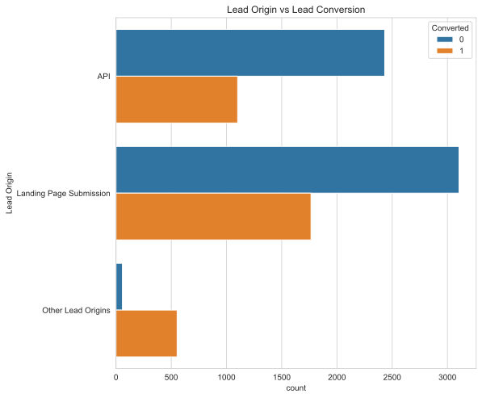

- Leads from `Landing Page Submission` followed by `API` make up 93% of all leads.
- But it is interesting that 8.3% of leads coming from other sources have the highest conversion rate of 87.5%

### Lead Source

```python
column = 'Lead Source'
categoricalUAn(column,figsize=[8,8])
```

    Types of Lead Source
    +----+--------------------+---------+------------+--------------------+----------------------+
    |    | Lead Source        |   Count |    Percent |   Cumulative Count |   Cumulative Percent |
    |----+--------------------+---------+------------+--------------------+----------------------|
    |  0 | Google             |    2857 | 0.316951   |               2857 |             0.316951 |
    |  1 | Direct Traffic     |    2528 | 0.280453   |               5385 |             0.597404 |
    |  2 | Olark Chat         |    1753 | 0.194475   |               7138 |             0.791879 |
    |  3 | Organic Search     |    1131 | 0.125471   |               8269 |             0.917351 |
    |  4 | Reference          |     443 | 0.0491458  |               8712 |             0.966497 |
    |  5 | Welingak Website   |     129 | 0.0143111  |               8841 |             0.980808 |
    |  6 | Referral Sites     |     120 | 0.0133126  |               8961 |             0.99412  |
    |  7 | Other Lead Sources |      53 | 0.00587974 |               9014 |             1        |
    +----+--------------------+---------+------------+--------------------+----------------------+
    Lead Source for Converted Leads
    +----+--------------------+---------+------------+--------------------+----------------------+
    |    | Lead Source        |   Count |    Percent |   Cumulative Count |   Cumulative Percent |
    |----+--------------------+---------+------------+--------------------+----------------------|
    |  0 | Google             |    1142 | 0.334016   |               1142 |             0.334016 |
    |  1 | Direct Traffic     |     815 | 0.238374   |               1957 |             0.57239  |
    |  2 | Olark Chat         |     448 | 0.131032   |               2405 |             0.703422 |
    |  3 | Organic Search     |     428 | 0.125183   |               2833 |             0.828605 |
    |  4 | Reference          |     410 | 0.119918   |               3243 |             0.948523 |
    |  5 | Welingak Website   |     127 | 0.0371454  |               3370 |             0.985668 |
    |  6 | Referral Sites     |      31 | 0.00906698 |               3401 |             0.994735 |
    |  7 | Other Lead Sources |      18 | 0.0052647  |               3419 |             1        |
    +----+--------------------+---------+------------+--------------------+----------------------+
    Lead Source for Un-Converted Leads
    +----+--------------------+---------+-------------+--------------------+----------------------+
    |    | Lead Source        |   Count |     Percent |   Cumulative Count |   Cumulative Percent |
    |----+--------------------+---------+-------------+--------------------+----------------------|
    |  0 | Google             |    1715 | 0.306524    |               1715 |             0.306524 |
    |  1 | Direct Traffic     |    1713 | 0.306166    |               3428 |             0.61269  |
    |  2 | Olark Chat         |    1305 | 0.233244    |               4733 |             0.845934 |
    |  3 | Organic Search     |     703 | 0.125648    |               5436 |             0.971582 |
    |  4 | Referral Sites     |      89 | 0.0159071   |               5525 |             0.987489 |
    |  5 | Other Lead Sources |      35 | 0.00625559  |               5560 |             0.993744 |
    |  6 | Reference          |      33 | 0.00589812  |               5593 |             0.999643 |
    |  7 | Welingak Website   |       2 | 0.000357462 |               5595 |             1        |
    +----+--------------------+---------+-------------+--------------------+----------------------+
    Lead Source vs Conversion Rate
    +--------------------+---------------+
    |                    |   Lead Source |
    |--------------------+---------------|
    | Direct Traffic     |      0.322389 |
    | Google             |      0.39972  |
    | Olark Chat         |      0.255562 |
    | Organic Search     |      0.378426 |
    | Other Lead Sources |      0.339623 |
    | Reference          |      0.925508 |
    | Referral Sites     |      0.258333 |
    | Welingak Website   |      0.984496 |
    +--------------------+---------------+


- Most leads that get converted come from `Google`(31%), followed by `Direct Traffic`(28%) and `Olark Chat`(19%)
- And leads through `Reference` have a very high conversion rate (91%)

### Do not Email

```python
feature = 'Do Not Email'
categoricalUAn(feature,figsize=[8,8])
```

    Types of Do Not Email
    +----+----------------+---------+-----------+--------------------+----------------------+
    |    | Do Not Email   |   Count |   Percent |   Cumulative Count |   Cumulative Percent |
    |----+----------------+---------+-----------+--------------------+----------------------|
    |  0 | No             |    8311 | 0.92201   |               8311 |              0.92201 |
    |  1 | Yes            |     703 | 0.0779898 |               9014 |              1       |
    +----+----------------+---------+-----------+--------------------+----------------------+
    Do Not Email for Converted Leads
    +----+----------------+---------+-----------+--------------------+----------------------+
    |    | Do Not Email   |   Count |   Percent |   Cumulative Count |   Cumulative Percent |
    |----+----------------+---------+-----------+--------------------+----------------------|
    |  0 | No             |    3315 | 0.969582  |               3315 |             0.969582 |
    |  1 | Yes            |     104 | 0.0304183 |               3419 |             1        |
    +----+----------------+---------+-----------+--------------------+----------------------+
    Do Not Email for Un-Converted Leads
    +----+----------------+---------+-----------+--------------------+----------------------+
    |    | Do Not Email   |   Count |   Percent |   Cumulative Count |   Cumulative Percent |
    |----+----------------+---------+-----------+--------------------+----------------------|
    |  0 | No             |    4996 |   0.89294 |               4996 |              0.89294 |
    |  1 | Yes            |     599 |   0.10706 |               5595 |              1       |
    +----+----------------+---------+-----------+--------------------+----------------------+
    Do Not Email vs Conversion Rate
    +-----+----------------+
    |     |   Do Not Email |
    |-----+----------------|
    | No  |       0.398869 |
    | Yes |       0.147937 |
    +-----+----------------+

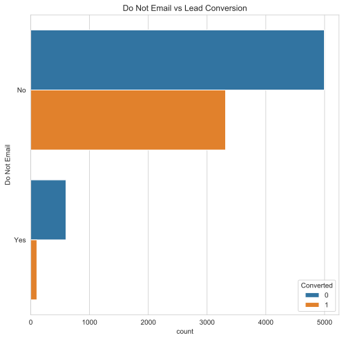

- 92% of leads prefer to be sent Emails about the company. `Do not Email = No`
- And these are the most converted customers (40%)

### Last Activity

```python
# 'Last Activity'
feature = 'Last Activity'
categoricalUAn(feature,figsize=[8,8])
```

    Types of Last Activity
    +----+---------------------------+---------+-----------+--------------------+----------------------+
    |    | Last Activity             |   Count |   Percent |   Cumulative Count |   Cumulative Percent |
    |----+---------------------------+---------+-----------+--------------------+----------------------|
    |  0 | Email Opened              |    3417 | 0.379077  |               3417 |             0.379077 |
    |  1 | SMS Sent                  |    2701 | 0.299645  |               6118 |             0.678722 |
    |  2 | Olark Chat Conversation   |     963 | 0.106834  |               7081 |             0.785556 |
    |  3 | Page Visited on Website   |     637 | 0.0706679 |               7718 |             0.856224 |
    |  4 | Converted to Lead         |     422 | 0.0468161 |               8140 |             0.90304  |
    |  5 | Email Bounced             |     304 | 0.0337253 |               8444 |             0.936765 |
    |  6 | Email Link Clicked        |     266 | 0.0295097 |               8710 |             0.966275 |
    |  7 | Other Last Activity       |     189 | 0.0209674 |               8899 |             0.987242 |
    |  8 | Form Submitted on Website |     115 | 0.0127579 |               9014 |             1        |
    +----+---------------------------+---------+-----------+--------------------+----------------------+
    Last Activity for Converted Leads
    +----+---------------------------+---------+------------+--------------------+----------------------+
    |    | Last Activity             |   Count |    Percent |   Cumulative Count |   Cumulative Percent |
    |----+---------------------------+---------+------------+--------------------+----------------------|
    |  0 | SMS Sent                  |    1697 | 0.496344   |               1697 |             0.496344 |
    |  1 | Email Opened              |    1246 | 0.364434   |               2943 |             0.860778 |
    |  2 | Page Visited on Website   |     150 | 0.0438725  |               3093 |             0.90465  |
    |  3 | Olark Chat Conversation   |      84 | 0.0245686  |               3177 |             0.929219 |
    |  4 | Other Last Activity       |      74 | 0.0216438  |               3251 |             0.950863 |
    |  5 | Email Link Clicked        |      72 | 0.0210588  |               3323 |             0.971922 |
    |  6 | Converted to Lead         |      53 | 0.0155016  |               3376 |             0.987423 |
    |  7 | Form Submitted on Website |      27 | 0.00789705 |               3403 |             0.99532  |
    |  8 | Email Bounced             |      16 | 0.00467973 |               3419 |             1        |
    +----+---------------------------+---------+------------+--------------------+----------------------+
    Last Activity for Un-Converted Leads
    +----+---------------------------+---------+-----------+--------------------+----------------------+
    |    | Last Activity             |   Count |   Percent |   Cumulative Count |   Cumulative Percent |
    |----+---------------------------+---------+-----------+--------------------+----------------------|
    |  0 | Email Opened              |    2171 | 0.388025  |               2171 |             0.388025 |
    |  1 | SMS Sent                  |    1004 | 0.179446  |               3175 |             0.567471 |
    |  2 | Olark Chat Conversation   |     879 | 0.157105  |               4054 |             0.724576 |
    |  3 | Page Visited on Website   |     487 | 0.087042  |               4541 |             0.811618 |
    |  4 | Converted to Lead         |     369 | 0.0659517 |               4910 |             0.877569 |
    |  5 | Email Bounced             |     288 | 0.0514745 |               5198 |             0.929044 |
    |  6 | Email Link Clicked        |     194 | 0.0346738 |               5392 |             0.963718 |
    |  7 | Other Last Activity       |     115 | 0.0205541 |               5507 |             0.984272 |
    |  8 | Form Submitted on Website |      88 | 0.0157283 |               5595 |             1        |
    +----+---------------------------+---------+-----------+--------------------+----------------------+
    Last Activity vs Conversion Rate
    +---------------------------+-----------------+
    |                           |   Last Activity |
    |---------------------------+-----------------|
    | Converted to Lead         |       0.125592  |
    | Email Bounced             |       0.0526316 |
    | Email Link Clicked        |       0.270677  |
    | Email Opened              |       0.364647  |
    | Form Submitted on Website |       0.234783  |
    | Olark Chat Conversation   |       0.0872274 |
    | Other Last Activity       |       0.391534  |
    | Page Visited on Website   |       0.235479  |
    | SMS Sent                  |       0.628286  |
    +---------------------------+-----------------+

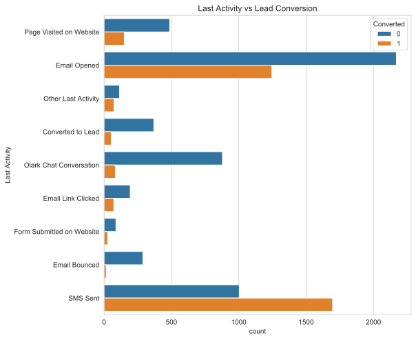

- Most leads open emails sent to them (38%) and that's their last activity.
- Among those leads who's last activity is opening emails, 37% are converted.
- Only 4% of last activity indicators show `Converted to Lead`
- Last activiy as 'SMS Sent' has highest conversion rate (62%).
- Last activiy as 'Email Bounced' has lowest conversion rate (7.9%).

### Country

```python
feature = 'Country'
categoricalUAn(feature,figsize=[8,8])

```

    Types of Country
    +----+---------------+---------+-----------+--------------------+----------------------+
    |    | Country       |   Count |   Percent |   Cumulative Count |   Cumulative Percent |
    |----+---------------+---------+-----------+--------------------+----------------------|
    |  0 | India         |    8787 |  0.974817 |               8787 |             0.974817 |
    |  1 | Outside India |     227 |  0.025183 |               9014 |             1        |
    +----+---------------+---------+-----------+--------------------+----------------------+
    Country for Converted Leads
    +----+---------------+---------+-----------+--------------------+----------------------+
    |    | Country       |   Count |   Percent |   Cumulative Count |   Cumulative Percent |
    |----+---------------+---------+-----------+--------------------+----------------------|
    |  0 | India         |    3351 | 0.980111  |               3351 |             0.980111 |
    |  1 | Outside India |      68 | 0.0198889 |               3419 |             1        |
    +----+---------------+---------+-----------+--------------------+----------------------+
    Country for Un-Converted Leads
    +----+---------------+---------+-----------+--------------------+----------------------+
    |    | Country       |   Count |   Percent |   Cumulative Count |   Cumulative Percent |
    |----+---------------+---------+-----------+--------------------+----------------------|
    |  0 | India         |    5436 | 0.971582  |               5436 |             0.971582 |
    |  1 | Outside India |     159 | 0.0284182 |               5595 |             1        |
    +----+---------------+---------+-----------+--------------------+----------------------+
    Country vs Conversion Rate
    +---------------+-----------+
    |               |   Country |
    |---------------+-----------|
    | India         |  0.381359 |
    | Outside India |  0.299559 |
    +---------------+-----------+

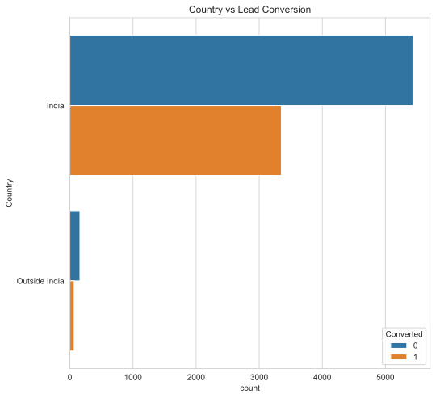

- Most leads come from India (97%)
- Out of these 38% are converted.

### Specialization

```python
feature = 'Specialization'
categoricalUAn(feature)
```

    Types of Specialization
    +----+-----------------------------------+---------+-----------+--------------------+----------------------+
    |    | Specialization                    |   Count |   Percent |   Cumulative Count |   Cumulative Percent |
    |----+-----------------------------------+---------+-----------+--------------------+----------------------|
    |  0 | No Specialization                 |    3230 | 0.358331  |               3230 |             0.358331 |
    |  1 | Finance Management                |     959 | 0.10639   |               4189 |             0.464722 |
    |  2 | Human Resource Management         |     836 | 0.0927446 |               5025 |             0.557466 |
    |  3 | Marketing Management              |     822 | 0.0911915 |               5847 |             0.648658 |
    |  4 | Operations Management             |     498 | 0.0552474 |               6345 |             0.703905 |
    |  5 | Business Administration           |     397 | 0.0440426 |               6742 |             0.747948 |
    |  6 | IT Projects Management            |     366 | 0.0406035 |               7108 |             0.788551 |
    |  7 | Supply Chain Management           |     344 | 0.0381629 |               7452 |             0.826714 |
    |  8 | Banking, Investment And Insurance |     335 | 0.0371644 |               7787 |             0.863878 |
    |  9 | Other Specialization              |     270 | 0.0299534 |               8057 |             0.893832 |
    | 10 | Travel and Tourism                |     202 | 0.0224096 |               8259 |             0.916241 |
    | 11 | Media and Advertising             |     202 | 0.0224096 |               8461 |             0.938651 |
    | 12 | International Business            |     176 | 0.0195252 |               8637 |             0.958176 |
    | 13 | Healthcare Management             |     156 | 0.0173064 |               8793 |             0.975483 |
    | 14 | E-COMMERCE                        |     111 | 0.0123142 |               8904 |             0.987797 |
    | 15 | Hospitality Management            |     110 | 0.0122032 |               9014 |             1        |
    +----+-----------------------------------+---------+-----------+--------------------+----------------------+
    Specialization for Converted Leads
    +----+-----------------------------------+---------+-----------+--------------------+----------------------+
    |    | Specialization                    |   Count |   Percent |   Cumulative Count |   Cumulative Percent |
    |----+-----------------------------------+---------+-----------+--------------------+----------------------|
    |  0 | No Specialization                 |     888 | 0.259725  |                888 |             0.259725 |
    |  1 | Finance Management                |     422 | 0.123428  |               1310 |             0.383153 |
    |  2 | Marketing Management              |     397 | 0.116116  |               1707 |             0.499269 |
    |  3 | Human Resource Management         |     379 | 0.110851  |               2086 |             0.61012  |
    |  4 | Operations Management             |     234 | 0.0684411 |               2320 |             0.678561 |
    |  5 | Business Administration           |     175 | 0.0511846 |               2495 |             0.729746 |
    |  6 | Banking, Investment And Insurance |     164 | 0.0479672 |               2659 |             0.777713 |
    |  7 | Supply Chain Management           |     147 | 0.042995  |               2806 |             0.820708 |
    |  8 | IT Projects Management            |     140 | 0.0409476 |               2946 |             0.861655 |
    |  9 | Other Specialization              |      97 | 0.0283709 |               3043 |             0.890026 |
    | 10 | Media and Advertising             |      84 | 0.0245686 |               3127 |             0.914595 |
    | 11 | Healthcare Management             |      76 | 0.0222287 |               3203 |             0.936824 |
    | 12 | Travel and Tourism                |      71 | 0.0207663 |               3274 |             0.95759  |
    | 13 | International Business            |      62 | 0.018134  |               3336 |             0.975724 |
    | 14 | Hospitality Management            |      44 | 0.0128693 |               3380 |             0.988593 |
    | 15 | E-COMMERCE                        |      39 | 0.0114068 |               3419 |             1        |
    +----+-----------------------------------+---------+-----------+--------------------+----------------------+
    Specialization for Un-Converted Leads
    +----+-----------------------------------+---------+-----------+--------------------+----------------------+
    |    | Specialization                    |   Count |   Percent |   Cumulative Count |   Cumulative Percent |
    |----+-----------------------------------+---------+-----------+--------------------+----------------------|
    |  0 | No Specialization                 |    2342 | 0.418588  |               2342 |             0.418588 |
    |  1 | Finance Management                |     537 | 0.0959786 |               2879 |             0.514567 |
    |  2 | Human Resource Management         |     457 | 0.0816801 |               3336 |             0.596247 |
    |  3 | Marketing Management              |     425 | 0.0759607 |               3761 |             0.672207 |
    |  4 | Operations Management             |     264 | 0.047185  |               4025 |             0.719392 |
    |  5 | IT Projects Management            |     226 | 0.0403932 |               4251 |             0.759786 |
    |  6 | Business Administration           |     222 | 0.0396783 |               4473 |             0.799464 |
    |  7 | Supply Chain Management           |     197 | 0.03521   |               4670 |             0.834674 |
    |  8 | Other Specialization              |     173 | 0.0309205 |               4843 |             0.865594 |
    |  9 | Banking, Investment And Insurance |     171 | 0.030563  |               5014 |             0.896157 |
    | 10 | Travel and Tourism                |     131 | 0.0234138 |               5145 |             0.919571 |
    | 11 | Media and Advertising             |     118 | 0.0210903 |               5263 |             0.940661 |
    | 12 | International Business            |     114 | 0.0203753 |               5377 |             0.961037 |
    | 13 | Healthcare Management             |      80 | 0.0142985 |               5457 |             0.975335 |
    | 14 | E-COMMERCE                        |      72 | 0.0128686 |               5529 |             0.988204 |
    | 15 | Hospitality Management            |      66 | 0.0117962 |               5595 |             1        |
    +----+-----------------------------------+---------+-----------+--------------------+----------------------+
    Specialization vs Conversion Rate
    +-----------------------------------+------------------+
    |                                   |   Specialization |
    |-----------------------------------+------------------|
    | Banking, Investment And Insurance |         0.489552 |
    | Business Administration           |         0.440806 |
    | E-COMMERCE                        |         0.351351 |
    | Finance Management                |         0.440042 |
    | Healthcare Management             |         0.487179 |
    | Hospitality Management            |         0.4      |
    | Human Resource Management         |         0.453349 |
    | IT Projects Management            |         0.382514 |
    | International Business            |         0.352273 |
    | Marketing Management              |         0.482968 |
    | Media and Advertising             |         0.415842 |
    | No Specialization                 |         0.274923 |
    | Operations Management             |         0.46988  |
    | Other Specialization              |         0.359259 |
    | Supply Chain Management           |         0.427326 |
    | Travel and Tourism                |         0.351485 |
    +-----------------------------------+------------------+

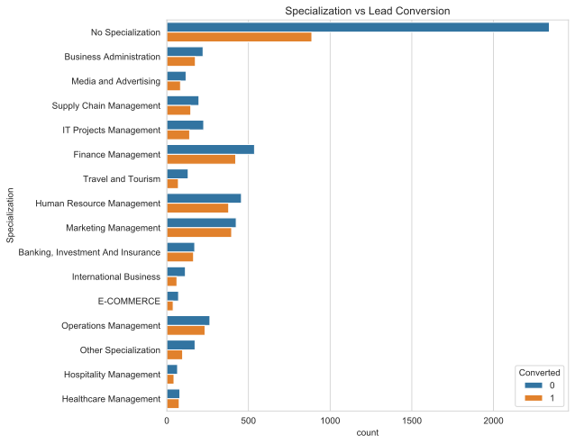

- Specialization of 36% of leads is missing.
- We have mapped those missing values with 'No Specialization'.There might be two reason for this,
  - Lead might be a fresher.
  - Lead missed to fill it.
- Among all the specializations, ' Banking, Investment And Insurance' has the highest conversion rate(48.9%).

### What is your current occupation

```python
feature = 'What is your current occupation'
categoricalUAn(feature,figsize=[8,8])
```

    Types of What is your current occupation
    +----+-----------------------------------+---------+-------------+--------------------+----------------------+
    |    | What is your current occupation   |   Count |     Percent |   Cumulative Count |   Cumulative Percent |
    |----+-----------------------------------+---------+-------------+--------------------+----------------------|
    |  0 | Unemployed                        |    5445 | 0.60406     |               5445 |             0.60406  |
    |  1 | Unknown Occupation                |    2656 | 0.294653    |               8101 |             0.898713 |
    |  2 | Working Professional              |     675 | 0.0748835   |               8776 |             0.973597 |
    |  3 | Student                           |     206 | 0.0228533   |               8982 |             0.99645  |
    |  4 | Other                             |      15 | 0.00166408  |               8997 |             0.998114 |
    |  5 | Housewife                         |       9 | 0.000998447 |               9006 |             0.999112 |
    |  6 | Businessman                       |       8 | 0.000887508 |               9014 |             1        |
    +----+-----------------------------------+---------+-------------+--------------------+----------------------+
    What is your current occupation for Converted Leads
    +----+-----------------------------------+---------+------------+--------------------+----------------------+
    |    | What is your current occupation   |   Count |    Percent |   Cumulative Count |   Cumulative Percent |
    |----+-----------------------------------+---------+------------+--------------------+----------------------|
    |  0 | Unemployed                        |    2336 | 0.683241   |               2336 |             0.683241 |
    |  1 | Working Professional              |     620 | 0.18134    |               2956 |             0.86458  |
    |  2 | Unknown Occupation                |     366 | 0.107049   |               3322 |             0.971629 |
    |  3 | Student                           |      74 | 0.0216438  |               3396 |             0.993273 |
    |  4 | Other                             |       9 | 0.00263235 |               3405 |             0.995905 |
    |  5 | Housewife                         |       9 | 0.00263235 |               3414 |             0.998538 |
    |  6 | Businessman                       |       5 | 0.00146242 |               3419 |             1        |
    +----+-----------------------------------+---------+------------+--------------------+----------------------+
    What is your current occupation for Un-Converted Leads
    +----+-----------------------------------+---------+-------------+--------------------+----------------------+
    |    | What is your current occupation   |   Count |     Percent |   Cumulative Count |   Cumulative Percent |
    |----+-----------------------------------+---------+-------------+--------------------+----------------------|
    |  0 | Unemployed                        |    3109 | 0.555675    |               3109 |             0.555675 |
    |  1 | Unknown Occupation                |    2290 | 0.409294    |               5399 |             0.964969 |
    |  2 | Student                           |     132 | 0.0235925   |               5531 |             0.988561 |
    |  3 | Working Professional              |      55 | 0.00983021  |               5586 |             0.998391 |
    |  4 | Other                             |       6 | 0.00107239  |               5592 |             0.999464 |
    |  5 | Businessman                       |       3 | 0.000536193 |               5595 |             1        |
    +----+-----------------------------------+---------+-------------+--------------------+----------------------+
    What is your current occupation vs Conversion Rate
    +----------------------+-----------------------------------+
    |                      |   What is your current occupation |
    |----------------------+-----------------------------------|
    | Businessman          |                          0.625    |
    | Housewife            |                        nan        |
    | Other                |                          0.6      |
    | Student              |                          0.359223 |
    | Unemployed           |                          0.429017 |
    | Unknown Occupation   |                          0.137801 |
    | Working Professional |                          0.918519 |
    +----------------------+-----------------------------------+

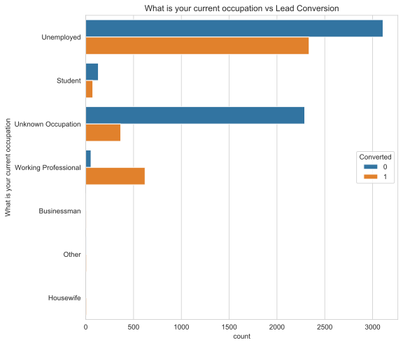

- Although the conversion rate for Working Professional is the highest ! 91.6%, they only make 7.4% of all leads. 60% leads are Unemployed customers followed by 29% with unknown nature of employment
- Among all the converted leads, Unemployed and Working Professionals top the list.
- Conversion for Housewife segment is 100%

### City

```python
feature = 'City'
categoricalUAn(feature)
```

    Types of City
    +----+-----------------------------+---------+------------+--------------------+----------------------+
    |    | City                        |   Count |    Percent |   Cumulative Count |   Cumulative Percent |
    |----+-----------------------------+---------+------------+--------------------+----------------------|
    |  0 | Mumbai                      |    6692 | 0.742401   |               6692 |             0.742401 |
    |  1 | Thane & Outskirts           |     745 | 0.0826492  |               7437 |             0.82505  |
    |  2 | Other Cities                |     680 | 0.0754382  |               8117 |             0.900488 |
    |  3 | Other Cities of Maharashtra |     446 | 0.0494786  |               8563 |             0.949967 |
    |  4 | Other Metro Cities          |     377 | 0.0418238  |               8940 |             0.991791 |
    |  5 | Tier II Cities              |      74 | 0.00820945 |               9014 |             1        |
    +----+-----------------------------+---------+------------+--------------------+----------------------+
    City for Converted Leads
    +----+-----------------------------+---------+------------+--------------------+----------------------+
    |    | City                        |   Count |    Percent |   Cumulative Count |   Cumulative Percent |
    |----+-----------------------------+---------+------------+--------------------+----------------------|
    |  0 | Mumbai                      |    2440 | 0.713659   |               2440 |             0.713659 |
    |  1 | Thane & Outskirts           |     332 | 0.0971044  |               2772 |             0.810763 |
    |  2 | Other Cities                |     272 | 0.0795554  |               3044 |             0.890319 |
    |  3 | Other Cities of Maharashtra |     196 | 0.0573267  |               3240 |             0.947646 |
    |  4 | Other Metro Cities          |     154 | 0.0450424  |               3394 |             0.992688 |
    |  5 | Tier II Cities              |      25 | 0.00731208 |               3419 |             1        |
    +----+-----------------------------+---------+------------+--------------------+----------------------+
    City for Un-Converted Leads
    +----+-----------------------------+---------+------------+--------------------+----------------------+
    |    | City                        |   Count |    Percent |   Cumulative Count |   Cumulative Percent |
    |----+-----------------------------+---------+------------+--------------------+----------------------|
    |  0 | Mumbai                      |    4252 | 0.759964   |               4252 |             0.759964 |
    |  1 | Thane & Outskirts           |     413 | 0.0738159  |               4665 |             0.83378  |
    |  2 | Other Cities                |     408 | 0.0729223  |               5073 |             0.906702 |
    |  3 | Other Cities of Maharashtra |     250 | 0.0446828  |               5323 |             0.951385 |
    |  4 | Other Metro Cities          |     223 | 0.039857   |               5546 |             0.991242 |
    |  5 | Tier II Cities              |      49 | 0.00875782 |               5595 |             1        |
    +----+-----------------------------+---------+------------+--------------------+----------------------+
    City vs Conversion Rate
    +-----------------------------+----------+
    |                             |     City |
    |-----------------------------+----------|
    | Mumbai                      | 0.364614 |
    | Thane & Outskirts           | 0.445638 |
    | Other Cities                | 0.4      |
    | Other Cities of Maharashtra | 0.439462 |
    | Other Metro Cities          | 0.408488 |
    | Tier II Cities              | 0.337838 |
    +-----------------------------+----------+

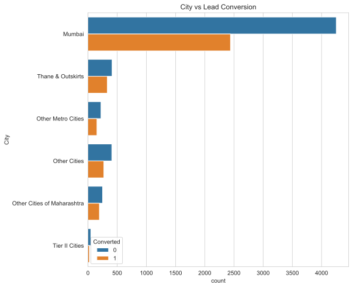

- Most Leads come from 'Mumbai' and they have a decent conversion rate of 36.4%.
- Leads from Thane and outskirts make up 8.2% with a conversion rate of 44%

### A free copy of Mastering The Interview.

```python
feature = 'A free copy of Mastering The Interview'
categoricalUAn(feature)
```

    Types of A free copy of Mastering The Interview
    +----+------------------------------------------+---------+-----------+--------------------+----------------------+
    |    | A free copy of Mastering The Interview   |   Count |   Percent |   Cumulative Count |   Cumulative Percent |
    |----+------------------------------------------+---------+-----------+--------------------+----------------------|
    |  0 | No                                       |    6126 |  0.679609 |               6126 |             0.679609 |
    |  1 | Yes                                      |    2888 |  0.320391 |               9014 |             1        |
    +----+------------------------------------------+---------+-----------+--------------------+----------------------+
    A free copy of Mastering The Interview for Converted Leads
    +----+------------------------------------------+---------+-----------+--------------------+----------------------+
    |    | A free copy of Mastering The Interview   |   Count |   Percent |   Cumulative Count |   Cumulative Percent |
    |----+------------------------------------------+---------+-----------+--------------------+----------------------|
    |  0 | No                                       |    2389 |  0.698742 |               2389 |             0.698742 |
    |  1 | Yes                                      |    1030 |  0.301258 |               3419 |             1        |
    +----+------------------------------------------+---------+-----------+--------------------+----------------------+
    A free copy of Mastering The Interview for Un-Converted Leads
    +----+------------------------------------------+---------+-----------+--------------------+----------------------+
    |    | A free copy of Mastering The Interview   |   Count |   Percent |   Cumulative Count |   Cumulative Percent |
    |----+------------------------------------------+---------+-----------+--------------------+----------------------|
    |  0 | No                                       |    3737 |  0.667918 |               3737 |             0.667918 |
    |  1 | Yes                                      |    1858 |  0.332082 |               5595 |             1        |
    +----+------------------------------------------+---------+-----------+--------------------+----------------------+
    A free copy of Mastering The Interview vs Conversion Rate
    +-----+------------------------------------------+
    |     |   A free copy of Mastering The Interview |
    |-----+------------------------------------------|
    | No  |                                 0.389977 |
    | Yes |                                 0.356648 |
    +-----+------------------------------------------+

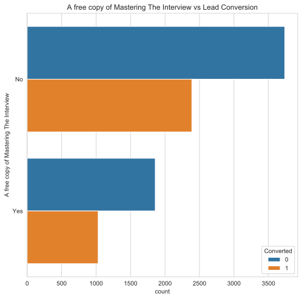

- 68% of the leads said "No" for a free copy of 'Mastering The Interview'.
- Conversion rate of leads who said "No" is high (39.8%).

```python
def num_univariate_analysis(column_name,scale='linear') :

    converted = leads[leads['Converted'] == 1]
    unconverted = leads[leads['Converted'] == 0]

    plt.figure(figsize=(8,6))
    ax = sns.boxplot(x=column_name, y='Converted', data = leads)
    title = 'Boxplot of ' + column_name+' vs Conversion'
    ax.set(title=title)
    if scale == 'log' :
        ax.set_xscale('log')
        ax.set(ylabel=column_name + '(Log Scale)')

    print("Spread for range of "+column_name+" that were Converted")
    tab(converted[column_name].describe())
    print("Spread for range of "+column_name+" that were not converted")
    tab(unconverted[column_name].describe())
```

### TotalVisits

```python
column_name = 'TotalVisits'
num_univariate_analysis(column_name,scale='log')
```

    Spread for range of TotalVisits that were Converted
    +-------+---------------+
    |       |   TotalVisits |
    |-------+---------------|
    | count |    3419       |
    | mean  |       3.65575 |
    | std   |       5.57527 |
    | min   |       0       |
    | 25%   |       0       |
    | 50%   |       3       |
    | 75%   |       5       |
    | max   |     251       |
    +-------+---------------+
    Spread for range of TotalVisits that were not converted
    +-------+---------------+
    |       |   TotalVisits |
    |-------+---------------|
    | count |    5595       |
    | mean  |       3.33262 |
    | std   |       4.37298 |
    | min   |       0       |
    | 25%   |       1       |
    | 50%   |       3       |
    | 75%   |       4       |
    | max   |     141       |
    +-------+---------------+

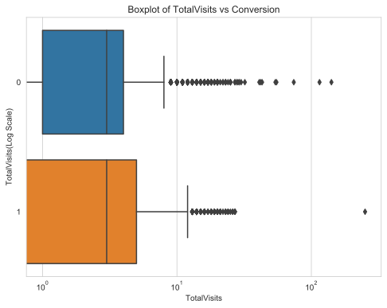

- Looks like `Total Visits` have a lot of outliers among both `Converted` and `Un-converted` leads.
- Let's take a look at the quantiles between 90 and 100.

```python
# Looking at Quantiles
tab(leads[column_name].quantile(np.linspace(.90,1,20)))

```

    +----------+---------------+
    |          |   TotalVisits |
    |----------+---------------|
    | 0.9      |             7 |
    | 0.905263 |             7 |
    | 0.910526 |             8 |
    | 0.915789 |             8 |
    | 0.921053 |             8 |
    | 0.926316 |             8 |
    | 0.931579 |             9 |
    | 0.936842 |             9 |
    | 0.942105 |             9 |
    | 0.947368 |             9 |
    | 0.952632 |            10 |
    | 0.957895 |            10 |
    | 0.963158 |            11 |
    | 0.968421 |            11 |
    | 0.973684 |            12 |
    | 0.978947 |            13 |
    | 0.984211 |            14 |
    | 0.989474 |            17 |
    | 0.994737 |            20 |
    | 1        |           251 |
    +----------+---------------+

- From the above, it is clear that outliers exist and these might skew the analyses.
- For now, let's cap the outliers about 99th percentile to 99th percentile value. `soft range` capping.

```python
# Capping outliers to 99th perentile value
cap = leads[column_name].quantile(.99)
condition = leads[column_name] > cap
leads.loc[condition, column_name] = cap
```

### Total TIme Spent on Website.

```python
column = 'Total Time Spent on Website'
num_univariate_analysis(column)
```

    Spread for range of Total Time Spent on Website that were Converted
    +-------+-------------------------------+
    |       |   Total Time Spent on Website |
    |-------+-------------------------------|
    | count |                      3419     |
    | mean  |                       732.945 |
    | std   |                       614.476 |
    | min   |                         0     |
    | 25%   |                         0     |
    | 50%   |                       826     |
    | 75%   |                      1265.5   |
    | max   |                      2253     |
    +-------+-------------------------------+
    Spread for range of Total Time Spent on Website that were not converted
    +-------+-------------------------------+
    |       |   Total Time Spent on Website |
    |-------+-------------------------------|
    | count |                      5595     |
    | mean  |                       329.919 |
    | std   |                       432.757 |
    | min   |                         0     |
    | 25%   |                        14     |
    | 50%   |                       178     |
    | 75%   |                       393.5   |
    | max   |                      2272     |
    +-------+-------------------------------+

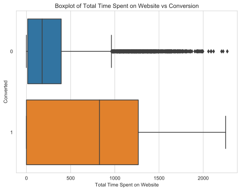

- 'Total Time Spend on Website' has many outliers.
- Let's look quantiles to confirm this.

```python
tab(leads[column].quantile(np.linspace(0.75,1,25)))
```

    +----------+-------------------------------+
    |          |   Total Time Spent on Website |
    |----------+-------------------------------|
    | 0.75     |                       924     |
    | 0.760417 |                       953.635 |
    | 0.770833 |                       991     |
    | 0.78125  |                      1022.41  |
    | 0.791667 |                      1054     |
    | 0.802083 |                      1087     |
    | 0.8125   |                      1115.06  |
    | 0.822917 |                      1143     |
    | 0.833333 |                      1177.83  |
    | 0.84375  |                      1208     |
    | 0.854167 |                      1238.6   |
    | 0.864583 |                      1271     |
    | 0.875    |                      1296.38  |
    | 0.885417 |                      1328     |
    | 0.895833 |                      1360     |
    | 0.90625  |                      1392     |
    | 0.916667 |                      1434     |
    | 0.927083 |                      1468     |
    | 0.9375   |                      1503     |
    | 0.947917 |                      1549     |
    | 0.958333 |                      1592.46  |
    | 0.96875  |                      1647     |
    | 0.979167 |                      1720.23  |
    | 0.989583 |                      1830.34  |
    | 1        |                      2272     |
    +----------+-------------------------------+

```python
leads[column].quantile(np.linspace(0.75,1,50)).plot()
```

    <matplotlib.axes._subplots.AxesSubplot at 0x7febc49bb150>

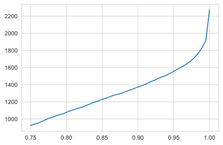

```python
# Capping `Total Time Spent on Website` values to 99th percentile
cap = leads[column].quantile(.99)
condition = leads[column] > cap
leads.loc[condition, column] = cap
```

### Page Views Per Visit.

```python
column = 'Page Views Per Visit'
num_univariate_analysis(column)
```

    Spread for range of Page Views Per Visit that were Converted
    +-------+------------------------+
    |       |   Page Views Per Visit |
    |-------+------------------------|
    | count |             3419       |
    | mean  |                2.36407 |
    | std   |                2.10862 |
    | min   |                0       |
    | 25%   |                0       |
    | 50%   |                2       |
    | 75%   |                3.5     |
    | max   |               15       |
    +-------+------------------------+
    Spread for range of Page Views Per Visit that were not converted
    +-------+------------------------+
    |       |   Page Views Per Visit |
    |-------+------------------------|
    | count |             5595       |
    | mean  |                2.36962 |
    | std   |                2.17789 |
    | min   |                0       |
    | 25%   |                1       |
    | 50%   |                2       |
    | 75%   |                3       |
    | max   |               55       |
    +-------+------------------------+

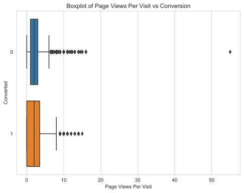

- 'Page Views Per Visit' has many outliers.
- Let's look quantiles to confirm this.

```python
leads[column].quantile(np.linspace(0.75,1,30)).plot()
```

    <matplotlib.axes._subplots.AxesSubplot at 0x7febc45a4350>

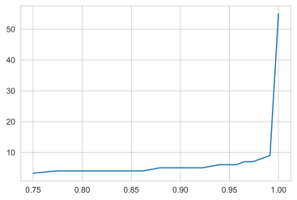

- There is a sudden jump between 99th percentile and maximum value.
- let's cap the values to 99th percentile to avoid skewing the analysis

```python
# Capping `Page Views Per Visit` values to 99th percentile
cap = leads[column].quantile(.99)
condition = leads[column] > cap
leads.loc[condition, column] = cap
```

## Bivariate Analysis

```python
leads.columns.values
```

    array(['Lead Origin', 'Lead Source', 'Do Not Email', 'Converted',
           'TotalVisits', 'Total Time Spent on Website',
           'Page Views Per Visit', 'Last Activity', 'Country',
           'Specialization', 'What is your current occupation', 'City',
           'A free copy of Mastering The Interview'], dtype=object)

```python
continuous_vars = ['TotalVisits', 'Page Views Per Visit', 'Total Time Spent on Website']
```

### TotalVisits vs A free copy of Mastering The Interview

```python
plt.figure(figsize=[8,8])
sns.barplot(x=continuous_vars[0], y = 'A free copy of Mastering The Interview', data=leads, hue='Converted')
```

    <matplotlib.axes._subplots.AxesSubplot at 0x7febc49438d0>

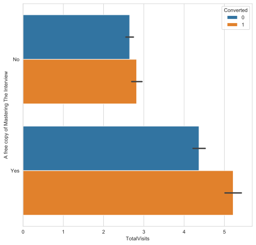

- One can see that the proportion of leads with high Total Visits to the website also like a free copy of Mastering The Interview.
- Incidentally, these are leads with higher conversion rate.
- More convertable leads are being attracted by the website through providing 'A free copy of Mastering The Interview'.

### Lead Source vs Country

```python
# sns.barplot(x='Lead Source', y = 'Country', hue='Converted', data=leads)
leads.groupby(['Country','Lead Source'])['Converted'].value_counts(normalize=True)\
.unstack()\
   .plot(
    layout=(2,2),
    figsize=(14,12), kind='barh', stacked=True)
```

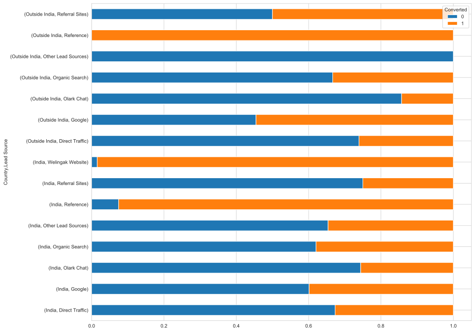

- Most leads from India through Reference Sources have very high conversion rate.
- Leads from outside of India from other Lead sources do not convert at all.

### Occupation vs City

```python
x = "What is your current occupation"
y = 'City'

leads.groupby([x,y])['Converted'].value_counts(normalize=True)\
.unstack()\
   .plot(
    layout=(2,2),
    figsize=(14,12), kind='barh', stacked=True);
```

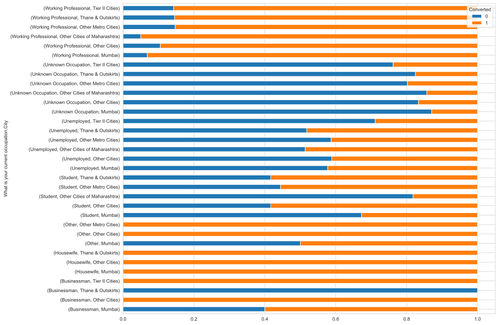

- Working Professionals in Other cities of Maharashtra have higher conversion rates compared to those from Mumbai , Thane and other cities.
- BusinessMen from Mumbai and Thane & Outskirts are poor leads in comparison to Tier 2 and Other cities .

### Last Activity vs Country

```python
x = "Country"
y = 'Last Activity'

leads.groupby([x,y])['Converted'].value_counts(normalize=True)\
.unstack()\
   .plot(
    layout=(2,2),
    figsize=(14,12), kind='barh', stacked=True);
```

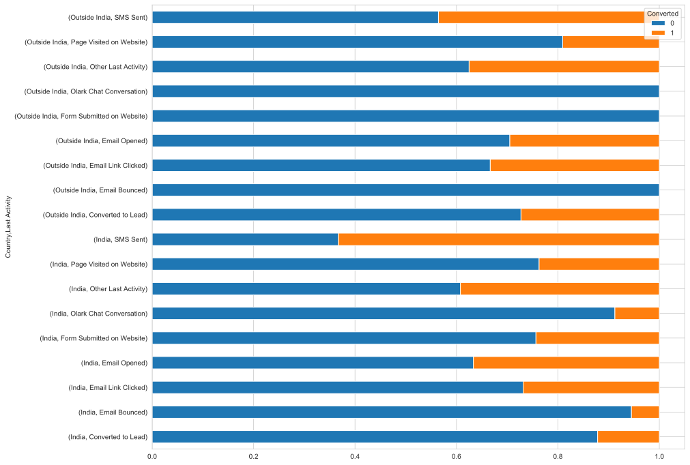

- SMS and Emails are more favourable for conversion over Website Visits outside of India.
- Leads from outside of India who click email links have higher conversion rate compared those from India.

## Data Preparation

### Mapping Binary Variables to 0 / 1

```python
binary_var = ['Do Not Email', 'A free copy of Mastering The Interview']
leads[binary_var] = leads[binary_var].replace({'Yes' : 1, 'No' : 0})
```

### Creating Indicator Variables

```python
categoricalCol = ['Lead Origin', 'Lead Source','Last Activity', 'Country', 'Specialization',
       'What is your current occupation', 'City']

print('Levels in Each Cateogrical Variable\n')
for col in sorted(categoricalCol) :
    print(col, leads[col].unique(), '\n')

# Creating dummy variables
leadOriginDummies = pd.get_dummies(leads['Lead Origin'], drop_first=True)
leadSourceDummies = pd.get_dummies(leads['Lead Source'], drop_first=True)
lastActivityDummies = pd.get_dummies(leads['Last Activity'], drop_first=True)
countryDummies = pd.get_dummies(leads['Country'] ,drop_first=True)
specDummies = pd.get_dummies(leads['Specialization'],drop_first=True)
occupationDummies = pd.get_dummies(leads[ 'What is your current occupation'],drop_first=True)
cityDummies = pd.get_dummies(leads[ 'City'],drop_first=True)

# adding dummy variables to leads dataframe
leads = pd.concat([leads, leadOriginDummies,leadSourceDummies,lastActivityDummies, countryDummies, specDummies, occupationDummies, cityDummies], axis=1)

# dropping categorical columns
leads.drop(columns = categoricalCol, inplace=True)


print('Final Columns')
leads.columns
```

    Levels in Each Cateogrical Variable

    City ['Mumbai' 'Thane & Outskirts' 'Other Metro Cities' 'Other Cities'
     'Other Cities of Maharashtra' 'Tier II Cities']

    Country ['India' 'Outside India']

    Last Activity ['Page Visited on Website' 'Email Opened' 'Other Last Activity'
     'Converted to Lead' 'Olark Chat Conversation' 'Email Link Clicked'
     'Form Submitted on Website' 'Email Bounced' 'SMS Sent']

    Lead Origin ['API' 'Landing Page Submission' 'Other Lead Origins']

    Lead Source ['Olark Chat' 'Organic Search' 'Direct Traffic' 'Google' 'Referral Sites'
     'Reference' 'Welingak Website' 'Other Lead Sources']

    Specialization ['No Specialization' 'Business Administration' 'Media and Advertising'
     'Supply Chain Management' 'IT Projects Management' 'Finance Management'
     'Travel and Tourism' 'Human Resource Management' 'Marketing Management'
     'Banking, Investment And Insurance' 'International Business' 'E-COMMERCE'
     'Operations Management' 'Other Specialization' 'Hospitality Management'
     'Healthcare Management']

    What is your current occupation ['Unemployed' 'Student' 'Unknown Occupation' 'Working Professional'
     'Businessman' 'Other' 'Housewife']

    Final Columns


    Index(['Do Not Email', 'Converted', 'TotalVisits',
           'Total Time Spent on Website', 'Page Views Per Visit',
           'A free copy of Mastering The Interview', 'Landing Page Submission',
           'Other Lead Origins', 'Google', 'Olark Chat', 'Organic Search',
           'Other Lead Sources', 'Reference', 'Referral Sites', 'Welingak Website',
           'Email Bounced', 'Email Link Clicked', 'Email Opened',
           'Form Submitted on Website', 'Olark Chat Conversation',
           'Other Last Activity', 'Page Visited on Website', 'SMS Sent',
           'Outside India', 'Business Administration', 'E-COMMERCE',
           'Finance Management', 'Healthcare Management', 'Hospitality Management',
           'Human Resource Management', 'IT Projects Management',
           'International Business', 'Marketing Management',
           'Media and Advertising', 'No Specialization', 'Operations Management',
           'Other Specialization', 'Supply Chain Management', 'Travel and Tourism',
           'Housewife', 'Other', 'Student', 'Unemployed', 'Unknown Occupation',
           'Working Professional', 'Other Cities', 'Other Cities of Maharashtra',
           'Other Metro Cities', 'Thane & Outskirts', 'Tier II Cities'],
          dtype='object')

### Correlation

```python
# Top Correlations
def correlation(dataframe) :
    cor0=dataframe.corr()
    type(cor0)
    cor0.where(np.triu(np.ones(cor0.shape),k=1).astype(np.bool))
    cor0=cor0.unstack().reset_index()
    cor0.columns=['VAR1','VAR2','CORR']
    cor0.dropna(subset=['CORR'], inplace=True)
    cor0.CORR=round(cor0['CORR'],2)
    cor0.CORR=cor0.CORR.abs()
    cor0.sort_values(by=['CORR'],ascending=False)
    cor0=cor0[~(cor0['VAR1']==cor0['VAR2'])]
    return pd.DataFrame(cor0.sort_values(by=['CORR'],ascending=False))

```

```python
#Correlations for Converted Leads
convertedCondition= leads['Converted']==1
print('Correlations for Converted Leads')
correlation(leads[convertedCondition])[1:30:2].style.background_gradient(cmap='GnBu').hide_index()
```

    Correlations for Converted Leads

<table id="T_358dedba_f00d_11ea_8784_88e9fe4e6667" >
  <thead>
    <tr>
      <th class="col_heading level0 col0" >VAR1</th>
      <th class="col_heading level0 col1" >VAR2</th>
      <th class="col_heading level0 col2" >CORR</th>
    </tr>
  </thead>
  <tbody>
    <tr>
                                <td id="T_358dedba_f00d_11ea_8784_88e9fe4e6667row0_col0" class="data row0 col0" >Other Lead Origins</td>
                        <td id="T_358dedba_f00d_11ea_8784_88e9fe4e6667row0_col1" class="data row0 col1" >Reference</td>
                        <td id="T_358dedba_f00d_11ea_8784_88e9fe4e6667row0_col2" class="data row0 col2" >0.840000</td>
            </tr>
            <tr>
                                <td id="T_358dedba_f00d_11ea_8784_88e9fe4e6667row1_col0" class="data row1 col0" >SMS Sent</td>
                        <td id="T_358dedba_f00d_11ea_8784_88e9fe4e6667row1_col1" class="data row1 col1" >Email Opened</td>
                        <td id="T_358dedba_f00d_11ea_8784_88e9fe4e6667row1_col2" class="data row1 col2" >0.750000</td>
            </tr>
            <tr>
                                <td id="T_358dedba_f00d_11ea_8784_88e9fe4e6667row2_col0" class="data row2 col0" >Unemployed</td>
                        <td id="T_358dedba_f00d_11ea_8784_88e9fe4e6667row2_col1" class="data row2 col1" >Working Professional</td>
                        <td id="T_358dedba_f00d_11ea_8784_88e9fe4e6667row2_col2" class="data row2 col2" >0.690000</td>
            </tr>
            <tr>
                                <td id="T_358dedba_f00d_11ea_8784_88e9fe4e6667row3_col0" class="data row3 col0" >Page Views Per Visit</td>
                        <td id="T_358dedba_f00d_11ea_8784_88e9fe4e6667row3_col1" class="data row3 col1" >TotalVisits</td>
                        <td id="T_358dedba_f00d_11ea_8784_88e9fe4e6667row3_col2" class="data row3 col2" >0.680000</td>
            </tr>
            <tr>
                                <td id="T_358dedba_f00d_11ea_8784_88e9fe4e6667row4_col0" class="data row4 col0" >No Specialization</td>
                        <td id="T_358dedba_f00d_11ea_8784_88e9fe4e6667row4_col1" class="data row4 col1" >Landing Page Submission</td>
                        <td id="T_358dedba_f00d_11ea_8784_88e9fe4e6667row4_col2" class="data row4 col2" >0.600000</td>
            </tr>
            <tr>
                                <td id="T_358dedba_f00d_11ea_8784_88e9fe4e6667row5_col0" class="data row5 col0" >Page Views Per Visit</td>
                        <td id="T_358dedba_f00d_11ea_8784_88e9fe4e6667row5_col1" class="data row5 col1" >Landing Page Submission</td>
                        <td id="T_358dedba_f00d_11ea_8784_88e9fe4e6667row5_col2" class="data row5 col2" >0.560000</td>
            </tr>
            <tr>
                                <td id="T_358dedba_f00d_11ea_8784_88e9fe4e6667row6_col0" class="data row6 col0" >Landing Page Submission</td>
                        <td id="T_358dedba_f00d_11ea_8784_88e9fe4e6667row6_col1" class="data row6 col1" >A free copy of Mastering The Interview</td>
                        <td id="T_358dedba_f00d_11ea_8784_88e9fe4e6667row6_col2" class="data row6 col2" >0.540000</td>
            </tr>
            <tr>
                                <td id="T_358dedba_f00d_11ea_8784_88e9fe4e6667row7_col0" class="data row7 col0" >Unemployed</td>
                        <td id="T_358dedba_f00d_11ea_8784_88e9fe4e6667row7_col1" class="data row7 col1" >Unknown Occupation</td>
                        <td id="T_358dedba_f00d_11ea_8784_88e9fe4e6667row7_col2" class="data row7 col2" >0.510000</td>
            </tr>
            <tr>
                                <td id="T_358dedba_f00d_11ea_8784_88e9fe4e6667row8_col0" class="data row8 col0" >Total Time Spent on Website</td>
                        <td id="T_358dedba_f00d_11ea_8784_88e9fe4e6667row8_col1" class="data row8 col1" >Page Views Per Visit</td>
                        <td id="T_358dedba_f00d_11ea_8784_88e9fe4e6667row8_col2" class="data row8 col2" >0.500000</td>
            </tr>
            <tr>
                                <td id="T_358dedba_f00d_11ea_8784_88e9fe4e6667row9_col0" class="data row9 col0" >Other Lead Origins</td>
                        <td id="T_358dedba_f00d_11ea_8784_88e9fe4e6667row9_col1" class="data row9 col1" >Page Views Per Visit</td>
                        <td id="T_358dedba_f00d_11ea_8784_88e9fe4e6667row9_col2" class="data row9 col2" >0.480000</td>
            </tr>
            <tr>
                                <td id="T_358dedba_f00d_11ea_8784_88e9fe4e6667row10_col0" class="data row10 col0" >Other Lead Origins</td>
                        <td id="T_358dedba_f00d_11ea_8784_88e9fe4e6667row10_col1" class="data row10 col1" >Total Time Spent on Website</td>
                        <td id="T_358dedba_f00d_11ea_8784_88e9fe4e6667row10_col2" class="data row10 col2" >0.460000</td>
            </tr>
            <tr>
                                <td id="T_358dedba_f00d_11ea_8784_88e9fe4e6667row11_col0" class="data row11 col0" >Other Lead Origins</td>
                        <td id="T_358dedba_f00d_11ea_8784_88e9fe4e6667row11_col1" class="data row11 col1" >Landing Page Submission</td>
                        <td id="T_358dedba_f00d_11ea_8784_88e9fe4e6667row11_col2" class="data row11 col2" >0.450000</td>
            </tr>
            <tr>
                                <td id="T_358dedba_f00d_11ea_8784_88e9fe4e6667row12_col0" class="data row12 col0" >Welingak Website</td>
                        <td id="T_358dedba_f00d_11ea_8784_88e9fe4e6667row12_col1" class="data row12 col1" >Other Lead Origins</td>
                        <td id="T_358dedba_f00d_11ea_8784_88e9fe4e6667row12_col2" class="data row12 col2" >0.450000</td>
            </tr>
            <tr>
                                <td id="T_358dedba_f00d_11ea_8784_88e9fe4e6667row13_col0" class="data row13 col0" >Total Time Spent on Website</td>
                        <td id="T_358dedba_f00d_11ea_8784_88e9fe4e6667row13_col1" class="data row13 col1" >TotalVisits</td>
                        <td id="T_358dedba_f00d_11ea_8784_88e9fe4e6667row13_col2" class="data row13 col2" >0.440000</td>
            </tr>
            <tr>
                                <td id="T_358dedba_f00d_11ea_8784_88e9fe4e6667row14_col0" class="data row14 col0" >TotalVisits</td>
                        <td id="T_358dedba_f00d_11ea_8784_88e9fe4e6667row14_col1" class="data row14 col1" >Total Time Spent on Website</td>
                        <td id="T_358dedba_f00d_11ea_8784_88e9fe4e6667row14_col2" class="data row14 col2" >0.440000</td>
            </tr>
    </tbody></table>

- Conversions of leads from other lead origins and the ones through reference have similar conversion behaviour.

```python
#Correlations for un-Converted Leads
unconvertedCondition=leads['Converted']==0
print('Correlations for Non-Converted Leads')
correlation(leads[unconvertedCondition])[1:30:2].style.background_gradient(cmap='GnBu').hide_index()
```

    Correlations for Non-Converted Leads

<table id="T_35bfdf14_f00d_11ea_8784_88e9fe4e6667" ><thead>    <tr>        <th class="col_heading level0 col0" >VAR1</th>        <th class="col_heading level0 col1" >VAR2</th>        <th class="col_heading level0 col2" >CORR</th>    </tr></thead>
<tbody>
<tr>
                                <td id="T_35bfdf14_f00d_11ea_8784_88e9fe4e6667row0_col0" class="data row0 col0" >Unemployed</td>
                        <td id="T_35bfdf14_f00d_11ea_8784_88e9fe4e6667row0_col1" class="data row0 col1" >Unknown Occupation</td>
                        <td id="T_35bfdf14_f00d_11ea_8784_88e9fe4e6667row0_col2" class="data row0 col2" >0.930000</td>
            </tr>
            <tr>
                                <td id="T_35bfdf14_f00d_11ea_8784_88e9fe4e6667row1_col0" class="data row1 col0" >Landing Page Submission</td>
                        <td id="T_35bfdf14_f00d_11ea_8784_88e9fe4e6667row1_col1" class="data row1 col1" >No Specialization</td>
                        <td id="T_35bfdf14_f00d_11ea_8784_88e9fe4e6667row1_col2" class="data row1 col2" >0.870000</td>
            </tr>
            <tr>
                                <td id="T_35bfdf14_f00d_11ea_8784_88e9fe4e6667row2_col0" class="data row2 col0" >Reference</td>
                        <td id="T_35bfdf14_f00d_11ea_8784_88e9fe4e6667row2_col1" class="data row2 col1" >Other Lead Origins</td>
                        <td id="T_35bfdf14_f00d_11ea_8784_88e9fe4e6667row2_col2" class="data row2 col2" >0.750000</td>
            </tr>
            <tr>
                                <td id="T_35bfdf14_f00d_11ea_8784_88e9fe4e6667row3_col0" class="data row3 col0" >TotalVisits</td>
                        <td id="T_35bfdf14_f00d_11ea_8784_88e9fe4e6667row3_col1" class="data row3 col1" >Page Views Per Visit</td>
                        <td id="T_35bfdf14_f00d_11ea_8784_88e9fe4e6667row3_col2" class="data row3 col2" >0.730000</td>
            </tr>
            <tr>
                                <td id="T_35bfdf14_f00d_11ea_8784_88e9fe4e6667row4_col0" class="data row4 col0" >Email Bounced</td>
                        <td id="T_35bfdf14_f00d_11ea_8784_88e9fe4e6667row4_col1" class="data row4 col1" >Do Not Email</td>
                        <td id="T_35bfdf14_f00d_11ea_8784_88e9fe4e6667row4_col2" class="data row4 col2" >0.650000</td>
            </tr>
            <tr>
                                <td id="T_35bfdf14_f00d_11ea_8784_88e9fe4e6667row5_col0" class="data row5 col0" >Olark Chat</td>
                        <td id="T_35bfdf14_f00d_11ea_8784_88e9fe4e6667row5_col1" class="data row5 col1" >Page Views Per Visit</td>
                        <td id="T_35bfdf14_f00d_11ea_8784_88e9fe4e6667row5_col2" class="data row5 col2" >0.630000</td>
            </tr>
            <tr>
                                <td id="T_35bfdf14_f00d_11ea_8784_88e9fe4e6667row6_col0" class="data row6 col0" >Olark Chat</td>
                        <td id="T_35bfdf14_f00d_11ea_8784_88e9fe4e6667row6_col1" class="data row6 col1" >Landing Page Submission</td>
                        <td id="T_35bfdf14_f00d_11ea_8784_88e9fe4e6667row6_col2" class="data row6 col2" >0.620000</td>
            </tr>
            <tr>
                                <td id="T_35bfdf14_f00d_11ea_8784_88e9fe4e6667row7_col0" class="data row7 col0" >A free copy of Mastering The Interview</td>
                        <td id="T_35bfdf14_f00d_11ea_8784_88e9fe4e6667row7_col1" class="data row7 col1" >No Specialization</td>
                        <td id="T_35bfdf14_f00d_11ea_8784_88e9fe4e6667row7_col2" class="data row7 col2" >0.590000</td>
            </tr>
            <tr>
                                <td id="T_35bfdf14_f00d_11ea_8784_88e9fe4e6667row8_col0" class="data row8 col0" >A free copy of Mastering The Interview</td>
                        <td id="T_35bfdf14_f00d_11ea_8784_88e9fe4e6667row8_col1" class="data row8 col1" >Landing Page Submission</td>
                        <td id="T_35bfdf14_f00d_11ea_8784_88e9fe4e6667row8_col2" class="data row8 col2" >0.580000</td>
            </tr>
            <tr>
                                <td id="T_35bfdf14_f00d_11ea_8784_88e9fe4e6667row9_col0" class="data row9 col0" >No Specialization</td>
                        <td id="T_35bfdf14_f00d_11ea_8784_88e9fe4e6667row9_col1" class="data row9 col1" >Olark Chat</td>
                        <td id="T_35bfdf14_f00d_11ea_8784_88e9fe4e6667row9_col2" class="data row9 col2" >0.570000</td>
            </tr>
            <tr>
                                <td id="T_35bfdf14_f00d_11ea_8784_88e9fe4e6667row10_col0" class="data row10 col0" >Olark Chat</td>
                        <td id="T_35bfdf14_f00d_11ea_8784_88e9fe4e6667row10_col1" class="data row10 col1" >TotalVisits</td>
                        <td id="T_35bfdf14_f00d_11ea_8784_88e9fe4e6667row10_col2" class="data row10 col2" >0.520000</td>
            </tr>
            <tr>
                                <td id="T_35bfdf14_f00d_11ea_8784_88e9fe4e6667row11_col0" class="data row11 col0" >Page Views Per Visit</td>
                        <td id="T_35bfdf14_f00d_11ea_8784_88e9fe4e6667row11_col1" class="data row11 col1" >Landing Page Submission</td>
                        <td id="T_35bfdf14_f00d_11ea_8784_88e9fe4e6667row11_col2" class="data row11 col2" >0.500000</td>
            </tr>
            <tr>
                                <td id="T_35bfdf14_f00d_11ea_8784_88e9fe4e6667row12_col0" class="data row12 col0" >Olark Chat Conversation</td>
                        <td id="T_35bfdf14_f00d_11ea_8784_88e9fe4e6667row12_col1" class="data row12 col1" >Olark Chat</td>
                        <td id="T_35bfdf14_f00d_11ea_8784_88e9fe4e6667row12_col2" class="data row12 col2" >0.500000</td>
            </tr>
            <tr>
                                <td id="T_35bfdf14_f00d_11ea_8784_88e9fe4e6667row13_col0" class="data row13 col0" >No Specialization</td>
                        <td id="T_35bfdf14_f00d_11ea_8784_88e9fe4e6667row13_col1" class="data row13 col1" >Page Views Per Visit</td>
                        <td id="T_35bfdf14_f00d_11ea_8784_88e9fe4e6667row13_col2" class="data row13 col2" >0.490000</td>
            </tr>
            <tr>
                                <td id="T_35bfdf14_f00d_11ea_8784_88e9fe4e6667row14_col0" class="data row14 col0" >Other Lead Origins</td>
                        <td id="T_35bfdf14_f00d_11ea_8784_88e9fe4e6667row14_col1" class="data row14 col1" >Other Lead Sources</td>
                        <td id="T_35bfdf14_f00d_11ea_8784_88e9fe4e6667row14_col2" class="data row14 col2" >0.480000</td>
            </tr>
    </tbody></table>

- From the above, `Unknown Occupation` and `Unemployed` are highly correlated for non-converted leads.
- This might mean that unemployed leads and leads with unknown occupation have the same conversion behaviour.

### Train-Test Split

```python
from sklearn.model_selection import train_test_split
y = leads.pop('Converted')
X = leads
```

```python
X_train,X_test,y_train,y_test = train_test_split(X,y,test_size=0.3,random_state=100)
```

### Standardizing Continuous Variables

```python
continuous_vars
```

    ['TotalVisits', 'Page Views Per Visit', 'Total Time Spent on Website']

```python
from sklearn.preprocessing import StandardScaler
scaler = StandardScaler()

# fitting and transforming train set
X_train[continuous_vars] = scaler.fit_transform(X_train[continuous_vars])

# Transforming test set for later use
X_test[continuous_vars] = scaler.transform(X_test[continuous_vars])
```

## Modelling

### Recurvise Feature Elimination

```python

print('No of features : ', len(X_train.columns))
```

    No of features :  49

- Currently, the dataset has 49 features.
- We shall follow a mixed feature elimination approach.
- We could use Recursive Feature Elimination for coarse elimination to 25 columns
- This is followed by manual elimination of features with high p-value / VIF.

```python
# RFE
from sklearn.linear_model import LogisticRegression
from sklearn.feature_selection import RFE
minFeatures = 25
model = LogisticRegression()
rfe = RFE(model, n_features_to_select=minFeatures)
rfe = rfe.fit(X_train, y_train)
```

```python
# Columns selected by RFE :
RFE_features = pd.DataFrame( {'feature' : X_train.columns, 'rank' : rfe.ranking_, 'support' : rfe.support_})
condition = RFE_features['support'] == True
rfe_features = RFE_features[condition].sort_values(by='rank',ascending=True )
print('Features selected by RFE\n')
rfe_features
```

    Features selected by RFE

<div>
<table border="1" class="dataframe">
  <thead>
    <tr style="text-align: right;">
      <th></th>
      <th>feature</th>
      <th>rank</th>
      <th>support</th>
    </tr>
  </thead>
  <tbody>
    <tr>
      <th>0</th>
      <td>Do Not Email</td>
      <td>1</td>
      <td>True</td>
    </tr>
    <tr>
      <th>42</th>
      <td>Unknown Occupation</td>
      <td>1</td>
      <td>True</td>
    </tr>
    <tr>
      <th>41</th>
      <td>Unemployed</td>
      <td>1</td>
      <td>True</td>
    </tr>
    <tr>
      <th>40</th>
      <td>Student</td>
      <td>1</td>
      <td>True</td>
    </tr>
    <tr>
      <th>38</th>
      <td>Housewife</td>
      <td>1</td>
      <td>True</td>
    </tr>
    <tr>
      <th>33</th>
      <td>No Specialization</td>
      <td>1</td>
      <td>True</td>
    </tr>
    <tr>
      <th>32</th>
      <td>Media and Advertising</td>
      <td>1</td>
      <td>True</td>
    </tr>
    <tr>
      <th>27</th>
      <td>Hospitality Management</td>
      <td>1</td>
      <td>True</td>
    </tr>
    <tr>
      <th>22</th>
      <td>Outside India</td>
      <td>1</td>
      <td>True</td>
    </tr>
    <tr>
      <th>21</th>
      <td>SMS Sent</td>
      <td>1</td>
      <td>True</td>
    </tr>
    <tr>
      <th>19</th>
      <td>Other Last Activity</td>
      <td>1</td>
      <td>True</td>
    </tr>
    <tr>
      <th>43</th>
      <td>Working Professional</td>
      <td>1</td>
      <td>True</td>
    </tr>
    <tr>
      <th>18</th>
      <td>Olark Chat Conversation</td>
      <td>1</td>
      <td>True</td>
    </tr>
    <tr>
      <th>15</th>
      <td>Email Link Clicked</td>
      <td>1</td>
      <td>True</td>
    </tr>
    <tr>
      <th>13</th>
      <td>Welingak Website</td>
      <td>1</td>
      <td>True</td>
    </tr>
    <tr>
      <th>11</th>
      <td>Reference</td>
      <td>1</td>
      <td>True</td>
    </tr>
    <tr>
      <th>10</th>
      <td>Other Lead Sources</td>
      <td>1</td>
      <td>True</td>
    </tr>
    <tr>
      <th>8</th>
      <td>Olark Chat</td>
      <td>1</td>
      <td>True</td>
    </tr>
    <tr>
      <th>6</th>
      <td>Other Lead Origins</td>
      <td>1</td>
      <td>True</td>
    </tr>
    <tr>
      <th>5</th>
      <td>Landing Page Submission</td>
      <td>1</td>
      <td>True</td>
    </tr>
    <tr>
      <th>3</th>
      <td>Page Views Per Visit</td>
      <td>1</td>
      <td>True</td>
    </tr>
    <tr>
      <th>2</th>
      <td>Total Time Spent on Website</td>
      <td>1</td>
      <td>True</td>
    </tr>
    <tr>
      <th>1</th>
      <td>TotalVisits</td>
      <td>1</td>
      <td>True</td>
    </tr>
    <tr>
      <th>16</th>
      <td>Email Opened</td>
      <td>1</td>
      <td>True</td>
    </tr>
    <tr>
      <th>48</th>
      <td>Tier II Cities</td>
      <td>1</td>
      <td>True</td>
    </tr>
  </tbody>
</table>
</div>

```python
rfeFeatures = rfe_features['feature'].values
```

### Manual Feature Elimination

#### Model 1

```python
### Multicollinearity
from statsmodels.stats.outliers_influence import variance_inflation_factor
def vif(X) :
    df = sm.add_constant(X)
    vif = [variance_inflation_factor(df.values,i) for i in range(df.shape[1])]
    vif_frame = pd.DataFrame({'vif' : vif[0:]},index = df.columns).reset_index()
    tab(vif_frame.sort_values(by='vif',ascending=False))
```

```python
# Model 1
import statsmodels.api as sm
features = rfe_features['feature'].values
X_train = X_train[features]
logm1 = sm.GLM(y_train, sm.add_constant(X_train), family=sm.families.Binomial())
print("VIF for X_train")
vif(X_train)
logm1.fit().summary()
```

    VIF for X_train
    +----+-----------------------------+-----------+
    |    | index                       |       vif |
    |----+-----------------------------+-----------|
    |  0 | const                       | 498.666   |
    |  3 | Unemployed                  | 117.314   |
    |  2 | Unknown Occupation          | 102.767   |
    | 19 | Other Lead Origins          |  34.8794  |
    | 12 | Working Professional        |  34.6746  |
    | 16 | Reference                   |  26.0024  |
    |  4 | Student                     |  11.9606  |
    | 15 | Welingak Website            |   8.73583 |
    | 20 | Landing Page Submission     |   3.48279 |
    |  6 | No Specialization           |   3.05316 |
    | 17 | Other Lead Sources          |   2.84805 |
    | 21 | Page Views Per Visit        |   2.65403 |
    | 24 | Email Opened                |   2.47549 |
    | 18 | Olark Chat                  |   2.45889 |
    | 10 | SMS Sent                    |   2.30595 |
    | 23 | TotalVisits                 |   2.0918  |
    | 13 | Olark Chat Conversation     |   1.93429 |
    |  5 | Housewife                   |   1.46972 |
    | 22 | Total Time Spent on Website |   1.35898 |
    |  1 | Do Not Email                |   1.2055  |
    | 14 | Email Link Clicked          |   1.20382 |
    | 11 | Other Last Activity         |   1.11873 |
    |  9 | Outside India               |   1.02551 |
    |  7 | Media and Advertising       |   1.01922 |
    |  8 | Hospitality Management      |   1.0113  |
    | 25 | Tier II Cities              |   1.00967 |
    +----+-----------------------------+-----------+

<table class="simpletable">
<caption>Generalized Linear Model Regression Results</caption>
<tr>
  <th>Dep. Variable:</th>       <td>Converted</td>    <th>  No. Observations:  </th>  <td>  6309</td> 
</tr>
<tr>
  <th>Model:</th>                  <td>GLM</td>       <th>  Df Residuals:      </th>  <td>  6283</td> 
</tr>
<tr>
  <th>Model Family:</th>        <td>Binomial</td>     <th>  Df Model:          </th>  <td>    25</td> 
</tr>
<tr>
  <th>Link Function:</th>         <td>logit</td>      <th>  Scale:             </th> <td>  1.0000</td>
</tr>
<tr>
  <th>Method:</th>                <td>IRLS</td>       <th>  Log-Likelihood:    </th> <td> -2503.0</td>
</tr>
<tr>
  <th>Date:</th>            <td>Sun, 06 Sep 2020</td> <th>  Deviance:          </th> <td>  5005.9</td>
</tr>
<tr>
  <th>Time:</th>                <td>12:20:36</td>     <th>  Pearson chi2:      </th> <td>6.36e+03</td>
</tr>
<tr>
  <th>No. Iterations:</th>         <td>20</td>        <th>                     </th>     <td> </td>   
</tr>
<tr>
  <th>Covariance Type:</th>     <td>nonrobust</td>    <th>                     </th>     <td> </td>   
</tr>
</table>
<table class="simpletable">
<tr>
               <td></td>                  <th>coef</th>     <th>std err</th>      <th>z</th>      <th>P>|z|</th>  <th>[0.025</th>    <th>0.975]</th>  
</tr>
<tr>
  <th>const</th>                       <td>   -0.3145</td> <td>    0.675</td> <td>   -0.466</td> <td> 0.641</td> <td>   -1.638</td> <td>    1.009</td>
</tr>
<tr>
  <th>Do Not Email</th>                <td>   -1.4730</td> <td>    0.189</td> <td>   -7.775</td> <td> 0.000</td> <td>   -1.844</td> <td>   -1.102</td>
</tr>
<tr>
  <th>Unknown Occupation</th>          <td>   -1.8781</td> <td>    0.668</td> <td>   -2.813</td> <td> 0.005</td> <td>   -3.187</td> <td>   -0.570</td>
</tr>
<tr>
  <th>Unemployed</th>                  <td>   -0.6028</td> <td>    0.664</td> <td>   -0.908</td> <td> 0.364</td> <td>   -1.904</td> <td>    0.698</td>
</tr>
<tr>
  <th>Student</th>                     <td>   -0.6044</td> <td>    0.699</td> <td>   -0.864</td> <td> 0.387</td> <td>   -1.975</td> <td>    0.766</td>
</tr>
<tr>
  <th>Housewife</th>                   <td>   19.9950</td> <td> 1.12e+04</td> <td>    0.002</td> <td> 0.999</td> <td> -2.2e+04</td> <td> 2.21e+04</td>
</tr>
<tr>
  <th>No Specialization</th>           <td>   -0.8514</td> <td>    0.127</td> <td>   -6.698</td> <td> 0.000</td> <td>   -1.101</td> <td>   -0.602</td>
</tr>
<tr>
  <th>Media and Advertising</th>       <td>   -0.2951</td> <td>    0.247</td> <td>   -1.196</td> <td> 0.232</td> <td>   -0.779</td> <td>    0.189</td>
</tr>
<tr>
  <th>Hospitality Management</th>      <td>   -0.9043</td> <td>    0.333</td> <td>   -2.715</td> <td> 0.007</td> <td>   -1.557</td> <td>   -0.252</td>
</tr>
<tr>
  <th>Outside India</th>               <td>   -0.6829</td> <td>    0.236</td> <td>   -2.899</td> <td> 0.004</td> <td>   -1.145</td> <td>   -0.221</td>
</tr>
<tr>
  <th>SMS Sent</th>                    <td>    2.0121</td> <td>    0.128</td> <td>   15.767</td> <td> 0.000</td> <td>    1.762</td> <td>    2.262</td>
</tr>
<tr>
  <th>Other Last Activity</th>         <td>    1.3061</td> <td>    0.262</td> <td>    4.991</td> <td> 0.000</td> <td>    0.793</td> <td>    1.819</td>
</tr>
<tr>
  <th>Working Professional</th>        <td>    1.8232</td> <td>    0.688</td> <td>    2.651</td> <td> 0.008</td> <td>    0.475</td> <td>    3.171</td>
</tr>
<tr>
  <th>Olark Chat Conversation</th>     <td>   -0.6947</td> <td>    0.202</td> <td>   -3.437</td> <td> 0.001</td> <td>   -1.091</td> <td>   -0.298</td>
</tr>
<tr>
  <th>Email Link Clicked</th>          <td>    0.4905</td> <td>    0.236</td> <td>    2.079</td> <td> 0.038</td> <td>    0.028</td> <td>    0.953</td>
</tr>
<tr>
  <th>Welingak Website</th>            <td>    4.3758</td> <td>    1.134</td> <td>    3.858</td> <td> 0.000</td> <td>    2.153</td> <td>    6.599</td>
</tr>
<tr>
  <th>Reference</th>                   <td>    2.0165</td> <td>    0.892</td> <td>    2.261</td> <td> 0.024</td> <td>    0.268</td> <td>    3.765</td>
</tr>
<tr>
  <th>Other Lead Sources</th>          <td>   -0.1279</td> <td>    0.830</td> <td>   -0.154</td> <td> 0.878</td> <td>   -1.755</td> <td>    1.500</td>
</tr>
<tr>
  <th>Olark Chat</th>                  <td>    1.2173</td> <td>    0.141</td> <td>    8.613</td> <td> 0.000</td> <td>    0.940</td> <td>    1.494</td>
</tr>
<tr>
  <th>Other Lead Origins</th>          <td>    1.0385</td> <td>    0.869</td> <td>    1.196</td> <td> 0.232</td> <td>   -0.664</td> <td>    2.741</td>
</tr>
<tr>
  <th>Landing Page Submission</th>     <td>   -0.9141</td> <td>    0.131</td> <td>   -6.962</td> <td> 0.000</td> <td>   -1.171</td> <td>   -0.657</td>
</tr>
<tr>
  <th>Page Views Per Visit</th>        <td>   -0.2670</td> <td>    0.056</td> <td>   -4.727</td> <td> 0.000</td> <td>   -0.378</td> <td>   -0.156</td>
</tr>
<tr>
  <th>Total Time Spent on Website</th> <td>    1.1245</td> <td>    0.042</td> <td>   26.804</td> <td> 0.000</td> <td>    1.042</td> <td>    1.207</td>
</tr>
<tr>
  <th>TotalVisits</th>                 <td>    0.3212</td> <td>    0.050</td> <td>    6.432</td> <td> 0.000</td> <td>    0.223</td> <td>    0.419</td>
</tr>
<tr>
  <th>Email Opened</th>                <td>    0.7814</td> <td>    0.125</td> <td>    6.271</td> <td> 0.000</td> <td>    0.537</td> <td>    1.026</td>
</tr>
<tr>
  <th>Tier II Cities</th>              <td>   -0.4419</td> <td>    0.425</td> <td>   -1.040</td> <td> 0.298</td> <td>   -1.275</td> <td>    0.391</td>
</tr>
</table>

- `Unemployed` has the highest VIF. let's drop this feature.

#### Model 2

```python
# Model 2 : Removing `Unemployed`
column_to_remove = 'Unemployed'
features = X_train.columns[X_train.columns !=column_to_remove]
X_train = X_train[features]
logm1 = sm.GLM(y_train, sm.add_constant(X_train), family=sm.families.Binomial())
print("VIF for X_train")
vif(X_train)
logm1.fit().summary()

```

    VIF for X_train
    +----+-----------------------------+----------+
    |    | index                       |      vif |
    |----+-----------------------------+----------|
    | 18 | Other Lead Origins          | 34.8784  |
    | 15 | Reference                   | 26.0024  |
    |  0 | const                       | 19.6719  |
    | 14 | Welingak Website            |  8.73573 |
    | 19 | Landing Page Submission     |  3.4731  |
    |  5 | No Specialization           |  3.04661 |
    | 16 | Other Lead Sources          |  2.84805 |
    | 20 | Page Views Per Visit        |  2.65403 |
    | 23 | Email Opened                |  2.47543 |
    | 17 | Olark Chat                  |  2.45888 |
    |  9 | SMS Sent                    |  2.30562 |
    | 22 | TotalVisits                 |  2.09129 |
    | 12 | Olark Chat Conversation     |  1.93402 |
    | 21 | Total Time Spent on Website |  1.35834 |
    |  1 | Do Not Email                |  1.20547 |
    | 13 | Email Link Clicked          |  1.2038  |
    |  2 | Unknown Occupation          |  1.17383 |
    | 11 | Working Professional        |  1.15381 |
    | 10 | Other Last Activity         |  1.11849 |
    |  8 | Outside India               |  1.02545 |
    |  3 | Student                     |  1.02534 |
    |  6 | Media and Advertising       |  1.01899 |
    |  7 | Hospitality Management      |  1.01126 |
    |  4 | Housewife                   |  1.01026 |
    | 24 | Tier II Cities              |  1.00967 |
    +----+-----------------------------+----------+

<table class="simpletable">
<caption>Generalized Linear Model Regression Results</caption>
<tr>
  <th>Dep. Variable:</th>       <td>Converted</td>    <th>  No. Observations:  </th>  <td>  6309</td> 
</tr>
<tr>
  <th>Model:</th>                  <td>GLM</td>       <th>  Df Residuals:      </th>  <td>  6284</td> 
</tr>
<tr>
  <th>Model Family:</th>        <td>Binomial</td>     <th>  Df Model:          </th>  <td>    24</td> 
</tr>
<tr>
  <th>Link Function:</th>         <td>logit</td>      <th>  Scale:             </th> <td>  1.0000</td>
</tr>
<tr>
  <th>Method:</th>                <td>IRLS</td>       <th>  Log-Likelihood:    </th> <td> -2503.4</td>
</tr>
<tr>
  <th>Date:</th>            <td>Sun, 06 Sep 2020</td> <th>  Deviance:          </th> <td>  5006.8</td>
</tr>
<tr>
  <th>Time:</th>                <td>12:20:37</td>     <th>  Pearson chi2:      </th> <td>6.36e+03</td>
</tr>
<tr>
  <th>No. Iterations:</th>         <td>21</td>        <th>                     </th>     <td> </td>   
</tr>
<tr>
  <th>Covariance Type:</th>     <td>nonrobust</td>    <th>                     </th>     <td> </td>   
</tr>
</table>
<table class="simpletable">
<tr>
               <td></td>                  <th>coef</th>     <th>std err</th>      <th>z</th>      <th>P>|z|</th>  <th>[0.025</th>    <th>0.975]</th>  
</tr>
<tr>
  <th>const</th>                       <td>   -0.9101</td> <td>    0.163</td> <td>   -5.598</td> <td> 0.000</td> <td>   -1.229</td> <td>   -0.591</td>
</tr>
<tr>
  <th>Do Not Email</th>                <td>   -1.4697</td> <td>    0.189</td> <td>   -7.761</td> <td> 0.000</td> <td>   -1.841</td> <td>   -1.099</td>
</tr>
<tr>
  <th>Unknown Occupation</th>          <td>   -1.2777</td> <td>    0.091</td> <td>  -14.023</td> <td> 0.000</td> <td>   -1.456</td> <td>   -1.099</td>
</tr>
<tr>
  <th>Student</th>                     <td>   -0.0044</td> <td>    0.229</td> <td>   -0.019</td> <td> 0.985</td> <td>   -0.453</td> <td>    0.444</td>
</tr>
<tr>
  <th>Housewife</th>                   <td>   21.5945</td> <td> 1.85e+04</td> <td>    0.001</td> <td> 0.999</td> <td>-3.63e+04</td> <td> 3.63e+04</td>
</tr>
<tr>
  <th>No Specialization</th>           <td>   -0.8575</td> <td>    0.127</td> <td>   -6.754</td> <td> 0.000</td> <td>   -1.106</td> <td>   -0.609</td>
</tr>
<tr>
  <th>Media and Advertising</th>       <td>   -0.2953</td> <td>    0.247</td> <td>   -1.198</td> <td> 0.231</td> <td>   -0.779</td> <td>    0.188</td>
</tr>
<tr>
  <th>Hospitality Management</th>      <td>   -0.9066</td> <td>    0.333</td> <td>   -2.722</td> <td> 0.006</td> <td>   -1.559</td> <td>   -0.254</td>
</tr>
<tr>
  <th>Outside India</th>               <td>   -0.6853</td> <td>    0.236</td> <td>   -2.909</td> <td> 0.004</td> <td>   -1.147</td> <td>   -0.224</td>
</tr>
<tr>
  <th>SMS Sent</th>                    <td>    2.0111</td> <td>    0.128</td> <td>   15.755</td> <td> 0.000</td> <td>    1.761</td> <td>    2.261</td>
</tr>
<tr>
  <th>Other Last Activity</th>         <td>    1.3069</td> <td>    0.261</td> <td>    5.001</td> <td> 0.000</td> <td>    0.795</td> <td>    1.819</td>
</tr>
<tr>
  <th>Working Professional</th>        <td>    2.4233</td> <td>    0.191</td> <td>   12.700</td> <td> 0.000</td> <td>    2.049</td> <td>    2.797</td>
</tr>
<tr>
  <th>Olark Chat Conversation</th>     <td>   -0.6896</td> <td>    0.202</td> <td>   -3.415</td> <td> 0.001</td> <td>   -1.085</td> <td>   -0.294</td>
</tr>
<tr>
  <th>Email Link Clicked</th>          <td>    0.4893</td> <td>    0.236</td> <td>    2.074</td> <td> 0.038</td> <td>    0.027</td> <td>    0.952</td>
</tr>
<tr>
  <th>Welingak Website</th>            <td>    4.3797</td> <td>    1.134</td> <td>    3.861</td> <td> 0.000</td> <td>    2.157</td> <td>    6.603</td>
</tr>
<tr>
  <th>Reference</th>                   <td>    2.0184</td> <td>    0.892</td> <td>    2.263</td> <td> 0.024</td> <td>    0.270</td> <td>    3.766</td>
</tr>
<tr>
  <th>Other Lead Sources</th>          <td>   -0.1269</td> <td>    0.830</td> <td>   -0.153</td> <td> 0.879</td> <td>   -1.754</td> <td>    1.500</td>
</tr>
<tr>
  <th>Olark Chat</th>                  <td>    1.2189</td> <td>    0.141</td> <td>    8.624</td> <td> 0.000</td> <td>    0.942</td> <td>    1.496</td>
</tr>
<tr>
  <th>Other Lead Origins</th>          <td>    1.0344</td> <td>    0.869</td> <td>    1.191</td> <td> 0.234</td> <td>   -0.668</td> <td>    2.737</td>
</tr>
<tr>
  <th>Landing Page Submission</th>     <td>   -0.9202</td> <td>    0.131</td> <td>   -7.016</td> <td> 0.000</td> <td>   -1.177</td> <td>   -0.663</td>
</tr>
<tr>
  <th>Page Views Per Visit</th>        <td>   -0.2668</td> <td>    0.056</td> <td>   -4.723</td> <td> 0.000</td> <td>   -0.377</td> <td>   -0.156</td>
</tr>
<tr>
  <th>Total Time Spent on Website</th> <td>    1.1251</td> <td>    0.042</td> <td>   26.818</td> <td> 0.000</td> <td>    1.043</td> <td>    1.207</td>
</tr>
<tr>
  <th>TotalVisits</th>                 <td>    0.3227</td> <td>    0.050</td> <td>    6.466</td> <td> 0.000</td> <td>    0.225</td> <td>    0.421</td>
</tr>
<tr>
  <th>Email Opened</th>                <td>    0.7824</td> <td>    0.125</td> <td>    6.278</td> <td> 0.000</td> <td>    0.538</td> <td>    1.027</td>
</tr>
<tr>
  <th>Tier II Cities</th>              <td>   -0.4432</td> <td>    0.425</td> <td>   -1.043</td> <td> 0.297</td> <td>   -1.276</td> <td>    0.389</td>
</tr>
</table>

- `Other Lead Origins` has a very high VIF.
- Let's drop this variable

#### Model 3

```python
# Model 3 : Removing `Other Lead Origins`
column_to_remove = 'Other Lead Origins'
features = X_train.columns[X_train.columns !=column_to_remove]
X_train = X_train[features]
logm1 = sm.GLM(y_train, sm.add_constant(X_train), family=sm.families.Binomial())
print("VIF for X_train")
vif(X_train)
logm1.fit().summary()
```

    VIF for X_train
    +----+-----------------------------+----------+
    |    | index                       |      vif |
    |----+-----------------------------+----------|
    |  0 | const                       | 19.5742  |
    | 18 | Landing Page Submission     |  3.44401 |
    |  5 | No Specialization           |  3.03467 |
    | 19 | Page Views Per Visit        |  2.64774 |
    | 22 | Email Opened                |  2.4731  |
    | 17 | Olark Chat                  |  2.45033 |
    |  9 | SMS Sent                    |  2.30433 |
    | 21 | TotalVisits                 |  2.09083 |
    | 12 | Olark Chat Conversation     |  1.93393 |
    | 15 | Reference                   |  1.64559 |
    | 20 | Total Time Spent on Website |  1.35735 |
    |  1 | Do Not Email                |  1.20544 |
    | 13 | Email Link Clicked          |  1.20372 |
    |  2 | Unknown Occupation          |  1.17275 |
    | 11 | Working Professional        |  1.15369 |
    | 14 | Welingak Website            |  1.14402 |
    | 10 | Other Last Activity         |  1.11839 |
    | 16 | Other Lead Sources          |  1.03494 |
    |  8 | Outside India               |  1.02524 |
    |  3 | Student                     |  1.02486 |
    |  6 | Media and Advertising       |  1.01894 |
    |  7 | Hospitality Management      |  1.01112 |
    |  4 | Housewife                   |  1.01026 |
    | 23 | Tier II Cities              |  1.00966 |
    +----+-----------------------------+----------+

<table class="simpletable">
<caption>Generalized Linear Model Regression Results</caption>
<tr>
  <th>Dep. Variable:</th>       <td>Converted</td>    <th>  No. Observations:  </th>  <td>  6309</td> 
</tr>
<tr>
  <th>Model:</th>                  <td>GLM</td>       <th>  Df Residuals:      </th>  <td>  6285</td> 
</tr>
<tr>
  <th>Model Family:</th>        <td>Binomial</td>     <th>  Df Model:          </th>  <td>    23</td> 
</tr>
<tr>
  <th>Link Function:</th>         <td>logit</td>      <th>  Scale:             </th> <td>  1.0000</td>
</tr>
<tr>
  <th>Method:</th>                <td>IRLS</td>       <th>  Log-Likelihood:    </th> <td> -2504.2</td>
</tr>
<tr>
  <th>Date:</th>            <td>Sun, 06 Sep 2020</td> <th>  Deviance:          </th> <td>  5008.4</td>
</tr>
<tr>
  <th>Time:</th>                <td>12:20:39</td>     <th>  Pearson chi2:      </th> <td>6.37e+03</td>
</tr>
<tr>
  <th>No. Iterations:</th>         <td>21</td>        <th>                     </th>     <td> </td>   
</tr>
<tr>
  <th>Covariance Type:</th>     <td>nonrobust</td>    <th>                     </th>     <td> </td>   
</tr>
</table>
<table class="simpletable">
<tr>
               <td></td>                  <th>coef</th>     <th>std err</th>      <th>z</th>      <th>P>|z|</th>  <th>[0.025</th>    <th>0.975]</th>  
</tr>
<tr>
  <th>const</th>                       <td>   -0.8922</td> <td>    0.162</td> <td>   -5.511</td> <td> 0.000</td> <td>   -1.209</td> <td>   -0.575</td>
</tr>
<tr>
  <th>Do Not Email</th>                <td>   -1.4710</td> <td>    0.189</td> <td>   -7.770</td> <td> 0.000</td> <td>   -1.842</td> <td>   -1.100</td>
</tr>
<tr>
  <th>Unknown Occupation</th>          <td>   -1.2816</td> <td>    0.091</td> <td>  -14.076</td> <td> 0.000</td> <td>   -1.460</td> <td>   -1.103</td>
</tr>
<tr>
  <th>Student</th>                     <td>   -0.0129</td> <td>    0.228</td> <td>   -0.056</td> <td> 0.955</td> <td>   -0.461</td> <td>    0.435</td>
</tr>
<tr>
  <th>Housewife</th>                   <td>   21.5902</td> <td> 1.85e+04</td> <td>    0.001</td> <td> 0.999</td> <td>-3.63e+04</td> <td> 3.63e+04</td>
</tr>
<tr>
  <th>No Specialization</th>           <td>   -0.8719</td> <td>    0.127</td> <td>   -6.891</td> <td> 0.000</td> <td>   -1.120</td> <td>   -0.624</td>
</tr>
<tr>
  <th>Media and Advertising</th>       <td>   -0.2936</td> <td>    0.247</td> <td>   -1.190</td> <td> 0.234</td> <td>   -0.777</td> <td>    0.190</td>
</tr>
<tr>
  <th>Hospitality Management</th>      <td>   -0.9011</td> <td>    0.333</td> <td>   -2.705</td> <td> 0.007</td> <td>   -1.554</td> <td>   -0.248</td>
</tr>
<tr>
  <th>Outside India</th>               <td>   -0.6916</td> <td>    0.235</td> <td>   -2.940</td> <td> 0.003</td> <td>   -1.153</td> <td>   -0.231</td>
</tr>
<tr>
  <th>SMS Sent</th>                    <td>    2.0143</td> <td>    0.127</td> <td>   15.802</td> <td> 0.000</td> <td>    1.764</td> <td>    2.264</td>
</tr>
<tr>
  <th>Other Last Activity</th>         <td>    1.3096</td> <td>    0.261</td> <td>    5.011</td> <td> 0.000</td> <td>    0.797</td> <td>    1.822</td>
</tr>
<tr>
  <th>Working Professional</th>        <td>    2.4221</td> <td>    0.191</td> <td>   12.693</td> <td> 0.000</td> <td>    2.048</td> <td>    2.796</td>
</tr>
<tr>
  <th>Olark Chat Conversation</th>     <td>   -0.6896</td> <td>    0.202</td> <td>   -3.416</td> <td> 0.001</td> <td>   -1.085</td> <td>   -0.294</td>
</tr>
<tr>
  <th>Email Link Clicked</th>          <td>    0.4914</td> <td>    0.236</td> <td>    2.084</td> <td> 0.037</td> <td>    0.029</td> <td>    0.954</td>
</tr>
<tr>
  <th>Welingak Website</th>            <td>    5.4015</td> <td>    0.741</td> <td>    7.294</td> <td> 0.000</td> <td>    3.950</td> <td>    6.853</td>
</tr>
<tr>
  <th>Reference</th>                   <td>    3.0328</td> <td>    0.258</td> <td>   11.775</td> <td> 0.000</td> <td>    2.528</td> <td>    3.538</td>
</tr>
<tr>
  <th>Other Lead Sources</th>          <td>    0.6953</td> <td>    0.383</td> <td>    1.815</td> <td> 0.070</td> <td>   -0.056</td> <td>    1.446</td>
</tr>
<tr>
  <th>Olark Chat</th>                  <td>    1.2083</td> <td>    0.141</td> <td>    8.581</td> <td> 0.000</td> <td>    0.932</td> <td>    1.484</td>
</tr>
<tr>
  <th>Landing Page Submission</th>     <td>   -0.9391</td> <td>    0.130</td> <td>   -7.204</td> <td> 0.000</td> <td>   -1.195</td> <td>   -0.684</td>
</tr>
<tr>
  <th>Page Views Per Visit</th>        <td>   -0.2697</td> <td>    0.056</td> <td>   -4.780</td> <td> 0.000</td> <td>   -0.380</td> <td>   -0.159</td>
</tr>
<tr>
  <th>Total Time Spent on Website</th> <td>    1.1240</td> <td>    0.042</td> <td>   26.816</td> <td> 0.000</td> <td>    1.042</td> <td>    1.206</td>
</tr>
<tr>
  <th>TotalVisits</th>                 <td>    0.3212</td> <td>    0.050</td> <td>    6.437</td> <td> 0.000</td> <td>    0.223</td> <td>    0.419</td>
</tr>
<tr>
  <th>Email Opened</th>                <td>    0.7860</td> <td>    0.124</td> <td>    6.318</td> <td> 0.000</td> <td>    0.542</td> <td>    1.030</td>
</tr>
<tr>
  <th>Tier II Cities</th>              <td>   -0.4421</td> <td>    0.425</td> <td>   -1.041</td> <td> 0.298</td> <td>   -1.275</td> <td>    0.391</td>
</tr>
</table>

- `Housewife` has a high p-value and hence the coefficient is insignificant. let's drop the same.

#### Model 4

```python
# Model 4 : Removing `Housewife`
column_to_remove = 'Housewife'
features = X_train.columns[X_train.columns !=column_to_remove]
X_train = X_train[features]
logm1 = sm.GLM(y_train, sm.add_constant(X_train), family=sm.families.Binomial())
print("VIF for X_train")
vif(X_train)
logm1.fit().summary()
```

    VIF for X_train
    +----+-----------------------------+----------+
    |    | index                       |      vif |
    |----+-----------------------------+----------|
    |  0 | const                       | 19.5671  |
    | 17 | Landing Page Submission     |  3.44232 |
    |  4 | No Specialization           |  3.03251 |
    | 18 | Page Views Per Visit        |  2.64773 |
    | 21 | Email Opened                |  2.47231 |
    | 16 | Olark Chat                  |  2.4503  |
    |  8 | SMS Sent                    |  2.30422 |
    | 20 | TotalVisits                 |  2.09075 |
    | 11 | Olark Chat Conversation     |  1.93383 |
    | 14 | Reference                   |  1.64154 |
    | 19 | Total Time Spent on Website |  1.35679 |
    |  1 | Do Not Email                |  1.20544 |
    | 12 | Email Link Clicked          |  1.20292 |
    |  2 | Unknown Occupation          |  1.17264 |
    | 10 | Working Professional        |  1.15248 |
    | 13 | Welingak Website            |  1.14402 |
    |  9 | Other Last Activity         |  1.11839 |
    | 15 | Other Lead Sources          |  1.03492 |
    |  3 | Student                     |  1.02478 |
    |  7 | Outside India               |  1.02446 |
    |  5 | Media and Advertising       |  1.01783 |
    |  6 | Hospitality Management      |  1.01111 |
    | 22 | Tier II Cities              |  1.00965 |
    +----+-----------------------------+----------+

<table class="simpletable">
<caption>Generalized Linear Model Regression Results</caption>
<tr>
  <th>Dep. Variable:</th>       <td>Converted</td>    <th>  No. Observations:  </th>  <td>  6309</td> 
</tr>
<tr>
  <th>Model:</th>                  <td>GLM</td>       <th>  Df Residuals:      </th>  <td>  6286</td> 
</tr>
<tr>
  <th>Model Family:</th>        <td>Binomial</td>     <th>  Df Model:          </th>  <td>    22</td> 
</tr>
<tr>
  <th>Link Function:</th>         <td>logit</td>      <th>  Scale:             </th> <td>  1.0000</td>
</tr>
<tr>
  <th>Method:</th>                <td>IRLS</td>       <th>  Log-Likelihood:    </th> <td> -2506.1</td>
</tr>
<tr>
  <th>Date:</th>            <td>Sun, 06 Sep 2020</td> <th>  Deviance:          </th> <td>  5012.2</td>
</tr>
<tr>
  <th>Time:</th>                <td>12:20:41</td>     <th>  Pearson chi2:      </th> <td>6.39e+03</td>
</tr>
<tr>
  <th>No. Iterations:</th>          <td>7</td>        <th>                     </th>     <td> </td>   
</tr>
<tr>
  <th>Covariance Type:</th>     <td>nonrobust</td>    <th>                     </th>     <td> </td>   
</tr>
</table>
<table class="simpletable">
<tr>
               <td></td>                  <th>coef</th>     <th>std err</th>      <th>z</th>      <th>P>|z|</th>  <th>[0.025</th>    <th>0.975]</th>  
</tr>
<tr>
  <th>const</th>                       <td>   -0.8894</td> <td>    0.162</td> <td>   -5.494</td> <td> 0.000</td> <td>   -1.207</td> <td>   -0.572</td>
</tr>
<tr>
  <th>Do Not Email</th>                <td>   -1.4718</td> <td>    0.189</td> <td>   -7.770</td> <td> 0.000</td> <td>   -1.843</td> <td>   -1.101</td>
</tr>
<tr>
  <th>Unknown Occupation</th>          <td>   -1.2830</td> <td>    0.091</td> <td>  -14.091</td> <td> 0.000</td> <td>   -1.461</td> <td>   -1.105</td>
</tr>
<tr>
  <th>Student</th>                     <td>   -0.0165</td> <td>    0.229</td> <td>   -0.072</td> <td> 0.942</td> <td>   -0.465</td> <td>    0.432</td>
</tr>
<tr>
  <th>No Specialization</th>           <td>   -0.8767</td> <td>    0.127</td> <td>   -6.929</td> <td> 0.000</td> <td>   -1.125</td> <td>   -0.629</td>
</tr>
<tr>
  <th>Media and Advertising</th>       <td>   -0.2871</td> <td>    0.246</td> <td>   -1.169</td> <td> 0.243</td> <td>   -0.769</td> <td>    0.194</td>
</tr>
<tr>
  <th>Hospitality Management</th>      <td>   -0.9050</td> <td>    0.333</td> <td>   -2.715</td> <td> 0.007</td> <td>   -1.558</td> <td>   -0.252</td>
</tr>
<tr>
  <th>Outside India</th>               <td>   -0.6828</td> <td>    0.234</td> <td>   -2.919</td> <td> 0.004</td> <td>   -1.141</td> <td>   -0.224</td>
</tr>
<tr>
  <th>SMS Sent</th>                    <td>    2.0146</td> <td>    0.128</td> <td>   15.799</td> <td> 0.000</td> <td>    1.765</td> <td>    2.264</td>
</tr>
<tr>
  <th>Other Last Activity</th>         <td>    1.3101</td> <td>    0.261</td> <td>    5.011</td> <td> 0.000</td> <td>    0.798</td> <td>    1.823</td>
</tr>
<tr>
  <th>Working Professional</th>        <td>    2.4187</td> <td>    0.191</td> <td>   12.674</td> <td> 0.000</td> <td>    2.045</td> <td>    2.793</td>
</tr>
<tr>
  <th>Olark Chat Conversation</th>     <td>   -0.6880</td> <td>    0.202</td> <td>   -3.407</td> <td> 0.001</td> <td>   -1.084</td> <td>   -0.292</td>
</tr>
<tr>
  <th>Email Link Clicked</th>          <td>    0.4981</td> <td>    0.235</td> <td>    2.117</td> <td> 0.034</td> <td>    0.037</td> <td>    0.959</td>
</tr>
<tr>
  <th>Welingak Website</th>            <td>    5.4013</td> <td>    0.741</td> <td>    7.294</td> <td> 0.000</td> <td>    3.950</td> <td>    6.853</td>
</tr>
<tr>
  <th>Reference</th>                   <td>    3.0546</td> <td>    0.257</td> <td>   11.869</td> <td> 0.000</td> <td>    2.550</td> <td>    3.559</td>
</tr>
<tr>
  <th>Other Lead Sources</th>          <td>    0.6922</td> <td>    0.383</td> <td>    1.807</td> <td> 0.071</td> <td>   -0.059</td> <td>    1.443</td>
</tr>
<tr>
  <th>Olark Chat</th>                  <td>    1.2075</td> <td>    0.141</td> <td>    8.575</td> <td> 0.000</td> <td>    0.931</td> <td>    1.483</td>
</tr>
<tr>
  <th>Landing Page Submission</th>     <td>   -0.9416</td> <td>    0.130</td> <td>   -7.228</td> <td> 0.000</td> <td>   -1.197</td> <td>   -0.686</td>
</tr>
<tr>
  <th>Page Views Per Visit</th>        <td>   -0.2701</td> <td>    0.056</td> <td>   -4.788</td> <td> 0.000</td> <td>   -0.381</td> <td>   -0.160</td>
</tr>
<tr>
  <th>Total Time Spent on Website</th> <td>    1.1252</td> <td>    0.042</td> <td>   26.851</td> <td> 0.000</td> <td>    1.043</td> <td>    1.207</td>
</tr>
<tr>
  <th>TotalVisits</th>                 <td>    0.3203</td> <td>    0.050</td> <td>    6.421</td> <td> 0.000</td> <td>    0.223</td> <td>    0.418</td>
</tr>
<tr>
  <th>Email Opened</th>                <td>    0.7897</td> <td>    0.124</td> <td>    6.347</td> <td> 0.000</td> <td>    0.546</td> <td>    1.034</td>
</tr>
<tr>
  <th>Tier II Cities</th>              <td>   -0.4440</td> <td>    0.425</td> <td>   -1.045</td> <td> 0.296</td> <td>   -1.277</td> <td>    0.389</td>
</tr>
</table>

- `Student` has a p-value higher than 0.05 and the highest among all p-values. Let's drop this feature.

#### Model 5

```python
# Model 5 : Removing `Student`
column_to_remove = 'Student'
features = X_train.columns[X_train.columns !=column_to_remove]
X_train = X_train[features]
logm1 = sm.GLM(y_train, sm.add_constant(X_train), family=sm.families.Binomial())
print("VIF for X_train")
vif(X_train)
logm1.fit().summary()
```

    VIF for X_train
    +----+-----------------------------+----------+
    |    | index                       |      vif |
    |----+-----------------------------+----------|
    |  0 | const                       | 19.5487  |
    | 16 | Landing Page Submission     |  3.43698 |
    |  3 | No Specialization           |  3.02919 |
    | 17 | Page Views Per Visit        |  2.64719 |
    | 20 | Email Opened                |  2.47218 |
    | 15 | Olark Chat                  |  2.44998 |
    |  7 | SMS Sent                    |  2.30157 |
    | 19 | TotalVisits                 |  2.09067 |
    | 10 | Olark Chat Conversation     |  1.93303 |
    | 13 | Reference                   |  1.63987 |
    | 18 | Total Time Spent on Website |  1.35679 |
    |  1 | Do Not Email                |  1.20485 |
    | 11 | Email Link Clicked          |  1.2029  |
    |  2 | Unknown Occupation          |  1.15459 |
    |  9 | Working Professional        |  1.14906 |
    | 12 | Welingak Website            |  1.14371 |
    |  8 | Other Last Activity         |  1.11789 |
    | 14 | Other Lead Sources          |  1.03492 |
    |  6 | Outside India               |  1.02427 |
    |  4 | Media and Advertising       |  1.01768 |
    |  5 | Hospitality Management      |  1.01055 |
    | 21 | Tier II Cities              |  1.00946 |
    +----+-----------------------------+----------+

<table class="simpletable">
<caption>Generalized Linear Model Regression Results</caption>
<tr>
  <th>Dep. Variable:</th>       <td>Converted</td>    <th>  No. Observations:  </th>  <td>  6309</td> 
</tr>
<tr>
  <th>Model:</th>                  <td>GLM</td>       <th>  Df Residuals:      </th>  <td>  6287</td> 
</tr>
<tr>
  <th>Model Family:</th>        <td>Binomial</td>     <th>  Df Model:          </th>  <td>    21</td> 
</tr>
<tr>
  <th>Link Function:</th>         <td>logit</td>      <th>  Scale:             </th> <td>  1.0000</td>
</tr>
<tr>
  <th>Method:</th>                <td>IRLS</td>       <th>  Log-Likelihood:    </th> <td> -2506.1</td>
</tr>
<tr>
  <th>Date:</th>            <td>Sun, 06 Sep 2020</td> <th>  Deviance:          </th> <td>  5012.2</td>
</tr>
<tr>
  <th>Time:</th>                <td>12:20:42</td>     <th>  Pearson chi2:      </th> <td>6.39e+03</td>
</tr>
<tr>
  <th>No. Iterations:</th>          <td>7</td>        <th>                     </th>     <td> </td>   
</tr>
<tr>
  <th>Covariance Type:</th>     <td>nonrobust</td>    <th>                     </th>     <td> </td>   
</tr>
</table>
<table class="simpletable">
<tr>
               <td></td>                  <th>coef</th>     <th>std err</th>      <th>z</th>      <th>P>|z|</th>  <th>[0.025</th>    <th>0.975]</th>  
</tr>
<tr>
  <th>const</th>                       <td>   -0.8898</td> <td>    0.162</td> <td>   -5.500</td> <td> 0.000</td> <td>   -1.207</td> <td>   -0.573</td>
</tr>
<tr>
  <th>Do Not Email</th>                <td>   -1.4718</td> <td>    0.189</td> <td>   -7.771</td> <td> 0.000</td> <td>   -1.843</td> <td>   -1.101</td>
</tr>
<tr>
  <th>Unknown Occupation</th>          <td>   -1.2824</td> <td>    0.091</td> <td>  -14.134</td> <td> 0.000</td> <td>   -1.460</td> <td>   -1.105</td>
</tr>
<tr>
  <th>No Specialization</th>           <td>   -0.8767</td> <td>    0.127</td> <td>   -6.929</td> <td> 0.000</td> <td>   -1.125</td> <td>   -0.629</td>
</tr>
<tr>
  <th>Media and Advertising</th>       <td>   -0.2868</td> <td>    0.246</td> <td>   -1.168</td> <td> 0.243</td> <td>   -0.768</td> <td>    0.195</td>
</tr>
<tr>
  <th>Hospitality Management</th>      <td>   -0.9053</td> <td>    0.333</td> <td>   -2.717</td> <td> 0.007</td> <td>   -1.559</td> <td>   -0.252</td>
</tr>
<tr>
  <th>Outside India</th>               <td>   -0.6826</td> <td>    0.234</td> <td>   -2.919</td> <td> 0.004</td> <td>   -1.141</td> <td>   -0.224</td>
</tr>
<tr>
  <th>SMS Sent</th>                    <td>    2.0148</td> <td>    0.127</td> <td>   15.806</td> <td> 0.000</td> <td>    1.765</td> <td>    2.265</td>
</tr>
<tr>
  <th>Other Last Activity</th>         <td>    1.3105</td> <td>    0.261</td> <td>    5.014</td> <td> 0.000</td> <td>    0.798</td> <td>    1.823</td>
</tr>
<tr>
  <th>Working Professional</th>        <td>    2.4193</td> <td>    0.191</td> <td>   12.687</td> <td> 0.000</td> <td>    2.046</td> <td>    2.793</td>
</tr>
<tr>
  <th>Olark Chat Conversation</th>     <td>   -0.6883</td> <td>    0.202</td> <td>   -3.410</td> <td> 0.001</td> <td>   -1.084</td> <td>   -0.293</td>
</tr>
<tr>
  <th>Email Link Clicked</th>          <td>    0.4981</td> <td>    0.235</td> <td>    2.117</td> <td> 0.034</td> <td>    0.037</td> <td>    0.959</td>
</tr>
<tr>
  <th>Welingak Website</th>            <td>    5.4017</td> <td>    0.741</td> <td>    7.294</td> <td> 0.000</td> <td>    3.950</td> <td>    6.853</td>
</tr>
<tr>
  <th>Reference</th>                   <td>    3.0541</td> <td>    0.257</td> <td>   11.873</td> <td> 0.000</td> <td>    2.550</td> <td>    3.558</td>
</tr>
<tr>
  <th>Other Lead Sources</th>          <td>    0.6922</td> <td>    0.383</td> <td>    1.807</td> <td> 0.071</td> <td>   -0.059</td> <td>    1.443</td>
</tr>
<tr>
  <th>Olark Chat</th>                  <td>    1.2072</td> <td>    0.141</td> <td>    8.577</td> <td> 0.000</td> <td>    0.931</td> <td>    1.483</td>
</tr>
<tr>
  <th>Landing Page Submission</th>     <td>   -0.9418</td> <td>    0.130</td> <td>   -7.231</td> <td> 0.000</td> <td>   -1.197</td> <td>   -0.687</td>
</tr>
<tr>
  <th>Page Views Per Visit</th>        <td>   -0.2701</td> <td>    0.056</td> <td>   -4.788</td> <td> 0.000</td> <td>   -0.381</td> <td>   -0.160</td>
</tr>
<tr>
  <th>Total Time Spent on Website</th> <td>    1.1252</td> <td>    0.042</td> <td>   26.851</td> <td> 0.000</td> <td>    1.043</td> <td>    1.207</td>
</tr>
<tr>
  <th>TotalVisits</th>                 <td>    0.3204</td> <td>    0.050</td> <td>    6.421</td> <td> 0.000</td> <td>    0.223</td> <td>    0.418</td>
</tr>
<tr>
  <th>Email Opened</th>                <td>    0.7896</td> <td>    0.124</td> <td>    6.347</td> <td> 0.000</td> <td>    0.546</td> <td>    1.033</td>
</tr>
<tr>
  <th>Tier II Cities</th>              <td>   -0.4436</td> <td>    0.425</td> <td>   -1.044</td> <td> 0.297</td> <td>   -1.276</td> <td>    0.389</td>
</tr>
</table>

- `Tier II Cities` has a p-value higher than confidence level and the highest among all the p - values.
- Let's remove this feature

#### Model 6

```python
# Model 6 : Removing `Tier II Cities`
column_to_remove = 'Tier II Cities'
features = X_train.columns[X_train.columns !=column_to_remove]
X_train = X_train[features]
logm1 = sm.GLM(y_train, sm.add_constant(X_train), family=sm.families.Binomial())
print("VIF for X_train")
vif(X_train)
logm1.fit().summary()
```

    VIF for X_train
    +----+-----------------------------+----------+
    |    | index                       |      vif |
    |----+-----------------------------+----------|
    |  0 | const                       | 19.5461  |
    | 16 | Landing Page Submission     |  3.43294 |
    |  3 | No Specialization           |  3.02879 |
    | 17 | Page Views Per Visit        |  2.64718 |
    | 20 | Email Opened                |  2.47182 |
    | 15 | Olark Chat                  |  2.44996 |
    |  7 | SMS Sent                    |  2.30139 |
    | 19 | TotalVisits                 |  2.09046 |
    | 10 | Olark Chat Conversation     |  1.93285 |
    | 13 | Reference                   |  1.63987 |
    | 18 | Total Time Spent on Website |  1.35679 |
    |  1 | Do Not Email                |  1.20341 |
    | 11 | Email Link Clicked          |  1.20289 |
    |  2 | Unknown Occupation          |  1.15454 |
    |  9 | Working Professional        |  1.14885 |
    | 12 | Welingak Website            |  1.14371 |
    |  8 | Other Last Activity         |  1.11724 |
    | 14 | Other Lead Sources          |  1.0349  |
    |  6 | Outside India               |  1.02425 |
    |  4 | Media and Advertising       |  1.0176  |
    |  5 | Hospitality Management      |  1.01026 |
    +----+-----------------------------+----------+

<table class="simpletable">
<caption>Generalized Linear Model Regression Results</caption>
<tr>
  <th>Dep. Variable:</th>       <td>Converted</td>    <th>  No. Observations:  </th>  <td>  6309</td> 
</tr>
<tr>
  <th>Model:</th>                  <td>GLM</td>       <th>  Df Residuals:      </th>  <td>  6288</td> 
</tr>
<tr>
  <th>Model Family:</th>        <td>Binomial</td>     <th>  Df Model:          </th>  <td>    20</td> 
</tr>
<tr>
  <th>Link Function:</th>         <td>logit</td>      <th>  Scale:             </th> <td>  1.0000</td>
</tr>
<tr>
  <th>Method:</th>                <td>IRLS</td>       <th>  Log-Likelihood:    </th> <td> -2506.6</td>
</tr>
<tr>
  <th>Date:</th>            <td>Sun, 06 Sep 2020</td> <th>  Deviance:          </th> <td>  5013.3</td>
</tr>
<tr>
  <th>Time:</th>                <td>12:20:43</td>     <th>  Pearson chi2:      </th> <td>6.38e+03</td>
</tr>
<tr>
  <th>No. Iterations:</th>          <td>7</td>        <th>                     </th>     <td> </td>   
</tr>
<tr>
  <th>Covariance Type:</th>     <td>nonrobust</td>    <th>                     </th>     <td> </td>   
</tr>
</table>
<table class="simpletable">
<tr>
               <td></td>                  <th>coef</th>     <th>std err</th>      <th>z</th>      <th>P>|z|</th>  <th>[0.025</th>    <th>0.975]</th>  
</tr>
<tr>
  <th>const</th>                       <td>   -0.8916</td> <td>    0.162</td> <td>   -5.511</td> <td> 0.000</td> <td>   -1.209</td> <td>   -0.574</td>
</tr>
<tr>
  <th>Do Not Email</th>                <td>   -1.4762</td> <td>    0.189</td> <td>   -7.805</td> <td> 0.000</td> <td>   -1.847</td> <td>   -1.106</td>
</tr>
<tr>
  <th>Unknown Occupation</th>          <td>   -1.2818</td> <td>    0.091</td> <td>  -14.129</td> <td> 0.000</td> <td>   -1.460</td> <td>   -1.104</td>
</tr>
<tr>
  <th>No Specialization</th>           <td>   -0.8758</td> <td>    0.127</td> <td>   -6.923</td> <td> 0.000</td> <td>   -1.124</td> <td>   -0.628</td>
</tr>
<tr>
  <th>Media and Advertising</th>       <td>   -0.2821</td> <td>    0.246</td> <td>   -1.149</td> <td> 0.251</td> <td>   -0.763</td> <td>    0.199</td>
</tr>
<tr>
  <th>Hospitality Management</th>      <td>   -0.9112</td> <td>    0.333</td> <td>   -2.740</td> <td> 0.006</td> <td>   -1.563</td> <td>   -0.259</td>
</tr>
<tr>
  <th>Outside India</th>               <td>   -0.6825</td> <td>    0.234</td> <td>   -2.919</td> <td> 0.004</td> <td>   -1.141</td> <td>   -0.224</td>
</tr>
<tr>
  <th>SMS Sent</th>                    <td>    2.0155</td> <td>    0.127</td> <td>   15.809</td> <td> 0.000</td> <td>    1.766</td> <td>    2.265</td>
</tr>
<tr>
  <th>Other Last Activity</th>         <td>    1.3159</td> <td>    0.261</td> <td>    5.035</td> <td> 0.000</td> <td>    0.804</td> <td>    1.828</td>
</tr>
<tr>
  <th>Working Professional</th>        <td>    2.4165</td> <td>    0.191</td> <td>   12.684</td> <td> 0.000</td> <td>    2.043</td> <td>    2.790</td>
</tr>
<tr>
  <th>Olark Chat Conversation</th>     <td>   -0.6867</td> <td>    0.202</td> <td>   -3.402</td> <td> 0.001</td> <td>   -1.082</td> <td>   -0.291</td>
</tr>
<tr>
  <th>Email Link Clicked</th>          <td>    0.4992</td> <td>    0.235</td> <td>    2.123</td> <td> 0.034</td> <td>    0.038</td> <td>    0.960</td>
</tr>
<tr>
  <th>Welingak Website</th>            <td>    5.4036</td> <td>    0.741</td> <td>    7.296</td> <td> 0.000</td> <td>    3.952</td> <td>    6.855</td>
</tr>
<tr>
  <th>Reference</th>                   <td>    3.0553</td> <td>    0.257</td> <td>   11.877</td> <td> 0.000</td> <td>    2.551</td> <td>    3.559</td>
</tr>
<tr>
  <th>Other Lead Sources</th>          <td>    0.6941</td> <td>    0.383</td> <td>    1.812</td> <td> 0.070</td> <td>   -0.057</td> <td>    1.445</td>
</tr>
<tr>
  <th>Olark Chat</th>                  <td>    1.2077</td> <td>    0.141</td> <td>    8.582</td> <td> 0.000</td> <td>    0.932</td> <td>    1.483</td>
</tr>
<tr>
  <th>Landing Page Submission</th>     <td>   -0.9467</td> <td>    0.130</td> <td>   -7.273</td> <td> 0.000</td> <td>   -1.202</td> <td>   -0.692</td>
</tr>
<tr>
  <th>Page Views Per Visit</th>        <td>   -0.2700</td> <td>    0.056</td> <td>   -4.790</td> <td> 0.000</td> <td>   -0.381</td> <td>   -0.160</td>
</tr>
<tr>
  <th>Total Time Spent on Website</th> <td>    1.1249</td> <td>    0.042</td> <td>   26.851</td> <td> 0.000</td> <td>    1.043</td> <td>    1.207</td>
</tr>
<tr>
  <th>TotalVisits</th>                 <td>    0.3212</td> <td>    0.050</td> <td>    6.441</td> <td> 0.000</td> <td>    0.223</td> <td>    0.419</td>
</tr>
<tr>
  <th>Email Opened</th>                <td>    0.7907</td> <td>    0.124</td> <td>    6.355</td> <td> 0.000</td> <td>    0.547</td> <td>    1.035</td>
</tr>
</table>

- `Page Views Per Visit` has a high p-value. Let's eliminate this.

#### Model 7

```python
# Model 7 : Removing `Page Views Per Visit`
column_to_remove = 'Page Views Per Visit'
features = X_train.columns[X_train.columns !=column_to_remove]
X_train = X_train[features]
logm1 = sm.GLM(y_train, sm.add_constant(X_train), family=sm.families.Binomial())
print("VIF for X_train")
vif(X_train)
logm1.fit().summary()
```

    VIF for X_train
    +----+-----------------------------+----------+
    |    | index                       |      vif |
    |----+-----------------------------+----------|
    |  0 | const                       | 19.521   |
    | 16 | Landing Page Submission     |  3.40467 |
    |  3 | No Specialization           |  3.02277 |
    | 19 | Email Opened                |  2.43525 |
    |  7 | SMS Sent                    |  2.2499  |
    | 15 | Olark Chat                  |  2.22665 |
    | 10 | Olark Chat Conversation     |  1.92174 |
    | 13 | Reference                   |  1.56753 |
    | 18 | TotalVisits                 |  1.49299 |
    | 17 | Total Time Spent on Website |  1.35607 |
    |  1 | Do Not Email                |  1.20207 |
    | 11 | Email Link Clicked          |  1.20085 |
    |  2 | Unknown Occupation          |  1.15454 |
    |  9 | Working Professional        |  1.14798 |
    | 12 | Welingak Website            |  1.12183 |
    |  8 | Other Last Activity         |  1.11356 |
    | 14 | Other Lead Sources          |  1.03154 |
    |  6 | Outside India               |  1.02316 |
    |  4 | Media and Advertising       |  1.0176  |
    |  5 | Hospitality Management      |  1.01022 |
    +----+-----------------------------+----------+

<table class="simpletable">
<caption>Generalized Linear Model Regression Results</caption>
<tr>
  <th>Dep. Variable:</th>       <td>Converted</td>    <th>  No. Observations:  </th>  <td>  6309</td> 
</tr>
<tr>
  <th>Model:</th>                  <td>GLM</td>       <th>  Df Residuals:      </th>  <td>  6289</td> 
</tr>
<tr>
  <th>Model Family:</th>        <td>Binomial</td>     <th>  Df Model:          </th>  <td>    19</td> 
</tr>
<tr>
  <th>Link Function:</th>         <td>logit</td>      <th>  Scale:             </th> <td>  1.0000</td>
</tr>
<tr>
  <th>Method:</th>                <td>IRLS</td>       <th>  Log-Likelihood:    </th> <td> -2518.3</td>
</tr>
<tr>
  <th>Date:</th>            <td>Sun, 06 Sep 2020</td> <th>  Deviance:          </th> <td>  5036.6</td>
</tr>
<tr>
  <th>Time:</th>                <td>12:20:44</td>     <th>  Pearson chi2:      </th> <td>6.35e+03</td>
</tr>
<tr>
  <th>No. Iterations:</th>          <td>7</td>        <th>                     </th>     <td> </td>   
</tr>
<tr>
  <th>Covariance Type:</th>     <td>nonrobust</td>    <th>                     </th>     <td> </td>   
</tr>
</table>
<table class="simpletable">
<tr>
               <td></td>                  <th>coef</th>     <th>std err</th>      <th>z</th>      <th>P>|z|</th>  <th>[0.025</th>    <th>0.975]</th>  
</tr>
<tr>
  <th>const</th>                       <td>   -0.8590</td> <td>    0.161</td> <td>   -5.346</td> <td> 0.000</td> <td>   -1.174</td> <td>   -0.544</td>
</tr>
<tr>
  <th>Do Not Email</th>                <td>   -1.5025</td> <td>    0.189</td> <td>   -7.940</td> <td> 0.000</td> <td>   -1.873</td> <td>   -1.132</td>
</tr>
<tr>
  <th>Unknown Occupation</th>          <td>   -1.2733</td> <td>    0.090</td> <td>  -14.083</td> <td> 0.000</td> <td>   -1.451</td> <td>   -1.096</td>
</tr>
<tr>
  <th>No Specialization</th>           <td>   -0.8357</td> <td>    0.126</td> <td>   -6.656</td> <td> 0.000</td> <td>   -1.082</td> <td>   -0.590</td>
</tr>
<tr>
  <th>Media and Advertising</th>       <td>   -0.2901</td> <td>    0.244</td> <td>   -1.187</td> <td> 0.235</td> <td>   -0.769</td> <td>    0.189</td>
</tr>
<tr>
  <th>Hospitality Management</th>      <td>   -0.9063</td> <td>    0.332</td> <td>   -2.732</td> <td> 0.006</td> <td>   -1.556</td> <td>   -0.256</td>
</tr>
<tr>
  <th>Outside India</th>               <td>   -0.6629</td> <td>    0.234</td> <td>   -2.828</td> <td> 0.005</td> <td>   -1.122</td> <td>   -0.203</td>
</tr>
<tr>
  <th>SMS Sent</th>                    <td>    1.9118</td> <td>    0.125</td> <td>   15.332</td> <td> 0.000</td> <td>    1.667</td> <td>    2.156</td>
</tr>
<tr>
  <th>Other Last Activity</th>         <td>    1.2298</td> <td>    0.260</td> <td>    4.738</td> <td> 0.000</td> <td>    0.721</td> <td>    1.739</td>
</tr>
<tr>
  <th>Working Professional</th>        <td>    2.4225</td> <td>    0.191</td> <td>   12.702</td> <td> 0.000</td> <td>    2.049</td> <td>    2.796</td>
</tr>
<tr>
  <th>Olark Chat Conversation</th>     <td>   -0.7552</td> <td>    0.201</td> <td>   -3.762</td> <td> 0.000</td> <td>   -1.149</td> <td>   -0.362</td>
</tr>
<tr>
  <th>Email Link Clicked</th>          <td>    0.4387</td> <td>    0.234</td> <td>    1.875</td> <td> 0.061</td> <td>   -0.020</td> <td>    0.897</td>
</tr>
<tr>
  <th>Welingak Website</th>            <td>    5.6036</td> <td>    0.739</td> <td>    7.587</td> <td> 0.000</td> <td>    4.156</td> <td>    7.051</td>
</tr>
<tr>
  <th>Reference</th>                   <td>    3.2759</td> <td>    0.253</td> <td>   12.946</td> <td> 0.000</td> <td>    2.780</td> <td>    3.772</td>
</tr>
<tr>
  <th>Other Lead Sources</th>          <td>    0.8276</td> <td>    0.379</td> <td>    2.186</td> <td> 0.029</td> <td>    0.086</td> <td>    1.570</td>
</tr>
<tr>
  <th>Olark Chat</th>                  <td>    1.4051</td> <td>    0.135</td> <td>   10.431</td> <td> 0.000</td> <td>    1.141</td> <td>    1.669</td>
</tr>
<tr>
  <th>Landing Page Submission</th>     <td>   -0.9926</td> <td>    0.129</td> <td>   -7.685</td> <td> 0.000</td> <td>   -1.246</td> <td>   -0.739</td>
</tr>
<tr>
  <th>Total Time Spent on Website</th> <td>    1.1253</td> <td>    0.042</td> <td>   26.905</td> <td> 0.000</td> <td>    1.043</td> <td>    1.207</td>
</tr>
<tr>
  <th>TotalVisits</th>                 <td>    0.1958</td> <td>    0.042</td> <td>    4.614</td> <td> 0.000</td> <td>    0.113</td> <td>    0.279</td>
</tr>
<tr>
  <th>Email Opened</th>                <td>    0.7106</td> <td>    0.123</td> <td>    5.797</td> <td> 0.000</td> <td>    0.470</td> <td>    0.951</td>
</tr>
</table>

- `Media and Advertising` has a high p-value. let's drop this feature

#### Model 8

```python
# Model 8 : Removing `Media and Advertising`
column_to_remove = 'Media and Advertising'
features = X_train.columns[X_train.columns !=column_to_remove]
X_train = X_train[features]
logm1 = sm.GLM(y_train, sm.add_constant(X_train), family=sm.families.Binomial())
print("VIF for X_train")
vif(X_train)
logm1.fit().summary()
```

    VIF for X_train
    +----+-----------------------------+----------+
    |    | index                       |      vif |
    |----+-----------------------------+----------|
    |  0 | const                       | 19.4607  |
    | 15 | Landing Page Submission     |  3.40463 |
    |  3 | No Specialization           |  3.01069 |
    | 18 | Email Opened                |  2.43523 |
    |  6 | SMS Sent                    |  2.24839 |
    | 14 | Olark Chat                  |  2.22661 |
    |  9 | Olark Chat Conversation     |  1.92165 |
    | 12 | Reference                   |  1.56581 |
    | 17 | TotalVisits                 |  1.49255 |
    | 16 | Total Time Spent on Website |  1.35565 |
    |  1 | Do Not Email                |  1.202   |
    | 10 | Email Link Clicked          |  1.20054 |
    |  2 | Unknown Occupation          |  1.15412 |
    |  8 | Working Professional        |  1.14797 |
    | 11 | Welingak Website            |  1.12171 |
    |  7 | Other Last Activity         |  1.11347 |
    | 13 | Other Lead Sources          |  1.03154 |
    |  5 | Outside India               |  1.02306 |
    |  4 | Hospitality Management      |  1.00959 |
    +----+-----------------------------+----------+

<table class="simpletable">
<caption>Generalized Linear Model Regression Results</caption>
<tr>
  <th>Dep. Variable:</th>       <td>Converted</td>    <th>  No. Observations:  </th>  <td>  6309</td> 
</tr>
<tr>
  <th>Model:</th>                  <td>GLM</td>       <th>  Df Residuals:      </th>  <td>  6290</td> 
</tr>
<tr>
  <th>Model Family:</th>        <td>Binomial</td>     <th>  Df Model:          </th>  <td>    18</td> 
</tr>
<tr>
  <th>Link Function:</th>         <td>logit</td>      <th>  Scale:             </th> <td>  1.0000</td>
</tr>
<tr>
  <th>Method:</th>                <td>IRLS</td>       <th>  Log-Likelihood:    </th> <td> -2519.0</td>
</tr>
<tr>
  <th>Date:</th>            <td>Sun, 06 Sep 2020</td> <th>  Deviance:          </th> <td>  5038.0</td>
</tr>
<tr>
  <th>Time:</th>                <td>12:20:45</td>     <th>  Pearson chi2:      </th> <td>6.34e+03</td>
</tr>
<tr>
  <th>No. Iterations:</th>          <td>7</td>        <th>                     </th>     <td> </td>   
</tr>
<tr>
  <th>Covariance Type:</th>     <td>nonrobust</td>    <th>                     </th>     <td> </td>   
</tr>
</table>
<table class="simpletable">
<tr>
               <td></td>                  <th>coef</th>     <th>std err</th>      <th>z</th>      <th>P>|z|</th>  <th>[0.025</th>    <th>0.975]</th>  
</tr>
<tr>
  <th>const</th>                       <td>   -0.8673</td> <td>    0.160</td> <td>   -5.404</td> <td> 0.000</td> <td>   -1.182</td> <td>   -0.553</td>
</tr>
<tr>
  <th>Do Not Email</th>                <td>   -1.5036</td> <td>    0.189</td> <td>   -7.945</td> <td> 0.000</td> <td>   -1.874</td> <td>   -1.133</td>
</tr>
<tr>
  <th>Unknown Occupation</th>          <td>   -1.2714</td> <td>    0.090</td> <td>  -14.070</td> <td> 0.000</td> <td>   -1.448</td> <td>   -1.094</td>
</tr>
<tr>
  <th>No Specialization</th>           <td>   -0.8261</td> <td>    0.125</td> <td>   -6.595</td> <td> 0.000</td> <td>   -1.072</td> <td>   -0.581</td>
</tr>
<tr>
  <th>Hospitality Management</th>      <td>   -0.8963</td> <td>    0.332</td> <td>   -2.703</td> <td> 0.007</td> <td>   -1.546</td> <td>   -0.246</td>
</tr>
<tr>
  <th>Outside India</th>               <td>   -0.6576</td> <td>    0.234</td> <td>   -2.809</td> <td> 0.005</td> <td>   -1.116</td> <td>   -0.199</td>
</tr>
<tr>
  <th>SMS Sent</th>                    <td>    1.9074</td> <td>    0.125</td> <td>   15.311</td> <td> 0.000</td> <td>    1.663</td> <td>    2.152</td>
</tr>
<tr>
  <th>Other Last Activity</th>         <td>    1.2318</td> <td>    0.259</td> <td>    4.749</td> <td> 0.000</td> <td>    0.723</td> <td>    1.740</td>
</tr>
<tr>
  <th>Working Professional</th>        <td>    2.4169</td> <td>    0.191</td> <td>   12.682</td> <td> 0.000</td> <td>    2.043</td> <td>    2.790</td>
</tr>
<tr>
  <th>Olark Chat Conversation</th>     <td>   -0.7593</td> <td>    0.201</td> <td>   -3.783</td> <td> 0.000</td> <td>   -1.153</td> <td>   -0.366</td>
</tr>
<tr>
  <th>Email Link Clicked</th>          <td>    0.4421</td> <td>    0.234</td> <td>    1.890</td> <td> 0.059</td> <td>   -0.016</td> <td>    0.901</td>
</tr>
<tr>
  <th>Welingak Website</th>            <td>    5.6066</td> <td>    0.739</td> <td>    7.591</td> <td> 0.000</td> <td>    4.159</td> <td>    7.054</td>
</tr>
<tr>
  <th>Reference</th>                   <td>    3.2810</td> <td>    0.253</td> <td>   12.970</td> <td> 0.000</td> <td>    2.785</td> <td>    3.777</td>
</tr>
<tr>
  <th>Other Lead Sources</th>          <td>    0.8257</td> <td>    0.378</td> <td>    2.182</td> <td> 0.029</td> <td>    0.084</td> <td>    1.567</td>
</tr>
<tr>
  <th>Olark Chat</th>                  <td>    1.4068</td> <td>    0.135</td> <td>   10.444</td> <td> 0.000</td> <td>    1.143</td> <td>    1.671</td>
</tr>
<tr>
  <th>Landing Page Submission</th>     <td>   -0.9929</td> <td>    0.129</td> <td>   -7.688</td> <td> 0.000</td> <td>   -1.246</td> <td>   -0.740</td>
</tr>
<tr>
  <th>Total Time Spent on Website</th> <td>    1.1264</td> <td>    0.042</td> <td>   26.929</td> <td> 0.000</td> <td>    1.044</td> <td>    1.208</td>
</tr>
<tr>
  <th>TotalVisits</th>                 <td>    0.1962</td> <td>    0.042</td> <td>    4.623</td> <td> 0.000</td> <td>    0.113</td> <td>    0.279</td>
</tr>
<tr>
  <th>Email Opened</th>                <td>    0.7096</td> <td>    0.123</td> <td>    5.791</td> <td> 0.000</td> <td>    0.469</td> <td>    0.950</td>
</tr>
</table>

- This model has a feature `Email Link Clicked` with high p-value of 0.059. Let's drop this feature.

#### Model 9

```python
# Model 9 : Removing `Email Link Clicked`
column_to_remove = 'Email Link Clicked'
features = X_train.columns[X_train.columns !=column_to_remove]
X_train = X_train[features]
logm1 = sm.GLM(y_train, sm.add_constant(X_train), family=sm.families.Binomial())
print("VIF for X_train")
vif(X_train)
logm1.fit().summary()
```

    VIF for X_train
    +----+-----------------------------+----------+
    |    | index                       |      vif |
    |----+-----------------------------+----------|
    |  0 | const                       | 18.2371  |
    | 14 | Landing Page Submission     |  3.40436 |
    |  3 | No Specialization           |  3.01066 |
    | 13 | Olark Chat                  |  2.21092 |
    | 17 | Email Opened                |  2.09586 |
    |  6 | SMS Sent                    |  1.97156 |
    |  9 | Olark Chat Conversation     |  1.75591 |
    | 11 | Reference                   |  1.56268 |
    | 16 | TotalVisits                 |  1.49255 |
    | 15 | Total Time Spent on Website |  1.35564 |
    |  1 | Do Not Email                |  1.16781 |
    |  2 | Unknown Occupation          |  1.1541  |
    |  8 | Working Professional        |  1.14791 |
    | 10 | Welingak Website            |  1.12098 |
    |  7 | Other Last Activity         |  1.09682 |
    | 12 | Other Lead Sources          |  1.0315  |
    |  5 | Outside India               |  1.02286 |
    |  4 | Hospitality Management      |  1.00955 |
    +----+-----------------------------+----------+

<table class="simpletable">
<caption>Generalized Linear Model Regression Results</caption>
<tr>
  <th>Dep. Variable:</th>       <td>Converted</td>    <th>  No. Observations:  </th>  <td>  6309</td> 
</tr>
<tr>
  <th>Model:</th>                  <td>GLM</td>       <th>  Df Residuals:      </th>  <td>  6291</td> 
</tr>
<tr>
  <th>Model Family:</th>        <td>Binomial</td>     <th>  Df Model:          </th>  <td>    17</td> 
</tr>
<tr>
  <th>Link Function:</th>         <td>logit</td>      <th>  Scale:             </th> <td>  1.0000</td>
</tr>
<tr>
  <th>Method:</th>                <td>IRLS</td>       <th>  Log-Likelihood:    </th> <td> -2520.8</td>
</tr>
<tr>
  <th>Date:</th>            <td>Sun, 06 Sep 2020</td> <th>  Deviance:          </th> <td>  5041.5</td>
</tr>
<tr>
  <th>Time:</th>                <td>12:20:46</td>     <th>  Pearson chi2:      </th> <td>6.34e+03</td>
</tr>
<tr>
  <th>No. Iterations:</th>          <td>7</td>        <th>                     </th>     <td> </td>   
</tr>
<tr>
  <th>Covariance Type:</th>     <td>nonrobust</td>    <th>                     </th>     <td> </td>   
</tr>
</table>
<table class="simpletable">
<tr>
               <td></td>                  <th>coef</th>     <th>std err</th>      <th>z</th>      <th>P>|z|</th>  <th>[0.025</th>    <th>0.975]</th>  
</tr>
<tr>
  <th>const</th>                       <td>   -0.7799</td> <td>    0.153</td> <td>   -5.111</td> <td> 0.000</td> <td>   -1.079</td> <td>   -0.481</td>
</tr>
<tr>
  <th>Do Not Email</th>                <td>   -1.5328</td> <td>    0.188</td> <td>   -8.150</td> <td> 0.000</td> <td>   -1.901</td> <td>   -1.164</td>
</tr>
<tr>
  <th>Unknown Occupation</th>          <td>   -1.2696</td> <td>    0.090</td> <td>  -14.058</td> <td> 0.000</td> <td>   -1.447</td> <td>   -1.093</td>
</tr>
<tr>
  <th>No Specialization</th>           <td>   -0.8248</td> <td>    0.125</td> <td>   -6.587</td> <td> 0.000</td> <td>   -1.070</td> <td>   -0.579</td>
</tr>
<tr>
  <th>Hospitality Management</th>      <td>   -0.8909</td> <td>    0.332</td> <td>   -2.687</td> <td> 0.007</td> <td>   -1.541</td> <td>   -0.241</td>
</tr>
<tr>
  <th>Outside India</th>               <td>   -0.6555</td> <td>    0.235</td> <td>   -2.795</td> <td> 0.005</td> <td>   -1.115</td> <td>   -0.196</td>
</tr>
<tr>
  <th>SMS Sent</th>                    <td>    1.8157</td> <td>    0.113</td> <td>   16.026</td> <td> 0.000</td> <td>    1.594</td> <td>    2.038</td>
</tr>
<tr>
  <th>Other Last Activity</th>         <td>    1.1473</td> <td>    0.255</td> <td>    4.500</td> <td> 0.000</td> <td>    0.648</td> <td>    1.647</td>
</tr>
<tr>
  <th>Working Professional</th>        <td>    2.4103</td> <td>    0.190</td> <td>   12.668</td> <td> 0.000</td> <td>    2.037</td> <td>    2.783</td>
</tr>
<tr>
  <th>Olark Chat Conversation</th>     <td>   -0.8576</td> <td>    0.193</td> <td>   -4.441</td> <td> 0.000</td> <td>   -1.236</td> <td>   -0.479</td>
</tr>
<tr>
  <th>Welingak Website</th>            <td>    5.6297</td> <td>    0.738</td> <td>    7.632</td> <td> 0.000</td> <td>    4.184</td> <td>    7.076</td>
</tr>
<tr>
  <th>Reference</th>                   <td>    3.3059</td> <td>    0.253</td> <td>   13.064</td> <td> 0.000</td> <td>    2.810</td> <td>    3.802</td>
</tr>
<tr>
  <th>Other Lead Sources</th>          <td>    0.8192</td> <td>    0.378</td> <td>    2.167</td> <td> 0.030</td> <td>    0.078</td> <td>    1.560</td>
</tr>
<tr>
  <th>Olark Chat</th>                  <td>    1.4212</td> <td>    0.135</td> <td>   10.561</td> <td> 0.000</td> <td>    1.157</td> <td>    1.685</td>
</tr>
<tr>
  <th>Landing Page Submission</th>     <td>   -0.9890</td> <td>    0.129</td> <td>   -7.664</td> <td> 0.000</td> <td>   -1.242</td> <td>   -0.736</td>
</tr>
<tr>
  <th>Total Time Spent on Website</th> <td>    1.1247</td> <td>    0.042</td> <td>   26.931</td> <td> 0.000</td> <td>    1.043</td> <td>    1.207</td>
</tr>
<tr>
  <th>TotalVisits</th>                 <td>    0.1953</td> <td>    0.042</td> <td>    4.613</td> <td> 0.000</td> <td>    0.112</td> <td>    0.278</td>
</tr>
<tr>
  <th>Email Opened</th>                <td>    0.6161</td> <td>    0.111</td> <td>    5.564</td> <td> 0.000</td> <td>    0.399</td> <td>    0.833</td>
</tr>
</table>

- All coefficients are significant / low p-value
- For further elimination , let's use the magnitude of coefficient as the weight/importance of the variable. Higher values are more important than lower values.
- By this reasoning, `TotalVisits` has the least coefficient. Let'd drop this.

#### Model 10

```python
# Model 10 : Removing `TotalVisits`
column_to_remove = 'TotalVisits'
features = X_train.columns[X_train.columns !=column_to_remove]
X_train = X_train[features]
logm1 = sm.GLM(y_train, sm.add_constant(X_train), family=sm.families.Binomial())
logm1 = logm1.fit()
print("VIF for X_train")
vif(X_train)
logm1.summary()
```

    VIF for X_train
    +----+-----------------------------+----------+
    |    | index                       |      vif |
    |----+-----------------------------+----------|
    |  0 | const                       | 17.9489  |
    | 14 | Landing Page Submission     |  3.4038  |
    |  3 | No Specialization           |  2.97226 |
    | 16 | Email Opened                |  2.09586 |
    | 13 | Olark Chat                  |  1.98518 |
    |  6 | SMS Sent                    |  1.97039 |
    |  9 | Olark Chat Conversation     |  1.7559  |
    | 11 | Reference                   |  1.46711 |
    | 15 | Total Time Spent on Website |  1.34366 |
    |  1 | Do Not Email                |  1.1672  |
    |  2 | Unknown Occupation          |  1.15404 |
    |  8 | Working Professional        |  1.14782 |
    | 10 | Welingak Website            |  1.10012 |
    |  7 | Other Last Activity         |  1.09606 |
    | 12 | Other Lead Sources          |  1.02698 |
    |  5 | Outside India               |  1.0226  |
    |  4 | Hospitality Management      |  1.00954 |
    +----+-----------------------------+----------+

<table class="simpletable">
<caption>Generalized Linear Model Regression Results</caption>
<tr>
  <th>Dep. Variable:</th>       <td>Converted</td>    <th>  No. Observations:  </th>  <td>  6309</td> 
</tr>
<tr>
  <th>Model:</th>                  <td>GLM</td>       <th>  Df Residuals:      </th>  <td>  6292</td> 
</tr>
<tr>
  <th>Model Family:</th>        <td>Binomial</td>     <th>  Df Model:          </th>  <td>    16</td> 
</tr>
<tr>
  <th>Link Function:</th>         <td>logit</td>      <th>  Scale:             </th> <td>  1.0000</td>
</tr>
<tr>
  <th>Method:</th>                <td>IRLS</td>       <th>  Log-Likelihood:    </th> <td> -2531.3</td>
</tr>
<tr>
  <th>Date:</th>            <td>Sun, 06 Sep 2020</td> <th>  Deviance:          </th> <td>  5062.7</td>
</tr>
<tr>
  <th>Time:</th>                <td>12:20:47</td>     <th>  Pearson chi2:      </th> <td>6.40e+03</td>
</tr>
<tr>
  <th>No. Iterations:</th>          <td>7</td>        <th>                     </th>     <td> </td>   
</tr>
<tr>
  <th>Covariance Type:</th>     <td>nonrobust</td>    <th>                     </th>     <td> </td>   
</tr>
</table>
<table class="simpletable">
<tr>
               <td></td>                  <th>coef</th>     <th>std err</th>      <th>z</th>      <th>P>|z|</th>  <th>[0.025</th>    <th>0.975]</th>  
</tr>
<tr>
  <th>const</th>                       <td>   -0.6821</td> <td>    0.151</td> <td>   -4.531</td> <td> 0.000</td> <td>   -0.977</td> <td>   -0.387</td>
</tr>
<tr>
  <th>Do Not Email</th>                <td>   -1.5442</td> <td>    0.188</td> <td>   -8.229</td> <td> 0.000</td> <td>   -1.912</td> <td>   -1.176</td>
</tr>
<tr>
  <th>Unknown Occupation</th>          <td>   -1.2691</td> <td>    0.090</td> <td>  -14.078</td> <td> 0.000</td> <td>   -1.446</td> <td>   -1.092</td>
</tr>
<tr>
  <th>No Specialization</th>           <td>   -0.8891</td> <td>    0.124</td> <td>   -7.144</td> <td> 0.000</td> <td>   -1.133</td> <td>   -0.645</td>
</tr>
<tr>
  <th>Hospitality Management</th>      <td>   -0.8856</td> <td>    0.332</td> <td>   -2.667</td> <td> 0.008</td> <td>   -1.536</td> <td>   -0.235</td>
</tr>
<tr>
  <th>Outside India</th>               <td>   -0.6636</td> <td>    0.233</td> <td>   -2.845</td> <td> 0.004</td> <td>   -1.121</td> <td>   -0.206</td>
</tr>
<tr>
  <th>SMS Sent</th>                    <td>    1.7926</td> <td>    0.113</td> <td>   15.916</td> <td> 0.000</td> <td>    1.572</td> <td>    2.013</td>
</tr>
<tr>
  <th>Other Last Activity</th>         <td>    1.1818</td> <td>    0.254</td> <td>    4.646</td> <td> 0.000</td> <td>    0.683</td> <td>    1.680</td>
</tr>
<tr>
  <th>Working Professional</th>        <td>    2.3799</td> <td>    0.189</td> <td>   12.584</td> <td> 0.000</td> <td>    2.009</td> <td>    2.751</td>
</tr>
<tr>
  <th>Olark Chat Conversation</th>     <td>   -0.8591</td> <td>    0.192</td> <td>   -4.474</td> <td> 0.000</td> <td>   -1.236</td> <td>   -0.483</td>
</tr>
<tr>
  <th>Welingak Website</th>            <td>    5.4168</td> <td>    0.736</td> <td>    7.360</td> <td> 0.000</td> <td>    3.974</td> <td>    6.859</td>
</tr>
<tr>
  <th>Reference</th>                   <td>    3.0622</td> <td>    0.247</td> <td>   12.402</td> <td> 0.000</td> <td>    2.578</td> <td>    3.546</td>
</tr>
<tr>
  <th>Other Lead Sources</th>          <td>    0.6577</td> <td>    0.377</td> <td>    1.744</td> <td> 0.081</td> <td>   -0.081</td> <td>    1.397</td>
</tr>
<tr>
  <th>Olark Chat</th>                  <td>    1.2170</td> <td>    0.126</td> <td>    9.662</td> <td> 0.000</td> <td>    0.970</td> <td>    1.464</td>
</tr>
<tr>
  <th>Landing Page Submission</th>     <td>   -0.9929</td> <td>    0.129</td> <td>   -7.702</td> <td> 0.000</td> <td>   -1.246</td> <td>   -0.740</td>
</tr>
<tr>
  <th>Total Time Spent on Website</th> <td>    1.1330</td> <td>    0.042</td> <td>   27.181</td> <td> 0.000</td> <td>    1.051</td> <td>    1.215</td>
</tr>
<tr>
  <th>Email Opened</th>                <td>    0.6052</td> <td>    0.110</td> <td>    5.490</td> <td> 0.000</td> <td>    0.389</td> <td>    0.821</td>
</tr>
</table>

- `Other Lead Sources` has high p-value. Let's drop this variable.

#### Model 11 - Final Model

```python
# Model 11 : Removing `Other Lead Sources`
column_to_remove = 'Other Lead Sources'
features = X_train.columns[X_train.columns !=column_to_remove]
X_train = X_train[features]
logm_final = sm.GLM(y_train, sm.add_constant(X_train), family=sm.families.Binomial())
logm_final = logm_final.fit()
print("VIF for X_train")
vif(X_train)
logm1.summary()
```

    VIF for X_train
    +----+-----------------------------+----------+
    |    | index                       |      vif |
    |----+-----------------------------+----------|
    |  0 | const                       | 17.7441  |
    | 13 | Landing Page Submission     |  3.3594  |
    |  3 | No Specialization           |  2.96428 |
    | 15 | Email Opened                |  2.09302 |
    |  6 | SMS Sent                    |  1.97027 |
    | 12 | Olark Chat                  |  1.96234 |
    |  9 | Olark Chat Conversation     |  1.75584 |
    | 11 | Reference                   |  1.45497 |
    | 14 | Total Time Spent on Website |  1.3339  |
    |  1 | Do Not Email                |  1.16719 |
    |  2 | Unknown Occupation          |  1.1536  |
    |  8 | Working Professional        |  1.14772 |
    | 10 | Welingak Website            |  1.09768 |
    |  7 | Other Last Activity         |  1.09593 |
    |  5 | Outside India               |  1.02258 |
    |  4 | Hospitality Management      |  1.0094  |
    +----+-----------------------------+----------+

<table class="simpletable">
<caption>Generalized Linear Model Regression Results</caption>
<tr>
  <th>Dep. Variable:</th>       <td>Converted</td>    <th>  No. Observations:  </th>  <td>  6309</td> 
</tr>
<tr>
  <th>Model:</th>                  <td>GLM</td>       <th>  Df Residuals:      </th>  <td>  6292</td> 
</tr>
<tr>
  <th>Model Family:</th>        <td>Binomial</td>     <th>  Df Model:          </th>  <td>    16</td> 
</tr>
<tr>
  <th>Link Function:</th>         <td>logit</td>      <th>  Scale:             </th> <td>  1.0000</td>
</tr>
<tr>
  <th>Method:</th>                <td>IRLS</td>       <th>  Log-Likelihood:    </th> <td> -2531.3</td>
</tr>
<tr>
  <th>Date:</th>            <td>Sun, 06 Sep 2020</td> <th>  Deviance:          </th> <td>  5062.7</td>
</tr>
<tr>
  <th>Time:</th>                <td>12:20:47</td>     <th>  Pearson chi2:      </th> <td>6.40e+03</td>
</tr>
<tr>
  <th>No. Iterations:</th>          <td>7</td>        <th>                     </th>     <td> </td>   
</tr>
<tr>
  <th>Covariance Type:</th>     <td>nonrobust</td>    <th>                     </th>     <td> </td>   
</tr>
</table>
<table class="simpletable">
<tr>
               <td></td>                  <th>coef</th>     <th>std err</th>      <th>z</th>      <th>P>|z|</th>  <th>[0.025</th>    <th>0.975]</th>  
</tr>
<tr>
  <th>const</th>                       <td>   -0.6821</td> <td>    0.151</td> <td>   -4.531</td> <td> 0.000</td> <td>   -0.977</td> <td>   -0.387</td>
</tr>
<tr>
  <th>Do Not Email</th>                <td>   -1.5442</td> <td>    0.188</td> <td>   -8.229</td> <td> 0.000</td> <td>   -1.912</td> <td>   -1.176</td>
</tr>
<tr>
  <th>Unknown Occupation</th>          <td>   -1.2691</td> <td>    0.090</td> <td>  -14.078</td> <td> 0.000</td> <td>   -1.446</td> <td>   -1.092</td>
</tr>
<tr>
  <th>No Specialization</th>           <td>   -0.8891</td> <td>    0.124</td> <td>   -7.144</td> <td> 0.000</td> <td>   -1.133</td> <td>   -0.645</td>
</tr>
<tr>
  <th>Hospitality Management</th>      <td>   -0.8856</td> <td>    0.332</td> <td>   -2.667</td> <td> 0.008</td> <td>   -1.536</td> <td>   -0.235</td>
</tr>
<tr>
  <th>Outside India</th>               <td>   -0.6636</td> <td>    0.233</td> <td>   -2.845</td> <td> 0.004</td> <td>   -1.121</td> <td>   -0.206</td>
</tr>
<tr>
  <th>SMS Sent</th>                    <td>    1.7926</td> <td>    0.113</td> <td>   15.916</td> <td> 0.000</td> <td>    1.572</td> <td>    2.013</td>
</tr>
<tr>
  <th>Other Last Activity</th>         <td>    1.1818</td> <td>    0.254</td> <td>    4.646</td> <td> 0.000</td> <td>    0.683</td> <td>    1.680</td>
</tr>
<tr>
  <th>Working Professional</th>        <td>    2.3799</td> <td>    0.189</td> <td>   12.584</td> <td> 0.000</td> <td>    2.009</td> <td>    2.751</td>
</tr>
<tr>
  <th>Olark Chat Conversation</th>     <td>   -0.8591</td> <td>    0.192</td> <td>   -4.474</td> <td> 0.000</td> <td>   -1.236</td> <td>   -0.483</td>
</tr>
<tr>
  <th>Welingak Website</th>            <td>    5.4168</td> <td>    0.736</td> <td>    7.360</td> <td> 0.000</td> <td>    3.974</td> <td>    6.859</td>
</tr>
<tr>
  <th>Reference</th>                   <td>    3.0622</td> <td>    0.247</td> <td>   12.402</td> <td> 0.000</td> <td>    2.578</td> <td>    3.546</td>
</tr>
<tr>
  <th>Other Lead Sources</th>          <td>    0.6577</td> <td>    0.377</td> <td>    1.744</td> <td> 0.081</td> <td>   -0.081</td> <td>    1.397</td>
</tr>
<tr>
  <th>Olark Chat</th>                  <td>    1.2170</td> <td>    0.126</td> <td>    9.662</td> <td> 0.000</td> <td>    0.970</td> <td>    1.464</td>
</tr>
<tr>
  <th>Landing Page Submission</th>     <td>   -0.9929</td> <td>    0.129</td> <td>   -7.702</td> <td> 0.000</td> <td>   -1.246</td> <td>   -0.740</td>
</tr>
<tr>
  <th>Total Time Spent on Website</th> <td>    1.1330</td> <td>    0.042</td> <td>   27.181</td> <td> 0.000</td> <td>    1.051</td> <td>    1.215</td>
</tr>
<tr>
  <th>Email Opened</th>                <td>    0.6052</td> <td>    0.110</td> <td>    5.490</td> <td> 0.000</td> <td>    0.389</td> <td>    0.821</td>
</tr>
</table>

- From the above, the features that remain are statistically significant and donot show any multi collinearity.
- Hence, we could use Model 11 is our final model.

## Final Features

```python
finalFeatures = X_train.columns.values
print('The Final Feature for Modelling are :', finalFeatures)
```

    The Final Feature for Modelling are : ['Do Not Email' 'Unknown Occupation' 'No Specialization'
     'Hospitality Management' 'Outside India' 'SMS Sent' 'Other Last Activity'
     'Working Professional' 'Olark Chat Conversation' 'Welingak Website'
     'Reference' 'Olark Chat' 'Landing Page Submission'
     'Total Time Spent on Website' 'Email Opened']

## Predictions

### Predictions on Train set

```python
X_train_sm = sm.add_constant(X_train)
y_train_pred = logm_final.predict(X_train_sm)
```

#### Actual Conversions vs Conversion Predictions

```python
# Creating a data frame with converted vs converted probabilities
y_train_pred_final = pd.DataFrame({'Converted':y_train.values, 'Converted_Prob':y_train_pred})
y_train_pred_final['CustID'] = y_train.index
y_train_pred_final.head(10)
```

<div>
<table border="1" class="dataframe">
  <thead>
    <tr style="text-align: right;">
      <th></th>
      <th>Converted</th>
      <th>Converted_Prob</th>
      <th>CustID</th>
    </tr>
  </thead>
  <tbody>
    <tr>
      <th>4948</th>
      <td>1</td>
      <td>0.401461</td>
      <td>4948</td>
    </tr>
    <tr>
      <th>5938</th>
      <td>1</td>
      <td>0.318706</td>
      <td>5938</td>
    </tr>
    <tr>
      <th>5688</th>
      <td>1</td>
      <td>0.745966</td>
      <td>5688</td>
    </tr>
    <tr>
      <th>5381</th>
      <td>0</td>
      <td>0.002848</td>
      <td>5381</td>
    </tr>
    <tr>
      <th>4742</th>
      <td>1</td>
      <td>0.801898</td>
      <td>4742</td>
    </tr>
    <tr>
      <th>5811</th>
      <td>0</td>
      <td>0.167979</td>
      <td>5811</td>
    </tr>
    <tr>
      <th>898</th>
      <td>0</td>
      <td>0.088098</td>
      <td>898</td>
    </tr>
    <tr>
      <th>5316</th>
      <td>0</td>
      <td>0.028318</td>
      <td>5316</td>
    </tr>
    <tr>
      <th>7381</th>
      <td>0</td>
      <td>0.251634</td>
      <td>7381</td>
    </tr>
    <tr>
      <th>1211</th>
      <td>0</td>
      <td>0.023542</td>
      <td>1211</td>
    </tr>
  </tbody>
</table>
</div>

#### Predictions with cut off = 0.5

```python
#Creating new column 'predicted' with 1 if Converted_Prob > 0.5 else 0
y_train_pred_final['predicted'] = y_train_pred_final.Converted_Prob.map(lambda x: 1 if x > 0.5 else 0)

# Let's see the head
y_train_pred_final.head(10)
```

<div>
<table border="1" class="dataframe">
  <thead>
    <tr style="text-align: right;">
      <th></th>
      <th>Converted</th>
      <th>Converted_Prob</th>
      <th>CustID</th>
      <th>predicted</th>
    </tr>
  </thead>
  <tbody>
    <tr>
      <th>4948</th>
      <td>1</td>
      <td>0.401461</td>
      <td>4948</td>
      <td>0</td>
    </tr>
    <tr>
      <th>5938</th>
      <td>1</td>
      <td>0.318706</td>
      <td>5938</td>
      <td>0</td>
    </tr>
    <tr>
      <th>5688</th>
      <td>1</td>
      <td>0.745966</td>
      <td>5688</td>
      <td>1</td>
    </tr>
    <tr>
      <th>5381</th>
      <td>0</td>
      <td>0.002848</td>
      <td>5381</td>
      <td>0</td>
    </tr>
    <tr>
      <th>4742</th>
      <td>1</td>
      <td>0.801898</td>
      <td>4742</td>
      <td>1</td>
    </tr>
    <tr>
      <th>5811</th>
      <td>0</td>
      <td>0.167979</td>
      <td>5811</td>
      <td>0</td>
    </tr>
    <tr>
      <th>898</th>
      <td>0</td>
      <td>0.088098</td>
      <td>898</td>
      <td>0</td>
    </tr>
    <tr>
      <th>5316</th>
      <td>0</td>
      <td>0.028318</td>
      <td>5316</td>
      <td>0</td>
    </tr>
    <tr>
      <th>7381</th>
      <td>0</td>
      <td>0.251634</td>
      <td>7381</td>
      <td>0</td>
    </tr>
    <tr>
      <th>1211</th>
      <td>0</td>
      <td>0.023542</td>
      <td>1211</td>
      <td>0</td>
    </tr>
  </tbody>
</table>
</div>

#### Confusion Matrix

```python
from sklearn import metrics
# Confusion matrix
confusion = metrics.confusion_matrix(y_train_pred_final.Converted, y_train_pred_final.predicted )
print(confusion)
```

    [[3462  455]
     [ 699 1693]]

Confusion Matrix for Train Set

| $\frac{Predicted}{Actual}$ | Not Converted | Converted |
| -------------------------- | ------------- | --------- |
| Not Converted              | 3462          | 455       |
| Converted                  | 699           | 1693      |

#### Accuracy of the Model

```python
# Let's check the overall accuracy.
accuracy = metrics.accuracy_score(y_train_pred_final.Converted, y_train_pred_final.predicted)
print('Accuracy on Train set : ', round(100*accuracy,3),'%')
```

    Accuracy on Train set :  81.709 %

#### Metrics beyond simple accuracy

```python
TP = confusion[1,1] # true positive
TN = confusion[0,0] # true negatives
FP = confusion[0,1] # false positives
FN = confusion[1,0] # false negatives
sensitivity = TP/(FN + TP)
specificity = TN/(FP + TN)
falsePositiveRate = FP/(FP + TN)
positivePredictivePower = TP/(TP +FP )
negativePredictivePower = TN/(TN + FN)
print('sensitivity / Recall: ', round(100*sensitivity,3),'%')
print('specificity : ',  round(100*specificity,3),'%')
print('False Positive Rate : ',  round(100*falsePositiveRate,3),'%')
print('Precision / Positive Predictive Power : ',  round(100*positivePredictivePower,3),'%')
print('Negative Predictive Power : ',  round(100*negativePredictivePower,3),'%')
```

    sensitivity / Recall:  70.778 %
    specificity :  88.384 %
    False Positive Rate :  11.616 %
    Precision / Positive Predictive Power :  78.818 %
    Negative Predictive Power :  83.201 %

#### Plotting ROC Curve.

```python
def draw_roc( actual, probs ):
    fpr, tpr, thresholds = metrics.roc_curve( actual, probs,
                                              drop_intermediate = False )
    auc_score = metrics.roc_auc_score( actual, probs )
    plt.figure(figsize=(5, 5))
    plt.plot( fpr, tpr, label='ROC curve (area = %0.2f)' % auc_score )
    plt.plot([0, 1], [0, 1], 'k--')
    plt.xlim([0.0, 1.0])
    plt.ylim([0.0, 1.05])
    plt.xlabel('False Positive Rate or [1 - True Negative Rate]')
    plt.ylabel('True Positive Rate')
    plt.title('Receiver operating characteristic')
    plt.legend(loc="lower right")
    plt.show()

    return None
```

```python
draw_roc(y_train_pred_final.Converted, y_train_pred_final.Converted_Prob)
```

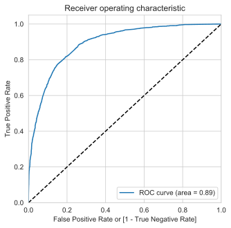

#### Finding Optimal Cutoff Point

- Optimal cutoff probability is that prob where we get balanced sensitivity and specificity

```python
# Let's create columns with different probability cutoffs
numbers = [float(x)/10 for x in range(10)]
for i in numbers:
    y_train_pred_final[i]= y_train_pred_final.Converted_Prob.map(lambda x: 1 if x > i else 0)
y_train_pred_final.head()
```

<div>
<table border="1" class="dataframe">
  <thead>
    <tr style="text-align: right;">
      <th></th>
      <th>Converted</th>
      <th>Converted_Prob</th>
      <th>CustID</th>
      <th>predicted</th>
      <th>0.0</th>
      <th>0.1</th>
      <th>0.2</th>
      <th>0.3</th>
      <th>0.4</th>
      <th>0.5</th>
      <th>0.6</th>
      <th>0.7</th>
      <th>0.8</th>
      <th>0.9</th>
    </tr>
  </thead>
  <tbody>
    <tr>
      <th>4948</th>
      <td>1</td>
      <td>0.401461</td>
      <td>4948</td>
      <td>0</td>
      <td>1</td>
      <td>1</td>
      <td>1</td>
      <td>1</td>
      <td>1</td>
      <td>0</td>
      <td>0</td>
      <td>0</td>
      <td>0</td>
      <td>0</td>
    </tr>
    <tr>
      <th>5938</th>
      <td>1</td>
      <td>0.318706</td>
      <td>5938</td>
      <td>0</td>
      <td>1</td>
      <td>1</td>
      <td>1</td>
      <td>1</td>
      <td>0</td>
      <td>0</td>
      <td>0</td>
      <td>0</td>
      <td>0</td>
      <td>0</td>
    </tr>
    <tr>
      <th>5688</th>
      <td>1</td>
      <td>0.745966</td>
      <td>5688</td>
      <td>1</td>
      <td>1</td>
      <td>1</td>
      <td>1</td>
      <td>1</td>
      <td>1</td>
      <td>1</td>
      <td>1</td>
      <td>1</td>
      <td>0</td>
      <td>0</td>
    </tr>
    <tr>
      <th>5381</th>
      <td>0</td>
      <td>0.002848</td>
      <td>5381</td>
      <td>0</td>
      <td>1</td>
      <td>0</td>
      <td>0</td>
      <td>0</td>
      <td>0</td>
      <td>0</td>
      <td>0</td>
      <td>0</td>
      <td>0</td>
      <td>0</td>
    </tr>
    <tr>
      <th>4742</th>
      <td>1</td>
      <td>0.801898</td>
      <td>4742</td>
      <td>1</td>
      <td>1</td>
      <td>1</td>
      <td>1</td>
      <td>1</td>
      <td>1</td>
      <td>1</td>
      <td>1</td>
      <td>1</td>
      <td>1</td>
      <td>0</td>
    </tr>
  </tbody>
</table>
</div>

```python
# Now let's calculate accuracy sensitivity and specificity for various probability cutoffs.
cutoff_df = pd.DataFrame( columns = ['prob','accuracy','sensi','speci'])

# TP = confusion[1,1] # true positive
# TN = confusion[0,0] # true negatives
# FP = confusion[0,1] # false positives
# FN = confusion[1,0] # false negatives

num = [0.0,0.1,0.2,0.3,0.4,0.5,0.6,0.7,0.8,0.9]
for i in num:
    cm1 = metrics.confusion_matrix(y_train_pred_final.Converted, y_train_pred_final[i] )
    total1=sum(sum(cm1))
    accuracy = (cm1[0,0]+cm1[1,1])/total1

    speci = cm1[0,0]/(cm1[0,0]+cm1[0,1])
    sensi = cm1[1,1]/(cm1[1,0]+cm1[1,1])
    cutoff_df.loc[i] =[ i ,accuracy,sensi,speci]
print(cutoff_df)
```

    prob  accuracy     sensi     speci
    0.0   0.0  0.379141  1.000000  0.000000
    0.1   0.1  0.632905  0.974498  0.424304
    0.2   0.2  0.758599  0.923077  0.658157
    0.3   0.3  0.793311  0.869983  0.746490
    0.4   0.4  0.818830  0.781355  0.841716
    0.5   0.5  0.817087  0.707776  0.883840
    0.6   0.6  0.808052  0.634197  0.914220
    0.7   0.7  0.782533  0.513796  0.946643
    0.8   0.8  0.755112  0.405518  0.968598
    0.9   0.9  0.715961  0.273829  0.985959

```python
# Let's plot accuracy sensitivity and specificity for various cutoff probabilities.

fig,ax = plt.subplots()
fig.set_figwidth(30)
fig.set_figheight(10)
plots=['accuracy','sensi','speci']
ax.set_xticks(np.linspace(0,1,50))
ax.set_title('Finding Optimal Cutoff')
sns.lineplot(x='prob',y=plots[0] , data=cutoff_df,ax=ax)
sns.lineplot(x='prob',y=plots[1] , data=cutoff_df,ax=ax)
sns.lineplot(x='prob',y=plots[2] , data=cutoff_df,ax=ax)

ax.set_xlabel('Probabilites')
ax.set_ylabel('Accuracy,Sensitivity,Specificity')
ax.legend(["Accuracy",'Sensitivity','Specificity'])
# cutoff_df.plot.line(, figure=[10,10])
plt.show()

```

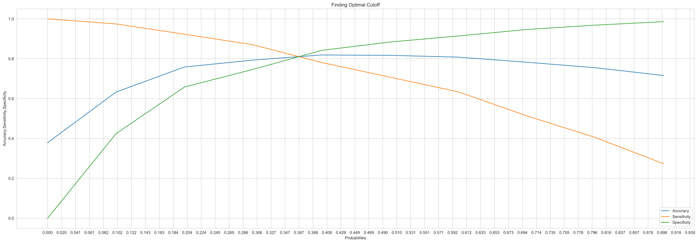

- From the curve above, 0.36 is the optimum cutoff probability.

```python
y_train_pred_final['final_predicted'] = y_train_pred_final.Converted_Prob.map( lambda x: 1 if x > 0.36 else 0)

y_train_pred_final.head()
```

<div>
<table border="1" class="dataframe">
  <thead>
    <tr style="text-align: right;">
      <th></th>
      <th>Converted</th>
      <th>Converted_Prob</th>
      <th>CustID</th>
      <th>predicted</th>
      <th>0.0</th>
      <th>0.1</th>
      <th>0.2</th>
      <th>0.3</th>
      <th>0.4</th>
      <th>0.5</th>
      <th>0.6</th>
      <th>0.7</th>
      <th>0.8</th>
      <th>0.9</th>
      <th>final_predicted</th>
    </tr>
  </thead>
  <tbody>
    <tr>
      <th>4948</th>
      <td>1</td>
      <td>0.401461</td>
      <td>4948</td>
      <td>0</td>
      <td>1</td>
      <td>1</td>
      <td>1</td>
      <td>1</td>
      <td>1</td>
      <td>0</td>
      <td>0</td>
      <td>0</td>
      <td>0</td>
      <td>0</td>
      <td>1</td>
    </tr>
    <tr>
      <th>5938</th>
      <td>1</td>
      <td>0.318706</td>
      <td>5938</td>
      <td>0</td>
      <td>1</td>
      <td>1</td>
      <td>1</td>
      <td>1</td>
      <td>0</td>
      <td>0</td>
      <td>0</td>
      <td>0</td>
      <td>0</td>
      <td>0</td>
      <td>0</td>
    </tr>
    <tr>
      <th>5688</th>
      <td>1</td>
      <td>0.745966</td>
      <td>5688</td>
      <td>1</td>
      <td>1</td>
      <td>1</td>
      <td>1</td>
      <td>1</td>
      <td>1</td>
      <td>1</td>
      <td>1</td>
      <td>1</td>
      <td>0</td>
      <td>0</td>
      <td>1</td>
    </tr>
    <tr>
      <th>5381</th>
      <td>0</td>
      <td>0.002848</td>
      <td>5381</td>
      <td>0</td>
      <td>1</td>
      <td>0</td>
      <td>0</td>
      <td>0</td>
      <td>0</td>
      <td>0</td>
      <td>0</td>
      <td>0</td>
      <td>0</td>
      <td>0</td>
      <td>0</td>
    </tr>
    <tr>
      <th>4742</th>
      <td>1</td>
      <td>0.801898</td>
      <td>4742</td>
      <td>1</td>
      <td>1</td>
      <td>1</td>
      <td>1</td>
      <td>1</td>
      <td>1</td>
      <td>1</td>
      <td>1</td>
      <td>1</td>
      <td>1</td>
      <td>0</td>
      <td>1</td>
    </tr>
  </tbody>
</table>
</div>

```python
# Let's check the overall accuracy.
accu = metrics.accuracy_score(y_train_pred_final.Converted, y_train_pred_final.final_predicted)
print('Accuracy on Train set at Optimum Cut Off : ', round(100*accu,3),'%')
```

    Accuracy on Train set at Optimum Cut Off :  81.249 %

```python
confusion2 = metrics.confusion_matrix(y_train_pred_final.Converted, y_train_pred_final.final_predicted )
confusion2
```

    array([[3203,  714],
           [ 469, 1923]])

```python
TP = confusion2[1,1] # true positive
TN = confusion2[0,0] # true negatives
FP = confusion2[0,1] # false positives
FN = confusion2[1,0] # false negatives
sensitivity = TP/(FN + TP)
specificity = TN/(FP + TN)
falsePositiveRate = FP/(FP + TN)
positivePredictivePower = TP/(TP +FP )
negativePredictivePower = TN/(TN + FN)
print('sensitivity / Recall: ', round(100*sensitivity,3),'%')
print('specificity : ',  round(100*specificity,3),'%')
print('False Positive Rate : ',  round(100*falsePositiveRate,3),'%')
print('Precision / Positive Predictive Power : ',  round(100*positivePredictivePower,3),'%')
print('Negative Predictive Power : ',  round(100*negativePredictivePower,3),'%')
```

    sensitivity / Recall:  80.393 %
    specificity :  81.772 %
    False Positive Rate :  18.228 %
    Precision / Positive Predictive Power :  72.924 %
    Negative Predictive Power :  87.228 %

```python
## ROC curve for cut off probability of 0.364
draw_roc(y_train_pred_final.Converted, y_train_pred_final.final_predicted)
```

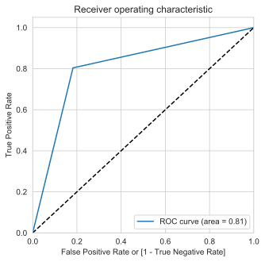

#### Precision and Recall

```python
#Looking at the confusion matrix again
confusion = metrics.confusion_matrix(y_train_pred_final.Converted, y_train_pred_final.predicted )
confusion
```

    array([[3462,  455],
           [ 699, 1693]])

- Precision :TP / TP + FP
- Recall :TP / TP + FN

```python
print('Precision :', confusion[1,1]/(confusion[0,1]+confusion[1,1]))
print('Recall :', confusion[1,1]/(confusion[1,0]+confusion[1,1]))
```

    Precision : 0.7881750465549349
    Recall : 0.7077759197324415

```python
#Doing the same using the sklearn.
from sklearn.metrics import precision_score, recall_score
print('Precision : ', precision_score(y_train_pred_final.Converted, y_train_pred_final.predicted))
print('Precision :', recall_score(y_train_pred_final.Converted, y_train_pred_final.predicted))
```

    Precision :  0.7881750465549349
    Precision : 0.7077759197324415

#### Precision and Recall Tradeoff

```python
from sklearn.metrics import precision_recall_curve

p, r, thresholds = precision_recall_curve(y_train_pred_final.Converted, y_train_pred_final.Converted_Prob)
plt.plot(thresholds, p[:-1], "g-")
plt.plot(thresholds, r[:-1], "r-")
plt.show()
```

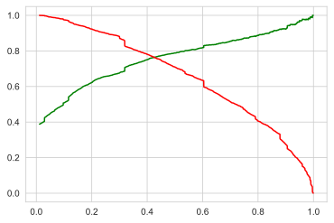

- The cut off point from precision-recall curve is ~0.4.
- Note that we have used the cut off obtained from 'Sensitivity-Specificity' trade off to predict conversions in this analysis.

### Predictions on Test set

```python
X_test_sm = sm.add_constant(X_test[finalFeatures])
y_test_pred = logm_final.predict(X_test_sm)
```

#### Actual Conversions vs Conversion Probability

```python
# predicted conversions vs actual conversions and customer ID
y_test_predictions = pd.DataFrame({'Converted' :y_test, 'Conversion Probability' : y_test_pred, 'CustID' : y_test.index})
y_test_predictions.head()
```

<div>
<table border="1" class="dataframe">
  <thead>
    <tr style="text-align: right;">
      <th></th>
      <th>Converted</th>
      <th>Conversion Probability</th>
      <th>CustID</th>
    </tr>
  </thead>
  <tbody>
    <tr>
      <th>1260</th>
      <td>0</td>
      <td>0.116132</td>
      <td>1260</td>
    </tr>
    <tr>
      <th>2104</th>
      <td>1</td>
      <td>0.318706</td>
      <td>2104</td>
    </tr>
    <tr>
      <th>7105</th>
      <td>1</td>
      <td>0.982061</td>
      <td>7105</td>
    </tr>
    <tr>
      <th>8916</th>
      <td>0</td>
      <td>0.420480</td>
      <td>8916</td>
    </tr>
    <tr>
      <th>2822</th>
      <td>0</td>
      <td>0.029267</td>
      <td>2822</td>
    </tr>
  </tbody>
</table>
</div>

```python
# predictions with optimal cut off = 0.35
cutoff=0.36
y_test_predictions['Predicted'] = y_test_predictions[
 'Conversion Probability'
].map(lambda x : 1 if x > cutoff else 0 )
```

#### Confusion Matrix

```python
confusion = metrics.confusion_matrix(y_test_predictions['Converted'], y_test_predictions['Predicted'])
confusion
```

    array([[1356,  322],
           [ 230,  797]])

```python
TP = confusion[1,1] # true positive
TN = confusion[0,0] # true negatives
FP = confusion[0,1] # false positives
FN = confusion[1,0] # false negatives
```

#### Accuracy

```python
print('Accuracy on Test set : ', round(100*(TP + TN)/(TP + TN + FP + FN),3),'%')
```

    Accuracy on Test set :  79.593 %

#### Metrics Beyond Simple Accuracy

```python
sensitivity = TP/(FN + TP)
specificity = TN/(FP + TN)
falsePositiveRate = FP/(FP + TN)
positivePredictivePower = TP/(TP +FP )
negativePredictivePower = TN/(TN + FN)
print('sensitivity / Recall: ', round(100*sensitivity,3),'%')
print('specificity : ',  round(100*specificity,3),'%')
print('False Positive Rate : ',  round(100*falsePositiveRate,3),'%')
print('Precision / Positive Predictive Power : ',  round(100*positivePredictivePower,3),'%')
print('Negative Predictive Power : ',  round(100*negativePredictivePower,3),'%')
```

    sensitivity / Recall:  77.605 %
    specificity :  80.81 %
    False Positive Rate :  19.19 %
    Precision / Positive Predictive Power :  71.224 %
    Negative Predictive Power :  85.498 %

```python
## ROC curve for cut off probability of 0.364
draw_roc(y_test_predictions['Converted'],y_test_predictions['Predicted'])
```

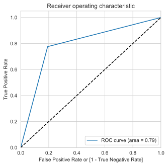

- Note the AUC is 0.79 on the test test

## Lead Scoring

```python
# merging final predictions with leads dataset
conversionProb = pd.concat([y_test_predictions['Conversion Probability'],y_train_pred_final['Converted_Prob']],axis=0)
conversionProb = pd.DataFrame({'Conversion Probability' : conversionProb}, index=conversionProb.index)
leads = pd.concat([leads,conversionProb],axis=1)
leads['Prospect ID'] = prospect_ids
leads['Lead No'] = lead_no
leads['Converted'] = y
```

```python
# Verifying prediction accuracy
leads['Predicted'] = leads['Conversion Probability'].map(lambda x : 1 if x > 0.36 else 0)
```

```python
confusion = metrics.confusion_matrix(leads['Converted'], leads['Predicted'])
```

```python
TP = confusion[1,1] # true positive
TN = confusion[0,0] # true negatives
FP = confusion[0,1] # false positives
FN = confusion[1,0] # false negatives
acc = metrics.accuracy_score(leads['Converted'], leads['Predicted'])
print('Accuracy : ', round(100*acc,3),'%')
sensitivity = TP/(FN + TP)
specificity = TN/(FP + TN)
falsePositiveRate = FP/(FP + TN)
falseNegativeRate = FN/(FP + TP)
positivePredictivePower = TP/(TP +FP )
negativePredictivePower = TN/(TN + FN)
print('sensitivity : ', round(100*sensitivity,3),'%')
print('specificity : ',  round(100*specificity,3),'%')
print('False Positive Rate : ',  round(100*falsePositiveRate,3),'%')
print('False Negative Rate : ',  round(100*falseNegativeRate,3),'%')
print('Positive Predictive Power / Precision : ',  round(100*positivePredictivePower,3),'%')
print('Negative Predictive Power : ',  round(100*negativePredictivePower,3),'%')
```

    Accuracy :  80.752 %
    sensitivity :  79.555 %
    specificity :  81.483 %
    False Positive Rate :  18.517 %
    False Negative Rate :  18.61 %
    Positive Predictive Power / Precision :  72.417 %
    Negative Predictive Power :  86.706 %

```python
## ROC curve
draw_roc(leads['Converted'], leads['Predicted'])
```

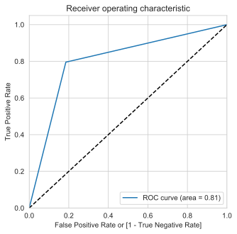

```python
# Lead Scores
leads['Lead Score'] = leads['Conversion Probability']*100
leads[['Prospect ID','Lead No','Lead Score']].sort_values(by='Lead Score', ascending=False)[:10]
```

<div>
<table border="1" class="dataframe">
  <thead>
    <tr style="text-align: right;">
      <th></th>
      <th>Prospect ID</th>
      <th>Lead No</th>
      <th>Lead Score</th>
    </tr>
  </thead>
  <tbody>
    <tr>
      <th>7219</th>
      <td>ed62264f-7666-4bf9-9cb6-5b9a825f1e67</td>
      <td>594038</td>
      <td>99.911806</td>
    </tr>
    <tr>
      <th>7234</th>
      <td>7e2819e8-97f0-416b-bcb6-45ef14f0e11a</td>
      <td>593962</td>
      <td>99.855878</td>
    </tr>
    <tr>
      <th>2378</th>
      <td>8ff353ab-1207-4608-a8cc-8172ea7c12eb</td>
      <td>636860</td>
      <td>99.830268</td>
    </tr>
    <tr>
      <th>7327</th>
      <td>95d1590f-7c47-4f40-9806-388f4472d3a4</td>
      <td>593208</td>
      <td>99.825999</td>
    </tr>
    <tr>
      <th>2497</th>
      <td>e5fb32dd-b3b7-4fbf-972d-c13d2cfc6866</td>
      <td>635761</td>
      <td>99.822078</td>
    </tr>
    <tr>
      <th>5671</th>
      <td>623bc6c9-9184-4437-b38f-d374be49d1a3</td>
      <td>606508</td>
      <td>99.822078</td>
    </tr>
    <tr>
      <th>7094</th>
      <td>9ec1cafe-b019-498e-b246-7ab06167d72c</td>
      <td>595141</td>
      <td>99.819952</td>
    </tr>
    <tr>
      <th>7187</th>
      <td>f33166e8-d8d3-4e8c-b9d0-8a1922c35910</td>
      <td>594369</td>
      <td>99.817589</td>
    </tr>
    <tr>
      <th>7420</th>
      <td>2caa32d0-50b7-4d29-b31f-2528b06d7bc8</td>
      <td>592625</td>
      <td>99.816186</td>
    </tr>
    <tr>
      <th>8120</th>
      <td>bf4a03bc-b747-45a6-a6b5-659afa3bf3ac</td>
      <td>587853</td>
      <td>99.815060</td>
    </tr>
  </tbody>
</table>
</div>

## Score Sheet for X Education

```python
# Run the following to generate a sheet containing lead information provided by the company and corresponding scores
leads.to_csv('lead_scores.csv')
```

## KS Statistic

```python
# Gain Chart
y_test_predictions = y_test_predictions.sort_values(by='Conversion Probability', ascending=False)
y_test_predictions['decile'] = pd.qcut(y_test_predictions['Conversion Probability'],10,labels=range(10,0,-1))
y_test_predictions['Converted'] = y_test_predictions['Converted'].astype('int')
y_test_predictions['Un Converted'] = 1 - y_test_predictions['Converted']
y_test_predictions.head()
```

<div>
<table border="1" class="dataframe">
  <thead>
    <tr style="text-align: right;">
      <th></th>
      <th>Converted</th>
      <th>Conversion Probability</th>
      <th>CustID</th>
      <th>Predicted</th>
      <th>decile</th>
      <th>Un Converted</th>
    </tr>
  </thead>
  <tbody>
    <tr>
      <th>7327</th>
      <td>1</td>
      <td>0.998260</td>
      <td>7327</td>
      <td>1</td>
      <td>1</td>
      <td>0</td>
    </tr>
    <tr>
      <th>7420</th>
      <td>1</td>
      <td>0.998162</td>
      <td>7420</td>
      <td>1</td>
      <td>1</td>
      <td>0</td>
    </tr>
    <tr>
      <th>4613</th>
      <td>1</td>
      <td>0.997809</td>
      <td>4613</td>
      <td>1</td>
      <td>1</td>
      <td>0</td>
    </tr>
    <tr>
      <th>6243</th>
      <td>1</td>
      <td>0.997674</td>
      <td>6243</td>
      <td>1</td>
      <td>1</td>
      <td>0</td>
    </tr>
    <tr>
      <th>7324</th>
      <td>1</td>
      <td>0.997402</td>
      <td>7324</td>
      <td>1</td>
      <td>1</td>
      <td>0</td>
    </tr>
  </tbody>
</table>
</div>

```python
df1 = pd.pivot_table(data=y_test_predictions,index=['decile'],values=['Converted','Un Converted','Conversion Probability'],
                     aggfunc={'Converted':[np.sum],
                              'Un Converted':[np.sum],
                              'Conversion Probability' : [np.min,np.max]})
df1 = df1.reset_index()
df1.columns = ['Decile','Max Prob', 'Min Prob','Converted Count','Un Converted Count']
df1 = df1.sort_values(by='Decile', ascending=False)
df1['Total Leads'] = df1['Converted Count'] + df1['Un Converted Count']
df1['Conversion Rate'] = df1['Converted Count'] / df1['Un Converted Count']
converted_sum = df1['Converted Count'].sum()
unconverted_sum = df1['Un Converted Count'].sum()
df1['Converted %'] = df1['Converted Count'] / converted_sum
df1['Un Converted %'] = df1['Un Converted Count'] / unconverted_sum
df1.head()
```

<div>
<table border="1" class="dataframe">
  <thead>
    <tr style="text-align: right;">
      <th></th>
      <th>Decile</th>
      <th>Max Prob</th>
      <th>Min Prob</th>
      <th>Converted Count</th>
      <th>Un Converted Count</th>
      <th>Total Leads</th>
      <th>Conversion Rate</th>
      <th>Converted %</th>
      <th>Un Converted %</th>
    </tr>
  </thead>
  <tbody>
    <tr>
      <th>9</th>
      <td>1</td>
      <td>0.998260</td>
      <td>0.910258</td>
      <td>257</td>
      <td>14</td>
      <td>271</td>
      <td>18.357143</td>
      <td>0.250243</td>
      <td>0.008343</td>
    </tr>
    <tr>
      <th>8</th>
      <td>2</td>
      <td>0.909066</td>
      <td>0.781567</td>
      <td>224</td>
      <td>46</td>
      <td>270</td>
      <td>4.869565</td>
      <td>0.218111</td>
      <td>0.027414</td>
    </tr>
    <tr>
      <th>7</th>
      <td>3</td>
      <td>0.780757</td>
      <td>0.564123</td>
      <td>182</td>
      <td>89</td>
      <td>271</td>
      <td>2.044944</td>
      <td>0.177215</td>
      <td>0.053039</td>
    </tr>
    <tr>
      <th>6</th>
      <td>4</td>
      <td>0.563613</td>
      <td>0.380673</td>
      <td>118</td>
      <td>152</td>
      <td>270</td>
      <td>0.776316</td>
      <td>0.114898</td>
      <td>0.090584</td>
    </tr>
    <tr>
      <th>5</th>
      <td>5</td>
      <td>0.380229</td>
      <td>0.251101</td>
      <td>113</td>
      <td>157</td>
      <td>270</td>
      <td>0.719745</td>
      <td>0.110029</td>
      <td>0.093564</td>
    </tr>
  </tbody>
</table>
</div>

```python
df1['ks_stats'] = np.round(((df1['Converted Count'] / df1['Converted Count'].sum()).cumsum() -(df1['Un Converted Count'] / df1['Un Converted Count'].sum()).cumsum()), 4) * 100
df1
```

<div>
<table border="1" class="dataframe">
  <thead>
    <tr style="text-align: right;">
      <th></th>
      <th>Decile</th>
      <th>Max Prob</th>
      <th>Min Prob</th>
      <th>Converted Count</th>
      <th>Un Converted Count</th>
      <th>Total Leads</th>
      <th>Conversion Rate</th>
      <th>Converted %</th>
      <th>Un Converted %</th>
      <th>ks_stats</th>
    </tr>
  </thead>
  <tbody>
    <tr>
      <th>9</th>
      <td>1</td>
      <td>0.998260</td>
      <td>0.910258</td>
      <td>257</td>
      <td>14</td>
      <td>271</td>
      <td>18.357143</td>
      <td>0.250243</td>
      <td>0.008343</td>
      <td>24.19</td>
    </tr>
    <tr>
      <th>8</th>
      <td>2</td>
      <td>0.909066</td>
      <td>0.781567</td>
      <td>224</td>
      <td>46</td>
      <td>270</td>
      <td>4.869565</td>
      <td>0.218111</td>
      <td>0.027414</td>
      <td>43.26</td>
    </tr>
    <tr>
      <th>7</th>
      <td>3</td>
      <td>0.780757</td>
      <td>0.564123</td>
      <td>182</td>
      <td>89</td>
      <td>271</td>
      <td>2.044944</td>
      <td>0.177215</td>
      <td>0.053039</td>
      <td>55.68</td>
    </tr>
    <tr>
      <th>6</th>
      <td>4</td>
      <td>0.563613</td>
      <td>0.380673</td>
      <td>118</td>
      <td>152</td>
      <td>270</td>
      <td>0.776316</td>
      <td>0.114898</td>
      <td>0.090584</td>
      <td>58.11</td>
    </tr>
    <tr>
      <th>5</th>
      <td>5</td>
      <td>0.380229</td>
      <td>0.251101</td>
      <td>113</td>
      <td>157</td>
      <td>270</td>
      <td>0.719745</td>
      <td>0.110029</td>
      <td>0.093564</td>
      <td>59.76</td>
    </tr>
    <tr>
      <th>4</th>
      <td>6</td>
      <td>0.250676</td>
      <td>0.149579</td>
      <td>64</td>
      <td>207</td>
      <td>271</td>
      <td>0.309179</td>
      <td>0.062317</td>
      <td>0.123361</td>
      <td>53.65</td>
    </tr>
    <tr>
      <th>3</th>
      <td>7</td>
      <td>0.149564</td>
      <td>0.113845</td>
      <td>37</td>
      <td>233</td>
      <td>270</td>
      <td>0.158798</td>
      <td>0.036027</td>
      <td>0.138856</td>
      <td>43.37</td>
    </tr>
    <tr>
      <th>2</th>
      <td>8</td>
      <td>0.113644</td>
      <td>0.069387</td>
      <td>22</td>
      <td>249</td>
      <td>271</td>
      <td>0.088353</td>
      <td>0.021422</td>
      <td>0.148391</td>
      <td>30.67</td>
    </tr>
    <tr>
      <th>1</th>
      <td>9</td>
      <td>0.069378</td>
      <td>0.029278</td>
      <td>8</td>
      <td>256</td>
      <td>264</td>
      <td>0.031250</td>
      <td>0.007790</td>
      <td>0.152563</td>
      <td>16.19</td>
    </tr>
    <tr>
      <th>0</th>
      <td>10</td>
      <td>0.029267</td>
      <td>0.002231</td>
      <td>2</td>
      <td>275</td>
      <td>277</td>
      <td>0.007273</td>
      <td>0.001947</td>
      <td>0.163886</td>
      <td>0.00</td>
    </tr>
  </tbody>
</table>
</div>

- Max KS Statistic is 59.76 for 5th decile
- This model discriminates between Converted and Non-converted leads well since KS Statistic in 4th decile (58.11) is greater than 40%. Hence, this is a reasonable good model.

## Gain Chart

```python
df1['Cum Conversion %'] = np.round(((df1['Converted Count'] / df1['Converted Count'].sum()).cumsum()), 4) * 100
df1
```

<div>
<table border="1" class="dataframe">
  <thead>
    <tr style="text-align: right;">
      <th></th>
      <th>Decile</th>
      <th>Max Prob</th>
      <th>Min Prob</th>
      <th>Converted Count</th>
      <th>Un Converted Count</th>
      <th>Total Leads</th>
      <th>Conversion Rate</th>
      <th>Converted %</th>
      <th>Un Converted %</th>
      <th>ks_stats</th>
      <th>Cum Conversion %</th>
    </tr>
  </thead>
  <tbody>
    <tr>
      <th>9</th>
      <td>1</td>
      <td>0.998260</td>
      <td>0.910258</td>
      <td>257</td>
      <td>14</td>
      <td>271</td>
      <td>18.357143</td>
      <td>0.250243</td>
      <td>0.008343</td>
      <td>24.19</td>
      <td>25.02</td>
    </tr>
    <tr>
      <th>8</th>
      <td>2</td>
      <td>0.909066</td>
      <td>0.781567</td>
      <td>224</td>
      <td>46</td>
      <td>270</td>
      <td>4.869565</td>
      <td>0.218111</td>
      <td>0.027414</td>
      <td>43.26</td>
      <td>46.84</td>
    </tr>
    <tr>
      <th>7</th>
      <td>3</td>
      <td>0.780757</td>
      <td>0.564123</td>
      <td>182</td>
      <td>89</td>
      <td>271</td>
      <td>2.044944</td>
      <td>0.177215</td>
      <td>0.053039</td>
      <td>55.68</td>
      <td>64.56</td>
    </tr>
    <tr>
      <th>6</th>
      <td>4</td>
      <td>0.563613</td>
      <td>0.380673</td>
      <td>118</td>
      <td>152</td>
      <td>270</td>
      <td>0.776316</td>
      <td>0.114898</td>
      <td>0.090584</td>
      <td>58.11</td>
      <td>76.05</td>
    </tr>
    <tr>
      <th>5</th>
      <td>5</td>
      <td>0.380229</td>
      <td>0.251101</td>
      <td>113</td>
      <td>157</td>
      <td>270</td>
      <td>0.719745</td>
      <td>0.110029</td>
      <td>0.093564</td>
      <td>59.76</td>
      <td>87.05</td>
    </tr>
    <tr>
      <th>4</th>
      <td>6</td>
      <td>0.250676</td>
      <td>0.149579</td>
      <td>64</td>
      <td>207</td>
      <td>271</td>
      <td>0.309179</td>
      <td>0.062317</td>
      <td>0.123361</td>
      <td>53.65</td>
      <td>93.28</td>
    </tr>
    <tr>
      <th>3</th>
      <td>7</td>
      <td>0.149564</td>
      <td>0.113845</td>
      <td>37</td>
      <td>233</td>
      <td>270</td>
      <td>0.158798</td>
      <td>0.036027</td>
      <td>0.138856</td>
      <td>43.37</td>
      <td>96.88</td>
    </tr>
    <tr>
      <th>2</th>
      <td>8</td>
      <td>0.113644</td>
      <td>0.069387</td>
      <td>22</td>
      <td>249</td>
      <td>271</td>
      <td>0.088353</td>
      <td>0.021422</td>
      <td>0.148391</td>
      <td>30.67</td>
      <td>99.03</td>
    </tr>
    <tr>
      <th>1</th>
      <td>9</td>
      <td>0.069378</td>
      <td>0.029278</td>
      <td>8</td>
      <td>256</td>
      <td>264</td>
      <td>0.031250</td>
      <td>0.007790</td>
      <td>0.152563</td>
      <td>16.19</td>
      <td>99.81</td>
    </tr>
    <tr>
      <th>0</th>
      <td>10</td>
      <td>0.029267</td>
      <td>0.002231</td>
      <td>2</td>
      <td>275</td>
      <td>277</td>
      <td>0.007273</td>
      <td>0.001947</td>
      <td>0.163886</td>
      <td>0.00</td>
      <td>100.00</td>
    </tr>
  </tbody>
</table>
</div>

```python
df1['Base %'] = np.arange(10,110,10)
df1 = df1.set_index('Decile')
```

```python
df1
```

<div>
<table border="1" class="dataframe">
  <thead>
    <tr style="text-align: right;">
      <th></th>
      <th>Max Prob</th>
      <th>Min Prob</th>
      <th>Converted Count</th>
      <th>Un Converted Count</th>
      <th>Total Leads</th>
      <th>Conversion Rate</th>
      <th>Converted %</th>
      <th>Un Converted %</th>
      <th>ks_stats</th>
      <th>Cum Conversion %</th>
      <th>Base %</th>
    </tr>
    <tr>
      <th>Decile</th>
      <th></th>
      <th></th>
      <th></th>
      <th></th>
      <th></th>
      <th></th>
      <th></th>
      <th></th>
      <th></th>
      <th></th>
      <th></th>
    </tr>
  </thead>
  <tbody>
    <tr>
      <th>1</th>
      <td>0.998260</td>
      <td>0.910258</td>
      <td>257</td>
      <td>14</td>
      <td>271</td>
      <td>18.357143</td>
      <td>0.250243</td>
      <td>0.008343</td>
      <td>24.19</td>
      <td>25.02</td>
      <td>10</td>
    </tr>
    <tr>
      <th>2</th>
      <td>0.909066</td>
      <td>0.781567</td>
      <td>224</td>
      <td>46</td>
      <td>270</td>
      <td>4.869565</td>
      <td>0.218111</td>
      <td>0.027414</td>
      <td>43.26</td>
      <td>46.84</td>
      <td>20</td>
    </tr>
    <tr>
      <th>3</th>
      <td>0.780757</td>
      <td>0.564123</td>
      <td>182</td>
      <td>89</td>
      <td>271</td>
      <td>2.044944</td>
      <td>0.177215</td>
      <td>0.053039</td>
      <td>55.68</td>
      <td>64.56</td>
      <td>30</td>
    </tr>
    <tr>
      <th>4</th>
      <td>0.563613</td>
      <td>0.380673</td>
      <td>118</td>
      <td>152</td>
      <td>270</td>
      <td>0.776316</td>
      <td>0.114898</td>
      <td>0.090584</td>
      <td>58.11</td>
      <td>76.05</td>
      <td>40</td>
    </tr>
    <tr>
      <th>5</th>
      <td>0.380229</td>
      <td>0.251101</td>
      <td>113</td>
      <td>157</td>
      <td>270</td>
      <td>0.719745</td>
      <td>0.110029</td>
      <td>0.093564</td>
      <td>59.76</td>
      <td>87.05</td>
      <td>50</td>
    </tr>
    <tr>
      <th>6</th>
      <td>0.250676</td>
      <td>0.149579</td>
      <td>64</td>
      <td>207</td>
      <td>271</td>
      <td>0.309179</td>
      <td>0.062317</td>
      <td>0.123361</td>
      <td>53.65</td>
      <td>93.28</td>
      <td>60</td>
    </tr>
    <tr>
      <th>7</th>
      <td>0.149564</td>
      <td>0.113845</td>
      <td>37</td>
      <td>233</td>
      <td>270</td>
      <td>0.158798</td>
      <td>0.036027</td>
      <td>0.138856</td>
      <td>43.37</td>
      <td>96.88</td>
      <td>70</td>
    </tr>
    <tr>
      <th>8</th>
      <td>0.113644</td>
      <td>0.069387</td>
      <td>22</td>
      <td>249</td>
      <td>271</td>
      <td>0.088353</td>
      <td>0.021422</td>
      <td>0.148391</td>
      <td>30.67</td>
      <td>99.03</td>
      <td>80</td>
    </tr>
    <tr>
      <th>9</th>
      <td>0.069378</td>
      <td>0.029278</td>
      <td>8</td>
      <td>256</td>
      <td>264</td>
      <td>0.031250</td>
      <td>0.007790</td>
      <td>0.152563</td>
      <td>16.19</td>
      <td>99.81</td>
      <td>90</td>
    </tr>
    <tr>
      <th>10</th>
      <td>0.029267</td>
      <td>0.002231</td>
      <td>2</td>
      <td>275</td>
      <td>277</td>
      <td>0.007273</td>
      <td>0.001947</td>
      <td>0.163886</td>
      <td>0.00</td>
      <td>100.00</td>
      <td>100</td>
    </tr>
  </tbody>
</table>
</div>

```python
### Gain chart
plot_columns =['Base %','Cum Conversion %']
plt.plot(df1[plot_columns]);
plt.xticks(df1.index);
plt.title('Gain chart');
plt.xlabel('Decile')
plt.ylabel('Cummulative Conversion %')
plt.legend(('Our Model','Random Model'));
```

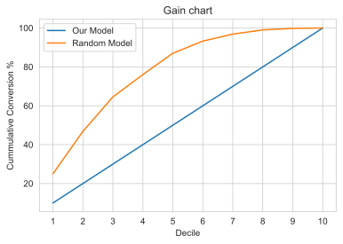

- Inside of pursuing leads randomly, pursuing the top 40% leads scored by the model would let the sales team reach 80% of leads likely to convert.

## Lift Chart

```python
df1['Lift'] = df1['Cum Conversion %'] / df1['Base %']
df1['Baseline'] = 1
df1
```

<div>
<table border="1" class="dataframe">
  <thead>
    <tr style="text-align: right;">
      <th></th>
      <th>Max Prob</th>
      <th>Min Prob</th>
      <th>Converted Count</th>
      <th>Un Converted Count</th>
      <th>Total Leads</th>
      <th>Conversion Rate</th>
      <th>Converted %</th>
      <th>Un Converted %</th>
      <th>ks_stats</th>
      <th>Cum Conversion %</th>
      <th>Base %</th>
      <th>Lift</th>
      <th>Baseline</th>
    </tr>
    <tr>
      <th>Decile</th>
      <th></th>
      <th></th>
      <th></th>
      <th></th>
      <th></th>
      <th></th>
      <th></th>
      <th></th>
      <th></th>
      <th></th>
      <th></th>
      <th></th>
      <th></th>
    </tr>
  </thead>
  <tbody>
    <tr>
      <th>1</th>
      <td>0.998260</td>
      <td>0.910258</td>
      <td>257</td>
      <td>14</td>
      <td>271</td>
      <td>18.357143</td>
      <td>0.250243</td>
      <td>0.008343</td>
      <td>24.19</td>
      <td>25.02</td>
      <td>10</td>
      <td>2.502000</td>
      <td>1</td>
    </tr>
    <tr>
      <th>2</th>
      <td>0.909066</td>
      <td>0.781567</td>
      <td>224</td>
      <td>46</td>
      <td>270</td>
      <td>4.869565</td>
      <td>0.218111</td>
      <td>0.027414</td>
      <td>43.26</td>
      <td>46.84</td>
      <td>20</td>
      <td>2.342000</td>
      <td>1</td>
    </tr>
    <tr>
      <th>3</th>
      <td>0.780757</td>
      <td>0.564123</td>
      <td>182</td>
      <td>89</td>
      <td>271</td>
      <td>2.044944</td>
      <td>0.177215</td>
      <td>0.053039</td>
      <td>55.68</td>
      <td>64.56</td>
      <td>30</td>
      <td>2.152000</td>
      <td>1</td>
    </tr>
    <tr>
      <th>4</th>
      <td>0.563613</td>
      <td>0.380673</td>
      <td>118</td>
      <td>152</td>
      <td>270</td>
      <td>0.776316</td>
      <td>0.114898</td>
      <td>0.090584</td>
      <td>58.11</td>
      <td>76.05</td>
      <td>40</td>
      <td>1.901250</td>
      <td>1</td>
    </tr>
    <tr>
      <th>5</th>
      <td>0.380229</td>
      <td>0.251101</td>
      <td>113</td>
      <td>157</td>
      <td>270</td>
      <td>0.719745</td>
      <td>0.110029</td>
      <td>0.093564</td>
      <td>59.76</td>
      <td>87.05</td>
      <td>50</td>
      <td>1.741000</td>
      <td>1</td>
    </tr>
    <tr>
      <th>6</th>
      <td>0.250676</td>
      <td>0.149579</td>
      <td>64</td>
      <td>207</td>
      <td>271</td>
      <td>0.309179</td>
      <td>0.062317</td>
      <td>0.123361</td>
      <td>53.65</td>
      <td>93.28</td>
      <td>60</td>
      <td>1.554667</td>
      <td>1</td>
    </tr>
    <tr>
      <th>7</th>
      <td>0.149564</td>
      <td>0.113845</td>
      <td>37</td>
      <td>233</td>
      <td>270</td>
      <td>0.158798</td>
      <td>0.036027</td>
      <td>0.138856</td>
      <td>43.37</td>
      <td>96.88</td>
      <td>70</td>
      <td>1.384000</td>
      <td>1</td>
    </tr>
    <tr>
      <th>8</th>
      <td>0.113644</td>
      <td>0.069387</td>
      <td>22</td>
      <td>249</td>
      <td>271</td>
      <td>0.088353</td>
      <td>0.021422</td>
      <td>0.148391</td>
      <td>30.67</td>
      <td>99.03</td>
      <td>80</td>
      <td>1.237875</td>
      <td>1</td>
    </tr>
    <tr>
      <th>9</th>
      <td>0.069378</td>
      <td>0.029278</td>
      <td>8</td>
      <td>256</td>
      <td>264</td>
      <td>0.031250</td>
      <td>0.007790</td>
      <td>0.152563</td>
      <td>16.19</td>
      <td>99.81</td>
      <td>90</td>
      <td>1.109000</td>
      <td>1</td>
    </tr>
    <tr>
      <th>10</th>
      <td>0.029267</td>
      <td>0.002231</td>
      <td>2</td>
      <td>275</td>
      <td>277</td>
      <td>0.007273</td>
      <td>0.001947</td>
      <td>0.163886</td>
      <td>0.00</td>
      <td>100.00</td>
      <td>100</td>
      <td>1.000000</td>
      <td>1</td>
    </tr>
  </tbody>
</table>
</div>

```python
# Lift chart
plot_columns =['Lift', 'Baseline']
plt.plot(df1[plot_columns]);
plt.xticks(df1.index);
plt.title('Lift chart');
plt.xlabel('Decile')
plt.ylabel('Lift')
plt.legend(('Our Model','Random Model'));
```

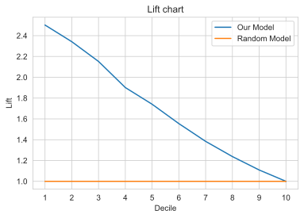

- The model outperforms a random model by alteast 2 times compared to a random model in the top 40% potentially convertible leads.
- As opposed to 10% conversions from 10% leads pursued randomly, pursuing the top 10% leads scored by this model would lead to 24% conversions.

## Conclusion

A logistic regression model is created using lead features. To arrive at the list of features which significantly affect conversion probability, a mixed feature elimination approach is followed. 25 most important features are obtained through Recursive Feature Elimination and then reduced to 15 via p-value / VIF approach. The dataset is randomly divided into train and test set. (70 - 30 split).

The final relationship between log Odds of Conversion Probability and lead features is

`logOdds(Conversion Probability)` = -0.6821 - 1.5442 _ `Do Not Email` -1.2691 _ `Unknown Occupation` -0.8891 _ `No Specialization` -0.8856 _ `Hospitality Management` - 0.6636 _ `Outside India` + 1.7926 _ `SMS Sent` + 1.1818 _ `Other Last Activity` + 2.3799 _ `Working Professional` - 0.8591 _ `Olark Chat Conversation` + 5.4168 _ `Welingak Website` + 3.0622 _ `Reference` + 0.6577 _ `Other Lead Sources` + 1.2170 _ `Olark Chat` -0.9929 _ `Landing Page Submission` + 1.1330 _ `Total Time Spent on Website` + 0.6052 _ `Email Opened`

where `Total Time Spent on Website` is standardized to $\mu=0,\sigma=1$

**Interpreting Top 6 features affecting Conversion Probability**

- A lead from `Welingak Website` has 5.41 times higher odds of conversion than those from `Google`.
- Leads through `Reference` have 3.1 times higher odds of conversion than those from `Google`.
- Leads from `Working Professional` have 2.38 times higher odds of conversion than those from `Businessman`.
- Leads with `SMS Sent` have 1.8 times higher odds of conversion than those with no SMS sent.
- Leads with `Do Not Email` have 1.5 times lesser odds of conversion compared to leads who would like email updates.
- Leads with `Unknown Occupation` have 1.2691 times lesser odds of conversion compared to those from `Businessman`.

**Lead Scores**

- Score sheet can be generated by running [this](#Score-Sheet-for-X-Education) cell.

At an optimum cut-off probability of 0.36, model performance is as follows.

**Model Performance on Training Set**

- Accuracy : 81.7%
- Sensitivity / Recall: 80.393 %
- Specificity : 81.772 %
- Precision / Positive Predictive Power : 72.924 %
- False Positive Rate : 18.228 %
- AUC Score : 0.81

**Model Performance for Test Set**

- Accuracy : 79.593 %
- Sensitivity / Recall : 77.605 %
- Specificity : 80.81%
- Precision / Positive Predictive Power : 71.224 %
- False Positive Rate : 19.19 %
- AUC Score : 0.79

**KS statistic**

- Max KS Statistic is 59.76 for 5th decile
- This model discriminates between Converted and Non-converted leads well since KS Statistic in 4th decile (58.11) is greater than 40%. Hence, this is a reasonably good model.

**Gain**

- Inside of pursuing leads randomly, pursuing the top 40% leads scored by the model would let the sales team reach 80% of leads likely to convert.

**Lift**

- The model outperforms a random model by alteast 2 times compared to a random model in the top 40% potentially convertible leads.
- As opposed to 10% conversions from 10% leads pursued randomly, pursuing the top 10% leads scored by this model would lead to 24% conversions.
