Photo by <a href="https://unsplash.com/@mikofilm?utm_source=unsplash&amp;utm_medium=referral&amp;utm_content=creditCopyText">Mike Kononov</a> on <a href="https://unsplash.com/s/photos/business?utm_source=unsplash&amp;utm_medium=referral&amp;utm_content=creditCopyText">Unsplash</a>

This analysis is the combined effort of <a href="https://www.kaggle.com/umaer369">Umaer</a> and me.

# Telecom Churn Case Study

## Analysis Approach :

- Telecommunications industry experiences an average of 15 - 25% annual churn rate. Given the fact that it costs 5-10 times more to acquire a new customer than to retain an existing one, customer retention has become even more important than customer acquisition.
- Here we are given with 4 months of data related to customer usage. In this case study, we analyse customer-level data of a leading telecom firm, build predictive models to identify customers at high risk of churn and identify the main indicators of churn.
- Churn is predicted using two approaches. Usage based churn and Revenue based churn. 
Usage based churn:
- Customers who have zero usage, either incoming or outgoing - in terms of calls, internet etc. over a period of time.
- This case study only considers usage based churn. 
- In the Indian and the southeast Asian market, approximately 80% of revenue comes from the top 20% customers (called high-value customers). Thus, if we can reduce churn of the high-value customers, we will be able to reduce significant revenue leakage. Hence, this case study focuses on high value customers only. 
- The dataset contains customer-level information for a span of four consecutive months - June, July, August and September. The months are encoded as 6, 7, 8 and 9, respectively. 

- The **business objective** is to predict the churn in the last (i.e. the ninth) month using the data (features) from the first three months. 

- This is a classification problem, where we need to predict whether the customers is about to churn or not. We have carried out Baseline Logistic Regression, then Logistic Regression with PCA, PCA + Random Forest, PCA + XGBoost.

## Analysis Steps
### Data Cleaning and EDA 
1. We have started with importing Necessary packages and libraries. 
2. We have loaded the dataset into a dataframe. 
3. We have checked the number of columns, their data types, Null count and unique value_value_count to get some understanding about data and to check if the columns are under correct data-type.
5. Checking for duplicate records (rows) in the data. There were no duplicates. 
6. Since 'mobile_number' is the unique identifier available, we have made it our index to retain the identity. 
7. Have found some columns that donot follow the naming standard, we have renamed those columns to make sure all the variables follow the same naming convention.
8. Follwing with column renaming, we have dealt with converting the columns into their respective data types. Here, we have evaluated all the columns which are having less than or equal to 29 unique values as catrgorical columns and rest as contineous columns. 
9. The date columns were having 'object' as their data type, we have converted to the proper datetime format. 
10. Since, our analysis is focused on the HVC(High value customers), we have filtered for high value customers to carryout the further analysis. The metric of this filtering of HVC is such that all the customers whose 'Average_rech_amt' of months 6 and 7 greater than or equal to 70th percentile of the 'Average_rech_amt' are considered as High Value Customers. 
11. Checked for missing values. 
12. Dropped all the columns with missing values greater than 50%.
13. We have been given 4 months data. Since each months revenue and usage data is not related to other, we did month-wise drill down on missing values.
14. Some columns had similar range of missing values. So, we have looked at their related columns and checked if these might be imputed with zero.
15. We have found that 'last_date_of_the_month' had some misisng values, so this is very meaningful and we have imputed the last date based on the month.
16. We have found some columns with only one unique value, so it is of no use for the analysis, hence we have dropped those columns. 
17. Once after checking all the data preparation tasks, tagged the Churn variable(which is our target variable).
18. After imputing, we have dropped churn phase columns (Columns belonging to month - 9).
19. After all the above processing, we have retained 30,011 rows and 126 columns. 
20. Exploratory Data Analysis 
- The telecom company has many users with negative average revenues in both phases. These users are likely to churn.
- Most customers prefer the plans of '0' category.
- The customers with lesser 'aon' are more likely to Churn when compared to the Customers with higer 'aon'.
- Revenue generated by the Customers who are about to churn is very unstable.
- The Customers whose arpu decreases in 7th month are more likely to churn when compared to ones with increase in arpu.
- The Customers with high total_og_mou in 6th month and lower total_og_mou in 7th month are more likely to churn compared to the rest.
- The Customers with decrease in rate of total_ic_mou in 7th month are more likely to churn, compared to the rest.
- Customers with stable usage of 2g volume throughout 6 and 7 months are less likely to churn.
- Customers with fall in usage of 2g volume in 7th month are more likely to Churn.
- Customers with stable usage of 3g volume throughout 6 and 7 months are less likely to churn.
- Customers with fall in consumption of 3g volume in 7th month are more likely to Churn.
- The customers with lower total_og_mou in 6th and 8th months are more likely to Churn compared to the ones with higher total_og_mou.
- The customers with lesser total_og_mou_8 and aon are more likely to churn compared to the one with higher total_og_mou_8 and aon.
- The customers with less total_ic_mou_8 are more likely to churn irrespective of aon.
- The customers with total_ic_mou_8 > 2000 are very less likely to churn.
21. Correlation analysis has been performed. 
22. We have created the derived variables and then removed the variables that were used to derive new ones.
23. Outlier treatment has been performed. We have looked at the quantiles to understand the spread of Data.
24. We have capped the upper outliers to 99th percentile. 
25. We have checked categorical variables and contribution of classes in those variables. The classes with less ccontribution are grouped into 'Others'.
26. Dummy Variables were created. 

### Pre-processing Steps
1. Train-Test Split has been performed.
2. The data has high class-imbalance with the ratio of 0.095 (class 1 : class 0).
3. SMOTE technique has been used to overcome class-imbalance.
4. Predictor columns have been standardized to mean - 0 and standard_deviation- 1.


### Modelling

Model 1 : Logistic Regression with RFE & Manual Elimination ( Interpretable Model )  
Most important predictors of Churn , in order of importance and their coefficients are as follows : 
- loc_ic_t2f_mou_8 -1.2736 
- total_rech_num_8 -1.2033 
- total_rech_num_6 0.6053 
- monthly_3g_8_0 0.3994 
- monthly_2g_8_0 0.3666 
- std_ic_t2f_mou_8 -0.3363 
- std_og_t2f_mou_8 -0.2474 
- const -0.2336 
- monthly_3g_7_0 -0.2099 
- std_ic_t2f_mou_7 0.1532 
- sachet_2g_6_0 -0.1108 
- sachet_2g_7_0 -0.0987 
- sachet_2g_8_0 0.0488 
- sachet_3g_6_0 -0.0399  

PCA: PCA : 95% of variance in the train set can be explained by first 16 principal components and 100% of variance is explained by the first 45 principal components.  

Model 2 : PCA + Logistic Regression 

          Train Performance :  

          Accuracy : 0.627
          Sensitivity / True Positive Rate / Recall : 0.918
          Specificity / True Negative Rate :  0.599
          Precision / Positive Predictive Value : 0.179
          F1-score : 0.3

          Test Performance :

          Accuracy : 0.086
          Sensitivity / True Positive Rate / Recall : 1.0
          Specificity / True Negative Rate :  0.0
          Precision / Positive Predictive Value : 0.086
          F1-score : 0.158  
  
Model 3 : PCA + Random Forest Classifier 

          Train Performance :  

          Accuracy : 0.882
          Sensitivity / True Positive Rate / Recall : 0.816
          Specificity / True Negative Rate :  0.888
          Precision / Positive Predictive Value : 0.408
          F1-score : 0.544

          Test Performance :

          Accuracy : 0.86
          Sensitivity / True Positive Rate / Recall : 0.80
          Specificity / True Negative Rate :  0.78
          Precision / Positive Predictive Value :0.37
          F1-score :0.51

Model 4 : PCA + XGBoost  

      Train Performance :  

      Accuracy : 0.873
      Sensitivity / True Positive Rate / Recall : 0.887
      Specificity / True Negative Rate :  0.872
      Precision / Positive Predictive Value : 0.396
      F1-score : 0.548

      Test Performance :

      Accuracy : 0.086
      Sensitivity / True Positive Rate / Recall : 1.0
      Specificity / True Negative Rate :  0.0
      Precision / Positive Predictive Value : 0.086
      F1-score : 0.158
      
## Recommendations :

Following are the strongest indicators of churn  

Customers who churn show lower average monthly local incoming calls from fixed line in the action period by 1.27 standard deviations , compared to users who don't churn , when all other factors are held constant. This is the strongest indicator of churn. Customers who churn show lower number of recharges done in action period by 1.20 standard deviations, when all other factors are held constant. This is the second strongest indicator of churn. Further customers who churn have done 0.6 standard deviations higher recharge than non-churn customers. This factor when coupled with above factors is a good indicator of churn. Customers who churn are more likely to be users of 'monthly 2g package-0 / monthly 3g package-0' in action period (approximately 0.3 std deviations higher than other packages), when all other factors are held constant.   

Based on the above indicators the recommendations to the telecom company are :

Concentrate on users with 1.27 std devations lower than average incoming calls from fixed line. They are most likely to churn. Concentrate on users who recharge less number of times ( less than 1.2 std deviations compared to avg) in the 8th month. They are second most likely to churn. Models with high sensitivity are the best for predicting churn. Use the PCA + Logistic Regression model to predict churn. It has an ROC score of 0.87, test sensitivity of 100%.

# Analysis

## Data Understanding


```python
# Importing Necessary Libraries.
import numpy as np, pandas as pd, matplotlib.pyplot as plt, seaborn as sns
import warnings 
warnings.filterwarnings('ignore')

# Setting max display columns and rows.
pd.set_option('display.max_rows', 500)
pd.set_option('display.max_columns', 500)
```


```python
# Reading Dataset into a DataFrame.
data=pd.read_csv('telecom_churn_data.csv')
data.head()
```


<div>
<table border="1" class="dataframe" style="word-break:keep-all !important;">
  <thead>
    <tr style="text-align: right; word-break: keep-all !important;">
      <th></th>
      <th>mobile_number</th>
      <th>circle_id</th>
      <th>loc_og_t2o_mou</th>
      <th>std_og_t2o_mou</th>
      <th>loc_ic_t2o_mou</th>
      <th>last_date_of_month_6</th>
      <th>last_date_of_month_7</th>
      <th>last_date_of_month_8</th>
      <th>last_date_of_month_9</th>
      <th>arpu_6</th>
      <th>arpu_7</th>
      <th>arpu_8</th>
      <th>arpu_9</th>
      <th>onnet_mou_6</th>
      <th>onnet_mou_7</th>
      <th>onnet_mou_8</th>
      <th>onnet_mou_9</th>
      <th>offnet_mou_6</th>
      <th>offnet_mou_7</th>
      <th>offnet_mou_8</th>
      <th>offnet_mou_9</th>
      <th>roam_ic_mou_6</th>
      <th>roam_ic_mou_7</th>
      <th>roam_ic_mou_8</th>
      <th>roam_ic_mou_9</th>
      <th>roam_og_mou_6</th>
      <th>roam_og_mou_7</th>
      <th>roam_og_mou_8</th>
      <th>roam_og_mou_9</th>
      <th>loc_og_t2t_mou_6</th>
      <th>loc_og_t2t_mou_7</th>
      <th>loc_og_t2t_mou_8</th>
      <th>loc_og_t2t_mou_9</th>
      <th>loc_og_t2m_mou_6</th>
      <th>loc_og_t2m_mou_7</th>
      <th>loc_og_t2m_mou_8</th>
      <th>loc_og_t2m_mou_9</th>
      <th>loc_og_t2f_mou_6</th>
      <th>loc_og_t2f_mou_7</th>
      <th>loc_og_t2f_mou_8</th>
      <th>loc_og_t2f_mou_9</th>
      <th>loc_og_t2c_mou_6</th>
      <th>loc_og_t2c_mou_7</th>
      <th>loc_og_t2c_mou_8</th>
      <th>loc_og_t2c_mou_9</th>
      <th>loc_og_mou_6</th>
      <th>loc_og_mou_7</th>
      <th>loc_og_mou_8</th>
      <th>loc_og_mou_9</th>
      <th>std_og_t2t_mou_6</th>
      <th>std_og_t2t_mou_7</th>
      <th>std_og_t2t_mou_8</th>
      <th>std_og_t2t_mou_9</th>
      <th>std_og_t2m_mou_6</th>
      <th>std_og_t2m_mou_7</th>
      <th>std_og_t2m_mou_8</th>
      <th>std_og_t2m_mou_9</th>
      <th>std_og_t2f_mou_6</th>
      <th>std_og_t2f_mou_7</th>
      <th>std_og_t2f_mou_8</th>
      <th>std_og_t2f_mou_9</th>
      <th>std_og_t2c_mou_6</th>
      <th>std_og_t2c_mou_7</th>
      <th>std_og_t2c_mou_8</th>
      <th>std_og_t2c_mou_9</th>
      <th>std_og_mou_6</th>
      <th>std_og_mou_7</th>
      <th>std_og_mou_8</th>
      <th>std_og_mou_9</th>
      <th>isd_og_mou_6</th>
      <th>isd_og_mou_7</th>
      <th>isd_og_mou_8</th>
      <th>isd_og_mou_9</th>
      <th>spl_og_mou_6</th>
      <th>spl_og_mou_7</th>
      <th>spl_og_mou_8</th>
      <th>spl_og_mou_9</th>
      <th>og_others_6</th>
      <th>og_others_7</th>
      <th>og_others_8</th>
      <th>og_others_9</th>
      <th>total_og_mou_6</th>
      <th>total_og_mou_7</th>
      <th>total_og_mou_8</th>
      <th>total_og_mou_9</th>
      <th>loc_ic_t2t_mou_6</th>
      <th>loc_ic_t2t_mou_7</th>
      <th>loc_ic_t2t_mou_8</th>
      <th>loc_ic_t2t_mou_9</th>
      <th>loc_ic_t2m_mou_6</th>
      <th>loc_ic_t2m_mou_7</th>
      <th>loc_ic_t2m_mou_8</th>
      <th>loc_ic_t2m_mou_9</th>
      <th>loc_ic_t2f_mou_6</th>
      <th>loc_ic_t2f_mou_7</th>
      <th>loc_ic_t2f_mou_8</th>
      <th>loc_ic_t2f_mou_9</th>
      <th>loc_ic_mou_6</th>
      <th>loc_ic_mou_7</th>
      <th>loc_ic_mou_8</th>
      <th>loc_ic_mou_9</th>
      <th>std_ic_t2t_mou_6</th>
      <th>std_ic_t2t_mou_7</th>
      <th>std_ic_t2t_mou_8</th>
      <th>std_ic_t2t_mou_9</th>
      <th>std_ic_t2m_mou_6</th>
      <th>std_ic_t2m_mou_7</th>
      <th>std_ic_t2m_mou_8</th>
      <th>std_ic_t2m_mou_9</th>
      <th>std_ic_t2f_mou_6</th>
      <th>std_ic_t2f_mou_7</th>
      <th>std_ic_t2f_mou_8</th>
      <th>std_ic_t2f_mou_9</th>
      <th>std_ic_t2o_mou_6</th>
      <th>std_ic_t2o_mou_7</th>
      <th>std_ic_t2o_mou_8</th>
      <th>std_ic_t2o_mou_9</th>
      <th>std_ic_mou_6</th>
      <th>std_ic_mou_7</th>
      <th>std_ic_mou_8</th>
      <th>std_ic_mou_9</th>
      <th>total_ic_mou_6</th>
      <th>total_ic_mou_7</th>
      <th>total_ic_mou_8</th>
      <th>total_ic_mou_9</th>
      <th>spl_ic_mou_6</th>
      <th>spl_ic_mou_7</th>
      <th>spl_ic_mou_8</th>
      <th>spl_ic_mou_9</th>
      <th>isd_ic_mou_6</th>
      <th>isd_ic_mou_7</th>
      <th>isd_ic_mou_8</th>
      <th>isd_ic_mou_9</th>
      <th>ic_others_6</th>
      <th>ic_others_7</th>
      <th>ic_others_8</th>
      <th>ic_others_9</th>
      <th>total_rech_num_6</th>
      <th>total_rech_num_7</th>
      <th>total_rech_num_8</th>
      <th>total_rech_num_9</th>
      <th>total_rech_amt_6</th>
      <th>total_rech_amt_7</th>
      <th>total_rech_amt_8</th>
      <th>total_rech_amt_9</th>
      <th>max_rech_amt_6</th>
      <th>max_rech_amt_7</th>
      <th>max_rech_amt_8</th>
      <th>max_rech_amt_9</th>
      <th>date_of_last_rech_6</th>
      <th>date_of_last_rech_7</th>
      <th>date_of_last_rech_8</th>
      <th>date_of_last_rech_9</th>
      <th>last_day_rch_amt_6</th>
      <th>last_day_rch_amt_7</th>
      <th>last_day_rch_amt_8</th>
      <th>last_day_rch_amt_9</th>
      <th>date_of_last_rech_data_6</th>
      <th>date_of_last_rech_data_7</th>
      <th>date_of_last_rech_data_8</th>
      <th>date_of_last_rech_data_9</th>
      <th>total_rech_data_6</th>
      <th>total_rech_data_7</th>
      <th>total_rech_data_8</th>
      <th>total_rech_data_9</th>
      <th>max_rech_data_6</th>
      <th>max_rech_data_7</th>
      <th>max_rech_data_8</th>
      <th>max_rech_data_9</th>
      <th>count_rech_2g_6</th>
      <th>count_rech_2g_7</th>
      <th>count_rech_2g_8</th>
      <th>count_rech_2g_9</th>
      <th>count_rech_3g_6</th>
      <th>count_rech_3g_7</th>
      <th>count_rech_3g_8</th>
      <th>count_rech_3g_9</th>
      <th>av_rech_amt_data_6</th>
      <th>av_rech_amt_data_7</th>
      <th>av_rech_amt_data_8</th>
      <th>av_rech_amt_data_9</th>
      <th>vol_2g_mb_6</th>
      <th>vol_2g_mb_7</th>
      <th>vol_2g_mb_8</th>
      <th>vol_2g_mb_9</th>
      <th>vol_3g_mb_6</th>
      <th>vol_3g_mb_7</th>
      <th>vol_3g_mb_8</th>
      <th>vol_3g_mb_9</th>
      <th>arpu_3g_6</th>
      <th>arpu_3g_7</th>
      <th>arpu_3g_8</th>
      <th>arpu_3g_9</th>
      <th>arpu_2g_6</th>
      <th>arpu_2g_7</th>
      <th>arpu_2g_8</th>
      <th>arpu_2g_9</th>
      <th>night_pck_user_6</th>
      <th>night_pck_user_7</th>
      <th>night_pck_user_8</th>
      <th>night_pck_user_9</th>
      <th>monthly_2g_6</th>
      <th>monthly_2g_7</th>
      <th>monthly_2g_8</th>
      <th>monthly_2g_9</th>
      <th>sachet_2g_6</th>
      <th>sachet_2g_7</th>
      <th>sachet_2g_8</th>
      <th>sachet_2g_9</th>
      <th>monthly_3g_6</th>
      <th>monthly_3g_7</th>
      <th>monthly_3g_8</th>
      <th>monthly_3g_9</th>
      <th>sachet_3g_6</th>
      <th>sachet_3g_7</th>
      <th>sachet_3g_8</th>
      <th>sachet_3g_9</th>
      <th>fb_user_6</th>
      <th>fb_user_7</th>
      <th>fb_user_8</th>
      <th>fb_user_9</th>
      <th>aon</th>
      <th>aug_vbc_3g</th>
      <th>jul_vbc_3g</th>
      <th>jun_vbc_3g</th>
      <th>sep_vbc_3g</th>
    </tr>
  </thead>
  <tbody>
    <tr>
      <th>0</th>
      <td>7000842753</td>
      <td>109</td>
      <td>0.0</td>
      <td>0.0</td>
      <td>0.0</td>
      <td>6/30/2014</td>
      <td>7/31/2014</td>
      <td>8/31/2014</td>
      <td>9/30/2014</td>
      <td>197.385</td>
      <td>214.816</td>
      <td>213.803</td>
      <td>21.100</td>
      <td>NaN</td>
      <td>NaN</td>
      <td>0.00</td>
      <td>NaN</td>
      <td>NaN</td>
      <td>NaN</td>
      <td>0.00</td>
      <td>NaN</td>
      <td>NaN</td>
      <td>NaN</td>
      <td>0.00</td>
      <td>NaN</td>
      <td>NaN</td>
      <td>NaN</td>
      <td>0.00</td>
      <td>NaN</td>
      <td>NaN</td>
      <td>NaN</td>
      <td>0.00</td>
      <td>NaN</td>
      <td>NaN</td>
      <td>NaN</td>
      <td>0.00</td>
      <td>NaN</td>
      <td>NaN</td>
      <td>NaN</td>
      <td>0.00</td>
      <td>NaN</td>
      <td>NaN</td>
      <td>NaN</td>
      <td>0.00</td>
      <td>NaN</td>
      <td>NaN</td>
      <td>NaN</td>
      <td>0.00</td>
      <td>NaN</td>
      <td>NaN</td>
      <td>NaN</td>
      <td>0.00</td>
      <td>NaN</td>
      <td>NaN</td>
      <td>NaN</td>
      <td>0.00</td>
      <td>NaN</td>
      <td>NaN</td>
      <td>NaN</td>
      <td>0.00</td>
      <td>NaN</td>
      <td>NaN</td>
      <td>NaN</td>
      <td>0.0</td>
      <td>NaN</td>
      <td>NaN</td>
      <td>NaN</td>
      <td>0.00</td>
      <td>NaN</td>
      <td>NaN</td>
      <td>NaN</td>
      <td>0.0</td>
      <td>NaN</td>
      <td>NaN</td>
      <td>NaN</td>
      <td>0.00</td>
      <td>NaN</td>
      <td>NaN</td>
      <td>NaN</td>
      <td>0.0</td>
      <td>NaN</td>
      <td>0.00</td>
      <td>0.00</td>
      <td>0.00</td>
      <td>0.00</td>
      <td>NaN</td>
      <td>NaN</td>
      <td>0.16</td>
      <td>NaN</td>
      <td>NaN</td>
      <td>NaN</td>
      <td>4.13</td>
      <td>NaN</td>
      <td>NaN</td>
      <td>NaN</td>
      <td>1.15</td>
      <td>NaN</td>
      <td>NaN</td>
      <td>NaN</td>
      <td>5.44</td>
      <td>NaN</td>
      <td>NaN</td>
      <td>NaN</td>
      <td>0.00</td>
      <td>NaN</td>
      <td>NaN</td>
      <td>NaN</td>
      <td>0.00</td>
      <td>NaN</td>
      <td>NaN</td>
      <td>NaN</td>
      <td>0.00</td>
      <td>NaN</td>
      <td>NaN</td>
      <td>NaN</td>
      <td>0.0</td>
      <td>NaN</td>
      <td>NaN</td>
      <td>NaN</td>
      <td>0.00</td>
      <td>NaN</td>
      <td>0.00</td>
      <td>0.00</td>
      <td>5.44</td>
      <td>0.00</td>
      <td>NaN</td>
      <td>NaN</td>
      <td>0.0</td>
      <td>NaN</td>
      <td>NaN</td>
      <td>NaN</td>
      <td>0.0</td>
      <td>NaN</td>
      <td>NaN</td>
      <td>NaN</td>
      <td>0.0</td>
      <td>NaN</td>
      <td>4</td>
      <td>3</td>
      <td>2</td>
      <td>6</td>
      <td>362</td>
      <td>252</td>
      <td>252</td>
      <td>0</td>
      <td>252</td>
      <td>252</td>
      <td>252</td>
      <td>0</td>
      <td>6/21/2014</td>
      <td>7/16/2014</td>
      <td>8/8/2014</td>
      <td>9/28/2014</td>
      <td>252</td>
      <td>252</td>
      <td>252</td>
      <td>0</td>
      <td>6/21/2014</td>
      <td>7/16/2014</td>
      <td>8/8/2014</td>
      <td>NaN</td>
      <td>1.0</td>
      <td>1.0</td>
      <td>1.0</td>
      <td>NaN</td>
      <td>252.0</td>
      <td>252.0</td>
      <td>252.0</td>
      <td>NaN</td>
      <td>0.0</td>
      <td>0.0</td>
      <td>0.0</td>
      <td>NaN</td>
      <td>1.0</td>
      <td>1.0</td>
      <td>1.0</td>
      <td>NaN</td>
      <td>252.0</td>
      <td>252.0</td>
      <td>252.0</td>
      <td>NaN</td>
      <td>30.13</td>
      <td>1.32</td>
      <td>5.75</td>
      <td>0.0</td>
      <td>83.57</td>
      <td>150.76</td>
      <td>109.61</td>
      <td>0.00</td>
      <td>212.17</td>
      <td>212.17</td>
      <td>212.17</td>
      <td>NaN</td>
      <td>212.17</td>
      <td>212.17</td>
      <td>212.17</td>
      <td>NaN</td>
      <td>0.0</td>
      <td>0.0</td>
      <td>0.0</td>
      <td>NaN</td>
      <td>0</td>
      <td>0</td>
      <td>0</td>
      <td>0</td>
      <td>0</td>
      <td>0</td>
      <td>0</td>
      <td>0</td>
      <td>1</td>
      <td>1</td>
      <td>1</td>
      <td>0</td>
      <td>0</td>
      <td>0</td>
      <td>0</td>
      <td>0</td>
      <td>1.0</td>
      <td>1.0</td>
      <td>1.0</td>
      <td>NaN</td>
      <td>968</td>
      <td>30.4</td>
      <td>0.0</td>
      <td>101.20</td>
      <td>3.58</td>
    </tr>
    <tr>
      <th>1</th>
      <td>7001865778</td>
      <td>109</td>
      <td>0.0</td>
      <td>0.0</td>
      <td>0.0</td>
      <td>6/30/2014</td>
      <td>7/31/2014</td>
      <td>8/31/2014</td>
      <td>9/30/2014</td>
      <td>34.047</td>
      <td>355.074</td>
      <td>268.321</td>
      <td>86.285</td>
      <td>24.11</td>
      <td>78.68</td>
      <td>7.68</td>
      <td>18.34</td>
      <td>15.74</td>
      <td>99.84</td>
      <td>304.76</td>
      <td>53.76</td>
      <td>0.0</td>
      <td>0.00</td>
      <td>0.00</td>
      <td>0.00</td>
      <td>0.0</td>
      <td>0.00</td>
      <td>0.00</td>
      <td>0.00</td>
      <td>23.88</td>
      <td>74.56</td>
      <td>7.68</td>
      <td>18.34</td>
      <td>11.51</td>
      <td>75.94</td>
      <td>291.86</td>
      <td>53.76</td>
      <td>0.00</td>
      <td>0.00</td>
      <td>0.00</td>
      <td>0.00</td>
      <td>0.0</td>
      <td>2.91</td>
      <td>0.00</td>
      <td>0.00</td>
      <td>35.39</td>
      <td>150.51</td>
      <td>299.54</td>
      <td>72.11</td>
      <td>0.23</td>
      <td>4.11</td>
      <td>0.00</td>
      <td>0.00</td>
      <td>0.00</td>
      <td>0.46</td>
      <td>0.13</td>
      <td>0.00</td>
      <td>0.00</td>
      <td>0.00</td>
      <td>0.00</td>
      <td>0.0</td>
      <td>0.0</td>
      <td>0.0</td>
      <td>0.0</td>
      <td>0.0</td>
      <td>0.23</td>
      <td>4.58</td>
      <td>0.13</td>
      <td>0.00</td>
      <td>0.0</td>
      <td>0.0</td>
      <td>0.0</td>
      <td>0.0</td>
      <td>4.68</td>
      <td>23.43</td>
      <td>12.76</td>
      <td>0.00</td>
      <td>0.00</td>
      <td>0.0</td>
      <td>0.0</td>
      <td>0.0</td>
      <td>40.31</td>
      <td>178.53</td>
      <td>312.44</td>
      <td>72.11</td>
      <td>1.61</td>
      <td>29.91</td>
      <td>29.23</td>
      <td>116.09</td>
      <td>17.48</td>
      <td>65.38</td>
      <td>375.58</td>
      <td>56.93</td>
      <td>0.00</td>
      <td>8.93</td>
      <td>3.61</td>
      <td>0.00</td>
      <td>19.09</td>
      <td>104.23</td>
      <td>408.43</td>
      <td>173.03</td>
      <td>0.00</td>
      <td>0.00</td>
      <td>2.35</td>
      <td>0.00</td>
      <td>5.90</td>
      <td>0.00</td>
      <td>12.49</td>
      <td>15.01</td>
      <td>0.00</td>
      <td>0.00</td>
      <td>0.00</td>
      <td>0.00</td>
      <td>0.0</td>
      <td>0.0</td>
      <td>0.0</td>
      <td>0.0</td>
      <td>5.90</td>
      <td>0.00</td>
      <td>14.84</td>
      <td>15.01</td>
      <td>26.83</td>
      <td>104.23</td>
      <td>423.28</td>
      <td>188.04</td>
      <td>0.00</td>
      <td>0.0</td>
      <td>0.0</td>
      <td>0.00</td>
      <td>1.83</td>
      <td>0.00</td>
      <td>0.0</td>
      <td>0.00</td>
      <td>0.00</td>
      <td>0.00</td>
      <td>0.0</td>
      <td>0.00</td>
      <td>4</td>
      <td>9</td>
      <td>11</td>
      <td>5</td>
      <td>74</td>
      <td>384</td>
      <td>283</td>
      <td>121</td>
      <td>44</td>
      <td>154</td>
      <td>65</td>
      <td>50</td>
      <td>6/29/2014</td>
      <td>7/31/2014</td>
      <td>8/28/2014</td>
      <td>9/30/2014</td>
      <td>44</td>
      <td>23</td>
      <td>30</td>
      <td>0</td>
      <td>NaN</td>
      <td>7/25/2014</td>
      <td>8/10/2014</td>
      <td>NaN</td>
      <td>NaN</td>
      <td>1.0</td>
      <td>2.0</td>
      <td>NaN</td>
      <td>NaN</td>
      <td>154.0</td>
      <td>25.0</td>
      <td>NaN</td>
      <td>NaN</td>
      <td>1.0</td>
      <td>2.0</td>
      <td>NaN</td>
      <td>NaN</td>
      <td>0.0</td>
      <td>0.0</td>
      <td>NaN</td>
      <td>NaN</td>
      <td>154.0</td>
      <td>50.0</td>
      <td>NaN</td>
      <td>0.00</td>
      <td>108.07</td>
      <td>365.47</td>
      <td>0.0</td>
      <td>0.00</td>
      <td>0.00</td>
      <td>0.00</td>
      <td>0.00</td>
      <td>NaN</td>
      <td>0.00</td>
      <td>0.00</td>
      <td>NaN</td>
      <td>NaN</td>
      <td>28.61</td>
      <td>7.60</td>
      <td>NaN</td>
      <td>NaN</td>
      <td>0.0</td>
      <td>0.0</td>
      <td>NaN</td>
      <td>0</td>
      <td>1</td>
      <td>0</td>
      <td>0</td>
      <td>0</td>
      <td>0</td>
      <td>2</td>
      <td>0</td>
      <td>0</td>
      <td>0</td>
      <td>0</td>
      <td>0</td>
      <td>0</td>
      <td>0</td>
      <td>0</td>
      <td>0</td>
      <td>NaN</td>
      <td>1.0</td>
      <td>1.0</td>
      <td>NaN</td>
      <td>1006</td>
      <td>0.0</td>
      <td>0.0</td>
      <td>0.00</td>
      <td>0.00</td>
    </tr>
    <tr>
      <th>2</th>
      <td>7001625959</td>
      <td>109</td>
      <td>0.0</td>
      <td>0.0</td>
      <td>0.0</td>
      <td>6/30/2014</td>
      <td>7/31/2014</td>
      <td>8/31/2014</td>
      <td>9/30/2014</td>
      <td>167.690</td>
      <td>189.058</td>
      <td>210.226</td>
      <td>290.714</td>
      <td>11.54</td>
      <td>55.24</td>
      <td>37.26</td>
      <td>74.81</td>
      <td>143.33</td>
      <td>220.59</td>
      <td>208.36</td>
      <td>118.91</td>
      <td>0.0</td>
      <td>0.00</td>
      <td>0.00</td>
      <td>38.49</td>
      <td>0.0</td>
      <td>0.00</td>
      <td>0.00</td>
      <td>70.94</td>
      <td>7.19</td>
      <td>28.74</td>
      <td>13.58</td>
      <td>14.39</td>
      <td>29.34</td>
      <td>16.86</td>
      <td>38.46</td>
      <td>28.16</td>
      <td>24.11</td>
      <td>21.79</td>
      <td>15.61</td>
      <td>22.24</td>
      <td>0.0</td>
      <td>135.54</td>
      <td>45.76</td>
      <td>0.48</td>
      <td>60.66</td>
      <td>67.41</td>
      <td>67.66</td>
      <td>64.81</td>
      <td>4.34</td>
      <td>26.49</td>
      <td>22.58</td>
      <td>8.76</td>
      <td>41.81</td>
      <td>67.41</td>
      <td>75.53</td>
      <td>9.28</td>
      <td>1.48</td>
      <td>14.76</td>
      <td>22.83</td>
      <td>0.0</td>
      <td>0.0</td>
      <td>0.0</td>
      <td>0.0</td>
      <td>0.0</td>
      <td>47.64</td>
      <td>108.68</td>
      <td>120.94</td>
      <td>18.04</td>
      <td>0.0</td>
      <td>0.0</td>
      <td>0.0</td>
      <td>0.0</td>
      <td>46.56</td>
      <td>236.84</td>
      <td>96.84</td>
      <td>42.08</td>
      <td>0.45</td>
      <td>0.0</td>
      <td>0.0</td>
      <td>0.0</td>
      <td>155.33</td>
      <td>412.94</td>
      <td>285.46</td>
      <td>124.94</td>
      <td>115.69</td>
      <td>71.11</td>
      <td>67.46</td>
      <td>148.23</td>
      <td>14.38</td>
      <td>15.44</td>
      <td>38.89</td>
      <td>38.98</td>
      <td>99.48</td>
      <td>122.29</td>
      <td>49.63</td>
      <td>158.19</td>
      <td>229.56</td>
      <td>208.86</td>
      <td>155.99</td>
      <td>345.41</td>
      <td>72.41</td>
      <td>71.29</td>
      <td>28.69</td>
      <td>49.44</td>
      <td>45.18</td>
      <td>177.01</td>
      <td>167.09</td>
      <td>118.18</td>
      <td>21.73</td>
      <td>58.34</td>
      <td>43.23</td>
      <td>3.86</td>
      <td>0.0</td>
      <td>0.0</td>
      <td>0.0</td>
      <td>0.0</td>
      <td>139.33</td>
      <td>306.66</td>
      <td>239.03</td>
      <td>171.49</td>
      <td>370.04</td>
      <td>519.53</td>
      <td>395.03</td>
      <td>517.74</td>
      <td>0.21</td>
      <td>0.0</td>
      <td>0.0</td>
      <td>0.45</td>
      <td>0.00</td>
      <td>0.85</td>
      <td>0.0</td>
      <td>0.01</td>
      <td>0.93</td>
      <td>3.14</td>
      <td>0.0</td>
      <td>0.36</td>
      <td>5</td>
      <td>4</td>
      <td>2</td>
      <td>7</td>
      <td>168</td>
      <td>315</td>
      <td>116</td>
      <td>358</td>
      <td>86</td>
      <td>200</td>
      <td>86</td>
      <td>100</td>
      <td>6/17/2014</td>
      <td>7/24/2014</td>
      <td>8/14/2014</td>
      <td>9/29/2014</td>
      <td>0</td>
      <td>200</td>
      <td>86</td>
      <td>0</td>
      <td>NaN</td>
      <td>NaN</td>
      <td>NaN</td>
      <td>9/17/2014</td>
      <td>NaN</td>
      <td>NaN</td>
      <td>NaN</td>
      <td>1.0</td>
      <td>NaN</td>
      <td>NaN</td>
      <td>NaN</td>
      <td>46.0</td>
      <td>NaN</td>
      <td>NaN</td>
      <td>NaN</td>
      <td>1.0</td>
      <td>NaN</td>
      <td>NaN</td>
      <td>NaN</td>
      <td>0.0</td>
      <td>NaN</td>
      <td>NaN</td>
      <td>NaN</td>
      <td>46.0</td>
      <td>0.00</td>
      <td>0.00</td>
      <td>0.00</td>
      <td>0.0</td>
      <td>0.00</td>
      <td>0.00</td>
      <td>0.00</td>
      <td>8.42</td>
      <td>NaN</td>
      <td>NaN</td>
      <td>NaN</td>
      <td>2.84</td>
      <td>NaN</td>
      <td>NaN</td>
      <td>NaN</td>
      <td>0.0</td>
      <td>NaN</td>
      <td>NaN</td>
      <td>NaN</td>
      <td>0.0</td>
      <td>0</td>
      <td>0</td>
      <td>0</td>
      <td>0</td>
      <td>0</td>
      <td>0</td>
      <td>0</td>
      <td>1</td>
      <td>0</td>
      <td>0</td>
      <td>0</td>
      <td>0</td>
      <td>0</td>
      <td>0</td>
      <td>0</td>
      <td>0</td>
      <td>NaN</td>
      <td>NaN</td>
      <td>NaN</td>
      <td>1.0</td>
      <td>1103</td>
      <td>0.0</td>
      <td>0.0</td>
      <td>4.17</td>
      <td>0.00</td>
    </tr>
    <tr>
      <th>3</th>
      <td>7001204172</td>
      <td>109</td>
      <td>0.0</td>
      <td>0.0</td>
      <td>0.0</td>
      <td>6/30/2014</td>
      <td>7/31/2014</td>
      <td>8/31/2014</td>
      <td>9/30/2014</td>
      <td>221.338</td>
      <td>251.102</td>
      <td>508.054</td>
      <td>389.500</td>
      <td>99.91</td>
      <td>54.39</td>
      <td>310.98</td>
      <td>241.71</td>
      <td>123.31</td>
      <td>109.01</td>
      <td>71.68</td>
      <td>113.54</td>
      <td>0.0</td>
      <td>54.86</td>
      <td>44.38</td>
      <td>0.00</td>
      <td>0.0</td>
      <td>28.09</td>
      <td>39.04</td>
      <td>0.00</td>
      <td>73.68</td>
      <td>34.81</td>
      <td>10.61</td>
      <td>15.49</td>
      <td>107.43</td>
      <td>83.21</td>
      <td>22.46</td>
      <td>65.46</td>
      <td>1.91</td>
      <td>0.65</td>
      <td>4.91</td>
      <td>2.06</td>
      <td>0.0</td>
      <td>0.00</td>
      <td>0.00</td>
      <td>0.00</td>
      <td>183.03</td>
      <td>118.68</td>
      <td>37.99</td>
      <td>83.03</td>
      <td>26.23</td>
      <td>14.89</td>
      <td>289.58</td>
      <td>226.21</td>
      <td>2.99</td>
      <td>1.73</td>
      <td>6.53</td>
      <td>9.99</td>
      <td>0.00</td>
      <td>0.00</td>
      <td>0.00</td>
      <td>0.0</td>
      <td>0.0</td>
      <td>0.0</td>
      <td>0.0</td>
      <td>0.0</td>
      <td>29.23</td>
      <td>16.63</td>
      <td>296.11</td>
      <td>236.21</td>
      <td>0.0</td>
      <td>0.0</td>
      <td>0.0</td>
      <td>0.0</td>
      <td>10.96</td>
      <td>0.00</td>
      <td>18.09</td>
      <td>43.29</td>
      <td>0.00</td>
      <td>0.0</td>
      <td>0.0</td>
      <td>0.0</td>
      <td>223.23</td>
      <td>135.31</td>
      <td>352.21</td>
      <td>362.54</td>
      <td>62.08</td>
      <td>19.98</td>
      <td>8.04</td>
      <td>41.73</td>
      <td>113.96</td>
      <td>64.51</td>
      <td>20.28</td>
      <td>52.86</td>
      <td>57.43</td>
      <td>27.09</td>
      <td>19.84</td>
      <td>65.59</td>
      <td>233.48</td>
      <td>111.59</td>
      <td>48.18</td>
      <td>160.19</td>
      <td>43.48</td>
      <td>66.44</td>
      <td>0.00</td>
      <td>129.84</td>
      <td>1.33</td>
      <td>38.56</td>
      <td>4.94</td>
      <td>13.98</td>
      <td>1.18</td>
      <td>0.00</td>
      <td>0.00</td>
      <td>0.00</td>
      <td>0.0</td>
      <td>0.0</td>
      <td>0.0</td>
      <td>0.0</td>
      <td>45.99</td>
      <td>105.01</td>
      <td>4.94</td>
      <td>143.83</td>
      <td>280.08</td>
      <td>216.61</td>
      <td>53.13</td>
      <td>305.38</td>
      <td>0.59</td>
      <td>0.0</td>
      <td>0.0</td>
      <td>0.55</td>
      <td>0.00</td>
      <td>0.00</td>
      <td>0.0</td>
      <td>0.00</td>
      <td>0.00</td>
      <td>0.00</td>
      <td>0.0</td>
      <td>0.80</td>
      <td>10</td>
      <td>11</td>
      <td>18</td>
      <td>14</td>
      <td>230</td>
      <td>310</td>
      <td>601</td>
      <td>410</td>
      <td>60</td>
      <td>50</td>
      <td>50</td>
      <td>50</td>
      <td>6/28/2014</td>
      <td>7/31/2014</td>
      <td>8/31/2014</td>
      <td>9/30/2014</td>
      <td>30</td>
      <td>50</td>
      <td>50</td>
      <td>30</td>
      <td>NaN</td>
      <td>NaN</td>
      <td>NaN</td>
      <td>NaN</td>
      <td>NaN</td>
      <td>NaN</td>
      <td>NaN</td>
      <td>NaN</td>
      <td>NaN</td>
      <td>NaN</td>
      <td>NaN</td>
      <td>NaN</td>
      <td>NaN</td>
      <td>NaN</td>
      <td>NaN</td>
      <td>NaN</td>
      <td>NaN</td>
      <td>NaN</td>
      <td>NaN</td>
      <td>NaN</td>
      <td>NaN</td>
      <td>NaN</td>
      <td>NaN</td>
      <td>NaN</td>
      <td>0.00</td>
      <td>0.00</td>
      <td>0.00</td>
      <td>0.0</td>
      <td>0.00</td>
      <td>0.00</td>
      <td>0.00</td>
      <td>0.00</td>
      <td>NaN</td>
      <td>NaN</td>
      <td>NaN</td>
      <td>NaN</td>
      <td>NaN</td>
      <td>NaN</td>
      <td>NaN</td>
      <td>NaN</td>
      <td>NaN</td>
      <td>NaN</td>
      <td>NaN</td>
      <td>NaN</td>
      <td>0</td>
      <td>0</td>
      <td>0</td>
      <td>0</td>
      <td>0</td>
      <td>0</td>
      <td>0</td>
      <td>0</td>
      <td>0</td>
      <td>0</td>
      <td>0</td>
      <td>0</td>
      <td>0</td>
      <td>0</td>
      <td>0</td>
      <td>0</td>
      <td>NaN</td>
      <td>NaN</td>
      <td>NaN</td>
      <td>NaN</td>
      <td>2491</td>
      <td>0.0</td>
      <td>0.0</td>
      <td>0.00</td>
      <td>0.00</td>
    </tr>
    <tr>
      <th>4</th>
      <td>7000142493</td>
      <td>109</td>
      <td>0.0</td>
      <td>0.0</td>
      <td>0.0</td>
      <td>6/30/2014</td>
      <td>7/31/2014</td>
      <td>8/31/2014</td>
      <td>9/30/2014</td>
      <td>261.636</td>
      <td>309.876</td>
      <td>238.174</td>
      <td>163.426</td>
      <td>50.31</td>
      <td>149.44</td>
      <td>83.89</td>
      <td>58.78</td>
      <td>76.96</td>
      <td>91.88</td>
      <td>124.26</td>
      <td>45.81</td>
      <td>0.0</td>
      <td>0.00</td>
      <td>0.00</td>
      <td>0.00</td>
      <td>0.0</td>
      <td>0.00</td>
      <td>0.00</td>
      <td>0.00</td>
      <td>50.31</td>
      <td>149.44</td>
      <td>83.89</td>
      <td>58.78</td>
      <td>67.64</td>
      <td>91.88</td>
      <td>124.26</td>
      <td>37.89</td>
      <td>0.00</td>
      <td>0.00</td>
      <td>0.00</td>
      <td>1.93</td>
      <td>0.0</td>
      <td>0.00</td>
      <td>0.00</td>
      <td>0.00</td>
      <td>117.96</td>
      <td>241.33</td>
      <td>208.16</td>
      <td>98.61</td>
      <td>0.00</td>
      <td>0.00</td>
      <td>0.00</td>
      <td>0.00</td>
      <td>9.31</td>
      <td>0.00</td>
      <td>0.00</td>
      <td>0.00</td>
      <td>0.00</td>
      <td>0.00</td>
      <td>0.00</td>
      <td>0.0</td>
      <td>0.0</td>
      <td>0.0</td>
      <td>0.0</td>
      <td>0.0</td>
      <td>9.31</td>
      <td>0.00</td>
      <td>0.00</td>
      <td>0.00</td>
      <td>0.0</td>
      <td>0.0</td>
      <td>0.0</td>
      <td>0.0</td>
      <td>0.00</td>
      <td>0.00</td>
      <td>0.00</td>
      <td>5.98</td>
      <td>0.00</td>
      <td>0.0</td>
      <td>0.0</td>
      <td>0.0</td>
      <td>127.28</td>
      <td>241.33</td>
      <td>208.16</td>
      <td>104.59</td>
      <td>105.68</td>
      <td>88.49</td>
      <td>233.81</td>
      <td>154.56</td>
      <td>106.84</td>
      <td>109.54</td>
      <td>104.13</td>
      <td>48.24</td>
      <td>1.50</td>
      <td>0.00</td>
      <td>0.00</td>
      <td>0.00</td>
      <td>214.03</td>
      <td>198.04</td>
      <td>337.94</td>
      <td>202.81</td>
      <td>0.00</td>
      <td>0.00</td>
      <td>0.86</td>
      <td>2.31</td>
      <td>1.93</td>
      <td>0.25</td>
      <td>0.00</td>
      <td>0.00</td>
      <td>0.00</td>
      <td>0.00</td>
      <td>0.00</td>
      <td>0.00</td>
      <td>0.0</td>
      <td>0.0</td>
      <td>0.0</td>
      <td>0.0</td>
      <td>1.93</td>
      <td>0.25</td>
      <td>0.86</td>
      <td>2.31</td>
      <td>216.44</td>
      <td>198.29</td>
      <td>338.81</td>
      <td>205.31</td>
      <td>0.00</td>
      <td>0.0</td>
      <td>0.0</td>
      <td>0.18</td>
      <td>0.00</td>
      <td>0.00</td>
      <td>0.0</td>
      <td>0.00</td>
      <td>0.48</td>
      <td>0.00</td>
      <td>0.0</td>
      <td>0.00</td>
      <td>5</td>
      <td>6</td>
      <td>3</td>
      <td>4</td>
      <td>196</td>
      <td>350</td>
      <td>287</td>
      <td>200</td>
      <td>56</td>
      <td>110</td>
      <td>110</td>
      <td>50</td>
      <td>6/26/2014</td>
      <td>7/28/2014</td>
      <td>8/9/2014</td>
      <td>9/28/2014</td>
      <td>50</td>
      <td>110</td>
      <td>110</td>
      <td>50</td>
      <td>6/4/2014</td>
      <td>NaN</td>
      <td>NaN</td>
      <td>NaN</td>
      <td>1.0</td>
      <td>NaN</td>
      <td>NaN</td>
      <td>NaN</td>
      <td>56.0</td>
      <td>NaN</td>
      <td>NaN</td>
      <td>NaN</td>
      <td>1.0</td>
      <td>NaN</td>
      <td>NaN</td>
      <td>NaN</td>
      <td>0.0</td>
      <td>NaN</td>
      <td>NaN</td>
      <td>NaN</td>
      <td>56.0</td>
      <td>NaN</td>
      <td>NaN</td>
      <td>NaN</td>
      <td>0.00</td>
      <td>0.00</td>
      <td>0.00</td>
      <td>0.0</td>
      <td>0.00</td>
      <td>0.00</td>
      <td>0.00</td>
      <td>0.00</td>
      <td>0.00</td>
      <td>NaN</td>
      <td>NaN</td>
      <td>NaN</td>
      <td>0.00</td>
      <td>NaN</td>
      <td>NaN</td>
      <td>NaN</td>
      <td>0.0</td>
      <td>NaN</td>
      <td>NaN</td>
      <td>NaN</td>
      <td>0</td>
      <td>0</td>
      <td>0</td>
      <td>0</td>
      <td>1</td>
      <td>0</td>
      <td>0</td>
      <td>0</td>
      <td>0</td>
      <td>0</td>
      <td>0</td>
      <td>0</td>
      <td>0</td>
      <td>0</td>
      <td>0</td>
      <td>0</td>
      <td>0.0</td>
      <td>NaN</td>
      <td>NaN</td>
      <td>NaN</td>
      <td>1526</td>
      <td>0.0</td>
      <td>0.0</td>
      <td>0.00</td>
      <td>0.00</td>
    </tr>
  </tbody>
</table>
</div>


```python
# Checking information about data.
print(data.info())
def metadata_matrix(data) : 
    return pd.DataFrame({
                'Datatype' : data.dtypes.astype(str), 
                'Non_Null_Count': data.count(axis = 0).astype(int), 
                'Null_Count': data.isnull().sum().astype(int), 
                'Null_Percentage': round(data.isnull().sum()/len(data) * 100 , 2), 
                'Unique_Values_Count': data.nunique().astype(int) 
                 }).sort_values(by='Null_Percentage', ascending=False)

metadata_matrix(data)
```

    <class 'pandas.core.frame.DataFrame'>
    RangeIndex: 99999 entries, 0 to 99998
    Columns: 226 entries, mobile_number to sep_vbc_3g
    dtypes: float64(179), int64(35), object(12)
    memory usage: 172.4+ MB
    None


<div>

<table border="1" class="dataframe" style='word-break:keep-all!important;'>
  <thead>
    <tr style="text-align: right;word-break:keep-all!important;">
      <th></th>
      <th>Datatype</th>
      <th>Non_Null_Count</th>
      <th>Null_Count</th>
      <th>Null_Percentage</th>
      <th>Unique_Values_Count</th>
    </tr>
  </thead>
  <tbody>
    <tr>
      <th>arpu_3g_6</th>
      <td>float64</td>
      <td>25153</td>
      <td>74846</td>
      <td>74.85</td>
      <td>7418</td>
    </tr>
    <tr>
      <th>night_pck_user_6</th>
      <td>float64</td>
      <td>25153</td>
      <td>74846</td>
      <td>74.85</td>
      <td>2</td>
    </tr>
    <tr>
      <th>total_rech_data_6</th>
      <td>float64</td>
      <td>25153</td>
      <td>74846</td>
      <td>74.85</td>
      <td>37</td>
    </tr>
    <tr>
      <th>arpu_2g_6</th>
      <td>float64</td>
      <td>25153</td>
      <td>74846</td>
      <td>74.85</td>
      <td>6990</td>
    </tr>
    <tr>
      <th>max_rech_data_6</th>
      <td>float64</td>
      <td>25153</td>
      <td>74846</td>
      <td>74.85</td>
      <td>48</td>
    </tr>
    <tr>
      <th>fb_user_6</th>
      <td>float64</td>
      <td>25153</td>
      <td>74846</td>
      <td>74.85</td>
      <td>2</td>
    </tr>
    <tr>
      <th>av_rech_amt_data_6</th>
      <td>float64</td>
      <td>25153</td>
      <td>74846</td>
      <td>74.85</td>
      <td>887</td>
    </tr>
    <tr>
      <th>date_of_last_rech_data_6</th>
      <td>object</td>
      <td>25153</td>
      <td>74846</td>
      <td>74.85</td>
      <td>30</td>
    </tr>
    <tr>
      <th>count_rech_2g_6</th>
      <td>float64</td>
      <td>25153</td>
      <td>74846</td>
      <td>74.85</td>
      <td>31</td>
    </tr>
    <tr>
      <th>count_rech_3g_6</th>
      <td>float64</td>
      <td>25153</td>
      <td>74846</td>
      <td>74.85</td>
      <td>25</td>
    </tr>
    <tr>
      <th>date_of_last_rech_data_7</th>
      <td>object</td>
      <td>25571</td>
      <td>74428</td>
      <td>74.43</td>
      <td>31</td>
    </tr>
    <tr>
      <th>total_rech_data_7</th>
      <td>float64</td>
      <td>25571</td>
      <td>74428</td>
      <td>74.43</td>
      <td>42</td>
    </tr>
    <tr>
      <th>fb_user_7</th>
      <td>float64</td>
      <td>25571</td>
      <td>74428</td>
      <td>74.43</td>
      <td>2</td>
    </tr>
    <tr>
      <th>max_rech_data_7</th>
      <td>float64</td>
      <td>25571</td>
      <td>74428</td>
      <td>74.43</td>
      <td>48</td>
    </tr>
    <tr>
      <th>night_pck_user_7</th>
      <td>float64</td>
      <td>25571</td>
      <td>74428</td>
      <td>74.43</td>
      <td>2</td>
    </tr>
    <tr>
      <th>count_rech_2g_7</th>
      <td>float64</td>
      <td>25571</td>
      <td>74428</td>
      <td>74.43</td>
      <td>36</td>
    </tr>
    <tr>
      <th>av_rech_amt_data_7</th>
      <td>float64</td>
      <td>25571</td>
      <td>74428</td>
      <td>74.43</td>
      <td>961</td>
    </tr>
    <tr>
      <th>arpu_2g_7</th>
      <td>float64</td>
      <td>25571</td>
      <td>74428</td>
      <td>74.43</td>
      <td>6586</td>
    </tr>
    <tr>
      <th>count_rech_3g_7</th>
      <td>float64</td>
      <td>25571</td>
      <td>74428</td>
      <td>74.43</td>
      <td>28</td>
    </tr>
    <tr>
      <th>arpu_3g_7</th>
      <td>float64</td>
      <td>25571</td>
      <td>74428</td>
      <td>74.43</td>
      <td>7246</td>
    </tr>
    <tr>
      <th>total_rech_data_9</th>
      <td>float64</td>
      <td>25922</td>
      <td>74077</td>
      <td>74.08</td>
      <td>37</td>
    </tr>
    <tr>
      <th>count_rech_3g_9</th>
      <td>float64</td>
      <td>25922</td>
      <td>74077</td>
      <td>74.08</td>
      <td>27</td>
    </tr>
    <tr>
      <th>fb_user_9</th>
      <td>float64</td>
      <td>25922</td>
      <td>74077</td>
      <td>74.08</td>
      <td>2</td>
    </tr>
    <tr>
      <th>max_rech_data_9</th>
      <td>float64</td>
      <td>25922</td>
      <td>74077</td>
      <td>74.08</td>
      <td>50</td>
    </tr>
    <tr>
      <th>arpu_3g_9</th>
      <td>float64</td>
      <td>25922</td>
      <td>74077</td>
      <td>74.08</td>
      <td>8063</td>
    </tr>
    <tr>
      <th>date_of_last_rech_data_9</th>
      <td>object</td>
      <td>25922</td>
      <td>74077</td>
      <td>74.08</td>
      <td>30</td>
    </tr>
    <tr>
      <th>night_pck_user_9</th>
      <td>float64</td>
      <td>25922</td>
      <td>74077</td>
      <td>74.08</td>
      <td>2</td>
    </tr>
    <tr>
      <th>arpu_2g_9</th>
      <td>float64</td>
      <td>25922</td>
      <td>74077</td>
      <td>74.08</td>
      <td>6795</td>
    </tr>
    <tr>
      <th>count_rech_2g_9</th>
      <td>float64</td>
      <td>25922</td>
      <td>74077</td>
      <td>74.08</td>
      <td>32</td>
    </tr>
    <tr>
      <th>av_rech_amt_data_9</th>
      <td>float64</td>
      <td>25922</td>
      <td>74077</td>
      <td>74.08</td>
      <td>945</td>
    </tr>
    <tr>
      <th>total_rech_data_8</th>
      <td>float64</td>
      <td>26339</td>
      <td>73660</td>
      <td>73.66</td>
      <td>46</td>
    </tr>
    <tr>
      <th>arpu_3g_8</th>
      <td>float64</td>
      <td>26339</td>
      <td>73660</td>
      <td>73.66</td>
      <td>7787</td>
    </tr>
    <tr>
      <th>fb_user_8</th>
      <td>float64</td>
      <td>26339</td>
      <td>73660</td>
      <td>73.66</td>
      <td>2</td>
    </tr>
    <tr>
      <th>night_pck_user_8</th>
      <td>float64</td>
      <td>26339</td>
      <td>73660</td>
      <td>73.66</td>
      <td>2</td>
    </tr>
    <tr>
      <th>av_rech_amt_data_8</th>
      <td>float64</td>
      <td>26339</td>
      <td>73660</td>
      <td>73.66</td>
      <td>973</td>
    </tr>
    <tr>
      <th>max_rech_data_8</th>
      <td>float64</td>
      <td>26339</td>
      <td>73660</td>
      <td>73.66</td>
      <td>50</td>
    </tr>
    <tr>
      <th>count_rech_3g_8</th>
      <td>float64</td>
      <td>26339</td>
      <td>73660</td>
      <td>73.66</td>
      <td>29</td>
    </tr>
    <tr>
      <th>arpu_2g_8</th>
      <td>float64</td>
      <td>26339</td>
      <td>73660</td>
      <td>73.66</td>
      <td>6652</td>
    </tr>
    <tr>
      <th>count_rech_2g_8</th>
      <td>float64</td>
      <td>26339</td>
      <td>73660</td>
      <td>73.66</td>
      <td>34</td>
    </tr>
    <tr>
      <th>date_of_last_rech_data_8</th>
      <td>object</td>
      <td>26339</td>
      <td>73660</td>
      <td>73.66</td>
      <td>31</td>
    </tr>
    <tr>
      <th>ic_others_9</th>
      <td>float64</td>
      <td>92254</td>
      <td>7745</td>
      <td>7.75</td>
      <td>1923</td>
    </tr>
    <tr>
      <th>std_og_mou_9</th>
      <td>float64</td>
      <td>92254</td>
      <td>7745</td>
      <td>7.75</td>
      <td>26553</td>
    </tr>
    <tr>
      <th>std_og_t2c_mou_9</th>
      <td>float64</td>
      <td>92254</td>
      <td>7745</td>
      <td>7.75</td>
      <td>1</td>
    </tr>
    <tr>
      <th>isd_ic_mou_9</th>
      <td>float64</td>
      <td>92254</td>
      <td>7745</td>
      <td>7.75</td>
      <td>5557</td>
    </tr>
    <tr>
      <th>std_ic_mou_9</th>
      <td>float64</td>
      <td>92254</td>
      <td>7745</td>
      <td>7.75</td>
      <td>11266</td>
    </tr>
    <tr>
      <th>isd_og_mou_9</th>
      <td>float64</td>
      <td>92254</td>
      <td>7745</td>
      <td>7.75</td>
      <td>1255</td>
    </tr>
    <tr>
      <th>spl_og_mou_9</th>
      <td>float64</td>
      <td>92254</td>
      <td>7745</td>
      <td>7.75</td>
      <td>4095</td>
    </tr>
    <tr>
      <th>spl_ic_mou_9</th>
      <td>float64</td>
      <td>92254</td>
      <td>7745</td>
      <td>7.75</td>
      <td>384</td>
    </tr>
    <tr>
      <th>og_others_9</th>
      <td>float64</td>
      <td>92254</td>
      <td>7745</td>
      <td>7.75</td>
      <td>235</td>
    </tr>
    <tr>
      <th>loc_ic_t2t_mou_9</th>
      <td>float64</td>
      <td>92254</td>
      <td>7745</td>
      <td>7.75</td>
      <td>12993</td>
    </tr>
    <tr>
      <th>std_ic_t2o_mou_9</th>
      <td>float64</td>
      <td>92254</td>
      <td>7745</td>
      <td>7.75</td>
      <td>1</td>
    </tr>
    <tr>
      <th>loc_ic_t2m_mou_9</th>
      <td>float64</td>
      <td>92254</td>
      <td>7745</td>
      <td>7.75</td>
      <td>21484</td>
    </tr>
    <tr>
      <th>std_ic_t2f_mou_9</th>
      <td>float64</td>
      <td>92254</td>
      <td>7745</td>
      <td>7.75</td>
      <td>3090</td>
    </tr>
    <tr>
      <th>loc_ic_t2f_mou_9</th>
      <td>float64</td>
      <td>92254</td>
      <td>7745</td>
      <td>7.75</td>
      <td>7091</td>
    </tr>
    <tr>
      <th>loc_ic_mou_9</th>
      <td>float64</td>
      <td>92254</td>
      <td>7745</td>
      <td>7.75</td>
      <td>27697</td>
    </tr>
    <tr>
      <th>std_ic_t2m_mou_9</th>
      <td>float64</td>
      <td>92254</td>
      <td>7745</td>
      <td>7.75</td>
      <td>8933</td>
    </tr>
    <tr>
      <th>std_og_t2f_mou_9</th>
      <td>float64</td>
      <td>92254</td>
      <td>7745</td>
      <td>7.75</td>
      <td>2295</td>
    </tr>
    <tr>
      <th>std_og_t2t_mou_9</th>
      <td>float64</td>
      <td>92254</td>
      <td>7745</td>
      <td>7.75</td>
      <td>17934</td>
    </tr>
    <tr>
      <th>std_ic_t2t_mou_9</th>
      <td>float64</td>
      <td>92254</td>
      <td>7745</td>
      <td>7.75</td>
      <td>6157</td>
    </tr>
    <tr>
      <th>loc_og_mou_9</th>
      <td>float64</td>
      <td>92254</td>
      <td>7745</td>
      <td>7.75</td>
      <td>25376</td>
    </tr>
    <tr>
      <th>roam_og_mou_9</th>
      <td>float64</td>
      <td>92254</td>
      <td>7745</td>
      <td>7.75</td>
      <td>5882</td>
    </tr>
    <tr>
      <th>loc_og_t2m_mou_9</th>
      <td>float64</td>
      <td>92254</td>
      <td>7745</td>
      <td>7.75</td>
      <td>20141</td>
    </tr>
    <tr>
      <th>loc_og_t2f_mou_9</th>
      <td>float64</td>
      <td>92254</td>
      <td>7745</td>
      <td>7.75</td>
      <td>3758</td>
    </tr>
    <tr>
      <th>roam_ic_mou_9</th>
      <td>float64</td>
      <td>92254</td>
      <td>7745</td>
      <td>7.75</td>
      <td>4827</td>
    </tr>
    <tr>
      <th>offnet_mou_9</th>
      <td>float64</td>
      <td>92254</td>
      <td>7745</td>
      <td>7.75</td>
      <td>30077</td>
    </tr>
    <tr>
      <th>loc_og_t2c_mou_9</th>
      <td>float64</td>
      <td>92254</td>
      <td>7745</td>
      <td>7.75</td>
      <td>2332</td>
    </tr>
    <tr>
      <th>loc_og_t2t_mou_9</th>
      <td>float64</td>
      <td>92254</td>
      <td>7745</td>
      <td>7.75</td>
      <td>12949</td>
    </tr>
    <tr>
      <th>std_og_t2m_mou_9</th>
      <td>float64</td>
      <td>92254</td>
      <td>7745</td>
      <td>7.75</td>
      <td>19052</td>
    </tr>
    <tr>
      <th>onnet_mou_9</th>
      <td>float64</td>
      <td>92254</td>
      <td>7745</td>
      <td>7.75</td>
      <td>23565</td>
    </tr>
    <tr>
      <th>onnet_mou_8</th>
      <td>float64</td>
      <td>94621</td>
      <td>5378</td>
      <td>5.38</td>
      <td>24089</td>
    </tr>
    <tr>
      <th>std_ic_t2t_mou_8</th>
      <td>float64</td>
      <td>94621</td>
      <td>5378</td>
      <td>5.38</td>
      <td>6352</td>
    </tr>
    <tr>
      <th>std_ic_mou_8</th>
      <td>float64</td>
      <td>94621</td>
      <td>5378</td>
      <td>5.38</td>
      <td>11662</td>
    </tr>
    <tr>
      <th>loc_ic_t2t_mou_8</th>
      <td>float64</td>
      <td>94621</td>
      <td>5378</td>
      <td>5.38</td>
      <td>13346</td>
    </tr>
    <tr>
      <th>roam_og_mou_8</th>
      <td>float64</td>
      <td>94621</td>
      <td>5378</td>
      <td>5.38</td>
      <td>6504</td>
    </tr>
    <tr>
      <th>std_ic_t2m_mou_8</th>
      <td>float64</td>
      <td>94621</td>
      <td>5378</td>
      <td>5.38</td>
      <td>9304</td>
    </tr>
    <tr>
      <th>loc_ic_mou_8</th>
      <td>float64</td>
      <td>94621</td>
      <td>5378</td>
      <td>5.38</td>
      <td>28200</td>
    </tr>
    <tr>
      <th>std_ic_t2f_mou_8</th>
      <td>float64</td>
      <td>94621</td>
      <td>5378</td>
      <td>5.38</td>
      <td>3051</td>
    </tr>
    <tr>
      <th>roam_ic_mou_8</th>
      <td>float64</td>
      <td>94621</td>
      <td>5378</td>
      <td>5.38</td>
      <td>5315</td>
    </tr>
    <tr>
      <th>std_ic_t2o_mou_8</th>
      <td>float64</td>
      <td>94621</td>
      <td>5378</td>
      <td>5.38</td>
      <td>1</td>
    </tr>
    <tr>
      <th>loc_og_t2t_mou_8</th>
      <td>float64</td>
      <td>94621</td>
      <td>5378</td>
      <td>5.38</td>
      <td>13336</td>
    </tr>
    <tr>
      <th>loc_ic_t2f_mou_8</th>
      <td>float64</td>
      <td>94621</td>
      <td>5378</td>
      <td>5.38</td>
      <td>7097</td>
    </tr>
    <tr>
      <th>offnet_mou_8</th>
      <td>float64</td>
      <td>94621</td>
      <td>5378</td>
      <td>5.38</td>
      <td>30908</td>
    </tr>
    <tr>
      <th>loc_ic_t2m_mou_8</th>
      <td>float64</td>
      <td>94621</td>
      <td>5378</td>
      <td>5.38</td>
      <td>21886</td>
    </tr>
    <tr>
      <th>loc_og_t2m_mou_8</th>
      <td>float64</td>
      <td>94621</td>
      <td>5378</td>
      <td>5.38</td>
      <td>20544</td>
    </tr>
    <tr>
      <th>isd_og_mou_8</th>
      <td>float64</td>
      <td>94621</td>
      <td>5378</td>
      <td>5.38</td>
      <td>1276</td>
    </tr>
    <tr>
      <th>ic_others_8</th>
      <td>float64</td>
      <td>94621</td>
      <td>5378</td>
      <td>5.38</td>
      <td>1896</td>
    </tr>
    <tr>
      <th>og_others_8</th>
      <td>float64</td>
      <td>94621</td>
      <td>5378</td>
      <td>5.38</td>
      <td>216</td>
    </tr>
    <tr>
      <th>spl_ic_mou_8</th>
      <td>float64</td>
      <td>94621</td>
      <td>5378</td>
      <td>5.38</td>
      <td>102</td>
    </tr>
    <tr>
      <th>loc_og_t2f_mou_8</th>
      <td>float64</td>
      <td>94621</td>
      <td>5378</td>
      <td>5.38</td>
      <td>3807</td>
    </tr>
    <tr>
      <th>std_og_t2m_mou_8</th>
      <td>float64</td>
      <td>94621</td>
      <td>5378</td>
      <td>5.38</td>
      <td>19786</td>
    </tr>
    <tr>
      <th>spl_og_mou_8</th>
      <td>float64</td>
      <td>94621</td>
      <td>5378</td>
      <td>5.38</td>
      <td>4390</td>
    </tr>
    <tr>
      <th>std_og_t2c_mou_8</th>
      <td>float64</td>
      <td>94621</td>
      <td>5378</td>
      <td>5.38</td>
      <td>1</td>
    </tr>
    <tr>
      <th>isd_ic_mou_8</th>
      <td>float64</td>
      <td>94621</td>
      <td>5378</td>
      <td>5.38</td>
      <td>5844</td>
    </tr>
    <tr>
      <th>loc_og_t2c_mou_8</th>
      <td>float64</td>
      <td>94621</td>
      <td>5378</td>
      <td>5.38</td>
      <td>2516</td>
    </tr>
    <tr>
      <th>std_og_t2f_mou_8</th>
      <td>float64</td>
      <td>94621</td>
      <td>5378</td>
      <td>5.38</td>
      <td>2333</td>
    </tr>
    <tr>
      <th>std_og_t2t_mou_8</th>
      <td>float64</td>
      <td>94621</td>
      <td>5378</td>
      <td>5.38</td>
      <td>18291</td>
    </tr>
    <tr>
      <th>loc_og_mou_8</th>
      <td>float64</td>
      <td>94621</td>
      <td>5378</td>
      <td>5.38</td>
      <td>25990</td>
    </tr>
    <tr>
      <th>std_og_mou_8</th>
      <td>float64</td>
      <td>94621</td>
      <td>5378</td>
      <td>5.38</td>
      <td>27491</td>
    </tr>
    <tr>
      <th>date_of_last_rech_9</th>
      <td>object</td>
      <td>95239</td>
      <td>4760</td>
      <td>4.76</td>
      <td>30</td>
    </tr>
    <tr>
      <th>std_ic_t2f_mou_6</th>
      <td>float64</td>
      <td>96062</td>
      <td>3937</td>
      <td>3.94</td>
      <td>3125</td>
    </tr>
    <tr>
      <th>ic_others_6</th>
      <td>float64</td>
      <td>96062</td>
      <td>3937</td>
      <td>3.94</td>
      <td>1817</td>
    </tr>
    <tr>
      <th>isd_ic_mou_6</th>
      <td>float64</td>
      <td>96062</td>
      <td>3937</td>
      <td>3.94</td>
      <td>5521</td>
    </tr>
    <tr>
      <th>std_ic_t2m_mou_6</th>
      <td>float64</td>
      <td>96062</td>
      <td>3937</td>
      <td>3.94</td>
      <td>9308</td>
    </tr>
    <tr>
      <th>std_ic_mou_6</th>
      <td>float64</td>
      <td>96062</td>
      <td>3937</td>
      <td>3.94</td>
      <td>11646</td>
    </tr>
    <tr>
      <th>spl_ic_mou_6</th>
      <td>float64</td>
      <td>96062</td>
      <td>3937</td>
      <td>3.94</td>
      <td>84</td>
    </tr>
    <tr>
      <th>std_ic_t2o_mou_6</th>
      <td>float64</td>
      <td>96062</td>
      <td>3937</td>
      <td>3.94</td>
      <td>1</td>
    </tr>
    <tr>
      <th>loc_ic_t2f_mou_6</th>
      <td>float64</td>
      <td>96062</td>
      <td>3937</td>
      <td>3.94</td>
      <td>7250</td>
    </tr>
    <tr>
      <th>loc_ic_t2t_mou_6</th>
      <td>float64</td>
      <td>96062</td>
      <td>3937</td>
      <td>3.94</td>
      <td>13540</td>
    </tr>
    <tr>
      <th>std_og_t2c_mou_6</th>
      <td>float64</td>
      <td>96062</td>
      <td>3937</td>
      <td>3.94</td>
      <td>1</td>
    </tr>
    <tr>
      <th>std_og_t2f_mou_6</th>
      <td>float64</td>
      <td>96062</td>
      <td>3937</td>
      <td>3.94</td>
      <td>2450</td>
    </tr>
    <tr>
      <th>std_og_mou_6</th>
      <td>float64</td>
      <td>96062</td>
      <td>3937</td>
      <td>3.94</td>
      <td>27502</td>
    </tr>
    <tr>
      <th>std_og_t2m_mou_6</th>
      <td>float64</td>
      <td>96062</td>
      <td>3937</td>
      <td>3.94</td>
      <td>19734</td>
    </tr>
    <tr>
      <th>isd_og_mou_6</th>
      <td>float64</td>
      <td>96062</td>
      <td>3937</td>
      <td>3.94</td>
      <td>1381</td>
    </tr>
    <tr>
      <th>std_og_t2t_mou_6</th>
      <td>float64</td>
      <td>96062</td>
      <td>3937</td>
      <td>3.94</td>
      <td>18244</td>
    </tr>
    <tr>
      <th>spl_og_mou_6</th>
      <td>float64</td>
      <td>96062</td>
      <td>3937</td>
      <td>3.94</td>
      <td>3965</td>
    </tr>
    <tr>
      <th>loc_og_mou_6</th>
      <td>float64</td>
      <td>96062</td>
      <td>3937</td>
      <td>3.94</td>
      <td>26372</td>
    </tr>
    <tr>
      <th>og_others_6</th>
      <td>float64</td>
      <td>96062</td>
      <td>3937</td>
      <td>3.94</td>
      <td>1018</td>
    </tr>
    <tr>
      <th>loc_og_t2c_mou_6</th>
      <td>float64</td>
      <td>96062</td>
      <td>3937</td>
      <td>3.94</td>
      <td>2235</td>
    </tr>
    <tr>
      <th>loc_og_t2m_mou_6</th>
      <td>float64</td>
      <td>96062</td>
      <td>3937</td>
      <td>3.94</td>
      <td>20905</td>
    </tr>
    <tr>
      <th>loc_og_t2f_mou_6</th>
      <td>float64</td>
      <td>96062</td>
      <td>3937</td>
      <td>3.94</td>
      <td>3860</td>
    </tr>
    <tr>
      <th>loc_og_t2t_mou_6</th>
      <td>float64</td>
      <td>96062</td>
      <td>3937</td>
      <td>3.94</td>
      <td>13539</td>
    </tr>
    <tr>
      <th>roam_og_mou_6</th>
      <td>float64</td>
      <td>96062</td>
      <td>3937</td>
      <td>3.94</td>
      <td>8038</td>
    </tr>
    <tr>
      <th>std_ic_t2t_mou_6</th>
      <td>float64</td>
      <td>96062</td>
      <td>3937</td>
      <td>3.94</td>
      <td>6279</td>
    </tr>
    <tr>
      <th>onnet_mou_6</th>
      <td>float64</td>
      <td>96062</td>
      <td>3937</td>
      <td>3.94</td>
      <td>24313</td>
    </tr>
    <tr>
      <th>loc_ic_mou_6</th>
      <td>float64</td>
      <td>96062</td>
      <td>3937</td>
      <td>3.94</td>
      <td>28569</td>
    </tr>
    <tr>
      <th>offnet_mou_6</th>
      <td>float64</td>
      <td>96062</td>
      <td>3937</td>
      <td>3.94</td>
      <td>31140</td>
    </tr>
    <tr>
      <th>roam_ic_mou_6</th>
      <td>float64</td>
      <td>96062</td>
      <td>3937</td>
      <td>3.94</td>
      <td>6512</td>
    </tr>
    <tr>
      <th>loc_ic_t2m_mou_6</th>
      <td>float64</td>
      <td>96062</td>
      <td>3937</td>
      <td>3.94</td>
      <td>22065</td>
    </tr>
    <tr>
      <th>loc_og_t2c_mou_7</th>
      <td>float64</td>
      <td>96140</td>
      <td>3859</td>
      <td>3.86</td>
      <td>2426</td>
    </tr>
    <tr>
      <th>roam_ic_mou_7</th>
      <td>float64</td>
      <td>96140</td>
      <td>3859</td>
      <td>3.86</td>
      <td>5230</td>
    </tr>
    <tr>
      <th>loc_og_mou_7</th>
      <td>float64</td>
      <td>96140</td>
      <td>3859</td>
      <td>3.86</td>
      <td>26091</td>
    </tr>
    <tr>
      <th>loc_og_t2t_mou_7</th>
      <td>float64</td>
      <td>96140</td>
      <td>3859</td>
      <td>3.86</td>
      <td>13411</td>
    </tr>
    <tr>
      <th>offnet_mou_7</th>
      <td>float64</td>
      <td>96140</td>
      <td>3859</td>
      <td>3.86</td>
      <td>31023</td>
    </tr>
    <tr>
      <th>loc_og_t2f_mou_7</th>
      <td>float64</td>
      <td>96140</td>
      <td>3859</td>
      <td>3.86</td>
      <td>3863</td>
    </tr>
    <tr>
      <th>std_og_t2t_mou_7</th>
      <td>float64</td>
      <td>96140</td>
      <td>3859</td>
      <td>3.86</td>
      <td>18567</td>
    </tr>
    <tr>
      <th>std_ic_t2t_mou_7</th>
      <td>float64</td>
      <td>96140</td>
      <td>3859</td>
      <td>3.86</td>
      <td>6481</td>
    </tr>
    <tr>
      <th>onnet_mou_7</th>
      <td>float64</td>
      <td>96140</td>
      <td>3859</td>
      <td>3.86</td>
      <td>24336</td>
    </tr>
    <tr>
      <th>std_og_t2m_mou_7</th>
      <td>float64</td>
      <td>96140</td>
      <td>3859</td>
      <td>3.86</td>
      <td>20018</td>
    </tr>
    <tr>
      <th>loc_og_t2m_mou_7</th>
      <td>float64</td>
      <td>96140</td>
      <td>3859</td>
      <td>3.86</td>
      <td>20637</td>
    </tr>
    <tr>
      <th>std_og_t2f_mou_7</th>
      <td>float64</td>
      <td>96140</td>
      <td>3859</td>
      <td>3.86</td>
      <td>2391</td>
    </tr>
    <tr>
      <th>roam_og_mou_7</th>
      <td>float64</td>
      <td>96140</td>
      <td>3859</td>
      <td>3.86</td>
      <td>6639</td>
    </tr>
    <tr>
      <th>std_og_t2c_mou_7</th>
      <td>float64</td>
      <td>96140</td>
      <td>3859</td>
      <td>3.86</td>
      <td>1</td>
    </tr>
    <tr>
      <th>std_ic_t2m_mou_7</th>
      <td>float64</td>
      <td>96140</td>
      <td>3859</td>
      <td>3.86</td>
      <td>9464</td>
    </tr>
    <tr>
      <th>isd_og_mou_7</th>
      <td>float64</td>
      <td>96140</td>
      <td>3859</td>
      <td>3.86</td>
      <td>1380</td>
    </tr>
    <tr>
      <th>ic_others_7</th>
      <td>float64</td>
      <td>96140</td>
      <td>3859</td>
      <td>3.86</td>
      <td>2002</td>
    </tr>
    <tr>
      <th>loc_ic_t2f_mou_7</th>
      <td>float64</td>
      <td>96140</td>
      <td>3859</td>
      <td>3.86</td>
      <td>7395</td>
    </tr>
    <tr>
      <th>loc_ic_t2m_mou_7</th>
      <td>float64</td>
      <td>96140</td>
      <td>3859</td>
      <td>3.86</td>
      <td>21918</td>
    </tr>
    <tr>
      <th>std_ic_mou_7</th>
      <td>float64</td>
      <td>96140</td>
      <td>3859</td>
      <td>3.86</td>
      <td>11889</td>
    </tr>
    <tr>
      <th>loc_ic_t2t_mou_7</th>
      <td>float64</td>
      <td>96140</td>
      <td>3859</td>
      <td>3.86</td>
      <td>13511</td>
    </tr>
    <tr>
      <th>std_ic_t2f_mou_7</th>
      <td>float64</td>
      <td>96140</td>
      <td>3859</td>
      <td>3.86</td>
      <td>3209</td>
    </tr>
    <tr>
      <th>loc_ic_mou_7</th>
      <td>float64</td>
      <td>96140</td>
      <td>3859</td>
      <td>3.86</td>
      <td>28390</td>
    </tr>
    <tr>
      <th>spl_ic_mou_7</th>
      <td>float64</td>
      <td>96140</td>
      <td>3859</td>
      <td>3.86</td>
      <td>107</td>
    </tr>
    <tr>
      <th>og_others_7</th>
      <td>float64</td>
      <td>96140</td>
      <td>3859</td>
      <td>3.86</td>
      <td>187</td>
    </tr>
    <tr>
      <th>spl_og_mou_7</th>
      <td>float64</td>
      <td>96140</td>
      <td>3859</td>
      <td>3.86</td>
      <td>4396</td>
    </tr>
    <tr>
      <th>isd_ic_mou_7</th>
      <td>float64</td>
      <td>96140</td>
      <td>3859</td>
      <td>3.86</td>
      <td>5789</td>
    </tr>
    <tr>
      <th>std_ic_t2o_mou_7</th>
      <td>float64</td>
      <td>96140</td>
      <td>3859</td>
      <td>3.86</td>
      <td>1</td>
    </tr>
    <tr>
      <th>std_og_mou_7</th>
      <td>float64</td>
      <td>96140</td>
      <td>3859</td>
      <td>3.86</td>
      <td>27951</td>
    </tr>
    <tr>
      <th>date_of_last_rech_8</th>
      <td>object</td>
      <td>96377</td>
      <td>3622</td>
      <td>3.62</td>
      <td>31</td>
    </tr>
    <tr>
      <th>date_of_last_rech_7</th>
      <td>object</td>
      <td>98232</td>
      <td>1767</td>
      <td>1.77</td>
      <td>31</td>
    </tr>
    <tr>
      <th>last_date_of_month_9</th>
      <td>object</td>
      <td>98340</td>
      <td>1659</td>
      <td>1.66</td>
      <td>1</td>
    </tr>
    <tr>
      <th>date_of_last_rech_6</th>
      <td>object</td>
      <td>98392</td>
      <td>1607</td>
      <td>1.61</td>
      <td>30</td>
    </tr>
    <tr>
      <th>last_date_of_month_8</th>
      <td>object</td>
      <td>98899</td>
      <td>1100</td>
      <td>1.10</td>
      <td>1</td>
    </tr>
    <tr>
      <th>loc_ic_t2o_mou</th>
      <td>float64</td>
      <td>98981</td>
      <td>1018</td>
      <td>1.02</td>
      <td>1</td>
    </tr>
    <tr>
      <th>std_og_t2o_mou</th>
      <td>float64</td>
      <td>98981</td>
      <td>1018</td>
      <td>1.02</td>
      <td>1</td>
    </tr>
    <tr>
      <th>loc_og_t2o_mou</th>
      <td>float64</td>
      <td>98981</td>
      <td>1018</td>
      <td>1.02</td>
      <td>1</td>
    </tr>
    <tr>
      <th>last_date_of_month_7</th>
      <td>object</td>
      <td>99398</td>
      <td>601</td>
      <td>0.60</td>
      <td>1</td>
    </tr>
    <tr>
      <th>sachet_3g_8</th>
      <td>int64</td>
      <td>99999</td>
      <td>0</td>
      <td>0.00</td>
      <td>29</td>
    </tr>
    <tr>
      <th>jul_vbc_3g</th>
      <td>float64</td>
      <td>99999</td>
      <td>0</td>
      <td>0.00</td>
      <td>14162</td>
    </tr>
    <tr>
      <th>aug_vbc_3g</th>
      <td>float64</td>
      <td>99999</td>
      <td>0</td>
      <td>0.00</td>
      <td>14676</td>
    </tr>
    <tr>
      <th>aon</th>
      <td>int64</td>
      <td>99999</td>
      <td>0</td>
      <td>0.00</td>
      <td>3489</td>
    </tr>
    <tr>
      <th>jun_vbc_3g</th>
      <td>float64</td>
      <td>99999</td>
      <td>0</td>
      <td>0.00</td>
      <td>13312</td>
    </tr>
    <tr>
      <th>monthly_2g_9</th>
      <td>int64</td>
      <td>99999</td>
      <td>0</td>
      <td>0.00</td>
      <td>5</td>
    </tr>
    <tr>
      <th>sachet_3g_6</th>
      <td>int64</td>
      <td>99999</td>
      <td>0</td>
      <td>0.00</td>
      <td>25</td>
    </tr>
    <tr>
      <th>vol_3g_mb_9</th>
      <td>float64</td>
      <td>99999</td>
      <td>0</td>
      <td>0.00</td>
      <td>14472</td>
    </tr>
    <tr>
      <th>sachet_3g_7</th>
      <td>int64</td>
      <td>99999</td>
      <td>0</td>
      <td>0.00</td>
      <td>27</td>
    </tr>
    <tr>
      <th>monthly_2g_8</th>
      <td>int64</td>
      <td>99999</td>
      <td>0</td>
      <td>0.00</td>
      <td>6</td>
    </tr>
    <tr>
      <th>monthly_3g_9</th>
      <td>int64</td>
      <td>99999</td>
      <td>0</td>
      <td>0.00</td>
      <td>11</td>
    </tr>
    <tr>
      <th>monthly_3g_8</th>
      <td>int64</td>
      <td>99999</td>
      <td>0</td>
      <td>0.00</td>
      <td>12</td>
    </tr>
    <tr>
      <th>sachet_3g_9</th>
      <td>int64</td>
      <td>99999</td>
      <td>0</td>
      <td>0.00</td>
      <td>27</td>
    </tr>
    <tr>
      <th>monthly_3g_7</th>
      <td>int64</td>
      <td>99999</td>
      <td>0</td>
      <td>0.00</td>
      <td>15</td>
    </tr>
    <tr>
      <th>monthly_3g_6</th>
      <td>int64</td>
      <td>99999</td>
      <td>0</td>
      <td>0.00</td>
      <td>12</td>
    </tr>
    <tr>
      <th>sachet_2g_9</th>
      <td>int64</td>
      <td>99999</td>
      <td>0</td>
      <td>0.00</td>
      <td>32</td>
    </tr>
    <tr>
      <th>sachet_2g_8</th>
      <td>int64</td>
      <td>99999</td>
      <td>0</td>
      <td>0.00</td>
      <td>34</td>
    </tr>
    <tr>
      <th>sachet_2g_7</th>
      <td>int64</td>
      <td>99999</td>
      <td>0</td>
      <td>0.00</td>
      <td>35</td>
    </tr>
    <tr>
      <th>sachet_2g_6</th>
      <td>int64</td>
      <td>99999</td>
      <td>0</td>
      <td>0.00</td>
      <td>32</td>
    </tr>
    <tr>
      <th>monthly_2g_7</th>
      <td>int64</td>
      <td>99999</td>
      <td>0</td>
      <td>0.00</td>
      <td>6</td>
    </tr>
    <tr>
      <th>monthly_2g_6</th>
      <td>int64</td>
      <td>99999</td>
      <td>0</td>
      <td>0.00</td>
      <td>5</td>
    </tr>
    <tr>
      <th>mobile_number</th>
      <td>int64</td>
      <td>99999</td>
      <td>0</td>
      <td>0.00</td>
      <td>99999</td>
    </tr>
    <tr>
      <th>vol_3g_mb_8</th>
      <td>float64</td>
      <td>99999</td>
      <td>0</td>
      <td>0.00</td>
      <td>14960</td>
    </tr>
    <tr>
      <th>total_og_mou_9</th>
      <td>float64</td>
      <td>99999</td>
      <td>0</td>
      <td>0.00</td>
      <td>39160</td>
    </tr>
    <tr>
      <th>total_rech_num_7</th>
      <td>int64</td>
      <td>99999</td>
      <td>0</td>
      <td>0.00</td>
      <td>101</td>
    </tr>
    <tr>
      <th>total_rech_num_6</th>
      <td>int64</td>
      <td>99999</td>
      <td>0</td>
      <td>0.00</td>
      <td>102</td>
    </tr>
    <tr>
      <th>total_ic_mou_9</th>
      <td>float64</td>
      <td>99999</td>
      <td>0</td>
      <td>0.00</td>
      <td>31260</td>
    </tr>
    <tr>
      <th>total_ic_mou_8</th>
      <td>float64</td>
      <td>99999</td>
      <td>0</td>
      <td>0.00</td>
      <td>32128</td>
    </tr>
    <tr>
      <th>total_ic_mou_7</th>
      <td>float64</td>
      <td>99999</td>
      <td>0</td>
      <td>0.00</td>
      <td>32242</td>
    </tr>
    <tr>
      <th>total_ic_mou_6</th>
      <td>float64</td>
      <td>99999</td>
      <td>0</td>
      <td>0.00</td>
      <td>32247</td>
    </tr>
    <tr>
      <th>circle_id</th>
      <td>int64</td>
      <td>99999</td>
      <td>0</td>
      <td>0.00</td>
      <td>1</td>
    </tr>
    <tr>
      <th>total_og_mou_8</th>
      <td>float64</td>
      <td>99999</td>
      <td>0</td>
      <td>0.00</td>
      <td>40074</td>
    </tr>
    <tr>
      <th>vol_3g_mb_7</th>
      <td>float64</td>
      <td>99999</td>
      <td>0</td>
      <td>0.00</td>
      <td>14519</td>
    </tr>
    <tr>
      <th>total_og_mou_7</th>
      <td>float64</td>
      <td>99999</td>
      <td>0</td>
      <td>0.00</td>
      <td>40477</td>
    </tr>
    <tr>
      <th>total_og_mou_6</th>
      <td>float64</td>
      <td>99999</td>
      <td>0</td>
      <td>0.00</td>
      <td>40327</td>
    </tr>
    <tr>
      <th>arpu_9</th>
      <td>float64</td>
      <td>99999</td>
      <td>0</td>
      <td>0.00</td>
      <td>79937</td>
    </tr>
    <tr>
      <th>arpu_8</th>
      <td>float64</td>
      <td>99999</td>
      <td>0</td>
      <td>0.00</td>
      <td>83615</td>
    </tr>
    <tr>
      <th>arpu_7</th>
      <td>float64</td>
      <td>99999</td>
      <td>0</td>
      <td>0.00</td>
      <td>85308</td>
    </tr>
    <tr>
      <th>arpu_6</th>
      <td>float64</td>
      <td>99999</td>
      <td>0</td>
      <td>0.00</td>
      <td>85681</td>
    </tr>
    <tr>
      <th>last_date_of_month_6</th>
      <td>object</td>
      <td>99999</td>
      <td>0</td>
      <td>0.00</td>
      <td>1</td>
    </tr>
    <tr>
      <th>total_rech_num_8</th>
      <td>int64</td>
      <td>99999</td>
      <td>0</td>
      <td>0.00</td>
      <td>96</td>
    </tr>
    <tr>
      <th>total_rech_num_9</th>
      <td>int64</td>
      <td>99999</td>
      <td>0</td>
      <td>0.00</td>
      <td>97</td>
    </tr>
    <tr>
      <th>total_rech_amt_6</th>
      <td>int64</td>
      <td>99999</td>
      <td>0</td>
      <td>0.00</td>
      <td>2305</td>
    </tr>
    <tr>
      <th>total_rech_amt_7</th>
      <td>int64</td>
      <td>99999</td>
      <td>0</td>
      <td>0.00</td>
      <td>2329</td>
    </tr>
    <tr>
      <th>vol_3g_mb_6</th>
      <td>float64</td>
      <td>99999</td>
      <td>0</td>
      <td>0.00</td>
      <td>13773</td>
    </tr>
    <tr>
      <th>vol_2g_mb_9</th>
      <td>float64</td>
      <td>99999</td>
      <td>0</td>
      <td>0.00</td>
      <td>13919</td>
    </tr>
    <tr>
      <th>vol_2g_mb_8</th>
      <td>float64</td>
      <td>99999</td>
      <td>0</td>
      <td>0.00</td>
      <td>14994</td>
    </tr>
    <tr>
      <th>vol_2g_mb_7</th>
      <td>float64</td>
      <td>99999</td>
      <td>0</td>
      <td>0.00</td>
      <td>15114</td>
    </tr>
    <tr>
      <th>vol_2g_mb_6</th>
      <td>float64</td>
      <td>99999</td>
      <td>0</td>
      <td>0.00</td>
      <td>15201</td>
    </tr>
    <tr>
      <th>last_day_rch_amt_9</th>
      <td>int64</td>
      <td>99999</td>
      <td>0</td>
      <td>0.00</td>
      <td>185</td>
    </tr>
    <tr>
      <th>last_day_rch_amt_8</th>
      <td>int64</td>
      <td>99999</td>
      <td>0</td>
      <td>0.00</td>
      <td>199</td>
    </tr>
    <tr>
      <th>last_day_rch_amt_7</th>
      <td>int64</td>
      <td>99999</td>
      <td>0</td>
      <td>0.00</td>
      <td>173</td>
    </tr>
    <tr>
      <th>last_day_rch_amt_6</th>
      <td>int64</td>
      <td>99999</td>
      <td>0</td>
      <td>0.00</td>
      <td>186</td>
    </tr>
    <tr>
      <th>max_rech_amt_9</th>
      <td>int64</td>
      <td>99999</td>
      <td>0</td>
      <td>0.00</td>
      <td>201</td>
    </tr>
    <tr>
      <th>max_rech_amt_8</th>
      <td>int64</td>
      <td>99999</td>
      <td>0</td>
      <td>0.00</td>
      <td>213</td>
    </tr>
    <tr>
      <th>max_rech_amt_7</th>
      <td>int64</td>
      <td>99999</td>
      <td>0</td>
      <td>0.00</td>
      <td>183</td>
    </tr>
    <tr>
      <th>max_rech_amt_6</th>
      <td>int64</td>
      <td>99999</td>
      <td>0</td>
      <td>0.00</td>
      <td>202</td>
    </tr>
    <tr>
      <th>total_rech_amt_9</th>
      <td>int64</td>
      <td>99999</td>
      <td>0</td>
      <td>0.00</td>
      <td>2304</td>
    </tr>
    <tr>
      <th>total_rech_amt_8</th>
      <td>int64</td>
      <td>99999</td>
      <td>0</td>
      <td>0.00</td>
      <td>2347</td>
    </tr>
    <tr>
      <th>sep_vbc_3g</th>
      <td>float64</td>
      <td>99999</td>
      <td>0</td>
      <td>0.00</td>
      <td>3720</td>
    </tr>
  </tbody>
</table>
</div>


## Data Cleaning


```python
# Checking if there are any duplicate records.
data['mobile_number'].value_counts().sum()
```


    99999


- Since number of rows is same as distinct mobile numbers, there is no duplicate data


```python

# mobile_number is a unique identifier 
# Setting mobile_number as the index 
data = data.set_index('mobile_number')
```


```python
# Renaming columns 
data = data.rename({'jun_vbc_3g' : 'vbc_3g_6', 'jul_vbc_3g' : 'vbc_3g_7', 'aug_vbc_3g' : 'vbc_3g_8', 'sep_vbc_3g' : 'vbc_3g_9'}, axis=1)
```


```python
#Converting columns into appropriate data types and extracting singe value columns.
# Columns with unique values < 29 are considered as categorical variables. 
# The number 30 is arrived at, by looking at the above metadata_matrix output. 

columns=data.columns
change_to_cat=[]
single_value_col=[]
for column in columns:
    unique_value_count=data[column].nunique()
    if unique_value_count==1:
        single_value_col.append(column)
    if unique_value_count<=29 and unique_value_count!=0 and data[column].dtype in ['int','float']:
        change_to_cat.append(column)
print( ' Columns to change to categorical data type : \n' ,pd.DataFrame(change_to_cat), '\n')
```

     Columns to change to categorical data type : 
                        0
    0          circle_id
    1     loc_og_t2o_mou
    2     std_og_t2o_mou
    3     loc_ic_t2o_mou
    4   std_og_t2c_mou_6
    5   std_og_t2c_mou_7
    6   std_og_t2c_mou_8
    7   std_og_t2c_mou_9
    8   std_ic_t2o_mou_6
    9   std_ic_t2o_mou_7
    10  std_ic_t2o_mou_8
    11  std_ic_t2o_mou_9
    12   count_rech_3g_6
    13   count_rech_3g_7
    14   count_rech_3g_8
    15   count_rech_3g_9
    16  night_pck_user_6
    17  night_pck_user_7
    18  night_pck_user_8
    19  night_pck_user_9
    20      monthly_2g_6
    21      monthly_2g_7
    22      monthly_2g_8
    23      monthly_2g_9
    24      monthly_3g_6
    25      monthly_3g_7
    26      monthly_3g_8
    27      monthly_3g_9
    28       sachet_3g_6
    29       sachet_3g_7
    30       sachet_3g_8
    31       sachet_3g_9
    32         fb_user_6
    33         fb_user_7
    34         fb_user_8
    35         fb_user_9 
    


```python
# Converting all the above columns having <=29 unique values into categorical data type.
data[change_to_cat]=data[change_to_cat].astype('category')
```


```python
# Converting *sachet* variables to categorical data type 
sachet_columns = data.filter(regex='.*sachet.*', axis=1).columns.values
data[sachet_columns] = data[sachet_columns].astype('category')
```


```python
#Changing datatype of date variables to datetime.
columns=data.columns
col_with_date=[]
import re
for column in columns:
    x = re.findall("^date", column)
    if x:
        col_with_date.append(column)
data[col_with_date].dtypes
```


    date_of_last_rech_6         object
    date_of_last_rech_7         object
    date_of_last_rech_8         object
    date_of_last_rech_9         object
    date_of_last_rech_data_6    object
    date_of_last_rech_data_7    object
    date_of_last_rech_data_8    object
    date_of_last_rech_data_9    object
    dtype: object


```python
# Checking the date format
data[col_with_date].head()
```


<div>

<table border="1" class="dataframe" style='word-break:keep-all!important;'>
  <thead>
    <tr style="text-align: right;">
      <th></th>
      <th>date_of_last_rech_6</th>
      <th>date_of_last_rech_7</th>
      <th>date_of_last_rech_8</th>
      <th>date_of_last_rech_9</th>
      <th>date_of_last_rech_data_6</th>
      <th>date_of_last_rech_data_7</th>
      <th>date_of_last_rech_data_8</th>
      <th>date_of_last_rech_data_9</th>
    </tr>
    <tr>
      <th>mobile_number</th>
      <th></th>
      <th></th>
      <th></th>
      <th></th>
      <th></th>
      <th></th>
      <th></th>
      <th></th>
    </tr>
  </thead>
  <tbody>
    <tr>
      <th>7000842753</th>
      <td>6/21/2014</td>
      <td>7/16/2014</td>
      <td>8/8/2014</td>
      <td>9/28/2014</td>
      <td>6/21/2014</td>
      <td>7/16/2014</td>
      <td>8/8/2014</td>
      <td>NaN</td>
    </tr>
    <tr>
      <th>7001865778</th>
      <td>6/29/2014</td>
      <td>7/31/2014</td>
      <td>8/28/2014</td>
      <td>9/30/2014</td>
      <td>NaN</td>
      <td>7/25/2014</td>
      <td>8/10/2014</td>
      <td>NaN</td>
    </tr>
    <tr>
      <th>7001625959</th>
      <td>6/17/2014</td>
      <td>7/24/2014</td>
      <td>8/14/2014</td>
      <td>9/29/2014</td>
      <td>NaN</td>
      <td>NaN</td>
      <td>NaN</td>
      <td>9/17/2014</td>
    </tr>
    <tr>
      <th>7001204172</th>
      <td>6/28/2014</td>
      <td>7/31/2014</td>
      <td>8/31/2014</td>
      <td>9/30/2014</td>
      <td>NaN</td>
      <td>NaN</td>
      <td>NaN</td>
      <td>NaN</td>
    </tr>
    <tr>
      <th>7000142493</th>
      <td>6/26/2014</td>
      <td>7/28/2014</td>
      <td>8/9/2014</td>
      <td>9/28/2014</td>
      <td>6/4/2014</td>
      <td>NaN</td>
      <td>NaN</td>
      <td>NaN</td>
    </tr>
  </tbody>
</table>
</div>


- Lets convert the above columns to datetime data type.


```python
for col in col_with_date:
    data[col]=pd.to_datetime(data[col], format="%m/%d/%Y")
data[col_with_date].head()
```


<div>

<table border="1" class="dataframe" style='word-break:keep-all!important;'>
  <thead>
    <tr style="text-align: right;">
      <th></th>
      <th>date_of_last_rech_6</th>
      <th>date_of_last_rech_7</th>
      <th>date_of_last_rech_8</th>
      <th>date_of_last_rech_9</th>
      <th>date_of_last_rech_data_6</th>
      <th>date_of_last_rech_data_7</th>
      <th>date_of_last_rech_data_8</th>
      <th>date_of_last_rech_data_9</th>
    </tr>
    <tr>
      <th>mobile_number</th>
      <th></th>
      <th></th>
      <th></th>
      <th></th>
      <th></th>
      <th></th>
      <th></th>
      <th></th>
    </tr>
  </thead>
  <tbody>
    <tr>
      <th>7000842753</th>
      <td>2014-06-21</td>
      <td>2014-07-16</td>
      <td>2014-08-08</td>
      <td>2014-09-28</td>
      <td>2014-06-21</td>
      <td>2014-07-16</td>
      <td>2014-08-08</td>
      <td>NaT</td>
    </tr>
    <tr>
      <th>7001865778</th>
      <td>2014-06-29</td>
      <td>2014-07-31</td>
      <td>2014-08-28</td>
      <td>2014-09-30</td>
      <td>NaT</td>
      <td>2014-07-25</td>
      <td>2014-08-10</td>
      <td>NaT</td>
    </tr>
    <tr>
      <th>7001625959</th>
      <td>2014-06-17</td>
      <td>2014-07-24</td>
      <td>2014-08-14</td>
      <td>2014-09-29</td>
      <td>NaT</td>
      <td>NaT</td>
      <td>NaT</td>
      <td>2014-09-17</td>
    </tr>
    <tr>
      <th>7001204172</th>
      <td>2014-06-28</td>
      <td>2014-07-31</td>
      <td>2014-08-31</td>
      <td>2014-09-30</td>
      <td>NaT</td>
      <td>NaT</td>
      <td>NaT</td>
      <td>NaT</td>
    </tr>
    <tr>
      <th>7000142493</th>
      <td>2014-06-26</td>
      <td>2014-07-28</td>
      <td>2014-08-09</td>
      <td>2014-09-28</td>
      <td>2014-06-04</td>
      <td>NaT</td>
      <td>NaT</td>
      <td>NaT</td>
    </tr>
  </tbody>
</table>
</div>


## Filtering High Value Customers
- Customers are High Values if their Average recharge amount of june and july is more than or equal to 70th percentile of Average recharge amount.


```python
#Deriving Average recharge amount of June and July.
data['Average_rech_amt_6n7']=(data['total_rech_amt_6']+data['total_rech_amt_7'])/2
```


```python
#Filtering based HIGH VALUED CUSTOMERS based on (Average_rech_amt_6n7 >= 70th percentile of Average_rech_amt_6n7)
data=data[(data['Average_rech_amt_6n7']>= data['Average_rech_amt_6n7'].quantile(0.7))]
```

## Missing Values


```python
#Checking for missing values.
missing_values = metadata_matrix(data)[['Datatype', 'Null_Percentage']].sort_values(by='Null_Percentage', ascending=False)
missing_values
```


<div>

<table border="1" class="dataframe" style='word-break:keep-all!important;'>
  <thead>
    <tr style="text-align: right;">
      <th></th>
      <th>Datatype</th>
      <th>Null_Percentage</th>
    </tr>
  </thead>
  <tbody>
    <tr>
      <th>av_rech_amt_data_6</th>
      <td>float64</td>
      <td>62.02</td>
    </tr>
    <tr>
      <th>count_rech_2g_6</th>
      <td>float64</td>
      <td>62.02</td>
    </tr>
    <tr>
      <th>arpu_2g_6</th>
      <td>float64</td>
      <td>62.02</td>
    </tr>
    <tr>
      <th>max_rech_data_6</th>
      <td>float64</td>
      <td>62.02</td>
    </tr>
    <tr>
      <th>night_pck_user_6</th>
      <td>category</td>
      <td>62.02</td>
    </tr>
    <tr>
      <th>date_of_last_rech_data_6</th>
      <td>datetime64[ns]</td>
      <td>62.02</td>
    </tr>
    <tr>
      <th>total_rech_data_6</th>
      <td>float64</td>
      <td>62.02</td>
    </tr>
    <tr>
      <th>arpu_3g_6</th>
      <td>float64</td>
      <td>62.02</td>
    </tr>
    <tr>
      <th>fb_user_6</th>
      <td>category</td>
      <td>62.02</td>
    </tr>
    <tr>
      <th>count_rech_3g_6</th>
      <td>category</td>
      <td>62.02</td>
    </tr>
    <tr>
      <th>av_rech_amt_data_9</th>
      <td>float64</td>
      <td>61.81</td>
    </tr>
    <tr>
      <th>count_rech_2g_9</th>
      <td>float64</td>
      <td>61.81</td>
    </tr>
    <tr>
      <th>night_pck_user_9</th>
      <td>category</td>
      <td>61.81</td>
    </tr>
    <tr>
      <th>arpu_3g_9</th>
      <td>float64</td>
      <td>61.81</td>
    </tr>
    <tr>
      <th>arpu_2g_9</th>
      <td>float64</td>
      <td>61.81</td>
    </tr>
    <tr>
      <th>fb_user_9</th>
      <td>category</td>
      <td>61.81</td>
    </tr>
    <tr>
      <th>date_of_last_rech_data_9</th>
      <td>datetime64[ns]</td>
      <td>61.81</td>
    </tr>
    <tr>
      <th>total_rech_data_9</th>
      <td>float64</td>
      <td>61.81</td>
    </tr>
    <tr>
      <th>count_rech_3g_9</th>
      <td>category</td>
      <td>61.81</td>
    </tr>
    <tr>
      <th>max_rech_data_9</th>
      <td>float64</td>
      <td>61.81</td>
    </tr>
    <tr>
      <th>count_rech_2g_7</th>
      <td>float64</td>
      <td>61.14</td>
    </tr>
    <tr>
      <th>count_rech_3g_7</th>
      <td>category</td>
      <td>61.14</td>
    </tr>
    <tr>
      <th>arpu_2g_7</th>
      <td>float64</td>
      <td>61.14</td>
    </tr>
    <tr>
      <th>arpu_3g_7</th>
      <td>float64</td>
      <td>61.14</td>
    </tr>
    <tr>
      <th>av_rech_amt_data_7</th>
      <td>float64</td>
      <td>61.14</td>
    </tr>
    <tr>
      <th>max_rech_data_7</th>
      <td>float64</td>
      <td>61.14</td>
    </tr>
    <tr>
      <th>fb_user_7</th>
      <td>category</td>
      <td>61.14</td>
    </tr>
    <tr>
      <th>total_rech_data_7</th>
      <td>float64</td>
      <td>61.14</td>
    </tr>
    <tr>
      <th>date_of_last_rech_data_7</th>
      <td>datetime64[ns]</td>
      <td>61.14</td>
    </tr>
    <tr>
      <th>night_pck_user_7</th>
      <td>category</td>
      <td>61.14</td>
    </tr>
    <tr>
      <th>av_rech_amt_data_8</th>
      <td>float64</td>
      <td>60.83</td>
    </tr>
    <tr>
      <th>count_rech_3g_8</th>
      <td>category</td>
      <td>60.83</td>
    </tr>
    <tr>
      <th>total_rech_data_8</th>
      <td>float64</td>
      <td>60.83</td>
    </tr>
    <tr>
      <th>arpu_3g_8</th>
      <td>float64</td>
      <td>60.83</td>
    </tr>
    <tr>
      <th>max_rech_data_8</th>
      <td>float64</td>
      <td>60.83</td>
    </tr>
    <tr>
      <th>date_of_last_rech_data_8</th>
      <td>datetime64[ns]</td>
      <td>60.83</td>
    </tr>
    <tr>
      <th>arpu_2g_8</th>
      <td>float64</td>
      <td>60.83</td>
    </tr>
    <tr>
      <th>fb_user_8</th>
      <td>category</td>
      <td>60.83</td>
    </tr>
    <tr>
      <th>night_pck_user_8</th>
      <td>category</td>
      <td>60.83</td>
    </tr>
    <tr>
      <th>count_rech_2g_8</th>
      <td>float64</td>
      <td>60.83</td>
    </tr>
    <tr>
      <th>loc_og_t2t_mou_9</th>
      <td>float64</td>
      <td>5.68</td>
    </tr>
    <tr>
      <th>ic_others_9</th>
      <td>float64</td>
      <td>5.68</td>
    </tr>
    <tr>
      <th>isd_ic_mou_9</th>
      <td>float64</td>
      <td>5.68</td>
    </tr>
    <tr>
      <th>og_others_9</th>
      <td>float64</td>
      <td>5.68</td>
    </tr>
    <tr>
      <th>loc_og_t2f_mou_9</th>
      <td>float64</td>
      <td>5.68</td>
    </tr>
    <tr>
      <th>roam_ic_mou_9</th>
      <td>float64</td>
      <td>5.68</td>
    </tr>
    <tr>
      <th>loc_og_mou_9</th>
      <td>float64</td>
      <td>5.68</td>
    </tr>
    <tr>
      <th>std_og_t2f_mou_9</th>
      <td>float64</td>
      <td>5.68</td>
    </tr>
    <tr>
      <th>loc_og_t2m_mou_9</th>
      <td>float64</td>
      <td>5.68</td>
    </tr>
    <tr>
      <th>std_og_t2m_mou_9</th>
      <td>float64</td>
      <td>5.68</td>
    </tr>
    <tr>
      <th>loc_og_t2c_mou_9</th>
      <td>float64</td>
      <td>5.68</td>
    </tr>
    <tr>
      <th>std_og_t2t_mou_9</th>
      <td>float64</td>
      <td>5.68</td>
    </tr>
    <tr>
      <th>std_ic_t2o_mou_9</th>
      <td>category</td>
      <td>5.68</td>
    </tr>
    <tr>
      <th>std_ic_mou_9</th>
      <td>float64</td>
      <td>5.68</td>
    </tr>
    <tr>
      <th>spl_ic_mou_9</th>
      <td>float64</td>
      <td>5.68</td>
    </tr>
    <tr>
      <th>std_ic_t2f_mou_9</th>
      <td>float64</td>
      <td>5.68</td>
    </tr>
    <tr>
      <th>roam_og_mou_9</th>
      <td>float64</td>
      <td>5.68</td>
    </tr>
    <tr>
      <th>std_ic_t2m_mou_9</th>
      <td>float64</td>
      <td>5.68</td>
    </tr>
    <tr>
      <th>offnet_mou_9</th>
      <td>float64</td>
      <td>5.68</td>
    </tr>
    <tr>
      <th>std_og_mou_9</th>
      <td>float64</td>
      <td>5.68</td>
    </tr>
    <tr>
      <th>spl_og_mou_9</th>
      <td>float64</td>
      <td>5.68</td>
    </tr>
    <tr>
      <th>loc_ic_t2t_mou_9</th>
      <td>float64</td>
      <td>5.68</td>
    </tr>
    <tr>
      <th>onnet_mou_9</th>
      <td>float64</td>
      <td>5.68</td>
    </tr>
    <tr>
      <th>loc_ic_t2m_mou_9</th>
      <td>float64</td>
      <td>5.68</td>
    </tr>
    <tr>
      <th>loc_ic_t2f_mou_9</th>
      <td>float64</td>
      <td>5.68</td>
    </tr>
    <tr>
      <th>std_og_t2c_mou_9</th>
      <td>category</td>
      <td>5.68</td>
    </tr>
    <tr>
      <th>loc_ic_mou_9</th>
      <td>float64</td>
      <td>5.68</td>
    </tr>
    <tr>
      <th>std_ic_t2t_mou_9</th>
      <td>float64</td>
      <td>5.68</td>
    </tr>
    <tr>
      <th>isd_og_mou_9</th>
      <td>float64</td>
      <td>5.68</td>
    </tr>
    <tr>
      <th>std_og_t2t_mou_8</th>
      <td>float64</td>
      <td>3.13</td>
    </tr>
    <tr>
      <th>std_og_t2c_mou_8</th>
      <td>category</td>
      <td>3.13</td>
    </tr>
    <tr>
      <th>std_og_t2f_mou_8</th>
      <td>float64</td>
      <td>3.13</td>
    </tr>
    <tr>
      <th>std_og_mou_8</th>
      <td>float64</td>
      <td>3.13</td>
    </tr>
    <tr>
      <th>roam_og_mou_8</th>
      <td>float64</td>
      <td>3.13</td>
    </tr>
    <tr>
      <th>isd_og_mou_8</th>
      <td>float64</td>
      <td>3.13</td>
    </tr>
    <tr>
      <th>loc_og_t2t_mou_8</th>
      <td>float64</td>
      <td>3.13</td>
    </tr>
    <tr>
      <th>spl_ic_mou_8</th>
      <td>float64</td>
      <td>3.13</td>
    </tr>
    <tr>
      <th>std_og_t2m_mou_8</th>
      <td>float64</td>
      <td>3.13</td>
    </tr>
    <tr>
      <th>ic_others_8</th>
      <td>float64</td>
      <td>3.13</td>
    </tr>
    <tr>
      <th>offnet_mou_8</th>
      <td>float64</td>
      <td>3.13</td>
    </tr>
    <tr>
      <th>og_others_8</th>
      <td>float64</td>
      <td>3.13</td>
    </tr>
    <tr>
      <th>isd_ic_mou_8</th>
      <td>float64</td>
      <td>3.13</td>
    </tr>
    <tr>
      <th>roam_ic_mou_8</th>
      <td>float64</td>
      <td>3.13</td>
    </tr>
    <tr>
      <th>spl_og_mou_8</th>
      <td>float64</td>
      <td>3.13</td>
    </tr>
    <tr>
      <th>loc_og_t2f_mou_8</th>
      <td>float64</td>
      <td>3.13</td>
    </tr>
    <tr>
      <th>std_ic_t2m_mou_8</th>
      <td>float64</td>
      <td>3.13</td>
    </tr>
    <tr>
      <th>std_ic_t2f_mou_8</th>
      <td>float64</td>
      <td>3.13</td>
    </tr>
    <tr>
      <th>std_ic_t2t_mou_8</th>
      <td>float64</td>
      <td>3.13</td>
    </tr>
    <tr>
      <th>loc_og_t2c_mou_8</th>
      <td>float64</td>
      <td>3.13</td>
    </tr>
    <tr>
      <th>loc_ic_mou_8</th>
      <td>float64</td>
      <td>3.13</td>
    </tr>
    <tr>
      <th>onnet_mou_8</th>
      <td>float64</td>
      <td>3.13</td>
    </tr>
    <tr>
      <th>loc_og_t2m_mou_8</th>
      <td>float64</td>
      <td>3.13</td>
    </tr>
    <tr>
      <th>loc_ic_t2f_mou_8</th>
      <td>float64</td>
      <td>3.13</td>
    </tr>
    <tr>
      <th>std_ic_t2o_mou_8</th>
      <td>category</td>
      <td>3.13</td>
    </tr>
    <tr>
      <th>loc_og_mou_8</th>
      <td>float64</td>
      <td>3.13</td>
    </tr>
    <tr>
      <th>loc_ic_t2m_mou_8</th>
      <td>float64</td>
      <td>3.13</td>
    </tr>
    <tr>
      <th>std_ic_mou_8</th>
      <td>float64</td>
      <td>3.13</td>
    </tr>
    <tr>
      <th>loc_ic_t2t_mou_8</th>
      <td>float64</td>
      <td>3.13</td>
    </tr>
    <tr>
      <th>date_of_last_rech_9</th>
      <td>datetime64[ns]</td>
      <td>2.89</td>
    </tr>
    <tr>
      <th>date_of_last_rech_8</th>
      <td>datetime64[ns]</td>
      <td>1.98</td>
    </tr>
    <tr>
      <th>last_date_of_month_9</th>
      <td>object</td>
      <td>1.20</td>
    </tr>
    <tr>
      <th>loc_og_mou_6</th>
      <td>float64</td>
      <td>1.05</td>
    </tr>
    <tr>
      <th>std_ic_t2m_mou_6</th>
      <td>float64</td>
      <td>1.05</td>
    </tr>
    <tr>
      <th>roam_og_mou_6</th>
      <td>float64</td>
      <td>1.05</td>
    </tr>
    <tr>
      <th>std_ic_t2t_mou_6</th>
      <td>float64</td>
      <td>1.05</td>
    </tr>
    <tr>
      <th>loc_ic_mou_6</th>
      <td>float64</td>
      <td>1.05</td>
    </tr>
    <tr>
      <th>roam_ic_mou_6</th>
      <td>float64</td>
      <td>1.05</td>
    </tr>
    <tr>
      <th>loc_ic_t2f_mou_6</th>
      <td>float64</td>
      <td>1.05</td>
    </tr>
    <tr>
      <th>loc_ic_t2m_mou_6</th>
      <td>float64</td>
      <td>1.05</td>
    </tr>
    <tr>
      <th>std_og_t2t_mou_6</th>
      <td>float64</td>
      <td>1.05</td>
    </tr>
    <tr>
      <th>onnet_mou_6</th>
      <td>float64</td>
      <td>1.05</td>
    </tr>
    <tr>
      <th>loc_ic_t2t_mou_6</th>
      <td>float64</td>
      <td>1.05</td>
    </tr>
    <tr>
      <th>offnet_mou_6</th>
      <td>float64</td>
      <td>1.05</td>
    </tr>
    <tr>
      <th>og_others_6</th>
      <td>float64</td>
      <td>1.05</td>
    </tr>
    <tr>
      <th>loc_og_t2t_mou_6</th>
      <td>float64</td>
      <td>1.05</td>
    </tr>
    <tr>
      <th>isd_og_mou_6</th>
      <td>float64</td>
      <td>1.05</td>
    </tr>
    <tr>
      <th>std_og_t2m_mou_6</th>
      <td>float64</td>
      <td>1.05</td>
    </tr>
    <tr>
      <th>loc_og_t2f_mou_6</th>
      <td>float64</td>
      <td>1.05</td>
    </tr>
    <tr>
      <th>spl_ic_mou_6</th>
      <td>float64</td>
      <td>1.05</td>
    </tr>
    <tr>
      <th>std_ic_mou_6</th>
      <td>float64</td>
      <td>1.05</td>
    </tr>
    <tr>
      <th>isd_ic_mou_6</th>
      <td>float64</td>
      <td>1.05</td>
    </tr>
    <tr>
      <th>loc_og_t2m_mou_6</th>
      <td>float64</td>
      <td>1.05</td>
    </tr>
    <tr>
      <th>std_ic_t2o_mou_6</th>
      <td>category</td>
      <td>1.05</td>
    </tr>
    <tr>
      <th>spl_og_mou_6</th>
      <td>float64</td>
      <td>1.05</td>
    </tr>
    <tr>
      <th>ic_others_6</th>
      <td>float64</td>
      <td>1.05</td>
    </tr>
    <tr>
      <th>std_ic_t2f_mou_6</th>
      <td>float64</td>
      <td>1.05</td>
    </tr>
    <tr>
      <th>loc_og_t2c_mou_6</th>
      <td>float64</td>
      <td>1.05</td>
    </tr>
    <tr>
      <th>std_og_mou_6</th>
      <td>float64</td>
      <td>1.05</td>
    </tr>
    <tr>
      <th>std_og_t2f_mou_6</th>
      <td>float64</td>
      <td>1.05</td>
    </tr>
    <tr>
      <th>std_og_t2c_mou_6</th>
      <td>category</td>
      <td>1.05</td>
    </tr>
    <tr>
      <th>roam_ic_mou_7</th>
      <td>float64</td>
      <td>1.01</td>
    </tr>
    <tr>
      <th>loc_og_t2c_mou_7</th>
      <td>float64</td>
      <td>1.01</td>
    </tr>
    <tr>
      <th>loc_og_t2f_mou_7</th>
      <td>float64</td>
      <td>1.01</td>
    </tr>
    <tr>
      <th>loc_og_t2m_mou_7</th>
      <td>float64</td>
      <td>1.01</td>
    </tr>
    <tr>
      <th>loc_og_t2t_mou_7</th>
      <td>float64</td>
      <td>1.01</td>
    </tr>
    <tr>
      <th>roam_og_mou_7</th>
      <td>float64</td>
      <td>1.01</td>
    </tr>
    <tr>
      <th>std_ic_t2t_mou_7</th>
      <td>float64</td>
      <td>1.01</td>
    </tr>
    <tr>
      <th>offnet_mou_7</th>
      <td>float64</td>
      <td>1.01</td>
    </tr>
    <tr>
      <th>onnet_mou_7</th>
      <td>float64</td>
      <td>1.01</td>
    </tr>
    <tr>
      <th>std_ic_t2f_mou_7</th>
      <td>float64</td>
      <td>1.01</td>
    </tr>
    <tr>
      <th>std_ic_mou_7</th>
      <td>float64</td>
      <td>1.01</td>
    </tr>
    <tr>
      <th>loc_ic_t2f_mou_7</th>
      <td>float64</td>
      <td>1.01</td>
    </tr>
    <tr>
      <th>std_ic_t2m_mou_7</th>
      <td>float64</td>
      <td>1.01</td>
    </tr>
    <tr>
      <th>loc_og_mou_7</th>
      <td>float64</td>
      <td>1.01</td>
    </tr>
    <tr>
      <th>loc_ic_t2t_mou_7</th>
      <td>float64</td>
      <td>1.01</td>
    </tr>
    <tr>
      <th>std_og_t2t_mou_7</th>
      <td>float64</td>
      <td>1.01</td>
    </tr>
    <tr>
      <th>std_og_t2c_mou_7</th>
      <td>category</td>
      <td>1.01</td>
    </tr>
    <tr>
      <th>std_og_mou_7</th>
      <td>float64</td>
      <td>1.01</td>
    </tr>
    <tr>
      <th>isd_og_mou_7</th>
      <td>float64</td>
      <td>1.01</td>
    </tr>
    <tr>
      <th>spl_og_mou_7</th>
      <td>float64</td>
      <td>1.01</td>
    </tr>
    <tr>
      <th>og_others_7</th>
      <td>float64</td>
      <td>1.01</td>
    </tr>
    <tr>
      <th>spl_ic_mou_7</th>
      <td>float64</td>
      <td>1.01</td>
    </tr>
    <tr>
      <th>loc_ic_t2m_mou_7</th>
      <td>float64</td>
      <td>1.01</td>
    </tr>
    <tr>
      <th>loc_ic_mou_7</th>
      <td>float64</td>
      <td>1.01</td>
    </tr>
    <tr>
      <th>ic_others_7</th>
      <td>float64</td>
      <td>1.01</td>
    </tr>
    <tr>
      <th>std_og_t2m_mou_7</th>
      <td>float64</td>
      <td>1.01</td>
    </tr>
    <tr>
      <th>isd_ic_mou_7</th>
      <td>float64</td>
      <td>1.01</td>
    </tr>
    <tr>
      <th>std_ic_t2o_mou_7</th>
      <td>category</td>
      <td>1.01</td>
    </tr>
    <tr>
      <th>std_og_t2f_mou_7</th>
      <td>float64</td>
      <td>1.01</td>
    </tr>
    <tr>
      <th>last_date_of_month_8</th>
      <td>object</td>
      <td>0.52</td>
    </tr>
    <tr>
      <th>loc_og_t2o_mou</th>
      <td>category</td>
      <td>0.38</td>
    </tr>
    <tr>
      <th>loc_ic_t2o_mou</th>
      <td>category</td>
      <td>0.38</td>
    </tr>
    <tr>
      <th>date_of_last_rech_7</th>
      <td>datetime64[ns]</td>
      <td>0.38</td>
    </tr>
    <tr>
      <th>std_og_t2o_mou</th>
      <td>category</td>
      <td>0.38</td>
    </tr>
    <tr>
      <th>date_of_last_rech_6</th>
      <td>datetime64[ns]</td>
      <td>0.21</td>
    </tr>
    <tr>
      <th>last_date_of_month_7</th>
      <td>object</td>
      <td>0.10</td>
    </tr>
    <tr>
      <th>vol_3g_mb_6</th>
      <td>float64</td>
      <td>0.00</td>
    </tr>
    <tr>
      <th>arpu_6</th>
      <td>float64</td>
      <td>0.00</td>
    </tr>
    <tr>
      <th>total_rech_amt_8</th>
      <td>int64</td>
      <td>0.00</td>
    </tr>
    <tr>
      <th>total_rech_amt_7</th>
      <td>int64</td>
      <td>0.00</td>
    </tr>
    <tr>
      <th>total_rech_amt_6</th>
      <td>int64</td>
      <td>0.00</td>
    </tr>
    <tr>
      <th>total_rech_num_9</th>
      <td>int64</td>
      <td>0.00</td>
    </tr>
    <tr>
      <th>last_date_of_month_6</th>
      <td>object</td>
      <td>0.00</td>
    </tr>
    <tr>
      <th>vol_3g_mb_8</th>
      <td>float64</td>
      <td>0.00</td>
    </tr>
    <tr>
      <th>arpu_7</th>
      <td>float64</td>
      <td>0.00</td>
    </tr>
    <tr>
      <th>arpu_8</th>
      <td>float64</td>
      <td>0.00</td>
    </tr>
    <tr>
      <th>arpu_9</th>
      <td>float64</td>
      <td>0.00</td>
    </tr>
    <tr>
      <th>total_og_mou_6</th>
      <td>float64</td>
      <td>0.00</td>
    </tr>
    <tr>
      <th>total_og_mou_7</th>
      <td>float64</td>
      <td>0.00</td>
    </tr>
    <tr>
      <th>vol_3g_mb_7</th>
      <td>float64</td>
      <td>0.00</td>
    </tr>
    <tr>
      <th>max_rech_amt_9</th>
      <td>int64</td>
      <td>0.00</td>
    </tr>
    <tr>
      <th>vol_2g_mb_9</th>
      <td>float64</td>
      <td>0.00</td>
    </tr>
    <tr>
      <th>vol_2g_mb_8</th>
      <td>float64</td>
      <td>0.00</td>
    </tr>
    <tr>
      <th>vol_2g_mb_7</th>
      <td>float64</td>
      <td>0.00</td>
    </tr>
    <tr>
      <th>vol_2g_mb_6</th>
      <td>float64</td>
      <td>0.00</td>
    </tr>
    <tr>
      <th>last_day_rch_amt_9</th>
      <td>int64</td>
      <td>0.00</td>
    </tr>
    <tr>
      <th>last_day_rch_amt_8</th>
      <td>int64</td>
      <td>0.00</td>
    </tr>
    <tr>
      <th>last_day_rch_amt_7</th>
      <td>int64</td>
      <td>0.00</td>
    </tr>
    <tr>
      <th>last_day_rch_amt_6</th>
      <td>int64</td>
      <td>0.00</td>
    </tr>
    <tr>
      <th>max_rech_amt_8</th>
      <td>int64</td>
      <td>0.00</td>
    </tr>
    <tr>
      <th>max_rech_amt_7</th>
      <td>int64</td>
      <td>0.00</td>
    </tr>
    <tr>
      <th>max_rech_amt_6</th>
      <td>int64</td>
      <td>0.00</td>
    </tr>
    <tr>
      <th>total_rech_amt_9</th>
      <td>int64</td>
      <td>0.00</td>
    </tr>
    <tr>
      <th>total_ic_mou_6</th>
      <td>float64</td>
      <td>0.00</td>
    </tr>
    <tr>
      <th>total_og_mou_8</th>
      <td>float64</td>
      <td>0.00</td>
    </tr>
    <tr>
      <th>vbc_3g_8</th>
      <td>float64</td>
      <td>0.00</td>
    </tr>
    <tr>
      <th>total_ic_mou_7</th>
      <td>float64</td>
      <td>0.00</td>
    </tr>
    <tr>
      <th>total_ic_mou_8</th>
      <td>float64</td>
      <td>0.00</td>
    </tr>
    <tr>
      <th>sachet_3g_9</th>
      <td>category</td>
      <td>0.00</td>
    </tr>
    <tr>
      <th>sachet_3g_7</th>
      <td>category</td>
      <td>0.00</td>
    </tr>
    <tr>
      <th>vbc_3g_9</th>
      <td>float64</td>
      <td>0.00</td>
    </tr>
    <tr>
      <th>vbc_3g_6</th>
      <td>float64</td>
      <td>0.00</td>
    </tr>
    <tr>
      <th>vbc_3g_7</th>
      <td>float64</td>
      <td>0.00</td>
    </tr>
    <tr>
      <th>aon</th>
      <td>int64</td>
      <td>0.00</td>
    </tr>
    <tr>
      <th>sachet_3g_6</th>
      <td>category</td>
      <td>0.00</td>
    </tr>
    <tr>
      <th>monthly_3g_8</th>
      <td>category</td>
      <td>0.00</td>
    </tr>
    <tr>
      <th>monthly_3g_9</th>
      <td>category</td>
      <td>0.00</td>
    </tr>
    <tr>
      <th>sachet_3g_8</th>
      <td>category</td>
      <td>0.00</td>
    </tr>
    <tr>
      <th>monthly_3g_7</th>
      <td>category</td>
      <td>0.00</td>
    </tr>
    <tr>
      <th>sachet_2g_9</th>
      <td>category</td>
      <td>0.00</td>
    </tr>
    <tr>
      <th>sachet_2g_8</th>
      <td>category</td>
      <td>0.00</td>
    </tr>
    <tr>
      <th>sachet_2g_7</th>
      <td>category</td>
      <td>0.00</td>
    </tr>
    <tr>
      <th>sachet_2g_6</th>
      <td>category</td>
      <td>0.00</td>
    </tr>
    <tr>
      <th>monthly_2g_9</th>
      <td>category</td>
      <td>0.00</td>
    </tr>
    <tr>
      <th>monthly_2g_8</th>
      <td>category</td>
      <td>0.00</td>
    </tr>
    <tr>
      <th>monthly_2g_7</th>
      <td>category</td>
      <td>0.00</td>
    </tr>
    <tr>
      <th>monthly_2g_6</th>
      <td>category</td>
      <td>0.00</td>
    </tr>
    <tr>
      <th>monthly_3g_6</th>
      <td>category</td>
      <td>0.00</td>
    </tr>
    <tr>
      <th>circle_id</th>
      <td>category</td>
      <td>0.00</td>
    </tr>
    <tr>
      <th>vol_3g_mb_9</th>
      <td>float64</td>
      <td>0.00</td>
    </tr>
    <tr>
      <th>total_og_mou_9</th>
      <td>float64</td>
      <td>0.00</td>
    </tr>
    <tr>
      <th>total_rech_num_8</th>
      <td>int64</td>
      <td>0.00</td>
    </tr>
    <tr>
      <th>total_rech_num_7</th>
      <td>int64</td>
      <td>0.00</td>
    </tr>
    <tr>
      <th>total_rech_num_6</th>
      <td>int64</td>
      <td>0.00</td>
    </tr>
    <tr>
      <th>total_ic_mou_9</th>
      <td>float64</td>
      <td>0.00</td>
    </tr>
    <tr>
      <th>Average_rech_amt_6n7</th>
      <td>float64</td>
      <td>0.00</td>
    </tr>
  </tbody>
</table>
</div>


```python
# Columns with high missing values , > 50%
metadata = metadata_matrix(data)
condition = metadata['Null_Percentage'] > 50 
high_missing_values = metadata[condition]
high_missing_values
```


<div>

<table border="1" class="dataframe" style='word-break:keep-all!important;'>
  <thead>
    <tr style="text-align: right;">
      <th></th>
      <th>Datatype</th>
      <th>Non_Null_Count</th>
      <th>Null_Count</th>
      <th>Null_Percentage</th>
      <th>Unique_Values_Count</th>
    </tr>
  </thead>
  <tbody>
    <tr>
      <th>av_rech_amt_data_6</th>
      <td>float64</td>
      <td>11397</td>
      <td>18614</td>
      <td>62.02</td>
      <td>794</td>
    </tr>
    <tr>
      <th>count_rech_3g_6</th>
      <td>category</td>
      <td>11397</td>
      <td>18614</td>
      <td>62.02</td>
      <td>25</td>
    </tr>
    <tr>
      <th>count_rech_2g_6</th>
      <td>float64</td>
      <td>11397</td>
      <td>18614</td>
      <td>62.02</td>
      <td>30</td>
    </tr>
    <tr>
      <th>arpu_2g_6</th>
      <td>float64</td>
      <td>11397</td>
      <td>18614</td>
      <td>62.02</td>
      <td>4503</td>
    </tr>
    <tr>
      <th>max_rech_data_6</th>
      <td>float64</td>
      <td>11397</td>
      <td>18614</td>
      <td>62.02</td>
      <td>43</td>
    </tr>
    <tr>
      <th>night_pck_user_6</th>
      <td>category</td>
      <td>11397</td>
      <td>18614</td>
      <td>62.02</td>
      <td>2</td>
    </tr>
    <tr>
      <th>date_of_last_rech_data_6</th>
      <td>datetime64[ns]</td>
      <td>11397</td>
      <td>18614</td>
      <td>62.02</td>
      <td>30</td>
    </tr>
    <tr>
      <th>total_rech_data_6</th>
      <td>float64</td>
      <td>11397</td>
      <td>18614</td>
      <td>62.02</td>
      <td>36</td>
    </tr>
    <tr>
      <th>arpu_3g_6</th>
      <td>float64</td>
      <td>11397</td>
      <td>18614</td>
      <td>62.02</td>
      <td>4875</td>
    </tr>
    <tr>
      <th>fb_user_6</th>
      <td>category</td>
      <td>11397</td>
      <td>18614</td>
      <td>62.02</td>
      <td>2</td>
    </tr>
    <tr>
      <th>max_rech_data_9</th>
      <td>float64</td>
      <td>11461</td>
      <td>18550</td>
      <td>61.81</td>
      <td>48</td>
    </tr>
    <tr>
      <th>count_rech_3g_9</th>
      <td>category</td>
      <td>11461</td>
      <td>18550</td>
      <td>61.81</td>
      <td>27</td>
    </tr>
    <tr>
      <th>fb_user_9</th>
      <td>category</td>
      <td>11461</td>
      <td>18550</td>
      <td>61.81</td>
      <td>2</td>
    </tr>
    <tr>
      <th>total_rech_data_9</th>
      <td>float64</td>
      <td>11461</td>
      <td>18550</td>
      <td>61.81</td>
      <td>35</td>
    </tr>
    <tr>
      <th>date_of_last_rech_data_9</th>
      <td>datetime64[ns]</td>
      <td>11461</td>
      <td>18550</td>
      <td>61.81</td>
      <td>30</td>
    </tr>
    <tr>
      <th>av_rech_amt_data_9</th>
      <td>float64</td>
      <td>11461</td>
      <td>18550</td>
      <td>61.81</td>
      <td>812</td>
    </tr>
    <tr>
      <th>arpu_2g_9</th>
      <td>float64</td>
      <td>11461</td>
      <td>18550</td>
      <td>61.81</td>
      <td>3846</td>
    </tr>
    <tr>
      <th>arpu_3g_9</th>
      <td>float64</td>
      <td>11461</td>
      <td>18550</td>
      <td>61.81</td>
      <td>4800</td>
    </tr>
    <tr>
      <th>night_pck_user_9</th>
      <td>category</td>
      <td>11461</td>
      <td>18550</td>
      <td>61.81</td>
      <td>2</td>
    </tr>
    <tr>
      <th>count_rech_2g_9</th>
      <td>float64</td>
      <td>11461</td>
      <td>18550</td>
      <td>61.81</td>
      <td>29</td>
    </tr>
    <tr>
      <th>fb_user_7</th>
      <td>category</td>
      <td>11662</td>
      <td>18349</td>
      <td>61.14</td>
      <td>2</td>
    </tr>
    <tr>
      <th>date_of_last_rech_data_7</th>
      <td>datetime64[ns]</td>
      <td>11662</td>
      <td>18349</td>
      <td>61.14</td>
      <td>31</td>
    </tr>
    <tr>
      <th>total_rech_data_7</th>
      <td>float64</td>
      <td>11662</td>
      <td>18349</td>
      <td>61.14</td>
      <td>40</td>
    </tr>
    <tr>
      <th>night_pck_user_7</th>
      <td>category</td>
      <td>11662</td>
      <td>18349</td>
      <td>61.14</td>
      <td>2</td>
    </tr>
    <tr>
      <th>max_rech_data_7</th>
      <td>float64</td>
      <td>11662</td>
      <td>18349</td>
      <td>61.14</td>
      <td>46</td>
    </tr>
    <tr>
      <th>count_rech_2g_7</th>
      <td>float64</td>
      <td>11662</td>
      <td>18349</td>
      <td>61.14</td>
      <td>35</td>
    </tr>
    <tr>
      <th>arpu_3g_7</th>
      <td>float64</td>
      <td>11662</td>
      <td>18349</td>
      <td>61.14</td>
      <td>4860</td>
    </tr>
    <tr>
      <th>av_rech_amt_data_7</th>
      <td>float64</td>
      <td>11662</td>
      <td>18349</td>
      <td>61.14</td>
      <td>863</td>
    </tr>
    <tr>
      <th>arpu_2g_7</th>
      <td>float64</td>
      <td>11662</td>
      <td>18349</td>
      <td>61.14</td>
      <td>4219</td>
    </tr>
    <tr>
      <th>count_rech_3g_7</th>
      <td>category</td>
      <td>11662</td>
      <td>18349</td>
      <td>61.14</td>
      <td>28</td>
    </tr>
    <tr>
      <th>night_pck_user_8</th>
      <td>category</td>
      <td>11754</td>
      <td>18257</td>
      <td>60.83</td>
      <td>2</td>
    </tr>
    <tr>
      <th>fb_user_8</th>
      <td>category</td>
      <td>11754</td>
      <td>18257</td>
      <td>60.83</td>
      <td>2</td>
    </tr>
    <tr>
      <th>arpu_2g_8</th>
      <td>float64</td>
      <td>11754</td>
      <td>18257</td>
      <td>60.83</td>
      <td>3854</td>
    </tr>
    <tr>
      <th>count_rech_2g_8</th>
      <td>float64</td>
      <td>11754</td>
      <td>18257</td>
      <td>60.83</td>
      <td>33</td>
    </tr>
    <tr>
      <th>date_of_last_rech_data_8</th>
      <td>datetime64[ns]</td>
      <td>11754</td>
      <td>18257</td>
      <td>60.83</td>
      <td>31</td>
    </tr>
    <tr>
      <th>av_rech_amt_data_8</th>
      <td>float64</td>
      <td>11754</td>
      <td>18257</td>
      <td>60.83</td>
      <td>837</td>
    </tr>
    <tr>
      <th>arpu_3g_8</th>
      <td>float64</td>
      <td>11754</td>
      <td>18257</td>
      <td>60.83</td>
      <td>4769</td>
    </tr>
    <tr>
      <th>total_rech_data_8</th>
      <td>float64</td>
      <td>11754</td>
      <td>18257</td>
      <td>60.83</td>
      <td>45</td>
    </tr>
    <tr>
      <th>count_rech_3g_8</th>
      <td>category</td>
      <td>11754</td>
      <td>18257</td>
      <td>60.83</td>
      <td>29</td>
    </tr>
    <tr>
      <th>max_rech_data_8</th>
      <td>float64</td>
      <td>11754</td>
      <td>18257</td>
      <td>60.83</td>
      <td>47</td>
    </tr>
  </tbody>
</table>
</div>


```python
# Dropping above columns with high missing values 
high_missing_value_columns = high_missing_values.index 
data.drop(columns=high_missing_value_columns, inplace=True)
```


```python
# Looking at remaining columns with missing values 
metadata_matrix(data)
```


<div>

<table border="1" class="dataframe" style="word-break:keep-all !important;">
  <thead>
    <tr style="text-align: right;">
      <th></th>
      <th>Datatype</th>
      <th>Non_Null_Count</th>
      <th>Null_Count</th>
      <th>Null_Percentage</th>
      <th>Unique_Values_Count</th>
    </tr>
  </thead>
  <tbody>
    <tr>
      <th>std_ic_t2o_mou_9</th>
      <td>category</td>
      <td>28307</td>
      <td>1704</td>
      <td>5.68</td>
      <td>1</td>
    </tr>
    <tr>
      <th>spl_og_mou_9</th>
      <td>float64</td>
      <td>28307</td>
      <td>1704</td>
      <td>5.68</td>
      <td>2966</td>
    </tr>
    <tr>
      <th>isd_og_mou_9</th>
      <td>float64</td>
      <td>28307</td>
      <td>1704</td>
      <td>5.68</td>
      <td>908</td>
    </tr>
    <tr>
      <th>roam_ic_mou_9</th>
      <td>float64</td>
      <td>28307</td>
      <td>1704</td>
      <td>5.68</td>
      <td>3370</td>
    </tr>
    <tr>
      <th>std_og_mou_9</th>
      <td>float64</td>
      <td>28307</td>
      <td>1704</td>
      <td>5.68</td>
      <td>15900</td>
    </tr>
    <tr>
      <th>roam_og_mou_9</th>
      <td>float64</td>
      <td>28307</td>
      <td>1704</td>
      <td>5.68</td>
      <td>4004</td>
    </tr>
    <tr>
      <th>std_ic_t2f_mou_9</th>
      <td>float64</td>
      <td>28307</td>
      <td>1704</td>
      <td>5.68</td>
      <td>1971</td>
    </tr>
    <tr>
      <th>std_og_t2c_mou_9</th>
      <td>category</td>
      <td>28307</td>
      <td>1704</td>
      <td>5.68</td>
      <td>1</td>
    </tr>
    <tr>
      <th>loc_og_t2t_mou_9</th>
      <td>float64</td>
      <td>28307</td>
      <td>1704</td>
      <td>5.68</td>
      <td>10360</td>
    </tr>
    <tr>
      <th>std_og_t2f_mou_9</th>
      <td>float64</td>
      <td>28307</td>
      <td>1704</td>
      <td>5.68</td>
      <td>1595</td>
    </tr>
    <tr>
      <th>std_ic_mou_9</th>
      <td>float64</td>
      <td>28307</td>
      <td>1704</td>
      <td>5.68</td>
      <td>7745</td>
    </tr>
    <tr>
      <th>loc_og_t2m_mou_9</th>
      <td>float64</td>
      <td>28307</td>
      <td>1704</td>
      <td>5.68</td>
      <td>15585</td>
    </tr>
    <tr>
      <th>std_og_t2m_mou_9</th>
      <td>float64</td>
      <td>28307</td>
      <td>1704</td>
      <td>5.68</td>
      <td>12445</td>
    </tr>
    <tr>
      <th>loc_og_t2f_mou_9</th>
      <td>float64</td>
      <td>28307</td>
      <td>1704</td>
      <td>5.68</td>
      <td>3111</td>
    </tr>
    <tr>
      <th>std_og_t2t_mou_9</th>
      <td>float64</td>
      <td>28307</td>
      <td>1704</td>
      <td>5.68</td>
      <td>11141</td>
    </tr>
    <tr>
      <th>loc_ic_mou_9</th>
      <td>float64</td>
      <td>28307</td>
      <td>1704</td>
      <td>5.68</td>
      <td>18018</td>
    </tr>
    <tr>
      <th>loc_og_t2c_mou_9</th>
      <td>float64</td>
      <td>28307</td>
      <td>1704</td>
      <td>5.68</td>
      <td>1576</td>
    </tr>
    <tr>
      <th>offnet_mou_9</th>
      <td>float64</td>
      <td>28307</td>
      <td>1704</td>
      <td>5.68</td>
      <td>20452</td>
    </tr>
    <tr>
      <th>loc_og_mou_9</th>
      <td>float64</td>
      <td>28307</td>
      <td>1704</td>
      <td>5.68</td>
      <td>18207</td>
    </tr>
    <tr>
      <th>spl_ic_mou_9</th>
      <td>float64</td>
      <td>28307</td>
      <td>1704</td>
      <td>5.68</td>
      <td>287</td>
    </tr>
    <tr>
      <th>std_ic_t2m_mou_9</th>
      <td>float64</td>
      <td>28307</td>
      <td>1704</td>
      <td>5.68</td>
      <td>6168</td>
    </tr>
    <tr>
      <th>loc_ic_t2f_mou_9</th>
      <td>float64</td>
      <td>28307</td>
      <td>1704</td>
      <td>5.68</td>
      <td>4611</td>
    </tr>
    <tr>
      <th>ic_others_9</th>
      <td>float64</td>
      <td>28307</td>
      <td>1704</td>
      <td>5.68</td>
      <td>1284</td>
    </tr>
    <tr>
      <th>loc_ic_t2m_mou_9</th>
      <td>float64</td>
      <td>28307</td>
      <td>1704</td>
      <td>5.68</td>
      <td>15194</td>
    </tr>
    <tr>
      <th>loc_ic_t2t_mou_9</th>
      <td>float64</td>
      <td>28307</td>
      <td>1704</td>
      <td>5.68</td>
      <td>9407</td>
    </tr>
    <tr>
      <th>std_ic_t2t_mou_9</th>
      <td>float64</td>
      <td>28307</td>
      <td>1704</td>
      <td>5.68</td>
      <td>4280</td>
    </tr>
    <tr>
      <th>isd_ic_mou_9</th>
      <td>float64</td>
      <td>28307</td>
      <td>1704</td>
      <td>5.68</td>
      <td>3329</td>
    </tr>
    <tr>
      <th>og_others_9</th>
      <td>float64</td>
      <td>28307</td>
      <td>1704</td>
      <td>5.68</td>
      <td>132</td>
    </tr>
    <tr>
      <th>onnet_mou_9</th>
      <td>float64</td>
      <td>28307</td>
      <td>1704</td>
      <td>5.68</td>
      <td>16674</td>
    </tr>
    <tr>
      <th>std_og_mou_8</th>
      <td>float64</td>
      <td>29073</td>
      <td>938</td>
      <td>3.13</td>
      <td>16864</td>
    </tr>
    <tr>
      <th>std_og_t2m_mou_8</th>
      <td>float64</td>
      <td>29073</td>
      <td>938</td>
      <td>3.13</td>
      <td>13326</td>
    </tr>
    <tr>
      <th>og_others_8</th>
      <td>float64</td>
      <td>29073</td>
      <td>938</td>
      <td>3.13</td>
      <td>133</td>
    </tr>
    <tr>
      <th>loc_ic_t2f_mou_8</th>
      <td>float64</td>
      <td>29073</td>
      <td>938</td>
      <td>3.13</td>
      <td>4705</td>
    </tr>
    <tr>
      <th>std_og_t2t_mou_8</th>
      <td>float64</td>
      <td>29073</td>
      <td>938</td>
      <td>3.13</td>
      <td>11781</td>
    </tr>
    <tr>
      <th>loc_og_mou_8</th>
      <td>float64</td>
      <td>29073</td>
      <td>938</td>
      <td>3.13</td>
      <td>18885</td>
    </tr>
    <tr>
      <th>std_ic_t2o_mou_8</th>
      <td>category</td>
      <td>29073</td>
      <td>938</td>
      <td>3.13</td>
      <td>1</td>
    </tr>
    <tr>
      <th>loc_ic_t2m_mou_8</th>
      <td>float64</td>
      <td>29073</td>
      <td>938</td>
      <td>3.13</td>
      <td>15598</td>
    </tr>
    <tr>
      <th>std_ic_t2m_mou_8</th>
      <td>float64</td>
      <td>29073</td>
      <td>938</td>
      <td>3.13</td>
      <td>6420</td>
    </tr>
    <tr>
      <th>std_ic_t2t_mou_8</th>
      <td>float64</td>
      <td>29073</td>
      <td>938</td>
      <td>3.13</td>
      <td>4486</td>
    </tr>
    <tr>
      <th>std_og_t2f_mou_8</th>
      <td>float64</td>
      <td>29073</td>
      <td>938</td>
      <td>3.13</td>
      <td>1627</td>
    </tr>
    <tr>
      <th>std_ic_t2f_mou_8</th>
      <td>float64</td>
      <td>29073</td>
      <td>938</td>
      <td>3.13</td>
      <td>1941</td>
    </tr>
    <tr>
      <th>spl_og_mou_8</th>
      <td>float64</td>
      <td>29073</td>
      <td>938</td>
      <td>3.13</td>
      <td>3238</td>
    </tr>
    <tr>
      <th>loc_ic_t2t_mou_8</th>
      <td>float64</td>
      <td>29073</td>
      <td>938</td>
      <td>3.13</td>
      <td>9671</td>
    </tr>
    <tr>
      <th>std_og_t2c_mou_8</th>
      <td>category</td>
      <td>29073</td>
      <td>938</td>
      <td>3.13</td>
      <td>1</td>
    </tr>
    <tr>
      <th>isd_og_mou_8</th>
      <td>float64</td>
      <td>29073</td>
      <td>938</td>
      <td>3.13</td>
      <td>940</td>
    </tr>
    <tr>
      <th>loc_ic_mou_8</th>
      <td>float64</td>
      <td>29073</td>
      <td>938</td>
      <td>3.13</td>
      <td>18573</td>
    </tr>
    <tr>
      <th>roam_ic_mou_8</th>
      <td>float64</td>
      <td>29073</td>
      <td>938</td>
      <td>3.13</td>
      <td>3655</td>
    </tr>
    <tr>
      <th>isd_ic_mou_8</th>
      <td>float64</td>
      <td>29073</td>
      <td>938</td>
      <td>3.13</td>
      <td>3493</td>
    </tr>
    <tr>
      <th>onnet_mou_8</th>
      <td>float64</td>
      <td>29073</td>
      <td>938</td>
      <td>3.13</td>
      <td>17604</td>
    </tr>
    <tr>
      <th>loc_og_t2c_mou_8</th>
      <td>float64</td>
      <td>29073</td>
      <td>938</td>
      <td>3.13</td>
      <td>1730</td>
    </tr>
    <tr>
      <th>spl_ic_mou_8</th>
      <td>float64</td>
      <td>29073</td>
      <td>938</td>
      <td>3.13</td>
      <td>85</td>
    </tr>
    <tr>
      <th>loc_og_t2f_mou_8</th>
      <td>float64</td>
      <td>29073</td>
      <td>938</td>
      <td>3.13</td>
      <td>3124</td>
    </tr>
    <tr>
      <th>std_ic_mou_8</th>
      <td>float64</td>
      <td>29073</td>
      <td>938</td>
      <td>3.13</td>
      <td>8033</td>
    </tr>
    <tr>
      <th>roam_og_mou_8</th>
      <td>float64</td>
      <td>29073</td>
      <td>938</td>
      <td>3.13</td>
      <td>4382</td>
    </tr>
    <tr>
      <th>ic_others_8</th>
      <td>float64</td>
      <td>29073</td>
      <td>938</td>
      <td>3.13</td>
      <td>1259</td>
    </tr>
    <tr>
      <th>loc_og_t2m_mou_8</th>
      <td>float64</td>
      <td>29073</td>
      <td>938</td>
      <td>3.13</td>
      <td>16165</td>
    </tr>
    <tr>
      <th>loc_og_t2t_mou_8</th>
      <td>float64</td>
      <td>29073</td>
      <td>938</td>
      <td>3.13</td>
      <td>10772</td>
    </tr>
    <tr>
      <th>offnet_mou_8</th>
      <td>float64</td>
      <td>29073</td>
      <td>938</td>
      <td>3.13</td>
      <td>21513</td>
    </tr>
    <tr>
      <th>date_of_last_rech_9</th>
      <td>datetime64[ns]</td>
      <td>29145</td>
      <td>866</td>
      <td>2.89</td>
      <td>30</td>
    </tr>
    <tr>
      <th>date_of_last_rech_8</th>
      <td>datetime64[ns]</td>
      <td>29417</td>
      <td>594</td>
      <td>1.98</td>
      <td>31</td>
    </tr>
    <tr>
      <th>last_date_of_month_9</th>
      <td>object</td>
      <td>29651</td>
      <td>360</td>
      <td>1.20</td>
      <td>1</td>
    </tr>
    <tr>
      <th>std_ic_mou_6</th>
      <td>float64</td>
      <td>29695</td>
      <td>316</td>
      <td>1.05</td>
      <td>8391</td>
    </tr>
    <tr>
      <th>offnet_mou_6</th>
      <td>float64</td>
      <td>29695</td>
      <td>316</td>
      <td>1.05</td>
      <td>22454</td>
    </tr>
    <tr>
      <th>std_ic_t2f_mou_6</th>
      <td>float64</td>
      <td>29695</td>
      <td>316</td>
      <td>1.05</td>
      <td>2033</td>
    </tr>
    <tr>
      <th>isd_ic_mou_6</th>
      <td>float64</td>
      <td>29695</td>
      <td>316</td>
      <td>1.05</td>
      <td>3429</td>
    </tr>
    <tr>
      <th>ic_others_6</th>
      <td>float64</td>
      <td>29695</td>
      <td>316</td>
      <td>1.05</td>
      <td>1227</td>
    </tr>
    <tr>
      <th>onnet_mou_6</th>
      <td>float64</td>
      <td>29695</td>
      <td>316</td>
      <td>1.05</td>
      <td>18813</td>
    </tr>
    <tr>
      <th>std_ic_t2m_mou_6</th>
      <td>float64</td>
      <td>29695</td>
      <td>316</td>
      <td>1.05</td>
      <td>6680</td>
    </tr>
    <tr>
      <th>loc_ic_t2t_mou_6</th>
      <td>float64</td>
      <td>29695</td>
      <td>316</td>
      <td>1.05</td>
      <td>9872</td>
    </tr>
    <tr>
      <th>loc_ic_t2m_mou_6</th>
      <td>float64</td>
      <td>29695</td>
      <td>316</td>
      <td>1.05</td>
      <td>16015</td>
    </tr>
    <tr>
      <th>loc_ic_t2f_mou_6</th>
      <td>float64</td>
      <td>29695</td>
      <td>316</td>
      <td>1.05</td>
      <td>4817</td>
    </tr>
    <tr>
      <th>loc_ic_mou_6</th>
      <td>float64</td>
      <td>29695</td>
      <td>316</td>
      <td>1.05</td>
      <td>19133</td>
    </tr>
    <tr>
      <th>std_ic_t2t_mou_6</th>
      <td>float64</td>
      <td>29695</td>
      <td>316</td>
      <td>1.05</td>
      <td>4608</td>
    </tr>
    <tr>
      <th>og_others_6</th>
      <td>float64</td>
      <td>29695</td>
      <td>316</td>
      <td>1.05</td>
      <td>862</td>
    </tr>
    <tr>
      <th>spl_og_mou_6</th>
      <td>float64</td>
      <td>29695</td>
      <td>316</td>
      <td>1.05</td>
      <td>3053</td>
    </tr>
    <tr>
      <th>roam_ic_mou_6</th>
      <td>float64</td>
      <td>29695</td>
      <td>316</td>
      <td>1.05</td>
      <td>4338</td>
    </tr>
    <tr>
      <th>spl_ic_mou_6</th>
      <td>float64</td>
      <td>29695</td>
      <td>316</td>
      <td>1.05</td>
      <td>78</td>
    </tr>
    <tr>
      <th>std_og_t2t_mou_6</th>
      <td>float64</td>
      <td>29695</td>
      <td>316</td>
      <td>1.05</td>
      <td>12777</td>
    </tr>
    <tr>
      <th>loc_og_t2c_mou_6</th>
      <td>float64</td>
      <td>29695</td>
      <td>316</td>
      <td>1.05</td>
      <td>1658</td>
    </tr>
    <tr>
      <th>std_og_t2m_mou_6</th>
      <td>float64</td>
      <td>29695</td>
      <td>316</td>
      <td>1.05</td>
      <td>14518</td>
    </tr>
    <tr>
      <th>loc_og_t2f_mou_6</th>
      <td>float64</td>
      <td>29695</td>
      <td>316</td>
      <td>1.05</td>
      <td>3252</td>
    </tr>
    <tr>
      <th>std_og_t2f_mou_6</th>
      <td>float64</td>
      <td>29695</td>
      <td>316</td>
      <td>1.05</td>
      <td>1773</td>
    </tr>
    <tr>
      <th>loc_og_t2m_mou_6</th>
      <td>float64</td>
      <td>29695</td>
      <td>316</td>
      <td>1.05</td>
      <td>16747</td>
    </tr>
    <tr>
      <th>std_ic_t2o_mou_6</th>
      <td>category</td>
      <td>29695</td>
      <td>316</td>
      <td>1.05</td>
      <td>1</td>
    </tr>
    <tr>
      <th>std_og_t2c_mou_6</th>
      <td>category</td>
      <td>29695</td>
      <td>316</td>
      <td>1.05</td>
      <td>1</td>
    </tr>
    <tr>
      <th>std_og_mou_6</th>
      <td>float64</td>
      <td>29695</td>
      <td>316</td>
      <td>1.05</td>
      <td>18325</td>
    </tr>
    <tr>
      <th>loc_og_t2t_mou_6</th>
      <td>float64</td>
      <td>29695</td>
      <td>316</td>
      <td>1.05</td>
      <td>11151</td>
    </tr>
    <tr>
      <th>isd_og_mou_6</th>
      <td>float64</td>
      <td>29695</td>
      <td>316</td>
      <td>1.05</td>
      <td>1113</td>
    </tr>
    <tr>
      <th>roam_og_mou_6</th>
      <td>float64</td>
      <td>29695</td>
      <td>316</td>
      <td>1.05</td>
      <td>5174</td>
    </tr>
    <tr>
      <th>loc_og_mou_6</th>
      <td>float64</td>
      <td>29695</td>
      <td>316</td>
      <td>1.05</td>
      <td>19691</td>
    </tr>
    <tr>
      <th>isd_ic_mou_7</th>
      <td>float64</td>
      <td>29708</td>
      <td>303</td>
      <td>1.01</td>
      <td>3639</td>
    </tr>
    <tr>
      <th>std_ic_t2f_mou_7</th>
      <td>float64</td>
      <td>29708</td>
      <td>303</td>
      <td>1.01</td>
      <td>2075</td>
    </tr>
    <tr>
      <th>std_ic_t2m_mou_7</th>
      <td>float64</td>
      <td>29708</td>
      <td>303</td>
      <td>1.01</td>
      <td>6747</td>
    </tr>
    <tr>
      <th>std_ic_t2o_mou_7</th>
      <td>category</td>
      <td>29708</td>
      <td>303</td>
      <td>1.01</td>
      <td>1</td>
    </tr>
    <tr>
      <th>ic_others_7</th>
      <td>float64</td>
      <td>29708</td>
      <td>303</td>
      <td>1.01</td>
      <td>1371</td>
    </tr>
    <tr>
      <th>spl_ic_mou_7</th>
      <td>float64</td>
      <td>29708</td>
      <td>303</td>
      <td>1.01</td>
      <td>93</td>
    </tr>
    <tr>
      <th>std_ic_t2t_mou_7</th>
      <td>float64</td>
      <td>29708</td>
      <td>303</td>
      <td>1.01</td>
      <td>4706</td>
    </tr>
    <tr>
      <th>std_ic_mou_7</th>
      <td>float64</td>
      <td>29708</td>
      <td>303</td>
      <td>1.01</td>
      <td>8543</td>
    </tr>
    <tr>
      <th>loc_ic_t2f_mou_7</th>
      <td>float64</td>
      <td>29708</td>
      <td>303</td>
      <td>1.01</td>
      <td>4897</td>
    </tr>
    <tr>
      <th>og_others_7</th>
      <td>float64</td>
      <td>29708</td>
      <td>303</td>
      <td>1.01</td>
      <td>123</td>
    </tr>
    <tr>
      <th>loc_ic_mou_7</th>
      <td>float64</td>
      <td>29708</td>
      <td>303</td>
      <td>1.01</td>
      <td>19030</td>
    </tr>
    <tr>
      <th>std_og_t2f_mou_7</th>
      <td>float64</td>
      <td>29708</td>
      <td>303</td>
      <td>1.01</td>
      <td>1714</td>
    </tr>
    <tr>
      <th>onnet_mou_7</th>
      <td>float64</td>
      <td>29708</td>
      <td>303</td>
      <td>1.01</td>
      <td>18938</td>
    </tr>
    <tr>
      <th>roam_ic_mou_7</th>
      <td>float64</td>
      <td>29708</td>
      <td>303</td>
      <td>1.01</td>
      <td>3649</td>
    </tr>
    <tr>
      <th>roam_og_mou_7</th>
      <td>float64</td>
      <td>29708</td>
      <td>303</td>
      <td>1.01</td>
      <td>4431</td>
    </tr>
    <tr>
      <th>loc_og_t2t_mou_7</th>
      <td>float64</td>
      <td>29708</td>
      <td>303</td>
      <td>1.01</td>
      <td>11154</td>
    </tr>
    <tr>
      <th>loc_og_t2m_mou_7</th>
      <td>float64</td>
      <td>29708</td>
      <td>303</td>
      <td>1.01</td>
      <td>16872</td>
    </tr>
    <tr>
      <th>loc_og_t2f_mou_7</th>
      <td>float64</td>
      <td>29708</td>
      <td>303</td>
      <td>1.01</td>
      <td>3267</td>
    </tr>
    <tr>
      <th>loc_og_t2c_mou_7</th>
      <td>float64</td>
      <td>29708</td>
      <td>303</td>
      <td>1.01</td>
      <td>1750</td>
    </tr>
    <tr>
      <th>loc_og_mou_7</th>
      <td>float64</td>
      <td>29708</td>
      <td>303</td>
      <td>1.01</td>
      <td>19880</td>
    </tr>
    <tr>
      <th>std_og_t2t_mou_7</th>
      <td>float64</td>
      <td>29708</td>
      <td>303</td>
      <td>1.01</td>
      <td>12983</td>
    </tr>
    <tr>
      <th>std_og_t2m_mou_7</th>
      <td>float64</td>
      <td>29708</td>
      <td>303</td>
      <td>1.01</td>
      <td>14589</td>
    </tr>
    <tr>
      <th>offnet_mou_7</th>
      <td>float64</td>
      <td>29708</td>
      <td>303</td>
      <td>1.01</td>
      <td>22650</td>
    </tr>
    <tr>
      <th>std_og_t2c_mou_7</th>
      <td>category</td>
      <td>29708</td>
      <td>303</td>
      <td>1.01</td>
      <td>1</td>
    </tr>
    <tr>
      <th>loc_ic_t2t_mou_7</th>
      <td>float64</td>
      <td>29708</td>
      <td>303</td>
      <td>1.01</td>
      <td>9961</td>
    </tr>
    <tr>
      <th>isd_og_mou_7</th>
      <td>float64</td>
      <td>29708</td>
      <td>303</td>
      <td>1.01</td>
      <td>1125</td>
    </tr>
    <tr>
      <th>spl_og_mou_7</th>
      <td>float64</td>
      <td>29708</td>
      <td>303</td>
      <td>1.01</td>
      <td>3399</td>
    </tr>
    <tr>
      <th>std_og_mou_7</th>
      <td>float64</td>
      <td>29708</td>
      <td>303</td>
      <td>1.01</td>
      <td>18445</td>
    </tr>
    <tr>
      <th>loc_ic_t2m_mou_7</th>
      <td>float64</td>
      <td>29708</td>
      <td>303</td>
      <td>1.01</td>
      <td>16068</td>
    </tr>
    <tr>
      <th>last_date_of_month_8</th>
      <td>object</td>
      <td>29854</td>
      <td>157</td>
      <td>0.52</td>
      <td>1</td>
    </tr>
    <tr>
      <th>std_og_t2o_mou</th>
      <td>category</td>
      <td>29897</td>
      <td>114</td>
      <td>0.38</td>
      <td>1</td>
    </tr>
    <tr>
      <th>loc_ic_t2o_mou</th>
      <td>category</td>
      <td>29897</td>
      <td>114</td>
      <td>0.38</td>
      <td>1</td>
    </tr>
    <tr>
      <th>date_of_last_rech_7</th>
      <td>datetime64[ns]</td>
      <td>29897</td>
      <td>114</td>
      <td>0.38</td>
      <td>31</td>
    </tr>
    <tr>
      <th>loc_og_t2o_mou</th>
      <td>category</td>
      <td>29897</td>
      <td>114</td>
      <td>0.38</td>
      <td>1</td>
    </tr>
    <tr>
      <th>date_of_last_rech_6</th>
      <td>datetime64[ns]</td>
      <td>29949</td>
      <td>62</td>
      <td>0.21</td>
      <td>30</td>
    </tr>
    <tr>
      <th>last_date_of_month_7</th>
      <td>object</td>
      <td>29980</td>
      <td>31</td>
      <td>0.10</td>
      <td>1</td>
    </tr>
    <tr>
      <th>sachet_3g_6</th>
      <td>category</td>
      <td>30011</td>
      <td>0</td>
      <td>0.00</td>
      <td>25</td>
    </tr>
    <tr>
      <th>monthly_2g_8</th>
      <td>category</td>
      <td>30011</td>
      <td>0</td>
      <td>0.00</td>
      <td>6</td>
    </tr>
    <tr>
      <th>vol_2g_mb_8</th>
      <td>float64</td>
      <td>30011</td>
      <td>0</td>
      <td>0.00</td>
      <td>7310</td>
    </tr>
    <tr>
      <th>vol_2g_mb_9</th>
      <td>float64</td>
      <td>30011</td>
      <td>0</td>
      <td>0.00</td>
      <td>6984</td>
    </tr>
    <tr>
      <th>vol_2g_mb_6</th>
      <td>float64</td>
      <td>30011</td>
      <td>0</td>
      <td>0.00</td>
      <td>7809</td>
    </tr>
    <tr>
      <th>sachet_3g_9</th>
      <td>category</td>
      <td>30011</td>
      <td>0</td>
      <td>0.00</td>
      <td>27</td>
    </tr>
    <tr>
      <th>sachet_3g_8</th>
      <td>category</td>
      <td>30011</td>
      <td>0</td>
      <td>0.00</td>
      <td>29</td>
    </tr>
    <tr>
      <th>monthly_3g_9</th>
      <td>category</td>
      <td>30011</td>
      <td>0</td>
      <td>0.00</td>
      <td>11</td>
    </tr>
    <tr>
      <th>vol_3g_mb_6</th>
      <td>float64</td>
      <td>30011</td>
      <td>0</td>
      <td>0.00</td>
      <td>7043</td>
    </tr>
    <tr>
      <th>vol_3g_mb_7</th>
      <td>float64</td>
      <td>30011</td>
      <td>0</td>
      <td>0.00</td>
      <td>7440</td>
    </tr>
    <tr>
      <th>vol_3g_mb_8</th>
      <td>float64</td>
      <td>30011</td>
      <td>0</td>
      <td>0.00</td>
      <td>7151</td>
    </tr>
    <tr>
      <th>vol_3g_mb_9</th>
      <td>float64</td>
      <td>30011</td>
      <td>0</td>
      <td>0.00</td>
      <td>7016</td>
    </tr>
    <tr>
      <th>monthly_2g_6</th>
      <td>category</td>
      <td>30011</td>
      <td>0</td>
      <td>0.00</td>
      <td>5</td>
    </tr>
    <tr>
      <th>monthly_2g_7</th>
      <td>category</td>
      <td>30011</td>
      <td>0</td>
      <td>0.00</td>
      <td>6</td>
    </tr>
    <tr>
      <th>monthly_2g_9</th>
      <td>category</td>
      <td>30011</td>
      <td>0</td>
      <td>0.00</td>
      <td>5</td>
    </tr>
    <tr>
      <th>sachet_3g_7</th>
      <td>category</td>
      <td>30011</td>
      <td>0</td>
      <td>0.00</td>
      <td>27</td>
    </tr>
    <tr>
      <th>sachet_2g_6</th>
      <td>category</td>
      <td>30011</td>
      <td>0</td>
      <td>0.00</td>
      <td>30</td>
    </tr>
    <tr>
      <th>sachet_2g_7</th>
      <td>category</td>
      <td>30011</td>
      <td>0</td>
      <td>0.00</td>
      <td>34</td>
    </tr>
    <tr>
      <th>sachet_2g_8</th>
      <td>category</td>
      <td>30011</td>
      <td>0</td>
      <td>0.00</td>
      <td>34</td>
    </tr>
    <tr>
      <th>sachet_2g_9</th>
      <td>category</td>
      <td>30011</td>
      <td>0</td>
      <td>0.00</td>
      <td>29</td>
    </tr>
    <tr>
      <th>vbc_3g_9</th>
      <td>float64</td>
      <td>30011</td>
      <td>0</td>
      <td>0.00</td>
      <td>2171</td>
    </tr>
    <tr>
      <th>monthly_3g_8</th>
      <td>category</td>
      <td>30011</td>
      <td>0</td>
      <td>0.00</td>
      <td>12</td>
    </tr>
    <tr>
      <th>monthly_3g_7</th>
      <td>category</td>
      <td>30011</td>
      <td>0</td>
      <td>0.00</td>
      <td>15</td>
    </tr>
    <tr>
      <th>vbc_3g_6</th>
      <td>float64</td>
      <td>30011</td>
      <td>0</td>
      <td>0.00</td>
      <td>6864</td>
    </tr>
    <tr>
      <th>vbc_3g_7</th>
      <td>float64</td>
      <td>30011</td>
      <td>0</td>
      <td>0.00</td>
      <td>7318</td>
    </tr>
    <tr>
      <th>vbc_3g_8</th>
      <td>float64</td>
      <td>30011</td>
      <td>0</td>
      <td>0.00</td>
      <td>7291</td>
    </tr>
    <tr>
      <th>aon</th>
      <td>int64</td>
      <td>30011</td>
      <td>0</td>
      <td>0.00</td>
      <td>3321</td>
    </tr>
    <tr>
      <th>monthly_3g_6</th>
      <td>category</td>
      <td>30011</td>
      <td>0</td>
      <td>0.00</td>
      <td>12</td>
    </tr>
    <tr>
      <th>vol_2g_mb_7</th>
      <td>float64</td>
      <td>30011</td>
      <td>0</td>
      <td>0.00</td>
      <td>7813</td>
    </tr>
    <tr>
      <th>circle_id</th>
      <td>category</td>
      <td>30011</td>
      <td>0</td>
      <td>0.00</td>
      <td>1</td>
    </tr>
    <tr>
      <th>last_day_rch_amt_9</th>
      <td>int64</td>
      <td>30011</td>
      <td>0</td>
      <td>0.00</td>
      <td>170</td>
    </tr>
    <tr>
      <th>last_day_rch_amt_8</th>
      <td>int64</td>
      <td>30011</td>
      <td>0</td>
      <td>0.00</td>
      <td>179</td>
    </tr>
    <tr>
      <th>last_date_of_month_6</th>
      <td>object</td>
      <td>30011</td>
      <td>0</td>
      <td>0.00</td>
      <td>1</td>
    </tr>
    <tr>
      <th>arpu_6</th>
      <td>float64</td>
      <td>30011</td>
      <td>0</td>
      <td>0.00</td>
      <td>29261</td>
    </tr>
    <tr>
      <th>arpu_7</th>
      <td>float64</td>
      <td>30011</td>
      <td>0</td>
      <td>0.00</td>
      <td>29260</td>
    </tr>
    <tr>
      <th>arpu_8</th>
      <td>float64</td>
      <td>30011</td>
      <td>0</td>
      <td>0.00</td>
      <td>28405</td>
    </tr>
    <tr>
      <th>arpu_9</th>
      <td>float64</td>
      <td>30011</td>
      <td>0</td>
      <td>0.00</td>
      <td>27327</td>
    </tr>
    <tr>
      <th>total_og_mou_6</th>
      <td>float64</td>
      <td>30011</td>
      <td>0</td>
      <td>0.00</td>
      <td>24607</td>
    </tr>
    <tr>
      <th>total_og_mou_7</th>
      <td>float64</td>
      <td>30011</td>
      <td>0</td>
      <td>0.00</td>
      <td>24913</td>
    </tr>
    <tr>
      <th>total_og_mou_8</th>
      <td>float64</td>
      <td>30011</td>
      <td>0</td>
      <td>0.00</td>
      <td>23644</td>
    </tr>
    <tr>
      <th>total_og_mou_9</th>
      <td>float64</td>
      <td>30011</td>
      <td>0</td>
      <td>0.00</td>
      <td>22615</td>
    </tr>
    <tr>
      <th>total_ic_mou_6</th>
      <td>float64</td>
      <td>30011</td>
      <td>0</td>
      <td>0.00</td>
      <td>20602</td>
    </tr>
    <tr>
      <th>total_ic_mou_7</th>
      <td>float64</td>
      <td>30011</td>
      <td>0</td>
      <td>0.00</td>
      <td>20711</td>
    </tr>
    <tr>
      <th>total_ic_mou_8</th>
      <td>float64</td>
      <td>30011</td>
      <td>0</td>
      <td>0.00</td>
      <td>20096</td>
    </tr>
    <tr>
      <th>total_ic_mou_9</th>
      <td>float64</td>
      <td>30011</td>
      <td>0</td>
      <td>0.00</td>
      <td>19437</td>
    </tr>
    <tr>
      <th>total_rech_num_6</th>
      <td>int64</td>
      <td>30011</td>
      <td>0</td>
      <td>0.00</td>
      <td>102</td>
    </tr>
    <tr>
      <th>total_rech_num_7</th>
      <td>int64</td>
      <td>30011</td>
      <td>0</td>
      <td>0.00</td>
      <td>101</td>
    </tr>
    <tr>
      <th>total_rech_num_8</th>
      <td>int64</td>
      <td>30011</td>
      <td>0</td>
      <td>0.00</td>
      <td>96</td>
    </tr>
    <tr>
      <th>total_rech_num_9</th>
      <td>int64</td>
      <td>30011</td>
      <td>0</td>
      <td>0.00</td>
      <td>96</td>
    </tr>
    <tr>
      <th>total_rech_amt_6</th>
      <td>int64</td>
      <td>30011</td>
      <td>0</td>
      <td>0.00</td>
      <td>2241</td>
    </tr>
    <tr>
      <th>total_rech_amt_7</th>
      <td>int64</td>
      <td>30011</td>
      <td>0</td>
      <td>0.00</td>
      <td>2265</td>
    </tr>
    <tr>
      <th>total_rech_amt_8</th>
      <td>int64</td>
      <td>30011</td>
      <td>0</td>
      <td>0.00</td>
      <td>2299</td>
    </tr>
    <tr>
      <th>total_rech_amt_9</th>
      <td>int64</td>
      <td>30011</td>
      <td>0</td>
      <td>0.00</td>
      <td>2248</td>
    </tr>
    <tr>
      <th>max_rech_amt_6</th>
      <td>int64</td>
      <td>30011</td>
      <td>0</td>
      <td>0.00</td>
      <td>170</td>
    </tr>
    <tr>
      <th>max_rech_amt_7</th>
      <td>int64</td>
      <td>30011</td>
      <td>0</td>
      <td>0.00</td>
      <td>151</td>
    </tr>
    <tr>
      <th>max_rech_amt_8</th>
      <td>int64</td>
      <td>30011</td>
      <td>0</td>
      <td>0.00</td>
      <td>182</td>
    </tr>
    <tr>
      <th>max_rech_amt_9</th>
      <td>int64</td>
      <td>30011</td>
      <td>0</td>
      <td>0.00</td>
      <td>186</td>
    </tr>
    <tr>
      <th>last_day_rch_amt_6</th>
      <td>int64</td>
      <td>30011</td>
      <td>0</td>
      <td>0.00</td>
      <td>158</td>
    </tr>
    <tr>
      <th>last_day_rch_amt_7</th>
      <td>int64</td>
      <td>30011</td>
      <td>0</td>
      <td>0.00</td>
      <td>149</td>
    </tr>
    <tr>
      <th>Average_rech_amt_6n7</th>
      <td>float64</td>
      <td>30011</td>
      <td>0</td>
      <td>0.00</td>
      <td>3025</td>
    </tr>
  </tbody>
</table>
</div>


- data contains information of 04 months - 6,7,8,9. 
- For the purpose of missing value treatment, each month's revenue and usage data is not related to the other months. 
- hence, missing value treatment could be performed month wise. 


```python
# Month 6 
```


```python

sixth_month_columns = []
for column in data.columns:
    x = re.search("6$", column)
    if x:
        sixth_month_columns.append(column)
# missing_values.loc[sixth_month_columns].sort_values(by='Null_Percentage', ascending=False)
metadata = metadata_matrix(data)
condition = metadata.index.isin(sixth_month_columns)
sixth_month_metadata = metadata[condition]
sixth_month_metadata
```


<div>

<table border="1" class="dataframe" style="word-break:keep-all !important;">
  <thead>
    <tr style="text-align: right;">
      <th></th>
      <th>Datatype</th>
      <th>Non_Null_Count</th>
      <th>Null_Count</th>
      <th>Null_Percentage</th>
      <th>Unique_Values_Count</th>
    </tr>
  </thead>
  <tbody>
    <tr>
      <th>std_ic_mou_6</th>
      <td>float64</td>
      <td>29695</td>
      <td>316</td>
      <td>1.05</td>
      <td>8391</td>
    </tr>
    <tr>
      <th>offnet_mou_6</th>
      <td>float64</td>
      <td>29695</td>
      <td>316</td>
      <td>1.05</td>
      <td>22454</td>
    </tr>
    <tr>
      <th>std_ic_t2f_mou_6</th>
      <td>float64</td>
      <td>29695</td>
      <td>316</td>
      <td>1.05</td>
      <td>2033</td>
    </tr>
    <tr>
      <th>isd_ic_mou_6</th>
      <td>float64</td>
      <td>29695</td>
      <td>316</td>
      <td>1.05</td>
      <td>3429</td>
    </tr>
    <tr>
      <th>ic_others_6</th>
      <td>float64</td>
      <td>29695</td>
      <td>316</td>
      <td>1.05</td>
      <td>1227</td>
    </tr>
    <tr>
      <th>onnet_mou_6</th>
      <td>float64</td>
      <td>29695</td>
      <td>316</td>
      <td>1.05</td>
      <td>18813</td>
    </tr>
    <tr>
      <th>std_ic_t2m_mou_6</th>
      <td>float64</td>
      <td>29695</td>
      <td>316</td>
      <td>1.05</td>
      <td>6680</td>
    </tr>
    <tr>
      <th>loc_ic_t2t_mou_6</th>
      <td>float64</td>
      <td>29695</td>
      <td>316</td>
      <td>1.05</td>
      <td>9872</td>
    </tr>
    <tr>
      <th>loc_ic_t2m_mou_6</th>
      <td>float64</td>
      <td>29695</td>
      <td>316</td>
      <td>1.05</td>
      <td>16015</td>
    </tr>
    <tr>
      <th>loc_ic_t2f_mou_6</th>
      <td>float64</td>
      <td>29695</td>
      <td>316</td>
      <td>1.05</td>
      <td>4817</td>
    </tr>
    <tr>
      <th>loc_ic_mou_6</th>
      <td>float64</td>
      <td>29695</td>
      <td>316</td>
      <td>1.05</td>
      <td>19133</td>
    </tr>
    <tr>
      <th>std_ic_t2t_mou_6</th>
      <td>float64</td>
      <td>29695</td>
      <td>316</td>
      <td>1.05</td>
      <td>4608</td>
    </tr>
    <tr>
      <th>og_others_6</th>
      <td>float64</td>
      <td>29695</td>
      <td>316</td>
      <td>1.05</td>
      <td>862</td>
    </tr>
    <tr>
      <th>spl_og_mou_6</th>
      <td>float64</td>
      <td>29695</td>
      <td>316</td>
      <td>1.05</td>
      <td>3053</td>
    </tr>
    <tr>
      <th>roam_ic_mou_6</th>
      <td>float64</td>
      <td>29695</td>
      <td>316</td>
      <td>1.05</td>
      <td>4338</td>
    </tr>
    <tr>
      <th>spl_ic_mou_6</th>
      <td>float64</td>
      <td>29695</td>
      <td>316</td>
      <td>1.05</td>
      <td>78</td>
    </tr>
    <tr>
      <th>std_og_t2t_mou_6</th>
      <td>float64</td>
      <td>29695</td>
      <td>316</td>
      <td>1.05</td>
      <td>12777</td>
    </tr>
    <tr>
      <th>loc_og_t2c_mou_6</th>
      <td>float64</td>
      <td>29695</td>
      <td>316</td>
      <td>1.05</td>
      <td>1658</td>
    </tr>
    <tr>
      <th>std_og_t2m_mou_6</th>
      <td>float64</td>
      <td>29695</td>
      <td>316</td>
      <td>1.05</td>
      <td>14518</td>
    </tr>
    <tr>
      <th>loc_og_t2f_mou_6</th>
      <td>float64</td>
      <td>29695</td>
      <td>316</td>
      <td>1.05</td>
      <td>3252</td>
    </tr>
    <tr>
      <th>std_og_t2f_mou_6</th>
      <td>float64</td>
      <td>29695</td>
      <td>316</td>
      <td>1.05</td>
      <td>1773</td>
    </tr>
    <tr>
      <th>loc_og_t2m_mou_6</th>
      <td>float64</td>
      <td>29695</td>
      <td>316</td>
      <td>1.05</td>
      <td>16747</td>
    </tr>
    <tr>
      <th>std_ic_t2o_mou_6</th>
      <td>category</td>
      <td>29695</td>
      <td>316</td>
      <td>1.05</td>
      <td>1</td>
    </tr>
    <tr>
      <th>std_og_t2c_mou_6</th>
      <td>category</td>
      <td>29695</td>
      <td>316</td>
      <td>1.05</td>
      <td>1</td>
    </tr>
    <tr>
      <th>std_og_mou_6</th>
      <td>float64</td>
      <td>29695</td>
      <td>316</td>
      <td>1.05</td>
      <td>18325</td>
    </tr>
    <tr>
      <th>loc_og_t2t_mou_6</th>
      <td>float64</td>
      <td>29695</td>
      <td>316</td>
      <td>1.05</td>
      <td>11151</td>
    </tr>
    <tr>
      <th>isd_og_mou_6</th>
      <td>float64</td>
      <td>29695</td>
      <td>316</td>
      <td>1.05</td>
      <td>1113</td>
    </tr>
    <tr>
      <th>roam_og_mou_6</th>
      <td>float64</td>
      <td>29695</td>
      <td>316</td>
      <td>1.05</td>
      <td>5174</td>
    </tr>
    <tr>
      <th>loc_og_mou_6</th>
      <td>float64</td>
      <td>29695</td>
      <td>316</td>
      <td>1.05</td>
      <td>19691</td>
    </tr>
    <tr>
      <th>date_of_last_rech_6</th>
      <td>datetime64[ns]</td>
      <td>29949</td>
      <td>62</td>
      <td>0.21</td>
      <td>30</td>
    </tr>
    <tr>
      <th>sachet_3g_6</th>
      <td>category</td>
      <td>30011</td>
      <td>0</td>
      <td>0.00</td>
      <td>25</td>
    </tr>
    <tr>
      <th>vol_2g_mb_6</th>
      <td>float64</td>
      <td>30011</td>
      <td>0</td>
      <td>0.00</td>
      <td>7809</td>
    </tr>
    <tr>
      <th>vol_3g_mb_6</th>
      <td>float64</td>
      <td>30011</td>
      <td>0</td>
      <td>0.00</td>
      <td>7043</td>
    </tr>
    <tr>
      <th>monthly_2g_6</th>
      <td>category</td>
      <td>30011</td>
      <td>0</td>
      <td>0.00</td>
      <td>5</td>
    </tr>
    <tr>
      <th>sachet_2g_6</th>
      <td>category</td>
      <td>30011</td>
      <td>0</td>
      <td>0.00</td>
      <td>30</td>
    </tr>
    <tr>
      <th>vbc_3g_6</th>
      <td>float64</td>
      <td>30011</td>
      <td>0</td>
      <td>0.00</td>
      <td>6864</td>
    </tr>
    <tr>
      <th>monthly_3g_6</th>
      <td>category</td>
      <td>30011</td>
      <td>0</td>
      <td>0.00</td>
      <td>12</td>
    </tr>
    <tr>
      <th>last_date_of_month_6</th>
      <td>object</td>
      <td>30011</td>
      <td>0</td>
      <td>0.00</td>
      <td>1</td>
    </tr>
    <tr>
      <th>arpu_6</th>
      <td>float64</td>
      <td>30011</td>
      <td>0</td>
      <td>0.00</td>
      <td>29261</td>
    </tr>
    <tr>
      <th>total_og_mou_6</th>
      <td>float64</td>
      <td>30011</td>
      <td>0</td>
      <td>0.00</td>
      <td>24607</td>
    </tr>
    <tr>
      <th>total_ic_mou_6</th>
      <td>float64</td>
      <td>30011</td>
      <td>0</td>
      <td>0.00</td>
      <td>20602</td>
    </tr>
    <tr>
      <th>total_rech_num_6</th>
      <td>int64</td>
      <td>30011</td>
      <td>0</td>
      <td>0.00</td>
      <td>102</td>
    </tr>
    <tr>
      <th>total_rech_amt_6</th>
      <td>int64</td>
      <td>30011</td>
      <td>0</td>
      <td>0.00</td>
      <td>2241</td>
    </tr>
    <tr>
      <th>max_rech_amt_6</th>
      <td>int64</td>
      <td>30011</td>
      <td>0</td>
      <td>0.00</td>
      <td>170</td>
    </tr>
    <tr>
      <th>last_day_rch_amt_6</th>
      <td>int64</td>
      <td>30011</td>
      <td>0</td>
      <td>0.00</td>
      <td>158</td>
    </tr>
  </tbody>
</table>
</div>


- Note that all the columns with *_mou have exactly 3.94% rows with missing values. 
- This is an indicator of a meaningful missing values. 
- Further note that *_mou columns indicate minutes of usage, which are applicable only to customers using calling plans.  It is probable that, the 3.94% customers not using calling plans. 
- This could confirmed by looking at 'total_og_mou_6' and 'total_ic_mou_6' related columns where *_mou columns have missing values. If these columns are zero for a customer , then all *_mou columns should be zero too. 


```python
#  columns with meaningful missing in 6th month 
sixth_month_meaningful_missing_condition = sixth_month_metadata['Null_Percentage'] == 1.05
sixth_month_meaningful_missing_cols = sixth_month_metadata[sixth_month_meaningful_missing_condition].index.values
sixth_month_meaningful_missing_cols
```


    array(['std_ic_mou_6', 'offnet_mou_6', 'std_ic_t2f_mou_6', 'isd_ic_mou_6',
           'ic_others_6', 'onnet_mou_6', 'std_ic_t2m_mou_6',
           'loc_ic_t2t_mou_6', 'loc_ic_t2m_mou_6', 'loc_ic_t2f_mou_6',
           'loc_ic_mou_6', 'std_ic_t2t_mou_6', 'og_others_6', 'spl_og_mou_6',
           'roam_ic_mou_6', 'spl_ic_mou_6', 'std_og_t2t_mou_6',
           'loc_og_t2c_mou_6', 'std_og_t2m_mou_6', 'loc_og_t2f_mou_6',
           'std_og_t2f_mou_6', 'loc_og_t2m_mou_6', 'std_ic_t2o_mou_6',
           'std_og_t2c_mou_6', 'std_og_mou_6', 'loc_og_t2t_mou_6',
           'isd_og_mou_6', 'roam_og_mou_6', 'loc_og_mou_6'], dtype=object)


```python
# Looking at all sixth month columns where rows of *_mou are null
condition = data[sixth_month_meaningful_missing_cols].isnull()
# data.loc[condition, sixth_month_columns]


# Rows is null for all the above columns 
missing_rows = pd.Series([True]*data.shape[0], index = data.index)
for column in sixth_month_meaningful_missing_cols : 
    missing_rows = missing_rows & data[column].isnull()

print('Total outgoing mou for each customer with missing *_mou data is ', data.loc[missing_rows,'total_og_mou_6'].unique()[0])
print('Total incoming mou for each customer with missing *_mou data is ', data.loc[missing_rows,'total_ic_mou_6'].unique()[0])
```

    Total outgoing mou for each customer with missing *_mou data is  0.0
    Total incoming mou for each customer with missing *_mou data is  0.0


- Hence, these could be imputed with 0


```python
# Imputation
data[sixth_month_meaningful_missing_cols] = data[sixth_month_meaningful_missing_cols].fillna(0)

metadata = metadata_matrix(data)

# Remaining Missing Values
metadata.iloc[metadata.index.isin(sixth_month_columns)]

```


<div>

<table border="1" class="dataframe" style="word-break:keep-all !important;">
  <thead>
    <tr style="text-align: right;">
      <th></th>
      <th>Datatype</th>
      <th>Non_Null_Count</th>
      <th>Null_Count</th>
      <th>Null_Percentage</th>
      <th>Unique_Values_Count</th>
    </tr>
  </thead>
  <tbody>
    <tr>
      <th>date_of_last_rech_6</th>
      <td>datetime64[ns]</td>
      <td>29949</td>
      <td>62</td>
      <td>0.21</td>
      <td>30</td>
    </tr>
    <tr>
      <th>monthly_2g_6</th>
      <td>category</td>
      <td>30011</td>
      <td>0</td>
      <td>0.00</td>
      <td>5</td>
    </tr>
    <tr>
      <th>vbc_3g_6</th>
      <td>float64</td>
      <td>30011</td>
      <td>0</td>
      <td>0.00</td>
      <td>6864</td>
    </tr>
    <tr>
      <th>max_rech_amt_6</th>
      <td>int64</td>
      <td>30011</td>
      <td>0</td>
      <td>0.00</td>
      <td>170</td>
    </tr>
    <tr>
      <th>sachet_3g_6</th>
      <td>category</td>
      <td>30011</td>
      <td>0</td>
      <td>0.00</td>
      <td>25</td>
    </tr>
    <tr>
      <th>sachet_2g_6</th>
      <td>category</td>
      <td>30011</td>
      <td>0</td>
      <td>0.00</td>
      <td>30</td>
    </tr>
    <tr>
      <th>vol_2g_mb_6</th>
      <td>float64</td>
      <td>30011</td>
      <td>0</td>
      <td>0.00</td>
      <td>7809</td>
    </tr>
    <tr>
      <th>monthly_3g_6</th>
      <td>category</td>
      <td>30011</td>
      <td>0</td>
      <td>0.00</td>
      <td>12</td>
    </tr>
    <tr>
      <th>vol_3g_mb_6</th>
      <td>float64</td>
      <td>30011</td>
      <td>0</td>
      <td>0.00</td>
      <td>7043</td>
    </tr>
    <tr>
      <th>last_day_rch_amt_6</th>
      <td>int64</td>
      <td>30011</td>
      <td>0</td>
      <td>0.00</td>
      <td>158</td>
    </tr>
    <tr>
      <th>total_rech_amt_6</th>
      <td>int64</td>
      <td>30011</td>
      <td>0</td>
      <td>0.00</td>
      <td>2241</td>
    </tr>
    <tr>
      <th>loc_og_t2m_mou_6</th>
      <td>float64</td>
      <td>30011</td>
      <td>0</td>
      <td>0.00</td>
      <td>16747</td>
    </tr>
    <tr>
      <th>isd_og_mou_6</th>
      <td>float64</td>
      <td>30011</td>
      <td>0</td>
      <td>0.00</td>
      <td>1113</td>
    </tr>
    <tr>
      <th>std_og_mou_6</th>
      <td>float64</td>
      <td>30011</td>
      <td>0</td>
      <td>0.00</td>
      <td>18325</td>
    </tr>
    <tr>
      <th>std_og_t2c_mou_6</th>
      <td>category</td>
      <td>30011</td>
      <td>0</td>
      <td>0.00</td>
      <td>1</td>
    </tr>
    <tr>
      <th>std_og_t2f_mou_6</th>
      <td>float64</td>
      <td>30011</td>
      <td>0</td>
      <td>0.00</td>
      <td>1773</td>
    </tr>
    <tr>
      <th>std_og_t2m_mou_6</th>
      <td>float64</td>
      <td>30011</td>
      <td>0</td>
      <td>0.00</td>
      <td>14518</td>
    </tr>
    <tr>
      <th>std_og_t2t_mou_6</th>
      <td>float64</td>
      <td>30011</td>
      <td>0</td>
      <td>0.00</td>
      <td>12777</td>
    </tr>
    <tr>
      <th>loc_og_mou_6</th>
      <td>float64</td>
      <td>30011</td>
      <td>0</td>
      <td>0.00</td>
      <td>19691</td>
    </tr>
    <tr>
      <th>loc_og_t2c_mou_6</th>
      <td>float64</td>
      <td>30011</td>
      <td>0</td>
      <td>0.00</td>
      <td>1658</td>
    </tr>
    <tr>
      <th>loc_og_t2f_mou_6</th>
      <td>float64</td>
      <td>30011</td>
      <td>0</td>
      <td>0.00</td>
      <td>3252</td>
    </tr>
    <tr>
      <th>loc_og_t2t_mou_6</th>
      <td>float64</td>
      <td>30011</td>
      <td>0</td>
      <td>0.00</td>
      <td>11151</td>
    </tr>
    <tr>
      <th>roam_og_mou_6</th>
      <td>float64</td>
      <td>30011</td>
      <td>0</td>
      <td>0.00</td>
      <td>5174</td>
    </tr>
    <tr>
      <th>roam_ic_mou_6</th>
      <td>float64</td>
      <td>30011</td>
      <td>0</td>
      <td>0.00</td>
      <td>4338</td>
    </tr>
    <tr>
      <th>offnet_mou_6</th>
      <td>float64</td>
      <td>30011</td>
      <td>0</td>
      <td>0.00</td>
      <td>22454</td>
    </tr>
    <tr>
      <th>onnet_mou_6</th>
      <td>float64</td>
      <td>30011</td>
      <td>0</td>
      <td>0.00</td>
      <td>18813</td>
    </tr>
    <tr>
      <th>arpu_6</th>
      <td>float64</td>
      <td>30011</td>
      <td>0</td>
      <td>0.00</td>
      <td>29261</td>
    </tr>
    <tr>
      <th>last_date_of_month_6</th>
      <td>object</td>
      <td>30011</td>
      <td>0</td>
      <td>0.00</td>
      <td>1</td>
    </tr>
    <tr>
      <th>spl_og_mou_6</th>
      <td>float64</td>
      <td>30011</td>
      <td>0</td>
      <td>0.00</td>
      <td>3053</td>
    </tr>
    <tr>
      <th>og_others_6</th>
      <td>float64</td>
      <td>30011</td>
      <td>0</td>
      <td>0.00</td>
      <td>862</td>
    </tr>
    <tr>
      <th>total_og_mou_6</th>
      <td>float64</td>
      <td>30011</td>
      <td>0</td>
      <td>0.00</td>
      <td>24607</td>
    </tr>
    <tr>
      <th>total_rech_num_6</th>
      <td>int64</td>
      <td>30011</td>
      <td>0</td>
      <td>0.00</td>
      <td>102</td>
    </tr>
    <tr>
      <th>ic_others_6</th>
      <td>float64</td>
      <td>30011</td>
      <td>0</td>
      <td>0.00</td>
      <td>1227</td>
    </tr>
    <tr>
      <th>isd_ic_mou_6</th>
      <td>float64</td>
      <td>30011</td>
      <td>0</td>
      <td>0.00</td>
      <td>3429</td>
    </tr>
    <tr>
      <th>spl_ic_mou_6</th>
      <td>float64</td>
      <td>30011</td>
      <td>0</td>
      <td>0.00</td>
      <td>78</td>
    </tr>
    <tr>
      <th>total_ic_mou_6</th>
      <td>float64</td>
      <td>30011</td>
      <td>0</td>
      <td>0.00</td>
      <td>20602</td>
    </tr>
    <tr>
      <th>std_ic_mou_6</th>
      <td>float64</td>
      <td>30011</td>
      <td>0</td>
      <td>0.00</td>
      <td>8391</td>
    </tr>
    <tr>
      <th>std_ic_t2o_mou_6</th>
      <td>category</td>
      <td>30011</td>
      <td>0</td>
      <td>0.00</td>
      <td>1</td>
    </tr>
    <tr>
      <th>std_ic_t2f_mou_6</th>
      <td>float64</td>
      <td>30011</td>
      <td>0</td>
      <td>0.00</td>
      <td>2033</td>
    </tr>
    <tr>
      <th>std_ic_t2m_mou_6</th>
      <td>float64</td>
      <td>30011</td>
      <td>0</td>
      <td>0.00</td>
      <td>6680</td>
    </tr>
    <tr>
      <th>std_ic_t2t_mou_6</th>
      <td>float64</td>
      <td>30011</td>
      <td>0</td>
      <td>0.00</td>
      <td>4608</td>
    </tr>
    <tr>
      <th>loc_ic_mou_6</th>
      <td>float64</td>
      <td>30011</td>
      <td>0</td>
      <td>0.00</td>
      <td>19133</td>
    </tr>
    <tr>
      <th>loc_ic_t2f_mou_6</th>
      <td>float64</td>
      <td>30011</td>
      <td>0</td>
      <td>0.00</td>
      <td>4817</td>
    </tr>
    <tr>
      <th>loc_ic_t2m_mou_6</th>
      <td>float64</td>
      <td>30011</td>
      <td>0</td>
      <td>0.00</td>
      <td>16015</td>
    </tr>
    <tr>
      <th>loc_ic_t2t_mou_6</th>
      <td>float64</td>
      <td>30011</td>
      <td>0</td>
      <td>0.00</td>
      <td>9872</td>
    </tr>
  </tbody>
</table>
</div>


- Looks like there '1.61%' customers with missing date of last recharge. Let's look at 'recharge' related columns for such customers


```python
# Looking at 'recharge' related 6th month columns for customers with missing 'date_of_last_rech_6' 
condition = data['date_of_last_rech_6'].isnull()
data[condition].filter(regex='.*rech.*6$', axis=1).head()
```


<div>

<table border="1" class="dataframe" style="word-break:keep-all !important;">
  <thead>
    <tr style="text-align: right;">
      <th></th>
      <th>total_rech_num_6</th>
      <th>total_rech_amt_6</th>
      <th>max_rech_amt_6</th>
      <th>date_of_last_rech_6</th>
    </tr>
    <tr>
      <th>mobile_number</th>
      <th></th>
      <th></th>
      <th></th>
      <th></th>
    </tr>
  </thead>
  <tbody>
    <tr>
      <th>7001588448</th>
      <td>0</td>
      <td>0</td>
      <td>0</td>
      <td>NaT</td>
    </tr>
    <tr>
      <th>7001223277</th>
      <td>0</td>
      <td>0</td>
      <td>0</td>
      <td>NaT</td>
    </tr>
    <tr>
      <th>7000721536</th>
      <td>0</td>
      <td>0</td>
      <td>0</td>
      <td>NaT</td>
    </tr>
    <tr>
      <th>7001490351</th>
      <td>0</td>
      <td>0</td>
      <td>0</td>
      <td>NaT</td>
    </tr>
    <tr>
      <th>7000665415</th>
      <td>0</td>
      <td>0</td>
      <td>0</td>
      <td>NaT</td>
    </tr>
  </tbody>
</table>
</div>


```python
data[condition].filter(regex='.*rech.*6$', axis=1).nunique()
```


    total_rech_num_6       1
    total_rech_amt_6       1
    max_rech_amt_6         1
    date_of_last_rech_6    0
    dtype: int64


- Notice, that the recharge related columns for customers with missing 'date_of_last_rech_6' has just one unique value. From the first few rows of the output, we see that this is 0. 
- Hence, 'date_of_last_rech_6' is missing since there were no recharges made in this month.
- These are meaning missing values   


```python
# Check for missing values in 6th month variables
metadata = metadata_matrix(data)
metadata[metadata.index.isin(sixth_month_columns)]
```


<div>

<table border="1" class="dataframe" style="word-break:keep-all !important;">
  <thead>
    <tr style="text-align: right;">
      <th></th>
      <th>Datatype</th>
      <th>Non_Null_Count</th>
      <th>Null_Count</th>
      <th>Null_Percentage</th>
      <th>Unique_Values_Count</th>
    </tr>
  </thead>
  <tbody>
    <tr>
      <th>date_of_last_rech_6</th>
      <td>datetime64[ns]</td>
      <td>29949</td>
      <td>62</td>
      <td>0.21</td>
      <td>30</td>
    </tr>
    <tr>
      <th>monthly_2g_6</th>
      <td>category</td>
      <td>30011</td>
      <td>0</td>
      <td>0.00</td>
      <td>5</td>
    </tr>
    <tr>
      <th>vbc_3g_6</th>
      <td>float64</td>
      <td>30011</td>
      <td>0</td>
      <td>0.00</td>
      <td>6864</td>
    </tr>
    <tr>
      <th>max_rech_amt_6</th>
      <td>int64</td>
      <td>30011</td>
      <td>0</td>
      <td>0.00</td>
      <td>170</td>
    </tr>
    <tr>
      <th>sachet_3g_6</th>
      <td>category</td>
      <td>30011</td>
      <td>0</td>
      <td>0.00</td>
      <td>25</td>
    </tr>
    <tr>
      <th>sachet_2g_6</th>
      <td>category</td>
      <td>30011</td>
      <td>0</td>
      <td>0.00</td>
      <td>30</td>
    </tr>
    <tr>
      <th>vol_2g_mb_6</th>
      <td>float64</td>
      <td>30011</td>
      <td>0</td>
      <td>0.00</td>
      <td>7809</td>
    </tr>
    <tr>
      <th>monthly_3g_6</th>
      <td>category</td>
      <td>30011</td>
      <td>0</td>
      <td>0.00</td>
      <td>12</td>
    </tr>
    <tr>
      <th>vol_3g_mb_6</th>
      <td>float64</td>
      <td>30011</td>
      <td>0</td>
      <td>0.00</td>
      <td>7043</td>
    </tr>
    <tr>
      <th>last_day_rch_amt_6</th>
      <td>int64</td>
      <td>30011</td>
      <td>0</td>
      <td>0.00</td>
      <td>158</td>
    </tr>
    <tr>
      <th>total_rech_amt_6</th>
      <td>int64</td>
      <td>30011</td>
      <td>0</td>
      <td>0.00</td>
      <td>2241</td>
    </tr>
    <tr>
      <th>loc_og_t2m_mou_6</th>
      <td>float64</td>
      <td>30011</td>
      <td>0</td>
      <td>0.00</td>
      <td>16747</td>
    </tr>
    <tr>
      <th>isd_og_mou_6</th>
      <td>float64</td>
      <td>30011</td>
      <td>0</td>
      <td>0.00</td>
      <td>1113</td>
    </tr>
    <tr>
      <th>std_og_mou_6</th>
      <td>float64</td>
      <td>30011</td>
      <td>0</td>
      <td>0.00</td>
      <td>18325</td>
    </tr>
    <tr>
      <th>std_og_t2c_mou_6</th>
      <td>category</td>
      <td>30011</td>
      <td>0</td>
      <td>0.00</td>
      <td>1</td>
    </tr>
    <tr>
      <th>std_og_t2f_mou_6</th>
      <td>float64</td>
      <td>30011</td>
      <td>0</td>
      <td>0.00</td>
      <td>1773</td>
    </tr>
    <tr>
      <th>std_og_t2m_mou_6</th>
      <td>float64</td>
      <td>30011</td>
      <td>0</td>
      <td>0.00</td>
      <td>14518</td>
    </tr>
    <tr>
      <th>std_og_t2t_mou_6</th>
      <td>float64</td>
      <td>30011</td>
      <td>0</td>
      <td>0.00</td>
      <td>12777</td>
    </tr>
    <tr>
      <th>loc_og_mou_6</th>
      <td>float64</td>
      <td>30011</td>
      <td>0</td>
      <td>0.00</td>
      <td>19691</td>
    </tr>
    <tr>
      <th>loc_og_t2c_mou_6</th>
      <td>float64</td>
      <td>30011</td>
      <td>0</td>
      <td>0.00</td>
      <td>1658</td>
    </tr>
    <tr>
      <th>loc_og_t2f_mou_6</th>
      <td>float64</td>
      <td>30011</td>
      <td>0</td>
      <td>0.00</td>
      <td>3252</td>
    </tr>
    <tr>
      <th>loc_og_t2t_mou_6</th>
      <td>float64</td>
      <td>30011</td>
      <td>0</td>
      <td>0.00</td>
      <td>11151</td>
    </tr>
    <tr>
      <th>roam_og_mou_6</th>
      <td>float64</td>
      <td>30011</td>
      <td>0</td>
      <td>0.00</td>
      <td>5174</td>
    </tr>
    <tr>
      <th>roam_ic_mou_6</th>
      <td>float64</td>
      <td>30011</td>
      <td>0</td>
      <td>0.00</td>
      <td>4338</td>
    </tr>
    <tr>
      <th>offnet_mou_6</th>
      <td>float64</td>
      <td>30011</td>
      <td>0</td>
      <td>0.00</td>
      <td>22454</td>
    </tr>
    <tr>
      <th>onnet_mou_6</th>
      <td>float64</td>
      <td>30011</td>
      <td>0</td>
      <td>0.00</td>
      <td>18813</td>
    </tr>
    <tr>
      <th>arpu_6</th>
      <td>float64</td>
      <td>30011</td>
      <td>0</td>
      <td>0.00</td>
      <td>29261</td>
    </tr>
    <tr>
      <th>last_date_of_month_6</th>
      <td>object</td>
      <td>30011</td>
      <td>0</td>
      <td>0.00</td>
      <td>1</td>
    </tr>
    <tr>
      <th>spl_og_mou_6</th>
      <td>float64</td>
      <td>30011</td>
      <td>0</td>
      <td>0.00</td>
      <td>3053</td>
    </tr>
    <tr>
      <th>og_others_6</th>
      <td>float64</td>
      <td>30011</td>
      <td>0</td>
      <td>0.00</td>
      <td>862</td>
    </tr>
    <tr>
      <th>total_og_mou_6</th>
      <td>float64</td>
      <td>30011</td>
      <td>0</td>
      <td>0.00</td>
      <td>24607</td>
    </tr>
    <tr>
      <th>total_rech_num_6</th>
      <td>int64</td>
      <td>30011</td>
      <td>0</td>
      <td>0.00</td>
      <td>102</td>
    </tr>
    <tr>
      <th>ic_others_6</th>
      <td>float64</td>
      <td>30011</td>
      <td>0</td>
      <td>0.00</td>
      <td>1227</td>
    </tr>
    <tr>
      <th>isd_ic_mou_6</th>
      <td>float64</td>
      <td>30011</td>
      <td>0</td>
      <td>0.00</td>
      <td>3429</td>
    </tr>
    <tr>
      <th>spl_ic_mou_6</th>
      <td>float64</td>
      <td>30011</td>
      <td>0</td>
      <td>0.00</td>
      <td>78</td>
    </tr>
    <tr>
      <th>total_ic_mou_6</th>
      <td>float64</td>
      <td>30011</td>
      <td>0</td>
      <td>0.00</td>
      <td>20602</td>
    </tr>
    <tr>
      <th>std_ic_mou_6</th>
      <td>float64</td>
      <td>30011</td>
      <td>0</td>
      <td>0.00</td>
      <td>8391</td>
    </tr>
    <tr>
      <th>std_ic_t2o_mou_6</th>
      <td>category</td>
      <td>30011</td>
      <td>0</td>
      <td>0.00</td>
      <td>1</td>
    </tr>
    <tr>
      <th>std_ic_t2f_mou_6</th>
      <td>float64</td>
      <td>30011</td>
      <td>0</td>
      <td>0.00</td>
      <td>2033</td>
    </tr>
    <tr>
      <th>std_ic_t2m_mou_6</th>
      <td>float64</td>
      <td>30011</td>
      <td>0</td>
      <td>0.00</td>
      <td>6680</td>
    </tr>
    <tr>
      <th>std_ic_t2t_mou_6</th>
      <td>float64</td>
      <td>30011</td>
      <td>0</td>
      <td>0.00</td>
      <td>4608</td>
    </tr>
    <tr>
      <th>loc_ic_mou_6</th>
      <td>float64</td>
      <td>30011</td>
      <td>0</td>
      <td>0.00</td>
      <td>19133</td>
    </tr>
    <tr>
      <th>loc_ic_t2f_mou_6</th>
      <td>float64</td>
      <td>30011</td>
      <td>0</td>
      <td>0.00</td>
      <td>4817</td>
    </tr>
    <tr>
      <th>loc_ic_t2m_mou_6</th>
      <td>float64</td>
      <td>30011</td>
      <td>0</td>
      <td>0.00</td>
      <td>16015</td>
    </tr>
    <tr>
      <th>loc_ic_t2t_mou_6</th>
      <td>float64</td>
      <td>30011</td>
      <td>0</td>
      <td>0.00</td>
      <td>9872</td>
    </tr>
  </tbody>
</table>
</div>


-  No more Missing Values in 6th month columns


```python
# Month : 7 
seventh_month_columns = data.filter(regex='7$', axis=1).columns
seventh_month_columns

```


    Index(['last_date_of_month_7', 'arpu_7', 'onnet_mou_7', 'offnet_mou_7',
           'roam_ic_mou_7', 'roam_og_mou_7', 'loc_og_t2t_mou_7',
           'loc_og_t2m_mou_7', 'loc_og_t2f_mou_7', 'loc_og_t2c_mou_7',
           'loc_og_mou_7', 'std_og_t2t_mou_7', 'std_og_t2m_mou_7',
           'std_og_t2f_mou_7', 'std_og_t2c_mou_7', 'std_og_mou_7', 'isd_og_mou_7',
           'spl_og_mou_7', 'og_others_7', 'total_og_mou_7', 'loc_ic_t2t_mou_7',
           'loc_ic_t2m_mou_7', 'loc_ic_t2f_mou_7', 'loc_ic_mou_7',
           'std_ic_t2t_mou_7', 'std_ic_t2m_mou_7', 'std_ic_t2f_mou_7',
           'std_ic_t2o_mou_7', 'std_ic_mou_7', 'total_ic_mou_7', 'spl_ic_mou_7',
           'isd_ic_mou_7', 'ic_others_7', 'total_rech_num_7', 'total_rech_amt_7',
           'max_rech_amt_7', 'date_of_last_rech_7', 'last_day_rch_amt_7',
           'vol_2g_mb_7', 'vol_3g_mb_7', 'monthly_2g_7', 'sachet_2g_7',
           'monthly_3g_7', 'sachet_3g_7', 'vbc_3g_7', 'Average_rech_amt_6n7'],
          dtype='object')


```python
seventh_month_metadata = metadata[metadata.index.isin(seventh_month_columns)]
seventh_month_metadata
```


<div>

<table border="1" class="dataframe" style="word-break:keep-all !important;">
  <thead>
    <tr style="text-align: right;">
      <th></th>
      <th>Datatype</th>
      <th>Non_Null_Count</th>
      <th>Null_Count</th>
      <th>Null_Percentage</th>
      <th>Unique_Values_Count</th>
    </tr>
  </thead>
  <tbody>
    <tr>
      <th>loc_ic_t2t_mou_7</th>
      <td>float64</td>
      <td>29708</td>
      <td>303</td>
      <td>1.01</td>
      <td>9961</td>
    </tr>
    <tr>
      <th>og_others_7</th>
      <td>float64</td>
      <td>29708</td>
      <td>303</td>
      <td>1.01</td>
      <td>123</td>
    </tr>
    <tr>
      <th>loc_ic_t2f_mou_7</th>
      <td>float64</td>
      <td>29708</td>
      <td>303</td>
      <td>1.01</td>
      <td>4897</td>
    </tr>
    <tr>
      <th>loc_ic_t2m_mou_7</th>
      <td>float64</td>
      <td>29708</td>
      <td>303</td>
      <td>1.01</td>
      <td>16068</td>
    </tr>
    <tr>
      <th>loc_ic_mou_7</th>
      <td>float64</td>
      <td>29708</td>
      <td>303</td>
      <td>1.01</td>
      <td>19030</td>
    </tr>
    <tr>
      <th>std_ic_t2t_mou_7</th>
      <td>float64</td>
      <td>29708</td>
      <td>303</td>
      <td>1.01</td>
      <td>4706</td>
    </tr>
    <tr>
      <th>std_ic_t2f_mou_7</th>
      <td>float64</td>
      <td>29708</td>
      <td>303</td>
      <td>1.01</td>
      <td>2075</td>
    </tr>
    <tr>
      <th>std_ic_t2o_mou_7</th>
      <td>category</td>
      <td>29708</td>
      <td>303</td>
      <td>1.01</td>
      <td>1</td>
    </tr>
    <tr>
      <th>std_ic_mou_7</th>
      <td>float64</td>
      <td>29708</td>
      <td>303</td>
      <td>1.01</td>
      <td>8543</td>
    </tr>
    <tr>
      <th>spl_ic_mou_7</th>
      <td>float64</td>
      <td>29708</td>
      <td>303</td>
      <td>1.01</td>
      <td>93</td>
    </tr>
    <tr>
      <th>isd_ic_mou_7</th>
      <td>float64</td>
      <td>29708</td>
      <td>303</td>
      <td>1.01</td>
      <td>3639</td>
    </tr>
    <tr>
      <th>ic_others_7</th>
      <td>float64</td>
      <td>29708</td>
      <td>303</td>
      <td>1.01</td>
      <td>1371</td>
    </tr>
    <tr>
      <th>std_ic_t2m_mou_7</th>
      <td>float64</td>
      <td>29708</td>
      <td>303</td>
      <td>1.01</td>
      <td>6747</td>
    </tr>
    <tr>
      <th>isd_og_mou_7</th>
      <td>float64</td>
      <td>29708</td>
      <td>303</td>
      <td>1.01</td>
      <td>1125</td>
    </tr>
    <tr>
      <th>spl_og_mou_7</th>
      <td>float64</td>
      <td>29708</td>
      <td>303</td>
      <td>1.01</td>
      <td>3399</td>
    </tr>
    <tr>
      <th>std_og_t2f_mou_7</th>
      <td>float64</td>
      <td>29708</td>
      <td>303</td>
      <td>1.01</td>
      <td>1714</td>
    </tr>
    <tr>
      <th>onnet_mou_7</th>
      <td>float64</td>
      <td>29708</td>
      <td>303</td>
      <td>1.01</td>
      <td>18938</td>
    </tr>
    <tr>
      <th>offnet_mou_7</th>
      <td>float64</td>
      <td>29708</td>
      <td>303</td>
      <td>1.01</td>
      <td>22650</td>
    </tr>
    <tr>
      <th>roam_ic_mou_7</th>
      <td>float64</td>
      <td>29708</td>
      <td>303</td>
      <td>1.01</td>
      <td>3649</td>
    </tr>
    <tr>
      <th>roam_og_mou_7</th>
      <td>float64</td>
      <td>29708</td>
      <td>303</td>
      <td>1.01</td>
      <td>4431</td>
    </tr>
    <tr>
      <th>loc_og_t2t_mou_7</th>
      <td>float64</td>
      <td>29708</td>
      <td>303</td>
      <td>1.01</td>
      <td>11154</td>
    </tr>
    <tr>
      <th>loc_og_t2f_mou_7</th>
      <td>float64</td>
      <td>29708</td>
      <td>303</td>
      <td>1.01</td>
      <td>3267</td>
    </tr>
    <tr>
      <th>loc_og_t2c_mou_7</th>
      <td>float64</td>
      <td>29708</td>
      <td>303</td>
      <td>1.01</td>
      <td>1750</td>
    </tr>
    <tr>
      <th>loc_og_mou_7</th>
      <td>float64</td>
      <td>29708</td>
      <td>303</td>
      <td>1.01</td>
      <td>19880</td>
    </tr>
    <tr>
      <th>std_og_t2t_mou_7</th>
      <td>float64</td>
      <td>29708</td>
      <td>303</td>
      <td>1.01</td>
      <td>12983</td>
    </tr>
    <tr>
      <th>std_og_t2m_mou_7</th>
      <td>float64</td>
      <td>29708</td>
      <td>303</td>
      <td>1.01</td>
      <td>14589</td>
    </tr>
    <tr>
      <th>loc_og_t2m_mou_7</th>
      <td>float64</td>
      <td>29708</td>
      <td>303</td>
      <td>1.01</td>
      <td>16872</td>
    </tr>
    <tr>
      <th>std_og_t2c_mou_7</th>
      <td>category</td>
      <td>29708</td>
      <td>303</td>
      <td>1.01</td>
      <td>1</td>
    </tr>
    <tr>
      <th>std_og_mou_7</th>
      <td>float64</td>
      <td>29708</td>
      <td>303</td>
      <td>1.01</td>
      <td>18445</td>
    </tr>
    <tr>
      <th>date_of_last_rech_7</th>
      <td>datetime64[ns]</td>
      <td>29897</td>
      <td>114</td>
      <td>0.38</td>
      <td>31</td>
    </tr>
    <tr>
      <th>last_date_of_month_7</th>
      <td>object</td>
      <td>29980</td>
      <td>31</td>
      <td>0.10</td>
      <td>1</td>
    </tr>
    <tr>
      <th>vol_2g_mb_7</th>
      <td>float64</td>
      <td>30011</td>
      <td>0</td>
      <td>0.00</td>
      <td>7813</td>
    </tr>
    <tr>
      <th>max_rech_amt_7</th>
      <td>int64</td>
      <td>30011</td>
      <td>0</td>
      <td>0.00</td>
      <td>151</td>
    </tr>
    <tr>
      <th>vbc_3g_7</th>
      <td>float64</td>
      <td>30011</td>
      <td>0</td>
      <td>0.00</td>
      <td>7318</td>
    </tr>
    <tr>
      <th>sachet_3g_7</th>
      <td>category</td>
      <td>30011</td>
      <td>0</td>
      <td>0.00</td>
      <td>27</td>
    </tr>
    <tr>
      <th>total_rech_amt_7</th>
      <td>int64</td>
      <td>30011</td>
      <td>0</td>
      <td>0.00</td>
      <td>2265</td>
    </tr>
    <tr>
      <th>monthly_2g_7</th>
      <td>category</td>
      <td>30011</td>
      <td>0</td>
      <td>0.00</td>
      <td>6</td>
    </tr>
    <tr>
      <th>sachet_2g_7</th>
      <td>category</td>
      <td>30011</td>
      <td>0</td>
      <td>0.00</td>
      <td>34</td>
    </tr>
    <tr>
      <th>last_day_rch_amt_7</th>
      <td>int64</td>
      <td>30011</td>
      <td>0</td>
      <td>0.00</td>
      <td>149</td>
    </tr>
    <tr>
      <th>monthly_3g_7</th>
      <td>category</td>
      <td>30011</td>
      <td>0</td>
      <td>0.00</td>
      <td>15</td>
    </tr>
    <tr>
      <th>vol_3g_mb_7</th>
      <td>float64</td>
      <td>30011</td>
      <td>0</td>
      <td>0.00</td>
      <td>7440</td>
    </tr>
    <tr>
      <th>total_rech_num_7</th>
      <td>int64</td>
      <td>30011</td>
      <td>0</td>
      <td>0.00</td>
      <td>101</td>
    </tr>
    <tr>
      <th>arpu_7</th>
      <td>float64</td>
      <td>30011</td>
      <td>0</td>
      <td>0.00</td>
      <td>29260</td>
    </tr>
    <tr>
      <th>total_og_mou_7</th>
      <td>float64</td>
      <td>30011</td>
      <td>0</td>
      <td>0.00</td>
      <td>24913</td>
    </tr>
    <tr>
      <th>total_ic_mou_7</th>
      <td>float64</td>
      <td>30011</td>
      <td>0</td>
      <td>0.00</td>
      <td>20711</td>
    </tr>
    <tr>
      <th>Average_rech_amt_6n7</th>
      <td>float64</td>
      <td>30011</td>
      <td>0</td>
      <td>0.00</td>
      <td>3025</td>
    </tr>
  </tbody>
</table>
</div>


- Note that all the columns with *_mou have exactly 3.86% rows with missing values. 
- This is an indicator of a meaningful missing values. 
- Further note that *_mou columns indicate minutes of usage, which are applicable only to customers using calling plans.  It is probable that, the 3.86% customers not using calling plans. 
- This could confirmed by looking at 'total_og_mou_7' and 'total_ic_mou_7' related columns where *_mou columns have missing values. If these columns are zero for a customer , then all *_mou columns should be zero too. 


```python
#  columns with meaningful missing in 7th month 
seventh_month_meaningful_missing_condition = seventh_month_metadata['Null_Percentage'] == 1.01
seventh_month_meaningful_missing_cols = seventh_month_metadata[seventh_month_meaningful_missing_condition].index.values
seventh_month_meaningful_missing_cols
```


    array(['loc_ic_t2t_mou_7', 'og_others_7', 'loc_ic_t2f_mou_7',
           'loc_ic_t2m_mou_7', 'loc_ic_mou_7', 'std_ic_t2t_mou_7',
           'std_ic_t2f_mou_7', 'std_ic_t2o_mou_7', 'std_ic_mou_7',
           'spl_ic_mou_7', 'isd_ic_mou_7', 'ic_others_7', 'std_ic_t2m_mou_7',
           'isd_og_mou_7', 'spl_og_mou_7', 'std_og_t2f_mou_7', 'onnet_mou_7',
           'offnet_mou_7', 'roam_ic_mou_7', 'roam_og_mou_7',
           'loc_og_t2t_mou_7', 'loc_og_t2f_mou_7', 'loc_og_t2c_mou_7',
           'loc_og_mou_7', 'std_og_t2t_mou_7', 'std_og_t2m_mou_7',
           'loc_og_t2m_mou_7', 'std_og_t2c_mou_7', 'std_og_mou_7'],
          dtype=object)


```python
# Looking at all 7th month columns where rows of *_mou are null
condition = data[seventh_month_meaningful_missing_cols].isnull()

# Rows is null for all the above columns 
missing_rows = pd.Series([True]*data.shape[0], index = data.index)
for column in seventh_month_meaningful_missing_cols : 
    missing_rows = missing_rows & data[column].isnull()

print('Total outgoing mou for each customer with missing *_mou data is ', data.loc[missing_rows,'total_og_mou_7'].unique()[0])
print('Total incoming mou for each customer with missing *_mou data is ', data.loc[missing_rows,'total_ic_mou_7'].unique()[0])
```

    Total outgoing mou for each customer with missing *_mou data is  0.0
    Total incoming mou for each customer with missing *_mou data is  0.0


- Hence, these could be imputed with 0


```python
# Imputation
data[seventh_month_meaningful_missing_cols] = data[seventh_month_meaningful_missing_cols].fillna(0)

metadata = metadata_matrix(data)

# Remaining Missing Values
metadata.iloc[metadata.index.isin(seventh_month_columns)]
```


<div>

<table border="1" class="dataframe" style="word-break:keep-all !important;">
  <thead>
    <tr style="text-align: right;">
      <th></th>
      <th>Datatype</th>
      <th>Non_Null_Count</th>
      <th>Null_Count</th>
      <th>Null_Percentage</th>
      <th>Unique_Values_Count</th>
    </tr>
  </thead>
  <tbody>
    <tr>
      <th>date_of_last_rech_7</th>
      <td>datetime64[ns]</td>
      <td>29897</td>
      <td>114</td>
      <td>0.38</td>
      <td>31</td>
    </tr>
    <tr>
      <th>last_date_of_month_7</th>
      <td>object</td>
      <td>29980</td>
      <td>31</td>
      <td>0.10</td>
      <td>1</td>
    </tr>
    <tr>
      <th>total_rech_num_7</th>
      <td>int64</td>
      <td>30011</td>
      <td>0</td>
      <td>0.00</td>
      <td>101</td>
    </tr>
    <tr>
      <th>ic_others_7</th>
      <td>float64</td>
      <td>30011</td>
      <td>0</td>
      <td>0.00</td>
      <td>1371</td>
    </tr>
    <tr>
      <th>isd_ic_mou_7</th>
      <td>float64</td>
      <td>30011</td>
      <td>0</td>
      <td>0.00</td>
      <td>3639</td>
    </tr>
    <tr>
      <th>spl_ic_mou_7</th>
      <td>float64</td>
      <td>30011</td>
      <td>0</td>
      <td>0.00</td>
      <td>93</td>
    </tr>
    <tr>
      <th>total_rech_amt_7</th>
      <td>int64</td>
      <td>30011</td>
      <td>0</td>
      <td>0.00</td>
      <td>2265</td>
    </tr>
    <tr>
      <th>sachet_2g_7</th>
      <td>category</td>
      <td>30011</td>
      <td>0</td>
      <td>0.00</td>
      <td>34</td>
    </tr>
    <tr>
      <th>monthly_3g_7</th>
      <td>category</td>
      <td>30011</td>
      <td>0</td>
      <td>0.00</td>
      <td>15</td>
    </tr>
    <tr>
      <th>sachet_3g_7</th>
      <td>category</td>
      <td>30011</td>
      <td>0</td>
      <td>0.00</td>
      <td>27</td>
    </tr>
    <tr>
      <th>vbc_3g_7</th>
      <td>float64</td>
      <td>30011</td>
      <td>0</td>
      <td>0.00</td>
      <td>7318</td>
    </tr>
    <tr>
      <th>max_rech_amt_7</th>
      <td>int64</td>
      <td>30011</td>
      <td>0</td>
      <td>0.00</td>
      <td>151</td>
    </tr>
    <tr>
      <th>last_day_rch_amt_7</th>
      <td>int64</td>
      <td>30011</td>
      <td>0</td>
      <td>0.00</td>
      <td>149</td>
    </tr>
    <tr>
      <th>vol_2g_mb_7</th>
      <td>float64</td>
      <td>30011</td>
      <td>0</td>
      <td>0.00</td>
      <td>7813</td>
    </tr>
    <tr>
      <th>monthly_2g_7</th>
      <td>category</td>
      <td>30011</td>
      <td>0</td>
      <td>0.00</td>
      <td>6</td>
    </tr>
    <tr>
      <th>vol_3g_mb_7</th>
      <td>float64</td>
      <td>30011</td>
      <td>0</td>
      <td>0.00</td>
      <td>7440</td>
    </tr>
    <tr>
      <th>loc_ic_t2f_mou_7</th>
      <td>float64</td>
      <td>30011</td>
      <td>0</td>
      <td>0.00</td>
      <td>4897</td>
    </tr>
    <tr>
      <th>total_ic_mou_7</th>
      <td>float64</td>
      <td>30011</td>
      <td>0</td>
      <td>0.00</td>
      <td>20711</td>
    </tr>
    <tr>
      <th>loc_og_t2t_mou_7</th>
      <td>float64</td>
      <td>30011</td>
      <td>0</td>
      <td>0.00</td>
      <td>11154</td>
    </tr>
    <tr>
      <th>std_og_t2m_mou_7</th>
      <td>float64</td>
      <td>30011</td>
      <td>0</td>
      <td>0.00</td>
      <td>14589</td>
    </tr>
    <tr>
      <th>std_og_t2t_mou_7</th>
      <td>float64</td>
      <td>30011</td>
      <td>0</td>
      <td>0.00</td>
      <td>12983</td>
    </tr>
    <tr>
      <th>loc_og_mou_7</th>
      <td>float64</td>
      <td>30011</td>
      <td>0</td>
      <td>0.00</td>
      <td>19880</td>
    </tr>
    <tr>
      <th>loc_og_t2c_mou_7</th>
      <td>float64</td>
      <td>30011</td>
      <td>0</td>
      <td>0.00</td>
      <td>1750</td>
    </tr>
    <tr>
      <th>loc_og_t2f_mou_7</th>
      <td>float64</td>
      <td>30011</td>
      <td>0</td>
      <td>0.00</td>
      <td>3267</td>
    </tr>
    <tr>
      <th>loc_og_t2m_mou_7</th>
      <td>float64</td>
      <td>30011</td>
      <td>0</td>
      <td>0.00</td>
      <td>16872</td>
    </tr>
    <tr>
      <th>roam_og_mou_7</th>
      <td>float64</td>
      <td>30011</td>
      <td>0</td>
      <td>0.00</td>
      <td>4431</td>
    </tr>
    <tr>
      <th>roam_ic_mou_7</th>
      <td>float64</td>
      <td>30011</td>
      <td>0</td>
      <td>0.00</td>
      <td>3649</td>
    </tr>
    <tr>
      <th>offnet_mou_7</th>
      <td>float64</td>
      <td>30011</td>
      <td>0</td>
      <td>0.00</td>
      <td>22650</td>
    </tr>
    <tr>
      <th>onnet_mou_7</th>
      <td>float64</td>
      <td>30011</td>
      <td>0</td>
      <td>0.00</td>
      <td>18938</td>
    </tr>
    <tr>
      <th>arpu_7</th>
      <td>float64</td>
      <td>30011</td>
      <td>0</td>
      <td>0.00</td>
      <td>29260</td>
    </tr>
    <tr>
      <th>std_og_t2f_mou_7</th>
      <td>float64</td>
      <td>30011</td>
      <td>0</td>
      <td>0.00</td>
      <td>1714</td>
    </tr>
    <tr>
      <th>std_og_t2c_mou_7</th>
      <td>category</td>
      <td>30011</td>
      <td>0</td>
      <td>0.00</td>
      <td>1</td>
    </tr>
    <tr>
      <th>loc_ic_t2m_mou_7</th>
      <td>float64</td>
      <td>30011</td>
      <td>0</td>
      <td>0.00</td>
      <td>16068</td>
    </tr>
    <tr>
      <th>std_ic_mou_7</th>
      <td>float64</td>
      <td>30011</td>
      <td>0</td>
      <td>0.00</td>
      <td>8543</td>
    </tr>
    <tr>
      <th>std_ic_t2o_mou_7</th>
      <td>category</td>
      <td>30011</td>
      <td>0</td>
      <td>0.00</td>
      <td>1</td>
    </tr>
    <tr>
      <th>std_ic_t2f_mou_7</th>
      <td>float64</td>
      <td>30011</td>
      <td>0</td>
      <td>0.00</td>
      <td>2075</td>
    </tr>
    <tr>
      <th>std_ic_t2m_mou_7</th>
      <td>float64</td>
      <td>30011</td>
      <td>0</td>
      <td>0.00</td>
      <td>6747</td>
    </tr>
    <tr>
      <th>std_ic_t2t_mou_7</th>
      <td>float64</td>
      <td>30011</td>
      <td>0</td>
      <td>0.00</td>
      <td>4706</td>
    </tr>
    <tr>
      <th>loc_ic_mou_7</th>
      <td>float64</td>
      <td>30011</td>
      <td>0</td>
      <td>0.00</td>
      <td>19030</td>
    </tr>
    <tr>
      <th>loc_ic_t2t_mou_7</th>
      <td>float64</td>
      <td>30011</td>
      <td>0</td>
      <td>0.00</td>
      <td>9961</td>
    </tr>
    <tr>
      <th>total_og_mou_7</th>
      <td>float64</td>
      <td>30011</td>
      <td>0</td>
      <td>0.00</td>
      <td>24913</td>
    </tr>
    <tr>
      <th>og_others_7</th>
      <td>float64</td>
      <td>30011</td>
      <td>0</td>
      <td>0.00</td>
      <td>123</td>
    </tr>
    <tr>
      <th>spl_og_mou_7</th>
      <td>float64</td>
      <td>30011</td>
      <td>0</td>
      <td>0.00</td>
      <td>3399</td>
    </tr>
    <tr>
      <th>isd_og_mou_7</th>
      <td>float64</td>
      <td>30011</td>
      <td>0</td>
      <td>0.00</td>
      <td>1125</td>
    </tr>
    <tr>
      <th>std_og_mou_7</th>
      <td>float64</td>
      <td>30011</td>
      <td>0</td>
      <td>0.00</td>
      <td>18445</td>
    </tr>
    <tr>
      <th>Average_rech_amt_6n7</th>
      <td>float64</td>
      <td>30011</td>
      <td>0</td>
      <td>0.00</td>
      <td>3025</td>
    </tr>
  </tbody>
</table>
</div>


- Looks like there '1.77%' customers with missing date of last recharge. Let's look at 'recharge' related columns for such customers


```python
# Looking at 'recharge' related 7th month columns for customers with missing 'date_of_last_rech_7' 
condition = data['date_of_last_rech_7'].isnull()
data[condition].filter(regex='.*rech.*7$', axis=1).head()
```


<div>

<table border="1" class="dataframe" style="word-break:keep-all !important;">
  <thead>
    <tr style="text-align: right;">
      <th></th>
      <th>total_rech_num_7</th>
      <th>total_rech_amt_7</th>
      <th>max_rech_amt_7</th>
      <th>date_of_last_rech_7</th>
      <th>Average_rech_amt_6n7</th>
    </tr>
    <tr>
      <th>mobile_number</th>
      <th></th>
      <th></th>
      <th></th>
      <th></th>
      <th></th>
    </tr>
  </thead>
  <tbody>
    <tr>
      <th>7000369789</th>
      <td>0</td>
      <td>0</td>
      <td>0</td>
      <td>NaT</td>
      <td>393.0</td>
    </tr>
    <tr>
      <th>7001967148</th>
      <td>0</td>
      <td>0</td>
      <td>0</td>
      <td>NaT</td>
      <td>500.5</td>
    </tr>
    <tr>
      <th>7000066601</th>
      <td>0</td>
      <td>0</td>
      <td>0</td>
      <td>NaT</td>
      <td>490.0</td>
    </tr>
    <tr>
      <th>7001189556</th>
      <td>0</td>
      <td>0</td>
      <td>0</td>
      <td>NaT</td>
      <td>523.5</td>
    </tr>
    <tr>
      <th>7002024450</th>
      <td>0</td>
      <td>0</td>
      <td>0</td>
      <td>NaT</td>
      <td>493.0</td>
    </tr>
  </tbody>
</table>
</div>


```python
data[condition].filter(regex='.*rech.*7$', axis=1).nunique()
```


    total_rech_num_7         1
    total_rech_amt_7         1
    max_rech_amt_7           1
    date_of_last_rech_7      0
    Average_rech_amt_6n7    90
    dtype: int64


- Notice, that the recharge related columns for customers with missing 'date_of_last_rech_7' has just one unique value. From the first few rows of the output, we see that this is 0. 
- Hence, 'date_of_last_rech_7' is missing since there were no recharges made in this month.
- These are meaning missing values   


```python
# Month : 8 
```


```python
eighth_month_columns = data.filter(regex="8$", axis=1).columns
metadata = metadata_matrix(data)
condition = metadata.index.isin(eighth_month_columns)
eighth_month_metadata = metadata[condition]
eighth_month_metadata
```


<div>

<table border="1" class="dataframe" style="word-break:keep-all !important;">
  <thead>
    <tr style="text-align: right;">
      <th></th>
      <th>Datatype</th>
      <th>Non_Null_Count</th>
      <th>Null_Count</th>
      <th>Null_Percentage</th>
      <th>Unique_Values_Count</th>
    </tr>
  </thead>
  <tbody>
    <tr>
      <th>std_og_t2c_mou_8</th>
      <td>category</td>
      <td>29073</td>
      <td>938</td>
      <td>3.13</td>
      <td>1</td>
    </tr>
    <tr>
      <th>std_og_mou_8</th>
      <td>float64</td>
      <td>29073</td>
      <td>938</td>
      <td>3.13</td>
      <td>16864</td>
    </tr>
    <tr>
      <th>isd_og_mou_8</th>
      <td>float64</td>
      <td>29073</td>
      <td>938</td>
      <td>3.13</td>
      <td>940</td>
    </tr>
    <tr>
      <th>loc_ic_mou_8</th>
      <td>float64</td>
      <td>29073</td>
      <td>938</td>
      <td>3.13</td>
      <td>18573</td>
    </tr>
    <tr>
      <th>std_og_t2m_mou_8</th>
      <td>float64</td>
      <td>29073</td>
      <td>938</td>
      <td>3.13</td>
      <td>13326</td>
    </tr>
    <tr>
      <th>loc_ic_t2m_mou_8</th>
      <td>float64</td>
      <td>29073</td>
      <td>938</td>
      <td>3.13</td>
      <td>15598</td>
    </tr>
    <tr>
      <th>loc_og_mou_8</th>
      <td>float64</td>
      <td>29073</td>
      <td>938</td>
      <td>3.13</td>
      <td>18885</td>
    </tr>
    <tr>
      <th>std_og_t2t_mou_8</th>
      <td>float64</td>
      <td>29073</td>
      <td>938</td>
      <td>3.13</td>
      <td>11781</td>
    </tr>
    <tr>
      <th>std_og_t2f_mou_8</th>
      <td>float64</td>
      <td>29073</td>
      <td>938</td>
      <td>3.13</td>
      <td>1627</td>
    </tr>
    <tr>
      <th>loc_ic_t2f_mou_8</th>
      <td>float64</td>
      <td>29073</td>
      <td>938</td>
      <td>3.13</td>
      <td>4705</td>
    </tr>
    <tr>
      <th>loc_og_t2c_mou_8</th>
      <td>float64</td>
      <td>29073</td>
      <td>938</td>
      <td>3.13</td>
      <td>1730</td>
    </tr>
    <tr>
      <th>ic_others_8</th>
      <td>float64</td>
      <td>29073</td>
      <td>938</td>
      <td>3.13</td>
      <td>1259</td>
    </tr>
    <tr>
      <th>loc_og_t2m_mou_8</th>
      <td>float64</td>
      <td>29073</td>
      <td>938</td>
      <td>3.13</td>
      <td>16165</td>
    </tr>
    <tr>
      <th>spl_og_mou_8</th>
      <td>float64</td>
      <td>29073</td>
      <td>938</td>
      <td>3.13</td>
      <td>3238</td>
    </tr>
    <tr>
      <th>roam_ic_mou_8</th>
      <td>float64</td>
      <td>29073</td>
      <td>938</td>
      <td>3.13</td>
      <td>3655</td>
    </tr>
    <tr>
      <th>std_ic_mou_8</th>
      <td>float64</td>
      <td>29073</td>
      <td>938</td>
      <td>3.13</td>
      <td>8033</td>
    </tr>
    <tr>
      <th>spl_ic_mou_8</th>
      <td>float64</td>
      <td>29073</td>
      <td>938</td>
      <td>3.13</td>
      <td>85</td>
    </tr>
    <tr>
      <th>std_ic_t2o_mou_8</th>
      <td>category</td>
      <td>29073</td>
      <td>938</td>
      <td>3.13</td>
      <td>1</td>
    </tr>
    <tr>
      <th>onnet_mou_8</th>
      <td>float64</td>
      <td>29073</td>
      <td>938</td>
      <td>3.13</td>
      <td>17604</td>
    </tr>
    <tr>
      <th>loc_og_t2f_mou_8</th>
      <td>float64</td>
      <td>29073</td>
      <td>938</td>
      <td>3.13</td>
      <td>3124</td>
    </tr>
    <tr>
      <th>offnet_mou_8</th>
      <td>float64</td>
      <td>29073</td>
      <td>938</td>
      <td>3.13</td>
      <td>21513</td>
    </tr>
    <tr>
      <th>std_ic_t2f_mou_8</th>
      <td>float64</td>
      <td>29073</td>
      <td>938</td>
      <td>3.13</td>
      <td>1941</td>
    </tr>
    <tr>
      <th>og_others_8</th>
      <td>float64</td>
      <td>29073</td>
      <td>938</td>
      <td>3.13</td>
      <td>133</td>
    </tr>
    <tr>
      <th>loc_ic_t2t_mou_8</th>
      <td>float64</td>
      <td>29073</td>
      <td>938</td>
      <td>3.13</td>
      <td>9671</td>
    </tr>
    <tr>
      <th>std_ic_t2m_mou_8</th>
      <td>float64</td>
      <td>29073</td>
      <td>938</td>
      <td>3.13</td>
      <td>6420</td>
    </tr>
    <tr>
      <th>std_ic_t2t_mou_8</th>
      <td>float64</td>
      <td>29073</td>
      <td>938</td>
      <td>3.13</td>
      <td>4486</td>
    </tr>
    <tr>
      <th>roam_og_mou_8</th>
      <td>float64</td>
      <td>29073</td>
      <td>938</td>
      <td>3.13</td>
      <td>4382</td>
    </tr>
    <tr>
      <th>isd_ic_mou_8</th>
      <td>float64</td>
      <td>29073</td>
      <td>938</td>
      <td>3.13</td>
      <td>3493</td>
    </tr>
    <tr>
      <th>loc_og_t2t_mou_8</th>
      <td>float64</td>
      <td>29073</td>
      <td>938</td>
      <td>3.13</td>
      <td>10772</td>
    </tr>
    <tr>
      <th>date_of_last_rech_8</th>
      <td>datetime64[ns]</td>
      <td>29417</td>
      <td>594</td>
      <td>1.98</td>
      <td>31</td>
    </tr>
    <tr>
      <th>last_date_of_month_8</th>
      <td>object</td>
      <td>29854</td>
      <td>157</td>
      <td>0.52</td>
      <td>1</td>
    </tr>
    <tr>
      <th>total_rech_num_8</th>
      <td>int64</td>
      <td>30011</td>
      <td>0</td>
      <td>0.00</td>
      <td>96</td>
    </tr>
    <tr>
      <th>total_rech_amt_8</th>
      <td>int64</td>
      <td>30011</td>
      <td>0</td>
      <td>0.00</td>
      <td>2299</td>
    </tr>
    <tr>
      <th>last_day_rch_amt_8</th>
      <td>int64</td>
      <td>30011</td>
      <td>0</td>
      <td>0.00</td>
      <td>179</td>
    </tr>
    <tr>
      <th>sachet_2g_8</th>
      <td>category</td>
      <td>30011</td>
      <td>0</td>
      <td>0.00</td>
      <td>34</td>
    </tr>
    <tr>
      <th>monthly_3g_8</th>
      <td>category</td>
      <td>30011</td>
      <td>0</td>
      <td>0.00</td>
      <td>12</td>
    </tr>
    <tr>
      <th>sachet_3g_8</th>
      <td>category</td>
      <td>30011</td>
      <td>0</td>
      <td>0.00</td>
      <td>29</td>
    </tr>
    <tr>
      <th>vbc_3g_8</th>
      <td>float64</td>
      <td>30011</td>
      <td>0</td>
      <td>0.00</td>
      <td>7291</td>
    </tr>
    <tr>
      <th>monthly_2g_8</th>
      <td>category</td>
      <td>30011</td>
      <td>0</td>
      <td>0.00</td>
      <td>6</td>
    </tr>
    <tr>
      <th>max_rech_amt_8</th>
      <td>int64</td>
      <td>30011</td>
      <td>0</td>
      <td>0.00</td>
      <td>182</td>
    </tr>
    <tr>
      <th>total_ic_mou_8</th>
      <td>float64</td>
      <td>30011</td>
      <td>0</td>
      <td>0.00</td>
      <td>20096</td>
    </tr>
    <tr>
      <th>vol_2g_mb_8</th>
      <td>float64</td>
      <td>30011</td>
      <td>0</td>
      <td>0.00</td>
      <td>7310</td>
    </tr>
    <tr>
      <th>vol_3g_mb_8</th>
      <td>float64</td>
      <td>30011</td>
      <td>0</td>
      <td>0.00</td>
      <td>7151</td>
    </tr>
    <tr>
      <th>arpu_8</th>
      <td>float64</td>
      <td>30011</td>
      <td>0</td>
      <td>0.00</td>
      <td>28405</td>
    </tr>
    <tr>
      <th>total_og_mou_8</th>
      <td>float64</td>
      <td>30011</td>
      <td>0</td>
      <td>0.00</td>
      <td>23644</td>
    </tr>
  </tbody>
</table>
</div>


```python
#  columns with meaningful missing in 8th month 
eighth_month_meaningful_missing_condition = eighth_month_metadata['Null_Percentage'] == 3.13
eighth_month_meaningful_missing_cols = eighth_month_metadata[eighth_month_meaningful_missing_condition].index.values
eighth_month_meaningful_missing_cols
```


    array(['std_og_t2c_mou_8', 'std_og_mou_8', 'isd_og_mou_8', 'loc_ic_mou_8',
           'std_og_t2m_mou_8', 'loc_ic_t2m_mou_8', 'loc_og_mou_8',
           'std_og_t2t_mou_8', 'std_og_t2f_mou_8', 'loc_ic_t2f_mou_8',
           'loc_og_t2c_mou_8', 'ic_others_8', 'loc_og_t2m_mou_8',
           'spl_og_mou_8', 'roam_ic_mou_8', 'std_ic_mou_8', 'spl_ic_mou_8',
           'std_ic_t2o_mou_8', 'onnet_mou_8', 'loc_og_t2f_mou_8',
           'offnet_mou_8', 'std_ic_t2f_mou_8', 'og_others_8',
           'loc_ic_t2t_mou_8', 'std_ic_t2m_mou_8', 'std_ic_t2t_mou_8',
           'roam_og_mou_8', 'isd_ic_mou_8', 'loc_og_t2t_mou_8'], dtype=object)


```python
# Looking at all 8th month columns where rows of *_mou are null
condition = data[eighth_month_meaningful_missing_cols].isnull()

# Rows is null for all the above columns 
missing_rows = pd.Series([True]*data.shape[0], index = data.index)
for column in eighth_month_meaningful_missing_cols : 
    missing_rows = missing_rows & data[column].isnull()

print('Total outgoing mou for each customer with missing *_mou data is ', data.loc[missing_rows,'total_og_mou_8'].unique()[0])
print('Total incoming mou for each customer with missing *_mou data is ', data.loc[missing_rows,'total_ic_mou_8'].unique()[0])
```

    Total outgoing mou for each customer with missing *_mou data is  0.0
    Total incoming mou for each customer with missing *_mou data is  0.0


```python
# Imputation
data[eighth_month_meaningful_missing_cols] = data[eighth_month_meaningful_missing_cols].fillna(0)

metadata = metadata_matrix(data)

# Remaining Missing Values
metadata.iloc[metadata.index.isin(eighth_month_columns)]
```


<div>

<table border="1" class="dataframe" style="word-break:keep-all !important;">
  <thead>
    <tr style="text-align: right;">
      <th></th>
      <th>Datatype</th>
      <th>Non_Null_Count</th>
      <th>Null_Count</th>
      <th>Null_Percentage</th>
      <th>Unique_Values_Count</th>
    </tr>
  </thead>
  <tbody>
    <tr>
      <th>date_of_last_rech_8</th>
      <td>datetime64[ns]</td>
      <td>29417</td>
      <td>594</td>
      <td>1.98</td>
      <td>31</td>
    </tr>
    <tr>
      <th>last_date_of_month_8</th>
      <td>object</td>
      <td>29854</td>
      <td>157</td>
      <td>0.52</td>
      <td>1</td>
    </tr>
    <tr>
      <th>spl_ic_mou_8</th>
      <td>float64</td>
      <td>30011</td>
      <td>0</td>
      <td>0.00</td>
      <td>85</td>
    </tr>
    <tr>
      <th>total_rech_num_8</th>
      <td>int64</td>
      <td>30011</td>
      <td>0</td>
      <td>0.00</td>
      <td>96</td>
    </tr>
    <tr>
      <th>std_ic_t2f_mou_8</th>
      <td>float64</td>
      <td>30011</td>
      <td>0</td>
      <td>0.00</td>
      <td>1941</td>
    </tr>
    <tr>
      <th>ic_others_8</th>
      <td>float64</td>
      <td>30011</td>
      <td>0</td>
      <td>0.00</td>
      <td>1259</td>
    </tr>
    <tr>
      <th>std_ic_t2o_mou_8</th>
      <td>category</td>
      <td>30011</td>
      <td>0</td>
      <td>0.00</td>
      <td>1</td>
    </tr>
    <tr>
      <th>std_ic_mou_8</th>
      <td>float64</td>
      <td>30011</td>
      <td>0</td>
      <td>0.00</td>
      <td>8033</td>
    </tr>
    <tr>
      <th>total_ic_mou_8</th>
      <td>float64</td>
      <td>30011</td>
      <td>0</td>
      <td>0.00</td>
      <td>20096</td>
    </tr>
    <tr>
      <th>isd_ic_mou_8</th>
      <td>float64</td>
      <td>30011</td>
      <td>0</td>
      <td>0.00</td>
      <td>3493</td>
    </tr>
    <tr>
      <th>sachet_2g_8</th>
      <td>category</td>
      <td>30011</td>
      <td>0</td>
      <td>0.00</td>
      <td>34</td>
    </tr>
    <tr>
      <th>monthly_3g_8</th>
      <td>category</td>
      <td>30011</td>
      <td>0</td>
      <td>0.00</td>
      <td>12</td>
    </tr>
    <tr>
      <th>sachet_3g_8</th>
      <td>category</td>
      <td>30011</td>
      <td>0</td>
      <td>0.00</td>
      <td>29</td>
    </tr>
    <tr>
      <th>vbc_3g_8</th>
      <td>float64</td>
      <td>30011</td>
      <td>0</td>
      <td>0.00</td>
      <td>7291</td>
    </tr>
    <tr>
      <th>monthly_2g_8</th>
      <td>category</td>
      <td>30011</td>
      <td>0</td>
      <td>0.00</td>
      <td>6</td>
    </tr>
    <tr>
      <th>total_rech_amt_8</th>
      <td>int64</td>
      <td>30011</td>
      <td>0</td>
      <td>0.00</td>
      <td>2299</td>
    </tr>
    <tr>
      <th>max_rech_amt_8</th>
      <td>int64</td>
      <td>30011</td>
      <td>0</td>
      <td>0.00</td>
      <td>182</td>
    </tr>
    <tr>
      <th>last_day_rch_amt_8</th>
      <td>int64</td>
      <td>30011</td>
      <td>0</td>
      <td>0.00</td>
      <td>179</td>
    </tr>
    <tr>
      <th>vol_2g_mb_8</th>
      <td>float64</td>
      <td>30011</td>
      <td>0</td>
      <td>0.00</td>
      <td>7310</td>
    </tr>
    <tr>
      <th>vol_3g_mb_8</th>
      <td>float64</td>
      <td>30011</td>
      <td>0</td>
      <td>0.00</td>
      <td>7151</td>
    </tr>
    <tr>
      <th>std_ic_t2m_mou_8</th>
      <td>float64</td>
      <td>30011</td>
      <td>0</td>
      <td>0.00</td>
      <td>6420</td>
    </tr>
    <tr>
      <th>loc_og_t2m_mou_8</th>
      <td>float64</td>
      <td>30011</td>
      <td>0</td>
      <td>0.00</td>
      <td>16165</td>
    </tr>
    <tr>
      <th>loc_og_t2f_mou_8</th>
      <td>float64</td>
      <td>30011</td>
      <td>0</td>
      <td>0.00</td>
      <td>3124</td>
    </tr>
    <tr>
      <th>loc_og_t2c_mou_8</th>
      <td>float64</td>
      <td>30011</td>
      <td>0</td>
      <td>0.00</td>
      <td>1730</td>
    </tr>
    <tr>
      <th>loc_og_mou_8</th>
      <td>float64</td>
      <td>30011</td>
      <td>0</td>
      <td>0.00</td>
      <td>18885</td>
    </tr>
    <tr>
      <th>std_og_t2t_mou_8</th>
      <td>float64</td>
      <td>30011</td>
      <td>0</td>
      <td>0.00</td>
      <td>11781</td>
    </tr>
    <tr>
      <th>loc_og_t2t_mou_8</th>
      <td>float64</td>
      <td>30011</td>
      <td>0</td>
      <td>0.00</td>
      <td>10772</td>
    </tr>
    <tr>
      <th>onnet_mou_8</th>
      <td>float64</td>
      <td>30011</td>
      <td>0</td>
      <td>0.00</td>
      <td>17604</td>
    </tr>
    <tr>
      <th>arpu_8</th>
      <td>float64</td>
      <td>30011</td>
      <td>0</td>
      <td>0.00</td>
      <td>28405</td>
    </tr>
    <tr>
      <th>roam_og_mou_8</th>
      <td>float64</td>
      <td>30011</td>
      <td>0</td>
      <td>0.00</td>
      <td>4382</td>
    </tr>
    <tr>
      <th>offnet_mou_8</th>
      <td>float64</td>
      <td>30011</td>
      <td>0</td>
      <td>0.00</td>
      <td>21513</td>
    </tr>
    <tr>
      <th>roam_ic_mou_8</th>
      <td>float64</td>
      <td>30011</td>
      <td>0</td>
      <td>0.00</td>
      <td>3655</td>
    </tr>
    <tr>
      <th>std_og_t2m_mou_8</th>
      <td>float64</td>
      <td>30011</td>
      <td>0</td>
      <td>0.00</td>
      <td>13326</td>
    </tr>
    <tr>
      <th>loc_ic_t2t_mou_8</th>
      <td>float64</td>
      <td>30011</td>
      <td>0</td>
      <td>0.00</td>
      <td>9671</td>
    </tr>
    <tr>
      <th>loc_ic_t2m_mou_8</th>
      <td>float64</td>
      <td>30011</td>
      <td>0</td>
      <td>0.00</td>
      <td>15598</td>
    </tr>
    <tr>
      <th>loc_ic_t2f_mou_8</th>
      <td>float64</td>
      <td>30011</td>
      <td>0</td>
      <td>0.00</td>
      <td>4705</td>
    </tr>
    <tr>
      <th>loc_ic_mou_8</th>
      <td>float64</td>
      <td>30011</td>
      <td>0</td>
      <td>0.00</td>
      <td>18573</td>
    </tr>
    <tr>
      <th>std_ic_t2t_mou_8</th>
      <td>float64</td>
      <td>30011</td>
      <td>0</td>
      <td>0.00</td>
      <td>4486</td>
    </tr>
    <tr>
      <th>total_og_mou_8</th>
      <td>float64</td>
      <td>30011</td>
      <td>0</td>
      <td>0.00</td>
      <td>23644</td>
    </tr>
    <tr>
      <th>og_others_8</th>
      <td>float64</td>
      <td>30011</td>
      <td>0</td>
      <td>0.00</td>
      <td>133</td>
    </tr>
    <tr>
      <th>std_og_t2f_mou_8</th>
      <td>float64</td>
      <td>30011</td>
      <td>0</td>
      <td>0.00</td>
      <td>1627</td>
    </tr>
    <tr>
      <th>std_og_t2c_mou_8</th>
      <td>category</td>
      <td>30011</td>
      <td>0</td>
      <td>0.00</td>
      <td>1</td>
    </tr>
    <tr>
      <th>std_og_mou_8</th>
      <td>float64</td>
      <td>30011</td>
      <td>0</td>
      <td>0.00</td>
      <td>16864</td>
    </tr>
    <tr>
      <th>isd_og_mou_8</th>
      <td>float64</td>
      <td>30011</td>
      <td>0</td>
      <td>0.00</td>
      <td>940</td>
    </tr>
    <tr>
      <th>spl_og_mou_8</th>
      <td>float64</td>
      <td>30011</td>
      <td>0</td>
      <td>0.00</td>
      <td>3238</td>
    </tr>
  </tbody>
</table>
</div>


```python
# Looking at 'recharge' related 8th month columns for customers with missing 'date_of_last_rech_8' 
condition = data['date_of_last_rech_8'].isnull()
data[condition].filter(regex='.*rech.*8$', axis=1).head()
```


<div>

<table border="1" class="dataframe" style="word-break:keep-all !important;">
  <thead>
    <tr style="text-align: right;">
      <th></th>
      <th>total_rech_num_8</th>
      <th>total_rech_amt_8</th>
      <th>max_rech_amt_8</th>
      <th>date_of_last_rech_8</th>
    </tr>
    <tr>
      <th>mobile_number</th>
      <th></th>
      <th></th>
      <th></th>
      <th></th>
    </tr>
  </thead>
  <tbody>
    <tr>
      <th>7000340381</th>
      <td>0</td>
      <td>0</td>
      <td>0</td>
      <td>NaT</td>
    </tr>
    <tr>
      <th>7000608224</th>
      <td>0</td>
      <td>0</td>
      <td>0</td>
      <td>NaT</td>
    </tr>
    <tr>
      <th>7000369789</th>
      <td>0</td>
      <td>0</td>
      <td>0</td>
      <td>NaT</td>
    </tr>
    <tr>
      <th>7000248548</th>
      <td>0</td>
      <td>0</td>
      <td>0</td>
      <td>NaT</td>
    </tr>
    <tr>
      <th>7001967063</th>
      <td>0</td>
      <td>0</td>
      <td>0</td>
      <td>NaT</td>
    </tr>
  </tbody>
</table>
</div>


```python
data[condition].filter(regex='.*rech.*8$', axis=1).nunique()
```


    total_rech_num_8       1
    total_rech_amt_8       1
    max_rech_amt_8         1
    date_of_last_rech_8    0
    dtype: int64


```python
# Month : 9
```


```python
ninth_month_columns = data.filter(regex="9$", axis=1).columns
metadata = metadata_matrix(data)
condition = metadata.index.isin(ninth_month_columns)
ninth_month_metadata = metadata[condition]
ninth_month_metadata
```


<div>

<table border="1" class="dataframe" style="word-break:keep-all !important;">
  <thead>
    <tr style="text-align: right;">
      <th></th>
      <th>Datatype</th>
      <th>Non_Null_Count</th>
      <th>Null_Count</th>
      <th>Null_Percentage</th>
      <th>Unique_Values_Count</th>
    </tr>
  </thead>
  <tbody>
    <tr>
      <th>std_og_t2c_mou_9</th>
      <td>category</td>
      <td>28307</td>
      <td>1704</td>
      <td>5.68</td>
      <td>1</td>
    </tr>
    <tr>
      <th>spl_ic_mou_9</th>
      <td>float64</td>
      <td>28307</td>
      <td>1704</td>
      <td>5.68</td>
      <td>287</td>
    </tr>
    <tr>
      <th>loc_og_t2m_mou_9</th>
      <td>float64</td>
      <td>28307</td>
      <td>1704</td>
      <td>5.68</td>
      <td>15585</td>
    </tr>
    <tr>
      <th>og_others_9</th>
      <td>float64</td>
      <td>28307</td>
      <td>1704</td>
      <td>5.68</td>
      <td>132</td>
    </tr>
    <tr>
      <th>loc_og_t2c_mou_9</th>
      <td>float64</td>
      <td>28307</td>
      <td>1704</td>
      <td>5.68</td>
      <td>1576</td>
    </tr>
    <tr>
      <th>isd_ic_mou_9</th>
      <td>float64</td>
      <td>28307</td>
      <td>1704</td>
      <td>5.68</td>
      <td>3329</td>
    </tr>
    <tr>
      <th>loc_og_t2t_mou_9</th>
      <td>float64</td>
      <td>28307</td>
      <td>1704</td>
      <td>5.68</td>
      <td>10360</td>
    </tr>
    <tr>
      <th>spl_og_mou_9</th>
      <td>float64</td>
      <td>28307</td>
      <td>1704</td>
      <td>5.68</td>
      <td>2966</td>
    </tr>
    <tr>
      <th>loc_ic_t2t_mou_9</th>
      <td>float64</td>
      <td>28307</td>
      <td>1704</td>
      <td>5.68</td>
      <td>9407</td>
    </tr>
    <tr>
      <th>loc_og_mou_9</th>
      <td>float64</td>
      <td>28307</td>
      <td>1704</td>
      <td>5.68</td>
      <td>18207</td>
    </tr>
    <tr>
      <th>roam_og_mou_9</th>
      <td>float64</td>
      <td>28307</td>
      <td>1704</td>
      <td>5.68</td>
      <td>4004</td>
    </tr>
    <tr>
      <th>std_ic_mou_9</th>
      <td>float64</td>
      <td>28307</td>
      <td>1704</td>
      <td>5.68</td>
      <td>7745</td>
    </tr>
    <tr>
      <th>loc_ic_t2m_mou_9</th>
      <td>float64</td>
      <td>28307</td>
      <td>1704</td>
      <td>5.68</td>
      <td>15194</td>
    </tr>
    <tr>
      <th>roam_ic_mou_9</th>
      <td>float64</td>
      <td>28307</td>
      <td>1704</td>
      <td>5.68</td>
      <td>3370</td>
    </tr>
    <tr>
      <th>std_og_t2t_mou_9</th>
      <td>float64</td>
      <td>28307</td>
      <td>1704</td>
      <td>5.68</td>
      <td>11141</td>
    </tr>
    <tr>
      <th>offnet_mou_9</th>
      <td>float64</td>
      <td>28307</td>
      <td>1704</td>
      <td>5.68</td>
      <td>20452</td>
    </tr>
    <tr>
      <th>loc_ic_t2f_mou_9</th>
      <td>float64</td>
      <td>28307</td>
      <td>1704</td>
      <td>5.68</td>
      <td>4611</td>
    </tr>
    <tr>
      <th>std_ic_t2f_mou_9</th>
      <td>float64</td>
      <td>28307</td>
      <td>1704</td>
      <td>5.68</td>
      <td>1971</td>
    </tr>
    <tr>
      <th>isd_og_mou_9</th>
      <td>float64</td>
      <td>28307</td>
      <td>1704</td>
      <td>5.68</td>
      <td>908</td>
    </tr>
    <tr>
      <th>std_og_mou_9</th>
      <td>float64</td>
      <td>28307</td>
      <td>1704</td>
      <td>5.68</td>
      <td>15900</td>
    </tr>
    <tr>
      <th>std_og_t2f_mou_9</th>
      <td>float64</td>
      <td>28307</td>
      <td>1704</td>
      <td>5.68</td>
      <td>1595</td>
    </tr>
    <tr>
      <th>ic_others_9</th>
      <td>float64</td>
      <td>28307</td>
      <td>1704</td>
      <td>5.68</td>
      <td>1284</td>
    </tr>
    <tr>
      <th>std_ic_t2t_mou_9</th>
      <td>float64</td>
      <td>28307</td>
      <td>1704</td>
      <td>5.68</td>
      <td>4280</td>
    </tr>
    <tr>
      <th>std_ic_t2o_mou_9</th>
      <td>category</td>
      <td>28307</td>
      <td>1704</td>
      <td>5.68</td>
      <td>1</td>
    </tr>
    <tr>
      <th>loc_og_t2f_mou_9</th>
      <td>float64</td>
      <td>28307</td>
      <td>1704</td>
      <td>5.68</td>
      <td>3111</td>
    </tr>
    <tr>
      <th>std_og_t2m_mou_9</th>
      <td>float64</td>
      <td>28307</td>
      <td>1704</td>
      <td>5.68</td>
      <td>12445</td>
    </tr>
    <tr>
      <th>loc_ic_mou_9</th>
      <td>float64</td>
      <td>28307</td>
      <td>1704</td>
      <td>5.68</td>
      <td>18018</td>
    </tr>
    <tr>
      <th>std_ic_t2m_mou_9</th>
      <td>float64</td>
      <td>28307</td>
      <td>1704</td>
      <td>5.68</td>
      <td>6168</td>
    </tr>
    <tr>
      <th>onnet_mou_9</th>
      <td>float64</td>
      <td>28307</td>
      <td>1704</td>
      <td>5.68</td>
      <td>16674</td>
    </tr>
    <tr>
      <th>date_of_last_rech_9</th>
      <td>datetime64[ns]</td>
      <td>29145</td>
      <td>866</td>
      <td>2.89</td>
      <td>30</td>
    </tr>
    <tr>
      <th>last_date_of_month_9</th>
      <td>object</td>
      <td>29651</td>
      <td>360</td>
      <td>1.20</td>
      <td>1</td>
    </tr>
    <tr>
      <th>total_rech_num_9</th>
      <td>int64</td>
      <td>30011</td>
      <td>0</td>
      <td>0.00</td>
      <td>96</td>
    </tr>
    <tr>
      <th>total_ic_mou_9</th>
      <td>float64</td>
      <td>30011</td>
      <td>0</td>
      <td>0.00</td>
      <td>19437</td>
    </tr>
    <tr>
      <th>monthly_3g_9</th>
      <td>category</td>
      <td>30011</td>
      <td>0</td>
      <td>0.00</td>
      <td>11</td>
    </tr>
    <tr>
      <th>monthly_2g_9</th>
      <td>category</td>
      <td>30011</td>
      <td>0</td>
      <td>0.00</td>
      <td>5</td>
    </tr>
    <tr>
      <th>sachet_2g_9</th>
      <td>category</td>
      <td>30011</td>
      <td>0</td>
      <td>0.00</td>
      <td>29</td>
    </tr>
    <tr>
      <th>sachet_3g_9</th>
      <td>category</td>
      <td>30011</td>
      <td>0</td>
      <td>0.00</td>
      <td>27</td>
    </tr>
    <tr>
      <th>vbc_3g_9</th>
      <td>float64</td>
      <td>30011</td>
      <td>0</td>
      <td>0.00</td>
      <td>2171</td>
    </tr>
    <tr>
      <th>vol_3g_mb_9</th>
      <td>float64</td>
      <td>30011</td>
      <td>0</td>
      <td>0.00</td>
      <td>7016</td>
    </tr>
    <tr>
      <th>total_rech_amt_9</th>
      <td>int64</td>
      <td>30011</td>
      <td>0</td>
      <td>0.00</td>
      <td>2248</td>
    </tr>
    <tr>
      <th>max_rech_amt_9</th>
      <td>int64</td>
      <td>30011</td>
      <td>0</td>
      <td>0.00</td>
      <td>186</td>
    </tr>
    <tr>
      <th>last_day_rch_amt_9</th>
      <td>int64</td>
      <td>30011</td>
      <td>0</td>
      <td>0.00</td>
      <td>170</td>
    </tr>
    <tr>
      <th>vol_2g_mb_9</th>
      <td>float64</td>
      <td>30011</td>
      <td>0</td>
      <td>0.00</td>
      <td>6984</td>
    </tr>
    <tr>
      <th>arpu_9</th>
      <td>float64</td>
      <td>30011</td>
      <td>0</td>
      <td>0.00</td>
      <td>27327</td>
    </tr>
    <tr>
      <th>total_og_mou_9</th>
      <td>float64</td>
      <td>30011</td>
      <td>0</td>
      <td>0.00</td>
      <td>22615</td>
    </tr>
  </tbody>
</table>
</div>


```python
#  columns with meaningful missing in 9th month 
ninth_month_meaningful_missing_condition = ninth_month_metadata['Null_Percentage'] == 5.68
ninth_month_meaningful_missing_cols = ninth_month_metadata[ninth_month_meaningful_missing_condition].index.values
ninth_month_meaningful_missing_cols
```


    array(['std_og_t2c_mou_9', 'spl_ic_mou_9', 'loc_og_t2m_mou_9',
           'og_others_9', 'loc_og_t2c_mou_9', 'isd_ic_mou_9',
           'loc_og_t2t_mou_9', 'spl_og_mou_9', 'loc_ic_t2t_mou_9',
           'loc_og_mou_9', 'roam_og_mou_9', 'std_ic_mou_9',
           'loc_ic_t2m_mou_9', 'roam_ic_mou_9', 'std_og_t2t_mou_9',
           'offnet_mou_9', 'loc_ic_t2f_mou_9', 'std_ic_t2f_mou_9',
           'isd_og_mou_9', 'std_og_mou_9', 'std_og_t2f_mou_9', 'ic_others_9',
           'std_ic_t2t_mou_9', 'std_ic_t2o_mou_9', 'loc_og_t2f_mou_9',
           'std_og_t2m_mou_9', 'loc_ic_mou_9', 'std_ic_t2m_mou_9',
           'onnet_mou_9'], dtype=object)


```python
# Looking at all 9th month columns where rows of *_mou are null
condition = data[ninth_month_meaningful_missing_cols].isnull()

# Rows is null for all the above columns 
missing_rows = pd.Series([True]*data.shape[0], index = data.index)
for column in ninth_month_meaningful_missing_cols : 
    missing_rows = missing_rows & data[column].isnull()

print('Total outgoing mou for each customer with missing *_mou data is ', data.loc[missing_rows,'total_og_mou_9'].unique()[0])
print('Total incoming mou for each customer with missing *_mou data is ', data.loc[missing_rows,'total_ic_mou_9'].unique()[0])
```

    Total outgoing mou for each customer with missing *_mou data is  0.0
    Total incoming mou for each customer with missing *_mou data is  0.0


```python
# Imputation
data[ninth_month_meaningful_missing_cols] = data[ninth_month_meaningful_missing_cols].fillna(0)

metadata = metadata_matrix(data)

# Remaining Missing Values
metadata.iloc[metadata.index.isin(ninth_month_columns)]
```


<div>

<table border="1" class="dataframe" style="word-break:keep-all !important;">
  <thead>
    <tr style="text-align: right;">
      <th></th>
      <th>Datatype</th>
      <th>Non_Null_Count</th>
      <th>Null_Count</th>
      <th>Null_Percentage</th>
      <th>Unique_Values_Count</th>
    </tr>
  </thead>
  <tbody>
    <tr>
      <th>date_of_last_rech_9</th>
      <td>datetime64[ns]</td>
      <td>29145</td>
      <td>866</td>
      <td>2.89</td>
      <td>30</td>
    </tr>
    <tr>
      <th>last_date_of_month_9</th>
      <td>object</td>
      <td>29651</td>
      <td>360</td>
      <td>1.20</td>
      <td>1</td>
    </tr>
    <tr>
      <th>spl_ic_mou_9</th>
      <td>float64</td>
      <td>30011</td>
      <td>0</td>
      <td>0.00</td>
      <td>287</td>
    </tr>
    <tr>
      <th>total_ic_mou_9</th>
      <td>float64</td>
      <td>30011</td>
      <td>0</td>
      <td>0.00</td>
      <td>19437</td>
    </tr>
    <tr>
      <th>std_ic_mou_9</th>
      <td>float64</td>
      <td>30011</td>
      <td>0</td>
      <td>0.00</td>
      <td>7745</td>
    </tr>
    <tr>
      <th>isd_ic_mou_9</th>
      <td>float64</td>
      <td>30011</td>
      <td>0</td>
      <td>0.00</td>
      <td>3329</td>
    </tr>
    <tr>
      <th>ic_others_9</th>
      <td>float64</td>
      <td>30011</td>
      <td>0</td>
      <td>0.00</td>
      <td>1284</td>
    </tr>
    <tr>
      <th>loc_ic_mou_9</th>
      <td>float64</td>
      <td>30011</td>
      <td>0</td>
      <td>0.00</td>
      <td>18018</td>
    </tr>
    <tr>
      <th>std_ic_t2t_mou_9</th>
      <td>float64</td>
      <td>30011</td>
      <td>0</td>
      <td>0.00</td>
      <td>4280</td>
    </tr>
    <tr>
      <th>std_ic_t2m_mou_9</th>
      <td>float64</td>
      <td>30011</td>
      <td>0</td>
      <td>0.00</td>
      <td>6168</td>
    </tr>
    <tr>
      <th>std_ic_t2f_mou_9</th>
      <td>float64</td>
      <td>30011</td>
      <td>0</td>
      <td>0.00</td>
      <td>1971</td>
    </tr>
    <tr>
      <th>std_ic_t2o_mou_9</th>
      <td>category</td>
      <td>30011</td>
      <td>0</td>
      <td>0.00</td>
      <td>1</td>
    </tr>
    <tr>
      <th>total_rech_amt_9</th>
      <td>int64</td>
      <td>30011</td>
      <td>0</td>
      <td>0.00</td>
      <td>2248</td>
    </tr>
    <tr>
      <th>total_rech_num_9</th>
      <td>int64</td>
      <td>30011</td>
      <td>0</td>
      <td>0.00</td>
      <td>96</td>
    </tr>
    <tr>
      <th>monthly_3g_9</th>
      <td>category</td>
      <td>30011</td>
      <td>0</td>
      <td>0.00</td>
      <td>11</td>
    </tr>
    <tr>
      <th>monthly_2g_9</th>
      <td>category</td>
      <td>30011</td>
      <td>0</td>
      <td>0.00</td>
      <td>5</td>
    </tr>
    <tr>
      <th>sachet_2g_9</th>
      <td>category</td>
      <td>30011</td>
      <td>0</td>
      <td>0.00</td>
      <td>29</td>
    </tr>
    <tr>
      <th>sachet_3g_9</th>
      <td>category</td>
      <td>30011</td>
      <td>0</td>
      <td>0.00</td>
      <td>27</td>
    </tr>
    <tr>
      <th>vbc_3g_9</th>
      <td>float64</td>
      <td>30011</td>
      <td>0</td>
      <td>0.00</td>
      <td>2171</td>
    </tr>
    <tr>
      <th>max_rech_amt_9</th>
      <td>int64</td>
      <td>30011</td>
      <td>0</td>
      <td>0.00</td>
      <td>186</td>
    </tr>
    <tr>
      <th>vol_3g_mb_9</th>
      <td>float64</td>
      <td>30011</td>
      <td>0</td>
      <td>0.00</td>
      <td>7016</td>
    </tr>
    <tr>
      <th>last_day_rch_amt_9</th>
      <td>int64</td>
      <td>30011</td>
      <td>0</td>
      <td>0.00</td>
      <td>170</td>
    </tr>
    <tr>
      <th>vol_2g_mb_9</th>
      <td>float64</td>
      <td>30011</td>
      <td>0</td>
      <td>0.00</td>
      <td>6984</td>
    </tr>
    <tr>
      <th>loc_ic_t2f_mou_9</th>
      <td>float64</td>
      <td>30011</td>
      <td>0</td>
      <td>0.00</td>
      <td>4611</td>
    </tr>
    <tr>
      <th>loc_og_t2t_mou_9</th>
      <td>float64</td>
      <td>30011</td>
      <td>0</td>
      <td>0.00</td>
      <td>10360</td>
    </tr>
    <tr>
      <th>loc_og_t2m_mou_9</th>
      <td>float64</td>
      <td>30011</td>
      <td>0</td>
      <td>0.00</td>
      <td>15585</td>
    </tr>
    <tr>
      <th>loc_og_t2f_mou_9</th>
      <td>float64</td>
      <td>30011</td>
      <td>0</td>
      <td>0.00</td>
      <td>3111</td>
    </tr>
    <tr>
      <th>loc_og_t2c_mou_9</th>
      <td>float64</td>
      <td>30011</td>
      <td>0</td>
      <td>0.00</td>
      <td>1576</td>
    </tr>
    <tr>
      <th>loc_og_mou_9</th>
      <td>float64</td>
      <td>30011</td>
      <td>0</td>
      <td>0.00</td>
      <td>18207</td>
    </tr>
    <tr>
      <th>roam_og_mou_9</th>
      <td>float64</td>
      <td>30011</td>
      <td>0</td>
      <td>0.00</td>
      <td>4004</td>
    </tr>
    <tr>
      <th>onnet_mou_9</th>
      <td>float64</td>
      <td>30011</td>
      <td>0</td>
      <td>0.00</td>
      <td>16674</td>
    </tr>
    <tr>
      <th>arpu_9</th>
      <td>float64</td>
      <td>30011</td>
      <td>0</td>
      <td>0.00</td>
      <td>27327</td>
    </tr>
    <tr>
      <th>offnet_mou_9</th>
      <td>float64</td>
      <td>30011</td>
      <td>0</td>
      <td>0.00</td>
      <td>20452</td>
    </tr>
    <tr>
      <th>roam_ic_mou_9</th>
      <td>float64</td>
      <td>30011</td>
      <td>0</td>
      <td>0.00</td>
      <td>3370</td>
    </tr>
    <tr>
      <th>std_og_t2t_mou_9</th>
      <td>float64</td>
      <td>30011</td>
      <td>0</td>
      <td>0.00</td>
      <td>11141</td>
    </tr>
    <tr>
      <th>spl_og_mou_9</th>
      <td>float64</td>
      <td>30011</td>
      <td>0</td>
      <td>0.00</td>
      <td>2966</td>
    </tr>
    <tr>
      <th>og_others_9</th>
      <td>float64</td>
      <td>30011</td>
      <td>0</td>
      <td>0.00</td>
      <td>132</td>
    </tr>
    <tr>
      <th>total_og_mou_9</th>
      <td>float64</td>
      <td>30011</td>
      <td>0</td>
      <td>0.00</td>
      <td>22615</td>
    </tr>
    <tr>
      <th>loc_ic_t2t_mou_9</th>
      <td>float64</td>
      <td>30011</td>
      <td>0</td>
      <td>0.00</td>
      <td>9407</td>
    </tr>
    <tr>
      <th>loc_ic_t2m_mou_9</th>
      <td>float64</td>
      <td>30011</td>
      <td>0</td>
      <td>0.00</td>
      <td>15194</td>
    </tr>
    <tr>
      <th>isd_og_mou_9</th>
      <td>float64</td>
      <td>30011</td>
      <td>0</td>
      <td>0.00</td>
      <td>908</td>
    </tr>
    <tr>
      <th>std_og_t2m_mou_9</th>
      <td>float64</td>
      <td>30011</td>
      <td>0</td>
      <td>0.00</td>
      <td>12445</td>
    </tr>
    <tr>
      <th>std_og_t2f_mou_9</th>
      <td>float64</td>
      <td>30011</td>
      <td>0</td>
      <td>0.00</td>
      <td>1595</td>
    </tr>
    <tr>
      <th>std_og_t2c_mou_9</th>
      <td>category</td>
      <td>30011</td>
      <td>0</td>
      <td>0.00</td>
      <td>1</td>
    </tr>
    <tr>
      <th>std_og_mou_9</th>
      <td>float64</td>
      <td>30011</td>
      <td>0</td>
      <td>0.00</td>
      <td>15900</td>
    </tr>
  </tbody>
</table>
</div>


```python
# Looking at 'recharge' related 9th month columns for customers with missing 'date_of_last_rech_9' 
condition = data['date_of_last_rech_9'].isnull()
data[condition].filter(regex='.*rech.*9$', axis=1).head()
```


<div>

<table border="1" class="dataframe" style="word-break:keep-all !important;">
  <thead>
    <tr style="text-align: right;">
      <th></th>
      <th>total_rech_num_9</th>
      <th>total_rech_amt_9</th>
      <th>max_rech_amt_9</th>
      <th>date_of_last_rech_9</th>
    </tr>
    <tr>
      <th>mobile_number</th>
      <th></th>
      <th></th>
      <th></th>
      <th></th>
    </tr>
  </thead>
  <tbody>
    <tr>
      <th>7000340381</th>
      <td>0</td>
      <td>0</td>
      <td>0</td>
      <td>NaT</td>
    </tr>
    <tr>
      <th>7000854899</th>
      <td>0</td>
      <td>0</td>
      <td>0</td>
      <td>NaT</td>
    </tr>
    <tr>
      <th>7000369789</th>
      <td>0</td>
      <td>0</td>
      <td>0</td>
      <td>NaT</td>
    </tr>
    <tr>
      <th>7001967063</th>
      <td>0</td>
      <td>0</td>
      <td>0</td>
      <td>NaT</td>
    </tr>
    <tr>
      <th>7000066601</th>
      <td>0</td>
      <td>0</td>
      <td>0</td>
      <td>NaT</td>
    </tr>
  </tbody>
</table>
</div>


```python
data[condition].filter(regex='.*rech.*9$', axis=1).nunique()
```


    total_rech_num_9       1
    total_rech_amt_9       1
    max_rech_amt_9         1
    date_of_last_rech_9    0
    dtype: int64


```python
# Imputing "last_date_of_month_*"
```


```python
print('Missing Value Percentage in last_date_of_month columns : \n', 100*data.filter(regex='last_date_of_month_.*', axis=1).isnull().sum() / data.shape[0], '\n')
print('The unique values in last_date_of_month_6 : ' , data['last_date_of_month_6'].unique())
print('The unique values in last_date_of_month_7 : ' , data['last_date_of_month_7'].unique())
print('The unique values in last_date_of_month_8 : ' , data['last_date_of_month_8'].unique())
print('The unique values in last_date_of_month_9 : ' , data['last_date_of_month_9'].unique())
```

    Missing Value Percentage in last_date_of_month columns : 
     last_date_of_month_6    0.000000
    last_date_of_month_7    0.103295
    last_date_of_month_8    0.523142
    last_date_of_month_9    1.199560
    dtype: float64 
    
    The unique values in last_date_of_month_6 :  ['6/30/2014']
    The unique values in last_date_of_month_7 :  ['7/31/2014' nan]
    The unique values in last_date_of_month_8 :  ['8/31/2014' nan]
    The unique values in last_date_of_month_9 :  ['9/30/2014' nan]


- Last date of month is the last calender date of a particular month, it is independent of the churn data. 
- Lets impute these missing values using mode. 


```python
# Imputing last_date_of_month_* values
data['last_date_of_month_7'] = data['last_date_of_month_7'].fillna(data['last_date_of_month_7'].mode()[0])
data['last_date_of_month_8'] = data['last_date_of_month_8'].fillna(data['last_date_of_month_8'].mode()[0])
data['last_date_of_month_9'] = data['last_date_of_month_9'].fillna(data['last_date_of_month_9'].mode()[0])

```


```python
data['last_date_of_month_7'].unique()
```


    array(['7/31/2014'], dtype=object)


```python
metadata = metadata_matrix(data)
metadata
```


<div>

<table border="1" class="dataframe" style="word-break:keep-all !important;">
  <thead>
    <tr style="text-align: right;">
      <th></th>
      <th>Datatype</th>
      <th>Non_Null_Count</th>
      <th>Null_Count</th>
      <th>Null_Percentage</th>
      <th>Unique_Values_Count</th>
    </tr>
  </thead>
  <tbody>
    <tr>
      <th>date_of_last_rech_9</th>
      <td>datetime64[ns]</td>
      <td>29145</td>
      <td>866</td>
      <td>2.89</td>
      <td>30</td>
    </tr>
    <tr>
      <th>date_of_last_rech_8</th>
      <td>datetime64[ns]</td>
      <td>29417</td>
      <td>594</td>
      <td>1.98</td>
      <td>31</td>
    </tr>
    <tr>
      <th>loc_og_t2o_mou</th>
      <td>category</td>
      <td>29897</td>
      <td>114</td>
      <td>0.38</td>
      <td>1</td>
    </tr>
    <tr>
      <th>date_of_last_rech_7</th>
      <td>datetime64[ns]</td>
      <td>29897</td>
      <td>114</td>
      <td>0.38</td>
      <td>31</td>
    </tr>
    <tr>
      <th>std_og_t2o_mou</th>
      <td>category</td>
      <td>29897</td>
      <td>114</td>
      <td>0.38</td>
      <td>1</td>
    </tr>
    <tr>
      <th>loc_ic_t2o_mou</th>
      <td>category</td>
      <td>29897</td>
      <td>114</td>
      <td>0.38</td>
      <td>1</td>
    </tr>
    <tr>
      <th>date_of_last_rech_6</th>
      <td>datetime64[ns]</td>
      <td>29949</td>
      <td>62</td>
      <td>0.21</td>
      <td>30</td>
    </tr>
    <tr>
      <th>isd_ic_mou_6</th>
      <td>float64</td>
      <td>30011</td>
      <td>0</td>
      <td>0.00</td>
      <td>3429</td>
    </tr>
    <tr>
      <th>total_ic_mou_6</th>
      <td>float64</td>
      <td>30011</td>
      <td>0</td>
      <td>0.00</td>
      <td>20602</td>
    </tr>
    <tr>
      <th>total_ic_mou_7</th>
      <td>float64</td>
      <td>30011</td>
      <td>0</td>
      <td>0.00</td>
      <td>20711</td>
    </tr>
    <tr>
      <th>total_ic_mou_8</th>
      <td>float64</td>
      <td>30011</td>
      <td>0</td>
      <td>0.00</td>
      <td>20096</td>
    </tr>
    <tr>
      <th>total_ic_mou_9</th>
      <td>float64</td>
      <td>30011</td>
      <td>0</td>
      <td>0.00</td>
      <td>19437</td>
    </tr>
    <tr>
      <th>spl_ic_mou_6</th>
      <td>float64</td>
      <td>30011</td>
      <td>0</td>
      <td>0.00</td>
      <td>78</td>
    </tr>
    <tr>
      <th>spl_ic_mou_7</th>
      <td>float64</td>
      <td>30011</td>
      <td>0</td>
      <td>0.00</td>
      <td>93</td>
    </tr>
    <tr>
      <th>spl_ic_mou_8</th>
      <td>float64</td>
      <td>30011</td>
      <td>0</td>
      <td>0.00</td>
      <td>85</td>
    </tr>
    <tr>
      <th>spl_ic_mou_9</th>
      <td>float64</td>
      <td>30011</td>
      <td>0</td>
      <td>0.00</td>
      <td>287</td>
    </tr>
    <tr>
      <th>total_rech_num_6</th>
      <td>int64</td>
      <td>30011</td>
      <td>0</td>
      <td>0.00</td>
      <td>102</td>
    </tr>
    <tr>
      <th>ic_others_9</th>
      <td>float64</td>
      <td>30011</td>
      <td>0</td>
      <td>0.00</td>
      <td>1284</td>
    </tr>
    <tr>
      <th>std_ic_mou_8</th>
      <td>float64</td>
      <td>30011</td>
      <td>0</td>
      <td>0.00</td>
      <td>8033</td>
    </tr>
    <tr>
      <th>isd_ic_mou_7</th>
      <td>float64</td>
      <td>30011</td>
      <td>0</td>
      <td>0.00</td>
      <td>3639</td>
    </tr>
    <tr>
      <th>isd_ic_mou_8</th>
      <td>float64</td>
      <td>30011</td>
      <td>0</td>
      <td>0.00</td>
      <td>3493</td>
    </tr>
    <tr>
      <th>isd_ic_mou_9</th>
      <td>float64</td>
      <td>30011</td>
      <td>0</td>
      <td>0.00</td>
      <td>3329</td>
    </tr>
    <tr>
      <th>ic_others_6</th>
      <td>float64</td>
      <td>30011</td>
      <td>0</td>
      <td>0.00</td>
      <td>1227</td>
    </tr>
    <tr>
      <th>ic_others_7</th>
      <td>float64</td>
      <td>30011</td>
      <td>0</td>
      <td>0.00</td>
      <td>1371</td>
    </tr>
    <tr>
      <th>ic_others_8</th>
      <td>float64</td>
      <td>30011</td>
      <td>0</td>
      <td>0.00</td>
      <td>1259</td>
    </tr>
    <tr>
      <th>std_ic_mou_9</th>
      <td>float64</td>
      <td>30011</td>
      <td>0</td>
      <td>0.00</td>
      <td>7745</td>
    </tr>
    <tr>
      <th>std_ic_mou_7</th>
      <td>float64</td>
      <td>30011</td>
      <td>0</td>
      <td>0.00</td>
      <td>8543</td>
    </tr>
    <tr>
      <th>total_rech_num_8</th>
      <td>int64</td>
      <td>30011</td>
      <td>0</td>
      <td>0.00</td>
      <td>96</td>
    </tr>
    <tr>
      <th>std_ic_t2m_mou_7</th>
      <td>float64</td>
      <td>30011</td>
      <td>0</td>
      <td>0.00</td>
      <td>6747</td>
    </tr>
    <tr>
      <th>loc_ic_mou_6</th>
      <td>float64</td>
      <td>30011</td>
      <td>0</td>
      <td>0.00</td>
      <td>19133</td>
    </tr>
    <tr>
      <th>loc_ic_mou_7</th>
      <td>float64</td>
      <td>30011</td>
      <td>0</td>
      <td>0.00</td>
      <td>19030</td>
    </tr>
    <tr>
      <th>loc_ic_mou_8</th>
      <td>float64</td>
      <td>30011</td>
      <td>0</td>
      <td>0.00</td>
      <td>18573</td>
    </tr>
    <tr>
      <th>loc_ic_mou_9</th>
      <td>float64</td>
      <td>30011</td>
      <td>0</td>
      <td>0.00</td>
      <td>18018</td>
    </tr>
    <tr>
      <th>std_ic_t2t_mou_6</th>
      <td>float64</td>
      <td>30011</td>
      <td>0</td>
      <td>0.00</td>
      <td>4608</td>
    </tr>
    <tr>
      <th>std_ic_t2t_mou_7</th>
      <td>float64</td>
      <td>30011</td>
      <td>0</td>
      <td>0.00</td>
      <td>4706</td>
    </tr>
    <tr>
      <th>std_ic_t2t_mou_8</th>
      <td>float64</td>
      <td>30011</td>
      <td>0</td>
      <td>0.00</td>
      <td>4486</td>
    </tr>
    <tr>
      <th>std_ic_t2t_mou_9</th>
      <td>float64</td>
      <td>30011</td>
      <td>0</td>
      <td>0.00</td>
      <td>4280</td>
    </tr>
    <tr>
      <th>std_ic_t2m_mou_6</th>
      <td>float64</td>
      <td>30011</td>
      <td>0</td>
      <td>0.00</td>
      <td>6680</td>
    </tr>
    <tr>
      <th>std_ic_t2m_mou_8</th>
      <td>float64</td>
      <td>30011</td>
      <td>0</td>
      <td>0.00</td>
      <td>6420</td>
    </tr>
    <tr>
      <th>std_ic_mou_6</th>
      <td>float64</td>
      <td>30011</td>
      <td>0</td>
      <td>0.00</td>
      <td>8391</td>
    </tr>
    <tr>
      <th>std_ic_t2m_mou_9</th>
      <td>float64</td>
      <td>30011</td>
      <td>0</td>
      <td>0.00</td>
      <td>6168</td>
    </tr>
    <tr>
      <th>std_ic_t2f_mou_6</th>
      <td>float64</td>
      <td>30011</td>
      <td>0</td>
      <td>0.00</td>
      <td>2033</td>
    </tr>
    <tr>
      <th>std_ic_t2f_mou_7</th>
      <td>float64</td>
      <td>30011</td>
      <td>0</td>
      <td>0.00</td>
      <td>2075</td>
    </tr>
    <tr>
      <th>std_ic_t2f_mou_8</th>
      <td>float64</td>
      <td>30011</td>
      <td>0</td>
      <td>0.00</td>
      <td>1941</td>
    </tr>
    <tr>
      <th>std_ic_t2f_mou_9</th>
      <td>float64</td>
      <td>30011</td>
      <td>0</td>
      <td>0.00</td>
      <td>1971</td>
    </tr>
    <tr>
      <th>std_ic_t2o_mou_6</th>
      <td>category</td>
      <td>30011</td>
      <td>0</td>
      <td>0.00</td>
      <td>1</td>
    </tr>
    <tr>
      <th>std_ic_t2o_mou_7</th>
      <td>category</td>
      <td>30011</td>
      <td>0</td>
      <td>0.00</td>
      <td>1</td>
    </tr>
    <tr>
      <th>std_ic_t2o_mou_8</th>
      <td>category</td>
      <td>30011</td>
      <td>0</td>
      <td>0.00</td>
      <td>1</td>
    </tr>
    <tr>
      <th>std_ic_t2o_mou_9</th>
      <td>category</td>
      <td>30011</td>
      <td>0</td>
      <td>0.00</td>
      <td>1</td>
    </tr>
    <tr>
      <th>total_rech_num_7</th>
      <td>int64</td>
      <td>30011</td>
      <td>0</td>
      <td>0.00</td>
      <td>101</td>
    </tr>
    <tr>
      <th>circle_id</th>
      <td>category</td>
      <td>30011</td>
      <td>0</td>
      <td>0.00</td>
      <td>1</td>
    </tr>
    <tr>
      <th>total_rech_num_9</th>
      <td>int64</td>
      <td>30011</td>
      <td>0</td>
      <td>0.00</td>
      <td>96</td>
    </tr>
    <tr>
      <th>monthly_3g_9</th>
      <td>category</td>
      <td>30011</td>
      <td>0</td>
      <td>0.00</td>
      <td>11</td>
    </tr>
    <tr>
      <th>monthly_2g_9</th>
      <td>category</td>
      <td>30011</td>
      <td>0</td>
      <td>0.00</td>
      <td>5</td>
    </tr>
    <tr>
      <th>sachet_2g_6</th>
      <td>category</td>
      <td>30011</td>
      <td>0</td>
      <td>0.00</td>
      <td>30</td>
    </tr>
    <tr>
      <th>sachet_2g_7</th>
      <td>category</td>
      <td>30011</td>
      <td>0</td>
      <td>0.00</td>
      <td>34</td>
    </tr>
    <tr>
      <th>sachet_2g_8</th>
      <td>category</td>
      <td>30011</td>
      <td>0</td>
      <td>0.00</td>
      <td>34</td>
    </tr>
    <tr>
      <th>sachet_2g_9</th>
      <td>category</td>
      <td>30011</td>
      <td>0</td>
      <td>0.00</td>
      <td>29</td>
    </tr>
    <tr>
      <th>monthly_3g_6</th>
      <td>category</td>
      <td>30011</td>
      <td>0</td>
      <td>0.00</td>
      <td>12</td>
    </tr>
    <tr>
      <th>monthly_3g_7</th>
      <td>category</td>
      <td>30011</td>
      <td>0</td>
      <td>0.00</td>
      <td>15</td>
    </tr>
    <tr>
      <th>monthly_3g_8</th>
      <td>category</td>
      <td>30011</td>
      <td>0</td>
      <td>0.00</td>
      <td>12</td>
    </tr>
    <tr>
      <th>sachet_3g_6</th>
      <td>category</td>
      <td>30011</td>
      <td>0</td>
      <td>0.00</td>
      <td>25</td>
    </tr>
    <tr>
      <th>monthly_2g_7</th>
      <td>category</td>
      <td>30011</td>
      <td>0</td>
      <td>0.00</td>
      <td>6</td>
    </tr>
    <tr>
      <th>sachet_3g_7</th>
      <td>category</td>
      <td>30011</td>
      <td>0</td>
      <td>0.00</td>
      <td>27</td>
    </tr>
    <tr>
      <th>sachet_3g_8</th>
      <td>category</td>
      <td>30011</td>
      <td>0</td>
      <td>0.00</td>
      <td>29</td>
    </tr>
    <tr>
      <th>sachet_3g_9</th>
      <td>category</td>
      <td>30011</td>
      <td>0</td>
      <td>0.00</td>
      <td>27</td>
    </tr>
    <tr>
      <th>aon</th>
      <td>int64</td>
      <td>30011</td>
      <td>0</td>
      <td>0.00</td>
      <td>3321</td>
    </tr>
    <tr>
      <th>vbc_3g_8</th>
      <td>float64</td>
      <td>30011</td>
      <td>0</td>
      <td>0.00</td>
      <td>7291</td>
    </tr>
    <tr>
      <th>vbc_3g_7</th>
      <td>float64</td>
      <td>30011</td>
      <td>0</td>
      <td>0.00</td>
      <td>7318</td>
    </tr>
    <tr>
      <th>vbc_3g_6</th>
      <td>float64</td>
      <td>30011</td>
      <td>0</td>
      <td>0.00</td>
      <td>6864</td>
    </tr>
    <tr>
      <th>vbc_3g_9</th>
      <td>float64</td>
      <td>30011</td>
      <td>0</td>
      <td>0.00</td>
      <td>2171</td>
    </tr>
    <tr>
      <th>monthly_2g_8</th>
      <td>category</td>
      <td>30011</td>
      <td>0</td>
      <td>0.00</td>
      <td>6</td>
    </tr>
    <tr>
      <th>monthly_2g_6</th>
      <td>category</td>
      <td>30011</td>
      <td>0</td>
      <td>0.00</td>
      <td>5</td>
    </tr>
    <tr>
      <th>total_rech_amt_6</th>
      <td>int64</td>
      <td>30011</td>
      <td>0</td>
      <td>0.00</td>
      <td>2241</td>
    </tr>
    <tr>
      <th>last_day_rch_amt_7</th>
      <td>int64</td>
      <td>30011</td>
      <td>0</td>
      <td>0.00</td>
      <td>149</td>
    </tr>
    <tr>
      <th>loc_ic_t2f_mou_9</th>
      <td>float64</td>
      <td>30011</td>
      <td>0</td>
      <td>0.00</td>
      <td>4611</td>
    </tr>
    <tr>
      <th>total_rech_amt_8</th>
      <td>int64</td>
      <td>30011</td>
      <td>0</td>
      <td>0.00</td>
      <td>2299</td>
    </tr>
    <tr>
      <th>total_rech_amt_9</th>
      <td>int64</td>
      <td>30011</td>
      <td>0</td>
      <td>0.00</td>
      <td>2248</td>
    </tr>
    <tr>
      <th>max_rech_amt_6</th>
      <td>int64</td>
      <td>30011</td>
      <td>0</td>
      <td>0.00</td>
      <td>170</td>
    </tr>
    <tr>
      <th>max_rech_amt_7</th>
      <td>int64</td>
      <td>30011</td>
      <td>0</td>
      <td>0.00</td>
      <td>151</td>
    </tr>
    <tr>
      <th>max_rech_amt_8</th>
      <td>int64</td>
      <td>30011</td>
      <td>0</td>
      <td>0.00</td>
      <td>182</td>
    </tr>
    <tr>
      <th>max_rech_amt_9</th>
      <td>int64</td>
      <td>30011</td>
      <td>0</td>
      <td>0.00</td>
      <td>186</td>
    </tr>
    <tr>
      <th>last_day_rch_amt_6</th>
      <td>int64</td>
      <td>30011</td>
      <td>0</td>
      <td>0.00</td>
      <td>158</td>
    </tr>
    <tr>
      <th>last_day_rch_amt_8</th>
      <td>int64</td>
      <td>30011</td>
      <td>0</td>
      <td>0.00</td>
      <td>179</td>
    </tr>
    <tr>
      <th>vol_3g_mb_9</th>
      <td>float64</td>
      <td>30011</td>
      <td>0</td>
      <td>0.00</td>
      <td>7016</td>
    </tr>
    <tr>
      <th>last_day_rch_amt_9</th>
      <td>int64</td>
      <td>30011</td>
      <td>0</td>
      <td>0.00</td>
      <td>170</td>
    </tr>
    <tr>
      <th>vol_2g_mb_6</th>
      <td>float64</td>
      <td>30011</td>
      <td>0</td>
      <td>0.00</td>
      <td>7809</td>
    </tr>
    <tr>
      <th>vol_2g_mb_7</th>
      <td>float64</td>
      <td>30011</td>
      <td>0</td>
      <td>0.00</td>
      <td>7813</td>
    </tr>
    <tr>
      <th>vol_2g_mb_8</th>
      <td>float64</td>
      <td>30011</td>
      <td>0</td>
      <td>0.00</td>
      <td>7310</td>
    </tr>
    <tr>
      <th>vol_2g_mb_9</th>
      <td>float64</td>
      <td>30011</td>
      <td>0</td>
      <td>0.00</td>
      <td>6984</td>
    </tr>
    <tr>
      <th>vol_3g_mb_6</th>
      <td>float64</td>
      <td>30011</td>
      <td>0</td>
      <td>0.00</td>
      <td>7043</td>
    </tr>
    <tr>
      <th>vol_3g_mb_7</th>
      <td>float64</td>
      <td>30011</td>
      <td>0</td>
      <td>0.00</td>
      <td>7440</td>
    </tr>
    <tr>
      <th>vol_3g_mb_8</th>
      <td>float64</td>
      <td>30011</td>
      <td>0</td>
      <td>0.00</td>
      <td>7151</td>
    </tr>
    <tr>
      <th>total_rech_amt_7</th>
      <td>int64</td>
      <td>30011</td>
      <td>0</td>
      <td>0.00</td>
      <td>2265</td>
    </tr>
    <tr>
      <th>loc_ic_t2f_mou_7</th>
      <td>float64</td>
      <td>30011</td>
      <td>0</td>
      <td>0.00</td>
      <td>4897</td>
    </tr>
    <tr>
      <th>loc_ic_t2f_mou_8</th>
      <td>float64</td>
      <td>30011</td>
      <td>0</td>
      <td>0.00</td>
      <td>4705</td>
    </tr>
    <tr>
      <th>roam_og_mou_7</th>
      <td>float64</td>
      <td>30011</td>
      <td>0</td>
      <td>0.00</td>
      <td>4431</td>
    </tr>
    <tr>
      <th>roam_og_mou_9</th>
      <td>float64</td>
      <td>30011</td>
      <td>0</td>
      <td>0.00</td>
      <td>4004</td>
    </tr>
    <tr>
      <th>loc_og_t2t_mou_6</th>
      <td>float64</td>
      <td>30011</td>
      <td>0</td>
      <td>0.00</td>
      <td>11151</td>
    </tr>
    <tr>
      <th>loc_og_t2t_mou_7</th>
      <td>float64</td>
      <td>30011</td>
      <td>0</td>
      <td>0.00</td>
      <td>11154</td>
    </tr>
    <tr>
      <th>loc_og_t2t_mou_8</th>
      <td>float64</td>
      <td>30011</td>
      <td>0</td>
      <td>0.00</td>
      <td>10772</td>
    </tr>
    <tr>
      <th>loc_og_t2t_mou_9</th>
      <td>float64</td>
      <td>30011</td>
      <td>0</td>
      <td>0.00</td>
      <td>10360</td>
    </tr>
    <tr>
      <th>loc_og_t2m_mou_6</th>
      <td>float64</td>
      <td>30011</td>
      <td>0</td>
      <td>0.00</td>
      <td>16747</td>
    </tr>
    <tr>
      <th>loc_og_t2m_mou_7</th>
      <td>float64</td>
      <td>30011</td>
      <td>0</td>
      <td>0.00</td>
      <td>16872</td>
    </tr>
    <tr>
      <th>loc_og_t2m_mou_8</th>
      <td>float64</td>
      <td>30011</td>
      <td>0</td>
      <td>0.00</td>
      <td>16165</td>
    </tr>
    <tr>
      <th>loc_og_t2m_mou_9</th>
      <td>float64</td>
      <td>30011</td>
      <td>0</td>
      <td>0.00</td>
      <td>15585</td>
    </tr>
    <tr>
      <th>loc_og_t2f_mou_6</th>
      <td>float64</td>
      <td>30011</td>
      <td>0</td>
      <td>0.00</td>
      <td>3252</td>
    </tr>
    <tr>
      <th>loc_og_t2f_mou_7</th>
      <td>float64</td>
      <td>30011</td>
      <td>0</td>
      <td>0.00</td>
      <td>3267</td>
    </tr>
    <tr>
      <th>loc_og_t2f_mou_8</th>
      <td>float64</td>
      <td>30011</td>
      <td>0</td>
      <td>0.00</td>
      <td>3124</td>
    </tr>
    <tr>
      <th>loc_og_t2f_mou_9</th>
      <td>float64</td>
      <td>30011</td>
      <td>0</td>
      <td>0.00</td>
      <td>3111</td>
    </tr>
    <tr>
      <th>loc_og_t2c_mou_6</th>
      <td>float64</td>
      <td>30011</td>
      <td>0</td>
      <td>0.00</td>
      <td>1658</td>
    </tr>
    <tr>
      <th>loc_og_t2c_mou_7</th>
      <td>float64</td>
      <td>30011</td>
      <td>0</td>
      <td>0.00</td>
      <td>1750</td>
    </tr>
    <tr>
      <th>loc_og_t2c_mou_8</th>
      <td>float64</td>
      <td>30011</td>
      <td>0</td>
      <td>0.00</td>
      <td>1730</td>
    </tr>
    <tr>
      <th>loc_og_t2c_mou_9</th>
      <td>float64</td>
      <td>30011</td>
      <td>0</td>
      <td>0.00</td>
      <td>1576</td>
    </tr>
    <tr>
      <th>loc_og_mou_6</th>
      <td>float64</td>
      <td>30011</td>
      <td>0</td>
      <td>0.00</td>
      <td>19691</td>
    </tr>
    <tr>
      <th>loc_og_mou_7</th>
      <td>float64</td>
      <td>30011</td>
      <td>0</td>
      <td>0.00</td>
      <td>19880</td>
    </tr>
    <tr>
      <th>roam_og_mou_8</th>
      <td>float64</td>
      <td>30011</td>
      <td>0</td>
      <td>0.00</td>
      <td>4382</td>
    </tr>
    <tr>
      <th>roam_og_mou_6</th>
      <td>float64</td>
      <td>30011</td>
      <td>0</td>
      <td>0.00</td>
      <td>5174</td>
    </tr>
    <tr>
      <th>loc_og_mou_9</th>
      <td>float64</td>
      <td>30011</td>
      <td>0</td>
      <td>0.00</td>
      <td>18207</td>
    </tr>
    <tr>
      <th>roam_ic_mou_9</th>
      <td>float64</td>
      <td>30011</td>
      <td>0</td>
      <td>0.00</td>
      <td>3370</td>
    </tr>
    <tr>
      <th>last_date_of_month_6</th>
      <td>object</td>
      <td>30011</td>
      <td>0</td>
      <td>0.00</td>
      <td>1</td>
    </tr>
    <tr>
      <th>last_date_of_month_7</th>
      <td>object</td>
      <td>30011</td>
      <td>0</td>
      <td>0.00</td>
      <td>1</td>
    </tr>
    <tr>
      <th>last_date_of_month_8</th>
      <td>object</td>
      <td>30011</td>
      <td>0</td>
      <td>0.00</td>
      <td>1</td>
    </tr>
    <tr>
      <th>last_date_of_month_9</th>
      <td>object</td>
      <td>30011</td>
      <td>0</td>
      <td>0.00</td>
      <td>1</td>
    </tr>
    <tr>
      <th>arpu_6</th>
      <td>float64</td>
      <td>30011</td>
      <td>0</td>
      <td>0.00</td>
      <td>29261</td>
    </tr>
    <tr>
      <th>arpu_7</th>
      <td>float64</td>
      <td>30011</td>
      <td>0</td>
      <td>0.00</td>
      <td>29260</td>
    </tr>
    <tr>
      <th>arpu_8</th>
      <td>float64</td>
      <td>30011</td>
      <td>0</td>
      <td>0.00</td>
      <td>28405</td>
    </tr>
    <tr>
      <th>arpu_9</th>
      <td>float64</td>
      <td>30011</td>
      <td>0</td>
      <td>0.00</td>
      <td>27327</td>
    </tr>
    <tr>
      <th>onnet_mou_6</th>
      <td>float64</td>
      <td>30011</td>
      <td>0</td>
      <td>0.00</td>
      <td>18813</td>
    </tr>
    <tr>
      <th>onnet_mou_7</th>
      <td>float64</td>
      <td>30011</td>
      <td>0</td>
      <td>0.00</td>
      <td>18938</td>
    </tr>
    <tr>
      <th>onnet_mou_8</th>
      <td>float64</td>
      <td>30011</td>
      <td>0</td>
      <td>0.00</td>
      <td>17604</td>
    </tr>
    <tr>
      <th>onnet_mou_9</th>
      <td>float64</td>
      <td>30011</td>
      <td>0</td>
      <td>0.00</td>
      <td>16674</td>
    </tr>
    <tr>
      <th>offnet_mou_6</th>
      <td>float64</td>
      <td>30011</td>
      <td>0</td>
      <td>0.00</td>
      <td>22454</td>
    </tr>
    <tr>
      <th>offnet_mou_7</th>
      <td>float64</td>
      <td>30011</td>
      <td>0</td>
      <td>0.00</td>
      <td>22650</td>
    </tr>
    <tr>
      <th>offnet_mou_8</th>
      <td>float64</td>
      <td>30011</td>
      <td>0</td>
      <td>0.00</td>
      <td>21513</td>
    </tr>
    <tr>
      <th>offnet_mou_9</th>
      <td>float64</td>
      <td>30011</td>
      <td>0</td>
      <td>0.00</td>
      <td>20452</td>
    </tr>
    <tr>
      <th>roam_ic_mou_6</th>
      <td>float64</td>
      <td>30011</td>
      <td>0</td>
      <td>0.00</td>
      <td>4338</td>
    </tr>
    <tr>
      <th>roam_ic_mou_7</th>
      <td>float64</td>
      <td>30011</td>
      <td>0</td>
      <td>0.00</td>
      <td>3649</td>
    </tr>
    <tr>
      <th>roam_ic_mou_8</th>
      <td>float64</td>
      <td>30011</td>
      <td>0</td>
      <td>0.00</td>
      <td>3655</td>
    </tr>
    <tr>
      <th>loc_og_mou_8</th>
      <td>float64</td>
      <td>30011</td>
      <td>0</td>
      <td>0.00</td>
      <td>18885</td>
    </tr>
    <tr>
      <th>std_og_t2t_mou_6</th>
      <td>float64</td>
      <td>30011</td>
      <td>0</td>
      <td>0.00</td>
      <td>12777</td>
    </tr>
    <tr>
      <th>loc_ic_t2f_mou_6</th>
      <td>float64</td>
      <td>30011</td>
      <td>0</td>
      <td>0.00</td>
      <td>4817</td>
    </tr>
    <tr>
      <th>isd_og_mou_9</th>
      <td>float64</td>
      <td>30011</td>
      <td>0</td>
      <td>0.00</td>
      <td>908</td>
    </tr>
    <tr>
      <th>spl_og_mou_7</th>
      <td>float64</td>
      <td>30011</td>
      <td>0</td>
      <td>0.00</td>
      <td>3399</td>
    </tr>
    <tr>
      <th>spl_og_mou_8</th>
      <td>float64</td>
      <td>30011</td>
      <td>0</td>
      <td>0.00</td>
      <td>3238</td>
    </tr>
    <tr>
      <th>spl_og_mou_9</th>
      <td>float64</td>
      <td>30011</td>
      <td>0</td>
      <td>0.00</td>
      <td>2966</td>
    </tr>
    <tr>
      <th>og_others_6</th>
      <td>float64</td>
      <td>30011</td>
      <td>0</td>
      <td>0.00</td>
      <td>862</td>
    </tr>
    <tr>
      <th>og_others_7</th>
      <td>float64</td>
      <td>30011</td>
      <td>0</td>
      <td>0.00</td>
      <td>123</td>
    </tr>
    <tr>
      <th>og_others_8</th>
      <td>float64</td>
      <td>30011</td>
      <td>0</td>
      <td>0.00</td>
      <td>133</td>
    </tr>
    <tr>
      <th>og_others_9</th>
      <td>float64</td>
      <td>30011</td>
      <td>0</td>
      <td>0.00</td>
      <td>132</td>
    </tr>
    <tr>
      <th>total_og_mou_6</th>
      <td>float64</td>
      <td>30011</td>
      <td>0</td>
      <td>0.00</td>
      <td>24607</td>
    </tr>
    <tr>
      <th>total_og_mou_7</th>
      <td>float64</td>
      <td>30011</td>
      <td>0</td>
      <td>0.00</td>
      <td>24913</td>
    </tr>
    <tr>
      <th>total_og_mou_8</th>
      <td>float64</td>
      <td>30011</td>
      <td>0</td>
      <td>0.00</td>
      <td>23644</td>
    </tr>
    <tr>
      <th>total_og_mou_9</th>
      <td>float64</td>
      <td>30011</td>
      <td>0</td>
      <td>0.00</td>
      <td>22615</td>
    </tr>
    <tr>
      <th>loc_ic_t2t_mou_6</th>
      <td>float64</td>
      <td>30011</td>
      <td>0</td>
      <td>0.00</td>
      <td>9872</td>
    </tr>
    <tr>
      <th>loc_ic_t2t_mou_7</th>
      <td>float64</td>
      <td>30011</td>
      <td>0</td>
      <td>0.00</td>
      <td>9961</td>
    </tr>
    <tr>
      <th>loc_ic_t2t_mou_8</th>
      <td>float64</td>
      <td>30011</td>
      <td>0</td>
      <td>0.00</td>
      <td>9671</td>
    </tr>
    <tr>
      <th>loc_ic_t2t_mou_9</th>
      <td>float64</td>
      <td>30011</td>
      <td>0</td>
      <td>0.00</td>
      <td>9407</td>
    </tr>
    <tr>
      <th>loc_ic_t2m_mou_6</th>
      <td>float64</td>
      <td>30011</td>
      <td>0</td>
      <td>0.00</td>
      <td>16015</td>
    </tr>
    <tr>
      <th>loc_ic_t2m_mou_7</th>
      <td>float64</td>
      <td>30011</td>
      <td>0</td>
      <td>0.00</td>
      <td>16068</td>
    </tr>
    <tr>
      <th>loc_ic_t2m_mou_8</th>
      <td>float64</td>
      <td>30011</td>
      <td>0</td>
      <td>0.00</td>
      <td>15598</td>
    </tr>
    <tr>
      <th>loc_ic_t2m_mou_9</th>
      <td>float64</td>
      <td>30011</td>
      <td>0</td>
      <td>0.00</td>
      <td>15194</td>
    </tr>
    <tr>
      <th>spl_og_mou_6</th>
      <td>float64</td>
      <td>30011</td>
      <td>0</td>
      <td>0.00</td>
      <td>3053</td>
    </tr>
    <tr>
      <th>isd_og_mou_8</th>
      <td>float64</td>
      <td>30011</td>
      <td>0</td>
      <td>0.00</td>
      <td>940</td>
    </tr>
    <tr>
      <th>std_og_t2t_mou_7</th>
      <td>float64</td>
      <td>30011</td>
      <td>0</td>
      <td>0.00</td>
      <td>12983</td>
    </tr>
    <tr>
      <th>isd_og_mou_7</th>
      <td>float64</td>
      <td>30011</td>
      <td>0</td>
      <td>0.00</td>
      <td>1125</td>
    </tr>
    <tr>
      <th>std_og_t2t_mou_8</th>
      <td>float64</td>
      <td>30011</td>
      <td>0</td>
      <td>0.00</td>
      <td>11781</td>
    </tr>
    <tr>
      <th>std_og_t2t_mou_9</th>
      <td>float64</td>
      <td>30011</td>
      <td>0</td>
      <td>0.00</td>
      <td>11141</td>
    </tr>
    <tr>
      <th>std_og_t2m_mou_6</th>
      <td>float64</td>
      <td>30011</td>
      <td>0</td>
      <td>0.00</td>
      <td>14518</td>
    </tr>
    <tr>
      <th>std_og_t2m_mou_7</th>
      <td>float64</td>
      <td>30011</td>
      <td>0</td>
      <td>0.00</td>
      <td>14589</td>
    </tr>
    <tr>
      <th>std_og_t2m_mou_8</th>
      <td>float64</td>
      <td>30011</td>
      <td>0</td>
      <td>0.00</td>
      <td>13326</td>
    </tr>
    <tr>
      <th>std_og_t2m_mou_9</th>
      <td>float64</td>
      <td>30011</td>
      <td>0</td>
      <td>0.00</td>
      <td>12445</td>
    </tr>
    <tr>
      <th>std_og_t2f_mou_6</th>
      <td>float64</td>
      <td>30011</td>
      <td>0</td>
      <td>0.00</td>
      <td>1773</td>
    </tr>
    <tr>
      <th>std_og_t2f_mou_7</th>
      <td>float64</td>
      <td>30011</td>
      <td>0</td>
      <td>0.00</td>
      <td>1714</td>
    </tr>
    <tr>
      <th>std_og_t2f_mou_8</th>
      <td>float64</td>
      <td>30011</td>
      <td>0</td>
      <td>0.00</td>
      <td>1627</td>
    </tr>
    <tr>
      <th>std_og_t2f_mou_9</th>
      <td>float64</td>
      <td>30011</td>
      <td>0</td>
      <td>0.00</td>
      <td>1595</td>
    </tr>
    <tr>
      <th>std_og_t2c_mou_6</th>
      <td>category</td>
      <td>30011</td>
      <td>0</td>
      <td>0.00</td>
      <td>1</td>
    </tr>
    <tr>
      <th>std_og_t2c_mou_7</th>
      <td>category</td>
      <td>30011</td>
      <td>0</td>
      <td>0.00</td>
      <td>1</td>
    </tr>
    <tr>
      <th>std_og_t2c_mou_8</th>
      <td>category</td>
      <td>30011</td>
      <td>0</td>
      <td>0.00</td>
      <td>1</td>
    </tr>
    <tr>
      <th>std_og_t2c_mou_9</th>
      <td>category</td>
      <td>30011</td>
      <td>0</td>
      <td>0.00</td>
      <td>1</td>
    </tr>
    <tr>
      <th>std_og_mou_6</th>
      <td>float64</td>
      <td>30011</td>
      <td>0</td>
      <td>0.00</td>
      <td>18325</td>
    </tr>
    <tr>
      <th>std_og_mou_7</th>
      <td>float64</td>
      <td>30011</td>
      <td>0</td>
      <td>0.00</td>
      <td>18445</td>
    </tr>
    <tr>
      <th>std_og_mou_8</th>
      <td>float64</td>
      <td>30011</td>
      <td>0</td>
      <td>0.00</td>
      <td>16864</td>
    </tr>
    <tr>
      <th>std_og_mou_9</th>
      <td>float64</td>
      <td>30011</td>
      <td>0</td>
      <td>0.00</td>
      <td>15900</td>
    </tr>
    <tr>
      <th>isd_og_mou_6</th>
      <td>float64</td>
      <td>30011</td>
      <td>0</td>
      <td>0.00</td>
      <td>1113</td>
    </tr>
    <tr>
      <th>Average_rech_amt_6n7</th>
      <td>float64</td>
      <td>30011</td>
      <td>0</td>
      <td>0.00</td>
      <td>3025</td>
    </tr>
  </tbody>
</table>
</div>


```python
print(data[data['date_of_last_rech_6'].isnull()][['date_of_last_rech_6','total_rech_amt_6','total_rech_num_6']].nunique())
print(data[data['date_of_last_rech_7'].isnull()][['date_of_last_rech_7','total_rech_amt_7','total_rech_num_7']].nunique())
print(data[data['date_of_last_rech_8'].isnull()][['date_of_last_rech_8','total_rech_amt_8','total_rech_num_8']].nunique())
print(data[data['date_of_last_rech_9'].isnull()][['date_of_last_rech_9','total_rech_amt_9','total_rech_num_9']].nunique())

```

    date_of_last_rech_6    0
    total_rech_amt_6       1
    total_rech_num_6       1
    dtype: int64
    date_of_last_rech_7    0
    total_rech_amt_7       1
    total_rech_num_7       1
    dtype: int64
    date_of_last_rech_8    0
    total_rech_amt_8       1
    total_rech_num_8       1
    dtype: int64
    date_of_last_rech_9    0
    total_rech_amt_9       1
    total_rech_num_9       1
    dtype: int64


```python
print("\n",data[data['date_of_last_rech_6'].isnull()][['total_rech_amt_6','total_rech_num_6']].head())
print("\n",data[data['date_of_last_rech_7'].isnull()][['total_rech_amt_7','total_rech_num_7']].head())
print("\n",data[data['date_of_last_rech_8'].isnull()][['total_rech_amt_8','total_rech_num_8']].head())
print("\n",data[data['date_of_last_rech_9'].isnull()][['total_rech_amt_9','total_rech_num_9']].head())

```

    
                    total_rech_amt_6  total_rech_num_6
    mobile_number                                    
    7001588448                    0                 0
    7001223277                    0                 0
    7000721536                    0                 0
    7001490351                    0                 0
    7000665415                    0                 0
    
                    total_rech_amt_7  total_rech_num_7
    mobile_number                                    
    7000369789                    0                 0
    7001967148                    0                 0
    7000066601                    0                 0
    7001189556                    0                 0
    7002024450                    0                 0
    
                    total_rech_amt_8  total_rech_num_8
    mobile_number                                    
    7000340381                    0                 0
    7000608224                    0                 0
    7000369789                    0                 0
    7000248548                    0                 0
    7001967063                    0                 0
    
                    total_rech_amt_9  total_rech_num_9
    mobile_number                                    
    7000340381                    0                 0
    7000854899                    0                 0
    7000369789                    0                 0
    7001967063                    0                 0
    7000066601                    0                 0


- The columns 'date_of_last_rech' for june,july and August does not have any value becuase there are no recharges done by the user during those months.

### Dropping columns with one unique value.


```python
metadata=metadata_matrix(data)
singular_value_cols=metadata[metadata['Unique_Values_Count']==1].index.values
#data.loc[metadata_matrix(data)['Unique_Values_Count']==1].index
```


```python
#Dropping singular value columns.
data.drop(columns=singular_value_cols,inplace=True)
```


```python
# Dropping date columns 
# since they are not usage related columns and can't be used for modelling 
date_columns = data.filter(regex='^date.*').columns
data.drop(columns=date_columns, inplace=True)
metadata_matrix(data)
```


<div>

<table border="1" class="dataframe" style="word-break:keep-all !important;">
  <thead>
    <tr style="text-align: right;">
      <th></th>
      <th>Datatype</th>
      <th>Non_Null_Count</th>
      <th>Null_Count</th>
      <th>Null_Percentage</th>
      <th>Unique_Values_Count</th>
    </tr>
  </thead>
  <tbody>
    <tr>
      <th>arpu_6</th>
      <td>float64</td>
      <td>30011</td>
      <td>0</td>
      <td>0.0</td>
      <td>29261</td>
    </tr>
    <tr>
      <th>total_ic_mou_6</th>
      <td>float64</td>
      <td>30011</td>
      <td>0</td>
      <td>0.0</td>
      <td>20602</td>
    </tr>
    <tr>
      <th>total_ic_mou_8</th>
      <td>float64</td>
      <td>30011</td>
      <td>0</td>
      <td>0.0</td>
      <td>20096</td>
    </tr>
    <tr>
      <th>total_ic_mou_9</th>
      <td>float64</td>
      <td>30011</td>
      <td>0</td>
      <td>0.0</td>
      <td>19437</td>
    </tr>
    <tr>
      <th>spl_ic_mou_6</th>
      <td>float64</td>
      <td>30011</td>
      <td>0</td>
      <td>0.0</td>
      <td>78</td>
    </tr>
    <tr>
      <th>spl_ic_mou_7</th>
      <td>float64</td>
      <td>30011</td>
      <td>0</td>
      <td>0.0</td>
      <td>93</td>
    </tr>
    <tr>
      <th>spl_ic_mou_8</th>
      <td>float64</td>
      <td>30011</td>
      <td>0</td>
      <td>0.0</td>
      <td>85</td>
    </tr>
    <tr>
      <th>spl_ic_mou_9</th>
      <td>float64</td>
      <td>30011</td>
      <td>0</td>
      <td>0.0</td>
      <td>287</td>
    </tr>
    <tr>
      <th>isd_ic_mou_6</th>
      <td>float64</td>
      <td>30011</td>
      <td>0</td>
      <td>0.0</td>
      <td>3429</td>
    </tr>
    <tr>
      <th>isd_ic_mou_7</th>
      <td>float64</td>
      <td>30011</td>
      <td>0</td>
      <td>0.0</td>
      <td>3639</td>
    </tr>
    <tr>
      <th>isd_ic_mou_8</th>
      <td>float64</td>
      <td>30011</td>
      <td>0</td>
      <td>0.0</td>
      <td>3493</td>
    </tr>
    <tr>
      <th>isd_ic_mou_9</th>
      <td>float64</td>
      <td>30011</td>
      <td>0</td>
      <td>0.0</td>
      <td>3329</td>
    </tr>
    <tr>
      <th>ic_others_6</th>
      <td>float64</td>
      <td>30011</td>
      <td>0</td>
      <td>0.0</td>
      <td>1227</td>
    </tr>
    <tr>
      <th>ic_others_7</th>
      <td>float64</td>
      <td>30011</td>
      <td>0</td>
      <td>0.0</td>
      <td>1371</td>
    </tr>
    <tr>
      <th>ic_others_8</th>
      <td>float64</td>
      <td>30011</td>
      <td>0</td>
      <td>0.0</td>
      <td>1259</td>
    </tr>
    <tr>
      <th>ic_others_9</th>
      <td>float64</td>
      <td>30011</td>
      <td>0</td>
      <td>0.0</td>
      <td>1284</td>
    </tr>
    <tr>
      <th>total_rech_num_6</th>
      <td>int64</td>
      <td>30011</td>
      <td>0</td>
      <td>0.0</td>
      <td>102</td>
    </tr>
    <tr>
      <th>total_rech_num_7</th>
      <td>int64</td>
      <td>30011</td>
      <td>0</td>
      <td>0.0</td>
      <td>101</td>
    </tr>
    <tr>
      <th>total_rech_num_8</th>
      <td>int64</td>
      <td>30011</td>
      <td>0</td>
      <td>0.0</td>
      <td>96</td>
    </tr>
    <tr>
      <th>total_ic_mou_7</th>
      <td>float64</td>
      <td>30011</td>
      <td>0</td>
      <td>0.0</td>
      <td>20711</td>
    </tr>
    <tr>
      <th>std_ic_mou_9</th>
      <td>float64</td>
      <td>30011</td>
      <td>0</td>
      <td>0.0</td>
      <td>7745</td>
    </tr>
    <tr>
      <th>total_rech_amt_6</th>
      <td>int64</td>
      <td>30011</td>
      <td>0</td>
      <td>0.0</td>
      <td>2241</td>
    </tr>
    <tr>
      <th>std_ic_mou_8</th>
      <td>float64</td>
      <td>30011</td>
      <td>0</td>
      <td>0.0</td>
      <td>8033</td>
    </tr>
    <tr>
      <th>loc_ic_mou_7</th>
      <td>float64</td>
      <td>30011</td>
      <td>0</td>
      <td>0.0</td>
      <td>19030</td>
    </tr>
    <tr>
      <th>loc_ic_mou_8</th>
      <td>float64</td>
      <td>30011</td>
      <td>0</td>
      <td>0.0</td>
      <td>18573</td>
    </tr>
    <tr>
      <th>loc_ic_mou_9</th>
      <td>float64</td>
      <td>30011</td>
      <td>0</td>
      <td>0.0</td>
      <td>18018</td>
    </tr>
    <tr>
      <th>std_ic_t2t_mou_6</th>
      <td>float64</td>
      <td>30011</td>
      <td>0</td>
      <td>0.0</td>
      <td>4608</td>
    </tr>
    <tr>
      <th>std_ic_t2t_mou_7</th>
      <td>float64</td>
      <td>30011</td>
      <td>0</td>
      <td>0.0</td>
      <td>4706</td>
    </tr>
    <tr>
      <th>std_ic_t2t_mou_8</th>
      <td>float64</td>
      <td>30011</td>
      <td>0</td>
      <td>0.0</td>
      <td>4486</td>
    </tr>
    <tr>
      <th>std_ic_t2t_mou_9</th>
      <td>float64</td>
      <td>30011</td>
      <td>0</td>
      <td>0.0</td>
      <td>4280</td>
    </tr>
    <tr>
      <th>std_ic_t2m_mou_6</th>
      <td>float64</td>
      <td>30011</td>
      <td>0</td>
      <td>0.0</td>
      <td>6680</td>
    </tr>
    <tr>
      <th>std_ic_t2m_mou_7</th>
      <td>float64</td>
      <td>30011</td>
      <td>0</td>
      <td>0.0</td>
      <td>6747</td>
    </tr>
    <tr>
      <th>std_ic_t2m_mou_8</th>
      <td>float64</td>
      <td>30011</td>
      <td>0</td>
      <td>0.0</td>
      <td>6420</td>
    </tr>
    <tr>
      <th>std_ic_t2m_mou_9</th>
      <td>float64</td>
      <td>30011</td>
      <td>0</td>
      <td>0.0</td>
      <td>6168</td>
    </tr>
    <tr>
      <th>std_ic_t2f_mou_6</th>
      <td>float64</td>
      <td>30011</td>
      <td>0</td>
      <td>0.0</td>
      <td>2033</td>
    </tr>
    <tr>
      <th>std_ic_t2f_mou_7</th>
      <td>float64</td>
      <td>30011</td>
      <td>0</td>
      <td>0.0</td>
      <td>2075</td>
    </tr>
    <tr>
      <th>std_ic_t2f_mou_8</th>
      <td>float64</td>
      <td>30011</td>
      <td>0</td>
      <td>0.0</td>
      <td>1941</td>
    </tr>
    <tr>
      <th>std_ic_t2f_mou_9</th>
      <td>float64</td>
      <td>30011</td>
      <td>0</td>
      <td>0.0</td>
      <td>1971</td>
    </tr>
    <tr>
      <th>std_ic_mou_6</th>
      <td>float64</td>
      <td>30011</td>
      <td>0</td>
      <td>0.0</td>
      <td>8391</td>
    </tr>
    <tr>
      <th>std_ic_mou_7</th>
      <td>float64</td>
      <td>30011</td>
      <td>0</td>
      <td>0.0</td>
      <td>8543</td>
    </tr>
    <tr>
      <th>total_rech_num_9</th>
      <td>int64</td>
      <td>30011</td>
      <td>0</td>
      <td>0.0</td>
      <td>96</td>
    </tr>
    <tr>
      <th>total_rech_amt_7</th>
      <td>int64</td>
      <td>30011</td>
      <td>0</td>
      <td>0.0</td>
      <td>2265</td>
    </tr>
    <tr>
      <th>arpu_7</th>
      <td>float64</td>
      <td>30011</td>
      <td>0</td>
      <td>0.0</td>
      <td>29260</td>
    </tr>
    <tr>
      <th>monthly_2g_8</th>
      <td>category</td>
      <td>30011</td>
      <td>0</td>
      <td>0.0</td>
      <td>6</td>
    </tr>
    <tr>
      <th>sachet_2g_6</th>
      <td>category</td>
      <td>30011</td>
      <td>0</td>
      <td>0.0</td>
      <td>30</td>
    </tr>
    <tr>
      <th>sachet_2g_7</th>
      <td>category</td>
      <td>30011</td>
      <td>0</td>
      <td>0.0</td>
      <td>34</td>
    </tr>
    <tr>
      <th>sachet_2g_8</th>
      <td>category</td>
      <td>30011</td>
      <td>0</td>
      <td>0.0</td>
      <td>34</td>
    </tr>
    <tr>
      <th>sachet_2g_9</th>
      <td>category</td>
      <td>30011</td>
      <td>0</td>
      <td>0.0</td>
      <td>29</td>
    </tr>
    <tr>
      <th>monthly_3g_6</th>
      <td>category</td>
      <td>30011</td>
      <td>0</td>
      <td>0.0</td>
      <td>12</td>
    </tr>
    <tr>
      <th>monthly_3g_7</th>
      <td>category</td>
      <td>30011</td>
      <td>0</td>
      <td>0.0</td>
      <td>15</td>
    </tr>
    <tr>
      <th>monthly_3g_8</th>
      <td>category</td>
      <td>30011</td>
      <td>0</td>
      <td>0.0</td>
      <td>12</td>
    </tr>
    <tr>
      <th>monthly_3g_9</th>
      <td>category</td>
      <td>30011</td>
      <td>0</td>
      <td>0.0</td>
      <td>11</td>
    </tr>
    <tr>
      <th>sachet_3g_6</th>
      <td>category</td>
      <td>30011</td>
      <td>0</td>
      <td>0.0</td>
      <td>25</td>
    </tr>
    <tr>
      <th>sachet_3g_7</th>
      <td>category</td>
      <td>30011</td>
      <td>0</td>
      <td>0.0</td>
      <td>27</td>
    </tr>
    <tr>
      <th>sachet_3g_8</th>
      <td>category</td>
      <td>30011</td>
      <td>0</td>
      <td>0.0</td>
      <td>29</td>
    </tr>
    <tr>
      <th>sachet_3g_9</th>
      <td>category</td>
      <td>30011</td>
      <td>0</td>
      <td>0.0</td>
      <td>27</td>
    </tr>
    <tr>
      <th>aon</th>
      <td>int64</td>
      <td>30011</td>
      <td>0</td>
      <td>0.0</td>
      <td>3321</td>
    </tr>
    <tr>
      <th>vbc_3g_8</th>
      <td>float64</td>
      <td>30011</td>
      <td>0</td>
      <td>0.0</td>
      <td>7291</td>
    </tr>
    <tr>
      <th>vbc_3g_7</th>
      <td>float64</td>
      <td>30011</td>
      <td>0</td>
      <td>0.0</td>
      <td>7318</td>
    </tr>
    <tr>
      <th>vbc_3g_6</th>
      <td>float64</td>
      <td>30011</td>
      <td>0</td>
      <td>0.0</td>
      <td>6864</td>
    </tr>
    <tr>
      <th>vbc_3g_9</th>
      <td>float64</td>
      <td>30011</td>
      <td>0</td>
      <td>0.0</td>
      <td>2171</td>
    </tr>
    <tr>
      <th>monthly_2g_9</th>
      <td>category</td>
      <td>30011</td>
      <td>0</td>
      <td>0.0</td>
      <td>5</td>
    </tr>
    <tr>
      <th>monthly_2g_7</th>
      <td>category</td>
      <td>30011</td>
      <td>0</td>
      <td>0.0</td>
      <td>6</td>
    </tr>
    <tr>
      <th>total_rech_amt_8</th>
      <td>int64</td>
      <td>30011</td>
      <td>0</td>
      <td>0.0</td>
      <td>2299</td>
    </tr>
    <tr>
      <th>monthly_2g_6</th>
      <td>category</td>
      <td>30011</td>
      <td>0</td>
      <td>0.0</td>
      <td>5</td>
    </tr>
    <tr>
      <th>total_rech_amt_9</th>
      <td>int64</td>
      <td>30011</td>
      <td>0</td>
      <td>0.0</td>
      <td>2248</td>
    </tr>
    <tr>
      <th>max_rech_amt_6</th>
      <td>int64</td>
      <td>30011</td>
      <td>0</td>
      <td>0.0</td>
      <td>170</td>
    </tr>
    <tr>
      <th>max_rech_amt_7</th>
      <td>int64</td>
      <td>30011</td>
      <td>0</td>
      <td>0.0</td>
      <td>151</td>
    </tr>
    <tr>
      <th>max_rech_amt_8</th>
      <td>int64</td>
      <td>30011</td>
      <td>0</td>
      <td>0.0</td>
      <td>182</td>
    </tr>
    <tr>
      <th>max_rech_amt_9</th>
      <td>int64</td>
      <td>30011</td>
      <td>0</td>
      <td>0.0</td>
      <td>186</td>
    </tr>
    <tr>
      <th>last_day_rch_amt_6</th>
      <td>int64</td>
      <td>30011</td>
      <td>0</td>
      <td>0.0</td>
      <td>158</td>
    </tr>
    <tr>
      <th>last_day_rch_amt_7</th>
      <td>int64</td>
      <td>30011</td>
      <td>0</td>
      <td>0.0</td>
      <td>149</td>
    </tr>
    <tr>
      <th>last_day_rch_amt_8</th>
      <td>int64</td>
      <td>30011</td>
      <td>0</td>
      <td>0.0</td>
      <td>179</td>
    </tr>
    <tr>
      <th>last_day_rch_amt_9</th>
      <td>int64</td>
      <td>30011</td>
      <td>0</td>
      <td>0.0</td>
      <td>170</td>
    </tr>
    <tr>
      <th>vol_2g_mb_6</th>
      <td>float64</td>
      <td>30011</td>
      <td>0</td>
      <td>0.0</td>
      <td>7809</td>
    </tr>
    <tr>
      <th>vol_2g_mb_7</th>
      <td>float64</td>
      <td>30011</td>
      <td>0</td>
      <td>0.0</td>
      <td>7813</td>
    </tr>
    <tr>
      <th>vol_2g_mb_8</th>
      <td>float64</td>
      <td>30011</td>
      <td>0</td>
      <td>0.0</td>
      <td>7310</td>
    </tr>
    <tr>
      <th>vol_2g_mb_9</th>
      <td>float64</td>
      <td>30011</td>
      <td>0</td>
      <td>0.0</td>
      <td>6984</td>
    </tr>
    <tr>
      <th>vol_3g_mb_6</th>
      <td>float64</td>
      <td>30011</td>
      <td>0</td>
      <td>0.0</td>
      <td>7043</td>
    </tr>
    <tr>
      <th>vol_3g_mb_7</th>
      <td>float64</td>
      <td>30011</td>
      <td>0</td>
      <td>0.0</td>
      <td>7440</td>
    </tr>
    <tr>
      <th>vol_3g_mb_8</th>
      <td>float64</td>
      <td>30011</td>
      <td>0</td>
      <td>0.0</td>
      <td>7151</td>
    </tr>
    <tr>
      <th>vol_3g_mb_9</th>
      <td>float64</td>
      <td>30011</td>
      <td>0</td>
      <td>0.0</td>
      <td>7016</td>
    </tr>
    <tr>
      <th>loc_ic_mou_6</th>
      <td>float64</td>
      <td>30011</td>
      <td>0</td>
      <td>0.0</td>
      <td>19133</td>
    </tr>
    <tr>
      <th>loc_ic_t2f_mou_9</th>
      <td>float64</td>
      <td>30011</td>
      <td>0</td>
      <td>0.0</td>
      <td>4611</td>
    </tr>
    <tr>
      <th>loc_ic_t2f_mou_8</th>
      <td>float64</td>
      <td>30011</td>
      <td>0</td>
      <td>0.0</td>
      <td>4705</td>
    </tr>
    <tr>
      <th>loc_og_t2t_mou_7</th>
      <td>float64</td>
      <td>30011</td>
      <td>0</td>
      <td>0.0</td>
      <td>11154</td>
    </tr>
    <tr>
      <th>loc_og_t2t_mou_9</th>
      <td>float64</td>
      <td>30011</td>
      <td>0</td>
      <td>0.0</td>
      <td>10360</td>
    </tr>
    <tr>
      <th>loc_og_t2m_mou_6</th>
      <td>float64</td>
      <td>30011</td>
      <td>0</td>
      <td>0.0</td>
      <td>16747</td>
    </tr>
    <tr>
      <th>loc_og_t2m_mou_7</th>
      <td>float64</td>
      <td>30011</td>
      <td>0</td>
      <td>0.0</td>
      <td>16872</td>
    </tr>
    <tr>
      <th>loc_og_t2m_mou_8</th>
      <td>float64</td>
      <td>30011</td>
      <td>0</td>
      <td>0.0</td>
      <td>16165</td>
    </tr>
    <tr>
      <th>loc_og_t2m_mou_9</th>
      <td>float64</td>
      <td>30011</td>
      <td>0</td>
      <td>0.0</td>
      <td>15585</td>
    </tr>
    <tr>
      <th>loc_og_t2f_mou_6</th>
      <td>float64</td>
      <td>30011</td>
      <td>0</td>
      <td>0.0</td>
      <td>3252</td>
    </tr>
    <tr>
      <th>loc_og_t2f_mou_7</th>
      <td>float64</td>
      <td>30011</td>
      <td>0</td>
      <td>0.0</td>
      <td>3267</td>
    </tr>
    <tr>
      <th>loc_og_t2f_mou_8</th>
      <td>float64</td>
      <td>30011</td>
      <td>0</td>
      <td>0.0</td>
      <td>3124</td>
    </tr>
    <tr>
      <th>loc_og_t2f_mou_9</th>
      <td>float64</td>
      <td>30011</td>
      <td>0</td>
      <td>0.0</td>
      <td>3111</td>
    </tr>
    <tr>
      <th>loc_og_t2c_mou_6</th>
      <td>float64</td>
      <td>30011</td>
      <td>0</td>
      <td>0.0</td>
      <td>1658</td>
    </tr>
    <tr>
      <th>loc_og_t2c_mou_7</th>
      <td>float64</td>
      <td>30011</td>
      <td>0</td>
      <td>0.0</td>
      <td>1750</td>
    </tr>
    <tr>
      <th>loc_og_t2c_mou_8</th>
      <td>float64</td>
      <td>30011</td>
      <td>0</td>
      <td>0.0</td>
      <td>1730</td>
    </tr>
    <tr>
      <th>loc_og_t2c_mou_9</th>
      <td>float64</td>
      <td>30011</td>
      <td>0</td>
      <td>0.0</td>
      <td>1576</td>
    </tr>
    <tr>
      <th>loc_og_mou_6</th>
      <td>float64</td>
      <td>30011</td>
      <td>0</td>
      <td>0.0</td>
      <td>19691</td>
    </tr>
    <tr>
      <th>loc_og_mou_7</th>
      <td>float64</td>
      <td>30011</td>
      <td>0</td>
      <td>0.0</td>
      <td>19880</td>
    </tr>
    <tr>
      <th>loc_og_mou_8</th>
      <td>float64</td>
      <td>30011</td>
      <td>0</td>
      <td>0.0</td>
      <td>18885</td>
    </tr>
    <tr>
      <th>loc_og_mou_9</th>
      <td>float64</td>
      <td>30011</td>
      <td>0</td>
      <td>0.0</td>
      <td>18207</td>
    </tr>
    <tr>
      <th>loc_og_t2t_mou_8</th>
      <td>float64</td>
      <td>30011</td>
      <td>0</td>
      <td>0.0</td>
      <td>10772</td>
    </tr>
    <tr>
      <th>loc_og_t2t_mou_6</th>
      <td>float64</td>
      <td>30011</td>
      <td>0</td>
      <td>0.0</td>
      <td>11151</td>
    </tr>
    <tr>
      <th>loc_ic_t2f_mou_7</th>
      <td>float64</td>
      <td>30011</td>
      <td>0</td>
      <td>0.0</td>
      <td>4897</td>
    </tr>
    <tr>
      <th>roam_og_mou_9</th>
      <td>float64</td>
      <td>30011</td>
      <td>0</td>
      <td>0.0</td>
      <td>4004</td>
    </tr>
    <tr>
      <th>arpu_8</th>
      <td>float64</td>
      <td>30011</td>
      <td>0</td>
      <td>0.0</td>
      <td>28405</td>
    </tr>
    <tr>
      <th>arpu_9</th>
      <td>float64</td>
      <td>30011</td>
      <td>0</td>
      <td>0.0</td>
      <td>27327</td>
    </tr>
    <tr>
      <th>onnet_mou_6</th>
      <td>float64</td>
      <td>30011</td>
      <td>0</td>
      <td>0.0</td>
      <td>18813</td>
    </tr>
    <tr>
      <th>onnet_mou_7</th>
      <td>float64</td>
      <td>30011</td>
      <td>0</td>
      <td>0.0</td>
      <td>18938</td>
    </tr>
    <tr>
      <th>onnet_mou_8</th>
      <td>float64</td>
      <td>30011</td>
      <td>0</td>
      <td>0.0</td>
      <td>17604</td>
    </tr>
    <tr>
      <th>onnet_mou_9</th>
      <td>float64</td>
      <td>30011</td>
      <td>0</td>
      <td>0.0</td>
      <td>16674</td>
    </tr>
    <tr>
      <th>offnet_mou_6</th>
      <td>float64</td>
      <td>30011</td>
      <td>0</td>
      <td>0.0</td>
      <td>22454</td>
    </tr>
    <tr>
      <th>offnet_mou_7</th>
      <td>float64</td>
      <td>30011</td>
      <td>0</td>
      <td>0.0</td>
      <td>22650</td>
    </tr>
    <tr>
      <th>offnet_mou_8</th>
      <td>float64</td>
      <td>30011</td>
      <td>0</td>
      <td>0.0</td>
      <td>21513</td>
    </tr>
    <tr>
      <th>offnet_mou_9</th>
      <td>float64</td>
      <td>30011</td>
      <td>0</td>
      <td>0.0</td>
      <td>20452</td>
    </tr>
    <tr>
      <th>roam_ic_mou_6</th>
      <td>float64</td>
      <td>30011</td>
      <td>0</td>
      <td>0.0</td>
      <td>4338</td>
    </tr>
    <tr>
      <th>roam_ic_mou_7</th>
      <td>float64</td>
      <td>30011</td>
      <td>0</td>
      <td>0.0</td>
      <td>3649</td>
    </tr>
    <tr>
      <th>roam_ic_mou_8</th>
      <td>float64</td>
      <td>30011</td>
      <td>0</td>
      <td>0.0</td>
      <td>3655</td>
    </tr>
    <tr>
      <th>roam_ic_mou_9</th>
      <td>float64</td>
      <td>30011</td>
      <td>0</td>
      <td>0.0</td>
      <td>3370</td>
    </tr>
    <tr>
      <th>roam_og_mou_6</th>
      <td>float64</td>
      <td>30011</td>
      <td>0</td>
      <td>0.0</td>
      <td>5174</td>
    </tr>
    <tr>
      <th>roam_og_mou_7</th>
      <td>float64</td>
      <td>30011</td>
      <td>0</td>
      <td>0.0</td>
      <td>4431</td>
    </tr>
    <tr>
      <th>roam_og_mou_8</th>
      <td>float64</td>
      <td>30011</td>
      <td>0</td>
      <td>0.0</td>
      <td>4382</td>
    </tr>
    <tr>
      <th>std_og_t2t_mou_6</th>
      <td>float64</td>
      <td>30011</td>
      <td>0</td>
      <td>0.0</td>
      <td>12777</td>
    </tr>
    <tr>
      <th>std_og_t2t_mou_7</th>
      <td>float64</td>
      <td>30011</td>
      <td>0</td>
      <td>0.0</td>
      <td>12983</td>
    </tr>
    <tr>
      <th>std_og_t2t_mou_8</th>
      <td>float64</td>
      <td>30011</td>
      <td>0</td>
      <td>0.0</td>
      <td>11781</td>
    </tr>
    <tr>
      <th>std_og_t2t_mou_9</th>
      <td>float64</td>
      <td>30011</td>
      <td>0</td>
      <td>0.0</td>
      <td>11141</td>
    </tr>
    <tr>
      <th>og_others_6</th>
      <td>float64</td>
      <td>30011</td>
      <td>0</td>
      <td>0.0</td>
      <td>862</td>
    </tr>
    <tr>
      <th>og_others_7</th>
      <td>float64</td>
      <td>30011</td>
      <td>0</td>
      <td>0.0</td>
      <td>123</td>
    </tr>
    <tr>
      <th>og_others_8</th>
      <td>float64</td>
      <td>30011</td>
      <td>0</td>
      <td>0.0</td>
      <td>133</td>
    </tr>
    <tr>
      <th>og_others_9</th>
      <td>float64</td>
      <td>30011</td>
      <td>0</td>
      <td>0.0</td>
      <td>132</td>
    </tr>
    <tr>
      <th>total_og_mou_6</th>
      <td>float64</td>
      <td>30011</td>
      <td>0</td>
      <td>0.0</td>
      <td>24607</td>
    </tr>
    <tr>
      <th>total_og_mou_7</th>
      <td>float64</td>
      <td>30011</td>
      <td>0</td>
      <td>0.0</td>
      <td>24913</td>
    </tr>
    <tr>
      <th>total_og_mou_8</th>
      <td>float64</td>
      <td>30011</td>
      <td>0</td>
      <td>0.0</td>
      <td>23644</td>
    </tr>
    <tr>
      <th>total_og_mou_9</th>
      <td>float64</td>
      <td>30011</td>
      <td>0</td>
      <td>0.0</td>
      <td>22615</td>
    </tr>
    <tr>
      <th>loc_ic_t2t_mou_6</th>
      <td>float64</td>
      <td>30011</td>
      <td>0</td>
      <td>0.0</td>
      <td>9872</td>
    </tr>
    <tr>
      <th>loc_ic_t2t_mou_7</th>
      <td>float64</td>
      <td>30011</td>
      <td>0</td>
      <td>0.0</td>
      <td>9961</td>
    </tr>
    <tr>
      <th>loc_ic_t2t_mou_8</th>
      <td>float64</td>
      <td>30011</td>
      <td>0</td>
      <td>0.0</td>
      <td>9671</td>
    </tr>
    <tr>
      <th>loc_ic_t2t_mou_9</th>
      <td>float64</td>
      <td>30011</td>
      <td>0</td>
      <td>0.0</td>
      <td>9407</td>
    </tr>
    <tr>
      <th>loc_ic_t2m_mou_6</th>
      <td>float64</td>
      <td>30011</td>
      <td>0</td>
      <td>0.0</td>
      <td>16015</td>
    </tr>
    <tr>
      <th>loc_ic_t2m_mou_7</th>
      <td>float64</td>
      <td>30011</td>
      <td>0</td>
      <td>0.0</td>
      <td>16068</td>
    </tr>
    <tr>
      <th>loc_ic_t2m_mou_8</th>
      <td>float64</td>
      <td>30011</td>
      <td>0</td>
      <td>0.0</td>
      <td>15598</td>
    </tr>
    <tr>
      <th>loc_ic_t2m_mou_9</th>
      <td>float64</td>
      <td>30011</td>
      <td>0</td>
      <td>0.0</td>
      <td>15194</td>
    </tr>
    <tr>
      <th>loc_ic_t2f_mou_6</th>
      <td>float64</td>
      <td>30011</td>
      <td>0</td>
      <td>0.0</td>
      <td>4817</td>
    </tr>
    <tr>
      <th>spl_og_mou_9</th>
      <td>float64</td>
      <td>30011</td>
      <td>0</td>
      <td>0.0</td>
      <td>2966</td>
    </tr>
    <tr>
      <th>spl_og_mou_8</th>
      <td>float64</td>
      <td>30011</td>
      <td>0</td>
      <td>0.0</td>
      <td>3238</td>
    </tr>
    <tr>
      <th>spl_og_mou_7</th>
      <td>float64</td>
      <td>30011</td>
      <td>0</td>
      <td>0.0</td>
      <td>3399</td>
    </tr>
    <tr>
      <th>std_og_t2f_mou_9</th>
      <td>float64</td>
      <td>30011</td>
      <td>0</td>
      <td>0.0</td>
      <td>1595</td>
    </tr>
    <tr>
      <th>std_og_t2m_mou_6</th>
      <td>float64</td>
      <td>30011</td>
      <td>0</td>
      <td>0.0</td>
      <td>14518</td>
    </tr>
    <tr>
      <th>std_og_t2m_mou_7</th>
      <td>float64</td>
      <td>30011</td>
      <td>0</td>
      <td>0.0</td>
      <td>14589</td>
    </tr>
    <tr>
      <th>std_og_t2m_mou_8</th>
      <td>float64</td>
      <td>30011</td>
      <td>0</td>
      <td>0.0</td>
      <td>13326</td>
    </tr>
    <tr>
      <th>std_og_t2m_mou_9</th>
      <td>float64</td>
      <td>30011</td>
      <td>0</td>
      <td>0.0</td>
      <td>12445</td>
    </tr>
    <tr>
      <th>std_og_t2f_mou_6</th>
      <td>float64</td>
      <td>30011</td>
      <td>0</td>
      <td>0.0</td>
      <td>1773</td>
    </tr>
    <tr>
      <th>std_og_t2f_mou_7</th>
      <td>float64</td>
      <td>30011</td>
      <td>0</td>
      <td>0.0</td>
      <td>1714</td>
    </tr>
    <tr>
      <th>std_og_t2f_mou_8</th>
      <td>float64</td>
      <td>30011</td>
      <td>0</td>
      <td>0.0</td>
      <td>1627</td>
    </tr>
    <tr>
      <th>std_og_mou_6</th>
      <td>float64</td>
      <td>30011</td>
      <td>0</td>
      <td>0.0</td>
      <td>18325</td>
    </tr>
    <tr>
      <th>spl_og_mou_6</th>
      <td>float64</td>
      <td>30011</td>
      <td>0</td>
      <td>0.0</td>
      <td>3053</td>
    </tr>
    <tr>
      <th>std_og_mou_7</th>
      <td>float64</td>
      <td>30011</td>
      <td>0</td>
      <td>0.0</td>
      <td>18445</td>
    </tr>
    <tr>
      <th>std_og_mou_8</th>
      <td>float64</td>
      <td>30011</td>
      <td>0</td>
      <td>0.0</td>
      <td>16864</td>
    </tr>
    <tr>
      <th>std_og_mou_9</th>
      <td>float64</td>
      <td>30011</td>
      <td>0</td>
      <td>0.0</td>
      <td>15900</td>
    </tr>
    <tr>
      <th>isd_og_mou_6</th>
      <td>float64</td>
      <td>30011</td>
      <td>0</td>
      <td>0.0</td>
      <td>1113</td>
    </tr>
    <tr>
      <th>isd_og_mou_7</th>
      <td>float64</td>
      <td>30011</td>
      <td>0</td>
      <td>0.0</td>
      <td>1125</td>
    </tr>
    <tr>
      <th>isd_og_mou_8</th>
      <td>float64</td>
      <td>30011</td>
      <td>0</td>
      <td>0.0</td>
      <td>940</td>
    </tr>
    <tr>
      <th>isd_og_mou_9</th>
      <td>float64</td>
      <td>30011</td>
      <td>0</td>
      <td>0.0</td>
      <td>908</td>
    </tr>
    <tr>
      <th>Average_rech_amt_6n7</th>
      <td>float64</td>
      <td>30011</td>
      <td>0</td>
      <td>0.0</td>
      <td>3025</td>
    </tr>
  </tbody>
</table>
</div>


## Tagging Churn (TARGET variable)


```python
data['Churn'] = 0
churned_customers = data.query('total_og_mou_9 == 0 & total_ic_mou_9 == 0 & vol_2g_mb_9 == 0 &  vol_3g_mb_9 == 0').index
data.loc[churned_customers,'Churn']=1
data['Churn'] = data['Churn'].astype('category')
```


```python
# Churn proportions
data['Churn'].value_counts(normalize=True).to_frame()
```


<div>

<table border="1" class="dataframe" style="word-break:keep-all !important;">
  <thead>
    <tr style="text-align: right;">
      <th></th>
      <th>Churn</th>
    </tr>
  </thead>
  <tbody>
    <tr>
      <th>0</th>
      <td>0.913598</td>
    </tr>
    <tr>
      <th>1</th>
      <td>0.086402</td>
    </tr>
  </tbody>
</table>
</div>


## Dropping Churn Phase Columns


```python
churn_phase_columns = data.filter(regex='9$').columns
data.drop(columns=churn_phase_columns, inplace=True)
print('Retained Columns')
data.columns.to_frame(index=False)
```

    Retained Columns


<div>

<table border="1" class="dataframe" style="word-break:keep-all !important;">
  <thead>
    <tr style="text-align: right;">
      <th></th>
      <th>0</th>
    </tr>
  </thead>
  <tbody>
    <tr>
      <th>0</th>
      <td>arpu_6</td>
    </tr>
    <tr>
      <th>1</th>
      <td>arpu_7</td>
    </tr>
    <tr>
      <th>2</th>
      <td>arpu_8</td>
    </tr>
    <tr>
      <th>3</th>
      <td>onnet_mou_6</td>
    </tr>
    <tr>
      <th>4</th>
      <td>onnet_mou_7</td>
    </tr>
    <tr>
      <th>5</th>
      <td>onnet_mou_8</td>
    </tr>
    <tr>
      <th>6</th>
      <td>offnet_mou_6</td>
    </tr>
    <tr>
      <th>7</th>
      <td>offnet_mou_7</td>
    </tr>
    <tr>
      <th>8</th>
      <td>offnet_mou_8</td>
    </tr>
    <tr>
      <th>9</th>
      <td>roam_ic_mou_6</td>
    </tr>
    <tr>
      <th>10</th>
      <td>roam_ic_mou_7</td>
    </tr>
    <tr>
      <th>11</th>
      <td>roam_ic_mou_8</td>
    </tr>
    <tr>
      <th>12</th>
      <td>roam_og_mou_6</td>
    </tr>
    <tr>
      <th>13</th>
      <td>roam_og_mou_7</td>
    </tr>
    <tr>
      <th>14</th>
      <td>roam_og_mou_8</td>
    </tr>
    <tr>
      <th>15</th>
      <td>loc_og_t2t_mou_6</td>
    </tr>
    <tr>
      <th>16</th>
      <td>loc_og_t2t_mou_7</td>
    </tr>
    <tr>
      <th>17</th>
      <td>loc_og_t2t_mou_8</td>
    </tr>
    <tr>
      <th>18</th>
      <td>loc_og_t2m_mou_6</td>
    </tr>
    <tr>
      <th>19</th>
      <td>loc_og_t2m_mou_7</td>
    </tr>
    <tr>
      <th>20</th>
      <td>loc_og_t2m_mou_8</td>
    </tr>
    <tr>
      <th>21</th>
      <td>loc_og_t2f_mou_6</td>
    </tr>
    <tr>
      <th>22</th>
      <td>loc_og_t2f_mou_7</td>
    </tr>
    <tr>
      <th>23</th>
      <td>loc_og_t2f_mou_8</td>
    </tr>
    <tr>
      <th>24</th>
      <td>loc_og_t2c_mou_6</td>
    </tr>
    <tr>
      <th>25</th>
      <td>loc_og_t2c_mou_7</td>
    </tr>
    <tr>
      <th>26</th>
      <td>loc_og_t2c_mou_8</td>
    </tr>
    <tr>
      <th>27</th>
      <td>loc_og_mou_6</td>
    </tr>
    <tr>
      <th>28</th>
      <td>loc_og_mou_7</td>
    </tr>
    <tr>
      <th>29</th>
      <td>loc_og_mou_8</td>
    </tr>
    <tr>
      <th>30</th>
      <td>std_og_t2t_mou_6</td>
    </tr>
    <tr>
      <th>31</th>
      <td>std_og_t2t_mou_7</td>
    </tr>
    <tr>
      <th>32</th>
      <td>std_og_t2t_mou_8</td>
    </tr>
    <tr>
      <th>33</th>
      <td>std_og_t2m_mou_6</td>
    </tr>
    <tr>
      <th>34</th>
      <td>std_og_t2m_mou_7</td>
    </tr>
    <tr>
      <th>35</th>
      <td>std_og_t2m_mou_8</td>
    </tr>
    <tr>
      <th>36</th>
      <td>std_og_t2f_mou_6</td>
    </tr>
    <tr>
      <th>37</th>
      <td>std_og_t2f_mou_7</td>
    </tr>
    <tr>
      <th>38</th>
      <td>std_og_t2f_mou_8</td>
    </tr>
    <tr>
      <th>39</th>
      <td>std_og_mou_6</td>
    </tr>
    <tr>
      <th>40</th>
      <td>std_og_mou_7</td>
    </tr>
    <tr>
      <th>41</th>
      <td>std_og_mou_8</td>
    </tr>
    <tr>
      <th>42</th>
      <td>isd_og_mou_6</td>
    </tr>
    <tr>
      <th>43</th>
      <td>isd_og_mou_7</td>
    </tr>
    <tr>
      <th>44</th>
      <td>isd_og_mou_8</td>
    </tr>
    <tr>
      <th>45</th>
      <td>spl_og_mou_6</td>
    </tr>
    <tr>
      <th>46</th>
      <td>spl_og_mou_7</td>
    </tr>
    <tr>
      <th>47</th>
      <td>spl_og_mou_8</td>
    </tr>
    <tr>
      <th>48</th>
      <td>og_others_6</td>
    </tr>
    <tr>
      <th>49</th>
      <td>og_others_7</td>
    </tr>
    <tr>
      <th>50</th>
      <td>og_others_8</td>
    </tr>
    <tr>
      <th>51</th>
      <td>total_og_mou_6</td>
    </tr>
    <tr>
      <th>52</th>
      <td>total_og_mou_7</td>
    </tr>
    <tr>
      <th>53</th>
      <td>total_og_mou_8</td>
    </tr>
    <tr>
      <th>54</th>
      <td>loc_ic_t2t_mou_6</td>
    </tr>
    <tr>
      <th>55</th>
      <td>loc_ic_t2t_mou_7</td>
    </tr>
    <tr>
      <th>56</th>
      <td>loc_ic_t2t_mou_8</td>
    </tr>
    <tr>
      <th>57</th>
      <td>loc_ic_t2m_mou_6</td>
    </tr>
    <tr>
      <th>58</th>
      <td>loc_ic_t2m_mou_7</td>
    </tr>
    <tr>
      <th>59</th>
      <td>loc_ic_t2m_mou_8</td>
    </tr>
    <tr>
      <th>60</th>
      <td>loc_ic_t2f_mou_6</td>
    </tr>
    <tr>
      <th>61</th>
      <td>loc_ic_t2f_mou_7</td>
    </tr>
    <tr>
      <th>62</th>
      <td>loc_ic_t2f_mou_8</td>
    </tr>
    <tr>
      <th>63</th>
      <td>loc_ic_mou_6</td>
    </tr>
    <tr>
      <th>64</th>
      <td>loc_ic_mou_7</td>
    </tr>
    <tr>
      <th>65</th>
      <td>loc_ic_mou_8</td>
    </tr>
    <tr>
      <th>66</th>
      <td>std_ic_t2t_mou_6</td>
    </tr>
    <tr>
      <th>67</th>
      <td>std_ic_t2t_mou_7</td>
    </tr>
    <tr>
      <th>68</th>
      <td>std_ic_t2t_mou_8</td>
    </tr>
    <tr>
      <th>69</th>
      <td>std_ic_t2m_mou_6</td>
    </tr>
    <tr>
      <th>70</th>
      <td>std_ic_t2m_mou_7</td>
    </tr>
    <tr>
      <th>71</th>
      <td>std_ic_t2m_mou_8</td>
    </tr>
    <tr>
      <th>72</th>
      <td>std_ic_t2f_mou_6</td>
    </tr>
    <tr>
      <th>73</th>
      <td>std_ic_t2f_mou_7</td>
    </tr>
    <tr>
      <th>74</th>
      <td>std_ic_t2f_mou_8</td>
    </tr>
    <tr>
      <th>75</th>
      <td>std_ic_mou_6</td>
    </tr>
    <tr>
      <th>76</th>
      <td>std_ic_mou_7</td>
    </tr>
    <tr>
      <th>77</th>
      <td>std_ic_mou_8</td>
    </tr>
    <tr>
      <th>78</th>
      <td>total_ic_mou_6</td>
    </tr>
    <tr>
      <th>79</th>
      <td>total_ic_mou_7</td>
    </tr>
    <tr>
      <th>80</th>
      <td>total_ic_mou_8</td>
    </tr>
    <tr>
      <th>81</th>
      <td>spl_ic_mou_6</td>
    </tr>
    <tr>
      <th>82</th>
      <td>spl_ic_mou_7</td>
    </tr>
    <tr>
      <th>83</th>
      <td>spl_ic_mou_8</td>
    </tr>
    <tr>
      <th>84</th>
      <td>isd_ic_mou_6</td>
    </tr>
    <tr>
      <th>85</th>
      <td>isd_ic_mou_7</td>
    </tr>
    <tr>
      <th>86</th>
      <td>isd_ic_mou_8</td>
    </tr>
    <tr>
      <th>87</th>
      <td>ic_others_6</td>
    </tr>
    <tr>
      <th>88</th>
      <td>ic_others_7</td>
    </tr>
    <tr>
      <th>89</th>
      <td>ic_others_8</td>
    </tr>
    <tr>
      <th>90</th>
      <td>total_rech_num_6</td>
    </tr>
    <tr>
      <th>91</th>
      <td>total_rech_num_7</td>
    </tr>
    <tr>
      <th>92</th>
      <td>total_rech_num_8</td>
    </tr>
    <tr>
      <th>93</th>
      <td>total_rech_amt_6</td>
    </tr>
    <tr>
      <th>94</th>
      <td>total_rech_amt_7</td>
    </tr>
    <tr>
      <th>95</th>
      <td>total_rech_amt_8</td>
    </tr>
    <tr>
      <th>96</th>
      <td>max_rech_amt_6</td>
    </tr>
    <tr>
      <th>97</th>
      <td>max_rech_amt_7</td>
    </tr>
    <tr>
      <th>98</th>
      <td>max_rech_amt_8</td>
    </tr>
    <tr>
      <th>99</th>
      <td>last_day_rch_amt_6</td>
    </tr>
    <tr>
      <th>100</th>
      <td>last_day_rch_amt_7</td>
    </tr>
    <tr>
      <th>101</th>
      <td>last_day_rch_amt_8</td>
    </tr>
    <tr>
      <th>102</th>
      <td>vol_2g_mb_6</td>
    </tr>
    <tr>
      <th>103</th>
      <td>vol_2g_mb_7</td>
    </tr>
    <tr>
      <th>104</th>
      <td>vol_2g_mb_8</td>
    </tr>
    <tr>
      <th>105</th>
      <td>vol_3g_mb_6</td>
    </tr>
    <tr>
      <th>106</th>
      <td>vol_3g_mb_7</td>
    </tr>
    <tr>
      <th>107</th>
      <td>vol_3g_mb_8</td>
    </tr>
    <tr>
      <th>108</th>
      <td>monthly_2g_6</td>
    </tr>
    <tr>
      <th>109</th>
      <td>monthly_2g_7</td>
    </tr>
    <tr>
      <th>110</th>
      <td>monthly_2g_8</td>
    </tr>
    <tr>
      <th>111</th>
      <td>sachet_2g_6</td>
    </tr>
    <tr>
      <th>112</th>
      <td>sachet_2g_7</td>
    </tr>
    <tr>
      <th>113</th>
      <td>sachet_2g_8</td>
    </tr>
    <tr>
      <th>114</th>
      <td>monthly_3g_6</td>
    </tr>
    <tr>
      <th>115</th>
      <td>monthly_3g_7</td>
    </tr>
    <tr>
      <th>116</th>
      <td>monthly_3g_8</td>
    </tr>
    <tr>
      <th>117</th>
      <td>sachet_3g_6</td>
    </tr>
    <tr>
      <th>118</th>
      <td>sachet_3g_7</td>
    </tr>
    <tr>
      <th>119</th>
      <td>sachet_3g_8</td>
    </tr>
    <tr>
      <th>120</th>
      <td>aon</td>
    </tr>
    <tr>
      <th>121</th>
      <td>vbc_3g_8</td>
    </tr>
    <tr>
      <th>122</th>
      <td>vbc_3g_7</td>
    </tr>
    <tr>
      <th>123</th>
      <td>vbc_3g_6</td>
    </tr>
    <tr>
      <th>124</th>
      <td>Average_rech_amt_6n7</td>
    </tr>
    <tr>
      <th>125</th>
      <td>Churn</td>
    </tr>
  </tbody>
</table>
</div>


```python
print('retained no of rows', data.shape[0])
print('retain no of columns', data.shape[1])
```

    retained no of rows 30011
    retain no of columns 126


## Exploratory Data Analysis

### Summary Statistics


```python
data.describe()
```


<div>

<table border="1" class="dataframe" style="word-break:keep-all !important;">
  <thead>
    <tr style="text-align: right;">
      <th></th>
      <th>arpu_6</th>
      <th>arpu_7</th>
      <th>arpu_8</th>
      <th>onnet_mou_6</th>
      <th>onnet_mou_7</th>
      <th>onnet_mou_8</th>
      <th>offnet_mou_6</th>
      <th>offnet_mou_7</th>
      <th>offnet_mou_8</th>
      <th>roam_ic_mou_6</th>
      <th>roam_ic_mou_7</th>
      <th>roam_ic_mou_8</th>
      <th>roam_og_mou_6</th>
      <th>roam_og_mou_7</th>
      <th>roam_og_mou_8</th>
      <th>loc_og_t2t_mou_6</th>
      <th>loc_og_t2t_mou_7</th>
      <th>loc_og_t2t_mou_8</th>
      <th>loc_og_t2m_mou_6</th>
      <th>loc_og_t2m_mou_7</th>
      <th>loc_og_t2m_mou_8</th>
      <th>loc_og_t2f_mou_6</th>
      <th>loc_og_t2f_mou_7</th>
      <th>loc_og_t2f_mou_8</th>
      <th>loc_og_t2c_mou_6</th>
      <th>loc_og_t2c_mou_7</th>
      <th>loc_og_t2c_mou_8</th>
      <th>loc_og_mou_6</th>
      <th>loc_og_mou_7</th>
      <th>loc_og_mou_8</th>
      <th>std_og_t2t_mou_6</th>
      <th>std_og_t2t_mou_7</th>
      <th>std_og_t2t_mou_8</th>
      <th>std_og_t2m_mou_6</th>
      <th>std_og_t2m_mou_7</th>
      <th>std_og_t2m_mou_8</th>
      <th>std_og_t2f_mou_6</th>
      <th>std_og_t2f_mou_7</th>
      <th>std_og_t2f_mou_8</th>
      <th>std_og_mou_6</th>
      <th>std_og_mou_7</th>
      <th>std_og_mou_8</th>
      <th>isd_og_mou_6</th>
      <th>isd_og_mou_7</th>
      <th>isd_og_mou_8</th>
      <th>spl_og_mou_6</th>
      <th>spl_og_mou_7</th>
      <th>spl_og_mou_8</th>
      <th>og_others_6</th>
      <th>og_others_7</th>
      <th>og_others_8</th>
      <th>total_og_mou_6</th>
      <th>total_og_mou_7</th>
      <th>total_og_mou_8</th>
      <th>loc_ic_t2t_mou_6</th>
      <th>loc_ic_t2t_mou_7</th>
      <th>loc_ic_t2t_mou_8</th>
      <th>loc_ic_t2m_mou_6</th>
      <th>loc_ic_t2m_mou_7</th>
      <th>loc_ic_t2m_mou_8</th>
      <th>loc_ic_t2f_mou_6</th>
      <th>loc_ic_t2f_mou_7</th>
      <th>loc_ic_t2f_mou_8</th>
      <th>loc_ic_mou_6</th>
      <th>loc_ic_mou_7</th>
      <th>loc_ic_mou_8</th>
      <th>std_ic_t2t_mou_6</th>
      <th>std_ic_t2t_mou_7</th>
      <th>std_ic_t2t_mou_8</th>
      <th>std_ic_t2m_mou_6</th>
      <th>std_ic_t2m_mou_7</th>
      <th>std_ic_t2m_mou_8</th>
      <th>std_ic_t2f_mou_6</th>
      <th>std_ic_t2f_mou_7</th>
      <th>std_ic_t2f_mou_8</th>
      <th>std_ic_mou_6</th>
      <th>std_ic_mou_7</th>
      <th>std_ic_mou_8</th>
      <th>total_ic_mou_6</th>
      <th>total_ic_mou_7</th>
      <th>total_ic_mou_8</th>
      <th>spl_ic_mou_6</th>
      <th>spl_ic_mou_7</th>
      <th>spl_ic_mou_8</th>
      <th>isd_ic_mou_6</th>
      <th>isd_ic_mou_7</th>
      <th>isd_ic_mou_8</th>
      <th>ic_others_6</th>
      <th>ic_others_7</th>
      <th>ic_others_8</th>
      <th>total_rech_num_6</th>
      <th>total_rech_num_7</th>
      <th>total_rech_num_8</th>
      <th>total_rech_amt_6</th>
      <th>total_rech_amt_7</th>
      <th>total_rech_amt_8</th>
      <th>max_rech_amt_6</th>
      <th>max_rech_amt_7</th>
      <th>max_rech_amt_8</th>
      <th>last_day_rch_amt_6</th>
      <th>last_day_rch_amt_7</th>
      <th>last_day_rch_amt_8</th>
      <th>vol_2g_mb_6</th>
      <th>vol_2g_mb_7</th>
      <th>vol_2g_mb_8</th>
      <th>vol_3g_mb_6</th>
      <th>vol_3g_mb_7</th>
      <th>vol_3g_mb_8</th>
      <th>aon</th>
      <th>vbc_3g_8</th>
      <th>vbc_3g_7</th>
      <th>vbc_3g_6</th>
      <th>Average_rech_amt_6n7</th>
    </tr>
  </thead>
  <tbody>
    <tr>
      <th>count</th>
      <td>30011.000000</td>
      <td>30011.000000</td>
      <td>30011.000000</td>
      <td>30011.000000</td>
      <td>30011.000000</td>
      <td>30011.000000</td>
      <td>30011.000000</td>
      <td>30011.000000</td>
      <td>30011.000000</td>
      <td>30011.000000</td>
      <td>30011.000000</td>
      <td>30011.00000</td>
      <td>30011.000000</td>
      <td>30011.000000</td>
      <td>30011.000000</td>
      <td>30011.000000</td>
      <td>30011.000000</td>
      <td>30011.000000</td>
      <td>30011.000000</td>
      <td>30011.000000</td>
      <td>30011.000000</td>
      <td>30011.00000</td>
      <td>30011.000000</td>
      <td>30011.000000</td>
      <td>30011.000000</td>
      <td>30011.000000</td>
      <td>30011.000000</td>
      <td>30011.000000</td>
      <td>30011.000000</td>
      <td>30011.000000</td>
      <td>30011.000000</td>
      <td>30011.000000</td>
      <td>30011.000000</td>
      <td>30011.000000</td>
      <td>30011.000000</td>
      <td>30011.000000</td>
      <td>30011.000000</td>
      <td>30011.000000</td>
      <td>30011.000000</td>
      <td>30011.000000</td>
      <td>30011.000000</td>
      <td>30011.000000</td>
      <td>30011.000000</td>
      <td>30011.000000</td>
      <td>30011.000000</td>
      <td>30011.000000</td>
      <td>30011.000000</td>
      <td>30011.000000</td>
      <td>30011.000000</td>
      <td>30011.000000</td>
      <td>30011.000000</td>
      <td>30011.000000</td>
      <td>30011.000000</td>
      <td>30011.000000</td>
      <td>30011.000000</td>
      <td>30011.000000</td>
      <td>30011.000000</td>
      <td>30011.000000</td>
      <td>30011.000000</td>
      <td>30011.000000</td>
      <td>30011.000000</td>
      <td>30011.000000</td>
      <td>30011.000000</td>
      <td>30011.000000</td>
      <td>30011.000000</td>
      <td>30011.000000</td>
      <td>30011.000000</td>
      <td>30011.000000</td>
      <td>30011.000000</td>
      <td>30011.000000</td>
      <td>30011.000000</td>
      <td>30011.000000</td>
      <td>30011.000000</td>
      <td>30011.000000</td>
      <td>30011.000000</td>
      <td>30011.000000</td>
      <td>30011.00000</td>
      <td>30011.000000</td>
      <td>30011.000000</td>
      <td>30011.000000</td>
      <td>30011.000000</td>
      <td>30011.000000</td>
      <td>30011.000000</td>
      <td>30011.000000</td>
      <td>30011.000000</td>
      <td>30011.000000</td>
      <td>30011.000000</td>
      <td>30011.000000</td>
      <td>30011.000000</td>
      <td>30011.000000</td>
      <td>30011.000000</td>
      <td>30011.000000</td>
      <td>30011.000000</td>
      <td>30011.000000</td>
      <td>30011.000000</td>
      <td>30011.000000</td>
      <td>30011.000000</td>
      <td>30011.000000</td>
      <td>30011.000000</td>
      <td>30011.000000</td>
      <td>30011.000000</td>
      <td>30011.000000</td>
      <td>30011.000000</td>
      <td>30011.000000</td>
      <td>30011.000000</td>
      <td>30011.000000</td>
      <td>30011.000000</td>
      <td>30011.000000</td>
      <td>30011.000000</td>
      <td>30011.000000</td>
      <td>30011.000000</td>
      <td>30011.000000</td>
      <td>30011.000000</td>
    </tr>
    <tr>
      <th>mean</th>
      <td>587.284404</td>
      <td>589.135427</td>
      <td>534.857433</td>
      <td>296.034461</td>
      <td>304.343206</td>
      <td>267.600412</td>
      <td>417.933372</td>
      <td>423.924375</td>
      <td>375.021691</td>
      <td>17.412764</td>
      <td>13.522114</td>
      <td>13.25627</td>
      <td>29.321648</td>
      <td>22.036003</td>
      <td>21.469272</td>
      <td>94.680696</td>
      <td>95.729729</td>
      <td>87.139995</td>
      <td>181.279583</td>
      <td>181.271524</td>
      <td>167.591199</td>
      <td>6.97933</td>
      <td>7.097268</td>
      <td>6.494314</td>
      <td>1.567160</td>
      <td>1.862229</td>
      <td>1.712739</td>
      <td>282.948414</td>
      <td>284.107492</td>
      <td>261.233938</td>
      <td>189.753131</td>
      <td>199.877508</td>
      <td>172.196408</td>
      <td>203.097767</td>
      <td>213.411914</td>
      <td>179.568790</td>
      <td>2.010766</td>
      <td>2.034241</td>
      <td>1.789728</td>
      <td>394.865994</td>
      <td>415.327988</td>
      <td>353.558826</td>
      <td>2.264425</td>
      <td>2.207400</td>
      <td>2.029314</td>
      <td>5.916364</td>
      <td>7.425487</td>
      <td>6.885193</td>
      <td>0.692507</td>
      <td>0.047600</td>
      <td>0.059131</td>
      <td>686.697541</td>
      <td>709.124730</td>
      <td>623.774684</td>
      <td>68.749054</td>
      <td>70.311351</td>
      <td>65.936968</td>
      <td>159.613810</td>
      <td>160.813032</td>
      <td>153.628517</td>
      <td>15.595629</td>
      <td>16.510023</td>
      <td>14.706512</td>
      <td>243.968340</td>
      <td>247.644401</td>
      <td>234.281577</td>
      <td>16.229350</td>
      <td>16.893723</td>
      <td>15.051559</td>
      <td>32.015163</td>
      <td>33.477150</td>
      <td>30.434765</td>
      <td>2.874506</td>
      <td>2.992948</td>
      <td>2.680925</td>
      <td>51.122992</td>
      <td>53.36786</td>
      <td>48.170990</td>
      <td>307.512073</td>
      <td>314.875472</td>
      <td>295.426531</td>
      <td>0.066731</td>
      <td>0.018066</td>
      <td>0.027660</td>
      <td>11.156530</td>
      <td>12.360190</td>
      <td>11.700835</td>
      <td>1.188803</td>
      <td>1.476889</td>
      <td>1.237756</td>
      <td>12.121322</td>
      <td>11.913465</td>
      <td>10.225317</td>
      <td>697.365833</td>
      <td>695.962880</td>
      <td>613.638799</td>
      <td>171.414048</td>
      <td>175.661058</td>
      <td>162.869348</td>
      <td>104.485655</td>
      <td>105.287128</td>
      <td>95.653294</td>
      <td>78.859009</td>
      <td>78.171382</td>
      <td>69.209105</td>
      <td>258.392681</td>
      <td>278.093737</td>
      <td>269.864111</td>
      <td>1264.064776</td>
      <td>129.439626</td>
      <td>135.127102</td>
      <td>121.360548</td>
      <td>696.664356</td>
    </tr>
    <tr>
      <th>std</th>
      <td>442.722413</td>
      <td>462.897814</td>
      <td>492.259586</td>
      <td>460.775592</td>
      <td>481.780488</td>
      <td>466.560947</td>
      <td>470.588583</td>
      <td>486.525332</td>
      <td>477.489377</td>
      <td>79.152657</td>
      <td>76.303736</td>
      <td>74.55207</td>
      <td>118.570414</td>
      <td>97.925249</td>
      <td>106.244774</td>
      <td>236.849265</td>
      <td>248.132623</td>
      <td>234.721938</td>
      <td>250.132066</td>
      <td>240.722132</td>
      <td>234.862468</td>
      <td>22.66552</td>
      <td>22.588864</td>
      <td>20.220028</td>
      <td>6.889317</td>
      <td>9.255645</td>
      <td>7.397562</td>
      <td>379.985249</td>
      <td>375.837282</td>
      <td>366.539171</td>
      <td>409.716719</td>
      <td>428.119476</td>
      <td>410.033964</td>
      <td>413.489240</td>
      <td>437.941904</td>
      <td>416.752834</td>
      <td>12.457422</td>
      <td>13.350441</td>
      <td>11.700376</td>
      <td>606.508681</td>
      <td>637.446710</td>
      <td>616.219690</td>
      <td>45.918087</td>
      <td>45.619381</td>
      <td>44.794926</td>
      <td>18.621373</td>
      <td>23.065743</td>
      <td>22.893414</td>
      <td>2.281325</td>
      <td>2.741786</td>
      <td>3.320320</td>
      <td>660.356820</td>
      <td>685.071178</td>
      <td>685.983313</td>
      <td>158.647160</td>
      <td>167.315954</td>
      <td>155.702334</td>
      <td>222.001036</td>
      <td>219.432004</td>
      <td>217.026349</td>
      <td>45.827009</td>
      <td>49.478371</td>
      <td>43.714061</td>
      <td>312.805586</td>
      <td>315.468343</td>
      <td>307.043800</td>
      <td>78.862358</td>
      <td>84.691403</td>
      <td>72.433104</td>
      <td>101.084965</td>
      <td>105.806605</td>
      <td>105.308898</td>
      <td>19.928472</td>
      <td>20.511317</td>
      <td>20.269535</td>
      <td>140.504104</td>
      <td>149.17944</td>
      <td>140.965196</td>
      <td>361.159561</td>
      <td>369.654489</td>
      <td>360.343153</td>
      <td>0.194273</td>
      <td>0.181944</td>
      <td>0.116574</td>
      <td>67.258387</td>
      <td>76.992293</td>
      <td>74.928607</td>
      <td>13.987003</td>
      <td>15.406483</td>
      <td>12.889879</td>
      <td>9.543550</td>
      <td>9.605532</td>
      <td>9.478572</td>
      <td>539.325984</td>
      <td>562.143146</td>
      <td>601.821630</td>
      <td>174.703215</td>
      <td>181.545389</td>
      <td>172.605809</td>
      <td>142.767207</td>
      <td>141.148386</td>
      <td>145.260363</td>
      <td>277.445058</td>
      <td>280.331857</td>
      <td>268.494284</td>
      <td>866.195376</td>
      <td>855.682340</td>
      <td>859.299266</td>
      <td>975.263117</td>
      <td>390.478591</td>
      <td>408.024394</td>
      <td>389.726031</td>
      <td>488.782088</td>
    </tr>
    <tr>
      <th>min</th>
      <td>-2258.709000</td>
      <td>-2014.045000</td>
      <td>-945.808000</td>
      <td>0.000000</td>
      <td>0.000000</td>
      <td>0.000000</td>
      <td>0.000000</td>
      <td>0.000000</td>
      <td>0.000000</td>
      <td>0.000000</td>
      <td>0.000000</td>
      <td>0.00000</td>
      <td>0.000000</td>
      <td>0.000000</td>
      <td>0.000000</td>
      <td>0.000000</td>
      <td>0.000000</td>
      <td>0.000000</td>
      <td>0.000000</td>
      <td>0.000000</td>
      <td>0.000000</td>
      <td>0.00000</td>
      <td>0.000000</td>
      <td>0.000000</td>
      <td>0.000000</td>
      <td>0.000000</td>
      <td>0.000000</td>
      <td>0.000000</td>
      <td>0.000000</td>
      <td>0.000000</td>
      <td>0.000000</td>
      <td>0.000000</td>
      <td>0.000000</td>
      <td>0.000000</td>
      <td>0.000000</td>
      <td>0.000000</td>
      <td>0.000000</td>
      <td>0.000000</td>
      <td>0.000000</td>
      <td>0.000000</td>
      <td>0.000000</td>
      <td>0.000000</td>
      <td>0.000000</td>
      <td>0.000000</td>
      <td>0.000000</td>
      <td>0.000000</td>
      <td>0.000000</td>
      <td>0.000000</td>
      <td>0.000000</td>
      <td>0.000000</td>
      <td>0.000000</td>
      <td>0.000000</td>
      <td>0.000000</td>
      <td>0.000000</td>
      <td>0.000000</td>
      <td>0.000000</td>
      <td>0.000000</td>
      <td>0.000000</td>
      <td>0.000000</td>
      <td>0.000000</td>
      <td>0.000000</td>
      <td>0.000000</td>
      <td>0.000000</td>
      <td>0.000000</td>
      <td>0.000000</td>
      <td>0.000000</td>
      <td>0.000000</td>
      <td>0.000000</td>
      <td>0.000000</td>
      <td>0.000000</td>
      <td>0.000000</td>
      <td>0.000000</td>
      <td>0.000000</td>
      <td>0.000000</td>
      <td>0.000000</td>
      <td>0.000000</td>
      <td>0.00000</td>
      <td>0.000000</td>
      <td>0.000000</td>
      <td>0.000000</td>
      <td>0.000000</td>
      <td>0.000000</td>
      <td>0.000000</td>
      <td>0.000000</td>
      <td>0.000000</td>
      <td>0.000000</td>
      <td>0.000000</td>
      <td>0.000000</td>
      <td>0.000000</td>
      <td>0.000000</td>
      <td>0.000000</td>
      <td>0.000000</td>
      <td>0.000000</td>
      <td>0.000000</td>
      <td>0.000000</td>
      <td>0.000000</td>
      <td>0.000000</td>
      <td>0.000000</td>
      <td>0.000000</td>
      <td>0.000000</td>
      <td>0.000000</td>
      <td>0.000000</td>
      <td>0.000000</td>
      <td>0.000000</td>
      <td>0.000000</td>
      <td>0.000000</td>
      <td>0.000000</td>
      <td>0.000000</td>
      <td>180.000000</td>
      <td>0.000000</td>
      <td>0.000000</td>
      <td>0.000000</td>
      <td>368.500000</td>
    </tr>
    <tr>
      <th>25%</th>
      <td>364.161000</td>
      <td>365.004500</td>
      <td>289.609500</td>
      <td>41.110000</td>
      <td>40.950000</td>
      <td>27.010000</td>
      <td>137.335000</td>
      <td>135.680000</td>
      <td>95.695000</td>
      <td>0.000000</td>
      <td>0.000000</td>
      <td>0.00000</td>
      <td>0.000000</td>
      <td>0.000000</td>
      <td>0.000000</td>
      <td>8.320000</td>
      <td>9.130000</td>
      <td>5.790000</td>
      <td>30.290000</td>
      <td>33.580000</td>
      <td>22.420000</td>
      <td>0.00000</td>
      <td>0.000000</td>
      <td>0.000000</td>
      <td>0.000000</td>
      <td>0.000000</td>
      <td>0.000000</td>
      <td>51.010000</td>
      <td>56.710000</td>
      <td>38.270000</td>
      <td>0.000000</td>
      <td>0.000000</td>
      <td>0.000000</td>
      <td>1.600000</td>
      <td>1.330000</td>
      <td>0.000000</td>
      <td>0.000000</td>
      <td>0.000000</td>
      <td>0.000000</td>
      <td>5.950000</td>
      <td>5.555000</td>
      <td>1.780000</td>
      <td>0.000000</td>
      <td>0.000000</td>
      <td>0.000000</td>
      <td>0.000000</td>
      <td>0.000000</td>
      <td>0.000000</td>
      <td>0.000000</td>
      <td>0.000000</td>
      <td>0.000000</td>
      <td>266.170000</td>
      <td>275.045000</td>
      <td>188.790000</td>
      <td>8.290000</td>
      <td>9.460000</td>
      <td>6.810000</td>
      <td>33.460000</td>
      <td>38.130000</td>
      <td>29.660000</td>
      <td>0.000000</td>
      <td>0.000000</td>
      <td>0.000000</td>
      <td>56.700000</td>
      <td>63.535000</td>
      <td>49.985000</td>
      <td>0.000000</td>
      <td>0.000000</td>
      <td>0.000000</td>
      <td>0.450000</td>
      <td>0.480000</td>
      <td>0.000000</td>
      <td>0.000000</td>
      <td>0.000000</td>
      <td>0.000000</td>
      <td>2.630000</td>
      <td>2.78000</td>
      <td>1.430000</td>
      <td>89.975000</td>
      <td>98.820000</td>
      <td>78.930000</td>
      <td>0.000000</td>
      <td>0.000000</td>
      <td>0.000000</td>
      <td>0.000000</td>
      <td>0.000000</td>
      <td>0.000000</td>
      <td>0.000000</td>
      <td>0.000000</td>
      <td>0.000000</td>
      <td>6.000000</td>
      <td>6.000000</td>
      <td>4.000000</td>
      <td>432.000000</td>
      <td>426.500000</td>
      <td>309.000000</td>
      <td>110.000000</td>
      <td>110.000000</td>
      <td>67.000000</td>
      <td>30.000000</td>
      <td>27.000000</td>
      <td>0.000000</td>
      <td>0.000000</td>
      <td>0.000000</td>
      <td>0.000000</td>
      <td>0.000000</td>
      <td>0.000000</td>
      <td>0.000000</td>
      <td>480.000000</td>
      <td>0.000000</td>
      <td>0.000000</td>
      <td>0.000000</td>
      <td>450.000000</td>
    </tr>
    <tr>
      <th>50%</th>
      <td>495.682000</td>
      <td>493.561000</td>
      <td>452.091000</td>
      <td>125.830000</td>
      <td>125.460000</td>
      <td>99.440000</td>
      <td>282.190000</td>
      <td>281.940000</td>
      <td>240.940000</td>
      <td>0.000000</td>
      <td>0.000000</td>
      <td>0.00000</td>
      <td>0.000000</td>
      <td>0.000000</td>
      <td>0.000000</td>
      <td>32.590000</td>
      <td>33.160000</td>
      <td>28.640000</td>
      <td>101.240000</td>
      <td>104.340000</td>
      <td>89.810000</td>
      <td>0.33000</td>
      <td>0.400000</td>
      <td>0.160000</td>
      <td>0.000000</td>
      <td>0.000000</td>
      <td>0.000000</td>
      <td>166.310000</td>
      <td>170.440000</td>
      <td>148.280000</td>
      <td>12.830000</td>
      <td>13.350000</td>
      <td>5.930000</td>
      <td>37.730000</td>
      <td>37.530000</td>
      <td>23.660000</td>
      <td>0.000000</td>
      <td>0.000000</td>
      <td>0.000000</td>
      <td>126.010000</td>
      <td>131.730000</td>
      <td>72.890000</td>
      <td>0.000000</td>
      <td>0.000000</td>
      <td>0.000000</td>
      <td>0.210000</td>
      <td>0.780000</td>
      <td>0.490000</td>
      <td>0.000000</td>
      <td>0.000000</td>
      <td>0.000000</td>
      <td>510.230000</td>
      <td>525.580000</td>
      <td>435.330000</td>
      <td>29.130000</td>
      <td>30.130000</td>
      <td>26.840000</td>
      <td>93.940000</td>
      <td>96.830000</td>
      <td>89.810000</td>
      <td>1.960000</td>
      <td>2.210000</td>
      <td>1.850000</td>
      <td>151.060000</td>
      <td>154.830000</td>
      <td>142.840000</td>
      <td>1.050000</td>
      <td>1.200000</td>
      <td>0.560000</td>
      <td>7.080000</td>
      <td>7.460000</td>
      <td>5.710000</td>
      <td>0.000000</td>
      <td>0.000000</td>
      <td>0.000000</td>
      <td>15.030000</td>
      <td>16.11000</td>
      <td>12.560000</td>
      <td>205.240000</td>
      <td>211.190000</td>
      <td>193.440000</td>
      <td>0.000000</td>
      <td>0.000000</td>
      <td>0.000000</td>
      <td>0.000000</td>
      <td>0.000000</td>
      <td>0.000000</td>
      <td>0.000000</td>
      <td>0.000000</td>
      <td>0.000000</td>
      <td>9.000000</td>
      <td>9.000000</td>
      <td>8.000000</td>
      <td>584.000000</td>
      <td>581.000000</td>
      <td>520.000000</td>
      <td>120.000000</td>
      <td>128.000000</td>
      <td>130.000000</td>
      <td>110.000000</td>
      <td>98.000000</td>
      <td>50.000000</td>
      <td>0.000000</td>
      <td>0.000000</td>
      <td>0.000000</td>
      <td>0.000000</td>
      <td>0.000000</td>
      <td>0.000000</td>
      <td>914.000000</td>
      <td>0.000000</td>
      <td>0.000000</td>
      <td>0.000000</td>
      <td>568.500000</td>
    </tr>
    <tr>
      <th>75%</th>
      <td>703.922000</td>
      <td>700.788000</td>
      <td>671.150000</td>
      <td>353.310000</td>
      <td>359.925000</td>
      <td>297.735000</td>
      <td>523.125000</td>
      <td>532.695000</td>
      <td>482.610000</td>
      <td>0.000000</td>
      <td>0.000000</td>
      <td>0.00000</td>
      <td>0.000000</td>
      <td>0.000000</td>
      <td>0.000000</td>
      <td>91.460000</td>
      <td>91.480000</td>
      <td>84.670000</td>
      <td>240.165000</td>
      <td>239.485000</td>
      <td>223.590000</td>
      <td>5.09000</td>
      <td>5.260000</td>
      <td>4.680000</td>
      <td>0.000000</td>
      <td>0.100000</td>
      <td>0.050000</td>
      <td>374.475000</td>
      <td>375.780000</td>
      <td>348.310000</td>
      <td>178.085000</td>
      <td>191.380000</td>
      <td>132.820000</td>
      <td>211.210000</td>
      <td>223.010000</td>
      <td>164.725000</td>
      <td>0.000000</td>
      <td>0.000000</td>
      <td>0.000000</td>
      <td>573.090000</td>
      <td>615.150000</td>
      <td>481.030000</td>
      <td>0.000000</td>
      <td>0.000000</td>
      <td>0.000000</td>
      <td>5.160000</td>
      <td>7.110000</td>
      <td>6.380000</td>
      <td>0.000000</td>
      <td>0.000000</td>
      <td>0.000000</td>
      <td>899.505000</td>
      <td>931.050000</td>
      <td>833.100000</td>
      <td>73.640000</td>
      <td>74.680000</td>
      <td>70.330000</td>
      <td>202.830000</td>
      <td>203.485000</td>
      <td>196.975000</td>
      <td>12.440000</td>
      <td>13.035000</td>
      <td>11.605000</td>
      <td>315.500000</td>
      <td>316.780000</td>
      <td>302.110000</td>
      <td>10.280000</td>
      <td>10.980000</td>
      <td>8.860000</td>
      <td>27.540000</td>
      <td>29.235000</td>
      <td>25.330000</td>
      <td>0.180000</td>
      <td>0.260000</td>
      <td>0.130000</td>
      <td>47.540000</td>
      <td>50.36000</td>
      <td>43.410000</td>
      <td>393.680000</td>
      <td>396.820000</td>
      <td>380.410000</td>
      <td>0.000000</td>
      <td>0.000000</td>
      <td>0.000000</td>
      <td>0.000000</td>
      <td>0.000000</td>
      <td>0.000000</td>
      <td>0.060000</td>
      <td>0.000000</td>
      <td>0.060000</td>
      <td>15.000000</td>
      <td>15.000000</td>
      <td>13.000000</td>
      <td>837.000000</td>
      <td>835.000000</td>
      <td>790.000000</td>
      <td>200.000000</td>
      <td>200.000000</td>
      <td>198.000000</td>
      <td>120.000000</td>
      <td>130.000000</td>
      <td>130.000000</td>
      <td>14.450000</td>
      <td>14.960000</td>
      <td>9.620000</td>
      <td>0.000000</td>
      <td>2.080000</td>
      <td>0.000000</td>
      <td>1924.000000</td>
      <td>1.600000</td>
      <td>1.990000</td>
      <td>0.000000</td>
      <td>795.500000</td>
    </tr>
    <tr>
      <th>max</th>
      <td>27731.088000</td>
      <td>35145.834000</td>
      <td>33543.624000</td>
      <td>7376.710000</td>
      <td>8157.780000</td>
      <td>10752.560000</td>
      <td>8362.360000</td>
      <td>9667.130000</td>
      <td>14007.340000</td>
      <td>2613.310000</td>
      <td>3813.290000</td>
      <td>4169.81000</td>
      <td>3775.110000</td>
      <td>2812.040000</td>
      <td>5337.040000</td>
      <td>6431.330000</td>
      <td>7400.660000</td>
      <td>10752.560000</td>
      <td>4729.740000</td>
      <td>4557.140000</td>
      <td>4961.330000</td>
      <td>1466.03000</td>
      <td>1196.430000</td>
      <td>928.490000</td>
      <td>342.860000</td>
      <td>569.710000</td>
      <td>351.830000</td>
      <td>10643.380000</td>
      <td>7674.780000</td>
      <td>11039.910000</td>
      <td>7366.580000</td>
      <td>8133.660000</td>
      <td>8014.430000</td>
      <td>8314.760000</td>
      <td>9284.740000</td>
      <td>13950.040000</td>
      <td>628.560000</td>
      <td>544.630000</td>
      <td>516.910000</td>
      <td>8432.990000</td>
      <td>10936.730000</td>
      <td>13980.060000</td>
      <td>5900.660000</td>
      <td>5490.280000</td>
      <td>5681.540000</td>
      <td>1023.210000</td>
      <td>1265.790000</td>
      <td>1390.880000</td>
      <td>100.610000</td>
      <td>370.130000</td>
      <td>394.930000</td>
      <td>10674.030000</td>
      <td>11365.310000</td>
      <td>14043.060000</td>
      <td>6351.440000</td>
      <td>5709.590000</td>
      <td>4003.210000</td>
      <td>4693.860000</td>
      <td>4388.730000</td>
      <td>5738.460000</td>
      <td>1678.410000</td>
      <td>1983.010000</td>
      <td>1588.530000</td>
      <td>6496.110000</td>
      <td>6466.740000</td>
      <td>5748.810000</td>
      <td>5459.560000</td>
      <td>5800.930000</td>
      <td>4309.290000</td>
      <td>4630.230000</td>
      <td>3470.380000</td>
      <td>5645.860000</td>
      <td>1351.110000</td>
      <td>1136.080000</td>
      <td>1394.890000</td>
      <td>5459.630000</td>
      <td>6745.76000</td>
      <td>5957.140000</td>
      <td>6798.640000</td>
      <td>7279.080000</td>
      <td>5990.710000</td>
      <td>19.760000</td>
      <td>21.330000</td>
      <td>6.230000</td>
      <td>3965.690000</td>
      <td>4747.910000</td>
      <td>4100.380000</td>
      <td>1344.140000</td>
      <td>1495.940000</td>
      <td>1209.860000</td>
      <td>307.000000</td>
      <td>138.000000</td>
      <td>196.000000</td>
      <td>35190.000000</td>
      <td>40335.000000</td>
      <td>45320.000000</td>
      <td>4010.000000</td>
      <td>4010.000000</td>
      <td>4449.000000</td>
      <td>4010.000000</td>
      <td>4010.000000</td>
      <td>4449.000000</td>
      <td>10285.900000</td>
      <td>7873.550000</td>
      <td>11117.610000</td>
      <td>45735.400000</td>
      <td>28144.120000</td>
      <td>30036.060000</td>
      <td>4321.000000</td>
      <td>12916.220000</td>
      <td>9165.600000</td>
      <td>11166.210000</td>
      <td>37762.500000</td>
    </tr>
  </tbody>
</table>
</div>


- The telecom company has many users with negative average revenues in both phases. These users are likely to churn


```python
categorical_columns = data.dtypes[data.dtypes == 'category'].index.values
print('Mode : ')
data[categorical_columns].mode().T
```

    Mode : 


<div>

<table border="1" class="dataframe" style="word-break:keep-all !important;">
  <thead>
    <tr style="text-align: right;">
      <th></th>
      <th>0</th>
    </tr>
  </thead>
  <tbody>
    <tr>
      <th>monthly_2g_6</th>
      <td>0</td>
    </tr>
    <tr>
      <th>monthly_2g_7</th>
      <td>0</td>
    </tr>
    <tr>
      <th>monthly_2g_8</th>
      <td>0</td>
    </tr>
    <tr>
      <th>sachet_2g_6</th>
      <td>0</td>
    </tr>
    <tr>
      <th>sachet_2g_7</th>
      <td>0</td>
    </tr>
    <tr>
      <th>sachet_2g_8</th>
      <td>0</td>
    </tr>
    <tr>
      <th>monthly_3g_6</th>
      <td>0</td>
    </tr>
    <tr>
      <th>monthly_3g_7</th>
      <td>0</td>
    </tr>
    <tr>
      <th>monthly_3g_8</th>
      <td>0</td>
    </tr>
    <tr>
      <th>sachet_3g_6</th>
      <td>0</td>
    </tr>
    <tr>
      <th>sachet_3g_7</th>
      <td>0</td>
    </tr>
    <tr>
      <th>sachet_3g_8</th>
      <td>0</td>
    </tr>
    <tr>
      <th>Churn</th>
      <td>0</td>
    </tr>
  </tbody>
</table>
</div>


-  Most customers prefer the plans of '0' category

### Univariate Analysis


```python
churned_customers = data[data['Churn'] == 1]
non_churned_customers = data[data['Churn'] == 0]
```

#### Age on Network


```python
plt.figure(figsize=(12,8))
sns.violinplot(x='aon', y='Churn', data=data)
plt.title('Age on Network vs Churn')
plt.show()
```


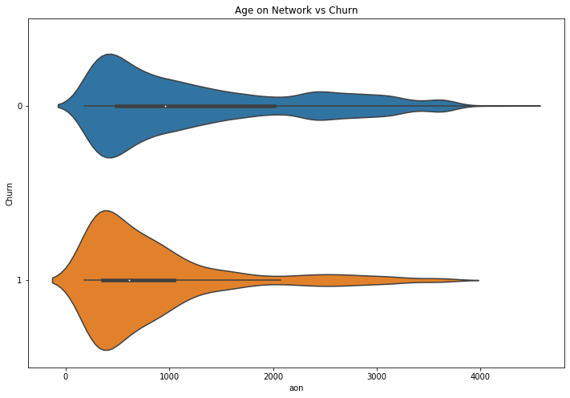


- The customers with lesser 'aon' are more likely to Churn when compared to the Customers with higer 'aon'


```python
# function for numerical variable univariate analysis
from tabulate import tabulate
def num_univariate_analysis(column_names,scale='linear') : 
    # boxplot for column vs target
    
    fig = plt.figure(figsize=(16,8))
    ax1 = fig.add_subplot(1,3,1)
    sns.violinplot(x='Churn', y = column_names[0], data = data, ax=ax1)
    title = ''.join(column_names[0]) +' vs Churn'
    ax1.set(title=title)
    if scale == 'log' :
        plt.yscale('log')
        ax1.set(ylabel= column_names[0] + '(Log Scale)')
        
    ax2 = fig.add_subplot(1,3,2)
    sns.violinplot(x='Churn', y = column_names[1], data = data, ax=ax2)
    title = ''.join(column_names[1]) +' vs Churn'
    ax2.set(title=title)
    if scale == 'log' :
        plt.yscale('log')
        ax2.set(ylabel= column_names[1] + '(Log Scale)')
    
    ax3 = fig.add_subplot(1,3,3)
    sns.violinplot(x='Churn', y = column_names[2], data = data, ax=ax3)
    title = ''.join(column_names[2]) +' vs Churn'
    ax3.set(title=title)
    if scale == 'log' :
        plt.yscale('log')
        ax3.set(ylabel= column_names[2] + '(Log Scale)')
    
    # summary statistic
    
    print('Customers who churned (Churn : 1)')
    print(churned_customers[column_names].describe())
    
    print('\nCustomers who did not churn (Churn : 0)')
    print(non_churned_customers[column_names].describe(),'\n')
```


```python
# function for categorical variable univariate analysis
!pip install sidetable
import sidetable
def cat_univariate_analysis(column_names,figsize=(16,4)) : 
    
    # column vs target count plot
    fig = plt.figure(figsize=figsize)
    
    ax1 = fig.add_subplot(1,3,1)
    sns.countplot(x=column_names[0],hue='Churn',data=data, ax=ax1)
    title = column_names[0] + ' vs No of Churned Customers'
    ax1.set(title= title)
    ax1.legend(loc='upper right')

    
    ax2 = fig.add_subplot(1,3,2)
    sns.countplot(x=column_names[1],hue='Churn',data=data, ax=ax2)
    title = column_names[1] + ' vs No of Churned Customers'
    ax2.set(title= title)
    ax2.legend(loc='upper right')

        
    ax3 = fig.add_subplot(1,3,3)
    sns.countplot(x=column_names[2],hue='Churn',data=data, ax=ax3)
    title = column_names[2] + ' vs No of Churned Customers'
    ax3.set(title= title)
    ax3.legend(loc='upper right')

        
    # Percentages 
    print('Customers who churned (Churn : 1)')
    print(tabulate(pd.DataFrame(churned_customers.stb.freq([column_names[0]])), headers='keys', tablefmt='psql'),'\n')
    print(tabulate(pd.DataFrame(churned_customers.stb.freq([column_names[1]])), headers='keys', tablefmt='psql'),'\n')
    print(tabulate(pd.DataFrame(churned_customers.stb.freq([column_names[2]])), headers='keys', tablefmt='psql'),'\n')

    print('\nCustomers who did not churn (Churn : 0)')
    print(tabulate(pd.DataFrame(non_churned_customers.stb.freq([column_names[0]])), headers='keys', tablefmt='psql'),'\n')
    print(tabulate(pd.DataFrame(non_churned_customers.stb.freq([column_names[1]])), headers='keys', tablefmt='psql'),'\n')
    print(tabulate(pd.DataFrame(non_churned_customers.stb.freq([column_names[2]])), headers='keys', tablefmt='psql'),'\n')
```

    Requirement already satisfied: sidetable in /Users/jayanth/opt/anaconda3/lib/python3.7/site-packages (0.3.0)
    Requirement already satisfied: pandas>=1.0 in /Users/jayanth/opt/anaconda3/lib/python3.7/site-packages (from sidetable) (1.1.2)
    Requirement already satisfied: python-dateutil>=2.7.3 in /Users/jayanth/opt/anaconda3/lib/python3.7/site-packages (from pandas>=1.0->sidetable) (2.8.1)
    Requirement already satisfied: numpy>=1.15.4 in /Users/jayanth/opt/anaconda3/lib/python3.7/site-packages (from pandas>=1.0->sidetable) (1.18.1)
    Requirement already satisfied: pytz>=2017.2 in /Users/jayanth/opt/anaconda3/lib/python3.7/site-packages (from pandas>=1.0->sidetable) (2019.3)
    Requirement already satisfied: six>=1.5 in /Users/jayanth/opt/anaconda3/lib/python3.7/site-packages (from python-dateutil>=2.7.3->pandas>=1.0->sidetable) (1.14.0)


#### arpu_6, arpu_7 , arpu_8


```python
columns = ['arpu_6','arpu_7','arpu_8']
num_univariate_analysis(columns,'log')

```

    Customers who churned (Churn : 1)
                 arpu_6        arpu_7       arpu_8
    count   2593.000000   2593.000000  2593.000000
    mean     678.716970    550.511946   243.063343
    std      551.792864    517.241221   378.843531
    min     -209.465000   -158.963000   -37.887000
    25%      396.507000    289.641000     0.000000
    50%      573.396000    464.674000   101.894000
    75%      819.460000    691.588000   351.028000
    max    11505.508000  13224.119000  5228.826000
    
    Customers who did not churn (Churn : 0)
                 arpu_6        arpu_7        arpu_8
    count  27418.000000  27418.000000  27418.000000
    mean     578.637360    592.788162    562.453248
    std      429.988265    457.265996    492.802655
    min    -2258.709000  -2014.045000   -945.808000
    25%      362.218000    369.610500    319.118500
    50%      489.324000    496.182500    471.024000
    75%      690.891750    701.418000    690.921000
    max    27731.088000  35145.834000  33543.624000 
    


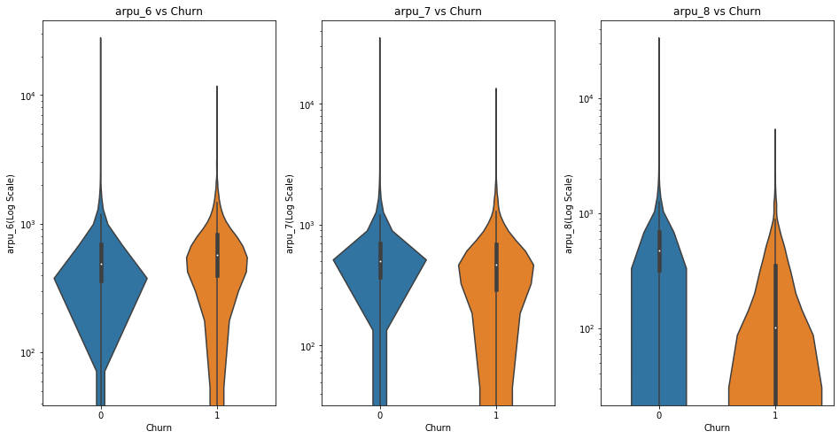


- We can understand from the above plots that revenue generated by the Customers who are about to churn is very unstable.
- The Customers whose arpu decreases in 7th month are more likely to churn when compared to ones with increase in arpu. 

#### total_og_mou_6, total_og_mou_7, total_og_mou_8


```python
columns = ['total_og_mou_6', 'total_og_mou_7', 'total_og_mou_8']
num_univariate_analysis(columns)
```

    Customers who churned (Churn : 1)
           total_og_mou_6  total_og_mou_7  total_og_mou_8
    count     2593.000000     2593.000000     2593.000000
    mean       867.961342      677.868909      225.083741
    std        852.697688      786.961399      471.672718
    min          0.000000        0.000000        0.000000
    25%        277.880000      110.090000        0.000000
    50%        658.360000      466.910000        0.000000
    75%       1209.040000      926.760000      255.810000
    max       8488.360000     8285.640000     5206.210000
    
    Customers who did not churn (Churn : 0)
           total_og_mou_6  total_og_mou_7  total_og_mou_8
    count    27418.000000    27418.000000    27418.000000
    mean       669.554896      712.080684      661.480046
    std        636.531612      674.580516      691.079113
    min          0.000000        0.000000        0.000000
    25%        265.682500      284.500000      227.970000
    50%        500.410000      529.935000      470.475000
    75%        872.070000      931.197500      866.045000
    max      10674.030000    11365.310000    14043.060000 
    


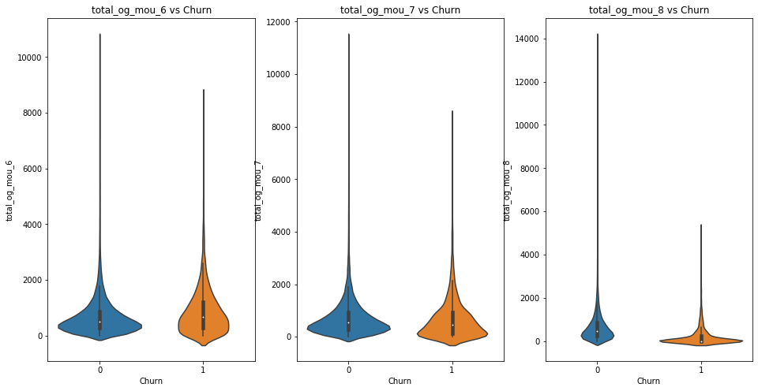


- The Customers with high total_og_mou in 6th month and lower total_og_mou in 7th month are more likely to churn compared to the rest.

#### 'total_ic_mou_6', 'total_ic_mou_7', 'total_ic_mou_8'


```python
columns = ['total_ic_mou_6', 'total_ic_mou_7', 'total_ic_mou_8']
num_univariate_analysis(columns)
```

    Customers who churned (Churn : 1)
           total_ic_mou_6  total_ic_mou_7  total_ic_mou_8
    count     2593.000000     2593.000000     2593.000000
    mean       241.954404      193.341076       68.807042
    std        360.836586      318.183813      154.450340
    min          0.000000        0.000000        0.000000
    25%         49.460000       27.890000        0.000000
    50%        137.330000       99.980000        0.000000
    75%        289.510000      235.740000       70.290000
    max       6633.180000     5137.560000     1859.280000
    
    Customers who did not churn (Churn : 0)
           total_ic_mou_6  total_ic_mou_7  total_ic_mou_8
    count    27418.000000    27418.000000    27418.000000
    mean       313.712052      326.369333      316.858595
    std        360.580253      372.112086      366.818717
    min          0.000000        0.000000        0.000000
    25%         94.460000      107.802500       98.265000
    50%        212.160000      222.290000      212.360000
    75%        401.602500      410.182500      402.270000
    max       6798.640000     7279.080000     5990.710000 
    


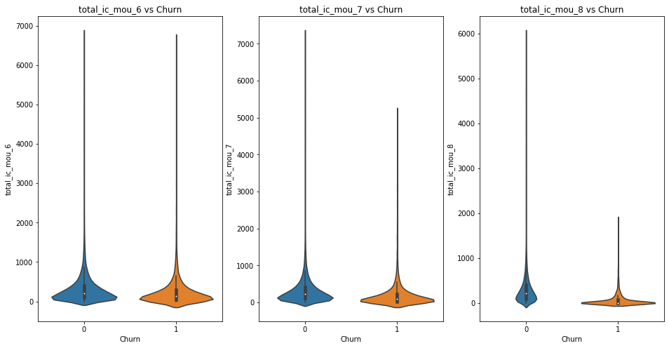


- The Customers with decrease in rate of total_ic_mou in 7th month are more likely to churn, compared to the rest. 

#### vol_2g_mb_6, vol_2g_mb_7, vol_2g_mb_8


```python
columns = ['vol_2g_mb_6', 'vol_2g_mb_7', 'vol_2g_mb_8']
num_univariate_analysis(columns, 'log')
```

    Customers who churned (Churn : 1)
           vol_2g_mb_6  vol_2g_mb_7  vol_2g_mb_8
    count  2593.000000  2593.000000  2593.000000
    mean     60.775588    49.054393    15.283185
    std     243.084276   219.485813   120.975111
    min       0.000000     0.000000     0.000000
    25%       0.000000     0.000000     0.000000
    50%       0.000000     0.000000     0.000000
    75%       0.000000     0.000000     0.000000
    max    4017.160000  3430.730000  3349.190000
    
    Customers who did not churn (Churn : 0)
            vol_2g_mb_6   vol_2g_mb_7   vol_2g_mb_8
    count  27418.000000  27418.000000  27418.000000
    mean      80.569210     80.925060     74.309036
    std      280.420463    285.265125    277.889339
    min        0.000000      0.000000      0.000000
    25%        0.000000      0.000000      0.000000
    50%        0.000000      0.000000      0.000000
    75%       16.937500     18.267500     14.245000
    max    10285.900000   7873.550000  11117.610000 
    


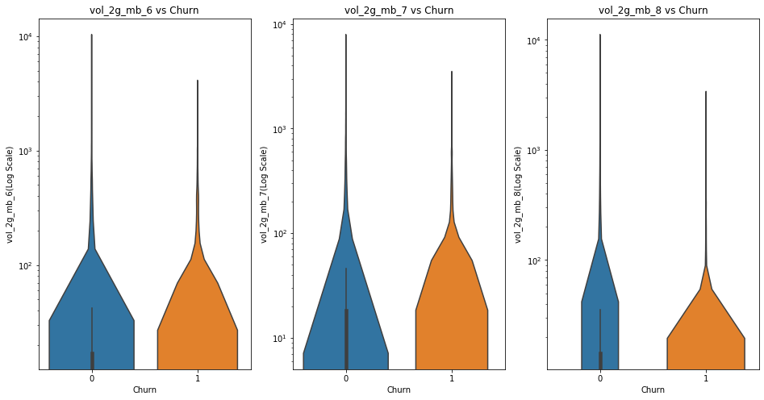


- Customers with stable usage of 2g volumes throughout 6 and 7 months are less likely to churn.
- Customers with fall in consumption of 2g volumes in 7th month are more likely to Churn.

#### vol_3g_mb_6, vol_3g_mb_7, vol_3g_mb_8, monthly_3g_6


```python
columns = ['vol_3g_mb_6', 'vol_3g_mb_7', 'vol_3g_mb_8', 'monthly_3g_6']
num_univariate_analysis(columns, 'log')
```

    Customers who churned (Churn : 1)
           vol_3g_mb_6   vol_3g_mb_7   vol_3g_mb_8
    count  2593.000000   2593.000000   2593.000000
    mean    188.395461    157.714254     56.776880
    std     715.327843    690.773561    446.532769
    min       0.000000      0.000000      0.000000
    25%       0.000000      0.000000      0.000000
    50%       0.000000      0.000000      0.000000
    75%       0.000000      0.000000      0.000000
    max    9400.120000  15115.510000  13440.720000
    
    Customers who did not churn (Churn : 0)
            vol_3g_mb_6   vol_3g_mb_7   vol_3g_mb_8
    count  27418.000000  27418.000000  27418.000000
    mean     265.012522    289.478375    290.016390
    std      878.846885    868.808831    885.821105
    min        0.000000      0.000000      0.000000
    25%        0.000000      0.000000      0.000000
    50%        0.000000      0.000000      0.000000
    75%        0.000000     35.855000     27.120000
    max    45735.400000  28144.120000  30036.060000 
    


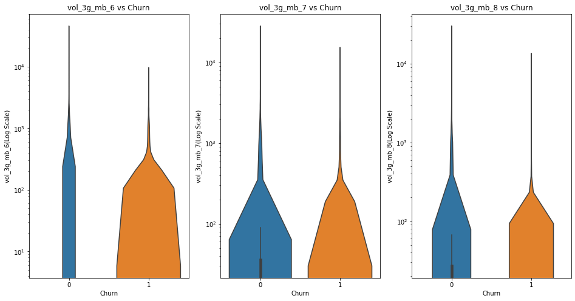


- Customers with stable usage of 3g volumes throughout 6 and 7 months are less likely to churn.
- Customers with fall in consumption of 3g volumes in 7th month are more likely to Churn.

#### monthly_2g_6, monthly_2g_7, monthly_2g_8


```python
columns = ['monthly_2g_6', 'monthly_2g_7', 'monthly_2g_8']
cat_univariate_analysis(columns)
```

    Customers who churned (Churn : 1)
    +----+----------------+---------+-------------+--------------------+----------------------+
    |    |   monthly_2g_6 |   Count |     Percent |   Cumulative Count |   Cumulative Percent |
    |----+----------------+---------+-------------+--------------------+----------------------|
    |  0 |              0 |    2454 | 0.946394    |               2454 |             0.946394 |
    |  1 |              1 |     126 | 0.0485924   |               2580 |             0.994987 |
    |  2 |              2 |      11 | 0.00424219  |               2591 |             0.999229 |
    |  3 |              4 |       2 | 0.000771307 |               2593 |             1        |
    +----+----------------+---------+-------------+--------------------+----------------------+ 
    
    +----+----------------+---------+------------+--------------------+----------------------+
    |    |   monthly_2g_7 |   Count |    Percent |   Cumulative Count |   Cumulative Percent |
    |----+----------------+---------+------------+--------------------+----------------------|
    |  0 |              0 |    2477 | 0.955264   |               2477 |             0.955264 |
    |  1 |              1 |     104 | 0.040108   |               2581 |             0.995372 |
    |  2 |              2 |      12 | 0.00462784 |               2593 |             1        |
    +----+----------------+---------+------------+--------------------+----------------------+ 
    
    +----+----------------+---------+-------------+--------------------+----------------------+
    |    |   monthly_2g_8 |   Count |     Percent |   Cumulative Count |   Cumulative Percent |
    |----+----------------+---------+-------------+--------------------+----------------------|
    |  0 |              0 |    2555 | 0.985345    |               2555 |             0.985345 |
    |  1 |              1 |      37 | 0.0142692   |               2592 |             0.999614 |
    |  2 |              2 |       1 | 0.000385654 |               2593 |             1        |
    +----+----------------+---------+-------------+--------------------+----------------------+ 
    
    
    Customers who did not churn (Churn : 0)
    +----+----------------+---------+-------------+--------------------+----------------------+
    |    |   monthly_2g_6 |   Count |     Percent |   Cumulative Count |   Cumulative Percent |
    |----+----------------+---------+-------------+--------------------+----------------------|
    |  0 |              0 |   24228 | 0.883653    |              24228 |             0.883653 |
    |  1 |              1 |    2825 | 0.103035    |              27053 |             0.986688 |
    |  2 |              2 |     334 | 0.0121818   |              27387 |             0.998869 |
    |  3 |              3 |      26 | 0.000948282 |              27413 |             0.999818 |
    |  4 |              4 |       5 | 0.000182362 |              27418 |             1        |
    +----+----------------+---------+-------------+--------------------+----------------------+ 
    
    +----+----------------+---------+-------------+--------------------+----------------------+
    |    |   monthly_2g_7 |   Count |     Percent |   Cumulative Count |   Cumulative Percent |
    |----+----------------+---------+-------------+--------------------+----------------------|
    |  0 |              0 |   24079 | 0.878219    |              24079 |             0.878219 |
    |  1 |              1 |    2909 | 0.106098    |              26988 |             0.984317 |
    |  2 |              2 |     394 | 0.0143701   |              27382 |             0.998687 |
    |  3 |              3 |      29 | 0.0010577   |              27411 |             0.999745 |
    |  4 |              4 |       5 | 0.000182362 |              27416 |             0.999927 |
    |  5 |              5 |       2 | 7.29448e-05 |              27418 |             1        |
    +----+----------------+---------+-------------+--------------------+----------------------+ 
    
    +----+----------------+---------+-------------+--------------------+----------------------+
    |    |   monthly_2g_8 |   Count |     Percent |   Cumulative Count |   Cumulative Percent |
    |----+----------------+---------+-------------+--------------------+----------------------|
    |  0 |              0 |   24383 | 0.889306    |              24383 |             0.889306 |
    |  1 |              1 |    2724 | 0.0993508   |              27107 |             0.988657 |
    |  2 |              2 |     282 | 0.0102852   |              27389 |             0.998942 |
    |  3 |              3 |      22 | 0.000802393 |              27411 |             0.999745 |
    |  4 |              4 |       5 | 0.000182362 |              27416 |             0.999927 |
    |  5 |              5 |       2 | 7.29448e-05 |              27418 |             1        |
    +----+----------------+---------+-------------+--------------------+----------------------+ 
    


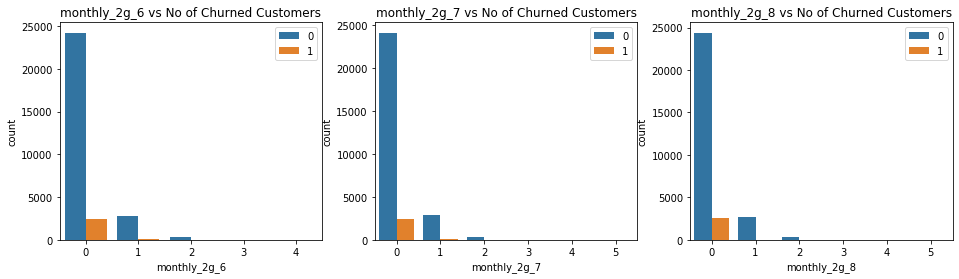


#### monthly_3g_6, monthly_3g_7, monthly_3g_8


```python
columns = ['monthly_3g_6', 'monthly_3g_7', 'monthly_3g_8']
cat_univariate_analysis(columns)
```

    Customers who churned (Churn : 1)
    +----+----------------+---------+-------------+--------------------+----------------------+
    |    |   monthly_3g_6 |   Count |     Percent |   Cumulative Count |   Cumulative Percent |
    |----+----------------+---------+-------------+--------------------+----------------------|
    |  0 |              0 |    2352 | 0.907057    |               2352 |             0.907057 |
    |  1 |              1 |     170 | 0.0655611   |               2522 |             0.972619 |
    |  2 |              2 |      49 | 0.018897    |               2571 |             0.991516 |
    |  3 |              3 |      13 | 0.0050135   |               2584 |             0.996529 |
    |  4 |              5 |       4 | 0.00154261  |               2588 |             0.998072 |
    |  5 |              4 |       4 | 0.00154261  |               2592 |             0.999614 |
    |  6 |              6 |       1 | 0.000385654 |               2593 |             1        |
    +----+----------------+---------+-------------+--------------------+----------------------+ 
    
    +----+----------------+---------+-------------+--------------------+----------------------+
    |    |   monthly_3g_7 |   Count |     Percent |   Cumulative Count |   Cumulative Percent |
    |----+----------------+---------+-------------+--------------------+----------------------|
    |  0 |              0 |    2399 | 0.925183    |               2399 |             0.925183 |
    |  1 |              1 |     136 | 0.0524489   |               2535 |             0.977632 |
    |  2 |              2 |      48 | 0.0185114   |               2583 |             0.996143 |
    |  3 |              3 |       9 | 0.00347088  |               2592 |             0.999614 |
    |  4 |              5 |       1 | 0.000385654 |               2593 |             1        |
    +----+----------------+---------+-------------+--------------------+----------------------+ 
    
    +----+----------------+---------+-------------+--------------------+----------------------+
    |    |   monthly_3g_8 |   Count |     Percent |   Cumulative Count |   Cumulative Percent |
    |----+----------------+---------+-------------+--------------------+----------------------|
    |  0 |              0 |    2524 | 0.97339     |               2524 |             0.97339  |
    |  1 |              1 |      56 | 0.0215966   |               2580 |             0.994987 |
    |  2 |              2 |       8 | 0.00308523  |               2588 |             0.998072 |
    |  3 |              3 |       4 | 0.00154261  |               2592 |             0.999614 |
    |  4 |              4 |       1 | 0.000385654 |               2593 |             1        |
    +----+----------------+---------+-------------+--------------------+----------------------+ 
    
    
    Customers who did not churn (Churn : 0)
    +----+----------------+---------+-------------+--------------------+----------------------+
    |    |   monthly_3g_6 |   Count |     Percent |   Cumulative Count |   Cumulative Percent |
    |----+----------------+---------+-------------+--------------------+----------------------|
    |  0 |              0 |   24080 | 0.878255    |              24080 |             0.878255 |
    |  1 |              1 |    2371 | 0.086476    |              26451 |             0.964731 |
    |  2 |              2 |     648 | 0.0236341   |              27099 |             0.988365 |
    |  3 |              3 |     194 | 0.00707564  |              27293 |             0.995441 |
    |  4 |              4 |      70 | 0.00255307  |              27363 |             0.997994 |
    |  5 |              5 |      28 | 0.00102123  |              27391 |             0.999015 |
    |  6 |              6 |      10 | 0.000364724 |              27401 |             0.99938  |
    |  7 |              7 |       9 | 0.000328252 |              27410 |             0.999708 |
    |  8 |              8 |       3 | 0.000109417 |              27413 |             0.999818 |
    |  9 |             11 |       2 | 7.29448e-05 |              27415 |             0.999891 |
    | 10 |              9 |       2 | 7.29448e-05 |              27417 |             0.999964 |
    | 11 |             14 |       1 | 3.64724e-05 |              27418 |             1        |
    +----+----------------+---------+-------------+--------------------+----------------------+ 
    
    +----+----------------+---------+-------------+--------------------+----------------------+
    |    |   monthly_3g_7 |   Count |     Percent |   Cumulative Count |   Cumulative Percent |
    |----+----------------+---------+-------------+--------------------+----------------------|
    |  0 |              0 |   23962 | 0.873951    |              23962 |             0.873951 |
    |  1 |              1 |    2330 | 0.0849807   |              26292 |             0.958932 |
    |  2 |              2 |     774 | 0.0282296   |              27066 |             0.987162 |
    |  3 |              3 |     198 | 0.00722153  |              27264 |             0.994383 |
    |  4 |              4 |      68 | 0.00248012  |              27332 |             0.996863 |
    |  5 |              5 |      38 | 0.00138595  |              27370 |             0.998249 |
    |  6 |              6 |      23 | 0.000838865 |              27393 |             0.999088 |
    |  7 |              7 |      10 | 0.000364724 |              27403 |             0.999453 |
    |  8 |              8 |       5 | 0.000182362 |              27408 |             0.999635 |
    |  9 |              9 |       4 | 0.00014589  |              27412 |             0.999781 |
    | 10 |             11 |       2 | 7.29448e-05 |              27414 |             0.999854 |
    | 11 |             16 |       1 | 3.64724e-05 |              27415 |             0.999891 |
    | 12 |             14 |       1 | 3.64724e-05 |              27416 |             0.999927 |
    | 13 |             12 |       1 | 3.64724e-05 |              27417 |             0.999964 |
    | 14 |             10 |       1 | 3.64724e-05 |              27418 |             1        |
    +----+----------------+---------+-------------+--------------------+----------------------+ 
    
    +----+----------------+---------+-------------+--------------------+----------------------+
    |    |   monthly_3g_8 |   Count |     Percent |   Cumulative Count |   Cumulative Percent |
    |----+----------------+---------+-------------+--------------------+----------------------|
    |  0 |              0 |   24002 | 0.87541     |              24002 |             0.87541  |
    |  1 |              1 |    2347 | 0.0856007   |              26349 |             0.961011 |
    |  2 |              2 |     728 | 0.0265519   |              27077 |             0.987563 |
    |  3 |              3 |     193 | 0.00703917  |              27270 |             0.994602 |
    |  4 |              4 |      86 | 0.00313663  |              27356 |             0.997739 |
    |  5 |              5 |      30 | 0.00109417  |              27386 |             0.998833 |
    |  6 |              6 |      14 | 0.000510613 |              27400 |             0.999343 |
    |  7 |              7 |       9 | 0.000328252 |              27409 |             0.999672 |
    |  8 |              9 |       3 | 0.000109417 |              27412 |             0.999781 |
    |  9 |              8 |       3 | 0.000109417 |              27415 |             0.999891 |
    | 10 |             10 |       2 | 7.29448e-05 |              27417 |             0.999964 |
    | 11 |             16 |       1 | 3.64724e-05 |              27418 |             1        |
    +----+----------------+---------+-------------+--------------------+----------------------+ 
    


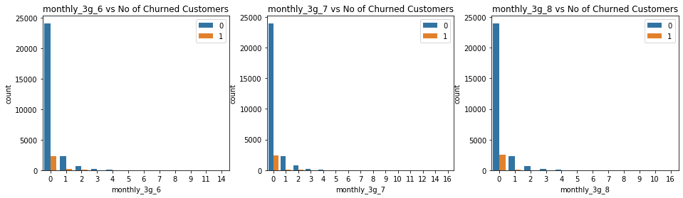


#### sachet_3g_6, sachet_3g_7, sachet_3g_8


```python
columns = ['sachet_3g_6', 'sachet_3g_7','sachet_3g_8']
print(data[columns].dtypes)
cat_univariate_analysis(columns)

```

    sachet_3g_6    category
    sachet_3g_7    category
    sachet_3g_8    category
    dtype: object
    Customers who churned (Churn : 1)
    +----+---------------+---------+-------------+--------------------+----------------------+
    |    |   sachet_3g_6 |   Count |     Percent |   Cumulative Count |   Cumulative Percent |
    |----+---------------+---------+-------------+--------------------+----------------------|
    |  0 |             0 |    2454 | 0.946394    |               2454 |             0.946394 |
    |  1 |             1 |      87 | 0.0335519   |               2541 |             0.979946 |
    |  2 |             2 |      16 | 0.00617046  |               2557 |             0.986116 |
    |  3 |             4 |      11 | 0.00424219  |               2568 |             0.990359 |
    |  4 |             3 |       8 | 0.00308523  |               2576 |             0.993444 |
    |  5 |            10 |       4 | 0.00154261  |               2580 |             0.994987 |
    |  6 |             7 |       4 | 0.00154261  |               2584 |             0.996529 |
    |  7 |             6 |       3 | 0.00115696  |               2587 |             0.997686 |
    |  8 |             9 |       2 | 0.000771307 |               2589 |             0.998457 |
    |  9 |            23 |       1 | 0.000385654 |               2590 |             0.998843 |
    | 10 |            19 |       1 | 0.000385654 |               2591 |             0.999229 |
    | 11 |             8 |       1 | 0.000385654 |               2592 |             0.999614 |
    | 12 |             5 |       1 | 0.000385654 |               2593 |             1        |
    +----+---------------+---------+-------------+--------------------+----------------------+ 
    
    +----+---------------+---------+-------------+--------------------+----------------------+
    |    |   sachet_3g_7 |   Count |     Percent |   Cumulative Count |   Cumulative Percent |
    |----+---------------+---------+-------------+--------------------+----------------------|
    |  0 |             0 |    2458 | 0.947937    |               2458 |             0.947937 |
    |  1 |             1 |      82 | 0.0316236   |               2540 |             0.97956  |
    |  2 |             2 |      19 | 0.00732742  |               2559 |             0.986888 |
    |  3 |             3 |       8 | 0.00308523  |               2567 |             0.989973 |
    |  4 |             5 |       7 | 0.00269958  |               2574 |             0.992673 |
    |  5 |             4 |       4 | 0.00154261  |               2578 |             0.994215 |
    |  6 |             9 |       3 | 0.00115696  |               2581 |             0.995372 |
    |  7 |             6 |       3 | 0.00115696  |               2584 |             0.996529 |
    |  8 |            10 |       2 | 0.000771307 |               2586 |             0.9973   |
    |  9 |            35 |       1 | 0.000385654 |               2587 |             0.997686 |
    | 10 |            24 |       1 | 0.000385654 |               2588 |             0.998072 |
    | 11 |            17 |       1 | 0.000385654 |               2589 |             0.998457 |
    | 12 |            12 |       1 | 0.000385654 |               2590 |             0.998843 |
    | 13 |            11 |       1 | 0.000385654 |               2591 |             0.999229 |
    | 14 |             8 |       1 | 0.000385654 |               2592 |             0.999614 |
    | 15 |             7 |       1 | 0.000385654 |               2593 |             1        |
    +----+---------------+---------+-------------+--------------------+----------------------+ 
    
    +----+---------------+---------+-------------+--------------------+----------------------+
    |    |   sachet_3g_8 |   Count |     Percent |   Cumulative Count |   Cumulative Percent |
    |----+---------------+---------+-------------+--------------------+----------------------|
    |  0 |             0 |    2546 | 0.981874    |               2546 |             0.981874 |
    |  1 |             1 |      31 | 0.0119553   |               2577 |             0.99383  |
    |  2 |             3 |       5 | 0.00192827  |               2582 |             0.995758 |
    |  3 |             2 |       3 | 0.00115696  |               2585 |             0.996915 |
    |  4 |             8 |       2 | 0.000771307 |               2587 |             0.997686 |
    |  5 |             5 |       2 | 0.000771307 |               2589 |             0.998457 |
    |  6 |             4 |       2 | 0.000771307 |               2591 |             0.999229 |
    |  7 |            16 |       1 | 0.000385654 |               2592 |             0.999614 |
    |  8 |            13 |       1 | 0.000385654 |               2593 |             1        |
    +----+---------------+---------+-------------+--------------------+----------------------+ 
    
    
    Customers who did not churn (Churn : 0)
    +----+---------------+---------+-------------+--------------------+----------------------+
    |    |   sachet_3g_6 |   Count |     Percent |   Cumulative Count |   Cumulative Percent |
    |----+---------------+---------+-------------+--------------------+----------------------|
    |  0 |             0 |   25579 | 0.932927    |              25579 |             0.932927 |
    |  1 |             1 |    1220 | 0.0444963   |              26799 |             0.977424 |
    |  2 |             2 |     297 | 0.0108323   |              27096 |             0.988256 |
    |  3 |             3 |     111 | 0.00404844  |              27207 |             0.992304 |
    |  4 |             4 |      55 | 0.00200598  |              27262 |             0.99431  |
    |  5 |             5 |      36 | 0.00131301  |              27298 |             0.995623 |
    |  6 |             6 |      24 | 0.000875337 |              27322 |             0.996499 |
    |  7 |             7 |      22 | 0.000802393 |              27344 |             0.997301 |
    |  8 |             8 |      14 | 0.000510613 |              27358 |             0.997812 |
    |  9 |             9 |      13 | 0.000474141 |              27371 |             0.998286 |
    | 10 |            11 |       8 | 0.000291779 |              27379 |             0.998578 |
    | 11 |            10 |       7 | 0.000255307 |              27386 |             0.998833 |
    | 12 |            15 |       5 | 0.000182362 |              27391 |             0.999015 |
    | 13 |            12 |       4 | 0.00014589  |              27395 |             0.999161 |
    | 14 |            19 |       3 | 0.000109417 |              27398 |             0.999271 |
    | 15 |            18 |       3 | 0.000109417 |              27401 |             0.99938  |
    | 16 |            14 |       3 | 0.000109417 |              27404 |             0.999489 |
    | 17 |            13 |       3 | 0.000109417 |              27407 |             0.999599 |
    | 18 |            29 |       2 | 7.29448e-05 |              27409 |             0.999672 |
    | 19 |            23 |       2 | 7.29448e-05 |              27411 |             0.999745 |
    | 20 |            22 |       2 | 7.29448e-05 |              27413 |             0.999818 |
    | 21 |            16 |       2 | 7.29448e-05 |              27415 |             0.999891 |
    | 22 |            28 |       1 | 3.64724e-05 |              27416 |             0.999927 |
    | 23 |            21 |       1 | 3.64724e-05 |              27417 |             0.999964 |
    | 24 |            17 |       1 | 3.64724e-05 |              27418 |             1        |
    +----+---------------+---------+-------------+--------------------+----------------------+ 
    
    +----+---------------+---------+-------------+--------------------+----------------------+
    |    |   sachet_3g_7 |   Count |     Percent |   Cumulative Count |   Cumulative Percent |
    |----+---------------+---------+-------------+--------------------+----------------------|
    |  0 |             0 |   25595 | 0.933511    |              25595 |             0.933511 |
    |  1 |             1 |    1151 | 0.0419797   |              26746 |             0.975491 |
    |  2 |             2 |     293 | 0.0106864   |              27039 |             0.986177 |
    |  3 |             3 |     107 | 0.00390255  |              27146 |             0.99008  |
    |  4 |             4 |      68 | 0.00248012  |              27214 |             0.99256  |
    |  5 |             5 |      59 | 0.00215187  |              27273 |             0.994712 |
    |  6 |             6 |      39 | 0.00142242  |              27312 |             0.996134 |
    |  7 |             7 |      17 | 0.000620031 |              27329 |             0.996754 |
    |  8 |             9 |      13 | 0.000474141 |              27342 |             0.997228 |
    |  9 |             8 |      13 | 0.000474141 |              27355 |             0.997702 |
    | 10 |            11 |      12 | 0.000437669 |              27367 |             0.99814  |
    | 11 |            12 |       9 | 0.000328252 |              27376 |             0.998468 |
    | 12 |            10 |       8 | 0.000291779 |              27384 |             0.99876  |
    | 13 |            15 |       5 | 0.000182362 |              27389 |             0.998942 |
    | 14 |            14 |       5 | 0.000182362 |              27394 |             0.999125 |
    | 15 |            18 |       4 | 0.00014589  |              27398 |             0.999271 |
    | 16 |            13 |       4 | 0.00014589  |              27402 |             0.999416 |
    | 17 |            22 |       3 | 0.000109417 |              27405 |             0.999526 |
    | 18 |            20 |       3 | 0.000109417 |              27408 |             0.999635 |
    | 19 |            19 |       3 | 0.000109417 |              27411 |             0.999745 |
    | 20 |            21 |       2 | 7.29448e-05 |              27413 |             0.999818 |
    | 21 |            33 |       1 | 3.64724e-05 |              27414 |             0.999854 |
    | 22 |            31 |       1 | 3.64724e-05 |              27415 |             0.999891 |
    | 23 |            24 |       1 | 3.64724e-05 |              27416 |             0.999927 |
    | 24 |            17 |       1 | 3.64724e-05 |              27417 |             0.999964 |
    | 25 |            16 |       1 | 3.64724e-05 |              27418 |             1        |
    +----+---------------+---------+-------------+--------------------+----------------------+ 
    
    +----+---------------+---------+-------------+--------------------+----------------------+
    |    |   sachet_3g_8 |   Count |     Percent |   Cumulative Count |   Cumulative Percent |
    |----+---------------+---------+-------------+--------------------+----------------------|
    |  0 |             0 |   25736 | 0.938653    |              25736 |             0.938653 |
    |  1 |             1 |    1027 | 0.0374571   |              26763 |             0.976111 |
    |  2 |             2 |     249 | 0.00908163  |              27012 |             0.985192 |
    |  3 |             3 |     124 | 0.00452258  |              27136 |             0.989715 |
    |  4 |             4 |      71 | 0.00258954  |              27207 |             0.992304 |
    |  5 |             5 |      64 | 0.00233423  |              27271 |             0.994639 |
    |  6 |             6 |      26 | 0.000948282 |              27297 |             0.995587 |
    |  7 |             7 |      23 | 0.000838865 |              27320 |             0.996426 |
    |  8 |             8 |      20 | 0.000729448 |              27340 |             0.997155 |
    |  9 |             9 |      12 | 0.000437669 |              27352 |             0.997593 |
    | 10 |            12 |      11 | 0.000401196 |              27363 |             0.997994 |
    | 11 |            10 |      10 | 0.000364724 |              27373 |             0.998359 |
    | 12 |            13 |       9 | 0.000328252 |              27382 |             0.998687 |
    | 13 |            14 |       6 | 0.000218834 |              27388 |             0.998906 |
    | 14 |            11 |       6 | 0.000218834 |              27394 |             0.999125 |
    | 15 |            15 |       5 | 0.000182362 |              27399 |             0.999307 |
    | 16 |            23 |       2 | 7.29448e-05 |              27401 |             0.99938  |
    | 17 |            21 |       2 | 7.29448e-05 |              27403 |             0.999453 |
    | 18 |            20 |       2 | 7.29448e-05 |              27405 |             0.999526 |
    | 19 |            18 |       2 | 7.29448e-05 |              27407 |             0.999599 |
    | 20 |            17 |       2 | 7.29448e-05 |              27409 |             0.999672 |
    | 21 |            16 |       2 | 7.29448e-05 |              27411 |             0.999745 |
    | 22 |            41 |       1 | 3.64724e-05 |              27412 |             0.999781 |
    | 23 |            38 |       1 | 3.64724e-05 |              27413 |             0.999818 |
    | 24 |            30 |       1 | 3.64724e-05 |              27414 |             0.999854 |
    | 25 |            29 |       1 | 3.64724e-05 |              27415 |             0.999891 |
    | 26 |            27 |       1 | 3.64724e-05 |              27416 |             0.999927 |
    | 27 |            25 |       1 | 3.64724e-05 |              27417 |             0.999964 |
    | 28 |            19 |       1 | 3.64724e-05 |              27418 |             1        |
    +----+---------------+---------+-------------+--------------------+----------------------+ 
    


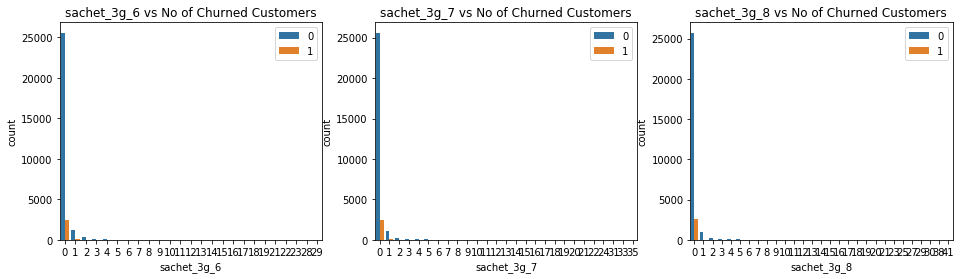


#### aug_vbc_3g, jul_vbc_3g, jun_vbc_3g


```python
columns = [ 'vbc_3g_6', 'vbc_3g_7','vbc_3g_8']
num_univariate_analysis(columns, 'log')
```

    Customers who churned (Churn : 1)
              vbc_3g_6     vbc_3g_7     vbc_3g_8
    count  2593.000000  2593.000000  2593.000000
    mean     81.564601    71.143880    32.610659
    std     320.898511   284.882601   197.998246
    min       0.000000     0.000000     0.000000
    25%       0.000000     0.000000     0.000000
    50%       0.000000     0.000000     0.000000
    75%       0.000000     0.000000     0.000000
    max    6931.810000  4908.270000  5738.740000
    
    Customers who did not churn (Churn : 0)
               vbc_3g_6      vbc_3g_7      vbc_3g_8
    count  27418.000000  27418.000000  27418.000000
    mean     125.124167    141.178182    138.597023
    std      395.413666    417.292310    402.761779
    min        0.000000      0.000000      0.000000
    25%        0.000000      0.000000      0.000000
    50%        0.000000      0.000000      0.000000
    75%        0.000000      9.940000     17.675000
    max    11166.210000   9165.600000  12916.220000 
    


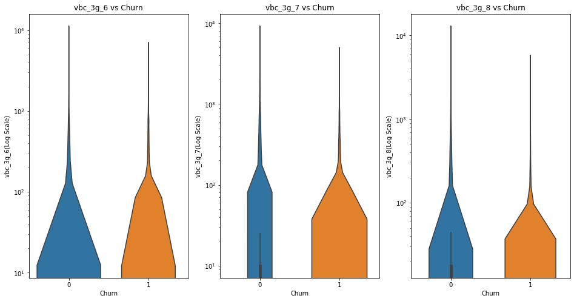


### Bivariate Analysis


```python
data.head()
```


<div>

<table class="dataframe">
  <thead>
    <tr style="text-align: right;">
      <th></th>
      <th>arpu_6</th>
      <th>arpu_7</th>
      <th>arpu_8</th>
      <th>onnet_mou_6</th>
      <th>onnet_mou_7</th>
      <th>onnet_mou_8</th>
      <th>offnet_mou_6</th>
      <th>offnet_mou_7</th>
      <th>offnet_mou_8</th>
      <th>roam_ic_mou_6</th>
      <th>roam_ic_mou_7</th>
      <th>roam_ic_mou_8</th>
      <th>roam_og_mou_6</th>
      <th>roam_og_mou_7</th>
      <th>roam_og_mou_8</th>
      <th>loc_og_t2t_mou_6</th>
      <th>loc_og_t2t_mou_7</th>
      <th>loc_og_t2t_mou_8</th>
      <th>loc_og_t2m_mou_6</th>
      <th>loc_og_t2m_mou_7</th>
      <th>loc_og_t2m_mou_8</th>
      <th>loc_og_t2f_mou_6</th>
      <th>loc_og_t2f_mou_7</th>
      <th>loc_og_t2f_mou_8</th>
      <th>loc_og_t2c_mou_6</th>
      <th>loc_og_t2c_mou_7</th>
      <th>loc_og_t2c_mou_8</th>
      <th>loc_og_mou_6</th>
      <th>loc_og_mou_7</th>
      <th>loc_og_mou_8</th>
      <th>std_og_t2t_mou_6</th>
      <th>std_og_t2t_mou_7</th>
      <th>std_og_t2t_mou_8</th>
      <th>std_og_t2m_mou_6</th>
      <th>std_og_t2m_mou_7</th>
      <th>std_og_t2m_mou_8</th>
      <th>std_og_t2f_mou_6</th>
      <th>std_og_t2f_mou_7</th>
      <th>std_og_t2f_mou_8</th>
      <th>std_og_mou_6</th>
      <th>std_og_mou_7</th>
      <th>std_og_mou_8</th>
      <th>isd_og_mou_6</th>
      <th>isd_og_mou_7</th>
      <th>isd_og_mou_8</th>
      <th>spl_og_mou_6</th>
      <th>spl_og_mou_7</th>
      <th>spl_og_mou_8</th>
      <th>og_others_6</th>
      <th>og_others_7</th>
      <th>og_others_8</th>
      <th>total_og_mou_6</th>
      <th>total_og_mou_7</th>
      <th>total_og_mou_8</th>
      <th>loc_ic_t2t_mou_6</th>
      <th>loc_ic_t2t_mou_7</th>
      <th>loc_ic_t2t_mou_8</th>
      <th>loc_ic_t2m_mou_6</th>
      <th>loc_ic_t2m_mou_7</th>
      <th>loc_ic_t2m_mou_8</th>
      <th>loc_ic_t2f_mou_6</th>
      <th>loc_ic_t2f_mou_7</th>
      <th>loc_ic_t2f_mou_8</th>
      <th>loc_ic_mou_6</th>
      <th>loc_ic_mou_7</th>
      <th>loc_ic_mou_8</th>
      <th>std_ic_t2t_mou_6</th>
      <th>std_ic_t2t_mou_7</th>
      <th>std_ic_t2t_mou_8</th>
      <th>std_ic_t2m_mou_6</th>
      <th>std_ic_t2m_mou_7</th>
      <th>std_ic_t2m_mou_8</th>
      <th>std_ic_t2f_mou_6</th>
      <th>std_ic_t2f_mou_7</th>
      <th>std_ic_t2f_mou_8</th>
      <th>std_ic_mou_6</th>
      <th>std_ic_mou_7</th>
      <th>std_ic_mou_8</th>
      <th>total_ic_mou_6</th>
      <th>total_ic_mou_7</th>
      <th>total_ic_mou_8</th>
      <th>spl_ic_mou_6</th>
      <th>spl_ic_mou_7</th>
      <th>spl_ic_mou_8</th>
      <th>isd_ic_mou_6</th>
      <th>isd_ic_mou_7</th>
      <th>isd_ic_mou_8</th>
      <th>ic_others_6</th>
      <th>ic_others_7</th>
      <th>ic_others_8</th>
      <th>total_rech_num_6</th>
      <th>total_rech_num_7</th>
      <th>total_rech_num_8</th>
      <th>total_rech_amt_6</th>
      <th>total_rech_amt_7</th>
      <th>total_rech_amt_8</th>
      <th>max_rech_amt_6</th>
      <th>max_rech_amt_7</th>
      <th>max_rech_amt_8</th>
      <th>last_day_rch_amt_6</th>
      <th>last_day_rch_amt_7</th>
      <th>last_day_rch_amt_8</th>
      <th>vol_2g_mb_6</th>
      <th>vol_2g_mb_7</th>
      <th>vol_2g_mb_8</th>
      <th>vol_3g_mb_6</th>
      <th>vol_3g_mb_7</th>
      <th>vol_3g_mb_8</th>
      <th>monthly_2g_6</th>
      <th>monthly_2g_7</th>
      <th>monthly_2g_8</th>
      <th>sachet_2g_6</th>
      <th>sachet_2g_7</th>
      <th>sachet_2g_8</th>
      <th>monthly_3g_6</th>
      <th>monthly_3g_7</th>
      <th>monthly_3g_8</th>
      <th>sachet_3g_6</th>
      <th>sachet_3g_7</th>
      <th>sachet_3g_8</th>
      <th>aon</th>
      <th>vbc_3g_8</th>
      <th>vbc_3g_7</th>
      <th>vbc_3g_6</th>
      <th>Average_rech_amt_6n7</th>
      <th>Churn</th>
    </tr>
    <tr>
      <th>mobile_number</th>
      <th></th>
      <th></th>
      <th></th>
      <th></th>
      <th></th>
      <th></th>
      <th></th>
      <th></th>
      <th></th>
      <th></th>
      <th></th>
      <th></th>
      <th></th>
      <th></th>
      <th></th>
      <th></th>
      <th></th>
      <th></th>
      <th></th>
      <th></th>
      <th></th>
      <th></th>
      <th></th>
      <th></th>
      <th></th>
      <th></th>
      <th></th>
      <th></th>
      <th></th>
      <th></th>
      <th></th>
      <th></th>
      <th></th>
      <th></th>
      <th></th>
      <th></th>
      <th></th>
      <th></th>
      <th></th>
      <th></th>
      <th></th>
      <th></th>
      <th></th>
      <th></th>
      <th></th>
      <th></th>
      <th></th>
      <th></th>
      <th></th>
      <th></th>
      <th></th>
      <th></th>
      <th></th>
      <th></th>
      <th></th>
      <th></th>
      <th></th>
      <th></th>
      <th></th>
      <th></th>
      <th></th>
      <th></th>
      <th></th>
      <th></th>
      <th></th>
      <th></th>
      <th></th>
      <th></th>
      <th></th>
      <th></th>
      <th></th>
      <th></th>
      <th></th>
      <th></th>
      <th></th>
      <th></th>
      <th></th>
      <th></th>
      <th></th>
      <th></th>
      <th></th>
      <th></th>
      <th></th>
      <th></th>
      <th></th>
      <th></th>
      <th></th>
      <th></th>
      <th></th>
      <th></th>
      <th></th>
      <th></th>
      <th></th>
      <th></th>
      <th></th>
      <th></th>
      <th></th>
      <th></th>
      <th></th>
      <th></th>
      <th></th>
      <th></th>
      <th></th>
      <th></th>
      <th></th>
      <th></th>
      <th></th>
      <th></th>
      <th></th>
      <th></th>
      <th></th>
      <th></th>
      <th></th>
      <th></th>
      <th></th>
      <th></th>
      <th></th>
      <th></th>
      <th></th>
      <th></th>
      <th></th>
      <th></th>
      <th></th>
      <th></th>
      <th></th>
      <th></th>
    </tr>
  </thead>
  <tbody>
    <tr>
      <th>7000701601</th>
      <td>1069.180</td>
      <td>1349.850</td>
      <td>3171.480</td>
      <td>57.84</td>
      <td>54.68</td>
      <td>52.29</td>
      <td>453.43</td>
      <td>567.16</td>
      <td>325.91</td>
      <td>16.23</td>
      <td>33.49</td>
      <td>31.64</td>
      <td>23.74</td>
      <td>12.59</td>
      <td>38.06</td>
      <td>51.39</td>
      <td>31.38</td>
      <td>40.28</td>
      <td>308.63</td>
      <td>447.38</td>
      <td>162.28</td>
      <td>62.13</td>
      <td>55.14</td>
      <td>53.23</td>
      <td>0.0</td>
      <td>0.0</td>
      <td>0.00</td>
      <td>422.16</td>
      <td>533.91</td>
      <td>255.79</td>
      <td>4.30</td>
      <td>23.29</td>
      <td>12.01</td>
      <td>49.89</td>
      <td>31.76</td>
      <td>49.14</td>
      <td>6.66</td>
      <td>20.08</td>
      <td>16.68</td>
      <td>60.86</td>
      <td>75.14</td>
      <td>77.84</td>
      <td>0.0</td>
      <td>0.18</td>
      <td>10.01</td>
      <td>4.50</td>
      <td>0.00</td>
      <td>6.50</td>
      <td>0.00</td>
      <td>0.0</td>
      <td>0.0</td>
      <td>487.53</td>
      <td>609.24</td>
      <td>350.16</td>
      <td>58.14</td>
      <td>32.26</td>
      <td>27.31</td>
      <td>217.56</td>
      <td>221.49</td>
      <td>121.19</td>
      <td>152.16</td>
      <td>101.46</td>
      <td>39.53</td>
      <td>427.88</td>
      <td>355.23</td>
      <td>188.04</td>
      <td>36.89</td>
      <td>11.83</td>
      <td>30.39</td>
      <td>91.44</td>
      <td>126.99</td>
      <td>141.33</td>
      <td>52.19</td>
      <td>34.24</td>
      <td>22.21</td>
      <td>180.54</td>
      <td>173.08</td>
      <td>193.94</td>
      <td>626.46</td>
      <td>558.04</td>
      <td>428.74</td>
      <td>0.21</td>
      <td>0.0</td>
      <td>0.0</td>
      <td>2.06</td>
      <td>14.53</td>
      <td>31.59</td>
      <td>15.74</td>
      <td>15.19</td>
      <td>15.14</td>
      <td>5</td>
      <td>5</td>
      <td>7</td>
      <td>1580</td>
      <td>790</td>
      <td>3638</td>
      <td>1580</td>
      <td>790</td>
      <td>1580</td>
      <td>0</td>
      <td>0</td>
      <td>779</td>
      <td>0.0</td>
      <td>0.0</td>
      <td>0.00</td>
      <td>0.0</td>
      <td>0.00</td>
      <td>0.00</td>
      <td>0</td>
      <td>0</td>
      <td>0</td>
      <td>0</td>
      <td>0</td>
      <td>0</td>
      <td>0</td>
      <td>0</td>
      <td>0</td>
      <td>0</td>
      <td>0</td>
      <td>0</td>
      <td>802</td>
      <td>57.74</td>
      <td>19.38</td>
      <td>18.74</td>
      <td>1185.0</td>
      <td>1</td>
    </tr>
    <tr>
      <th>7001524846</th>
      <td>378.721</td>
      <td>492.223</td>
      <td>137.362</td>
      <td>413.69</td>
      <td>351.03</td>
      <td>35.08</td>
      <td>94.66</td>
      <td>80.63</td>
      <td>136.48</td>
      <td>0.00</td>
      <td>0.00</td>
      <td>0.00</td>
      <td>0.00</td>
      <td>0.00</td>
      <td>0.00</td>
      <td>297.13</td>
      <td>217.59</td>
      <td>12.49</td>
      <td>80.96</td>
      <td>70.58</td>
      <td>50.54</td>
      <td>0.00</td>
      <td>0.00</td>
      <td>0.00</td>
      <td>0.0</td>
      <td>0.0</td>
      <td>7.15</td>
      <td>378.09</td>
      <td>288.18</td>
      <td>63.04</td>
      <td>116.56</td>
      <td>133.43</td>
      <td>22.58</td>
      <td>13.69</td>
      <td>10.04</td>
      <td>75.69</td>
      <td>0.00</td>
      <td>0.00</td>
      <td>0.00</td>
      <td>130.26</td>
      <td>143.48</td>
      <td>98.28</td>
      <td>0.0</td>
      <td>0.00</td>
      <td>0.00</td>
      <td>0.00</td>
      <td>0.00</td>
      <td>10.23</td>
      <td>0.00</td>
      <td>0.0</td>
      <td>0.0</td>
      <td>508.36</td>
      <td>431.66</td>
      <td>171.56</td>
      <td>23.84</td>
      <td>9.84</td>
      <td>0.31</td>
      <td>57.58</td>
      <td>13.98</td>
      <td>15.48</td>
      <td>0.00</td>
      <td>0.00</td>
      <td>0.00</td>
      <td>81.43</td>
      <td>23.83</td>
      <td>15.79</td>
      <td>0.00</td>
      <td>0.58</td>
      <td>0.10</td>
      <td>22.43</td>
      <td>4.08</td>
      <td>0.65</td>
      <td>0.00</td>
      <td>0.00</td>
      <td>0.00</td>
      <td>22.43</td>
      <td>4.66</td>
      <td>0.75</td>
      <td>103.86</td>
      <td>28.49</td>
      <td>16.54</td>
      <td>0.00</td>
      <td>0.0</td>
      <td>0.0</td>
      <td>0.00</td>
      <td>0.00</td>
      <td>0.00</td>
      <td>0.00</td>
      <td>0.00</td>
      <td>0.00</td>
      <td>19</td>
      <td>21</td>
      <td>14</td>
      <td>437</td>
      <td>601</td>
      <td>120</td>
      <td>90</td>
      <td>154</td>
      <td>30</td>
      <td>50</td>
      <td>0</td>
      <td>10</td>
      <td>0.0</td>
      <td>356.0</td>
      <td>0.03</td>
      <td>0.0</td>
      <td>750.95</td>
      <td>11.94</td>
      <td>0</td>
      <td>1</td>
      <td>0</td>
      <td>0</td>
      <td>1</td>
      <td>3</td>
      <td>0</td>
      <td>0</td>
      <td>0</td>
      <td>0</td>
      <td>0</td>
      <td>0</td>
      <td>315</td>
      <td>21.03</td>
      <td>910.65</td>
      <td>122.16</td>
      <td>519.0</td>
      <td>0</td>
    </tr>
    <tr>
      <th>7002191713</th>
      <td>492.846</td>
      <td>205.671</td>
      <td>593.260</td>
      <td>501.76</td>
      <td>108.39</td>
      <td>534.24</td>
      <td>413.31</td>
      <td>119.28</td>
      <td>482.46</td>
      <td>23.53</td>
      <td>144.24</td>
      <td>72.11</td>
      <td>7.98</td>
      <td>35.26</td>
      <td>1.44</td>
      <td>49.63</td>
      <td>6.19</td>
      <td>36.01</td>
      <td>151.13</td>
      <td>47.28</td>
      <td>294.46</td>
      <td>4.54</td>
      <td>0.00</td>
      <td>23.51</td>
      <td>0.0</td>
      <td>0.0</td>
      <td>0.49</td>
      <td>205.31</td>
      <td>53.48</td>
      <td>353.99</td>
      <td>446.41</td>
      <td>85.98</td>
      <td>498.23</td>
      <td>255.36</td>
      <td>52.94</td>
      <td>156.94</td>
      <td>0.00</td>
      <td>0.00</td>
      <td>0.00</td>
      <td>701.78</td>
      <td>138.93</td>
      <td>655.18</td>
      <td>0.0</td>
      <td>0.00</td>
      <td>1.29</td>
      <td>0.00</td>
      <td>0.00</td>
      <td>4.78</td>
      <td>0.00</td>
      <td>0.0</td>
      <td>0.0</td>
      <td>907.09</td>
      <td>192.41</td>
      <td>1015.26</td>
      <td>67.88</td>
      <td>7.58</td>
      <td>52.58</td>
      <td>142.88</td>
      <td>18.53</td>
      <td>195.18</td>
      <td>4.81</td>
      <td>0.00</td>
      <td>7.49</td>
      <td>215.58</td>
      <td>26.11</td>
      <td>255.26</td>
      <td>115.68</td>
      <td>38.29</td>
      <td>154.58</td>
      <td>308.13</td>
      <td>29.79</td>
      <td>317.91</td>
      <td>0.00</td>
      <td>0.00</td>
      <td>1.91</td>
      <td>423.81</td>
      <td>68.09</td>
      <td>474.41</td>
      <td>968.61</td>
      <td>172.58</td>
      <td>1144.53</td>
      <td>0.45</td>
      <td>0.0</td>
      <td>0.0</td>
      <td>245.28</td>
      <td>62.11</td>
      <td>393.39</td>
      <td>83.48</td>
      <td>16.24</td>
      <td>21.44</td>
      <td>6</td>
      <td>4</td>
      <td>11</td>
      <td>507</td>
      <td>253</td>
      <td>717</td>
      <td>110</td>
      <td>110</td>
      <td>130</td>
      <td>110</td>
      <td>50</td>
      <td>0</td>
      <td>0.0</td>
      <td>0.0</td>
      <td>0.02</td>
      <td>0.0</td>
      <td>0.00</td>
      <td>0.00</td>
      <td>0</td>
      <td>0</td>
      <td>0</td>
      <td>0</td>
      <td>0</td>
      <td>3</td>
      <td>0</td>
      <td>0</td>
      <td>0</td>
      <td>0</td>
      <td>0</td>
      <td>0</td>
      <td>2607</td>
      <td>0.00</td>
      <td>0.00</td>
      <td>0.00</td>
      <td>380.0</td>
      <td>0</td>
    </tr>
    <tr>
      <th>7000875565</th>
      <td>430.975</td>
      <td>299.869</td>
      <td>187.894</td>
      <td>50.51</td>
      <td>74.01</td>
      <td>70.61</td>
      <td>296.29</td>
      <td>229.74</td>
      <td>162.76</td>
      <td>0.00</td>
      <td>2.83</td>
      <td>0.00</td>
      <td>0.00</td>
      <td>17.74</td>
      <td>0.00</td>
      <td>42.61</td>
      <td>65.16</td>
      <td>67.38</td>
      <td>273.29</td>
      <td>145.99</td>
      <td>128.28</td>
      <td>0.00</td>
      <td>4.48</td>
      <td>10.26</td>
      <td>0.0</td>
      <td>0.0</td>
      <td>0.00</td>
      <td>315.91</td>
      <td>215.64</td>
      <td>205.93</td>
      <td>7.89</td>
      <td>2.58</td>
      <td>3.23</td>
      <td>22.99</td>
      <td>64.51</td>
      <td>18.29</td>
      <td>0.00</td>
      <td>0.00</td>
      <td>0.00</td>
      <td>30.89</td>
      <td>67.09</td>
      <td>21.53</td>
      <td>0.0</td>
      <td>0.00</td>
      <td>0.00</td>
      <td>0.00</td>
      <td>3.26</td>
      <td>5.91</td>
      <td>0.00</td>
      <td>0.0</td>
      <td>0.0</td>
      <td>346.81</td>
      <td>286.01</td>
      <td>233.38</td>
      <td>41.33</td>
      <td>71.44</td>
      <td>28.89</td>
      <td>226.81</td>
      <td>149.69</td>
      <td>150.16</td>
      <td>8.71</td>
      <td>8.68</td>
      <td>32.71</td>
      <td>276.86</td>
      <td>229.83</td>
      <td>211.78</td>
      <td>68.79</td>
      <td>78.64</td>
      <td>6.33</td>
      <td>18.68</td>
      <td>73.08</td>
      <td>73.93</td>
      <td>0.51</td>
      <td>0.00</td>
      <td>2.18</td>
      <td>87.99</td>
      <td>151.73</td>
      <td>82.44</td>
      <td>364.86</td>
      <td>381.56</td>
      <td>294.46</td>
      <td>0.00</td>
      <td>0.0</td>
      <td>0.0</td>
      <td>0.00</td>
      <td>0.00</td>
      <td>0.23</td>
      <td>0.00</td>
      <td>0.00</td>
      <td>0.00</td>
      <td>10</td>
      <td>6</td>
      <td>2</td>
      <td>570</td>
      <td>348</td>
      <td>160</td>
      <td>110</td>
      <td>110</td>
      <td>130</td>
      <td>100</td>
      <td>100</td>
      <td>130</td>
      <td>0.0</td>
      <td>0.0</td>
      <td>0.00</td>
      <td>0.0</td>
      <td>0.00</td>
      <td>0.00</td>
      <td>0</td>
      <td>0</td>
      <td>0</td>
      <td>0</td>
      <td>0</td>
      <td>0</td>
      <td>0</td>
      <td>0</td>
      <td>0</td>
      <td>0</td>
      <td>0</td>
      <td>0</td>
      <td>511</td>
      <td>0.00</td>
      <td>2.45</td>
      <td>21.89</td>
      <td>459.0</td>
      <td>0</td>
    </tr>
    <tr>
      <th>7000187447</th>
      <td>690.008</td>
      <td>18.980</td>
      <td>25.499</td>
      <td>1185.91</td>
      <td>9.28</td>
      <td>7.79</td>
      <td>61.64</td>
      <td>0.00</td>
      <td>5.54</td>
      <td>0.00</td>
      <td>4.76</td>
      <td>4.81</td>
      <td>0.00</td>
      <td>8.46</td>
      <td>13.34</td>
      <td>38.99</td>
      <td>0.00</td>
      <td>0.00</td>
      <td>58.54</td>
      <td>0.00</td>
      <td>0.00</td>
      <td>0.00</td>
      <td>0.00</td>
      <td>0.00</td>
      <td>0.0</td>
      <td>0.0</td>
      <td>0.00</td>
      <td>97.54</td>
      <td>0.00</td>
      <td>0.00</td>
      <td>1146.91</td>
      <td>0.81</td>
      <td>0.00</td>
      <td>1.55</td>
      <td>0.00</td>
      <td>0.00</td>
      <td>0.00</td>
      <td>0.00</td>
      <td>0.00</td>
      <td>1148.46</td>
      <td>0.81</td>
      <td>0.00</td>
      <td>0.0</td>
      <td>0.00</td>
      <td>0.00</td>
      <td>2.58</td>
      <td>0.00</td>
      <td>0.00</td>
      <td>0.93</td>
      <td>0.0</td>
      <td>0.0</td>
      <td>1249.53</td>
      <td>0.81</td>
      <td>0.00</td>
      <td>34.54</td>
      <td>0.00</td>
      <td>0.00</td>
      <td>47.41</td>
      <td>2.31</td>
      <td>0.00</td>
      <td>0.00</td>
      <td>0.00</td>
      <td>0.00</td>
      <td>81.96</td>
      <td>2.31</td>
      <td>0.00</td>
      <td>8.63</td>
      <td>0.00</td>
      <td>0.00</td>
      <td>1.28</td>
      <td>0.00</td>
      <td>0.00</td>
      <td>0.00</td>
      <td>0.00</td>
      <td>0.00</td>
      <td>9.91</td>
      <td>0.00</td>
      <td>0.00</td>
      <td>91.88</td>
      <td>2.31</td>
      <td>0.00</td>
      <td>0.00</td>
      <td>0.0</td>
      <td>0.0</td>
      <td>0.00</td>
      <td>0.00</td>
      <td>0.00</td>
      <td>0.00</td>
      <td>0.00</td>
      <td>0.00</td>
      <td>19</td>
      <td>2</td>
      <td>4</td>
      <td>816</td>
      <td>0</td>
      <td>30</td>
      <td>110</td>
      <td>0</td>
      <td>30</td>
      <td>30</td>
      <td>0</td>
      <td>0</td>
      <td>0.0</td>
      <td>0.0</td>
      <td>0.00</td>
      <td>0.0</td>
      <td>0.00</td>
      <td>0.00</td>
      <td>0</td>
      <td>0</td>
      <td>0</td>
      <td>0</td>
      <td>0</td>
      <td>0</td>
      <td>0</td>
      <td>0</td>
      <td>0</td>
      <td>0</td>
      <td>0</td>
      <td>0</td>
      <td>667</td>
      <td>0.00</td>
      <td>0.00</td>
      <td>0.00</td>
      <td>408.0</td>
      <td>0</td>
    </tr>
  </tbody>
</table>
</div>


### 'total_og_mou_6' vs 'total_og_mou_8' with respect to Churn.


```python
sns.scatterplot(x=data['total_og_mou_6'],y=data['total_og_mou_8'],hue=data['Churn'])
```


    <matplotlib.axes._subplots.AxesSubplot at 0x7fbafdb0f7d0>


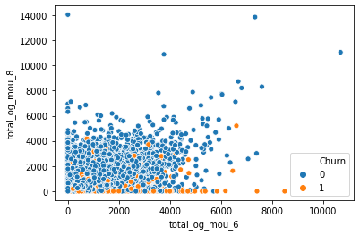


### 'total_og_mou_7' vs 'total_og_mou_8' with respect to Churn.


```python
sns.scatterplot(x=data['total_og_mou_6'],y=data['total_og_mou_8'],hue=data['Churn'])
```


    <matplotlib.axes._subplots.AxesSubplot at 0x7fbafaf9d7d0>


- The customers with lower total_og_mou in 6th and 8th months are more likely to Churn compared to the ones with higher total_og_mou.

### 'aon' vs 'total_og_mou_8' with respect to Churn.


```python
sns.scatterplot(x=data['aon'],y=data['total_og_mou_8'],hue=data['Churn'])
```


    <matplotlib.axes._subplots.AxesSubplot at 0x7fbafcd5fb50>


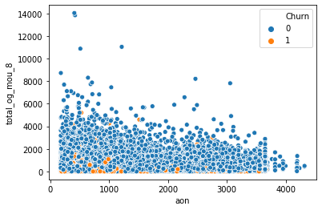


- The customers with lesser total_og_mou_8 and aon are more likely to churn compared to the one with higher total_og_mou_8 and aon.


```python
sns.scatterplot(x=data['aon'],y=data['total_ic_mou_8'],hue=data['Churn'])
```


    <matplotlib.axes._subplots.AxesSubplot at 0x7fbafccb9d90>


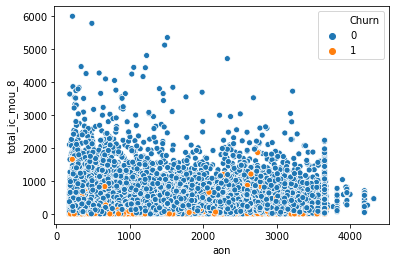


- The customers with less total_ic_mou_8 are more likely to churn irrespective of aon.
- The customers with total_ic_mou_8 > 2000 are very less likely to churn. 

### 'max_rech_amt_6' vs 'max_rech_amt_8' with respect to 'Churn'.


```python
sns.scatterplot(x=data['max_rech_amt_6'],y=data['max_rech_amt_8'],hue=data['Churn'])
```


    <matplotlib.axes._subplots.AxesSubplot at 0x7fbafdd5a950>


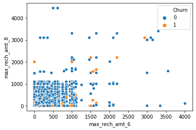


### Correlation Analysis


```python
# function to correlate variables
def correlation(dataframe) : 
    
    columnsForAnalysis = set(dataframe.columns.values) - {'Churn'}
    cor0=dataframe[columnsForAnalysis].corr()
    type(cor0)
    cor0.where(np.triu(np.ones(cor0.shape),k=1).astype(np.bool))
    cor0=cor0.unstack().reset_index()
    cor0.columns=['VAR1','VAR2','CORR']
    cor0.dropna(subset=['CORR'], inplace=True)
    cor0.CORR=round(cor0['CORR'],2)
    cor0.CORR=cor0.CORR.abs()
    cor0.sort_values(by=['CORR'],ascending=False)
    cor0=cor0[~(cor0['VAR1']==cor0['VAR2'])]

    # removing duplicate correlations
    cor0['pair'] = cor0[['VAR1', 'VAR2']].apply(lambda x: '{}-{}'.format(*sorted((x[0], x[1]))), axis=1)
    
    cor0 = cor0.drop_duplicates(subset=['pair'], keep='first')
    cor0 = cor0[['VAR1', 'VAR2','CORR']]
    return pd.DataFrame(cor0.sort_values(by=['CORR'],ascending=False))
```


```python
# Correlations for Churn : 0  - non churn customers
# Absolute values are reported 
pd.set_option('precision', 2)
cor_0 = correlation(non_churned_customers)

# filtering for correlations >= 40%
condition = cor_0['CORR'] > 0.4
cor_0 = cor_0[condition]
cor_0.style.background_gradient(cmap='GnBu').hide_index()
```


        
<table id="T_ee1286fc_35e0_11eb_8040_88e9fe4e6667" ><thead>    <tr>        <th class="col_heading level0 col0" >VAR1</th>        <th class="col_heading level0 col1" >VAR2</th>        <th class="col_heading level0 col2" >CORR</th>    </tr></thead><tbody>
                <tr>
                                <td id="T_ee1286fc_35e0_11eb_8040_88e9fe4e6667row0_col0" class="data row0 col0" >isd_og_mou_7</td>
                        <td id="T_ee1286fc_35e0_11eb_8040_88e9fe4e6667row0_col1" class="data row0 col1" >isd_og_mou_8</td>
                        <td id="T_ee1286fc_35e0_11eb_8040_88e9fe4e6667row0_col2" class="data row0 col2" >0.96</td>
            </tr>
            <tr>
                                <td id="T_ee1286fc_35e0_11eb_8040_88e9fe4e6667row1_col0" class="data row1 col0" >isd_og_mou_6</td>
                        <td id="T_ee1286fc_35e0_11eb_8040_88e9fe4e6667row1_col1" class="data row1 col1" >isd_og_mou_8</td>
                        <td id="T_ee1286fc_35e0_11eb_8040_88e9fe4e6667row1_col2" class="data row1 col2" >0.95</td>
            </tr>
            <tr>
                                <td id="T_ee1286fc_35e0_11eb_8040_88e9fe4e6667row2_col0" class="data row2 col0" >isd_og_mou_6</td>
                        <td id="T_ee1286fc_35e0_11eb_8040_88e9fe4e6667row2_col1" class="data row2 col1" >isd_og_mou_7</td>
                        <td id="T_ee1286fc_35e0_11eb_8040_88e9fe4e6667row2_col2" class="data row2 col2" >0.95</td>
            </tr>
            <tr>
                                <td id="T_ee1286fc_35e0_11eb_8040_88e9fe4e6667row3_col0" class="data row3 col0" >total_rech_amt_8</td>
                        <td id="T_ee1286fc_35e0_11eb_8040_88e9fe4e6667row3_col1" class="data row3 col1" >arpu_8</td>
                        <td id="T_ee1286fc_35e0_11eb_8040_88e9fe4e6667row3_col2" class="data row3 col2" >0.95</td>
            </tr>
            <tr>
                                <td id="T_ee1286fc_35e0_11eb_8040_88e9fe4e6667row4_col0" class="data row4 col0" >total_rech_amt_6</td>
                        <td id="T_ee1286fc_35e0_11eb_8040_88e9fe4e6667row4_col1" class="data row4 col1" >arpu_6</td>
                        <td id="T_ee1286fc_35e0_11eb_8040_88e9fe4e6667row4_col2" class="data row4 col2" >0.94</td>
            </tr>
            <tr>
                                <td id="T_ee1286fc_35e0_11eb_8040_88e9fe4e6667row5_col0" class="data row5 col0" >total_rech_amt_7</td>
                        <td id="T_ee1286fc_35e0_11eb_8040_88e9fe4e6667row5_col1" class="data row5 col1" >arpu_7</td>
                        <td id="T_ee1286fc_35e0_11eb_8040_88e9fe4e6667row5_col2" class="data row5 col2" >0.94</td>
            </tr>
            <tr>
                                <td id="T_ee1286fc_35e0_11eb_8040_88e9fe4e6667row6_col0" class="data row6 col0" >total_rech_amt_7</td>
                        <td id="T_ee1286fc_35e0_11eb_8040_88e9fe4e6667row6_col1" class="data row6 col1" >Average_rech_amt_6n7</td>
                        <td id="T_ee1286fc_35e0_11eb_8040_88e9fe4e6667row6_col2" class="data row6 col2" >0.91</td>
            </tr>
            <tr>
                                <td id="T_ee1286fc_35e0_11eb_8040_88e9fe4e6667row7_col0" class="data row7 col0" >arpu_7</td>
                        <td id="T_ee1286fc_35e0_11eb_8040_88e9fe4e6667row7_col1" class="data row7 col1" >Average_rech_amt_6n7</td>
                        <td id="T_ee1286fc_35e0_11eb_8040_88e9fe4e6667row7_col2" class="data row7 col2" >0.91</td>
            </tr>
            <tr>
                                <td id="T_ee1286fc_35e0_11eb_8040_88e9fe4e6667row8_col0" class="data row8 col0" >loc_ic_mou_6</td>
                        <td id="T_ee1286fc_35e0_11eb_8040_88e9fe4e6667row8_col1" class="data row8 col1" >total_ic_mou_6</td>
                        <td id="T_ee1286fc_35e0_11eb_8040_88e9fe4e6667row8_col2" class="data row8 col2" >0.90</td>
            </tr>
            <tr>
                                <td id="T_ee1286fc_35e0_11eb_8040_88e9fe4e6667row9_col0" class="data row9 col0" >total_rech_amt_6</td>
                        <td id="T_ee1286fc_35e0_11eb_8040_88e9fe4e6667row9_col1" class="data row9 col1" >Average_rech_amt_6n7</td>
                        <td id="T_ee1286fc_35e0_11eb_8040_88e9fe4e6667row9_col2" class="data row9 col2" >0.90</td>
            </tr>
            <tr>
                                <td id="T_ee1286fc_35e0_11eb_8040_88e9fe4e6667row10_col0" class="data row10 col0" >loc_ic_mou_8</td>
                        <td id="T_ee1286fc_35e0_11eb_8040_88e9fe4e6667row10_col1" class="data row10 col1" >total_ic_mou_8</td>
                        <td id="T_ee1286fc_35e0_11eb_8040_88e9fe4e6667row10_col2" class="data row10 col2" >0.89</td>
            </tr>
            <tr>
                                <td id="T_ee1286fc_35e0_11eb_8040_88e9fe4e6667row11_col0" class="data row11 col0" >Average_rech_amt_6n7</td>
                        <td id="T_ee1286fc_35e0_11eb_8040_88e9fe4e6667row11_col1" class="data row11 col1" >arpu_6</td>
                        <td id="T_ee1286fc_35e0_11eb_8040_88e9fe4e6667row11_col2" class="data row11 col2" >0.89</td>
            </tr>
            <tr>
                                <td id="T_ee1286fc_35e0_11eb_8040_88e9fe4e6667row12_col0" class="data row12 col0" >total_ic_mou_7</td>
                        <td id="T_ee1286fc_35e0_11eb_8040_88e9fe4e6667row12_col1" class="data row12 col1" >loc_ic_mou_7</td>
                        <td id="T_ee1286fc_35e0_11eb_8040_88e9fe4e6667row12_col2" class="data row12 col2" >0.88</td>
            </tr>
            <tr>
                                <td id="T_ee1286fc_35e0_11eb_8040_88e9fe4e6667row13_col0" class="data row13 col0" >std_og_t2t_mou_8</td>
                        <td id="T_ee1286fc_35e0_11eb_8040_88e9fe4e6667row13_col1" class="data row13 col1" >onnet_mou_8</td>
                        <td id="T_ee1286fc_35e0_11eb_8040_88e9fe4e6667row13_col2" class="data row13 col2" >0.85</td>
            </tr>
            <tr>
                                <td id="T_ee1286fc_35e0_11eb_8040_88e9fe4e6667row14_col0" class="data row14 col0" >loc_ic_mou_8</td>
                        <td id="T_ee1286fc_35e0_11eb_8040_88e9fe4e6667row14_col1" class="data row14 col1" >loc_ic_t2m_mou_8</td>
                        <td id="T_ee1286fc_35e0_11eb_8040_88e9fe4e6667row14_col2" class="data row14 col2" >0.85</td>
            </tr>
            <tr>
                                <td id="T_ee1286fc_35e0_11eb_8040_88e9fe4e6667row15_col0" class="data row15 col0" >loc_ic_mou_6</td>
                        <td id="T_ee1286fc_35e0_11eb_8040_88e9fe4e6667row15_col1" class="data row15 col1" >loc_ic_t2m_mou_6</td>
                        <td id="T_ee1286fc_35e0_11eb_8040_88e9fe4e6667row15_col2" class="data row15 col2" >0.85</td>
            </tr>
            <tr>
                                <td id="T_ee1286fc_35e0_11eb_8040_88e9fe4e6667row16_col0" class="data row16 col0" >loc_ic_mou_8</td>
                        <td id="T_ee1286fc_35e0_11eb_8040_88e9fe4e6667row16_col1" class="data row16 col1" >loc_ic_mou_7</td>
                        <td id="T_ee1286fc_35e0_11eb_8040_88e9fe4e6667row16_col2" class="data row16 col2" >0.85</td>
            </tr>
            <tr>
                                <td id="T_ee1286fc_35e0_11eb_8040_88e9fe4e6667row17_col0" class="data row17 col0" >std_og_t2m_mou_8</td>
                        <td id="T_ee1286fc_35e0_11eb_8040_88e9fe4e6667row17_col1" class="data row17 col1" >offnet_mou_8</td>
                        <td id="T_ee1286fc_35e0_11eb_8040_88e9fe4e6667row17_col2" class="data row17 col2" >0.85</td>
            </tr>
            <tr>
                                <td id="T_ee1286fc_35e0_11eb_8040_88e9fe4e6667row18_col0" class="data row18 col0" >std_og_t2t_mou_7</td>
                        <td id="T_ee1286fc_35e0_11eb_8040_88e9fe4e6667row18_col1" class="data row18 col1" >onnet_mou_7</td>
                        <td id="T_ee1286fc_35e0_11eb_8040_88e9fe4e6667row18_col2" class="data row18 col2" >0.84</td>
            </tr>
            <tr>
                                <td id="T_ee1286fc_35e0_11eb_8040_88e9fe4e6667row19_col0" class="data row19 col0" >total_og_mou_8</td>
                        <td id="T_ee1286fc_35e0_11eb_8040_88e9fe4e6667row19_col1" class="data row19 col1" >std_og_mou_8</td>
                        <td id="T_ee1286fc_35e0_11eb_8040_88e9fe4e6667row19_col2" class="data row19 col2" >0.84</td>
            </tr>
            <tr>
                                <td id="T_ee1286fc_35e0_11eb_8040_88e9fe4e6667row20_col0" class="data row20 col0" >loc_og_mou_7</td>
                        <td id="T_ee1286fc_35e0_11eb_8040_88e9fe4e6667row20_col1" class="data row20 col1" >loc_og_mou_8</td>
                        <td id="T_ee1286fc_35e0_11eb_8040_88e9fe4e6667row20_col2" class="data row20 col2" >0.84</td>
            </tr>
            <tr>
                                <td id="T_ee1286fc_35e0_11eb_8040_88e9fe4e6667row21_col0" class="data row21 col0" >std_ic_t2m_mou_8</td>
                        <td id="T_ee1286fc_35e0_11eb_8040_88e9fe4e6667row21_col1" class="data row21 col1" >std_ic_mou_8</td>
                        <td id="T_ee1286fc_35e0_11eb_8040_88e9fe4e6667row21_col2" class="data row21 col2" >0.84</td>
            </tr>
            <tr>
                                <td id="T_ee1286fc_35e0_11eb_8040_88e9fe4e6667row22_col0" class="data row22 col0" >std_og_t2t_mou_6</td>
                        <td id="T_ee1286fc_35e0_11eb_8040_88e9fe4e6667row22_col1" class="data row22 col1" >onnet_mou_6</td>
                        <td id="T_ee1286fc_35e0_11eb_8040_88e9fe4e6667row22_col2" class="data row22 col2" >0.84</td>
            </tr>
            <tr>
                                <td id="T_ee1286fc_35e0_11eb_8040_88e9fe4e6667row23_col0" class="data row23 col0" >std_og_t2m_mou_7</td>
                        <td id="T_ee1286fc_35e0_11eb_8040_88e9fe4e6667row23_col1" class="data row23 col1" >offnet_mou_7</td>
                        <td id="T_ee1286fc_35e0_11eb_8040_88e9fe4e6667row23_col2" class="data row23 col2" >0.84</td>
            </tr>
            <tr>
                                <td id="T_ee1286fc_35e0_11eb_8040_88e9fe4e6667row24_col0" class="data row24 col0" >loc_ic_mou_7</td>
                        <td id="T_ee1286fc_35e0_11eb_8040_88e9fe4e6667row24_col1" class="data row24 col1" >loc_ic_t2m_mou_7</td>
                        <td id="T_ee1286fc_35e0_11eb_8040_88e9fe4e6667row24_col2" class="data row24 col2" >0.83</td>
            </tr>
            <tr>
                                <td id="T_ee1286fc_35e0_11eb_8040_88e9fe4e6667row25_col0" class="data row25 col0" >total_og_mou_7</td>
                        <td id="T_ee1286fc_35e0_11eb_8040_88e9fe4e6667row25_col1" class="data row25 col1" >std_og_mou_7</td>
                        <td id="T_ee1286fc_35e0_11eb_8040_88e9fe4e6667row25_col2" class="data row25 col2" >0.83</td>
            </tr>
            <tr>
                                <td id="T_ee1286fc_35e0_11eb_8040_88e9fe4e6667row26_col0" class="data row26 col0" >loc_ic_mou_6</td>
                        <td id="T_ee1286fc_35e0_11eb_8040_88e9fe4e6667row26_col1" class="data row26 col1" >loc_ic_mou_7</td>
                        <td id="T_ee1286fc_35e0_11eb_8040_88e9fe4e6667row26_col2" class="data row26 col2" >0.83</td>
            </tr>
            <tr>
                                <td id="T_ee1286fc_35e0_11eb_8040_88e9fe4e6667row27_col0" class="data row27 col0" >total_ic_mou_7</td>
                        <td id="T_ee1286fc_35e0_11eb_8040_88e9fe4e6667row27_col1" class="data row27 col1" >total_ic_mou_8</td>
                        <td id="T_ee1286fc_35e0_11eb_8040_88e9fe4e6667row27_col2" class="data row27 col2" >0.83</td>
            </tr>
            <tr>
                                <td id="T_ee1286fc_35e0_11eb_8040_88e9fe4e6667row28_col0" class="data row28 col0" >loc_og_t2t_mou_8</td>
                        <td id="T_ee1286fc_35e0_11eb_8040_88e9fe4e6667row28_col1" class="data row28 col1" >loc_og_t2t_mou_7</td>
                        <td id="T_ee1286fc_35e0_11eb_8040_88e9fe4e6667row28_col2" class="data row28 col2" >0.83</td>
            </tr>
            <tr>
                                <td id="T_ee1286fc_35e0_11eb_8040_88e9fe4e6667row29_col0" class="data row29 col0" >loc_og_t2f_mou_7</td>
                        <td id="T_ee1286fc_35e0_11eb_8040_88e9fe4e6667row29_col1" class="data row29 col1" >loc_og_t2f_mou_8</td>
                        <td id="T_ee1286fc_35e0_11eb_8040_88e9fe4e6667row29_col2" class="data row29 col2" >0.82</td>
            </tr>
            <tr>
                                <td id="T_ee1286fc_35e0_11eb_8040_88e9fe4e6667row30_col0" class="data row30 col0" >std_og_t2t_mou_8</td>
                        <td id="T_ee1286fc_35e0_11eb_8040_88e9fe4e6667row30_col1" class="data row30 col1" >std_og_t2t_mou_7</td>
                        <td id="T_ee1286fc_35e0_11eb_8040_88e9fe4e6667row30_col2" class="data row30 col2" >0.82</td>
            </tr>
            <tr>
                                <td id="T_ee1286fc_35e0_11eb_8040_88e9fe4e6667row31_col0" class="data row31 col0" >loc_og_t2m_mou_8</td>
                        <td id="T_ee1286fc_35e0_11eb_8040_88e9fe4e6667row31_col1" class="data row31 col1" >loc_og_t2m_mou_7</td>
                        <td id="T_ee1286fc_35e0_11eb_8040_88e9fe4e6667row31_col2" class="data row31 col2" >0.82</td>
            </tr>
            <tr>
                                <td id="T_ee1286fc_35e0_11eb_8040_88e9fe4e6667row32_col0" class="data row32 col0" >loc_ic_t2m_mou_8</td>
                        <td id="T_ee1286fc_35e0_11eb_8040_88e9fe4e6667row32_col1" class="data row32 col1" >loc_ic_t2m_mou_7</td>
                        <td id="T_ee1286fc_35e0_11eb_8040_88e9fe4e6667row32_col2" class="data row32 col2" >0.82</td>
            </tr>
            <tr>
                                <td id="T_ee1286fc_35e0_11eb_8040_88e9fe4e6667row33_col0" class="data row33 col0" >onnet_mou_8</td>
                        <td id="T_ee1286fc_35e0_11eb_8040_88e9fe4e6667row33_col1" class="data row33 col1" >onnet_mou_7</td>
                        <td id="T_ee1286fc_35e0_11eb_8040_88e9fe4e6667row33_col2" class="data row33 col2" >0.82</td>
            </tr>
            <tr>
                                <td id="T_ee1286fc_35e0_11eb_8040_88e9fe4e6667row34_col0" class="data row34 col0" >std_ic_t2m_mou_6</td>
                        <td id="T_ee1286fc_35e0_11eb_8040_88e9fe4e6667row34_col1" class="data row34 col1" >std_ic_mou_6</td>
                        <td id="T_ee1286fc_35e0_11eb_8040_88e9fe4e6667row34_col2" class="data row34 col2" >0.82</td>
            </tr>
            <tr>
                                <td id="T_ee1286fc_35e0_11eb_8040_88e9fe4e6667row35_col0" class="data row35 col0" >loc_ic_t2t_mou_6</td>
                        <td id="T_ee1286fc_35e0_11eb_8040_88e9fe4e6667row35_col1" class="data row35 col1" >loc_ic_t2t_mou_7</td>
                        <td id="T_ee1286fc_35e0_11eb_8040_88e9fe4e6667row35_col2" class="data row35 col2" >0.81</td>
            </tr>
            <tr>
                                <td id="T_ee1286fc_35e0_11eb_8040_88e9fe4e6667row36_col0" class="data row36 col0" >std_og_mou_7</td>
                        <td id="T_ee1286fc_35e0_11eb_8040_88e9fe4e6667row36_col1" class="data row36 col1" >std_og_mou_8</td>
                        <td id="T_ee1286fc_35e0_11eb_8040_88e9fe4e6667row36_col2" class="data row36 col2" >0.81</td>
            </tr>
            <tr>
                                <td id="T_ee1286fc_35e0_11eb_8040_88e9fe4e6667row37_col0" class="data row37 col0" >offnet_mou_6</td>
                        <td id="T_ee1286fc_35e0_11eb_8040_88e9fe4e6667row37_col1" class="data row37 col1" >std_og_t2m_mou_6</td>
                        <td id="T_ee1286fc_35e0_11eb_8040_88e9fe4e6667row37_col2" class="data row37 col2" >0.81</td>
            </tr>
            <tr>
                                <td id="T_ee1286fc_35e0_11eb_8040_88e9fe4e6667row38_col0" class="data row38 col0" >total_ic_mou_7</td>
                        <td id="T_ee1286fc_35e0_11eb_8040_88e9fe4e6667row38_col1" class="data row38 col1" >total_ic_mou_6</td>
                        <td id="T_ee1286fc_35e0_11eb_8040_88e9fe4e6667row38_col2" class="data row38 col2" >0.81</td>
            </tr>
            <tr>
                                <td id="T_ee1286fc_35e0_11eb_8040_88e9fe4e6667row39_col0" class="data row39 col0" >loc_ic_t2t_mou_7</td>
                        <td id="T_ee1286fc_35e0_11eb_8040_88e9fe4e6667row39_col1" class="data row39 col1" >loc_ic_t2t_mou_8</td>
                        <td id="T_ee1286fc_35e0_11eb_8040_88e9fe4e6667row39_col2" class="data row39 col2" >0.81</td>
            </tr>
            <tr>
                                <td id="T_ee1286fc_35e0_11eb_8040_88e9fe4e6667row40_col0" class="data row40 col0" >std_ic_mou_7</td>
                        <td id="T_ee1286fc_35e0_11eb_8040_88e9fe4e6667row40_col1" class="data row40 col1" >std_ic_t2m_mou_7</td>
                        <td id="T_ee1286fc_35e0_11eb_8040_88e9fe4e6667row40_col2" class="data row40 col2" >0.81</td>
            </tr>
            <tr>
                                <td id="T_ee1286fc_35e0_11eb_8040_88e9fe4e6667row41_col0" class="data row41 col0" >std_og_mou_6</td>
                        <td id="T_ee1286fc_35e0_11eb_8040_88e9fe4e6667row41_col1" class="data row41 col1" >total_og_mou_6</td>
                        <td id="T_ee1286fc_35e0_11eb_8040_88e9fe4e6667row41_col2" class="data row41 col2" >0.80</td>
            </tr>
            <tr>
                                <td id="T_ee1286fc_35e0_11eb_8040_88e9fe4e6667row42_col0" class="data row42 col0" >loc_ic_t2m_mou_6</td>
                        <td id="T_ee1286fc_35e0_11eb_8040_88e9fe4e6667row42_col1" class="data row42 col1" >loc_ic_t2m_mou_7</td>
                        <td id="T_ee1286fc_35e0_11eb_8040_88e9fe4e6667row42_col2" class="data row42 col2" >0.80</td>
            </tr>
            <tr>
                                <td id="T_ee1286fc_35e0_11eb_8040_88e9fe4e6667row43_col0" class="data row43 col0" >loc_og_t2t_mou_6</td>
                        <td id="T_ee1286fc_35e0_11eb_8040_88e9fe4e6667row43_col1" class="data row43 col1" >loc_og_t2t_mou_7</td>
                        <td id="T_ee1286fc_35e0_11eb_8040_88e9fe4e6667row43_col2" class="data row43 col2" >0.80</td>
            </tr>
            <tr>
                                <td id="T_ee1286fc_35e0_11eb_8040_88e9fe4e6667row44_col0" class="data row44 col0" >loc_og_mou_7</td>
                        <td id="T_ee1286fc_35e0_11eb_8040_88e9fe4e6667row44_col1" class="data row44 col1" >loc_og_mou_6</td>
                        <td id="T_ee1286fc_35e0_11eb_8040_88e9fe4e6667row44_col2" class="data row44 col2" >0.80</td>
            </tr>
            <tr>
                                <td id="T_ee1286fc_35e0_11eb_8040_88e9fe4e6667row45_col0" class="data row45 col0" >loc_ic_t2f_mou_7</td>
                        <td id="T_ee1286fc_35e0_11eb_8040_88e9fe4e6667row45_col1" class="data row45 col1" >loc_ic_t2f_mou_8</td>
                        <td id="T_ee1286fc_35e0_11eb_8040_88e9fe4e6667row45_col2" class="data row45 col2" >0.79</td>
            </tr>
            <tr>
                                <td id="T_ee1286fc_35e0_11eb_8040_88e9fe4e6667row46_col0" class="data row46 col0" >loc_og_t2f_mou_7</td>
                        <td id="T_ee1286fc_35e0_11eb_8040_88e9fe4e6667row46_col1" class="data row46 col1" >loc_og_t2f_mou_6</td>
                        <td id="T_ee1286fc_35e0_11eb_8040_88e9fe4e6667row46_col2" class="data row46 col2" >0.79</td>
            </tr>
            <tr>
                                <td id="T_ee1286fc_35e0_11eb_8040_88e9fe4e6667row47_col0" class="data row47 col0" >std_og_t2m_mou_8</td>
                        <td id="T_ee1286fc_35e0_11eb_8040_88e9fe4e6667row47_col1" class="data row47 col1" >std_og_t2m_mou_7</td>
                        <td id="T_ee1286fc_35e0_11eb_8040_88e9fe4e6667row47_col2" class="data row47 col2" >0.79</td>
            </tr>
            <tr>
                                <td id="T_ee1286fc_35e0_11eb_8040_88e9fe4e6667row48_col0" class="data row48 col0" >loc_og_mou_6</td>
                        <td id="T_ee1286fc_35e0_11eb_8040_88e9fe4e6667row48_col1" class="data row48 col1" >loc_og_t2m_mou_6</td>
                        <td id="T_ee1286fc_35e0_11eb_8040_88e9fe4e6667row48_col2" class="data row48 col2" >0.79</td>
            </tr>
            <tr>
                                <td id="T_ee1286fc_35e0_11eb_8040_88e9fe4e6667row49_col0" class="data row49 col0" >total_rech_num_8</td>
                        <td id="T_ee1286fc_35e0_11eb_8040_88e9fe4e6667row49_col1" class="data row49 col1" >total_rech_num_7</td>
                        <td id="T_ee1286fc_35e0_11eb_8040_88e9fe4e6667row49_col2" class="data row49 col2" >0.78</td>
            </tr>
            <tr>
                                <td id="T_ee1286fc_35e0_11eb_8040_88e9fe4e6667row50_col0" class="data row50 col0" >loc_og_t2m_mou_7</td>
                        <td id="T_ee1286fc_35e0_11eb_8040_88e9fe4e6667row50_col1" class="data row50 col1" >loc_og_t2m_mou_6</td>
                        <td id="T_ee1286fc_35e0_11eb_8040_88e9fe4e6667row50_col2" class="data row50 col2" >0.78</td>
            </tr>
            <tr>
                                <td id="T_ee1286fc_35e0_11eb_8040_88e9fe4e6667row51_col0" class="data row51 col0" >offnet_mou_8</td>
                        <td id="T_ee1286fc_35e0_11eb_8040_88e9fe4e6667row51_col1" class="data row51 col1" >offnet_mou_7</td>
                        <td id="T_ee1286fc_35e0_11eb_8040_88e9fe4e6667row51_col2" class="data row51 col2" >0.78</td>
            </tr>
            <tr>
                                <td id="T_ee1286fc_35e0_11eb_8040_88e9fe4e6667row52_col0" class="data row52 col0" >arpu_8</td>
                        <td id="T_ee1286fc_35e0_11eb_8040_88e9fe4e6667row52_col1" class="data row52 col1" >Average_rech_amt_6n7</td>
                        <td id="T_ee1286fc_35e0_11eb_8040_88e9fe4e6667row52_col2" class="data row52 col2" >0.78</td>
            </tr>
            <tr>
                                <td id="T_ee1286fc_35e0_11eb_8040_88e9fe4e6667row53_col0" class="data row53 col0" >loc_og_t2t_mou_8</td>
                        <td id="T_ee1286fc_35e0_11eb_8040_88e9fe4e6667row53_col1" class="data row53 col1" >loc_og_mou_8</td>
                        <td id="T_ee1286fc_35e0_11eb_8040_88e9fe4e6667row53_col2" class="data row53 col2" >0.77</td>
            </tr>
            <tr>
                                <td id="T_ee1286fc_35e0_11eb_8040_88e9fe4e6667row54_col0" class="data row54 col0" >total_rech_amt_7</td>
                        <td id="T_ee1286fc_35e0_11eb_8040_88e9fe4e6667row54_col1" class="data row54 col1" >arpu_8</td>
                        <td id="T_ee1286fc_35e0_11eb_8040_88e9fe4e6667row54_col2" class="data row54 col2" >0.77</td>
            </tr>
            <tr>
                                <td id="T_ee1286fc_35e0_11eb_8040_88e9fe4e6667row55_col0" class="data row55 col0" >std_og_t2f_mou_7</td>
                        <td id="T_ee1286fc_35e0_11eb_8040_88e9fe4e6667row55_col1" class="data row55 col1" >std_og_t2f_mou_8</td>
                        <td id="T_ee1286fc_35e0_11eb_8040_88e9fe4e6667row55_col2" class="data row55 col2" >0.77</td>
            </tr>
            <tr>
                                <td id="T_ee1286fc_35e0_11eb_8040_88e9fe4e6667row56_col0" class="data row56 col0" >total_og_mou_8</td>
                        <td id="T_ee1286fc_35e0_11eb_8040_88e9fe4e6667row56_col1" class="data row56 col1" >total_og_mou_7</td>
                        <td id="T_ee1286fc_35e0_11eb_8040_88e9fe4e6667row56_col2" class="data row56 col2" >0.77</td>
            </tr>
            <tr>
                                <td id="T_ee1286fc_35e0_11eb_8040_88e9fe4e6667row57_col0" class="data row57 col0" >loc_og_t2m_mou_8</td>
                        <td id="T_ee1286fc_35e0_11eb_8040_88e9fe4e6667row57_col1" class="data row57 col1" >loc_og_mou_8</td>
                        <td id="T_ee1286fc_35e0_11eb_8040_88e9fe4e6667row57_col2" class="data row57 col2" >0.77</td>
            </tr>
            <tr>
                                <td id="T_ee1286fc_35e0_11eb_8040_88e9fe4e6667row58_col0" class="data row58 col0" >arpu_7</td>
                        <td id="T_ee1286fc_35e0_11eb_8040_88e9fe4e6667row58_col1" class="data row58 col1" >total_rech_amt_8</td>
                        <td id="T_ee1286fc_35e0_11eb_8040_88e9fe4e6667row58_col2" class="data row58 col2" >0.77</td>
            </tr>
            <tr>
                                <td id="T_ee1286fc_35e0_11eb_8040_88e9fe4e6667row59_col0" class="data row59 col0" >loc_og_mou_7</td>
                        <td id="T_ee1286fc_35e0_11eb_8040_88e9fe4e6667row59_col1" class="data row59 col1" >loc_og_t2t_mou_7</td>
                        <td id="T_ee1286fc_35e0_11eb_8040_88e9fe4e6667row59_col2" class="data row59 col2" >0.77</td>
            </tr>
            <tr>
                                <td id="T_ee1286fc_35e0_11eb_8040_88e9fe4e6667row60_col0" class="data row60 col0" >arpu_7</td>
                        <td id="T_ee1286fc_35e0_11eb_8040_88e9fe4e6667row60_col1" class="data row60 col1" >arpu_8</td>
                        <td id="T_ee1286fc_35e0_11eb_8040_88e9fe4e6667row60_col2" class="data row60 col2" >0.77</td>
            </tr>
            <tr>
                                <td id="T_ee1286fc_35e0_11eb_8040_88e9fe4e6667row61_col0" class="data row61 col0" >loc_ic_t2m_mou_8</td>
                        <td id="T_ee1286fc_35e0_11eb_8040_88e9fe4e6667row61_col1" class="data row61 col1" >total_ic_mou_8</td>
                        <td id="T_ee1286fc_35e0_11eb_8040_88e9fe4e6667row61_col2" class="data row61 col2" >0.76</td>
            </tr>
            <tr>
                                <td id="T_ee1286fc_35e0_11eb_8040_88e9fe4e6667row62_col0" class="data row62 col0" >loc_ic_t2m_mou_6</td>
                        <td id="T_ee1286fc_35e0_11eb_8040_88e9fe4e6667row62_col1" class="data row62 col1" >total_ic_mou_6</td>
                        <td id="T_ee1286fc_35e0_11eb_8040_88e9fe4e6667row62_col2" class="data row62 col2" >0.76</td>
            </tr>
            <tr>
                                <td id="T_ee1286fc_35e0_11eb_8040_88e9fe4e6667row63_col0" class="data row63 col0" >std_ic_mou_8</td>
                        <td id="T_ee1286fc_35e0_11eb_8040_88e9fe4e6667row63_col1" class="data row63 col1" >std_ic_mou_7</td>
                        <td id="T_ee1286fc_35e0_11eb_8040_88e9fe4e6667row63_col2" class="data row63 col2" >0.76</td>
            </tr>
            <tr>
                                <td id="T_ee1286fc_35e0_11eb_8040_88e9fe4e6667row64_col0" class="data row64 col0" >vol_3g_mb_7</td>
                        <td id="T_ee1286fc_35e0_11eb_8040_88e9fe4e6667row64_col1" class="data row64 col1" >vol_3g_mb_8</td>
                        <td id="T_ee1286fc_35e0_11eb_8040_88e9fe4e6667row64_col2" class="data row64 col2" >0.75</td>
            </tr>
            <tr>
                                <td id="T_ee1286fc_35e0_11eb_8040_88e9fe4e6667row65_col0" class="data row65 col0" >std_og_t2m_mou_8</td>
                        <td id="T_ee1286fc_35e0_11eb_8040_88e9fe4e6667row65_col1" class="data row65 col1" >std_og_mou_8</td>
                        <td id="T_ee1286fc_35e0_11eb_8040_88e9fe4e6667row65_col2" class="data row65 col2" >0.75</td>
            </tr>
            <tr>
                                <td id="T_ee1286fc_35e0_11eb_8040_88e9fe4e6667row66_col0" class="data row66 col0" >isd_ic_mou_6</td>
                        <td id="T_ee1286fc_35e0_11eb_8040_88e9fe4e6667row66_col1" class="data row66 col1" >isd_ic_mou_7</td>
                        <td id="T_ee1286fc_35e0_11eb_8040_88e9fe4e6667row66_col2" class="data row66 col2" >0.75</td>
            </tr>
            <tr>
                                <td id="T_ee1286fc_35e0_11eb_8040_88e9fe4e6667row67_col0" class="data row67 col0" >loc_og_t2t_mou_6</td>
                        <td id="T_ee1286fc_35e0_11eb_8040_88e9fe4e6667row67_col1" class="data row67 col1" >loc_og_mou_6</td>
                        <td id="T_ee1286fc_35e0_11eb_8040_88e9fe4e6667row67_col2" class="data row67 col2" >0.75</td>
            </tr>
            <tr>
                                <td id="T_ee1286fc_35e0_11eb_8040_88e9fe4e6667row68_col0" class="data row68 col0" >loc_ic_mou_8</td>
                        <td id="T_ee1286fc_35e0_11eb_8040_88e9fe4e6667row68_col1" class="data row68 col1" >loc_ic_mou_6</td>
                        <td id="T_ee1286fc_35e0_11eb_8040_88e9fe4e6667row68_col2" class="data row68 col2" >0.75</td>
            </tr>
            <tr>
                                <td id="T_ee1286fc_35e0_11eb_8040_88e9fe4e6667row69_col0" class="data row69 col0" >total_rech_amt_8</td>
                        <td id="T_ee1286fc_35e0_11eb_8040_88e9fe4e6667row69_col1" class="data row69 col1" >Average_rech_amt_6n7</td>
                        <td id="T_ee1286fc_35e0_11eb_8040_88e9fe4e6667row69_col2" class="data row69 col2" >0.75</td>
            </tr>
            <tr>
                                <td id="T_ee1286fc_35e0_11eb_8040_88e9fe4e6667row70_col0" class="data row70 col0" >loc_ic_mou_8</td>
                        <td id="T_ee1286fc_35e0_11eb_8040_88e9fe4e6667row70_col1" class="data row70 col1" >total_ic_mou_7</td>
                        <td id="T_ee1286fc_35e0_11eb_8040_88e9fe4e6667row70_col2" class="data row70 col2" >0.75</td>
            </tr>
            <tr>
                                <td id="T_ee1286fc_35e0_11eb_8040_88e9fe4e6667row71_col0" class="data row71 col0" >isd_ic_mou_8</td>
                        <td id="T_ee1286fc_35e0_11eb_8040_88e9fe4e6667row71_col1" class="data row71 col1" >isd_ic_mou_7</td>
                        <td id="T_ee1286fc_35e0_11eb_8040_88e9fe4e6667row71_col2" class="data row71 col2" >0.75</td>
            </tr>
            <tr>
                                <td id="T_ee1286fc_35e0_11eb_8040_88e9fe4e6667row72_col0" class="data row72 col0" >std_og_t2m_mou_7</td>
                        <td id="T_ee1286fc_35e0_11eb_8040_88e9fe4e6667row72_col1" class="data row72 col1" >std_og_t2m_mou_6</td>
                        <td id="T_ee1286fc_35e0_11eb_8040_88e9fe4e6667row72_col2" class="data row72 col2" >0.75</td>
            </tr>
            <tr>
                                <td id="T_ee1286fc_35e0_11eb_8040_88e9fe4e6667row73_col0" class="data row73 col0" >loc_og_mou_7</td>
                        <td id="T_ee1286fc_35e0_11eb_8040_88e9fe4e6667row73_col1" class="data row73 col1" >loc_og_t2m_mou_7</td>
                        <td id="T_ee1286fc_35e0_11eb_8040_88e9fe4e6667row73_col2" class="data row73 col2" >0.75</td>
            </tr>
            <tr>
                                <td id="T_ee1286fc_35e0_11eb_8040_88e9fe4e6667row74_col0" class="data row74 col0" >loc_ic_t2f_mou_6</td>
                        <td id="T_ee1286fc_35e0_11eb_8040_88e9fe4e6667row74_col1" class="data row74 col1" >loc_ic_t2f_mou_7</td>
                        <td id="T_ee1286fc_35e0_11eb_8040_88e9fe4e6667row74_col2" class="data row74 col2" >0.75</td>
            </tr>
            <tr>
                                <td id="T_ee1286fc_35e0_11eb_8040_88e9fe4e6667row75_col0" class="data row75 col0" >std_ic_mou_7</td>
                        <td id="T_ee1286fc_35e0_11eb_8040_88e9fe4e6667row75_col1" class="data row75 col1" >std_ic_mou_6</td>
                        <td id="T_ee1286fc_35e0_11eb_8040_88e9fe4e6667row75_col2" class="data row75 col2" >0.75</td>
            </tr>
            <tr>
                                <td id="T_ee1286fc_35e0_11eb_8040_88e9fe4e6667row76_col0" class="data row76 col0" >loc_ic_mou_7</td>
                        <td id="T_ee1286fc_35e0_11eb_8040_88e9fe4e6667row76_col1" class="data row76 col1" >total_ic_mou_8</td>
                        <td id="T_ee1286fc_35e0_11eb_8040_88e9fe4e6667row76_col2" class="data row76 col2" >0.75</td>
            </tr>
            <tr>
                                <td id="T_ee1286fc_35e0_11eb_8040_88e9fe4e6667row77_col0" class="data row77 col0" >total_ic_mou_7</td>
                        <td id="T_ee1286fc_35e0_11eb_8040_88e9fe4e6667row77_col1" class="data row77 col1" >loc_ic_t2m_mou_7</td>
                        <td id="T_ee1286fc_35e0_11eb_8040_88e9fe4e6667row77_col2" class="data row77 col2" >0.74</td>
            </tr>
            <tr>
                                <td id="T_ee1286fc_35e0_11eb_8040_88e9fe4e6667row78_col0" class="data row78 col0" >std_ic_t2f_mou_7</td>
                        <td id="T_ee1286fc_35e0_11eb_8040_88e9fe4e6667row78_col1" class="data row78 col1" >std_ic_t2f_mou_6</td>
                        <td id="T_ee1286fc_35e0_11eb_8040_88e9fe4e6667row78_col2" class="data row78 col2" >0.74</td>
            </tr>
            <tr>
                                <td id="T_ee1286fc_35e0_11eb_8040_88e9fe4e6667row79_col0" class="data row79 col0" >std_og_mou_7</td>
                        <td id="T_ee1286fc_35e0_11eb_8040_88e9fe4e6667row79_col1" class="data row79 col1" >std_og_t2m_mou_7</td>
                        <td id="T_ee1286fc_35e0_11eb_8040_88e9fe4e6667row79_col2" class="data row79 col2" >0.74</td>
            </tr>
            <tr>
                                <td id="T_ee1286fc_35e0_11eb_8040_88e9fe4e6667row80_col0" class="data row80 col0" >std_og_t2t_mou_6</td>
                        <td id="T_ee1286fc_35e0_11eb_8040_88e9fe4e6667row80_col1" class="data row80 col1" >std_og_mou_6</td>
                        <td id="T_ee1286fc_35e0_11eb_8040_88e9fe4e6667row80_col2" class="data row80 col2" >0.74</td>
            </tr>
            <tr>
                                <td id="T_ee1286fc_35e0_11eb_8040_88e9fe4e6667row81_col0" class="data row81 col0" >loc_ic_mou_7</td>
                        <td id="T_ee1286fc_35e0_11eb_8040_88e9fe4e6667row81_col1" class="data row81 col1" >total_ic_mou_6</td>
                        <td id="T_ee1286fc_35e0_11eb_8040_88e9fe4e6667row81_col2" class="data row81 col2" >0.74</td>
            </tr>
            <tr>
                                <td id="T_ee1286fc_35e0_11eb_8040_88e9fe4e6667row82_col0" class="data row82 col0" >std_og_t2t_mou_8</td>
                        <td id="T_ee1286fc_35e0_11eb_8040_88e9fe4e6667row82_col1" class="data row82 col1" >std_og_mou_8</td>
                        <td id="T_ee1286fc_35e0_11eb_8040_88e9fe4e6667row82_col2" class="data row82 col2" >0.74</td>
            </tr>
            <tr>
                                <td id="T_ee1286fc_35e0_11eb_8040_88e9fe4e6667row83_col0" class="data row83 col0" >std_ic_t2t_mou_7</td>
                        <td id="T_ee1286fc_35e0_11eb_8040_88e9fe4e6667row83_col1" class="data row83 col1" >std_ic_t2t_mou_6</td>
                        <td id="T_ee1286fc_35e0_11eb_8040_88e9fe4e6667row83_col2" class="data row83 col2" >0.74</td>
            </tr>
            <tr>
                                <td id="T_ee1286fc_35e0_11eb_8040_88e9fe4e6667row84_col0" class="data row84 col0" >std_og_mou_6</td>
                        <td id="T_ee1286fc_35e0_11eb_8040_88e9fe4e6667row84_col1" class="data row84 col1" >std_og_t2m_mou_6</td>
                        <td id="T_ee1286fc_35e0_11eb_8040_88e9fe4e6667row84_col2" class="data row84 col2" >0.74</td>
            </tr>
            <tr>
                                <td id="T_ee1286fc_35e0_11eb_8040_88e9fe4e6667row85_col0" class="data row85 col0" >std_og_t2t_mou_6</td>
                        <td id="T_ee1286fc_35e0_11eb_8040_88e9fe4e6667row85_col1" class="data row85 col1" >std_og_t2t_mou_7</td>
                        <td id="T_ee1286fc_35e0_11eb_8040_88e9fe4e6667row85_col2" class="data row85 col2" >0.73</td>
            </tr>
            <tr>
                                <td id="T_ee1286fc_35e0_11eb_8040_88e9fe4e6667row86_col0" class="data row86 col0" >total_ic_mou_8</td>
                        <td id="T_ee1286fc_35e0_11eb_8040_88e9fe4e6667row86_col1" class="data row86 col1" >total_ic_mou_6</td>
                        <td id="T_ee1286fc_35e0_11eb_8040_88e9fe4e6667row86_col2" class="data row86 col2" >0.73</td>
            </tr>
            <tr>
                                <td id="T_ee1286fc_35e0_11eb_8040_88e9fe4e6667row87_col0" class="data row87 col0" >std_ic_t2t_mou_8</td>
                        <td id="T_ee1286fc_35e0_11eb_8040_88e9fe4e6667row87_col1" class="data row87 col1" >std_ic_t2t_mou_7</td>
                        <td id="T_ee1286fc_35e0_11eb_8040_88e9fe4e6667row87_col2" class="data row87 col2" >0.73</td>
            </tr>
            <tr>
                                <td id="T_ee1286fc_35e0_11eb_8040_88e9fe4e6667row88_col0" class="data row88 col0" >std_ic_t2m_mou_8</td>
                        <td id="T_ee1286fc_35e0_11eb_8040_88e9fe4e6667row88_col1" class="data row88 col1" >std_ic_t2m_mou_7</td>
                        <td id="T_ee1286fc_35e0_11eb_8040_88e9fe4e6667row88_col2" class="data row88 col2" >0.73</td>
            </tr>
            <tr>
                                <td id="T_ee1286fc_35e0_11eb_8040_88e9fe4e6667row89_col0" class="data row89 col0" >loc_og_t2f_mou_6</td>
                        <td id="T_ee1286fc_35e0_11eb_8040_88e9fe4e6667row89_col1" class="data row89 col1" >loc_og_t2f_mou_8</td>
                        <td id="T_ee1286fc_35e0_11eb_8040_88e9fe4e6667row89_col2" class="data row89 col2" >0.73</td>
            </tr>
            <tr>
                                <td id="T_ee1286fc_35e0_11eb_8040_88e9fe4e6667row90_col0" class="data row90 col0" >loc_og_mou_8</td>
                        <td id="T_ee1286fc_35e0_11eb_8040_88e9fe4e6667row90_col1" class="data row90 col1" >loc_og_mou_6</td>
                        <td id="T_ee1286fc_35e0_11eb_8040_88e9fe4e6667row90_col2" class="data row90 col2" >0.73</td>
            </tr>
            <tr>
                                <td id="T_ee1286fc_35e0_11eb_8040_88e9fe4e6667row91_col0" class="data row91 col0" >total_rech_amt_7</td>
                        <td id="T_ee1286fc_35e0_11eb_8040_88e9fe4e6667row91_col1" class="data row91 col1" >total_rech_amt_8</td>
                        <td id="T_ee1286fc_35e0_11eb_8040_88e9fe4e6667row91_col2" class="data row91 col2" >0.73</td>
            </tr>
            <tr>
                                <td id="T_ee1286fc_35e0_11eb_8040_88e9fe4e6667row92_col0" class="data row92 col0" >std_og_mou_7</td>
                        <td id="T_ee1286fc_35e0_11eb_8040_88e9fe4e6667row92_col1" class="data row92 col1" >std_og_t2t_mou_7</td>
                        <td id="T_ee1286fc_35e0_11eb_8040_88e9fe4e6667row92_col2" class="data row92 col2" >0.73</td>
            </tr>
            <tr>
                                <td id="T_ee1286fc_35e0_11eb_8040_88e9fe4e6667row93_col0" class="data row93 col0" >std_og_mou_6</td>
                        <td id="T_ee1286fc_35e0_11eb_8040_88e9fe4e6667row93_col1" class="data row93 col1" >std_og_mou_7</td>
                        <td id="T_ee1286fc_35e0_11eb_8040_88e9fe4e6667row93_col2" class="data row93 col2" >0.73</td>
            </tr>
            <tr>
                                <td id="T_ee1286fc_35e0_11eb_8040_88e9fe4e6667row94_col0" class="data row94 col0" >onnet_mou_6</td>
                        <td id="T_ee1286fc_35e0_11eb_8040_88e9fe4e6667row94_col1" class="data row94 col1" >onnet_mou_7</td>
                        <td id="T_ee1286fc_35e0_11eb_8040_88e9fe4e6667row94_col2" class="data row94 col2" >0.73</td>
            </tr>
            <tr>
                                <td id="T_ee1286fc_35e0_11eb_8040_88e9fe4e6667row95_col0" class="data row95 col0" >loc_ic_mou_8</td>
                        <td id="T_ee1286fc_35e0_11eb_8040_88e9fe4e6667row95_col1" class="data row95 col1" >loc_ic_t2m_mou_7</td>
                        <td id="T_ee1286fc_35e0_11eb_8040_88e9fe4e6667row95_col2" class="data row95 col2" >0.72</td>
            </tr>
            <tr>
                                <td id="T_ee1286fc_35e0_11eb_8040_88e9fe4e6667row96_col0" class="data row96 col0" >loc_ic_mou_6</td>
                        <td id="T_ee1286fc_35e0_11eb_8040_88e9fe4e6667row96_col1" class="data row96 col1" >total_ic_mou_7</td>
                        <td id="T_ee1286fc_35e0_11eb_8040_88e9fe4e6667row96_col2" class="data row96 col2" >0.72</td>
            </tr>
            <tr>
                                <td id="T_ee1286fc_35e0_11eb_8040_88e9fe4e6667row97_col0" class="data row97 col0" >total_og_mou_8</td>
                        <td id="T_ee1286fc_35e0_11eb_8040_88e9fe4e6667row97_col1" class="data row97 col1" >offnet_mou_8</td>
                        <td id="T_ee1286fc_35e0_11eb_8040_88e9fe4e6667row97_col2" class="data row97 col2" >0.72</td>
            </tr>
            <tr>
                                <td id="T_ee1286fc_35e0_11eb_8040_88e9fe4e6667row98_col0" class="data row98 col0" >std_ic_t2f_mou_7</td>
                        <td id="T_ee1286fc_35e0_11eb_8040_88e9fe4e6667row98_col1" class="data row98 col1" >std_ic_t2f_mou_8</td>
                        <td id="T_ee1286fc_35e0_11eb_8040_88e9fe4e6667row98_col2" class="data row98 col2" >0.72</td>
            </tr>
            <tr>
                                <td id="T_ee1286fc_35e0_11eb_8040_88e9fe4e6667row99_col0" class="data row99 col0" >loc_og_t2t_mou_8</td>
                        <td id="T_ee1286fc_35e0_11eb_8040_88e9fe4e6667row99_col1" class="data row99 col1" >loc_og_t2t_mou_6</td>
                        <td id="T_ee1286fc_35e0_11eb_8040_88e9fe4e6667row99_col2" class="data row99 col2" >0.72</td>
            </tr>
            <tr>
                                <td id="T_ee1286fc_35e0_11eb_8040_88e9fe4e6667row100_col0" class="data row100 col0" >std_ic_t2m_mou_7</td>
                        <td id="T_ee1286fc_35e0_11eb_8040_88e9fe4e6667row100_col1" class="data row100 col1" >std_ic_t2m_mou_6</td>
                        <td id="T_ee1286fc_35e0_11eb_8040_88e9fe4e6667row100_col2" class="data row100 col2" >0.72</td>
            </tr>
            <tr>
                                <td id="T_ee1286fc_35e0_11eb_8040_88e9fe4e6667row101_col0" class="data row101 col0" >loc_ic_t2m_mou_6</td>
                        <td id="T_ee1286fc_35e0_11eb_8040_88e9fe4e6667row101_col1" class="data row101 col1" >loc_ic_t2m_mou_8</td>
                        <td id="T_ee1286fc_35e0_11eb_8040_88e9fe4e6667row101_col2" class="data row101 col2" >0.72</td>
            </tr>
            <tr>
                                <td id="T_ee1286fc_35e0_11eb_8040_88e9fe4e6667row102_col0" class="data row102 col0" >offnet_mou_6</td>
                        <td id="T_ee1286fc_35e0_11eb_8040_88e9fe4e6667row102_col1" class="data row102 col1" >offnet_mou_7</td>
                        <td id="T_ee1286fc_35e0_11eb_8040_88e9fe4e6667row102_col2" class="data row102 col2" >0.72</td>
            </tr>
            <tr>
                                <td id="T_ee1286fc_35e0_11eb_8040_88e9fe4e6667row103_col0" class="data row103 col0" >ic_others_8</td>
                        <td id="T_ee1286fc_35e0_11eb_8040_88e9fe4e6667row103_col1" class="data row103 col1" >ic_others_7</td>
                        <td id="T_ee1286fc_35e0_11eb_8040_88e9fe4e6667row103_col2" class="data row103 col2" >0.71</td>
            </tr>
            <tr>
                                <td id="T_ee1286fc_35e0_11eb_8040_88e9fe4e6667row104_col0" class="data row104 col0" >std_og_t2f_mou_7</td>
                        <td id="T_ee1286fc_35e0_11eb_8040_88e9fe4e6667row104_col1" class="data row104 col1" >std_og_t2f_mou_6</td>
                        <td id="T_ee1286fc_35e0_11eb_8040_88e9fe4e6667row104_col2" class="data row104 col2" >0.71</td>
            </tr>
            <tr>
                                <td id="T_ee1286fc_35e0_11eb_8040_88e9fe4e6667row105_col0" class="data row105 col0" >vbc_3g_8</td>
                        <td id="T_ee1286fc_35e0_11eb_8040_88e9fe4e6667row105_col1" class="data row105 col1" >vbc_3g_7</td>
                        <td id="T_ee1286fc_35e0_11eb_8040_88e9fe4e6667row105_col2" class="data row105 col2" >0.71</td>
            </tr>
            <tr>
                                <td id="T_ee1286fc_35e0_11eb_8040_88e9fe4e6667row106_col0" class="data row106 col0" >total_og_mou_8</td>
                        <td id="T_ee1286fc_35e0_11eb_8040_88e9fe4e6667row106_col1" class="data row106 col1" >onnet_mou_8</td>
                        <td id="T_ee1286fc_35e0_11eb_8040_88e9fe4e6667row106_col2" class="data row106 col2" >0.71</td>
            </tr>
            <tr>
                                <td id="T_ee1286fc_35e0_11eb_8040_88e9fe4e6667row107_col0" class="data row107 col0" >total_og_mou_7</td>
                        <td id="T_ee1286fc_35e0_11eb_8040_88e9fe4e6667row107_col1" class="data row107 col1" >onnet_mou_7</td>
                        <td id="T_ee1286fc_35e0_11eb_8040_88e9fe4e6667row107_col2" class="data row107 col2" >0.71</td>
            </tr>
            <tr>
                                <td id="T_ee1286fc_35e0_11eb_8040_88e9fe4e6667row108_col0" class="data row108 col0" >vol_3g_mb_7</td>
                        <td id="T_ee1286fc_35e0_11eb_8040_88e9fe4e6667row108_col1" class="data row108 col1" >vol_3g_mb_6</td>
                        <td id="T_ee1286fc_35e0_11eb_8040_88e9fe4e6667row108_col2" class="data row108 col2" >0.71</td>
            </tr>
            <tr>
                                <td id="T_ee1286fc_35e0_11eb_8040_88e9fe4e6667row109_col0" class="data row109 col0" >total_og_mou_7</td>
                        <td id="T_ee1286fc_35e0_11eb_8040_88e9fe4e6667row109_col1" class="data row109 col1" >offnet_mou_7</td>
                        <td id="T_ee1286fc_35e0_11eb_8040_88e9fe4e6667row109_col2" class="data row109 col2" >0.70</td>
            </tr>
            <tr>
                                <td id="T_ee1286fc_35e0_11eb_8040_88e9fe4e6667row110_col0" class="data row110 col0" >loc_ic_mou_7</td>
                        <td id="T_ee1286fc_35e0_11eb_8040_88e9fe4e6667row110_col1" class="data row110 col1" >loc_ic_t2m_mou_8</td>
                        <td id="T_ee1286fc_35e0_11eb_8040_88e9fe4e6667row110_col2" class="data row110 col2" >0.70</td>
            </tr>
            <tr>
                                <td id="T_ee1286fc_35e0_11eb_8040_88e9fe4e6667row111_col0" class="data row111 col0" >arpu_7</td>
                        <td id="T_ee1286fc_35e0_11eb_8040_88e9fe4e6667row111_col1" class="data row111 col1" >arpu_6</td>
                        <td id="T_ee1286fc_35e0_11eb_8040_88e9fe4e6667row111_col2" class="data row111 col2" >0.70</td>
            </tr>
            <tr>
                                <td id="T_ee1286fc_35e0_11eb_8040_88e9fe4e6667row112_col0" class="data row112 col0" >std_ic_mou_7</td>
                        <td id="T_ee1286fc_35e0_11eb_8040_88e9fe4e6667row112_col1" class="data row112 col1" >std_ic_t2t_mou_7</td>
                        <td id="T_ee1286fc_35e0_11eb_8040_88e9fe4e6667row112_col2" class="data row112 col2" >0.70</td>
            </tr>
            <tr>
                                <td id="T_ee1286fc_35e0_11eb_8040_88e9fe4e6667row113_col0" class="data row113 col0" >loc_ic_t2t_mou_6</td>
                        <td id="T_ee1286fc_35e0_11eb_8040_88e9fe4e6667row113_col1" class="data row113 col1" >loc_ic_t2t_mou_8</td>
                        <td id="T_ee1286fc_35e0_11eb_8040_88e9fe4e6667row113_col2" class="data row113 col2" >0.70</td>
            </tr>
            <tr>
                                <td id="T_ee1286fc_35e0_11eb_8040_88e9fe4e6667row114_col0" class="data row114 col0" >offnet_mou_6</td>
                        <td id="T_ee1286fc_35e0_11eb_8040_88e9fe4e6667row114_col1" class="data row114 col1" >total_og_mou_6</td>
                        <td id="T_ee1286fc_35e0_11eb_8040_88e9fe4e6667row114_col2" class="data row114 col2" >0.70</td>
            </tr>
            <tr>
                                <td id="T_ee1286fc_35e0_11eb_8040_88e9fe4e6667row115_col0" class="data row115 col0" >onnet_mou_6</td>
                        <td id="T_ee1286fc_35e0_11eb_8040_88e9fe4e6667row115_col1" class="data row115 col1" >total_og_mou_6</td>
                        <td id="T_ee1286fc_35e0_11eb_8040_88e9fe4e6667row115_col2" class="data row115 col2" >0.70</td>
            </tr>
            <tr>
                                <td id="T_ee1286fc_35e0_11eb_8040_88e9fe4e6667row116_col0" class="data row116 col0" >total_rech_amt_6</td>
                        <td id="T_ee1286fc_35e0_11eb_8040_88e9fe4e6667row116_col1" class="data row116 col1" >arpu_7</td>
                        <td id="T_ee1286fc_35e0_11eb_8040_88e9fe4e6667row116_col2" class="data row116 col2" >0.70</td>
            </tr>
            <tr>
                                <td id="T_ee1286fc_35e0_11eb_8040_88e9fe4e6667row117_col0" class="data row117 col0" >vol_2g_mb_8</td>
                        <td id="T_ee1286fc_35e0_11eb_8040_88e9fe4e6667row117_col1" class="data row117 col1" >vol_2g_mb_7</td>
                        <td id="T_ee1286fc_35e0_11eb_8040_88e9fe4e6667row117_col2" class="data row117 col2" >0.69</td>
            </tr>
            <tr>
                                <td id="T_ee1286fc_35e0_11eb_8040_88e9fe4e6667row118_col0" class="data row118 col0" >std_og_t2t_mou_8</td>
                        <td id="T_ee1286fc_35e0_11eb_8040_88e9fe4e6667row118_col1" class="data row118 col1" >onnet_mou_7</td>
                        <td id="T_ee1286fc_35e0_11eb_8040_88e9fe4e6667row118_col2" class="data row118 col2" >0.69</td>
            </tr>
            <tr>
                                <td id="T_ee1286fc_35e0_11eb_8040_88e9fe4e6667row119_col0" class="data row119 col0" >loc_ic_mou_6</td>
                        <td id="T_ee1286fc_35e0_11eb_8040_88e9fe4e6667row119_col1" class="data row119 col1" >loc_ic_t2m_mou_7</td>
                        <td id="T_ee1286fc_35e0_11eb_8040_88e9fe4e6667row119_col2" class="data row119 col2" >0.69</td>
            </tr>
            <tr>
                                <td id="T_ee1286fc_35e0_11eb_8040_88e9fe4e6667row120_col0" class="data row120 col0" >std_og_t2t_mou_7</td>
                        <td id="T_ee1286fc_35e0_11eb_8040_88e9fe4e6667row120_col1" class="data row120 col1" >onnet_mou_8</td>
                        <td id="T_ee1286fc_35e0_11eb_8040_88e9fe4e6667row120_col2" class="data row120 col2" >0.69</td>
            </tr>
            <tr>
                                <td id="T_ee1286fc_35e0_11eb_8040_88e9fe4e6667row121_col0" class="data row121 col0" >total_rech_num_7</td>
                        <td id="T_ee1286fc_35e0_11eb_8040_88e9fe4e6667row121_col1" class="data row121 col1" >total_rech_num_6</td>
                        <td id="T_ee1286fc_35e0_11eb_8040_88e9fe4e6667row121_col2" class="data row121 col2" >0.69</td>
            </tr>
            <tr>
                                <td id="T_ee1286fc_35e0_11eb_8040_88e9fe4e6667row122_col0" class="data row122 col0" >loc_og_t2m_mou_8</td>
                        <td id="T_ee1286fc_35e0_11eb_8040_88e9fe4e6667row122_col1" class="data row122 col1" >loc_og_t2m_mou_6</td>
                        <td id="T_ee1286fc_35e0_11eb_8040_88e9fe4e6667row122_col2" class="data row122 col2" >0.69</td>
            </tr>
            <tr>
                                <td id="T_ee1286fc_35e0_11eb_8040_88e9fe4e6667row123_col0" class="data row123 col0" >vbc_3g_7</td>
                        <td id="T_ee1286fc_35e0_11eb_8040_88e9fe4e6667row123_col1" class="data row123 col1" >vbc_3g_6</td>
                        <td id="T_ee1286fc_35e0_11eb_8040_88e9fe4e6667row123_col2" class="data row123 col2" >0.69</td>
            </tr>
            <tr>
                                <td id="T_ee1286fc_35e0_11eb_8040_88e9fe4e6667row124_col0" class="data row124 col0" >last_day_rch_amt_8</td>
                        <td id="T_ee1286fc_35e0_11eb_8040_88e9fe4e6667row124_col1" class="data row124 col1" >max_rech_amt_8</td>
                        <td id="T_ee1286fc_35e0_11eb_8040_88e9fe4e6667row124_col2" class="data row124 col2" >0.69</td>
            </tr>
            <tr>
                                <td id="T_ee1286fc_35e0_11eb_8040_88e9fe4e6667row125_col0" class="data row125 col0" >loc_ic_t2t_mou_7</td>
                        <td id="T_ee1286fc_35e0_11eb_8040_88e9fe4e6667row125_col1" class="data row125 col1" >loc_ic_mou_7</td>
                        <td id="T_ee1286fc_35e0_11eb_8040_88e9fe4e6667row125_col2" class="data row125 col2" >0.68</td>
            </tr>
            <tr>
                                <td id="T_ee1286fc_35e0_11eb_8040_88e9fe4e6667row126_col0" class="data row126 col0" >loc_ic_mou_8</td>
                        <td id="T_ee1286fc_35e0_11eb_8040_88e9fe4e6667row126_col1" class="data row126 col1" >total_ic_mou_6</td>
                        <td id="T_ee1286fc_35e0_11eb_8040_88e9fe4e6667row126_col2" class="data row126 col2" >0.68</td>
            </tr>
            <tr>
                                <td id="T_ee1286fc_35e0_11eb_8040_88e9fe4e6667row127_col0" class="data row127 col0" >total_rech_amt_7</td>
                        <td id="T_ee1286fc_35e0_11eb_8040_88e9fe4e6667row127_col1" class="data row127 col1" >arpu_6</td>
                        <td id="T_ee1286fc_35e0_11eb_8040_88e9fe4e6667row127_col2" class="data row127 col2" >0.68</td>
            </tr>
            <tr>
                                <td id="T_ee1286fc_35e0_11eb_8040_88e9fe4e6667row128_col0" class="data row128 col0" >loc_ic_t2m_mou_6</td>
                        <td id="T_ee1286fc_35e0_11eb_8040_88e9fe4e6667row128_col1" class="data row128 col1" >loc_ic_mou_7</td>
                        <td id="T_ee1286fc_35e0_11eb_8040_88e9fe4e6667row128_col2" class="data row128 col2" >0.68</td>
            </tr>
            <tr>
                                <td id="T_ee1286fc_35e0_11eb_8040_88e9fe4e6667row129_col0" class="data row129 col0" >loc_ic_mou_6</td>
                        <td id="T_ee1286fc_35e0_11eb_8040_88e9fe4e6667row129_col1" class="data row129 col1" >loc_ic_t2t_mou_6</td>
                        <td id="T_ee1286fc_35e0_11eb_8040_88e9fe4e6667row129_col2" class="data row129 col2" >0.67</td>
            </tr>
            <tr>
                                <td id="T_ee1286fc_35e0_11eb_8040_88e9fe4e6667row130_col0" class="data row130 col0" >loc_ic_mou_8</td>
                        <td id="T_ee1286fc_35e0_11eb_8040_88e9fe4e6667row130_col1" class="data row130 col1" >loc_ic_t2t_mou_8</td>
                        <td id="T_ee1286fc_35e0_11eb_8040_88e9fe4e6667row130_col2" class="data row130 col2" >0.67</td>
            </tr>
            <tr>
                                <td id="T_ee1286fc_35e0_11eb_8040_88e9fe4e6667row131_col0" class="data row131 col0" >ic_others_6</td>
                        <td id="T_ee1286fc_35e0_11eb_8040_88e9fe4e6667row131_col1" class="data row131 col1" >ic_others_7</td>
                        <td id="T_ee1286fc_35e0_11eb_8040_88e9fe4e6667row131_col2" class="data row131 col2" >0.67</td>
            </tr>
            <tr>
                                <td id="T_ee1286fc_35e0_11eb_8040_88e9fe4e6667row132_col0" class="data row132 col0" >vol_3g_mb_8</td>
                        <td id="T_ee1286fc_35e0_11eb_8040_88e9fe4e6667row132_col1" class="data row132 col1" >vol_3g_mb_6</td>
                        <td id="T_ee1286fc_35e0_11eb_8040_88e9fe4e6667row132_col2" class="data row132 col2" >0.67</td>
            </tr>
            <tr>
                                <td id="T_ee1286fc_35e0_11eb_8040_88e9fe4e6667row133_col0" class="data row133 col0" >total_og_mou_7</td>
                        <td id="T_ee1286fc_35e0_11eb_8040_88e9fe4e6667row133_col1" class="data row133 col1" >total_og_mou_6</td>
                        <td id="T_ee1286fc_35e0_11eb_8040_88e9fe4e6667row133_col2" class="data row133 col2" >0.67</td>
            </tr>
            <tr>
                                <td id="T_ee1286fc_35e0_11eb_8040_88e9fe4e6667row134_col0" class="data row134 col0" >vol_2g_mb_6</td>
                        <td id="T_ee1286fc_35e0_11eb_8040_88e9fe4e6667row134_col1" class="data row134 col1" >vol_2g_mb_7</td>
                        <td id="T_ee1286fc_35e0_11eb_8040_88e9fe4e6667row134_col2" class="data row134 col2" >0.67</td>
            </tr>
            <tr>
                                <td id="T_ee1286fc_35e0_11eb_8040_88e9fe4e6667row135_col0" class="data row135 col0" >loc_ic_t2f_mou_6</td>
                        <td id="T_ee1286fc_35e0_11eb_8040_88e9fe4e6667row135_col1" class="data row135 col1" >loc_ic_t2f_mou_8</td>
                        <td id="T_ee1286fc_35e0_11eb_8040_88e9fe4e6667row135_col2" class="data row135 col2" >0.67</td>
            </tr>
            <tr>
                                <td id="T_ee1286fc_35e0_11eb_8040_88e9fe4e6667row136_col0" class="data row136 col0" >std_ic_t2t_mou_6</td>
                        <td id="T_ee1286fc_35e0_11eb_8040_88e9fe4e6667row136_col1" class="data row136 col1" >std_ic_mou_6</td>
                        <td id="T_ee1286fc_35e0_11eb_8040_88e9fe4e6667row136_col2" class="data row136 col2" >0.67</td>
            </tr>
            <tr>
                                <td id="T_ee1286fc_35e0_11eb_8040_88e9fe4e6667row137_col0" class="data row137 col0" >std_ic_t2f_mou_8</td>
                        <td id="T_ee1286fc_35e0_11eb_8040_88e9fe4e6667row137_col1" class="data row137 col1" >std_ic_t2f_mou_6</td>
                        <td id="T_ee1286fc_35e0_11eb_8040_88e9fe4e6667row137_col2" class="data row137 col2" >0.67</td>
            </tr>
            <tr>
                                <td id="T_ee1286fc_35e0_11eb_8040_88e9fe4e6667row138_col0" class="data row138 col0" >total_og_mou_7</td>
                        <td id="T_ee1286fc_35e0_11eb_8040_88e9fe4e6667row138_col1" class="data row138 col1" >std_og_mou_8</td>
                        <td id="T_ee1286fc_35e0_11eb_8040_88e9fe4e6667row138_col2" class="data row138 col2" >0.66</td>
            </tr>
            <tr>
                                <td id="T_ee1286fc_35e0_11eb_8040_88e9fe4e6667row139_col0" class="data row139 col0" >std_ic_mou_8</td>
                        <td id="T_ee1286fc_35e0_11eb_8040_88e9fe4e6667row139_col1" class="data row139 col1" >std_ic_t2t_mou_8</td>
                        <td id="T_ee1286fc_35e0_11eb_8040_88e9fe4e6667row139_col2" class="data row139 col2" >0.66</td>
            </tr>
            <tr>
                                <td id="T_ee1286fc_35e0_11eb_8040_88e9fe4e6667row140_col0" class="data row140 col0" >loc_ic_mou_6</td>
                        <td id="T_ee1286fc_35e0_11eb_8040_88e9fe4e6667row140_col1" class="data row140 col1" >total_ic_mou_8</td>
                        <td id="T_ee1286fc_35e0_11eb_8040_88e9fe4e6667row140_col2" class="data row140 col2" >0.66</td>
            </tr>
            <tr>
                                <td id="T_ee1286fc_35e0_11eb_8040_88e9fe4e6667row141_col0" class="data row141 col0" >std_og_t2m_mou_8</td>
                        <td id="T_ee1286fc_35e0_11eb_8040_88e9fe4e6667row141_col1" class="data row141 col1" >offnet_mou_7</td>
                        <td id="T_ee1286fc_35e0_11eb_8040_88e9fe4e6667row141_col2" class="data row141 col2" >0.66</td>
            </tr>
            <tr>
                                <td id="T_ee1286fc_35e0_11eb_8040_88e9fe4e6667row142_col0" class="data row142 col0" >std_ic_mou_8</td>
                        <td id="T_ee1286fc_35e0_11eb_8040_88e9fe4e6667row142_col1" class="data row142 col1" >std_ic_mou_6</td>
                        <td id="T_ee1286fc_35e0_11eb_8040_88e9fe4e6667row142_col2" class="data row142 col2" >0.66</td>
            </tr>
            <tr>
                                <td id="T_ee1286fc_35e0_11eb_8040_88e9fe4e6667row143_col0" class="data row143 col0" >vbc_3g_7</td>
                        <td id="T_ee1286fc_35e0_11eb_8040_88e9fe4e6667row143_col1" class="data row143 col1" >vol_3g_mb_7</td>
                        <td id="T_ee1286fc_35e0_11eb_8040_88e9fe4e6667row143_col2" class="data row143 col2" >0.65</td>
            </tr>
            <tr>
                                <td id="T_ee1286fc_35e0_11eb_8040_88e9fe4e6667row144_col0" class="data row144 col0" >offnet_mou_8</td>
                        <td id="T_ee1286fc_35e0_11eb_8040_88e9fe4e6667row144_col1" class="data row144 col1" >std_og_t2m_mou_7</td>
                        <td id="T_ee1286fc_35e0_11eb_8040_88e9fe4e6667row144_col2" class="data row144 col2" >0.65</td>
            </tr>
            <tr>
                                <td id="T_ee1286fc_35e0_11eb_8040_88e9fe4e6667row145_col0" class="data row145 col0" >max_rech_amt_6</td>
                        <td id="T_ee1286fc_35e0_11eb_8040_88e9fe4e6667row145_col1" class="data row145 col1" >last_day_rch_amt_6</td>
                        <td id="T_ee1286fc_35e0_11eb_8040_88e9fe4e6667row145_col2" class="data row145 col2" >0.65</td>
            </tr>
            <tr>
                                <td id="T_ee1286fc_35e0_11eb_8040_88e9fe4e6667row146_col0" class="data row146 col0" >loc_og_mou_7</td>
                        <td id="T_ee1286fc_35e0_11eb_8040_88e9fe4e6667row146_col1" class="data row146 col1" >loc_og_t2t_mou_8</td>
                        <td id="T_ee1286fc_35e0_11eb_8040_88e9fe4e6667row146_col2" class="data row146 col2" >0.65</td>
            </tr>
            <tr>
                                <td id="T_ee1286fc_35e0_11eb_8040_88e9fe4e6667row147_col0" class="data row147 col0" >std_og_t2f_mou_6</td>
                        <td id="T_ee1286fc_35e0_11eb_8040_88e9fe4e6667row147_col1" class="data row147 col1" >std_og_t2f_mou_8</td>
                        <td id="T_ee1286fc_35e0_11eb_8040_88e9fe4e6667row147_col2" class="data row147 col2" >0.65</td>
            </tr>
            <tr>
                                <td id="T_ee1286fc_35e0_11eb_8040_88e9fe4e6667row148_col0" class="data row148 col0" >total_rech_amt_8</td>
                        <td id="T_ee1286fc_35e0_11eb_8040_88e9fe4e6667row148_col1" class="data row148 col1" >arpu_6</td>
                        <td id="T_ee1286fc_35e0_11eb_8040_88e9fe4e6667row148_col2" class="data row148 col2" >0.64</td>
            </tr>
            <tr>
                                <td id="T_ee1286fc_35e0_11eb_8040_88e9fe4e6667row149_col0" class="data row149 col0" >std_ic_mou_8</td>
                        <td id="T_ee1286fc_35e0_11eb_8040_88e9fe4e6667row149_col1" class="data row149 col1" >std_ic_t2m_mou_7</td>
                        <td id="T_ee1286fc_35e0_11eb_8040_88e9fe4e6667row149_col2" class="data row149 col2" >0.64</td>
            </tr>
            <tr>
                                <td id="T_ee1286fc_35e0_11eb_8040_88e9fe4e6667row150_col0" class="data row150 col0" >total_ic_mou_8</td>
                        <td id="T_ee1286fc_35e0_11eb_8040_88e9fe4e6667row150_col1" class="data row150 col1" >loc_ic_t2m_mou_7</td>
                        <td id="T_ee1286fc_35e0_11eb_8040_88e9fe4e6667row150_col2" class="data row150 col2" >0.64</td>
            </tr>
            <tr>
                                <td id="T_ee1286fc_35e0_11eb_8040_88e9fe4e6667row151_col0" class="data row151 col0" >total_rech_amt_6</td>
                        <td id="T_ee1286fc_35e0_11eb_8040_88e9fe4e6667row151_col1" class="data row151 col1" >total_rech_amt_7</td>
                        <td id="T_ee1286fc_35e0_11eb_8040_88e9fe4e6667row151_col2" class="data row151 col2" >0.64</td>
            </tr>
            <tr>
                                <td id="T_ee1286fc_35e0_11eb_8040_88e9fe4e6667row152_col0" class="data row152 col0" >roam_og_mou_6</td>
                        <td id="T_ee1286fc_35e0_11eb_8040_88e9fe4e6667row152_col1" class="data row152 col1" >roam_ic_mou_6</td>
                        <td id="T_ee1286fc_35e0_11eb_8040_88e9fe4e6667row152_col2" class="data row152 col2" >0.64</td>
            </tr>
            <tr>
                                <td id="T_ee1286fc_35e0_11eb_8040_88e9fe4e6667row153_col0" class="data row153 col0" >total_og_mou_8</td>
                        <td id="T_ee1286fc_35e0_11eb_8040_88e9fe4e6667row153_col1" class="data row153 col1" >std_og_mou_7</td>
                        <td id="T_ee1286fc_35e0_11eb_8040_88e9fe4e6667row153_col2" class="data row153 col2" >0.64</td>
            </tr>
            <tr>
                                <td id="T_ee1286fc_35e0_11eb_8040_88e9fe4e6667row154_col0" class="data row154 col0" >loc_og_mou_8</td>
                        <td id="T_ee1286fc_35e0_11eb_8040_88e9fe4e6667row154_col1" class="data row154 col1" >loc_og_t2t_mou_7</td>
                        <td id="T_ee1286fc_35e0_11eb_8040_88e9fe4e6667row154_col2" class="data row154 col2" >0.64</td>
            </tr>
            <tr>
                                <td id="T_ee1286fc_35e0_11eb_8040_88e9fe4e6667row155_col0" class="data row155 col0" >total_og_mou_8</td>
                        <td id="T_ee1286fc_35e0_11eb_8040_88e9fe4e6667row155_col1" class="data row155 col1" >std_og_t2m_mou_8</td>
                        <td id="T_ee1286fc_35e0_11eb_8040_88e9fe4e6667row155_col2" class="data row155 col2" >0.64</td>
            </tr>
            <tr>
                                <td id="T_ee1286fc_35e0_11eb_8040_88e9fe4e6667row156_col0" class="data row156 col0" >loc_ic_mou_8</td>
                        <td id="T_ee1286fc_35e0_11eb_8040_88e9fe4e6667row156_col1" class="data row156 col1" >loc_ic_t2m_mou_6</td>
                        <td id="T_ee1286fc_35e0_11eb_8040_88e9fe4e6667row156_col2" class="data row156 col2" >0.64</td>
            </tr>
            <tr>
                                <td id="T_ee1286fc_35e0_11eb_8040_88e9fe4e6667row157_col0" class="data row157 col0" >arpu_8</td>
                        <td id="T_ee1286fc_35e0_11eb_8040_88e9fe4e6667row157_col1" class="data row157 col1" >arpu_6</td>
                        <td id="T_ee1286fc_35e0_11eb_8040_88e9fe4e6667row157_col2" class="data row157 col2" >0.64</td>
            </tr>
            <tr>
                                <td id="T_ee1286fc_35e0_11eb_8040_88e9fe4e6667row158_col0" class="data row158 col0" >roam_ic_mou_7</td>
                        <td id="T_ee1286fc_35e0_11eb_8040_88e9fe4e6667row158_col1" class="data row158 col1" >roam_og_mou_7</td>
                        <td id="T_ee1286fc_35e0_11eb_8040_88e9fe4e6667row158_col2" class="data row158 col2" >0.63</td>
            </tr>
            <tr>
                                <td id="T_ee1286fc_35e0_11eb_8040_88e9fe4e6667row159_col0" class="data row159 col0" >std_ic_t2m_mou_7</td>
                        <td id="T_ee1286fc_35e0_11eb_8040_88e9fe4e6667row159_col1" class="data row159 col1" >std_ic_mou_6</td>
                        <td id="T_ee1286fc_35e0_11eb_8040_88e9fe4e6667row159_col2" class="data row159 col2" >0.63</td>
            </tr>
            <tr>
                                <td id="T_ee1286fc_35e0_11eb_8040_88e9fe4e6667row160_col0" class="data row160 col0" >total_rech_amt_6</td>
                        <td id="T_ee1286fc_35e0_11eb_8040_88e9fe4e6667row160_col1" class="data row160 col1" >total_rech_amt_8</td>
                        <td id="T_ee1286fc_35e0_11eb_8040_88e9fe4e6667row160_col2" class="data row160 col2" >0.63</td>
            </tr>
            <tr>
                                <td id="T_ee1286fc_35e0_11eb_8040_88e9fe4e6667row161_col0" class="data row161 col0" >loc_og_mou_8</td>
                        <td id="T_ee1286fc_35e0_11eb_8040_88e9fe4e6667row161_col1" class="data row161 col1" >loc_og_t2m_mou_7</td>
                        <td id="T_ee1286fc_35e0_11eb_8040_88e9fe4e6667row161_col2" class="data row161 col2" >0.63</td>
            </tr>
            <tr>
                                <td id="T_ee1286fc_35e0_11eb_8040_88e9fe4e6667row162_col0" class="data row162 col0" >total_rech_amt_6</td>
                        <td id="T_ee1286fc_35e0_11eb_8040_88e9fe4e6667row162_col1" class="data row162 col1" >arpu_8</td>
                        <td id="T_ee1286fc_35e0_11eb_8040_88e9fe4e6667row162_col2" class="data row162 col2" >0.63</td>
            </tr>
            <tr>
                                <td id="T_ee1286fc_35e0_11eb_8040_88e9fe4e6667row163_col0" class="data row163 col0" >std_og_t2t_mou_8</td>
                        <td id="T_ee1286fc_35e0_11eb_8040_88e9fe4e6667row163_col1" class="data row163 col1" >std_og_t2t_mou_6</td>
                        <td id="T_ee1286fc_35e0_11eb_8040_88e9fe4e6667row163_col2" class="data row163 col2" >0.63</td>
            </tr>
            <tr>
                                <td id="T_ee1286fc_35e0_11eb_8040_88e9fe4e6667row164_col0" class="data row164 col0" >loc_og_mou_7</td>
                        <td id="T_ee1286fc_35e0_11eb_8040_88e9fe4e6667row164_col1" class="data row164 col1" >loc_og_t2t_mou_6</td>
                        <td id="T_ee1286fc_35e0_11eb_8040_88e9fe4e6667row164_col2" class="data row164 col2" >0.63</td>
            </tr>
            <tr>
                                <td id="T_ee1286fc_35e0_11eb_8040_88e9fe4e6667row165_col0" class="data row165 col0" >std_ic_t2m_mou_8</td>
                        <td id="T_ee1286fc_35e0_11eb_8040_88e9fe4e6667row165_col1" class="data row165 col1" >std_ic_t2m_mou_6</td>
                        <td id="T_ee1286fc_35e0_11eb_8040_88e9fe4e6667row165_col2" class="data row165 col2" >0.63</td>
            </tr>
            <tr>
                                <td id="T_ee1286fc_35e0_11eb_8040_88e9fe4e6667row166_col0" class="data row166 col0" >total_og_mou_7</td>
                        <td id="T_ee1286fc_35e0_11eb_8040_88e9fe4e6667row166_col1" class="data row166 col1" >std_og_t2m_mou_7</td>
                        <td id="T_ee1286fc_35e0_11eb_8040_88e9fe4e6667row166_col2" class="data row166 col2" >0.63</td>
            </tr>
            <tr>
                                <td id="T_ee1286fc_35e0_11eb_8040_88e9fe4e6667row167_col0" class="data row167 col0" >onnet_mou_6</td>
                        <td id="T_ee1286fc_35e0_11eb_8040_88e9fe4e6667row167_col1" class="data row167 col1" >onnet_mou_8</td>
                        <td id="T_ee1286fc_35e0_11eb_8040_88e9fe4e6667row167_col2" class="data row167 col2" >0.63</td>
            </tr>
            <tr>
                                <td id="T_ee1286fc_35e0_11eb_8040_88e9fe4e6667row168_col0" class="data row168 col0" >loc_ic_t2m_mou_7</td>
                        <td id="T_ee1286fc_35e0_11eb_8040_88e9fe4e6667row168_col1" class="data row168 col1" >total_ic_mou_6</td>
                        <td id="T_ee1286fc_35e0_11eb_8040_88e9fe4e6667row168_col2" class="data row168 col2" >0.63</td>
            </tr>
            <tr>
                                <td id="T_ee1286fc_35e0_11eb_8040_88e9fe4e6667row169_col0" class="data row169 col0" >vbc_3g_8</td>
                        <td id="T_ee1286fc_35e0_11eb_8040_88e9fe4e6667row169_col1" class="data row169 col1" >vol_3g_mb_8</td>
                        <td id="T_ee1286fc_35e0_11eb_8040_88e9fe4e6667row169_col2" class="data row169 col2" >0.63</td>
            </tr>
            <tr>
                                <td id="T_ee1286fc_35e0_11eb_8040_88e9fe4e6667row170_col0" class="data row170 col0" >total_ic_mou_7</td>
                        <td id="T_ee1286fc_35e0_11eb_8040_88e9fe4e6667row170_col1" class="data row170 col1" >loc_ic_t2m_mou_8</td>
                        <td id="T_ee1286fc_35e0_11eb_8040_88e9fe4e6667row170_col2" class="data row170 col2" >0.63</td>
            </tr>
            <tr>
                                <td id="T_ee1286fc_35e0_11eb_8040_88e9fe4e6667row171_col0" class="data row171 col0" >loc_ic_mou_6</td>
                        <td id="T_ee1286fc_35e0_11eb_8040_88e9fe4e6667row171_col1" class="data row171 col1" >loc_ic_t2m_mou_8</td>
                        <td id="T_ee1286fc_35e0_11eb_8040_88e9fe4e6667row171_col2" class="data row171 col2" >0.63</td>
            </tr>
            <tr>
                                <td id="T_ee1286fc_35e0_11eb_8040_88e9fe4e6667row172_col0" class="data row172 col0" >vbc_3g_6</td>
                        <td id="T_ee1286fc_35e0_11eb_8040_88e9fe4e6667row172_col1" class="data row172 col1" >vol_3g_mb_6</td>
                        <td id="T_ee1286fc_35e0_11eb_8040_88e9fe4e6667row172_col2" class="data row172 col2" >0.63</td>
            </tr>
            <tr>
                                <td id="T_ee1286fc_35e0_11eb_8040_88e9fe4e6667row173_col0" class="data row173 col0" >ic_others_8</td>
                        <td id="T_ee1286fc_35e0_11eb_8040_88e9fe4e6667row173_col1" class="data row173 col1" >ic_others_6</td>
                        <td id="T_ee1286fc_35e0_11eb_8040_88e9fe4e6667row173_col2" class="data row173 col2" >0.63</td>
            </tr>
            <tr>
                                <td id="T_ee1286fc_35e0_11eb_8040_88e9fe4e6667row174_col0" class="data row174 col0" >loc_og_mou_7</td>
                        <td id="T_ee1286fc_35e0_11eb_8040_88e9fe4e6667row174_col1" class="data row174 col1" >loc_og_t2m_mou_8</td>
                        <td id="T_ee1286fc_35e0_11eb_8040_88e9fe4e6667row174_col2" class="data row174 col2" >0.63</td>
            </tr>
            <tr>
                                <td id="T_ee1286fc_35e0_11eb_8040_88e9fe4e6667row175_col0" class="data row175 col0" >std_og_t2t_mou_8</td>
                        <td id="T_ee1286fc_35e0_11eb_8040_88e9fe4e6667row175_col1" class="data row175 col1" >std_og_mou_7</td>
                        <td id="T_ee1286fc_35e0_11eb_8040_88e9fe4e6667row175_col2" class="data row175 col2" >0.62</td>
            </tr>
            <tr>
                                <td id="T_ee1286fc_35e0_11eb_8040_88e9fe4e6667row176_col0" class="data row176 col0" >isd_ic_mou_8</td>
                        <td id="T_ee1286fc_35e0_11eb_8040_88e9fe4e6667row176_col1" class="data row176 col1" >isd_ic_mou_6</td>
                        <td id="T_ee1286fc_35e0_11eb_8040_88e9fe4e6667row176_col2" class="data row176 col2" >0.62</td>
            </tr>
            <tr>
                                <td id="T_ee1286fc_35e0_11eb_8040_88e9fe4e6667row177_col0" class="data row177 col0" >vbc_3g_8</td>
                        <td id="T_ee1286fc_35e0_11eb_8040_88e9fe4e6667row177_col1" class="data row177 col1" >vbc_3g_6</td>
                        <td id="T_ee1286fc_35e0_11eb_8040_88e9fe4e6667row177_col2" class="data row177 col2" >0.61</td>
            </tr>
            <tr>
                                <td id="T_ee1286fc_35e0_11eb_8040_88e9fe4e6667row178_col0" class="data row178 col0" >total_og_mou_8</td>
                        <td id="T_ee1286fc_35e0_11eb_8040_88e9fe4e6667row178_col1" class="data row178 col1" >std_og_t2t_mou_8</td>
                        <td id="T_ee1286fc_35e0_11eb_8040_88e9fe4e6667row178_col2" class="data row178 col2" >0.61</td>
            </tr>
            <tr>
                                <td id="T_ee1286fc_35e0_11eb_8040_88e9fe4e6667row179_col0" class="data row179 col0" >std_og_t2t_mou_6</td>
                        <td id="T_ee1286fc_35e0_11eb_8040_88e9fe4e6667row179_col1" class="data row179 col1" >onnet_mou_7</td>
                        <td id="T_ee1286fc_35e0_11eb_8040_88e9fe4e6667row179_col2" class="data row179 col2" >0.61</td>
            </tr>
            <tr>
                                <td id="T_ee1286fc_35e0_11eb_8040_88e9fe4e6667row180_col0" class="data row180 col0" >offnet_mou_7</td>
                        <td id="T_ee1286fc_35e0_11eb_8040_88e9fe4e6667row180_col1" class="data row180 col1" >std_og_t2m_mou_6</td>
                        <td id="T_ee1286fc_35e0_11eb_8040_88e9fe4e6667row180_col2" class="data row180 col2" >0.61</td>
            </tr>
            <tr>
                                <td id="T_ee1286fc_35e0_11eb_8040_88e9fe4e6667row181_col0" class="data row181 col0" >std_og_mou_8</td>
                        <td id="T_ee1286fc_35e0_11eb_8040_88e9fe4e6667row181_col1" class="data row181 col1" >onnet_mou_8</td>
                        <td id="T_ee1286fc_35e0_11eb_8040_88e9fe4e6667row181_col2" class="data row181 col2" >0.61</td>
            </tr>
            <tr>
                                <td id="T_ee1286fc_35e0_11eb_8040_88e9fe4e6667row182_col0" class="data row182 col0" >loc_og_mou_7</td>
                        <td id="T_ee1286fc_35e0_11eb_8040_88e9fe4e6667row182_col1" class="data row182 col1" >loc_og_t2m_mou_6</td>
                        <td id="T_ee1286fc_35e0_11eb_8040_88e9fe4e6667row182_col2" class="data row182 col2" >0.61</td>
            </tr>
            <tr>
                                <td id="T_ee1286fc_35e0_11eb_8040_88e9fe4e6667row183_col0" class="data row183 col0" >max_rech_amt_7</td>
                        <td id="T_ee1286fc_35e0_11eb_8040_88e9fe4e6667row183_col1" class="data row183 col1" >last_day_rch_amt_7</td>
                        <td id="T_ee1286fc_35e0_11eb_8040_88e9fe4e6667row183_col2" class="data row183 col2" >0.61</td>
            </tr>
            <tr>
                                <td id="T_ee1286fc_35e0_11eb_8040_88e9fe4e6667row184_col0" class="data row184 col0" >std_og_mou_6</td>
                        <td id="T_ee1286fc_35e0_11eb_8040_88e9fe4e6667row184_col1" class="data row184 col1" >std_og_mou_8</td>
                        <td id="T_ee1286fc_35e0_11eb_8040_88e9fe4e6667row184_col2" class="data row184 col2" >0.61</td>
            </tr>
            <tr>
                                <td id="T_ee1286fc_35e0_11eb_8040_88e9fe4e6667row185_col0" class="data row185 col0" >loc_og_mou_6</td>
                        <td id="T_ee1286fc_35e0_11eb_8040_88e9fe4e6667row185_col1" class="data row185 col1" >loc_og_t2m_mou_7</td>
                        <td id="T_ee1286fc_35e0_11eb_8040_88e9fe4e6667row185_col2" class="data row185 col2" >0.61</td>
            </tr>
            <tr>
                                <td id="T_ee1286fc_35e0_11eb_8040_88e9fe4e6667row186_col0" class="data row186 col0" >std_ic_t2m_mou_8</td>
                        <td id="T_ee1286fc_35e0_11eb_8040_88e9fe4e6667row186_col1" class="data row186 col1" >std_ic_mou_7</td>
                        <td id="T_ee1286fc_35e0_11eb_8040_88e9fe4e6667row186_col2" class="data row186 col2" >0.61</td>
            </tr>
            <tr>
                                <td id="T_ee1286fc_35e0_11eb_8040_88e9fe4e6667row187_col0" class="data row187 col0" >roam_ic_mou_8</td>
                        <td id="T_ee1286fc_35e0_11eb_8040_88e9fe4e6667row187_col1" class="data row187 col1" >roam_og_mou_8</td>
                        <td id="T_ee1286fc_35e0_11eb_8040_88e9fe4e6667row187_col2" class="data row187 col2" >0.60</td>
            </tr>
            <tr>
                                <td id="T_ee1286fc_35e0_11eb_8040_88e9fe4e6667row188_col0" class="data row188 col0" >std_og_mou_8</td>
                        <td id="T_ee1286fc_35e0_11eb_8040_88e9fe4e6667row188_col1" class="data row188 col1" >std_og_t2t_mou_7</td>
                        <td id="T_ee1286fc_35e0_11eb_8040_88e9fe4e6667row188_col2" class="data row188 col2" >0.60</td>
            </tr>
            <tr>
                                <td id="T_ee1286fc_35e0_11eb_8040_88e9fe4e6667row189_col0" class="data row189 col0" >total_rech_num_8</td>
                        <td id="T_ee1286fc_35e0_11eb_8040_88e9fe4e6667row189_col1" class="data row189 col1" >total_rech_num_6</td>
                        <td id="T_ee1286fc_35e0_11eb_8040_88e9fe4e6667row189_col2" class="data row189 col2" >0.60</td>
            </tr>
            <tr>
                                <td id="T_ee1286fc_35e0_11eb_8040_88e9fe4e6667row190_col0" class="data row190 col0" >total_og_mou_7</td>
                        <td id="T_ee1286fc_35e0_11eb_8040_88e9fe4e6667row190_col1" class="data row190 col1" >std_og_t2t_mou_7</td>
                        <td id="T_ee1286fc_35e0_11eb_8040_88e9fe4e6667row190_col2" class="data row190 col2" >0.60</td>
            </tr>
            <tr>
                                <td id="T_ee1286fc_35e0_11eb_8040_88e9fe4e6667row191_col0" class="data row191 col0" >std_og_mou_8</td>
                        <td id="T_ee1286fc_35e0_11eb_8040_88e9fe4e6667row191_col1" class="data row191 col1" >std_og_t2m_mou_7</td>
                        <td id="T_ee1286fc_35e0_11eb_8040_88e9fe4e6667row191_col2" class="data row191 col2" >0.60</td>
            </tr>
            <tr>
                                <td id="T_ee1286fc_35e0_11eb_8040_88e9fe4e6667row192_col0" class="data row192 col0" >max_rech_amt_8</td>
                        <td id="T_ee1286fc_35e0_11eb_8040_88e9fe4e6667row192_col1" class="data row192 col1" >max_rech_amt_6</td>
                        <td id="T_ee1286fc_35e0_11eb_8040_88e9fe4e6667row192_col2" class="data row192 col2" >0.60</td>
            </tr>
            <tr>
                                <td id="T_ee1286fc_35e0_11eb_8040_88e9fe4e6667row193_col0" class="data row193 col0" >std_og_mou_8</td>
                        <td id="T_ee1286fc_35e0_11eb_8040_88e9fe4e6667row193_col1" class="data row193 col1" >offnet_mou_8</td>
                        <td id="T_ee1286fc_35e0_11eb_8040_88e9fe4e6667row193_col2" class="data row193 col2" >0.60</td>
            </tr>
            <tr>
                                <td id="T_ee1286fc_35e0_11eb_8040_88e9fe4e6667row194_col0" class="data row194 col0" >loc_ic_t2t_mou_7</td>
                        <td id="T_ee1286fc_35e0_11eb_8040_88e9fe4e6667row194_col1" class="data row194 col1" >total_ic_mou_7</td>
                        <td id="T_ee1286fc_35e0_11eb_8040_88e9fe4e6667row194_col2" class="data row194 col2" >0.60</td>
            </tr>
            <tr>
                                <td id="T_ee1286fc_35e0_11eb_8040_88e9fe4e6667row195_col0" class="data row195 col0" >onnet_mou_6</td>
                        <td id="T_ee1286fc_35e0_11eb_8040_88e9fe4e6667row195_col1" class="data row195 col1" >std_og_t2t_mou_7</td>
                        <td id="T_ee1286fc_35e0_11eb_8040_88e9fe4e6667row195_col2" class="data row195 col2" >0.60</td>
            </tr>
            <tr>
                                <td id="T_ee1286fc_35e0_11eb_8040_88e9fe4e6667row196_col0" class="data row196 col0" >std_og_t2m_mou_8</td>
                        <td id="T_ee1286fc_35e0_11eb_8040_88e9fe4e6667row196_col1" class="data row196 col1" >std_og_t2m_mou_6</td>
                        <td id="T_ee1286fc_35e0_11eb_8040_88e9fe4e6667row196_col2" class="data row196 col2" >0.60</td>
            </tr>
            <tr>
                                <td id="T_ee1286fc_35e0_11eb_8040_88e9fe4e6667row197_col0" class="data row197 col0" >total_og_mou_6</td>
                        <td id="T_ee1286fc_35e0_11eb_8040_88e9fe4e6667row197_col1" class="data row197 col1" >std_og_t2m_mou_6</td>
                        <td id="T_ee1286fc_35e0_11eb_8040_88e9fe4e6667row197_col2" class="data row197 col2" >0.60</td>
            </tr>
            <tr>
                                <td id="T_ee1286fc_35e0_11eb_8040_88e9fe4e6667row198_col0" class="data row198 col0" >loc_og_mou_6</td>
                        <td id="T_ee1286fc_35e0_11eb_8040_88e9fe4e6667row198_col1" class="data row198 col1" >loc_og_t2t_mou_7</td>
                        <td id="T_ee1286fc_35e0_11eb_8040_88e9fe4e6667row198_col2" class="data row198 col2" >0.60</td>
            </tr>
            <tr>
                                <td id="T_ee1286fc_35e0_11eb_8040_88e9fe4e6667row199_col0" class="data row199 col0" >loc_ic_t2m_mou_6</td>
                        <td id="T_ee1286fc_35e0_11eb_8040_88e9fe4e6667row199_col1" class="data row199 col1" >total_ic_mou_7</td>
                        <td id="T_ee1286fc_35e0_11eb_8040_88e9fe4e6667row199_col2" class="data row199 col2" >0.60</td>
            </tr>
            <tr>
                                <td id="T_ee1286fc_35e0_11eb_8040_88e9fe4e6667row200_col0" class="data row200 col0" >std_ic_t2t_mou_8</td>
                        <td id="T_ee1286fc_35e0_11eb_8040_88e9fe4e6667row200_col1" class="data row200 col1" >std_ic_t2t_mou_6</td>
                        <td id="T_ee1286fc_35e0_11eb_8040_88e9fe4e6667row200_col2" class="data row200 col2" >0.59</td>
            </tr>
            <tr>
                                <td id="T_ee1286fc_35e0_11eb_8040_88e9fe4e6667row201_col0" class="data row201 col0" >loc_ic_t2t_mou_8</td>
                        <td id="T_ee1286fc_35e0_11eb_8040_88e9fe4e6667row201_col1" class="data row201 col1" >loc_ic_mou_7</td>
                        <td id="T_ee1286fc_35e0_11eb_8040_88e9fe4e6667row201_col2" class="data row201 col2" >0.59</td>
            </tr>
            <tr>
                                <td id="T_ee1286fc_35e0_11eb_8040_88e9fe4e6667row202_col0" class="data row202 col0" >std_og_mou_6</td>
                        <td id="T_ee1286fc_35e0_11eb_8040_88e9fe4e6667row202_col1" class="data row202 col1" >onnet_mou_6</td>
                        <td id="T_ee1286fc_35e0_11eb_8040_88e9fe4e6667row202_col2" class="data row202 col2" >0.59</td>
            </tr>
            <tr>
                                <td id="T_ee1286fc_35e0_11eb_8040_88e9fe4e6667row203_col0" class="data row203 col0" >loc_ic_t2t_mou_8</td>
                        <td id="T_ee1286fc_35e0_11eb_8040_88e9fe4e6667row203_col1" class="data row203 col1" >total_ic_mou_8</td>
                        <td id="T_ee1286fc_35e0_11eb_8040_88e9fe4e6667row203_col2" class="data row203 col2" >0.59</td>
            </tr>
            <tr>
                                <td id="T_ee1286fc_35e0_11eb_8040_88e9fe4e6667row204_col0" class="data row204 col0" >loc_ic_t2t_mou_6</td>
                        <td id="T_ee1286fc_35e0_11eb_8040_88e9fe4e6667row204_col1" class="data row204 col1" >total_ic_mou_6</td>
                        <td id="T_ee1286fc_35e0_11eb_8040_88e9fe4e6667row204_col2" class="data row204 col2" >0.59</td>
            </tr>
            <tr>
                                <td id="T_ee1286fc_35e0_11eb_8040_88e9fe4e6667row205_col0" class="data row205 col0" >std_og_mou_7</td>
                        <td id="T_ee1286fc_35e0_11eb_8040_88e9fe4e6667row205_col1" class="data row205 col1" >onnet_mou_7</td>
                        <td id="T_ee1286fc_35e0_11eb_8040_88e9fe4e6667row205_col2" class="data row205 col2" >0.59</td>
            </tr>
            <tr>
                                <td id="T_ee1286fc_35e0_11eb_8040_88e9fe4e6667row206_col0" class="data row206 col0" >offnet_mou_6</td>
                        <td id="T_ee1286fc_35e0_11eb_8040_88e9fe4e6667row206_col1" class="data row206 col1" >offnet_mou_8</td>
                        <td id="T_ee1286fc_35e0_11eb_8040_88e9fe4e6667row206_col2" class="data row206 col2" >0.59</td>
            </tr>
            <tr>
                                <td id="T_ee1286fc_35e0_11eb_8040_88e9fe4e6667row207_col0" class="data row207 col0" >std_og_mou_7</td>
                        <td id="T_ee1286fc_35e0_11eb_8040_88e9fe4e6667row207_col1" class="data row207 col1" >std_og_t2m_mou_8</td>
                        <td id="T_ee1286fc_35e0_11eb_8040_88e9fe4e6667row207_col2" class="data row207 col2" >0.59</td>
            </tr>
            <tr>
                                <td id="T_ee1286fc_35e0_11eb_8040_88e9fe4e6667row208_col0" class="data row208 col0" >loc_ic_t2m_mou_8</td>
                        <td id="T_ee1286fc_35e0_11eb_8040_88e9fe4e6667row208_col1" class="data row208 col1" >total_ic_mou_6</td>
                        <td id="T_ee1286fc_35e0_11eb_8040_88e9fe4e6667row208_col2" class="data row208 col2" >0.58</td>
            </tr>
            <tr>
                                <td id="T_ee1286fc_35e0_11eb_8040_88e9fe4e6667row209_col0" class="data row209 col0" >roam_og_mou_8</td>
                        <td id="T_ee1286fc_35e0_11eb_8040_88e9fe4e6667row209_col1" class="data row209 col1" >roam_og_mou_7</td>
                        <td id="T_ee1286fc_35e0_11eb_8040_88e9fe4e6667row209_col2" class="data row209 col2" >0.58</td>
            </tr>
            <tr>
                                <td id="T_ee1286fc_35e0_11eb_8040_88e9fe4e6667row210_col0" class="data row210 col0" >std_og_t2t_mou_6</td>
                        <td id="T_ee1286fc_35e0_11eb_8040_88e9fe4e6667row210_col1" class="data row210 col1" >total_og_mou_6</td>
                        <td id="T_ee1286fc_35e0_11eb_8040_88e9fe4e6667row210_col2" class="data row210 col2" >0.58</td>
            </tr>
            <tr>
                                <td id="T_ee1286fc_35e0_11eb_8040_88e9fe4e6667row211_col0" class="data row211 col0" >offnet_mou_6</td>
                        <td id="T_ee1286fc_35e0_11eb_8040_88e9fe4e6667row211_col1" class="data row211 col1" >std_og_t2m_mou_7</td>
                        <td id="T_ee1286fc_35e0_11eb_8040_88e9fe4e6667row211_col2" class="data row211 col2" >0.58</td>
            </tr>
            <tr>
                                <td id="T_ee1286fc_35e0_11eb_8040_88e9fe4e6667row212_col0" class="data row212 col0" >total_og_mou_7</td>
                        <td id="T_ee1286fc_35e0_11eb_8040_88e9fe4e6667row212_col1" class="data row212 col1" >onnet_mou_8</td>
                        <td id="T_ee1286fc_35e0_11eb_8040_88e9fe4e6667row212_col2" class="data row212 col2" >0.58</td>
            </tr>
            <tr>
                                <td id="T_ee1286fc_35e0_11eb_8040_88e9fe4e6667row213_col0" class="data row213 col0" >std_ic_mou_7</td>
                        <td id="T_ee1286fc_35e0_11eb_8040_88e9fe4e6667row213_col1" class="data row213 col1" >std_ic_t2m_mou_6</td>
                        <td id="T_ee1286fc_35e0_11eb_8040_88e9fe4e6667row213_col2" class="data row213 col2" >0.58</td>
            </tr>
            <tr>
                                <td id="T_ee1286fc_35e0_11eb_8040_88e9fe4e6667row214_col0" class="data row214 col0" >loc_ic_t2t_mou_6</td>
                        <td id="T_ee1286fc_35e0_11eb_8040_88e9fe4e6667row214_col1" class="data row214 col1" >loc_ic_mou_7</td>
                        <td id="T_ee1286fc_35e0_11eb_8040_88e9fe4e6667row214_col2" class="data row214 col2" >0.57</td>
            </tr>
            <tr>
                                <td id="T_ee1286fc_35e0_11eb_8040_88e9fe4e6667row215_col0" class="data row215 col0" >total_og_mou_7</td>
                        <td id="T_ee1286fc_35e0_11eb_8040_88e9fe4e6667row215_col1" class="data row215 col1" >std_og_mou_6</td>
                        <td id="T_ee1286fc_35e0_11eb_8040_88e9fe4e6667row215_col2" class="data row215 col2" >0.57</td>
            </tr>
            <tr>
                                <td id="T_ee1286fc_35e0_11eb_8040_88e9fe4e6667row216_col0" class="data row216 col0" >std_og_mou_7</td>
                        <td id="T_ee1286fc_35e0_11eb_8040_88e9fe4e6667row216_col1" class="data row216 col1" >offnet_mou_7</td>
                        <td id="T_ee1286fc_35e0_11eb_8040_88e9fe4e6667row216_col2" class="data row216 col2" >0.57</td>
            </tr>
            <tr>
                                <td id="T_ee1286fc_35e0_11eb_8040_88e9fe4e6667row217_col0" class="data row217 col0" >loc_og_t2t_mou_8</td>
                        <td id="T_ee1286fc_35e0_11eb_8040_88e9fe4e6667row217_col1" class="data row217 col1" >loc_og_mou_6</td>
                        <td id="T_ee1286fc_35e0_11eb_8040_88e9fe4e6667row217_col2" class="data row217 col2" >0.57</td>
            </tr>
            <tr>
                                <td id="T_ee1286fc_35e0_11eb_8040_88e9fe4e6667row218_col0" class="data row218 col0" >spl_og_mou_7</td>
                        <td id="T_ee1286fc_35e0_11eb_8040_88e9fe4e6667row218_col1" class="data row218 col1" >spl_og_mou_8</td>
                        <td id="T_ee1286fc_35e0_11eb_8040_88e9fe4e6667row218_col2" class="data row218 col2" >0.57</td>
            </tr>
            <tr>
                                <td id="T_ee1286fc_35e0_11eb_8040_88e9fe4e6667row219_col0" class="data row219 col0" >max_rech_amt_7</td>
                        <td id="T_ee1286fc_35e0_11eb_8040_88e9fe4e6667row219_col1" class="data row219 col1" >max_rech_amt_8</td>
                        <td id="T_ee1286fc_35e0_11eb_8040_88e9fe4e6667row219_col2" class="data row219 col2" >0.56</td>
            </tr>
            <tr>
                                <td id="T_ee1286fc_35e0_11eb_8040_88e9fe4e6667row220_col0" class="data row220 col0" >std_ic_t2m_mou_8</td>
                        <td id="T_ee1286fc_35e0_11eb_8040_88e9fe4e6667row220_col1" class="data row220 col1" >std_ic_mou_6</td>
                        <td id="T_ee1286fc_35e0_11eb_8040_88e9fe4e6667row220_col2" class="data row220 col2" >0.56</td>
            </tr>
            <tr>
                                <td id="T_ee1286fc_35e0_11eb_8040_88e9fe4e6667row221_col0" class="data row221 col0" >total_og_mou_8</td>
                        <td id="T_ee1286fc_35e0_11eb_8040_88e9fe4e6667row221_col1" class="data row221 col1" >onnet_mou_7</td>
                        <td id="T_ee1286fc_35e0_11eb_8040_88e9fe4e6667row221_col2" class="data row221 col2" >0.56</td>
            </tr>
            <tr>
                                <td id="T_ee1286fc_35e0_11eb_8040_88e9fe4e6667row222_col0" class="data row222 col0" >roam_ic_mou_8</td>
                        <td id="T_ee1286fc_35e0_11eb_8040_88e9fe4e6667row222_col1" class="data row222 col1" >roam_ic_mou_7</td>
                        <td id="T_ee1286fc_35e0_11eb_8040_88e9fe4e6667row222_col2" class="data row222 col2" >0.56</td>
            </tr>
            <tr>
                                <td id="T_ee1286fc_35e0_11eb_8040_88e9fe4e6667row223_col0" class="data row223 col0" >loc_ic_t2m_mou_6</td>
                        <td id="T_ee1286fc_35e0_11eb_8040_88e9fe4e6667row223_col1" class="data row223 col1" >total_ic_mou_8</td>
                        <td id="T_ee1286fc_35e0_11eb_8040_88e9fe4e6667row223_col2" class="data row223 col2" >0.56</td>
            </tr>
            <tr>
                                <td id="T_ee1286fc_35e0_11eb_8040_88e9fe4e6667row224_col0" class="data row224 col0" >loc_og_mou_8</td>
                        <td id="T_ee1286fc_35e0_11eb_8040_88e9fe4e6667row224_col1" class="data row224 col1" >loc_og_t2t_mou_6</td>
                        <td id="T_ee1286fc_35e0_11eb_8040_88e9fe4e6667row224_col2" class="data row224 col2" >0.56</td>
            </tr>
            <tr>
                                <td id="T_ee1286fc_35e0_11eb_8040_88e9fe4e6667row225_col0" class="data row225 col0" >spl_og_mou_6</td>
                        <td id="T_ee1286fc_35e0_11eb_8040_88e9fe4e6667row225_col1" class="data row225 col1" >spl_og_mou_7</td>
                        <td id="T_ee1286fc_35e0_11eb_8040_88e9fe4e6667row225_col2" class="data row225 col2" >0.56</td>
            </tr>
            <tr>
                                <td id="T_ee1286fc_35e0_11eb_8040_88e9fe4e6667row226_col0" class="data row226 col0" >std_og_mou_7</td>
                        <td id="T_ee1286fc_35e0_11eb_8040_88e9fe4e6667row226_col1" class="data row226 col1" >std_og_t2m_mou_6</td>
                        <td id="T_ee1286fc_35e0_11eb_8040_88e9fe4e6667row226_col2" class="data row226 col2" >0.56</td>
            </tr>
            <tr>
                                <td id="T_ee1286fc_35e0_11eb_8040_88e9fe4e6667row227_col0" class="data row227 col0" >loc_og_mou_8</td>
                        <td id="T_ee1286fc_35e0_11eb_8040_88e9fe4e6667row227_col1" class="data row227 col1" >loc_og_t2m_mou_6</td>
                        <td id="T_ee1286fc_35e0_11eb_8040_88e9fe4e6667row227_col2" class="data row227 col2" >0.56</td>
            </tr>
            <tr>
                                <td id="T_ee1286fc_35e0_11eb_8040_88e9fe4e6667row228_col0" class="data row228 col0" >loc_ic_mou_8</td>
                        <td id="T_ee1286fc_35e0_11eb_8040_88e9fe4e6667row228_col1" class="data row228 col1" >loc_ic_t2t_mou_7</td>
                        <td id="T_ee1286fc_35e0_11eb_8040_88e9fe4e6667row228_col2" class="data row228 col2" >0.56</td>
            </tr>
            <tr>
                                <td id="T_ee1286fc_35e0_11eb_8040_88e9fe4e6667row229_col0" class="data row229 col0" >loc_ic_mou_6</td>
                        <td id="T_ee1286fc_35e0_11eb_8040_88e9fe4e6667row229_col1" class="data row229 col1" >loc_ic_t2t_mou_7</td>
                        <td id="T_ee1286fc_35e0_11eb_8040_88e9fe4e6667row229_col2" class="data row229 col2" >0.55</td>
            </tr>
            <tr>
                                <td id="T_ee1286fc_35e0_11eb_8040_88e9fe4e6667row230_col0" class="data row230 col0" >loc_og_t2m_mou_8</td>
                        <td id="T_ee1286fc_35e0_11eb_8040_88e9fe4e6667row230_col1" class="data row230 col1" >loc_og_mou_6</td>
                        <td id="T_ee1286fc_35e0_11eb_8040_88e9fe4e6667row230_col2" class="data row230 col2" >0.55</td>
            </tr>
            <tr>
                                <td id="T_ee1286fc_35e0_11eb_8040_88e9fe4e6667row231_col0" class="data row231 col0" >std_ic_mou_7</td>
                        <td id="T_ee1286fc_35e0_11eb_8040_88e9fe4e6667row231_col1" class="data row231 col1" >std_ic_t2t_mou_6</td>
                        <td id="T_ee1286fc_35e0_11eb_8040_88e9fe4e6667row231_col2" class="data row231 col2" >0.55</td>
            </tr>
            <tr>
                                <td id="T_ee1286fc_35e0_11eb_8040_88e9fe4e6667row232_col0" class="data row232 col0" >total_og_mou_8</td>
                        <td id="T_ee1286fc_35e0_11eb_8040_88e9fe4e6667row232_col1" class="data row232 col1" >total_og_mou_6</td>
                        <td id="T_ee1286fc_35e0_11eb_8040_88e9fe4e6667row232_col2" class="data row232 col2" >0.55</td>
            </tr>
            <tr>
                                <td id="T_ee1286fc_35e0_11eb_8040_88e9fe4e6667row233_col0" class="data row233 col0" >total_og_mou_7</td>
                        <td id="T_ee1286fc_35e0_11eb_8040_88e9fe4e6667row233_col1" class="data row233 col1" >offnet_mou_8</td>
                        <td id="T_ee1286fc_35e0_11eb_8040_88e9fe4e6667row233_col2" class="data row233 col2" >0.54</td>
            </tr>
            <tr>
                                <td id="T_ee1286fc_35e0_11eb_8040_88e9fe4e6667row234_col0" class="data row234 col0" >std_og_mou_6</td>
                        <td id="T_ee1286fc_35e0_11eb_8040_88e9fe4e6667row234_col1" class="data row234 col1" >std_og_t2t_mou_7</td>
                        <td id="T_ee1286fc_35e0_11eb_8040_88e9fe4e6667row234_col2" class="data row234 col2" >0.54</td>
            </tr>
            <tr>
                                <td id="T_ee1286fc_35e0_11eb_8040_88e9fe4e6667row235_col0" class="data row235 col0" >std_ic_mou_8</td>
                        <td id="T_ee1286fc_35e0_11eb_8040_88e9fe4e6667row235_col1" class="data row235 col1" >std_ic_t2m_mou_6</td>
                        <td id="T_ee1286fc_35e0_11eb_8040_88e9fe4e6667row235_col2" class="data row235 col2" >0.54</td>
            </tr>
            <tr>
                                <td id="T_ee1286fc_35e0_11eb_8040_88e9fe4e6667row236_col0" class="data row236 col0" >total_og_mou_8</td>
                        <td id="T_ee1286fc_35e0_11eb_8040_88e9fe4e6667row236_col1" class="data row236 col1" >offnet_mou_7</td>
                        <td id="T_ee1286fc_35e0_11eb_8040_88e9fe4e6667row236_col2" class="data row236 col2" >0.54</td>
            </tr>
            <tr>
                                <td id="T_ee1286fc_35e0_11eb_8040_88e9fe4e6667row237_col0" class="data row237 col0" >std_og_mou_6</td>
                        <td id="T_ee1286fc_35e0_11eb_8040_88e9fe4e6667row237_col1" class="data row237 col1" >offnet_mou_6</td>
                        <td id="T_ee1286fc_35e0_11eb_8040_88e9fe4e6667row237_col2" class="data row237 col2" >0.54</td>
            </tr>
            <tr>
                                <td id="T_ee1286fc_35e0_11eb_8040_88e9fe4e6667row238_col0" class="data row238 col0" >std_og_mou_6</td>
                        <td id="T_ee1286fc_35e0_11eb_8040_88e9fe4e6667row238_col1" class="data row238 col1" >std_og_t2m_mou_7</td>
                        <td id="T_ee1286fc_35e0_11eb_8040_88e9fe4e6667row238_col2" class="data row238 col2" >0.54</td>
            </tr>
            <tr>
                                <td id="T_ee1286fc_35e0_11eb_8040_88e9fe4e6667row239_col0" class="data row239 col0" >std_og_t2t_mou_6</td>
                        <td id="T_ee1286fc_35e0_11eb_8040_88e9fe4e6667row239_col1" class="data row239 col1" >std_og_mou_7</td>
                        <td id="T_ee1286fc_35e0_11eb_8040_88e9fe4e6667row239_col2" class="data row239 col2" >0.53</td>
            </tr>
            <tr>
                                <td id="T_ee1286fc_35e0_11eb_8040_88e9fe4e6667row240_col0" class="data row240 col0" >isd_og_mou_7</td>
                        <td id="T_ee1286fc_35e0_11eb_8040_88e9fe4e6667row240_col1" class="data row240 col1" >Average_rech_amt_6n7</td>
                        <td id="T_ee1286fc_35e0_11eb_8040_88e9fe4e6667row240_col2" class="data row240 col2" >0.53</td>
            </tr>
            <tr>
                                <td id="T_ee1286fc_35e0_11eb_8040_88e9fe4e6667row241_col0" class="data row241 col0" >std_og_t2t_mou_6</td>
                        <td id="T_ee1286fc_35e0_11eb_8040_88e9fe4e6667row241_col1" class="data row241 col1" >onnet_mou_8</td>
                        <td id="T_ee1286fc_35e0_11eb_8040_88e9fe4e6667row241_col2" class="data row241 col2" >0.53</td>
            </tr>
            <tr>
                                <td id="T_ee1286fc_35e0_11eb_8040_88e9fe4e6667row242_col0" class="data row242 col0" >loc_og_t2c_mou_7</td>
                        <td id="T_ee1286fc_35e0_11eb_8040_88e9fe4e6667row242_col1" class="data row242 col1" >spl_og_mou_7</td>
                        <td id="T_ee1286fc_35e0_11eb_8040_88e9fe4e6667row242_col2" class="data row242 col2" >0.53</td>
            </tr>
            <tr>
                                <td id="T_ee1286fc_35e0_11eb_8040_88e9fe4e6667row243_col0" class="data row243 col0" >loc_og_t2c_mou_8</td>
                        <td id="T_ee1286fc_35e0_11eb_8040_88e9fe4e6667row243_col1" class="data row243 col1" >loc_og_t2c_mou_7</td>
                        <td id="T_ee1286fc_35e0_11eb_8040_88e9fe4e6667row243_col2" class="data row243 col2" >0.53</td>
            </tr>
            <tr>
                                <td id="T_ee1286fc_35e0_11eb_8040_88e9fe4e6667row244_col0" class="data row244 col0" >std_ic_mou_7</td>
                        <td id="T_ee1286fc_35e0_11eb_8040_88e9fe4e6667row244_col1" class="data row244 col1" >std_ic_t2t_mou_8</td>
                        <td id="T_ee1286fc_35e0_11eb_8040_88e9fe4e6667row244_col2" class="data row244 col2" >0.53</td>
            </tr>
            <tr>
                                <td id="T_ee1286fc_35e0_11eb_8040_88e9fe4e6667row245_col0" class="data row245 col0" >std_og_mou_7</td>
                        <td id="T_ee1286fc_35e0_11eb_8040_88e9fe4e6667row245_col1" class="data row245 col1" >total_og_mou_6</td>
                        <td id="T_ee1286fc_35e0_11eb_8040_88e9fe4e6667row245_col2" class="data row245 col2" >0.53</td>
            </tr>
            <tr>
                                <td id="T_ee1286fc_35e0_11eb_8040_88e9fe4e6667row246_col0" class="data row246 col0" >std_og_t2t_mou_8</td>
                        <td id="T_ee1286fc_35e0_11eb_8040_88e9fe4e6667row246_col1" class="data row246 col1" >onnet_mou_6</td>
                        <td id="T_ee1286fc_35e0_11eb_8040_88e9fe4e6667row246_col2" class="data row246 col2" >0.52</td>
            </tr>
            <tr>
                                <td id="T_ee1286fc_35e0_11eb_8040_88e9fe4e6667row247_col0" class="data row247 col0" >vol_2g_mb_6</td>
                        <td id="T_ee1286fc_35e0_11eb_8040_88e9fe4e6667row247_col1" class="data row247 col1" >vol_2g_mb_8</td>
                        <td id="T_ee1286fc_35e0_11eb_8040_88e9fe4e6667row247_col2" class="data row247 col2" >0.52</td>
            </tr>
            <tr>
                                <td id="T_ee1286fc_35e0_11eb_8040_88e9fe4e6667row248_col0" class="data row248 col0" >arpu_7</td>
                        <td id="T_ee1286fc_35e0_11eb_8040_88e9fe4e6667row248_col1" class="data row248 col1" >isd_og_mou_7</td>
                        <td id="T_ee1286fc_35e0_11eb_8040_88e9fe4e6667row248_col2" class="data row248 col2" >0.52</td>
            </tr>
            <tr>
                                <td id="T_ee1286fc_35e0_11eb_8040_88e9fe4e6667row249_col0" class="data row249 col0" >total_og_mou_6</td>
                        <td id="T_ee1286fc_35e0_11eb_8040_88e9fe4e6667row249_col1" class="data row249 col1" >arpu_6</td>
                        <td id="T_ee1286fc_35e0_11eb_8040_88e9fe4e6667row249_col2" class="data row249 col2" >0.51</td>
            </tr>
            <tr>
                                <td id="T_ee1286fc_35e0_11eb_8040_88e9fe4e6667row250_col0" class="data row250 col0" >vol_3g_mb_7</td>
                        <td id="T_ee1286fc_35e0_11eb_8040_88e9fe4e6667row250_col1" class="data row250 col1" >vbc_3g_6</td>
                        <td id="T_ee1286fc_35e0_11eb_8040_88e9fe4e6667row250_col2" class="data row250 col2" >0.51</td>
            </tr>
            <tr>
                                <td id="T_ee1286fc_35e0_11eb_8040_88e9fe4e6667row251_col0" class="data row251 col0" >loc_ic_t2t_mou_8</td>
                        <td id="T_ee1286fc_35e0_11eb_8040_88e9fe4e6667row251_col1" class="data row251 col1" >total_ic_mou_7</td>
                        <td id="T_ee1286fc_35e0_11eb_8040_88e9fe4e6667row251_col2" class="data row251 col2" >0.51</td>
            </tr>
            <tr>
                                <td id="T_ee1286fc_35e0_11eb_8040_88e9fe4e6667row252_col0" class="data row252 col0" >loc_ic_mou_6</td>
                        <td id="T_ee1286fc_35e0_11eb_8040_88e9fe4e6667row252_col1" class="data row252 col1" >loc_ic_t2t_mou_8</td>
                        <td id="T_ee1286fc_35e0_11eb_8040_88e9fe4e6667row252_col2" class="data row252 col2" >0.51</td>
            </tr>
            <tr>
                                <td id="T_ee1286fc_35e0_11eb_8040_88e9fe4e6667row253_col0" class="data row253 col0" >total_og_mou_8</td>
                        <td id="T_ee1286fc_35e0_11eb_8040_88e9fe4e6667row253_col1" class="data row253 col1" >arpu_8</td>
                        <td id="T_ee1286fc_35e0_11eb_8040_88e9fe4e6667row253_col2" class="data row253 col2" >0.51</td>
            </tr>
            <tr>
                                <td id="T_ee1286fc_35e0_11eb_8040_88e9fe4e6667row254_col0" class="data row254 col0" >vbc_3g_8</td>
                        <td id="T_ee1286fc_35e0_11eb_8040_88e9fe4e6667row254_col1" class="data row254 col1" >vol_3g_mb_7</td>
                        <td id="T_ee1286fc_35e0_11eb_8040_88e9fe4e6667row254_col2" class="data row254 col2" >0.51</td>
            </tr>
            <tr>
                                <td id="T_ee1286fc_35e0_11eb_8040_88e9fe4e6667row255_col0" class="data row255 col0" >total_rech_amt_7</td>
                        <td id="T_ee1286fc_35e0_11eb_8040_88e9fe4e6667row255_col1" class="data row255 col1" >isd_og_mou_7</td>
                        <td id="T_ee1286fc_35e0_11eb_8040_88e9fe4e6667row255_col2" class="data row255 col2" >0.50</td>
            </tr>
            <tr>
                                <td id="T_ee1286fc_35e0_11eb_8040_88e9fe4e6667row256_col0" class="data row256 col0" >roam_og_mou_6</td>
                        <td id="T_ee1286fc_35e0_11eb_8040_88e9fe4e6667row256_col1" class="data row256 col1" >roam_og_mou_7</td>
                        <td id="T_ee1286fc_35e0_11eb_8040_88e9fe4e6667row256_col2" class="data row256 col2" >0.50</td>
            </tr>
            <tr>
                                <td id="T_ee1286fc_35e0_11eb_8040_88e9fe4e6667row257_col0" class="data row257 col0" >std_og_mou_7</td>
                        <td id="T_ee1286fc_35e0_11eb_8040_88e9fe4e6667row257_col1" class="data row257 col1" >onnet_mou_8</td>
                        <td id="T_ee1286fc_35e0_11eb_8040_88e9fe4e6667row257_col2" class="data row257 col2" >0.50</td>
            </tr>
            <tr>
                                <td id="T_ee1286fc_35e0_11eb_8040_88e9fe4e6667row258_col0" class="data row258 col0" >loc_ic_mou_8</td>
                        <td id="T_ee1286fc_35e0_11eb_8040_88e9fe4e6667row258_col1" class="data row258 col1" >loc_ic_t2t_mou_6</td>
                        <td id="T_ee1286fc_35e0_11eb_8040_88e9fe4e6667row258_col2" class="data row258 col2" >0.50</td>
            </tr>
            <tr>
                                <td id="T_ee1286fc_35e0_11eb_8040_88e9fe4e6667row259_col0" class="data row259 col0" >std_ic_mou_8</td>
                        <td id="T_ee1286fc_35e0_11eb_8040_88e9fe4e6667row259_col1" class="data row259 col1" >std_ic_t2t_mou_7</td>
                        <td id="T_ee1286fc_35e0_11eb_8040_88e9fe4e6667row259_col2" class="data row259 col2" >0.50</td>
            </tr>
            <tr>
                                <td id="T_ee1286fc_35e0_11eb_8040_88e9fe4e6667row260_col0" class="data row260 col0" >Average_rech_amt_6n7</td>
                        <td id="T_ee1286fc_35e0_11eb_8040_88e9fe4e6667row260_col1" class="data row260 col1" >isd_og_mou_8</td>
                        <td id="T_ee1286fc_35e0_11eb_8040_88e9fe4e6667row260_col2" class="data row260 col2" >0.50</td>
            </tr>
            <tr>
                                <td id="T_ee1286fc_35e0_11eb_8040_88e9fe4e6667row261_col0" class="data row261 col0" >loc_ic_t2t_mou_6</td>
                        <td id="T_ee1286fc_35e0_11eb_8040_88e9fe4e6667row261_col1" class="data row261 col1" >total_ic_mou_7</td>
                        <td id="T_ee1286fc_35e0_11eb_8040_88e9fe4e6667row261_col2" class="data row261 col2" >0.50</td>
            </tr>
            <tr>
                                <td id="T_ee1286fc_35e0_11eb_8040_88e9fe4e6667row262_col0" class="data row262 col0" >std_ic_t2t_mou_7</td>
                        <td id="T_ee1286fc_35e0_11eb_8040_88e9fe4e6667row262_col1" class="data row262 col1" >std_ic_mou_6</td>
                        <td id="T_ee1286fc_35e0_11eb_8040_88e9fe4e6667row262_col2" class="data row262 col2" >0.50</td>
            </tr>
            <tr>
                                <td id="T_ee1286fc_35e0_11eb_8040_88e9fe4e6667row263_col0" class="data row263 col0" >loc_ic_t2m_mou_6</td>
                        <td id="T_ee1286fc_35e0_11eb_8040_88e9fe4e6667row263_col1" class="data row263 col1" >loc_og_t2m_mou_6</td>
                        <td id="T_ee1286fc_35e0_11eb_8040_88e9fe4e6667row263_col2" class="data row263 col2" >0.50</td>
            </tr>
            <tr>
                                <td id="T_ee1286fc_35e0_11eb_8040_88e9fe4e6667row264_col0" class="data row264 col0" >isd_og_mou_6</td>
                        <td id="T_ee1286fc_35e0_11eb_8040_88e9fe4e6667row264_col1" class="data row264 col1" >Average_rech_amt_6n7</td>
                        <td id="T_ee1286fc_35e0_11eb_8040_88e9fe4e6667row264_col2" class="data row264 col2" >0.50</td>
            </tr>
            <tr>
                                <td id="T_ee1286fc_35e0_11eb_8040_88e9fe4e6667row265_col0" class="data row265 col0" >max_rech_amt_7</td>
                        <td id="T_ee1286fc_35e0_11eb_8040_88e9fe4e6667row265_col1" class="data row265 col1" >max_rech_amt_6</td>
                        <td id="T_ee1286fc_35e0_11eb_8040_88e9fe4e6667row265_col2" class="data row265 col2" >0.50</td>
            </tr>
            <tr>
                                <td id="T_ee1286fc_35e0_11eb_8040_88e9fe4e6667row266_col0" class="data row266 col0" >total_og_mou_8</td>
                        <td id="T_ee1286fc_35e0_11eb_8040_88e9fe4e6667row266_col1" class="data row266 col1" >total_rech_amt_8</td>
                        <td id="T_ee1286fc_35e0_11eb_8040_88e9fe4e6667row266_col2" class="data row266 col2" >0.49</td>
            </tr>
            <tr>
                                <td id="T_ee1286fc_35e0_11eb_8040_88e9fe4e6667row267_col0" class="data row267 col0" >std_og_t2t_mou_8</td>
                        <td id="T_ee1286fc_35e0_11eb_8040_88e9fe4e6667row267_col1" class="data row267 col1" >total_og_mou_7</td>
                        <td id="T_ee1286fc_35e0_11eb_8040_88e9fe4e6667row267_col2" class="data row267 col2" >0.49</td>
            </tr>
            <tr>
                                <td id="T_ee1286fc_35e0_11eb_8040_88e9fe4e6667row268_col0" class="data row268 col0" >loc_og_t2m_mou_7</td>
                        <td id="T_ee1286fc_35e0_11eb_8040_88e9fe4e6667row268_col1" class="data row268 col1" >loc_ic_t2m_mou_7</td>
                        <td id="T_ee1286fc_35e0_11eb_8040_88e9fe4e6667row268_col2" class="data row268 col2" >0.49</td>
            </tr>
            <tr>
                                <td id="T_ee1286fc_35e0_11eb_8040_88e9fe4e6667row269_col0" class="data row269 col0" >loc_ic_t2t_mou_7</td>
                        <td id="T_ee1286fc_35e0_11eb_8040_88e9fe4e6667row269_col1" class="data row269 col1" >total_ic_mou_8</td>
                        <td id="T_ee1286fc_35e0_11eb_8040_88e9fe4e6667row269_col2" class="data row269 col2" >0.49</td>
            </tr>
            <tr>
                                <td id="T_ee1286fc_35e0_11eb_8040_88e9fe4e6667row270_col0" class="data row270 col0" >vbc_3g_7</td>
                        <td id="T_ee1286fc_35e0_11eb_8040_88e9fe4e6667row270_col1" class="data row270 col1" >vol_3g_mb_8</td>
                        <td id="T_ee1286fc_35e0_11eb_8040_88e9fe4e6667row270_col2" class="data row270 col2" >0.49</td>
            </tr>
            <tr>
                                <td id="T_ee1286fc_35e0_11eb_8040_88e9fe4e6667row271_col0" class="data row271 col0" >total_og_mou_7</td>
                        <td id="T_ee1286fc_35e0_11eb_8040_88e9fe4e6667row271_col1" class="data row271 col1" >std_og_t2m_mou_8</td>
                        <td id="T_ee1286fc_35e0_11eb_8040_88e9fe4e6667row271_col2" class="data row271 col2" >0.49</td>
            </tr>
            <tr>
                                <td id="T_ee1286fc_35e0_11eb_8040_88e9fe4e6667row272_col0" class="data row272 col0" >total_rech_amt_6</td>
                        <td id="T_ee1286fc_35e0_11eb_8040_88e9fe4e6667row272_col1" class="data row272 col1" >total_og_mou_6</td>
                        <td id="T_ee1286fc_35e0_11eb_8040_88e9fe4e6667row272_col2" class="data row272 col2" >0.49</td>
            </tr>
            <tr>
                                <td id="T_ee1286fc_35e0_11eb_8040_88e9fe4e6667row273_col0" class="data row273 col0" >std_og_mou_8</td>
                        <td id="T_ee1286fc_35e0_11eb_8040_88e9fe4e6667row273_col1" class="data row273 col1" >onnet_mou_7</td>
                        <td id="T_ee1286fc_35e0_11eb_8040_88e9fe4e6667row273_col2" class="data row273 col2" >0.49</td>
            </tr>
            <tr>
                                <td id="T_ee1286fc_35e0_11eb_8040_88e9fe4e6667row274_col0" class="data row274 col0" >loc_og_t2m_mou_8</td>
                        <td id="T_ee1286fc_35e0_11eb_8040_88e9fe4e6667row274_col1" class="data row274 col1" >loc_ic_t2m_mou_8</td>
                        <td id="T_ee1286fc_35e0_11eb_8040_88e9fe4e6667row274_col2" class="data row274 col2" >0.49</td>
            </tr>
            <tr>
                                <td id="T_ee1286fc_35e0_11eb_8040_88e9fe4e6667row275_col0" class="data row275 col0" >loc_ic_t2t_mou_7</td>
                        <td id="T_ee1286fc_35e0_11eb_8040_88e9fe4e6667row275_col1" class="data row275 col1" >total_ic_mou_6</td>
                        <td id="T_ee1286fc_35e0_11eb_8040_88e9fe4e6667row275_col2" class="data row275 col2" >0.49</td>
            </tr>
            <tr>
                                <td id="T_ee1286fc_35e0_11eb_8040_88e9fe4e6667row276_col0" class="data row276 col0" >total_rech_amt_8</td>
                        <td id="T_ee1286fc_35e0_11eb_8040_88e9fe4e6667row276_col1" class="data row276 col1" >isd_og_mou_8</td>
                        <td id="T_ee1286fc_35e0_11eb_8040_88e9fe4e6667row276_col2" class="data row276 col2" >0.49</td>
            </tr>
            <tr>
                                <td id="T_ee1286fc_35e0_11eb_8040_88e9fe4e6667row277_col0" class="data row277 col0" >spl_og_mou_6</td>
                        <td id="T_ee1286fc_35e0_11eb_8040_88e9fe4e6667row277_col1" class="data row277 col1" >loc_og_t2c_mou_6</td>
                        <td id="T_ee1286fc_35e0_11eb_8040_88e9fe4e6667row277_col2" class="data row277 col2" >0.48</td>
            </tr>
            <tr>
                                <td id="T_ee1286fc_35e0_11eb_8040_88e9fe4e6667row278_col0" class="data row278 col0" >arpu_7</td>
                        <td id="T_ee1286fc_35e0_11eb_8040_88e9fe4e6667row278_col1" class="data row278 col1" >isd_og_mou_8</td>
                        <td id="T_ee1286fc_35e0_11eb_8040_88e9fe4e6667row278_col2" class="data row278 col2" >0.48</td>
            </tr>
            <tr>
                                <td id="T_ee1286fc_35e0_11eb_8040_88e9fe4e6667row279_col0" class="data row279 col0" >total_rech_amt_8</td>
                        <td id="T_ee1286fc_35e0_11eb_8040_88e9fe4e6667row279_col1" class="data row279 col1" >isd_og_mou_7</td>
                        <td id="T_ee1286fc_35e0_11eb_8040_88e9fe4e6667row279_col2" class="data row279 col2" >0.48</td>
            </tr>
            <tr>
                                <td id="T_ee1286fc_35e0_11eb_8040_88e9fe4e6667row280_col0" class="data row280 col0" >offnet_mou_8</td>
                        <td id="T_ee1286fc_35e0_11eb_8040_88e9fe4e6667row280_col1" class="data row280 col1" >std_og_t2m_mou_6</td>
                        <td id="T_ee1286fc_35e0_11eb_8040_88e9fe4e6667row280_col2" class="data row280 col2" >0.48</td>
            </tr>
            <tr>
                                <td id="T_ee1286fc_35e0_11eb_8040_88e9fe4e6667row281_col0" class="data row281 col0" >max_rech_amt_8</td>
                        <td id="T_ee1286fc_35e0_11eb_8040_88e9fe4e6667row281_col1" class="data row281 col1" >total_rech_amt_8</td>
                        <td id="T_ee1286fc_35e0_11eb_8040_88e9fe4e6667row281_col2" class="data row281 col2" >0.48</td>
            </tr>
            <tr>
                                <td id="T_ee1286fc_35e0_11eb_8040_88e9fe4e6667row282_col0" class="data row282 col0" >arpu_8</td>
                        <td id="T_ee1286fc_35e0_11eb_8040_88e9fe4e6667row282_col1" class="data row282 col1" >isd_og_mou_8</td>
                        <td id="T_ee1286fc_35e0_11eb_8040_88e9fe4e6667row282_col2" class="data row282 col2" >0.48</td>
            </tr>
            <tr>
                                <td id="T_ee1286fc_35e0_11eb_8040_88e9fe4e6667row283_col0" class="data row283 col0" >isd_og_mou_6</td>
                        <td id="T_ee1286fc_35e0_11eb_8040_88e9fe4e6667row283_col1" class="data row283 col1" >arpu_6</td>
                        <td id="T_ee1286fc_35e0_11eb_8040_88e9fe4e6667row283_col2" class="data row283 col2" >0.48</td>
            </tr>
            <tr>
                                <td id="T_ee1286fc_35e0_11eb_8040_88e9fe4e6667row284_col0" class="data row284 col0" >total_og_mou_7</td>
                        <td id="T_ee1286fc_35e0_11eb_8040_88e9fe4e6667row284_col1" class="data row284 col1" >arpu_7</td>
                        <td id="T_ee1286fc_35e0_11eb_8040_88e9fe4e6667row284_col2" class="data row284 col2" >0.48</td>
            </tr>
            <tr>
                                <td id="T_ee1286fc_35e0_11eb_8040_88e9fe4e6667row285_col0" class="data row285 col0" >total_og_mou_8</td>
                        <td id="T_ee1286fc_35e0_11eb_8040_88e9fe4e6667row285_col1" class="data row285 col1" >std_og_t2m_mou_7</td>
                        <td id="T_ee1286fc_35e0_11eb_8040_88e9fe4e6667row285_col2" class="data row285 col2" >0.48</td>
            </tr>
            <tr>
                                <td id="T_ee1286fc_35e0_11eb_8040_88e9fe4e6667row286_col0" class="data row286 col0" >total_og_mou_7</td>
                        <td id="T_ee1286fc_35e0_11eb_8040_88e9fe4e6667row286_col1" class="data row286 col1" >onnet_mou_6</td>
                        <td id="T_ee1286fc_35e0_11eb_8040_88e9fe4e6667row286_col2" class="data row286 col2" >0.48</td>
            </tr>
            <tr>
                                <td id="T_ee1286fc_35e0_11eb_8040_88e9fe4e6667row287_col0" class="data row287 col0" >total_og_mou_6</td>
                        <td id="T_ee1286fc_35e0_11eb_8040_88e9fe4e6667row287_col1" class="data row287 col1" >onnet_mou_7</td>
                        <td id="T_ee1286fc_35e0_11eb_8040_88e9fe4e6667row287_col2" class="data row287 col2" >0.48</td>
            </tr>
            <tr>
                                <td id="T_ee1286fc_35e0_11eb_8040_88e9fe4e6667row288_col0" class="data row288 col0" >total_og_mou_7</td>
                        <td id="T_ee1286fc_35e0_11eb_8040_88e9fe4e6667row288_col1" class="data row288 col1" >offnet_mou_6</td>
                        <td id="T_ee1286fc_35e0_11eb_8040_88e9fe4e6667row288_col2" class="data row288 col2" >0.48</td>
            </tr>
            <tr>
                                <td id="T_ee1286fc_35e0_11eb_8040_88e9fe4e6667row289_col0" class="data row289 col0" >total_og_mou_8</td>
                        <td id="T_ee1286fc_35e0_11eb_8040_88e9fe4e6667row289_col1" class="data row289 col1" >std_og_t2t_mou_7</td>
                        <td id="T_ee1286fc_35e0_11eb_8040_88e9fe4e6667row289_col2" class="data row289 col2" >0.47</td>
            </tr>
            <tr>
                                <td id="T_ee1286fc_35e0_11eb_8040_88e9fe4e6667row290_col0" class="data row290 col0" >offnet_mou_6</td>
                        <td id="T_ee1286fc_35e0_11eb_8040_88e9fe4e6667row290_col1" class="data row290 col1" >loc_og_t2m_mou_6</td>
                        <td id="T_ee1286fc_35e0_11eb_8040_88e9fe4e6667row290_col2" class="data row290 col2" >0.47</td>
            </tr>
            <tr>
                                <td id="T_ee1286fc_35e0_11eb_8040_88e9fe4e6667row291_col0" class="data row291 col0" >vbc_3g_6</td>
                        <td id="T_ee1286fc_35e0_11eb_8040_88e9fe4e6667row291_col1" class="data row291 col1" >vol_3g_mb_8</td>
                        <td id="T_ee1286fc_35e0_11eb_8040_88e9fe4e6667row291_col2" class="data row291 col2" >0.47</td>
            </tr>
            <tr>
                                <td id="T_ee1286fc_35e0_11eb_8040_88e9fe4e6667row292_col0" class="data row292 col0" >isd_og_mou_7</td>
                        <td id="T_ee1286fc_35e0_11eb_8040_88e9fe4e6667row292_col1" class="data row292 col1" >arpu_6</td>
                        <td id="T_ee1286fc_35e0_11eb_8040_88e9fe4e6667row292_col2" class="data row292 col2" >0.47</td>
            </tr>
            <tr>
                                <td id="T_ee1286fc_35e0_11eb_8040_88e9fe4e6667row293_col0" class="data row293 col0" >std_og_t2t_mou_8</td>
                        <td id="T_ee1286fc_35e0_11eb_8040_88e9fe4e6667row293_col1" class="data row293 col1" >std_og_mou_6</td>
                        <td id="T_ee1286fc_35e0_11eb_8040_88e9fe4e6667row293_col2" class="data row293 col2" >0.47</td>
            </tr>
            <tr>
                                <td id="T_ee1286fc_35e0_11eb_8040_88e9fe4e6667row294_col0" class="data row294 col0" >loc_og_t2t_mou_6</td>
                        <td id="T_ee1286fc_35e0_11eb_8040_88e9fe4e6667row294_col1" class="data row294 col1" >onnet_mou_6</td>
                        <td id="T_ee1286fc_35e0_11eb_8040_88e9fe4e6667row294_col2" class="data row294 col2" >0.47</td>
            </tr>
            <tr>
                                <td id="T_ee1286fc_35e0_11eb_8040_88e9fe4e6667row295_col0" class="data row295 col0" >offnet_mou_6</td>
                        <td id="T_ee1286fc_35e0_11eb_8040_88e9fe4e6667row295_col1" class="data row295 col1" >std_og_t2m_mou_8</td>
                        <td id="T_ee1286fc_35e0_11eb_8040_88e9fe4e6667row295_col2" class="data row295 col2" >0.47</td>
            </tr>
            <tr>
                                <td id="T_ee1286fc_35e0_11eb_8040_88e9fe4e6667row296_col0" class="data row296 col0" >arpu_8</td>
                        <td id="T_ee1286fc_35e0_11eb_8040_88e9fe4e6667row296_col1" class="data row296 col1" >offnet_mou_8</td>
                        <td id="T_ee1286fc_35e0_11eb_8040_88e9fe4e6667row296_col2" class="data row296 col2" >0.47</td>
            </tr>
            <tr>
                                <td id="T_ee1286fc_35e0_11eb_8040_88e9fe4e6667row297_col0" class="data row297 col0" >loc_og_t2t_mou_7</td>
                        <td id="T_ee1286fc_35e0_11eb_8040_88e9fe4e6667row297_col1" class="data row297 col1" >onnet_mou_7</td>
                        <td id="T_ee1286fc_35e0_11eb_8040_88e9fe4e6667row297_col2" class="data row297 col2" >0.47</td>
            </tr>
            <tr>
                                <td id="T_ee1286fc_35e0_11eb_8040_88e9fe4e6667row298_col0" class="data row298 col0" >total_og_mou_6</td>
                        <td id="T_ee1286fc_35e0_11eb_8040_88e9fe4e6667row298_col1" class="data row298 col1" >offnet_mou_7</td>
                        <td id="T_ee1286fc_35e0_11eb_8040_88e9fe4e6667row298_col2" class="data row298 col2" >0.47</td>
            </tr>
            <tr>
                                <td id="T_ee1286fc_35e0_11eb_8040_88e9fe4e6667row299_col0" class="data row299 col0" >isd_og_mou_6</td>
                        <td id="T_ee1286fc_35e0_11eb_8040_88e9fe4e6667row299_col1" class="data row299 col1" >total_rech_amt_6</td>
                        <td id="T_ee1286fc_35e0_11eb_8040_88e9fe4e6667row299_col2" class="data row299 col2" >0.47</td>
            </tr>
            <tr>
                                <td id="T_ee1286fc_35e0_11eb_8040_88e9fe4e6667row300_col0" class="data row300 col0" >total_rech_amt_6</td>
                        <td id="T_ee1286fc_35e0_11eb_8040_88e9fe4e6667row300_col1" class="data row300 col1" >isd_og_mou_7</td>
                        <td id="T_ee1286fc_35e0_11eb_8040_88e9fe4e6667row300_col2" class="data row300 col2" >0.46</td>
            </tr>
            <tr>
                                <td id="T_ee1286fc_35e0_11eb_8040_88e9fe4e6667row301_col0" class="data row301 col0" >loc_og_t2c_mou_8</td>
                        <td id="T_ee1286fc_35e0_11eb_8040_88e9fe4e6667row301_col1" class="data row301 col1" >spl_og_mou_8</td>
                        <td id="T_ee1286fc_35e0_11eb_8040_88e9fe4e6667row301_col2" class="data row301 col2" >0.46</td>
            </tr>
            <tr>
                                <td id="T_ee1286fc_35e0_11eb_8040_88e9fe4e6667row302_col0" class="data row302 col0" >roam_ic_mou_7</td>
                        <td id="T_ee1286fc_35e0_11eb_8040_88e9fe4e6667row302_col1" class="data row302 col1" >roam_ic_mou_6</td>
                        <td id="T_ee1286fc_35e0_11eb_8040_88e9fe4e6667row302_col2" class="data row302 col2" >0.46</td>
            </tr>
            <tr>
                                <td id="T_ee1286fc_35e0_11eb_8040_88e9fe4e6667row303_col0" class="data row303 col0" >loc_og_t2t_mou_8</td>
                        <td id="T_ee1286fc_35e0_11eb_8040_88e9fe4e6667row303_col1" class="data row303 col1" >onnet_mou_8</td>
                        <td id="T_ee1286fc_35e0_11eb_8040_88e9fe4e6667row303_col2" class="data row303 col2" >0.46</td>
            </tr>
            <tr>
                                <td id="T_ee1286fc_35e0_11eb_8040_88e9fe4e6667row304_col0" class="data row304 col0" >std_og_mou_8</td>
                        <td id="T_ee1286fc_35e0_11eb_8040_88e9fe4e6667row304_col1" class="data row304 col1" >std_og_t2m_mou_6</td>
                        <td id="T_ee1286fc_35e0_11eb_8040_88e9fe4e6667row304_col2" class="data row304 col2" >0.46</td>
            </tr>
            <tr>
                                <td id="T_ee1286fc_35e0_11eb_8040_88e9fe4e6667row305_col0" class="data row305 col0" >max_rech_amt_7</td>
                        <td id="T_ee1286fc_35e0_11eb_8040_88e9fe4e6667row305_col1" class="data row305 col1" >total_rech_amt_7</td>
                        <td id="T_ee1286fc_35e0_11eb_8040_88e9fe4e6667row305_col2" class="data row305 col2" >0.46</td>
            </tr>
            <tr>
                                <td id="T_ee1286fc_35e0_11eb_8040_88e9fe4e6667row306_col0" class="data row306 col0" >total_og_mou_8</td>
                        <td id="T_ee1286fc_35e0_11eb_8040_88e9fe4e6667row306_col1" class="data row306 col1" >std_og_mou_6</td>
                        <td id="T_ee1286fc_35e0_11eb_8040_88e9fe4e6667row306_col2" class="data row306 col2" >0.46</td>
            </tr>
            <tr>
                                <td id="T_ee1286fc_35e0_11eb_8040_88e9fe4e6667row307_col0" class="data row307 col0" >arpu_6</td>
                        <td id="T_ee1286fc_35e0_11eb_8040_88e9fe4e6667row307_col1" class="data row307 col1" >isd_og_mou_8</td>
                        <td id="T_ee1286fc_35e0_11eb_8040_88e9fe4e6667row307_col2" class="data row307 col2" >0.46</td>
            </tr>
            <tr>
                                <td id="T_ee1286fc_35e0_11eb_8040_88e9fe4e6667row308_col0" class="data row308 col0" >isd_og_mou_6</td>
                        <td id="T_ee1286fc_35e0_11eb_8040_88e9fe4e6667row308_col1" class="data row308 col1" >arpu_7</td>
                        <td id="T_ee1286fc_35e0_11eb_8040_88e9fe4e6667row308_col2" class="data row308 col2" >0.46</td>
            </tr>
            <tr>
                                <td id="T_ee1286fc_35e0_11eb_8040_88e9fe4e6667row309_col0" class="data row309 col0" >std_ic_mou_8</td>
                        <td id="T_ee1286fc_35e0_11eb_8040_88e9fe4e6667row309_col1" class="data row309 col1" >total_ic_mou_8</td>
                        <td id="T_ee1286fc_35e0_11eb_8040_88e9fe4e6667row309_col2" class="data row309 col2" >0.46</td>
            </tr>
            <tr>
                                <td id="T_ee1286fc_35e0_11eb_8040_88e9fe4e6667row310_col0" class="data row310 col0" >total_og_mou_7</td>
                        <td id="T_ee1286fc_35e0_11eb_8040_88e9fe4e6667row310_col1" class="data row310 col1" >total_rech_amt_7</td>
                        <td id="T_ee1286fc_35e0_11eb_8040_88e9fe4e6667row310_col2" class="data row310 col2" >0.46</td>
            </tr>
            <tr>
                                <td id="T_ee1286fc_35e0_11eb_8040_88e9fe4e6667row311_col0" class="data row311 col0" >arpu_8</td>
                        <td id="T_ee1286fc_35e0_11eb_8040_88e9fe4e6667row311_col1" class="data row311 col1" >isd_og_mou_7</td>
                        <td id="T_ee1286fc_35e0_11eb_8040_88e9fe4e6667row311_col2" class="data row311 col2" >0.46</td>
            </tr>
            <tr>
                                <td id="T_ee1286fc_35e0_11eb_8040_88e9fe4e6667row312_col0" class="data row312 col0" >total_rech_amt_8</td>
                        <td id="T_ee1286fc_35e0_11eb_8040_88e9fe4e6667row312_col1" class="data row312 col1" >offnet_mou_8</td>
                        <td id="T_ee1286fc_35e0_11eb_8040_88e9fe4e6667row312_col2" class="data row312 col2" >0.46</td>
            </tr>
            <tr>
                                <td id="T_ee1286fc_35e0_11eb_8040_88e9fe4e6667row313_col0" class="data row313 col0" >offnet_mou_6</td>
                        <td id="T_ee1286fc_35e0_11eb_8040_88e9fe4e6667row313_col1" class="data row313 col1" >arpu_6</td>
                        <td id="T_ee1286fc_35e0_11eb_8040_88e9fe4e6667row313_col2" class="data row313 col2" >0.46</td>
            </tr>
            <tr>
                                <td id="T_ee1286fc_35e0_11eb_8040_88e9fe4e6667row314_col0" class="data row314 col0" >vbc_3g_7</td>
                        <td id="T_ee1286fc_35e0_11eb_8040_88e9fe4e6667row314_col1" class="data row314 col1" >vol_3g_mb_6</td>
                        <td id="T_ee1286fc_35e0_11eb_8040_88e9fe4e6667row314_col2" class="data row314 col2" >0.46</td>
            </tr>
            <tr>
                                <td id="T_ee1286fc_35e0_11eb_8040_88e9fe4e6667row315_col0" class="data row315 col0" >total_rech_amt_7</td>
                        <td id="T_ee1286fc_35e0_11eb_8040_88e9fe4e6667row315_col1" class="data row315 col1" >isd_og_mou_8</td>
                        <td id="T_ee1286fc_35e0_11eb_8040_88e9fe4e6667row315_col2" class="data row315 col2" >0.46</td>
            </tr>
            <tr>
                                <td id="T_ee1286fc_35e0_11eb_8040_88e9fe4e6667row316_col0" class="data row316 col0" >total_og_mou_7</td>
                        <td id="T_ee1286fc_35e0_11eb_8040_88e9fe4e6667row316_col1" class="data row316 col1" >std_og_t2m_mou_6</td>
                        <td id="T_ee1286fc_35e0_11eb_8040_88e9fe4e6667row316_col2" class="data row316 col2" >0.45</td>
            </tr>
            <tr>
                                <td id="T_ee1286fc_35e0_11eb_8040_88e9fe4e6667row317_col0" class="data row317 col0" >loc_ic_t2t_mou_8</td>
                        <td id="T_ee1286fc_35e0_11eb_8040_88e9fe4e6667row317_col1" class="data row317 col1" >total_ic_mou_6</td>
                        <td id="T_ee1286fc_35e0_11eb_8040_88e9fe4e6667row317_col2" class="data row317 col2" >0.45</td>
            </tr>
            <tr>
                                <td id="T_ee1286fc_35e0_11eb_8040_88e9fe4e6667row318_col0" class="data row318 col0" >std_ic_mou_7</td>
                        <td id="T_ee1286fc_35e0_11eb_8040_88e9fe4e6667row318_col1" class="data row318 col1" >total_ic_mou_7</td>
                        <td id="T_ee1286fc_35e0_11eb_8040_88e9fe4e6667row318_col2" class="data row318 col2" >0.45</td>
            </tr>
            <tr>
                                <td id="T_ee1286fc_35e0_11eb_8040_88e9fe4e6667row319_col0" class="data row319 col0" >total_rech_amt_6</td>
                        <td id="T_ee1286fc_35e0_11eb_8040_88e9fe4e6667row319_col1" class="data row319 col1" >isd_og_mou_8</td>
                        <td id="T_ee1286fc_35e0_11eb_8040_88e9fe4e6667row319_col2" class="data row319 col2" >0.45</td>
            </tr>
            <tr>
                                <td id="T_ee1286fc_35e0_11eb_8040_88e9fe4e6667row320_col0" class="data row320 col0" >loc_ic_mou_6</td>
                        <td id="T_ee1286fc_35e0_11eb_8040_88e9fe4e6667row320_col1" class="data row320 col1" >loc_og_mou_6</td>
                        <td id="T_ee1286fc_35e0_11eb_8040_88e9fe4e6667row320_col2" class="data row320 col2" >0.45</td>
            </tr>
            <tr>
                                <td id="T_ee1286fc_35e0_11eb_8040_88e9fe4e6667row321_col0" class="data row321 col0" >std_og_mou_8</td>
                        <td id="T_ee1286fc_35e0_11eb_8040_88e9fe4e6667row321_col1" class="data row321 col1" >offnet_mou_7</td>
                        <td id="T_ee1286fc_35e0_11eb_8040_88e9fe4e6667row321_col2" class="data row321 col2" >0.45</td>
            </tr>
            <tr>
                                <td id="T_ee1286fc_35e0_11eb_8040_88e9fe4e6667row322_col0" class="data row322 col0" >std_og_t2t_mou_6</td>
                        <td id="T_ee1286fc_35e0_11eb_8040_88e9fe4e6667row322_col1" class="data row322 col1" >std_og_mou_8</td>
                        <td id="T_ee1286fc_35e0_11eb_8040_88e9fe4e6667row322_col2" class="data row322 col2" >0.45</td>
            </tr>
            <tr>
                                <td id="T_ee1286fc_35e0_11eb_8040_88e9fe4e6667row323_col0" class="data row323 col0" >total_rech_amt_6</td>
                        <td id="T_ee1286fc_35e0_11eb_8040_88e9fe4e6667row323_col1" class="data row323 col1" >offnet_mou_6</td>
                        <td id="T_ee1286fc_35e0_11eb_8040_88e9fe4e6667row323_col2" class="data row323 col2" >0.45</td>
            </tr>
            <tr>
                                <td id="T_ee1286fc_35e0_11eb_8040_88e9fe4e6667row324_col0" class="data row324 col0" >std_og_mou_6</td>
                        <td id="T_ee1286fc_35e0_11eb_8040_88e9fe4e6667row324_col1" class="data row324 col1" >std_og_t2m_mou_8</td>
                        <td id="T_ee1286fc_35e0_11eb_8040_88e9fe4e6667row324_col2" class="data row324 col2" >0.44</td>
            </tr>
            <tr>
                                <td id="T_ee1286fc_35e0_11eb_8040_88e9fe4e6667row325_col0" class="data row325 col0" >loc_ic_mou_8</td>
                        <td id="T_ee1286fc_35e0_11eb_8040_88e9fe4e6667row325_col1" class="data row325 col1" >loc_og_t2m_mou_8</td>
                        <td id="T_ee1286fc_35e0_11eb_8040_88e9fe4e6667row325_col2" class="data row325 col2" >0.44</td>
            </tr>
            <tr>
                                <td id="T_ee1286fc_35e0_11eb_8040_88e9fe4e6667row326_col0" class="data row326 col0" >std_ic_mou_8</td>
                        <td id="T_ee1286fc_35e0_11eb_8040_88e9fe4e6667row326_col1" class="data row326 col1" >std_ic_t2t_mou_6</td>
                        <td id="T_ee1286fc_35e0_11eb_8040_88e9fe4e6667row326_col2" class="data row326 col2" >0.44</td>
            </tr>
            <tr>
                                <td id="T_ee1286fc_35e0_11eb_8040_88e9fe4e6667row327_col0" class="data row327 col0" >loc_ic_mou_6</td>
                        <td id="T_ee1286fc_35e0_11eb_8040_88e9fe4e6667row327_col1" class="data row327 col1" >loc_og_t2m_mou_6</td>
                        <td id="T_ee1286fc_35e0_11eb_8040_88e9fe4e6667row327_col2" class="data row327 col2" >0.44</td>
            </tr>
            <tr>
                                <td id="T_ee1286fc_35e0_11eb_8040_88e9fe4e6667row328_col0" class="data row328 col0" >loc_og_mou_6</td>
                        <td id="T_ee1286fc_35e0_11eb_8040_88e9fe4e6667row328_col1" class="data row328 col1" >total_og_mou_6</td>
                        <td id="T_ee1286fc_35e0_11eb_8040_88e9fe4e6667row328_col2" class="data row328 col2" >0.44</td>
            </tr>
            <tr>
                                <td id="T_ee1286fc_35e0_11eb_8040_88e9fe4e6667row329_col0" class="data row329 col0" >std_og_mou_7</td>
                        <td id="T_ee1286fc_35e0_11eb_8040_88e9fe4e6667row329_col1" class="data row329 col1" >offnet_mou_8</td>
                        <td id="T_ee1286fc_35e0_11eb_8040_88e9fe4e6667row329_col2" class="data row329 col2" >0.44</td>
            </tr>
            <tr>
                                <td id="T_ee1286fc_35e0_11eb_8040_88e9fe4e6667row330_col0" class="data row330 col0" >std_og_mou_8</td>
                        <td id="T_ee1286fc_35e0_11eb_8040_88e9fe4e6667row330_col1" class="data row330 col1" >total_og_mou_6</td>
                        <td id="T_ee1286fc_35e0_11eb_8040_88e9fe4e6667row330_col2" class="data row330 col2" >0.44</td>
            </tr>
            <tr>
                                <td id="T_ee1286fc_35e0_11eb_8040_88e9fe4e6667row331_col0" class="data row331 col0" >arpu_7</td>
                        <td id="T_ee1286fc_35e0_11eb_8040_88e9fe4e6667row331_col1" class="data row331 col1" >offnet_mou_7</td>
                        <td id="T_ee1286fc_35e0_11eb_8040_88e9fe4e6667row331_col2" class="data row331 col2" >0.44</td>
            </tr>
            <tr>
                                <td id="T_ee1286fc_35e0_11eb_8040_88e9fe4e6667row332_col0" class="data row332 col0" >loc_ic_mou_8</td>
                        <td id="T_ee1286fc_35e0_11eb_8040_88e9fe4e6667row332_col1" class="data row332 col1" >loc_og_mou_8</td>
                        <td id="T_ee1286fc_35e0_11eb_8040_88e9fe4e6667row332_col2" class="data row332 col2" >0.44</td>
            </tr>
            <tr>
                                <td id="T_ee1286fc_35e0_11eb_8040_88e9fe4e6667row333_col0" class="data row333 col0" >isd_og_mou_6</td>
                        <td id="T_ee1286fc_35e0_11eb_8040_88e9fe4e6667row333_col1" class="data row333 col1" >total_rech_amt_8</td>
                        <td id="T_ee1286fc_35e0_11eb_8040_88e9fe4e6667row333_col2" class="data row333 col2" >0.44</td>
            </tr>
            <tr>
                                <td id="T_ee1286fc_35e0_11eb_8040_88e9fe4e6667row334_col0" class="data row334 col0" >loc_og_t2m_mou_8</td>
                        <td id="T_ee1286fc_35e0_11eb_8040_88e9fe4e6667row334_col1" class="data row334 col1" >offnet_mou_8</td>
                        <td id="T_ee1286fc_35e0_11eb_8040_88e9fe4e6667row334_col2" class="data row334 col2" >0.44</td>
            </tr>
            <tr>
                                <td id="T_ee1286fc_35e0_11eb_8040_88e9fe4e6667row335_col0" class="data row335 col0" >std_ic_mou_6</td>
                        <td id="T_ee1286fc_35e0_11eb_8040_88e9fe4e6667row335_col1" class="data row335 col1" >total_ic_mou_6</td>
                        <td id="T_ee1286fc_35e0_11eb_8040_88e9fe4e6667row335_col2" class="data row335 col2" >0.44</td>
            </tr>
            <tr>
                                <td id="T_ee1286fc_35e0_11eb_8040_88e9fe4e6667row336_col0" class="data row336 col0" >std_og_mou_6</td>
                        <td id="T_ee1286fc_35e0_11eb_8040_88e9fe4e6667row336_col1" class="data row336 col1" >onnet_mou_7</td>
                        <td id="T_ee1286fc_35e0_11eb_8040_88e9fe4e6667row336_col2" class="data row336 col2" >0.43</td>
            </tr>
            <tr>
                                <td id="T_ee1286fc_35e0_11eb_8040_88e9fe4e6667row337_col0" class="data row337 col0" >total_rech_amt_7</td>
                        <td id="T_ee1286fc_35e0_11eb_8040_88e9fe4e6667row337_col1" class="data row337 col1" >offnet_mou_7</td>
                        <td id="T_ee1286fc_35e0_11eb_8040_88e9fe4e6667row337_col2" class="data row337 col2" >0.43</td>
            </tr>
            <tr>
                                <td id="T_ee1286fc_35e0_11eb_8040_88e9fe4e6667row338_col0" class="data row338 col0" >isd_og_mou_6</td>
                        <td id="T_ee1286fc_35e0_11eb_8040_88e9fe4e6667row338_col1" class="data row338 col1" >total_rech_amt_7</td>
                        <td id="T_ee1286fc_35e0_11eb_8040_88e9fe4e6667row338_col2" class="data row338 col2" >0.43</td>
            </tr>
            <tr>
                                <td id="T_ee1286fc_35e0_11eb_8040_88e9fe4e6667row339_col0" class="data row339 col0" >loc_ic_t2t_mou_6</td>
                        <td id="T_ee1286fc_35e0_11eb_8040_88e9fe4e6667row339_col1" class="data row339 col1" >total_ic_mou_8</td>
                        <td id="T_ee1286fc_35e0_11eb_8040_88e9fe4e6667row339_col2" class="data row339 col2" >0.43</td>
            </tr>
            <tr>
                                <td id="T_ee1286fc_35e0_11eb_8040_88e9fe4e6667row340_col0" class="data row340 col0" >loc_og_t2m_mou_7</td>
                        <td id="T_ee1286fc_35e0_11eb_8040_88e9fe4e6667row340_col1" class="data row340 col1" >loc_ic_t2m_mou_8</td>
                        <td id="T_ee1286fc_35e0_11eb_8040_88e9fe4e6667row340_col2" class="data row340 col2" >0.43</td>
            </tr>
            <tr>
                                <td id="T_ee1286fc_35e0_11eb_8040_88e9fe4e6667row341_col0" class="data row341 col0" >vbc_3g_8</td>
                        <td id="T_ee1286fc_35e0_11eb_8040_88e9fe4e6667row341_col1" class="data row341 col1" >vol_3g_mb_6</td>
                        <td id="T_ee1286fc_35e0_11eb_8040_88e9fe4e6667row341_col2" class="data row341 col2" >0.43</td>
            </tr>
            <tr>
                                <td id="T_ee1286fc_35e0_11eb_8040_88e9fe4e6667row342_col0" class="data row342 col0" >loc_og_t2m_mou_8</td>
                        <td id="T_ee1286fc_35e0_11eb_8040_88e9fe4e6667row342_col1" class="data row342 col1" >loc_ic_t2m_mou_7</td>
                        <td id="T_ee1286fc_35e0_11eb_8040_88e9fe4e6667row342_col2" class="data row342 col2" >0.43</td>
            </tr>
            <tr>
                                <td id="T_ee1286fc_35e0_11eb_8040_88e9fe4e6667row343_col0" class="data row343 col0" >total_rech_amt_6</td>
                        <td id="T_ee1286fc_35e0_11eb_8040_88e9fe4e6667row343_col1" class="data row343 col1" >max_rech_amt_6</td>
                        <td id="T_ee1286fc_35e0_11eb_8040_88e9fe4e6667row343_col2" class="data row343 col2" >0.43</td>
            </tr>
            <tr>
                                <td id="T_ee1286fc_35e0_11eb_8040_88e9fe4e6667row344_col0" class="data row344 col0" >isd_og_mou_6</td>
                        <td id="T_ee1286fc_35e0_11eb_8040_88e9fe4e6667row344_col1" class="data row344 col1" >arpu_8</td>
                        <td id="T_ee1286fc_35e0_11eb_8040_88e9fe4e6667row344_col2" class="data row344 col2" >0.43</td>
            </tr>
            <tr>
                                <td id="T_ee1286fc_35e0_11eb_8040_88e9fe4e6667row345_col0" class="data row345 col0" >loc_og_t2m_mou_7</td>
                        <td id="T_ee1286fc_35e0_11eb_8040_88e9fe4e6667row345_col1" class="data row345 col1" >loc_ic_mou_7</td>
                        <td id="T_ee1286fc_35e0_11eb_8040_88e9fe4e6667row345_col2" class="data row345 col2" >0.42</td>
            </tr>
            <tr>
                                <td id="T_ee1286fc_35e0_11eb_8040_88e9fe4e6667row346_col0" class="data row346 col0" >loc_og_mou_7</td>
                        <td id="T_ee1286fc_35e0_11eb_8040_88e9fe4e6667row346_col1" class="data row346 col1" >loc_ic_mou_7</td>
                        <td id="T_ee1286fc_35e0_11eb_8040_88e9fe4e6667row346_col2" class="data row346 col2" >0.42</td>
            </tr>
            <tr>
                                <td id="T_ee1286fc_35e0_11eb_8040_88e9fe4e6667row347_col0" class="data row347 col0" >std_ic_t2t_mou_8</td>
                        <td id="T_ee1286fc_35e0_11eb_8040_88e9fe4e6667row347_col1" class="data row347 col1" >std_ic_mou_6</td>
                        <td id="T_ee1286fc_35e0_11eb_8040_88e9fe4e6667row347_col2" class="data row347 col2" >0.42</td>
            </tr>
            <tr>
                                <td id="T_ee1286fc_35e0_11eb_8040_88e9fe4e6667row348_col0" class="data row348 col0" >onnet_mou_8</td>
                        <td id="T_ee1286fc_35e0_11eb_8040_88e9fe4e6667row348_col1" class="data row348 col1" >total_og_mou_6</td>
                        <td id="T_ee1286fc_35e0_11eb_8040_88e9fe4e6667row348_col2" class="data row348 col2" >0.42</td>
            </tr>
            <tr>
                                <td id="T_ee1286fc_35e0_11eb_8040_88e9fe4e6667row349_col0" class="data row349 col0" >Average_rech_amt_6n7</td>
                        <td id="T_ee1286fc_35e0_11eb_8040_88e9fe4e6667row349_col1" class="data row349 col1" >total_og_mou_6</td>
                        <td id="T_ee1286fc_35e0_11eb_8040_88e9fe4e6667row349_col2" class="data row349 col2" >0.42</td>
            </tr>
            <tr>
                                <td id="T_ee1286fc_35e0_11eb_8040_88e9fe4e6667row350_col0" class="data row350 col0" >loc_og_t2m_mou_6</td>
                        <td id="T_ee1286fc_35e0_11eb_8040_88e9fe4e6667row350_col1" class="data row350 col1" >loc_ic_t2m_mou_7</td>
                        <td id="T_ee1286fc_35e0_11eb_8040_88e9fe4e6667row350_col2" class="data row350 col2" >0.42</td>
            </tr>
            <tr>
                                <td id="T_ee1286fc_35e0_11eb_8040_88e9fe4e6667row351_col0" class="data row351 col0" >max_rech_amt_8</td>
                        <td id="T_ee1286fc_35e0_11eb_8040_88e9fe4e6667row351_col1" class="data row351 col1" >last_day_rch_amt_6</td>
                        <td id="T_ee1286fc_35e0_11eb_8040_88e9fe4e6667row351_col2" class="data row351 col2" >0.42</td>
            </tr>
            <tr>
                                <td id="T_ee1286fc_35e0_11eb_8040_88e9fe4e6667row352_col0" class="data row352 col0" >total_og_mou_7</td>
                        <td id="T_ee1286fc_35e0_11eb_8040_88e9fe4e6667row352_col1" class="data row352 col1" >Average_rech_amt_6n7</td>
                        <td id="T_ee1286fc_35e0_11eb_8040_88e9fe4e6667row352_col2" class="data row352 col2" >0.42</td>
            </tr>
            <tr>
                                <td id="T_ee1286fc_35e0_11eb_8040_88e9fe4e6667row353_col0" class="data row353 col0" >total_og_mou_8</td>
                        <td id="T_ee1286fc_35e0_11eb_8040_88e9fe4e6667row353_col1" class="data row353 col1" >loc_og_mou_8</td>
                        <td id="T_ee1286fc_35e0_11eb_8040_88e9fe4e6667row353_col2" class="data row353 col2" >0.42</td>
            </tr>
            <tr>
                                <td id="T_ee1286fc_35e0_11eb_8040_88e9fe4e6667row354_col0" class="data row354 col0" >loc_og_t2m_mou_7</td>
                        <td id="T_ee1286fc_35e0_11eb_8040_88e9fe4e6667row354_col1" class="data row354 col1" >offnet_mou_7</td>
                        <td id="T_ee1286fc_35e0_11eb_8040_88e9fe4e6667row354_col2" class="data row354 col2" >0.42</td>
            </tr>
            <tr>
                                <td id="T_ee1286fc_35e0_11eb_8040_88e9fe4e6667row355_col0" class="data row355 col0" >loc_ic_t2m_mou_6</td>
                        <td id="T_ee1286fc_35e0_11eb_8040_88e9fe4e6667row355_col1" class="data row355 col1" >loc_og_t2m_mou_7</td>
                        <td id="T_ee1286fc_35e0_11eb_8040_88e9fe4e6667row355_col2" class="data row355 col2" >0.42</td>
            </tr>
            <tr>
                                <td id="T_ee1286fc_35e0_11eb_8040_88e9fe4e6667row356_col0" class="data row356 col0" >total_og_mou_8</td>
                        <td id="T_ee1286fc_35e0_11eb_8040_88e9fe4e6667row356_col1" class="data row356 col1" >onnet_mou_6</td>
                        <td id="T_ee1286fc_35e0_11eb_8040_88e9fe4e6667row356_col2" class="data row356 col2" >0.41</td>
            </tr>
            <tr>
                                <td id="T_ee1286fc_35e0_11eb_8040_88e9fe4e6667row357_col0" class="data row357 col0" >spl_og_mou_6</td>
                        <td id="T_ee1286fc_35e0_11eb_8040_88e9fe4e6667row357_col1" class="data row357 col1" >spl_og_mou_8</td>
                        <td id="T_ee1286fc_35e0_11eb_8040_88e9fe4e6667row357_col2" class="data row357 col2" >0.41</td>
            </tr>
            <tr>
                                <td id="T_ee1286fc_35e0_11eb_8040_88e9fe4e6667row358_col0" class="data row358 col0" >offnet_mou_6</td>
                        <td id="T_ee1286fc_35e0_11eb_8040_88e9fe4e6667row358_col1" class="data row358 col1" >Average_rech_amt_6n7</td>
                        <td id="T_ee1286fc_35e0_11eb_8040_88e9fe4e6667row358_col2" class="data row358 col2" >0.41</td>
            </tr>
            <tr>
                                <td id="T_ee1286fc_35e0_11eb_8040_88e9fe4e6667row359_col0" class="data row359 col0" >last_day_rch_amt_8</td>
                        <td id="T_ee1286fc_35e0_11eb_8040_88e9fe4e6667row359_col1" class="data row359 col1" >max_rech_amt_7</td>
                        <td id="T_ee1286fc_35e0_11eb_8040_88e9fe4e6667row359_col2" class="data row359 col2" >0.41</td>
            </tr>
            <tr>
                                <td id="T_ee1286fc_35e0_11eb_8040_88e9fe4e6667row360_col0" class="data row360 col0" >last_day_rch_amt_8</td>
                        <td id="T_ee1286fc_35e0_11eb_8040_88e9fe4e6667row360_col1" class="data row360 col1" >max_rech_amt_6</td>
                        <td id="T_ee1286fc_35e0_11eb_8040_88e9fe4e6667row360_col2" class="data row360 col2" >0.41</td>
            </tr>
            <tr>
                                <td id="T_ee1286fc_35e0_11eb_8040_88e9fe4e6667row361_col0" class="data row361 col0" >loc_ic_t2m_mou_6</td>
                        <td id="T_ee1286fc_35e0_11eb_8040_88e9fe4e6667row361_col1" class="data row361 col1" >loc_og_mou_6</td>
                        <td id="T_ee1286fc_35e0_11eb_8040_88e9fe4e6667row361_col2" class="data row361 col2" >0.41</td>
            </tr>
    </tbody></table>


```python
# Correlations for Churn : 1  - churned customers
# Absolute values are reported 
pd.set_option('precision', 2)
cor_1 = correlation(churned_customers)

# filtering for correlations >= 40%
condition = cor_1['CORR'] > 0.4
cor_1 = cor_1[condition]
cor_1.style.background_gradient(cmap='GnBu').hide_index()
```


<table id="T_ee37e9e2_35e0_11eb_8040_88e9fe4e6667" ><thead>    <tr>        <th class="col_heading level0 col0" >VAR1</th>        <th class="col_heading level0 col1" >VAR2</th>        <th class="col_heading level0 col2" >CORR</th>    </tr></thead><tbody>
                <tr>
                                <td id="T_ee37e9e2_35e0_11eb_8040_88e9fe4e6667row0_col0" class="data row0 col0" >og_others_8</td>
                        <td id="T_ee37e9e2_35e0_11eb_8040_88e9fe4e6667row0_col1" class="data row0 col1" >og_others_7</td>
                        <td id="T_ee37e9e2_35e0_11eb_8040_88e9fe4e6667row0_col2" class="data row0 col2" >1.00</td>
            </tr>
            <tr>
                                <td id="T_ee37e9e2_35e0_11eb_8040_88e9fe4e6667row1_col0" class="data row1 col0" >total_rech_amt_8</td>
                        <td id="T_ee37e9e2_35e0_11eb_8040_88e9fe4e6667row1_col1" class="data row1 col1" >arpu_8</td>
                        <td id="T_ee37e9e2_35e0_11eb_8040_88e9fe4e6667row1_col2" class="data row1 col2" >0.96</td>
            </tr>
            <tr>
                                <td id="T_ee37e9e2_35e0_11eb_8040_88e9fe4e6667row2_col0" class="data row2 col0" >total_rech_amt_6</td>
                        <td id="T_ee37e9e2_35e0_11eb_8040_88e9fe4e6667row2_col1" class="data row2 col1" >arpu_6</td>
                        <td id="T_ee37e9e2_35e0_11eb_8040_88e9fe4e6667row2_col2" class="data row2 col2" >0.95</td>
            </tr>
            <tr>
                                <td id="T_ee37e9e2_35e0_11eb_8040_88e9fe4e6667row3_col0" class="data row3 col0" >total_rech_amt_7</td>
                        <td id="T_ee37e9e2_35e0_11eb_8040_88e9fe4e6667row3_col1" class="data row3 col1" >arpu_7</td>
                        <td id="T_ee37e9e2_35e0_11eb_8040_88e9fe4e6667row3_col2" class="data row3 col2" >0.95</td>
            </tr>
            <tr>
                                <td id="T_ee37e9e2_35e0_11eb_8040_88e9fe4e6667row4_col0" class="data row4 col0" >total_og_mou_8</td>
                        <td id="T_ee37e9e2_35e0_11eb_8040_88e9fe4e6667row4_col1" class="data row4 col1" >std_og_mou_8</td>
                        <td id="T_ee37e9e2_35e0_11eb_8040_88e9fe4e6667row4_col2" class="data row4 col2" >0.95</td>
            </tr>
            <tr>
                                <td id="T_ee37e9e2_35e0_11eb_8040_88e9fe4e6667row5_col0" class="data row5 col0" >std_og_t2t_mou_7</td>
                        <td id="T_ee37e9e2_35e0_11eb_8040_88e9fe4e6667row5_col1" class="data row5 col1" >onnet_mou_7</td>
                        <td id="T_ee37e9e2_35e0_11eb_8040_88e9fe4e6667row5_col2" class="data row5 col2" >0.95</td>
            </tr>
            <tr>
                                <td id="T_ee37e9e2_35e0_11eb_8040_88e9fe4e6667row6_col0" class="data row6 col0" >total_og_mou_7</td>
                        <td id="T_ee37e9e2_35e0_11eb_8040_88e9fe4e6667row6_col1" class="data row6 col1" >std_og_mou_7</td>
                        <td id="T_ee37e9e2_35e0_11eb_8040_88e9fe4e6667row6_col2" class="data row6 col2" >0.94</td>
            </tr>
            <tr>
                                <td id="T_ee37e9e2_35e0_11eb_8040_88e9fe4e6667row7_col0" class="data row7 col0" >loc_og_t2f_mou_6</td>
                        <td id="T_ee37e9e2_35e0_11eb_8040_88e9fe4e6667row7_col1" class="data row7 col1" >og_others_8</td>
                        <td id="T_ee37e9e2_35e0_11eb_8040_88e9fe4e6667row7_col2" class="data row7 col2" >0.93</td>
            </tr>
            <tr>
                                <td id="T_ee37e9e2_35e0_11eb_8040_88e9fe4e6667row8_col0" class="data row8 col0" >loc_og_t2f_mou_7</td>
                        <td id="T_ee37e9e2_35e0_11eb_8040_88e9fe4e6667row8_col1" class="data row8 col1" >loc_og_t2f_mou_6</td>
                        <td id="T_ee37e9e2_35e0_11eb_8040_88e9fe4e6667row8_col2" class="data row8 col2" >0.93</td>
            </tr>
            <tr>
                                <td id="T_ee37e9e2_35e0_11eb_8040_88e9fe4e6667row9_col0" class="data row9 col0" >std_og_t2t_mou_8</td>
                        <td id="T_ee37e9e2_35e0_11eb_8040_88e9fe4e6667row9_col1" class="data row9 col1" >onnet_mou_8</td>
                        <td id="T_ee37e9e2_35e0_11eb_8040_88e9fe4e6667row9_col2" class="data row9 col2" >0.93</td>
            </tr>
            <tr>
                                <td id="T_ee37e9e2_35e0_11eb_8040_88e9fe4e6667row10_col0" class="data row10 col0" >loc_og_t2f_mou_6</td>
                        <td id="T_ee37e9e2_35e0_11eb_8040_88e9fe4e6667row10_col1" class="data row10 col1" >og_others_7</td>
                        <td id="T_ee37e9e2_35e0_11eb_8040_88e9fe4e6667row10_col2" class="data row10 col2" >0.93</td>
            </tr>
            <tr>
                                <td id="T_ee37e9e2_35e0_11eb_8040_88e9fe4e6667row11_col0" class="data row11 col0" >offnet_mou_6</td>
                        <td id="T_ee37e9e2_35e0_11eb_8040_88e9fe4e6667row11_col1" class="data row11 col1" >std_og_t2m_mou_6</td>
                        <td id="T_ee37e9e2_35e0_11eb_8040_88e9fe4e6667row11_col2" class="data row11 col2" >0.92</td>
            </tr>
            <tr>
                                <td id="T_ee37e9e2_35e0_11eb_8040_88e9fe4e6667row12_col0" class="data row12 col0" >std_og_t2t_mou_6</td>
                        <td id="T_ee37e9e2_35e0_11eb_8040_88e9fe4e6667row12_col1" class="data row12 col1" >onnet_mou_6</td>
                        <td id="T_ee37e9e2_35e0_11eb_8040_88e9fe4e6667row12_col2" class="data row12 col2" >0.92</td>
            </tr>
            <tr>
                                <td id="T_ee37e9e2_35e0_11eb_8040_88e9fe4e6667row13_col0" class="data row13 col0" >std_ic_t2m_mou_8</td>
                        <td id="T_ee37e9e2_35e0_11eb_8040_88e9fe4e6667row13_col1" class="data row13 col1" >std_ic_mou_8</td>
                        <td id="T_ee37e9e2_35e0_11eb_8040_88e9fe4e6667row13_col2" class="data row13 col2" >0.92</td>
            </tr>
            <tr>
                                <td id="T_ee37e9e2_35e0_11eb_8040_88e9fe4e6667row14_col0" class="data row14 col0" >std_og_mou_6</td>
                        <td id="T_ee37e9e2_35e0_11eb_8040_88e9fe4e6667row14_col1" class="data row14 col1" >total_og_mou_6</td>
                        <td id="T_ee37e9e2_35e0_11eb_8040_88e9fe4e6667row14_col2" class="data row14 col2" >0.92</td>
            </tr>
            <tr>
                                <td id="T_ee37e9e2_35e0_11eb_8040_88e9fe4e6667row15_col0" class="data row15 col0" >std_og_t2m_mou_7</td>
                        <td id="T_ee37e9e2_35e0_11eb_8040_88e9fe4e6667row15_col1" class="data row15 col1" >offnet_mou_7</td>
                        <td id="T_ee37e9e2_35e0_11eb_8040_88e9fe4e6667row15_col2" class="data row15 col2" >0.92</td>
            </tr>
            <tr>
                                <td id="T_ee37e9e2_35e0_11eb_8040_88e9fe4e6667row16_col0" class="data row16 col0" >loc_og_t2f_mou_7</td>
                        <td id="T_ee37e9e2_35e0_11eb_8040_88e9fe4e6667row16_col1" class="data row16 col1" >og_others_8</td>
                        <td id="T_ee37e9e2_35e0_11eb_8040_88e9fe4e6667row16_col2" class="data row16 col2" >0.91</td>
            </tr>
            <tr>
                                <td id="T_ee37e9e2_35e0_11eb_8040_88e9fe4e6667row17_col0" class="data row17 col0" >loc_og_t2f_mou_7</td>
                        <td id="T_ee37e9e2_35e0_11eb_8040_88e9fe4e6667row17_col1" class="data row17 col1" >og_others_7</td>
                        <td id="T_ee37e9e2_35e0_11eb_8040_88e9fe4e6667row17_col2" class="data row17 col2" >0.91</td>
            </tr>
            <tr>
                                <td id="T_ee37e9e2_35e0_11eb_8040_88e9fe4e6667row18_col0" class="data row18 col0" >loc_ic_mou_8</td>
                        <td id="T_ee37e9e2_35e0_11eb_8040_88e9fe4e6667row18_col1" class="data row18 col1" >loc_ic_t2m_mou_8</td>
                        <td id="T_ee37e9e2_35e0_11eb_8040_88e9fe4e6667row18_col2" class="data row18 col2" >0.90</td>
            </tr>
            <tr>
                                <td id="T_ee37e9e2_35e0_11eb_8040_88e9fe4e6667row19_col0" class="data row19 col0" >loc_ic_mou_6</td>
                        <td id="T_ee37e9e2_35e0_11eb_8040_88e9fe4e6667row19_col1" class="data row19 col1" >loc_ic_t2m_mou_6</td>
                        <td id="T_ee37e9e2_35e0_11eb_8040_88e9fe4e6667row19_col2" class="data row19 col2" >0.90</td>
            </tr>
            <tr>
                                <td id="T_ee37e9e2_35e0_11eb_8040_88e9fe4e6667row20_col0" class="data row20 col0" >loc_ic_mou_8</td>
                        <td id="T_ee37e9e2_35e0_11eb_8040_88e9fe4e6667row20_col1" class="data row20 col1" >total_ic_mou_8</td>
                        <td id="T_ee37e9e2_35e0_11eb_8040_88e9fe4e6667row20_col2" class="data row20 col2" >0.89</td>
            </tr>
            <tr>
                                <td id="T_ee37e9e2_35e0_11eb_8040_88e9fe4e6667row21_col0" class="data row21 col0" >loc_og_t2m_mou_8</td>
                        <td id="T_ee37e9e2_35e0_11eb_8040_88e9fe4e6667row21_col1" class="data row21 col1" >loc_og_mou_8</td>
                        <td id="T_ee37e9e2_35e0_11eb_8040_88e9fe4e6667row21_col2" class="data row21 col2" >0.88</td>
            </tr>
            <tr>
                                <td id="T_ee37e9e2_35e0_11eb_8040_88e9fe4e6667row22_col0" class="data row22 col0" >std_og_t2m_mou_8</td>
                        <td id="T_ee37e9e2_35e0_11eb_8040_88e9fe4e6667row22_col1" class="data row22 col1" >offnet_mou_8</td>
                        <td id="T_ee37e9e2_35e0_11eb_8040_88e9fe4e6667row22_col2" class="data row22 col2" >0.87</td>
            </tr>
            <tr>
                                <td id="T_ee37e9e2_35e0_11eb_8040_88e9fe4e6667row23_col0" class="data row23 col0" >loc_ic_mou_6</td>
                        <td id="T_ee37e9e2_35e0_11eb_8040_88e9fe4e6667row23_col1" class="data row23 col1" >total_ic_mou_6</td>
                        <td id="T_ee37e9e2_35e0_11eb_8040_88e9fe4e6667row23_col2" class="data row23 col2" >0.87</td>
            </tr>
            <tr>
                                <td id="T_ee37e9e2_35e0_11eb_8040_88e9fe4e6667row24_col0" class="data row24 col0" >total_ic_mou_7</td>
                        <td id="T_ee37e9e2_35e0_11eb_8040_88e9fe4e6667row24_col1" class="data row24 col1" >loc_ic_mou_7</td>
                        <td id="T_ee37e9e2_35e0_11eb_8040_88e9fe4e6667row24_col2" class="data row24 col2" >0.86</td>
            </tr>
            <tr>
                                <td id="T_ee37e9e2_35e0_11eb_8040_88e9fe4e6667row25_col0" class="data row25 col0" >loc_og_mou_7</td>
                        <td id="T_ee37e9e2_35e0_11eb_8040_88e9fe4e6667row25_col1" class="data row25 col1" >loc_og_t2m_mou_7</td>
                        <td id="T_ee37e9e2_35e0_11eb_8040_88e9fe4e6667row25_col2" class="data row25 col2" >0.84</td>
            </tr>
            <tr>
                                <td id="T_ee37e9e2_35e0_11eb_8040_88e9fe4e6667row26_col0" class="data row26 col0" >loc_ic_mou_7</td>
                        <td id="T_ee37e9e2_35e0_11eb_8040_88e9fe4e6667row26_col1" class="data row26 col1" >loc_ic_t2m_mou_7</td>
                        <td id="T_ee37e9e2_35e0_11eb_8040_88e9fe4e6667row26_col2" class="data row26 col2" >0.84</td>
            </tr>
            <tr>
                                <td id="T_ee37e9e2_35e0_11eb_8040_88e9fe4e6667row27_col0" class="data row27 col0" >std_ic_mou_7</td>
                        <td id="T_ee37e9e2_35e0_11eb_8040_88e9fe4e6667row27_col1" class="data row27 col1" >std_ic_t2m_mou_7</td>
                        <td id="T_ee37e9e2_35e0_11eb_8040_88e9fe4e6667row27_col2" class="data row27 col2" >0.82</td>
            </tr>
            <tr>
                                <td id="T_ee37e9e2_35e0_11eb_8040_88e9fe4e6667row28_col0" class="data row28 col0" >loc_ic_t2m_mou_8</td>
                        <td id="T_ee37e9e2_35e0_11eb_8040_88e9fe4e6667row28_col1" class="data row28 col1" >total_ic_mou_8</td>
                        <td id="T_ee37e9e2_35e0_11eb_8040_88e9fe4e6667row28_col2" class="data row28 col2" >0.81</td>
            </tr>
            <tr>
                                <td id="T_ee37e9e2_35e0_11eb_8040_88e9fe4e6667row29_col0" class="data row29 col0" >std_og_t2t_mou_8</td>
                        <td id="T_ee37e9e2_35e0_11eb_8040_88e9fe4e6667row29_col1" class="data row29 col1" >std_og_mou_8</td>
                        <td id="T_ee37e9e2_35e0_11eb_8040_88e9fe4e6667row29_col2" class="data row29 col2" >0.79</td>
            </tr>
            <tr>
                                <td id="T_ee37e9e2_35e0_11eb_8040_88e9fe4e6667row30_col0" class="data row30 col0" >std_ic_t2t_mou_7</td>
                        <td id="T_ee37e9e2_35e0_11eb_8040_88e9fe4e6667row30_col1" class="data row30 col1" >std_ic_t2t_mou_6</td>
                        <td id="T_ee37e9e2_35e0_11eb_8040_88e9fe4e6667row30_col2" class="data row30 col2" >0.78</td>
            </tr>
            <tr>
                                <td id="T_ee37e9e2_35e0_11eb_8040_88e9fe4e6667row31_col0" class="data row31 col0" >arpu_7</td>
                        <td id="T_ee37e9e2_35e0_11eb_8040_88e9fe4e6667row31_col1" class="data row31 col1" >Average_rech_amt_6n7</td>
                        <td id="T_ee37e9e2_35e0_11eb_8040_88e9fe4e6667row31_col2" class="data row31 col2" >0.77</td>
            </tr>
            <tr>
                                <td id="T_ee37e9e2_35e0_11eb_8040_88e9fe4e6667row32_col0" class="data row32 col0" >std_ic_t2m_mou_6</td>
                        <td id="T_ee37e9e2_35e0_11eb_8040_88e9fe4e6667row32_col1" class="data row32 col1" >std_ic_mou_6</td>
                        <td id="T_ee37e9e2_35e0_11eb_8040_88e9fe4e6667row32_col2" class="data row32 col2" >0.77</td>
            </tr>
            <tr>
                                <td id="T_ee37e9e2_35e0_11eb_8040_88e9fe4e6667row33_col0" class="data row33 col0" >loc_og_mou_6</td>
                        <td id="T_ee37e9e2_35e0_11eb_8040_88e9fe4e6667row33_col1" class="data row33 col1" >loc_og_t2m_mou_6</td>
                        <td id="T_ee37e9e2_35e0_11eb_8040_88e9fe4e6667row33_col2" class="data row33 col2" >0.77</td>
            </tr>
            <tr>
                                <td id="T_ee37e9e2_35e0_11eb_8040_88e9fe4e6667row34_col0" class="data row34 col0" >loc_ic_t2m_mou_6</td>
                        <td id="T_ee37e9e2_35e0_11eb_8040_88e9fe4e6667row34_col1" class="data row34 col1" >total_ic_mou_6</td>
                        <td id="T_ee37e9e2_35e0_11eb_8040_88e9fe4e6667row34_col2" class="data row34 col2" >0.77</td>
            </tr>
            <tr>
                                <td id="T_ee37e9e2_35e0_11eb_8040_88e9fe4e6667row35_col0" class="data row35 col0" >total_rech_amt_6</td>
                        <td id="T_ee37e9e2_35e0_11eb_8040_88e9fe4e6667row35_col1" class="data row35 col1" >Average_rech_amt_6n7</td>
                        <td id="T_ee37e9e2_35e0_11eb_8040_88e9fe4e6667row35_col2" class="data row35 col2" >0.76</td>
            </tr>
            <tr>
                                <td id="T_ee37e9e2_35e0_11eb_8040_88e9fe4e6667row36_col0" class="data row36 col0" >total_rech_amt_7</td>
                        <td id="T_ee37e9e2_35e0_11eb_8040_88e9fe4e6667row36_col1" class="data row36 col1" >Average_rech_amt_6n7</td>
                        <td id="T_ee37e9e2_35e0_11eb_8040_88e9fe4e6667row36_col2" class="data row36 col2" >0.76</td>
            </tr>
            <tr>
                                <td id="T_ee37e9e2_35e0_11eb_8040_88e9fe4e6667row37_col0" class="data row37 col0" >total_og_mou_8</td>
                        <td id="T_ee37e9e2_35e0_11eb_8040_88e9fe4e6667row37_col1" class="data row37 col1" >std_og_t2t_mou_8</td>
                        <td id="T_ee37e9e2_35e0_11eb_8040_88e9fe4e6667row37_col2" class="data row37 col2" >0.75</td>
            </tr>
            <tr>
                                <td id="T_ee37e9e2_35e0_11eb_8040_88e9fe4e6667row38_col0" class="data row38 col0" >loc_og_t2t_mou_6</td>
                        <td id="T_ee37e9e2_35e0_11eb_8040_88e9fe4e6667row38_col1" class="data row38 col1" >loc_og_mou_6</td>
                        <td id="T_ee37e9e2_35e0_11eb_8040_88e9fe4e6667row38_col2" class="data row38 col2" >0.75</td>
            </tr>
            <tr>
                                <td id="T_ee37e9e2_35e0_11eb_8040_88e9fe4e6667row39_col0" class="data row39 col0" >total_og_mou_8</td>
                        <td id="T_ee37e9e2_35e0_11eb_8040_88e9fe4e6667row39_col1" class="data row39 col1" >onnet_mou_8</td>
                        <td id="T_ee37e9e2_35e0_11eb_8040_88e9fe4e6667row39_col2" class="data row39 col2" >0.74</td>
            </tr>
            <tr>
                                <td id="T_ee37e9e2_35e0_11eb_8040_88e9fe4e6667row40_col0" class="data row40 col0" >std_og_mou_8</td>
                        <td id="T_ee37e9e2_35e0_11eb_8040_88e9fe4e6667row40_col1" class="data row40 col1" >onnet_mou_8</td>
                        <td id="T_ee37e9e2_35e0_11eb_8040_88e9fe4e6667row40_col2" class="data row40 col2" >0.74</td>
            </tr>
            <tr>
                                <td id="T_ee37e9e2_35e0_11eb_8040_88e9fe4e6667row41_col0" class="data row41 col0" >std_og_mou_7</td>
                        <td id="T_ee37e9e2_35e0_11eb_8040_88e9fe4e6667row41_col1" class="data row41 col1" >std_og_t2m_mou_7</td>
                        <td id="T_ee37e9e2_35e0_11eb_8040_88e9fe4e6667row41_col2" class="data row41 col2" >0.74</td>
            </tr>
            <tr>
                                <td id="T_ee37e9e2_35e0_11eb_8040_88e9fe4e6667row42_col0" class="data row42 col0" >loc_og_t2t_mou_8</td>
                        <td id="T_ee37e9e2_35e0_11eb_8040_88e9fe4e6667row42_col1" class="data row42 col1" >loc_og_t2t_mou_7</td>
                        <td id="T_ee37e9e2_35e0_11eb_8040_88e9fe4e6667row42_col2" class="data row42 col2" >0.73</td>
            </tr>
            <tr>
                                <td id="T_ee37e9e2_35e0_11eb_8040_88e9fe4e6667row43_col0" class="data row43 col0" >Average_rech_amt_6n7</td>
                        <td id="T_ee37e9e2_35e0_11eb_8040_88e9fe4e6667row43_col1" class="data row43 col1" >arpu_6</td>
                        <td id="T_ee37e9e2_35e0_11eb_8040_88e9fe4e6667row43_col2" class="data row43 col2" >0.73</td>
            </tr>
            <tr>
                                <td id="T_ee37e9e2_35e0_11eb_8040_88e9fe4e6667row44_col0" class="data row44 col0" >loc_ic_mou_8</td>
                        <td id="T_ee37e9e2_35e0_11eb_8040_88e9fe4e6667row44_col1" class="data row44 col1" >loc_ic_t2t_mou_8</td>
                        <td id="T_ee37e9e2_35e0_11eb_8040_88e9fe4e6667row44_col2" class="data row44 col2" >0.73</td>
            </tr>
            <tr>
                                <td id="T_ee37e9e2_35e0_11eb_8040_88e9fe4e6667row45_col0" class="data row45 col0" >std_ic_t2t_mou_6</td>
                        <td id="T_ee37e9e2_35e0_11eb_8040_88e9fe4e6667row45_col1" class="data row45 col1" >std_ic_mou_6</td>
                        <td id="T_ee37e9e2_35e0_11eb_8040_88e9fe4e6667row45_col2" class="data row45 col2" >0.72</td>
            </tr>
            <tr>
                                <td id="T_ee37e9e2_35e0_11eb_8040_88e9fe4e6667row46_col0" class="data row46 col0" >total_ic_mou_7</td>
                        <td id="T_ee37e9e2_35e0_11eb_8040_88e9fe4e6667row46_col1" class="data row46 col1" >loc_ic_t2m_mou_7</td>
                        <td id="T_ee37e9e2_35e0_11eb_8040_88e9fe4e6667row46_col2" class="data row46 col2" >0.72</td>
            </tr>
            <tr>
                                <td id="T_ee37e9e2_35e0_11eb_8040_88e9fe4e6667row47_col0" class="data row47 col0" >loc_ic_mou_6</td>
                        <td id="T_ee37e9e2_35e0_11eb_8040_88e9fe4e6667row47_col1" class="data row47 col1" >loc_ic_t2t_mou_6</td>
                        <td id="T_ee37e9e2_35e0_11eb_8040_88e9fe4e6667row47_col2" class="data row47 col2" >0.72</td>
            </tr>
            <tr>
                                <td id="T_ee37e9e2_35e0_11eb_8040_88e9fe4e6667row48_col0" class="data row48 col0" >max_rech_amt_6</td>
                        <td id="T_ee37e9e2_35e0_11eb_8040_88e9fe4e6667row48_col1" class="data row48 col1" >last_day_rch_amt_6</td>
                        <td id="T_ee37e9e2_35e0_11eb_8040_88e9fe4e6667row48_col2" class="data row48 col2" >0.72</td>
            </tr>
            <tr>
                                <td id="T_ee37e9e2_35e0_11eb_8040_88e9fe4e6667row49_col0" class="data row49 col0" >total_og_mou_7</td>
                        <td id="T_ee37e9e2_35e0_11eb_8040_88e9fe4e6667row49_col1" class="data row49 col1" >offnet_mou_7</td>
                        <td id="T_ee37e9e2_35e0_11eb_8040_88e9fe4e6667row49_col2" class="data row49 col2" >0.72</td>
            </tr>
            <tr>
                                <td id="T_ee37e9e2_35e0_11eb_8040_88e9fe4e6667row50_col0" class="data row50 col0" >std_og_mou_6</td>
                        <td id="T_ee37e9e2_35e0_11eb_8040_88e9fe4e6667row50_col1" class="data row50 col1" >std_og_t2m_mou_6</td>
                        <td id="T_ee37e9e2_35e0_11eb_8040_88e9fe4e6667row50_col2" class="data row50 col2" >0.72</td>
            </tr>
            <tr>
                                <td id="T_ee37e9e2_35e0_11eb_8040_88e9fe4e6667row51_col0" class="data row51 col0" >roam_ic_mou_8</td>
                        <td id="T_ee37e9e2_35e0_11eb_8040_88e9fe4e6667row51_col1" class="data row51 col1" >roam_ic_mou_7</td>
                        <td id="T_ee37e9e2_35e0_11eb_8040_88e9fe4e6667row51_col2" class="data row51 col2" >0.72</td>
            </tr>
            <tr>
                                <td id="T_ee37e9e2_35e0_11eb_8040_88e9fe4e6667row52_col0" class="data row52 col0" >std_og_t2m_mou_8</td>
                        <td id="T_ee37e9e2_35e0_11eb_8040_88e9fe4e6667row52_col1" class="data row52 col1" >std_og_mou_8</td>
                        <td id="T_ee37e9e2_35e0_11eb_8040_88e9fe4e6667row52_col2" class="data row52 col2" >0.71</td>
            </tr>
            <tr>
                                <td id="T_ee37e9e2_35e0_11eb_8040_88e9fe4e6667row53_col0" class="data row53 col0" >total_og_mou_8</td>
                        <td id="T_ee37e9e2_35e0_11eb_8040_88e9fe4e6667row53_col1" class="data row53 col1" >offnet_mou_8</td>
                        <td id="T_ee37e9e2_35e0_11eb_8040_88e9fe4e6667row53_col2" class="data row53 col2" >0.70</td>
            </tr>
            <tr>
                                <td id="T_ee37e9e2_35e0_11eb_8040_88e9fe4e6667row54_col0" class="data row54 col0" >last_day_rch_amt_8</td>
                        <td id="T_ee37e9e2_35e0_11eb_8040_88e9fe4e6667row54_col1" class="data row54 col1" >max_rech_amt_8</td>
                        <td id="T_ee37e9e2_35e0_11eb_8040_88e9fe4e6667row54_col2" class="data row54 col2" >0.70</td>
            </tr>
            <tr>
                                <td id="T_ee37e9e2_35e0_11eb_8040_88e9fe4e6667row55_col0" class="data row55 col0" >total_og_mou_7</td>
                        <td id="T_ee37e9e2_35e0_11eb_8040_88e9fe4e6667row55_col1" class="data row55 col1" >std_og_t2m_mou_7</td>
                        <td id="T_ee37e9e2_35e0_11eb_8040_88e9fe4e6667row55_col2" class="data row55 col2" >0.69</td>
            </tr>
            <tr>
                                <td id="T_ee37e9e2_35e0_11eb_8040_88e9fe4e6667row56_col0" class="data row56 col0" >loc_og_mou_7</td>
                        <td id="T_ee37e9e2_35e0_11eb_8040_88e9fe4e6667row56_col1" class="data row56 col1" >loc_og_t2t_mou_7</td>
                        <td id="T_ee37e9e2_35e0_11eb_8040_88e9fe4e6667row56_col2" class="data row56 col2" >0.69</td>
            </tr>
            <tr>
                                <td id="T_ee37e9e2_35e0_11eb_8040_88e9fe4e6667row57_col0" class="data row57 col0" >std_og_mou_7</td>
                        <td id="T_ee37e9e2_35e0_11eb_8040_88e9fe4e6667row57_col1" class="data row57 col1" >std_og_t2t_mou_7</td>
                        <td id="T_ee37e9e2_35e0_11eb_8040_88e9fe4e6667row57_col2" class="data row57 col2" >0.69</td>
            </tr>
            <tr>
                                <td id="T_ee37e9e2_35e0_11eb_8040_88e9fe4e6667row58_col0" class="data row58 col0" >loc_ic_t2t_mou_7</td>
                        <td id="T_ee37e9e2_35e0_11eb_8040_88e9fe4e6667row58_col1" class="data row58 col1" >loc_ic_mou_7</td>
                        <td id="T_ee37e9e2_35e0_11eb_8040_88e9fe4e6667row58_col2" class="data row58 col2" >0.69</td>
            </tr>
            <tr>
                                <td id="T_ee37e9e2_35e0_11eb_8040_88e9fe4e6667row59_col0" class="data row59 col0" >max_rech_amt_8</td>
                        <td id="T_ee37e9e2_35e0_11eb_8040_88e9fe4e6667row59_col1" class="data row59 col1" >total_rech_amt_8</td>
                        <td id="T_ee37e9e2_35e0_11eb_8040_88e9fe4e6667row59_col2" class="data row59 col2" >0.68</td>
            </tr>
            <tr>
                                <td id="T_ee37e9e2_35e0_11eb_8040_88e9fe4e6667row60_col0" class="data row60 col0" >std_og_t2t_mou_6</td>
                        <td id="T_ee37e9e2_35e0_11eb_8040_88e9fe4e6667row60_col1" class="data row60 col1" >std_og_mou_6</td>
                        <td id="T_ee37e9e2_35e0_11eb_8040_88e9fe4e6667row60_col2" class="data row60 col2" >0.68</td>
            </tr>
            <tr>
                                <td id="T_ee37e9e2_35e0_11eb_8040_88e9fe4e6667row61_col0" class="data row61 col0" >offnet_mou_6</td>
                        <td id="T_ee37e9e2_35e0_11eb_8040_88e9fe4e6667row61_col1" class="data row61 col1" >total_og_mou_6</td>
                        <td id="T_ee37e9e2_35e0_11eb_8040_88e9fe4e6667row61_col2" class="data row61 col2" >0.68</td>
            </tr>
            <tr>
                                <td id="T_ee37e9e2_35e0_11eb_8040_88e9fe4e6667row62_col0" class="data row62 col0" >loc_og_t2t_mou_8</td>
                        <td id="T_ee37e9e2_35e0_11eb_8040_88e9fe4e6667row62_col1" class="data row62 col1" >loc_og_mou_8</td>
                        <td id="T_ee37e9e2_35e0_11eb_8040_88e9fe4e6667row62_col2" class="data row62 col2" >0.68</td>
            </tr>
            <tr>
                                <td id="T_ee37e9e2_35e0_11eb_8040_88e9fe4e6667row63_col0" class="data row63 col0" >total_og_mou_8</td>
                        <td id="T_ee37e9e2_35e0_11eb_8040_88e9fe4e6667row63_col1" class="data row63 col1" >std_og_t2m_mou_8</td>
                        <td id="T_ee37e9e2_35e0_11eb_8040_88e9fe4e6667row63_col2" class="data row63 col2" >0.68</td>
            </tr>
            <tr>
                                <td id="T_ee37e9e2_35e0_11eb_8040_88e9fe4e6667row64_col0" class="data row64 col0" >loc_og_t2c_mou_7</td>
                        <td id="T_ee37e9e2_35e0_11eb_8040_88e9fe4e6667row64_col1" class="data row64 col1" >spl_og_mou_7</td>
                        <td id="T_ee37e9e2_35e0_11eb_8040_88e9fe4e6667row64_col2" class="data row64 col2" >0.68</td>
            </tr>
            <tr>
                                <td id="T_ee37e9e2_35e0_11eb_8040_88e9fe4e6667row65_col0" class="data row65 col0" >total_og_mou_6</td>
                        <td id="T_ee37e9e2_35e0_11eb_8040_88e9fe4e6667row65_col1" class="data row65 col1" >std_og_t2m_mou_6</td>
                        <td id="T_ee37e9e2_35e0_11eb_8040_88e9fe4e6667row65_col2" class="data row65 col2" >0.67</td>
            </tr>
            <tr>
                                <td id="T_ee37e9e2_35e0_11eb_8040_88e9fe4e6667row66_col0" class="data row66 col0" >std_og_t2t_mou_6</td>
                        <td id="T_ee37e9e2_35e0_11eb_8040_88e9fe4e6667row66_col1" class="data row66 col1" >std_og_t2t_mou_7</td>
                        <td id="T_ee37e9e2_35e0_11eb_8040_88e9fe4e6667row66_col2" class="data row66 col2" >0.67</td>
            </tr>
            <tr>
                                <td id="T_ee37e9e2_35e0_11eb_8040_88e9fe4e6667row67_col0" class="data row67 col0" >vol_3g_mb_7</td>
                        <td id="T_ee37e9e2_35e0_11eb_8040_88e9fe4e6667row67_col1" class="data row67 col1" >vol_3g_mb_8</td>
                        <td id="T_ee37e9e2_35e0_11eb_8040_88e9fe4e6667row67_col2" class="data row67 col2" >0.67</td>
            </tr>
            <tr>
                                <td id="T_ee37e9e2_35e0_11eb_8040_88e9fe4e6667row68_col0" class="data row68 col0" >loc_ic_t2f_mou_6</td>
                        <td id="T_ee37e9e2_35e0_11eb_8040_88e9fe4e6667row68_col1" class="data row68 col1" >loc_ic_t2f_mou_7</td>
                        <td id="T_ee37e9e2_35e0_11eb_8040_88e9fe4e6667row68_col2" class="data row68 col2" >0.67</td>
            </tr>
            <tr>
                                <td id="T_ee37e9e2_35e0_11eb_8040_88e9fe4e6667row69_col0" class="data row69 col0" >std_og_mou_7</td>
                        <td id="T_ee37e9e2_35e0_11eb_8040_88e9fe4e6667row69_col1" class="data row69 col1" >offnet_mou_7</td>
                        <td id="T_ee37e9e2_35e0_11eb_8040_88e9fe4e6667row69_col2" class="data row69 col2" >0.66</td>
            </tr>
            <tr>
                                <td id="T_ee37e9e2_35e0_11eb_8040_88e9fe4e6667row70_col0" class="data row70 col0" >total_og_mou_7</td>
                        <td id="T_ee37e9e2_35e0_11eb_8040_88e9fe4e6667row70_col1" class="data row70 col1" >onnet_mou_7</td>
                        <td id="T_ee37e9e2_35e0_11eb_8040_88e9fe4e6667row70_col2" class="data row70 col2" >0.66</td>
            </tr>
            <tr>
                                <td id="T_ee37e9e2_35e0_11eb_8040_88e9fe4e6667row71_col0" class="data row71 col0" >onnet_mou_6</td>
                        <td id="T_ee37e9e2_35e0_11eb_8040_88e9fe4e6667row71_col1" class="data row71 col1" >total_og_mou_6</td>
                        <td id="T_ee37e9e2_35e0_11eb_8040_88e9fe4e6667row71_col2" class="data row71 col2" >0.65</td>
            </tr>
            <tr>
                                <td id="T_ee37e9e2_35e0_11eb_8040_88e9fe4e6667row72_col0" class="data row72 col0" >roam_og_mou_8</td>
                        <td id="T_ee37e9e2_35e0_11eb_8040_88e9fe4e6667row72_col1" class="data row72 col1" >roam_og_mou_7</td>
                        <td id="T_ee37e9e2_35e0_11eb_8040_88e9fe4e6667row72_col2" class="data row72 col2" >0.65</td>
            </tr>
            <tr>
                                <td id="T_ee37e9e2_35e0_11eb_8040_88e9fe4e6667row73_col0" class="data row73 col0" >loc_og_t2m_mou_8</td>
                        <td id="T_ee37e9e2_35e0_11eb_8040_88e9fe4e6667row73_col1" class="data row73 col1" >loc_ic_t2m_mou_8</td>
                        <td id="T_ee37e9e2_35e0_11eb_8040_88e9fe4e6667row73_col2" class="data row73 col2" >0.65</td>
            </tr>
            <tr>
                                <td id="T_ee37e9e2_35e0_11eb_8040_88e9fe4e6667row74_col0" class="data row74 col0" >std_ic_mou_7</td>
                        <td id="T_ee37e9e2_35e0_11eb_8040_88e9fe4e6667row74_col1" class="data row74 col1" >std_ic_t2t_mou_7</td>
                        <td id="T_ee37e9e2_35e0_11eb_8040_88e9fe4e6667row74_col2" class="data row74 col2" >0.65</td>
            </tr>
            <tr>
                                <td id="T_ee37e9e2_35e0_11eb_8040_88e9fe4e6667row75_col0" class="data row75 col0" >loc_ic_mou_8</td>
                        <td id="T_ee37e9e2_35e0_11eb_8040_88e9fe4e6667row75_col1" class="data row75 col1" >loc_og_mou_8</td>
                        <td id="T_ee37e9e2_35e0_11eb_8040_88e9fe4e6667row75_col2" class="data row75 col2" >0.65</td>
            </tr>
            <tr>
                                <td id="T_ee37e9e2_35e0_11eb_8040_88e9fe4e6667row76_col0" class="data row76 col0" >std_og_mou_7</td>
                        <td id="T_ee37e9e2_35e0_11eb_8040_88e9fe4e6667row76_col1" class="data row76 col1" >onnet_mou_7</td>
                        <td id="T_ee37e9e2_35e0_11eb_8040_88e9fe4e6667row76_col2" class="data row76 col2" >0.65</td>
            </tr>
            <tr>
                                <td id="T_ee37e9e2_35e0_11eb_8040_88e9fe4e6667row77_col0" class="data row77 col0" >total_og_mou_7</td>
                        <td id="T_ee37e9e2_35e0_11eb_8040_88e9fe4e6667row77_col1" class="data row77 col1" >std_og_t2t_mou_7</td>
                        <td id="T_ee37e9e2_35e0_11eb_8040_88e9fe4e6667row77_col2" class="data row77 col2" >0.64</td>
            </tr>
            <tr>
                                <td id="T_ee37e9e2_35e0_11eb_8040_88e9fe4e6667row78_col0" class="data row78 col0" >onnet_mou_6</td>
                        <td id="T_ee37e9e2_35e0_11eb_8040_88e9fe4e6667row78_col1" class="data row78 col1" >onnet_mou_7</td>
                        <td id="T_ee37e9e2_35e0_11eb_8040_88e9fe4e6667row78_col2" class="data row78 col2" >0.64</td>
            </tr>
            <tr>
                                <td id="T_ee37e9e2_35e0_11eb_8040_88e9fe4e6667row79_col0" class="data row79 col0" >loc_og_mou_8</td>
                        <td id="T_ee37e9e2_35e0_11eb_8040_88e9fe4e6667row79_col1" class="data row79 col1" >loc_ic_t2m_mou_8</td>
                        <td id="T_ee37e9e2_35e0_11eb_8040_88e9fe4e6667row79_col2" class="data row79 col2" >0.64</td>
            </tr>
            <tr>
                                <td id="T_ee37e9e2_35e0_11eb_8040_88e9fe4e6667row80_col0" class="data row80 col0" >loc_ic_t2t_mou_8</td>
                        <td id="T_ee37e9e2_35e0_11eb_8040_88e9fe4e6667row80_col1" class="data row80 col1" >total_ic_mou_8</td>
                        <td id="T_ee37e9e2_35e0_11eb_8040_88e9fe4e6667row80_col2" class="data row80 col2" >0.64</td>
            </tr>
            <tr>
                                <td id="T_ee37e9e2_35e0_11eb_8040_88e9fe4e6667row81_col0" class="data row81 col0" >std_og_t2t_mou_6</td>
                        <td id="T_ee37e9e2_35e0_11eb_8040_88e9fe4e6667row81_col1" class="data row81 col1" >onnet_mou_7</td>
                        <td id="T_ee37e9e2_35e0_11eb_8040_88e9fe4e6667row81_col2" class="data row81 col2" >0.63</td>
            </tr>
            <tr>
                                <td id="T_ee37e9e2_35e0_11eb_8040_88e9fe4e6667row82_col0" class="data row82 col0" >loc_og_mou_7</td>
                        <td id="T_ee37e9e2_35e0_11eb_8040_88e9fe4e6667row82_col1" class="data row82 col1" >loc_og_mou_8</td>
                        <td id="T_ee37e9e2_35e0_11eb_8040_88e9fe4e6667row82_col2" class="data row82 col2" >0.63</td>
            </tr>
            <tr>
                                <td id="T_ee37e9e2_35e0_11eb_8040_88e9fe4e6667row83_col0" class="data row83 col0" >std_og_mou_6</td>
                        <td id="T_ee37e9e2_35e0_11eb_8040_88e9fe4e6667row83_col1" class="data row83 col1" >offnet_mou_6</td>
                        <td id="T_ee37e9e2_35e0_11eb_8040_88e9fe4e6667row83_col2" class="data row83 col2" >0.63</td>
            </tr>
            <tr>
                                <td id="T_ee37e9e2_35e0_11eb_8040_88e9fe4e6667row84_col0" class="data row84 col0" >roam_og_mou_6</td>
                        <td id="T_ee37e9e2_35e0_11eb_8040_88e9fe4e6667row84_col1" class="data row84 col1" >roam_ic_mou_6</td>
                        <td id="T_ee37e9e2_35e0_11eb_8040_88e9fe4e6667row84_col2" class="data row84 col2" >0.63</td>
            </tr>
            <tr>
                                <td id="T_ee37e9e2_35e0_11eb_8040_88e9fe4e6667row85_col0" class="data row85 col0" >std_og_mou_8</td>
                        <td id="T_ee37e9e2_35e0_11eb_8040_88e9fe4e6667row85_col1" class="data row85 col1" >offnet_mou_8</td>
                        <td id="T_ee37e9e2_35e0_11eb_8040_88e9fe4e6667row85_col2" class="data row85 col2" >0.63</td>
            </tr>
            <tr>
                                <td id="T_ee37e9e2_35e0_11eb_8040_88e9fe4e6667row86_col0" class="data row86 col0" >loc_ic_t2t_mou_6</td>
                        <td id="T_ee37e9e2_35e0_11eb_8040_88e9fe4e6667row86_col1" class="data row86 col1" >total_ic_mou_6</td>
                        <td id="T_ee37e9e2_35e0_11eb_8040_88e9fe4e6667row86_col2" class="data row86 col2" >0.63</td>
            </tr>
            <tr>
                                <td id="T_ee37e9e2_35e0_11eb_8040_88e9fe4e6667row87_col0" class="data row87 col0" >loc_ic_t2f_mou_7</td>
                        <td id="T_ee37e9e2_35e0_11eb_8040_88e9fe4e6667row87_col1" class="data row87 col1" >loc_ic_t2f_mou_8</td>
                        <td id="T_ee37e9e2_35e0_11eb_8040_88e9fe4e6667row87_col2" class="data row87 col2" >0.62</td>
            </tr>
            <tr>
                                <td id="T_ee37e9e2_35e0_11eb_8040_88e9fe4e6667row88_col0" class="data row88 col0" >vbc_3g_6</td>
                        <td id="T_ee37e9e2_35e0_11eb_8040_88e9fe4e6667row88_col1" class="data row88 col1" >vol_3g_mb_6</td>
                        <td id="T_ee37e9e2_35e0_11eb_8040_88e9fe4e6667row88_col2" class="data row88 col2" >0.62</td>
            </tr>
            <tr>
                                <td id="T_ee37e9e2_35e0_11eb_8040_88e9fe4e6667row89_col0" class="data row89 col0" >onnet_mou_8</td>
                        <td id="T_ee37e9e2_35e0_11eb_8040_88e9fe4e6667row89_col1" class="data row89 col1" >onnet_mou_7</td>
                        <td id="T_ee37e9e2_35e0_11eb_8040_88e9fe4e6667row89_col2" class="data row89 col2" >0.62</td>
            </tr>
            <tr>
                                <td id="T_ee37e9e2_35e0_11eb_8040_88e9fe4e6667row90_col0" class="data row90 col0" >roam_ic_mou_7</td>
                        <td id="T_ee37e9e2_35e0_11eb_8040_88e9fe4e6667row90_col1" class="data row90 col1" >roam_ic_mou_6</td>
                        <td id="T_ee37e9e2_35e0_11eb_8040_88e9fe4e6667row90_col2" class="data row90 col2" >0.62</td>
            </tr>
            <tr>
                                <td id="T_ee37e9e2_35e0_11eb_8040_88e9fe4e6667row91_col0" class="data row91 col0" >std_og_t2t_mou_6</td>
                        <td id="T_ee37e9e2_35e0_11eb_8040_88e9fe4e6667row91_col1" class="data row91 col1" >total_og_mou_6</td>
                        <td id="T_ee37e9e2_35e0_11eb_8040_88e9fe4e6667row91_col2" class="data row91 col2" >0.62</td>
            </tr>
            <tr>
                                <td id="T_ee37e9e2_35e0_11eb_8040_88e9fe4e6667row92_col0" class="data row92 col0" >std_og_t2m_mou_7</td>
                        <td id="T_ee37e9e2_35e0_11eb_8040_88e9fe4e6667row92_col1" class="data row92 col1" >std_og_t2m_mou_6</td>
                        <td id="T_ee37e9e2_35e0_11eb_8040_88e9fe4e6667row92_col2" class="data row92 col2" >0.62</td>
            </tr>
            <tr>
                                <td id="T_ee37e9e2_35e0_11eb_8040_88e9fe4e6667row93_col0" class="data row93 col0" >max_rech_amt_8</td>
                        <td id="T_ee37e9e2_35e0_11eb_8040_88e9fe4e6667row93_col1" class="data row93 col1" >arpu_8</td>
                        <td id="T_ee37e9e2_35e0_11eb_8040_88e9fe4e6667row93_col2" class="data row93 col2" >0.62</td>
            </tr>
            <tr>
                                <td id="T_ee37e9e2_35e0_11eb_8040_88e9fe4e6667row94_col0" class="data row94 col0" >vbc_3g_8</td>
                        <td id="T_ee37e9e2_35e0_11eb_8040_88e9fe4e6667row94_col1" class="data row94 col1" >vbc_3g_7</td>
                        <td id="T_ee37e9e2_35e0_11eb_8040_88e9fe4e6667row94_col2" class="data row94 col2" >0.61</td>
            </tr>
            <tr>
                                <td id="T_ee37e9e2_35e0_11eb_8040_88e9fe4e6667row95_col0" class="data row95 col0" >loc_og_mou_8</td>
                        <td id="T_ee37e9e2_35e0_11eb_8040_88e9fe4e6667row95_col1" class="data row95 col1" >total_ic_mou_8</td>
                        <td id="T_ee37e9e2_35e0_11eb_8040_88e9fe4e6667row95_col2" class="data row95 col2" >0.61</td>
            </tr>
            <tr>
                                <td id="T_ee37e9e2_35e0_11eb_8040_88e9fe4e6667row96_col0" class="data row96 col0" >loc_og_t2m_mou_7</td>
                        <td id="T_ee37e9e2_35e0_11eb_8040_88e9fe4e6667row96_col1" class="data row96 col1" >loc_og_t2m_mou_6</td>
                        <td id="T_ee37e9e2_35e0_11eb_8040_88e9fe4e6667row96_col2" class="data row96 col2" >0.61</td>
            </tr>
            <tr>
                                <td id="T_ee37e9e2_35e0_11eb_8040_88e9fe4e6667row97_col0" class="data row97 col0" >std_og_t2t_mou_8</td>
                        <td id="T_ee37e9e2_35e0_11eb_8040_88e9fe4e6667row97_col1" class="data row97 col1" >std_og_t2t_mou_7</td>
                        <td id="T_ee37e9e2_35e0_11eb_8040_88e9fe4e6667row97_col2" class="data row97 col2" >0.61</td>
            </tr>
            <tr>
                                <td id="T_ee37e9e2_35e0_11eb_8040_88e9fe4e6667row98_col0" class="data row98 col0" >roam_og_mou_6</td>
                        <td id="T_ee37e9e2_35e0_11eb_8040_88e9fe4e6667row98_col1" class="data row98 col1" >roam_og_mou_7</td>
                        <td id="T_ee37e9e2_35e0_11eb_8040_88e9fe4e6667row98_col2" class="data row98 col2" >0.61</td>
            </tr>
            <tr>
                                <td id="T_ee37e9e2_35e0_11eb_8040_88e9fe4e6667row99_col0" class="data row99 col0" >std_og_mou_6</td>
                        <td id="T_ee37e9e2_35e0_11eb_8040_88e9fe4e6667row99_col1" class="data row99 col1" >onnet_mou_6</td>
                        <td id="T_ee37e9e2_35e0_11eb_8040_88e9fe4e6667row99_col2" class="data row99 col2" >0.61</td>
            </tr>
            <tr>
                                <td id="T_ee37e9e2_35e0_11eb_8040_88e9fe4e6667row100_col0" class="data row100 col0" >onnet_mou_6</td>
                        <td id="T_ee37e9e2_35e0_11eb_8040_88e9fe4e6667row100_col1" class="data row100 col1" >std_og_t2t_mou_7</td>
                        <td id="T_ee37e9e2_35e0_11eb_8040_88e9fe4e6667row100_col2" class="data row100 col2" >0.61</td>
            </tr>
            <tr>
                                <td id="T_ee37e9e2_35e0_11eb_8040_88e9fe4e6667row101_col0" class="data row101 col0" >isd_og_mou_7</td>
                        <td id="T_ee37e9e2_35e0_11eb_8040_88e9fe4e6667row101_col1" class="data row101 col1" >isd_og_mou_8</td>
                        <td id="T_ee37e9e2_35e0_11eb_8040_88e9fe4e6667row101_col2" class="data row101 col2" >0.60</td>
            </tr>
            <tr>
                                <td id="T_ee37e9e2_35e0_11eb_8040_88e9fe4e6667row102_col0" class="data row102 col0" >std_ic_mou_7</td>
                        <td id="T_ee37e9e2_35e0_11eb_8040_88e9fe4e6667row102_col1" class="data row102 col1" >std_ic_mou_6</td>
                        <td id="T_ee37e9e2_35e0_11eb_8040_88e9fe4e6667row102_col2" class="data row102 col2" >0.60</td>
            </tr>
            <tr>
                                <td id="T_ee37e9e2_35e0_11eb_8040_88e9fe4e6667row103_col0" class="data row103 col0" >total_og_mou_8</td>
                        <td id="T_ee37e9e2_35e0_11eb_8040_88e9fe4e6667row103_col1" class="data row103 col1" >arpu_8</td>
                        <td id="T_ee37e9e2_35e0_11eb_8040_88e9fe4e6667row103_col2" class="data row103 col2" >0.60</td>
            </tr>
            <tr>
                                <td id="T_ee37e9e2_35e0_11eb_8040_88e9fe4e6667row104_col0" class="data row104 col0" >std_og_t2t_mou_8</td>
                        <td id="T_ee37e9e2_35e0_11eb_8040_88e9fe4e6667row104_col1" class="data row104 col1" >onnet_mou_7</td>
                        <td id="T_ee37e9e2_35e0_11eb_8040_88e9fe4e6667row104_col2" class="data row104 col2" >0.60</td>
            </tr>
            <tr>
                                <td id="T_ee37e9e2_35e0_11eb_8040_88e9fe4e6667row105_col0" class="data row105 col0" >std_og_t2f_mou_7</td>
                        <td id="T_ee37e9e2_35e0_11eb_8040_88e9fe4e6667row105_col1" class="data row105 col1" >std_og_t2f_mou_8</td>
                        <td id="T_ee37e9e2_35e0_11eb_8040_88e9fe4e6667row105_col2" class="data row105 col2" >0.60</td>
            </tr>
            <tr>
                                <td id="T_ee37e9e2_35e0_11eb_8040_88e9fe4e6667row106_col0" class="data row106 col0" >loc_ic_t2m_mou_6</td>
                        <td id="T_ee37e9e2_35e0_11eb_8040_88e9fe4e6667row106_col1" class="data row106 col1" >loc_ic_t2m_mou_7</td>
                        <td id="T_ee37e9e2_35e0_11eb_8040_88e9fe4e6667row106_col2" class="data row106 col2" >0.60</td>
            </tr>
            <tr>
                                <td id="T_ee37e9e2_35e0_11eb_8040_88e9fe4e6667row107_col0" class="data row107 col0" >loc_og_t2m_mou_8</td>
                        <td id="T_ee37e9e2_35e0_11eb_8040_88e9fe4e6667row107_col1" class="data row107 col1" >loc_og_t2m_mou_7</td>
                        <td id="T_ee37e9e2_35e0_11eb_8040_88e9fe4e6667row107_col2" class="data row107 col2" >0.59</td>
            </tr>
            <tr>
                                <td id="T_ee37e9e2_35e0_11eb_8040_88e9fe4e6667row108_col0" class="data row108 col0" >loc_og_mou_7</td>
                        <td id="T_ee37e9e2_35e0_11eb_8040_88e9fe4e6667row108_col1" class="data row108 col1" >loc_og_mou_6</td>
                        <td id="T_ee37e9e2_35e0_11eb_8040_88e9fe4e6667row108_col2" class="data row108 col2" >0.59</td>
            </tr>
            <tr>
                                <td id="T_ee37e9e2_35e0_11eb_8040_88e9fe4e6667row109_col0" class="data row109 col0" >arpu_8</td>
                        <td id="T_ee37e9e2_35e0_11eb_8040_88e9fe4e6667row109_col1" class="data row109 col1" >offnet_mou_8</td>
                        <td id="T_ee37e9e2_35e0_11eb_8040_88e9fe4e6667row109_col2" class="data row109 col2" >0.59</td>
            </tr>
            <tr>
                                <td id="T_ee37e9e2_35e0_11eb_8040_88e9fe4e6667row110_col0" class="data row110 col0" >max_rech_amt_7</td>
                        <td id="T_ee37e9e2_35e0_11eb_8040_88e9fe4e6667row110_col1" class="data row110 col1" >last_day_rch_amt_7</td>
                        <td id="T_ee37e9e2_35e0_11eb_8040_88e9fe4e6667row110_col2" class="data row110 col2" >0.59</td>
            </tr>
            <tr>
                                <td id="T_ee37e9e2_35e0_11eb_8040_88e9fe4e6667row111_col0" class="data row111 col0" >loc_ic_mou_8</td>
                        <td id="T_ee37e9e2_35e0_11eb_8040_88e9fe4e6667row111_col1" class="data row111 col1" >loc_ic_mou_7</td>
                        <td id="T_ee37e9e2_35e0_11eb_8040_88e9fe4e6667row111_col2" class="data row111 col2" >0.58</td>
            </tr>
            <tr>
                                <td id="T_ee37e9e2_35e0_11eb_8040_88e9fe4e6667row112_col0" class="data row112 col0" >std_og_mou_7</td>
                        <td id="T_ee37e9e2_35e0_11eb_8040_88e9fe4e6667row112_col1" class="data row112 col1" >std_og_mou_8</td>
                        <td id="T_ee37e9e2_35e0_11eb_8040_88e9fe4e6667row112_col2" class="data row112 col2" >0.58</td>
            </tr>
            <tr>
                                <td id="T_ee37e9e2_35e0_11eb_8040_88e9fe4e6667row113_col0" class="data row113 col0" >loc_ic_t2t_mou_7</td>
                        <td id="T_ee37e9e2_35e0_11eb_8040_88e9fe4e6667row113_col1" class="data row113 col1" >total_ic_mou_7</td>
                        <td id="T_ee37e9e2_35e0_11eb_8040_88e9fe4e6667row113_col2" class="data row113 col2" >0.58</td>
            </tr>
            <tr>
                                <td id="T_ee37e9e2_35e0_11eb_8040_88e9fe4e6667row114_col0" class="data row114 col0" >loc_og_t2m_mou_7</td>
                        <td id="T_ee37e9e2_35e0_11eb_8040_88e9fe4e6667row114_col1" class="data row114 col1" >loc_ic_t2m_mou_7</td>
                        <td id="T_ee37e9e2_35e0_11eb_8040_88e9fe4e6667row114_col2" class="data row114 col2" >0.58</td>
            </tr>
            <tr>
                                <td id="T_ee37e9e2_35e0_11eb_8040_88e9fe4e6667row115_col0" class="data row115 col0" >std_og_t2m_mou_8</td>
                        <td id="T_ee37e9e2_35e0_11eb_8040_88e9fe4e6667row115_col1" class="data row115 col1" >std_og_t2m_mou_7</td>
                        <td id="T_ee37e9e2_35e0_11eb_8040_88e9fe4e6667row115_col2" class="data row115 col2" >0.58</td>
            </tr>
            <tr>
                                <td id="T_ee37e9e2_35e0_11eb_8040_88e9fe4e6667row116_col0" class="data row116 col0" >std_og_mou_6</td>
                        <td id="T_ee37e9e2_35e0_11eb_8040_88e9fe4e6667row116_col1" class="data row116 col1" >std_og_mou_7</td>
                        <td id="T_ee37e9e2_35e0_11eb_8040_88e9fe4e6667row116_col2" class="data row116 col2" >0.58</td>
            </tr>
            <tr>
                                <td id="T_ee37e9e2_35e0_11eb_8040_88e9fe4e6667row117_col0" class="data row117 col0" >total_og_mou_8</td>
                        <td id="T_ee37e9e2_35e0_11eb_8040_88e9fe4e6667row117_col1" class="data row117 col1" >total_rech_amt_8</td>
                        <td id="T_ee37e9e2_35e0_11eb_8040_88e9fe4e6667row117_col2" class="data row117 col2" >0.58</td>
            </tr>
            <tr>
                                <td id="T_ee37e9e2_35e0_11eb_8040_88e9fe4e6667row118_col0" class="data row118 col0" >loc_ic_mou_8</td>
                        <td id="T_ee37e9e2_35e0_11eb_8040_88e9fe4e6667row118_col1" class="data row118 col1" >loc_og_t2m_mou_8</td>
                        <td id="T_ee37e9e2_35e0_11eb_8040_88e9fe4e6667row118_col2" class="data row118 col2" >0.58</td>
            </tr>
            <tr>
                                <td id="T_ee37e9e2_35e0_11eb_8040_88e9fe4e6667row119_col0" class="data row119 col0" >total_rech_amt_8</td>
                        <td id="T_ee37e9e2_35e0_11eb_8040_88e9fe4e6667row119_col1" class="data row119 col1" >offnet_mou_8</td>
                        <td id="T_ee37e9e2_35e0_11eb_8040_88e9fe4e6667row119_col2" class="data row119 col2" >0.58</td>
            </tr>
            <tr>
                                <td id="T_ee37e9e2_35e0_11eb_8040_88e9fe4e6667row120_col0" class="data row120 col0" >offnet_mou_6</td>
                        <td id="T_ee37e9e2_35e0_11eb_8040_88e9fe4e6667row120_col1" class="data row120 col1" >offnet_mou_7</td>
                        <td id="T_ee37e9e2_35e0_11eb_8040_88e9fe4e6667row120_col2" class="data row120 col2" >0.57</td>
            </tr>
            <tr>
                                <td id="T_ee37e9e2_35e0_11eb_8040_88e9fe4e6667row121_col0" class="data row121 col0" >loc_ic_t2m_mou_8</td>
                        <td id="T_ee37e9e2_35e0_11eb_8040_88e9fe4e6667row121_col1" class="data row121 col1" >loc_ic_t2m_mou_7</td>
                        <td id="T_ee37e9e2_35e0_11eb_8040_88e9fe4e6667row121_col2" class="data row121 col2" >0.57</td>
            </tr>
            <tr>
                                <td id="T_ee37e9e2_35e0_11eb_8040_88e9fe4e6667row122_col0" class="data row122 col0" >total_og_mou_8</td>
                        <td id="T_ee37e9e2_35e0_11eb_8040_88e9fe4e6667row122_col1" class="data row122 col1" >total_rech_num_8</td>
                        <td id="T_ee37e9e2_35e0_11eb_8040_88e9fe4e6667row122_col2" class="data row122 col2" >0.57</td>
            </tr>
            <tr>
                                <td id="T_ee37e9e2_35e0_11eb_8040_88e9fe4e6667row123_col0" class="data row123 col0" >loc_ic_mou_6</td>
                        <td id="T_ee37e9e2_35e0_11eb_8040_88e9fe4e6667row123_col1" class="data row123 col1" >loc_ic_mou_7</td>
                        <td id="T_ee37e9e2_35e0_11eb_8040_88e9fe4e6667row123_col2" class="data row123 col2" >0.57</td>
            </tr>
            <tr>
                                <td id="T_ee37e9e2_35e0_11eb_8040_88e9fe4e6667row124_col0" class="data row124 col0" >loc_og_t2c_mou_8</td>
                        <td id="T_ee37e9e2_35e0_11eb_8040_88e9fe4e6667row124_col1" class="data row124 col1" >spl_og_mou_8</td>
                        <td id="T_ee37e9e2_35e0_11eb_8040_88e9fe4e6667row124_col2" class="data row124 col2" >0.57</td>
            </tr>
            <tr>
                                <td id="T_ee37e9e2_35e0_11eb_8040_88e9fe4e6667row125_col0" class="data row125 col0" >isd_ic_mou_6</td>
                        <td id="T_ee37e9e2_35e0_11eb_8040_88e9fe4e6667row125_col1" class="data row125 col1" >isd_ic_mou_7</td>
                        <td id="T_ee37e9e2_35e0_11eb_8040_88e9fe4e6667row125_col2" class="data row125 col2" >0.57</td>
            </tr>
            <tr>
                                <td id="T_ee37e9e2_35e0_11eb_8040_88e9fe4e6667row126_col0" class="data row126 col0" >arpu_7</td>
                        <td id="T_ee37e9e2_35e0_11eb_8040_88e9fe4e6667row126_col1" class="data row126 col1" >isd_og_mou_7</td>
                        <td id="T_ee37e9e2_35e0_11eb_8040_88e9fe4e6667row126_col2" class="data row126 col2" >0.57</td>
            </tr>
            <tr>
                                <td id="T_ee37e9e2_35e0_11eb_8040_88e9fe4e6667row127_col0" class="data row127 col0" >offnet_mou_8</td>
                        <td id="T_ee37e9e2_35e0_11eb_8040_88e9fe4e6667row127_col1" class="data row127 col1" >offnet_mou_7</td>
                        <td id="T_ee37e9e2_35e0_11eb_8040_88e9fe4e6667row127_col2" class="data row127 col2" >0.57</td>
            </tr>
            <tr>
                                <td id="T_ee37e9e2_35e0_11eb_8040_88e9fe4e6667row128_col0" class="data row128 col0" >vol_3g_mb_7</td>
                        <td id="T_ee37e9e2_35e0_11eb_8040_88e9fe4e6667row128_col1" class="data row128 col1" >vol_3g_mb_6</td>
                        <td id="T_ee37e9e2_35e0_11eb_8040_88e9fe4e6667row128_col2" class="data row128 col2" >0.57</td>
            </tr>
            <tr>
                                <td id="T_ee37e9e2_35e0_11eb_8040_88e9fe4e6667row129_col0" class="data row129 col0" >loc_ic_t2t_mou_7</td>
                        <td id="T_ee37e9e2_35e0_11eb_8040_88e9fe4e6667row129_col1" class="data row129 col1" >loc_ic_t2t_mou_8</td>
                        <td id="T_ee37e9e2_35e0_11eb_8040_88e9fe4e6667row129_col2" class="data row129 col2" >0.56</td>
            </tr>
            <tr>
                                <td id="T_ee37e9e2_35e0_11eb_8040_88e9fe4e6667row130_col0" class="data row130 col0" >loc_og_t2t_mou_6</td>
                        <td id="T_ee37e9e2_35e0_11eb_8040_88e9fe4e6667row130_col1" class="data row130 col1" >loc_og_t2t_mou_7</td>
                        <td id="T_ee37e9e2_35e0_11eb_8040_88e9fe4e6667row130_col2" class="data row130 col2" >0.56</td>
            </tr>
            <tr>
                                <td id="T_ee37e9e2_35e0_11eb_8040_88e9fe4e6667row131_col0" class="data row131 col0" >total_og_mou_8</td>
                        <td id="T_ee37e9e2_35e0_11eb_8040_88e9fe4e6667row131_col1" class="data row131 col1" >total_og_mou_7</td>
                        <td id="T_ee37e9e2_35e0_11eb_8040_88e9fe4e6667row131_col2" class="data row131 col2" >0.56</td>
            </tr>
            <tr>
                                <td id="T_ee37e9e2_35e0_11eb_8040_88e9fe4e6667row132_col0" class="data row132 col0" >std_ic_mou_8</td>
                        <td id="T_ee37e9e2_35e0_11eb_8040_88e9fe4e6667row132_col1" class="data row132 col1" >total_ic_mou_8</td>
                        <td id="T_ee37e9e2_35e0_11eb_8040_88e9fe4e6667row132_col2" class="data row132 col2" >0.56</td>
            </tr>
            <tr>
                                <td id="T_ee37e9e2_35e0_11eb_8040_88e9fe4e6667row133_col0" class="data row133 col0" >std_og_t2t_mou_7</td>
                        <td id="T_ee37e9e2_35e0_11eb_8040_88e9fe4e6667row133_col1" class="data row133 col1" >onnet_mou_8</td>
                        <td id="T_ee37e9e2_35e0_11eb_8040_88e9fe4e6667row133_col2" class="data row133 col2" >0.56</td>
            </tr>
            <tr>
                                <td id="T_ee37e9e2_35e0_11eb_8040_88e9fe4e6667row134_col0" class="data row134 col0" >spl_og_mou_6</td>
                        <td id="T_ee37e9e2_35e0_11eb_8040_88e9fe4e6667row134_col1" class="data row134 col1" >loc_og_t2c_mou_6</td>
                        <td id="T_ee37e9e2_35e0_11eb_8040_88e9fe4e6667row134_col2" class="data row134 col2" >0.56</td>
            </tr>
            <tr>
                                <td id="T_ee37e9e2_35e0_11eb_8040_88e9fe4e6667row135_col0" class="data row135 col0" >total_rech_amt_7</td>
                        <td id="T_ee37e9e2_35e0_11eb_8040_88e9fe4e6667row135_col1" class="data row135 col1" >isd_og_mou_7</td>
                        <td id="T_ee37e9e2_35e0_11eb_8040_88e9fe4e6667row135_col2" class="data row135 col2" >0.56</td>
            </tr>
            <tr>
                                <td id="T_ee37e9e2_35e0_11eb_8040_88e9fe4e6667row136_col0" class="data row136 col0" >vbc_3g_7</td>
                        <td id="T_ee37e9e2_35e0_11eb_8040_88e9fe4e6667row136_col1" class="data row136 col1" >vol_3g_mb_7</td>
                        <td id="T_ee37e9e2_35e0_11eb_8040_88e9fe4e6667row136_col2" class="data row136 col2" >0.56</td>
            </tr>
            <tr>
                                <td id="T_ee37e9e2_35e0_11eb_8040_88e9fe4e6667row137_col0" class="data row137 col0" >ic_others_6</td>
                        <td id="T_ee37e9e2_35e0_11eb_8040_88e9fe4e6667row137_col1" class="data row137 col1" >ic_others_7</td>
                        <td id="T_ee37e9e2_35e0_11eb_8040_88e9fe4e6667row137_col2" class="data row137 col2" >0.55</td>
            </tr>
            <tr>
                                <td id="T_ee37e9e2_35e0_11eb_8040_88e9fe4e6667row138_col0" class="data row138 col0" >total_og_mou_7</td>
                        <td id="T_ee37e9e2_35e0_11eb_8040_88e9fe4e6667row138_col1" class="data row138 col1" >std_og_mou_8</td>
                        <td id="T_ee37e9e2_35e0_11eb_8040_88e9fe4e6667row138_col2" class="data row138 col2" >0.55</td>
            </tr>
            <tr>
                                <td id="T_ee37e9e2_35e0_11eb_8040_88e9fe4e6667row139_col0" class="data row139 col0" >total_ic_mou_7</td>
                        <td id="T_ee37e9e2_35e0_11eb_8040_88e9fe4e6667row139_col1" class="data row139 col1" >total_ic_mou_6</td>
                        <td id="T_ee37e9e2_35e0_11eb_8040_88e9fe4e6667row139_col2" class="data row139 col2" >0.55</td>
            </tr>
            <tr>
                                <td id="T_ee37e9e2_35e0_11eb_8040_88e9fe4e6667row140_col0" class="data row140 col0" >offnet_mou_7</td>
                        <td id="T_ee37e9e2_35e0_11eb_8040_88e9fe4e6667row140_col1" class="data row140 col1" >std_og_t2m_mou_6</td>
                        <td id="T_ee37e9e2_35e0_11eb_8040_88e9fe4e6667row140_col2" class="data row140 col2" >0.55</td>
            </tr>
            <tr>
                                <td id="T_ee37e9e2_35e0_11eb_8040_88e9fe4e6667row141_col0" class="data row141 col0" >total_rech_num_8</td>
                        <td id="T_ee37e9e2_35e0_11eb_8040_88e9fe4e6667row141_col1" class="data row141 col1" >total_rech_amt_8</td>
                        <td id="T_ee37e9e2_35e0_11eb_8040_88e9fe4e6667row141_col2" class="data row141 col2" >0.55</td>
            </tr>
            <tr>
                                <td id="T_ee37e9e2_35e0_11eb_8040_88e9fe4e6667row142_col0" class="data row142 col0" >total_rech_num_8</td>
                        <td id="T_ee37e9e2_35e0_11eb_8040_88e9fe4e6667row142_col1" class="data row142 col1" >total_rech_num_7</td>
                        <td id="T_ee37e9e2_35e0_11eb_8040_88e9fe4e6667row142_col2" class="data row142 col2" >0.54</td>
            </tr>
            <tr>
                                <td id="T_ee37e9e2_35e0_11eb_8040_88e9fe4e6667row143_col0" class="data row143 col0" >loc_og_t2m_mou_8</td>
                        <td id="T_ee37e9e2_35e0_11eb_8040_88e9fe4e6667row143_col1" class="data row143 col1" >total_ic_mou_8</td>
                        <td id="T_ee37e9e2_35e0_11eb_8040_88e9fe4e6667row143_col2" class="data row143 col2" >0.54</td>
            </tr>
            <tr>
                                <td id="T_ee37e9e2_35e0_11eb_8040_88e9fe4e6667row144_col0" class="data row144 col0" >total_rech_num_8</td>
                        <td id="T_ee37e9e2_35e0_11eb_8040_88e9fe4e6667row144_col1" class="data row144 col1" >arpu_8</td>
                        <td id="T_ee37e9e2_35e0_11eb_8040_88e9fe4e6667row144_col2" class="data row144 col2" >0.54</td>
            </tr>
            <tr>
                                <td id="T_ee37e9e2_35e0_11eb_8040_88e9fe4e6667row145_col0" class="data row145 col0" >total_ic_mou_7</td>
                        <td id="T_ee37e9e2_35e0_11eb_8040_88e9fe4e6667row145_col1" class="data row145 col1" >total_ic_mou_8</td>
                        <td id="T_ee37e9e2_35e0_11eb_8040_88e9fe4e6667row145_col2" class="data row145 col2" >0.54</td>
            </tr>
            <tr>
                                <td id="T_ee37e9e2_35e0_11eb_8040_88e9fe4e6667row146_col0" class="data row146 col0" >std_ic_t2t_mou_8</td>
                        <td id="T_ee37e9e2_35e0_11eb_8040_88e9fe4e6667row146_col1" class="data row146 col1" >std_ic_t2t_mou_7</td>
                        <td id="T_ee37e9e2_35e0_11eb_8040_88e9fe4e6667row146_col2" class="data row146 col2" >0.54</td>
            </tr>
            <tr>
                                <td id="T_ee37e9e2_35e0_11eb_8040_88e9fe4e6667row147_col0" class="data row147 col0" >std_ic_mou_7</td>
                        <td id="T_ee37e9e2_35e0_11eb_8040_88e9fe4e6667row147_col1" class="data row147 col1" >total_ic_mou_7</td>
                        <td id="T_ee37e9e2_35e0_11eb_8040_88e9fe4e6667row147_col2" class="data row147 col2" >0.54</td>
            </tr>
            <tr>
                                <td id="T_ee37e9e2_35e0_11eb_8040_88e9fe4e6667row148_col0" class="data row148 col0" >total_rech_num_8</td>
                        <td id="T_ee37e9e2_35e0_11eb_8040_88e9fe4e6667row148_col1" class="data row148 col1" >std_og_mou_8</td>
                        <td id="T_ee37e9e2_35e0_11eb_8040_88e9fe4e6667row148_col2" class="data row148 col2" >0.54</td>
            </tr>
            <tr>
                                <td id="T_ee37e9e2_35e0_11eb_8040_88e9fe4e6667row149_col0" class="data row149 col0" >loc_og_t2c_mou_7</td>
                        <td id="T_ee37e9e2_35e0_11eb_8040_88e9fe4e6667row149_col1" class="data row149 col1" >loc_og_t2c_mou_6</td>
                        <td id="T_ee37e9e2_35e0_11eb_8040_88e9fe4e6667row149_col2" class="data row149 col2" >0.54</td>
            </tr>
            <tr>
                                <td id="T_ee37e9e2_35e0_11eb_8040_88e9fe4e6667row150_col0" class="data row150 col0" >std_ic_mou_8</td>
                        <td id="T_ee37e9e2_35e0_11eb_8040_88e9fe4e6667row150_col1" class="data row150 col1" >std_ic_t2t_mou_8</td>
                        <td id="T_ee37e9e2_35e0_11eb_8040_88e9fe4e6667row150_col2" class="data row150 col2" >0.54</td>
            </tr>
            <tr>
                                <td id="T_ee37e9e2_35e0_11eb_8040_88e9fe4e6667row151_col0" class="data row151 col0" >offnet_mou_6</td>
                        <td id="T_ee37e9e2_35e0_11eb_8040_88e9fe4e6667row151_col1" class="data row151 col1" >std_og_t2m_mou_7</td>
                        <td id="T_ee37e9e2_35e0_11eb_8040_88e9fe4e6667row151_col2" class="data row151 col2" >0.54</td>
            </tr>
            <tr>
                                <td id="T_ee37e9e2_35e0_11eb_8040_88e9fe4e6667row152_col0" class="data row152 col0" >loc_ic_mou_6</td>
                        <td id="T_ee37e9e2_35e0_11eb_8040_88e9fe4e6667row152_col1" class="data row152 col1" >loc_ic_t2m_mou_7</td>
                        <td id="T_ee37e9e2_35e0_11eb_8040_88e9fe4e6667row152_col2" class="data row152 col2" >0.54</td>
            </tr>
            <tr>
                                <td id="T_ee37e9e2_35e0_11eb_8040_88e9fe4e6667row153_col0" class="data row153 col0" >std_ic_t2t_mou_7</td>
                        <td id="T_ee37e9e2_35e0_11eb_8040_88e9fe4e6667row153_col1" class="data row153 col1" >std_ic_mou_6</td>
                        <td id="T_ee37e9e2_35e0_11eb_8040_88e9fe4e6667row153_col2" class="data row153 col2" >0.54</td>
            </tr>
            <tr>
                                <td id="T_ee37e9e2_35e0_11eb_8040_88e9fe4e6667row154_col0" class="data row154 col0" >std_og_t2m_mou_8</td>
                        <td id="T_ee37e9e2_35e0_11eb_8040_88e9fe4e6667row154_col1" class="data row154 col1" >offnet_mou_7</td>
                        <td id="T_ee37e9e2_35e0_11eb_8040_88e9fe4e6667row154_col2" class="data row154 col2" >0.54</td>
            </tr>
            <tr>
                                <td id="T_ee37e9e2_35e0_11eb_8040_88e9fe4e6667row155_col0" class="data row155 col0" >loc_ic_t2m_mou_6</td>
                        <td id="T_ee37e9e2_35e0_11eb_8040_88e9fe4e6667row155_col1" class="data row155 col1" >loc_ic_mou_7</td>
                        <td id="T_ee37e9e2_35e0_11eb_8040_88e9fe4e6667row155_col2" class="data row155 col2" >0.54</td>
            </tr>
            <tr>
                                <td id="T_ee37e9e2_35e0_11eb_8040_88e9fe4e6667row156_col0" class="data row156 col0" >vbc_3g_7</td>
                        <td id="T_ee37e9e2_35e0_11eb_8040_88e9fe4e6667row156_col1" class="data row156 col1" >vbc_3g_6</td>
                        <td id="T_ee37e9e2_35e0_11eb_8040_88e9fe4e6667row156_col2" class="data row156 col2" >0.53</td>
            </tr>
            <tr>
                                <td id="T_ee37e9e2_35e0_11eb_8040_88e9fe4e6667row157_col0" class="data row157 col0" >vol_2g_mb_6</td>
                        <td id="T_ee37e9e2_35e0_11eb_8040_88e9fe4e6667row157_col1" class="data row157 col1" >vol_2g_mb_7</td>
                        <td id="T_ee37e9e2_35e0_11eb_8040_88e9fe4e6667row157_col2" class="data row157 col2" >0.53</td>
            </tr>
            <tr>
                                <td id="T_ee37e9e2_35e0_11eb_8040_88e9fe4e6667row158_col0" class="data row158 col0" >isd_og_mou_6</td>
                        <td id="T_ee37e9e2_35e0_11eb_8040_88e9fe4e6667row158_col1" class="data row158 col1" >arpu_6</td>
                        <td id="T_ee37e9e2_35e0_11eb_8040_88e9fe4e6667row158_col2" class="data row158 col2" >0.53</td>
            </tr>
            <tr>
                                <td id="T_ee37e9e2_35e0_11eb_8040_88e9fe4e6667row159_col0" class="data row159 col0" >std_ic_mou_6</td>
                        <td id="T_ee37e9e2_35e0_11eb_8040_88e9fe4e6667row159_col1" class="data row159 col1" >total_ic_mou_6</td>
                        <td id="T_ee37e9e2_35e0_11eb_8040_88e9fe4e6667row159_col2" class="data row159 col2" >0.53</td>
            </tr>
            <tr>
                                <td id="T_ee37e9e2_35e0_11eb_8040_88e9fe4e6667row160_col0" class="data row160 col0" >loc_og_mou_8</td>
                        <td id="T_ee37e9e2_35e0_11eb_8040_88e9fe4e6667row160_col1" class="data row160 col1" >loc_og_t2m_mou_7</td>
                        <td id="T_ee37e9e2_35e0_11eb_8040_88e9fe4e6667row160_col2" class="data row160 col2" >0.52</td>
            </tr>
            <tr>
                                <td id="T_ee37e9e2_35e0_11eb_8040_88e9fe4e6667row161_col0" class="data row161 col0" >total_og_mou_8</td>
                        <td id="T_ee37e9e2_35e0_11eb_8040_88e9fe4e6667row161_col1" class="data row161 col1" >std_og_mou_7</td>
                        <td id="T_ee37e9e2_35e0_11eb_8040_88e9fe4e6667row161_col2" class="data row161 col2" >0.52</td>
            </tr>
            <tr>
                                <td id="T_ee37e9e2_35e0_11eb_8040_88e9fe4e6667row162_col0" class="data row162 col0" >isd_og_mou_6</td>
                        <td id="T_ee37e9e2_35e0_11eb_8040_88e9fe4e6667row162_col1" class="data row162 col1" >total_rech_amt_6</td>
                        <td id="T_ee37e9e2_35e0_11eb_8040_88e9fe4e6667row162_col2" class="data row162 col2" >0.52</td>
            </tr>
            <tr>
                                <td id="T_ee37e9e2_35e0_11eb_8040_88e9fe4e6667row163_col0" class="data row163 col0" >std_ic_mou_8</td>
                        <td id="T_ee37e9e2_35e0_11eb_8040_88e9fe4e6667row163_col1" class="data row163 col1" >std_ic_mou_7</td>
                        <td id="T_ee37e9e2_35e0_11eb_8040_88e9fe4e6667row163_col2" class="data row163 col2" >0.52</td>
            </tr>
            <tr>
                                <td id="T_ee37e9e2_35e0_11eb_8040_88e9fe4e6667row164_col0" class="data row164 col0" >total_rech_amt_7</td>
                        <td id="T_ee37e9e2_35e0_11eb_8040_88e9fe4e6667row164_col1" class="data row164 col1" >arpu_8</td>
                        <td id="T_ee37e9e2_35e0_11eb_8040_88e9fe4e6667row164_col2" class="data row164 col2" >0.51</td>
            </tr>
            <tr>
                                <td id="T_ee37e9e2_35e0_11eb_8040_88e9fe4e6667row165_col0" class="data row165 col0" >loc_og_mou_7</td>
                        <td id="T_ee37e9e2_35e0_11eb_8040_88e9fe4e6667row165_col1" class="data row165 col1" >loc_ic_t2m_mou_7</td>
                        <td id="T_ee37e9e2_35e0_11eb_8040_88e9fe4e6667row165_col2" class="data row165 col2" >0.51</td>
            </tr>
            <tr>
                                <td id="T_ee37e9e2_35e0_11eb_8040_88e9fe4e6667row166_col0" class="data row166 col0" >total_og_mou_7</td>
                        <td id="T_ee37e9e2_35e0_11eb_8040_88e9fe4e6667row166_col1" class="data row166 col1" >arpu_7</td>
                        <td id="T_ee37e9e2_35e0_11eb_8040_88e9fe4e6667row166_col2" class="data row166 col2" >0.51</td>
            </tr>
            <tr>
                                <td id="T_ee37e9e2_35e0_11eb_8040_88e9fe4e6667row167_col0" class="data row167 col0" >total_og_mou_7</td>
                        <td id="T_ee37e9e2_35e0_11eb_8040_88e9fe4e6667row167_col1" class="data row167 col1" >std_og_mou_6</td>
                        <td id="T_ee37e9e2_35e0_11eb_8040_88e9fe4e6667row167_col2" class="data row167 col2" >0.51</td>
            </tr>
            <tr>
                                <td id="T_ee37e9e2_35e0_11eb_8040_88e9fe4e6667row168_col0" class="data row168 col0" >loc_ic_mou_8</td>
                        <td id="T_ee37e9e2_35e0_11eb_8040_88e9fe4e6667row168_col1" class="data row168 col1" >loc_ic_t2m_mou_7</td>
                        <td id="T_ee37e9e2_35e0_11eb_8040_88e9fe4e6667row168_col2" class="data row168 col2" >0.51</td>
            </tr>
            <tr>
                                <td id="T_ee37e9e2_35e0_11eb_8040_88e9fe4e6667row169_col0" class="data row169 col0" >roam_ic_mou_7</td>
                        <td id="T_ee37e9e2_35e0_11eb_8040_88e9fe4e6667row169_col1" class="data row169 col1" >roam_og_mou_7</td>
                        <td id="T_ee37e9e2_35e0_11eb_8040_88e9fe4e6667row169_col2" class="data row169 col2" >0.51</td>
            </tr>
            <tr>
                                <td id="T_ee37e9e2_35e0_11eb_8040_88e9fe4e6667row170_col0" class="data row170 col0" >arpu_8</td>
                        <td id="T_ee37e9e2_35e0_11eb_8040_88e9fe4e6667row170_col1" class="data row170 col1" >std_og_mou_8</td>
                        <td id="T_ee37e9e2_35e0_11eb_8040_88e9fe4e6667row170_col2" class="data row170 col2" >0.51</td>
            </tr>
            <tr>
                                <td id="T_ee37e9e2_35e0_11eb_8040_88e9fe4e6667row171_col0" class="data row171 col0" >total_og_mou_7</td>
                        <td id="T_ee37e9e2_35e0_11eb_8040_88e9fe4e6667row171_col1" class="data row171 col1" >total_og_mou_6</td>
                        <td id="T_ee37e9e2_35e0_11eb_8040_88e9fe4e6667row171_col2" class="data row171 col2" >0.51</td>
            </tr>
            <tr>
                                <td id="T_ee37e9e2_35e0_11eb_8040_88e9fe4e6667row172_col0" class="data row172 col0" >loc_og_mou_7</td>
                        <td id="T_ee37e9e2_35e0_11eb_8040_88e9fe4e6667row172_col1" class="data row172 col1" >loc_og_t2m_mou_6</td>
                        <td id="T_ee37e9e2_35e0_11eb_8040_88e9fe4e6667row172_col2" class="data row172 col2" >0.51</td>
            </tr>
            <tr>
                                <td id="T_ee37e9e2_35e0_11eb_8040_88e9fe4e6667row173_col0" class="data row173 col0" >loc_og_mou_7</td>
                        <td id="T_ee37e9e2_35e0_11eb_8040_88e9fe4e6667row173_col1" class="data row173 col1" >loc_og_t2m_mou_8</td>
                        <td id="T_ee37e9e2_35e0_11eb_8040_88e9fe4e6667row173_col2" class="data row173 col2" >0.51</td>
            </tr>
            <tr>
                                <td id="T_ee37e9e2_35e0_11eb_8040_88e9fe4e6667row174_col0" class="data row174 col0" >arpu_7</td>
                        <td id="T_ee37e9e2_35e0_11eb_8040_88e9fe4e6667row174_col1" class="data row174 col1" >arpu_8</td>
                        <td id="T_ee37e9e2_35e0_11eb_8040_88e9fe4e6667row174_col2" class="data row174 col2" >0.50</td>
            </tr>
            <tr>
                                <td id="T_ee37e9e2_35e0_11eb_8040_88e9fe4e6667row175_col0" class="data row175 col0" >loc_ic_t2m_mou_6</td>
                        <td id="T_ee37e9e2_35e0_11eb_8040_88e9fe4e6667row175_col1" class="data row175 col1" >loc_og_t2m_mou_6</td>
                        <td id="T_ee37e9e2_35e0_11eb_8040_88e9fe4e6667row175_col2" class="data row175 col2" >0.50</td>
            </tr>
            <tr>
                                <td id="T_ee37e9e2_35e0_11eb_8040_88e9fe4e6667row176_col0" class="data row176 col0" >offnet_mou_8</td>
                        <td id="T_ee37e9e2_35e0_11eb_8040_88e9fe4e6667row176_col1" class="data row176 col1" >std_og_t2m_mou_7</td>
                        <td id="T_ee37e9e2_35e0_11eb_8040_88e9fe4e6667row176_col2" class="data row176 col2" >0.50</td>
            </tr>
            <tr>
                                <td id="T_ee37e9e2_35e0_11eb_8040_88e9fe4e6667row177_col0" class="data row177 col0" >std_ic_t2m_mou_8</td>
                        <td id="T_ee37e9e2_35e0_11eb_8040_88e9fe4e6667row177_col1" class="data row177 col1" >std_ic_t2m_mou_7</td>
                        <td id="T_ee37e9e2_35e0_11eb_8040_88e9fe4e6667row177_col2" class="data row177 col2" >0.50</td>
            </tr>
            <tr>
                                <td id="T_ee37e9e2_35e0_11eb_8040_88e9fe4e6667row178_col0" class="data row178 col0" >std_og_mou_7</td>
                        <td id="T_ee37e9e2_35e0_11eb_8040_88e9fe4e6667row178_col1" class="data row178 col1" >total_og_mou_6</td>
                        <td id="T_ee37e9e2_35e0_11eb_8040_88e9fe4e6667row178_col2" class="data row178 col2" >0.50</td>
            </tr>
            <tr>
                                <td id="T_ee37e9e2_35e0_11eb_8040_88e9fe4e6667row179_col0" class="data row179 col0" >total_rech_amt_8</td>
                        <td id="T_ee37e9e2_35e0_11eb_8040_88e9fe4e6667row179_col1" class="data row179 col1" >onnet_mou_8</td>
                        <td id="T_ee37e9e2_35e0_11eb_8040_88e9fe4e6667row179_col2" class="data row179 col2" >0.50</td>
            </tr>
            <tr>
                                <td id="T_ee37e9e2_35e0_11eb_8040_88e9fe4e6667row180_col0" class="data row180 col0" >last_day_rch_amt_8</td>
                        <td id="T_ee37e9e2_35e0_11eb_8040_88e9fe4e6667row180_col1" class="data row180 col1" >total_rech_amt_8</td>
                        <td id="T_ee37e9e2_35e0_11eb_8040_88e9fe4e6667row180_col2" class="data row180 col2" >0.50</td>
            </tr>
            <tr>
                                <td id="T_ee37e9e2_35e0_11eb_8040_88e9fe4e6667row181_col0" class="data row181 col0" >loc_og_mou_7</td>
                        <td id="T_ee37e9e2_35e0_11eb_8040_88e9fe4e6667row181_col1" class="data row181 col1" >loc_og_t2t_mou_8</td>
                        <td id="T_ee37e9e2_35e0_11eb_8040_88e9fe4e6667row181_col2" class="data row181 col2" >0.50</td>
            </tr>
            <tr>
                                <td id="T_ee37e9e2_35e0_11eb_8040_88e9fe4e6667row182_col0" class="data row182 col0" >loc_ic_mou_8</td>
                        <td id="T_ee37e9e2_35e0_11eb_8040_88e9fe4e6667row182_col1" class="data row182 col1" >total_ic_mou_7</td>
                        <td id="T_ee37e9e2_35e0_11eb_8040_88e9fe4e6667row182_col2" class="data row182 col2" >0.50</td>
            </tr>
            <tr>
                                <td id="T_ee37e9e2_35e0_11eb_8040_88e9fe4e6667row183_col0" class="data row183 col0" >loc_ic_mou_7</td>
                        <td id="T_ee37e9e2_35e0_11eb_8040_88e9fe4e6667row183_col1" class="data row183 col1" >loc_ic_t2m_mou_8</td>
                        <td id="T_ee37e9e2_35e0_11eb_8040_88e9fe4e6667row183_col2" class="data row183 col2" >0.50</td>
            </tr>
            <tr>
                                <td id="T_ee37e9e2_35e0_11eb_8040_88e9fe4e6667row184_col0" class="data row184 col0" >total_rech_amt_8</td>
                        <td id="T_ee37e9e2_35e0_11eb_8040_88e9fe4e6667row184_col1" class="data row184 col1" >std_og_mou_8</td>
                        <td id="T_ee37e9e2_35e0_11eb_8040_88e9fe4e6667row184_col2" class="data row184 col2" >0.50</td>
            </tr>
            <tr>
                                <td id="T_ee37e9e2_35e0_11eb_8040_88e9fe4e6667row185_col0" class="data row185 col0" >arpu_8</td>
                        <td id="T_ee37e9e2_35e0_11eb_8040_88e9fe4e6667row185_col1" class="data row185 col1" >onnet_mou_8</td>
                        <td id="T_ee37e9e2_35e0_11eb_8040_88e9fe4e6667row185_col2" class="data row185 col2" >0.50</td>
            </tr>
            <tr>
                                <td id="T_ee37e9e2_35e0_11eb_8040_88e9fe4e6667row186_col0" class="data row186 col0" >std_og_t2f_mou_7</td>
                        <td id="T_ee37e9e2_35e0_11eb_8040_88e9fe4e6667row186_col1" class="data row186 col1" >loc_og_t2f_mou_7</td>
                        <td id="T_ee37e9e2_35e0_11eb_8040_88e9fe4e6667row186_col2" class="data row186 col2" >0.50</td>
            </tr>
            <tr>
                                <td id="T_ee37e9e2_35e0_11eb_8040_88e9fe4e6667row187_col0" class="data row187 col0" >loc_og_mou_7</td>
                        <td id="T_ee37e9e2_35e0_11eb_8040_88e9fe4e6667row187_col1" class="data row187 col1" >loc_ic_mou_7</td>
                        <td id="T_ee37e9e2_35e0_11eb_8040_88e9fe4e6667row187_col2" class="data row187 col2" >0.50</td>
            </tr>
            <tr>
                                <td id="T_ee37e9e2_35e0_11eb_8040_88e9fe4e6667row188_col0" class="data row188 col0" >max_rech_amt_7</td>
                        <td id="T_ee37e9e2_35e0_11eb_8040_88e9fe4e6667row188_col1" class="data row188 col1" >total_rech_amt_7</td>
                        <td id="T_ee37e9e2_35e0_11eb_8040_88e9fe4e6667row188_col2" class="data row188 col2" >0.50</td>
            </tr>
            <tr>
                                <td id="T_ee37e9e2_35e0_11eb_8040_88e9fe4e6667row189_col0" class="data row189 col0" >std_ic_t2m_mou_7</td>
                        <td id="T_ee37e9e2_35e0_11eb_8040_88e9fe4e6667row189_col1" class="data row189 col1" >std_ic_t2m_mou_6</td>
                        <td id="T_ee37e9e2_35e0_11eb_8040_88e9fe4e6667row189_col2" class="data row189 col2" >0.50</td>
            </tr>
            <tr>
                                <td id="T_ee37e9e2_35e0_11eb_8040_88e9fe4e6667row190_col0" class="data row190 col0" >loc_ic_mou_8</td>
                        <td id="T_ee37e9e2_35e0_11eb_8040_88e9fe4e6667row190_col1" class="data row190 col1" >loc_ic_t2f_mou_8</td>
                        <td id="T_ee37e9e2_35e0_11eb_8040_88e9fe4e6667row190_col2" class="data row190 col2" >0.49</td>
            </tr>
            <tr>
                                <td id="T_ee37e9e2_35e0_11eb_8040_88e9fe4e6667row191_col0" class="data row191 col0" >vbc_3g_8</td>
                        <td id="T_ee37e9e2_35e0_11eb_8040_88e9fe4e6667row191_col1" class="data row191 col1" >vol_3g_mb_8</td>
                        <td id="T_ee37e9e2_35e0_11eb_8040_88e9fe4e6667row191_col2" class="data row191 col2" >0.49</td>
            </tr>
            <tr>
                                <td id="T_ee37e9e2_35e0_11eb_8040_88e9fe4e6667row192_col0" class="data row192 col0" >std_ic_t2t_mou_8</td>
                        <td id="T_ee37e9e2_35e0_11eb_8040_88e9fe4e6667row192_col1" class="data row192 col1" >std_ic_t2t_mou_6</td>
                        <td id="T_ee37e9e2_35e0_11eb_8040_88e9fe4e6667row192_col2" class="data row192 col2" >0.49</td>
            </tr>
            <tr>
                                <td id="T_ee37e9e2_35e0_11eb_8040_88e9fe4e6667row193_col0" class="data row193 col0" >loc_og_t2m_mou_7</td>
                        <td id="T_ee37e9e2_35e0_11eb_8040_88e9fe4e6667row193_col1" class="data row193 col1" >loc_ic_mou_7</td>
                        <td id="T_ee37e9e2_35e0_11eb_8040_88e9fe4e6667row193_col2" class="data row193 col2" >0.49</td>
            </tr>
            <tr>
                                <td id="T_ee37e9e2_35e0_11eb_8040_88e9fe4e6667row194_col0" class="data row194 col0" >vol_2g_mb_8</td>
                        <td id="T_ee37e9e2_35e0_11eb_8040_88e9fe4e6667row194_col1" class="data row194 col1" >vol_2g_mb_7</td>
                        <td id="T_ee37e9e2_35e0_11eb_8040_88e9fe4e6667row194_col2" class="data row194 col2" >0.49</td>
            </tr>
            <tr>
                                <td id="T_ee37e9e2_35e0_11eb_8040_88e9fe4e6667row195_col0" class="data row195 col0" >loc_ic_mou_7</td>
                        <td id="T_ee37e9e2_35e0_11eb_8040_88e9fe4e6667row195_col1" class="data row195 col1" >total_ic_mou_6</td>
                        <td id="T_ee37e9e2_35e0_11eb_8040_88e9fe4e6667row195_col2" class="data row195 col2" >0.49</td>
            </tr>
            <tr>
                                <td id="T_ee37e9e2_35e0_11eb_8040_88e9fe4e6667row196_col0" class="data row196 col0" >loc_ic_mou_7</td>
                        <td id="T_ee37e9e2_35e0_11eb_8040_88e9fe4e6667row196_col1" class="data row196 col1" >total_ic_mou_8</td>
                        <td id="T_ee37e9e2_35e0_11eb_8040_88e9fe4e6667row196_col2" class="data row196 col2" >0.49</td>
            </tr>
            <tr>
                                <td id="T_ee37e9e2_35e0_11eb_8040_88e9fe4e6667row197_col0" class="data row197 col0" >std_og_t2f_mou_7</td>
                        <td id="T_ee37e9e2_35e0_11eb_8040_88e9fe4e6667row197_col1" class="data row197 col1" >og_others_7</td>
                        <td id="T_ee37e9e2_35e0_11eb_8040_88e9fe4e6667row197_col2" class="data row197 col2" >0.48</td>
            </tr>
            <tr>
                                <td id="T_ee37e9e2_35e0_11eb_8040_88e9fe4e6667row198_col0" class="data row198 col0" >vol_3g_mb_8</td>
                        <td id="T_ee37e9e2_35e0_11eb_8040_88e9fe4e6667row198_col1" class="data row198 col1" >vol_3g_mb_6</td>
                        <td id="T_ee37e9e2_35e0_11eb_8040_88e9fe4e6667row198_col2" class="data row198 col2" >0.48</td>
            </tr>
            <tr>
                                <td id="T_ee37e9e2_35e0_11eb_8040_88e9fe4e6667row199_col0" class="data row199 col0" >isd_og_mou_7</td>
                        <td id="T_ee37e9e2_35e0_11eb_8040_88e9fe4e6667row199_col1" class="data row199 col1" >isd_ic_mou_7</td>
                        <td id="T_ee37e9e2_35e0_11eb_8040_88e9fe4e6667row199_col2" class="data row199 col2" >0.48</td>
            </tr>
            <tr>
                                <td id="T_ee37e9e2_35e0_11eb_8040_88e9fe4e6667row200_col0" class="data row200 col0" >std_og_t2f_mou_7</td>
                        <td id="T_ee37e9e2_35e0_11eb_8040_88e9fe4e6667row200_col1" class="data row200 col1" >loc_og_t2f_mou_6</td>
                        <td id="T_ee37e9e2_35e0_11eb_8040_88e9fe4e6667row200_col2" class="data row200 col2" >0.48</td>
            </tr>
            <tr>
                                <td id="T_ee37e9e2_35e0_11eb_8040_88e9fe4e6667row201_col0" class="data row201 col0" >std_og_t2f_mou_7</td>
                        <td id="T_ee37e9e2_35e0_11eb_8040_88e9fe4e6667row201_col1" class="data row201 col1" >og_others_8</td>
                        <td id="T_ee37e9e2_35e0_11eb_8040_88e9fe4e6667row201_col2" class="data row201 col2" >0.48</td>
            </tr>
            <tr>
                                <td id="T_ee37e9e2_35e0_11eb_8040_88e9fe4e6667row202_col0" class="data row202 col0" >loc_og_t2t_mou_8</td>
                        <td id="T_ee37e9e2_35e0_11eb_8040_88e9fe4e6667row202_col1" class="data row202 col1" >loc_ic_t2t_mou_8</td>
                        <td id="T_ee37e9e2_35e0_11eb_8040_88e9fe4e6667row202_col2" class="data row202 col2" >0.48</td>
            </tr>
            <tr>
                                <td id="T_ee37e9e2_35e0_11eb_8040_88e9fe4e6667row203_col0" class="data row203 col0" >std_ic_t2m_mou_8</td>
                        <td id="T_ee37e9e2_35e0_11eb_8040_88e9fe4e6667row203_col1" class="data row203 col1" >total_ic_mou_8</td>
                        <td id="T_ee37e9e2_35e0_11eb_8040_88e9fe4e6667row203_col2" class="data row203 col2" >0.48</td>
            </tr>
            <tr>
                                <td id="T_ee37e9e2_35e0_11eb_8040_88e9fe4e6667row204_col0" class="data row204 col0" >isd_ic_mou_8</td>
                        <td id="T_ee37e9e2_35e0_11eb_8040_88e9fe4e6667row204_col1" class="data row204 col1" >isd_ic_mou_7</td>
                        <td id="T_ee37e9e2_35e0_11eb_8040_88e9fe4e6667row204_col2" class="data row204 col2" >0.48</td>
            </tr>
            <tr>
                                <td id="T_ee37e9e2_35e0_11eb_8040_88e9fe4e6667row205_col0" class="data row205 col0" >arpu_7</td>
                        <td id="T_ee37e9e2_35e0_11eb_8040_88e9fe4e6667row205_col1" class="data row205 col1" >total_rech_amt_8</td>
                        <td id="T_ee37e9e2_35e0_11eb_8040_88e9fe4e6667row205_col2" class="data row205 col2" >0.48</td>
            </tr>
            <tr>
                                <td id="T_ee37e9e2_35e0_11eb_8040_88e9fe4e6667row206_col0" class="data row206 col0" >total_og_mou_7</td>
                        <td id="T_ee37e9e2_35e0_11eb_8040_88e9fe4e6667row206_col1" class="data row206 col1" >total_rech_amt_7</td>
                        <td id="T_ee37e9e2_35e0_11eb_8040_88e9fe4e6667row206_col2" class="data row206 col2" >0.48</td>
            </tr>
            <tr>
                                <td id="T_ee37e9e2_35e0_11eb_8040_88e9fe4e6667row207_col0" class="data row207 col0" >std_ic_mou_7</td>
                        <td id="T_ee37e9e2_35e0_11eb_8040_88e9fe4e6667row207_col1" class="data row207 col1" >std_ic_t2t_mou_6</td>
                        <td id="T_ee37e9e2_35e0_11eb_8040_88e9fe4e6667row207_col2" class="data row207 col2" >0.48</td>
            </tr>
            <tr>
                                <td id="T_ee37e9e2_35e0_11eb_8040_88e9fe4e6667row208_col0" class="data row208 col0" >loc_ic_t2m_mou_7</td>
                        <td id="T_ee37e9e2_35e0_11eb_8040_88e9fe4e6667row208_col1" class="data row208 col1" >total_ic_mou_6</td>
                        <td id="T_ee37e9e2_35e0_11eb_8040_88e9fe4e6667row208_col2" class="data row208 col2" >0.47</td>
            </tr>
            <tr>
                                <td id="T_ee37e9e2_35e0_11eb_8040_88e9fe4e6667row209_col0" class="data row209 col0" >loc_ic_t2t_mou_8</td>
                        <td id="T_ee37e9e2_35e0_11eb_8040_88e9fe4e6667row209_col1" class="data row209 col1" >loc_ic_mou_7</td>
                        <td id="T_ee37e9e2_35e0_11eb_8040_88e9fe4e6667row209_col2" class="data row209 col2" >0.47</td>
            </tr>
            <tr>
                                <td id="T_ee37e9e2_35e0_11eb_8040_88e9fe4e6667row210_col0" class="data row210 col0" >total_rech_num_8</td>
                        <td id="T_ee37e9e2_35e0_11eb_8040_88e9fe4e6667row210_col1" class="data row210 col1" >onnet_mou_8</td>
                        <td id="T_ee37e9e2_35e0_11eb_8040_88e9fe4e6667row210_col2" class="data row210 col2" >0.47</td>
            </tr>
            <tr>
                                <td id="T_ee37e9e2_35e0_11eb_8040_88e9fe4e6667row211_col0" class="data row211 col0" >total_og_mou_6</td>
                        <td id="T_ee37e9e2_35e0_11eb_8040_88e9fe4e6667row211_col1" class="data row211 col1" >arpu_6</td>
                        <td id="T_ee37e9e2_35e0_11eb_8040_88e9fe4e6667row211_col2" class="data row211 col2" >0.47</td>
            </tr>
            <tr>
                                <td id="T_ee37e9e2_35e0_11eb_8040_88e9fe4e6667row212_col0" class="data row212 col0" >total_og_mou_8</td>
                        <td id="T_ee37e9e2_35e0_11eb_8040_88e9fe4e6667row212_col1" class="data row212 col1" >loc_og_mou_8</td>
                        <td id="T_ee37e9e2_35e0_11eb_8040_88e9fe4e6667row212_col2" class="data row212 col2" >0.47</td>
            </tr>
            <tr>
                                <td id="T_ee37e9e2_35e0_11eb_8040_88e9fe4e6667row213_col0" class="data row213 col0" >std_ic_mou_8</td>
                        <td id="T_ee37e9e2_35e0_11eb_8040_88e9fe4e6667row213_col1" class="data row213 col1" >std_ic_t2m_mou_7</td>
                        <td id="T_ee37e9e2_35e0_11eb_8040_88e9fe4e6667row213_col2" class="data row213 col2" >0.46</td>
            </tr>
            <tr>
                                <td id="T_ee37e9e2_35e0_11eb_8040_88e9fe4e6667row214_col0" class="data row214 col0" >total_og_mou_7</td>
                        <td id="T_ee37e9e2_35e0_11eb_8040_88e9fe4e6667row214_col1" class="data row214 col1" >total_rech_num_7</td>
                        <td id="T_ee37e9e2_35e0_11eb_8040_88e9fe4e6667row214_col2" class="data row214 col2" >0.46</td>
            </tr>
            <tr>
                                <td id="T_ee37e9e2_35e0_11eb_8040_88e9fe4e6667row215_col0" class="data row215 col0" >loc_ic_t2f_mou_6</td>
                        <td id="T_ee37e9e2_35e0_11eb_8040_88e9fe4e6667row215_col1" class="data row215 col1" >loc_ic_t2f_mou_8</td>
                        <td id="T_ee37e9e2_35e0_11eb_8040_88e9fe4e6667row215_col2" class="data row215 col2" >0.46</td>
            </tr>
            <tr>
                                <td id="T_ee37e9e2_35e0_11eb_8040_88e9fe4e6667row216_col0" class="data row216 col0" >loc_ic_mou_6</td>
                        <td id="T_ee37e9e2_35e0_11eb_8040_88e9fe4e6667row216_col1" class="data row216 col1" >total_ic_mou_7</td>
                        <td id="T_ee37e9e2_35e0_11eb_8040_88e9fe4e6667row216_col2" class="data row216 col2" >0.46</td>
            </tr>
            <tr>
                                <td id="T_ee37e9e2_35e0_11eb_8040_88e9fe4e6667row217_col0" class="data row217 col0" >last_day_rch_amt_8</td>
                        <td id="T_ee37e9e2_35e0_11eb_8040_88e9fe4e6667row217_col1" class="data row217 col1" >roam_og_mou_8</td>
                        <td id="T_ee37e9e2_35e0_11eb_8040_88e9fe4e6667row217_col2" class="data row217 col2" >0.46</td>
            </tr>
            <tr>
                                <td id="T_ee37e9e2_35e0_11eb_8040_88e9fe4e6667row218_col0" class="data row218 col0" >total_rech_amt_6</td>
                        <td id="T_ee37e9e2_35e0_11eb_8040_88e9fe4e6667row218_col1" class="data row218 col1" >max_rech_amt_6</td>
                        <td id="T_ee37e9e2_35e0_11eb_8040_88e9fe4e6667row218_col2" class="data row218 col2" >0.46</td>
            </tr>
            <tr>
                                <td id="T_ee37e9e2_35e0_11eb_8040_88e9fe4e6667row219_col0" class="data row219 col0" >std_og_mou_8</td>
                        <td id="T_ee37e9e2_35e0_11eb_8040_88e9fe4e6667row219_col1" class="data row219 col1" >std_og_t2t_mou_7</td>
                        <td id="T_ee37e9e2_35e0_11eb_8040_88e9fe4e6667row219_col2" class="data row219 col2" >0.46</td>
            </tr>
            <tr>
                                <td id="T_ee37e9e2_35e0_11eb_8040_88e9fe4e6667row220_col0" class="data row220 col0" >total_rech_amt_6</td>
                        <td id="T_ee37e9e2_35e0_11eb_8040_88e9fe4e6667row220_col1" class="data row220 col1" >total_og_mou_6</td>
                        <td id="T_ee37e9e2_35e0_11eb_8040_88e9fe4e6667row220_col2" class="data row220 col2" >0.46</td>
            </tr>
            <tr>
                                <td id="T_ee37e9e2_35e0_11eb_8040_88e9fe4e6667row221_col0" class="data row221 col0" >isd_og_mou_7</td>
                        <td id="T_ee37e9e2_35e0_11eb_8040_88e9fe4e6667row221_col1" class="data row221 col1" >Average_rech_amt_6n7</td>
                        <td id="T_ee37e9e2_35e0_11eb_8040_88e9fe4e6667row221_col2" class="data row221 col2" >0.46</td>
            </tr>
            <tr>
                                <td id="T_ee37e9e2_35e0_11eb_8040_88e9fe4e6667row222_col0" class="data row222 col0" >spl_og_mou_7</td>
                        <td id="T_ee37e9e2_35e0_11eb_8040_88e9fe4e6667row222_col1" class="data row222 col1" >spl_og_mou_8</td>
                        <td id="T_ee37e9e2_35e0_11eb_8040_88e9fe4e6667row222_col2" class="data row222 col2" >0.46</td>
            </tr>
            <tr>
                                <td id="T_ee37e9e2_35e0_11eb_8040_88e9fe4e6667row223_col0" class="data row223 col0" >loc_og_mou_8</td>
                        <td id="T_ee37e9e2_35e0_11eb_8040_88e9fe4e6667row223_col1" class="data row223 col1" >loc_og_t2t_mou_7</td>
                        <td id="T_ee37e9e2_35e0_11eb_8040_88e9fe4e6667row223_col2" class="data row223 col2" >0.46</td>
            </tr>
            <tr>
                                <td id="T_ee37e9e2_35e0_11eb_8040_88e9fe4e6667row224_col0" class="data row224 col0" >loc_ic_mou_6</td>
                        <td id="T_ee37e9e2_35e0_11eb_8040_88e9fe4e6667row224_col1" class="data row224 col1" >loc_og_t2m_mou_6</td>
                        <td id="T_ee37e9e2_35e0_11eb_8040_88e9fe4e6667row224_col2" class="data row224 col2" >0.45</td>
            </tr>
            <tr>
                                <td id="T_ee37e9e2_35e0_11eb_8040_88e9fe4e6667row225_col0" class="data row225 col0" >max_rech_amt_7</td>
                        <td id="T_ee37e9e2_35e0_11eb_8040_88e9fe4e6667row225_col1" class="data row225 col1" >max_rech_amt_8</td>
                        <td id="T_ee37e9e2_35e0_11eb_8040_88e9fe4e6667row225_col2" class="data row225 col2" >0.45</td>
            </tr>
            <tr>
                                <td id="T_ee37e9e2_35e0_11eb_8040_88e9fe4e6667row226_col0" class="data row226 col0" >std_ic_t2m_mou_8</td>
                        <td id="T_ee37e9e2_35e0_11eb_8040_88e9fe4e6667row226_col1" class="data row226 col1" >std_ic_mou_7</td>
                        <td id="T_ee37e9e2_35e0_11eb_8040_88e9fe4e6667row226_col2" class="data row226 col2" >0.45</td>
            </tr>
            <tr>
                                <td id="T_ee37e9e2_35e0_11eb_8040_88e9fe4e6667row227_col0" class="data row227 col0" >total_rech_amt_7</td>
                        <td id="T_ee37e9e2_35e0_11eb_8040_88e9fe4e6667row227_col1" class="data row227 col1" >total_rech_amt_8</td>
                        <td id="T_ee37e9e2_35e0_11eb_8040_88e9fe4e6667row227_col2" class="data row227 col2" >0.45</td>
            </tr>
            <tr>
                                <td id="T_ee37e9e2_35e0_11eb_8040_88e9fe4e6667row228_col0" class="data row228 col0" >arpu_7</td>
                        <td id="T_ee37e9e2_35e0_11eb_8040_88e9fe4e6667row228_col1" class="data row228 col1" >offnet_mou_7</td>
                        <td id="T_ee37e9e2_35e0_11eb_8040_88e9fe4e6667row228_col2" class="data row228 col2" >0.45</td>
            </tr>
            <tr>
                                <td id="T_ee37e9e2_35e0_11eb_8040_88e9fe4e6667row229_col0" class="data row229 col0" >std_og_t2t_mou_8</td>
                        <td id="T_ee37e9e2_35e0_11eb_8040_88e9fe4e6667row229_col1" class="data row229 col1" >total_rech_num_8</td>
                        <td id="T_ee37e9e2_35e0_11eb_8040_88e9fe4e6667row229_col2" class="data row229 col2" >0.45</td>
            </tr>
            <tr>
                                <td id="T_ee37e9e2_35e0_11eb_8040_88e9fe4e6667row230_col0" class="data row230 col0" >arpu_8</td>
                        <td id="T_ee37e9e2_35e0_11eb_8040_88e9fe4e6667row230_col1" class="data row230 col1" >roam_og_mou_8</td>
                        <td id="T_ee37e9e2_35e0_11eb_8040_88e9fe4e6667row230_col2" class="data row230 col2" >0.45</td>
            </tr>
            <tr>
                                <td id="T_ee37e9e2_35e0_11eb_8040_88e9fe4e6667row231_col0" class="data row231 col0" >std_ic_t2m_mou_7</td>
                        <td id="T_ee37e9e2_35e0_11eb_8040_88e9fe4e6667row231_col1" class="data row231 col1" >total_ic_mou_7</td>
                        <td id="T_ee37e9e2_35e0_11eb_8040_88e9fe4e6667row231_col2" class="data row231 col2" >0.45</td>
            </tr>
            <tr>
                                <td id="T_ee37e9e2_35e0_11eb_8040_88e9fe4e6667row232_col0" class="data row232 col0" >loc_og_mou_6</td>
                        <td id="T_ee37e9e2_35e0_11eb_8040_88e9fe4e6667row232_col1" class="data row232 col1" >loc_og_t2m_mou_7</td>
                        <td id="T_ee37e9e2_35e0_11eb_8040_88e9fe4e6667row232_col2" class="data row232 col2" >0.45</td>
            </tr>
            <tr>
                                <td id="T_ee37e9e2_35e0_11eb_8040_88e9fe4e6667row233_col0" class="data row233 col0" >total_rech_num_7</td>
                        <td id="T_ee37e9e2_35e0_11eb_8040_88e9fe4e6667row233_col1" class="data row233 col1" >total_rech_num_6</td>
                        <td id="T_ee37e9e2_35e0_11eb_8040_88e9fe4e6667row233_col2" class="data row233 col2" >0.45</td>
            </tr>
            <tr>
                                <td id="T_ee37e9e2_35e0_11eb_8040_88e9fe4e6667row234_col0" class="data row234 col0" >std_ic_t2f_mou_7</td>
                        <td id="T_ee37e9e2_35e0_11eb_8040_88e9fe4e6667row234_col1" class="data row234 col1" >std_ic_t2f_mou_6</td>
                        <td id="T_ee37e9e2_35e0_11eb_8040_88e9fe4e6667row234_col2" class="data row234 col2" >0.45</td>
            </tr>
            <tr>
                                <td id="T_ee37e9e2_35e0_11eb_8040_88e9fe4e6667row235_col0" class="data row235 col0" >loc_ic_mou_6</td>
                        <td id="T_ee37e9e2_35e0_11eb_8040_88e9fe4e6667row235_col1" class="data row235 col1" >loc_og_mou_6</td>
                        <td id="T_ee37e9e2_35e0_11eb_8040_88e9fe4e6667row235_col2" class="data row235 col2" >0.45</td>
            </tr>
            <tr>
                                <td id="T_ee37e9e2_35e0_11eb_8040_88e9fe4e6667row236_col0" class="data row236 col0" >loc_og_mou_6</td>
                        <td id="T_ee37e9e2_35e0_11eb_8040_88e9fe4e6667row236_col1" class="data row236 col1" >loc_og_t2t_mou_7</td>
                        <td id="T_ee37e9e2_35e0_11eb_8040_88e9fe4e6667row236_col2" class="data row236 col2" >0.45</td>
            </tr>
            <tr>
                                <td id="T_ee37e9e2_35e0_11eb_8040_88e9fe4e6667row237_col0" class="data row237 col0" >loc_ic_t2m_mou_6</td>
                        <td id="T_ee37e9e2_35e0_11eb_8040_88e9fe4e6667row237_col1" class="data row237 col1" >total_ic_mou_7</td>
                        <td id="T_ee37e9e2_35e0_11eb_8040_88e9fe4e6667row237_col2" class="data row237 col2" >0.44</td>
            </tr>
            <tr>
                                <td id="T_ee37e9e2_35e0_11eb_8040_88e9fe4e6667row238_col0" class="data row238 col0" >isd_ic_mou_6</td>
                        <td id="T_ee37e9e2_35e0_11eb_8040_88e9fe4e6667row238_col1" class="data row238 col1" >ic_others_6</td>
                        <td id="T_ee37e9e2_35e0_11eb_8040_88e9fe4e6667row238_col2" class="data row238 col2" >0.44</td>
            </tr>
            <tr>
                                <td id="T_ee37e9e2_35e0_11eb_8040_88e9fe4e6667row239_col0" class="data row239 col0" >last_day_rch_amt_8</td>
                        <td id="T_ee37e9e2_35e0_11eb_8040_88e9fe4e6667row239_col1" class="data row239 col1" >arpu_8</td>
                        <td id="T_ee37e9e2_35e0_11eb_8040_88e9fe4e6667row239_col2" class="data row239 col2" >0.44</td>
            </tr>
            <tr>
                                <td id="T_ee37e9e2_35e0_11eb_8040_88e9fe4e6667row240_col0" class="data row240 col0" >loc_og_t2c_mou_8</td>
                        <td id="T_ee37e9e2_35e0_11eb_8040_88e9fe4e6667row240_col1" class="data row240 col1" >loc_og_t2c_mou_7</td>
                        <td id="T_ee37e9e2_35e0_11eb_8040_88e9fe4e6667row240_col2" class="data row240 col2" >0.44</td>
            </tr>
            <tr>
                                <td id="T_ee37e9e2_35e0_11eb_8040_88e9fe4e6667row241_col0" class="data row241 col0" >arpu_8</td>
                        <td id="T_ee37e9e2_35e0_11eb_8040_88e9fe4e6667row241_col1" class="data row241 col1" >Average_rech_amt_6n7</td>
                        <td id="T_ee37e9e2_35e0_11eb_8040_88e9fe4e6667row241_col2" class="data row241 col2" >0.44</td>
            </tr>
            <tr>
                                <td id="T_ee37e9e2_35e0_11eb_8040_88e9fe4e6667row242_col0" class="data row242 col0" >roam_ic_mou_8</td>
                        <td id="T_ee37e9e2_35e0_11eb_8040_88e9fe4e6667row242_col1" class="data row242 col1" >roam_og_mou_8</td>
                        <td id="T_ee37e9e2_35e0_11eb_8040_88e9fe4e6667row242_col2" class="data row242 col2" >0.44</td>
            </tr>
            <tr>
                                <td id="T_ee37e9e2_35e0_11eb_8040_88e9fe4e6667row243_col0" class="data row243 col0" >std_og_mou_8</td>
                        <td id="T_ee37e9e2_35e0_11eb_8040_88e9fe4e6667row243_col1" class="data row243 col1" >onnet_mou_7</td>
                        <td id="T_ee37e9e2_35e0_11eb_8040_88e9fe4e6667row243_col2" class="data row243 col2" >0.44</td>
            </tr>
            <tr>
                                <td id="T_ee37e9e2_35e0_11eb_8040_88e9fe4e6667row244_col0" class="data row244 col0" >std_og_mou_7</td>
                        <td id="T_ee37e9e2_35e0_11eb_8040_88e9fe4e6667row244_col1" class="data row244 col1" >std_og_t2m_mou_8</td>
                        <td id="T_ee37e9e2_35e0_11eb_8040_88e9fe4e6667row244_col2" class="data row244 col2" >0.44</td>
            </tr>
            <tr>
                                <td id="T_ee37e9e2_35e0_11eb_8040_88e9fe4e6667row245_col0" class="data row245 col0" >loc_og_t2m_mou_8</td>
                        <td id="T_ee37e9e2_35e0_11eb_8040_88e9fe4e6667row245_col1" class="data row245 col1" >offnet_mou_8</td>
                        <td id="T_ee37e9e2_35e0_11eb_8040_88e9fe4e6667row245_col2" class="data row245 col2" >0.44</td>
            </tr>
            <tr>
                                <td id="T_ee37e9e2_35e0_11eb_8040_88e9fe4e6667row246_col0" class="data row246 col0" >total_rech_amt_8</td>
                        <td id="T_ee37e9e2_35e0_11eb_8040_88e9fe4e6667row246_col1" class="data row246 col1" >roam_og_mou_8</td>
                        <td id="T_ee37e9e2_35e0_11eb_8040_88e9fe4e6667row246_col2" class="data row246 col2" >0.44</td>
            </tr>
            <tr>
                                <td id="T_ee37e9e2_35e0_11eb_8040_88e9fe4e6667row247_col0" class="data row247 col0" >loc_og_mou_7</td>
                        <td id="T_ee37e9e2_35e0_11eb_8040_88e9fe4e6667row247_col1" class="data row247 col1" >total_ic_mou_7</td>
                        <td id="T_ee37e9e2_35e0_11eb_8040_88e9fe4e6667row247_col2" class="data row247 col2" >0.44</td>
            </tr>
            <tr>
                                <td id="T_ee37e9e2_35e0_11eb_8040_88e9fe4e6667row248_col0" class="data row248 col0" >total_og_mou_8</td>
                        <td id="T_ee37e9e2_35e0_11eb_8040_88e9fe4e6667row248_col1" class="data row248 col1" >onnet_mou_7</td>
                        <td id="T_ee37e9e2_35e0_11eb_8040_88e9fe4e6667row248_col2" class="data row248 col2" >0.43</td>
            </tr>
            <tr>
                                <td id="T_ee37e9e2_35e0_11eb_8040_88e9fe4e6667row249_col0" class="data row249 col0" >spl_og_mou_6</td>
                        <td id="T_ee37e9e2_35e0_11eb_8040_88e9fe4e6667row249_col1" class="data row249 col1" >spl_og_mou_7</td>
                        <td id="T_ee37e9e2_35e0_11eb_8040_88e9fe4e6667row249_col2" class="data row249 col2" >0.43</td>
            </tr>
            <tr>
                                <td id="T_ee37e9e2_35e0_11eb_8040_88e9fe4e6667row250_col0" class="data row250 col0" >total_ic_mou_8</td>
                        <td id="T_ee37e9e2_35e0_11eb_8040_88e9fe4e6667row250_col1" class="data row250 col1" >loc_ic_t2m_mou_7</td>
                        <td id="T_ee37e9e2_35e0_11eb_8040_88e9fe4e6667row250_col2" class="data row250 col2" >0.43</td>
            </tr>
            <tr>
                                <td id="T_ee37e9e2_35e0_11eb_8040_88e9fe4e6667row251_col0" class="data row251 col0" >std_ic_t2m_mou_6</td>
                        <td id="T_ee37e9e2_35e0_11eb_8040_88e9fe4e6667row251_col1" class="data row251 col1" >total_ic_mou_6</td>
                        <td id="T_ee37e9e2_35e0_11eb_8040_88e9fe4e6667row251_col2" class="data row251 col2" >0.43</td>
            </tr>
            <tr>
                                <td id="T_ee37e9e2_35e0_11eb_8040_88e9fe4e6667row252_col0" class="data row252 col0" >total_rech_num_8</td>
                        <td id="T_ee37e9e2_35e0_11eb_8040_88e9fe4e6667row252_col1" class="data row252 col1" >offnet_mou_8</td>
                        <td id="T_ee37e9e2_35e0_11eb_8040_88e9fe4e6667row252_col2" class="data row252 col2" >0.43</td>
            </tr>
            <tr>
                                <td id="T_ee37e9e2_35e0_11eb_8040_88e9fe4e6667row253_col0" class="data row253 col0" >loc_og_mou_8</td>
                        <td id="T_ee37e9e2_35e0_11eb_8040_88e9fe4e6667row253_col1" class="data row253 col1" >offnet_mou_8</td>
                        <td id="T_ee37e9e2_35e0_11eb_8040_88e9fe4e6667row253_col2" class="data row253 col2" >0.43</td>
            </tr>
            <tr>
                                <td id="T_ee37e9e2_35e0_11eb_8040_88e9fe4e6667row254_col0" class="data row254 col0" >std_og_t2t_mou_8</td>
                        <td id="T_ee37e9e2_35e0_11eb_8040_88e9fe4e6667row254_col1" class="data row254 col1" >std_og_mou_7</td>
                        <td id="T_ee37e9e2_35e0_11eb_8040_88e9fe4e6667row254_col2" class="data row254 col2" >0.43</td>
            </tr>
            <tr>
                                <td id="T_ee37e9e2_35e0_11eb_8040_88e9fe4e6667row255_col0" class="data row255 col0" >loc_ic_t2f_mou_8</td>
                        <td id="T_ee37e9e2_35e0_11eb_8040_88e9fe4e6667row255_col1" class="data row255 col1" >total_ic_mou_8</td>
                        <td id="T_ee37e9e2_35e0_11eb_8040_88e9fe4e6667row255_col2" class="data row255 col2" >0.43</td>
            </tr>
            <tr>
                                <td id="T_ee37e9e2_35e0_11eb_8040_88e9fe4e6667row256_col0" class="data row256 col0" >std_og_t2f_mou_7</td>
                        <td id="T_ee37e9e2_35e0_11eb_8040_88e9fe4e6667row256_col1" class="data row256 col1" >std_ic_t2f_mou_7</td>
                        <td id="T_ee37e9e2_35e0_11eb_8040_88e9fe4e6667row256_col2" class="data row256 col2" >0.43</td>
            </tr>
            <tr>
                                <td id="T_ee37e9e2_35e0_11eb_8040_88e9fe4e6667row257_col0" class="data row257 col0" >total_og_mou_6</td>
                        <td id="T_ee37e9e2_35e0_11eb_8040_88e9fe4e6667row257_col1" class="data row257 col1" >total_rech_num_6</td>
                        <td id="T_ee37e9e2_35e0_11eb_8040_88e9fe4e6667row257_col2" class="data row257 col2" >0.43</td>
            </tr>
            <tr>
                                <td id="T_ee37e9e2_35e0_11eb_8040_88e9fe4e6667row258_col0" class="data row258 col0" >std_ic_mou_7</td>
                        <td id="T_ee37e9e2_35e0_11eb_8040_88e9fe4e6667row258_col1" class="data row258 col1" >std_ic_t2m_mou_6</td>
                        <td id="T_ee37e9e2_35e0_11eb_8040_88e9fe4e6667row258_col2" class="data row258 col2" >0.42</td>
            </tr>
            <tr>
                                <td id="T_ee37e9e2_35e0_11eb_8040_88e9fe4e6667row259_col0" class="data row259 col0" >loc_ic_mou_8</td>
                        <td id="T_ee37e9e2_35e0_11eb_8040_88e9fe4e6667row259_col1" class="data row259 col1" >loc_og_t2t_mou_8</td>
                        <td id="T_ee37e9e2_35e0_11eb_8040_88e9fe4e6667row259_col2" class="data row259 col2" >0.42</td>
            </tr>
            <tr>
                                <td id="T_ee37e9e2_35e0_11eb_8040_88e9fe4e6667row260_col0" class="data row260 col0" >loc_ic_t2t_mou_8</td>
                        <td id="T_ee37e9e2_35e0_11eb_8040_88e9fe4e6667row260_col1" class="data row260 col1" >loc_og_mou_8</td>
                        <td id="T_ee37e9e2_35e0_11eb_8040_88e9fe4e6667row260_col2" class="data row260 col2" >0.42</td>
            </tr>
            <tr>
                                <td id="T_ee37e9e2_35e0_11eb_8040_88e9fe4e6667row261_col0" class="data row261 col0" >total_ic_mou_7</td>
                        <td id="T_ee37e9e2_35e0_11eb_8040_88e9fe4e6667row261_col1" class="data row261 col1" >loc_og_t2m_mou_7</td>
                        <td id="T_ee37e9e2_35e0_11eb_8040_88e9fe4e6667row261_col2" class="data row261 col2" >0.42</td>
            </tr>
            <tr>
                                <td id="T_ee37e9e2_35e0_11eb_8040_88e9fe4e6667row262_col0" class="data row262 col0" >total_rech_amt_7</td>
                        <td id="T_ee37e9e2_35e0_11eb_8040_88e9fe4e6667row262_col1" class="data row262 col1" >offnet_mou_7</td>
                        <td id="T_ee37e9e2_35e0_11eb_8040_88e9fe4e6667row262_col2" class="data row262 col2" >0.42</td>
            </tr>
            <tr>
                                <td id="T_ee37e9e2_35e0_11eb_8040_88e9fe4e6667row263_col0" class="data row263 col0" >max_rech_amt_8</td>
                        <td id="T_ee37e9e2_35e0_11eb_8040_88e9fe4e6667row263_col1" class="data row263 col1" >max_rech_amt_6</td>
                        <td id="T_ee37e9e2_35e0_11eb_8040_88e9fe4e6667row263_col2" class="data row263 col2" >0.42</td>
            </tr>
            <tr>
                                <td id="T_ee37e9e2_35e0_11eb_8040_88e9fe4e6667row264_col0" class="data row264 col0" >loc_ic_t2m_mou_6</td>
                        <td id="T_ee37e9e2_35e0_11eb_8040_88e9fe4e6667row264_col1" class="data row264 col1" >loc_og_mou_6</td>
                        <td id="T_ee37e9e2_35e0_11eb_8040_88e9fe4e6667row264_col2" class="data row264 col2" >0.42</td>
            </tr>
            <tr>
                                <td id="T_ee37e9e2_35e0_11eb_8040_88e9fe4e6667row265_col0" class="data row265 col0" >last_day_rch_amt_7</td>
                        <td id="T_ee37e9e2_35e0_11eb_8040_88e9fe4e6667row265_col1" class="data row265 col1" >max_rech_amt_8</td>
                        <td id="T_ee37e9e2_35e0_11eb_8040_88e9fe4e6667row265_col2" class="data row265 col2" >0.42</td>
            </tr>
            <tr>
                                <td id="T_ee37e9e2_35e0_11eb_8040_88e9fe4e6667row266_col0" class="data row266 col0" >total_ic_mou_7</td>
                        <td id="T_ee37e9e2_35e0_11eb_8040_88e9fe4e6667row266_col1" class="data row266 col1" >loc_ic_t2m_mou_8</td>
                        <td id="T_ee37e9e2_35e0_11eb_8040_88e9fe4e6667row266_col2" class="data row266 col2" >0.42</td>
            </tr>
            <tr>
                                <td id="T_ee37e9e2_35e0_11eb_8040_88e9fe4e6667row267_col0" class="data row267 col0" >loc_ic_t2f_mou_7</td>
                        <td id="T_ee37e9e2_35e0_11eb_8040_88e9fe4e6667row267_col1" class="data row267 col1" >loc_ic_mou_7</td>
                        <td id="T_ee37e9e2_35e0_11eb_8040_88e9fe4e6667row267_col2" class="data row267 col2" >0.42</td>
            </tr>
            <tr>
                                <td id="T_ee37e9e2_35e0_11eb_8040_88e9fe4e6667row268_col0" class="data row268 col0" >loc_og_t2m_mou_8</td>
                        <td id="T_ee37e9e2_35e0_11eb_8040_88e9fe4e6667row268_col1" class="data row268 col1" >loc_ic_t2m_mou_7</td>
                        <td id="T_ee37e9e2_35e0_11eb_8040_88e9fe4e6667row268_col2" class="data row268 col2" >0.42</td>
            </tr>
            <tr>
                                <td id="T_ee37e9e2_35e0_11eb_8040_88e9fe4e6667row269_col0" class="data row269 col0" >total_rech_amt_8</td>
                        <td id="T_ee37e9e2_35e0_11eb_8040_88e9fe4e6667row269_col1" class="data row269 col1" >Average_rech_amt_6n7</td>
                        <td id="T_ee37e9e2_35e0_11eb_8040_88e9fe4e6667row269_col2" class="data row269 col2" >0.42</td>
            </tr>
            <tr>
                                <td id="T_ee37e9e2_35e0_11eb_8040_88e9fe4e6667row270_col0" class="data row270 col0" >arpu_8</td>
                        <td id="T_ee37e9e2_35e0_11eb_8040_88e9fe4e6667row270_col1" class="data row270 col1" >total_ic_mou_8</td>
                        <td id="T_ee37e9e2_35e0_11eb_8040_88e9fe4e6667row270_col2" class="data row270 col2" >0.42</td>
            </tr>
            <tr>
                                <td id="T_ee37e9e2_35e0_11eb_8040_88e9fe4e6667row271_col0" class="data row271 col0" >offnet_mou_6</td>
                        <td id="T_ee37e9e2_35e0_11eb_8040_88e9fe4e6667row271_col1" class="data row271 col1" >arpu_6</td>
                        <td id="T_ee37e9e2_35e0_11eb_8040_88e9fe4e6667row271_col2" class="data row271 col2" >0.42</td>
            </tr>
            <tr>
                                <td id="T_ee37e9e2_35e0_11eb_8040_88e9fe4e6667row272_col0" class="data row272 col0" >total_og_mou_7</td>
                        <td id="T_ee37e9e2_35e0_11eb_8040_88e9fe4e6667row272_col1" class="data row272 col1" >std_og_t2m_mou_8</td>
                        <td id="T_ee37e9e2_35e0_11eb_8040_88e9fe4e6667row272_col2" class="data row272 col2" >0.42</td>
            </tr>
            <tr>
                                <td id="T_ee37e9e2_35e0_11eb_8040_88e9fe4e6667row273_col0" class="data row273 col0" >std_og_mou_6</td>
                        <td id="T_ee37e9e2_35e0_11eb_8040_88e9fe4e6667row273_col1" class="data row273 col1" >std_og_t2t_mou_7</td>
                        <td id="T_ee37e9e2_35e0_11eb_8040_88e9fe4e6667row273_col2" class="data row273 col2" >0.42</td>
            </tr>
            <tr>
                                <td id="T_ee37e9e2_35e0_11eb_8040_88e9fe4e6667row274_col0" class="data row274 col0" >total_og_mou_7</td>
                        <td id="T_ee37e9e2_35e0_11eb_8040_88e9fe4e6667row274_col1" class="data row274 col1" >offnet_mou_8</td>
                        <td id="T_ee37e9e2_35e0_11eb_8040_88e9fe4e6667row274_col2" class="data row274 col2" >0.41</td>
            </tr>
            <tr>
                                <td id="T_ee37e9e2_35e0_11eb_8040_88e9fe4e6667row275_col0" class="data row275 col0" >std_og_mou_6</td>
                        <td id="T_ee37e9e2_35e0_11eb_8040_88e9fe4e6667row275_col1" class="data row275 col1" >std_og_t2m_mou_7</td>
                        <td id="T_ee37e9e2_35e0_11eb_8040_88e9fe4e6667row275_col2" class="data row275 col2" >0.41</td>
            </tr>
            <tr>
                                <td id="T_ee37e9e2_35e0_11eb_8040_88e9fe4e6667row276_col0" class="data row276 col0" >total_og_mou_8</td>
                        <td id="T_ee37e9e2_35e0_11eb_8040_88e9fe4e6667row276_col1" class="data row276 col1" >std_og_t2t_mou_7</td>
                        <td id="T_ee37e9e2_35e0_11eb_8040_88e9fe4e6667row276_col2" class="data row276 col2" >0.41</td>
            </tr>
            <tr>
                                <td id="T_ee37e9e2_35e0_11eb_8040_88e9fe4e6667row277_col0" class="data row277 col0" >std_og_t2t_mou_6</td>
                        <td id="T_ee37e9e2_35e0_11eb_8040_88e9fe4e6667row277_col1" class="data row277 col1" >std_og_mou_7</td>
                        <td id="T_ee37e9e2_35e0_11eb_8040_88e9fe4e6667row277_col2" class="data row277 col2" >0.41</td>
            </tr>
            <tr>
                                <td id="T_ee37e9e2_35e0_11eb_8040_88e9fe4e6667row278_col0" class="data row278 col0" >std_og_mou_7</td>
                        <td id="T_ee37e9e2_35e0_11eb_8040_88e9fe4e6667row278_col1" class="data row278 col1" >total_rech_num_7</td>
                        <td id="T_ee37e9e2_35e0_11eb_8040_88e9fe4e6667row278_col2" class="data row278 col2" >0.41</td>
            </tr>
            <tr>
                                <td id="T_ee37e9e2_35e0_11eb_8040_88e9fe4e6667row279_col0" class="data row279 col0" >std_og_mou_7</td>
                        <td id="T_ee37e9e2_35e0_11eb_8040_88e9fe4e6667row279_col1" class="data row279 col1" >arpu_7</td>
                        <td id="T_ee37e9e2_35e0_11eb_8040_88e9fe4e6667row279_col2" class="data row279 col2" >0.41</td>
            </tr>
            <tr>
                                <td id="T_ee37e9e2_35e0_11eb_8040_88e9fe4e6667row280_col0" class="data row280 col0" >loc_og_t2t_mou_8</td>
                        <td id="T_ee37e9e2_35e0_11eb_8040_88e9fe4e6667row280_col1" class="data row280 col1" >loc_og_t2t_mou_6</td>
                        <td id="T_ee37e9e2_35e0_11eb_8040_88e9fe4e6667row280_col2" class="data row280 col2" >0.41</td>
            </tr>
            <tr>
                                <td id="T_ee37e9e2_35e0_11eb_8040_88e9fe4e6667row281_col0" class="data row281 col0" >total_og_mou_8</td>
                        <td id="T_ee37e9e2_35e0_11eb_8040_88e9fe4e6667row281_col1" class="data row281 col1" >total_ic_mou_8</td>
                        <td id="T_ee37e9e2_35e0_11eb_8040_88e9fe4e6667row281_col2" class="data row281 col2" >0.41</td>
            </tr>
            <tr>
                                <td id="T_ee37e9e2_35e0_11eb_8040_88e9fe4e6667row282_col0" class="data row282 col0" >std_og_mou_7</td>
                        <td id="T_ee37e9e2_35e0_11eb_8040_88e9fe4e6667row282_col1" class="data row282 col1" >std_og_t2m_mou_6</td>
                        <td id="T_ee37e9e2_35e0_11eb_8040_88e9fe4e6667row282_col2" class="data row282 col2" >0.41</td>
            </tr>
            <tr>
                                <td id="T_ee37e9e2_35e0_11eb_8040_88e9fe4e6667row283_col0" class="data row283 col0" >total_rech_amt_6</td>
                        <td id="T_ee37e9e2_35e0_11eb_8040_88e9fe4e6667row283_col1" class="data row283 col1" >offnet_mou_6</td>
                        <td id="T_ee37e9e2_35e0_11eb_8040_88e9fe4e6667row283_col2" class="data row283 col2" >0.41</td>
            </tr>
            <tr>
                                <td id="T_ee37e9e2_35e0_11eb_8040_88e9fe4e6667row284_col0" class="data row284 col0" >spl_ic_mou_6</td>
                        <td id="T_ee37e9e2_35e0_11eb_8040_88e9fe4e6667row284_col1" class="data row284 col1" >spl_ic_mou_8</td>
                        <td id="T_ee37e9e2_35e0_11eb_8040_88e9fe4e6667row284_col2" class="data row284 col2" >0.41</td>
            </tr>
    </tbody></table>


## Data Preparation

### Derived Variables


```python
# Derived variables to measure change in usage 

# Usage 
data['delta_vol_2g'] = data['vol_2g_mb_8'] - data['vol_2g_mb_6'].add(data['vol_2g_mb_7']).div(2)
data['delta_vol_3g'] = data['vol_3g_mb_8'] - data['vol_3g_mb_6'].add(data['vol_3g_mb_7']).div(2)
data['delta_total_og_mou'] = data['total_og_mou_8'] - data['total_og_mou_6'].add(data['total_og_mou_7']).div(2)
data['delta_total_ic_mou'] = data['total_ic_mou_8'] - data['total_ic_mou_6'].add(data['total_ic_mou_7']).div(2)
data['delta_vbc_3g'] = data['vbc_3g_8'] - data['vbc_3g_6'].add(data['vbc_3g_7']).div(2)

# Revenue 
data['delta_arpu'] = data['arpu_8'] - data['arpu_6'].add(data['arpu_7']).div(2)
data['delta_total_rech_amt'] = data['total_rech_amt_8'] - data['total_rech_amt_6'].add(data['total_rech_amt_7']).div(2)
```


```python
# Removing variables used for derivation : 
data.drop(columns=[
 'vol_2g_mb_8', 'vol_2g_mb_6', 'vol_2g_mb_7',
  'vol_3g_mb_8'  , 'vol_3g_mb_6', 'vol_3g_mb_7' ,
    'total_og_mou_8','total_og_mou_6', 'total_og_mou_7', 
    'total_ic_mou_8','total_ic_mou_6', 'total_ic_mou_7',
    'vbc_3g_8','vbc_3g_6','vbc_3g_7',
    'arpu_8','arpu_6','arpu_7',
    'total_rech_amt_8', 'total_rech_amt_6', 'total_rech_amt_7'
    
], inplace=True)
```

### Outlier Treatment


```python
# Looking at quantiles from 0.90 to 1. 
data.quantile(np.arange(0.9,1.01,0.01)).style.bar()
```

        
<table id="T_ee636950_35e0_11eb_8040_88e9fe4e6667" ><thead>    <tr>        <th class="blank level0" ></th>        <th class="col_heading level0 col0" >onnet_mou_6</th>        <th class="col_heading level0 col1" >onnet_mou_7</th>        <th class="col_heading level0 col2" >onnet_mou_8</th>        <th class="col_heading level0 col3" >offnet_mou_6</th>        <th class="col_heading level0 col4" >offnet_mou_7</th>        <th class="col_heading level0 col5" >offnet_mou_8</th>        <th class="col_heading level0 col6" >roam_ic_mou_6</th>        <th class="col_heading level0 col7" >roam_ic_mou_7</th>        <th class="col_heading level0 col8" >roam_ic_mou_8</th>        <th class="col_heading level0 col9" >roam_og_mou_6</th>        <th class="col_heading level0 col10" >roam_og_mou_7</th>        <th class="col_heading level0 col11" >roam_og_mou_8</th>        <th class="col_heading level0 col12" >loc_og_t2t_mou_6</th>        <th class="col_heading level0 col13" >loc_og_t2t_mou_7</th>        <th class="col_heading level0 col14" >loc_og_t2t_mou_8</th>        <th class="col_heading level0 col15" >loc_og_t2m_mou_6</th>        <th class="col_heading level0 col16" >loc_og_t2m_mou_7</th>        <th class="col_heading level0 col17" >loc_og_t2m_mou_8</th>        <th class="col_heading level0 col18" >loc_og_t2f_mou_6</th>        <th class="col_heading level0 col19" >loc_og_t2f_mou_7</th>        <th class="col_heading level0 col20" >loc_og_t2f_mou_8</th>        <th class="col_heading level0 col21" >loc_og_t2c_mou_6</th>        <th class="col_heading level0 col22" >loc_og_t2c_mou_7</th>        <th class="col_heading level0 col23" >loc_og_t2c_mou_8</th>        <th class="col_heading level0 col24" >loc_og_mou_6</th>        <th class="col_heading level0 col25" >loc_og_mou_7</th>        <th class="col_heading level0 col26" >loc_og_mou_8</th>        <th class="col_heading level0 col27" >std_og_t2t_mou_6</th>        <th class="col_heading level0 col28" >std_og_t2t_mou_7</th>        <th class="col_heading level0 col29" >std_og_t2t_mou_8</th>        <th class="col_heading level0 col30" >std_og_t2m_mou_6</th>        <th class="col_heading level0 col31" >std_og_t2m_mou_7</th>        <th class="col_heading level0 col32" >std_og_t2m_mou_8</th>        <th class="col_heading level0 col33" >std_og_t2f_mou_6</th>        <th class="col_heading level0 col34" >std_og_t2f_mou_7</th>        <th class="col_heading level0 col35" >std_og_t2f_mou_8</th>        <th class="col_heading level0 col36" >std_og_mou_6</th>        <th class="col_heading level0 col37" >std_og_mou_7</th>        <th class="col_heading level0 col38" >std_og_mou_8</th>        <th class="col_heading level0 col39" >isd_og_mou_6</th>        <th class="col_heading level0 col40" >isd_og_mou_7</th>        <th class="col_heading level0 col41" >isd_og_mou_8</th>        <th class="col_heading level0 col42" >spl_og_mou_6</th>        <th class="col_heading level0 col43" >spl_og_mou_7</th>        <th class="col_heading level0 col44" >spl_og_mou_8</th>        <th class="col_heading level0 col45" >og_others_6</th>        <th class="col_heading level0 col46" >og_others_7</th>        <th class="col_heading level0 col47" >og_others_8</th>        <th class="col_heading level0 col48" >loc_ic_t2t_mou_6</th>        <th class="col_heading level0 col49" >loc_ic_t2t_mou_7</th>        <th class="col_heading level0 col50" >loc_ic_t2t_mou_8</th>        <th class="col_heading level0 col51" >loc_ic_t2m_mou_6</th>        <th class="col_heading level0 col52" >loc_ic_t2m_mou_7</th>        <th class="col_heading level0 col53" >loc_ic_t2m_mou_8</th>        <th class="col_heading level0 col54" >loc_ic_t2f_mou_6</th>        <th class="col_heading level0 col55" >loc_ic_t2f_mou_7</th>        <th class="col_heading level0 col56" >loc_ic_t2f_mou_8</th>        <th class="col_heading level0 col57" >loc_ic_mou_6</th>        <th class="col_heading level0 col58" >loc_ic_mou_7</th>        <th class="col_heading level0 col59" >loc_ic_mou_8</th>        <th class="col_heading level0 col60" >std_ic_t2t_mou_6</th>        <th class="col_heading level0 col61" >std_ic_t2t_mou_7</th>        <th class="col_heading level0 col62" >std_ic_t2t_mou_8</th>        <th class="col_heading level0 col63" >std_ic_t2m_mou_6</th>        <th class="col_heading level0 col64" >std_ic_t2m_mou_7</th>        <th class="col_heading level0 col65" >std_ic_t2m_mou_8</th>        <th class="col_heading level0 col66" >std_ic_t2f_mou_6</th>        <th class="col_heading level0 col67" >std_ic_t2f_mou_7</th>        <th class="col_heading level0 col68" >std_ic_t2f_mou_8</th>        <th class="col_heading level0 col69" >std_ic_mou_6</th>        <th class="col_heading level0 col70" >std_ic_mou_7</th>        <th class="col_heading level0 col71" >std_ic_mou_8</th>        <th class="col_heading level0 col72" >spl_ic_mou_6</th>        <th class="col_heading level0 col73" >spl_ic_mou_7</th>        <th class="col_heading level0 col74" >spl_ic_mou_8</th>        <th class="col_heading level0 col75" >isd_ic_mou_6</th>        <th class="col_heading level0 col76" >isd_ic_mou_7</th>        <th class="col_heading level0 col77" >isd_ic_mou_8</th>        <th class="col_heading level0 col78" >ic_others_6</th>        <th class="col_heading level0 col79" >ic_others_7</th>        <th class="col_heading level0 col80" >ic_others_8</th>        <th class="col_heading level0 col81" >total_rech_num_6</th>        <th class="col_heading level0 col82" >total_rech_num_7</th>        <th class="col_heading level0 col83" >total_rech_num_8</th>        <th class="col_heading level0 col84" >max_rech_amt_6</th>        <th class="col_heading level0 col85" >max_rech_amt_7</th>        <th class="col_heading level0 col86" >max_rech_amt_8</th>        <th class="col_heading level0 col87" >last_day_rch_amt_6</th>        <th class="col_heading level0 col88" >last_day_rch_amt_7</th>        <th class="col_heading level0 col89" >last_day_rch_amt_8</th>        <th class="col_heading level0 col90" >aon</th>        <th class="col_heading level0 col91" >Average_rech_amt_6n7</th>        <th class="col_heading level0 col92" >delta_vol_2g</th>        <th class="col_heading level0 col93" >delta_vol_3g</th>        <th class="col_heading level0 col94" >delta_total_og_mou</th>        <th class="col_heading level0 col95" >delta_total_ic_mou</th>        <th class="col_heading level0 col96" >delta_vbc_3g</th>        <th class="col_heading level0 col97" >delta_arpu</th>        <th class="col_heading level0 col98" >delta_total_rech_amt</th>    </tr></thead><tbody>
                <tr>
                        <th id="T_ee636950_35e0_11eb_8040_88e9fe4e6667level0_row0" class="row_heading level0 row0" >0.9</th>
                        <td id="T_ee636950_35e0_11eb_8040_88e9fe4e6667row0_col0" class="data row0 col0" >794.98</td>
                        <td id="T_ee636950_35e0_11eb_8040_88e9fe4e6667row0_col1" class="data row0 col1" >824.38</td>
                        <td id="T_ee636950_35e0_11eb_8040_88e9fe4e6667row0_col2" class="data row0 col2" >723.61</td>
                        <td id="T_ee636950_35e0_11eb_8040_88e9fe4e6667row0_col3" class="data row0 col3" >915.58</td>
                        <td id="T_ee636950_35e0_11eb_8040_88e9fe4e6667row0_col4" class="data row0 col4" >935.69</td>
                        <td id="T_ee636950_35e0_11eb_8040_88e9fe4e6667row0_col5" class="data row0 col5" >853.79</td>
                        <td id="T_ee636950_35e0_11eb_8040_88e9fe4e6667row0_col6" class="data row0 col6" >32.73</td>
                        <td id="T_ee636950_35e0_11eb_8040_88e9fe4e6667row0_col7" class="data row0 col7" >18.36</td>
                        <td id="T_ee636950_35e0_11eb_8040_88e9fe4e6667row0_col8" class="data row0 col8" >18.68</td>
                        <td id="T_ee636950_35e0_11eb_8040_88e9fe4e6667row0_col9" class="data row0 col9" >64.48</td>
                        <td id="T_ee636950_35e0_11eb_8040_88e9fe4e6667row0_col10" class="data row0 col10" >41.20</td>
                        <td id="T_ee636950_35e0_11eb_8040_88e9fe4e6667row0_col11" class="data row0 col11" >37.11</td>
                        <td id="T_ee636950_35e0_11eb_8040_88e9fe4e6667row0_col12" class="data row0 col12" >207.93</td>
                        <td id="T_ee636950_35e0_11eb_8040_88e9fe4e6667row0_col13" class="data row0 col13" >207.84</td>
                        <td id="T_ee636950_35e0_11eb_8040_88e9fe4e6667row0_col14" class="data row0 col14" >196.91</td>
                        <td id="T_ee636950_35e0_11eb_8040_88e9fe4e6667row0_col15" class="data row0 col15" >435.16</td>
                        <td id="T_ee636950_35e0_11eb_8040_88e9fe4e6667row0_col16" class="data row0 col16" >437.49</td>
                        <td id="T_ee636950_35e0_11eb_8040_88e9fe4e6667row0_col17" class="data row0 col17" >416.66</td>
                        <td id="T_ee636950_35e0_11eb_8040_88e9fe4e6667row0_col18" class="data row0 col18" >18.38</td>
                        <td id="T_ee636950_35e0_11eb_8040_88e9fe4e6667row0_col19" class="data row0 col19" >18.66</td>
                        <td id="T_ee636950_35e0_11eb_8040_88e9fe4e6667row0_col20" class="data row0 col20" >16.96</td>
                        <td id="T_ee636950_35e0_11eb_8040_88e9fe4e6667row0_col21" class="data row0 col21" >4.04</td>
                        <td id="T_ee636950_35e0_11eb_8040_88e9fe4e6667row0_col22" class="data row0 col22" >4.84</td>
                        <td id="T_ee636950_35e0_11eb_8040_88e9fe4e6667row0_col23" class="data row0 col23" >4.45</td>
                        <td id="T_ee636950_35e0_11eb_8040_88e9fe4e6667row0_col24" class="data row0 col24" >661.74</td>
                        <td id="T_ee636950_35e0_11eb_8040_88e9fe4e6667row0_col25" class="data row0 col25" >657.38</td>
                        <td id="T_ee636950_35e0_11eb_8040_88e9fe4e6667row0_col26" class="data row0 col26" >633.34</td>
                        <td id="T_ee636950_35e0_11eb_8040_88e9fe4e6667row0_col27" class="data row0 col27" >630.53</td>
                        <td id="T_ee636950_35e0_11eb_8040_88e9fe4e6667row0_col28" class="data row0 col28" >663.79</td>
                        <td id="T_ee636950_35e0_11eb_8040_88e9fe4e6667row0_col29" class="data row0 col29" >567.34</td>
                        <td id="T_ee636950_35e0_11eb_8040_88e9fe4e6667row0_col30" class="data row0 col30" >604.41</td>
                        <td id="T_ee636950_35e0_11eb_8040_88e9fe4e6667row0_col31" class="data row0 col31" >645.88</td>
                        <td id="T_ee636950_35e0_11eb_8040_88e9fe4e6667row0_col32" class="data row0 col32" >531.26</td>
                        <td id="T_ee636950_35e0_11eb_8040_88e9fe4e6667row0_col33" class="data row0 col33" >2.20</td>
                        <td id="T_ee636950_35e0_11eb_8040_88e9fe4e6667row0_col34" class="data row0 col34" >2.18</td>
                        <td id="T_ee636950_35e0_11eb_8040_88e9fe4e6667row0_col35" class="data row0 col35" >1.73</td>
                        <td id="T_ee636950_35e0_11eb_8040_88e9fe4e6667row0_col36" class="data row0 col36" >1140.93</td>
                        <td id="T_ee636950_35e0_11eb_8040_88e9fe4e6667row0_col37" class="data row0 col37" >1177.18</td>
                        <td id="T_ee636950_35e0_11eb_8040_88e9fe4e6667row0_col38" class="data row0 col38" >1057.29</td>
                        <td id="T_ee636950_35e0_11eb_8040_88e9fe4e6667row0_col39" class="data row0 col39" >0.00</td>
                        <td id="T_ee636950_35e0_11eb_8040_88e9fe4e6667row0_col40" class="data row0 col40" >0.00</td>
                        <td id="T_ee636950_35e0_11eb_8040_88e9fe4e6667row0_col41" class="data row0 col41" >0.00</td>
                        <td id="T_ee636950_35e0_11eb_8040_88e9fe4e6667row0_col42" class="data row0 col42" >15.93</td>
                        <td id="T_ee636950_35e0_11eb_8040_88e9fe4e6667row0_col43" class="data row0 col43" >19.51</td>
                        <td id="T_ee636950_35e0_11eb_8040_88e9fe4e6667row0_col44" class="data row0 col44" >18.04</td>
                        <td id="T_ee636950_35e0_11eb_8040_88e9fe4e6667row0_col45" class="data row0 col45" >2.26</td>
                        <td id="T_ee636950_35e0_11eb_8040_88e9fe4e6667row0_col46" class="data row0 col46" >0.00</td>
                        <td id="T_ee636950_35e0_11eb_8040_88e9fe4e6667row0_col47" class="data row0 col47" >0.00</td>
                        <td id="T_ee636950_35e0_11eb_8040_88e9fe4e6667row0_col48" class="data row0 col48" >154.88</td>
                        <td id="T_ee636950_35e0_11eb_8040_88e9fe4e6667row0_col49" class="data row0 col49" >156.61</td>
                        <td id="T_ee636950_35e0_11eb_8040_88e9fe4e6667row0_col50" class="data row0 col50" >148.14</td>
                        <td id="T_ee636950_35e0_11eb_8040_88e9fe4e6667row0_col51" class="data row0 col51" >368.54</td>
                        <td id="T_ee636950_35e0_11eb_8040_88e9fe4e6667row0_col52" class="data row0 col52" >364.54</td>
                        <td id="T_ee636950_35e0_11eb_8040_88e9fe4e6667row0_col53" class="data row0 col53" >360.54</td>
                        <td id="T_ee636950_35e0_11eb_8040_88e9fe4e6667row0_col54" class="data row0 col54" >39.23</td>
                        <td id="T_ee636950_35e0_11eb_8040_88e9fe4e6667row0_col55" class="data row0 col55" >41.04</td>
                        <td id="T_ee636950_35e0_11eb_8040_88e9fe4e6667row0_col56" class="data row0 col56" >37.19</td>
                        <td id="T_ee636950_35e0_11eb_8040_88e9fe4e6667row0_col57" class="data row0 col57" >559.28</td>
                        <td id="T_ee636950_35e0_11eb_8040_88e9fe4e6667row0_col58" class="data row0 col58" >558.99</td>
                        <td id="T_ee636950_35e0_11eb_8040_88e9fe4e6667row0_col59" class="data row0 col59" >549.79</td>
                        <td id="T_ee636950_35e0_11eb_8040_88e9fe4e6667row0_col60" class="data row0 col60" >34.73</td>
                        <td id="T_ee636950_35e0_11eb_8040_88e9fe4e6667row0_col61" class="data row0 col61" >36.01</td>
                        <td id="T_ee636950_35e0_11eb_8040_88e9fe4e6667row0_col62" class="data row0 col62" >32.14</td>
                        <td id="T_ee636950_35e0_11eb_8040_88e9fe4e6667row0_col63" class="data row0 col63" >73.38</td>
                        <td id="T_ee636950_35e0_11eb_8040_88e9fe4e6667row0_col64" class="data row0 col64" >75.28</td>
                        <td id="T_ee636950_35e0_11eb_8040_88e9fe4e6667row0_col65" class="data row0 col65" >68.58</td>
                        <td id="T_ee636950_35e0_11eb_8040_88e9fe4e6667row0_col66" class="data row0 col66" >4.36</td>
                        <td id="T_ee636950_35e0_11eb_8040_88e9fe4e6667row0_col67" class="data row0 col67" >4.58</td>
                        <td id="T_ee636950_35e0_11eb_8040_88e9fe4e6667row0_col68" class="data row0 col68" >3.94</td>
                        <td id="T_ee636950_35e0_11eb_8040_88e9fe4e6667row0_col69" class="data row0 col69" >115.91</td>
                        <td id="T_ee636950_35e0_11eb_8040_88e9fe4e6667row0_col70" class="data row0 col70" >118.66</td>
                        <td id="T_ee636950_35e0_11eb_8040_88e9fe4e6667row0_col71" class="data row0 col71" >108.38</td>
                        <td id="T_ee636950_35e0_11eb_8040_88e9fe4e6667row0_col72" class="data row0 col72" >0.28</td>
                        <td id="T_ee636950_35e0_11eb_8040_88e9fe4e6667row0_col73" class="data row0 col73" >0.00</td>
                        <td id="T_ee636950_35e0_11eb_8040_88e9fe4e6667row0_col74" class="data row0 col74" >0.00</td>
                        <td id="T_ee636950_35e0_11eb_8040_88e9fe4e6667row0_col75" class="data row0 col75" >15.01</td>
                        <td id="T_ee636950_35e0_11eb_8040_88e9fe4e6667row0_col76" class="data row0 col76" >18.30</td>
                        <td id="T_ee636950_35e0_11eb_8040_88e9fe4e6667row0_col77" class="data row0 col77" >15.33</td>
                        <td id="T_ee636950_35e0_11eb_8040_88e9fe4e6667row0_col78" class="data row0 col78" >1.16</td>
                        <td id="T_ee636950_35e0_11eb_8040_88e9fe4e6667row0_col79" class="data row0 col79" >1.59</td>
                        <td id="T_ee636950_35e0_11eb_8040_88e9fe4e6667row0_col80" class="data row0 col80" >1.23</td>
                        <td id="T_ee636950_35e0_11eb_8040_88e9fe4e6667row0_col81" class="data row0 col81" >23.00</td>
                        <td id="T_ee636950_35e0_11eb_8040_88e9fe4e6667row0_col82" class="data row0 col82" >23.00</td>
                        <td id="T_ee636950_35e0_11eb_8040_88e9fe4e6667row0_col83" class="data row0 col83" >21.00</td>
                        <td id="T_ee636950_35e0_11eb_8040_88e9fe4e6667row0_col84" class="data row0 col84" >297.00</td>
                        <td id="T_ee636950_35e0_11eb_8040_88e9fe4e6667row0_col85" class="data row0 col85" >300.00</td>
                        <td id="T_ee636950_35e0_11eb_8040_88e9fe4e6667row0_col86" class="data row0 col86" >252.00</td>
                        <td id="T_ee636950_35e0_11eb_8040_88e9fe4e6667row0_col87" class="data row0 col87" >250.00</td>
                        <td id="T_ee636950_35e0_11eb_8040_88e9fe4e6667row0_col88" class="data row0 col88" >250.00</td>
                        <td id="T_ee636950_35e0_11eb_8040_88e9fe4e6667row0_col89" class="data row0 col89" >225.00</td>
                        <td id="T_ee636950_35e0_11eb_8040_88e9fe4e6667row0_col90" class="data row0 col90" >2846.00</td>
                        <td id="T_ee636950_35e0_11eb_8040_88e9fe4e6667row0_col91" class="data row0 col91" >1118.00</td>
                        <td id="T_ee636950_35e0_11eb_8040_88e9fe4e6667row0_col92" class="data row0 col92" >29.84</td>
                        <td id="T_ee636950_35e0_11eb_8040_88e9fe4e6667row0_col93" class="data row0 col93" >170.07</td>
                        <td id="T_ee636950_35e0_11eb_8040_88e9fe4e6667row0_col94" class="data row0 col94" >345.07</td>
                        <td id="T_ee636950_35e0_11eb_8040_88e9fe4e6667row0_col95" class="data row0 col95" >147.30</td>
                        <td id="T_ee636950_35e0_11eb_8040_88e9fe4e6667row0_col96" class="data row0 col96" >69.83</td>
                        <td id="T_ee636950_35e0_11eb_8040_88e9fe4e6667row0_col97" class="data row0 col97" >257.31</td>
                        <td id="T_ee636950_35e0_11eb_8040_88e9fe4e6667row0_col98" class="data row0 col98" >319.00</td>
            </tr>
            <tr>
                        <th id="T_ee636950_35e0_11eb_8040_88e9fe4e6667level0_row1" class="row_heading level0 row1" >0.91</th>
                        <td id="T_ee636950_35e0_11eb_8040_88e9fe4e6667row1_col0" class="data row1 col0" >848.97</td>
                        <td id="T_ee636950_35e0_11eb_8040_88e9fe4e6667row1_col1" class="data row1 col1" >878.35</td>
                        <td id="T_ee636950_35e0_11eb_8040_88e9fe4e6667row1_col2" class="data row1 col2" >783.49</td>
                        <td id="T_ee636950_35e0_11eb_8040_88e9fe4e6667row1_col3" class="data row1 col3" >966.74</td>
                        <td id="T_ee636950_35e0_11eb_8040_88e9fe4e6667row1_col4" class="data row1 col4" >984.02</td>
                        <td id="T_ee636950_35e0_11eb_8040_88e9fe4e6667row1_col5" class="data row1 col5" >899.29</td>
                        <td id="T_ee636950_35e0_11eb_8040_88e9fe4e6667row1_col6" class="data row1 col6" >39.69</td>
                        <td id="T_ee636950_35e0_11eb_8040_88e9fe4e6667row1_col7" class="data row1 col7" >23.28</td>
                        <td id="T_ee636950_35e0_11eb_8040_88e9fe4e6667row1_col8" class="data row1 col8" >23.39</td>
                        <td id="T_ee636950_35e0_11eb_8040_88e9fe4e6667row1_col9" class="data row1 col9" >78.43</td>
                        <td id="T_ee636950_35e0_11eb_8040_88e9fe4e6667row1_col10" class="data row1 col10" >50.01</td>
                        <td id="T_ee636950_35e0_11eb_8040_88e9fe4e6667row1_col11" class="data row1 col11" >46.44</td>
                        <td id="T_ee636950_35e0_11eb_8040_88e9fe4e6667row1_col12" class="data row1 col12" >225.96</td>
                        <td id="T_ee636950_35e0_11eb_8040_88e9fe4e6667row1_col13" class="data row1 col13" >224.87</td>
                        <td id="T_ee636950_35e0_11eb_8040_88e9fe4e6667row1_col14" class="data row1 col14" >213.83</td>
                        <td id="T_ee636950_35e0_11eb_8040_88e9fe4e6667row1_col15" class="data row1 col15" >461.10</td>
                        <td id="T_ee636950_35e0_11eb_8040_88e9fe4e6667row1_col16" class="data row1 col16" >461.81</td>
                        <td id="T_ee636950_35e0_11eb_8040_88e9fe4e6667row1_col17" class="data row1 col17" >441.84</td>
                        <td id="T_ee636950_35e0_11eb_8040_88e9fe4e6667row1_col18" class="data row1 col18" >20.28</td>
                        <td id="T_ee636950_35e0_11eb_8040_88e9fe4e6667row1_col19" class="data row1 col19" >20.68</td>
                        <td id="T_ee636950_35e0_11eb_8040_88e9fe4e6667row1_col20" class="data row1 col20" >18.84</td>
                        <td id="T_ee636950_35e0_11eb_8040_88e9fe4e6667row1_col21" class="data row1 col21" >4.68</td>
                        <td id="T_ee636950_35e0_11eb_8040_88e9fe4e6667row1_col22" class="data row1 col22" >5.51</td>
                        <td id="T_ee636950_35e0_11eb_8040_88e9fe4e6667row1_col23" class="data row1 col23" >5.11</td>
                        <td id="T_ee636950_35e0_11eb_8040_88e9fe4e6667row1_col24" class="data row1 col24" >703.11</td>
                        <td id="T_ee636950_35e0_11eb_8040_88e9fe4e6667row1_col25" class="data row1 col25" >692.67</td>
                        <td id="T_ee636950_35e0_11eb_8040_88e9fe4e6667row1_col26" class="data row1 col26" >669.63</td>
                        <td id="T_ee636950_35e0_11eb_8040_88e9fe4e6667row1_col27" class="data row1 col27" >686.26</td>
                        <td id="T_ee636950_35e0_11eb_8040_88e9fe4e6667row1_col28" class="data row1 col28" >722.84</td>
                        <td id="T_ee636950_35e0_11eb_8040_88e9fe4e6667row1_col29" class="data row1 col29" >622.13</td>
                        <td id="T_ee636950_35e0_11eb_8040_88e9fe4e6667row1_col30" class="data row1 col30" >658.47</td>
                        <td id="T_ee636950_35e0_11eb_8040_88e9fe4e6667row1_col31" class="data row1 col31" >695.77</td>
                        <td id="T_ee636950_35e0_11eb_8040_88e9fe4e6667row1_col32" class="data row1 col32" >583.42</td>
                        <td id="T_ee636950_35e0_11eb_8040_88e9fe4e6667row1_col33" class="data row1 col33" >2.91</td>
                        <td id="T_ee636950_35e0_11eb_8040_88e9fe4e6667row1_col34" class="data row1 col34" >2.80</td>
                        <td id="T_ee636950_35e0_11eb_8040_88e9fe4e6667row1_col35" class="data row1 col35" >2.28</td>
                        <td id="T_ee636950_35e0_11eb_8040_88e9fe4e6667row1_col36" class="data row1 col36" >1195.61</td>
                        <td id="T_ee636950_35e0_11eb_8040_88e9fe4e6667row1_col37" class="data row1 col37" >1244.40</td>
                        <td id="T_ee636950_35e0_11eb_8040_88e9fe4e6667row1_col38" class="data row1 col38" >1125.28</td>
                        <td id="T_ee636950_35e0_11eb_8040_88e9fe4e6667row1_col39" class="data row1 col39" >0.00</td>
                        <td id="T_ee636950_35e0_11eb_8040_88e9fe4e6667row1_col40" class="data row1 col40" >0.00</td>
                        <td id="T_ee636950_35e0_11eb_8040_88e9fe4e6667row1_col41" class="data row1 col41" >0.00</td>
                        <td id="T_ee636950_35e0_11eb_8040_88e9fe4e6667row1_col42" class="data row1 col42" >17.54</td>
                        <td id="T_ee636950_35e0_11eb_8040_88e9fe4e6667row1_col43" class="data row1 col43" >21.28</td>
                        <td id="T_ee636950_35e0_11eb_8040_88e9fe4e6667row1_col44" class="data row1 col44" >19.69</td>
                        <td id="T_ee636950_35e0_11eb_8040_88e9fe4e6667row1_col45" class="data row1 col45" >2.54</td>
                        <td id="T_ee636950_35e0_11eb_8040_88e9fe4e6667row1_col46" class="data row1 col46" >0.00</td>
                        <td id="T_ee636950_35e0_11eb_8040_88e9fe4e6667row1_col47" class="data row1 col47" >0.00</td>
                        <td id="T_ee636950_35e0_11eb_8040_88e9fe4e6667row1_col48" class="data row1 col48" >165.79</td>
                        <td id="T_ee636950_35e0_11eb_8040_88e9fe4e6667row1_col49" class="data row1 col49" >168.03</td>
                        <td id="T_ee636950_35e0_11eb_8040_88e9fe4e6667row1_col50" class="data row1 col50" >159.84</td>
                        <td id="T_ee636950_35e0_11eb_8040_88e9fe4e6667row1_col51" class="data row1 col51" >390.64</td>
                        <td id="T_ee636950_35e0_11eb_8040_88e9fe4e6667row1_col52" class="data row1 col52" >387.11</td>
                        <td id="T_ee636950_35e0_11eb_8040_88e9fe4e6667row1_col53" class="data row1 col53" >382.20</td>
                        <td id="T_ee636950_35e0_11eb_8040_88e9fe4e6667row1_col54" class="data row1 col54" >43.59</td>
                        <td id="T_ee636950_35e0_11eb_8040_88e9fe4e6667row1_col55" class="data row1 col55" >45.39</td>
                        <td id="T_ee636950_35e0_11eb_8040_88e9fe4e6667row1_col56" class="data row1 col56" >41.21</td>
                        <td id="T_ee636950_35e0_11eb_8040_88e9fe4e6667row1_col57" class="data row1 col57" >593.13</td>
                        <td id="T_ee636950_35e0_11eb_8040_88e9fe4e6667row1_col58" class="data row1 col58" >589.65</td>
                        <td id="T_ee636950_35e0_11eb_8040_88e9fe4e6667row1_col59" class="data row1 col59" >580.54</td>
                        <td id="T_ee636950_35e0_11eb_8040_88e9fe4e6667row1_col60" class="data row1 col60" >38.21</td>
                        <td id="T_ee636950_35e0_11eb_8040_88e9fe4e6667row1_col61" class="data row1 col61" >39.91</td>
                        <td id="T_ee636950_35e0_11eb_8040_88e9fe4e6667row1_col62" class="data row1 col62" >35.93</td>
                        <td id="T_ee636950_35e0_11eb_8040_88e9fe4e6667row1_col63" class="data row1 col63" >80.41</td>
                        <td id="T_ee636950_35e0_11eb_8040_88e9fe4e6667row1_col64" class="data row1 col64" >81.93</td>
                        <td id="T_ee636950_35e0_11eb_8040_88e9fe4e6667row1_col65" class="data row1 col65" >75.54</td>
                        <td id="T_ee636950_35e0_11eb_8040_88e9fe4e6667row1_col66" class="data row1 col66" >5.21</td>
                        <td id="T_ee636950_35e0_11eb_8040_88e9fe4e6667row1_col67" class="data row1 col67" >5.49</td>
                        <td id="T_ee636950_35e0_11eb_8040_88e9fe4e6667row1_col68" class="data row1 col68" >4.71</td>
                        <td id="T_ee636950_35e0_11eb_8040_88e9fe4e6667row1_col69" class="data row1 col69" >125.98</td>
                        <td id="T_ee636950_35e0_11eb_8040_88e9fe4e6667row1_col70" class="data row1 col70" >129.29</td>
                        <td id="T_ee636950_35e0_11eb_8040_88e9fe4e6667row1_col71" class="data row1 col71" >118.24</td>
                        <td id="T_ee636950_35e0_11eb_8040_88e9fe4e6667row1_col72" class="data row1 col72" >0.30</td>
                        <td id="T_ee636950_35e0_11eb_8040_88e9fe4e6667row1_col73" class="data row1 col73" >0.00</td>
                        <td id="T_ee636950_35e0_11eb_8040_88e9fe4e6667row1_col74" class="data row1 col74" >0.00</td>
                        <td id="T_ee636950_35e0_11eb_8040_88e9fe4e6667row1_col75" class="data row1 col75" >18.34</td>
                        <td id="T_ee636950_35e0_11eb_8040_88e9fe4e6667row1_col76" class="data row1 col76" >21.84</td>
                        <td id="T_ee636950_35e0_11eb_8040_88e9fe4e6667row1_col77" class="data row1 col77" >18.83</td>
                        <td id="T_ee636950_35e0_11eb_8040_88e9fe4e6667row1_col78" class="data row1 col78" >1.44</td>
                        <td id="T_ee636950_35e0_11eb_8040_88e9fe4e6667row1_col79" class="data row1 col79" >1.94</td>
                        <td id="T_ee636950_35e0_11eb_8040_88e9fe4e6667row1_col80" class="data row1 col80" >1.51</td>
                        <td id="T_ee636950_35e0_11eb_8040_88e9fe4e6667row1_col81" class="data row1 col81" >24.00</td>
                        <td id="T_ee636950_35e0_11eb_8040_88e9fe4e6667row1_col82" class="data row1 col82" >24.00</td>
                        <td id="T_ee636950_35e0_11eb_8040_88e9fe4e6667row1_col83" class="data row1 col83" >22.00</td>
                        <td id="T_ee636950_35e0_11eb_8040_88e9fe4e6667row1_col84" class="data row1 col84" >325.00</td>
                        <td id="T_ee636950_35e0_11eb_8040_88e9fe4e6667row1_col85" class="data row1 col85" >330.00</td>
                        <td id="T_ee636950_35e0_11eb_8040_88e9fe4e6667row1_col86" class="data row1 col86" >289.00</td>
                        <td id="T_ee636950_35e0_11eb_8040_88e9fe4e6667row1_col87" class="data row1 col87" >250.00</td>
                        <td id="T_ee636950_35e0_11eb_8040_88e9fe4e6667row1_col88" class="data row1 col88" >250.00</td>
                        <td id="T_ee636950_35e0_11eb_8040_88e9fe4e6667row1_col89" class="data row1 col89" >250.00</td>
                        <td id="T_ee636950_35e0_11eb_8040_88e9fe4e6667row1_col90" class="data row1 col90" >2910.10</td>
                        <td id="T_ee636950_35e0_11eb_8040_88e9fe4e6667row1_col91" class="data row1 col91" >1156.00</td>
                        <td id="T_ee636950_35e0_11eb_8040_88e9fe4e6667row1_col92" class="data row1 col92" >39.88</td>
                        <td id="T_ee636950_35e0_11eb_8040_88e9fe4e6667row1_col93" class="data row1 col93" >227.15</td>
                        <td id="T_ee636950_35e0_11eb_8040_88e9fe4e6667row1_col94" class="data row1 col94" >377.46</td>
                        <td id="T_ee636950_35e0_11eb_8040_88e9fe4e6667row1_col95" class="data row1 col95" >161.80</td>
                        <td id="T_ee636950_35e0_11eb_8040_88e9fe4e6667row1_col96" class="data row1 col96" >95.33</td>
                        <td id="T_ee636950_35e0_11eb_8040_88e9fe4e6667row1_col97" class="data row1 col97" >278.90</td>
                        <td id="T_ee636950_35e0_11eb_8040_88e9fe4e6667row1_col98" class="data row1 col98" >345.50</td>
            </tr>
            <tr>
                        <th id="T_ee636950_35e0_11eb_8040_88e9fe4e6667level0_row2" class="row_heading level0 row2" >0.92</th>
                        <td id="T_ee636950_35e0_11eb_8040_88e9fe4e6667row2_col0" class="data row2 col0" >909.05</td>
                        <td id="T_ee636950_35e0_11eb_8040_88e9fe4e6667row2_col1" class="data row2 col1" >941.99</td>
                        <td id="T_ee636950_35e0_11eb_8040_88e9fe4e6667row2_col2" class="data row2 col2" >848.96</td>
                        <td id="T_ee636950_35e0_11eb_8040_88e9fe4e6667row2_col3" class="data row2 col3" >1031.39</td>
                        <td id="T_ee636950_35e0_11eb_8040_88e9fe4e6667row2_col4" class="data row2 col4" >1038.09</td>
                        <td id="T_ee636950_35e0_11eb_8040_88e9fe4e6667row2_col5" class="data row2 col5" >953.35</td>
                        <td id="T_ee636950_35e0_11eb_8040_88e9fe4e6667row2_col6" class="data row2 col6" >48.71</td>
                        <td id="T_ee636950_35e0_11eb_8040_88e9fe4e6667row2_col7" class="data row2 col7" >29.68</td>
                        <td id="T_ee636950_35e0_11eb_8040_88e9fe4e6667row2_col8" class="data row2 col8" >29.64</td>
                        <td id="T_ee636950_35e0_11eb_8040_88e9fe4e6667row2_col9" class="data row2 col9" >93.60</td>
                        <td id="T_ee636950_35e0_11eb_8040_88e9fe4e6667row2_col10" class="data row2 col10" >60.97</td>
                        <td id="T_ee636950_35e0_11eb_8040_88e9fe4e6667row2_col11" class="data row2 col11" >57.59</td>
                        <td id="T_ee636950_35e0_11eb_8040_88e9fe4e6667row2_col12" class="data row2 col12" >247.94</td>
                        <td id="T_ee636950_35e0_11eb_8040_88e9fe4e6667row2_col13" class="data row2 col13" >244.78</td>
                        <td id="T_ee636950_35e0_11eb_8040_88e9fe4e6667row2_col14" class="data row2 col14" >232.33</td>
                        <td id="T_ee636950_35e0_11eb_8040_88e9fe4e6667row2_col15" class="data row2 col15" >490.63</td>
                        <td id="T_ee636950_35e0_11eb_8040_88e9fe4e6667row2_col16" class="data row2 col16" >488.04</td>
                        <td id="T_ee636950_35e0_11eb_8040_88e9fe4e6667row2_col17" class="data row2 col17" >468.83</td>
                        <td id="T_ee636950_35e0_11eb_8040_88e9fe4e6667row2_col18" class="data row2 col18" >22.56</td>
                        <td id="T_ee636950_35e0_11eb_8040_88e9fe4e6667row2_col19" class="data row2 col19" >23.14</td>
                        <td id="T_ee636950_35e0_11eb_8040_88e9fe4e6667row2_col20" class="data row2 col20" >20.93</td>
                        <td id="T_ee636950_35e0_11eb_8040_88e9fe4e6667row2_col21" class="data row2 col21" >5.45</td>
                        <td id="T_ee636950_35e0_11eb_8040_88e9fe4e6667row2_col22" class="data row2 col22" >6.26</td>
                        <td id="T_ee636950_35e0_11eb_8040_88e9fe4e6667row2_col23" class="data row2 col23" >5.86</td>
                        <td id="T_ee636950_35e0_11eb_8040_88e9fe4e6667row2_col24" class="data row2 col24" >742.96</td>
                        <td id="T_ee636950_35e0_11eb_8040_88e9fe4e6667row2_col25" class="data row2 col25" >735.69</td>
                        <td id="T_ee636950_35e0_11eb_8040_88e9fe4e6667row2_col26" class="data row2 col26" >711.57</td>
                        <td id="T_ee636950_35e0_11eb_8040_88e9fe4e6667row2_col27" class="data row2 col27" >750.31</td>
                        <td id="T_ee636950_35e0_11eb_8040_88e9fe4e6667row2_col28" class="data row2 col28" >786.39</td>
                        <td id="T_ee636950_35e0_11eb_8040_88e9fe4e6667row2_col29" class="data row2 col29" >680.10</td>
                        <td id="T_ee636950_35e0_11eb_8040_88e9fe4e6667row2_col30" class="data row2 col30" >713.49</td>
                        <td id="T_ee636950_35e0_11eb_8040_88e9fe4e6667row2_col31" class="data row2 col31" >760.98</td>
                        <td id="T_ee636950_35e0_11eb_8040_88e9fe4e6667row2_col32" class="data row2 col32" >640.57</td>
                        <td id="T_ee636950_35e0_11eb_8040_88e9fe4e6667row2_col33" class="data row2 col33" >3.74</td>
                        <td id="T_ee636950_35e0_11eb_8040_88e9fe4e6667row2_col34" class="data row2 col34" >3.71</td>
                        <td id="T_ee636950_35e0_11eb_8040_88e9fe4e6667row2_col35" class="data row2 col35" >3.01</td>
                        <td id="T_ee636950_35e0_11eb_8040_88e9fe4e6667row2_col36" class="data row2 col36" >1268.83</td>
                        <td id="T_ee636950_35e0_11eb_8040_88e9fe4e6667row2_col37" class="data row2 col37" >1315.08</td>
                        <td id="T_ee636950_35e0_11eb_8040_88e9fe4e6667row2_col38" class="data row2 col38" >1201.29</td>
                        <td id="T_ee636950_35e0_11eb_8040_88e9fe4e6667row2_col39" class="data row2 col39" >0.13</td>
                        <td id="T_ee636950_35e0_11eb_8040_88e9fe4e6667row2_col40" class="data row2 col40" >0.05</td>
                        <td id="T_ee636950_35e0_11eb_8040_88e9fe4e6667row2_col41" class="data row2 col41" >0.00</td>
                        <td id="T_ee636950_35e0_11eb_8040_88e9fe4e6667row2_col42" class="data row2 col42" >19.26</td>
                        <td id="T_ee636950_35e0_11eb_8040_88e9fe4e6667row2_col43" class="data row2 col43" >23.39</td>
                        <td id="T_ee636950_35e0_11eb_8040_88e9fe4e6667row2_col44" class="data row2 col44" >21.78</td>
                        <td id="T_ee636950_35e0_11eb_8040_88e9fe4e6667row2_col45" class="data row2 col45" >2.86</td>
                        <td id="T_ee636950_35e0_11eb_8040_88e9fe4e6667row2_col46" class="data row2 col46" >0.00</td>
                        <td id="T_ee636950_35e0_11eb_8040_88e9fe4e6667row2_col47" class="data row2 col47" >0.00</td>
                        <td id="T_ee636950_35e0_11eb_8040_88e9fe4e6667row2_col48" class="data row2 col48" >180.18</td>
                        <td id="T_ee636950_35e0_11eb_8040_88e9fe4e6667row2_col49" class="data row2 col49" >181.49</td>
                        <td id="T_ee636950_35e0_11eb_8040_88e9fe4e6667row2_col50" class="data row2 col50" >173.59</td>
                        <td id="T_ee636950_35e0_11eb_8040_88e9fe4e6667row2_col51" class="data row2 col51" >415.89</td>
                        <td id="T_ee636950_35e0_11eb_8040_88e9fe4e6667row2_col52" class="data row2 col52" >412.03</td>
                        <td id="T_ee636950_35e0_11eb_8040_88e9fe4e6667row2_col53" class="data row2 col53" >405.97</td>
                        <td id="T_ee636950_35e0_11eb_8040_88e9fe4e6667row2_col54" class="data row2 col54" >48.65</td>
                        <td id="T_ee636950_35e0_11eb_8040_88e9fe4e6667row2_col55" class="data row2 col55" >50.66</td>
                        <td id="T_ee636950_35e0_11eb_8040_88e9fe4e6667row2_col56" class="data row2 col56" >46.19</td>
                        <td id="T_ee636950_35e0_11eb_8040_88e9fe4e6667row2_col57" class="data row2 col57" >629.64</td>
                        <td id="T_ee636950_35e0_11eb_8040_88e9fe4e6667row2_col58" class="data row2 col58" >624.36</td>
                        <td id="T_ee636950_35e0_11eb_8040_88e9fe4e6667row2_col59" class="data row2 col59" >614.45</td>
                        <td id="T_ee636950_35e0_11eb_8040_88e9fe4e6667row2_col60" class="data row2 col60" >42.73</td>
                        <td id="T_ee636950_35e0_11eb_8040_88e9fe4e6667row2_col61" class="data row2 col61" >44.58</td>
                        <td id="T_ee636950_35e0_11eb_8040_88e9fe4e6667row2_col62" class="data row2 col62" >39.99</td>
                        <td id="T_ee636950_35e0_11eb_8040_88e9fe4e6667row2_col63" class="data row2 col63" >88.27</td>
                        <td id="T_ee636950_35e0_11eb_8040_88e9fe4e6667row2_col64" class="data row2 col64" >90.41</td>
                        <td id="T_ee636950_35e0_11eb_8040_88e9fe4e6667row2_col65" class="data row2 col65" >83.44</td>
                        <td id="T_ee636950_35e0_11eb_8040_88e9fe4e6667row2_col66" class="data row2 col66" >6.33</td>
                        <td id="T_ee636950_35e0_11eb_8040_88e9fe4e6667row2_col67" class="data row2 col67" >6.61</td>
                        <td id="T_ee636950_35e0_11eb_8040_88e9fe4e6667row2_col68" class="data row2 col68" >5.75</td>
                        <td id="T_ee636950_35e0_11eb_8040_88e9fe4e6667row2_col69" class="data row2 col69" >138.32</td>
                        <td id="T_ee636950_35e0_11eb_8040_88e9fe4e6667row2_col70" class="data row2 col70" >142.16</td>
                        <td id="T_ee636950_35e0_11eb_8040_88e9fe4e6667row2_col71" class="data row2 col71" >130.55</td>
                        <td id="T_ee636950_35e0_11eb_8040_88e9fe4e6667row2_col72" class="data row2 col72" >0.33</td>
                        <td id="T_ee636950_35e0_11eb_8040_88e9fe4e6667row2_col73" class="data row2 col73" >0.00</td>
                        <td id="T_ee636950_35e0_11eb_8040_88e9fe4e6667row2_col74" class="data row2 col74" >0.03</td>
                        <td id="T_ee636950_35e0_11eb_8040_88e9fe4e6667row2_col75" class="data row2 col75" >22.58</td>
                        <td id="T_ee636950_35e0_11eb_8040_88e9fe4e6667row2_col76" class="data row2 col76" >26.94</td>
                        <td id="T_ee636950_35e0_11eb_8040_88e9fe4e6667row2_col77" class="data row2 col77" >23.58</td>
                        <td id="T_ee636950_35e0_11eb_8040_88e9fe4e6667row2_col78" class="data row2 col78" >1.78</td>
                        <td id="T_ee636950_35e0_11eb_8040_88e9fe4e6667row2_col79" class="data row2 col79" >2.38</td>
                        <td id="T_ee636950_35e0_11eb_8040_88e9fe4e6667row2_col80" class="data row2 col80" >1.86</td>
                        <td id="T_ee636950_35e0_11eb_8040_88e9fe4e6667row2_col81" class="data row2 col81" >25.00</td>
                        <td id="T_ee636950_35e0_11eb_8040_88e9fe4e6667row2_col82" class="data row2 col82" >25.00</td>
                        <td id="T_ee636950_35e0_11eb_8040_88e9fe4e6667row2_col83" class="data row2 col83" >23.00</td>
                        <td id="T_ee636950_35e0_11eb_8040_88e9fe4e6667row2_col84" class="data row2 col84" >350.00</td>
                        <td id="T_ee636950_35e0_11eb_8040_88e9fe4e6667row2_col85" class="data row2 col85" >350.00</td>
                        <td id="T_ee636950_35e0_11eb_8040_88e9fe4e6667row2_col86" class="data row2 col86" >330.00</td>
                        <td id="T_ee636950_35e0_11eb_8040_88e9fe4e6667row2_col87" class="data row2 col87" >250.00</td>
                        <td id="T_ee636950_35e0_11eb_8040_88e9fe4e6667row2_col88" class="data row2 col88" >250.00</td>
                        <td id="T_ee636950_35e0_11eb_8040_88e9fe4e6667row2_col89" class="data row2 col89" >250.00</td>
                        <td id="T_ee636950_35e0_11eb_8040_88e9fe4e6667row2_col90" class="data row2 col90" >2981.20</td>
                        <td id="T_ee636950_35e0_11eb_8040_88e9fe4e6667row2_col91" class="data row2 col91" >1202.00</td>
                        <td id="T_ee636950_35e0_11eb_8040_88e9fe4e6667row2_col92" class="data row2 col92" >53.66</td>
                        <td id="T_ee636950_35e0_11eb_8040_88e9fe4e6667row2_col93" class="data row2 col93" >289.30</td>
                        <td id="T_ee636950_35e0_11eb_8040_88e9fe4e6667row2_col94" class="data row2 col94" >419.97</td>
                        <td id="T_ee636950_35e0_11eb_8040_88e9fe4e6667row2_col95" class="data row2 col95" >177.35</td>
                        <td id="T_ee636950_35e0_11eb_8040_88e9fe4e6667row2_col96" class="data row2 col96" >127.50</td>
                        <td id="T_ee636950_35e0_11eb_8040_88e9fe4e6667row2_col97" class="data row2 col97" >303.51</td>
                        <td id="T_ee636950_35e0_11eb_8040_88e9fe4e6667row2_col98" class="data row2 col98" >375.00</td>
            </tr>
            <tr>
                        <th id="T_ee636950_35e0_11eb_8040_88e9fe4e6667level0_row3" class="row_heading level0 row3" >0.93</th>
                        <td id="T_ee636950_35e0_11eb_8040_88e9fe4e6667row3_col0" class="data row3 col0" >990.48</td>
                        <td id="T_ee636950_35e0_11eb_8040_88e9fe4e6667row3_col1" class="data row3 col1" >1016.15</td>
                        <td id="T_ee636950_35e0_11eb_8040_88e9fe4e6667row3_col2" class="data row3 col2" >920.96</td>
                        <td id="T_ee636950_35e0_11eb_8040_88e9fe4e6667row3_col3" class="data row3 col3" >1094.77</td>
                        <td id="T_ee636950_35e0_11eb_8040_88e9fe4e6667row3_col4" class="data row3 col4" >1103.93</td>
                        <td id="T_ee636950_35e0_11eb_8040_88e9fe4e6667row3_col5" class="data row3 col5" >1017.35</td>
                        <td id="T_ee636950_35e0_11eb_8040_88e9fe4e6667row3_col6" class="data row3 col6" >60.42</td>
                        <td id="T_ee636950_35e0_11eb_8040_88e9fe4e6667row3_col7" class="data row3 col7" >37.28</td>
                        <td id="T_ee636950_35e0_11eb_8040_88e9fe4e6667row3_col8" class="data row3 col8" >37.90</td>
                        <td id="T_ee636950_35e0_11eb_8040_88e9fe4e6667row3_col9" class="data row3 col9" >111.15</td>
                        <td id="T_ee636950_35e0_11eb_8040_88e9fe4e6667row3_col10" class="data row3 col10" >75.00</td>
                        <td id="T_ee636950_35e0_11eb_8040_88e9fe4e6667row3_col11" class="data row3 col11" >72.45</td>
                        <td id="T_ee636950_35e0_11eb_8040_88e9fe4e6667row3_col12" class="data row3 col12" >275.51</td>
                        <td id="T_ee636950_35e0_11eb_8040_88e9fe4e6667row3_col13" class="data row3 col13" >271.70</td>
                        <td id="T_ee636950_35e0_11eb_8040_88e9fe4e6667row3_col14" class="data row3 col14" >254.64</td>
                        <td id="T_ee636950_35e0_11eb_8040_88e9fe4e6667row3_col15" class="data row3 col15" >523.56</td>
                        <td id="T_ee636950_35e0_11eb_8040_88e9fe4e6667row3_col16" class="data row3 col16" >519.80</td>
                        <td id="T_ee636950_35e0_11eb_8040_88e9fe4e6667row3_col17" class="data row3 col17" >500.38</td>
                        <td id="T_ee636950_35e0_11eb_8040_88e9fe4e6667row3_col18" class="data row3 col18" >25.25</td>
                        <td id="T_ee636950_35e0_11eb_8040_88e9fe4e6667row3_col19" class="data row3 col19" >26.00</td>
                        <td id="T_ee636950_35e0_11eb_8040_88e9fe4e6667row3_col20" class="data row3 col20" >23.51</td>
                        <td id="T_ee636950_35e0_11eb_8040_88e9fe4e6667row3_col21" class="data row3 col21" >6.34</td>
                        <td id="T_ee636950_35e0_11eb_8040_88e9fe4e6667row3_col22" class="data row3 col22" >7.15</td>
                        <td id="T_ee636950_35e0_11eb_8040_88e9fe4e6667row3_col23" class="data row3 col23" >6.79</td>
                        <td id="T_ee636950_35e0_11eb_8040_88e9fe4e6667row3_col24" class="data row3 col24" >794.01</td>
                        <td id="T_ee636950_35e0_11eb_8040_88e9fe4e6667row3_col25" class="data row3 col25" >786.73</td>
                        <td id="T_ee636950_35e0_11eb_8040_88e9fe4e6667row3_col26" class="data row3 col26" >759.45</td>
                        <td id="T_ee636950_35e0_11eb_8040_88e9fe4e6667row3_col27" class="data row3 col27" >812.08</td>
                        <td id="T_ee636950_35e0_11eb_8040_88e9fe4e6667row3_col28" class="data row3 col28" >856.34</td>
                        <td id="T_ee636950_35e0_11eb_8040_88e9fe4e6667row3_col29" class="data row3 col29" >753.44</td>
                        <td id="T_ee636950_35e0_11eb_8040_88e9fe4e6667row3_col30" class="data row3 col30" >777.69</td>
                        <td id="T_ee636950_35e0_11eb_8040_88e9fe4e6667row3_col31" class="data row3 col31" >828.18</td>
                        <td id="T_ee636950_35e0_11eb_8040_88e9fe4e6667row3_col32" class="data row3 col32" >706.23</td>
                        <td id="T_ee636950_35e0_11eb_8040_88e9fe4e6667row3_col33" class="data row3 col33" >4.89</td>
                        <td id="T_ee636950_35e0_11eb_8040_88e9fe4e6667row3_col34" class="data row3 col34" >4.70</td>
                        <td id="T_ee636950_35e0_11eb_8040_88e9fe4e6667row3_col35" class="data row3 col35" >4.00</td>
                        <td id="T_ee636950_35e0_11eb_8040_88e9fe4e6667row3_col36" class="data row3 col36" >1358.41</td>
                        <td id="T_ee636950_35e0_11eb_8040_88e9fe4e6667row3_col37" class="data row3 col37" >1404.59</td>
                        <td id="T_ee636950_35e0_11eb_8040_88e9fe4e6667row3_col38" class="data row3 col38" >1283.20</td>
                        <td id="T_ee636950_35e0_11eb_8040_88e9fe4e6667row3_col39" class="data row3 col39" >0.33</td>
                        <td id="T_ee636950_35e0_11eb_8040_88e9fe4e6667row3_col40" class="data row3 col40" >0.25</td>
                        <td id="T_ee636950_35e0_11eb_8040_88e9fe4e6667row3_col41" class="data row3 col41" >0.00</td>
                        <td id="T_ee636950_35e0_11eb_8040_88e9fe4e6667row3_col42" class="data row3 col42" >21.33</td>
                        <td id="T_ee636950_35e0_11eb_8040_88e9fe4e6667row3_col43" class="data row3 col43" >25.84</td>
                        <td id="T_ee636950_35e0_11eb_8040_88e9fe4e6667row3_col44" class="data row3 col44" >24.07</td>
                        <td id="T_ee636950_35e0_11eb_8040_88e9fe4e6667row3_col45" class="data row3 col45" >3.23</td>
                        <td id="T_ee636950_35e0_11eb_8040_88e9fe4e6667row3_col46" class="data row3 col46" >0.00</td>
                        <td id="T_ee636950_35e0_11eb_8040_88e9fe4e6667row3_col47" class="data row3 col47" >0.00</td>
                        <td id="T_ee636950_35e0_11eb_8040_88e9fe4e6667row3_col48" class="data row3 col48" >195.66</td>
                        <td id="T_ee636950_35e0_11eb_8040_88e9fe4e6667row3_col49" class="data row3 col49" >196.99</td>
                        <td id="T_ee636950_35e0_11eb_8040_88e9fe4e6667row3_col50" class="data row3 col50" >188.25</td>
                        <td id="T_ee636950_35e0_11eb_8040_88e9fe4e6667row3_col51" class="data row3 col51" >444.94</td>
                        <td id="T_ee636950_35e0_11eb_8040_88e9fe4e6667row3_col52" class="data row3 col52" >439.30</td>
                        <td id="T_ee636950_35e0_11eb_8040_88e9fe4e6667row3_col53" class="data row3 col53" >434.35</td>
                        <td id="T_ee636950_35e0_11eb_8040_88e9fe4e6667row3_col54" class="data row3 col54" >54.59</td>
                        <td id="T_ee636950_35e0_11eb_8040_88e9fe4e6667row3_col55" class="data row3 col55" >57.50</td>
                        <td id="T_ee636950_35e0_11eb_8040_88e9fe4e6667row3_col56" class="data row3 col56" >51.92</td>
                        <td id="T_ee636950_35e0_11eb_8040_88e9fe4e6667row3_col57" class="data row3 col57" >671.69</td>
                        <td id="T_ee636950_35e0_11eb_8040_88e9fe4e6667row3_col58" class="data row3 col58" >667.07</td>
                        <td id="T_ee636950_35e0_11eb_8040_88e9fe4e6667row3_col59" class="data row3 col59" >654.41</td>
                        <td id="T_ee636950_35e0_11eb_8040_88e9fe4e6667row3_col60" class="data row3 col60" >48.03</td>
                        <td id="T_ee636950_35e0_11eb_8040_88e9fe4e6667row3_col61" class="data row3 col61" >50.82</td>
                        <td id="T_ee636950_35e0_11eb_8040_88e9fe4e6667row3_col62" class="data row3 col62" >45.64</td>
                        <td id="T_ee636950_35e0_11eb_8040_88e9fe4e6667row3_col63" class="data row3 col63" >98.00</td>
                        <td id="T_ee636950_35e0_11eb_8040_88e9fe4e6667row3_col64" class="data row3 col64" >99.68</td>
                        <td id="T_ee636950_35e0_11eb_8040_88e9fe4e6667row3_col65" class="data row3 col65" >93.47</td>
                        <td id="T_ee636950_35e0_11eb_8040_88e9fe4e6667row3_col66" class="data row3 col66" >7.84</td>
                        <td id="T_ee636950_35e0_11eb_8040_88e9fe4e6667row3_col67" class="data row3 col67" >8.08</td>
                        <td id="T_ee636950_35e0_11eb_8040_88e9fe4e6667row3_col68" class="data row3 col68" >7.08</td>
                        <td id="T_ee636950_35e0_11eb_8040_88e9fe4e6667row3_col69" class="data row3 col69" >153.30</td>
                        <td id="T_ee636950_35e0_11eb_8040_88e9fe4e6667row3_col70" class="data row3 col70" >158.86</td>
                        <td id="T_ee636950_35e0_11eb_8040_88e9fe4e6667row3_col71" class="data row3 col71" >146.87</td>
                        <td id="T_ee636950_35e0_11eb_8040_88e9fe4e6667row3_col72" class="data row3 col72" >0.36</td>
                        <td id="T_ee636950_35e0_11eb_8040_88e9fe4e6667row3_col73" class="data row3 col73" >0.00</td>
                        <td id="T_ee636950_35e0_11eb_8040_88e9fe4e6667row3_col74" class="data row3 col74" >0.11</td>
                        <td id="T_ee636950_35e0_11eb_8040_88e9fe4e6667row3_col75" class="data row3 col75" >28.18</td>
                        <td id="T_ee636950_35e0_11eb_8040_88e9fe4e6667row3_col76" class="data row3 col76" >33.33</td>
                        <td id="T_ee636950_35e0_11eb_8040_88e9fe4e6667row3_col77" class="data row3 col77" >29.95</td>
                        <td id="T_ee636950_35e0_11eb_8040_88e9fe4e6667row3_col78" class="data row3 col78" >2.20</td>
                        <td id="T_ee636950_35e0_11eb_8040_88e9fe4e6667row3_col79" class="data row3 col79" >2.93</td>
                        <td id="T_ee636950_35e0_11eb_8040_88e9fe4e6667row3_col80" class="data row3 col80" >2.38</td>
                        <td id="T_ee636950_35e0_11eb_8040_88e9fe4e6667row3_col81" class="data row3 col81" >27.00</td>
                        <td id="T_ee636950_35e0_11eb_8040_88e9fe4e6667row3_col82" class="data row3 col82" >27.00</td>
                        <td id="T_ee636950_35e0_11eb_8040_88e9fe4e6667row3_col83" class="data row3 col83" >25.00</td>
                        <td id="T_ee636950_35e0_11eb_8040_88e9fe4e6667row3_col84" class="data row3 col84" >350.00</td>
                        <td id="T_ee636950_35e0_11eb_8040_88e9fe4e6667row3_col85" class="data row3 col85" >398.00</td>
                        <td id="T_ee636950_35e0_11eb_8040_88e9fe4e6667row3_col86" class="data row3 col86" >350.00</td>
                        <td id="T_ee636950_35e0_11eb_8040_88e9fe4e6667row3_col87" class="data row3 col87" >252.00</td>
                        <td id="T_ee636950_35e0_11eb_8040_88e9fe4e6667row3_col88" class="data row3 col88" >252.00</td>
                        <td id="T_ee636950_35e0_11eb_8040_88e9fe4e6667row3_col89" class="data row3 col89" >250.00</td>
                        <td id="T_ee636950_35e0_11eb_8040_88e9fe4e6667row3_col90" class="data row3 col90" >3055.30</td>
                        <td id="T_ee636950_35e0_11eb_8040_88e9fe4e6667row3_col91" class="data row3 col91" >1257.00</td>
                        <td id="T_ee636950_35e0_11eb_8040_88e9fe4e6667row3_col92" class="data row3 col92" >71.44</td>
                        <td id="T_ee636950_35e0_11eb_8040_88e9fe4e6667row3_col93" class="data row3 col93" >361.57</td>
                        <td id="T_ee636950_35e0_11eb_8040_88e9fe4e6667row3_col94" class="data row3 col94" >466.79</td>
                        <td id="T_ee636950_35e0_11eb_8040_88e9fe4e6667row3_col95" class="data row3 col95" >195.08</td>
                        <td id="T_ee636950_35e0_11eb_8040_88e9fe4e6667row3_col96" class="data row3 col96" >166.36</td>
                        <td id="T_ee636950_35e0_11eb_8040_88e9fe4e6667row3_col97" class="data row3 col97" >331.83</td>
                        <td id="T_ee636950_35e0_11eb_8040_88e9fe4e6667row3_col98" class="data row3 col98" >408.50</td>
            </tr>
            <tr>
                        <th id="T_ee636950_35e0_11eb_8040_88e9fe4e6667level0_row4" class="row_heading level0 row4" >0.9400000000000001</th>
                        <td id="T_ee636950_35e0_11eb_8040_88e9fe4e6667row4_col0" class="data row4 col0" >1066.85</td>
                        <td id="T_ee636950_35e0_11eb_8040_88e9fe4e6667row4_col1" class="data row4 col1" >1097.12</td>
                        <td id="T_ee636950_35e0_11eb_8040_88e9fe4e6667row4_col2" class="data row4 col2" >1007.56</td>
                        <td id="T_ee636950_35e0_11eb_8040_88e9fe4e6667row4_col3" class="data row4 col3" >1168.09</td>
                        <td id="T_ee636950_35e0_11eb_8040_88e9fe4e6667row4_col4" class="data row4 col4" >1186.36</td>
                        <td id="T_ee636950_35e0_11eb_8040_88e9fe4e6667row4_col5" class="data row4 col5" >1096.62</td>
                        <td id="T_ee636950_35e0_11eb_8040_88e9fe4e6667row4_col6" class="data row4 col6" >73.96</td>
                        <td id="T_ee636950_35e0_11eb_8040_88e9fe4e6667row4_col7" class="data row4 col7" >49.44</td>
                        <td id="T_ee636950_35e0_11eb_8040_88e9fe4e6667row4_col8" class="data row4 col8" >48.29</td>
                        <td id="T_ee636950_35e0_11eb_8040_88e9fe4e6667row4_col9" class="data row4 col9" >137.40</td>
                        <td id="T_ee636950_35e0_11eb_8040_88e9fe4e6667row4_col10" class="data row4 col10" >94.73</td>
                        <td id="T_ee636950_35e0_11eb_8040_88e9fe4e6667row4_col11" class="data row4 col11" >90.27</td>
                        <td id="T_ee636950_35e0_11eb_8040_88e9fe4e6667row4_col12" class="data row4 col12" >307.64</td>
                        <td id="T_ee636950_35e0_11eb_8040_88e9fe4e6667row4_col13" class="data row4 col13" >305.87</td>
                        <td id="T_ee636950_35e0_11eb_8040_88e9fe4e6667row4_col14" class="data row4 col14" >282.50</td>
                        <td id="T_ee636950_35e0_11eb_8040_88e9fe4e6667row4_col15" class="data row4 col15" >563.70</td>
                        <td id="T_ee636950_35e0_11eb_8040_88e9fe4e6667row4_col16" class="data row4 col16" >559.41</td>
                        <td id="T_ee636950_35e0_11eb_8040_88e9fe4e6667row4_col17" class="data row4 col17" >537.10</td>
                        <td id="T_ee636950_35e0_11eb_8040_88e9fe4e6667row4_col18" class="data row4 col18" >29.13</td>
                        <td id="T_ee636950_35e0_11eb_8040_88e9fe4e6667row4_col19" class="data row4 col19" >29.75</td>
                        <td id="T_ee636950_35e0_11eb_8040_88e9fe4e6667row4_col20" class="data row4 col20" >26.89</td>
                        <td id="T_ee636950_35e0_11eb_8040_88e9fe4e6667row4_col21" class="data row4 col21" >7.36</td>
                        <td id="T_ee636950_35e0_11eb_8040_88e9fe4e6667row4_col22" class="data row4 col22" >8.45</td>
                        <td id="T_ee636950_35e0_11eb_8040_88e9fe4e6667row4_col23" class="data row4 col23" >7.84</td>
                        <td id="T_ee636950_35e0_11eb_8040_88e9fe4e6667row4_col24" class="data row4 col24" >855.97</td>
                        <td id="T_ee636950_35e0_11eb_8040_88e9fe4e6667row4_col25" class="data row4 col25" >849.42</td>
                        <td id="T_ee636950_35e0_11eb_8040_88e9fe4e6667row4_col26" class="data row4 col26" >817.15</td>
                        <td id="T_ee636950_35e0_11eb_8040_88e9fe4e6667row4_col27" class="data row4 col27" >888.23</td>
                        <td id="T_ee636950_35e0_11eb_8040_88e9fe4e6667row4_col28" class="data row4 col28" >933.58</td>
                        <td id="T_ee636950_35e0_11eb_8040_88e9fe4e6667row4_col29" class="data row4 col29" >842.48</td>
                        <td id="T_ee636950_35e0_11eb_8040_88e9fe4e6667row4_col30" class="data row4 col30" >856.37</td>
                        <td id="T_ee636950_35e0_11eb_8040_88e9fe4e6667row4_col31" class="data row4 col31" >907.95</td>
                        <td id="T_ee636950_35e0_11eb_8040_88e9fe4e6667row4_col32" class="data row4 col32" >786.16</td>
                        <td id="T_ee636950_35e0_11eb_8040_88e9fe4e6667row4_col33" class="data row4 col33" >6.23</td>
                        <td id="T_ee636950_35e0_11eb_8040_88e9fe4e6667row4_col34" class="data row4 col34" >6.11</td>
                        <td id="T_ee636950_35e0_11eb_8040_88e9fe4e6667row4_col35" class="data row4 col35" >5.26</td>
                        <td id="T_ee636950_35e0_11eb_8040_88e9fe4e6667row4_col36" class="data row4 col36" >1456.41</td>
                        <td id="T_ee636950_35e0_11eb_8040_88e9fe4e6667row4_col37" class="data row4 col37" >1503.09</td>
                        <td id="T_ee636950_35e0_11eb_8040_88e9fe4e6667row4_col38" class="data row4 col38" >1385.91</td>
                        <td id="T_ee636950_35e0_11eb_8040_88e9fe4e6667row4_col39" class="data row4 col39" >0.63</td>
                        <td id="T_ee636950_35e0_11eb_8040_88e9fe4e6667row4_col40" class="data row4 col40" >0.51</td>
                        <td id="T_ee636950_35e0_11eb_8040_88e9fe4e6667row4_col41" class="data row4 col41" >0.23</td>
                        <td id="T_ee636950_35e0_11eb_8040_88e9fe4e6667row4_col42" class="data row4 col42" >23.92</td>
                        <td id="T_ee636950_35e0_11eb_8040_88e9fe4e6667row4_col43" class="data row4 col43" >28.49</td>
                        <td id="T_ee636950_35e0_11eb_8040_88e9fe4e6667row4_col44" class="data row4 col44" >26.83</td>
                        <td id="T_ee636950_35e0_11eb_8040_88e9fe4e6667row4_col45" class="data row4 col45" >3.64</td>
                        <td id="T_ee636950_35e0_11eb_8040_88e9fe4e6667row4_col46" class="data row4 col46" >0.00</td>
                        <td id="T_ee636950_35e0_11eb_8040_88e9fe4e6667row4_col47" class="data row4 col47" >0.00</td>
                        <td id="T_ee636950_35e0_11eb_8040_88e9fe4e6667row4_col48" class="data row4 col48" >216.28</td>
                        <td id="T_ee636950_35e0_11eb_8040_88e9fe4e6667row4_col49" class="data row4 col49" >214.47</td>
                        <td id="T_ee636950_35e0_11eb_8040_88e9fe4e6667row4_col50" class="data row4 col50" >207.73</td>
                        <td id="T_ee636950_35e0_11eb_8040_88e9fe4e6667row4_col51" class="data row4 col51" >478.56</td>
                        <td id="T_ee636950_35e0_11eb_8040_88e9fe4e6667row4_col52" class="data row4 col52" >478.91</td>
                        <td id="T_ee636950_35e0_11eb_8040_88e9fe4e6667row4_col53" class="data row4 col53" >472.15</td>
                        <td id="T_ee636950_35e0_11eb_8040_88e9fe4e6667row4_col54" class="data row4 col54" >62.96</td>
                        <td id="T_ee636950_35e0_11eb_8040_88e9fe4e6667row4_col55" class="data row4 col55" >65.76</td>
                        <td id="T_ee636950_35e0_11eb_8040_88e9fe4e6667row4_col56" class="data row4 col56" >58.84</td>
                        <td id="T_ee636950_35e0_11eb_8040_88e9fe4e6667row4_col57" class="data row4 col57" >717.00</td>
                        <td id="T_ee636950_35e0_11eb_8040_88e9fe4e6667row4_col58" class="data row4 col58" >711.74</td>
                        <td id="T_ee636950_35e0_11eb_8040_88e9fe4e6667row4_col59" class="data row4 col59" >704.89</td>
                        <td id="T_ee636950_35e0_11eb_8040_88e9fe4e6667row4_col60" class="data row4 col60" >55.49</td>
                        <td id="T_ee636950_35e0_11eb_8040_88e9fe4e6667row4_col61" class="data row4 col61" >58.04</td>
                        <td id="T_ee636950_35e0_11eb_8040_88e9fe4e6667row4_col62" class="data row4 col62" >52.58</td>
                        <td id="T_ee636950_35e0_11eb_8040_88e9fe4e6667row4_col63" class="data row4 col63" >110.61</td>
                        <td id="T_ee636950_35e0_11eb_8040_88e9fe4e6667row4_col64" class="data row4 col64" >113.20</td>
                        <td id="T_ee636950_35e0_11eb_8040_88e9fe4e6667row4_col65" class="data row4 col65" >105.54</td>
                        <td id="T_ee636950_35e0_11eb_8040_88e9fe4e6667row4_col66" class="data row4 col66" >9.66</td>
                        <td id="T_ee636950_35e0_11eb_8040_88e9fe4e6667row4_col67" class="data row4 col67" >9.89</td>
                        <td id="T_ee636950_35e0_11eb_8040_88e9fe4e6667row4_col68" class="data row4 col68" >8.77</td>
                        <td id="T_ee636950_35e0_11eb_8040_88e9fe4e6667row4_col69" class="data row4 col69" >174.34</td>
                        <td id="T_ee636950_35e0_11eb_8040_88e9fe4e6667row4_col70" class="data row4 col70" >179.84</td>
                        <td id="T_ee636950_35e0_11eb_8040_88e9fe4e6667row4_col71" class="data row4 col71" >165.92</td>
                        <td id="T_ee636950_35e0_11eb_8040_88e9fe4e6667row4_col72" class="data row4 col72" >0.40</td>
                        <td id="T_ee636950_35e0_11eb_8040_88e9fe4e6667row4_col73" class="data row4 col73" >0.00</td>
                        <td id="T_ee636950_35e0_11eb_8040_88e9fe4e6667row4_col74" class="data row4 col74" >0.21</td>
                        <td id="T_ee636950_35e0_11eb_8040_88e9fe4e6667row4_col75" class="data row4 col75" >35.80</td>
                        <td id="T_ee636950_35e0_11eb_8040_88e9fe4e6667row4_col76" class="data row4 col76" >40.97</td>
                        <td id="T_ee636950_35e0_11eb_8040_88e9fe4e6667row4_col77" class="data row4 col77" >36.57</td>
                        <td id="T_ee636950_35e0_11eb_8040_88e9fe4e6667row4_col78" class="data row4 col78" >2.81</td>
                        <td id="T_ee636950_35e0_11eb_8040_88e9fe4e6667row4_col79" class="data row4 col79" >3.73</td>
                        <td id="T_ee636950_35e0_11eb_8040_88e9fe4e6667row4_col80" class="data row4 col80" >2.98</td>
                        <td id="T_ee636950_35e0_11eb_8040_88e9fe4e6667row4_col81" class="data row4 col81" >28.00</td>
                        <td id="T_ee636950_35e0_11eb_8040_88e9fe4e6667row4_col82" class="data row4 col82" >28.00</td>
                        <td id="T_ee636950_35e0_11eb_8040_88e9fe4e6667row4_col83" class="data row4 col83" >26.00</td>
                        <td id="T_ee636950_35e0_11eb_8040_88e9fe4e6667row4_col84" class="data row4 col84" >400.00</td>
                        <td id="T_ee636950_35e0_11eb_8040_88e9fe4e6667row4_col85" class="data row4 col85" >455.00</td>
                        <td id="T_ee636950_35e0_11eb_8040_88e9fe4e6667row4_col86" class="data row4 col86" >398.00</td>
                        <td id="T_ee636950_35e0_11eb_8040_88e9fe4e6667row4_col87" class="data row4 col87" >252.00</td>
                        <td id="T_ee636950_35e0_11eb_8040_88e9fe4e6667row4_col88" class="data row4 col88" >252.00</td>
                        <td id="T_ee636950_35e0_11eb_8040_88e9fe4e6667row4_col89" class="data row4 col89" >252.00</td>
                        <td id="T_ee636950_35e0_11eb_8040_88e9fe4e6667row4_col90" class="data row4 col90" >3107.00</td>
                        <td id="T_ee636950_35e0_11eb_8040_88e9fe4e6667row4_col91" class="data row4 col91" >1317.70</td>
                        <td id="T_ee636950_35e0_11eb_8040_88e9fe4e6667row4_col92" class="data row4 col92" >97.46</td>
                        <td id="T_ee636950_35e0_11eb_8040_88e9fe4e6667row4_col93" class="data row4 col93" >463.36</td>
                        <td id="T_ee636950_35e0_11eb_8040_88e9fe4e6667row4_col94" class="data row4 col94" >524.65</td>
                        <td id="T_ee636950_35e0_11eb_8040_88e9fe4e6667row4_col95" class="data row4 col95" >218.73</td>
                        <td id="T_ee636950_35e0_11eb_8040_88e9fe4e6667row4_col96" class="data row4 col96" >217.42</td>
                        <td id="T_ee636950_35e0_11eb_8040_88e9fe4e6667row4_col97" class="data row4 col97" >366.26</td>
                        <td id="T_ee636950_35e0_11eb_8040_88e9fe4e6667row4_col98" class="data row4 col98" >447.20</td>
            </tr>
            <tr>
                        <th id="T_ee636950_35e0_11eb_8040_88e9fe4e6667level0_row5" class="row_heading level0 row5" >0.9500000000000001</th>
                        <td id="T_ee636950_35e0_11eb_8040_88e9fe4e6667row5_col0" class="data row5 col0" >1153.97</td>
                        <td id="T_ee636950_35e0_11eb_8040_88e9fe4e6667row5_col1" class="data row5 col1" >1208.17</td>
                        <td id="T_ee636950_35e0_11eb_8040_88e9fe4e6667row5_col2" class="data row5 col2" >1115.66</td>
                        <td id="T_ee636950_35e0_11eb_8040_88e9fe4e6667row5_col3" class="data row5 col3" >1271.47</td>
                        <td id="T_ee636950_35e0_11eb_8040_88e9fe4e6667row5_col4" class="data row5 col4" >1286.28</td>
                        <td id="T_ee636950_35e0_11eb_8040_88e9fe4e6667row5_col5" class="data row5 col5" >1188.46</td>
                        <td id="T_ee636950_35e0_11eb_8040_88e9fe4e6667row5_col6" class="data row5 col6" >94.59</td>
                        <td id="T_ee636950_35e0_11eb_8040_88e9fe4e6667row5_col7" class="data row5 col7" >63.34</td>
                        <td id="T_ee636950_35e0_11eb_8040_88e9fe4e6667row5_col8" class="data row5 col8" >62.80</td>
                        <td id="T_ee636950_35e0_11eb_8040_88e9fe4e6667row5_col9" class="data row5 col9" >168.46</td>
                        <td id="T_ee636950_35e0_11eb_8040_88e9fe4e6667row5_col10" class="data row5 col10" >119.34</td>
                        <td id="T_ee636950_35e0_11eb_8040_88e9fe4e6667row5_col11" class="data row5 col11" >114.80</td>
                        <td id="T_ee636950_35e0_11eb_8040_88e9fe4e6667row5_col12" class="data row5 col12" >348.62</td>
                        <td id="T_ee636950_35e0_11eb_8040_88e9fe4e6667row5_col13" class="data row5 col13" >346.90</td>
                        <td id="T_ee636950_35e0_11eb_8040_88e9fe4e6667row5_col14" class="data row5 col14" >324.14</td>
                        <td id="T_ee636950_35e0_11eb_8040_88e9fe4e6667row5_col15" class="data row5 col15" >614.99</td>
                        <td id="T_ee636950_35e0_11eb_8040_88e9fe4e6667row5_col16" class="data row5 col16" >608.01</td>
                        <td id="T_ee636950_35e0_11eb_8040_88e9fe4e6667row5_col17" class="data row5 col17" >585.06</td>
                        <td id="T_ee636950_35e0_11eb_8040_88e9fe4e6667row5_col18" class="data row5 col18" >33.59</td>
                        <td id="T_ee636950_35e0_11eb_8040_88e9fe4e6667row5_col19" class="data row5 col19" >34.09</td>
                        <td id="T_ee636950_35e0_11eb_8040_88e9fe4e6667row5_col20" class="data row5 col20" >31.31</td>
                        <td id="T_ee636950_35e0_11eb_8040_88e9fe4e6667row5_col21" class="data row5 col21" >8.69</td>
                        <td id="T_ee636950_35e0_11eb_8040_88e9fe4e6667row5_col22" class="data row5 col22" >9.95</td>
                        <td id="T_ee636950_35e0_11eb_8040_88e9fe4e6667row5_col23" class="data row5 col23" >9.33</td>
                        <td id="T_ee636950_35e0_11eb_8040_88e9fe4e6667row5_col24" class="data row5 col24" >935.51</td>
                        <td id="T_ee636950_35e0_11eb_8040_88e9fe4e6667row5_col25" class="data row5 col25" >920.12</td>
                        <td id="T_ee636950_35e0_11eb_8040_88e9fe4e6667row5_col26" class="data row5 col26" >883.25</td>
                        <td id="T_ee636950_35e0_11eb_8040_88e9fe4e6667row5_col27" class="data row5 col27" >986.24</td>
                        <td id="T_ee636950_35e0_11eb_8040_88e9fe4e6667row5_col28" class="data row5 col28" >1029.29</td>
                        <td id="T_ee636950_35e0_11eb_8040_88e9fe4e6667row5_col29" class="data row5 col29" >936.49</td>
                        <td id="T_ee636950_35e0_11eb_8040_88e9fe4e6667row5_col30" class="data row5 col30" >960.80</td>
                        <td id="T_ee636950_35e0_11eb_8040_88e9fe4e6667row5_col31" class="data row5 col31" >1004.26</td>
                        <td id="T_ee636950_35e0_11eb_8040_88e9fe4e6667row5_col32" class="data row5 col32" >886.56</td>
                        <td id="T_ee636950_35e0_11eb_8040_88e9fe4e6667row5_col33" class="data row5 col33" >8.16</td>
                        <td id="T_ee636950_35e0_11eb_8040_88e9fe4e6667row5_col34" class="data row5 col34" >7.92</td>
                        <td id="T_ee636950_35e0_11eb_8040_88e9fe4e6667row5_col35" class="data row5 col35" >7.18</td>
                        <td id="T_ee636950_35e0_11eb_8040_88e9fe4e6667row5_col36" class="data row5 col36" >1558.50</td>
                        <td id="T_ee636950_35e0_11eb_8040_88e9fe4e6667row5_col37" class="data row5 col37" >1624.81</td>
                        <td id="T_ee636950_35e0_11eb_8040_88e9fe4e6667row5_col38" class="data row5 col38" >1518.82</td>
                        <td id="T_ee636950_35e0_11eb_8040_88e9fe4e6667row5_col39" class="data row5 col39" >1.10</td>
                        <td id="T_ee636950_35e0_11eb_8040_88e9fe4e6667row5_col40" class="data row5 col40" >1.01</td>
                        <td id="T_ee636950_35e0_11eb_8040_88e9fe4e6667row5_col41" class="data row5 col41" >0.55</td>
                        <td id="T_ee636950_35e0_11eb_8040_88e9fe4e6667row5_col42" class="data row5 col42" >26.81</td>
                        <td id="T_ee636950_35e0_11eb_8040_88e9fe4e6667row5_col43" class="data row5 col43" >32.15</td>
                        <td id="T_ee636950_35e0_11eb_8040_88e9fe4e6667row5_col44" class="data row5 col44" >30.23</td>
                        <td id="T_ee636950_35e0_11eb_8040_88e9fe4e6667row5_col45" class="data row5 col45" >4.14</td>
                        <td id="T_ee636950_35e0_11eb_8040_88e9fe4e6667row5_col46" class="data row5 col46" >0.00</td>
                        <td id="T_ee636950_35e0_11eb_8040_88e9fe4e6667row5_col47" class="data row5 col47" >0.00</td>
                        <td id="T_ee636950_35e0_11eb_8040_88e9fe4e6667row5_col48" class="data row5 col48" >243.94</td>
                        <td id="T_ee636950_35e0_11eb_8040_88e9fe4e6667row5_col49" class="data row5 col49" >238.62</td>
                        <td id="T_ee636950_35e0_11eb_8040_88e9fe4e6667row5_col50" class="data row5 col50" >232.50</td>
                        <td id="T_ee636950_35e0_11eb_8040_88e9fe4e6667row5_col51" class="data row5 col51" >520.55</td>
                        <td id="T_ee636950_35e0_11eb_8040_88e9fe4e6667row5_col52" class="data row5 col52" >518.65</td>
                        <td id="T_ee636950_35e0_11eb_8040_88e9fe4e6667row5_col53" class="data row5 col53" >516.67</td>
                        <td id="T_ee636950_35e0_11eb_8040_88e9fe4e6667row5_col54" class="data row5 col54" >72.61</td>
                        <td id="T_ee636950_35e0_11eb_8040_88e9fe4e6667row5_col55" class="data row5 col55" >76.05</td>
                        <td id="T_ee636950_35e0_11eb_8040_88e9fe4e6667row5_col56" class="data row5 col56" >67.56</td>
                        <td id="T_ee636950_35e0_11eb_8040_88e9fe4e6667row5_col57" class="data row5 col57" >773.27</td>
                        <td id="T_ee636950_35e0_11eb_8040_88e9fe4e6667row5_col58" class="data row5 col58" >781.18</td>
                        <td id="T_ee636950_35e0_11eb_8040_88e9fe4e6667row5_col59" class="data row5 col59" >767.31</td>
                        <td id="T_ee636950_35e0_11eb_8040_88e9fe4e6667row5_col60" class="data row5 col60" >64.94</td>
                        <td id="T_ee636950_35e0_11eb_8040_88e9fe4e6667row5_col61" class="data row5 col61" >66.55</td>
                        <td id="T_ee636950_35e0_11eb_8040_88e9fe4e6667row5_col62" class="data row5 col62" >61.56</td>
                        <td id="T_ee636950_35e0_11eb_8040_88e9fe4e6667row5_col63" class="data row5 col63" >126.66</td>
                        <td id="T_ee636950_35e0_11eb_8040_88e9fe4e6667row5_col64" class="data row5 col64" >130.41</td>
                        <td id="T_ee636950_35e0_11eb_8040_88e9fe4e6667row5_col65" class="data row5 col65" >121.88</td>
                        <td id="T_ee636950_35e0_11eb_8040_88e9fe4e6667row5_col66" class="data row5 col66" >12.24</td>
                        <td id="T_ee636950_35e0_11eb_8040_88e9fe4e6667row5_col67" class="data row5 col67" >12.31</td>
                        <td id="T_ee636950_35e0_11eb_8040_88e9fe4e6667row5_col68" class="data row5 col68" >10.98</td>
                        <td id="T_ee636950_35e0_11eb_8040_88e9fe4e6667row5_col69" class="data row5 col69" >200.64</td>
                        <td id="T_ee636950_35e0_11eb_8040_88e9fe4e6667row5_col70" class="data row5 col70" >205.16</td>
                        <td id="T_ee636950_35e0_11eb_8040_88e9fe4e6667row5_col71" class="data row5 col71" >191.95</td>
                        <td id="T_ee636950_35e0_11eb_8040_88e9fe4e6667row5_col72" class="data row5 col72" >0.43</td>
                        <td id="T_ee636950_35e0_11eb_8040_88e9fe4e6667row5_col73" class="data row5 col73" >0.06</td>
                        <td id="T_ee636950_35e0_11eb_8040_88e9fe4e6667row5_col74" class="data row5 col74" >0.25</td>
                        <td id="T_ee636950_35e0_11eb_8040_88e9fe4e6667row5_col75" class="data row5 col75" >46.45</td>
                        <td id="T_ee636950_35e0_11eb_8040_88e9fe4e6667row5_col76" class="data row5 col76" >51.98</td>
                        <td id="T_ee636950_35e0_11eb_8040_88e9fe4e6667row5_col77" class="data row5 col77" >46.48</td>
                        <td id="T_ee636950_35e0_11eb_8040_88e9fe4e6667row5_col78" class="data row5 col78" >3.63</td>
                        <td id="T_ee636950_35e0_11eb_8040_88e9fe4e6667row5_col79" class="data row5 col79" >4.83</td>
                        <td id="T_ee636950_35e0_11eb_8040_88e9fe4e6667row5_col80" class="data row5 col80" >3.93</td>
                        <td id="T_ee636950_35e0_11eb_8040_88e9fe4e6667row5_col81" class="data row5 col81" >30.00</td>
                        <td id="T_ee636950_35e0_11eb_8040_88e9fe4e6667row5_col82" class="data row5 col82" >30.00</td>
                        <td id="T_ee636950_35e0_11eb_8040_88e9fe4e6667row5_col83" class="data row5 col83" >28.00</td>
                        <td id="T_ee636950_35e0_11eb_8040_88e9fe4e6667row5_col84" class="data row5 col84" >500.00</td>
                        <td id="T_ee636950_35e0_11eb_8040_88e9fe4e6667row5_col85" class="data row5 col85" >500.00</td>
                        <td id="T_ee636950_35e0_11eb_8040_88e9fe4e6667row5_col86" class="data row5 col86" >455.00</td>
                        <td id="T_ee636950_35e0_11eb_8040_88e9fe4e6667row5_col87" class="data row5 col87" >252.00</td>
                        <td id="T_ee636950_35e0_11eb_8040_88e9fe4e6667row5_col88" class="data row5 col88" >274.00</td>
                        <td id="T_ee636950_35e0_11eb_8040_88e9fe4e6667row5_col89" class="data row5 col89" >252.00</td>
                        <td id="T_ee636950_35e0_11eb_8040_88e9fe4e6667row5_col90" class="data row5 col90" >3179.00</td>
                        <td id="T_ee636950_35e0_11eb_8040_88e9fe4e6667row5_col91" class="data row5 col91" >1406.00</td>
                        <td id="T_ee636950_35e0_11eb_8040_88e9fe4e6667row5_col92" class="data row5 col92" >129.68</td>
                        <td id="T_ee636950_35e0_11eb_8040_88e9fe4e6667row5_col93" class="data row5 col93" >562.66</td>
                        <td id="T_ee636950_35e0_11eb_8040_88e9fe4e6667row5_col94" class="data row5 col94" >604.55</td>
                        <td id="T_ee636950_35e0_11eb_8040_88e9fe4e6667row5_col95" class="data row5 col95" >245.97</td>
                        <td id="T_ee636950_35e0_11eb_8040_88e9fe4e6667row5_col96" class="data row5 col96" >284.40</td>
                        <td id="T_ee636950_35e0_11eb_8040_88e9fe4e6667row5_col97" class="data row5 col97" >404.58</td>
                        <td id="T_ee636950_35e0_11eb_8040_88e9fe4e6667row5_col98" class="data row5 col98" >499.00</td>
            </tr>
            <tr>
                        <th id="T_ee636950_35e0_11eb_8040_88e9fe4e6667level0_row6" class="row_heading level0 row6" >0.9600000000000001</th>
                        <td id="T_ee636950_35e0_11eb_8040_88e9fe4e6667row6_col0" class="data row6 col0" >1282.78</td>
                        <td id="T_ee636950_35e0_11eb_8040_88e9fe4e6667row6_col1" class="data row6 col1" >1344.04</td>
                        <td id="T_ee636950_35e0_11eb_8040_88e9fe4e6667row6_col2" class="data row6 col2" >1256.34</td>
                        <td id="T_ee636950_35e0_11eb_8040_88e9fe4e6667row6_col3" class="data row6 col3" >1406.07</td>
                        <td id="T_ee636950_35e0_11eb_8040_88e9fe4e6667row6_col4" class="data row6 col4" >1407.78</td>
                        <td id="T_ee636950_35e0_11eb_8040_88e9fe4e6667row6_col5" class="data row6 col5" >1305.32</td>
                        <td id="T_ee636950_35e0_11eb_8040_88e9fe4e6667row6_col6" class="data row6 col6" >120.08</td>
                        <td id="T_ee636950_35e0_11eb_8040_88e9fe4e6667row6_col7" class="data row6 col7" >83.43</td>
                        <td id="T_ee636950_35e0_11eb_8040_88e9fe4e6667row6_col8" class="data row6 col8" >82.12</td>
                        <td id="T_ee636950_35e0_11eb_8040_88e9fe4e6667row6_col9" class="data row6 col9" >211.03</td>
                        <td id="T_ee636950_35e0_11eb_8040_88e9fe4e6667row6_col10" class="data row6 col10" >153.97</td>
                        <td id="T_ee636950_35e0_11eb_8040_88e9fe4e6667row6_col11" class="data row6 col11" >145.54</td>
                        <td id="T_ee636950_35e0_11eb_8040_88e9fe4e6667row6_col12" class="data row6 col12" >411.69</td>
                        <td id="T_ee636950_35e0_11eb_8040_88e9fe4e6667row6_col13" class="data row6 col13" >412.46</td>
                        <td id="T_ee636950_35e0_11eb_8040_88e9fe4e6667row6_col14" class="data row6 col14" >380.74</td>
                        <td id="T_ee636950_35e0_11eb_8040_88e9fe4e6667row6_col15" class="data row6 col15" >674.30</td>
                        <td id="T_ee636950_35e0_11eb_8040_88e9fe4e6667row6_col16" class="data row6 col16" >670.99</td>
                        <td id="T_ee636950_35e0_11eb_8040_88e9fe4e6667row6_col17" class="data row6 col17" >646.48</td>
                        <td id="T_ee636950_35e0_11eb_8040_88e9fe4e6667row6_col18" class="data row6 col18" >39.84</td>
                        <td id="T_ee636950_35e0_11eb_8040_88e9fe4e6667row6_col19" class="data row6 col19" >40.05</td>
                        <td id="T_ee636950_35e0_11eb_8040_88e9fe4e6667row6_col20" class="data row6 col20" >37.61</td>
                        <td id="T_ee636950_35e0_11eb_8040_88e9fe4e6667row6_col21" class="data row6 col21" >10.61</td>
                        <td id="T_ee636950_35e0_11eb_8040_88e9fe4e6667row6_col22" class="data row6 col22" >11.86</td>
                        <td id="T_ee636950_35e0_11eb_8040_88e9fe4e6667row6_col23" class="data row6 col23" >11.45</td>
                        <td id="T_ee636950_35e0_11eb_8040_88e9fe4e6667row6_col24" class="data row6 col24" >1025.57</td>
                        <td id="T_ee636950_35e0_11eb_8040_88e9fe4e6667row6_col25" class="data row6 col25" >1016.38</td>
                        <td id="T_ee636950_35e0_11eb_8040_88e9fe4e6667row6_col26" class="data row6 col26" >975.80</td>
                        <td id="T_ee636950_35e0_11eb_8040_88e9fe4e6667row6_col27" class="data row6 col27" >1099.72</td>
                        <td id="T_ee636950_35e0_11eb_8040_88e9fe4e6667row6_col28" class="data row6 col28" >1146.44</td>
                        <td id="T_ee636950_35e0_11eb_8040_88e9fe4e6667row6_col29" class="data row6 col29" >1066.04</td>
                        <td id="T_ee636950_35e0_11eb_8040_88e9fe4e6667row6_col30" class="data row6 col30" >1101.07</td>
                        <td id="T_ee636950_35e0_11eb_8040_88e9fe4e6667row6_col31" class="data row6 col31" >1136.32</td>
                        <td id="T_ee636950_35e0_11eb_8040_88e9fe4e6667row6_col32" class="data row6 col32" >998.28</td>
                        <td id="T_ee636950_35e0_11eb_8040_88e9fe4e6667row6_col33" class="data row6 col33" >11.43</td>
                        <td id="T_ee636950_35e0_11eb_8040_88e9fe4e6667row6_col34" class="data row6 col34" >10.87</td>
                        <td id="T_ee636950_35e0_11eb_8040_88e9fe4e6667row6_col35" class="data row6 col35" >9.59</td>
                        <td id="T_ee636950_35e0_11eb_8040_88e9fe4e6667row6_col36" class="data row6 col36" >1707.60</td>
                        <td id="T_ee636950_35e0_11eb_8040_88e9fe4e6667row6_col37" class="data row6 col37" >1766.85</td>
                        <td id="T_ee636950_35e0_11eb_8040_88e9fe4e6667row6_col38" class="data row6 col38" >1672.44</td>
                        <td id="T_ee636950_35e0_11eb_8040_88e9fe4e6667row6_col39" class="data row6 col39" >2.20</td>
                        <td id="T_ee636950_35e0_11eb_8040_88e9fe4e6667row6_col40" class="data row6 col40" >2.28</td>
                        <td id="T_ee636950_35e0_11eb_8040_88e9fe4e6667row6_col41" class="data row6 col41" >1.09</td>
                        <td id="T_ee636950_35e0_11eb_8040_88e9fe4e6667row6_col42" class="data row6 col42" >31.43</td>
                        <td id="T_ee636950_35e0_11eb_8040_88e9fe4e6667row6_col43" class="data row6 col43" >37.11</td>
                        <td id="T_ee636950_35e0_11eb_8040_88e9fe4e6667row6_col44" class="data row6 col44" >34.33</td>
                        <td id="T_ee636950_35e0_11eb_8040_88e9fe4e6667row6_col45" class="data row6 col45" >4.78</td>
                        <td id="T_ee636950_35e0_11eb_8040_88e9fe4e6667row6_col46" class="data row6 col46" >0.00</td>
                        <td id="T_ee636950_35e0_11eb_8040_88e9fe4e6667row6_col47" class="data row6 col47" >0.00</td>
                        <td id="T_ee636950_35e0_11eb_8040_88e9fe4e6667row6_col48" class="data row6 col48" >276.09</td>
                        <td id="T_ee636950_35e0_11eb_8040_88e9fe4e6667row6_col49" class="data row6 col49" >270.15</td>
                        <td id="T_ee636950_35e0_11eb_8040_88e9fe4e6667row6_col50" class="data row6 col50" >265.31</td>
                        <td id="T_ee636950_35e0_11eb_8040_88e9fe4e6667row6_col51" class="data row6 col51" >578.33</td>
                        <td id="T_ee636950_35e0_11eb_8040_88e9fe4e6667row6_col52" class="data row6 col52" >574.86</td>
                        <td id="T_ee636950_35e0_11eb_8040_88e9fe4e6667row6_col53" class="data row6 col53" >573.49</td>
                        <td id="T_ee636950_35e0_11eb_8040_88e9fe4e6667row6_col54" class="data row6 col54" >85.30</td>
                        <td id="T_ee636950_35e0_11eb_8040_88e9fe4e6667row6_col55" class="data row6 col55" >89.25</td>
                        <td id="T_ee636950_35e0_11eb_8040_88e9fe4e6667row6_col56" class="data row6 col56" >77.93</td>
                        <td id="T_ee636950_35e0_11eb_8040_88e9fe4e6667row6_col57" class="data row6 col57" >847.56</td>
                        <td id="T_ee636950_35e0_11eb_8040_88e9fe4e6667row6_col58" class="data row6 col58" >854.66</td>
                        <td id="T_ee636950_35e0_11eb_8040_88e9fe4e6667row6_col59" class="data row6 col59" >848.82</td>
                        <td id="T_ee636950_35e0_11eb_8040_88e9fe4e6667row6_col60" class="data row6 col60" >77.15</td>
                        <td id="T_ee636950_35e0_11eb_8040_88e9fe4e6667row6_col61" class="data row6 col61" >81.35</td>
                        <td id="T_ee636950_35e0_11eb_8040_88e9fe4e6667row6_col62" class="data row6 col62" >74.18</td>
                        <td id="T_ee636950_35e0_11eb_8040_88e9fe4e6667row6_col63" class="data row6 col63" >151.66</td>
                        <td id="T_ee636950_35e0_11eb_8040_88e9fe4e6667row6_col64" class="data row6 col64" >153.16</td>
                        <td id="T_ee636950_35e0_11eb_8040_88e9fe4e6667row6_col65" class="data row6 col65" >144.74</td>
                        <td id="T_ee636950_35e0_11eb_8040_88e9fe4e6667row6_col66" class="data row6 col66" >15.67</td>
                        <td id="T_ee636950_35e0_11eb_8040_88e9fe4e6667row6_col67" class="data row6 col67" >15.88</td>
                        <td id="T_ee636950_35e0_11eb_8040_88e9fe4e6667row6_col68" class="data row6 col68" >14.48</td>
                        <td id="T_ee636950_35e0_11eb_8040_88e9fe4e6667row6_col69" class="data row6 col69" >237.74</td>
                        <td id="T_ee636950_35e0_11eb_8040_88e9fe4e6667row6_col70" class="data row6 col70" >241.25</td>
                        <td id="T_ee636950_35e0_11eb_8040_88e9fe4e6667row6_col71" class="data row6 col71" >224.12</td>
                        <td id="T_ee636950_35e0_11eb_8040_88e9fe4e6667row6_col72" class="data row6 col72" >0.46</td>
                        <td id="T_ee636950_35e0_11eb_8040_88e9fe4e6667row6_col73" class="data row6 col73" >0.13</td>
                        <td id="T_ee636950_35e0_11eb_8040_88e9fe4e6667row6_col74" class="data row6 col74" >0.25</td>
                        <td id="T_ee636950_35e0_11eb_8040_88e9fe4e6667row6_col75" class="data row6 col75" >60.59</td>
                        <td id="T_ee636950_35e0_11eb_8040_88e9fe4e6667row6_col76" class="data row6 col76" >67.46</td>
                        <td id="T_ee636950_35e0_11eb_8040_88e9fe4e6667row6_col77" class="data row6 col77" >61.77</td>
                        <td id="T_ee636950_35e0_11eb_8040_88e9fe4e6667row6_col78" class="data row6 col78" >4.98</td>
                        <td id="T_ee636950_35e0_11eb_8040_88e9fe4e6667row6_col79" class="data row6 col79" >6.51</td>
                        <td id="T_ee636950_35e0_11eb_8040_88e9fe4e6667row6_col80" class="data row6 col80" >5.31</td>
                        <td id="T_ee636950_35e0_11eb_8040_88e9fe4e6667row6_col81" class="data row6 col81" >32.00</td>
                        <td id="T_ee636950_35e0_11eb_8040_88e9fe4e6667row6_col82" class="data row6 col82" >32.00</td>
                        <td id="T_ee636950_35e0_11eb_8040_88e9fe4e6667row6_col83" class="data row6 col83" >31.00</td>
                        <td id="T_ee636950_35e0_11eb_8040_88e9fe4e6667row6_col84" class="data row6 col84" >505.00</td>
                        <td id="T_ee636950_35e0_11eb_8040_88e9fe4e6667row6_col85" class="data row6 col85" >550.00</td>
                        <td id="T_ee636950_35e0_11eb_8040_88e9fe4e6667row6_col86" class="data row6 col86" >500.00</td>
                        <td id="T_ee636950_35e0_11eb_8040_88e9fe4e6667row6_col87" class="data row6 col87" >330.00</td>
                        <td id="T_ee636950_35e0_11eb_8040_88e9fe4e6667row6_col88" class="data row6 col88" >339.00</td>
                        <td id="T_ee636950_35e0_11eb_8040_88e9fe4e6667row6_col89" class="data row6 col89" >300.00</td>
                        <td id="T_ee636950_35e0_11eb_8040_88e9fe4e6667row6_col90" class="data row6 col90" >3264.00</td>
                        <td id="T_ee636950_35e0_11eb_8040_88e9fe4e6667row6_col91" class="data row6 col91" >1508.50</td>
                        <td id="T_ee636950_35e0_11eb_8040_88e9fe4e6667row6_col92" class="data row6 col92" >185.21</td>
                        <td id="T_ee636950_35e0_11eb_8040_88e9fe4e6667row6_col93" class="data row6 col93" >705.70</td>
                        <td id="T_ee636950_35e0_11eb_8040_88e9fe4e6667row6_col94" class="data row6 col94" >704.27</td>
                        <td id="T_ee636950_35e0_11eb_8040_88e9fe4e6667row6_col95" class="data row6 col95" >282.57</td>
                        <td id="T_ee636950_35e0_11eb_8040_88e9fe4e6667row6_col96" class="data row6 col96" >356.70</td>
                        <td id="T_ee636950_35e0_11eb_8040_88e9fe4e6667row6_col97" class="data row6 col97" >458.40</td>
                        <td id="T_ee636950_35e0_11eb_8040_88e9fe4e6667row6_col98" class="data row6 col98" >555.30</td>
            </tr>
            <tr>
                        <th id="T_ee636950_35e0_11eb_8040_88e9fe4e6667level0_row7" class="row_heading level0 row7" >0.9700000000000001</th>
                        <td id="T_ee636950_35e0_11eb_8040_88e9fe4e6667row7_col0" class="data row7 col0" >1444.23</td>
                        <td id="T_ee636950_35e0_11eb_8040_88e9fe4e6667row7_col1" class="data row7 col1" >1497.25</td>
                        <td id="T_ee636950_35e0_11eb_8040_88e9fe4e6667row7_col2" class="data row7 col2" >1441.53</td>
                        <td id="T_ee636950_35e0_11eb_8040_88e9fe4e6667row7_col3" class="data row7 col3" >1578.82</td>
                        <td id="T_ee636950_35e0_11eb_8040_88e9fe4e6667row7_col4" class="data row7 col4" >1585.02</td>
                        <td id="T_ee636950_35e0_11eb_8040_88e9fe4e6667row7_col5" class="data row7 col5" >1481.57</td>
                        <td id="T_ee636950_35e0_11eb_8040_88e9fe4e6667row7_col6" class="data row7 col6" >155.13</td>
                        <td id="T_ee636950_35e0_11eb_8040_88e9fe4e6667row7_col7" class="data row7 col7" >117.54</td>
                        <td id="T_ee636950_35e0_11eb_8040_88e9fe4e6667row7_col8" class="data row7 col8" >112.07</td>
                        <td id="T_ee636950_35e0_11eb_8040_88e9fe4e6667row7_col9" class="data row7 col9" >270.52</td>
                        <td id="T_ee636950_35e0_11eb_8040_88e9fe4e6667row7_col10" class="data row7 col10" >203.66</td>
                        <td id="T_ee636950_35e0_11eb_8040_88e9fe4e6667row7_col11" class="data row7 col11" >188.86</td>
                        <td id="T_ee636950_35e0_11eb_8040_88e9fe4e6667row7_col12" class="data row7 col12" >508.01</td>
                        <td id="T_ee636950_35e0_11eb_8040_88e9fe4e6667row7_col13" class="data row7 col13" >500.20</td>
                        <td id="T_ee636950_35e0_11eb_8040_88e9fe4e6667row7_col14" class="data row7 col14" >458.64</td>
                        <td id="T_ee636950_35e0_11eb_8040_88e9fe4e6667row7_col15" class="data row7 col15" >758.99</td>
                        <td id="T_ee636950_35e0_11eb_8040_88e9fe4e6667row7_col16" class="data row7 col16" >749.79</td>
                        <td id="T_ee636950_35e0_11eb_8040_88e9fe4e6667row7_col17" class="data row7 col17" >734.08</td>
                        <td id="T_ee636950_35e0_11eb_8040_88e9fe4e6667row7_col18" class="data row7 col18" >49.38</td>
                        <td id="T_ee636950_35e0_11eb_8040_88e9fe4e6667row7_col19" class="data row7 col19" >49.09</td>
                        <td id="T_ee636950_35e0_11eb_8040_88e9fe4e6667row7_col20" class="data row7 col20" >46.36</td>
                        <td id="T_ee636950_35e0_11eb_8040_88e9fe4e6667row7_col21" class="data row7 col21" >13.04</td>
                        <td id="T_ee636950_35e0_11eb_8040_88e9fe4e6667row7_col22" class="data row7 col22" >14.68</td>
                        <td id="T_ee636950_35e0_11eb_8040_88e9fe4e6667row7_col23" class="data row7 col23" >14.14</td>
                        <td id="T_ee636950_35e0_11eb_8040_88e9fe4e6667row7_col24" class="data row7 col24" >1163.16</td>
                        <td id="T_ee636950_35e0_11eb_8040_88e9fe4e6667row7_col25" class="data row7 col25" >1143.62</td>
                        <td id="T_ee636950_35e0_11eb_8040_88e9fe4e6667row7_col26" class="data row7 col26" >1101.16</td>
                        <td id="T_ee636950_35e0_11eb_8040_88e9fe4e6667row7_col27" class="data row7 col27" >1243.36</td>
                        <td id="T_ee636950_35e0_11eb_8040_88e9fe4e6667row7_col28" class="data row7 col28" >1308.19</td>
                        <td id="T_ee636950_35e0_11eb_8040_88e9fe4e6667row7_col29" class="data row7 col29" >1235.72</td>
                        <td id="T_ee636950_35e0_11eb_8040_88e9fe4e6667row7_col30" class="data row7 col30" >1262.71</td>
                        <td id="T_ee636950_35e0_11eb_8040_88e9fe4e6667row7_col31" class="data row7 col31" >1308.35</td>
                        <td id="T_ee636950_35e0_11eb_8040_88e9fe4e6667row7_col32" class="data row7 col32" >1162.84</td>
                        <td id="T_ee636950_35e0_11eb_8040_88e9fe4e6667row7_col33" class="data row7 col33" >16.44</td>
                        <td id="T_ee636950_35e0_11eb_8040_88e9fe4e6667row7_col34" class="data row7 col34" >15.26</td>
                        <td id="T_ee636950_35e0_11eb_8040_88e9fe4e6667row7_col35" class="data row7 col35" >13.64</td>
                        <td id="T_ee636950_35e0_11eb_8040_88e9fe4e6667row7_col36" class="data row7 col36" >1904.26</td>
                        <td id="T_ee636950_35e0_11eb_8040_88e9fe4e6667row7_col37" class="data row7 col37" >1950.83</td>
                        <td id="T_ee636950_35e0_11eb_8040_88e9fe4e6667row7_col38" class="data row7 col38" >1877.19</td>
                        <td id="T_ee636950_35e0_11eb_8040_88e9fe4e6667row7_col39" class="data row7 col39" >5.01</td>
                        <td id="T_ee636950_35e0_11eb_8040_88e9fe4e6667row7_col40" class="data row7 col40" >5.36</td>
                        <td id="T_ee636950_35e0_11eb_8040_88e9fe4e6667row7_col41" class="data row7 col41" >2.73</td>
                        <td id="T_ee636950_35e0_11eb_8040_88e9fe4e6667row7_col42" class="data row7 col42" >37.80</td>
                        <td id="T_ee636950_35e0_11eb_8040_88e9fe4e6667row7_col43" class="data row7 col43" >44.44</td>
                        <td id="T_ee636950_35e0_11eb_8040_88e9fe4e6667row7_col44" class="data row7 col44" >40.55</td>
                        <td id="T_ee636950_35e0_11eb_8040_88e9fe4e6667row7_col45" class="data row7 col45" >5.56</td>
                        <td id="T_ee636950_35e0_11eb_8040_88e9fe4e6667row7_col46" class="data row7 col46" >0.00</td>
                        <td id="T_ee636950_35e0_11eb_8040_88e9fe4e6667row7_col47" class="data row7 col47" >0.00</td>
                        <td id="T_ee636950_35e0_11eb_8040_88e9fe4e6667row7_col48" class="data row7 col48" >320.64</td>
                        <td id="T_ee636950_35e0_11eb_8040_88e9fe4e6667row7_col49" class="data row7 col49" >322.92</td>
                        <td id="T_ee636950_35e0_11eb_8040_88e9fe4e6667row7_col50" class="data row7 col50" >308.49</td>
                        <td id="T_ee636950_35e0_11eb_8040_88e9fe4e6667row7_col51" class="data row7 col51" >655.65</td>
                        <td id="T_ee636950_35e0_11eb_8040_88e9fe4e6667row7_col52" class="data row7 col52" >646.22</td>
                        <td id="T_ee636950_35e0_11eb_8040_88e9fe4e6667row7_col53" class="data row7 col53" >642.58</td>
                        <td id="T_ee636950_35e0_11eb_8040_88e9fe4e6667row7_col54" class="data row7 col54" >103.65</td>
                        <td id="T_ee636950_35e0_11eb_8040_88e9fe4e6667row7_col55" class="data row7 col55" >109.78</td>
                        <td id="T_ee636950_35e0_11eb_8040_88e9fe4e6667row7_col56" class="data row7 col56" >96.64</td>
                        <td id="T_ee636950_35e0_11eb_8040_88e9fe4e6667row7_col57" class="data row7 col57" >959.39</td>
                        <td id="T_ee636950_35e0_11eb_8040_88e9fe4e6667row7_col58" class="data row7 col58" >962.29</td>
                        <td id="T_ee636950_35e0_11eb_8040_88e9fe4e6667row7_col59" class="data row7 col59" >941.13</td>
                        <td id="T_ee636950_35e0_11eb_8040_88e9fe4e6667row7_col60" class="data row7 col60" >97.62</td>
                        <td id="T_ee636950_35e0_11eb_8040_88e9fe4e6667row7_col61" class="data row7 col61" >101.69</td>
                        <td id="T_ee636950_35e0_11eb_8040_88e9fe4e6667row7_col62" class="data row7 col62" >94.54</td>
                        <td id="T_ee636950_35e0_11eb_8040_88e9fe4e6667row7_col63" class="data row7 col63" >184.59</td>
                        <td id="T_ee636950_35e0_11eb_8040_88e9fe4e6667row7_col64" class="data row7 col64" >187.18</td>
                        <td id="T_ee636950_35e0_11eb_8040_88e9fe4e6667row7_col65" class="data row7 col65" >176.96</td>
                        <td id="T_ee636950_35e0_11eb_8040_88e9fe4e6667row7_col66" class="data row7 col66" >20.81</td>
                        <td id="T_ee636950_35e0_11eb_8040_88e9fe4e6667row7_col67" class="data row7 col67" >21.78</td>
                        <td id="T_ee636950_35e0_11eb_8040_88e9fe4e6667row7_col68" class="data row7 col68" >19.62</td>
                        <td id="T_ee636950_35e0_11eb_8040_88e9fe4e6667row7_col69" class="data row7 col69" >290.90</td>
                        <td id="T_ee636950_35e0_11eb_8040_88e9fe4e6667row7_col70" class="data row7 col70" >295.51</td>
                        <td id="T_ee636950_35e0_11eb_8040_88e9fe4e6667row7_col71" class="data row7 col71" >279.29</td>
                        <td id="T_ee636950_35e0_11eb_8040_88e9fe4e6667row7_col72" class="data row7 col72" >0.53</td>
                        <td id="T_ee636950_35e0_11eb_8040_88e9fe4e6667row7_col73" class="data row7 col73" >0.20</td>
                        <td id="T_ee636950_35e0_11eb_8040_88e9fe4e6667row7_col74" class="data row7 col74" >0.36</td>
                        <td id="T_ee636950_35e0_11eb_8040_88e9fe4e6667row7_col75" class="data row7 col75" >82.75</td>
                        <td id="T_ee636950_35e0_11eb_8040_88e9fe4e6667row7_col76" class="data row7 col76" >91.07</td>
                        <td id="T_ee636950_35e0_11eb_8040_88e9fe4e6667row7_col77" class="data row7 col77" >85.44</td>
                        <td id="T_ee636950_35e0_11eb_8040_88e9fe4e6667row7_col78" class="data row7 col78" >7.03</td>
                        <td id="T_ee636950_35e0_11eb_8040_88e9fe4e6667row7_col79" class="data row7 col79" >9.05</td>
                        <td id="T_ee636950_35e0_11eb_8040_88e9fe4e6667row7_col80" class="data row7 col80" >7.58</td>
                        <td id="T_ee636950_35e0_11eb_8040_88e9fe4e6667row7_col81" class="data row7 col81" >35.00</td>
                        <td id="T_ee636950_35e0_11eb_8040_88e9fe4e6667row7_col82" class="data row7 col82" >36.00</td>
                        <td id="T_ee636950_35e0_11eb_8040_88e9fe4e6667row7_col83" class="data row7 col83" >34.00</td>
                        <td id="T_ee636950_35e0_11eb_8040_88e9fe4e6667row7_col84" class="data row7 col84" >550.00</td>
                        <td id="T_ee636950_35e0_11eb_8040_88e9fe4e6667row7_col85" class="data row7 col85" >550.00</td>
                        <td id="T_ee636950_35e0_11eb_8040_88e9fe4e6667row7_col86" class="data row7 col86" >550.00</td>
                        <td id="T_ee636950_35e0_11eb_8040_88e9fe4e6667row7_col87" class="data row7 col87" >398.00</td>
                        <td id="T_ee636950_35e0_11eb_8040_88e9fe4e6667row7_col88" class="data row7 col88" >398.00</td>
                        <td id="T_ee636950_35e0_11eb_8040_88e9fe4e6667row7_col89" class="data row7 col89" >379.00</td>
                        <td id="T_ee636950_35e0_11eb_8040_88e9fe4e6667row7_col90" class="data row7 col90" >3424.70</td>
                        <td id="T_ee636950_35e0_11eb_8040_88e9fe4e6667row7_col91" class="data row7 col91" >1633.85</td>
                        <td id="T_ee636950_35e0_11eb_8040_88e9fe4e6667row7_col92" class="data row7 col92" >262.23</td>
                        <td id="T_ee636950_35e0_11eb_8040_88e9fe4e6667row7_col93" class="data row7 col93" >895.25</td>
                        <td id="T_ee636950_35e0_11eb_8040_88e9fe4e6667row7_col94" class="data row7 col94" >843.24</td>
                        <td id="T_ee636950_35e0_11eb_8040_88e9fe4e6667row7_col95" class="data row7 col95" >334.26</td>
                        <td id="T_ee636950_35e0_11eb_8040_88e9fe4e6667row7_col96" class="data row7 col96" >461.60</td>
                        <td id="T_ee636950_35e0_11eb_8040_88e9fe4e6667row7_col97" class="data row7 col97" >529.37</td>
                        <td id="T_ee636950_35e0_11eb_8040_88e9fe4e6667row7_col98" class="data row7 col98" >644.00</td>
            </tr>
            <tr>
                        <th id="T_ee636950_35e0_11eb_8040_88e9fe4e6667level0_row8" class="row_heading level0 row8" >0.9800000000000001</th>
                        <td id="T_ee636950_35e0_11eb_8040_88e9fe4e6667row8_col0" class="data row8 col0" >1694.68</td>
                        <td id="T_ee636950_35e0_11eb_8040_88e9fe4e6667row8_col1" class="data row8 col1" >1772.62</td>
                        <td id="T_ee636950_35e0_11eb_8040_88e9fe4e6667row8_col2" class="data row8 col2" >1700.24</td>
                        <td id="T_ee636950_35e0_11eb_8040_88e9fe4e6667row8_col3" class="data row8 col3" >1837.93</td>
                        <td id="T_ee636950_35e0_11eb_8040_88e9fe4e6667row8_col4" class="data row8 col4" >1838.39</td>
                        <td id="T_ee636950_35e0_11eb_8040_88e9fe4e6667row8_col5" class="data row8 col5" >1739.01</td>
                        <td id="T_ee636950_35e0_11eb_8040_88e9fe4e6667row8_col6" class="data row8 col6" >221.26</td>
                        <td id="T_ee636950_35e0_11eb_8040_88e9fe4e6667row8_col7" class="data row8 col7" >166.28</td>
                        <td id="T_ee636950_35e0_11eb_8040_88e9fe4e6667row8_col8" class="data row8 col8" >165.81</td>
                        <td id="T_ee636950_35e0_11eb_8040_88e9fe4e6667row8_col9" class="data row8 col9" >363.12</td>
                        <td id="T_ee636950_35e0_11eb_8040_88e9fe4e6667row8_col10" class="data row8 col10" >282.49</td>
                        <td id="T_ee636950_35e0_11eb_8040_88e9fe4e6667row8_col11" class="data row8 col11" >266.53</td>
                        <td id="T_ee636950_35e0_11eb_8040_88e9fe4e6667row8_col12" class="data row8 col12" >668.59</td>
                        <td id="T_ee636950_35e0_11eb_8040_88e9fe4e6667row8_col13" class="data row8 col13" >660.28</td>
                        <td id="T_ee636950_35e0_11eb_8040_88e9fe4e6667row8_col14" class="data row8 col14" >596.48</td>
                        <td id="T_ee636950_35e0_11eb_8040_88e9fe4e6667row8_col15" class="data row8 col15" >885.83</td>
                        <td id="T_ee636950_35e0_11eb_8040_88e9fe4e6667row8_col16" class="data row8 col16" >868.35</td>
                        <td id="T_ee636950_35e0_11eb_8040_88e9fe4e6667row8_col17" class="data row8 col17" >853.83</td>
                        <td id="T_ee636950_35e0_11eb_8040_88e9fe4e6667row8_col18" class="data row8 col18" >62.69</td>
                        <td id="T_ee636950_35e0_11eb_8040_88e9fe4e6667row8_col19" class="data row8 col19" >63.06</td>
                        <td id="T_ee636950_35e0_11eb_8040_88e9fe4e6667row8_col20" class="data row8 col20" >60.11</td>
                        <td id="T_ee636950_35e0_11eb_8040_88e9fe4e6667row8_col21" class="data row8 col21" >17.15</td>
                        <td id="T_ee636950_35e0_11eb_8040_88e9fe4e6667row8_col22" class="data row8 col22" >19.23</td>
                        <td id="T_ee636950_35e0_11eb_8040_88e9fe4e6667row8_col23" class="data row8 col23" >18.67</td>
                        <td id="T_ee636950_35e0_11eb_8040_88e9fe4e6667row8_col24" class="data row8 col24" >1372.78</td>
                        <td id="T_ee636950_35e0_11eb_8040_88e9fe4e6667row8_col25" class="data row8 col25" >1338.79</td>
                        <td id="T_ee636950_35e0_11eb_8040_88e9fe4e6667row8_col26" class="data row8 col26" >1306.65</td>
                        <td id="T_ee636950_35e0_11eb_8040_88e9fe4e6667row8_col27" class="data row8 col27" >1458.71</td>
                        <td id="T_ee636950_35e0_11eb_8040_88e9fe4e6667row8_col28" class="data row8 col28" >1520.56</td>
                        <td id="T_ee636950_35e0_11eb_8040_88e9fe4e6667row8_col29" class="data row8 col29" >1463.19</td>
                        <td id="T_ee636950_35e0_11eb_8040_88e9fe4e6667row8_col30" class="data row8 col30" >1518.64</td>
                        <td id="T_ee636950_35e0_11eb_8040_88e9fe4e6667row8_col31" class="data row8 col31" >1558.41</td>
                        <td id="T_ee636950_35e0_11eb_8040_88e9fe4e6667row8_col32" class="data row8 col32" >1413.14</td>
                        <td id="T_ee636950_35e0_11eb_8040_88e9fe4e6667row8_col33" class="data row8 col33" >24.58</td>
                        <td id="T_ee636950_35e0_11eb_8040_88e9fe4e6667row8_col34" class="data row8 col34" >23.23</td>
                        <td id="T_ee636950_35e0_11eb_8040_88e9fe4e6667row8_col35" class="data row8 col35" >21.17</td>
                        <td id="T_ee636950_35e0_11eb_8040_88e9fe4e6667row8_col36" class="data row8 col36" >2174.34</td>
                        <td id="T_ee636950_35e0_11eb_8040_88e9fe4e6667row8_col37" class="data row8 col37" >2312.91</td>
                        <td id="T_ee636950_35e0_11eb_8040_88e9fe4e6667row8_col38" class="data row8 col38" >2165.26</td>
                        <td id="T_ee636950_35e0_11eb_8040_88e9fe4e6667row8_col39" class="data row8 col39" >12.99</td>
                        <td id="T_ee636950_35e0_11eb_8040_88e9fe4e6667row8_col40" class="data row8 col40" >13.21</td>
                        <td id="T_ee636950_35e0_11eb_8040_88e9fe4e6667row8_col41" class="data row8 col41" >7.75</td>
                        <td id="T_ee636950_35e0_11eb_8040_88e9fe4e6667row8_col42" class="data row8 col42" >48.05</td>
                        <td id="T_ee636950_35e0_11eb_8040_88e9fe4e6667row8_col43" class="data row8 col43" >56.14</td>
                        <td id="T_ee636950_35e0_11eb_8040_88e9fe4e6667row8_col44" class="data row8 col44" >51.15</td>
                        <td id="T_ee636950_35e0_11eb_8040_88e9fe4e6667row8_col45" class="data row8 col45" >6.84</td>
                        <td id="T_ee636950_35e0_11eb_8040_88e9fe4e6667row8_col46" class="data row8 col46" >0.00</td>
                        <td id="T_ee636950_35e0_11eb_8040_88e9fe4e6667row8_col47" class="data row8 col47" >0.00</td>
                        <td id="T_ee636950_35e0_11eb_8040_88e9fe4e6667row8_col48" class="data row8 col48" >414.27</td>
                        <td id="T_ee636950_35e0_11eb_8040_88e9fe4e6667row8_col49" class="data row8 col49" >407.34</td>
                        <td id="T_ee636950_35e0_11eb_8040_88e9fe4e6667row8_col50" class="data row8 col50" >392.53</td>
                        <td id="T_ee636950_35e0_11eb_8040_88e9fe4e6667row8_col51" class="data row8 col51" >775.61</td>
                        <td id="T_ee636950_35e0_11eb_8040_88e9fe4e6667row8_col52" class="data row8 col52" >765.13</td>
                        <td id="T_ee636950_35e0_11eb_8040_88e9fe4e6667row8_col53" class="data row8 col53" >748.24</td>
                        <td id="T_ee636950_35e0_11eb_8040_88e9fe4e6667row8_col54" class="data row8 col54" >132.06</td>
                        <td id="T_ee636950_35e0_11eb_8040_88e9fe4e6667row8_col55" class="data row8 col55" >143.85</td>
                        <td id="T_ee636950_35e0_11eb_8040_88e9fe4e6667row8_col56" class="data row8 col56" >125.21</td>
                        <td id="T_ee636950_35e0_11eb_8040_88e9fe4e6667row8_col57" class="data row8 col57" >1136.29</td>
                        <td id="T_ee636950_35e0_11eb_8040_88e9fe4e6667row8_col58" class="data row8 col58" >1136.25</td>
                        <td id="T_ee636950_35e0_11eb_8040_88e9fe4e6667row8_col59" class="data row8 col59" >1114.04</td>
                        <td id="T_ee636950_35e0_11eb_8040_88e9fe4e6667row8_col60" class="data row8 col60" >132.11</td>
                        <td id="T_ee636950_35e0_11eb_8040_88e9fe4e6667row8_col61" class="data row8 col61" >138.47</td>
                        <td id="T_ee636950_35e0_11eb_8040_88e9fe4e6667row8_col62" class="data row8 col62" >131.28</td>
                        <td id="T_ee636950_35e0_11eb_8040_88e9fe4e6667row8_col63" class="data row8 col63" >245.19</td>
                        <td id="T_ee636950_35e0_11eb_8040_88e9fe4e6667row8_col64" class="data row8 col64" >253.11</td>
                        <td id="T_ee636950_35e0_11eb_8040_88e9fe4e6667row8_col65" class="data row8 col65" >234.79</td>
                        <td id="T_ee636950_35e0_11eb_8040_88e9fe4e6667row8_col66" class="data row8 col66" >30.02</td>
                        <td id="T_ee636950_35e0_11eb_8040_88e9fe4e6667row8_col67" class="data row8 col67" >31.45</td>
                        <td id="T_ee636950_35e0_11eb_8040_88e9fe4e6667row8_col68" class="data row8 col68" >28.10</td>
                        <td id="T_ee636950_35e0_11eb_8040_88e9fe4e6667row8_col69" class="data row8 col69" >367.71</td>
                        <td id="T_ee636950_35e0_11eb_8040_88e9fe4e6667row8_col70" class="data row8 col70" >388.61</td>
                        <td id="T_ee636950_35e0_11eb_8040_88e9fe4e6667row8_col71" class="data row8 col71" >362.84</td>
                        <td id="T_ee636950_35e0_11eb_8040_88e9fe4e6667row8_col72" class="data row8 col72" >0.58</td>
                        <td id="T_ee636950_35e0_11eb_8040_88e9fe4e6667row8_col73" class="data row8 col73" >0.30</td>
                        <td id="T_ee636950_35e0_11eb_8040_88e9fe4e6667row8_col74" class="data row8 col74" >0.50</td>
                        <td id="T_ee636950_35e0_11eb_8040_88e9fe4e6667row8_col75" class="data row8 col75" >129.13</td>
                        <td id="T_ee636950_35e0_11eb_8040_88e9fe4e6667row8_col76" class="data row8 col76" >135.43</td>
                        <td id="T_ee636950_35e0_11eb_8040_88e9fe4e6667row8_col77" class="data row8 col77" >127.01</td>
                        <td id="T_ee636950_35e0_11eb_8040_88e9fe4e6667row8_col78" class="data row8 col78" >10.84</td>
                        <td id="T_ee636950_35e0_11eb_8040_88e9fe4e6667row8_col79" class="data row8 col79" >13.99</td>
                        <td id="T_ee636950_35e0_11eb_8040_88e9fe4e6667row8_col80" class="data row8 col80" >11.54</td>
                        <td id="T_ee636950_35e0_11eb_8040_88e9fe4e6667row8_col81" class="data row8 col81" >40.00</td>
                        <td id="T_ee636950_35e0_11eb_8040_88e9fe4e6667row8_col82" class="data row8 col82" >40.00</td>
                        <td id="T_ee636950_35e0_11eb_8040_88e9fe4e6667row8_col83" class="data row8 col83" >39.00</td>
                        <td id="T_ee636950_35e0_11eb_8040_88e9fe4e6667row8_col84" class="data row8 col84" >655.00</td>
                        <td id="T_ee636950_35e0_11eb_8040_88e9fe4e6667row8_col85" class="data row8 col85" >750.00</td>
                        <td id="T_ee636950_35e0_11eb_8040_88e9fe4e6667row8_col86" class="data row8 col86" >619.00</td>
                        <td id="T_ee636950_35e0_11eb_8040_88e9fe4e6667row8_col87" class="data row8 col87" >500.00</td>
                        <td id="T_ee636950_35e0_11eb_8040_88e9fe4e6667row8_col88" class="data row8 col88" >500.00</td>
                        <td id="T_ee636950_35e0_11eb_8040_88e9fe4e6667row8_col89" class="data row8 col89" >500.00</td>
                        <td id="T_ee636950_35e0_11eb_8040_88e9fe4e6667row8_col90" class="data row8 col90" >3632.00</td>
                        <td id="T_ee636950_35e0_11eb_8040_88e9fe4e6667row8_col91" class="data row8 col91" >1834.70</td>
                        <td id="T_ee636950_35e0_11eb_8040_88e9fe4e6667row8_col92" class="data row8 col92" >392.11</td>
                        <td id="T_ee636950_35e0_11eb_8040_88e9fe4e6667row8_col93" class="data row8 col93" >1207.69</td>
                        <td id="T_ee636950_35e0_11eb_8040_88e9fe4e6667row8_col94" class="data row8 col94" >1051.14</td>
                        <td id="T_ee636950_35e0_11eb_8040_88e9fe4e6667row8_col95" class="data row8 col95" >431.92</td>
                        <td id="T_ee636950_35e0_11eb_8040_88e9fe4e6667row8_col96" class="data row8 col96" >621.75</td>
                        <td id="T_ee636950_35e0_11eb_8040_88e9fe4e6667row8_col97" class="data row8 col97" >649.14</td>
                        <td id="T_ee636950_35e0_11eb_8040_88e9fe4e6667row8_col98" class="data row8 col98" >779.30</td>
            </tr>
            <tr>
                        <th id="T_ee636950_35e0_11eb_8040_88e9fe4e6667level0_row9" class="row_heading level0 row9" >0.9900000000000001</th>
                        <td id="T_ee636950_35e0_11eb_8040_88e9fe4e6667row9_col0" class="data row9 col0" >2166.37</td>
                        <td id="T_ee636950_35e0_11eb_8040_88e9fe4e6667row9_col1" class="data row9 col1" >2220.37</td>
                        <td id="T_ee636950_35e0_11eb_8040_88e9fe4e6667row9_col2" class="data row9 col2" >2188.50</td>
                        <td id="T_ee636950_35e0_11eb_8040_88e9fe4e6667row9_col3" class="data row9 col3" >2326.29</td>
                        <td id="T_ee636950_35e0_11eb_8040_88e9fe4e6667row9_col4" class="data row9 col4" >2410.10</td>
                        <td id="T_ee636950_35e0_11eb_8040_88e9fe4e6667row9_col5" class="data row9 col5" >2211.64</td>
                        <td id="T_ee636950_35e0_11eb_8040_88e9fe4e6667row9_col6" class="data row9 col6" >349.35</td>
                        <td id="T_ee636950_35e0_11eb_8040_88e9fe4e6667row9_col7" class="data row9 col7" >292.54</td>
                        <td id="T_ee636950_35e0_11eb_8040_88e9fe4e6667row9_col8" class="data row9 col8" >288.49</td>
                        <td id="T_ee636950_35e0_11eb_8040_88e9fe4e6667row9_col9" class="data row9 col9" >543.71</td>
                        <td id="T_ee636950_35e0_11eb_8040_88e9fe4e6667row9_col10" class="data row9 col10" >448.13</td>
                        <td id="T_ee636950_35e0_11eb_8040_88e9fe4e6667row9_col11" class="data row9 col11" >432.74</td>
                        <td id="T_ee636950_35e0_11eb_8040_88e9fe4e6667row9_col12" class="data row9 col12" >1076.24</td>
                        <td id="T_ee636950_35e0_11eb_8040_88e9fe4e6667row9_col13" class="data row9 col13" >1059.88</td>
                        <td id="T_ee636950_35e0_11eb_8040_88e9fe4e6667row9_col14" class="data row9 col14" >956.50</td>
                        <td id="T_ee636950_35e0_11eb_8040_88e9fe4e6667row9_col15" class="data row9 col15" >1147.05</td>
                        <td id="T_ee636950_35e0_11eb_8040_88e9fe4e6667row9_col16" class="data row9 col16" >1112.66</td>
                        <td id="T_ee636950_35e0_11eb_8040_88e9fe4e6667row9_col17" class="data row9 col17" >1092.59</td>
                        <td id="T_ee636950_35e0_11eb_8040_88e9fe4e6667row9_col18" class="data row9 col18" >90.88</td>
                        <td id="T_ee636950_35e0_11eb_8040_88e9fe4e6667row9_col19" class="data row9 col19" >91.06</td>
                        <td id="T_ee636950_35e0_11eb_8040_88e9fe4e6667row9_col20" class="data row9 col20" >86.68</td>
                        <td id="T_ee636950_35e0_11eb_8040_88e9fe4e6667row9_col21" class="data row9 col21" >24.86</td>
                        <td id="T_ee636950_35e0_11eb_8040_88e9fe4e6667row9_col22" class="data row9 col22" >28.24</td>
                        <td id="T_ee636950_35e0_11eb_8040_88e9fe4e6667row9_col23" class="data row9 col23" >28.87</td>
                        <td id="T_ee636950_35e0_11eb_8040_88e9fe4e6667row9_col24" class="data row9 col24" >1806.94</td>
                        <td id="T_ee636950_35e0_11eb_8040_88e9fe4e6667row9_col25" class="data row9 col25" >1761.43</td>
                        <td id="T_ee636950_35e0_11eb_8040_88e9fe4e6667row9_col26" class="data row9 col26" >1689.07</td>
                        <td id="T_ee636950_35e0_11eb_8040_88e9fe4e6667row9_col27" class="data row9 col27" >1885.20</td>
                        <td id="T_ee636950_35e0_11eb_8040_88e9fe4e6667row9_col28" class="data row9 col28" >1919.19</td>
                        <td id="T_ee636950_35e0_11eb_8040_88e9fe4e6667row9_col29" class="data row9 col29" >1938.13</td>
                        <td id="T_ee636950_35e0_11eb_8040_88e9fe4e6667row9_col30" class="data row9 col30" >1955.61</td>
                        <td id="T_ee636950_35e0_11eb_8040_88e9fe4e6667row9_col31" class="data row9 col31" >2112.66</td>
                        <td id="T_ee636950_35e0_11eb_8040_88e9fe4e6667row9_col32" class="data row9 col32" >1905.81</td>
                        <td id="T_ee636950_35e0_11eb_8040_88e9fe4e6667row9_col33" class="data row9 col33" >44.39</td>
                        <td id="T_ee636950_35e0_11eb_8040_88e9fe4e6667row9_col34" class="data row9 col34" >43.89</td>
                        <td id="T_ee636950_35e0_11eb_8040_88e9fe4e6667row9_col35" class="data row9 col35" >38.88</td>
                        <td id="T_ee636950_35e0_11eb_8040_88e9fe4e6667row9_col36" class="data row9 col36" >2744.49</td>
                        <td id="T_ee636950_35e0_11eb_8040_88e9fe4e6667row9_col37" class="data row9 col37" >2874.65</td>
                        <td id="T_ee636950_35e0_11eb_8040_88e9fe4e6667row9_col38" class="data row9 col38" >2800.87</td>
                        <td id="T_ee636950_35e0_11eb_8040_88e9fe4e6667row9_col39" class="data row9 col39" >41.25</td>
                        <td id="T_ee636950_35e0_11eb_8040_88e9fe4e6667row9_col40" class="data row9 col40" >40.43</td>
                        <td id="T_ee636950_35e0_11eb_8040_88e9fe4e6667row9_col41" class="data row9 col41" >31.24</td>
                        <td id="T_ee636950_35e0_11eb_8040_88e9fe4e6667row9_col42" class="data row9 col42" >71.36</td>
                        <td id="T_ee636950_35e0_11eb_8040_88e9fe4e6667row9_col43" class="data row9 col43" >79.87</td>
                        <td id="T_ee636950_35e0_11eb_8040_88e9fe4e6667row9_col44" class="data row9 col44" >74.11</td>
                        <td id="T_ee636950_35e0_11eb_8040_88e9fe4e6667row9_col45" class="data row9 col45" >9.31</td>
                        <td id="T_ee636950_35e0_11eb_8040_88e9fe4e6667row9_col46" class="data row9 col46" >0.00</td>
                        <td id="T_ee636950_35e0_11eb_8040_88e9fe4e6667row9_col47" class="data row9 col47" >0.00</td>
                        <td id="T_ee636950_35e0_11eb_8040_88e9fe4e6667row9_col48" class="data row9 col48" >625.35</td>
                        <td id="T_ee636950_35e0_11eb_8040_88e9fe4e6667row9_col49" class="data row9 col49" >648.79</td>
                        <td id="T_ee636950_35e0_11eb_8040_88e9fe4e6667row9_col50" class="data row9 col50" >621.67</td>
                        <td id="T_ee636950_35e0_11eb_8040_88e9fe4e6667row9_col51" class="data row9 col51" >1026.44</td>
                        <td id="T_ee636950_35e0_11eb_8040_88e9fe4e6667row9_col52" class="data row9 col52" >1009.29</td>
                        <td id="T_ee636950_35e0_11eb_8040_88e9fe4e6667row9_col53" class="data row9 col53" >976.09</td>
                        <td id="T_ee636950_35e0_11eb_8040_88e9fe4e6667row9_col54" class="data row9 col54" >197.17</td>
                        <td id="T_ee636950_35e0_11eb_8040_88e9fe4e6667row9_col55" class="data row9 col55" >205.25</td>
                        <td id="T_ee636950_35e0_11eb_8040_88e9fe4e6667row9_col56" class="data row9 col56" >185.62</td>
                        <td id="T_ee636950_35e0_11eb_8040_88e9fe4e6667row9_col57" class="data row9 col57" >1484.99</td>
                        <td id="T_ee636950_35e0_11eb_8040_88e9fe4e6667row9_col58" class="data row9 col58" >1515.87</td>
                        <td id="T_ee636950_35e0_11eb_8040_88e9fe4e6667row9_col59" class="data row9 col59" >1459.55</td>
                        <td id="T_ee636950_35e0_11eb_8040_88e9fe4e6667row9_col60" class="data row9 col60" >215.64</td>
                        <td id="T_ee636950_35e0_11eb_8040_88e9fe4e6667row9_col61" class="data row9 col61" >231.15</td>
                        <td id="T_ee636950_35e0_11eb_8040_88e9fe4e6667row9_col62" class="data row9 col62" >215.20</td>
                        <td id="T_ee636950_35e0_11eb_8040_88e9fe4e6667row9_col63" class="data row9 col63" >393.73</td>
                        <td id="T_ee636950_35e0_11eb_8040_88e9fe4e6667row9_col64" class="data row9 col64" >408.58</td>
                        <td id="T_ee636950_35e0_11eb_8040_88e9fe4e6667row9_col65" class="data row9 col65" >372.61</td>
                        <td id="T_ee636950_35e0_11eb_8040_88e9fe4e6667row9_col66" class="data row9 col66" >53.39</td>
                        <td id="T_ee636950_35e0_11eb_8040_88e9fe4e6667row9_col67" class="data row9 col67" >56.59</td>
                        <td id="T_ee636950_35e0_11eb_8040_88e9fe4e6667row9_col68" class="data row9 col68" >49.41</td>
                        <td id="T_ee636950_35e0_11eb_8040_88e9fe4e6667row9_col69" class="data row9 col69" >577.89</td>
                        <td id="T_ee636950_35e0_11eb_8040_88e9fe4e6667row9_col70" class="data row9 col70" >616.89</td>
                        <td id="T_ee636950_35e0_11eb_8040_88e9fe4e6667row9_col71" class="data row9 col71" >563.89</td>
                        <td id="T_ee636950_35e0_11eb_8040_88e9fe4e6667row9_col72" class="data row9 col72" >0.68</td>
                        <td id="T_ee636950_35e0_11eb_8040_88e9fe4e6667row9_col73" class="data row9 col73" >0.51</td>
                        <td id="T_ee636950_35e0_11eb_8040_88e9fe4e6667row9_col74" class="data row9 col74" >0.61</td>
                        <td id="T_ee636950_35e0_11eb_8040_88e9fe4e6667row9_col75" class="data row9 col75" >239.60</td>
                        <td id="T_ee636950_35e0_11eb_8040_88e9fe4e6667row9_col76" class="data row9 col76" >240.13</td>
                        <td id="T_ee636950_35e0_11eb_8040_88e9fe4e6667row9_col77" class="data row9 col77" >249.89</td>
                        <td id="T_ee636950_35e0_11eb_8040_88e9fe4e6667row9_col78" class="data row9 col78" >20.71</td>
                        <td id="T_ee636950_35e0_11eb_8040_88e9fe4e6667row9_col79" class="data row9 col79" >25.26</td>
                        <td id="T_ee636950_35e0_11eb_8040_88e9fe4e6667row9_col80" class="data row9 col80" >21.53</td>
                        <td id="T_ee636950_35e0_11eb_8040_88e9fe4e6667row9_col81" class="data row9 col81" >48.00</td>
                        <td id="T_ee636950_35e0_11eb_8040_88e9fe4e6667row9_col82" class="data row9 col82" >48.00</td>
                        <td id="T_ee636950_35e0_11eb_8040_88e9fe4e6667row9_col83" class="data row9 col83" >46.00</td>
                        <td id="T_ee636950_35e0_11eb_8040_88e9fe4e6667row9_col84" class="data row9 col84" >1000.00</td>
                        <td id="T_ee636950_35e0_11eb_8040_88e9fe4e6667row9_col85" class="data row9 col85" >1000.00</td>
                        <td id="T_ee636950_35e0_11eb_8040_88e9fe4e6667row9_col86" class="data row9 col86" >951.00</td>
                        <td id="T_ee636950_35e0_11eb_8040_88e9fe4e6667row9_col87" class="data row9 col87" >655.00</td>
                        <td id="T_ee636950_35e0_11eb_8040_88e9fe4e6667row9_col88" class="data row9 col88" >655.00</td>
                        <td id="T_ee636950_35e0_11eb_8040_88e9fe4e6667row9_col89" class="data row9 col89" >619.00</td>
                        <td id="T_ee636950_35e0_11eb_8040_88e9fe4e6667row9_col90" class="data row9 col90" >3651.00</td>
                        <td id="T_ee636950_35e0_11eb_8040_88e9fe4e6667row9_col91" class="data row9 col91" >2216.30</td>
                        <td id="T_ee636950_35e0_11eb_8040_88e9fe4e6667row9_col92" class="data row9 col92" >654.31</td>
                        <td id="T_ee636950_35e0_11eb_8040_88e9fe4e6667row9_col93" class="data row9 col93" >1878.12</td>
                        <td id="T_ee636950_35e0_11eb_8040_88e9fe4e6667row9_col94" class="data row9 col94" >1465.10</td>
                        <td id="T_ee636950_35e0_11eb_8040_88e9fe4e6667row9_col95" class="data row9 col95" >619.69</td>
                        <td id="T_ee636950_35e0_11eb_8040_88e9fe4e6667row9_col96" class="data row9 col96" >929.64</td>
                        <td id="T_ee636950_35e0_11eb_8040_88e9fe4e6667row9_col97" class="data row9 col97" >864.34</td>
                        <td id="T_ee636950_35e0_11eb_8040_88e9fe4e6667row9_col98" class="data row9 col98" >1036.40</td>
            </tr>
            <tr>
                        <th id="T_ee636950_35e0_11eb_8040_88e9fe4e6667level0_row10" class="row_heading level0 row10" >1.0</th>
                        <td id="T_ee636950_35e0_11eb_8040_88e9fe4e6667row10_col0" class="data row10 col0" >7376.71</td>
                        <td id="T_ee636950_35e0_11eb_8040_88e9fe4e6667row10_col1" class="data row10 col1" >8157.78</td>
                        <td id="T_ee636950_35e0_11eb_8040_88e9fe4e6667row10_col2" class="data row10 col2" >10752.56</td>
                        <td id="T_ee636950_35e0_11eb_8040_88e9fe4e6667row10_col3" class="data row10 col3" >8362.36</td>
                        <td id="T_ee636950_35e0_11eb_8040_88e9fe4e6667row10_col4" class="data row10 col4" >9667.13</td>
                        <td id="T_ee636950_35e0_11eb_8040_88e9fe4e6667row10_col5" class="data row10 col5" >14007.34</td>
                        <td id="T_ee636950_35e0_11eb_8040_88e9fe4e6667row10_col6" class="data row10 col6" >2613.31</td>
                        <td id="T_ee636950_35e0_11eb_8040_88e9fe4e6667row10_col7" class="data row10 col7" >3813.29</td>
                        <td id="T_ee636950_35e0_11eb_8040_88e9fe4e6667row10_col8" class="data row10 col8" >4169.81</td>
                        <td id="T_ee636950_35e0_11eb_8040_88e9fe4e6667row10_col9" class="data row10 col9" >3775.11</td>
                        <td id="T_ee636950_35e0_11eb_8040_88e9fe4e6667row10_col10" class="data row10 col10" >2812.04</td>
                        <td id="T_ee636950_35e0_11eb_8040_88e9fe4e6667row10_col11" class="data row10 col11" >5337.04</td>
                        <td id="T_ee636950_35e0_11eb_8040_88e9fe4e6667row10_col12" class="data row10 col12" >6431.33</td>
                        <td id="T_ee636950_35e0_11eb_8040_88e9fe4e6667row10_col13" class="data row10 col13" >7400.66</td>
                        <td id="T_ee636950_35e0_11eb_8040_88e9fe4e6667row10_col14" class="data row10 col14" >10752.56</td>
                        <td id="T_ee636950_35e0_11eb_8040_88e9fe4e6667row10_col15" class="data row10 col15" >4729.74</td>
                        <td id="T_ee636950_35e0_11eb_8040_88e9fe4e6667row10_col16" class="data row10 col16" >4557.14</td>
                        <td id="T_ee636950_35e0_11eb_8040_88e9fe4e6667row10_col17" class="data row10 col17" >4961.33</td>
                        <td id="T_ee636950_35e0_11eb_8040_88e9fe4e6667row10_col18" class="data row10 col18" >1466.03</td>
                        <td id="T_ee636950_35e0_11eb_8040_88e9fe4e6667row10_col19" class="data row10 col19" >1196.43</td>
                        <td id="T_ee636950_35e0_11eb_8040_88e9fe4e6667row10_col20" class="data row10 col20" >928.49</td>
                        <td id="T_ee636950_35e0_11eb_8040_88e9fe4e6667row10_col21" class="data row10 col21" >342.86</td>
                        <td id="T_ee636950_35e0_11eb_8040_88e9fe4e6667row10_col22" class="data row10 col22" >569.71</td>
                        <td id="T_ee636950_35e0_11eb_8040_88e9fe4e6667row10_col23" class="data row10 col23" >351.83</td>
                        <td id="T_ee636950_35e0_11eb_8040_88e9fe4e6667row10_col24" class="data row10 col24" >10643.38</td>
                        <td id="T_ee636950_35e0_11eb_8040_88e9fe4e6667row10_col25" class="data row10 col25" >7674.78</td>
                        <td id="T_ee636950_35e0_11eb_8040_88e9fe4e6667row10_col26" class="data row10 col26" >11039.91</td>
                        <td id="T_ee636950_35e0_11eb_8040_88e9fe4e6667row10_col27" class="data row10 col27" >7366.58</td>
                        <td id="T_ee636950_35e0_11eb_8040_88e9fe4e6667row10_col28" class="data row10 col28" >8133.66</td>
                        <td id="T_ee636950_35e0_11eb_8040_88e9fe4e6667row10_col29" class="data row10 col29" >8014.43</td>
                        <td id="T_ee636950_35e0_11eb_8040_88e9fe4e6667row10_col30" class="data row10 col30" >8314.76</td>
                        <td id="T_ee636950_35e0_11eb_8040_88e9fe4e6667row10_col31" class="data row10 col31" >9284.74</td>
                        <td id="T_ee636950_35e0_11eb_8040_88e9fe4e6667row10_col32" class="data row10 col32" >13950.04</td>
                        <td id="T_ee636950_35e0_11eb_8040_88e9fe4e6667row10_col33" class="data row10 col33" >628.56</td>
                        <td id="T_ee636950_35e0_11eb_8040_88e9fe4e6667row10_col34" class="data row10 col34" >544.63</td>
                        <td id="T_ee636950_35e0_11eb_8040_88e9fe4e6667row10_col35" class="data row10 col35" >516.91</td>
                        <td id="T_ee636950_35e0_11eb_8040_88e9fe4e6667row10_col36" class="data row10 col36" >8432.99</td>
                        <td id="T_ee636950_35e0_11eb_8040_88e9fe4e6667row10_col37" class="data row10 col37" >10936.73</td>
                        <td id="T_ee636950_35e0_11eb_8040_88e9fe4e6667row10_col38" class="data row10 col38" >13980.06</td>
                        <td id="T_ee636950_35e0_11eb_8040_88e9fe4e6667row10_col39" class="data row10 col39" >5900.66</td>
                        <td id="T_ee636950_35e0_11eb_8040_88e9fe4e6667row10_col40" class="data row10 col40" >5490.28</td>
                        <td id="T_ee636950_35e0_11eb_8040_88e9fe4e6667row10_col41" class="data row10 col41" >5681.54</td>
                        <td id="T_ee636950_35e0_11eb_8040_88e9fe4e6667row10_col42" class="data row10 col42" >1023.21</td>
                        <td id="T_ee636950_35e0_11eb_8040_88e9fe4e6667row10_col43" class="data row10 col43" >1265.79</td>
                        <td id="T_ee636950_35e0_11eb_8040_88e9fe4e6667row10_col44" class="data row10 col44" >1390.88</td>
                        <td id="T_ee636950_35e0_11eb_8040_88e9fe4e6667row10_col45" class="data row10 col45" >100.61</td>
                        <td id="T_ee636950_35e0_11eb_8040_88e9fe4e6667row10_col46" class="data row10 col46" >370.13</td>
                        <td id="T_ee636950_35e0_11eb_8040_88e9fe4e6667row10_col47" class="data row10 col47" >394.93</td>
                        <td id="T_ee636950_35e0_11eb_8040_88e9fe4e6667row10_col48" class="data row10 col48" >6351.44</td>
                        <td id="T_ee636950_35e0_11eb_8040_88e9fe4e6667row10_col49" class="data row10 col49" >5709.59</td>
                        <td id="T_ee636950_35e0_11eb_8040_88e9fe4e6667row10_col50" class="data row10 col50" >4003.21</td>
                        <td id="T_ee636950_35e0_11eb_8040_88e9fe4e6667row10_col51" class="data row10 col51" >4693.86</td>
                        <td id="T_ee636950_35e0_11eb_8040_88e9fe4e6667row10_col52" class="data row10 col52" >4388.73</td>
                        <td id="T_ee636950_35e0_11eb_8040_88e9fe4e6667row10_col53" class="data row10 col53" >5738.46</td>
                        <td id="T_ee636950_35e0_11eb_8040_88e9fe4e6667row10_col54" class="data row10 col54" >1678.41</td>
                        <td id="T_ee636950_35e0_11eb_8040_88e9fe4e6667row10_col55" class="data row10 col55" >1983.01</td>
                        <td id="T_ee636950_35e0_11eb_8040_88e9fe4e6667row10_col56" class="data row10 col56" >1588.53</td>
                        <td id="T_ee636950_35e0_11eb_8040_88e9fe4e6667row10_col57" class="data row10 col57" >6496.11</td>
                        <td id="T_ee636950_35e0_11eb_8040_88e9fe4e6667row10_col58" class="data row10 col58" >6466.74</td>
                        <td id="T_ee636950_35e0_11eb_8040_88e9fe4e6667row10_col59" class="data row10 col59" >5748.81</td>
                        <td id="T_ee636950_35e0_11eb_8040_88e9fe4e6667row10_col60" class="data row10 col60" >5459.56</td>
                        <td id="T_ee636950_35e0_11eb_8040_88e9fe4e6667row10_col61" class="data row10 col61" >5800.93</td>
                        <td id="T_ee636950_35e0_11eb_8040_88e9fe4e6667row10_col62" class="data row10 col62" >4309.29</td>
                        <td id="T_ee636950_35e0_11eb_8040_88e9fe4e6667row10_col63" class="data row10 col63" >4630.23</td>
                        <td id="T_ee636950_35e0_11eb_8040_88e9fe4e6667row10_col64" class="data row10 col64" >3470.38</td>
                        <td id="T_ee636950_35e0_11eb_8040_88e9fe4e6667row10_col65" class="data row10 col65" >5645.86</td>
                        <td id="T_ee636950_35e0_11eb_8040_88e9fe4e6667row10_col66" class="data row10 col66" >1351.11</td>
                        <td id="T_ee636950_35e0_11eb_8040_88e9fe4e6667row10_col67" class="data row10 col67" >1136.08</td>
                        <td id="T_ee636950_35e0_11eb_8040_88e9fe4e6667row10_col68" class="data row10 col68" >1394.89</td>
                        <td id="T_ee636950_35e0_11eb_8040_88e9fe4e6667row10_col69" class="data row10 col69" >5459.63</td>
                        <td id="T_ee636950_35e0_11eb_8040_88e9fe4e6667row10_col70" class="data row10 col70" >6745.76</td>
                        <td id="T_ee636950_35e0_11eb_8040_88e9fe4e6667row10_col71" class="data row10 col71" >5957.14</td>
                        <td id="T_ee636950_35e0_11eb_8040_88e9fe4e6667row10_col72" class="data row10 col72" >19.76</td>
                        <td id="T_ee636950_35e0_11eb_8040_88e9fe4e6667row10_col73" class="data row10 col73" >21.33</td>
                        <td id="T_ee636950_35e0_11eb_8040_88e9fe4e6667row10_col74" class="data row10 col74" >6.23</td>
                        <td id="T_ee636950_35e0_11eb_8040_88e9fe4e6667row10_col75" class="data row10 col75" >3965.69</td>
                        <td id="T_ee636950_35e0_11eb_8040_88e9fe4e6667row10_col76" class="data row10 col76" >4747.91</td>
                        <td id="T_ee636950_35e0_11eb_8040_88e9fe4e6667row10_col77" class="data row10 col77" >4100.38</td>
                        <td id="T_ee636950_35e0_11eb_8040_88e9fe4e6667row10_col78" class="data row10 col78" >1344.14</td>
                        <td id="T_ee636950_35e0_11eb_8040_88e9fe4e6667row10_col79" class="data row10 col79" >1495.94</td>
                        <td id="T_ee636950_35e0_11eb_8040_88e9fe4e6667row10_col80" class="data row10 col80" >1209.86</td>
                        <td id="T_ee636950_35e0_11eb_8040_88e9fe4e6667row10_col81" class="data row10 col81" >307.00</td>
                        <td id="T_ee636950_35e0_11eb_8040_88e9fe4e6667row10_col82" class="data row10 col82" >138.00</td>
                        <td id="T_ee636950_35e0_11eb_8040_88e9fe4e6667row10_col83" class="data row10 col83" >196.00</td>
                        <td id="T_ee636950_35e0_11eb_8040_88e9fe4e6667row10_col84" class="data row10 col84" >4010.00</td>
                        <td id="T_ee636950_35e0_11eb_8040_88e9fe4e6667row10_col85" class="data row10 col85" >4010.00</td>
                        <td id="T_ee636950_35e0_11eb_8040_88e9fe4e6667row10_col86" class="data row10 col86" >4449.00</td>
                        <td id="T_ee636950_35e0_11eb_8040_88e9fe4e6667row10_col87" class="data row10 col87" >4010.00</td>
                        <td id="T_ee636950_35e0_11eb_8040_88e9fe4e6667row10_col88" class="data row10 col88" >4010.00</td>
                        <td id="T_ee636950_35e0_11eb_8040_88e9fe4e6667row10_col89" class="data row10 col89" >4449.00</td>
                        <td id="T_ee636950_35e0_11eb_8040_88e9fe4e6667row10_col90" class="data row10 col90" >4321.00</td>
                        <td id="T_ee636950_35e0_11eb_8040_88e9fe4e6667row10_col91" class="data row10 col91" >37762.50</td>
                        <td id="T_ee636950_35e0_11eb_8040_88e9fe4e6667row10_col92" class="data row10 col92" >8062.30</td>
                        <td id="T_ee636950_35e0_11eb_8040_88e9fe4e6667row10_col93" class="data row10 col93" >15646.39</td>
                        <td id="T_ee636950_35e0_11eb_8040_88e9fe4e6667row10_col94" class="data row10 col94" >12768.70</td>
                        <td id="T_ee636950_35e0_11eb_8040_88e9fe4e6667row10_col95" class="data row10 col95" >4862.62</td>
                        <td id="T_ee636950_35e0_11eb_8040_88e9fe4e6667row10_col96" class="data row10 col96" >8254.62</td>
                        <td id="T_ee636950_35e0_11eb_8040_88e9fe4e6667row10_col97" class="data row10 col97" >12808.62</td>
                        <td id="T_ee636950_35e0_11eb_8040_88e9fe4e6667row10_col98" class="data row10 col98" >14344.50</td>
            </tr>
    </tbody></table>


```python
# Looking at percentage change in quantiles from 0.90 to 1. 
data.quantile(np.arange(0.9,1.01,0.01)).pct_change().mul(100).style.bar()
```


<table id="T_ee9331c6_35e0_11eb_8040_88e9fe4e6667" ><thead>    <tr>        <th class="blank level0" ></th>        <th class="col_heading level0 col0" >onnet_mou_6</th>        <th class="col_heading level0 col1" >onnet_mou_7</th>        <th class="col_heading level0 col2" >onnet_mou_8</th>        <th class="col_heading level0 col3" >offnet_mou_6</th>        <th class="col_heading level0 col4" >offnet_mou_7</th>        <th class="col_heading level0 col5" >offnet_mou_8</th>        <th class="col_heading level0 col6" >roam_ic_mou_6</th>        <th class="col_heading level0 col7" >roam_ic_mou_7</th>        <th class="col_heading level0 col8" >roam_ic_mou_8</th>        <th class="col_heading level0 col9" >roam_og_mou_6</th>        <th class="col_heading level0 col10" >roam_og_mou_7</th>        <th class="col_heading level0 col11" >roam_og_mou_8</th>        <th class="col_heading level0 col12" >loc_og_t2t_mou_6</th>        <th class="col_heading level0 col13" >loc_og_t2t_mou_7</th>        <th class="col_heading level0 col14" >loc_og_t2t_mou_8</th>        <th class="col_heading level0 col15" >loc_og_t2m_mou_6</th>        <th class="col_heading level0 col16" >loc_og_t2m_mou_7</th>        <th class="col_heading level0 col17" >loc_og_t2m_mou_8</th>        <th class="col_heading level0 col18" >loc_og_t2f_mou_6</th>        <th class="col_heading level0 col19" >loc_og_t2f_mou_7</th>        <th class="col_heading level0 col20" >loc_og_t2f_mou_8</th>        <th class="col_heading level0 col21" >loc_og_t2c_mou_6</th>        <th class="col_heading level0 col22" >loc_og_t2c_mou_7</th>        <th class="col_heading level0 col23" >loc_og_t2c_mou_8</th>        <th class="col_heading level0 col24" >loc_og_mou_6</th>        <th class="col_heading level0 col25" >loc_og_mou_7</th>        <th class="col_heading level0 col26" >loc_og_mou_8</th>        <th class="col_heading level0 col27" >std_og_t2t_mou_6</th>        <th class="col_heading level0 col28" >std_og_t2t_mou_7</th>        <th class="col_heading level0 col29" >std_og_t2t_mou_8</th>        <th class="col_heading level0 col30" >std_og_t2m_mou_6</th>        <th class="col_heading level0 col31" >std_og_t2m_mou_7</th>        <th class="col_heading level0 col32" >std_og_t2m_mou_8</th>        <th class="col_heading level0 col33" >std_og_t2f_mou_6</th>        <th class="col_heading level0 col34" >std_og_t2f_mou_7</th>        <th class="col_heading level0 col35" >std_og_t2f_mou_8</th>        <th class="col_heading level0 col36" >std_og_mou_6</th>        <th class="col_heading level0 col37" >std_og_mou_7</th>        <th class="col_heading level0 col38" >std_og_mou_8</th>        <th class="col_heading level0 col39" >isd_og_mou_6</th>        <th class="col_heading level0 col40" >isd_og_mou_7</th>        <th class="col_heading level0 col41" >isd_og_mou_8</th>        <th class="col_heading level0 col42" >spl_og_mou_6</th>        <th class="col_heading level0 col43" >spl_og_mou_7</th>        <th class="col_heading level0 col44" >spl_og_mou_8</th>        <th class="col_heading level0 col45" >og_others_6</th>        <th class="col_heading level0 col46" >og_others_7</th>        <th class="col_heading level0 col47" >og_others_8</th>        <th class="col_heading level0 col48" >loc_ic_t2t_mou_6</th>        <th class="col_heading level0 col49" >loc_ic_t2t_mou_7</th>        <th class="col_heading level0 col50" >loc_ic_t2t_mou_8</th>        <th class="col_heading level0 col51" >loc_ic_t2m_mou_6</th>        <th class="col_heading level0 col52" >loc_ic_t2m_mou_7</th>        <th class="col_heading level0 col53" >loc_ic_t2m_mou_8</th>        <th class="col_heading level0 col54" >loc_ic_t2f_mou_6</th>        <th class="col_heading level0 col55" >loc_ic_t2f_mou_7</th>        <th class="col_heading level0 col56" >loc_ic_t2f_mou_8</th>        <th class="col_heading level0 col57" >loc_ic_mou_6</th>        <th class="col_heading level0 col58" >loc_ic_mou_7</th>        <th class="col_heading level0 col59" >loc_ic_mou_8</th>        <th class="col_heading level0 col60" >std_ic_t2t_mou_6</th>        <th class="col_heading level0 col61" >std_ic_t2t_mou_7</th>        <th class="col_heading level0 col62" >std_ic_t2t_mou_8</th>        <th class="col_heading level0 col63" >std_ic_t2m_mou_6</th>        <th class="col_heading level0 col64" >std_ic_t2m_mou_7</th>        <th class="col_heading level0 col65" >std_ic_t2m_mou_8</th>        <th class="col_heading level0 col66" >std_ic_t2f_mou_6</th>        <th class="col_heading level0 col67" >std_ic_t2f_mou_7</th>        <th class="col_heading level0 col68" >std_ic_t2f_mou_8</th>        <th class="col_heading level0 col69" >std_ic_mou_6</th>        <th class="col_heading level0 col70" >std_ic_mou_7</th>        <th class="col_heading level0 col71" >std_ic_mou_8</th>        <th class="col_heading level0 col72" >spl_ic_mou_6</th>        <th class="col_heading level0 col73" >spl_ic_mou_7</th>        <th class="col_heading level0 col74" >spl_ic_mou_8</th>        <th class="col_heading level0 col75" >isd_ic_mou_6</th>        <th class="col_heading level0 col76" >isd_ic_mou_7</th>        <th class="col_heading level0 col77" >isd_ic_mou_8</th>        <th class="col_heading level0 col78" >ic_others_6</th>        <th class="col_heading level0 col79" >ic_others_7</th>        <th class="col_heading level0 col80" >ic_others_8</th>        <th class="col_heading level0 col81" >total_rech_num_6</th>        <th class="col_heading level0 col82" >total_rech_num_7</th>        <th class="col_heading level0 col83" >total_rech_num_8</th>        <th class="col_heading level0 col84" >max_rech_amt_6</th>        <th class="col_heading level0 col85" >max_rech_amt_7</th>        <th class="col_heading level0 col86" >max_rech_amt_8</th>        <th class="col_heading level0 col87" >last_day_rch_amt_6</th>        <th class="col_heading level0 col88" >last_day_rch_amt_7</th>        <th class="col_heading level0 col89" >last_day_rch_amt_8</th>        <th class="col_heading level0 col90" >aon</th>        <th class="col_heading level0 col91" >Average_rech_amt_6n7</th>        <th class="col_heading level0 col92" >delta_vol_2g</th>        <th class="col_heading level0 col93" >delta_vol_3g</th>        <th class="col_heading level0 col94" >delta_total_og_mou</th>        <th class="col_heading level0 col95" >delta_total_ic_mou</th>        <th class="col_heading level0 col96" >delta_vbc_3g</th>        <th class="col_heading level0 col97" >delta_arpu</th>        <th class="col_heading level0 col98" >delta_total_rech_amt</th>    </tr></thead><tbody>
                <tr>
                        <th id="T_ee9331c6_35e0_11eb_8040_88e9fe4e6667level0_row0" class="row_heading level0 row0" >0.9</th>
                        <td id="T_ee9331c6_35e0_11eb_8040_88e9fe4e6667row0_col0" class="data row0 col0" >nan</td>
                        <td id="T_ee9331c6_35e0_11eb_8040_88e9fe4e6667row0_col1" class="data row0 col1" >nan</td>
                        <td id="T_ee9331c6_35e0_11eb_8040_88e9fe4e6667row0_col2" class="data row0 col2" >nan</td>
                        <td id="T_ee9331c6_35e0_11eb_8040_88e9fe4e6667row0_col3" class="data row0 col3" >nan</td>
                        <td id="T_ee9331c6_35e0_11eb_8040_88e9fe4e6667row0_col4" class="data row0 col4" >nan</td>
                        <td id="T_ee9331c6_35e0_11eb_8040_88e9fe4e6667row0_col5" class="data row0 col5" >nan</td>
                        <td id="T_ee9331c6_35e0_11eb_8040_88e9fe4e6667row0_col6" class="data row0 col6" >nan</td>
                        <td id="T_ee9331c6_35e0_11eb_8040_88e9fe4e6667row0_col7" class="data row0 col7" >nan</td>
                        <td id="T_ee9331c6_35e0_11eb_8040_88e9fe4e6667row0_col8" class="data row0 col8" >nan</td>
                        <td id="T_ee9331c6_35e0_11eb_8040_88e9fe4e6667row0_col9" class="data row0 col9" >nan</td>
                        <td id="T_ee9331c6_35e0_11eb_8040_88e9fe4e6667row0_col10" class="data row0 col10" >nan</td>
                        <td id="T_ee9331c6_35e0_11eb_8040_88e9fe4e6667row0_col11" class="data row0 col11" >nan</td>
                        <td id="T_ee9331c6_35e0_11eb_8040_88e9fe4e6667row0_col12" class="data row0 col12" >nan</td>
                        <td id="T_ee9331c6_35e0_11eb_8040_88e9fe4e6667row0_col13" class="data row0 col13" >nan</td>
                        <td id="T_ee9331c6_35e0_11eb_8040_88e9fe4e6667row0_col14" class="data row0 col14" >nan</td>
                        <td id="T_ee9331c6_35e0_11eb_8040_88e9fe4e6667row0_col15" class="data row0 col15" >nan</td>
                        <td id="T_ee9331c6_35e0_11eb_8040_88e9fe4e6667row0_col16" class="data row0 col16" >nan</td>
                        <td id="T_ee9331c6_35e0_11eb_8040_88e9fe4e6667row0_col17" class="data row0 col17" >nan</td>
                        <td id="T_ee9331c6_35e0_11eb_8040_88e9fe4e6667row0_col18" class="data row0 col18" >nan</td>
                        <td id="T_ee9331c6_35e0_11eb_8040_88e9fe4e6667row0_col19" class="data row0 col19" >nan</td>
                        <td id="T_ee9331c6_35e0_11eb_8040_88e9fe4e6667row0_col20" class="data row0 col20" >nan</td>
                        <td id="T_ee9331c6_35e0_11eb_8040_88e9fe4e6667row0_col21" class="data row0 col21" >nan</td>
                        <td id="T_ee9331c6_35e0_11eb_8040_88e9fe4e6667row0_col22" class="data row0 col22" >nan</td>
                        <td id="T_ee9331c6_35e0_11eb_8040_88e9fe4e6667row0_col23" class="data row0 col23" >nan</td>
                        <td id="T_ee9331c6_35e0_11eb_8040_88e9fe4e6667row0_col24" class="data row0 col24" >nan</td>
                        <td id="T_ee9331c6_35e0_11eb_8040_88e9fe4e6667row0_col25" class="data row0 col25" >nan</td>
                        <td id="T_ee9331c6_35e0_11eb_8040_88e9fe4e6667row0_col26" class="data row0 col26" >nan</td>
                        <td id="T_ee9331c6_35e0_11eb_8040_88e9fe4e6667row0_col27" class="data row0 col27" >nan</td>
                        <td id="T_ee9331c6_35e0_11eb_8040_88e9fe4e6667row0_col28" class="data row0 col28" >nan</td>
                        <td id="T_ee9331c6_35e0_11eb_8040_88e9fe4e6667row0_col29" class="data row0 col29" >nan</td>
                        <td id="T_ee9331c6_35e0_11eb_8040_88e9fe4e6667row0_col30" class="data row0 col30" >nan</td>
                        <td id="T_ee9331c6_35e0_11eb_8040_88e9fe4e6667row0_col31" class="data row0 col31" >nan</td>
                        <td id="T_ee9331c6_35e0_11eb_8040_88e9fe4e6667row0_col32" class="data row0 col32" >nan</td>
                        <td id="T_ee9331c6_35e0_11eb_8040_88e9fe4e6667row0_col33" class="data row0 col33" >nan</td>
                        <td id="T_ee9331c6_35e0_11eb_8040_88e9fe4e6667row0_col34" class="data row0 col34" >nan</td>
                        <td id="T_ee9331c6_35e0_11eb_8040_88e9fe4e6667row0_col35" class="data row0 col35" >nan</td>
                        <td id="T_ee9331c6_35e0_11eb_8040_88e9fe4e6667row0_col36" class="data row0 col36" >nan</td>
                        <td id="T_ee9331c6_35e0_11eb_8040_88e9fe4e6667row0_col37" class="data row0 col37" >nan</td>
                        <td id="T_ee9331c6_35e0_11eb_8040_88e9fe4e6667row0_col38" class="data row0 col38" >nan</td>
                        <td id="T_ee9331c6_35e0_11eb_8040_88e9fe4e6667row0_col39" class="data row0 col39" >nan</td>
                        <td id="T_ee9331c6_35e0_11eb_8040_88e9fe4e6667row0_col40" class="data row0 col40" >nan</td>
                        <td id="T_ee9331c6_35e0_11eb_8040_88e9fe4e6667row0_col41" class="data row0 col41" >nan</td>
                        <td id="T_ee9331c6_35e0_11eb_8040_88e9fe4e6667row0_col42" class="data row0 col42" >nan</td>
                        <td id="T_ee9331c6_35e0_11eb_8040_88e9fe4e6667row0_col43" class="data row0 col43" >nan</td>
                        <td id="T_ee9331c6_35e0_11eb_8040_88e9fe4e6667row0_col44" class="data row0 col44" >nan</td>
                        <td id="T_ee9331c6_35e0_11eb_8040_88e9fe4e6667row0_col45" class="data row0 col45" >nan</td>
                        <td id="T_ee9331c6_35e0_11eb_8040_88e9fe4e6667row0_col46" class="data row0 col46" >nan</td>
                        <td id="T_ee9331c6_35e0_11eb_8040_88e9fe4e6667row0_col47" class="data row0 col47" >nan</td>
                        <td id="T_ee9331c6_35e0_11eb_8040_88e9fe4e6667row0_col48" class="data row0 col48" >nan</td>
                        <td id="T_ee9331c6_35e0_11eb_8040_88e9fe4e6667row0_col49" class="data row0 col49" >nan</td>
                        <td id="T_ee9331c6_35e0_11eb_8040_88e9fe4e6667row0_col50" class="data row0 col50" >nan</td>
                        <td id="T_ee9331c6_35e0_11eb_8040_88e9fe4e6667row0_col51" class="data row0 col51" >nan</td>
                        <td id="T_ee9331c6_35e0_11eb_8040_88e9fe4e6667row0_col52" class="data row0 col52" >nan</td>
                        <td id="T_ee9331c6_35e0_11eb_8040_88e9fe4e6667row0_col53" class="data row0 col53" >nan</td>
                        <td id="T_ee9331c6_35e0_11eb_8040_88e9fe4e6667row0_col54" class="data row0 col54" >nan</td>
                        <td id="T_ee9331c6_35e0_11eb_8040_88e9fe4e6667row0_col55" class="data row0 col55" >nan</td>
                        <td id="T_ee9331c6_35e0_11eb_8040_88e9fe4e6667row0_col56" class="data row0 col56" >nan</td>
                        <td id="T_ee9331c6_35e0_11eb_8040_88e9fe4e6667row0_col57" class="data row0 col57" >nan</td>
                        <td id="T_ee9331c6_35e0_11eb_8040_88e9fe4e6667row0_col58" class="data row0 col58" >nan</td>
                        <td id="T_ee9331c6_35e0_11eb_8040_88e9fe4e6667row0_col59" class="data row0 col59" >nan</td>
                        <td id="T_ee9331c6_35e0_11eb_8040_88e9fe4e6667row0_col60" class="data row0 col60" >nan</td>
                        <td id="T_ee9331c6_35e0_11eb_8040_88e9fe4e6667row0_col61" class="data row0 col61" >nan</td>
                        <td id="T_ee9331c6_35e0_11eb_8040_88e9fe4e6667row0_col62" class="data row0 col62" >nan</td>
                        <td id="T_ee9331c6_35e0_11eb_8040_88e9fe4e6667row0_col63" class="data row0 col63" >nan</td>
                        <td id="T_ee9331c6_35e0_11eb_8040_88e9fe4e6667row0_col64" class="data row0 col64" >nan</td>
                        <td id="T_ee9331c6_35e0_11eb_8040_88e9fe4e6667row0_col65" class="data row0 col65" >nan</td>
                        <td id="T_ee9331c6_35e0_11eb_8040_88e9fe4e6667row0_col66" class="data row0 col66" >nan</td>
                        <td id="T_ee9331c6_35e0_11eb_8040_88e9fe4e6667row0_col67" class="data row0 col67" >nan</td>
                        <td id="T_ee9331c6_35e0_11eb_8040_88e9fe4e6667row0_col68" class="data row0 col68" >nan</td>
                        <td id="T_ee9331c6_35e0_11eb_8040_88e9fe4e6667row0_col69" class="data row0 col69" >nan</td>
                        <td id="T_ee9331c6_35e0_11eb_8040_88e9fe4e6667row0_col70" class="data row0 col70" >nan</td>
                        <td id="T_ee9331c6_35e0_11eb_8040_88e9fe4e6667row0_col71" class="data row0 col71" >nan</td>
                        <td id="T_ee9331c6_35e0_11eb_8040_88e9fe4e6667row0_col72" class="data row0 col72" >nan</td>
                        <td id="T_ee9331c6_35e0_11eb_8040_88e9fe4e6667row0_col73" class="data row0 col73" >nan</td>
                        <td id="T_ee9331c6_35e0_11eb_8040_88e9fe4e6667row0_col74" class="data row0 col74" >nan</td>
                        <td id="T_ee9331c6_35e0_11eb_8040_88e9fe4e6667row0_col75" class="data row0 col75" >nan</td>
                        <td id="T_ee9331c6_35e0_11eb_8040_88e9fe4e6667row0_col76" class="data row0 col76" >nan</td>
                        <td id="T_ee9331c6_35e0_11eb_8040_88e9fe4e6667row0_col77" class="data row0 col77" >nan</td>
                        <td id="T_ee9331c6_35e0_11eb_8040_88e9fe4e6667row0_col78" class="data row0 col78" >nan</td>
                        <td id="T_ee9331c6_35e0_11eb_8040_88e9fe4e6667row0_col79" class="data row0 col79" >nan</td>
                        <td id="T_ee9331c6_35e0_11eb_8040_88e9fe4e6667row0_col80" class="data row0 col80" >nan</td>
                        <td id="T_ee9331c6_35e0_11eb_8040_88e9fe4e6667row0_col81" class="data row0 col81" >nan</td>
                        <td id="T_ee9331c6_35e0_11eb_8040_88e9fe4e6667row0_col82" class="data row0 col82" >nan</td>
                        <td id="T_ee9331c6_35e0_11eb_8040_88e9fe4e6667row0_col83" class="data row0 col83" >nan</td>
                        <td id="T_ee9331c6_35e0_11eb_8040_88e9fe4e6667row0_col84" class="data row0 col84" >nan</td>
                        <td id="T_ee9331c6_35e0_11eb_8040_88e9fe4e6667row0_col85" class="data row0 col85" >nan</td>
                        <td id="T_ee9331c6_35e0_11eb_8040_88e9fe4e6667row0_col86" class="data row0 col86" >nan</td>
                        <td id="T_ee9331c6_35e0_11eb_8040_88e9fe4e6667row0_col87" class="data row0 col87" >nan</td>
                        <td id="T_ee9331c6_35e0_11eb_8040_88e9fe4e6667row0_col88" class="data row0 col88" >nan</td>
                        <td id="T_ee9331c6_35e0_11eb_8040_88e9fe4e6667row0_col89" class="data row0 col89" >nan</td>
                        <td id="T_ee9331c6_35e0_11eb_8040_88e9fe4e6667row0_col90" class="data row0 col90" >nan</td>
                        <td id="T_ee9331c6_35e0_11eb_8040_88e9fe4e6667row0_col91" class="data row0 col91" >nan</td>
                        <td id="T_ee9331c6_35e0_11eb_8040_88e9fe4e6667row0_col92" class="data row0 col92" >nan</td>
                        <td id="T_ee9331c6_35e0_11eb_8040_88e9fe4e6667row0_col93" class="data row0 col93" >nan</td>
                        <td id="T_ee9331c6_35e0_11eb_8040_88e9fe4e6667row0_col94" class="data row0 col94" >nan</td>
                        <td id="T_ee9331c6_35e0_11eb_8040_88e9fe4e6667row0_col95" class="data row0 col95" >nan</td>
                        <td id="T_ee9331c6_35e0_11eb_8040_88e9fe4e6667row0_col96" class="data row0 col96" >nan</td>
                        <td id="T_ee9331c6_35e0_11eb_8040_88e9fe4e6667row0_col97" class="data row0 col97" >nan</td>
                        <td id="T_ee9331c6_35e0_11eb_8040_88e9fe4e6667row0_col98" class="data row0 col98" >nan</td>
            </tr>
            <tr>
                        <th id="T_ee9331c6_35e0_11eb_8040_88e9fe4e6667level0_row1" class="row_heading level0 row1" >0.91</th>
                        <td id="T_ee9331c6_35e0_11eb_8040_88e9fe4e6667row1_col0" class="data row1 col0" >6.79</td>
                        <td id="T_ee9331c6_35e0_11eb_8040_88e9fe4e6667row1_col1" class="data row1 col1" >6.55</td>
                        <td id="T_ee9331c6_35e0_11eb_8040_88e9fe4e6667row1_col2" class="data row1 col2" >8.27</td>
                        <td id="T_ee9331c6_35e0_11eb_8040_88e9fe4e6667row1_col3" class="data row1 col3" >5.59</td>
                        <td id="T_ee9331c6_35e0_11eb_8040_88e9fe4e6667row1_col4" class="data row1 col4" >5.17</td>
                        <td id="T_ee9331c6_35e0_11eb_8040_88e9fe4e6667row1_col5" class="data row1 col5" >5.33</td>
                        <td id="T_ee9331c6_35e0_11eb_8040_88e9fe4e6667row1_col6" class="data row1 col6" >21.27</td>
                        <td id="T_ee9331c6_35e0_11eb_8040_88e9fe4e6667row1_col7" class="data row1 col7" >26.80</td>
                        <td id="T_ee9331c6_35e0_11eb_8040_88e9fe4e6667row1_col8" class="data row1 col8" >25.22</td>
                        <td id="T_ee9331c6_35e0_11eb_8040_88e9fe4e6667row1_col9" class="data row1 col9" >21.64</td>
                        <td id="T_ee9331c6_35e0_11eb_8040_88e9fe4e6667row1_col10" class="data row1 col10" >21.39</td>
                        <td id="T_ee9331c6_35e0_11eb_8040_88e9fe4e6667row1_col11" class="data row1 col11" >25.13</td>
                        <td id="T_ee9331c6_35e0_11eb_8040_88e9fe4e6667row1_col12" class="data row1 col12" >8.67</td>
                        <td id="T_ee9331c6_35e0_11eb_8040_88e9fe4e6667row1_col13" class="data row1 col13" >8.20</td>
                        <td id="T_ee9331c6_35e0_11eb_8040_88e9fe4e6667row1_col14" class="data row1 col14" >8.59</td>
                        <td id="T_ee9331c6_35e0_11eb_8040_88e9fe4e6667row1_col15" class="data row1 col15" >5.96</td>
                        <td id="T_ee9331c6_35e0_11eb_8040_88e9fe4e6667row1_col16" class="data row1 col16" >5.56</td>
                        <td id="T_ee9331c6_35e0_11eb_8040_88e9fe4e6667row1_col17" class="data row1 col17" >6.04</td>
                        <td id="T_ee9331c6_35e0_11eb_8040_88e9fe4e6667row1_col18" class="data row1 col18" >10.34</td>
                        <td id="T_ee9331c6_35e0_11eb_8040_88e9fe4e6667row1_col19" class="data row1 col19" >10.83</td>
                        <td id="T_ee9331c6_35e0_11eb_8040_88e9fe4e6667row1_col20" class="data row1 col20" >11.08</td>
                        <td id="T_ee9331c6_35e0_11eb_8040_88e9fe4e6667row1_col21" class="data row1 col21" >15.84</td>
                        <td id="T_ee9331c6_35e0_11eb_8040_88e9fe4e6667row1_col22" class="data row1 col22" >13.88</td>
                        <td id="T_ee9331c6_35e0_11eb_8040_88e9fe4e6667row1_col23" class="data row1 col23" >14.88</td>
                        <td id="T_ee9331c6_35e0_11eb_8040_88e9fe4e6667row1_col24" class="data row1 col24" >6.25</td>
                        <td id="T_ee9331c6_35e0_11eb_8040_88e9fe4e6667row1_col25" class="data row1 col25" >5.37</td>
                        <td id="T_ee9331c6_35e0_11eb_8040_88e9fe4e6667row1_col26" class="data row1 col26" >5.73</td>
                        <td id="T_ee9331c6_35e0_11eb_8040_88e9fe4e6667row1_col27" class="data row1 col27" >8.84</td>
                        <td id="T_ee9331c6_35e0_11eb_8040_88e9fe4e6667row1_col28" class="data row1 col28" >8.90</td>
                        <td id="T_ee9331c6_35e0_11eb_8040_88e9fe4e6667row1_col29" class="data row1 col29" >9.66</td>
                        <td id="T_ee9331c6_35e0_11eb_8040_88e9fe4e6667row1_col30" class="data row1 col30" >8.94</td>
                        <td id="T_ee9331c6_35e0_11eb_8040_88e9fe4e6667row1_col31" class="data row1 col31" >7.72</td>
                        <td id="T_ee9331c6_35e0_11eb_8040_88e9fe4e6667row1_col32" class="data row1 col32" >9.82</td>
                        <td id="T_ee9331c6_35e0_11eb_8040_88e9fe4e6667row1_col33" class="data row1 col33" >32.27</td>
                        <td id="T_ee9331c6_35e0_11eb_8040_88e9fe4e6667row1_col34" class="data row1 col34" >28.44</td>
                        <td id="T_ee9331c6_35e0_11eb_8040_88e9fe4e6667row1_col35" class="data row1 col35" >31.79</td>
                        <td id="T_ee9331c6_35e0_11eb_8040_88e9fe4e6667row1_col36" class="data row1 col36" >4.79</td>
                        <td id="T_ee9331c6_35e0_11eb_8040_88e9fe4e6667row1_col37" class="data row1 col37" >5.71</td>
                        <td id="T_ee9331c6_35e0_11eb_8040_88e9fe4e6667row1_col38" class="data row1 col38" >6.43</td>
                        <td id="T_ee9331c6_35e0_11eb_8040_88e9fe4e6667row1_col39" class="data row1 col39" >nan</td>
                        <td id="T_ee9331c6_35e0_11eb_8040_88e9fe4e6667row1_col40" class="data row1 col40" >nan</td>
                        <td id="T_ee9331c6_35e0_11eb_8040_88e9fe4e6667row1_col41" class="data row1 col41" >nan</td>
                        <td id="T_ee9331c6_35e0_11eb_8040_88e9fe4e6667row1_col42" class="data row1 col42" >10.11</td>
                        <td id="T_ee9331c6_35e0_11eb_8040_88e9fe4e6667row1_col43" class="data row1 col43" >9.09</td>
                        <td id="T_ee9331c6_35e0_11eb_8040_88e9fe4e6667row1_col44" class="data row1 col44" >9.16</td>
                        <td id="T_ee9331c6_35e0_11eb_8040_88e9fe4e6667row1_col45" class="data row1 col45" >12.39</td>
                        <td id="T_ee9331c6_35e0_11eb_8040_88e9fe4e6667row1_col46" class="data row1 col46" >nan</td>
                        <td id="T_ee9331c6_35e0_11eb_8040_88e9fe4e6667row1_col47" class="data row1 col47" >nan</td>
                        <td id="T_ee9331c6_35e0_11eb_8040_88e9fe4e6667row1_col48" class="data row1 col48" >7.05</td>
                        <td id="T_ee9331c6_35e0_11eb_8040_88e9fe4e6667row1_col49" class="data row1 col49" >7.29</td>
                        <td id="T_ee9331c6_35e0_11eb_8040_88e9fe4e6667row1_col50" class="data row1 col50" >7.90</td>
                        <td id="T_ee9331c6_35e0_11eb_8040_88e9fe4e6667row1_col51" class="data row1 col51" >6.00</td>
                        <td id="T_ee9331c6_35e0_11eb_8040_88e9fe4e6667row1_col52" class="data row1 col52" >6.19</td>
                        <td id="T_ee9331c6_35e0_11eb_8040_88e9fe4e6667row1_col53" class="data row1 col53" >6.01</td>
                        <td id="T_ee9331c6_35e0_11eb_8040_88e9fe4e6667row1_col54" class="data row1 col54" >11.11</td>
                        <td id="T_ee9331c6_35e0_11eb_8040_88e9fe4e6667row1_col55" class="data row1 col55" >10.60</td>
                        <td id="T_ee9331c6_35e0_11eb_8040_88e9fe4e6667row1_col56" class="data row1 col56" >10.81</td>
                        <td id="T_ee9331c6_35e0_11eb_8040_88e9fe4e6667row1_col57" class="data row1 col57" >6.05</td>
                        <td id="T_ee9331c6_35e0_11eb_8040_88e9fe4e6667row1_col58" class="data row1 col58" >5.48</td>
                        <td id="T_ee9331c6_35e0_11eb_8040_88e9fe4e6667row1_col59" class="data row1 col59" >5.59</td>
                        <td id="T_ee9331c6_35e0_11eb_8040_88e9fe4e6667row1_col60" class="data row1 col60" >10.03</td>
                        <td id="T_ee9331c6_35e0_11eb_8040_88e9fe4e6667row1_col61" class="data row1 col61" >10.84</td>
                        <td id="T_ee9331c6_35e0_11eb_8040_88e9fe4e6667row1_col62" class="data row1 col62" >11.79</td>
                        <td id="T_ee9331c6_35e0_11eb_8040_88e9fe4e6667row1_col63" class="data row1 col63" >9.58</td>
                        <td id="T_ee9331c6_35e0_11eb_8040_88e9fe4e6667row1_col64" class="data row1 col64" >8.84</td>
                        <td id="T_ee9331c6_35e0_11eb_8040_88e9fe4e6667row1_col65" class="data row1 col65" >10.15</td>
                        <td id="T_ee9331c6_35e0_11eb_8040_88e9fe4e6667row1_col66" class="data row1 col66" >19.50</td>
                        <td id="T_ee9331c6_35e0_11eb_8040_88e9fe4e6667row1_col67" class="data row1 col67" >19.89</td>
                        <td id="T_ee9331c6_35e0_11eb_8040_88e9fe4e6667row1_col68" class="data row1 col68" >19.54</td>
                        <td id="T_ee9331c6_35e0_11eb_8040_88e9fe4e6667row1_col69" class="data row1 col69" >8.69</td>
                        <td id="T_ee9331c6_35e0_11eb_8040_88e9fe4e6667row1_col70" class="data row1 col70" >8.96</td>
                        <td id="T_ee9331c6_35e0_11eb_8040_88e9fe4e6667row1_col71" class="data row1 col71" >9.10</td>
                        <td id="T_ee9331c6_35e0_11eb_8040_88e9fe4e6667row1_col72" class="data row1 col72" >7.14</td>
                        <td id="T_ee9331c6_35e0_11eb_8040_88e9fe4e6667row1_col73" class="data row1 col73" >nan</td>
                        <td id="T_ee9331c6_35e0_11eb_8040_88e9fe4e6667row1_col74" class="data row1 col74" >nan</td>
                        <td id="T_ee9331c6_35e0_11eb_8040_88e9fe4e6667row1_col75" class="data row1 col75" >22.19</td>
                        <td id="T_ee9331c6_35e0_11eb_8040_88e9fe4e6667row1_col76" class="data row1 col76" >19.35</td>
                        <td id="T_ee9331c6_35e0_11eb_8040_88e9fe4e6667row1_col77" class="data row1 col77" >22.84</td>
                        <td id="T_ee9331c6_35e0_11eb_8040_88e9fe4e6667row1_col78" class="data row1 col78" >24.14</td>
                        <td id="T_ee9331c6_35e0_11eb_8040_88e9fe4e6667row1_col79" class="data row1 col79" >22.01</td>
                        <td id="T_ee9331c6_35e0_11eb_8040_88e9fe4e6667row1_col80" class="data row1 col80" >22.76</td>
                        <td id="T_ee9331c6_35e0_11eb_8040_88e9fe4e6667row1_col81" class="data row1 col81" >4.35</td>
                        <td id="T_ee9331c6_35e0_11eb_8040_88e9fe4e6667row1_col82" class="data row1 col82" >4.35</td>
                        <td id="T_ee9331c6_35e0_11eb_8040_88e9fe4e6667row1_col83" class="data row1 col83" >4.76</td>
                        <td id="T_ee9331c6_35e0_11eb_8040_88e9fe4e6667row1_col84" class="data row1 col84" >9.43</td>
                        <td id="T_ee9331c6_35e0_11eb_8040_88e9fe4e6667row1_col85" class="data row1 col85" >10.00</td>
                        <td id="T_ee9331c6_35e0_11eb_8040_88e9fe4e6667row1_col86" class="data row1 col86" >14.68</td>
                        <td id="T_ee9331c6_35e0_11eb_8040_88e9fe4e6667row1_col87" class="data row1 col87" >0.00</td>
                        <td id="T_ee9331c6_35e0_11eb_8040_88e9fe4e6667row1_col88" class="data row1 col88" >0.00</td>
                        <td id="T_ee9331c6_35e0_11eb_8040_88e9fe4e6667row1_col89" class="data row1 col89" >11.11</td>
                        <td id="T_ee9331c6_35e0_11eb_8040_88e9fe4e6667row1_col90" class="data row1 col90" >2.25</td>
                        <td id="T_ee9331c6_35e0_11eb_8040_88e9fe4e6667row1_col91" class="data row1 col91" >3.40</td>
                        <td id="T_ee9331c6_35e0_11eb_8040_88e9fe4e6667row1_col92" class="data row1 col92" >33.68</td>
                        <td id="T_ee9331c6_35e0_11eb_8040_88e9fe4e6667row1_col93" class="data row1 col93" >33.56</td>
                        <td id="T_ee9331c6_35e0_11eb_8040_88e9fe4e6667row1_col94" class="data row1 col94" >9.39</td>
                        <td id="T_ee9331c6_35e0_11eb_8040_88e9fe4e6667row1_col95" class="data row1 col95" >9.84</td>
                        <td id="T_ee9331c6_35e0_11eb_8040_88e9fe4e6667row1_col96" class="data row1 col96" >36.51</td>
                        <td id="T_ee9331c6_35e0_11eb_8040_88e9fe4e6667row1_col97" class="data row1 col97" >8.39</td>
                        <td id="T_ee9331c6_35e0_11eb_8040_88e9fe4e6667row1_col98" class="data row1 col98" >8.31</td>
            </tr>
            <tr>
                        <th id="T_ee9331c6_35e0_11eb_8040_88e9fe4e6667level0_row2" class="row_heading level0 row2" >0.92</th>
                        <td id="T_ee9331c6_35e0_11eb_8040_88e9fe4e6667row2_col0" class="data row2 col0" >7.08</td>
                        <td id="T_ee9331c6_35e0_11eb_8040_88e9fe4e6667row2_col1" class="data row2 col1" >7.25</td>
                        <td id="T_ee9331c6_35e0_11eb_8040_88e9fe4e6667row2_col2" class="data row2 col2" >8.36</td>
                        <td id="T_ee9331c6_35e0_11eb_8040_88e9fe4e6667row2_col3" class="data row2 col3" >6.69</td>
                        <td id="T_ee9331c6_35e0_11eb_8040_88e9fe4e6667row2_col4" class="data row2 col4" >5.49</td>
                        <td id="T_ee9331c6_35e0_11eb_8040_88e9fe4e6667row2_col5" class="data row2 col5" >6.01</td>
                        <td id="T_ee9331c6_35e0_11eb_8040_88e9fe4e6667row2_col6" class="data row2 col6" >22.72</td>
                        <td id="T_ee9331c6_35e0_11eb_8040_88e9fe4e6667row2_col7" class="data row2 col7" >27.49</td>
                        <td id="T_ee9331c6_35e0_11eb_8040_88e9fe4e6667row2_col8" class="data row2 col8" >26.73</td>
                        <td id="T_ee9331c6_35e0_11eb_8040_88e9fe4e6667row2_col9" class="data row2 col9" >19.34</td>
                        <td id="T_ee9331c6_35e0_11eb_8040_88e9fe4e6667row2_col10" class="data row2 col10" >21.90</td>
                        <td id="T_ee9331c6_35e0_11eb_8040_88e9fe4e6667row2_col11" class="data row2 col11" >24.03</td>
                        <td id="T_ee9331c6_35e0_11eb_8040_88e9fe4e6667row2_col12" class="data row2 col12" >9.73</td>
                        <td id="T_ee9331c6_35e0_11eb_8040_88e9fe4e6667row2_col13" class="data row2 col13" >8.85</td>
                        <td id="T_ee9331c6_35e0_11eb_8040_88e9fe4e6667row2_col14" class="data row2 col14" >8.65</td>
                        <td id="T_ee9331c6_35e0_11eb_8040_88e9fe4e6667row2_col15" class="data row2 col15" >6.41</td>
                        <td id="T_ee9331c6_35e0_11eb_8040_88e9fe4e6667row2_col16" class="data row2 col16" >5.68</td>
                        <td id="T_ee9331c6_35e0_11eb_8040_88e9fe4e6667row2_col17" class="data row2 col17" >6.11</td>
                        <td id="T_ee9331c6_35e0_11eb_8040_88e9fe4e6667row2_col18" class="data row2 col18" >11.24</td>
                        <td id="T_ee9331c6_35e0_11eb_8040_88e9fe4e6667row2_col19" class="data row2 col19" >11.91</td>
                        <td id="T_ee9331c6_35e0_11eb_8040_88e9fe4e6667row2_col20" class="data row2 col20" >11.09</td>
                        <td id="T_ee9331c6_35e0_11eb_8040_88e9fe4e6667row2_col21" class="data row2 col21" >16.45</td>
                        <td id="T_ee9331c6_35e0_11eb_8040_88e9fe4e6667row2_col22" class="data row2 col22" >13.57</td>
                        <td id="T_ee9331c6_35e0_11eb_8040_88e9fe4e6667row2_col23" class="data row2 col23" >14.71</td>
                        <td id="T_ee9331c6_35e0_11eb_8040_88e9fe4e6667row2_col24" class="data row2 col24" >5.67</td>
                        <td id="T_ee9331c6_35e0_11eb_8040_88e9fe4e6667row2_col25" class="data row2 col25" >6.21</td>
                        <td id="T_ee9331c6_35e0_11eb_8040_88e9fe4e6667row2_col26" class="data row2 col26" >6.26</td>
                        <td id="T_ee9331c6_35e0_11eb_8040_88e9fe4e6667row2_col27" class="data row2 col27" >9.33</td>
                        <td id="T_ee9331c6_35e0_11eb_8040_88e9fe4e6667row2_col28" class="data row2 col28" >8.79</td>
                        <td id="T_ee9331c6_35e0_11eb_8040_88e9fe4e6667row2_col29" class="data row2 col29" >9.32</td>
                        <td id="T_ee9331c6_35e0_11eb_8040_88e9fe4e6667row2_col30" class="data row2 col30" >8.36</td>
                        <td id="T_ee9331c6_35e0_11eb_8040_88e9fe4e6667row2_col31" class="data row2 col31" >9.37</td>
                        <td id="T_ee9331c6_35e0_11eb_8040_88e9fe4e6667row2_col32" class="data row2 col32" >9.79</td>
                        <td id="T_ee9331c6_35e0_11eb_8040_88e9fe4e6667row2_col33" class="data row2 col33" >28.52</td>
                        <td id="T_ee9331c6_35e0_11eb_8040_88e9fe4e6667row2_col34" class="data row2 col34" >32.50</td>
                        <td id="T_ee9331c6_35e0_11eb_8040_88e9fe4e6667row2_col35" class="data row2 col35" >32.02</td>
                        <td id="T_ee9331c6_35e0_11eb_8040_88e9fe4e6667row2_col36" class="data row2 col36" >6.12</td>
                        <td id="T_ee9331c6_35e0_11eb_8040_88e9fe4e6667row2_col37" class="data row2 col37" >5.68</td>
                        <td id="T_ee9331c6_35e0_11eb_8040_88e9fe4e6667row2_col38" class="data row2 col38" >6.76</td>
                        <td id="T_ee9331c6_35e0_11eb_8040_88e9fe4e6667row2_col39" class="data row2 col39" >inf</td>
                        <td id="T_ee9331c6_35e0_11eb_8040_88e9fe4e6667row2_col40" class="data row2 col40" >inf</td>
                        <td id="T_ee9331c6_35e0_11eb_8040_88e9fe4e6667row2_col41" class="data row2 col41" >nan</td>
                        <td id="T_ee9331c6_35e0_11eb_8040_88e9fe4e6667row2_col42" class="data row2 col42" >9.81</td>
                        <td id="T_ee9331c6_35e0_11eb_8040_88e9fe4e6667row2_col43" class="data row2 col43" >9.92</td>
                        <td id="T_ee9331c6_35e0_11eb_8040_88e9fe4e6667row2_col44" class="data row2 col44" >10.60</td>
                        <td id="T_ee9331c6_35e0_11eb_8040_88e9fe4e6667row2_col45" class="data row2 col45" >12.60</td>
                        <td id="T_ee9331c6_35e0_11eb_8040_88e9fe4e6667row2_col46" class="data row2 col46" >nan</td>
                        <td id="T_ee9331c6_35e0_11eb_8040_88e9fe4e6667row2_col47" class="data row2 col47" >nan</td>
                        <td id="T_ee9331c6_35e0_11eb_8040_88e9fe4e6667row2_col48" class="data row2 col48" >8.68</td>
                        <td id="T_ee9331c6_35e0_11eb_8040_88e9fe4e6667row2_col49" class="data row2 col49" >8.01</td>
                        <td id="T_ee9331c6_35e0_11eb_8040_88e9fe4e6667row2_col50" class="data row2 col50" >8.60</td>
                        <td id="T_ee9331c6_35e0_11eb_8040_88e9fe4e6667row2_col51" class="data row2 col51" >6.46</td>
                        <td id="T_ee9331c6_35e0_11eb_8040_88e9fe4e6667row2_col52" class="data row2 col52" >6.44</td>
                        <td id="T_ee9331c6_35e0_11eb_8040_88e9fe4e6667row2_col53" class="data row2 col53" >6.22</td>
                        <td id="T_ee9331c6_35e0_11eb_8040_88e9fe4e6667row2_col54" class="data row2 col54" >11.60</td>
                        <td id="T_ee9331c6_35e0_11eb_8040_88e9fe4e6667row2_col55" class="data row2 col55" >11.61</td>
                        <td id="T_ee9331c6_35e0_11eb_8040_88e9fe4e6667row2_col56" class="data row2 col56" >12.08</td>
                        <td id="T_ee9331c6_35e0_11eb_8040_88e9fe4e6667row2_col57" class="data row2 col57" >6.15</td>
                        <td id="T_ee9331c6_35e0_11eb_8040_88e9fe4e6667row2_col58" class="data row2 col58" >5.89</td>
                        <td id="T_ee9331c6_35e0_11eb_8040_88e9fe4e6667row2_col59" class="data row2 col59" >5.84</td>
                        <td id="T_ee9331c6_35e0_11eb_8040_88e9fe4e6667row2_col60" class="data row2 col60" >11.83</td>
                        <td id="T_ee9331c6_35e0_11eb_8040_88e9fe4e6667row2_col61" class="data row2 col61" >11.70</td>
                        <td id="T_ee9331c6_35e0_11eb_8040_88e9fe4e6667row2_col62" class="data row2 col62" >11.30</td>
                        <td id="T_ee9331c6_35e0_11eb_8040_88e9fe4e6667row2_col63" class="data row2 col63" >9.77</td>
                        <td id="T_ee9331c6_35e0_11eb_8040_88e9fe4e6667row2_col64" class="data row2 col64" >10.35</td>
                        <td id="T_ee9331c6_35e0_11eb_8040_88e9fe4e6667row2_col65" class="data row2 col65" >10.46</td>
                        <td id="T_ee9331c6_35e0_11eb_8040_88e9fe4e6667row2_col66" class="data row2 col66" >21.50</td>
                        <td id="T_ee9331c6_35e0_11eb_8040_88e9fe4e6667row2_col67" class="data row2 col67" >20.38</td>
                        <td id="T_ee9331c6_35e0_11eb_8040_88e9fe4e6667row2_col68" class="data row2 col68" >22.12</td>
                        <td id="T_ee9331c6_35e0_11eb_8040_88e9fe4e6667row2_col69" class="data row2 col69" >9.79</td>
                        <td id="T_ee9331c6_35e0_11eb_8040_88e9fe4e6667row2_col70" class="data row2 col70" >9.95</td>
                        <td id="T_ee9331c6_35e0_11eb_8040_88e9fe4e6667row2_col71" class="data row2 col71" >10.41</td>
                        <td id="T_ee9331c6_35e0_11eb_8040_88e9fe4e6667row2_col72" class="data row2 col72" >10.00</td>
                        <td id="T_ee9331c6_35e0_11eb_8040_88e9fe4e6667row2_col73" class="data row2 col73" >nan</td>
                        <td id="T_ee9331c6_35e0_11eb_8040_88e9fe4e6667row2_col74" class="data row2 col74" >inf</td>
                        <td id="T_ee9331c6_35e0_11eb_8040_88e9fe4e6667row2_col75" class="data row2 col75" >23.12</td>
                        <td id="T_ee9331c6_35e0_11eb_8040_88e9fe4e6667row2_col76" class="data row2 col76" >23.35</td>
                        <td id="T_ee9331c6_35e0_11eb_8040_88e9fe4e6667row2_col77" class="data row2 col77" >25.20</td>
                        <td id="T_ee9331c6_35e0_11eb_8040_88e9fe4e6667row2_col78" class="data row2 col78" >23.61</td>
                        <td id="T_ee9331c6_35e0_11eb_8040_88e9fe4e6667row2_col79" class="data row2 col79" >22.68</td>
                        <td id="T_ee9331c6_35e0_11eb_8040_88e9fe4e6667row2_col80" class="data row2 col80" >23.18</td>
                        <td id="T_ee9331c6_35e0_11eb_8040_88e9fe4e6667row2_col81" class="data row2 col81" >4.17</td>
                        <td id="T_ee9331c6_35e0_11eb_8040_88e9fe4e6667row2_col82" class="data row2 col82" >4.17</td>
                        <td id="T_ee9331c6_35e0_11eb_8040_88e9fe4e6667row2_col83" class="data row2 col83" >4.55</td>
                        <td id="T_ee9331c6_35e0_11eb_8040_88e9fe4e6667row2_col84" class="data row2 col84" >7.69</td>
                        <td id="T_ee9331c6_35e0_11eb_8040_88e9fe4e6667row2_col85" class="data row2 col85" >6.06</td>
                        <td id="T_ee9331c6_35e0_11eb_8040_88e9fe4e6667row2_col86" class="data row2 col86" >14.19</td>
                        <td id="T_ee9331c6_35e0_11eb_8040_88e9fe4e6667row2_col87" class="data row2 col87" >0.00</td>
                        <td id="T_ee9331c6_35e0_11eb_8040_88e9fe4e6667row2_col88" class="data row2 col88" >0.00</td>
                        <td id="T_ee9331c6_35e0_11eb_8040_88e9fe4e6667row2_col89" class="data row2 col89" >0.00</td>
                        <td id="T_ee9331c6_35e0_11eb_8040_88e9fe4e6667row2_col90" class="data row2 col90" >2.44</td>
                        <td id="T_ee9331c6_35e0_11eb_8040_88e9fe4e6667row2_col91" class="data row2 col91" >3.98</td>
                        <td id="T_ee9331c6_35e0_11eb_8040_88e9fe4e6667row2_col92" class="data row2 col92" >34.55</td>
                        <td id="T_ee9331c6_35e0_11eb_8040_88e9fe4e6667row2_col93" class="data row2 col93" >27.36</td>
                        <td id="T_ee9331c6_35e0_11eb_8040_88e9fe4e6667row2_col94" class="data row2 col94" >11.26</td>
                        <td id="T_ee9331c6_35e0_11eb_8040_88e9fe4e6667row2_col95" class="data row2 col95" >9.61</td>
                        <td id="T_ee9331c6_35e0_11eb_8040_88e9fe4e6667row2_col96" class="data row2 col96" >33.76</td>
                        <td id="T_ee9331c6_35e0_11eb_8040_88e9fe4e6667row2_col97" class="data row2 col97" >8.82</td>
                        <td id="T_ee9331c6_35e0_11eb_8040_88e9fe4e6667row2_col98" class="data row2 col98" >8.54</td>
            </tr>
            <tr>
                        <th id="T_ee9331c6_35e0_11eb_8040_88e9fe4e6667level0_row3" class="row_heading level0 row3" >0.93</th>
                        <td id="T_ee9331c6_35e0_11eb_8040_88e9fe4e6667row3_col0" class="data row3 col0" >8.96</td>
                        <td id="T_ee9331c6_35e0_11eb_8040_88e9fe4e6667row3_col1" class="data row3 col1" >7.87</td>
                        <td id="T_ee9331c6_35e0_11eb_8040_88e9fe4e6667row3_col2" class="data row3 col2" >8.48</td>
                        <td id="T_ee9331c6_35e0_11eb_8040_88e9fe4e6667row3_col3" class="data row3 col3" >6.14</td>
                        <td id="T_ee9331c6_35e0_11eb_8040_88e9fe4e6667row3_col4" class="data row3 col4" >6.34</td>
                        <td id="T_ee9331c6_35e0_11eb_8040_88e9fe4e6667row3_col5" class="data row3 col5" >6.71</td>
                        <td id="T_ee9331c6_35e0_11eb_8040_88e9fe4e6667row3_col6" class="data row3 col6" >24.03</td>
                        <td id="T_ee9331c6_35e0_11eb_8040_88e9fe4e6667row3_col7" class="data row3 col7" >25.62</td>
                        <td id="T_ee9331c6_35e0_11eb_8040_88e9fe4e6667row3_col8" class="data row3 col8" >27.86</td>
                        <td id="T_ee9331c6_35e0_11eb_8040_88e9fe4e6667row3_col9" class="data row3 col9" >18.75</td>
                        <td id="T_ee9331c6_35e0_11eb_8040_88e9fe4e6667row3_col10" class="data row3 col10" >23.02</td>
                        <td id="T_ee9331c6_35e0_11eb_8040_88e9fe4e6667row3_col11" class="data row3 col11" >25.80</td>
                        <td id="T_ee9331c6_35e0_11eb_8040_88e9fe4e6667row3_col12" class="data row3 col12" >11.12</td>
                        <td id="T_ee9331c6_35e0_11eb_8040_88e9fe4e6667row3_col13" class="data row3 col13" >11.00</td>
                        <td id="T_ee9331c6_35e0_11eb_8040_88e9fe4e6667row3_col14" class="data row3 col14" >9.60</td>
                        <td id="T_ee9331c6_35e0_11eb_8040_88e9fe4e6667row3_col15" class="data row3 col15" >6.71</td>
                        <td id="T_ee9331c6_35e0_11eb_8040_88e9fe4e6667row3_col16" class="data row3 col16" >6.51</td>
                        <td id="T_ee9331c6_35e0_11eb_8040_88e9fe4e6667row3_col17" class="data row3 col17" >6.73</td>
                        <td id="T_ee9331c6_35e0_11eb_8040_88e9fe4e6667row3_col18" class="data row3 col18" >11.91</td>
                        <td id="T_ee9331c6_35e0_11eb_8040_88e9fe4e6667row3_col19" class="data row3 col19" >12.32</td>
                        <td id="T_ee9331c6_35e0_11eb_8040_88e9fe4e6667row3_col20" class="data row3 col20" >12.33</td>
                        <td id="T_ee9331c6_35e0_11eb_8040_88e9fe4e6667row3_col21" class="data row3 col21" >16.33</td>
                        <td id="T_ee9331c6_35e0_11eb_8040_88e9fe4e6667row3_col22" class="data row3 col22" >14.27</td>
                        <td id="T_ee9331c6_35e0_11eb_8040_88e9fe4e6667row3_col23" class="data row3 col23" >15.79</td>
                        <td id="T_ee9331c6_35e0_11eb_8040_88e9fe4e6667row3_col24" class="data row3 col24" >6.87</td>
                        <td id="T_ee9331c6_35e0_11eb_8040_88e9fe4e6667row3_col25" class="data row3 col25" >6.94</td>
                        <td id="T_ee9331c6_35e0_11eb_8040_88e9fe4e6667row3_col26" class="data row3 col26" >6.73</td>
                        <td id="T_ee9331c6_35e0_11eb_8040_88e9fe4e6667row3_col27" class="data row3 col27" >8.23</td>
                        <td id="T_ee9331c6_35e0_11eb_8040_88e9fe4e6667row3_col28" class="data row3 col28" >8.89</td>
                        <td id="T_ee9331c6_35e0_11eb_8040_88e9fe4e6667row3_col29" class="data row3 col29" >10.78</td>
                        <td id="T_ee9331c6_35e0_11eb_8040_88e9fe4e6667row3_col30" class="data row3 col30" >9.00</td>
                        <td id="T_ee9331c6_35e0_11eb_8040_88e9fe4e6667row3_col31" class="data row3 col31" >8.83</td>
                        <td id="T_ee9331c6_35e0_11eb_8040_88e9fe4e6667row3_col32" class="data row3 col32" >10.25</td>
                        <td id="T_ee9331c6_35e0_11eb_8040_88e9fe4e6667row3_col33" class="data row3 col33" >30.75</td>
                        <td id="T_ee9331c6_35e0_11eb_8040_88e9fe4e6667row3_col34" class="data row3 col34" >26.77</td>
                        <td id="T_ee9331c6_35e0_11eb_8040_88e9fe4e6667row3_col35" class="data row3 col35" >32.76</td>
                        <td id="T_ee9331c6_35e0_11eb_8040_88e9fe4e6667row3_col36" class="data row3 col36" >7.06</td>
                        <td id="T_ee9331c6_35e0_11eb_8040_88e9fe4e6667row3_col37" class="data row3 col37" >6.81</td>
                        <td id="T_ee9331c6_35e0_11eb_8040_88e9fe4e6667row3_col38" class="data row3 col38" >6.82</td>
                        <td id="T_ee9331c6_35e0_11eb_8040_88e9fe4e6667row3_col39" class="data row3 col39" >153.85</td>
                        <td id="T_ee9331c6_35e0_11eb_8040_88e9fe4e6667row3_col40" class="data row3 col40" >400.00</td>
                        <td id="T_ee9331c6_35e0_11eb_8040_88e9fe4e6667row3_col41" class="data row3 col41" >nan</td>
                        <td id="T_ee9331c6_35e0_11eb_8040_88e9fe4e6667row3_col42" class="data row3 col42" >10.76</td>
                        <td id="T_ee9331c6_35e0_11eb_8040_88e9fe4e6667row3_col43" class="data row3 col43" >10.46</td>
                        <td id="T_ee9331c6_35e0_11eb_8040_88e9fe4e6667row3_col44" class="data row3 col44" >10.50</td>
                        <td id="T_ee9331c6_35e0_11eb_8040_88e9fe4e6667row3_col45" class="data row3 col45" >12.94</td>
                        <td id="T_ee9331c6_35e0_11eb_8040_88e9fe4e6667row3_col46" class="data row3 col46" >nan</td>
                        <td id="T_ee9331c6_35e0_11eb_8040_88e9fe4e6667row3_col47" class="data row3 col47" >nan</td>
                        <td id="T_ee9331c6_35e0_11eb_8040_88e9fe4e6667row3_col48" class="data row3 col48" >8.59</td>
                        <td id="T_ee9331c6_35e0_11eb_8040_88e9fe4e6667row3_col49" class="data row3 col49" >8.54</td>
                        <td id="T_ee9331c6_35e0_11eb_8040_88e9fe4e6667row3_col50" class="data row3 col50" >8.44</td>
                        <td id="T_ee9331c6_35e0_11eb_8040_88e9fe4e6667row3_col51" class="data row3 col51" >6.99</td>
                        <td id="T_ee9331c6_35e0_11eb_8040_88e9fe4e6667row3_col52" class="data row3 col52" >6.62</td>
                        <td id="T_ee9331c6_35e0_11eb_8040_88e9fe4e6667row3_col53" class="data row3 col53" >6.99</td>
                        <td id="T_ee9331c6_35e0_11eb_8040_88e9fe4e6667row3_col54" class="data row3 col54" >12.21</td>
                        <td id="T_ee9331c6_35e0_11eb_8040_88e9fe4e6667row3_col55" class="data row3 col55" >13.49</td>
                        <td id="T_ee9331c6_35e0_11eb_8040_88e9fe4e6667row3_col56" class="data row3 col56" >12.40</td>
                        <td id="T_ee9331c6_35e0_11eb_8040_88e9fe4e6667row3_col57" class="data row3 col57" >6.68</td>
                        <td id="T_ee9331c6_35e0_11eb_8040_88e9fe4e6667row3_col58" class="data row3 col58" >6.84</td>
                        <td id="T_ee9331c6_35e0_11eb_8040_88e9fe4e6667row3_col59" class="data row3 col59" >6.50</td>
                        <td id="T_ee9331c6_35e0_11eb_8040_88e9fe4e6667row3_col60" class="data row3 col60" >12.40</td>
                        <td id="T_ee9331c6_35e0_11eb_8040_88e9fe4e6667row3_col61" class="data row3 col61" >13.98</td>
                        <td id="T_ee9331c6_35e0_11eb_8040_88e9fe4e6667row3_col62" class="data row3 col62" >14.13</td>
                        <td id="T_ee9331c6_35e0_11eb_8040_88e9fe4e6667row3_col63" class="data row3 col63" >11.02</td>
                        <td id="T_ee9331c6_35e0_11eb_8040_88e9fe4e6667row3_col64" class="data row3 col64" >10.25</td>
                        <td id="T_ee9331c6_35e0_11eb_8040_88e9fe4e6667row3_col65" class="data row3 col65" >12.01</td>
                        <td id="T_ee9331c6_35e0_11eb_8040_88e9fe4e6667row3_col66" class="data row3 col66" >23.85</td>
                        <td id="T_ee9331c6_35e0_11eb_8040_88e9fe4e6667row3_col67" class="data row3 col67" >22.24</td>
                        <td id="T_ee9331c6_35e0_11eb_8040_88e9fe4e6667row3_col68" class="data row3 col68" >23.09</td>
                        <td id="T_ee9331c6_35e0_11eb_8040_88e9fe4e6667row3_col69" class="data row3 col69" >10.83</td>
                        <td id="T_ee9331c6_35e0_11eb_8040_88e9fe4e6667row3_col70" class="data row3 col70" >11.75</td>
                        <td id="T_ee9331c6_35e0_11eb_8040_88e9fe4e6667row3_col71" class="data row3 col71" >12.50</td>
                        <td id="T_ee9331c6_35e0_11eb_8040_88e9fe4e6667row3_col72" class="data row3 col72" >9.09</td>
                        <td id="T_ee9331c6_35e0_11eb_8040_88e9fe4e6667row3_col73" class="data row3 col73" >nan</td>
                        <td id="T_ee9331c6_35e0_11eb_8040_88e9fe4e6667row3_col74" class="data row3 col74" >266.67</td>
                        <td id="T_ee9331c6_35e0_11eb_8040_88e9fe4e6667row3_col75" class="data row3 col75" >24.79</td>
                        <td id="T_ee9331c6_35e0_11eb_8040_88e9fe4e6667row3_col76" class="data row3 col76" >23.73</td>
                        <td id="T_ee9331c6_35e0_11eb_8040_88e9fe4e6667row3_col77" class="data row3 col77" >27.02</td>
                        <td id="T_ee9331c6_35e0_11eb_8040_88e9fe4e6667row3_col78" class="data row3 col78" >23.60</td>
                        <td id="T_ee9331c6_35e0_11eb_8040_88e9fe4e6667row3_col79" class="data row3 col79" >23.24</td>
                        <td id="T_ee9331c6_35e0_11eb_8040_88e9fe4e6667row3_col80" class="data row3 col80" >27.96</td>
                        <td id="T_ee9331c6_35e0_11eb_8040_88e9fe4e6667row3_col81" class="data row3 col81" >8.00</td>
                        <td id="T_ee9331c6_35e0_11eb_8040_88e9fe4e6667row3_col82" class="data row3 col82" >8.00</td>
                        <td id="T_ee9331c6_35e0_11eb_8040_88e9fe4e6667row3_col83" class="data row3 col83" >8.70</td>
                        <td id="T_ee9331c6_35e0_11eb_8040_88e9fe4e6667row3_col84" class="data row3 col84" >0.00</td>
                        <td id="T_ee9331c6_35e0_11eb_8040_88e9fe4e6667row3_col85" class="data row3 col85" >13.71</td>
                        <td id="T_ee9331c6_35e0_11eb_8040_88e9fe4e6667row3_col86" class="data row3 col86" >6.06</td>
                        <td id="T_ee9331c6_35e0_11eb_8040_88e9fe4e6667row3_col87" class="data row3 col87" >0.80</td>
                        <td id="T_ee9331c6_35e0_11eb_8040_88e9fe4e6667row3_col88" class="data row3 col88" >0.80</td>
                        <td id="T_ee9331c6_35e0_11eb_8040_88e9fe4e6667row3_col89" class="data row3 col89" >0.00</td>
                        <td id="T_ee9331c6_35e0_11eb_8040_88e9fe4e6667row3_col90" class="data row3 col90" >2.49</td>
                        <td id="T_ee9331c6_35e0_11eb_8040_88e9fe4e6667row3_col91" class="data row3 col91" >4.58</td>
                        <td id="T_ee9331c6_35e0_11eb_8040_88e9fe4e6667row3_col92" class="data row3 col92" >33.13</td>
                        <td id="T_ee9331c6_35e0_11eb_8040_88e9fe4e6667row3_col93" class="data row3 col93" >24.98</td>
                        <td id="T_ee9331c6_35e0_11eb_8040_88e9fe4e6667row3_col94" class="data row3 col94" >11.15</td>
                        <td id="T_ee9331c6_35e0_11eb_8040_88e9fe4e6667row3_col95" class="data row3 col95" >10.00</td>
                        <td id="T_ee9331c6_35e0_11eb_8040_88e9fe4e6667row3_col96" class="data row3 col96" >30.47</td>
                        <td id="T_ee9331c6_35e0_11eb_8040_88e9fe4e6667row3_col97" class="data row3 col97" >9.33</td>
                        <td id="T_ee9331c6_35e0_11eb_8040_88e9fe4e6667row3_col98" class="data row3 col98" >8.93</td>
            </tr>
            <tr>
                        <th id="T_ee9331c6_35e0_11eb_8040_88e9fe4e6667level0_row4" class="row_heading level0 row4" >0.9400000000000001</th>
                        <td id="T_ee9331c6_35e0_11eb_8040_88e9fe4e6667row4_col0" class="data row4 col0" >7.71</td>
                        <td id="T_ee9331c6_35e0_11eb_8040_88e9fe4e6667row4_col1" class="data row4 col1" >7.97</td>
                        <td id="T_ee9331c6_35e0_11eb_8040_88e9fe4e6667row4_col2" class="data row4 col2" >9.40</td>
                        <td id="T_ee9331c6_35e0_11eb_8040_88e9fe4e6667row4_col3" class="data row4 col3" >6.70</td>
                        <td id="T_ee9331c6_35e0_11eb_8040_88e9fe4e6667row4_col4" class="data row4 col4" >7.47</td>
                        <td id="T_ee9331c6_35e0_11eb_8040_88e9fe4e6667row4_col5" class="data row4 col5" >7.79</td>
                        <td id="T_ee9331c6_35e0_11eb_8040_88e9fe4e6667row4_col6" class="data row4 col6" >22.41</td>
                        <td id="T_ee9331c6_35e0_11eb_8040_88e9fe4e6667row4_col7" class="data row4 col7" >32.61</td>
                        <td id="T_ee9331c6_35e0_11eb_8040_88e9fe4e6667row4_col8" class="data row4 col8" >27.41</td>
                        <td id="T_ee9331c6_35e0_11eb_8040_88e9fe4e6667row4_col9" class="data row4 col9" >23.62</td>
                        <td id="T_ee9331c6_35e0_11eb_8040_88e9fe4e6667row4_col10" class="data row4 col10" >26.30</td>
                        <td id="T_ee9331c6_35e0_11eb_8040_88e9fe4e6667row4_col11" class="data row4 col11" >24.59</td>
                        <td id="T_ee9331c6_35e0_11eb_8040_88e9fe4e6667row4_col12" class="data row4 col12" >11.66</td>
                        <td id="T_ee9331c6_35e0_11eb_8040_88e9fe4e6667row4_col13" class="data row4 col13" >12.58</td>
                        <td id="T_ee9331c6_35e0_11eb_8040_88e9fe4e6667row4_col14" class="data row4 col14" >10.94</td>
                        <td id="T_ee9331c6_35e0_11eb_8040_88e9fe4e6667row4_col15" class="data row4 col15" >7.67</td>
                        <td id="T_ee9331c6_35e0_11eb_8040_88e9fe4e6667row4_col16" class="data row4 col16" >7.62</td>
                        <td id="T_ee9331c6_35e0_11eb_8040_88e9fe4e6667row4_col17" class="data row4 col17" >7.34</td>
                        <td id="T_ee9331c6_35e0_11eb_8040_88e9fe4e6667row4_col18" class="data row4 col18" >15.38</td>
                        <td id="T_ee9331c6_35e0_11eb_8040_88e9fe4e6667row4_col19" class="data row4 col19" >14.43</td>
                        <td id="T_ee9331c6_35e0_11eb_8040_88e9fe4e6667row4_col20" class="data row4 col20" >14.39</td>
                        <td id="T_ee9331c6_35e0_11eb_8040_88e9fe4e6667row4_col21" class="data row4 col21" >16.09</td>
                        <td id="T_ee9331c6_35e0_11eb_8040_88e9fe4e6667row4_col22" class="data row4 col22" >18.10</td>
                        <td id="T_ee9331c6_35e0_11eb_8040_88e9fe4e6667row4_col23" class="data row4 col23" >15.52</td>
                        <td id="T_ee9331c6_35e0_11eb_8040_88e9fe4e6667row4_col24" class="data row4 col24" >7.80</td>
                        <td id="T_ee9331c6_35e0_11eb_8040_88e9fe4e6667row4_col25" class="data row4 col25" >7.97</td>
                        <td id="T_ee9331c6_35e0_11eb_8040_88e9fe4e6667row4_col26" class="data row4 col26" >7.60</td>
                        <td id="T_ee9331c6_35e0_11eb_8040_88e9fe4e6667row4_col27" class="data row4 col27" >9.38</td>
                        <td id="T_ee9331c6_35e0_11eb_8040_88e9fe4e6667row4_col28" class="data row4 col28" >9.02</td>
                        <td id="T_ee9331c6_35e0_11eb_8040_88e9fe4e6667row4_col29" class="data row4 col29" >11.82</td>
                        <td id="T_ee9331c6_35e0_11eb_8040_88e9fe4e6667row4_col30" class="data row4 col30" >10.12</td>
                        <td id="T_ee9331c6_35e0_11eb_8040_88e9fe4e6667row4_col31" class="data row4 col31" >9.63</td>
                        <td id="T_ee9331c6_35e0_11eb_8040_88e9fe4e6667row4_col32" class="data row4 col32" >11.32</td>
                        <td id="T_ee9331c6_35e0_11eb_8040_88e9fe4e6667row4_col33" class="data row4 col33" >27.40</td>
                        <td id="T_ee9331c6_35e0_11eb_8040_88e9fe4e6667row4_col34" class="data row4 col34" >29.92</td>
                        <td id="T_ee9331c6_35e0_11eb_8040_88e9fe4e6667row4_col35" class="data row4 col35" >31.63</td>
                        <td id="T_ee9331c6_35e0_11eb_8040_88e9fe4e6667row4_col36" class="data row4 col36" >7.21</td>
                        <td id="T_ee9331c6_35e0_11eb_8040_88e9fe4e6667row4_col37" class="data row4 col37" >7.01</td>
                        <td id="T_ee9331c6_35e0_11eb_8040_88e9fe4e6667row4_col38" class="data row4 col38" >8.00</td>
                        <td id="T_ee9331c6_35e0_11eb_8040_88e9fe4e6667row4_col39" class="data row4 col39" >90.91</td>
                        <td id="T_ee9331c6_35e0_11eb_8040_88e9fe4e6667row4_col40" class="data row4 col40" >104.00</td>
                        <td id="T_ee9331c6_35e0_11eb_8040_88e9fe4e6667row4_col41" class="data row4 col41" >inf</td>
                        <td id="T_ee9331c6_35e0_11eb_8040_88e9fe4e6667row4_col42" class="data row4 col42" >12.12</td>
                        <td id="T_ee9331c6_35e0_11eb_8040_88e9fe4e6667row4_col43" class="data row4 col43" >10.26</td>
                        <td id="T_ee9331c6_35e0_11eb_8040_88e9fe4e6667row4_col44" class="data row4 col44" >11.49</td>
                        <td id="T_ee9331c6_35e0_11eb_8040_88e9fe4e6667row4_col45" class="data row4 col45" >12.69</td>
                        <td id="T_ee9331c6_35e0_11eb_8040_88e9fe4e6667row4_col46" class="data row4 col46" >nan</td>
                        <td id="T_ee9331c6_35e0_11eb_8040_88e9fe4e6667row4_col47" class="data row4 col47" >nan</td>
                        <td id="T_ee9331c6_35e0_11eb_8040_88e9fe4e6667row4_col48" class="data row4 col48" >10.54</td>
                        <td id="T_ee9331c6_35e0_11eb_8040_88e9fe4e6667row4_col49" class="data row4 col49" >8.87</td>
                        <td id="T_ee9331c6_35e0_11eb_8040_88e9fe4e6667row4_col50" class="data row4 col50" >10.35</td>
                        <td id="T_ee9331c6_35e0_11eb_8040_88e9fe4e6667row4_col51" class="data row4 col51" >7.56</td>
                        <td id="T_ee9331c6_35e0_11eb_8040_88e9fe4e6667row4_col52" class="data row4 col52" >9.02</td>
                        <td id="T_ee9331c6_35e0_11eb_8040_88e9fe4e6667row4_col53" class="data row4 col53" >8.70</td>
                        <td id="T_ee9331c6_35e0_11eb_8040_88e9fe4e6667row4_col54" class="data row4 col54" >15.33</td>
                        <td id="T_ee9331c6_35e0_11eb_8040_88e9fe4e6667row4_col55" class="data row4 col55" >14.36</td>
                        <td id="T_ee9331c6_35e0_11eb_8040_88e9fe4e6667row4_col56" class="data row4 col56" >13.33</td>
                        <td id="T_ee9331c6_35e0_11eb_8040_88e9fe4e6667row4_col57" class="data row4 col57" >6.75</td>
                        <td id="T_ee9331c6_35e0_11eb_8040_88e9fe4e6667row4_col58" class="data row4 col58" >6.70</td>
                        <td id="T_ee9331c6_35e0_11eb_8040_88e9fe4e6667row4_col59" class="data row4 col59" >7.71</td>
                        <td id="T_ee9331c6_35e0_11eb_8040_88e9fe4e6667row4_col60" class="data row4 col60" >15.53</td>
                        <td id="T_ee9331c6_35e0_11eb_8040_88e9fe4e6667row4_col61" class="data row4 col61" >14.22</td>
                        <td id="T_ee9331c6_35e0_11eb_8040_88e9fe4e6667row4_col62" class="data row4 col62" >15.21</td>
                        <td id="T_ee9331c6_35e0_11eb_8040_88e9fe4e6667row4_col63" class="data row4 col63" >12.87</td>
                        <td id="T_ee9331c6_35e0_11eb_8040_88e9fe4e6667row4_col64" class="data row4 col64" >13.57</td>
                        <td id="T_ee9331c6_35e0_11eb_8040_88e9fe4e6667row4_col65" class="data row4 col65" >12.92</td>
                        <td id="T_ee9331c6_35e0_11eb_8040_88e9fe4e6667row4_col66" class="data row4 col66" >23.21</td>
                        <td id="T_ee9331c6_35e0_11eb_8040_88e9fe4e6667row4_col67" class="data row4 col67" >22.45</td>
                        <td id="T_ee9331c6_35e0_11eb_8040_88e9fe4e6667row4_col68" class="data row4 col68" >23.84</td>
                        <td id="T_ee9331c6_35e0_11eb_8040_88e9fe4e6667row4_col69" class="data row4 col69" >13.72</td>
                        <td id="T_ee9331c6_35e0_11eb_8040_88e9fe4e6667row4_col70" class="data row4 col70" >13.21</td>
                        <td id="T_ee9331c6_35e0_11eb_8040_88e9fe4e6667row4_col71" class="data row4 col71" >12.97</td>
                        <td id="T_ee9331c6_35e0_11eb_8040_88e9fe4e6667row4_col72" class="data row4 col72" >11.11</td>
                        <td id="T_ee9331c6_35e0_11eb_8040_88e9fe4e6667row4_col73" class="data row4 col73" >nan</td>
                        <td id="T_ee9331c6_35e0_11eb_8040_88e9fe4e6667row4_col74" class="data row4 col74" >90.91</td>
                        <td id="T_ee9331c6_35e0_11eb_8040_88e9fe4e6667row4_col75" class="data row4 col75" >27.04</td>
                        <td id="T_ee9331c6_35e0_11eb_8040_88e9fe4e6667row4_col76" class="data row4 col76" >22.91</td>
                        <td id="T_ee9331c6_35e0_11eb_8040_88e9fe4e6667row4_col77" class="data row4 col77" >22.11</td>
                        <td id="T_ee9331c6_35e0_11eb_8040_88e9fe4e6667row4_col78" class="data row4 col78" >27.73</td>
                        <td id="T_ee9331c6_35e0_11eb_8040_88e9fe4e6667row4_col79" class="data row4 col79" >27.17</td>
                        <td id="T_ee9331c6_35e0_11eb_8040_88e9fe4e6667row4_col80" class="data row4 col80" >25.21</td>
                        <td id="T_ee9331c6_35e0_11eb_8040_88e9fe4e6667row4_col81" class="data row4 col81" >3.70</td>
                        <td id="T_ee9331c6_35e0_11eb_8040_88e9fe4e6667row4_col82" class="data row4 col82" >3.70</td>
                        <td id="T_ee9331c6_35e0_11eb_8040_88e9fe4e6667row4_col83" class="data row4 col83" >4.00</td>
                        <td id="T_ee9331c6_35e0_11eb_8040_88e9fe4e6667row4_col84" class="data row4 col84" >14.29</td>
                        <td id="T_ee9331c6_35e0_11eb_8040_88e9fe4e6667row4_col85" class="data row4 col85" >14.32</td>
                        <td id="T_ee9331c6_35e0_11eb_8040_88e9fe4e6667row4_col86" class="data row4 col86" >13.71</td>
                        <td id="T_ee9331c6_35e0_11eb_8040_88e9fe4e6667row4_col87" class="data row4 col87" >0.00</td>
                        <td id="T_ee9331c6_35e0_11eb_8040_88e9fe4e6667row4_col88" class="data row4 col88" >0.00</td>
                        <td id="T_ee9331c6_35e0_11eb_8040_88e9fe4e6667row4_col89" class="data row4 col89" >0.80</td>
                        <td id="T_ee9331c6_35e0_11eb_8040_88e9fe4e6667row4_col90" class="data row4 col90" >1.69</td>
                        <td id="T_ee9331c6_35e0_11eb_8040_88e9fe4e6667row4_col91" class="data row4 col91" >4.83</td>
                        <td id="T_ee9331c6_35e0_11eb_8040_88e9fe4e6667row4_col92" class="data row4 col92" >36.42</td>
                        <td id="T_ee9331c6_35e0_11eb_8040_88e9fe4e6667row4_col93" class="data row4 col93" >28.15</td>
                        <td id="T_ee9331c6_35e0_11eb_8040_88e9fe4e6667row4_col94" class="data row4 col94" >12.40</td>
                        <td id="T_ee9331c6_35e0_11eb_8040_88e9fe4e6667row4_col95" class="data row4 col95" >12.12</td>
                        <td id="T_ee9331c6_35e0_11eb_8040_88e9fe4e6667row4_col96" class="data row4 col96" >30.69</td>
                        <td id="T_ee9331c6_35e0_11eb_8040_88e9fe4e6667row4_col97" class="data row4 col97" >10.38</td>
                        <td id="T_ee9331c6_35e0_11eb_8040_88e9fe4e6667row4_col98" class="data row4 col98" >9.47</td>
            </tr>
            <tr>
                        <th id="T_ee9331c6_35e0_11eb_8040_88e9fe4e6667level0_row5" class="row_heading level0 row5" >0.9500000000000001</th>
                        <td id="T_ee9331c6_35e0_11eb_8040_88e9fe4e6667row5_col0" class="data row5 col0" >8.17</td>
                        <td id="T_ee9331c6_35e0_11eb_8040_88e9fe4e6667row5_col1" class="data row5 col1" >10.12</td>
                        <td id="T_ee9331c6_35e0_11eb_8040_88e9fe4e6667row5_col2" class="data row5 col2" >10.73</td>
                        <td id="T_ee9331c6_35e0_11eb_8040_88e9fe4e6667row5_col3" class="data row5 col3" >8.85</td>
                        <td id="T_ee9331c6_35e0_11eb_8040_88e9fe4e6667row5_col4" class="data row5 col4" >8.42</td>
                        <td id="T_ee9331c6_35e0_11eb_8040_88e9fe4e6667row5_col5" class="data row5 col5" >8.38</td>
                        <td id="T_ee9331c6_35e0_11eb_8040_88e9fe4e6667row5_col6" class="data row5 col6" >27.89</td>
                        <td id="T_ee9331c6_35e0_11eb_8040_88e9fe4e6667row5_col7" class="data row5 col7" >28.10</td>
                        <td id="T_ee9331c6_35e0_11eb_8040_88e9fe4e6667row5_col8" class="data row5 col8" >30.03</td>
                        <td id="T_ee9331c6_35e0_11eb_8040_88e9fe4e6667row5_col9" class="data row5 col9" >22.61</td>
                        <td id="T_ee9331c6_35e0_11eb_8040_88e9fe4e6667row5_col10" class="data row5 col10" >25.97</td>
                        <td id="T_ee9331c6_35e0_11eb_8040_88e9fe4e6667row5_col11" class="data row5 col11" >27.18</td>
                        <td id="T_ee9331c6_35e0_11eb_8040_88e9fe4e6667row5_col12" class="data row5 col12" >13.32</td>
                        <td id="T_ee9331c6_35e0_11eb_8040_88e9fe4e6667row5_col13" class="data row5 col13" >13.41</td>
                        <td id="T_ee9331c6_35e0_11eb_8040_88e9fe4e6667row5_col14" class="data row5 col14" >14.74</td>
                        <td id="T_ee9331c6_35e0_11eb_8040_88e9fe4e6667row5_col15" class="data row5 col15" >9.10</td>
                        <td id="T_ee9331c6_35e0_11eb_8040_88e9fe4e6667row5_col16" class="data row5 col16" >8.69</td>
                        <td id="T_ee9331c6_35e0_11eb_8040_88e9fe4e6667row5_col17" class="data row5 col17" >8.93</td>
                        <td id="T_ee9331c6_35e0_11eb_8040_88e9fe4e6667row5_col18" class="data row5 col18" >15.33</td>
                        <td id="T_ee9331c6_35e0_11eb_8040_88e9fe4e6667row5_col19" class="data row5 col19" >14.58</td>
                        <td id="T_ee9331c6_35e0_11eb_8040_88e9fe4e6667row5_col20" class="data row5 col20" >16.43</td>
                        <td id="T_ee9331c6_35e0_11eb_8040_88e9fe4e6667row5_col21" class="data row5 col21" >18.07</td>
                        <td id="T_ee9331c6_35e0_11eb_8040_88e9fe4e6667row5_col22" class="data row5 col22" >17.72</td>
                        <td id="T_ee9331c6_35e0_11eb_8040_88e9fe4e6667row5_col23" class="data row5 col23" >18.94</td>
                        <td id="T_ee9331c6_35e0_11eb_8040_88e9fe4e6667row5_col24" class="data row5 col24" >9.29</td>
                        <td id="T_ee9331c6_35e0_11eb_8040_88e9fe4e6667row5_col25" class="data row5 col25" >8.32</td>
                        <td id="T_ee9331c6_35e0_11eb_8040_88e9fe4e6667row5_col26" class="data row5 col26" >8.09</td>
                        <td id="T_ee9331c6_35e0_11eb_8040_88e9fe4e6667row5_col27" class="data row5 col27" >11.03</td>
                        <td id="T_ee9331c6_35e0_11eb_8040_88e9fe4e6667row5_col28" class="data row5 col28" >10.25</td>
                        <td id="T_ee9331c6_35e0_11eb_8040_88e9fe4e6667row5_col29" class="data row5 col29" >11.16</td>
                        <td id="T_ee9331c6_35e0_11eb_8040_88e9fe4e6667row5_col30" class="data row5 col30" >12.19</td>
                        <td id="T_ee9331c6_35e0_11eb_8040_88e9fe4e6667row5_col31" class="data row5 col31" >10.61</td>
                        <td id="T_ee9331c6_35e0_11eb_8040_88e9fe4e6667row5_col32" class="data row5 col32" >12.77</td>
                        <td id="T_ee9331c6_35e0_11eb_8040_88e9fe4e6667row5_col33" class="data row5 col33" >30.98</td>
                        <td id="T_ee9331c6_35e0_11eb_8040_88e9fe4e6667row5_col34" class="data row5 col34" >29.62</td>
                        <td id="T_ee9331c6_35e0_11eb_8040_88e9fe4e6667row5_col35" class="data row5 col35" >36.50</td>
                        <td id="T_ee9331c6_35e0_11eb_8040_88e9fe4e6667row5_col36" class="data row5 col36" >7.01</td>
                        <td id="T_ee9331c6_35e0_11eb_8040_88e9fe4e6667row5_col37" class="data row5 col37" >8.10</td>
                        <td id="T_ee9331c6_35e0_11eb_8040_88e9fe4e6667row5_col38" class="data row5 col38" >9.59</td>
                        <td id="T_ee9331c6_35e0_11eb_8040_88e9fe4e6667row5_col39" class="data row5 col39" >74.60</td>
                        <td id="T_ee9331c6_35e0_11eb_8040_88e9fe4e6667row5_col40" class="data row5 col40" >98.04</td>
                        <td id="T_ee9331c6_35e0_11eb_8040_88e9fe4e6667row5_col41" class="data row5 col41" >139.13</td>
                        <td id="T_ee9331c6_35e0_11eb_8040_88e9fe4e6667row5_col42" class="data row5 col42" >12.09</td>
                        <td id="T_ee9331c6_35e0_11eb_8040_88e9fe4e6667row5_col43" class="data row5 col43" >12.85</td>
                        <td id="T_ee9331c6_35e0_11eb_8040_88e9fe4e6667row5_col44" class="data row5 col44" >12.67</td>
                        <td id="T_ee9331c6_35e0_11eb_8040_88e9fe4e6667row5_col45" class="data row5 col45" >13.74</td>
                        <td id="T_ee9331c6_35e0_11eb_8040_88e9fe4e6667row5_col46" class="data row5 col46" >nan</td>
                        <td id="T_ee9331c6_35e0_11eb_8040_88e9fe4e6667row5_col47" class="data row5 col47" >nan</td>
                        <td id="T_ee9331c6_35e0_11eb_8040_88e9fe4e6667row5_col48" class="data row5 col48" >12.79</td>
                        <td id="T_ee9331c6_35e0_11eb_8040_88e9fe4e6667row5_col49" class="data row5 col49" >11.26</td>
                        <td id="T_ee9331c6_35e0_11eb_8040_88e9fe4e6667row5_col50" class="data row5 col50" >11.92</td>
                        <td id="T_ee9331c6_35e0_11eb_8040_88e9fe4e6667row5_col51" class="data row5 col51" >8.77</td>
                        <td id="T_ee9331c6_35e0_11eb_8040_88e9fe4e6667row5_col52" class="data row5 col52" >8.30</td>
                        <td id="T_ee9331c6_35e0_11eb_8040_88e9fe4e6667row5_col53" class="data row5 col53" >9.43</td>
                        <td id="T_ee9331c6_35e0_11eb_8040_88e9fe4e6667row5_col54" class="data row5 col54" >15.33</td>
                        <td id="T_ee9331c6_35e0_11eb_8040_88e9fe4e6667row5_col55" class="data row5 col55" >15.65</td>
                        <td id="T_ee9331c6_35e0_11eb_8040_88e9fe4e6667row5_col56" class="data row5 col56" >14.82</td>
                        <td id="T_ee9331c6_35e0_11eb_8040_88e9fe4e6667row5_col57" class="data row5 col57" >7.85</td>
                        <td id="T_ee9331c6_35e0_11eb_8040_88e9fe4e6667row5_col58" class="data row5 col58" >9.76</td>
                        <td id="T_ee9331c6_35e0_11eb_8040_88e9fe4e6667row5_col59" class="data row5 col59" >8.85</td>
                        <td id="T_ee9331c6_35e0_11eb_8040_88e9fe4e6667row5_col60" class="data row5 col60" >17.04</td>
                        <td id="T_ee9331c6_35e0_11eb_8040_88e9fe4e6667row5_col61" class="data row5 col61" >14.66</td>
                        <td id="T_ee9331c6_35e0_11eb_8040_88e9fe4e6667row5_col62" class="data row5 col62" >17.08</td>
                        <td id="T_ee9331c6_35e0_11eb_8040_88e9fe4e6667row5_col63" class="data row5 col63" >14.51</td>
                        <td id="T_ee9331c6_35e0_11eb_8040_88e9fe4e6667row5_col64" class="data row5 col64" >15.21</td>
                        <td id="T_ee9331c6_35e0_11eb_8040_88e9fe4e6667row5_col65" class="data row5 col65" >15.48</td>
                        <td id="T_ee9331c6_35e0_11eb_8040_88e9fe4e6667row5_col66" class="data row5 col66" >26.71</td>
                        <td id="T_ee9331c6_35e0_11eb_8040_88e9fe4e6667row5_col67" class="data row5 col67" >24.42</td>
                        <td id="T_ee9331c6_35e0_11eb_8040_88e9fe4e6667row5_col68" class="data row5 col68" >25.23</td>
                        <td id="T_ee9331c6_35e0_11eb_8040_88e9fe4e6667row5_col69" class="data row5 col69" >15.09</td>
                        <td id="T_ee9331c6_35e0_11eb_8040_88e9fe4e6667row5_col70" class="data row5 col70" >14.08</td>
                        <td id="T_ee9331c6_35e0_11eb_8040_88e9fe4e6667row5_col71" class="data row5 col71" >15.69</td>
                        <td id="T_ee9331c6_35e0_11eb_8040_88e9fe4e6667row5_col72" class="data row5 col72" >7.50</td>
                        <td id="T_ee9331c6_35e0_11eb_8040_88e9fe4e6667row5_col73" class="data row5 col73" >inf</td>
                        <td id="T_ee9331c6_35e0_11eb_8040_88e9fe4e6667row5_col74" class="data row5 col74" >19.05</td>
                        <td id="T_ee9331c6_35e0_11eb_8040_88e9fe4e6667row5_col75" class="data row5 col75" >29.73</td>
                        <td id="T_ee9331c6_35e0_11eb_8040_88e9fe4e6667row5_col76" class="data row5 col76" >26.89</td>
                        <td id="T_ee9331c6_35e0_11eb_8040_88e9fe4e6667row5_col77" class="data row5 col77" >27.12</td>
                        <td id="T_ee9331c6_35e0_11eb_8040_88e9fe4e6667row5_col78" class="data row5 col78" >29.18</td>
                        <td id="T_ee9331c6_35e0_11eb_8040_88e9fe4e6667row5_col79" class="data row5 col79" >29.49</td>
                        <td id="T_ee9331c6_35e0_11eb_8040_88e9fe4e6667row5_col80" class="data row5 col80" >31.88</td>
                        <td id="T_ee9331c6_35e0_11eb_8040_88e9fe4e6667row5_col81" class="data row5 col81" >7.14</td>
                        <td id="T_ee9331c6_35e0_11eb_8040_88e9fe4e6667row5_col82" class="data row5 col82" >7.14</td>
                        <td id="T_ee9331c6_35e0_11eb_8040_88e9fe4e6667row5_col83" class="data row5 col83" >7.69</td>
                        <td id="T_ee9331c6_35e0_11eb_8040_88e9fe4e6667row5_col84" class="data row5 col84" >25.00</td>
                        <td id="T_ee9331c6_35e0_11eb_8040_88e9fe4e6667row5_col85" class="data row5 col85" >9.89</td>
                        <td id="T_ee9331c6_35e0_11eb_8040_88e9fe4e6667row5_col86" class="data row5 col86" >14.32</td>
                        <td id="T_ee9331c6_35e0_11eb_8040_88e9fe4e6667row5_col87" class="data row5 col87" >0.00</td>
                        <td id="T_ee9331c6_35e0_11eb_8040_88e9fe4e6667row5_col88" class="data row5 col88" >8.73</td>
                        <td id="T_ee9331c6_35e0_11eb_8040_88e9fe4e6667row5_col89" class="data row5 col89" >0.00</td>
                        <td id="T_ee9331c6_35e0_11eb_8040_88e9fe4e6667row5_col90" class="data row5 col90" >2.32</td>
                        <td id="T_ee9331c6_35e0_11eb_8040_88e9fe4e6667row5_col91" class="data row5 col91" >6.70</td>
                        <td id="T_ee9331c6_35e0_11eb_8040_88e9fe4e6667row5_col92" class="data row5 col92" >33.06</td>
                        <td id="T_ee9331c6_35e0_11eb_8040_88e9fe4e6667row5_col93" class="data row5 col93" >21.43</td>
                        <td id="T_ee9331c6_35e0_11eb_8040_88e9fe4e6667row5_col94" class="data row5 col94" >15.23</td>
                        <td id="T_ee9331c6_35e0_11eb_8040_88e9fe4e6667row5_col95" class="data row5 col95" >12.45</td>
                        <td id="T_ee9331c6_35e0_11eb_8040_88e9fe4e6667row5_col96" class="data row5 col96" >30.81</td>
                        <td id="T_ee9331c6_35e0_11eb_8040_88e9fe4e6667row5_col97" class="data row5 col97" >10.46</td>
                        <td id="T_ee9331c6_35e0_11eb_8040_88e9fe4e6667row5_col98" class="data row5 col98" >11.58</td>
            </tr>
            <tr>
                        <th id="T_ee9331c6_35e0_11eb_8040_88e9fe4e6667level0_row6" class="row_heading level0 row6" >0.9600000000000001</th>
                        <td id="T_ee9331c6_35e0_11eb_8040_88e9fe4e6667row6_col0" class="data row6 col0" >11.16</td>
                        <td id="T_ee9331c6_35e0_11eb_8040_88e9fe4e6667row6_col1" class="data row6 col1" >11.25</td>
                        <td id="T_ee9331c6_35e0_11eb_8040_88e9fe4e6667row6_col2" class="data row6 col2" >12.61</td>
                        <td id="T_ee9331c6_35e0_11eb_8040_88e9fe4e6667row6_col3" class="data row6 col3" >10.59</td>
                        <td id="T_ee9331c6_35e0_11eb_8040_88e9fe4e6667row6_col4" class="data row6 col4" >9.45</td>
                        <td id="T_ee9331c6_35e0_11eb_8040_88e9fe4e6667row6_col5" class="data row6 col5" >9.83</td>
                        <td id="T_ee9331c6_35e0_11eb_8040_88e9fe4e6667row6_col6" class="data row6 col6" >26.95</td>
                        <td id="T_ee9331c6_35e0_11eb_8040_88e9fe4e6667row6_col7" class="data row6 col7" >31.73</td>
                        <td id="T_ee9331c6_35e0_11eb_8040_88e9fe4e6667row6_col8" class="data row6 col8" >30.77</td>
                        <td id="T_ee9331c6_35e0_11eb_8040_88e9fe4e6667row6_col9" class="data row6 col9" >25.27</td>
                        <td id="T_ee9331c6_35e0_11eb_8040_88e9fe4e6667row6_col10" class="data row6 col10" >29.02</td>
                        <td id="T_ee9331c6_35e0_11eb_8040_88e9fe4e6667row6_col11" class="data row6 col11" >26.77</td>
                        <td id="T_ee9331c6_35e0_11eb_8040_88e9fe4e6667row6_col12" class="data row6 col12" >18.09</td>
                        <td id="T_ee9331c6_35e0_11eb_8040_88e9fe4e6667row6_col13" class="data row6 col13" >18.90</td>
                        <td id="T_ee9331c6_35e0_11eb_8040_88e9fe4e6667row6_col14" class="data row6 col14" >17.46</td>
                        <td id="T_ee9331c6_35e0_11eb_8040_88e9fe4e6667row6_col15" class="data row6 col15" >9.64</td>
                        <td id="T_ee9331c6_35e0_11eb_8040_88e9fe4e6667row6_col16" class="data row6 col16" >10.36</td>
                        <td id="T_ee9331c6_35e0_11eb_8040_88e9fe4e6667row6_col17" class="data row6 col17" >10.50</td>
                        <td id="T_ee9331c6_35e0_11eb_8040_88e9fe4e6667row6_col18" class="data row6 col18" >18.58</td>
                        <td id="T_ee9331c6_35e0_11eb_8040_88e9fe4e6667row6_col19" class="data row6 col19" >17.51</td>
                        <td id="T_ee9331c6_35e0_11eb_8040_88e9fe4e6667row6_col20" class="data row6 col20" >20.13</td>
                        <td id="T_ee9331c6_35e0_11eb_8040_88e9fe4e6667row6_col21" class="data row6 col21" >22.09</td>
                        <td id="T_ee9331c6_35e0_11eb_8040_88e9fe4e6667row6_col22" class="data row6 col22" >19.26</td>
                        <td id="T_ee9331c6_35e0_11eb_8040_88e9fe4e6667row6_col23" class="data row6 col23" >22.68</td>
                        <td id="T_ee9331c6_35e0_11eb_8040_88e9fe4e6667row6_col24" class="data row6 col24" >9.63</td>
                        <td id="T_ee9331c6_35e0_11eb_8040_88e9fe4e6667row6_col25" class="data row6 col25" >10.46</td>
                        <td id="T_ee9331c6_35e0_11eb_8040_88e9fe4e6667row6_col26" class="data row6 col26" >10.48</td>
                        <td id="T_ee9331c6_35e0_11eb_8040_88e9fe4e6667row6_col27" class="data row6 col27" >11.51</td>
                        <td id="T_ee9331c6_35e0_11eb_8040_88e9fe4e6667row6_col28" class="data row6 col28" >11.38</td>
                        <td id="T_ee9331c6_35e0_11eb_8040_88e9fe4e6667row6_col29" class="data row6 col29" >13.83</td>
                        <td id="T_ee9331c6_35e0_11eb_8040_88e9fe4e6667row6_col30" class="data row6 col30" >14.60</td>
                        <td id="T_ee9331c6_35e0_11eb_8040_88e9fe4e6667row6_col31" class="data row6 col31" >13.15</td>
                        <td id="T_ee9331c6_35e0_11eb_8040_88e9fe4e6667row6_col32" class="data row6 col32" >12.60</td>
                        <td id="T_ee9331c6_35e0_11eb_8040_88e9fe4e6667row6_col33" class="data row6 col33" >40.07</td>
                        <td id="T_ee9331c6_35e0_11eb_8040_88e9fe4e6667row6_col34" class="data row6 col34" >37.27</td>
                        <td id="T_ee9331c6_35e0_11eb_8040_88e9fe4e6667row6_col35" class="data row6 col35" >33.57</td>
                        <td id="T_ee9331c6_35e0_11eb_8040_88e9fe4e6667row6_col36" class="data row6 col36" >9.57</td>
                        <td id="T_ee9331c6_35e0_11eb_8040_88e9fe4e6667row6_col37" class="data row6 col37" >8.74</td>
                        <td id="T_ee9331c6_35e0_11eb_8040_88e9fe4e6667row6_col38" class="data row6 col38" >10.11</td>
                        <td id="T_ee9331c6_35e0_11eb_8040_88e9fe4e6667row6_col39" class="data row6 col39" >99.64</td>
                        <td id="T_ee9331c6_35e0_11eb_8040_88e9fe4e6667row6_col40" class="data row6 col40" >125.74</td>
                        <td id="T_ee9331c6_35e0_11eb_8040_88e9fe4e6667row6_col41" class="data row6 col41" >98.55</td>
                        <td id="T_ee9331c6_35e0_11eb_8040_88e9fe4e6667row6_col42" class="data row6 col42" >17.23</td>
                        <td id="T_ee9331c6_35e0_11eb_8040_88e9fe4e6667row6_col43" class="data row6 col43" >15.43</td>
                        <td id="T_ee9331c6_35e0_11eb_8040_88e9fe4e6667row6_col44" class="data row6 col44" >13.57</td>
                        <td id="T_ee9331c6_35e0_11eb_8040_88e9fe4e6667row6_col45" class="data row6 col45" >15.46</td>
                        <td id="T_ee9331c6_35e0_11eb_8040_88e9fe4e6667row6_col46" class="data row6 col46" >nan</td>
                        <td id="T_ee9331c6_35e0_11eb_8040_88e9fe4e6667row6_col47" class="data row6 col47" >nan</td>
                        <td id="T_ee9331c6_35e0_11eb_8040_88e9fe4e6667row6_col48" class="data row6 col48" >13.18</td>
                        <td id="T_ee9331c6_35e0_11eb_8040_88e9fe4e6667row6_col49" class="data row6 col49" >13.22</td>
                        <td id="T_ee9331c6_35e0_11eb_8040_88e9fe4e6667row6_col50" class="data row6 col50" >14.11</td>
                        <td id="T_ee9331c6_35e0_11eb_8040_88e9fe4e6667row6_col51" class="data row6 col51" >11.10</td>
                        <td id="T_ee9331c6_35e0_11eb_8040_88e9fe4e6667row6_col52" class="data row6 col52" >10.84</td>
                        <td id="T_ee9331c6_35e0_11eb_8040_88e9fe4e6667row6_col53" class="data row6 col53" >11.00</td>
                        <td id="T_ee9331c6_35e0_11eb_8040_88e9fe4e6667row6_col54" class="data row6 col54" >17.48</td>
                        <td id="T_ee9331c6_35e0_11eb_8040_88e9fe4e6667row6_col55" class="data row6 col55" >17.37</td>
                        <td id="T_ee9331c6_35e0_11eb_8040_88e9fe4e6667row6_col56" class="data row6 col56" >15.35</td>
                        <td id="T_ee9331c6_35e0_11eb_8040_88e9fe4e6667row6_col57" class="data row6 col57" >9.61</td>
                        <td id="T_ee9331c6_35e0_11eb_8040_88e9fe4e6667row6_col58" class="data row6 col58" >9.41</td>
                        <td id="T_ee9331c6_35e0_11eb_8040_88e9fe4e6667row6_col59" class="data row6 col59" >10.62</td>
                        <td id="T_ee9331c6_35e0_11eb_8040_88e9fe4e6667row6_col60" class="data row6 col60" >18.80</td>
                        <td id="T_ee9331c6_35e0_11eb_8040_88e9fe4e6667row6_col61" class="data row6 col61" >22.23</td>
                        <td id="T_ee9331c6_35e0_11eb_8040_88e9fe4e6667row6_col62" class="data row6 col62" >20.50</td>
                        <td id="T_ee9331c6_35e0_11eb_8040_88e9fe4e6667row6_col63" class="data row6 col63" >19.74</td>
                        <td id="T_ee9331c6_35e0_11eb_8040_88e9fe4e6667row6_col64" class="data row6 col64" >17.44</td>
                        <td id="T_ee9331c6_35e0_11eb_8040_88e9fe4e6667row6_col65" class="data row6 col65" >18.76</td>
                        <td id="T_ee9331c6_35e0_11eb_8040_88e9fe4e6667row6_col66" class="data row6 col66" >28.04</td>
                        <td id="T_ee9331c6_35e0_11eb_8040_88e9fe4e6667row6_col67" class="data row6 col67" >28.98</td>
                        <td id="T_ee9331c6_35e0_11eb_8040_88e9fe4e6667row6_col68" class="data row6 col68" >31.88</td>
                        <td id="T_ee9331c6_35e0_11eb_8040_88e9fe4e6667row6_col69" class="data row6 col69" >18.49</td>
                        <td id="T_ee9331c6_35e0_11eb_8040_88e9fe4e6667row6_col70" class="data row6 col70" >17.59</td>
                        <td id="T_ee9331c6_35e0_11eb_8040_88e9fe4e6667row6_col71" class="data row6 col71" >16.76</td>
                        <td id="T_ee9331c6_35e0_11eb_8040_88e9fe4e6667row6_col72" class="data row6 col72" >6.98</td>
                        <td id="T_ee9331c6_35e0_11eb_8040_88e9fe4e6667row6_col73" class="data row6 col73" >116.67</td>
                        <td id="T_ee9331c6_35e0_11eb_8040_88e9fe4e6667row6_col74" class="data row6 col74" >0.00</td>
                        <td id="T_ee9331c6_35e0_11eb_8040_88e9fe4e6667row6_col75" class="data row6 col75" >30.45</td>
                        <td id="T_ee9331c6_35e0_11eb_8040_88e9fe4e6667row6_col76" class="data row6 col76" >29.77</td>
                        <td id="T_ee9331c6_35e0_11eb_8040_88e9fe4e6667row6_col77" class="data row6 col77" >32.87</td>
                        <td id="T_ee9331c6_35e0_11eb_8040_88e9fe4e6667row6_col78" class="data row6 col78" >37.19</td>
                        <td id="T_ee9331c6_35e0_11eb_8040_88e9fe4e6667row6_col79" class="data row6 col79" >34.78</td>
                        <td id="T_ee9331c6_35e0_11eb_8040_88e9fe4e6667row6_col80" class="data row6 col80" >35.01</td>
                        <td id="T_ee9331c6_35e0_11eb_8040_88e9fe4e6667row6_col81" class="data row6 col81" >6.67</td>
                        <td id="T_ee9331c6_35e0_11eb_8040_88e9fe4e6667row6_col82" class="data row6 col82" >6.67</td>
                        <td id="T_ee9331c6_35e0_11eb_8040_88e9fe4e6667row6_col83" class="data row6 col83" >10.71</td>
                        <td id="T_ee9331c6_35e0_11eb_8040_88e9fe4e6667row6_col84" class="data row6 col84" >1.00</td>
                        <td id="T_ee9331c6_35e0_11eb_8040_88e9fe4e6667row6_col85" class="data row6 col85" >10.00</td>
                        <td id="T_ee9331c6_35e0_11eb_8040_88e9fe4e6667row6_col86" class="data row6 col86" >9.89</td>
                        <td id="T_ee9331c6_35e0_11eb_8040_88e9fe4e6667row6_col87" class="data row6 col87" >30.95</td>
                        <td id="T_ee9331c6_35e0_11eb_8040_88e9fe4e6667row6_col88" class="data row6 col88" >23.72</td>
                        <td id="T_ee9331c6_35e0_11eb_8040_88e9fe4e6667row6_col89" class="data row6 col89" >19.05</td>
                        <td id="T_ee9331c6_35e0_11eb_8040_88e9fe4e6667row6_col90" class="data row6 col90" >2.67</td>
                        <td id="T_ee9331c6_35e0_11eb_8040_88e9fe4e6667row6_col91" class="data row6 col91" >7.29</td>
                        <td id="T_ee9331c6_35e0_11eb_8040_88e9fe4e6667row6_col92" class="data row6 col92" >42.82</td>
                        <td id="T_ee9331c6_35e0_11eb_8040_88e9fe4e6667row6_col93" class="data row6 col93" >25.42</td>
                        <td id="T_ee9331c6_35e0_11eb_8040_88e9fe4e6667row6_col94" class="data row6 col94" >16.49</td>
                        <td id="T_ee9331c6_35e0_11eb_8040_88e9fe4e6667row6_col95" class="data row6 col95" >14.88</td>
                        <td id="T_ee9331c6_35e0_11eb_8040_88e9fe4e6667row6_col96" class="data row6 col96" >25.42</td>
                        <td id="T_ee9331c6_35e0_11eb_8040_88e9fe4e6667row6_col97" class="data row6 col97" >13.30</td>
                        <td id="T_ee9331c6_35e0_11eb_8040_88e9fe4e6667row6_col98" class="data row6 col98" >11.28</td>
            </tr>
            <tr>
                        <th id="T_ee9331c6_35e0_11eb_8040_88e9fe4e6667level0_row7" class="row_heading level0 row7" >0.9700000000000001</th>
                        <td id="T_ee9331c6_35e0_11eb_8040_88e9fe4e6667row7_col0" class="data row7 col0" >12.59</td>
                        <td id="T_ee9331c6_35e0_11eb_8040_88e9fe4e6667row7_col1" class="data row7 col1" >11.40</td>
                        <td id="T_ee9331c6_35e0_11eb_8040_88e9fe4e6667row7_col2" class="data row7 col2" >14.74</td>
                        <td id="T_ee9331c6_35e0_11eb_8040_88e9fe4e6667row7_col3" class="data row7 col3" >12.29</td>
                        <td id="T_ee9331c6_35e0_11eb_8040_88e9fe4e6667row7_col4" class="data row7 col4" >12.59</td>
                        <td id="T_ee9331c6_35e0_11eb_8040_88e9fe4e6667row7_col5" class="data row7 col5" >13.50</td>
                        <td id="T_ee9331c6_35e0_11eb_8040_88e9fe4e6667row7_col6" class="data row7 col6" >29.19</td>
                        <td id="T_ee9331c6_35e0_11eb_8040_88e9fe4e6667row7_col7" class="data row7 col7" >40.89</td>
                        <td id="T_ee9331c6_35e0_11eb_8040_88e9fe4e6667row7_col8" class="data row7 col8" >36.48</td>
                        <td id="T_ee9331c6_35e0_11eb_8040_88e9fe4e6667row7_col9" class="data row7 col9" >28.19</td>
                        <td id="T_ee9331c6_35e0_11eb_8040_88e9fe4e6667row7_col10" class="data row7 col10" >32.27</td>
                        <td id="T_ee9331c6_35e0_11eb_8040_88e9fe4e6667row7_col11" class="data row7 col11" >29.77</td>
                        <td id="T_ee9331c6_35e0_11eb_8040_88e9fe4e6667row7_col12" class="data row7 col12" >23.40</td>
                        <td id="T_ee9331c6_35e0_11eb_8040_88e9fe4e6667row7_col13" class="data row7 col13" >21.27</td>
                        <td id="T_ee9331c6_35e0_11eb_8040_88e9fe4e6667row7_col14" class="data row7 col14" >20.46</td>
                        <td id="T_ee9331c6_35e0_11eb_8040_88e9fe4e6667row7_col15" class="data row7 col15" >12.56</td>
                        <td id="T_ee9331c6_35e0_11eb_8040_88e9fe4e6667row7_col16" class="data row7 col16" >11.74</td>
                        <td id="T_ee9331c6_35e0_11eb_8040_88e9fe4e6667row7_col17" class="data row7 col17" >13.55</td>
                        <td id="T_ee9331c6_35e0_11eb_8040_88e9fe4e6667row7_col18" class="data row7 col18" >23.95</td>
                        <td id="T_ee9331c6_35e0_11eb_8040_88e9fe4e6667row7_col19" class="data row7 col19" >22.57</td>
                        <td id="T_ee9331c6_35e0_11eb_8040_88e9fe4e6667row7_col20" class="data row7 col20" >23.25</td>
                        <td id="T_ee9331c6_35e0_11eb_8040_88e9fe4e6667row7_col21" class="data row7 col21" >22.90</td>
                        <td id="T_ee9331c6_35e0_11eb_8040_88e9fe4e6667row7_col22" class="data row7 col22" >23.79</td>
                        <td id="T_ee9331c6_35e0_11eb_8040_88e9fe4e6667row7_col23" class="data row7 col23" >23.54</td>
                        <td id="T_ee9331c6_35e0_11eb_8040_88e9fe4e6667row7_col24" class="data row7 col24" >13.42</td>
                        <td id="T_ee9331c6_35e0_11eb_8040_88e9fe4e6667row7_col25" class="data row7 col25" >12.52</td>
                        <td id="T_ee9331c6_35e0_11eb_8040_88e9fe4e6667row7_col26" class="data row7 col26" >12.85</td>
                        <td id="T_ee9331c6_35e0_11eb_8040_88e9fe4e6667row7_col27" class="data row7 col27" >13.06</td>
                        <td id="T_ee9331c6_35e0_11eb_8040_88e9fe4e6667row7_col28" class="data row7 col28" >14.11</td>
                        <td id="T_ee9331c6_35e0_11eb_8040_88e9fe4e6667row7_col29" class="data row7 col29" >15.92</td>
                        <td id="T_ee9331c6_35e0_11eb_8040_88e9fe4e6667row7_col30" class="data row7 col30" >14.68</td>
                        <td id="T_ee9331c6_35e0_11eb_8040_88e9fe4e6667row7_col31" class="data row7 col31" >15.14</td>
                        <td id="T_ee9331c6_35e0_11eb_8040_88e9fe4e6667row7_col32" class="data row7 col32" >16.48</td>
                        <td id="T_ee9331c6_35e0_11eb_8040_88e9fe4e6667row7_col33" class="data row7 col33" >43.87</td>
                        <td id="T_ee9331c6_35e0_11eb_8040_88e9fe4e6667row7_col34" class="data row7 col34" >40.36</td>
                        <td id="T_ee9331c6_35e0_11eb_8040_88e9fe4e6667row7_col35" class="data row7 col35" >42.23</td>
                        <td id="T_ee9331c6_35e0_11eb_8040_88e9fe4e6667row7_col36" class="data row7 col36" >11.52</td>
                        <td id="T_ee9331c6_35e0_11eb_8040_88e9fe4e6667row7_col37" class="data row7 col37" >10.41</td>
                        <td id="T_ee9331c6_35e0_11eb_8040_88e9fe4e6667row7_col38" class="data row7 col38" >12.24</td>
                        <td id="T_ee9331c6_35e0_11eb_8040_88e9fe4e6667row7_col39" class="data row7 col39" >128.14</td>
                        <td id="T_ee9331c6_35e0_11eb_8040_88e9fe4e6667row7_col40" class="data row7 col40" >135.09</td>
                        <td id="T_ee9331c6_35e0_11eb_8040_88e9fe4e6667row7_col41" class="data row7 col41" >150.00</td>
                        <td id="T_ee9331c6_35e0_11eb_8040_88e9fe4e6667row7_col42" class="data row7 col42" >20.27</td>
                        <td id="T_ee9331c6_35e0_11eb_8040_88e9fe4e6667row7_col43" class="data row7 col43" >19.74</td>
                        <td id="T_ee9331c6_35e0_11eb_8040_88e9fe4e6667row7_col44" class="data row7 col44" >18.11</td>
                        <td id="T_ee9331c6_35e0_11eb_8040_88e9fe4e6667row7_col45" class="data row7 col45" >16.32</td>
                        <td id="T_ee9331c6_35e0_11eb_8040_88e9fe4e6667row7_col46" class="data row7 col46" >nan</td>
                        <td id="T_ee9331c6_35e0_11eb_8040_88e9fe4e6667row7_col47" class="data row7 col47" >nan</td>
                        <td id="T_ee9331c6_35e0_11eb_8040_88e9fe4e6667row7_col48" class="data row7 col48" >16.14</td>
                        <td id="T_ee9331c6_35e0_11eb_8040_88e9fe4e6667row7_col49" class="data row7 col49" >19.53</td>
                        <td id="T_ee9331c6_35e0_11eb_8040_88e9fe4e6667row7_col50" class="data row7 col50" >16.28</td>
                        <td id="T_ee9331c6_35e0_11eb_8040_88e9fe4e6667row7_col51" class="data row7 col51" >13.37</td>
                        <td id="T_ee9331c6_35e0_11eb_8040_88e9fe4e6667row7_col52" class="data row7 col52" >12.41</td>
                        <td id="T_ee9331c6_35e0_11eb_8040_88e9fe4e6667row7_col53" class="data row7 col53" >12.05</td>
                        <td id="T_ee9331c6_35e0_11eb_8040_88e9fe4e6667row7_col54" class="data row7 col54" >21.51</td>
                        <td id="T_ee9331c6_35e0_11eb_8040_88e9fe4e6667row7_col55" class="data row7 col55" >22.99</td>
                        <td id="T_ee9331c6_35e0_11eb_8040_88e9fe4e6667row7_col56" class="data row7 col56" >24.01</td>
                        <td id="T_ee9331c6_35e0_11eb_8040_88e9fe4e6667row7_col57" class="data row7 col57" >13.19</td>
                        <td id="T_ee9331c6_35e0_11eb_8040_88e9fe4e6667row7_col58" class="data row7 col58" >12.59</td>
                        <td id="T_ee9331c6_35e0_11eb_8040_88e9fe4e6667row7_col59" class="data row7 col59" >10.87</td>
                        <td id="T_ee9331c6_35e0_11eb_8040_88e9fe4e6667row7_col60" class="data row7 col60" >26.52</td>
                        <td id="T_ee9331c6_35e0_11eb_8040_88e9fe4e6667row7_col61" class="data row7 col61" >25.01</td>
                        <td id="T_ee9331c6_35e0_11eb_8040_88e9fe4e6667row7_col62" class="data row7 col62" >27.45</td>
                        <td id="T_ee9331c6_35e0_11eb_8040_88e9fe4e6667row7_col63" class="data row7 col63" >21.71</td>
                        <td id="T_ee9331c6_35e0_11eb_8040_88e9fe4e6667row7_col64" class="data row7 col64" >22.21</td>
                        <td id="T_ee9331c6_35e0_11eb_8040_88e9fe4e6667row7_col65" class="data row7 col65" >22.26</td>
                        <td id="T_ee9331c6_35e0_11eb_8040_88e9fe4e6667row7_col66" class="data row7 col66" >32.77</td>
                        <td id="T_ee9331c6_35e0_11eb_8040_88e9fe4e6667row7_col67" class="data row7 col67" >37.18</td>
                        <td id="T_ee9331c6_35e0_11eb_8040_88e9fe4e6667row7_col68" class="data row7 col68" >35.52</td>
                        <td id="T_ee9331c6_35e0_11eb_8040_88e9fe4e6667row7_col69" class="data row7 col69" >22.36</td>
                        <td id="T_ee9331c6_35e0_11eb_8040_88e9fe4e6667row7_col70" class="data row7 col70" >22.49</td>
                        <td id="T_ee9331c6_35e0_11eb_8040_88e9fe4e6667row7_col71" class="data row7 col71" >24.61</td>
                        <td id="T_ee9331c6_35e0_11eb_8040_88e9fe4e6667row7_col72" class="data row7 col72" >15.22</td>
                        <td id="T_ee9331c6_35e0_11eb_8040_88e9fe4e6667row7_col73" class="data row7 col73" >53.85</td>
                        <td id="T_ee9331c6_35e0_11eb_8040_88e9fe4e6667row7_col74" class="data row7 col74" >44.00</td>
                        <td id="T_ee9331c6_35e0_11eb_8040_88e9fe4e6667row7_col75" class="data row7 col75" >36.58</td>
                        <td id="T_ee9331c6_35e0_11eb_8040_88e9fe4e6667row7_col76" class="data row7 col76" >35.00</td>
                        <td id="T_ee9331c6_35e0_11eb_8040_88e9fe4e6667row7_col77" class="data row7 col77" >38.32</td>
                        <td id="T_ee9331c6_35e0_11eb_8040_88e9fe4e6667row7_col78" class="data row7 col78" >41.18</td>
                        <td id="T_ee9331c6_35e0_11eb_8040_88e9fe4e6667row7_col79" class="data row7 col79" >39.03</td>
                        <td id="T_ee9331c6_35e0_11eb_8040_88e9fe4e6667row7_col80" class="data row7 col80" >42.86</td>
                        <td id="T_ee9331c6_35e0_11eb_8040_88e9fe4e6667row7_col81" class="data row7 col81" >9.38</td>
                        <td id="T_ee9331c6_35e0_11eb_8040_88e9fe4e6667row7_col82" class="data row7 col82" >12.50</td>
                        <td id="T_ee9331c6_35e0_11eb_8040_88e9fe4e6667row7_col83" class="data row7 col83" >9.68</td>
                        <td id="T_ee9331c6_35e0_11eb_8040_88e9fe4e6667row7_col84" class="data row7 col84" >8.91</td>
                        <td id="T_ee9331c6_35e0_11eb_8040_88e9fe4e6667row7_col85" class="data row7 col85" >0.00</td>
                        <td id="T_ee9331c6_35e0_11eb_8040_88e9fe4e6667row7_col86" class="data row7 col86" >10.00</td>
                        <td id="T_ee9331c6_35e0_11eb_8040_88e9fe4e6667row7_col87" class="data row7 col87" >20.61</td>
                        <td id="T_ee9331c6_35e0_11eb_8040_88e9fe4e6667row7_col88" class="data row7 col88" >17.40</td>
                        <td id="T_ee9331c6_35e0_11eb_8040_88e9fe4e6667row7_col89" class="data row7 col89" >26.33</td>
                        <td id="T_ee9331c6_35e0_11eb_8040_88e9fe4e6667row7_col90" class="data row7 col90" >4.92</td>
                        <td id="T_ee9331c6_35e0_11eb_8040_88e9fe4e6667row7_col91" class="data row7 col91" >8.31</td>
                        <td id="T_ee9331c6_35e0_11eb_8040_88e9fe4e6667row7_col92" class="data row7 col92" >41.59</td>
                        <td id="T_ee9331c6_35e0_11eb_8040_88e9fe4e6667row7_col93" class="data row7 col93" >26.86</td>
                        <td id="T_ee9331c6_35e0_11eb_8040_88e9fe4e6667row7_col94" class="data row7 col94" >19.73</td>
                        <td id="T_ee9331c6_35e0_11eb_8040_88e9fe4e6667row7_col95" class="data row7 col95" >18.29</td>
                        <td id="T_ee9331c6_35e0_11eb_8040_88e9fe4e6667row7_col96" class="data row7 col96" >29.41</td>
                        <td id="T_ee9331c6_35e0_11eb_8040_88e9fe4e6667row7_col97" class="data row7 col97" >15.48</td>
                        <td id="T_ee9331c6_35e0_11eb_8040_88e9fe4e6667row7_col98" class="data row7 col98" >15.97</td>
            </tr>
            <tr>
                        <th id="T_ee9331c6_35e0_11eb_8040_88e9fe4e6667level0_row8" class="row_heading level0 row8" >0.9800000000000001</th>
                        <td id="T_ee9331c6_35e0_11eb_8040_88e9fe4e6667row8_col0" class="data row8 col0" >17.34</td>
                        <td id="T_ee9331c6_35e0_11eb_8040_88e9fe4e6667row8_col1" class="data row8 col1" >18.39</td>
                        <td id="T_ee9331c6_35e0_11eb_8040_88e9fe4e6667row8_col2" class="data row8 col2" >17.95</td>
                        <td id="T_ee9331c6_35e0_11eb_8040_88e9fe4e6667row8_col3" class="data row8 col3" >16.41</td>
                        <td id="T_ee9331c6_35e0_11eb_8040_88e9fe4e6667row8_col4" class="data row8 col4" >15.99</td>
                        <td id="T_ee9331c6_35e0_11eb_8040_88e9fe4e6667row8_col5" class="data row8 col5" >17.38</td>
                        <td id="T_ee9331c6_35e0_11eb_8040_88e9fe4e6667row8_col6" class="data row8 col6" >42.63</td>
                        <td id="T_ee9331c6_35e0_11eb_8040_88e9fe4e6667row8_col7" class="data row8 col7" >41.47</td>
                        <td id="T_ee9331c6_35e0_11eb_8040_88e9fe4e6667row8_col8" class="data row8 col8" >47.95</td>
                        <td id="T_ee9331c6_35e0_11eb_8040_88e9fe4e6667row8_col9" class="data row8 col9" >34.23</td>
                        <td id="T_ee9331c6_35e0_11eb_8040_88e9fe4e6667row8_col10" class="data row8 col10" >38.71</td>
                        <td id="T_ee9331c6_35e0_11eb_8040_88e9fe4e6667row8_col11" class="data row8 col11" >41.12</td>
                        <td id="T_ee9331c6_35e0_11eb_8040_88e9fe4e6667row8_col12" class="data row8 col12" >31.61</td>
                        <td id="T_ee9331c6_35e0_11eb_8040_88e9fe4e6667row8_col13" class="data row8 col13" >32.00</td>
                        <td id="T_ee9331c6_35e0_11eb_8040_88e9fe4e6667row8_col14" class="data row8 col14" >30.06</td>
                        <td id="T_ee9331c6_35e0_11eb_8040_88e9fe4e6667row8_col15" class="data row8 col15" >16.71</td>
                        <td id="T_ee9331c6_35e0_11eb_8040_88e9fe4e6667row8_col16" class="data row8 col16" >15.81</td>
                        <td id="T_ee9331c6_35e0_11eb_8040_88e9fe4e6667row8_col17" class="data row8 col17" >16.31</td>
                        <td id="T_ee9331c6_35e0_11eb_8040_88e9fe4e6667row8_col18" class="data row8 col18" >26.97</td>
                        <td id="T_ee9331c6_35e0_11eb_8040_88e9fe4e6667row8_col19" class="data row8 col19" >28.45</td>
                        <td id="T_ee9331c6_35e0_11eb_8040_88e9fe4e6667row8_col20" class="data row8 col20" >29.66</td>
                        <td id="T_ee9331c6_35e0_11eb_8040_88e9fe4e6667row8_col21" class="data row8 col21" >31.50</td>
                        <td id="T_ee9331c6_35e0_11eb_8040_88e9fe4e6667row8_col22" class="data row8 col22" >30.95</td>
                        <td id="T_ee9331c6_35e0_11eb_8040_88e9fe4e6667row8_col23" class="data row8 col23" >32.04</td>
                        <td id="T_ee9331c6_35e0_11eb_8040_88e9fe4e6667row8_col24" class="data row8 col24" >18.02</td>
                        <td id="T_ee9331c6_35e0_11eb_8040_88e9fe4e6667row8_col25" class="data row8 col25" >17.07</td>
                        <td id="T_ee9331c6_35e0_11eb_8040_88e9fe4e6667row8_col26" class="data row8 col26" >18.66</td>
                        <td id="T_ee9331c6_35e0_11eb_8040_88e9fe4e6667row8_col27" class="data row8 col27" >17.32</td>
                        <td id="T_ee9331c6_35e0_11eb_8040_88e9fe4e6667row8_col28" class="data row8 col28" >16.23</td>
                        <td id="T_ee9331c6_35e0_11eb_8040_88e9fe4e6667row8_col29" class="data row8 col29" >18.41</td>
                        <td id="T_ee9331c6_35e0_11eb_8040_88e9fe4e6667row8_col30" class="data row8 col30" >20.27</td>
                        <td id="T_ee9331c6_35e0_11eb_8040_88e9fe4e6667row8_col31" class="data row8 col31" >19.11</td>
                        <td id="T_ee9331c6_35e0_11eb_8040_88e9fe4e6667row8_col32" class="data row8 col32" >21.53</td>
                        <td id="T_ee9331c6_35e0_11eb_8040_88e9fe4e6667row8_col33" class="data row8 col33" >49.46</td>
                        <td id="T_ee9331c6_35e0_11eb_8040_88e9fe4e6667row8_col34" class="data row8 col34" >52.20</td>
                        <td id="T_ee9331c6_35e0_11eb_8040_88e9fe4e6667row8_col35" class="data row8 col35" >55.19</td>
                        <td id="T_ee9331c6_35e0_11eb_8040_88e9fe4e6667row8_col36" class="data row8 col36" >14.18</td>
                        <td id="T_ee9331c6_35e0_11eb_8040_88e9fe4e6667row8_col37" class="data row8 col37" >18.56</td>
                        <td id="T_ee9331c6_35e0_11eb_8040_88e9fe4e6667row8_col38" class="data row8 col38" >15.35</td>
                        <td id="T_ee9331c6_35e0_11eb_8040_88e9fe4e6667row8_col39" class="data row8 col39" >159.20</td>
                        <td id="T_ee9331c6_35e0_11eb_8040_88e9fe4e6667row8_col40" class="data row8 col40" >146.46</td>
                        <td id="T_ee9331c6_35e0_11eb_8040_88e9fe4e6667row8_col41" class="data row8 col41" >183.88</td>
                        <td id="T_ee9331c6_35e0_11eb_8040_88e9fe4e6667row8_col42" class="data row8 col42" >27.11</td>
                        <td id="T_ee9331c6_35e0_11eb_8040_88e9fe4e6667row8_col43" class="data row8 col43" >26.34</td>
                        <td id="T_ee9331c6_35e0_11eb_8040_88e9fe4e6667row8_col44" class="data row8 col44" >26.15</td>
                        <td id="T_ee9331c6_35e0_11eb_8040_88e9fe4e6667row8_col45" class="data row8 col45" >23.02</td>
                        <td id="T_ee9331c6_35e0_11eb_8040_88e9fe4e6667row8_col46" class="data row8 col46" >nan</td>
                        <td id="T_ee9331c6_35e0_11eb_8040_88e9fe4e6667row8_col47" class="data row8 col47" >nan</td>
                        <td id="T_ee9331c6_35e0_11eb_8040_88e9fe4e6667row8_col48" class="data row8 col48" >29.20</td>
                        <td id="T_ee9331c6_35e0_11eb_8040_88e9fe4e6667row8_col49" class="data row8 col49" >26.14</td>
                        <td id="T_ee9331c6_35e0_11eb_8040_88e9fe4e6667row8_col50" class="data row8 col50" >27.24</td>
                        <td id="T_ee9331c6_35e0_11eb_8040_88e9fe4e6667row8_col51" class="data row8 col51" >18.30</td>
                        <td id="T_ee9331c6_35e0_11eb_8040_88e9fe4e6667row8_col52" class="data row8 col52" >18.40</td>
                        <td id="T_ee9331c6_35e0_11eb_8040_88e9fe4e6667row8_col53" class="data row8 col53" >16.44</td>
                        <td id="T_ee9331c6_35e0_11eb_8040_88e9fe4e6667row8_col54" class="data row8 col54" >27.41</td>
                        <td id="T_ee9331c6_35e0_11eb_8040_88e9fe4e6667row8_col55" class="data row8 col55" >31.04</td>
                        <td id="T_ee9331c6_35e0_11eb_8040_88e9fe4e6667row8_col56" class="data row8 col56" >29.57</td>
                        <td id="T_ee9331c6_35e0_11eb_8040_88e9fe4e6667row8_col57" class="data row8 col57" >18.44</td>
                        <td id="T_ee9331c6_35e0_11eb_8040_88e9fe4e6667row8_col58" class="data row8 col58" >18.08</td>
                        <td id="T_ee9331c6_35e0_11eb_8040_88e9fe4e6667row8_col59" class="data row8 col59" >18.37</td>
                        <td id="T_ee9331c6_35e0_11eb_8040_88e9fe4e6667row8_col60" class="data row8 col60" >35.34</td>
                        <td id="T_ee9331c6_35e0_11eb_8040_88e9fe4e6667row8_col61" class="data row8 col61" >36.17</td>
                        <td id="T_ee9331c6_35e0_11eb_8040_88e9fe4e6667row8_col62" class="data row8 col62" >38.87</td>
                        <td id="T_ee9331c6_35e0_11eb_8040_88e9fe4e6667row8_col63" class="data row8 col63" >32.83</td>
                        <td id="T_ee9331c6_35e0_11eb_8040_88e9fe4e6667row8_col64" class="data row8 col64" >35.22</td>
                        <td id="T_ee9331c6_35e0_11eb_8040_88e9fe4e6667row8_col65" class="data row8 col65" >32.68</td>
                        <td id="T_ee9331c6_35e0_11eb_8040_88e9fe4e6667row8_col66" class="data row8 col66" >44.29</td>
                        <td id="T_ee9331c6_35e0_11eb_8040_88e9fe4e6667row8_col67" class="data row8 col67" >44.39</td>
                        <td id="T_ee9331c6_35e0_11eb_8040_88e9fe4e6667row8_col68" class="data row8 col68" >43.18</td>
                        <td id="T_ee9331c6_35e0_11eb_8040_88e9fe4e6667row8_col69" class="data row8 col69" >26.40</td>
                        <td id="T_ee9331c6_35e0_11eb_8040_88e9fe4e6667row8_col70" class="data row8 col70" >31.51</td>
                        <td id="T_ee9331c6_35e0_11eb_8040_88e9fe4e6667row8_col71" class="data row8 col71" >29.92</td>
                        <td id="T_ee9331c6_35e0_11eb_8040_88e9fe4e6667row8_col72" class="data row8 col72" >9.43</td>
                        <td id="T_ee9331c6_35e0_11eb_8040_88e9fe4e6667row8_col73" class="data row8 col73" >50.00</td>
                        <td id="T_ee9331c6_35e0_11eb_8040_88e9fe4e6667row8_col74" class="data row8 col74" >38.89</td>
                        <td id="T_ee9331c6_35e0_11eb_8040_88e9fe4e6667row8_col75" class="data row8 col75" >56.05</td>
                        <td id="T_ee9331c6_35e0_11eb_8040_88e9fe4e6667row8_col76" class="data row8 col76" >48.71</td>
                        <td id="T_ee9331c6_35e0_11eb_8040_88e9fe4e6667row8_col77" class="data row8 col77" >48.66</td>
                        <td id="T_ee9331c6_35e0_11eb_8040_88e9fe4e6667row8_col78" class="data row8 col78" >54.17</td>
                        <td id="T_ee9331c6_35e0_11eb_8040_88e9fe4e6667row8_col79" class="data row8 col79" >54.57</td>
                        <td id="T_ee9331c6_35e0_11eb_8040_88e9fe4e6667row8_col80" class="data row8 col80" >52.27</td>
                        <td id="T_ee9331c6_35e0_11eb_8040_88e9fe4e6667row8_col81" class="data row8 col81" >14.29</td>
                        <td id="T_ee9331c6_35e0_11eb_8040_88e9fe4e6667row8_col82" class="data row8 col82" >11.11</td>
                        <td id="T_ee9331c6_35e0_11eb_8040_88e9fe4e6667row8_col83" class="data row8 col83" >14.71</td>
                        <td id="T_ee9331c6_35e0_11eb_8040_88e9fe4e6667row8_col84" class="data row8 col84" >19.09</td>
                        <td id="T_ee9331c6_35e0_11eb_8040_88e9fe4e6667row8_col85" class="data row8 col85" >36.36</td>
                        <td id="T_ee9331c6_35e0_11eb_8040_88e9fe4e6667row8_col86" class="data row8 col86" >12.55</td>
                        <td id="T_ee9331c6_35e0_11eb_8040_88e9fe4e6667row8_col87" class="data row8 col87" >25.63</td>
                        <td id="T_ee9331c6_35e0_11eb_8040_88e9fe4e6667row8_col88" class="data row8 col88" >25.63</td>
                        <td id="T_ee9331c6_35e0_11eb_8040_88e9fe4e6667row8_col89" class="data row8 col89" >31.93</td>
                        <td id="T_ee9331c6_35e0_11eb_8040_88e9fe4e6667row8_col90" class="data row8 col90" >6.05</td>
                        <td id="T_ee9331c6_35e0_11eb_8040_88e9fe4e6667row8_col91" class="data row8 col91" >12.29</td>
                        <td id="T_ee9331c6_35e0_11eb_8040_88e9fe4e6667row8_col92" class="data row8 col92" >49.53</td>
                        <td id="T_ee9331c6_35e0_11eb_8040_88e9fe4e6667row8_col93" class="data row8 col93" >34.90</td>
                        <td id="T_ee9331c6_35e0_11eb_8040_88e9fe4e6667row8_col94" class="data row8 col94" >24.65</td>
                        <td id="T_ee9331c6_35e0_11eb_8040_88e9fe4e6667row8_col95" class="data row8 col95" >29.22</td>
                        <td id="T_ee9331c6_35e0_11eb_8040_88e9fe4e6667row8_col96" class="data row8 col96" >34.70</td>
                        <td id="T_ee9331c6_35e0_11eb_8040_88e9fe4e6667row8_col97" class="data row8 col97" >22.63</td>
                        <td id="T_ee9331c6_35e0_11eb_8040_88e9fe4e6667row8_col98" class="data row8 col98" >21.01</td>
            </tr>
            <tr>
                        <th id="T_ee9331c6_35e0_11eb_8040_88e9fe4e6667level0_row9" class="row_heading level0 row9" >0.9900000000000001</th>
                        <td id="T_ee9331c6_35e0_11eb_8040_88e9fe4e6667row9_col0" class="data row9 col0" >27.83</td>
                        <td id="T_ee9331c6_35e0_11eb_8040_88e9fe4e6667row9_col1" class="data row9 col1" >25.26</td>
                        <td id="T_ee9331c6_35e0_11eb_8040_88e9fe4e6667row9_col2" class="data row9 col2" >28.72</td>
                        <td id="T_ee9331c6_35e0_11eb_8040_88e9fe4e6667row9_col3" class="data row9 col3" >26.57</td>
                        <td id="T_ee9331c6_35e0_11eb_8040_88e9fe4e6667row9_col4" class="data row9 col4" >31.10</td>
                        <td id="T_ee9331c6_35e0_11eb_8040_88e9fe4e6667row9_col5" class="data row9 col5" >27.18</td>
                        <td id="T_ee9331c6_35e0_11eb_8040_88e9fe4e6667row9_col6" class="data row9 col6" >57.89</td>
                        <td id="T_ee9331c6_35e0_11eb_8040_88e9fe4e6667row9_col7" class="data row9 col7" >75.93</td>
                        <td id="T_ee9331c6_35e0_11eb_8040_88e9fe4e6667row9_col8" class="data row9 col8" >73.99</td>
                        <td id="T_ee9331c6_35e0_11eb_8040_88e9fe4e6667row9_col9" class="data row9 col9" >49.73</td>
                        <td id="T_ee9331c6_35e0_11eb_8040_88e9fe4e6667row9_col10" class="data row9 col10" >58.63</td>
                        <td id="T_ee9331c6_35e0_11eb_8040_88e9fe4e6667row9_col11" class="data row9 col11" >62.36</td>
                        <td id="T_ee9331c6_35e0_11eb_8040_88e9fe4e6667row9_col12" class="data row9 col12" >60.97</td>
                        <td id="T_ee9331c6_35e0_11eb_8040_88e9fe4e6667row9_col13" class="data row9 col13" >60.52</td>
                        <td id="T_ee9331c6_35e0_11eb_8040_88e9fe4e6667row9_col14" class="data row9 col14" >60.36</td>
                        <td id="T_ee9331c6_35e0_11eb_8040_88e9fe4e6667row9_col15" class="data row9 col15" >29.49</td>
                        <td id="T_ee9331c6_35e0_11eb_8040_88e9fe4e6667row9_col16" class="data row9 col16" >28.14</td>
                        <td id="T_ee9331c6_35e0_11eb_8040_88e9fe4e6667row9_col17" class="data row9 col17" >27.96</td>
                        <td id="T_ee9331c6_35e0_11eb_8040_88e9fe4e6667row9_col18" class="data row9 col18" >44.96</td>
                        <td id="T_ee9331c6_35e0_11eb_8040_88e9fe4e6667row9_col19" class="data row9 col19" >44.40</td>
                        <td id="T_ee9331c6_35e0_11eb_8040_88e9fe4e6667row9_col20" class="data row9 col20" >44.20</td>
                        <td id="T_ee9331c6_35e0_11eb_8040_88e9fe4e6667row9_col21" class="data row9 col21" >44.96</td>
                        <td id="T_ee9331c6_35e0_11eb_8040_88e9fe4e6667row9_col22" class="data row9 col22" >46.86</td>
                        <td id="T_ee9331c6_35e0_11eb_8040_88e9fe4e6667row9_col23" class="data row9 col23" >54.64</td>
                        <td id="T_ee9331c6_35e0_11eb_8040_88e9fe4e6667row9_col24" class="data row9 col24" >31.63</td>
                        <td id="T_ee9331c6_35e0_11eb_8040_88e9fe4e6667row9_col25" class="data row9 col25" >31.57</td>
                        <td id="T_ee9331c6_35e0_11eb_8040_88e9fe4e6667row9_col26" class="data row9 col26" >29.27</td>
                        <td id="T_ee9331c6_35e0_11eb_8040_88e9fe4e6667row9_col27" class="data row9 col27" >29.24</td>
                        <td id="T_ee9331c6_35e0_11eb_8040_88e9fe4e6667row9_col28" class="data row9 col28" >26.22</td>
                        <td id="T_ee9331c6_35e0_11eb_8040_88e9fe4e6667row9_col29" class="data row9 col29" >32.46</td>
                        <td id="T_ee9331c6_35e0_11eb_8040_88e9fe4e6667row9_col30" class="data row9 col30" >28.77</td>
                        <td id="T_ee9331c6_35e0_11eb_8040_88e9fe4e6667row9_col31" class="data row9 col31" >35.57</td>
                        <td id="T_ee9331c6_35e0_11eb_8040_88e9fe4e6667row9_col32" class="data row9 col32" >34.86</td>
                        <td id="T_ee9331c6_35e0_11eb_8040_88e9fe4e6667row9_col33" class="data row9 col33" >80.59</td>
                        <td id="T_ee9331c6_35e0_11eb_8040_88e9fe4e6667row9_col34" class="data row9 col34" >88.95</td>
                        <td id="T_ee9331c6_35e0_11eb_8040_88e9fe4e6667row9_col35" class="data row9 col35" >83.68</td>
                        <td id="T_ee9331c6_35e0_11eb_8040_88e9fe4e6667row9_col36" class="data row9 col36" >26.22</td>
                        <td id="T_ee9331c6_35e0_11eb_8040_88e9fe4e6667row9_col37" class="data row9 col37" >24.29</td>
                        <td id="T_ee9331c6_35e0_11eb_8040_88e9fe4e6667row9_col38" class="data row9 col38" >29.35</td>
                        <td id="T_ee9331c6_35e0_11eb_8040_88e9fe4e6667row9_col39" class="data row9 col39" >217.65</td>
                        <td id="T_ee9331c6_35e0_11eb_8040_88e9fe4e6667row9_col40" class="data row9 col40" >206.02</td>
                        <td id="T_ee9331c6_35e0_11eb_8040_88e9fe4e6667row9_col41" class="data row9 col41" >303.10</td>
                        <td id="T_ee9331c6_35e0_11eb_8040_88e9fe4e6667row9_col42" class="data row9 col42" >48.50</td>
                        <td id="T_ee9331c6_35e0_11eb_8040_88e9fe4e6667row9_col43" class="data row9 col43" >42.27</td>
                        <td id="T_ee9331c6_35e0_11eb_8040_88e9fe4e6667row9_col44" class="data row9 col44" >44.88</td>
                        <td id="T_ee9331c6_35e0_11eb_8040_88e9fe4e6667row9_col45" class="data row9 col45" >36.08</td>
                        <td id="T_ee9331c6_35e0_11eb_8040_88e9fe4e6667row9_col46" class="data row9 col46" >nan</td>
                        <td id="T_ee9331c6_35e0_11eb_8040_88e9fe4e6667row9_col47" class="data row9 col47" >nan</td>
                        <td id="T_ee9331c6_35e0_11eb_8040_88e9fe4e6667row9_col48" class="data row9 col48" >50.95</td>
                        <td id="T_ee9331c6_35e0_11eb_8040_88e9fe4e6667row9_col49" class="data row9 col49" >59.27</td>
                        <td id="T_ee9331c6_35e0_11eb_8040_88e9fe4e6667row9_col50" class="data row9 col50" >58.38</td>
                        <td id="T_ee9331c6_35e0_11eb_8040_88e9fe4e6667row9_col51" class="data row9 col51" >32.34</td>
                        <td id="T_ee9331c6_35e0_11eb_8040_88e9fe4e6667row9_col52" class="data row9 col52" >31.91</td>
                        <td id="T_ee9331c6_35e0_11eb_8040_88e9fe4e6667row9_col53" class="data row9 col53" >30.45</td>
                        <td id="T_ee9331c6_35e0_11eb_8040_88e9fe4e6667row9_col54" class="data row9 col54" >49.30</td>
                        <td id="T_ee9331c6_35e0_11eb_8040_88e9fe4e6667row9_col55" class="data row9 col55" >42.69</td>
                        <td id="T_ee9331c6_35e0_11eb_8040_88e9fe4e6667row9_col56" class="data row9 col56" >48.24</td>
                        <td id="T_ee9331c6_35e0_11eb_8040_88e9fe4e6667row9_col57" class="data row9 col57" >30.69</td>
                        <td id="T_ee9331c6_35e0_11eb_8040_88e9fe4e6667row9_col58" class="data row9 col58" >33.41</td>
                        <td id="T_ee9331c6_35e0_11eb_8040_88e9fe4e6667row9_col59" class="data row9 col59" >31.01</td>
                        <td id="T_ee9331c6_35e0_11eb_8040_88e9fe4e6667row9_col60" class="data row9 col60" >63.22</td>
                        <td id="T_ee9331c6_35e0_11eb_8040_88e9fe4e6667row9_col61" class="data row9 col61" >66.93</td>
                        <td id="T_ee9331c6_35e0_11eb_8040_88e9fe4e6667row9_col62" class="data row9 col62" >63.92</td>
                        <td id="T_ee9331c6_35e0_11eb_8040_88e9fe4e6667row9_col63" class="data row9 col63" >60.58</td>
                        <td id="T_ee9331c6_35e0_11eb_8040_88e9fe4e6667row9_col64" class="data row9 col64" >61.42</td>
                        <td id="T_ee9331c6_35e0_11eb_8040_88e9fe4e6667row9_col65" class="data row9 col65" >58.70</td>
                        <td id="T_ee9331c6_35e0_11eb_8040_88e9fe4e6667row9_col66" class="data row9 col66" >77.82</td>
                        <td id="T_ee9331c6_35e0_11eb_8040_88e9fe4e6667row9_col67" class="data row9 col67" >79.94</td>
                        <td id="T_ee9331c6_35e0_11eb_8040_88e9fe4e6667row9_col68" class="data row9 col68" >75.85</td>
                        <td id="T_ee9331c6_35e0_11eb_8040_88e9fe4e6667row9_col69" class="data row9 col69" >57.16</td>
                        <td id="T_ee9331c6_35e0_11eb_8040_88e9fe4e6667row9_col70" class="data row9 col70" >58.74</td>
                        <td id="T_ee9331c6_35e0_11eb_8040_88e9fe4e6667row9_col71" class="data row9 col71" >55.41</td>
                        <td id="T_ee9331c6_35e0_11eb_8040_88e9fe4e6667row9_col72" class="data row9 col72" >17.24</td>
                        <td id="T_ee9331c6_35e0_11eb_8040_88e9fe4e6667row9_col73" class="data row9 col73" >70.00</td>
                        <td id="T_ee9331c6_35e0_11eb_8040_88e9fe4e6667row9_col74" class="data row9 col74" >22.00</td>
                        <td id="T_ee9331c6_35e0_11eb_8040_88e9fe4e6667row9_col75" class="data row9 col75" >85.55</td>
                        <td id="T_ee9331c6_35e0_11eb_8040_88e9fe4e6667row9_col76" class="data row9 col76" >77.30</td>
                        <td id="T_ee9331c6_35e0_11eb_8040_88e9fe4e6667row9_col77" class="data row9 col77" >96.75</td>
                        <td id="T_ee9331c6_35e0_11eb_8040_88e9fe4e6667row9_col78" class="data row9 col78" >91.03</td>
                        <td id="T_ee9331c6_35e0_11eb_8040_88e9fe4e6667row9_col79" class="data row9 col79" >80.54</td>
                        <td id="T_ee9331c6_35e0_11eb_8040_88e9fe4e6667row9_col80" class="data row9 col80" >86.54</td>
                        <td id="T_ee9331c6_35e0_11eb_8040_88e9fe4e6667row9_col81" class="data row9 col81" >20.00</td>
                        <td id="T_ee9331c6_35e0_11eb_8040_88e9fe4e6667row9_col82" class="data row9 col82" >20.00</td>
                        <td id="T_ee9331c6_35e0_11eb_8040_88e9fe4e6667row9_col83" class="data row9 col83" >17.95</td>
                        <td id="T_ee9331c6_35e0_11eb_8040_88e9fe4e6667row9_col84" class="data row9 col84" >52.67</td>
                        <td id="T_ee9331c6_35e0_11eb_8040_88e9fe4e6667row9_col85" class="data row9 col85" >33.33</td>
                        <td id="T_ee9331c6_35e0_11eb_8040_88e9fe4e6667row9_col86" class="data row9 col86" >53.63</td>
                        <td id="T_ee9331c6_35e0_11eb_8040_88e9fe4e6667row9_col87" class="data row9 col87" >31.00</td>
                        <td id="T_ee9331c6_35e0_11eb_8040_88e9fe4e6667row9_col88" class="data row9 col88" >31.00</td>
                        <td id="T_ee9331c6_35e0_11eb_8040_88e9fe4e6667row9_col89" class="data row9 col89" >23.80</td>
                        <td id="T_ee9331c6_35e0_11eb_8040_88e9fe4e6667row9_col90" class="data row9 col90" >0.52</td>
                        <td id="T_ee9331c6_35e0_11eb_8040_88e9fe4e6667row9_col91" class="data row9 col91" >20.80</td>
                        <td id="T_ee9331c6_35e0_11eb_8040_88e9fe4e6667row9_col92" class="data row9 col92" >66.87</td>
                        <td id="T_ee9331c6_35e0_11eb_8040_88e9fe4e6667row9_col93" class="data row9 col93" >55.51</td>
                        <td id="T_ee9331c6_35e0_11eb_8040_88e9fe4e6667row9_col94" class="data row9 col94" >39.38</td>
                        <td id="T_ee9331c6_35e0_11eb_8040_88e9fe4e6667row9_col95" class="data row9 col95" >43.47</td>
                        <td id="T_ee9331c6_35e0_11eb_8040_88e9fe4e6667row9_col96" class="data row9 col96" >49.52</td>
                        <td id="T_ee9331c6_35e0_11eb_8040_88e9fe4e6667row9_col97" class="data row9 col97" >33.15</td>
                        <td id="T_ee9331c6_35e0_11eb_8040_88e9fe4e6667row9_col98" class="data row9 col98" >32.99</td>
            </tr>
            <tr>
                        <th id="T_ee9331c6_35e0_11eb_8040_88e9fe4e6667level0_row10" class="row_heading level0 row10" >1.0</th>
                        <td id="T_ee9331c6_35e0_11eb_8040_88e9fe4e6667row10_col0" class="data row10 col0" >240.51</td>
                        <td id="T_ee9331c6_35e0_11eb_8040_88e9fe4e6667row10_col1" class="data row10 col1" >267.41</td>
                        <td id="T_ee9331c6_35e0_11eb_8040_88e9fe4e6667row10_col2" class="data row10 col2" >391.32</td>
                        <td id="T_ee9331c6_35e0_11eb_8040_88e9fe4e6667row10_col3" class="data row10 col3" >259.47</td>
                        <td id="T_ee9331c6_35e0_11eb_8040_88e9fe4e6667row10_col4" class="data row10 col4" >301.11</td>
                        <td id="T_ee9331c6_35e0_11eb_8040_88e9fe4e6667row10_col5" class="data row10 col5" >533.35</td>
                        <td id="T_ee9331c6_35e0_11eb_8040_88e9fe4e6667row10_col6" class="data row10 col6" >648.04</td>
                        <td id="T_ee9331c6_35e0_11eb_8040_88e9fe4e6667row10_col7" class="data row10 col7" >1203.51</td>
                        <td id="T_ee9331c6_35e0_11eb_8040_88e9fe4e6667row10_col8" class="data row10 col8" >1345.42</td>
                        <td id="T_ee9331c6_35e0_11eb_8040_88e9fe4e6667row10_col9" class="data row10 col9" >594.33</td>
                        <td id="T_ee9331c6_35e0_11eb_8040_88e9fe4e6667row10_col10" class="data row10 col10" >527.51</td>
                        <td id="T_ee9331c6_35e0_11eb_8040_88e9fe4e6667row10_col11" class="data row10 col11" >1133.30</td>
                        <td id="T_ee9331c6_35e0_11eb_8040_88e9fe4e6667row10_col12" class="data row10 col12" >497.57</td>
                        <td id="T_ee9331c6_35e0_11eb_8040_88e9fe4e6667row10_col13" class="data row10 col13" >598.26</td>
                        <td id="T_ee9331c6_35e0_11eb_8040_88e9fe4e6667row10_col14" class="data row10 col14" >1024.15</td>
                        <td id="T_ee9331c6_35e0_11eb_8040_88e9fe4e6667row10_col15" class="data row10 col15" >312.34</td>
                        <td id="T_ee9331c6_35e0_11eb_8040_88e9fe4e6667row10_col16" class="data row10 col16" >309.57</td>
                        <td id="T_ee9331c6_35e0_11eb_8040_88e9fe4e6667row10_col17" class="data row10 col17" >354.09</td>
                        <td id="T_ee9331c6_35e0_11eb_8040_88e9fe4e6667row10_col18" class="data row10 col18" >1513.24</td>
                        <td id="T_ee9331c6_35e0_11eb_8040_88e9fe4e6667row10_col19" class="data row10 col19" >1213.96</td>
                        <td id="T_ee9331c6_35e0_11eb_8040_88e9fe4e6667row10_col20" class="data row10 col20" >971.17</td>
                        <td id="T_ee9331c6_35e0_11eb_8040_88e9fe4e6667row10_col21" class="data row10 col21" >1279.33</td>
                        <td id="T_ee9331c6_35e0_11eb_8040_88e9fe4e6667row10_col22" class="data row10 col22" >1917.74</td>
                        <td id="T_ee9331c6_35e0_11eb_8040_88e9fe4e6667row10_col23" class="data row10 col23" >1118.63</td>
                        <td id="T_ee9331c6_35e0_11eb_8040_88e9fe4e6667row10_col24" class="data row10 col24" >489.03</td>
                        <td id="T_ee9331c6_35e0_11eb_8040_88e9fe4e6667row10_col25" class="data row10 col25" >335.71</td>
                        <td id="T_ee9331c6_35e0_11eb_8040_88e9fe4e6667row10_col26" class="data row10 col26" >553.61</td>
                        <td id="T_ee9331c6_35e0_11eb_8040_88e9fe4e6667row10_col27" class="data row10 col27" >290.76</td>
                        <td id="T_ee9331c6_35e0_11eb_8040_88e9fe4e6667row10_col28" class="data row10 col28" >323.81</td>
                        <td id="T_ee9331c6_35e0_11eb_8040_88e9fe4e6667row10_col29" class="data row10 col29" >313.51</td>
                        <td id="T_ee9331c6_35e0_11eb_8040_88e9fe4e6667row10_col30" class="data row10 col30" >325.17</td>
                        <td id="T_ee9331c6_35e0_11eb_8040_88e9fe4e6667row10_col31" class="data row10 col31" >339.48</td>
                        <td id="T_ee9331c6_35e0_11eb_8040_88e9fe4e6667row10_col32" class="data row10 col32" >631.98</td>
                        <td id="T_ee9331c6_35e0_11eb_8040_88e9fe4e6667row10_col33" class="data row10 col33" >1316.15</td>
                        <td id="T_ee9331c6_35e0_11eb_8040_88e9fe4e6667row10_col34" class="data row10 col34" >1141.04</td>
                        <td id="T_ee9331c6_35e0_11eb_8040_88e9fe4e6667row10_col35" class="data row10 col35" >1229.43</td>
                        <td id="T_ee9331c6_35e0_11eb_8040_88e9fe4e6667row10_col36" class="data row10 col36" >207.27</td>
                        <td id="T_ee9331c6_35e0_11eb_8040_88e9fe4e6667row10_col37" class="data row10 col37" >280.45</td>
                        <td id="T_ee9331c6_35e0_11eb_8040_88e9fe4e6667row10_col38" class="data row10 col38" >399.13</td>
                        <td id="T_ee9331c6_35e0_11eb_8040_88e9fe4e6667row10_col39" class="data row10 col39" >14204.63</td>
                        <td id="T_ee9331c6_35e0_11eb_8040_88e9fe4e6667row10_col40" class="data row10 col40" >13481.40</td>
                        <td id="T_ee9331c6_35e0_11eb_8040_88e9fe4e6667row10_col41" class="data row10 col41" >18086.75</td>
                        <td id="T_ee9331c6_35e0_11eb_8040_88e9fe4e6667row10_col42" class="data row10 col42" >1333.97</td>
                        <td id="T_ee9331c6_35e0_11eb_8040_88e9fe4e6667row10_col43" class="data row10 col43" >1484.83</td>
                        <td id="T_ee9331c6_35e0_11eb_8040_88e9fe4e6667row10_col44" class="data row10 col44" >1776.73</td>
                        <td id="T_ee9331c6_35e0_11eb_8040_88e9fe4e6667row10_col45" class="data row10 col45" >980.90</td>
                        <td id="T_ee9331c6_35e0_11eb_8040_88e9fe4e6667row10_col46" class="data row10 col46" >inf</td>
                        <td id="T_ee9331c6_35e0_11eb_8040_88e9fe4e6667row10_col47" class="data row10 col47" >inf</td>
                        <td id="T_ee9331c6_35e0_11eb_8040_88e9fe4e6667row10_col48" class="data row10 col48" >915.66</td>
                        <td id="T_ee9331c6_35e0_11eb_8040_88e9fe4e6667row10_col49" class="data row10 col49" >780.03</td>
                        <td id="T_ee9331c6_35e0_11eb_8040_88e9fe4e6667row10_col50" class="data row10 col50" >543.95</td>
                        <td id="T_ee9331c6_35e0_11eb_8040_88e9fe4e6667row10_col51" class="data row10 col51" >357.30</td>
                        <td id="T_ee9331c6_35e0_11eb_8040_88e9fe4e6667row10_col52" class="data row10 col52" >334.83</td>
                        <td id="T_ee9331c6_35e0_11eb_8040_88e9fe4e6667row10_col53" class="data row10 col53" >487.90</td>
                        <td id="T_ee9331c6_35e0_11eb_8040_88e9fe4e6667row10_col54" class="data row10 col54" >751.25</td>
                        <td id="T_ee9331c6_35e0_11eb_8040_88e9fe4e6667row10_col55" class="data row10 col55" >866.13</td>
                        <td id="T_ee9331c6_35e0_11eb_8040_88e9fe4e6667row10_col56" class="data row10 col56" >755.80</td>
                        <td id="T_ee9331c6_35e0_11eb_8040_88e9fe4e6667row10_col57" class="data row10 col57" >337.45</td>
                        <td id="T_ee9331c6_35e0_11eb_8040_88e9fe4e6667row10_col58" class="data row10 col58" >326.60</td>
                        <td id="T_ee9331c6_35e0_11eb_8040_88e9fe4e6667row10_col59" class="data row10 col59" >293.87</td>
                        <td id="T_ee9331c6_35e0_11eb_8040_88e9fe4e6667row10_col60" class="data row10 col60" >2431.76</td>
                        <td id="T_ee9331c6_35e0_11eb_8040_88e9fe4e6667row10_col61" class="data row10 col61" >2409.61</td>
                        <td id="T_ee9331c6_35e0_11eb_8040_88e9fe4e6667row10_col62" class="data row10 col62" >1902.47</td>
                        <td id="T_ee9331c6_35e0_11eb_8040_88e9fe4e6667row10_col63" class="data row10 col63" >1076.01</td>
                        <td id="T_ee9331c6_35e0_11eb_8040_88e9fe4e6667row10_col64" class="data row10 col64" >749.39</td>
                        <td id="T_ee9331c6_35e0_11eb_8040_88e9fe4e6667row10_col65" class="data row10 col65" >1415.23</td>
                        <td id="T_ee9331c6_35e0_11eb_8040_88e9fe4e6667row10_col66" class="data row10 col66" >2430.88</td>
                        <td id="T_ee9331c6_35e0_11eb_8040_88e9fe4e6667row10_col67" class="data row10 col67" >1907.56</td>
                        <td id="T_ee9331c6_35e0_11eb_8040_88e9fe4e6667row10_col68" class="data row10 col68" >2723.15</td>
                        <td id="T_ee9331c6_35e0_11eb_8040_88e9fe4e6667row10_col69" class="data row10 col69" >844.75</td>
                        <td id="T_ee9331c6_35e0_11eb_8040_88e9fe4e6667row10_col70" class="data row10 col70" >993.52</td>
                        <td id="T_ee9331c6_35e0_11eb_8040_88e9fe4e6667row10_col71" class="data row10 col71" >956.44</td>
                        <td id="T_ee9331c6_35e0_11eb_8040_88e9fe4e6667row10_col72" class="data row10 col72" >2805.88</td>
                        <td id="T_ee9331c6_35e0_11eb_8040_88e9fe4e6667row10_col73" class="data row10 col73" >4082.35</td>
                        <td id="T_ee9331c6_35e0_11eb_8040_88e9fe4e6667row10_col74" class="data row10 col74" >921.31</td>
                        <td id="T_ee9331c6_35e0_11eb_8040_88e9fe4e6667row10_col75" class="data row10 col75" >1555.13</td>
                        <td id="T_ee9331c6_35e0_11eb_8040_88e9fe4e6667row10_col76" class="data row10 col76" >1877.27</td>
                        <td id="T_ee9331c6_35e0_11eb_8040_88e9fe4e6667row10_col77" class="data row10 col77" >1540.89</td>
                        <td id="T_ee9331c6_35e0_11eb_8040_88e9fe4e6667row10_col78" class="data row10 col78" >6390.92</td>
                        <td id="T_ee9331c6_35e0_11eb_8040_88e9fe4e6667row10_col79" class="data row10 col79" >5822.64</td>
                        <td id="T_ee9331c6_35e0_11eb_8040_88e9fe4e6667row10_col80" class="data row10 col80" >5519.41</td>
                        <td id="T_ee9331c6_35e0_11eb_8040_88e9fe4e6667row10_col81" class="data row10 col81" >539.58</td>
                        <td id="T_ee9331c6_35e0_11eb_8040_88e9fe4e6667row10_col82" class="data row10 col82" >187.50</td>
                        <td id="T_ee9331c6_35e0_11eb_8040_88e9fe4e6667row10_col83" class="data row10 col83" >326.09</td>
                        <td id="T_ee9331c6_35e0_11eb_8040_88e9fe4e6667row10_col84" class="data row10 col84" >301.00</td>
                        <td id="T_ee9331c6_35e0_11eb_8040_88e9fe4e6667row10_col85" class="data row10 col85" >301.00</td>
                        <td id="T_ee9331c6_35e0_11eb_8040_88e9fe4e6667row10_col86" class="data row10 col86" >367.82</td>
                        <td id="T_ee9331c6_35e0_11eb_8040_88e9fe4e6667row10_col87" class="data row10 col87" >512.21</td>
                        <td id="T_ee9331c6_35e0_11eb_8040_88e9fe4e6667row10_col88" class="data row10 col88" >512.21</td>
                        <td id="T_ee9331c6_35e0_11eb_8040_88e9fe4e6667row10_col89" class="data row10 col89" >618.74</td>
                        <td id="T_ee9331c6_35e0_11eb_8040_88e9fe4e6667row10_col90" class="data row10 col90" >18.35</td>
                        <td id="T_ee9331c6_35e0_11eb_8040_88e9fe4e6667row10_col91" class="data row10 col91" >1603.85</td>
                        <td id="T_ee9331c6_35e0_11eb_8040_88e9fe4e6667row10_col92" class="data row10 col92" >1132.18</td>
                        <td id="T_ee9331c6_35e0_11eb_8040_88e9fe4e6667row10_col93" class="data row10 col93" >733.09</td>
                        <td id="T_ee9331c6_35e0_11eb_8040_88e9fe4e6667row10_col94" class="data row10 col94" >771.52</td>
                        <td id="T_ee9331c6_35e0_11eb_8040_88e9fe4e6667row10_col95" class="data row10 col95" >684.69</td>
                        <td id="T_ee9331c6_35e0_11eb_8040_88e9fe4e6667row10_col96" class="data row10 col96" >787.93</td>
                        <td id="T_ee9331c6_35e0_11eb_8040_88e9fe4e6667row10_col97" class="data row10 col97" >1381.89</td>
                        <td id="T_ee9331c6_35e0_11eb_8040_88e9fe4e6667row10_col98" class="data row10 col98" >1284.07</td>
            </tr>
    </tbody></table>


```python
# Columns with outliers 
pct_change_99_1 = data.quantile(np.arange(0.9,1.01,0.01)).pct_change().mul(100).iloc[-1]
outlier_condition = pct_change_99_1 > 100
columns_with_outliers = pct_change_99_1[outlier_condition].index.values
print('Columns with outliers :\n', columns_with_outliers)

```

    Columns with outliers :
     ['onnet_mou_6' 'onnet_mou_7' 'onnet_mou_8' 'offnet_mou_6' 'offnet_mou_7'
     'offnet_mou_8' 'roam_ic_mou_6' 'roam_ic_mou_7' 'roam_ic_mou_8'
     'roam_og_mou_6' 'roam_og_mou_7' 'roam_og_mou_8' 'loc_og_t2t_mou_6'
     'loc_og_t2t_mou_7' 'loc_og_t2t_mou_8' 'loc_og_t2m_mou_6'
     'loc_og_t2m_mou_7' 'loc_og_t2m_mou_8' 'loc_og_t2f_mou_6'
     'loc_og_t2f_mou_7' 'loc_og_t2f_mou_8' 'loc_og_t2c_mou_6'
     'loc_og_t2c_mou_7' 'loc_og_t2c_mou_8' 'loc_og_mou_6' 'loc_og_mou_7'
     'loc_og_mou_8' 'std_og_t2t_mou_6' 'std_og_t2t_mou_7' 'std_og_t2t_mou_8'
     'std_og_t2m_mou_6' 'std_og_t2m_mou_7' 'std_og_t2m_mou_8'
     'std_og_t2f_mou_6' 'std_og_t2f_mou_7' 'std_og_t2f_mou_8' 'std_og_mou_6'
     'std_og_mou_7' 'std_og_mou_8' 'isd_og_mou_6' 'isd_og_mou_7'
     'isd_og_mou_8' 'spl_og_mou_6' 'spl_og_mou_7' 'spl_og_mou_8' 'og_others_6'
     'og_others_7' 'og_others_8' 'loc_ic_t2t_mou_6' 'loc_ic_t2t_mou_7'
     'loc_ic_t2t_mou_8' 'loc_ic_t2m_mou_6' 'loc_ic_t2m_mou_7'
     'loc_ic_t2m_mou_8' 'loc_ic_t2f_mou_6' 'loc_ic_t2f_mou_7'
     'loc_ic_t2f_mou_8' 'loc_ic_mou_6' 'loc_ic_mou_7' 'loc_ic_mou_8'
     'std_ic_t2t_mou_6' 'std_ic_t2t_mou_7' 'std_ic_t2t_mou_8'
     'std_ic_t2m_mou_6' 'std_ic_t2m_mou_7' 'std_ic_t2m_mou_8'
     'std_ic_t2f_mou_6' 'std_ic_t2f_mou_7' 'std_ic_t2f_mou_8' 'std_ic_mou_6'
     'std_ic_mou_7' 'std_ic_mou_8' 'spl_ic_mou_6' 'spl_ic_mou_7'
     'spl_ic_mou_8' 'isd_ic_mou_6' 'isd_ic_mou_7' 'isd_ic_mou_8' 'ic_others_6'
     'ic_others_7' 'ic_others_8' 'total_rech_num_6' 'total_rech_num_7'
     'total_rech_num_8' 'max_rech_amt_6' 'max_rech_amt_7' 'max_rech_amt_8'
     'last_day_rch_amt_6' 'last_day_rch_amt_7' 'last_day_rch_amt_8'
     'Average_rech_amt_6n7' 'delta_vol_2g' 'delta_vol_3g' 'delta_total_og_mou'
     'delta_total_ic_mou' 'delta_vbc_3g' 'delta_arpu' 'delta_total_rech_amt']


```python
# capping outliers to 99th percentile values
outlier_treatment = pd.DataFrame(columns=['Column', 'Outlier Threshold', 'Outliers replaced'])
for col in columns_with_outliers : 
    outlier_threshold = data[col].quantile(0.99)
    condition = data[col] > outlier_threshold
    outlier_treatment = outlier_treatment.append({'Column' : col , 'Outlier Threshold' : outlier_threshold, 'Outliers replaced' : data.loc[condition,col].shape[0] }, ignore_index=True)
    data.loc[condition, col] = outlier_threshold
outlier_treatment
   
```


<div>

<table border="1" class="dataframe" style="word-break:keep-all !important;">
  <thead>
    <tr style="text-align: right;">
      <th></th>
      <th>Column</th>
      <th>Outlier Threshold</th>
      <th>Outliers replaced</th>
    </tr>
  </thead>
  <tbody>
    <tr>
      <th>0</th>
      <td>onnet_mou_6</td>
      <td>2166.37</td>
      <td>301</td>
    </tr>
    <tr>
      <th>1</th>
      <td>onnet_mou_7</td>
      <td>2220.37</td>
      <td>301</td>
    </tr>
    <tr>
      <th>2</th>
      <td>onnet_mou_8</td>
      <td>2188.50</td>
      <td>301</td>
    </tr>
    <tr>
      <th>3</th>
      <td>offnet_mou_6</td>
      <td>2326.29</td>
      <td>301</td>
    </tr>
    <tr>
      <th>4</th>
      <td>offnet_mou_7</td>
      <td>2410.10</td>
      <td>301</td>
    </tr>
    <tr>
      <th>5</th>
      <td>offnet_mou_8</td>
      <td>2211.64</td>
      <td>301</td>
    </tr>
    <tr>
      <th>6</th>
      <td>roam_ic_mou_6</td>
      <td>349.35</td>
      <td>301</td>
    </tr>
    <tr>
      <th>7</th>
      <td>roam_ic_mou_7</td>
      <td>292.54</td>
      <td>301</td>
    </tr>
    <tr>
      <th>8</th>
      <td>roam_ic_mou_8</td>
      <td>288.49</td>
      <td>301</td>
    </tr>
    <tr>
      <th>9</th>
      <td>roam_og_mou_6</td>
      <td>543.71</td>
      <td>301</td>
    </tr>
    <tr>
      <th>10</th>
      <td>roam_og_mou_7</td>
      <td>448.13</td>
      <td>301</td>
    </tr>
    <tr>
      <th>11</th>
      <td>roam_og_mou_8</td>
      <td>432.74</td>
      <td>301</td>
    </tr>
    <tr>
      <th>12</th>
      <td>loc_og_t2t_mou_6</td>
      <td>1076.24</td>
      <td>301</td>
    </tr>
    <tr>
      <th>13</th>
      <td>loc_og_t2t_mou_7</td>
      <td>1059.88</td>
      <td>301</td>
    </tr>
    <tr>
      <th>14</th>
      <td>loc_og_t2t_mou_8</td>
      <td>956.50</td>
      <td>301</td>
    </tr>
    <tr>
      <th>15</th>
      <td>loc_og_t2m_mou_6</td>
      <td>1147.05</td>
      <td>301</td>
    </tr>
    <tr>
      <th>16</th>
      <td>loc_og_t2m_mou_7</td>
      <td>1112.66</td>
      <td>301</td>
    </tr>
    <tr>
      <th>17</th>
      <td>loc_og_t2m_mou_8</td>
      <td>1092.59</td>
      <td>301</td>
    </tr>
    <tr>
      <th>18</th>
      <td>loc_og_t2f_mou_6</td>
      <td>90.88</td>
      <td>301</td>
    </tr>
    <tr>
      <th>19</th>
      <td>loc_og_t2f_mou_7</td>
      <td>91.06</td>
      <td>301</td>
    </tr>
    <tr>
      <th>20</th>
      <td>loc_og_t2f_mou_8</td>
      <td>86.68</td>
      <td>300</td>
    </tr>
    <tr>
      <th>21</th>
      <td>loc_og_t2c_mou_6</td>
      <td>24.86</td>
      <td>301</td>
    </tr>
    <tr>
      <th>22</th>
      <td>loc_og_t2c_mou_7</td>
      <td>28.24</td>
      <td>301</td>
    </tr>
    <tr>
      <th>23</th>
      <td>loc_og_t2c_mou_8</td>
      <td>28.87</td>
      <td>301</td>
    </tr>
    <tr>
      <th>24</th>
      <td>loc_og_mou_6</td>
      <td>1806.94</td>
      <td>301</td>
    </tr>
    <tr>
      <th>25</th>
      <td>loc_og_mou_7</td>
      <td>1761.43</td>
      <td>301</td>
    </tr>
    <tr>
      <th>26</th>
      <td>loc_og_mou_8</td>
      <td>1689.07</td>
      <td>301</td>
    </tr>
    <tr>
      <th>27</th>
      <td>std_og_t2t_mou_6</td>
      <td>1885.20</td>
      <td>301</td>
    </tr>
    <tr>
      <th>28</th>
      <td>std_og_t2t_mou_7</td>
      <td>1919.19</td>
      <td>301</td>
    </tr>
    <tr>
      <th>29</th>
      <td>std_og_t2t_mou_8</td>
      <td>1938.13</td>
      <td>301</td>
    </tr>
    <tr>
      <th>30</th>
      <td>std_og_t2m_mou_6</td>
      <td>1955.61</td>
      <td>301</td>
    </tr>
    <tr>
      <th>31</th>
      <td>std_og_t2m_mou_7</td>
      <td>2112.66</td>
      <td>301</td>
    </tr>
    <tr>
      <th>32</th>
      <td>std_og_t2m_mou_8</td>
      <td>1905.81</td>
      <td>301</td>
    </tr>
    <tr>
      <th>33</th>
      <td>std_og_t2f_mou_6</td>
      <td>44.39</td>
      <td>301</td>
    </tr>
    <tr>
      <th>34</th>
      <td>std_og_t2f_mou_7</td>
      <td>43.89</td>
      <td>301</td>
    </tr>
    <tr>
      <th>35</th>
      <td>std_og_t2f_mou_8</td>
      <td>38.88</td>
      <td>301</td>
    </tr>
    <tr>
      <th>36</th>
      <td>std_og_mou_6</td>
      <td>2744.49</td>
      <td>301</td>
    </tr>
    <tr>
      <th>37</th>
      <td>std_og_mou_7</td>
      <td>2874.65</td>
      <td>301</td>
    </tr>
    <tr>
      <th>38</th>
      <td>std_og_mou_8</td>
      <td>2800.87</td>
      <td>301</td>
    </tr>
    <tr>
      <th>39</th>
      <td>isd_og_mou_6</td>
      <td>41.25</td>
      <td>301</td>
    </tr>
    <tr>
      <th>40</th>
      <td>isd_og_mou_7</td>
      <td>40.43</td>
      <td>301</td>
    </tr>
    <tr>
      <th>41</th>
      <td>isd_og_mou_8</td>
      <td>31.24</td>
      <td>300</td>
    </tr>
    <tr>
      <th>42</th>
      <td>spl_og_mou_6</td>
      <td>71.36</td>
      <td>301</td>
    </tr>
    <tr>
      <th>43</th>
      <td>spl_og_mou_7</td>
      <td>79.87</td>
      <td>301</td>
    </tr>
    <tr>
      <th>44</th>
      <td>spl_og_mou_8</td>
      <td>74.11</td>
      <td>301</td>
    </tr>
    <tr>
      <th>45</th>
      <td>og_others_6</td>
      <td>9.31</td>
      <td>301</td>
    </tr>
    <tr>
      <th>46</th>
      <td>og_others_7</td>
      <td>0.00</td>
      <td>164</td>
    </tr>
    <tr>
      <th>47</th>
      <td>og_others_8</td>
      <td>0.00</td>
      <td>180</td>
    </tr>
    <tr>
      <th>48</th>
      <td>loc_ic_t2t_mou_6</td>
      <td>625.35</td>
      <td>301</td>
    </tr>
    <tr>
      <th>49</th>
      <td>loc_ic_t2t_mou_7</td>
      <td>648.79</td>
      <td>301</td>
    </tr>
    <tr>
      <th>50</th>
      <td>loc_ic_t2t_mou_8</td>
      <td>621.67</td>
      <td>301</td>
    </tr>
    <tr>
      <th>51</th>
      <td>loc_ic_t2m_mou_6</td>
      <td>1026.44</td>
      <td>301</td>
    </tr>
    <tr>
      <th>52</th>
      <td>loc_ic_t2m_mou_7</td>
      <td>1009.29</td>
      <td>301</td>
    </tr>
    <tr>
      <th>53</th>
      <td>loc_ic_t2m_mou_8</td>
      <td>976.09</td>
      <td>301</td>
    </tr>
    <tr>
      <th>54</th>
      <td>loc_ic_t2f_mou_6</td>
      <td>197.17</td>
      <td>301</td>
    </tr>
    <tr>
      <th>55</th>
      <td>loc_ic_t2f_mou_7</td>
      <td>205.25</td>
      <td>301</td>
    </tr>
    <tr>
      <th>56</th>
      <td>loc_ic_t2f_mou_8</td>
      <td>185.62</td>
      <td>301</td>
    </tr>
    <tr>
      <th>57</th>
      <td>loc_ic_mou_6</td>
      <td>1484.99</td>
      <td>301</td>
    </tr>
    <tr>
      <th>58</th>
      <td>loc_ic_mou_7</td>
      <td>1515.87</td>
      <td>301</td>
    </tr>
    <tr>
      <th>59</th>
      <td>loc_ic_mou_8</td>
      <td>1459.55</td>
      <td>301</td>
    </tr>
    <tr>
      <th>60</th>
      <td>std_ic_t2t_mou_6</td>
      <td>215.64</td>
      <td>301</td>
    </tr>
    <tr>
      <th>61</th>
      <td>std_ic_t2t_mou_7</td>
      <td>231.15</td>
      <td>301</td>
    </tr>
    <tr>
      <th>62</th>
      <td>std_ic_t2t_mou_8</td>
      <td>215.20</td>
      <td>301</td>
    </tr>
    <tr>
      <th>63</th>
      <td>std_ic_t2m_mou_6</td>
      <td>393.73</td>
      <td>301</td>
    </tr>
    <tr>
      <th>64</th>
      <td>std_ic_t2m_mou_7</td>
      <td>408.58</td>
      <td>301</td>
    </tr>
    <tr>
      <th>65</th>
      <td>std_ic_t2m_mou_8</td>
      <td>372.61</td>
      <td>301</td>
    </tr>
    <tr>
      <th>66</th>
      <td>std_ic_t2f_mou_6</td>
      <td>53.39</td>
      <td>301</td>
    </tr>
    <tr>
      <th>67</th>
      <td>std_ic_t2f_mou_7</td>
      <td>56.59</td>
      <td>300</td>
    </tr>
    <tr>
      <th>68</th>
      <td>std_ic_t2f_mou_8</td>
      <td>49.41</td>
      <td>301</td>
    </tr>
    <tr>
      <th>69</th>
      <td>std_ic_mou_6</td>
      <td>577.89</td>
      <td>301</td>
    </tr>
    <tr>
      <th>70</th>
      <td>std_ic_mou_7</td>
      <td>616.89</td>
      <td>301</td>
    </tr>
    <tr>
      <th>71</th>
      <td>std_ic_mou_8</td>
      <td>563.89</td>
      <td>301</td>
    </tr>
    <tr>
      <th>72</th>
      <td>spl_ic_mou_6</td>
      <td>0.68</td>
      <td>278</td>
    </tr>
    <tr>
      <th>73</th>
      <td>spl_ic_mou_7</td>
      <td>0.51</td>
      <td>295</td>
    </tr>
    <tr>
      <th>74</th>
      <td>spl_ic_mou_8</td>
      <td>0.61</td>
      <td>293</td>
    </tr>
    <tr>
      <th>75</th>
      <td>isd_ic_mou_6</td>
      <td>239.60</td>
      <td>301</td>
    </tr>
    <tr>
      <th>76</th>
      <td>isd_ic_mou_7</td>
      <td>240.13</td>
      <td>301</td>
    </tr>
    <tr>
      <th>77</th>
      <td>isd_ic_mou_8</td>
      <td>249.89</td>
      <td>301</td>
    </tr>
    <tr>
      <th>78</th>
      <td>ic_others_6</td>
      <td>20.71</td>
      <td>301</td>
    </tr>
    <tr>
      <th>79</th>
      <td>ic_others_7</td>
      <td>25.26</td>
      <td>301</td>
    </tr>
    <tr>
      <th>80</th>
      <td>ic_others_8</td>
      <td>21.53</td>
      <td>300</td>
    </tr>
    <tr>
      <th>81</th>
      <td>total_rech_num_6</td>
      <td>48.00</td>
      <td>283</td>
    </tr>
    <tr>
      <th>82</th>
      <td>total_rech_num_7</td>
      <td>48.00</td>
      <td>283</td>
    </tr>
    <tr>
      <th>83</th>
      <td>total_rech_num_8</td>
      <td>46.00</td>
      <td>287</td>
    </tr>
    <tr>
      <th>84</th>
      <td>max_rech_amt_6</td>
      <td>1000.00</td>
      <td>169</td>
    </tr>
    <tr>
      <th>85</th>
      <td>max_rech_amt_7</td>
      <td>1000.00</td>
      <td>204</td>
    </tr>
    <tr>
      <th>86</th>
      <td>max_rech_amt_8</td>
      <td>951.00</td>
      <td>289</td>
    </tr>
    <tr>
      <th>87</th>
      <td>last_day_rch_amt_6</td>
      <td>655.00</td>
      <td>284</td>
    </tr>
    <tr>
      <th>88</th>
      <td>last_day_rch_amt_7</td>
      <td>655.00</td>
      <td>300</td>
    </tr>
    <tr>
      <th>89</th>
      <td>last_day_rch_amt_8</td>
      <td>619.00</td>
      <td>283</td>
    </tr>
    <tr>
      <th>90</th>
      <td>Average_rech_amt_6n7</td>
      <td>2216.30</td>
      <td>301</td>
    </tr>
    <tr>
      <th>91</th>
      <td>delta_vol_2g</td>
      <td>654.31</td>
      <td>301</td>
    </tr>
    <tr>
      <th>92</th>
      <td>delta_vol_3g</td>
      <td>1878.12</td>
      <td>301</td>
    </tr>
    <tr>
      <th>93</th>
      <td>delta_total_og_mou</td>
      <td>1465.10</td>
      <td>301</td>
    </tr>
    <tr>
      <th>94</th>
      <td>delta_total_ic_mou</td>
      <td>619.69</td>
      <td>301</td>
    </tr>
    <tr>
      <th>95</th>
      <td>delta_vbc_3g</td>
      <td>929.64</td>
      <td>301</td>
    </tr>
    <tr>
      <th>96</th>
      <td>delta_arpu</td>
      <td>864.34</td>
      <td>301</td>
    </tr>
    <tr>
      <th>97</th>
      <td>delta_total_rech_amt</td>
      <td>1036.40</td>
      <td>301</td>
    </tr>
  </tbody>
</table>
</div>


```python
categorical = data.dtypes == 'category'
categorical_vars = data.columns[categorical].to_list()
ind_categorical_vars = set(categorical_vars) - {'Churn'} #independent categorical variables
ind_categorical_vars
```


    {'monthly_2g_6',
     'monthly_2g_7',
     'monthly_2g_8',
     'monthly_3g_6',
     'monthly_3g_7',
     'monthly_3g_8',
     'sachet_2g_6',
     'sachet_2g_7',
     'sachet_2g_8',
     'sachet_3g_6',
     'sachet_3g_7',
     'sachet_3g_8'}


### Grouping Categories with less Contribution


```python
# Finding & Grouping categories with less than 1% contribution in each column into "Others"
for col in ind_categorical_vars : 
    category_counts = 100*data[col].value_counts(normalize=True)
    print('\n',tabulate(pd.DataFrame(category_counts), headers='keys', tablefmt='psql'),'\n')
    low_count_categories = category_counts[category_counts <= 1].index.to_list()
    print(f"Replaced {low_count_categories} in {col} with category : Others")
    data[col].replace(low_count_categories,'Others',inplace=True)
    
```

    
     +----+---------------+
    |    |   sachet_3g_6 |
    |----+---------------|
    |  0 |   93.4091     |
    |  1 |    4.35507    |
    |  2 |    1.04295    |
    |  3 |    0.396521   |
    |  4 |    0.219919   |
    |  5 |    0.123288   |
    |  6 |    0.089967   |
    |  7 |    0.0866349  |
    |  8 |    0.0499817  |
    |  9 |    0.0499817  |
    | 10 |    0.0366532  |
    | 11 |    0.0266569  |
    | 15 |    0.0166606  |
    | 12 |    0.0133284  |
    | 19 |    0.0133284  |
    | 13 |    0.00999633 |
    | 14 |    0.00999633 |
    | 18 |    0.00999633 |
    | 23 |    0.00999633 |
    | 16 |    0.00666422 |
    | 22 |    0.00666422 |
    | 29 |    0.00666422 |
    | 28 |    0.00333211 |
    | 17 |    0.00333211 |
    | 21 |    0.00333211 |
    +----+---------------+ 
    
    Replaced [3, 4, 5, 6, 7, 8, 9, 10, 11, 15, 12, 19, 13, 14, 18, 23, 16, 22, 29, 28, 17, 21] in sachet_3g_6 with category : Others
    
     +----+---------------+
    |    |   sachet_2g_6 |
    |----+---------------|
    |  0 |   82.5631     |
    |  1 |    7.87378    |
    |  2 |    3.3621     |
    |  3 |    2.0126     |
    |  4 |    1.32951    |
    |  5 |    0.703076   |
    |  6 |    0.509813   |
    |  7 |    0.356536   |
    |  8 |    0.286562   |
    |  9 |    0.239912   |
    | 10 |    0.17327    |
    | 12 |    0.146613   |
    | 11 |    0.0999633  |
    | 13 |    0.0566459  |
    | 14 |    0.0533138  |
    | 15 |    0.0433175  |
    | 17 |    0.0366532  |
    | 18 |    0.029989   |
    | 19 |    0.029989   |
    | 16 |    0.0233248  |
    | 22 |    0.0133284  |
    | 20 |    0.00999633 |
    | 21 |    0.00999633 |
    | 24 |    0.00999633 |
    | 25 |    0.00999633 |
    | 39 |    0.00333211 |
    | 27 |    0.00333211 |
    | 30 |    0.00333211 |
    | 32 |    0.00333211 |
    | 34 |    0.00333211 |
    | 28 |    0          |
    | 42 |    0          |
    +----+---------------+ 
    
    Replaced [5, 6, 7, 8, 9, 10, 12, 11, 13, 14, 15, 17, 18, 19, 16, 22, 20, 21, 24, 25, 39, 27, 30, 32, 34, 28, 42] in sachet_2g_6 with category : Others
    
     +----+----------------+
    |    |   monthly_2g_7 |
    |----+----------------|
    |  0 |    88.4876     |
    |  1 |    10.0397     |
    |  2 |     1.35284    |
    |  3 |     0.0966312  |
    |  4 |     0.0166606  |
    |  5 |     0.00666422 |
    +----+----------------+ 
    
    Replaced [3, 4, 5] in monthly_2g_7 with category : Others
    
     +----+---------------+
    |    |   sachet_2g_7 |
    |----+---------------|
    |  0 |   81.8033     |
    |  1 |    7.24068    |
    |  2 |    3.34877    |
    |  3 |    1.96595    |
    |  4 |    1.50945    |
    |  5 |    1.20622    |
    |  6 |    0.843024   |
    |  7 |    0.543134   |
    |  8 |    0.403185   |
    | 10 |    0.239912   |
    |  9 |    0.219919   |
    | 11 |    0.159941   |
    | 12 |    0.0966312  |
    | 14 |    0.0799707  |
    | 13 |    0.0666422  |
    | 15 |    0.0499817  |
    | 16 |    0.0366532  |
    | 18 |    0.0333211  |
    | 17 |    0.029989   |
    | 20 |    0.0266569  |
    | 19 |    0.0233248  |
    | 21 |    0.00999633 |
    | 26 |    0.00999633 |
    | 27 |    0.00999633 |
    | 22 |    0.00666422 |
    | 23 |    0.00666422 |
    | 30 |    0.00666422 |
    | 42 |    0.00333211 |
    | 24 |    0.00333211 |
    | 25 |    0.00333211 |
    | 29 |    0.00333211 |
    | 32 |    0.00333211 |
    | 35 |    0.00333211 |
    | 48 |    0.00333211 |
    | 28 |    0          |
    +----+---------------+ 
    
    Replaced [6, 7, 8, 10, 9, 11, 12, 14, 13, 15, 16, 18, 17, 20, 19, 21, 26, 27, 22, 23, 30, 42, 24, 25, 29, 32, 35, 48, 28] in sachet_2g_7 with category : Others
    
     +----+----------------+
    |    |   monthly_2g_6 |
    |----+----------------|
    |  0 |     88.9074    |
    |  1 |      9.83306   |
    |  2 |      1.14958   |
    |  3 |      0.0866349 |
    |  4 |      0.0233248 |
    +----+----------------+ 
    
    Replaced [3, 4] in monthly_2g_6 with category : Others
    
     +----+---------------+
    |    |   sachet_3g_7 |
    |----+---------------|
    |  0 |   93.4757     |
    |  1 |    4.10849    |
    |  2 |    1.03962    |
    |  3 |    0.383193   |
    |  4 |    0.239912   |
    |  5 |    0.219919   |
    |  6 |    0.139949   |
    |  7 |    0.059978   |
    |  9 |    0.0533138  |
    |  8 |    0.0466496  |
    | 11 |    0.0433175  |
    | 10 |    0.0333211  |
    | 12 |    0.0333211  |
    | 15 |    0.0166606  |
    | 14 |    0.0166606  |
    | 13 |    0.0133284  |
    | 18 |    0.0133284  |
    | 19 |    0.00999633 |
    | 20 |    0.00999633 |
    | 22 |    0.00999633 |
    | 17 |    0.00666422 |
    | 21 |    0.00666422 |
    | 24 |    0.00666422 |
    | 33 |    0.00333211 |
    | 16 |    0.00333211 |
    | 31 |    0.00333211 |
    | 35 |    0.00333211 |
    +----+---------------+ 
    
    Replaced [3, 4, 5, 6, 7, 9, 8, 11, 10, 12, 15, 14, 13, 18, 19, 20, 22, 17, 21, 24, 33, 16, 31, 35] in sachet_3g_7 with category : Others
    
     +----+---------------+
    |    |   sachet_3g_8 |
    |----+---------------|
    |  0 |   94.2388     |
    |  1 |    3.52537    |
    |  2 |    0.839692   |
    |  3 |    0.429842   |
    |  4 |    0.243244   |
    |  5 |    0.219919   |
    |  6 |    0.0866349  |
    |  7 |    0.0766386  |
    |  8 |    0.0733065  |
    |  9 |    0.0399853  |
    | 12 |    0.0366532  |
    | 13 |    0.0333211  |
    | 10 |    0.0333211  |
    | 11 |    0.0199927  |
    | 14 |    0.0199927  |
    | 15 |    0.0166606  |
    | 16 |    0.00999633 |
    | 17 |    0.00666422 |
    | 18 |    0.00666422 |
    | 20 |    0.00666422 |
    | 21 |    0.00666422 |
    | 23 |    0.00666422 |
    | 38 |    0.00333211 |
    | 19 |    0.00333211 |
    | 25 |    0.00333211 |
    | 27 |    0.00333211 |
    | 29 |    0.00333211 |
    | 30 |    0.00333211 |
    | 41 |    0.00333211 |
    +----+---------------+ 
    
    Replaced [2, 3, 4, 5, 6, 7, 8, 9, 12, 13, 10, 11, 14, 15, 16, 17, 18, 20, 21, 23, 38, 19, 25, 27, 29, 30, 41] in sachet_3g_8 with category : Others
    
     +----+----------------+
    |    |   monthly_3g_6 |
    |----+----------------|
    |  0 |    88.0744     |
    |  1 |     8.4669     |
    |  2 |     2.32248    |
    |  3 |     0.689747   |
    |  4 |     0.246576   |
    |  5 |     0.106628   |
    |  6 |     0.0366532  |
    |  7 |     0.029989   |
    |  8 |     0.00999633 |
    | 11 |     0.00666422 |
    |  9 |     0.00666422 |
    | 14 |     0.00333211 |
    +----+----------------+ 
    
    Replaced [3, 4, 5, 6, 7, 8, 11, 9, 14] in monthly_3g_6 with category : Others
    
     +----+----------------+
    |    |   monthly_2g_8 |
    |----+----------------|
    |  0 |    89.7604     |
    |  1 |     9.19996    |
    |  2 |     0.942988   |
    |  3 |     0.0733065  |
    |  4 |     0.0166606  |
    |  5 |     0.00666422 |
    +----+----------------+ 
    
    Replaced [2, 3, 4, 5] in monthly_2g_8 with category : Others
    
     +----+---------------+
    |    |   sachet_2g_8 |
    |----+---------------|
    |  0 |   79.7274     |
    |  1 |    8.87008    |
    |  2 |    3.25881    |
    |  3 |    2.19253    |
    |  4 |    1.81267    |
    |  5 |    1.44947    |
    |  6 |    0.88301    |
    |  7 |    0.459831   |
    |  8 |    0.313218   |
    |  9 |    0.249908   |
    | 10 |    0.169938   |
    | 11 |    0.123288   |
    | 12 |    0.113292   |
    | 14 |    0.0766386  |
    | 15 |    0.0566459  |
    | 13 |    0.0499817  |
    | 16 |    0.0433175  |
    | 18 |    0.0266569  |
    | 17 |    0.0233248  |
    | 19 |    0.0233248  |
    | 20 |    0.0133284  |
    | 34 |    0.00666422 |
    | 29 |    0.00666422 |
    | 27 |    0.00666422 |
    | 24 |    0.00666422 |
    | 22 |    0.00666422 |
    | 21 |    0.00666422 |
    | 23 |    0.00333211 |
    | 25 |    0.00333211 |
    | 26 |    0.00333211 |
    | 31 |    0.00333211 |
    | 32 |    0.00333211 |
    | 33 |    0.00333211 |
    | 44 |    0.00333211 |
    +----+---------------+ 
    
    Replaced [6, 7, 8, 9, 10, 11, 12, 14, 15, 13, 16, 18, 17, 19, 20, 34, 29, 27, 24, 22, 21, 23, 25, 26, 31, 32, 33, 44] in sachet_2g_8 with category : Others
    
     +----+----------------+
    |    |   monthly_3g_8 |
    |----+----------------|
    |  0 |    88.3876     |
    |  1 |     8.00706    |
    |  2 |     2.45243    |
    |  3 |     0.656426   |
    |  4 |     0.289894   |
    |  5 |     0.0999633  |
    |  6 |     0.0466496  |
    |  7 |     0.029989   |
    |  9 |     0.00999633 |
    |  8 |     0.00999633 |
    | 10 |     0.00666422 |
    | 16 |     0.00333211 |
    +----+----------------+ 
    
    Replaced [3, 4, 5, 6, 7, 9, 8, 10, 16] in monthly_3g_8 with category : Others
    
     +----+----------------+
    |    |   monthly_3g_7 |
    |----+----------------|
    |  0 |    87.8378     |
    |  1 |     8.21699    |
    |  2 |     2.739      |
    |  3 |     0.689747   |
    |  4 |     0.226584   |
    |  5 |     0.129952   |
    |  6 |     0.0766386  |
    |  7 |     0.0333211  |
    |  8 |     0.0166606  |
    |  9 |     0.0133284  |
    | 11 |     0.00666422 |
    | 16 |     0.00333211 |
    | 14 |     0.00333211 |
    | 12 |     0.00333211 |
    | 10 |     0.00333211 |
    +----+----------------+ 
    
    Replaced [3, 4, 5, 6, 7, 8, 9, 11, 16, 14, 12, 10] in monthly_3g_7 with category : Others


### Creating Dummy Variables


```python
dummy_vars = pd.get_dummies(data[ind_categorical_vars], drop_first=False, prefix=ind_categorical_vars, prefix_sep='_')
dummy_vars.head()
```


<div>

<table border="1" class="dataframe" style="word-break:keep-all !important;">
  <thead>
    <tr style="text-align: right;">
      <th></th>
      <th>sachet_3g_6_0</th>
      <th>sachet_3g_6_1</th>
      <th>sachet_3g_6_2</th>
      <th>sachet_3g_6_Others</th>
      <th>sachet_2g_6_0</th>
      <th>sachet_2g_6_1</th>
      <th>sachet_2g_6_2</th>
      <th>sachet_2g_6_3</th>
      <th>sachet_2g_6_4</th>
      <th>sachet_2g_6_Others</th>
      <th>monthly_2g_7_0</th>
      <th>monthly_2g_7_1</th>
      <th>monthly_2g_7_2</th>
      <th>monthly_2g_7_Others</th>
      <th>sachet_2g_7_0</th>
      <th>sachet_2g_7_1</th>
      <th>sachet_2g_7_2</th>
      <th>sachet_2g_7_3</th>
      <th>sachet_2g_7_4</th>
      <th>sachet_2g_7_5</th>
      <th>sachet_2g_7_Others</th>
      <th>monthly_2g_6_0</th>
      <th>monthly_2g_6_1</th>
      <th>monthly_2g_6_2</th>
      <th>monthly_2g_6_Others</th>
      <th>sachet_3g_7_0</th>
      <th>sachet_3g_7_1</th>
      <th>sachet_3g_7_2</th>
      <th>sachet_3g_7_Others</th>
      <th>sachet_3g_8_0</th>
      <th>sachet_3g_8_1</th>
      <th>sachet_3g_8_Others</th>
      <th>monthly_3g_6_0</th>
      <th>monthly_3g_6_1</th>
      <th>monthly_3g_6_2</th>
      <th>monthly_3g_6_Others</th>
      <th>monthly_2g_8_0</th>
      <th>monthly_2g_8_1</th>
      <th>monthly_2g_8_Others</th>
      <th>sachet_2g_8_0</th>
      <th>sachet_2g_8_1</th>
      <th>sachet_2g_8_2</th>
      <th>sachet_2g_8_3</th>
      <th>sachet_2g_8_4</th>
      <th>sachet_2g_8_5</th>
      <th>sachet_2g_8_Others</th>
      <th>monthly_3g_8_0</th>
      <th>monthly_3g_8_1</th>
      <th>monthly_3g_8_2</th>
      <th>monthly_3g_8_Others</th>
      <th>monthly_3g_7_0</th>
      <th>monthly_3g_7_1</th>
      <th>monthly_3g_7_2</th>
      <th>monthly_3g_7_Others</th>
    </tr>
    <tr>
      <th>mobile_number</th>
      <th></th>
      <th></th>
      <th></th>
      <th></th>
      <th></th>
      <th></th>
      <th></th>
      <th></th>
      <th></th>
      <th></th>
      <th></th>
      <th></th>
      <th></th>
      <th></th>
      <th></th>
      <th></th>
      <th></th>
      <th></th>
      <th></th>
      <th></th>
      <th></th>
      <th></th>
      <th></th>
      <th></th>
      <th></th>
      <th></th>
      <th></th>
      <th></th>
      <th></th>
      <th></th>
      <th></th>
      <th></th>
      <th></th>
      <th></th>
      <th></th>
      <th></th>
      <th></th>
      <th></th>
      <th></th>
      <th></th>
      <th></th>
      <th></th>
      <th></th>
      <th></th>
      <th></th>
      <th></th>
      <th></th>
      <th></th>
      <th></th>
      <th></th>
      <th></th>
      <th></th>
      <th></th>
      <th></th>
    </tr>
  </thead>
  <tbody>
    <tr>
      <th>7000701601</th>
      <td>1</td>
      <td>0</td>
      <td>0</td>
      <td>0</td>
      <td>1</td>
      <td>0</td>
      <td>0</td>
      <td>0</td>
      <td>0</td>
      <td>0</td>
      <td>1</td>
      <td>0</td>
      <td>0</td>
      <td>0</td>
      <td>1</td>
      <td>0</td>
      <td>0</td>
      <td>0</td>
      <td>0</td>
      <td>0</td>
      <td>0</td>
      <td>1</td>
      <td>0</td>
      <td>0</td>
      <td>0</td>
      <td>1</td>
      <td>0</td>
      <td>0</td>
      <td>0</td>
      <td>1</td>
      <td>0</td>
      <td>0</td>
      <td>1</td>
      <td>0</td>
      <td>0</td>
      <td>0</td>
      <td>1</td>
      <td>0</td>
      <td>0</td>
      <td>1</td>
      <td>0</td>
      <td>0</td>
      <td>0</td>
      <td>0</td>
      <td>0</td>
      <td>0</td>
      <td>1</td>
      <td>0</td>
      <td>0</td>
      <td>0</td>
      <td>1</td>
      <td>0</td>
      <td>0</td>
      <td>0</td>
    </tr>
    <tr>
      <th>7001524846</th>
      <td>1</td>
      <td>0</td>
      <td>0</td>
      <td>0</td>
      <td>1</td>
      <td>0</td>
      <td>0</td>
      <td>0</td>
      <td>0</td>
      <td>0</td>
      <td>0</td>
      <td>1</td>
      <td>0</td>
      <td>0</td>
      <td>0</td>
      <td>1</td>
      <td>0</td>
      <td>0</td>
      <td>0</td>
      <td>0</td>
      <td>0</td>
      <td>1</td>
      <td>0</td>
      <td>0</td>
      <td>0</td>
      <td>1</td>
      <td>0</td>
      <td>0</td>
      <td>0</td>
      <td>1</td>
      <td>0</td>
      <td>0</td>
      <td>1</td>
      <td>0</td>
      <td>0</td>
      <td>0</td>
      <td>1</td>
      <td>0</td>
      <td>0</td>
      <td>0</td>
      <td>0</td>
      <td>0</td>
      <td>1</td>
      <td>0</td>
      <td>0</td>
      <td>0</td>
      <td>1</td>
      <td>0</td>
      <td>0</td>
      <td>0</td>
      <td>1</td>
      <td>0</td>
      <td>0</td>
      <td>0</td>
    </tr>
    <tr>
      <th>7002191713</th>
      <td>1</td>
      <td>0</td>
      <td>0</td>
      <td>0</td>
      <td>1</td>
      <td>0</td>
      <td>0</td>
      <td>0</td>
      <td>0</td>
      <td>0</td>
      <td>1</td>
      <td>0</td>
      <td>0</td>
      <td>0</td>
      <td>1</td>
      <td>0</td>
      <td>0</td>
      <td>0</td>
      <td>0</td>
      <td>0</td>
      <td>0</td>
      <td>1</td>
      <td>0</td>
      <td>0</td>
      <td>0</td>
      <td>1</td>
      <td>0</td>
      <td>0</td>
      <td>0</td>
      <td>1</td>
      <td>0</td>
      <td>0</td>
      <td>1</td>
      <td>0</td>
      <td>0</td>
      <td>0</td>
      <td>1</td>
      <td>0</td>
      <td>0</td>
      <td>0</td>
      <td>0</td>
      <td>0</td>
      <td>1</td>
      <td>0</td>
      <td>0</td>
      <td>0</td>
      <td>1</td>
      <td>0</td>
      <td>0</td>
      <td>0</td>
      <td>1</td>
      <td>0</td>
      <td>0</td>
      <td>0</td>
    </tr>
    <tr>
      <th>7000875565</th>
      <td>1</td>
      <td>0</td>
      <td>0</td>
      <td>0</td>
      <td>1</td>
      <td>0</td>
      <td>0</td>
      <td>0</td>
      <td>0</td>
      <td>0</td>
      <td>1</td>
      <td>0</td>
      <td>0</td>
      <td>0</td>
      <td>1</td>
      <td>0</td>
      <td>0</td>
      <td>0</td>
      <td>0</td>
      <td>0</td>
      <td>0</td>
      <td>1</td>
      <td>0</td>
      <td>0</td>
      <td>0</td>
      <td>1</td>
      <td>0</td>
      <td>0</td>
      <td>0</td>
      <td>1</td>
      <td>0</td>
      <td>0</td>
      <td>1</td>
      <td>0</td>
      <td>0</td>
      <td>0</td>
      <td>1</td>
      <td>0</td>
      <td>0</td>
      <td>1</td>
      <td>0</td>
      <td>0</td>
      <td>0</td>
      <td>0</td>
      <td>0</td>
      <td>0</td>
      <td>1</td>
      <td>0</td>
      <td>0</td>
      <td>0</td>
      <td>1</td>
      <td>0</td>
      <td>0</td>
      <td>0</td>
    </tr>
    <tr>
      <th>7000187447</th>
      <td>1</td>
      <td>0</td>
      <td>0</td>
      <td>0</td>
      <td>1</td>
      <td>0</td>
      <td>0</td>
      <td>0</td>
      <td>0</td>
      <td>0</td>
      <td>1</td>
      <td>0</td>
      <td>0</td>
      <td>0</td>
      <td>1</td>
      <td>0</td>
      <td>0</td>
      <td>0</td>
      <td>0</td>
      <td>0</td>
      <td>0</td>
      <td>1</td>
      <td>0</td>
      <td>0</td>
      <td>0</td>
      <td>1</td>
      <td>0</td>
      <td>0</td>
      <td>0</td>
      <td>1</td>
      <td>0</td>
      <td>0</td>
      <td>1</td>
      <td>0</td>
      <td>0</td>
      <td>0</td>
      <td>1</td>
      <td>0</td>
      <td>0</td>
      <td>1</td>
      <td>0</td>
      <td>0</td>
      <td>0</td>
      <td>0</td>
      <td>0</td>
      <td>0</td>
      <td>1</td>
      <td>0</td>
      <td>0</td>
      <td>0</td>
      <td>1</td>
      <td>0</td>
      <td>0</td>
      <td>0</td>
    </tr>
  </tbody>
</table>
</div>


```python

```


```python
reference_cols = dummy_vars.filter(regex='.*Others$').columns.to_list() # Using category 'Others' in each column as reference. 
dummy_vars.drop(columns=reference_cols, inplace=True)
reference_cols
```


    ['sachet_3g_6_Others',
     'sachet_2g_6_Others',
     'monthly_2g_7_Others',
     'sachet_2g_7_Others',
     'monthly_2g_6_Others',
     'sachet_3g_7_Others',
     'sachet_3g_8_Others',
     'monthly_3g_6_Others',
     'monthly_2g_8_Others',
     'sachet_2g_8_Others',
     'monthly_3g_8_Others',
     'monthly_3g_7_Others']


```python
# concatenating dummy variables with original 'data'
data.drop(columns=ind_categorical_vars, inplace=True) # dropping original categorical columns
data = pd.concat([data, dummy_vars], axis=1)
data.head()
```


<div>
<table border="1" class="dataframe" style="word-break:keep-all !important;">
  <thead>
    <tr style="text-align: right;">
      <th></th>
      <th>onnet_mou_6</th>
      <th>onnet_mou_7</th>
      <th>onnet_mou_8</th>
      <th>offnet_mou_6</th>
      <th>offnet_mou_7</th>
      <th>offnet_mou_8</th>
      <th>roam_ic_mou_6</th>
      <th>roam_ic_mou_7</th>
      <th>roam_ic_mou_8</th>
      <th>roam_og_mou_6</th>
      <th>roam_og_mou_7</th>
      <th>roam_og_mou_8</th>
      <th>loc_og_t2t_mou_6</th>
      <th>loc_og_t2t_mou_7</th>
      <th>loc_og_t2t_mou_8</th>
      <th>loc_og_t2m_mou_6</th>
      <th>loc_og_t2m_mou_7</th>
      <th>loc_og_t2m_mou_8</th>
      <th>loc_og_t2f_mou_6</th>
      <th>loc_og_t2f_mou_7</th>
      <th>loc_og_t2f_mou_8</th>
      <th>loc_og_t2c_mou_6</th>
      <th>loc_og_t2c_mou_7</th>
      <th>loc_og_t2c_mou_8</th>
      <th>loc_og_mou_6</th>
      <th>loc_og_mou_7</th>
      <th>loc_og_mou_8</th>
      <th>std_og_t2t_mou_6</th>
      <th>std_og_t2t_mou_7</th>
      <th>std_og_t2t_mou_8</th>
      <th>std_og_t2m_mou_6</th>
      <th>std_og_t2m_mou_7</th>
      <th>std_og_t2m_mou_8</th>
      <th>std_og_t2f_mou_6</th>
      <th>std_og_t2f_mou_7</th>
      <th>std_og_t2f_mou_8</th>
      <th>std_og_mou_6</th>
      <th>std_og_mou_7</th>
      <th>std_og_mou_8</th>
      <th>isd_og_mou_6</th>
      <th>isd_og_mou_7</th>
      <th>isd_og_mou_8</th>
      <th>spl_og_mou_6</th>
      <th>spl_og_mou_7</th>
      <th>spl_og_mou_8</th>
      <th>og_others_6</th>
      <th>og_others_7</th>
      <th>og_others_8</th>
      <th>loc_ic_t2t_mou_6</th>
      <th>loc_ic_t2t_mou_7</th>
      <th>loc_ic_t2t_mou_8</th>
      <th>loc_ic_t2m_mou_6</th>
      <th>loc_ic_t2m_mou_7</th>
      <th>loc_ic_t2m_mou_8</th>
      <th>loc_ic_t2f_mou_6</th>
      <th>loc_ic_t2f_mou_7</th>
      <th>loc_ic_t2f_mou_8</th>
      <th>loc_ic_mou_6</th>
      <th>loc_ic_mou_7</th>
      <th>loc_ic_mou_8</th>
      <th>std_ic_t2t_mou_6</th>
      <th>std_ic_t2t_mou_7</th>
      <th>std_ic_t2t_mou_8</th>
      <th>std_ic_t2m_mou_6</th>
      <th>std_ic_t2m_mou_7</th>
      <th>std_ic_t2m_mou_8</th>
      <th>std_ic_t2f_mou_6</th>
      <th>std_ic_t2f_mou_7</th>
      <th>std_ic_t2f_mou_8</th>
      <th>std_ic_mou_6</th>
      <th>std_ic_mou_7</th>
      <th>std_ic_mou_8</th>
      <th>spl_ic_mou_6</th>
      <th>spl_ic_mou_7</th>
      <th>spl_ic_mou_8</th>
      <th>isd_ic_mou_6</th>
      <th>isd_ic_mou_7</th>
      <th>isd_ic_mou_8</th>
      <th>ic_others_6</th>
      <th>ic_others_7</th>
      <th>ic_others_8</th>
      <th>total_rech_num_6</th>
      <th>total_rech_num_7</th>
      <th>total_rech_num_8</th>
      <th>max_rech_amt_6</th>
      <th>max_rech_amt_7</th>
      <th>max_rech_amt_8</th>
      <th>last_day_rch_amt_6</th>
      <th>last_day_rch_amt_7</th>
      <th>last_day_rch_amt_8</th>
      <th>aon</th>
      <th>Average_rech_amt_6n7</th>
      <th>Churn</th>
      <th>delta_vol_2g</th>
      <th>delta_vol_3g</th>
      <th>delta_total_og_mou</th>
      <th>delta_total_ic_mou</th>
      <th>delta_vbc_3g</th>
      <th>delta_arpu</th>
      <th>delta_total_rech_amt</th>
      <th>sachet_3g_6_0</th>
      <th>sachet_3g_6_1</th>
      <th>sachet_3g_6_2</th>
      <th>sachet_2g_6_0</th>
      <th>sachet_2g_6_1</th>
      <th>sachet_2g_6_2</th>
      <th>sachet_2g_6_3</th>
      <th>sachet_2g_6_4</th>
      <th>monthly_2g_7_0</th>
      <th>monthly_2g_7_1</th>
      <th>monthly_2g_7_2</th>
      <th>sachet_2g_7_0</th>
      <th>sachet_2g_7_1</th>
      <th>sachet_2g_7_2</th>
      <th>sachet_2g_7_3</th>
      <th>sachet_2g_7_4</th>
      <th>sachet_2g_7_5</th>
      <th>monthly_2g_6_0</th>
      <th>monthly_2g_6_1</th>
      <th>monthly_2g_6_2</th>
      <th>sachet_3g_7_0</th>
      <th>sachet_3g_7_1</th>
      <th>sachet_3g_7_2</th>
      <th>sachet_3g_8_0</th>
      <th>sachet_3g_8_1</th>
      <th>monthly_3g_6_0</th>
      <th>monthly_3g_6_1</th>
      <th>monthly_3g_6_2</th>
      <th>monthly_2g_8_0</th>
      <th>monthly_2g_8_1</th>
      <th>sachet_2g_8_0</th>
      <th>sachet_2g_8_1</th>
      <th>sachet_2g_8_2</th>
      <th>sachet_2g_8_3</th>
      <th>sachet_2g_8_4</th>
      <th>sachet_2g_8_5</th>
      <th>monthly_3g_8_0</th>
      <th>monthly_3g_8_1</th>
      <th>monthly_3g_8_2</th>
      <th>monthly_3g_7_0</th>
      <th>monthly_3g_7_1</th>
      <th>monthly_3g_7_2</th>
    </tr>
    <tr>
      <th>mobile_number</th>
      <th></th>
      <th></th>
      <th></th>
      <th></th>
      <th></th>
      <th></th>
      <th></th>
      <th></th>
      <th></th>
      <th></th>
      <th></th>
      <th></th>
      <th></th>
      <th></th>
      <th></th>
      <th></th>
      <th></th>
      <th></th>
      <th></th>
      <th></th>
      <th></th>
      <th></th>
      <th></th>
      <th></th>
      <th></th>
      <th></th>
      <th></th>
      <th></th>
      <th></th>
      <th></th>
      <th></th>
      <th></th>
      <th></th>
      <th></th>
      <th></th>
      <th></th>
      <th></th>
      <th></th>
      <th></th>
      <th></th>
      <th></th>
      <th></th>
      <th></th>
      <th></th>
      <th></th>
      <th></th>
      <th></th>
      <th></th>
      <th></th>
      <th></th>
      <th></th>
      <th></th>
      <th></th>
      <th></th>
      <th></th>
      <th></th>
      <th></th>
      <th></th>
      <th></th>
      <th></th>
      <th></th>
      <th></th>
      <th></th>
      <th></th>
      <th></th>
      <th></th>
      <th></th>
      <th></th>
      <th></th>
      <th></th>
      <th></th>
      <th></th>
      <th></th>
      <th></th>
      <th></th>
      <th></th>
      <th></th>
      <th></th>
      <th></th>
      <th></th>
      <th></th>
      <th></th>
      <th></th>
      <th></th>
      <th></th>
      <th></th>
      <th></th>
      <th></th>
      <th></th>
      <th></th>
      <th></th>
      <th></th>
      <th></th>
      <th></th>
      <th></th>
      <th></th>
      <th></th>
      <th></th>
      <th></th>
      <th></th>
      <th></th>
      <th></th>
      <th></th>
      <th></th>
      <th></th>
      <th></th>
      <th></th>
      <th></th>
      <th></th>
      <th></th>
      <th></th>
      <th></th>
      <th></th>
      <th></th>
      <th></th>
      <th></th>
      <th></th>
      <th></th>
      <th></th>
      <th></th>
      <th></th>
      <th></th>
      <th></th>
      <th></th>
      <th></th>
      <th></th>
      <th></th>
      <th></th>
      <th></th>
      <th></th>
      <th></th>
      <th></th>
      <th></th>
      <th></th>
      <th></th>
      <th></th>
      <th></th>
      <th></th>
      <th></th>
      <th></th>
      <th></th>
      <th></th>
    </tr>
  </thead>
  <tbody>
    <tr>
      <th>7000701601</th>
      <td>57.84</td>
      <td>54.68</td>
      <td>52.29</td>
      <td>453.43</td>
      <td>567.16</td>
      <td>325.91</td>
      <td>16.23</td>
      <td>33.49</td>
      <td>31.64</td>
      <td>23.74</td>
      <td>12.59</td>
      <td>38.06</td>
      <td>51.39</td>
      <td>31.38</td>
      <td>40.28</td>
      <td>308.63</td>
      <td>447.38</td>
      <td>162.28</td>
      <td>62.13</td>
      <td>55.14</td>
      <td>53.23</td>
      <td>0.0</td>
      <td>0.0</td>
      <td>0.00</td>
      <td>422.16</td>
      <td>533.91</td>
      <td>255.79</td>
      <td>4.30</td>
      <td>23.29</td>
      <td>12.01</td>
      <td>49.89</td>
      <td>31.76</td>
      <td>49.14</td>
      <td>6.66</td>
      <td>20.08</td>
      <td>16.68</td>
      <td>60.86</td>
      <td>75.14</td>
      <td>77.84</td>
      <td>0.0</td>
      <td>0.18</td>
      <td>10.01</td>
      <td>4.50</td>
      <td>0.00</td>
      <td>6.50</td>
      <td>0.00</td>
      <td>0.0</td>
      <td>0.0</td>
      <td>58.14</td>
      <td>32.26</td>
      <td>27.31</td>
      <td>217.56</td>
      <td>221.49</td>
      <td>121.19</td>
      <td>152.16</td>
      <td>101.46</td>
      <td>39.53</td>
      <td>427.88</td>
      <td>355.23</td>
      <td>188.04</td>
      <td>36.89</td>
      <td>11.83</td>
      <td>30.39</td>
      <td>91.44</td>
      <td>126.99</td>
      <td>141.33</td>
      <td>52.19</td>
      <td>34.24</td>
      <td>22.21</td>
      <td>180.54</td>
      <td>173.08</td>
      <td>193.94</td>
      <td>0.21</td>
      <td>0.0</td>
      <td>0.0</td>
      <td>2.06</td>
      <td>14.53</td>
      <td>31.59</td>
      <td>15.74</td>
      <td>15.19</td>
      <td>15.14</td>
      <td>5.0</td>
      <td>5.0</td>
      <td>7.0</td>
      <td>1000.0</td>
      <td>790.0</td>
      <td>951.0</td>
      <td>0.0</td>
      <td>0.0</td>
      <td>619.0</td>
      <td>802</td>
      <td>1185.0</td>
      <td>1</td>
      <td>0.00</td>
      <td>0.00</td>
      <td>-198.22</td>
      <td>-163.51</td>
      <td>38.68</td>
      <td>864.34</td>
      <td>1036.4</td>
      <td>1</td>
      <td>0</td>
      <td>0</td>
      <td>1</td>
      <td>0</td>
      <td>0</td>
      <td>0</td>
      <td>0</td>
      <td>1</td>
      <td>0</td>
      <td>0</td>
      <td>1</td>
      <td>0</td>
      <td>0</td>
      <td>0</td>
      <td>0</td>
      <td>0</td>
      <td>1</td>
      <td>0</td>
      <td>0</td>
      <td>1</td>
      <td>0</td>
      <td>0</td>
      <td>1</td>
      <td>0</td>
      <td>1</td>
      <td>0</td>
      <td>0</td>
      <td>1</td>
      <td>0</td>
      <td>1</td>
      <td>0</td>
      <td>0</td>
      <td>0</td>
      <td>0</td>
      <td>0</td>
      <td>1</td>
      <td>0</td>
      <td>0</td>
      <td>1</td>
      <td>0</td>
      <td>0</td>
    </tr>
    <tr>
      <th>7001524846</th>
      <td>413.69</td>
      <td>351.03</td>
      <td>35.08</td>
      <td>94.66</td>
      <td>80.63</td>
      <td>136.48</td>
      <td>0.00</td>
      <td>0.00</td>
      <td>0.00</td>
      <td>0.00</td>
      <td>0.00</td>
      <td>0.00</td>
      <td>297.13</td>
      <td>217.59</td>
      <td>12.49</td>
      <td>80.96</td>
      <td>70.58</td>
      <td>50.54</td>
      <td>0.00</td>
      <td>0.00</td>
      <td>0.00</td>
      <td>0.0</td>
      <td>0.0</td>
      <td>7.15</td>
      <td>378.09</td>
      <td>288.18</td>
      <td>63.04</td>
      <td>116.56</td>
      <td>133.43</td>
      <td>22.58</td>
      <td>13.69</td>
      <td>10.04</td>
      <td>75.69</td>
      <td>0.00</td>
      <td>0.00</td>
      <td>0.00</td>
      <td>130.26</td>
      <td>143.48</td>
      <td>98.28</td>
      <td>0.0</td>
      <td>0.00</td>
      <td>0.00</td>
      <td>0.00</td>
      <td>0.00</td>
      <td>10.23</td>
      <td>0.00</td>
      <td>0.0</td>
      <td>0.0</td>
      <td>23.84</td>
      <td>9.84</td>
      <td>0.31</td>
      <td>57.58</td>
      <td>13.98</td>
      <td>15.48</td>
      <td>0.00</td>
      <td>0.00</td>
      <td>0.00</td>
      <td>81.43</td>
      <td>23.83</td>
      <td>15.79</td>
      <td>0.00</td>
      <td>0.58</td>
      <td>0.10</td>
      <td>22.43</td>
      <td>4.08</td>
      <td>0.65</td>
      <td>0.00</td>
      <td>0.00</td>
      <td>0.00</td>
      <td>22.43</td>
      <td>4.66</td>
      <td>0.75</td>
      <td>0.00</td>
      <td>0.0</td>
      <td>0.0</td>
      <td>0.00</td>
      <td>0.00</td>
      <td>0.00</td>
      <td>0.00</td>
      <td>0.00</td>
      <td>0.00</td>
      <td>19.0</td>
      <td>21.0</td>
      <td>14.0</td>
      <td>90.0</td>
      <td>154.0</td>
      <td>30.0</td>
      <td>50.0</td>
      <td>0.0</td>
      <td>10.0</td>
      <td>315</td>
      <td>519.0</td>
      <td>0</td>
      <td>-177.97</td>
      <td>-363.54</td>
      <td>-298.45</td>
      <td>-49.63</td>
      <td>-495.38</td>
      <td>-298.11</td>
      <td>-399.0</td>
      <td>1</td>
      <td>0</td>
      <td>0</td>
      <td>1</td>
      <td>0</td>
      <td>0</td>
      <td>0</td>
      <td>0</td>
      <td>0</td>
      <td>1</td>
      <td>0</td>
      <td>0</td>
      <td>1</td>
      <td>0</td>
      <td>0</td>
      <td>0</td>
      <td>0</td>
      <td>1</td>
      <td>0</td>
      <td>0</td>
      <td>1</td>
      <td>0</td>
      <td>0</td>
      <td>1</td>
      <td>0</td>
      <td>1</td>
      <td>0</td>
      <td>0</td>
      <td>1</td>
      <td>0</td>
      <td>0</td>
      <td>0</td>
      <td>0</td>
      <td>1</td>
      <td>0</td>
      <td>0</td>
      <td>1</td>
      <td>0</td>
      <td>0</td>
      <td>1</td>
      <td>0</td>
      <td>0</td>
    </tr>
    <tr>
      <th>7002191713</th>
      <td>501.76</td>
      <td>108.39</td>
      <td>534.24</td>
      <td>413.31</td>
      <td>119.28</td>
      <td>482.46</td>
      <td>23.53</td>
      <td>144.24</td>
      <td>72.11</td>
      <td>7.98</td>
      <td>35.26</td>
      <td>1.44</td>
      <td>49.63</td>
      <td>6.19</td>
      <td>36.01</td>
      <td>151.13</td>
      <td>47.28</td>
      <td>294.46</td>
      <td>4.54</td>
      <td>0.00</td>
      <td>23.51</td>
      <td>0.0</td>
      <td>0.0</td>
      <td>0.49</td>
      <td>205.31</td>
      <td>53.48</td>
      <td>353.99</td>
      <td>446.41</td>
      <td>85.98</td>
      <td>498.23</td>
      <td>255.36</td>
      <td>52.94</td>
      <td>156.94</td>
      <td>0.00</td>
      <td>0.00</td>
      <td>0.00</td>
      <td>701.78</td>
      <td>138.93</td>
      <td>655.18</td>
      <td>0.0</td>
      <td>0.00</td>
      <td>1.29</td>
      <td>0.00</td>
      <td>0.00</td>
      <td>4.78</td>
      <td>0.00</td>
      <td>0.0</td>
      <td>0.0</td>
      <td>67.88</td>
      <td>7.58</td>
      <td>52.58</td>
      <td>142.88</td>
      <td>18.53</td>
      <td>195.18</td>
      <td>4.81</td>
      <td>0.00</td>
      <td>7.49</td>
      <td>215.58</td>
      <td>26.11</td>
      <td>255.26</td>
      <td>115.68</td>
      <td>38.29</td>
      <td>154.58</td>
      <td>308.13</td>
      <td>29.79</td>
      <td>317.91</td>
      <td>0.00</td>
      <td>0.00</td>
      <td>1.91</td>
      <td>423.81</td>
      <td>68.09</td>
      <td>474.41</td>
      <td>0.45</td>
      <td>0.0</td>
      <td>0.0</td>
      <td>239.60</td>
      <td>62.11</td>
      <td>249.89</td>
      <td>20.71</td>
      <td>16.24</td>
      <td>21.44</td>
      <td>6.0</td>
      <td>4.0</td>
      <td>11.0</td>
      <td>110.0</td>
      <td>110.0</td>
      <td>130.0</td>
      <td>110.0</td>
      <td>50.0</td>
      <td>0.0</td>
      <td>2607</td>
      <td>380.0</td>
      <td>0</td>
      <td>0.02</td>
      <td>0.00</td>
      <td>465.51</td>
      <td>573.93</td>
      <td>0.00</td>
      <td>244.00</td>
      <td>337.0</td>
      <td>1</td>
      <td>0</td>
      <td>0</td>
      <td>1</td>
      <td>0</td>
      <td>0</td>
      <td>0</td>
      <td>0</td>
      <td>1</td>
      <td>0</td>
      <td>0</td>
      <td>1</td>
      <td>0</td>
      <td>0</td>
      <td>0</td>
      <td>0</td>
      <td>0</td>
      <td>1</td>
      <td>0</td>
      <td>0</td>
      <td>1</td>
      <td>0</td>
      <td>0</td>
      <td>1</td>
      <td>0</td>
      <td>1</td>
      <td>0</td>
      <td>0</td>
      <td>1</td>
      <td>0</td>
      <td>0</td>
      <td>0</td>
      <td>0</td>
      <td>1</td>
      <td>0</td>
      <td>0</td>
      <td>1</td>
      <td>0</td>
      <td>0</td>
      <td>1</td>
      <td>0</td>
      <td>0</td>
    </tr>
    <tr>
      <th>7000875565</th>
      <td>50.51</td>
      <td>74.01</td>
      <td>70.61</td>
      <td>296.29</td>
      <td>229.74</td>
      <td>162.76</td>
      <td>0.00</td>
      <td>2.83</td>
      <td>0.00</td>
      <td>0.00</td>
      <td>17.74</td>
      <td>0.00</td>
      <td>42.61</td>
      <td>65.16</td>
      <td>67.38</td>
      <td>273.29</td>
      <td>145.99</td>
      <td>128.28</td>
      <td>0.00</td>
      <td>4.48</td>
      <td>10.26</td>
      <td>0.0</td>
      <td>0.0</td>
      <td>0.00</td>
      <td>315.91</td>
      <td>215.64</td>
      <td>205.93</td>
      <td>7.89</td>
      <td>2.58</td>
      <td>3.23</td>
      <td>22.99</td>
      <td>64.51</td>
      <td>18.29</td>
      <td>0.00</td>
      <td>0.00</td>
      <td>0.00</td>
      <td>30.89</td>
      <td>67.09</td>
      <td>21.53</td>
      <td>0.0</td>
      <td>0.00</td>
      <td>0.00</td>
      <td>0.00</td>
      <td>3.26</td>
      <td>5.91</td>
      <td>0.00</td>
      <td>0.0</td>
      <td>0.0</td>
      <td>41.33</td>
      <td>71.44</td>
      <td>28.89</td>
      <td>226.81</td>
      <td>149.69</td>
      <td>150.16</td>
      <td>8.71</td>
      <td>8.68</td>
      <td>32.71</td>
      <td>276.86</td>
      <td>229.83</td>
      <td>211.78</td>
      <td>68.79</td>
      <td>78.64</td>
      <td>6.33</td>
      <td>18.68</td>
      <td>73.08</td>
      <td>73.93</td>
      <td>0.51</td>
      <td>0.00</td>
      <td>2.18</td>
      <td>87.99</td>
      <td>151.73</td>
      <td>82.44</td>
      <td>0.00</td>
      <td>0.0</td>
      <td>0.0</td>
      <td>0.00</td>
      <td>0.00</td>
      <td>0.23</td>
      <td>0.00</td>
      <td>0.00</td>
      <td>0.00</td>
      <td>10.0</td>
      <td>6.0</td>
      <td>2.0</td>
      <td>110.0</td>
      <td>110.0</td>
      <td>130.0</td>
      <td>100.0</td>
      <td>100.0</td>
      <td>130.0</td>
      <td>511</td>
      <td>459.0</td>
      <td>0</td>
      <td>0.00</td>
      <td>0.00</td>
      <td>-83.03</td>
      <td>-78.75</td>
      <td>-12.17</td>
      <td>-177.53</td>
      <td>-299.0</td>
      <td>1</td>
      <td>0</td>
      <td>0</td>
      <td>1</td>
      <td>0</td>
      <td>0</td>
      <td>0</td>
      <td>0</td>
      <td>1</td>
      <td>0</td>
      <td>0</td>
      <td>1</td>
      <td>0</td>
      <td>0</td>
      <td>0</td>
      <td>0</td>
      <td>0</td>
      <td>1</td>
      <td>0</td>
      <td>0</td>
      <td>1</td>
      <td>0</td>
      <td>0</td>
      <td>1</td>
      <td>0</td>
      <td>1</td>
      <td>0</td>
      <td>0</td>
      <td>1</td>
      <td>0</td>
      <td>1</td>
      <td>0</td>
      <td>0</td>
      <td>0</td>
      <td>0</td>
      <td>0</td>
      <td>1</td>
      <td>0</td>
      <td>0</td>
      <td>1</td>
      <td>0</td>
      <td>0</td>
    </tr>
    <tr>
      <th>7000187447</th>
      <td>1185.91</td>
      <td>9.28</td>
      <td>7.79</td>
      <td>61.64</td>
      <td>0.00</td>
      <td>5.54</td>
      <td>0.00</td>
      <td>4.76</td>
      <td>4.81</td>
      <td>0.00</td>
      <td>8.46</td>
      <td>13.34</td>
      <td>38.99</td>
      <td>0.00</td>
      <td>0.00</td>
      <td>58.54</td>
      <td>0.00</td>
      <td>0.00</td>
      <td>0.00</td>
      <td>0.00</td>
      <td>0.00</td>
      <td>0.0</td>
      <td>0.0</td>
      <td>0.00</td>
      <td>97.54</td>
      <td>0.00</td>
      <td>0.00</td>
      <td>1146.91</td>
      <td>0.81</td>
      <td>0.00</td>
      <td>1.55</td>
      <td>0.00</td>
      <td>0.00</td>
      <td>0.00</td>
      <td>0.00</td>
      <td>0.00</td>
      <td>1148.46</td>
      <td>0.81</td>
      <td>0.00</td>
      <td>0.0</td>
      <td>0.00</td>
      <td>0.00</td>
      <td>2.58</td>
      <td>0.00</td>
      <td>0.00</td>
      <td>0.93</td>
      <td>0.0</td>
      <td>0.0</td>
      <td>34.54</td>
      <td>0.00</td>
      <td>0.00</td>
      <td>47.41</td>
      <td>2.31</td>
      <td>0.00</td>
      <td>0.00</td>
      <td>0.00</td>
      <td>0.00</td>
      <td>81.96</td>
      <td>2.31</td>
      <td>0.00</td>
      <td>8.63</td>
      <td>0.00</td>
      <td>0.00</td>
      <td>1.28</td>
      <td>0.00</td>
      <td>0.00</td>
      <td>0.00</td>
      <td>0.00</td>
      <td>0.00</td>
      <td>9.91</td>
      <td>0.00</td>
      <td>0.00</td>
      <td>0.00</td>
      <td>0.0</td>
      <td>0.0</td>
      <td>0.00</td>
      <td>0.00</td>
      <td>0.00</td>
      <td>0.00</td>
      <td>0.00</td>
      <td>0.00</td>
      <td>19.0</td>
      <td>2.0</td>
      <td>4.0</td>
      <td>110.0</td>
      <td>0.0</td>
      <td>30.0</td>
      <td>30.0</td>
      <td>0.0</td>
      <td>0.0</td>
      <td>667</td>
      <td>408.0</td>
      <td>0</td>
      <td>0.00</td>
      <td>0.00</td>
      <td>-625.17</td>
      <td>-47.09</td>
      <td>0.00</td>
      <td>-329.00</td>
      <td>-378.0</td>
      <td>1</td>
      <td>0</td>
      <td>0</td>
      <td>1</td>
      <td>0</td>
      <td>0</td>
      <td>0</td>
      <td>0</td>
      <td>1</td>
      <td>0</td>
      <td>0</td>
      <td>1</td>
      <td>0</td>
      <td>0</td>
      <td>0</td>
      <td>0</td>
      <td>0</td>
      <td>1</td>
      <td>0</td>
      <td>0</td>
      <td>1</td>
      <td>0</td>
      <td>0</td>
      <td>1</td>
      <td>0</td>
      <td>1</td>
      <td>0</td>
      <td>0</td>
      <td>1</td>
      <td>0</td>
      <td>1</td>
      <td>0</td>
      <td>0</td>
      <td>0</td>
      <td>0</td>
      <td>0</td>
      <td>1</td>
      <td>0</td>
      <td>0</td>
      <td>1</td>
      <td>0</td>
      <td>0</td>
    </tr>
  </tbody>
</table>
</div>


```python
dummy_cols = dummy_vars.columns.to_list()
data[dummy_cols] = data[dummy_cols].astype('category')
```


```python
data.shape
```


    (30011, 142)


```python
data.reset_index('mobile_number').to_csv('cleaned_churn_data.csv')
```

## Continue to Part-2 for Modelling


```python

```
