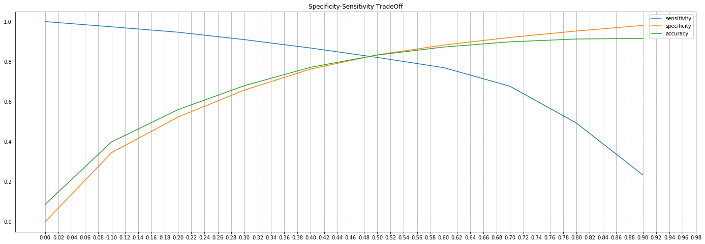
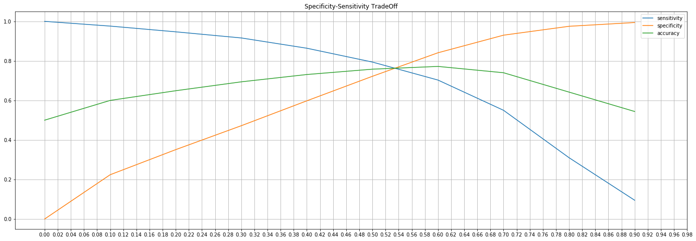
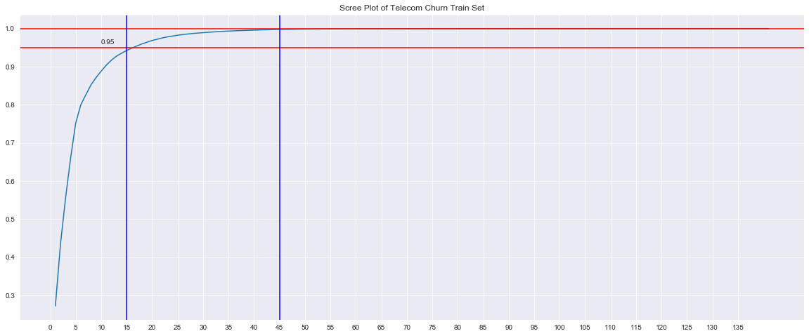
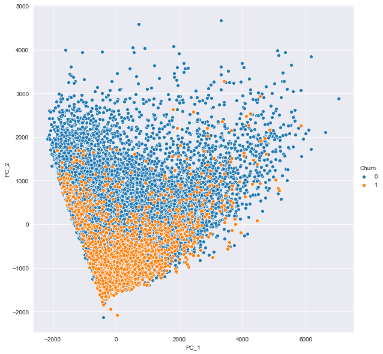

Photo by <a href="https://unsplash.com/@mikofilm?utm_source=unsplash&amp;utm_medium=referral&amp;utm_content=creditCopyText">Mike Kononov</a> on <a href="https://unsplash.com/s/photos/business?utm_source=unsplash&amp;utm_medium=referral&amp;utm_content=creditCopyText">Unsplash</a>

This analysis is the combined effort of <a href="https://www.kaggle.com/umaer369">Umaer</a> and me.


# Telecom Churn Case Study - Part 2

**This notebook contains**  
- Test Train Split 
- Class Imbalance
- Standardization
- Modelling 
    - Model 1 : Logistic Regression with RFE & Manual Elimination ( Interpretable Model ) 
    - Model 2 : PCA + Logistic Regression 
    - Model 3 : PCA + Random Forest Classifier
    - Model 4 : PCA + XGBoost     


**For the previous steps, refer to Part-1**


```python
import numpy as np
import pandas as pd
import matplotlib.pyplot as plt 
import seaborn as sns
# import tabulate 
import warnings 
pd.set_option('display.max_columns', None)
pd.set_option('display.max_rows', None)
warnings.filterwarnings('ignore')
```


```python
data = pd.read_csv('cleaned_churn_data.csv', index_col='mobile_number')
data.drop(columns=['Unnamed: 0'], inplace=True)
data.head()
```


<div>
<table border="1" class="dataframe" style="word-break:keep-all !important;">
  <thead>
    <tr style="text-align: right;">
      <th></th>
      <th>onnet_mou_6</th>
      <th>onnet_mou_7</th>
      <th>onnet_mou_8</th>
      <th>offnet_mou_6</th>
      <th>offnet_mou_7</th>
      <th>offnet_mou_8</th>
      <th>roam_ic_mou_6</th>
      <th>roam_ic_mou_7</th>
      <th>roam_ic_mou_8</th>
      <th>roam_og_mou_6</th>
      <th>roam_og_mou_7</th>
      <th>roam_og_mou_8</th>
      <th>loc_og_t2t_mou_6</th>
      <th>loc_og_t2t_mou_7</th>
      <th>loc_og_t2t_mou_8</th>
      <th>loc_og_t2m_mou_6</th>
      <th>loc_og_t2m_mou_7</th>
      <th>loc_og_t2m_mou_8</th>
      <th>loc_og_t2f_mou_6</th>
      <th>loc_og_t2f_mou_7</th>
      <th>loc_og_t2f_mou_8</th>
      <th>loc_og_t2c_mou_6</th>
      <th>loc_og_t2c_mou_7</th>
      <th>loc_og_t2c_mou_8</th>
      <th>loc_og_mou_6</th>
      <th>loc_og_mou_7</th>
      <th>loc_og_mou_8</th>
      <th>std_og_t2t_mou_6</th>
      <th>std_og_t2t_mou_7</th>
      <th>std_og_t2t_mou_8</th>
      <th>std_og_t2m_mou_6</th>
      <th>std_og_t2m_mou_7</th>
      <th>std_og_t2m_mou_8</th>
      <th>std_og_t2f_mou_6</th>
      <th>std_og_t2f_mou_7</th>
      <th>std_og_t2f_mou_8</th>
      <th>std_og_mou_6</th>
      <th>std_og_mou_7</th>
      <th>std_og_mou_8</th>
      <th>isd_og_mou_6</th>
      <th>isd_og_mou_7</th>
      <th>isd_og_mou_8</th>
      <th>spl_og_mou_6</th>
      <th>spl_og_mou_7</th>
      <th>spl_og_mou_8</th>
      <th>og_others_6</th>
      <th>og_others_7</th>
      <th>og_others_8</th>
      <th>loc_ic_t2t_mou_6</th>
      <th>loc_ic_t2t_mou_7</th>
      <th>loc_ic_t2t_mou_8</th>
      <th>loc_ic_t2m_mou_6</th>
      <th>loc_ic_t2m_mou_7</th>
      <th>loc_ic_t2m_mou_8</th>
      <th>loc_ic_t2f_mou_6</th>
      <th>loc_ic_t2f_mou_7</th>
      <th>loc_ic_t2f_mou_8</th>
      <th>loc_ic_mou_6</th>
      <th>loc_ic_mou_7</th>
      <th>loc_ic_mou_8</th>
      <th>std_ic_t2t_mou_6</th>
      <th>std_ic_t2t_mou_7</th>
      <th>std_ic_t2t_mou_8</th>
      <th>std_ic_t2m_mou_6</th>
      <th>std_ic_t2m_mou_7</th>
      <th>std_ic_t2m_mou_8</th>
      <th>std_ic_t2f_mou_6</th>
      <th>std_ic_t2f_mou_7</th>
      <th>std_ic_t2f_mou_8</th>
      <th>std_ic_mou_6</th>
      <th>std_ic_mou_7</th>
      <th>std_ic_mou_8</th>
      <th>spl_ic_mou_6</th>
      <th>spl_ic_mou_7</th>
      <th>spl_ic_mou_8</th>
      <th>isd_ic_mou_6</th>
      <th>isd_ic_mou_7</th>
      <th>isd_ic_mou_8</th>
      <th>ic_others_6</th>
      <th>ic_others_7</th>
      <th>ic_others_8</th>
      <th>total_rech_num_6</th>
      <th>total_rech_num_7</th>
      <th>total_rech_num_8</th>
      <th>max_rech_amt_6</th>
      <th>max_rech_amt_7</th>
      <th>max_rech_amt_8</th>
      <th>last_day_rch_amt_6</th>
      <th>last_day_rch_amt_7</th>
      <th>last_day_rch_amt_8</th>
      <th>aon</th>
      <th>Average_rech_amt_6n7</th>
      <th>Churn</th>
      <th>delta_vol_2g</th>
      <th>delta_vol_3g</th>
      <th>delta_total_og_mou</th>
      <th>delta_total_ic_mou</th>
      <th>delta_vbc_3g</th>
      <th>delta_arpu</th>
      <th>delta_total_rech_amt</th>
      <th>sachet_3g_6_0</th>
      <th>sachet_3g_6_1</th>
      <th>sachet_3g_6_2</th>
      <th>monthly_2g_7_0</th>
      <th>monthly_2g_7_1</th>
      <th>monthly_2g_7_2</th>
      <th>monthly_2g_8_0</th>
      <th>monthly_2g_8_1</th>
      <th>sachet_3g_8_0</th>
      <th>sachet_3g_8_1</th>
      <th>monthly_3g_7_0</th>
      <th>monthly_3g_7_1</th>
      <th>monthly_3g_7_2</th>
      <th>sachet_2g_6_0</th>
      <th>sachet_2g_6_1</th>
      <th>sachet_2g_6_2</th>
      <th>sachet_2g_6_3</th>
      <th>sachet_2g_6_4</th>
      <th>monthly_2g_6_0</th>
      <th>monthly_2g_6_1</th>
      <th>monthly_2g_6_2</th>
      <th>sachet_2g_7_0</th>
      <th>sachet_2g_7_1</th>
      <th>sachet_2g_7_2</th>
      <th>sachet_2g_7_3</th>
      <th>sachet_2g_7_4</th>
      <th>sachet_2g_7_5</th>
      <th>sachet_3g_7_0</th>
      <th>sachet_3g_7_1</th>
      <th>sachet_3g_7_2</th>
      <th>monthly_3g_8_0</th>
      <th>monthly_3g_8_1</th>
      <th>monthly_3g_8_2</th>
      <th>monthly_3g_6_0</th>
      <th>monthly_3g_6_1</th>
      <th>monthly_3g_6_2</th>
      <th>sachet_2g_8_0</th>
      <th>sachet_2g_8_1</th>
      <th>sachet_2g_8_2</th>
      <th>sachet_2g_8_3</th>
      <th>sachet_2g_8_4</th>
      <th>sachet_2g_8_5</th>
    </tr>
    <tr>
      <th>mobile_number</th>
      <th></th>
      <th></th>
      <th></th>
      <th></th>
      <th></th>
      <th></th>
      <th></th>
      <th></th>
      <th></th>
      <th></th>
      <th></th>
      <th></th>
      <th></th>
      <th></th>
      <th></th>
      <th></th>
      <th></th>
      <th></th>
      <th></th>
      <th></th>
      <th></th>
      <th></th>
      <th></th>
      <th></th>
      <th></th>
      <th></th>
      <th></th>
      <th></th>
      <th></th>
      <th></th>
      <th></th>
      <th></th>
      <th></th>
      <th></th>
      <th></th>
      <th></th>
      <th></th>
      <th></th>
      <th></th>
      <th></th>
      <th></th>
      <th></th>
      <th></th>
      <th></th>
      <th></th>
      <th></th>
      <th></th>
      <th></th>
      <th></th>
      <th></th>
      <th></th>
      <th></th>
      <th></th>
      <th></th>
      <th></th>
      <th></th>
      <th></th>
      <th></th>
      <th></th>
      <th></th>
      <th></th>
      <th></th>
      <th></th>
      <th></th>
      <th></th>
      <th></th>
      <th></th>
      <th></th>
      <th></th>
      <th></th>
      <th></th>
      <th></th>
      <th></th>
      <th></th>
      <th></th>
      <th></th>
      <th></th>
      <th></th>
      <th></th>
      <th></th>
      <th></th>
      <th></th>
      <th></th>
      <th></th>
      <th></th>
      <th></th>
      <th></th>
      <th></th>
      <th></th>
      <th></th>
      <th></th>
      <th></th>
      <th></th>
      <th></th>
      <th></th>
      <th></th>
      <th></th>
      <th></th>
      <th></th>
      <th></th>
      <th></th>
      <th></th>
      <th></th>
      <th></th>
      <th></th>
      <th></th>
      <th></th>
      <th></th>
      <th></th>
      <th></th>
      <th></th>
      <th></th>
      <th></th>
      <th></th>
      <th></th>
      <th></th>
      <th></th>
      <th></th>
      <th></th>
      <th></th>
      <th></th>
      <th></th>
      <th></th>
      <th></th>
      <th></th>
      <th></th>
      <th></th>
      <th></th>
      <th></th>
      <th></th>
      <th></th>
      <th></th>
      <th></th>
      <th></th>
      <th></th>
      <th></th>
      <th></th>
      <th></th>
      <th></th>
      <th></th>
      <th></th>
      <th></th>
    </tr>
  </thead>
  <tbody>
    <tr>
      <th>7000701601</th>
      <td>57.84</td>
      <td>54.68</td>
      <td>52.29</td>
      <td>453.43</td>
      <td>567.16</td>
      <td>325.91</td>
      <td>16.23</td>
      <td>33.49</td>
      <td>31.64</td>
      <td>23.74</td>
      <td>12.59</td>
      <td>38.06</td>
      <td>51.39</td>
      <td>31.38</td>
      <td>40.28</td>
      <td>308.63</td>
      <td>447.38</td>
      <td>162.28</td>
      <td>62.13</td>
      <td>55.14</td>
      <td>53.23</td>
      <td>0.0</td>
      <td>0.0</td>
      <td>0.00</td>
      <td>422.16</td>
      <td>533.91</td>
      <td>255.79</td>
      <td>4.30</td>
      <td>23.29</td>
      <td>12.01</td>
      <td>49.89</td>
      <td>31.76</td>
      <td>49.14</td>
      <td>6.66</td>
      <td>20.08</td>
      <td>16.68</td>
      <td>60.86</td>
      <td>75.14</td>
      <td>77.84</td>
      <td>0.0</td>
      <td>0.18</td>
      <td>10.01</td>
      <td>4.50</td>
      <td>0.00</td>
      <td>6.50</td>
      <td>0.00</td>
      <td>0.0</td>
      <td>0.0</td>
      <td>58.14</td>
      <td>32.26</td>
      <td>27.31</td>
      <td>217.56</td>
      <td>221.49</td>
      <td>121.19</td>
      <td>152.16</td>
      <td>101.46</td>
      <td>39.53</td>
      <td>427.88</td>
      <td>355.23</td>
      <td>188.04</td>
      <td>36.89</td>
      <td>11.83</td>
      <td>30.39</td>
      <td>91.44</td>
      <td>126.99</td>
      <td>141.33</td>
      <td>52.19</td>
      <td>34.24</td>
      <td>22.21</td>
      <td>180.54</td>
      <td>173.08</td>
      <td>193.94</td>
      <td>0.21</td>
      <td>0.0</td>
      <td>0.0</td>
      <td>2.06</td>
      <td>14.53</td>
      <td>31.590</td>
      <td>15.740</td>
      <td>15.19</td>
      <td>15.14</td>
      <td>5.0</td>
      <td>5.0</td>
      <td>7.0</td>
      <td>1000.0</td>
      <td>790.0</td>
      <td>951.0</td>
      <td>0.0</td>
      <td>0.0</td>
      <td>619.0</td>
      <td>802</td>
      <td>1185.0</td>
      <td>1</td>
      <td>0.00</td>
      <td>0.000</td>
      <td>-198.225</td>
      <td>-163.510</td>
      <td>38.680</td>
      <td>864.34085</td>
      <td>1036.4</td>
      <td>1</td>
      <td>0</td>
      <td>0</td>
      <td>1</td>
      <td>0</td>
      <td>0</td>
      <td>1</td>
      <td>0</td>
      <td>1</td>
      <td>0</td>
      <td>1</td>
      <td>0</td>
      <td>0</td>
      <td>1</td>
      <td>0</td>
      <td>0</td>
      <td>0</td>
      <td>0</td>
      <td>1</td>
      <td>0</td>
      <td>0</td>
      <td>1</td>
      <td>0</td>
      <td>0</td>
      <td>0</td>
      <td>0</td>
      <td>0</td>
      <td>1</td>
      <td>0</td>
      <td>0</td>
      <td>1</td>
      <td>0</td>
      <td>0</td>
      <td>1</td>
      <td>0</td>
      <td>0</td>
      <td>1</td>
      <td>0</td>
      <td>0</td>
      <td>0</td>
      <td>0</td>
      <td>0</td>
    </tr>
    <tr>
      <th>7001524846</th>
      <td>413.69</td>
      <td>351.03</td>
      <td>35.08</td>
      <td>94.66</td>
      <td>80.63</td>
      <td>136.48</td>
      <td>0.00</td>
      <td>0.00</td>
      <td>0.00</td>
      <td>0.00</td>
      <td>0.00</td>
      <td>0.00</td>
      <td>297.13</td>
      <td>217.59</td>
      <td>12.49</td>
      <td>80.96</td>
      <td>70.58</td>
      <td>50.54</td>
      <td>0.00</td>
      <td>0.00</td>
      <td>0.00</td>
      <td>0.0</td>
      <td>0.0</td>
      <td>7.15</td>
      <td>378.09</td>
      <td>288.18</td>
      <td>63.04</td>
      <td>116.56</td>
      <td>133.43</td>
      <td>22.58</td>
      <td>13.69</td>
      <td>10.04</td>
      <td>75.69</td>
      <td>0.00</td>
      <td>0.00</td>
      <td>0.00</td>
      <td>130.26</td>
      <td>143.48</td>
      <td>98.28</td>
      <td>0.0</td>
      <td>0.00</td>
      <td>0.00</td>
      <td>0.00</td>
      <td>0.00</td>
      <td>10.23</td>
      <td>0.00</td>
      <td>0.0</td>
      <td>0.0</td>
      <td>23.84</td>
      <td>9.84</td>
      <td>0.31</td>
      <td>57.58</td>
      <td>13.98</td>
      <td>15.48</td>
      <td>0.00</td>
      <td>0.00</td>
      <td>0.00</td>
      <td>81.43</td>
      <td>23.83</td>
      <td>15.79</td>
      <td>0.00</td>
      <td>0.58</td>
      <td>0.10</td>
      <td>22.43</td>
      <td>4.08</td>
      <td>0.65</td>
      <td>0.00</td>
      <td>0.00</td>
      <td>0.00</td>
      <td>22.43</td>
      <td>4.66</td>
      <td>0.75</td>
      <td>0.00</td>
      <td>0.0</td>
      <td>0.0</td>
      <td>0.00</td>
      <td>0.00</td>
      <td>0.000</td>
      <td>0.000</td>
      <td>0.00</td>
      <td>0.00</td>
      <td>19.0</td>
      <td>21.0</td>
      <td>14.0</td>
      <td>90.0</td>
      <td>154.0</td>
      <td>30.0</td>
      <td>50.0</td>
      <td>0.0</td>
      <td>10.0</td>
      <td>315</td>
      <td>519.0</td>
      <td>0</td>
      <td>-177.97</td>
      <td>-363.535</td>
      <td>-298.450</td>
      <td>-49.635</td>
      <td>-495.375</td>
      <td>-298.11000</td>
      <td>-399.0</td>
      <td>1</td>
      <td>0</td>
      <td>0</td>
      <td>0</td>
      <td>1</td>
      <td>0</td>
      <td>1</td>
      <td>0</td>
      <td>1</td>
      <td>0</td>
      <td>1</td>
      <td>0</td>
      <td>0</td>
      <td>1</td>
      <td>0</td>
      <td>0</td>
      <td>0</td>
      <td>0</td>
      <td>1</td>
      <td>0</td>
      <td>0</td>
      <td>0</td>
      <td>1</td>
      <td>0</td>
      <td>0</td>
      <td>0</td>
      <td>0</td>
      <td>1</td>
      <td>0</td>
      <td>0</td>
      <td>1</td>
      <td>0</td>
      <td>0</td>
      <td>1</td>
      <td>0</td>
      <td>0</td>
      <td>0</td>
      <td>0</td>
      <td>0</td>
      <td>1</td>
      <td>0</td>
      <td>0</td>
    </tr>
    <tr>
      <th>7002191713</th>
      <td>501.76</td>
      <td>108.39</td>
      <td>534.24</td>
      <td>413.31</td>
      <td>119.28</td>
      <td>482.46</td>
      <td>23.53</td>
      <td>144.24</td>
      <td>72.11</td>
      <td>7.98</td>
      <td>35.26</td>
      <td>1.44</td>
      <td>49.63</td>
      <td>6.19</td>
      <td>36.01</td>
      <td>151.13</td>
      <td>47.28</td>
      <td>294.46</td>
      <td>4.54</td>
      <td>0.00</td>
      <td>23.51</td>
      <td>0.0</td>
      <td>0.0</td>
      <td>0.49</td>
      <td>205.31</td>
      <td>53.48</td>
      <td>353.99</td>
      <td>446.41</td>
      <td>85.98</td>
      <td>498.23</td>
      <td>255.36</td>
      <td>52.94</td>
      <td>156.94</td>
      <td>0.00</td>
      <td>0.00</td>
      <td>0.00</td>
      <td>701.78</td>
      <td>138.93</td>
      <td>655.18</td>
      <td>0.0</td>
      <td>0.00</td>
      <td>1.29</td>
      <td>0.00</td>
      <td>0.00</td>
      <td>4.78</td>
      <td>0.00</td>
      <td>0.0</td>
      <td>0.0</td>
      <td>67.88</td>
      <td>7.58</td>
      <td>52.58</td>
      <td>142.88</td>
      <td>18.53</td>
      <td>195.18</td>
      <td>4.81</td>
      <td>0.00</td>
      <td>7.49</td>
      <td>215.58</td>
      <td>26.11</td>
      <td>255.26</td>
      <td>115.68</td>
      <td>38.29</td>
      <td>154.58</td>
      <td>308.13</td>
      <td>29.79</td>
      <td>317.91</td>
      <td>0.00</td>
      <td>0.00</td>
      <td>1.91</td>
      <td>423.81</td>
      <td>68.09</td>
      <td>474.41</td>
      <td>0.45</td>
      <td>0.0</td>
      <td>0.0</td>
      <td>239.60</td>
      <td>62.11</td>
      <td>249.888</td>
      <td>20.708</td>
      <td>16.24</td>
      <td>21.44</td>
      <td>6.0</td>
      <td>4.0</td>
      <td>11.0</td>
      <td>110.0</td>
      <td>110.0</td>
      <td>130.0</td>
      <td>110.0</td>
      <td>50.0</td>
      <td>0.0</td>
      <td>2607</td>
      <td>380.0</td>
      <td>0</td>
      <td>0.02</td>
      <td>0.000</td>
      <td>465.510</td>
      <td>573.935</td>
      <td>0.000</td>
      <td>244.00150</td>
      <td>337.0</td>
      <td>1</td>
      <td>0</td>
      <td>0</td>
      <td>1</td>
      <td>0</td>
      <td>0</td>
      <td>1</td>
      <td>0</td>
      <td>1</td>
      <td>0</td>
      <td>1</td>
      <td>0</td>
      <td>0</td>
      <td>1</td>
      <td>0</td>
      <td>0</td>
      <td>0</td>
      <td>0</td>
      <td>1</td>
      <td>0</td>
      <td>0</td>
      <td>1</td>
      <td>0</td>
      <td>0</td>
      <td>0</td>
      <td>0</td>
      <td>0</td>
      <td>1</td>
      <td>0</td>
      <td>0</td>
      <td>1</td>
      <td>0</td>
      <td>0</td>
      <td>1</td>
      <td>0</td>
      <td>0</td>
      <td>0</td>
      <td>0</td>
      <td>0</td>
      <td>1</td>
      <td>0</td>
      <td>0</td>
    </tr>
    <tr>
      <th>7000875565</th>
      <td>50.51</td>
      <td>74.01</td>
      <td>70.61</td>
      <td>296.29</td>
      <td>229.74</td>
      <td>162.76</td>
      <td>0.00</td>
      <td>2.83</td>
      <td>0.00</td>
      <td>0.00</td>
      <td>17.74</td>
      <td>0.00</td>
      <td>42.61</td>
      <td>65.16</td>
      <td>67.38</td>
      <td>273.29</td>
      <td>145.99</td>
      <td>128.28</td>
      <td>0.00</td>
      <td>4.48</td>
      <td>10.26</td>
      <td>0.0</td>
      <td>0.0</td>
      <td>0.00</td>
      <td>315.91</td>
      <td>215.64</td>
      <td>205.93</td>
      <td>7.89</td>
      <td>2.58</td>
      <td>3.23</td>
      <td>22.99</td>
      <td>64.51</td>
      <td>18.29</td>
      <td>0.00</td>
      <td>0.00</td>
      <td>0.00</td>
      <td>30.89</td>
      <td>67.09</td>
      <td>21.53</td>
      <td>0.0</td>
      <td>0.00</td>
      <td>0.00</td>
      <td>0.00</td>
      <td>3.26</td>
      <td>5.91</td>
      <td>0.00</td>
      <td>0.0</td>
      <td>0.0</td>
      <td>41.33</td>
      <td>71.44</td>
      <td>28.89</td>
      <td>226.81</td>
      <td>149.69</td>
      <td>150.16</td>
      <td>8.71</td>
      <td>8.68</td>
      <td>32.71</td>
      <td>276.86</td>
      <td>229.83</td>
      <td>211.78</td>
      <td>68.79</td>
      <td>78.64</td>
      <td>6.33</td>
      <td>18.68</td>
      <td>73.08</td>
      <td>73.93</td>
      <td>0.51</td>
      <td>0.00</td>
      <td>2.18</td>
      <td>87.99</td>
      <td>151.73</td>
      <td>82.44</td>
      <td>0.00</td>
      <td>0.0</td>
      <td>0.0</td>
      <td>0.00</td>
      <td>0.00</td>
      <td>0.230</td>
      <td>0.000</td>
      <td>0.00</td>
      <td>0.00</td>
      <td>10.0</td>
      <td>6.0</td>
      <td>2.0</td>
      <td>110.0</td>
      <td>110.0</td>
      <td>130.0</td>
      <td>100.0</td>
      <td>100.0</td>
      <td>130.0</td>
      <td>511</td>
      <td>459.0</td>
      <td>0</td>
      <td>0.00</td>
      <td>0.000</td>
      <td>-83.030</td>
      <td>-78.750</td>
      <td>-12.170</td>
      <td>-177.52800</td>
      <td>-299.0</td>
      <td>1</td>
      <td>0</td>
      <td>0</td>
      <td>1</td>
      <td>0</td>
      <td>0</td>
      <td>1</td>
      <td>0</td>
      <td>1</td>
      <td>0</td>
      <td>1</td>
      <td>0</td>
      <td>0</td>
      <td>1</td>
      <td>0</td>
      <td>0</td>
      <td>0</td>
      <td>0</td>
      <td>1</td>
      <td>0</td>
      <td>0</td>
      <td>1</td>
      <td>0</td>
      <td>0</td>
      <td>0</td>
      <td>0</td>
      <td>0</td>
      <td>1</td>
      <td>0</td>
      <td>0</td>
      <td>1</td>
      <td>0</td>
      <td>0</td>
      <td>1</td>
      <td>0</td>
      <td>0</td>
      <td>1</td>
      <td>0</td>
      <td>0</td>
      <td>0</td>
      <td>0</td>
      <td>0</td>
    </tr>
    <tr>
      <th>7000187447</th>
      <td>1185.91</td>
      <td>9.28</td>
      <td>7.79</td>
      <td>61.64</td>
      <td>0.00</td>
      <td>5.54</td>
      <td>0.00</td>
      <td>4.76</td>
      <td>4.81</td>
      <td>0.00</td>
      <td>8.46</td>
      <td>13.34</td>
      <td>38.99</td>
      <td>0.00</td>
      <td>0.00</td>
      <td>58.54</td>
      <td>0.00</td>
      <td>0.00</td>
      <td>0.00</td>
      <td>0.00</td>
      <td>0.00</td>
      <td>0.0</td>
      <td>0.0</td>
      <td>0.00</td>
      <td>97.54</td>
      <td>0.00</td>
      <td>0.00</td>
      <td>1146.91</td>
      <td>0.81</td>
      <td>0.00</td>
      <td>1.55</td>
      <td>0.00</td>
      <td>0.00</td>
      <td>0.00</td>
      <td>0.00</td>
      <td>0.00</td>
      <td>1148.46</td>
      <td>0.81</td>
      <td>0.00</td>
      <td>0.0</td>
      <td>0.00</td>
      <td>0.00</td>
      <td>2.58</td>
      <td>0.00</td>
      <td>0.00</td>
      <td>0.93</td>
      <td>0.0</td>
      <td>0.0</td>
      <td>34.54</td>
      <td>0.00</td>
      <td>0.00</td>
      <td>47.41</td>
      <td>2.31</td>
      <td>0.00</td>
      <td>0.00</td>
      <td>0.00</td>
      <td>0.00</td>
      <td>81.96</td>
      <td>2.31</td>
      <td>0.00</td>
      <td>8.63</td>
      <td>0.00</td>
      <td>0.00</td>
      <td>1.28</td>
      <td>0.00</td>
      <td>0.00</td>
      <td>0.00</td>
      <td>0.00</td>
      <td>0.00</td>
      <td>9.91</td>
      <td>0.00</td>
      <td>0.00</td>
      <td>0.00</td>
      <td>0.0</td>
      <td>0.0</td>
      <td>0.00</td>
      <td>0.00</td>
      <td>0.000</td>
      <td>0.000</td>
      <td>0.00</td>
      <td>0.00</td>
      <td>19.0</td>
      <td>2.0</td>
      <td>4.0</td>
      <td>110.0</td>
      <td>0.0</td>
      <td>30.0</td>
      <td>30.0</td>
      <td>0.0</td>
      <td>0.0</td>
      <td>667</td>
      <td>408.0</td>
      <td>0</td>
      <td>0.00</td>
      <td>0.000</td>
      <td>-625.170</td>
      <td>-47.095</td>
      <td>0.000</td>
      <td>-328.99500</td>
      <td>-378.0</td>
      <td>1</td>
      <td>0</td>
      <td>0</td>
      <td>1</td>
      <td>0</td>
      <td>0</td>
      <td>1</td>
      <td>0</td>
      <td>1</td>
      <td>0</td>
      <td>1</td>
      <td>0</td>
      <td>0</td>
      <td>1</td>
      <td>0</td>
      <td>0</td>
      <td>0</td>
      <td>0</td>
      <td>1</td>
      <td>0</td>
      <td>0</td>
      <td>1</td>
      <td>0</td>
      <td>0</td>
      <td>0</td>
      <td>0</td>
      <td>0</td>
      <td>1</td>
      <td>0</td>
      <td>0</td>
      <td>1</td>
      <td>0</td>
      <td>0</td>
      <td>1</td>
      <td>0</td>
      <td>0</td>
      <td>1</td>
      <td>0</td>
      <td>0</td>
      <td>0</td>
      <td>0</td>
      <td>0</td>
    </tr>
  </tbody>
</table>
</div>


### Train-Test Split


```python
y = data.pop('Churn') # Predicted / Target Variable
X = data # Predictor variables
```


```python
from sklearn.model_selection import train_test_split
X_train, X_test, y_train, y_test = train_test_split(X,y, train_size=0.7, random_state=42)
```

### Class Imbalance


```python
y.value_counts(normalize=True).to_frame()
```


<div>

<table border="1" class="dataframe" style="word-break:keep-all !important;">
  <thead>
    <tr style="text-align: right;">
      <th></th>
      <th>Churn</th>
    </tr>
  </thead>
  <tbody>
    <tr>
      <th>0</th>
      <td>0.913598</td>
    </tr>
    <tr>
      <th>1</th>
      <td>0.086402</td>
    </tr>
  </tbody>
</table>
</div>


```python
# Ratio of classes 
class_0 = y[y == 0].count()
class_1 = y[y == 1].count()

print(f'Class Imbalance Ratio : {round(class_1/class_0,3)}')
```

    Class Imbalance Ratio : 0.095


- To account for class imbalance, Synthetic Minority Class Oversampling Technique (SMOTE) could be used.

### Using SMOTE 


```python
#!pip install imblearn
from imblearn.over_sampling import SMOTE
smt = SMOTE(random_state=42, k_neighbors=5)

# Resampling Train set to account for class imbalance

X_train_resampled, y_train_resampled= smt.fit_resample(X_train, y_train)
X_train_resampled.head()
```


<div>

<table border="1" class="dataframe" style="word-break:keep-all !important;">
  <thead>
    <tr style="text-align: right;">
      <th></th>
      <th>onnet_mou_6</th>
      <th>onnet_mou_7</th>
      <th>onnet_mou_8</th>
      <th>offnet_mou_6</th>
      <th>offnet_mou_7</th>
      <th>offnet_mou_8</th>
      <th>roam_ic_mou_6</th>
      <th>roam_ic_mou_7</th>
      <th>roam_ic_mou_8</th>
      <th>roam_og_mou_6</th>
      <th>roam_og_mou_7</th>
      <th>roam_og_mou_8</th>
      <th>loc_og_t2t_mou_6</th>
      <th>loc_og_t2t_mou_7</th>
      <th>loc_og_t2t_mou_8</th>
      <th>loc_og_t2m_mou_6</th>
      <th>loc_og_t2m_mou_7</th>
      <th>loc_og_t2m_mou_8</th>
      <th>loc_og_t2f_mou_6</th>
      <th>loc_og_t2f_mou_7</th>
      <th>loc_og_t2f_mou_8</th>
      <th>loc_og_t2c_mou_6</th>
      <th>loc_og_t2c_mou_7</th>
      <th>loc_og_t2c_mou_8</th>
      <th>loc_og_mou_6</th>
      <th>loc_og_mou_7</th>
      <th>loc_og_mou_8</th>
      <th>std_og_t2t_mou_6</th>
      <th>std_og_t2t_mou_7</th>
      <th>std_og_t2t_mou_8</th>
      <th>std_og_t2m_mou_6</th>
      <th>std_og_t2m_mou_7</th>
      <th>std_og_t2m_mou_8</th>
      <th>std_og_t2f_mou_6</th>
      <th>std_og_t2f_mou_7</th>
      <th>std_og_t2f_mou_8</th>
      <th>std_og_mou_6</th>
      <th>std_og_mou_7</th>
      <th>std_og_mou_8</th>
      <th>isd_og_mou_6</th>
      <th>isd_og_mou_7</th>
      <th>isd_og_mou_8</th>
      <th>spl_og_mou_6</th>
      <th>spl_og_mou_7</th>
      <th>spl_og_mou_8</th>
      <th>og_others_6</th>
      <th>og_others_7</th>
      <th>og_others_8</th>
      <th>loc_ic_t2t_mou_6</th>
      <th>loc_ic_t2t_mou_7</th>
      <th>loc_ic_t2t_mou_8</th>
      <th>loc_ic_t2m_mou_6</th>
      <th>loc_ic_t2m_mou_7</th>
      <th>loc_ic_t2m_mou_8</th>
      <th>loc_ic_t2f_mou_6</th>
      <th>loc_ic_t2f_mou_7</th>
      <th>loc_ic_t2f_mou_8</th>
      <th>loc_ic_mou_6</th>
      <th>loc_ic_mou_7</th>
      <th>loc_ic_mou_8</th>
      <th>std_ic_t2t_mou_6</th>
      <th>std_ic_t2t_mou_7</th>
      <th>std_ic_t2t_mou_8</th>
      <th>std_ic_t2m_mou_6</th>
      <th>std_ic_t2m_mou_7</th>
      <th>std_ic_t2m_mou_8</th>
      <th>std_ic_t2f_mou_6</th>
      <th>std_ic_t2f_mou_7</th>
      <th>std_ic_t2f_mou_8</th>
      <th>std_ic_mou_6</th>
      <th>std_ic_mou_7</th>
      <th>std_ic_mou_8</th>
      <th>spl_ic_mou_6</th>
      <th>spl_ic_mou_7</th>
      <th>spl_ic_mou_8</th>
      <th>isd_ic_mou_6</th>
      <th>isd_ic_mou_7</th>
      <th>isd_ic_mou_8</th>
      <th>ic_others_6</th>
      <th>ic_others_7</th>
      <th>ic_others_8</th>
      <th>total_rech_num_6</th>
      <th>total_rech_num_7</th>
      <th>total_rech_num_8</th>
      <th>max_rech_amt_6</th>
      <th>max_rech_amt_7</th>
      <th>max_rech_amt_8</th>
      <th>last_day_rch_amt_6</th>
      <th>last_day_rch_amt_7</th>
      <th>last_day_rch_amt_8</th>
      <th>aon</th>
      <th>Average_rech_amt_6n7</th>
      <th>delta_vol_2g</th>
      <th>delta_vol_3g</th>
      <th>delta_total_og_mou</th>
      <th>delta_total_ic_mou</th>
      <th>delta_vbc_3g</th>
      <th>delta_arpu</th>
      <th>delta_total_rech_amt</th>
      <th>sachet_3g_6_0</th>
      <th>sachet_3g_6_1</th>
      <th>sachet_3g_6_2</th>
      <th>monthly_2g_7_0</th>
      <th>monthly_2g_7_1</th>
      <th>monthly_2g_7_2</th>
      <th>monthly_2g_8_0</th>
      <th>monthly_2g_8_1</th>
      <th>sachet_3g_8_0</th>
      <th>sachet_3g_8_1</th>
      <th>monthly_3g_7_0</th>
      <th>monthly_3g_7_1</th>
      <th>monthly_3g_7_2</th>
      <th>sachet_2g_6_0</th>
      <th>sachet_2g_6_1</th>
      <th>sachet_2g_6_2</th>
      <th>sachet_2g_6_3</th>
      <th>sachet_2g_6_4</th>
      <th>monthly_2g_6_0</th>
      <th>monthly_2g_6_1</th>
      <th>monthly_2g_6_2</th>
      <th>sachet_2g_7_0</th>
      <th>sachet_2g_7_1</th>
      <th>sachet_2g_7_2</th>
      <th>sachet_2g_7_3</th>
      <th>sachet_2g_7_4</th>
      <th>sachet_2g_7_5</th>
      <th>sachet_3g_7_0</th>
      <th>sachet_3g_7_1</th>
      <th>sachet_3g_7_2</th>
      <th>monthly_3g_8_0</th>
      <th>monthly_3g_8_1</th>
      <th>monthly_3g_8_2</th>
      <th>monthly_3g_6_0</th>
      <th>monthly_3g_6_1</th>
      <th>monthly_3g_6_2</th>
      <th>sachet_2g_8_0</th>
      <th>sachet_2g_8_1</th>
      <th>sachet_2g_8_2</th>
      <th>sachet_2g_8_3</th>
      <th>sachet_2g_8_4</th>
      <th>sachet_2g_8_5</th>
    </tr>
  </thead>
  <tbody>
    <tr>
      <th>0</th>
      <td>53.01</td>
      <td>52.64</td>
      <td>37.48</td>
      <td>316.01</td>
      <td>195.74</td>
      <td>68.36</td>
      <td>0.0</td>
      <td>0.0</td>
      <td>0.0</td>
      <td>0.0</td>
      <td>0.0</td>
      <td>0.0</td>
      <td>53.01</td>
      <td>52.64</td>
      <td>37.48</td>
      <td>282.38</td>
      <td>171.64</td>
      <td>44.51</td>
      <td>31.59</td>
      <td>17.38</td>
      <td>19.43</td>
      <td>0.0</td>
      <td>0.0</td>
      <td>0.00</td>
      <td>366.99</td>
      <td>241.68</td>
      <td>101.43</td>
      <td>0.00</td>
      <td>0.00</td>
      <td>0.00</td>
      <td>0.00</td>
      <td>2.11</td>
      <td>0.00</td>
      <td>2.03</td>
      <td>4.59</td>
      <td>4.41</td>
      <td>2.03</td>
      <td>6.71</td>
      <td>4.41</td>
      <td>0.00</td>
      <td>0.0</td>
      <td>0.00</td>
      <td>0.0</td>
      <td>0.0</td>
      <td>0.00</td>
      <td>0.0</td>
      <td>0.0</td>
      <td>0.0</td>
      <td>18.41</td>
      <td>40.79</td>
      <td>11.79</td>
      <td>292.99</td>
      <td>191.98</td>
      <td>85.89</td>
      <td>6.26</td>
      <td>1.21</td>
      <td>10.39</td>
      <td>317.68</td>
      <td>233.99</td>
      <td>108.09</td>
      <td>0.00</td>
      <td>0.00</td>
      <td>0.00</td>
      <td>0.66</td>
      <td>0.00</td>
      <td>0.00</td>
      <td>5.61</td>
      <td>1.53</td>
      <td>2.76</td>
      <td>6.28</td>
      <td>1.53</td>
      <td>2.76</td>
      <td>0.00</td>
      <td>0.0</td>
      <td>0.00</td>
      <td>0.00</td>
      <td>0.00</td>
      <td>9.55</td>
      <td>0.00</td>
      <td>0.00</td>
      <td>0.00</td>
      <td>6.0</td>
      <td>5.0</td>
      <td>4.0</td>
      <td>198.0</td>
      <td>198.0</td>
      <td>198.0</td>
      <td>110.0</td>
      <td>130.0</td>
      <td>130.0</td>
      <td>1423</td>
      <td>483.0</td>
      <td>-791.7700</td>
      <td>1077.750</td>
      <td>-202.870</td>
      <td>-159.335</td>
      <td>71.085</td>
      <td>-172.4995</td>
      <td>-155.0</td>
      <td>1</td>
      <td>0</td>
      <td>0</td>
      <td>0</td>
      <td>1</td>
      <td>0</td>
      <td>0</td>
      <td>1</td>
      <td>1</td>
      <td>0</td>
      <td>1</td>
      <td>0</td>
      <td>0</td>
      <td>1</td>
      <td>0</td>
      <td>0</td>
      <td>0</td>
      <td>0</td>
      <td>0</td>
      <td>1</td>
      <td>0</td>
      <td>1</td>
      <td>0</td>
      <td>0</td>
      <td>0</td>
      <td>0</td>
      <td>0</td>
      <td>1</td>
      <td>0</td>
      <td>0</td>
      <td>1</td>
      <td>0</td>
      <td>0</td>
      <td>1</td>
      <td>0</td>
      <td>0</td>
      <td>1</td>
      <td>0</td>
      <td>0</td>
      <td>0</td>
      <td>0</td>
      <td>0</td>
    </tr>
    <tr>
      <th>1</th>
      <td>91.39</td>
      <td>216.14</td>
      <td>150.58</td>
      <td>504.19</td>
      <td>301.98</td>
      <td>434.41</td>
      <td>0.0</td>
      <td>0.0</td>
      <td>0.0</td>
      <td>0.0</td>
      <td>0.0</td>
      <td>0.0</td>
      <td>40.36</td>
      <td>36.21</td>
      <td>27.73</td>
      <td>37.26</td>
      <td>36.73</td>
      <td>59.61</td>
      <td>0.00</td>
      <td>0.00</td>
      <td>0.00</td>
      <td>0.0</td>
      <td>0.0</td>
      <td>0.58</td>
      <td>77.63</td>
      <td>72.94</td>
      <td>87.34</td>
      <td>51.03</td>
      <td>179.93</td>
      <td>122.84</td>
      <td>465.96</td>
      <td>265.24</td>
      <td>356.44</td>
      <td>0.00</td>
      <td>0.00</td>
      <td>0.00</td>
      <td>516.99</td>
      <td>445.18</td>
      <td>479.29</td>
      <td>0.96</td>
      <td>0.0</td>
      <td>3.89</td>
      <td>0.0</td>
      <td>0.0</td>
      <td>14.45</td>
      <td>0.0</td>
      <td>0.0</td>
      <td>0.0</td>
      <td>104.39</td>
      <td>31.98</td>
      <td>35.83</td>
      <td>154.11</td>
      <td>147.88</td>
      <td>243.53</td>
      <td>0.00</td>
      <td>0.76</td>
      <td>0.00</td>
      <td>258.51</td>
      <td>180.63</td>
      <td>279.36</td>
      <td>4.03</td>
      <td>2.99</td>
      <td>0.46</td>
      <td>6.36</td>
      <td>12.31</td>
      <td>3.91</td>
      <td>0.00</td>
      <td>0.00</td>
      <td>0.00</td>
      <td>10.39</td>
      <td>15.31</td>
      <td>4.38</td>
      <td>0.58</td>
      <td>0.0</td>
      <td>0.25</td>
      <td>19.66</td>
      <td>21.96</td>
      <td>86.63</td>
      <td>0.23</td>
      <td>0.56</td>
      <td>1.04</td>
      <td>8.0</td>
      <td>11.0</td>
      <td>12.0</td>
      <td>110.0</td>
      <td>130.0</td>
      <td>130.0</td>
      <td>0.0</td>
      <td>130.0</td>
      <td>0.0</td>
      <td>189</td>
      <td>454.0</td>
      <td>0.0000</td>
      <td>0.000</td>
      <td>28.130</td>
      <td>117.745</td>
      <td>0.000</td>
      <td>48.6160</td>
      <td>-94.0</td>
      <td>1</td>
      <td>0</td>
      <td>0</td>
      <td>1</td>
      <td>0</td>
      <td>0</td>
      <td>1</td>
      <td>0</td>
      <td>1</td>
      <td>0</td>
      <td>1</td>
      <td>0</td>
      <td>0</td>
      <td>1</td>
      <td>0</td>
      <td>0</td>
      <td>0</td>
      <td>0</td>
      <td>1</td>
      <td>0</td>
      <td>0</td>
      <td>1</td>
      <td>0</td>
      <td>0</td>
      <td>0</td>
      <td>0</td>
      <td>0</td>
      <td>1</td>
      <td>0</td>
      <td>0</td>
      <td>1</td>
      <td>0</td>
      <td>0</td>
      <td>1</td>
      <td>0</td>
      <td>0</td>
      <td>1</td>
      <td>0</td>
      <td>0</td>
      <td>0</td>
      <td>0</td>
      <td>0</td>
    </tr>
    <tr>
      <th>2</th>
      <td>11.96</td>
      <td>14.13</td>
      <td>0.40</td>
      <td>1.51</td>
      <td>0.00</td>
      <td>0.00</td>
      <td>0.0</td>
      <td>0.0</td>
      <td>0.0</td>
      <td>0.0</td>
      <td>0.0</td>
      <td>0.0</td>
      <td>11.96</td>
      <td>14.13</td>
      <td>0.40</td>
      <td>1.51</td>
      <td>0.00</td>
      <td>0.00</td>
      <td>0.00</td>
      <td>0.00</td>
      <td>0.00</td>
      <td>0.0</td>
      <td>0.0</td>
      <td>0.00</td>
      <td>13.48</td>
      <td>14.13</td>
      <td>0.40</td>
      <td>0.00</td>
      <td>0.00</td>
      <td>0.00</td>
      <td>0.00</td>
      <td>0.00</td>
      <td>0.00</td>
      <td>0.00</td>
      <td>0.00</td>
      <td>0.00</td>
      <td>0.00</td>
      <td>0.00</td>
      <td>0.00</td>
      <td>0.00</td>
      <td>0.0</td>
      <td>0.00</td>
      <td>0.0</td>
      <td>0.0</td>
      <td>0.00</td>
      <td>0.0</td>
      <td>0.0</td>
      <td>0.0</td>
      <td>20.58</td>
      <td>20.39</td>
      <td>97.66</td>
      <td>36.84</td>
      <td>21.58</td>
      <td>18.66</td>
      <td>5.48</td>
      <td>0.73</td>
      <td>1.43</td>
      <td>62.91</td>
      <td>42.71</td>
      <td>117.76</td>
      <td>0.00</td>
      <td>0.00</td>
      <td>0.00</td>
      <td>0.00</td>
      <td>0.00</td>
      <td>0.00</td>
      <td>0.00</td>
      <td>0.00</td>
      <td>0.00</td>
      <td>0.00</td>
      <td>0.00</td>
      <td>0.00</td>
      <td>0.00</td>
      <td>0.0</td>
      <td>0.00</td>
      <td>0.00</td>
      <td>0.00</td>
      <td>0.00</td>
      <td>0.00</td>
      <td>0.00</td>
      <td>0.00</td>
      <td>5.0</td>
      <td>3.0</td>
      <td>4.0</td>
      <td>252.0</td>
      <td>252.0</td>
      <td>252.0</td>
      <td>252.0</td>
      <td>0.0</td>
      <td>252.0</td>
      <td>2922</td>
      <td>403.0</td>
      <td>-44.6300</td>
      <td>-5.525</td>
      <td>-13.405</td>
      <td>64.950</td>
      <td>0.000</td>
      <td>75.3940</td>
      <td>151.0</td>
      <td>1</td>
      <td>0</td>
      <td>0</td>
      <td>1</td>
      <td>0</td>
      <td>0</td>
      <td>1</td>
      <td>0</td>
      <td>1</td>
      <td>0</td>
      <td>0</td>
      <td>1</td>
      <td>0</td>
      <td>1</td>
      <td>0</td>
      <td>0</td>
      <td>0</td>
      <td>0</td>
      <td>1</td>
      <td>0</td>
      <td>0</td>
      <td>1</td>
      <td>0</td>
      <td>0</td>
      <td>0</td>
      <td>0</td>
      <td>0</td>
      <td>1</td>
      <td>0</td>
      <td>0</td>
      <td>0</td>
      <td>0</td>
      <td>1</td>
      <td>0</td>
      <td>0</td>
      <td>1</td>
      <td>1</td>
      <td>0</td>
      <td>0</td>
      <td>0</td>
      <td>0</td>
      <td>0</td>
    </tr>
    <tr>
      <th>3</th>
      <td>532.66</td>
      <td>537.31</td>
      <td>738.21</td>
      <td>49.03</td>
      <td>71.64</td>
      <td>39.43</td>
      <td>0.0</td>
      <td>0.0</td>
      <td>0.0</td>
      <td>0.0</td>
      <td>0.0</td>
      <td>0.0</td>
      <td>24.46</td>
      <td>19.79</td>
      <td>37.74</td>
      <td>41.26</td>
      <td>47.86</td>
      <td>39.43</td>
      <td>1.19</td>
      <td>4.04</td>
      <td>0.00</td>
      <td>0.0</td>
      <td>0.0</td>
      <td>0.00</td>
      <td>66.93</td>
      <td>71.71</td>
      <td>77.18</td>
      <td>508.19</td>
      <td>517.51</td>
      <td>700.46</td>
      <td>6.56</td>
      <td>18.24</td>
      <td>0.00</td>
      <td>0.00</td>
      <td>1.48</td>
      <td>0.00</td>
      <td>514.76</td>
      <td>537.24</td>
      <td>700.46</td>
      <td>0.00</td>
      <td>0.0</td>
      <td>0.00</td>
      <td>0.0</td>
      <td>0.0</td>
      <td>0.00</td>
      <td>0.0</td>
      <td>0.0</td>
      <td>0.0</td>
      <td>19.86</td>
      <td>28.81</td>
      <td>20.24</td>
      <td>66.08</td>
      <td>94.18</td>
      <td>67.54</td>
      <td>51.74</td>
      <td>68.16</td>
      <td>50.08</td>
      <td>137.69</td>
      <td>191.16</td>
      <td>137.88</td>
      <td>18.83</td>
      <td>14.56</td>
      <td>1.28</td>
      <td>1.08</td>
      <td>20.89</td>
      <td>6.83</td>
      <td>0.00</td>
      <td>3.08</td>
      <td>3.05</td>
      <td>19.91</td>
      <td>38.54</td>
      <td>11.16</td>
      <td>0.00</td>
      <td>0.0</td>
      <td>0.00</td>
      <td>0.00</td>
      <td>5.28</td>
      <td>7.49</td>
      <td>0.00</td>
      <td>0.00</td>
      <td>0.00</td>
      <td>10.0</td>
      <td>13.0</td>
      <td>12.0</td>
      <td>145.0</td>
      <td>150.0</td>
      <td>145.0</td>
      <td>0.0</td>
      <td>150.0</td>
      <td>0.0</td>
      <td>1128</td>
      <td>521.0</td>
      <td>-10.1500</td>
      <td>-108.195</td>
      <td>182.315</td>
      <td>-39.760</td>
      <td>0.000</td>
      <td>192.8075</td>
      <td>207.0</td>
      <td>1</td>
      <td>0</td>
      <td>0</td>
      <td>1</td>
      <td>0</td>
      <td>0</td>
      <td>1</td>
      <td>0</td>
      <td>1</td>
      <td>0</td>
      <td>0</td>
      <td>1</td>
      <td>0</td>
      <td>1</td>
      <td>0</td>
      <td>0</td>
      <td>0</td>
      <td>0</td>
      <td>1</td>
      <td>0</td>
      <td>0</td>
      <td>1</td>
      <td>0</td>
      <td>0</td>
      <td>0</td>
      <td>0</td>
      <td>0</td>
      <td>1</td>
      <td>0</td>
      <td>0</td>
      <td>0</td>
      <td>0</td>
      <td>1</td>
      <td>0</td>
      <td>1</td>
      <td>0</td>
      <td>1</td>
      <td>0</td>
      <td>0</td>
      <td>0</td>
      <td>0</td>
      <td>0</td>
    </tr>
    <tr>
      <th>4</th>
      <td>122.68</td>
      <td>105.51</td>
      <td>149.33</td>
      <td>302.23</td>
      <td>211.44</td>
      <td>264.11</td>
      <td>0.0</td>
      <td>0.0</td>
      <td>0.0</td>
      <td>0.0</td>
      <td>0.0</td>
      <td>0.0</td>
      <td>122.68</td>
      <td>105.51</td>
      <td>149.33</td>
      <td>301.04</td>
      <td>194.06</td>
      <td>257.14</td>
      <td>0.00</td>
      <td>0.66</td>
      <td>0.51</td>
      <td>0.0</td>
      <td>0.0</td>
      <td>0.00</td>
      <td>423.73</td>
      <td>300.24</td>
      <td>406.99</td>
      <td>0.00</td>
      <td>0.00</td>
      <td>0.00</td>
      <td>1.18</td>
      <td>15.75</td>
      <td>6.44</td>
      <td>0.00</td>
      <td>0.96</td>
      <td>0.00</td>
      <td>1.18</td>
      <td>16.71</td>
      <td>6.44</td>
      <td>0.00</td>
      <td>0.0</td>
      <td>0.00</td>
      <td>0.0</td>
      <td>0.0</td>
      <td>0.00</td>
      <td>0.0</td>
      <td>0.0</td>
      <td>0.0</td>
      <td>228.54</td>
      <td>198.24</td>
      <td>231.13</td>
      <td>412.99</td>
      <td>392.98</td>
      <td>353.86</td>
      <td>81.76</td>
      <td>89.69</td>
      <td>88.74</td>
      <td>723.31</td>
      <td>680.93</td>
      <td>673.74</td>
      <td>0.00</td>
      <td>0.00</td>
      <td>1.05</td>
      <td>8.14</td>
      <td>5.33</td>
      <td>0.70</td>
      <td>11.83</td>
      <td>6.58</td>
      <td>10.44</td>
      <td>19.98</td>
      <td>11.91</td>
      <td>12.19</td>
      <td>0.00</td>
      <td>0.0</td>
      <td>0.00</td>
      <td>0.43</td>
      <td>0.00</td>
      <td>0.48</td>
      <td>0.00</td>
      <td>0.00</td>
      <td>0.00</td>
      <td>5.0</td>
      <td>5.0</td>
      <td>4.0</td>
      <td>325.0</td>
      <td>154.0</td>
      <td>164.0</td>
      <td>325.0</td>
      <td>154.0</td>
      <td>164.0</td>
      <td>2453</td>
      <td>721.0</td>
      <td>654.3125</td>
      <td>-686.915</td>
      <td>42.505</td>
      <td>-31.855</td>
      <td>-433.700</td>
      <td>-55.1110</td>
      <td>-105.0</td>
      <td>1</td>
      <td>0</td>
      <td>0</td>
      <td>0</td>
      <td>0</td>
      <td>1</td>
      <td>1</td>
      <td>0</td>
      <td>1</td>
      <td>0</td>
      <td>1</td>
      <td>0</td>
      <td>0</td>
      <td>1</td>
      <td>0</td>
      <td>0</td>
      <td>0</td>
      <td>0</td>
      <td>0</td>
      <td>1</td>
      <td>0</td>
      <td>1</td>
      <td>0</td>
      <td>0</td>
      <td>0</td>
      <td>0</td>
      <td>0</td>
      <td>1</td>
      <td>0</td>
      <td>0</td>
      <td>0</td>
      <td>0</td>
      <td>1</td>
      <td>1</td>
      <td>0</td>
      <td>0</td>
      <td>1</td>
      <td>0</td>
      <td>0</td>
      <td>0</td>
      <td>0</td>
      <td>0</td>
    </tr>
  </tbody>
</table>
</div>


### Standardizing Columns


```python
# columns with numerical data
condition1 = data.dtypes == 'int'
condition2 = data.dtypes == 'float'
numerical_vars = data.columns[condition1 | condition2].to_list()
```


```python
# Standard scaling
from sklearn.preprocessing import StandardScaler
scaler = StandardScaler() 

# Fit and transform train set 
X_train_resampled[numerical_vars] = scaler.fit_transform(X_train_resampled[numerical_vars])

# Transform test set
X_test[numerical_vars] = scaler.transform(X_test[numerical_vars])
```


```python
# summary statistics of standardized variables
round(X_train_resampled.describe(),2)
```


<div>

<table border="1" class="dataframe" style="word-break:keep-all !important;">
  <thead>
    <tr style="text-align: right;">
      <th></th>
      <th>onnet_mou_6</th>
      <th>onnet_mou_7</th>
      <th>onnet_mou_8</th>
      <th>offnet_mou_6</th>
      <th>offnet_mou_7</th>
      <th>offnet_mou_8</th>
      <th>roam_ic_mou_6</th>
      <th>roam_ic_mou_7</th>
      <th>roam_ic_mou_8</th>
      <th>roam_og_mou_6</th>
      <th>roam_og_mou_7</th>
      <th>roam_og_mou_8</th>
      <th>loc_og_t2t_mou_6</th>
      <th>loc_og_t2t_mou_7</th>
      <th>loc_og_t2t_mou_8</th>
      <th>loc_og_t2m_mou_6</th>
      <th>loc_og_t2m_mou_7</th>
      <th>loc_og_t2m_mou_8</th>
      <th>loc_og_t2f_mou_6</th>
      <th>loc_og_t2f_mou_7</th>
      <th>loc_og_t2f_mou_8</th>
      <th>loc_og_t2c_mou_6</th>
      <th>loc_og_t2c_mou_7</th>
      <th>loc_og_t2c_mou_8</th>
      <th>loc_og_mou_6</th>
      <th>loc_og_mou_7</th>
      <th>loc_og_mou_8</th>
      <th>std_og_t2t_mou_6</th>
      <th>std_og_t2t_mou_7</th>
      <th>std_og_t2t_mou_8</th>
      <th>std_og_t2m_mou_6</th>
      <th>std_og_t2m_mou_7</th>
      <th>std_og_t2m_mou_8</th>
      <th>std_og_t2f_mou_6</th>
      <th>std_og_t2f_mou_7</th>
      <th>std_og_t2f_mou_8</th>
      <th>std_og_mou_6</th>
      <th>std_og_mou_7</th>
      <th>std_og_mou_8</th>
      <th>isd_og_mou_6</th>
      <th>isd_og_mou_7</th>
      <th>isd_og_mou_8</th>
      <th>spl_og_mou_6</th>
      <th>spl_og_mou_7</th>
      <th>spl_og_mou_8</th>
      <th>og_others_6</th>
      <th>og_others_7</th>
      <th>og_others_8</th>
      <th>loc_ic_t2t_mou_6</th>
      <th>loc_ic_t2t_mou_7</th>
      <th>loc_ic_t2t_mou_8</th>
      <th>loc_ic_t2m_mou_6</th>
      <th>loc_ic_t2m_mou_7</th>
      <th>loc_ic_t2m_mou_8</th>
      <th>loc_ic_t2f_mou_6</th>
      <th>loc_ic_t2f_mou_7</th>
      <th>loc_ic_t2f_mou_8</th>
      <th>loc_ic_mou_6</th>
      <th>loc_ic_mou_7</th>
      <th>loc_ic_mou_8</th>
      <th>std_ic_t2t_mou_6</th>
      <th>std_ic_t2t_mou_7</th>
      <th>std_ic_t2t_mou_8</th>
      <th>std_ic_t2m_mou_6</th>
      <th>std_ic_t2m_mou_7</th>
      <th>std_ic_t2m_mou_8</th>
      <th>std_ic_t2f_mou_6</th>
      <th>std_ic_t2f_mou_7</th>
      <th>std_ic_t2f_mou_8</th>
      <th>std_ic_mou_6</th>
      <th>std_ic_mou_7</th>
      <th>std_ic_mou_8</th>
      <th>spl_ic_mou_6</th>
      <th>spl_ic_mou_7</th>
      <th>spl_ic_mou_8</th>
      <th>isd_ic_mou_6</th>
      <th>isd_ic_mou_7</th>
      <th>isd_ic_mou_8</th>
      <th>ic_others_6</th>
      <th>ic_others_7</th>
      <th>ic_others_8</th>
      <th>total_rech_num_6</th>
      <th>total_rech_num_7</th>
      <th>total_rech_num_8</th>
      <th>max_rech_amt_6</th>
      <th>max_rech_amt_7</th>
      <th>max_rech_amt_8</th>
      <th>last_day_rch_amt_6</th>
      <th>last_day_rch_amt_7</th>
      <th>last_day_rch_amt_8</th>
      <th>aon</th>
      <th>Average_rech_amt_6n7</th>
      <th>delta_vol_2g</th>
      <th>delta_vol_3g</th>
      <th>delta_total_og_mou</th>
      <th>delta_total_ic_mou</th>
      <th>delta_vbc_3g</th>
      <th>delta_arpu</th>
      <th>delta_total_rech_amt</th>
      <th>sachet_3g_6_0</th>
      <th>sachet_3g_6_1</th>
      <th>sachet_3g_6_2</th>
      <th>monthly_2g_7_0</th>
      <th>monthly_2g_7_1</th>
      <th>monthly_2g_7_2</th>
      <th>monthly_2g_8_0</th>
      <th>monthly_2g_8_1</th>
      <th>sachet_3g_8_0</th>
      <th>sachet_3g_8_1</th>
      <th>monthly_3g_7_0</th>
      <th>monthly_3g_7_1</th>
      <th>monthly_3g_7_2</th>
      <th>sachet_2g_6_0</th>
      <th>sachet_2g_6_1</th>
      <th>sachet_2g_6_2</th>
      <th>sachet_2g_6_3</th>
      <th>sachet_2g_6_4</th>
      <th>monthly_2g_6_0</th>
      <th>monthly_2g_6_1</th>
      <th>monthly_2g_6_2</th>
      <th>sachet_2g_7_0</th>
      <th>sachet_2g_7_1</th>
      <th>sachet_2g_7_2</th>
      <th>sachet_2g_7_3</th>
      <th>sachet_2g_7_4</th>
      <th>sachet_2g_7_5</th>
      <th>sachet_3g_7_0</th>
      <th>sachet_3g_7_1</th>
      <th>sachet_3g_7_2</th>
      <th>monthly_3g_8_0</th>
      <th>monthly_3g_8_1</th>
      <th>monthly_3g_8_2</th>
      <th>monthly_3g_6_0</th>
      <th>monthly_3g_6_1</th>
      <th>monthly_3g_6_2</th>
      <th>sachet_2g_8_0</th>
      <th>sachet_2g_8_1</th>
      <th>sachet_2g_8_2</th>
      <th>sachet_2g_8_3</th>
      <th>sachet_2g_8_4</th>
      <th>sachet_2g_8_5</th>
    </tr>
  </thead>
  <tbody>
    <tr>
      <th>count</th>
      <td>38374.00</td>
      <td>38374.00</td>
      <td>38374.00</td>
      <td>38374.00</td>
      <td>38374.00</td>
      <td>38374.00</td>
      <td>38374.00</td>
      <td>38374.00</td>
      <td>38374.00</td>
      <td>38374.00</td>
      <td>38374.00</td>
      <td>38374.00</td>
      <td>38374.00</td>
      <td>38374.00</td>
      <td>38374.00</td>
      <td>38374.00</td>
      <td>38374.00</td>
      <td>38374.00</td>
      <td>38374.00</td>
      <td>38374.00</td>
      <td>38374.00</td>
      <td>38374.00</td>
      <td>38374.00</td>
      <td>38374.00</td>
      <td>38374.00</td>
      <td>38374.00</td>
      <td>38374.00</td>
      <td>38374.00</td>
      <td>38374.00</td>
      <td>38374.00</td>
      <td>38374.00</td>
      <td>38374.00</td>
      <td>38374.00</td>
      <td>38374.00</td>
      <td>38374.00</td>
      <td>38374.00</td>
      <td>38374.00</td>
      <td>38374.00</td>
      <td>38374.00</td>
      <td>38374.00</td>
      <td>38374.00</td>
      <td>38374.00</td>
      <td>38374.00</td>
      <td>38374.00</td>
      <td>38374.00</td>
      <td>38374.00</td>
      <td>38374.0</td>
      <td>38374.0</td>
      <td>38374.00</td>
      <td>38374.00</td>
      <td>38374.00</td>
      <td>38374.00</td>
      <td>38374.00</td>
      <td>38374.00</td>
      <td>38374.00</td>
      <td>38374.00</td>
      <td>38374.00</td>
      <td>38374.00</td>
      <td>38374.00</td>
      <td>38374.00</td>
      <td>38374.00</td>
      <td>38374.00</td>
      <td>38374.00</td>
      <td>38374.00</td>
      <td>38374.00</td>
      <td>38374.00</td>
      <td>38374.00</td>
      <td>38374.00</td>
      <td>38374.00</td>
      <td>38374.00</td>
      <td>38374.00</td>
      <td>38374.00</td>
      <td>38374.00</td>
      <td>38374.00</td>
      <td>38374.00</td>
      <td>38374.00</td>
      <td>38374.00</td>
      <td>38374.00</td>
      <td>38374.00</td>
      <td>38374.00</td>
      <td>38374.00</td>
      <td>38374.00</td>
      <td>38374.00</td>
      <td>38374.00</td>
      <td>38374.00</td>
      <td>38374.00</td>
      <td>38374.00</td>
      <td>38374.00</td>
      <td>38374.00</td>
      <td>38374.00</td>
      <td>38374.00</td>
      <td>38374.00</td>
      <td>38374.00</td>
      <td>38374.00</td>
      <td>38374.00</td>
      <td>38374.00</td>
      <td>38374.00</td>
      <td>38374.00</td>
      <td>38374.00</td>
      <td>38374.00</td>
      <td>38374.00</td>
      <td>38374.00</td>
      <td>38374.00</td>
      <td>38374.00</td>
      <td>38374.00</td>
      <td>38374.00</td>
      <td>38374.00</td>
      <td>38374.00</td>
      <td>38374.00</td>
      <td>38374.00</td>
      <td>38374.00</td>
      <td>38374.00</td>
      <td>38374.00</td>
      <td>38374.00</td>
      <td>38374.00</td>
      <td>38374.00</td>
      <td>38374.00</td>
      <td>38374.00</td>
      <td>38374.00</td>
      <td>38374.00</td>
      <td>38374.00</td>
      <td>38374.00</td>
      <td>38374.00</td>
      <td>38374.00</td>
      <td>38374.00</td>
      <td>38374.00</td>
      <td>38374.00</td>
      <td>38374.00</td>
      <td>38374.00</td>
      <td>38374.00</td>
      <td>38374.00</td>
      <td>38374.00</td>
      <td>38374.00</td>
      <td>38374.00</td>
      <td>38374.00</td>
      <td>38374.00</td>
      <td>38374.00</td>
      <td>38374.00</td>
      <td>38374.00</td>
      <td>38374.00</td>
      <td>38374.00</td>
    </tr>
    <tr>
      <th>mean</th>
      <td>-0.00</td>
      <td>-0.00</td>
      <td>0.00</td>
      <td>0.00</td>
      <td>-0.00</td>
      <td>-0.00</td>
      <td>-0.00</td>
      <td>-0.00</td>
      <td>0.00</td>
      <td>-0.00</td>
      <td>-0.00</td>
      <td>0.00</td>
      <td>-0.00</td>
      <td>-0.00</td>
      <td>0.00</td>
      <td>0.00</td>
      <td>-0.00</td>
      <td>0.00</td>
      <td>0.00</td>
      <td>-0.00</td>
      <td>-0.00</td>
      <td>-0.00</td>
      <td>0.00</td>
      <td>-0.00</td>
      <td>0.00</td>
      <td>-0.00</td>
      <td>-0.00</td>
      <td>-0.00</td>
      <td>-0.00</td>
      <td>-0.00</td>
      <td>-0.00</td>
      <td>-0.00</td>
      <td>0.00</td>
      <td>0.00</td>
      <td>0.00</td>
      <td>0.00</td>
      <td>-0.00</td>
      <td>0.00</td>
      <td>0.00</td>
      <td>-0.00</td>
      <td>-0.00</td>
      <td>0.00</td>
      <td>0.00</td>
      <td>0.00</td>
      <td>0.00</td>
      <td>-0.00</td>
      <td>0.0</td>
      <td>0.0</td>
      <td>0.00</td>
      <td>-0.00</td>
      <td>-0.00</td>
      <td>-0.00</td>
      <td>0.00</td>
      <td>-0.00</td>
      <td>0.00</td>
      <td>0.00</td>
      <td>0.00</td>
      <td>-0.00</td>
      <td>-0.00</td>
      <td>-0.00</td>
      <td>0.00</td>
      <td>0.00</td>
      <td>-0.00</td>
      <td>0.00</td>
      <td>0.00</td>
      <td>0.00</td>
      <td>0.00</td>
      <td>0.00</td>
      <td>-0.00</td>
      <td>-0.00</td>
      <td>0.00</td>
      <td>-0.00</td>
      <td>-0.00</td>
      <td>-0.00</td>
      <td>-0.00</td>
      <td>-0.00</td>
      <td>0.00</td>
      <td>0.00</td>
      <td>-0.00</td>
      <td>-0.00</td>
      <td>0.00</td>
      <td>-0.00</td>
      <td>0.00</td>
      <td>-0.00</td>
      <td>-0.00</td>
      <td>-0.00</td>
      <td>0.00</td>
      <td>0.00</td>
      <td>-0.00</td>
      <td>0.00</td>
      <td>0.00</td>
      <td>-0.00</td>
      <td>0.00</td>
      <td>0.00</td>
      <td>-0.00</td>
      <td>0.00</td>
      <td>-0.00</td>
      <td>0.00</td>
      <td>-0.00</td>
      <td>0.00</td>
      <td>-0.00</td>
      <td>-0.00</td>
      <td>-0.00</td>
      <td>-0.00</td>
      <td>-0.00</td>
      <td>0.00</td>
      <td>0.00</td>
      <td>-0.00</td>
      <td>0.00</td>
      <td>0.00</td>
      <td>0.00</td>
      <td>0.00</td>
      <td>0.00</td>
      <td>-0.00</td>
      <td>0.00</td>
      <td>0.00</td>
      <td>0.00</td>
      <td>0.00</td>
      <td>0.00</td>
      <td>0.00</td>
      <td>-0.00</td>
      <td>-0.00</td>
      <td>-0.00</td>
      <td>0.00</td>
      <td>0.00</td>
      <td>-0.00</td>
      <td>-0.00</td>
      <td>0.00</td>
      <td>-0.00</td>
      <td>-0.00</td>
      <td>0.00</td>
      <td>-0.00</td>
      <td>-0.00</td>
      <td>-0.00</td>
      <td>-0.00</td>
      <td>-0.00</td>
      <td>-0.00</td>
      <td>0.00</td>
      <td>-0.00</td>
      <td>0.00</td>
      <td>0.00</td>
    </tr>
    <tr>
      <th>std</th>
      <td>1.00</td>
      <td>1.00</td>
      <td>1.00</td>
      <td>1.00</td>
      <td>1.00</td>
      <td>1.00</td>
      <td>1.00</td>
      <td>1.00</td>
      <td>1.00</td>
      <td>1.00</td>
      <td>1.00</td>
      <td>1.00</td>
      <td>1.00</td>
      <td>1.00</td>
      <td>1.00</td>
      <td>1.00</td>
      <td>1.00</td>
      <td>1.00</td>
      <td>1.00</td>
      <td>1.00</td>
      <td>1.00</td>
      <td>1.00</td>
      <td>1.00</td>
      <td>1.00</td>
      <td>1.00</td>
      <td>1.00</td>
      <td>1.00</td>
      <td>1.00</td>
      <td>1.00</td>
      <td>1.00</td>
      <td>1.00</td>
      <td>1.00</td>
      <td>1.00</td>
      <td>1.00</td>
      <td>1.00</td>
      <td>1.00</td>
      <td>1.00</td>
      <td>1.00</td>
      <td>1.00</td>
      <td>1.00</td>
      <td>1.00</td>
      <td>1.00</td>
      <td>1.00</td>
      <td>1.00</td>
      <td>1.00</td>
      <td>1.00</td>
      <td>0.0</td>
      <td>0.0</td>
      <td>1.00</td>
      <td>1.00</td>
      <td>1.00</td>
      <td>1.00</td>
      <td>1.00</td>
      <td>1.00</td>
      <td>1.00</td>
      <td>1.00</td>
      <td>1.00</td>
      <td>1.00</td>
      <td>1.00</td>
      <td>1.00</td>
      <td>1.00</td>
      <td>1.00</td>
      <td>1.00</td>
      <td>1.00</td>
      <td>1.00</td>
      <td>1.00</td>
      <td>1.00</td>
      <td>1.00</td>
      <td>1.00</td>
      <td>1.00</td>
      <td>1.00</td>
      <td>1.00</td>
      <td>1.00</td>
      <td>1.00</td>
      <td>1.00</td>
      <td>1.00</td>
      <td>1.00</td>
      <td>1.00</td>
      <td>1.00</td>
      <td>1.00</td>
      <td>1.00</td>
      <td>1.00</td>
      <td>1.00</td>
      <td>1.00</td>
      <td>1.00</td>
      <td>1.00</td>
      <td>1.00</td>
      <td>1.00</td>
      <td>1.00</td>
      <td>1.00</td>
      <td>1.00</td>
      <td>1.00</td>
      <td>1.00</td>
      <td>1.00</td>
      <td>1.00</td>
      <td>1.00</td>
      <td>1.00</td>
      <td>1.00</td>
      <td>1.00</td>
      <td>1.00</td>
      <td>1.00</td>
      <td>1.00</td>
      <td>1.00</td>
      <td>1.00</td>
      <td>1.00</td>
      <td>1.00</td>
      <td>1.00</td>
      <td>1.00</td>
      <td>1.00</td>
      <td>1.00</td>
      <td>1.00</td>
      <td>1.00</td>
      <td>1.00</td>
      <td>1.00</td>
      <td>1.00</td>
      <td>1.00</td>
      <td>1.00</td>
      <td>1.00</td>
      <td>1.00</td>
      <td>1.00</td>
      <td>1.00</td>
      <td>1.00</td>
      <td>1.00</td>
      <td>1.00</td>
      <td>1.00</td>
      <td>1.00</td>
      <td>1.00</td>
      <td>1.00</td>
      <td>1.00</td>
      <td>1.00</td>
      <td>1.00</td>
      <td>1.00</td>
      <td>1.00</td>
      <td>1.00</td>
      <td>1.00</td>
      <td>1.00</td>
      <td>1.00</td>
      <td>1.00</td>
      <td>1.00</td>
      <td>1.00</td>
      <td>1.00</td>
    </tr>
    <tr>
      <th>min</th>
      <td>-0.73</td>
      <td>-0.68</td>
      <td>-0.53</td>
      <td>-0.94</td>
      <td>-0.89</td>
      <td>-0.70</td>
      <td>-0.31</td>
      <td>-0.32</td>
      <td>-0.33</td>
      <td>-0.33</td>
      <td>-0.36</td>
      <td>-0.36</td>
      <td>-0.50</td>
      <td>-0.49</td>
      <td>-0.42</td>
      <td>-0.75</td>
      <td>-0.73</td>
      <td>-0.59</td>
      <td>-0.38</td>
      <td>-0.38</td>
      <td>-0.33</td>
      <td>-0.37</td>
      <td>-0.37</td>
      <td>-0.31</td>
      <td>-0.76</td>
      <td>-0.74</td>
      <td>-0.60</td>
      <td>-0.57</td>
      <td>-0.54</td>
      <td>-0.40</td>
      <td>-0.60</td>
      <td>-0.57</td>
      <td>-0.43</td>
      <td>-0.22</td>
      <td>-0.22</td>
      <td>-0.19</td>
      <td>-0.79</td>
      <td>-0.74</td>
      <td>-0.53</td>
      <td>-0.20</td>
      <td>-0.18</td>
      <td>-0.15</td>
      <td>-0.51</td>
      <td>-0.53</td>
      <td>-0.43</td>
      <td>-0.44</td>
      <td>0.0</td>
      <td>0.0</td>
      <td>-0.61</td>
      <td>-0.57</td>
      <td>-0.48</td>
      <td>-0.77</td>
      <td>-0.75</td>
      <td>-0.61</td>
      <td>-0.40</td>
      <td>-0.39</td>
      <td>-0.35</td>
      <td>-0.80</td>
      <td>-0.77</td>
      <td>-0.63</td>
      <td>-0.45</td>
      <td>-0.43</td>
      <td>-0.33</td>
      <td>-0.51</td>
      <td>-0.47</td>
      <td>-0.39</td>
      <td>-0.26</td>
      <td>-0.26</td>
      <td>-0.22</td>
      <td>-0.56</td>
      <td>-0.52</td>
      <td>-0.41</td>
      <td>-0.47</td>
      <td>-0.21</td>
      <td>-0.20</td>
      <td>-0.28</td>
      <td>-0.27</td>
      <td>-0.22</td>
      <td>-0.27</td>
      <td>-0.25</td>
      <td>-0.22</td>
      <td>-1.50</td>
      <td>-1.37</td>
      <td>-1.02</td>
      <td>-1.08</td>
      <td>-1.04</td>
      <td>-0.86</td>
      <td>-0.93</td>
      <td>-0.85</td>
      <td>-0.64</td>
      <td>-1.01</td>
      <td>-0.91</td>
      <td>-28.14</td>
      <td>-27.16</td>
      <td>-11.65</td>
      <td>-14.66</td>
      <td>-22.68</td>
      <td>-14.96</td>
      <td>-14.68</td>
      <td>-3.43</td>
      <td>-0.16</td>
      <td>-0.08</td>
      <td>-3.10</td>
      <td>-0.25</td>
      <td>-0.09</td>
      <td>-3.78</td>
      <td>-0.23</td>
      <td>-4.62</td>
      <td>-0.14</td>
      <td>-2.78</td>
      <td>-0.23</td>
      <td>-0.13</td>
      <td>-1.95</td>
      <td>-0.22</td>
      <td>-0.14</td>
      <td>-0.11</td>
      <td>-0.09</td>
      <td>-2.99</td>
      <td>-0.24</td>
      <td>-0.08</td>
      <td>-1.99</td>
      <td>-0.21</td>
      <td>-0.14</td>
      <td>-0.10</td>
      <td>-0.09</td>
      <td>-0.08</td>
      <td>-3.44</td>
      <td>-0.16</td>
      <td>-0.07</td>
      <td>-3.33</td>
      <td>-0.22</td>
      <td>-0.12</td>
      <td>-2.66</td>
      <td>-0.23</td>
      <td>-0.12</td>
      <td>-2.11</td>
      <td>-0.23</td>
      <td>-0.14</td>
      <td>-0.11</td>
      <td>-0.10</td>
      <td>-0.09</td>
    </tr>
    <tr>
      <th>25%</th>
      <td>-0.63</td>
      <td>-0.60</td>
      <td>-0.52</td>
      <td>-0.66</td>
      <td>-0.65</td>
      <td>-0.66</td>
      <td>-0.31</td>
      <td>-0.32</td>
      <td>-0.33</td>
      <td>-0.33</td>
      <td>-0.36</td>
      <td>-0.36</td>
      <td>-0.45</td>
      <td>-0.45</td>
      <td>-0.42</td>
      <td>-0.63</td>
      <td>-0.63</td>
      <td>-0.59</td>
      <td>-0.38</td>
      <td>-0.38</td>
      <td>-0.33</td>
      <td>-0.37</td>
      <td>-0.37</td>
      <td>-0.31</td>
      <td>-0.63</td>
      <td>-0.63</td>
      <td>-0.60</td>
      <td>-0.57</td>
      <td>-0.54</td>
      <td>-0.40</td>
      <td>-0.59</td>
      <td>-0.56</td>
      <td>-0.43</td>
      <td>-0.22</td>
      <td>-0.22</td>
      <td>-0.19</td>
      <td>-0.77</td>
      <td>-0.72</td>
      <td>-0.53</td>
      <td>-0.20</td>
      <td>-0.18</td>
      <td>-0.15</td>
      <td>-0.51</td>
      <td>-0.53</td>
      <td>-0.43</td>
      <td>-0.44</td>
      <td>0.0</td>
      <td>0.0</td>
      <td>-0.53</td>
      <td>-0.51</td>
      <td>-0.48</td>
      <td>-0.62</td>
      <td>-0.61</td>
      <td>-0.61</td>
      <td>-0.40</td>
      <td>-0.39</td>
      <td>-0.35</td>
      <td>-0.63</td>
      <td>-0.62</td>
      <td>-0.63</td>
      <td>-0.45</td>
      <td>-0.43</td>
      <td>-0.33</td>
      <td>-0.49</td>
      <td>-0.46</td>
      <td>-0.39</td>
      <td>-0.26</td>
      <td>-0.26</td>
      <td>-0.22</td>
      <td>-0.51</td>
      <td>-0.48</td>
      <td>-0.41</td>
      <td>-0.47</td>
      <td>-0.21</td>
      <td>-0.20</td>
      <td>-0.28</td>
      <td>-0.27</td>
      <td>-0.22</td>
      <td>-0.27</td>
      <td>-0.25</td>
      <td>-0.22</td>
      <td>-0.68</td>
      <td>-0.66</td>
      <td>-0.63</td>
      <td>-0.40</td>
      <td>-0.45</td>
      <td>-0.70</td>
      <td>-0.64</td>
      <td>-0.65</td>
      <td>-0.64</td>
      <td>-0.73</td>
      <td>-0.68</td>
      <td>0.12</td>
      <td>0.11</td>
      <td>-0.41</td>
      <td>-0.22</td>
      <td>0.08</td>
      <td>-0.51</td>
      <td>-0.48</td>
      <td>0.29</td>
      <td>-0.16</td>
      <td>-0.08</td>
      <td>0.32</td>
      <td>-0.25</td>
      <td>-0.09</td>
      <td>0.26</td>
      <td>-0.23</td>
      <td>0.22</td>
      <td>-0.14</td>
      <td>0.36</td>
      <td>-0.23</td>
      <td>-0.13</td>
      <td>0.51</td>
      <td>-0.22</td>
      <td>-0.14</td>
      <td>-0.11</td>
      <td>-0.09</td>
      <td>0.33</td>
      <td>-0.24</td>
      <td>-0.08</td>
      <td>0.50</td>
      <td>-0.21</td>
      <td>-0.14</td>
      <td>-0.10</td>
      <td>-0.09</td>
      <td>-0.08</td>
      <td>0.29</td>
      <td>-0.16</td>
      <td>-0.07</td>
      <td>0.30</td>
      <td>-0.22</td>
      <td>-0.12</td>
      <td>0.38</td>
      <td>-0.23</td>
      <td>-0.12</td>
      <td>0.47</td>
      <td>-0.23</td>
      <td>-0.14</td>
      <td>-0.11</td>
      <td>-0.10</td>
      <td>-0.09</td>
    </tr>
    <tr>
      <th>50%</th>
      <td>-0.42</td>
      <td>-0.41</td>
      <td>-0.40</td>
      <td>-0.33</td>
      <td>-0.33</td>
      <td>-0.36</td>
      <td>-0.31</td>
      <td>-0.32</td>
      <td>-0.33</td>
      <td>-0.33</td>
      <td>-0.36</td>
      <td>-0.36</td>
      <td>-0.32</td>
      <td>-0.32</td>
      <td>-0.35</td>
      <td>-0.37</td>
      <td>-0.37</td>
      <td>-0.43</td>
      <td>-0.38</td>
      <td>-0.38</td>
      <td>-0.33</td>
      <td>-0.37</td>
      <td>-0.37</td>
      <td>-0.31</td>
      <td>-0.36</td>
      <td>-0.37</td>
      <td>-0.43</td>
      <td>-0.50</td>
      <td>-0.48</td>
      <td>-0.40</td>
      <td>-0.45</td>
      <td>-0.45</td>
      <td>-0.41</td>
      <td>-0.22</td>
      <td>-0.22</td>
      <td>-0.19</td>
      <td>-0.42</td>
      <td>-0.45</td>
      <td>-0.49</td>
      <td>-0.20</td>
      <td>-0.18</td>
      <td>-0.15</td>
      <td>-0.43</td>
      <td>-0.43</td>
      <td>-0.43</td>
      <td>-0.44</td>
      <td>0.0</td>
      <td>0.0</td>
      <td>-0.34</td>
      <td>-0.33</td>
      <td>-0.37</td>
      <td>-0.34</td>
      <td>-0.35</td>
      <td>-0.40</td>
      <td>-0.36</td>
      <td>-0.35</td>
      <td>-0.35</td>
      <td>-0.34</td>
      <td>-0.35</td>
      <td>-0.40</td>
      <td>-0.38</td>
      <td>-0.36</td>
      <td>-0.33</td>
      <td>-0.34</td>
      <td>-0.34</td>
      <td>-0.35</td>
      <td>-0.26</td>
      <td>-0.26</td>
      <td>-0.22</td>
      <td>-0.33</td>
      <td>-0.33</td>
      <td>-0.35</td>
      <td>-0.47</td>
      <td>-0.21</td>
      <td>-0.20</td>
      <td>-0.28</td>
      <td>-0.27</td>
      <td>-0.22</td>
      <td>-0.27</td>
      <td>-0.25</td>
      <td>-0.22</td>
      <td>-0.25</td>
      <td>-0.30</td>
      <td>-0.32</td>
      <td>-0.33</td>
      <td>-0.25</td>
      <td>-0.07</td>
      <td>-0.16</td>
      <td>-0.34</td>
      <td>-0.43</td>
      <td>-0.39</td>
      <td>-0.35</td>
      <td>0.15</td>
      <td>0.11</td>
      <td>0.23</td>
      <td>0.13</td>
      <td>0.08</td>
      <td>0.08</td>
      <td>0.03</td>
      <td>0.29</td>
      <td>-0.16</td>
      <td>-0.08</td>
      <td>0.32</td>
      <td>-0.25</td>
      <td>-0.09</td>
      <td>0.26</td>
      <td>-0.23</td>
      <td>0.22</td>
      <td>-0.14</td>
      <td>0.36</td>
      <td>-0.23</td>
      <td>-0.13</td>
      <td>0.51</td>
      <td>-0.22</td>
      <td>-0.14</td>
      <td>-0.11</td>
      <td>-0.09</td>
      <td>0.33</td>
      <td>-0.24</td>
      <td>-0.08</td>
      <td>0.50</td>
      <td>-0.21</td>
      <td>-0.14</td>
      <td>-0.10</td>
      <td>-0.09</td>
      <td>-0.08</td>
      <td>0.29</td>
      <td>-0.16</td>
      <td>-0.07</td>
      <td>0.30</td>
      <td>-0.22</td>
      <td>-0.12</td>
      <td>0.38</td>
      <td>-0.23</td>
      <td>-0.12</td>
      <td>0.47</td>
      <td>-0.23</td>
      <td>-0.14</td>
      <td>-0.11</td>
      <td>-0.10</td>
      <td>-0.09</td>
    </tr>
    <tr>
      <th>75%</th>
      <td>0.20</td>
      <td>0.15</td>
      <td>0.01</td>
      <td>0.27</td>
      <td>0.26</td>
      <td>0.23</td>
      <td>-0.27</td>
      <td>-0.25</td>
      <td>-0.22</td>
      <td>-0.28</td>
      <td>-0.21</td>
      <td>-0.20</td>
      <td>0.01</td>
      <td>0.00</td>
      <td>-0.04</td>
      <td>0.23</td>
      <td>0.22</td>
      <td>0.16</td>
      <td>-0.13</td>
      <td>-0.13</td>
      <td>-0.20</td>
      <td>-0.24</td>
      <td>-0.21</td>
      <td>-0.31</td>
      <td>0.24</td>
      <td>0.24</td>
      <td>0.17</td>
      <td>0.08</td>
      <td>0.01</td>
      <td>-0.20</td>
      <td>0.10</td>
      <td>0.07</td>
      <td>-0.10</td>
      <td>-0.22</td>
      <td>-0.22</td>
      <td>-0.19</td>
      <td>0.45</td>
      <td>0.39</td>
      <td>0.07</td>
      <td>-0.20</td>
      <td>-0.18</td>
      <td>-0.15</td>
      <td>0.05</td>
      <td>0.07</td>
      <td>-0.05</td>
      <td>-0.11</td>
      <td>0.0</td>
      <td>0.0</td>
      <td>0.09</td>
      <td>0.06</td>
      <td>0.03</td>
      <td>0.20</td>
      <td>0.20</td>
      <td>0.17</td>
      <td>-0.09</td>
      <td>-0.11</td>
      <td>-0.15</td>
      <td>0.23</td>
      <td>0.21</td>
      <td>0.20</td>
      <td>-0.02</td>
      <td>-0.04</td>
      <td>-0.14</td>
      <td>0.02</td>
      <td>-0.00</td>
      <td>-0.07</td>
      <td>-0.25</td>
      <td>-0.26</td>
      <td>-0.22</td>
      <td>0.05</td>
      <td>0.03</td>
      <td>-0.04</td>
      <td>-0.14</td>
      <td>-0.21</td>
      <td>-0.20</td>
      <td>-0.26</td>
      <td>-0.26</td>
      <td>-0.22</td>
      <td>-0.21</td>
      <td>-0.23</td>
      <td>-0.22</td>
      <td>0.37</td>
      <td>0.40</td>
      <td>0.28</td>
      <td>0.06</td>
      <td>0.02</td>
      <td>0.22</td>
      <td>0.14</td>
      <td>0.34</td>
      <td>0.58</td>
      <td>0.39</td>
      <td>0.30</td>
      <td>0.15</td>
      <td>0.11</td>
      <td>0.50</td>
      <td>0.36</td>
      <td>0.08</td>
      <td>0.58</td>
      <td>0.58</td>
      <td>0.29</td>
      <td>-0.16</td>
      <td>-0.08</td>
      <td>0.32</td>
      <td>-0.25</td>
      <td>-0.09</td>
      <td>0.26</td>
      <td>-0.23</td>
      <td>0.22</td>
      <td>-0.14</td>
      <td>0.36</td>
      <td>-0.23</td>
      <td>-0.13</td>
      <td>0.51</td>
      <td>-0.22</td>
      <td>-0.14</td>
      <td>-0.11</td>
      <td>-0.09</td>
      <td>0.33</td>
      <td>-0.24</td>
      <td>-0.08</td>
      <td>0.50</td>
      <td>-0.21</td>
      <td>-0.14</td>
      <td>-0.10</td>
      <td>-0.09</td>
      <td>-0.08</td>
      <td>0.29</td>
      <td>-0.16</td>
      <td>-0.07</td>
      <td>0.30</td>
      <td>-0.22</td>
      <td>-0.12</td>
      <td>0.38</td>
      <td>-0.23</td>
      <td>-0.12</td>
      <td>0.47</td>
      <td>-0.23</td>
      <td>-0.14</td>
      <td>-0.11</td>
      <td>-0.10</td>
      <td>-0.09</td>
    </tr>
    <tr>
      <th>max</th>
      <td>4.09</td>
      <td>4.46</td>
      <td>5.67</td>
      <td>4.02</td>
      <td>4.45</td>
      <td>5.24</td>
      <td>6.11</td>
      <td>6.09</td>
      <td>6.19</td>
      <td>5.41</td>
      <td>5.44</td>
      <td>5.67</td>
      <td>7.06</td>
      <td>7.45</td>
      <td>7.71</td>
      <td>5.26</td>
      <td>5.34</td>
      <td>5.79</td>
      <td>7.25</td>
      <td>7.30</td>
      <td>7.57</td>
      <td>6.32</td>
      <td>6.47</td>
      <td>7.42</td>
      <td>5.35</td>
      <td>5.53</td>
      <td>5.83</td>
      <td>4.02</td>
      <td>4.36</td>
      <td>5.89</td>
      <td>4.04</td>
      <td>4.64</td>
      <td>5.99</td>
      <td>8.74</td>
      <td>8.89</td>
      <td>9.37</td>
      <td>3.56</td>
      <td>3.93</td>
      <td>5.21</td>
      <td>7.82</td>
      <td>8.52</td>
      <td>10.18</td>
      <td>6.06</td>
      <td>5.90</td>
      <td>6.82</td>
      <td>5.40</td>
      <td>0.0</td>
      <td>0.0</td>
      <td>6.65</td>
      <td>6.93</td>
      <td>7.46</td>
      <td>5.33</td>
      <td>5.53</td>
      <td>5.87</td>
      <td>7.24</td>
      <td>7.12</td>
      <td>7.65</td>
      <td>5.24</td>
      <td>5.53</td>
      <td>5.85</td>
      <td>6.78</td>
      <td>7.35</td>
      <td>8.26</td>
      <td>6.96</td>
      <td>7.26</td>
      <td>7.84</td>
      <td>8.18</td>
      <td>8.35</td>
      <td>9.00</td>
      <td>6.70</td>
      <td>7.11</td>
      <td>7.69</td>
      <td>4.48</td>
      <td>8.02</td>
      <td>7.72</td>
      <td>7.97</td>
      <td>7.96</td>
      <td>9.30</td>
      <td>8.11</td>
      <td>8.48</td>
      <td>9.21</td>
      <td>4.09</td>
      <td>4.28</td>
      <td>4.93</td>
      <td>5.68</td>
      <td>5.62</td>
      <td>6.02</td>
      <td>5.45</td>
      <td>5.54</td>
      <td>5.69</td>
      <td>3.66</td>
      <td>4.46</td>
      <td>4.05</td>
      <td>4.24</td>
      <td>2.96</td>
      <td>3.13</td>
      <td>4.48</td>
      <td>2.84</td>
      <td>2.84</td>
      <td>0.29</td>
      <td>6.28</td>
      <td>12.99</td>
      <td>0.32</td>
      <td>4.07</td>
      <td>11.56</td>
      <td>0.26</td>
      <td>4.32</td>
      <td>0.22</td>
      <td>7.05</td>
      <td>0.36</td>
      <td>4.35</td>
      <td>7.92</td>
      <td>0.51</td>
      <td>4.53</td>
      <td>7.29</td>
      <td>9.20</td>
      <td>11.42</td>
      <td>0.33</td>
      <td>4.12</td>
      <td>12.50</td>
      <td>0.50</td>
      <td>4.78</td>
      <td>7.36</td>
      <td>9.71</td>
      <td>10.80</td>
      <td>11.92</td>
      <td>0.29</td>
      <td>6.43</td>
      <td>13.42</td>
      <td>0.30</td>
      <td>4.57</td>
      <td>8.36</td>
      <td>0.38</td>
      <td>4.28</td>
      <td>8.04</td>
      <td>0.47</td>
      <td>4.29</td>
      <td>7.35</td>
      <td>9.30</td>
      <td>10.13</td>
      <td>10.99</td>
    </tr>
  </tbody>
</table>
</div>


## Modelling

### Model 1 : Interpretable Model : Logistic Regression

#### Baseline Logistic Regression Model


```python
from sklearn.linear_model import LogisticRegression


baseline_model = LogisticRegression(random_state=100, class_weight='balanced') # `weight of class` balancing technique used
baseline_model = baseline_model.fit(X_train, y_train)

y_train_pred = baseline_model.predict_proba(X_train)[:,1]
y_test_pred  = baseline_model.predict_proba(X_test)[:,1]
```


```python
y_train_pred = pd.Series(y_train_pred,index = X_train.index, ) # converting test and train to a series to preserve index
y_test_pred = pd.Series(y_test_pred,index = X_test.index)
```

**Baseline Performance** 


```python
# Function for Baseline Performance Metrics
import math
def model_metrics(matrix) :
    TN = matrix[0][0]
    TP = matrix[1][1]
    FP = matrix[0][1]
    FN = matrix[1][0]
    accuracy = round((TP + TN)/float(TP+TN+FP+FN),3)
    print('Accuracy :' ,accuracy )
    sensitivity = round(TP/float(FN + TP),3)
    print('Sensitivity / True Positive Rate / Recall :', sensitivity)
    specificity = round(TN/float(TN + FP),3)
    print('Specificity / True Negative Rate : ', specificity)
    precision = round(TP/float(TP + FP),3)
    print('Precision / Positive Predictive Value :', precision)
    print('F1-score :', round(2*precision*sensitivity/(precision + sensitivity),3))
```


```python
# Prediction at threshold of 0.5 
classification_threshold = 0.5 
    
y_train_pred_classified = y_train_pred.map(lambda x : 1 if x > classification_threshold else 0)
y_test_pred_classified = y_test_pred.map(lambda x : 1 if x > classification_threshold else 0)
```


```python
from sklearn.metrics import confusion_matrix
train_matrix = confusion_matrix(y_train, y_train_pred_classified)
print('Confusion Matrix for train:\n', train_matrix)
test_matrix = confusion_matrix(y_test, y_test_pred_classified)
print('\nConfusion Matrix for test: \n', test_matrix)
```

    Confusion Matrix for train:
     [[16001  3186]
     [  326  1494]]
    
    Confusion Matrix for test: 
     [[6090 2141]
     [ 149  624]]


```python
# Baseline Model Performance : 

print('Train Performance : \n')
model_metrics(train_matrix)

print('\n\nTest Performance : \n')
model_metrics(test_matrix)
```

    Train Performance : 
    
    Accuracy : 0.833
    Sensitivity / True Positive Rate / Recall : 0.821
    Specificity / True Negative Rate :  0.834
    Precision / Positive Predictive Value : 0.319
    F1-score : 0.459
    
    
    Test Performance : 
    
    Accuracy : 0.746
    Sensitivity / True Positive Rate / Recall : 0.807
    Specificity / True Negative Rate :  0.74
    Precision / Positive Predictive Value : 0.226
    F1-score : 0.353


**Baseline Performance - Finding Optimum Probability Cutoff**


```python
# Specificity / Sensitivity Tradeoff 

# Classification at probability thresholds between 0 and 1 
y_train_pred_thres = pd.DataFrame(index=X_train.index)
thresholds = [float(x)/10 for x in range(10)]

def thresholder(x, thresh) :
    if x > thresh : 
        return 1 
    else : 
        return 0

    
for i in thresholds:
    y_train_pred_thres[i]= y_train_pred.map(lambda x : thresholder(x,i))
y_train_pred_thres.head()
```


<div>

<table border="1" class="dataframe" style="word-break:keep-all !important;">
  <thead>
    <tr style="text-align: right;">
      <th></th>
      <th>0.0</th>
      <th>0.1</th>
      <th>0.2</th>
      <th>0.3</th>
      <th>0.4</th>
      <th>0.5</th>
      <th>0.6</th>
      <th>0.7</th>
      <th>0.8</th>
      <th>0.9</th>
    </tr>
    <tr>
      <th>mobile_number</th>
      <th></th>
      <th></th>
      <th></th>
      <th></th>
      <th></th>
      <th></th>
      <th></th>
      <th></th>
      <th></th>
      <th></th>
    </tr>
  </thead>
  <tbody>
    <tr>
      <th>7000166926</th>
      <td>1</td>
      <td>1</td>
      <td>1</td>
      <td>1</td>
      <td>1</td>
      <td>0</td>
      <td>0</td>
      <td>0</td>
      <td>0</td>
      <td>0</td>
    </tr>
    <tr>
      <th>7001343085</th>
      <td>1</td>
      <td>1</td>
      <td>1</td>
      <td>0</td>
      <td>0</td>
      <td>0</td>
      <td>0</td>
      <td>0</td>
      <td>0</td>
      <td>0</td>
    </tr>
    <tr>
      <th>7001863283</th>
      <td>1</td>
      <td>1</td>
      <td>0</td>
      <td>0</td>
      <td>0</td>
      <td>0</td>
      <td>0</td>
      <td>0</td>
      <td>0</td>
      <td>0</td>
    </tr>
    <tr>
      <th>7002275981</th>
      <td>1</td>
      <td>1</td>
      <td>1</td>
      <td>0</td>
      <td>0</td>
      <td>0</td>
      <td>0</td>
      <td>0</td>
      <td>0</td>
      <td>0</td>
    </tr>
    <tr>
      <th>7001086221</th>
      <td>1</td>
      <td>0</td>
      <td>0</td>
      <td>0</td>
      <td>0</td>
      <td>0</td>
      <td>0</td>
      <td>0</td>
      <td>0</td>
      <td>0</td>
    </tr>
  </tbody>
</table>
</div>


```python
# # sensitivity, specificity, accuracy for each threshold
metrics_df = pd.DataFrame(columns=['sensitivity', 'specificity', 'accuracy'])

# Function for calculation of metrics for each threshold
def model_metrics_thres(matrix) :
    TN = matrix[0][0]
    TP = matrix[1][1]
    FP = matrix[0][1]
    FN = matrix[1][0]
    accuracy = round((TP + TN)/float(TP+TN+FP+FN),3)
    sensitivity = round(TP/float(FN + TP),3)
    specificity = round(TN/float(TN + FP),3)
    return sensitivity,specificity,accuracy

# generating a data frame for metrics for each threshold
for thres,column in zip(thresholds,y_train_pred_thres.columns.to_list()) : 
    confusion = confusion_matrix(y_train, y_train_pred_thres.loc[:,column])
    sensitivity,specificity,accuracy = model_metrics_thres(confusion)
    
    metrics_df =  metrics_df.append({ 
        'sensitivity' :sensitivity,
        'specificity' : specificity,
        'accuracy' : accuracy
    }, ignore_index = True)
    
metrics_df.index = thresholds
metrics_df
```


<div>

<table border="1" class="dataframe" style="word-break:keep-all !important;">
  <thead>
    <tr style="text-align: right;">
      <th></th>
      <th>sensitivity</th>
      <th>specificity</th>
      <th>accuracy</th>
    </tr>
  </thead>
  <tbody>
    <tr>
      <th>0.0</th>
      <td>1.000</td>
      <td>0.000</td>
      <td>0.087</td>
    </tr>
    <tr>
      <th>0.1</th>
      <td>0.974</td>
      <td>0.345</td>
      <td>0.399</td>
    </tr>
    <tr>
      <th>0.2</th>
      <td>0.947</td>
      <td>0.523</td>
      <td>0.560</td>
    </tr>
    <tr>
      <th>0.3</th>
      <td>0.910</td>
      <td>0.658</td>
      <td>0.680</td>
    </tr>
    <tr>
      <th>0.4</th>
      <td>0.868</td>
      <td>0.763</td>
      <td>0.772</td>
    </tr>
    <tr>
      <th>0.5</th>
      <td>0.821</td>
      <td>0.834</td>
      <td>0.833</td>
    </tr>
    <tr>
      <th>0.6</th>
      <td>0.770</td>
      <td>0.883</td>
      <td>0.873</td>
    </tr>
    <tr>
      <th>0.7</th>
      <td>0.677</td>
      <td>0.921</td>
      <td>0.899</td>
    </tr>
    <tr>
      <th>0.8</th>
      <td>0.493</td>
      <td>0.953</td>
      <td>0.913</td>
    </tr>
    <tr>
      <th>0.9</th>
      <td>0.234</td>
      <td>0.981</td>
      <td>0.916</td>
    </tr>
  </tbody>
</table>
</div>


```python
metrics_df.plot(kind='line', figsize=(24,8), grid=True, xticks=np.arange(0,1,0.02),
                title='Specificity-Sensitivity TradeOff');
```





#### Baseline Performance at Optimum Cutoff 


```python
optimum_cutoff = 0.49
y_train_pred_final = y_train_pred.map(lambda x : 1 if x > optimum_cutoff else 0)
y_test_pred_final = y_test_pred.map(lambda x : 1 if x > optimum_cutoff else 0)

train_matrix = confusion_matrix(y_train, y_train_pred_final)
print('Confusion Matrix for train:\n', train_matrix)
test_matrix = confusion_matrix(y_test, y_test_pred_final)
print('\nConfusion Matrix for test: \n', test_matrix)
```

    Confusion Matrix for train:
     [[15888  3299]
     [  318  1502]]
    
    Confusion Matrix for test: 
     [[1329 6902]
     [  16  757]]


```python
print('Train Performance: \n')
model_metrics(train_matrix)

print('\n\nTest Performance : \n')
model_metrics(test_matrix)
```

    Train Performance: 
    
    Accuracy : 0.828
    Sensitivity / True Positive Rate / Recall : 0.825
    Specificity / True Negative Rate :  0.828
    Precision / Positive Predictive Value : 0.313
    F1-score : 0.454
    
    
    Test Performance : 
    
    Accuracy : 0.232
    Sensitivity / True Positive Rate / Recall : 0.979
    Specificity / True Negative Rate :  0.161
    Precision / Positive Predictive Value : 0.099
    F1-score : 0.18


```python
# ROC_AUC score 
from sklearn.metrics import roc_auc_score
print('ROC AUC score for Train : ',round(roc_auc_score(y_train, y_train_pred),3), '\n' )
print('ROC AUC score for Test : ',round(roc_auc_score(y_test, y_test_pred),3) )

```

    ROC AUC score for Train :  0.891 
    
    ROC AUC score for Test :  0.838


#### Feature Selection using RFE


```python
from sklearn.feature_selection import RFE
from sklearn.linear_model import LogisticRegression
lr = LogisticRegression(random_state=100 , class_weight='balanced')
rfe = RFE(lr, 15)
results = rfe.fit(X_train,y_train)
results.support_
```


    array([False, False, False, False, False, False, False, False, False,
           False, False, False, False, False, False, False, False, False,
           False, False, False, False, False, False, False, False, False,
           False, False, False, False, False, False, False, False,  True,
           False, False, False, False, False, False, False, False, False,
           False, False, False, False, False, False, False, False, False,
           False, False,  True, False, False, False, False, False, False,
           False, False, False, False,  True,  True, False, False, False,
           False, False, False, False, False, False, False, False, False,
            True, False,  True, False, False, False, False, False, False,
           False, False, False, False, False, False, False, False, False,
            True, False, False,  True, False, False,  True, False, False,
           False,  True, False, False,  True, False, False, False, False,
            True, False, False,  True, False, False, False, False, False,
           False, False, False,  True, False, False, False, False, False,
            True, False, False, False, False, False])


```python
# DataFrame with features supported by RFE
rfe_support = pd.DataFrame({'Column' : X.columns.to_list(), 'Rank' : rfe.ranking_, 
                                      'Support' :  rfe.support_}).sort_values(by=
                                       'Rank', ascending=True)
rfe_support
```


<div>

<table border="1" class="dataframe" style="word-break:keep-all !important;">
  <thead>
    <tr style="text-align: right;">
      <th></th>
      <th>Column</th>
      <th>Rank</th>
      <th>Support</th>
    </tr>
  </thead>
  <tbody>
    <tr>
      <th>99</th>
      <td>sachet_3g_6_0</td>
      <td>1</td>
      <td>True</td>
    </tr>
    <tr>
      <th>120</th>
      <td>sachet_2g_7_0</td>
      <td>1</td>
      <td>True</td>
    </tr>
    <tr>
      <th>102</th>
      <td>monthly_2g_7_0</td>
      <td>1</td>
      <td>True</td>
    </tr>
    <tr>
      <th>135</th>
      <td>sachet_2g_8_0</td>
      <td>1</td>
      <td>True</td>
    </tr>
    <tr>
      <th>81</th>
      <td>total_rech_num_6</td>
      <td>1</td>
      <td>True</td>
    </tr>
    <tr>
      <th>129</th>
      <td>monthly_3g_8_0</td>
      <td>1</td>
      <td>True</td>
    </tr>
    <tr>
      <th>105</th>
      <td>monthly_2g_8_0</td>
      <td>1</td>
      <td>True</td>
    </tr>
    <tr>
      <th>83</th>
      <td>total_rech_num_8</td>
      <td>1</td>
      <td>True</td>
    </tr>
    <tr>
      <th>117</th>
      <td>monthly_2g_6_0</td>
      <td>1</td>
      <td>True</td>
    </tr>
    <tr>
      <th>68</th>
      <td>std_ic_t2f_mou_8</td>
      <td>1</td>
      <td>True</td>
    </tr>
    <tr>
      <th>67</th>
      <td>std_ic_t2f_mou_7</td>
      <td>1</td>
      <td>True</td>
    </tr>
    <tr>
      <th>112</th>
      <td>sachet_2g_6_0</td>
      <td>1</td>
      <td>True</td>
    </tr>
    <tr>
      <th>109</th>
      <td>monthly_3g_7_0</td>
      <td>1</td>
      <td>True</td>
    </tr>
    <tr>
      <th>56</th>
      <td>loc_ic_t2f_mou_8</td>
      <td>1</td>
      <td>True</td>
    </tr>
    <tr>
      <th>35</th>
      <td>std_og_t2f_mou_8</td>
      <td>1</td>
      <td>True</td>
    </tr>
    <tr>
      <th>40</th>
      <td>isd_og_mou_7</td>
      <td>2</td>
      <td>False</td>
    </tr>
    <tr>
      <th>53</th>
      <td>loc_ic_t2m_mou_8</td>
      <td>3</td>
      <td>False</td>
    </tr>
    <tr>
      <th>19</th>
      <td>loc_og_t2f_mou_7</td>
      <td>4</td>
      <td>False</td>
    </tr>
    <tr>
      <th>62</th>
      <td>std_ic_t2t_mou_8</td>
      <td>5</td>
      <td>False</td>
    </tr>
    <tr>
      <th>61</th>
      <td>std_ic_t2t_mou_7</td>
      <td>6</td>
      <td>False</td>
    </tr>
    <tr>
      <th>107</th>
      <td>sachet_3g_8_0</td>
      <td>7</td>
      <td>False</td>
    </tr>
    <tr>
      <th>41</th>
      <td>isd_og_mou_8</td>
      <td>8</td>
      <td>False</td>
    </tr>
    <tr>
      <th>89</th>
      <td>last_day_rch_amt_8</td>
      <td>9</td>
      <td>False</td>
    </tr>
    <tr>
      <th>11</th>
      <td>roam_og_mou_8</td>
      <td>10</td>
      <td>False</td>
    </tr>
    <tr>
      <th>132</th>
      <td>monthly_3g_6_0</td>
      <td>11</td>
      <td>False</td>
    </tr>
    <tr>
      <th>39</th>
      <td>isd_og_mou_6</td>
      <td>12</td>
      <td>False</td>
    </tr>
    <tr>
      <th>79</th>
      <td>ic_others_7</td>
      <td>13</td>
      <td>False</td>
    </tr>
    <tr>
      <th>50</th>
      <td>loc_ic_t2t_mou_8</td>
      <td>14</td>
      <td>False</td>
    </tr>
    <tr>
      <th>7</th>
      <td>roam_ic_mou_7</td>
      <td>15</td>
      <td>False</td>
    </tr>
    <tr>
      <th>58</th>
      <td>loc_ic_mou_7</td>
      <td>16</td>
      <td>False</td>
    </tr>
    <tr>
      <th>71</th>
      <td>std_ic_mou_8</td>
      <td>17</td>
      <td>False</td>
    </tr>
    <tr>
      <th>75</th>
      <td>isd_ic_mou_6</td>
      <td>18</td>
      <td>False</td>
    </tr>
    <tr>
      <th>33</th>
      <td>std_og_t2f_mou_6</td>
      <td>19</td>
      <td>False</td>
    </tr>
    <tr>
      <th>38</th>
      <td>std_og_mou_8</td>
      <td>20</td>
      <td>False</td>
    </tr>
    <tr>
      <th>66</th>
      <td>std_ic_t2f_mou_6</td>
      <td>21</td>
      <td>False</td>
    </tr>
    <tr>
      <th>29</th>
      <td>std_og_t2t_mou_8</td>
      <td>22</td>
      <td>False</td>
    </tr>
    <tr>
      <th>32</th>
      <td>std_og_t2m_mou_8</td>
      <td>23</td>
      <td>False</td>
    </tr>
    <tr>
      <th>78</th>
      <td>ic_others_6</td>
      <td>24</td>
      <td>False</td>
    </tr>
    <tr>
      <th>44</th>
      <td>spl_og_mou_8</td>
      <td>25</td>
      <td>False</td>
    </tr>
    <tr>
      <th>97</th>
      <td>delta_arpu</td>
      <td>26</td>
      <td>False</td>
    </tr>
    <tr>
      <th>85</th>
      <td>max_rech_amt_7</td>
      <td>27</td>
      <td>False</td>
    </tr>
    <tr>
      <th>70</th>
      <td>std_ic_mou_7</td>
      <td>28</td>
      <td>False</td>
    </tr>
    <tr>
      <th>64</th>
      <td>std_ic_t2m_mou_7</td>
      <td>29</td>
      <td>False</td>
    </tr>
    <tr>
      <th>30</th>
      <td>std_og_t2m_mou_6</td>
      <td>30</td>
      <td>False</td>
    </tr>
    <tr>
      <th>42</th>
      <td>spl_og_mou_6</td>
      <td>31</td>
      <td>False</td>
    </tr>
    <tr>
      <th>27</th>
      <td>std_og_t2t_mou_6</td>
      <td>32</td>
      <td>False</td>
    </tr>
    <tr>
      <th>18</th>
      <td>loc_og_t2f_mou_6</td>
      <td>33</td>
      <td>False</td>
    </tr>
    <tr>
      <th>60</th>
      <td>std_ic_t2t_mou_6</td>
      <td>34</td>
      <td>False</td>
    </tr>
    <tr>
      <th>36</th>
      <td>std_og_mou_6</td>
      <td>35</td>
      <td>False</td>
    </tr>
    <tr>
      <th>51</th>
      <td>loc_ic_t2m_mou_6</td>
      <td>36</td>
      <td>False</td>
    </tr>
    <tr>
      <th>15</th>
      <td>loc_og_t2m_mou_6</td>
      <td>37</td>
      <td>False</td>
    </tr>
    <tr>
      <th>94</th>
      <td>delta_total_og_mou</td>
      <td>38</td>
      <td>False</td>
    </tr>
    <tr>
      <th>69</th>
      <td>std_ic_mou_6</td>
      <td>39</td>
      <td>False</td>
    </tr>
    <tr>
      <th>65</th>
      <td>std_ic_t2m_mou_8</td>
      <td>40</td>
      <td>False</td>
    </tr>
    <tr>
      <th>2</th>
      <td>onnet_mou_8</td>
      <td>41</td>
      <td>False</td>
    </tr>
    <tr>
      <th>55</th>
      <td>loc_ic_t2f_mou_7</td>
      <td>42</td>
      <td>False</td>
    </tr>
    <tr>
      <th>28</th>
      <td>std_og_t2t_mou_7</td>
      <td>43</td>
      <td>False</td>
    </tr>
    <tr>
      <th>13</th>
      <td>loc_og_t2t_mou_7</td>
      <td>44</td>
      <td>False</td>
    </tr>
    <tr>
      <th>1</th>
      <td>onnet_mou_7</td>
      <td>45</td>
      <td>False</td>
    </tr>
    <tr>
      <th>9</th>
      <td>roam_og_mou_6</td>
      <td>46</td>
      <td>False</td>
    </tr>
    <tr>
      <th>21</th>
      <td>loc_og_t2c_mou_6</td>
      <td>47</td>
      <td>False</td>
    </tr>
    <tr>
      <th>14</th>
      <td>loc_og_t2t_mou_8</td>
      <td>48</td>
      <td>False</td>
    </tr>
    <tr>
      <th>84</th>
      <td>max_rech_amt_6</td>
      <td>49</td>
      <td>False</td>
    </tr>
    <tr>
      <th>26</th>
      <td>loc_og_mou_8</td>
      <td>50</td>
      <td>False</td>
    </tr>
    <tr>
      <th>8</th>
      <td>roam_ic_mou_8</td>
      <td>51</td>
      <td>False</td>
    </tr>
    <tr>
      <th>10</th>
      <td>roam_og_mou_7</td>
      <td>52</td>
      <td>False</td>
    </tr>
    <tr>
      <th>48</th>
      <td>loc_ic_t2t_mou_6</td>
      <td>53</td>
      <td>False</td>
    </tr>
    <tr>
      <th>57</th>
      <td>loc_ic_mou_6</td>
      <td>54</td>
      <td>False</td>
    </tr>
    <tr>
      <th>6</th>
      <td>roam_ic_mou_6</td>
      <td>55</td>
      <td>False</td>
    </tr>
    <tr>
      <th>106</th>
      <td>monthly_2g_8_1</td>
      <td>56</td>
      <td>False</td>
    </tr>
    <tr>
      <th>87</th>
      <td>last_day_rch_amt_6</td>
      <td>57</td>
      <td>False</td>
    </tr>
    <tr>
      <th>49</th>
      <td>loc_ic_t2t_mou_7</td>
      <td>58</td>
      <td>False</td>
    </tr>
    <tr>
      <th>98</th>
      <td>delta_total_rech_amt</td>
      <td>59</td>
      <td>False</td>
    </tr>
    <tr>
      <th>88</th>
      <td>last_day_rch_amt_7</td>
      <td>60</td>
      <td>False</td>
    </tr>
    <tr>
      <th>34</th>
      <td>std_og_t2f_mou_7</td>
      <td>61</td>
      <td>False</td>
    </tr>
    <tr>
      <th>126</th>
      <td>sachet_3g_7_0</td>
      <td>62</td>
      <td>False</td>
    </tr>
    <tr>
      <th>23</th>
      <td>loc_og_t2c_mou_8</td>
      <td>63</td>
      <td>False</td>
    </tr>
    <tr>
      <th>103</th>
      <td>monthly_2g_7_1</td>
      <td>64</td>
      <td>False</td>
    </tr>
    <tr>
      <th>118</th>
      <td>monthly_2g_6_1</td>
      <td>65</td>
      <td>False</td>
    </tr>
    <tr>
      <th>92</th>
      <td>delta_vol_2g</td>
      <td>66</td>
      <td>False</td>
    </tr>
    <tr>
      <th>16</th>
      <td>loc_og_t2m_mou_7</td>
      <td>67</td>
      <td>False</td>
    </tr>
    <tr>
      <th>4</th>
      <td>offnet_mou_7</td>
      <td>68</td>
      <td>False</td>
    </tr>
    <tr>
      <th>43</th>
      <td>spl_og_mou_7</td>
      <td>69</td>
      <td>False</td>
    </tr>
    <tr>
      <th>130</th>
      <td>monthly_3g_8_1</td>
      <td>70</td>
      <td>False</td>
    </tr>
    <tr>
      <th>20</th>
      <td>loc_og_t2f_mou_8</td>
      <td>71</td>
      <td>False</td>
    </tr>
    <tr>
      <th>17</th>
      <td>loc_og_t2m_mou_8</td>
      <td>72</td>
      <td>False</td>
    </tr>
    <tr>
      <th>63</th>
      <td>std_ic_t2m_mou_6</td>
      <td>73</td>
      <td>False</td>
    </tr>
    <tr>
      <th>93</th>
      <td>delta_vol_3g</td>
      <td>74</td>
      <td>False</td>
    </tr>
    <tr>
      <th>76</th>
      <td>isd_ic_mou_7</td>
      <td>75</td>
      <td>False</td>
    </tr>
    <tr>
      <th>24</th>
      <td>loc_og_mou_6</td>
      <td>76</td>
      <td>False</td>
    </tr>
    <tr>
      <th>12</th>
      <td>loc_og_t2t_mou_6</td>
      <td>77</td>
      <td>False</td>
    </tr>
    <tr>
      <th>54</th>
      <td>loc_ic_t2f_mou_6</td>
      <td>78</td>
      <td>False</td>
    </tr>
    <tr>
      <th>0</th>
      <td>onnet_mou_6</td>
      <td>79</td>
      <td>False</td>
    </tr>
    <tr>
      <th>3</th>
      <td>offnet_mou_6</td>
      <td>80</td>
      <td>False</td>
    </tr>
    <tr>
      <th>77</th>
      <td>isd_ic_mou_8</td>
      <td>81</td>
      <td>False</td>
    </tr>
    <tr>
      <th>5</th>
      <td>offnet_mou_8</td>
      <td>82</td>
      <td>False</td>
    </tr>
    <tr>
      <th>22</th>
      <td>loc_og_t2c_mou_7</td>
      <td>83</td>
      <td>False</td>
    </tr>
    <tr>
      <th>95</th>
      <td>delta_total_ic_mou</td>
      <td>84</td>
      <td>False</td>
    </tr>
    <tr>
      <th>52</th>
      <td>loc_ic_t2m_mou_7</td>
      <td>85</td>
      <td>False</td>
    </tr>
    <tr>
      <th>59</th>
      <td>loc_ic_mou_8</td>
      <td>86</td>
      <td>False</td>
    </tr>
    <tr>
      <th>90</th>
      <td>aon</td>
      <td>87</td>
      <td>False</td>
    </tr>
    <tr>
      <th>74</th>
      <td>spl_ic_mou_8</td>
      <td>88</td>
      <td>False</td>
    </tr>
    <tr>
      <th>136</th>
      <td>sachet_2g_8_1</td>
      <td>89</td>
      <td>False</td>
    </tr>
    <tr>
      <th>121</th>
      <td>sachet_2g_7_1</td>
      <td>90</td>
      <td>False</td>
    </tr>
    <tr>
      <th>113</th>
      <td>sachet_2g_6_1</td>
      <td>91</td>
      <td>False</td>
    </tr>
    <tr>
      <th>108</th>
      <td>sachet_3g_8_1</td>
      <td>92</td>
      <td>False</td>
    </tr>
    <tr>
      <th>80</th>
      <td>ic_others_8</td>
      <td>93</td>
      <td>False</td>
    </tr>
    <tr>
      <th>137</th>
      <td>sachet_2g_8_2</td>
      <td>94</td>
      <td>False</td>
    </tr>
    <tr>
      <th>138</th>
      <td>sachet_2g_8_3</td>
      <td>95</td>
      <td>False</td>
    </tr>
    <tr>
      <th>114</th>
      <td>sachet_2g_6_2</td>
      <td>96</td>
      <td>False</td>
    </tr>
    <tr>
      <th>123</th>
      <td>sachet_2g_7_3</td>
      <td>97</td>
      <td>False</td>
    </tr>
    <tr>
      <th>133</th>
      <td>monthly_3g_6_1</td>
      <td>98</td>
      <td>False</td>
    </tr>
    <tr>
      <th>125</th>
      <td>sachet_2g_7_5</td>
      <td>99</td>
      <td>False</td>
    </tr>
    <tr>
      <th>131</th>
      <td>monthly_3g_8_2</td>
      <td>100</td>
      <td>False</td>
    </tr>
    <tr>
      <th>119</th>
      <td>monthly_2g_6_2</td>
      <td>101</td>
      <td>False</td>
    </tr>
    <tr>
      <th>25</th>
      <td>loc_og_mou_7</td>
      <td>102</td>
      <td>False</td>
    </tr>
    <tr>
      <th>104</th>
      <td>monthly_2g_7_2</td>
      <td>103</td>
      <td>False</td>
    </tr>
    <tr>
      <th>110</th>
      <td>monthly_3g_7_1</td>
      <td>104</td>
      <td>False</td>
    </tr>
    <tr>
      <th>100</th>
      <td>sachet_3g_6_1</td>
      <td>105</td>
      <td>False</td>
    </tr>
    <tr>
      <th>139</th>
      <td>sachet_2g_8_4</td>
      <td>106</td>
      <td>False</td>
    </tr>
    <tr>
      <th>134</th>
      <td>monthly_3g_6_2</td>
      <td>107</td>
      <td>False</td>
    </tr>
    <tr>
      <th>111</th>
      <td>monthly_3g_7_2</td>
      <td>108</td>
      <td>False</td>
    </tr>
    <tr>
      <th>37</th>
      <td>std_og_mou_7</td>
      <td>109</td>
      <td>False</td>
    </tr>
    <tr>
      <th>31</th>
      <td>std_og_t2m_mou_7</td>
      <td>110</td>
      <td>False</td>
    </tr>
    <tr>
      <th>140</th>
      <td>sachet_2g_8_5</td>
      <td>111</td>
      <td>False</td>
    </tr>
    <tr>
      <th>101</th>
      <td>sachet_3g_6_2</td>
      <td>112</td>
      <td>False</td>
    </tr>
    <tr>
      <th>72</th>
      <td>spl_ic_mou_6</td>
      <td>113</td>
      <td>False</td>
    </tr>
    <tr>
      <th>86</th>
      <td>max_rech_amt_8</td>
      <td>114</td>
      <td>False</td>
    </tr>
    <tr>
      <th>73</th>
      <td>spl_ic_mou_7</td>
      <td>115</td>
      <td>False</td>
    </tr>
    <tr>
      <th>96</th>
      <td>delta_vbc_3g</td>
      <td>116</td>
      <td>False</td>
    </tr>
    <tr>
      <th>82</th>
      <td>total_rech_num_7</td>
      <td>117</td>
      <td>False</td>
    </tr>
    <tr>
      <th>115</th>
      <td>sachet_2g_6_3</td>
      <td>118</td>
      <td>False</td>
    </tr>
    <tr>
      <th>124</th>
      <td>sachet_2g_7_4</td>
      <td>119</td>
      <td>False</td>
    </tr>
    <tr>
      <th>127</th>
      <td>sachet_3g_7_1</td>
      <td>120</td>
      <td>False</td>
    </tr>
    <tr>
      <th>91</th>
      <td>Average_rech_amt_6n7</td>
      <td>121</td>
      <td>False</td>
    </tr>
    <tr>
      <th>45</th>
      <td>og_others_6</td>
      <td>122</td>
      <td>False</td>
    </tr>
    <tr>
      <th>116</th>
      <td>sachet_2g_6_4</td>
      <td>123</td>
      <td>False</td>
    </tr>
    <tr>
      <th>128</th>
      <td>sachet_3g_7_2</td>
      <td>124</td>
      <td>False</td>
    </tr>
    <tr>
      <th>122</th>
      <td>sachet_2g_7_2</td>
      <td>125</td>
      <td>False</td>
    </tr>
    <tr>
      <th>47</th>
      <td>og_others_8</td>
      <td>126</td>
      <td>False</td>
    </tr>
    <tr>
      <th>46</th>
      <td>og_others_7</td>
      <td>127</td>
      <td>False</td>
    </tr>
  </tbody>
</table>
</div>


```python
# RFE Selected columns
rfe_selected_columns = rfe_support.loc[rfe_support['Rank'] == 1,'Column'].to_list()
rfe_selected_columns
```


    ['sachet_3g_6_0',
     'sachet_2g_7_0',
     'monthly_2g_7_0',
     'sachet_2g_8_0',
     'total_rech_num_6',
     'monthly_3g_8_0',
     'monthly_2g_8_0',
     'total_rech_num_8',
     'monthly_2g_6_0',
     'std_ic_t2f_mou_8',
     'std_ic_t2f_mou_7',
     'sachet_2g_6_0',
     'monthly_3g_7_0',
     'loc_ic_t2f_mou_8',
     'std_og_t2f_mou_8']


#### Logistic Regression with RFE Selected Columns
#### Model I


```python
# Logistic Regression Model with RFE columns
import statsmodels.api as sm 

# Note that the SMOTE resampled Train set is used with statsmodels.api.GLM since it doesnot support class_weight
logr = sm.GLM(y_train_resampled,(sm.add_constant(X_train_resampled[rfe_selected_columns])), family = sm.families.Binomial())
logr_fit = logr.fit()
logr_fit.summary()
```


<table class="simpletable">
<caption>Generalized Linear Model Regression Results</caption>
<tr>
  <th>Dep. Variable:</th>         <td>Churn</td>      <th>  No. Observations:  </th>  <td> 38374</td> 
</tr>
<tr>
  <th>Model:</th>                  <td>GLM</td>       <th>  Df Residuals:      </th>  <td> 38358</td> 
</tr>
<tr>
  <th>Model Family:</th>        <td>Binomial</td>     <th>  Df Model:          </th>  <td>    15</td> 
</tr>
<tr>
  <th>Link Function:</th>         <td>logit</td>      <th>  Scale:             </th> <td>  1.0000</td>
</tr>
<tr>
  <th>Method:</th>                <td>IRLS</td>       <th>  Log-Likelihood:    </th> <td> -19485.</td>
</tr>
<tr>
  <th>Date:</th>            <td>Mon, 30 Nov 2020</td> <th>  Deviance:          </th> <td>  38969.</td>
</tr>
<tr>
  <th>Time:</th>                <td>21:57:09</td>     <th>  Pearson chi2:      </th> <td>2.80e+05</td>
</tr>
<tr>
  <th>No. Iterations:</th>          <td>7</td>        <th>                     </th>     <td> </td>   
</tr>
<tr>
  <th>Covariance Type:</th>     <td>nonrobust</td>    <th>                     </th>     <td> </td>   
</tr>
</table>
<table class="simpletable">
<tr>
          <td></td>            <th>coef</th>     <th>std err</th>      <th>z</th>      <th>P>|z|</th>  <th>[0.025</th>    <th>0.975]</th>  
</tr>
<tr>
  <th>const</th>            <td>   -0.2334</td> <td>    0.015</td> <td>  -15.657</td> <td> 0.000</td> <td>   -0.263</td> <td>   -0.204</td>
</tr>
<tr>
  <th>sachet_3g_6_0</th>    <td>   -0.0396</td> <td>    0.014</td> <td>   -2.886</td> <td> 0.004</td> <td>   -0.066</td> <td>   -0.013</td>
</tr>
<tr>
  <th>sachet_2g_7_0</th>    <td>   -0.0980</td> <td>    0.016</td> <td>   -6.201</td> <td> 0.000</td> <td>   -0.129</td> <td>   -0.067</td>
</tr>
<tr>
  <th>monthly_2g_7_0</th>   <td>    0.0096</td> <td>    0.016</td> <td>    0.594</td> <td> 0.552</td> <td>   -0.022</td> <td>    0.041</td>
</tr>
<tr>
  <th>sachet_2g_8_0</th>    <td>    0.0489</td> <td>    0.015</td> <td>    3.359</td> <td> 0.001</td> <td>    0.020</td> <td>    0.077</td>
</tr>
<tr>
  <th>total_rech_num_6</th> <td>    0.6047</td> <td>    0.017</td> <td>   35.547</td> <td> 0.000</td> <td>    0.571</td> <td>    0.638</td>
</tr>
<tr>
  <th>monthly_3g_8_0</th>   <td>    0.3993</td> <td>    0.017</td> <td>   23.439</td> <td> 0.000</td> <td>    0.366</td> <td>    0.433</td>
</tr>
<tr>
  <th>monthly_2g_8_0</th>   <td>    0.3697</td> <td>    0.018</td> <td>   21.100</td> <td> 0.000</td> <td>    0.335</td> <td>    0.404</td>
</tr>
<tr>
  <th>total_rech_num_8</th> <td>   -1.2013</td> <td>    0.019</td> <td>  -62.378</td> <td> 0.000</td> <td>   -1.239</td> <td>   -1.164</td>
</tr>
<tr>
  <th>monthly_2g_6_0</th>   <td>   -0.0194</td> <td>    0.015</td> <td>   -1.262</td> <td> 0.207</td> <td>   -0.050</td> <td>    0.011</td>
</tr>
<tr>
  <th>std_ic_t2f_mou_8</th> <td>   -0.3364</td> <td>    0.026</td> <td>  -12.792</td> <td> 0.000</td> <td>   -0.388</td> <td>   -0.285</td>
</tr>
<tr>
  <th>std_ic_t2f_mou_7</th> <td>    0.1535</td> <td>    0.019</td> <td>    8.148</td> <td> 0.000</td> <td>    0.117</td> <td>    0.190</td>
</tr>
<tr>
  <th>sachet_2g_6_0</th>    <td>   -0.1117</td> <td>    0.016</td> <td>   -6.847</td> <td> 0.000</td> <td>   -0.144</td> <td>   -0.080</td>
</tr>
<tr>
  <th>monthly_3g_7_0</th>   <td>   -0.2094</td> <td>    0.017</td> <td>  -12.602</td> <td> 0.000</td> <td>   -0.242</td> <td>   -0.177</td>
</tr>
<tr>
  <th>loc_ic_t2f_mou_8</th> <td>   -1.2743</td> <td>    0.038</td> <td>  -33.599</td> <td> 0.000</td> <td>   -1.349</td> <td>   -1.200</td>
</tr>
<tr>
  <th>std_og_t2f_mou_8</th> <td>   -0.2476</td> <td>    0.021</td> <td>  -11.621</td> <td> 0.000</td> <td>   -0.289</td> <td>   -0.206</td>
</tr>
</table>


#### Logistic Regression with Manual Feature Elimination


```python
# Using P-value and vif for manual feature elimination

from statsmodels.stats.outliers_influence import variance_inflation_factor
def vif(X_train_resampled, logr_fit, selected_columns) : 
    vif = pd.DataFrame()
    vif['Features'] = rfe_selected_columns
    vif['VIF'] = [variance_inflation_factor(X_train_resampled[selected_columns].values, i) for i in range(X_train_resampled[selected_columns].shape[1])]
    vif['VIF'] = round(vif['VIF'], 2)
    vif = vif.set_index('Features')
    vif['P-value'] = round(logr_fit.pvalues,4)
    vif = vif.sort_values(by = ["VIF",'P-value'], ascending = [False,False])
    return vif

vif(X_train_resampled, logr_fit, rfe_selected_columns)
```


<div>

<table border="1" class="dataframe" style="word-break:keep-all !important;">
  <thead>
    <tr style="text-align: right;">
      <th></th>
      <th>VIF</th>
      <th>P-value</th>
    </tr>
    <tr>
      <th>Features</th>
      <th></th>
      <th></th>
    </tr>
  </thead>
  <tbody>
    <tr>
      <th>std_ic_t2f_mou_8</th>
      <td>1.66</td>
      <td>0.0000</td>
    </tr>
    <tr>
      <th>sachet_2g_6_0</th>
      <td>1.64</td>
      <td>0.0000</td>
    </tr>
    <tr>
      <th>sachet_2g_7_0</th>
      <td>1.57</td>
      <td>0.0000</td>
    </tr>
    <tr>
      <th>std_ic_t2f_mou_7</th>
      <td>1.56</td>
      <td>0.0000</td>
    </tr>
    <tr>
      <th>monthly_2g_7_0</th>
      <td>1.54</td>
      <td>0.5524</td>
    </tr>
    <tr>
      <th>monthly_3g_7_0</th>
      <td>1.54</td>
      <td>0.0000</td>
    </tr>
    <tr>
      <th>monthly_3g_8_0</th>
      <td>1.52</td>
      <td>0.0000</td>
    </tr>
    <tr>
      <th>monthly_2g_8_0</th>
      <td>1.43</td>
      <td>0.0000</td>
    </tr>
    <tr>
      <th>monthly_2g_6_0</th>
      <td>1.38</td>
      <td>0.2069</td>
    </tr>
    <tr>
      <th>sachet_2g_8_0</th>
      <td>1.36</td>
      <td>0.0008</td>
    </tr>
    <tr>
      <th>total_rech_num_6</th>
      <td>1.27</td>
      <td>0.0000</td>
    </tr>
    <tr>
      <th>total_rech_num_8</th>
      <td>1.25</td>
      <td>0.0000</td>
    </tr>
    <tr>
      <th>std_og_t2f_mou_8</th>
      <td>1.20</td>
      <td>0.0000</td>
    </tr>
    <tr>
      <th>sachet_3g_6_0</th>
      <td>1.12</td>
      <td>0.0039</td>
    </tr>
    <tr>
      <th>loc_ic_t2f_mou_8</th>
      <td>1.09</td>
      <td>0.0000</td>
    </tr>
  </tbody>
</table>
</div>


- 'monthly_2g_7_0' has the very p-value. Hence, this feature could be eliminated


```python
selected_columns = rfe_selected_columns
selected_columns.remove('monthly_2g_7_0')
selected_columns
```


    ['sachet_3g_6_0',
     'sachet_2g_7_0',
     'sachet_2g_8_0',
     'total_rech_num_6',
     'monthly_3g_8_0',
     'monthly_2g_8_0',
     'total_rech_num_8',
     'monthly_2g_6_0',
     'std_ic_t2f_mou_8',
     'std_ic_t2f_mou_7',
     'sachet_2g_6_0',
     'monthly_3g_7_0',
     'loc_ic_t2f_mou_8',
     'std_og_t2f_mou_8']


#### Model II


```python
logr2 = sm.GLM(y_train_resampled,(sm.add_constant(X_train_resampled[selected_columns])), family = sm.families.Binomial())
logr2_fit = logr2.fit()
logr2_fit.summary()
```


<table class="simpletable">
<caption>Generalized Linear Model Regression Results</caption>
<tr>
  <th>Dep. Variable:</th>         <td>Churn</td>      <th>  No. Observations:  </th>  <td> 38374</td> 
</tr>
<tr>
  <th>Model:</th>                  <td>GLM</td>       <th>  Df Residuals:      </th>  <td> 38359</td> 
</tr>
<tr>
  <th>Model Family:</th>        <td>Binomial</td>     <th>  Df Model:          </th>  <td>    14</td> 
</tr>
<tr>
  <th>Link Function:</th>         <td>logit</td>      <th>  Scale:             </th> <td>  1.0000</td>
</tr>
<tr>
  <th>Method:</th>                <td>IRLS</td>       <th>  Log-Likelihood:    </th> <td> -19485.</td>
</tr>
<tr>
  <th>Date:</th>            <td>Mon, 30 Nov 2020</td> <th>  Deviance:          </th> <td>  38970.</td>
</tr>
<tr>
  <th>Time:</th>                <td>21:57:09</td>     <th>  Pearson chi2:      </th> <td>2.80e+05</td>
</tr>
<tr>
  <th>No. Iterations:</th>          <td>7</td>        <th>                     </th>     <td> </td>   
</tr>
<tr>
  <th>Covariance Type:</th>     <td>nonrobust</td>    <th>                     </th>     <td> </td>   
</tr>
</table>
<table class="simpletable">
<tr>
          <td></td>            <th>coef</th>     <th>std err</th>      <th>z</th>      <th>P>|z|</th>  <th>[0.025</th>    <th>0.975]</th>  
</tr>
<tr>
  <th>const</th>            <td>   -0.2335</td> <td>    0.015</td> <td>  -15.662</td> <td> 0.000</td> <td>   -0.263</td> <td>   -0.204</td>
</tr>
<tr>
  <th>sachet_3g_6_0</th>    <td>   -0.0395</td> <td>    0.014</td> <td>   -2.881</td> <td> 0.004</td> <td>   -0.066</td> <td>   -0.013</td>
</tr>
<tr>
  <th>sachet_2g_7_0</th>    <td>   -0.0982</td> <td>    0.016</td> <td>   -6.217</td> <td> 0.000</td> <td>   -0.129</td> <td>   -0.067</td>
</tr>
<tr>
  <th>sachet_2g_8_0</th>    <td>    0.0491</td> <td>    0.015</td> <td>    3.372</td> <td> 0.001</td> <td>    0.021</td> <td>    0.078</td>
</tr>
<tr>
  <th>total_rech_num_6</th> <td>    0.6049</td> <td>    0.017</td> <td>   35.566</td> <td> 0.000</td> <td>    0.572</td> <td>    0.638</td>
</tr>
<tr>
  <th>monthly_3g_8_0</th>   <td>    0.4000</td> <td>    0.017</td> <td>   23.521</td> <td> 0.000</td> <td>    0.367</td> <td>    0.433</td>
</tr>
<tr>
  <th>monthly_2g_8_0</th>   <td>    0.3733</td> <td>    0.016</td> <td>   22.696</td> <td> 0.000</td> <td>    0.341</td> <td>    0.406</td>
</tr>
<tr>
  <th>total_rech_num_8</th> <td>   -1.2012</td> <td>    0.019</td> <td>  -62.375</td> <td> 0.000</td> <td>   -1.239</td> <td>   -1.163</td>
</tr>
<tr>
  <th>monthly_2g_6_0</th>   <td>   -0.0163</td> <td>    0.014</td> <td>   -1.128</td> <td> 0.259</td> <td>   -0.045</td> <td>    0.012</td>
</tr>
<tr>
  <th>std_ic_t2f_mou_8</th> <td>   -0.3361</td> <td>    0.026</td> <td>  -12.784</td> <td> 0.000</td> <td>   -0.388</td> <td>   -0.285</td>
</tr>
<tr>
  <th>std_ic_t2f_mou_7</th> <td>    0.1532</td> <td>    0.019</td> <td>    8.136</td> <td> 0.000</td> <td>    0.116</td> <td>    0.190</td>
</tr>
<tr>
  <th>sachet_2g_6_0</th>    <td>   -0.1111</td> <td>    0.016</td> <td>   -6.823</td> <td> 0.000</td> <td>   -0.143</td> <td>   -0.079</td>
</tr>
<tr>
  <th>monthly_3g_7_0</th>   <td>   -0.2098</td> <td>    0.017</td> <td>  -12.633</td> <td> 0.000</td> <td>   -0.242</td> <td>   -0.177</td>
</tr>
<tr>
  <th>loc_ic_t2f_mou_8</th> <td>   -1.2749</td> <td>    0.038</td> <td>  -33.622</td> <td> 0.000</td> <td>   -1.349</td> <td>   -1.201</td>
</tr>
<tr>
  <th>std_og_t2f_mou_8</th> <td>   -0.2476</td> <td>    0.021</td> <td>  -11.620</td> <td> 0.000</td> <td>   -0.289</td> <td>   -0.206</td>
</tr>
</table>


```python
# vif and p-values
vif(X_train_resampled, logr2_fit, selected_columns)
```


<div>

<table border="1" class="dataframe" style="word-break:keep-all !important;">
  <thead>
    <tr style="text-align: right;">
      <th></th>
      <th>VIF</th>
      <th>P-value</th>
    </tr>
    <tr>
      <th>Features</th>
      <th></th>
      <th></th>
    </tr>
  </thead>
  <tbody>
    <tr>
      <th>std_ic_t2f_mou_8</th>
      <td>1.66</td>
      <td>0.0000</td>
    </tr>
    <tr>
      <th>sachet_2g_6_0</th>
      <td>1.63</td>
      <td>0.0000</td>
    </tr>
    <tr>
      <th>sachet_2g_7_0</th>
      <td>1.57</td>
      <td>0.0000</td>
    </tr>
    <tr>
      <th>std_ic_t2f_mou_7</th>
      <td>1.56</td>
      <td>0.0000</td>
    </tr>
    <tr>
      <th>monthly_3g_7_0</th>
      <td>1.54</td>
      <td>0.0000</td>
    </tr>
    <tr>
      <th>monthly_3g_8_0</th>
      <td>1.52</td>
      <td>0.0000</td>
    </tr>
    <tr>
      <th>sachet_2g_8_0</th>
      <td>1.36</td>
      <td>0.0007</td>
    </tr>
    <tr>
      <th>total_rech_num_6</th>
      <td>1.27</td>
      <td>0.0000</td>
    </tr>
    <tr>
      <th>total_rech_num_8</th>
      <td>1.25</td>
      <td>0.0000</td>
    </tr>
    <tr>
      <th>monthly_2g_8_0</th>
      <td>1.23</td>
      <td>0.0000</td>
    </tr>
    <tr>
      <th>monthly_2g_6_0</th>
      <td>1.21</td>
      <td>0.2595</td>
    </tr>
    <tr>
      <th>std_og_t2f_mou_8</th>
      <td>1.20</td>
      <td>0.0000</td>
    </tr>
    <tr>
      <th>sachet_3g_6_0</th>
      <td>1.12</td>
      <td>0.0040</td>
    </tr>
    <tr>
      <th>loc_ic_t2f_mou_8</th>
      <td>1.09</td>
      <td>0.0000</td>
    </tr>
  </tbody>
</table>
</div>


- 'monthly_2g_6_0' has very high p-value. Hence, this feature could be eliminated


```python
selected_columns.remove('monthly_2g_6_0')
selected_columns
```


    ['sachet_3g_6_0',
     'sachet_2g_7_0',
     'sachet_2g_8_0',
     'total_rech_num_6',
     'monthly_3g_8_0',
     'monthly_2g_8_0',
     'total_rech_num_8',
     'std_ic_t2f_mou_8',
     'std_ic_t2f_mou_7',
     'sachet_2g_6_0',
     'monthly_3g_7_0',
     'loc_ic_t2f_mou_8',
     'std_og_t2f_mou_8']


#### Model III


```python
logr3 = sm.GLM(y_train_resampled,(sm.add_constant(X_train_resampled[selected_columns])), family = sm.families.Binomial())
logr3_fit = logr3.fit()
logr3_fit.summary()
```


<table class="simpletable">
<caption>Generalized Linear Model Regression Results</caption>
<tr>
  <th>Dep. Variable:</th>         <td>Churn</td>      <th>  No. Observations:  </th>  <td> 38374</td> 
</tr>
<tr>
  <th>Model:</th>                  <td>GLM</td>       <th>  Df Residuals:      </th>  <td> 38360</td> 
</tr>
<tr>
  <th>Model Family:</th>        <td>Binomial</td>     <th>  Df Model:          </th>  <td>    13</td> 
</tr>
<tr>
  <th>Link Function:</th>         <td>logit</td>      <th>  Scale:             </th> <td>  1.0000</td>
</tr>
<tr>
  <th>Method:</th>                <td>IRLS</td>       <th>  Log-Likelihood:    </th> <td> -19486.</td>
</tr>
<tr>
  <th>Date:</th>            <td>Mon, 30 Nov 2020</td> <th>  Deviance:          </th> <td>  38971.</td>
</tr>
<tr>
  <th>Time:</th>                <td>21:57:10</td>     <th>  Pearson chi2:      </th> <td>2.79e+05</td>
</tr>
<tr>
  <th>No. Iterations:</th>          <td>7</td>        <th>                     </th>     <td> </td>   
</tr>
<tr>
  <th>Covariance Type:</th>     <td>nonrobust</td>    <th>                     </th>     <td> </td>   
</tr>
</table>
<table class="simpletable">
<tr>
          <td></td>            <th>coef</th>     <th>std err</th>      <th>z</th>      <th>P>|z|</th>  <th>[0.025</th>    <th>0.975]</th>  
</tr>
<tr>
  <th>const</th>            <td>   -0.2336</td> <td>    0.015</td> <td>  -15.667</td> <td> 0.000</td> <td>   -0.263</td> <td>   -0.204</td>
</tr>
<tr>
  <th>sachet_3g_6_0</th>    <td>   -0.0399</td> <td>    0.014</td> <td>   -2.916</td> <td> 0.004</td> <td>   -0.067</td> <td>   -0.013</td>
</tr>
<tr>
  <th>sachet_2g_7_0</th>    <td>   -0.0987</td> <td>    0.016</td> <td>   -6.249</td> <td> 0.000</td> <td>   -0.130</td> <td>   -0.068</td>
</tr>
<tr>
  <th>sachet_2g_8_0</th>    <td>    0.0488</td> <td>    0.015</td> <td>    3.354</td> <td> 0.001</td> <td>    0.020</td> <td>    0.077</td>
</tr>
<tr>
  <th>total_rech_num_6</th> <td>    0.6053</td> <td>    0.017</td> <td>   35.581</td> <td> 0.000</td> <td>    0.572</td> <td>    0.639</td>
</tr>
<tr>
  <th>monthly_3g_8_0</th>   <td>    0.3994</td> <td>    0.017</td> <td>   23.494</td> <td> 0.000</td> <td>    0.366</td> <td>    0.433</td>
</tr>
<tr>
  <th>monthly_2g_8_0</th>   <td>    0.3666</td> <td>    0.015</td> <td>   23.953</td> <td> 0.000</td> <td>    0.337</td> <td>    0.397</td>
</tr>
<tr>
  <th>total_rech_num_8</th> <td>   -1.2033</td> <td>    0.019</td> <td>  -62.720</td> <td> 0.000</td> <td>   -1.241</td> <td>   -1.166</td>
</tr>
<tr>
  <th>std_ic_t2f_mou_8</th> <td>   -0.3363</td> <td>    0.026</td> <td>  -12.788</td> <td> 0.000</td> <td>   -0.388</td> <td>   -0.285</td>
</tr>
<tr>
  <th>std_ic_t2f_mou_7</th> <td>    0.1532</td> <td>    0.019</td> <td>    8.137</td> <td> 0.000</td> <td>    0.116</td> <td>    0.190</td>
</tr>
<tr>
  <th>sachet_2g_6_0</th>    <td>   -0.1108</td> <td>    0.016</td> <td>   -6.810</td> <td> 0.000</td> <td>   -0.143</td> <td>   -0.079</td>
</tr>
<tr>
  <th>monthly_3g_7_0</th>   <td>   -0.2099</td> <td>    0.017</td> <td>  -12.640</td> <td> 0.000</td> <td>   -0.242</td> <td>   -0.177</td>
</tr>
<tr>
  <th>loc_ic_t2f_mou_8</th> <td>   -1.2736</td> <td>    0.038</td> <td>  -33.621</td> <td> 0.000</td> <td>   -1.348</td> <td>   -1.199</td>
</tr>
<tr>
  <th>std_og_t2f_mou_8</th> <td>   -0.2474</td> <td>    0.021</td> <td>  -11.617</td> <td> 0.000</td> <td>   -0.289</td> <td>   -0.206</td>
</tr>
</table>


```python
# vif and p-values
vif(X_train_resampled, logr3_fit, selected_columns)
```


<div>

<table border="1" class="dataframe" style="word-break:keep-all !important;">
  <thead>
    <tr style="text-align: right;">
      <th></th>
      <th>VIF</th>
      <th>P-value</th>
    </tr>
    <tr>
      <th>Features</th>
      <th></th>
      <th></th>
    </tr>
  </thead>
  <tbody>
    <tr>
      <th>std_ic_t2f_mou_8</th>
      <td>1.66</td>
      <td>0.0000</td>
    </tr>
    <tr>
      <th>sachet_2g_6_0</th>
      <td>1.63</td>
      <td>0.0000</td>
    </tr>
    <tr>
      <th>sachet_2g_7_0</th>
      <td>1.57</td>
      <td>0.0000</td>
    </tr>
    <tr>
      <th>std_ic_t2f_mou_7</th>
      <td>1.56</td>
      <td>0.0000</td>
    </tr>
    <tr>
      <th>monthly_3g_7_0</th>
      <td>1.54</td>
      <td>0.0000</td>
    </tr>
    <tr>
      <th>monthly_3g_8_0</th>
      <td>1.52</td>
      <td>0.0000</td>
    </tr>
    <tr>
      <th>sachet_2g_8_0</th>
      <td>1.36</td>
      <td>0.0008</td>
    </tr>
    <tr>
      <th>total_rech_num_6</th>
      <td>1.27</td>
      <td>0.0000</td>
    </tr>
    <tr>
      <th>total_rech_num_8</th>
      <td>1.24</td>
      <td>0.0000</td>
    </tr>
    <tr>
      <th>std_og_t2f_mou_8</th>
      <td>1.20</td>
      <td>0.0000</td>
    </tr>
    <tr>
      <th>sachet_3g_6_0</th>
      <td>1.12</td>
      <td>0.0035</td>
    </tr>
    <tr>
      <th>loc_ic_t2f_mou_8</th>
      <td>1.09</td>
      <td>0.0000</td>
    </tr>
    <tr>
      <th>monthly_2g_8_0</th>
      <td>1.03</td>
      <td>0.0000</td>
    </tr>
  </tbody>
</table>
</div>


- All features have low p-values(<0.05) and VIF (<5)
- This model could be used as the interpretable logistic regression model.

### Final Logistic Regression Model with RFE and Manual Elimination


```python
logr3_fit.summary()
```


<table class="simpletable">
<caption>Generalized Linear Model Regression Results</caption>
<tr>
  <th>Dep. Variable:</th>         <td>Churn</td>      <th>  No. Observations:  </th>  <td> 38374</td> 
</tr>
<tr>
  <th>Model:</th>                  <td>GLM</td>       <th>  Df Residuals:      </th>  <td> 38360</td> 
</tr>
<tr>
  <th>Model Family:</th>        <td>Binomial</td>     <th>  Df Model:          </th>  <td>    13</td> 
</tr>
<tr>
  <th>Link Function:</th>         <td>logit</td>      <th>  Scale:             </th> <td>  1.0000</td>
</tr>
<tr>
  <th>Method:</th>                <td>IRLS</td>       <th>  Log-Likelihood:    </th> <td> -19486.</td>
</tr>
<tr>
  <th>Date:</th>            <td>Mon, 30 Nov 2020</td> <th>  Deviance:          </th> <td>  38971.</td>
</tr>
<tr>
  <th>Time:</th>                <td>21:57:10</td>     <th>  Pearson chi2:      </th> <td>2.79e+05</td>
</tr>
<tr>
  <th>No. Iterations:</th>          <td>7</td>        <th>                     </th>     <td> </td>   
</tr>
<tr>
  <th>Covariance Type:</th>     <td>nonrobust</td>    <th>                     </th>     <td> </td>   
</tr>
</table>
<table class="simpletable">
<tr>
          <td></td>            <th>coef</th>     <th>std err</th>      <th>z</th>      <th>P>|z|</th>  <th>[0.025</th>    <th>0.975]</th>  
</tr>
<tr>
  <th>const</th>            <td>   -0.2336</td> <td>    0.015</td> <td>  -15.667</td> <td> 0.000</td> <td>   -0.263</td> <td>   -0.204</td>
</tr>
<tr>
  <th>sachet_3g_6_0</th>    <td>   -0.0399</td> <td>    0.014</td> <td>   -2.916</td> <td> 0.004</td> <td>   -0.067</td> <td>   -0.013</td>
</tr>
<tr>
  <th>sachet_2g_7_0</th>    <td>   -0.0987</td> <td>    0.016</td> <td>   -6.249</td> <td> 0.000</td> <td>   -0.130</td> <td>   -0.068</td>
</tr>
<tr>
  <th>sachet_2g_8_0</th>    <td>    0.0488</td> <td>    0.015</td> <td>    3.354</td> <td> 0.001</td> <td>    0.020</td> <td>    0.077</td>
</tr>
<tr>
  <th>total_rech_num_6</th> <td>    0.6053</td> <td>    0.017</td> <td>   35.581</td> <td> 0.000</td> <td>    0.572</td> <td>    0.639</td>
</tr>
<tr>
  <th>monthly_3g_8_0</th>   <td>    0.3994</td> <td>    0.017</td> <td>   23.494</td> <td> 0.000</td> <td>    0.366</td> <td>    0.433</td>
</tr>
<tr>
  <th>monthly_2g_8_0</th>   <td>    0.3666</td> <td>    0.015</td> <td>   23.953</td> <td> 0.000</td> <td>    0.337</td> <td>    0.397</td>
</tr>
<tr>
  <th>total_rech_num_8</th> <td>   -1.2033</td> <td>    0.019</td> <td>  -62.720</td> <td> 0.000</td> <td>   -1.241</td> <td>   -1.166</td>
</tr>
<tr>
  <th>std_ic_t2f_mou_8</th> <td>   -0.3363</td> <td>    0.026</td> <td>  -12.788</td> <td> 0.000</td> <td>   -0.388</td> <td>   -0.285</td>
</tr>
<tr>
  <th>std_ic_t2f_mou_7</th> <td>    0.1532</td> <td>    0.019</td> <td>    8.137</td> <td> 0.000</td> <td>    0.116</td> <td>    0.190</td>
</tr>
<tr>
  <th>sachet_2g_6_0</th>    <td>   -0.1108</td> <td>    0.016</td> <td>   -6.810</td> <td> 0.000</td> <td>   -0.143</td> <td>   -0.079</td>
</tr>
<tr>
  <th>monthly_3g_7_0</th>   <td>   -0.2099</td> <td>    0.017</td> <td>  -12.640</td> <td> 0.000</td> <td>   -0.242</td> <td>   -0.177</td>
</tr>
<tr>
  <th>loc_ic_t2f_mou_8</th> <td>   -1.2736</td> <td>    0.038</td> <td>  -33.621</td> <td> 0.000</td> <td>   -1.348</td> <td>   -1.199</td>
</tr>
<tr>
  <th>std_og_t2f_mou_8</th> <td>   -0.2474</td> <td>    0.021</td> <td>  -11.617</td> <td> 0.000</td> <td>   -0.289</td> <td>   -0.206</td>
</tr>
</table>


```python
selected_columns
```


    ['sachet_3g_6_0',
     'sachet_2g_7_0',
     'sachet_2g_8_0',
     'total_rech_num_6',
     'monthly_3g_8_0',
     'monthly_2g_8_0',
     'total_rech_num_8',
     'std_ic_t2f_mou_8',
     'std_ic_t2f_mou_7',
     'sachet_2g_6_0',
     'monthly_3g_7_0',
     'loc_ic_t2f_mou_8',
     'std_og_t2f_mou_8']


```python
# Prediction 
y_train_pred_lr = logr3_fit.predict(sm.add_constant(X_train_resampled[selected_columns]))
y_train_pred_lr.head()
```


    0    0.118916
    1    0.343873
    2    0.381230
    3    0.015277
    4    0.001595
    dtype: float64


```python
y_test_pred_lr = logr3_fit.predict(sm.add_constant(X_test[selected_columns]))
y_test_pred_lr.head()
```


    mobile_number
    7002242818    0.013556
    7000517161    0.903162
    7002162382    0.247123
    7002152271    0.330787
    7002058655    0.056105
    dtype: float64


#### Performance
**Finding Optimum Probability Cutoff**


```python
# Specificity / Sensitivity Tradeoff 

# Classification at probability thresholds between 0 and 1 
y_train_pred_thres = pd.DataFrame(index=X_train_resampled.index)
thresholds = [float(x)/10 for x in range(10)]

def thresholder(x, thresh) :
    if x > thresh : 
        return 1 
    else : 
        return 0

    
for i in thresholds:
    y_train_pred_thres[i]= y_train_pred_lr.map(lambda x : thresholder(x,i))
y_train_pred_thres.head()
```


<div>

<table border="1" class="dataframe" style="word-break:keep-all !important;">
  <thead>
    <tr style="text-align: right;">
      <th></th>
      <th>0.0</th>
      <th>0.1</th>
      <th>0.2</th>
      <th>0.3</th>
      <th>0.4</th>
      <th>0.5</th>
      <th>0.6</th>
      <th>0.7</th>
      <th>0.8</th>
      <th>0.9</th>
    </tr>
  </thead>
  <tbody>
    <tr>
      <th>0</th>
      <td>1</td>
      <td>1</td>
      <td>0</td>
      <td>0</td>
      <td>0</td>
      <td>0</td>
      <td>0</td>
      <td>0</td>
      <td>0</td>
      <td>0</td>
    </tr>
    <tr>
      <th>1</th>
      <td>1</td>
      <td>1</td>
      <td>1</td>
      <td>1</td>
      <td>0</td>
      <td>0</td>
      <td>0</td>
      <td>0</td>
      <td>0</td>
      <td>0</td>
    </tr>
    <tr>
      <th>2</th>
      <td>1</td>
      <td>1</td>
      <td>1</td>
      <td>1</td>
      <td>0</td>
      <td>0</td>
      <td>0</td>
      <td>0</td>
      <td>0</td>
      <td>0</td>
    </tr>
    <tr>
      <th>3</th>
      <td>1</td>
      <td>0</td>
      <td>0</td>
      <td>0</td>
      <td>0</td>
      <td>0</td>
      <td>0</td>
      <td>0</td>
      <td>0</td>
      <td>0</td>
    </tr>
    <tr>
      <th>4</th>
      <td>1</td>
      <td>0</td>
      <td>0</td>
      <td>0</td>
      <td>0</td>
      <td>0</td>
      <td>0</td>
      <td>0</td>
      <td>0</td>
      <td>0</td>
    </tr>
  </tbody>
</table>
</div>


```python
# DataFrame for Performance metrics at each threshold

logr_metrics_df = pd.DataFrame(columns=['sensitivity', 'specificity', 'accuracy'])
for thres,column in zip(thresholds,y_train_pred_thres.columns.to_list()) : 
    confusion = confusion_matrix(y_train_resampled, y_train_pred_thres.loc[:,column])
    sensitivity,specificity,accuracy = model_metrics_thres(confusion)
    logr_metrics_df =  logr_metrics_df.append({ 
        'sensitivity' :sensitivity,
        'specificity' : specificity,
        'accuracy' : accuracy
    }, ignore_index = True)
    
logr_metrics_df.index = thresholds
logr_metrics_df
```


<div>

<table border="1" class="dataframe" style="word-break:keep-all !important;">
  <thead>
    <tr style="text-align: right;">
      <th></th>
      <th>sensitivity</th>
      <th>specificity</th>
      <th>accuracy</th>
    </tr>
  </thead>
  <tbody>
    <tr>
      <th>0.0</th>
      <td>1.000</td>
      <td>0.000</td>
      <td>0.500</td>
    </tr>
    <tr>
      <th>0.1</th>
      <td>0.976</td>
      <td>0.224</td>
      <td>0.600</td>
    </tr>
    <tr>
      <th>0.2</th>
      <td>0.947</td>
      <td>0.351</td>
      <td>0.649</td>
    </tr>
    <tr>
      <th>0.3</th>
      <td>0.916</td>
      <td>0.472</td>
      <td>0.694</td>
    </tr>
    <tr>
      <th>0.4</th>
      <td>0.864</td>
      <td>0.598</td>
      <td>0.731</td>
    </tr>
    <tr>
      <th>0.5</th>
      <td>0.794</td>
      <td>0.722</td>
      <td>0.758</td>
    </tr>
    <tr>
      <th>0.6</th>
      <td>0.703</td>
      <td>0.841</td>
      <td>0.772</td>
    </tr>
    <tr>
      <th>0.7</th>
      <td>0.550</td>
      <td>0.930</td>
      <td>0.740</td>
    </tr>
    <tr>
      <th>0.8</th>
      <td>0.310</td>
      <td>0.975</td>
      <td>0.642</td>
    </tr>
    <tr>
      <th>0.9</th>
      <td>0.095</td>
      <td>0.994</td>
      <td>0.544</td>
    </tr>
  </tbody>
</table>
</div>


```python
logr_metrics_df.plot(kind='line', figsize=(24,8), grid=True, xticks=np.arange(0,1,0.02),
                title='Specificity-Sensitivity TradeOff');
```





- The optimum probability cutoff for Logistic regression model is 0.53


```python
optimum_cutoff = 0.53
y_train_pred_lr_final = y_train_pred_lr.map(lambda x : 1 if x > optimum_cutoff else 0)
y_test_pred_lr_final = y_test_pred_lr.map(lambda x : 1 if x > optimum_cutoff else 0)

train_matrix = confusion_matrix(y_train_resampled, y_train_pred_lr_final)
print('Confusion Matrix for train:\n', train_matrix)
test_matrix = confusion_matrix(y_test, y_test_pred_lr_final)
print('\nConfusion Matrix for test: \n', test_matrix)
```

    Confusion Matrix for train:
     [[14531  4656]
     [ 4411 14776]]
    
    Confusion Matrix for test: 
     [[6313 1918]
     [ 191  582]]


```python
print('Train Performance: \n')
model_metrics(train_matrix)

print('\n\nTest Performance : \n')
model_metrics(test_matrix)
```

    Train Performance: 
    
    Accuracy : 0.764
    Sensitivity / True Positive Rate / Recall : 0.77
    Specificity / True Negative Rate :  0.757
    Precision / Positive Predictive Value : 0.76
    F1-score : 0.765
    
    
    Test Performance : 
    
    Accuracy : 0.766
    Sensitivity / True Positive Rate / Recall : 0.753
    Specificity / True Negative Rate :  0.767
    Precision / Positive Predictive Value : 0.233
    F1-score : 0.356


```python
# ROC_AUC score 
print('ROC AUC score for Train : ',round(roc_auc_score(y_train_resampled, y_train_pred_lr),3), '\n' )
print('ROC AUC score for Test : ',round(roc_auc_score(y_test, y_test_pred_lr),3) )
```

    ROC AUC score for Train :  0.843 
    
    ROC AUC score for Test :  0.828


## Model 1 : Logistic Regression (Interpretable Model Summary)


```python
lr_summary_html = logr3_fit.summary().tables[1].as_html()
lr_results = pd.read_html(lr_summary_html, header=0, index_col=0)[0]
coef_column = lr_results.columns[0]
print('Most important predictors of Churn , in order of importance and their coefficients are as follows : \n')
lr_results.sort_values(by=coef_column, key=lambda x: abs(x), ascending=False)['coef']
```

    Most important predictors of Churn , in order of importance and their coefficients are as follows : 
    


    loc_ic_t2f_mou_8   -1.2736
    total_rech_num_8   -1.2033
    total_rech_num_6    0.6053
    monthly_3g_8_0      0.3994
    monthly_2g_8_0      0.3666
    std_ic_t2f_mou_8   -0.3363
    std_og_t2f_mou_8   -0.2474
    const              -0.2336
    monthly_3g_7_0     -0.2099
    std_ic_t2f_mou_7    0.1532
    sachet_2g_6_0      -0.1108
    sachet_2g_7_0      -0.0987
    sachet_2g_8_0       0.0488
    sachet_3g_6_0      -0.0399
    Name: coef, dtype: float64


- The above model could be used as the interpretable model for predicting telecom churn. 

## PCA 


```python
from sklearn.decomposition import PCA 
pca = PCA(random_state = 42) 
pca.fit(X_train) # note that pca is fit on original train set instead of resampled train set. 
pca.components_
```


    array([[ 1.64887430e-01,  1.93987506e-01,  1.67239205e-01, ...,
             1.43967238e-06, -1.55704675e-06, -1.88892194e-06],
           [ 6.48591961e-02,  9.55966684e-02,  1.20775174e-01, ...,
            -2.12841595e-06, -1.47944145e-06, -3.90881587e-07],
           [ 2.38415388e-01,  2.73645507e-01,  2.38436263e-01, ...,
            -1.25598531e-06, -4.37900299e-07,  6.19889336e-07],
           ...,
           [ 1.68015588e-06,  1.93600851e-06, -1.82065762e-06, ...,
             4.25473944e-03,  2.56738368e-03,  3.51118176e-03],
           [ 0.00000000e+00, -1.11533905e-16,  1.57807487e-16, ...,
             1.73764144e-15,  6.22907679e-16,  1.45339158e-16],
           [ 0.00000000e+00,  4.98537742e-16, -6.02718139e-16, ...,
             1.27514583e-15,  1.25772226e-15,  3.41773342e-16]])


```python
pca.explained_variance_ratio_
```


    array([2.72067612e-01, 1.62438240e-01, 1.20827535e-01, 1.06070063e-01,
           9.11349433e-02, 4.77504400e-02, 2.63978655e-02, 2.56843982e-02,
           1.91789343e-02, 1.68045932e-02, 1.55523468e-02, 1.31676589e-02,
           1.04552128e-02, 7.72970448e-03, 7.22746863e-03, 6.14494838e-03,
           5.62073089e-03, 5.44579273e-03, 4.59009989e-03, 4.38488162e-03,
           3.46703626e-03, 3.27941490e-03, 2.78099200e-03, 2.13444270e-03,
           2.07542043e-03, 1.89794720e-03, 1.41383936e-03, 1.30240760e-03,
           1.15369576e-03, 1.05262500e-03, 9.64293417e-04, 9.16686049e-04,
           8.84067044e-04, 7.62966236e-04, 6.61794767e-04, 5.69667265e-04,
           5.12585166e-04, 5.04441248e-04, 4.82396680e-04, 4.46889495e-04,
           4.36441254e-04, 4.10389488e-04, 3.51844810e-04, 3.12626195e-04,
           2.51673027e-04, 2.34723896e-04, 1.96950034e-04, 1.71296745e-04,
           1.59882693e-04, 1.48330353e-04, 1.45919483e-04, 1.08583729e-04,
           1.04038518e-04, 8.90621848e-05, 8.53009223e-05, 7.60704088e-05,
           7.57150133e-05, 6.16615717e-05, 6.07777411e-05, 5.70517541e-05,
           5.36161089e-05, 5.28495367e-05, 5.14887086e-05, 4.73768570e-05,
           4.71283394e-05, 4.11523975e-05, 4.10392906e-05, 2.86090257e-05,
           2.19793282e-05, 1.58203581e-05, 1.50969788e-05, 1.42865579e-05,
           1.34537530e-05, 1.33026062e-05, 1.10239870e-05, 8.27539516e-06,
           7.55845974e-06, 6.45372276e-06, 6.22570067e-06, 3.42288900e-06,
           3.20804681e-06, 3.09270863e-06, 2.86608967e-06, 2.44898003e-06,
           2.08230568e-06, 1.85144734e-06, 1.64714248e-06, 1.45630245e-06,
           1.35265729e-06, 1.05472047e-06, 9.89133015e-07, 8.65864423e-07,
           7.45065121e-07, 3.66727807e-07, 6.49277820e-08, 6.13357428e-08,
           4.35995018e-08, 2.28152900e-08, 2.00441141e-08, 1.84235145e-08,
           1.66102335e-08, 1.47870989e-08, 1.23390691e-08, 1.12094165e-08,
           1.09702422e-08, 9.51924270e-09, 8.61596309e-09, 7.38051070e-09,
           7.15370081e-09, 6.29095319e-09, 5.00739371e-09, 4.68791660e-09,
           4.23376173e-09, 4.04558169e-09, 3.75847771e-09, 3.71213838e-09,
           3.32806929e-09, 3.23527525e-09, 3.12734302e-09, 2.82062311e-09,
           2.72602311e-09, 2.66103741e-09, 2.46562734e-09, 2.20243536e-09,
           2.15044476e-09, 1.59498492e-09, 1.47087974e-09, 1.06159357e-09,
           9.33938436e-10, 8.10080735e-10, 8.04656028e-10, 6.12994365e-10,
           4.82074297e-10, 4.02577318e-10, 3.58059984e-10, 3.28374076e-10,
           3.03687605e-10, 7.12091816e-11, 6.13978255e-11, 1.04375208e-33,
           1.04375208e-33])


#### Scree Plot 


```python
var_cum = np.cumsum(pca.explained_variance_ratio_)
plt.figure(figsize=(20,8))
sns.set_style('darkgrid')
sns.lineplot(np.arange(1,len(var_cum) + 1), var_cum)
plt.xticks(np.arange(0,140,5))
plt.axhline(0.95,color='r')
plt.axhline(1.0,color='r')
plt.axvline(15,color='b')
plt.axvline(45,color='b')
plt.text(10,0.96,'0.95')

plt.title('Scree Plot of Telecom Churn Train Set');
```





- From the above scree plot, it is clear that 95% of variance in the train set can be explained by first 16 principal components and 100% of variance is explained by the first 45 principal components. 


```python
# Perform PCA using the first 45 components
pca_final = PCA(n_components=45, random_state=42)
transformed_data = pca_final.fit_transform(X_train)
X_train_pca = pd.DataFrame(transformed_data, columns=["PC_"+str(x) for x in range(1,46)], index = X_train.index)
data_train_pca = pd.concat([X_train_pca, y_train], axis=1)

data_train_pca.head()

```


<div>

<table border="1" class="dataframe" style="word-break:keep-all !important;">
  <thead>
    <tr style="text-align: right;">
      <th></th>
      <th>PC_1</th>
      <th>PC_2</th>
      <th>PC_3</th>
      <th>PC_4</th>
      <th>PC_5</th>
      <th>PC_6</th>
      <th>PC_7</th>
      <th>PC_8</th>
      <th>PC_9</th>
      <th>PC_10</th>
      <th>PC_11</th>
      <th>PC_12</th>
      <th>PC_13</th>
      <th>PC_14</th>
      <th>PC_15</th>
      <th>PC_16</th>
      <th>PC_17</th>
      <th>PC_18</th>
      <th>PC_19</th>
      <th>PC_20</th>
      <th>PC_21</th>
      <th>PC_22</th>
      <th>PC_23</th>
      <th>PC_24</th>
      <th>PC_25</th>
      <th>PC_26</th>
      <th>PC_27</th>
      <th>PC_28</th>
      <th>PC_29</th>
      <th>PC_30</th>
      <th>PC_31</th>
      <th>PC_32</th>
      <th>PC_33</th>
      <th>PC_34</th>
      <th>PC_35</th>
      <th>PC_36</th>
      <th>PC_37</th>
      <th>PC_38</th>
      <th>PC_39</th>
      <th>PC_40</th>
      <th>PC_41</th>
      <th>PC_42</th>
      <th>PC_43</th>
      <th>PC_44</th>
      <th>PC_45</th>
      <th>Churn</th>
    </tr>
    <tr>
      <th>mobile_number</th>
      <th></th>
      <th></th>
      <th></th>
      <th></th>
      <th></th>
      <th></th>
      <th></th>
      <th></th>
      <th></th>
      <th></th>
      <th></th>
      <th></th>
      <th></th>
      <th></th>
      <th></th>
      <th></th>
      <th></th>
      <th></th>
      <th></th>
      <th></th>
      <th></th>
      <th></th>
      <th></th>
      <th></th>
      <th></th>
      <th></th>
      <th></th>
      <th></th>
      <th></th>
      <th></th>
      <th></th>
      <th></th>
      <th></th>
      <th></th>
      <th></th>
      <th></th>
      <th></th>
      <th></th>
      <th></th>
      <th></th>
      <th></th>
      <th></th>
      <th></th>
      <th></th>
      <th></th>
      <th></th>
    </tr>
  </thead>
  <tbody>
    <tr>
      <th>7000166926</th>
      <td>-907.572208</td>
      <td>-342.923676</td>
      <td>13.094442</td>
      <td>58.813506</td>
      <td>-95.616159</td>
      <td>-1050.535219</td>
      <td>254.648987</td>
      <td>-31.445039</td>
      <td>305.140339</td>
      <td>-216.814250</td>
      <td>95.825021</td>
      <td>231.408291</td>
      <td>-111.002572</td>
      <td>-2.007256</td>
      <td>444.977249</td>
      <td>31.541681</td>
      <td>573.831941</td>
      <td>-278.539708</td>
      <td>30.768637</td>
      <td>-36.915195</td>
      <td>-0.293915</td>
      <td>-83.574447</td>
      <td>-13.960479</td>
      <td>-60.930941</td>
      <td>-53.208613</td>
      <td>56.049658</td>
      <td>-17.776675</td>
      <td>-12.624526</td>
      <td>14.149393</td>
      <td>-30.559156</td>
      <td>26.064776</td>
      <td>-1.080160</td>
      <td>-19.814893</td>
      <td>-3.293546</td>
      <td>-2.717923</td>
      <td>7.470255</td>
      <td>22.686838</td>
      <td>28.696686</td>
      <td>-14.312037</td>
      <td>4.959030</td>
      <td>-8.652543</td>
      <td>2.473147</td>
      <td>17.080399</td>
      <td>-21.824778</td>
      <td>-8.062901</td>
      <td>0</td>
    </tr>
    <tr>
      <th>7001343085</th>
      <td>573.898045</td>
      <td>-902.385767</td>
      <td>-424.839214</td>
      <td>-331.153508</td>
      <td>-148.987005</td>
      <td>-36.955710</td>
      <td>-134.445130</td>
      <td>265.325388</td>
      <td>-92.070929</td>
      <td>-164.203586</td>
      <td>25.105150</td>
      <td>-36.980621</td>
      <td>164.785936</td>
      <td>-222.908959</td>
      <td>-12.573878</td>
      <td>-50.569424</td>
      <td>-44.767869</td>
      <td>-62.984835</td>
      <td>-18.100729</td>
      <td>-86.239469</td>
      <td>-115.399141</td>
      <td>-45.776518</td>
      <td>16.345395</td>
      <td>-21.497140</td>
      <td>-10.541281</td>
      <td>-71.754047</td>
      <td>29.230830</td>
      <td>-20.880178</td>
      <td>-0.690183</td>
      <td>3.220864</td>
      <td>-21.223298</td>
      <td>65.500636</td>
      <td>-39.719437</td>
      <td>50.424623</td>
      <td>10.586150</td>
      <td>43.055219</td>
      <td>0.209259</td>
      <td>-66.107880</td>
      <td>13.583016</td>
      <td>25.823444</td>
      <td>52.037618</td>
      <td>-3.272773</td>
      <td>8.493995</td>
      <td>19.449057</td>
      <td>-38.779466</td>
      <td>0</td>
    </tr>
    <tr>
      <th>7001863283</th>
      <td>-1538.198366</td>
      <td>514.032564</td>
      <td>846.865497</td>
      <td>57.032319</td>
      <td>-1126.228705</td>
      <td>-84.209511</td>
      <td>-44.422495</td>
      <td>-88.158881</td>
      <td>-58.411887</td>
      <td>50.518811</td>
      <td>3.052703</td>
      <td>-229.100202</td>
      <td>-109.215465</td>
      <td>-3.253782</td>
      <td>7.045279</td>
      <td>-85.645393</td>
      <td>54.536446</td>
      <td>-52.292779</td>
      <td>20.978943</td>
      <td>-90.806167</td>
      <td>96.348659</td>
      <td>24.280381</td>
      <td>-52.425262</td>
      <td>42.430049</td>
      <td>-40.627473</td>
      <td>-12.715890</td>
      <td>-4.331719</td>
      <td>-4.092290</td>
      <td>50.339358</td>
      <td>-0.777645</td>
      <td>-35.146663</td>
      <td>-121.580965</td>
      <td>98.868473</td>
      <td>-34.068010</td>
      <td>-8.941074</td>
      <td>22.920757</td>
      <td>1.669933</td>
      <td>52.644942</td>
      <td>-8.542762</td>
      <td>9.087643</td>
      <td>-18.403853</td>
      <td>3.672076</td>
      <td>26.073078</td>
      <td>27.246371</td>
      <td>19.603368</td>
      <td>0</td>
    </tr>
    <tr>
      <th>7002275981</th>
      <td>486.830772</td>
      <td>-224.929803</td>
      <td>1130.460535</td>
      <td>-496.189015</td>
      <td>6.009139</td>
      <td>81.106845</td>
      <td>-148.667431</td>
      <td>170.280911</td>
      <td>-7.375197</td>
      <td>-99.556793</td>
      <td>-159.659135</td>
      <td>-14.186219</td>
      <td>-98.682096</td>
      <td>213.233743</td>
      <td>-34.920639</td>
      <td>-17.212430</td>
      <td>29.644778</td>
      <td>4.941994</td>
      <td>2.799763</td>
      <td>-49.580528</td>
      <td>-88.567855</td>
      <td>16.809461</td>
      <td>-9.471018</td>
      <td>4.383889</td>
      <td>29.532189</td>
      <td>38.211558</td>
      <td>32.465761</td>
      <td>-5.316497</td>
      <td>-60.149577</td>
      <td>12.593305</td>
      <td>20.988200</td>
      <td>80.709846</td>
      <td>-50.975160</td>
      <td>-3.712583</td>
      <td>65.002407</td>
      <td>-57.837280</td>
      <td>-8.312631</td>
      <td>-5.931175</td>
      <td>-5.053131</td>
      <td>-5.667538</td>
      <td>-12.102225</td>
      <td>-14.690148</td>
      <td>-32.215573</td>
      <td>12.517731</td>
      <td>-20.158820</td>
      <td>0</td>
    </tr>
    <tr>
      <th>7001086221</th>
      <td>-1420.949314</td>
      <td>794.071749</td>
      <td>99.221352</td>
      <td>155.118564</td>
      <td>145.349456</td>
      <td>784.723580</td>
      <td>-10.947301</td>
      <td>609.724272</td>
      <td>-172.482377</td>
      <td>-42.796400</td>
      <td>59.174124</td>
      <td>-162.912577</td>
      <td>-112.219187</td>
      <td>-55.108445</td>
      <td>17.303261</td>
      <td>-152.111164</td>
      <td>-611.929832</td>
      <td>181.577435</td>
      <td>-211.358075</td>
      <td>-77.180329</td>
      <td>116.282095</td>
      <td>83.488753</td>
      <td>-26.254488</td>
      <td>128.490023</td>
      <td>-69.085253</td>
      <td>4.854304</td>
      <td>-128.278573</td>
      <td>44.328867</td>
      <td>-6.470515</td>
      <td>-28.782209</td>
      <td>14.618174</td>
      <td>-31.359379</td>
      <td>27.331179</td>
      <td>-25.948771</td>
      <td>8.941634</td>
      <td>-34.840913</td>
      <td>-21.933848</td>
      <td>17.941556</td>
      <td>-0.866531</td>
      <td>-19.428832</td>
      <td>-5.321193</td>
      <td>6.319611</td>
      <td>-11.398376</td>
      <td>41.907093</td>
      <td>-8.296132</td>
      <td>0</td>
    </tr>
  </tbody>
</table>
</div>


```python
## Plotting principal components 
sns.pairplot(data=data_train_pca, x_vars=["PC_1"], y_vars=["PC_2"], hue = "Churn", size=8);
```





## Model 2 : PCA + Logistic Regression Model


```python
# X,y Split
y_train_pca = data_train_pca.pop('Churn')
X_train_pca = data_train_pca

# Transforming test set with pca ( 45 components)
X_test_pca = pca_final.transform(X_test)

# Logistic Regression
lr_pca = LogisticRegression(random_state=100, class_weight='balanced')
lr_pca.fit(X_train_pca,y_train_pca ) 

```


    LogisticRegression(class_weight='balanced', random_state=100)


```python
# y_train predictions
y_train_pred_lr_pca = lr_pca.predict(X_train_pca)
y_train_pred_lr_pca[:5]
```


    array([1, 0, 0, 0, 0])


```python
# Test Prediction
X_test_pca = pca_final.transform(X_test)
y_test_pred_lr_pca = lr_pca.predict(X_test_pca)
y_test_pred_lr_pca[:5]
```


    array([1, 1, 1, 1, 1])


**Baseline Performance**


```python
train_matrix = confusion_matrix(y_train, y_train_pred_lr_pca)
test_matrix = confusion_matrix(y_test, y_test_pred_lr_pca)

print('Train Performance :\n')
model_metrics(train_matrix)

print('\nTest Performance :\n')
model_metrics(test_matrix)
```

    Train Performance :
    
    Accuracy : 0.645
    Sensitivity / True Positive Rate / Recall : 0.905
    Specificity / True Negative Rate :  0.62
    Precision / Positive Predictive Value : 0.184
    F1-score : 0.306
    
    Test Performance :
    
    Accuracy : 0.086
    Sensitivity / True Positive Rate / Recall : 1.0
    Specificity / True Negative Rate :  0.0
    Precision / Positive Predictive Value : 0.086
    F1-score : 0.158


#### Hyperparameter Tuning


```python
# Creating a Logistic regression model using pca transformed train set
from sklearn.pipeline import Pipeline
lr_pca = LogisticRegression(random_state=100, class_weight='balanced')

```


```python
from sklearn.model_selection import RandomizedSearchCV, GridSearchCV , StratifiedKFold
params = {
    'penalty' : ['l1','l2','none'], 
    'C' : [0,1,2,3,4,5,10,50]
}
folds = StratifiedKFold(n_splits=4, shuffle=True, random_state=100)

search = GridSearchCV(cv=folds, estimator = lr_pca, param_grid=params,scoring='roc_auc', verbose=True, n_jobs=-1)
search.fit(X_train_pca, y_train_pca)
```

    Fitting 4 folds for each of 24 candidates, totalling 96 fits


    [Parallel(n_jobs=-1)]: Using backend LokyBackend with 4 concurrent workers.
    [Parallel(n_jobs=-1)]: Done  42 tasks      | elapsed:    4.0s
    [Parallel(n_jobs=-1)]: Done  96 out of  96 | elapsed:    6.9s finished


    GridSearchCV(cv=StratifiedKFold(n_splits=4, random_state=100, shuffle=True),
                 estimator=LogisticRegression(class_weight='balanced',
                                              random_state=100),
                 n_jobs=-1,
                 param_grid={'C': [0, 1, 2, 3, 4, 5, 10, 50],
                             'penalty': ['l1', 'l2', 'none']},
                 scoring='roc_auc', verbose=True)


```python
# Optimum Hyperparameters
print('Best ROC-AUC score :', search.best_score_)
print('Best Parameters :', search.best_params_)
```

    Best ROC-AUC score : 0.8763924253372933
    Best Parameters : {'C': 0, 'penalty': 'none'}


```python
# Modelling using the best LR-PCA estimator 
lr_pca_best = search.best_estimator_
lr_pca_best_fit = lr_pca_best.fit(X_train_pca, y_train_pca)

# Prediction on Train set
y_train_pred_lr_pca_best = lr_pca_best_fit.predict(X_train_pca)
y_train_pred_lr_pca_best[:5]
```


    array([1, 1, 0, 0, 0])


```python
# Prediction on test set
y_test_pred_lr_pca_best = lr_pca_best_fit.predict(X_test_pca)
y_test_pred_lr_pca_best[:5]
```


    array([1, 1, 1, 1, 1])


```python
## Model Performance after Hyper Parameter Tuning

train_matrix = confusion_matrix(y_train, y_train_pred_lr_pca_best)
test_matrix = confusion_matrix(y_test, y_test_pred_lr_pca_best)

print('Train Performance :\n')
model_metrics(train_matrix)

print('\nTest Performance :\n')
model_metrics(test_matrix)
```

    Train Performance :
    
    Accuracy : 0.627
    Sensitivity / True Positive Rate / Recall : 0.918
    Specificity / True Negative Rate :  0.599
    Precision / Positive Predictive Value : 0.179
    F1-score : 0.3
    
    Test Performance :
    
    Accuracy : 0.086
    Sensitivity / True Positive Rate / Recall : 1.0
    Specificity / True Negative Rate :  0.0
    Precision / Positive Predictive Value : 0.086
    F1-score : 0.158


## Model 3 : PCA + Random Forest


```python
from sklearn.ensemble import RandomForestClassifier

# creating a random forest classifier using pca output

pca_rf = RandomForestClassifier(random_state=42, class_weight= {0 : class_1/(class_0 + class_1) , 1 : class_0/(class_0 + class_1) } , oob_score=True, n_jobs=-1,verbose=1)
pca_rf
```


    RandomForestClassifier(class_weight={0: 0.08640165272733331,
                                         1: 0.9135983472726666},
                           n_jobs=-1, oob_score=True, random_state=42, verbose=1)


```python
# Hyper parameter Tuning
params = {
    'n_estimators'  : [30,40,50,100],
    'max_depth' : [3,4,5,6,7],
    'min_samples_leaf' : [15,20,25,30]
}
folds = StratifiedKFold(n_splits=4, shuffle=True, random_state=42)
pca_rf_model_search = GridSearchCV(estimator=pca_rf, param_grid=params, 
                                   cv=folds, scoring='roc_auc', verbose=True, n_jobs=-1 )

pca_rf_model_search.fit(X_train_pca, y_train)
```

    Fitting 4 folds for each of 80 candidates, totalling 320 fits


    [Parallel(n_jobs=-1)]: Using backend LokyBackend with 4 concurrent workers.
    [Parallel(n_jobs=-1)]: Done  42 tasks      | elapsed:   23.2s
    [Parallel(n_jobs=-1)]: Done 192 tasks      | elapsed:  2.7min
    [Parallel(n_jobs=-1)]: Done 320 out of 320 | elapsed:  5.5min finished
    [Parallel(n_jobs=-1)]: Using backend ThreadingBackend with 4 concurrent workers.
    [Parallel(n_jobs=-1)]: Done  42 tasks      | elapsed:    1.2s
    [Parallel(n_jobs=-1)]: Done 100 out of 100 | elapsed:    2.6s finished


    GridSearchCV(cv=StratifiedKFold(n_splits=4, random_state=42, shuffle=True),
                 estimator=RandomForestClassifier(class_weight={0: 0.08640165272733331,
                                                                1: 0.9135983472726666},
                                                  n_jobs=-1, oob_score=True,
                                                  random_state=42, verbose=1),
                 n_jobs=-1,
                 param_grid={'max_depth': [3, 4, 5, 6, 7],
                             'min_samples_leaf': [15, 20, 25, 30],
                             'n_estimators': [30, 40, 50, 100]},
                 scoring='roc_auc', verbose=True)


```python
# Optimum Hyperparameters
print('Best ROC-AUC score :', pca_rf_model_search.best_score_)
print('Best Parameters :', pca_rf_model_search.best_params_)
```

    Best ROC-AUC score : 0.8861621751601011
    Best Parameters : {'max_depth': 7, 'min_samples_leaf': 20, 'n_estimators': 100}


```python
# Modelling using the best PCA-RandomForest Estimator 
pca_rf_best = pca_rf_model_search.best_estimator_
pca_rf_best_fit = pca_rf_best.fit(X_train_pca, y_train)

# Prediction on Train set
y_train_pred_pca_rf_best = pca_rf_best_fit.predict(X_train_pca)
y_train_pred_pca_rf_best[:5]
```

    [Parallel(n_jobs=-1)]: Using backend ThreadingBackend with 4 concurrent workers.
    [Parallel(n_jobs=-1)]: Done  42 tasks      | elapsed:    1.1s
    [Parallel(n_jobs=-1)]: Done 100 out of 100 | elapsed:    2.7s finished
    [Parallel(n_jobs=4)]: Using backend ThreadingBackend with 4 concurrent workers.
    [Parallel(n_jobs=4)]: Done  42 tasks      | elapsed:    0.0s
    [Parallel(n_jobs=4)]: Done 100 out of 100 | elapsed:    0.1s finished


    array([0, 0, 0, 0, 0])


```python
# Prediction on test set
y_test_pred_pca_rf_best = pca_rf_best_fit.predict(X_test_pca)
y_test_pred_pca_rf_best[:5]
```

    [Parallel(n_jobs=4)]: Using backend ThreadingBackend with 4 concurrent workers.
    [Parallel(n_jobs=4)]: Done  42 tasks      | elapsed:    0.1s
    [Parallel(n_jobs=4)]: Done 100 out of 100 | elapsed:    0.1s finished


    array([0, 0, 0, 0, 0])


```python
## PCA - RandomForest Model Performance - Hyper Parameter Tuned

train_matrix = confusion_matrix(y_train, y_train_pred_pca_rf_best)
test_matrix = confusion_matrix(y_test, y_test_pred_pca_rf_best)

print('Train Performance :\n')
model_metrics(train_matrix)

print('\nTest Performance :\n')
model_metrics(test_matrix)
```

    Train Performance :
    
    Accuracy : 0.882
    Sensitivity / True Positive Rate / Recall : 0.816
    Specificity / True Negative Rate :  0.888
    Precision / Positive Predictive Value : 0.408
    F1-score : 0.544
    
    Test Performance :
    
    Accuracy : 0.914
    Sensitivity / True Positive Rate / Recall : 0.0
    Specificity / True Negative Rate :  1.0
    Precision / Positive Predictive Value : nan
    F1-score : nan


```python
## out of bag error 
pca_rf_best_fit.oob_score_
```


    0.8625220164707003


## Model 4 :  PCA + XGBoost


```python
import xgboost as xgb
pca_xgb = xgb.XGBClassifier(random_state=42, scale_pos_weight= class_0/class_1 ,
                                    tree_method='hist', 
                                   objective='binary:logistic',
                                  
                                  
                                  )  # scale_pos_weight takes care of class imbalance
pca_xgb.fit(X_train_pca, y_train)
```


    XGBClassifier(base_score=0.5, booster='gbtree', colsample_bylevel=1,
                  colsample_bynode=1, colsample_bytree=1, gamma=0, gpu_id=-1,
                  importance_type='gain', interaction_constraints='',
                  learning_rate=0.300000012, max_delta_step=0, max_depth=6,
                  min_child_weight=1, missing=nan, monotone_constraints='()',
                  n_estimators=100, n_jobs=0, num_parallel_tree=1, random_state=42,
                  reg_alpha=0, reg_lambda=1, scale_pos_weight=10.573852680293097,
                  subsample=1, tree_method='hist', validate_parameters=1,
                  verbosity=None)


```python
print('Baseline Train AUC Score')
roc_auc_score(y_train, pca_xgb.predict_proba(X_train_pca)[:, 1])
```

    Baseline Train AUC Score


    0.9999996277241286


```python
print('Baseline Test AUC Score')
roc_auc_score(y_test, pca_xgb.predict_proba(X_test_pca)[:, 1])
```

    Baseline Test AUC Score


    0.46093390352284136


```python
## Hyper parameter Tuning
parameters = {
              'learning_rate': [0.1, 0.2, 0.3],
              'gamma' : [10,20,50],
              'max_depth': [2,3,4],
              'min_child_weight': [25,50],
              'n_estimators': [150,200,500]}
pca_xgb_search = GridSearchCV(estimator=pca_xgb , param_grid=parameters,scoring='roc_auc', cv=folds, n_jobs=-1, verbose=1)
pca_xgb_search.fit(X_train_pca, y_train)
```

    Fitting 4 folds for each of 162 candidates, totalling 648 fits


    [Parallel(n_jobs=-1)]: Using backend LokyBackend with 4 concurrent workers.
    [Parallel(n_jobs=-1)]: Done  42 tasks      | elapsed:   28.3s
    [Parallel(n_jobs=-1)]: Done 192 tasks      | elapsed:  2.1min
    [Parallel(n_jobs=-1)]: Done 442 tasks      | elapsed:  4.8min
    [Parallel(n_jobs=-1)]: Done 648 out of 648 | elapsed:  8.0min finished


    GridSearchCV(cv=StratifiedKFold(n_splits=4, random_state=42, shuffle=True),
                 estimator=XGBClassifier(base_score=0.5, booster='gbtree',
                                         colsample_bylevel=1, colsample_bynode=1,
                                         colsample_bytree=1, gamma=0, gpu_id=-1,
                                         importance_type='gain',
                                         interaction_constraints='',
                                         learning_rate=0.300000012,
                                         max_delta_step=0, max_depth=6,
                                         min_child_weight=1, missing=nan,
                                         monotone_...
                                         n_estimators=100, n_jobs=0,
                                         num_parallel_tree=1, random_state=42,
                                         reg_alpha=0, reg_lambda=1,
                                         scale_pos_weight=10.573852680293097,
                                         subsample=1, tree_method='hist',
                                         validate_parameters=1, verbosity=None),
                 n_jobs=-1,
                 param_grid={'gamma': [10, 20, 50],
                             'learning_rate': [0.1, 0.2, 0.3],
                             'max_depth': [2, 3, 4], 'min_child_weight': [25, 50],
                             'n_estimators': [150, 200, 500]},
                 scoring='roc_auc', verbose=1)


```python
# Optimum Hyperparameters
print('Best ROC-AUC score :', pca_xgb_search.best_score_)
print('Best Parameters :', pca_xgb_search.best_params_)
```

    Best ROC-AUC score : 0.8955777259491308
    Best Parameters : {'gamma': 10, 'learning_rate': 0.1, 'max_depth': 2, 'min_child_weight': 50, 'n_estimators': 500}


```python
# Modelling using the best PCA-XGBoost Estimator 
pca_xgb_best = pca_xgb_search.best_estimator_
pca_xgb_best_fit = pca_xgb_best.fit(X_train_pca, y_train)

# Prediction on Train set
y_train_pred_pca_xgb_best = pca_xgb_best_fit.predict(X_train_pca)
y_train_pred_pca_xgb_best[:5]
```


    array([0, 0, 0, 0, 0])


```python
X_train_pca.head()
```


<div>
<table border="1" class="dataframe" style="word-break:keep-all !important;">
  <thead>
    <tr style="text-align: right;">
      <th></th>
      <th>PC_1</th>
      <th>PC_2</th>
      <th>PC_3</th>
      <th>PC_4</th>
      <th>PC_5</th>
      <th>PC_6</th>
      <th>PC_7</th>
      <th>PC_8</th>
      <th>PC_9</th>
      <th>PC_10</th>
      <th>PC_11</th>
      <th>PC_12</th>
      <th>PC_13</th>
      <th>PC_14</th>
      <th>PC_15</th>
      <th>PC_16</th>
      <th>PC_17</th>
      <th>PC_18</th>
      <th>PC_19</th>
      <th>PC_20</th>
      <th>PC_21</th>
      <th>PC_22</th>
      <th>PC_23</th>
      <th>PC_24</th>
      <th>PC_25</th>
      <th>PC_26</th>
      <th>PC_27</th>
      <th>PC_28</th>
      <th>PC_29</th>
      <th>PC_30</th>
      <th>PC_31</th>
      <th>PC_32</th>
      <th>PC_33</th>
      <th>PC_34</th>
      <th>PC_35</th>
      <th>PC_36</th>
      <th>PC_37</th>
      <th>PC_38</th>
      <th>PC_39</th>
      <th>PC_40</th>
      <th>PC_41</th>
      <th>PC_42</th>
      <th>PC_43</th>
      <th>PC_44</th>
      <th>PC_45</th>
    </tr>
    <tr>
      <th>mobile_number</th>
      <th></th>
      <th></th>
      <th></th>
      <th></th>
      <th></th>
      <th></th>
      <th></th>
      <th></th>
      <th></th>
      <th></th>
      <th></th>
      <th></th>
      <th></th>
      <th></th>
      <th></th>
      <th></th>
      <th></th>
      <th></th>
      <th></th>
      <th></th>
      <th></th>
      <th></th>
      <th></th>
      <th></th>
      <th></th>
      <th></th>
      <th></th>
      <th></th>
      <th></th>
      <th></th>
      <th></th>
      <th></th>
      <th></th>
      <th></th>
      <th></th>
      <th></th>
      <th></th>
      <th></th>
      <th></th>
      <th></th>
      <th></th>
      <th></th>
      <th></th>
      <th></th>
      <th></th>
    </tr>
  </thead>
  <tbody>
    <tr>
      <th>7000166926</th>
      <td>-907.572208</td>
      <td>-342.923676</td>
      <td>13.094442</td>
      <td>58.813506</td>
      <td>-95.616159</td>
      <td>-1050.535219</td>
      <td>254.648987</td>
      <td>-31.445039</td>
      <td>305.140339</td>
      <td>-216.814250</td>
      <td>95.825021</td>
      <td>231.408291</td>
      <td>-111.002572</td>
      <td>-2.007256</td>
      <td>444.977249</td>
      <td>31.541681</td>
      <td>573.831941</td>
      <td>-278.539708</td>
      <td>30.768637</td>
      <td>-36.915195</td>
      <td>-0.293915</td>
      <td>-83.574447</td>
      <td>-13.960479</td>
      <td>-60.930941</td>
      <td>-53.208613</td>
      <td>56.049658</td>
      <td>-17.776675</td>
      <td>-12.624526</td>
      <td>14.149393</td>
      <td>-30.559156</td>
      <td>26.064776</td>
      <td>-1.080160</td>
      <td>-19.814893</td>
      <td>-3.293546</td>
      <td>-2.717923</td>
      <td>7.470255</td>
      <td>22.686838</td>
      <td>28.696686</td>
      <td>-14.312037</td>
      <td>4.959030</td>
      <td>-8.652543</td>
      <td>2.473147</td>
      <td>17.080399</td>
      <td>-21.824778</td>
      <td>-8.062901</td>
    </tr>
    <tr>
      <th>7001343085</th>
      <td>573.898045</td>
      <td>-902.385767</td>
      <td>-424.839214</td>
      <td>-331.153508</td>
      <td>-148.987005</td>
      <td>-36.955710</td>
      <td>-134.445130</td>
      <td>265.325388</td>
      <td>-92.070929</td>
      <td>-164.203586</td>
      <td>25.105150</td>
      <td>-36.980621</td>
      <td>164.785936</td>
      <td>-222.908959</td>
      <td>-12.573878</td>
      <td>-50.569424</td>
      <td>-44.767869</td>
      <td>-62.984835</td>
      <td>-18.100729</td>
      <td>-86.239469</td>
      <td>-115.399141</td>
      <td>-45.776518</td>
      <td>16.345395</td>
      <td>-21.497140</td>
      <td>-10.541281</td>
      <td>-71.754047</td>
      <td>29.230830</td>
      <td>-20.880178</td>
      <td>-0.690183</td>
      <td>3.220864</td>
      <td>-21.223298</td>
      <td>65.500636</td>
      <td>-39.719437</td>
      <td>50.424623</td>
      <td>10.586150</td>
      <td>43.055219</td>
      <td>0.209259</td>
      <td>-66.107880</td>
      <td>13.583016</td>
      <td>25.823444</td>
      <td>52.037618</td>
      <td>-3.272773</td>
      <td>8.493995</td>
      <td>19.449057</td>
      <td>-38.779466</td>
    </tr>
    <tr>
      <th>7001863283</th>
      <td>-1538.198366</td>
      <td>514.032564</td>
      <td>846.865497</td>
      <td>57.032319</td>
      <td>-1126.228705</td>
      <td>-84.209511</td>
      <td>-44.422495</td>
      <td>-88.158881</td>
      <td>-58.411887</td>
      <td>50.518811</td>
      <td>3.052703</td>
      <td>-229.100202</td>
      <td>-109.215465</td>
      <td>-3.253782</td>
      <td>7.045279</td>
      <td>-85.645393</td>
      <td>54.536446</td>
      <td>-52.292779</td>
      <td>20.978943</td>
      <td>-90.806167</td>
      <td>96.348659</td>
      <td>24.280381</td>
      <td>-52.425262</td>
      <td>42.430049</td>
      <td>-40.627473</td>
      <td>-12.715890</td>
      <td>-4.331719</td>
      <td>-4.092290</td>
      <td>50.339358</td>
      <td>-0.777645</td>
      <td>-35.146663</td>
      <td>-121.580965</td>
      <td>98.868473</td>
      <td>-34.068010</td>
      <td>-8.941074</td>
      <td>22.920757</td>
      <td>1.669933</td>
      <td>52.644942</td>
      <td>-8.542762</td>
      <td>9.087643</td>
      <td>-18.403853</td>
      <td>3.672076</td>
      <td>26.073078</td>
      <td>27.246371</td>
      <td>19.603368</td>
    </tr>
    <tr>
      <th>7002275981</th>
      <td>486.830772</td>
      <td>-224.929803</td>
      <td>1130.460535</td>
      <td>-496.189015</td>
      <td>6.009139</td>
      <td>81.106845</td>
      <td>-148.667431</td>
      <td>170.280911</td>
      <td>-7.375197</td>
      <td>-99.556793</td>
      <td>-159.659135</td>
      <td>-14.186219</td>
      <td>-98.682096</td>
      <td>213.233743</td>
      <td>-34.920639</td>
      <td>-17.212430</td>
      <td>29.644778</td>
      <td>4.941994</td>
      <td>2.799763</td>
      <td>-49.580528</td>
      <td>-88.567855</td>
      <td>16.809461</td>
      <td>-9.471018</td>
      <td>4.383889</td>
      <td>29.532189</td>
      <td>38.211558</td>
      <td>32.465761</td>
      <td>-5.316497</td>
      <td>-60.149577</td>
      <td>12.593305</td>
      <td>20.988200</td>
      <td>80.709846</td>
      <td>-50.975160</td>
      <td>-3.712583</td>
      <td>65.002407</td>
      <td>-57.837280</td>
      <td>-8.312631</td>
      <td>-5.931175</td>
      <td>-5.053131</td>
      <td>-5.667538</td>
      <td>-12.102225</td>
      <td>-14.690148</td>
      <td>-32.215573</td>
      <td>12.517731</td>
      <td>-20.158820</td>
    </tr>
    <tr>
      <th>7001086221</th>
      <td>-1420.949314</td>
      <td>794.071749</td>
      <td>99.221352</td>
      <td>155.118564</td>
      <td>145.349456</td>
      <td>784.723580</td>
      <td>-10.947301</td>
      <td>609.724272</td>
      <td>-172.482377</td>
      <td>-42.796400</td>
      <td>59.174124</td>
      <td>-162.912577</td>
      <td>-112.219187</td>
      <td>-55.108445</td>
      <td>17.303261</td>
      <td>-152.111164</td>
      <td>-611.929832</td>
      <td>181.577435</td>
      <td>-211.358075</td>
      <td>-77.180329</td>
      <td>116.282095</td>
      <td>83.488753</td>
      <td>-26.254488</td>
      <td>128.490023</td>
      <td>-69.085253</td>
      <td>4.854304</td>
      <td>-128.278573</td>
      <td>44.328867</td>
      <td>-6.470515</td>
      <td>-28.782209</td>
      <td>14.618174</td>
      <td>-31.359379</td>
      <td>27.331179</td>
      <td>-25.948771</td>
      <td>8.941634</td>
      <td>-34.840913</td>
      <td>-21.933848</td>
      <td>17.941556</td>
      <td>-0.866531</td>
      <td>-19.428832</td>
      <td>-5.321193</td>
      <td>6.319611</td>
      <td>-11.398376</td>
      <td>41.907093</td>
      <td>-8.296132</td>
    </tr>
  </tbody>
</table>
</div>


```python
# Prediction on test set
X_test_pca = pca_final.transform(X_test)
X_test_pca = pd.DataFrame(X_test_pca, index=X_test.index, columns = X_train_pca.columns)
y_test_pred_pca_xgb_best = pca_xgb_best_fit.predict(X_test_pca)
y_test_pred_pca_xgb_best[:5]
```


    array([1, 1, 1, 1, 1])


```python
## PCA - XGBOOST [Hyper parameter tuned] Model Performance

train_matrix = confusion_matrix(y_train, y_train_pred_pca_xgb_best)
test_matrix = confusion_matrix(y_test, y_test_pred_pca_xgb_best)

print('Train Performance :\n')
model_metrics(train_matrix)

print('\nTest Performance :\n')
model_metrics(test_matrix)
```

    Train Performance :
    
    Accuracy : 0.873
    Sensitivity / True Positive Rate / Recall : 0.887
    Specificity / True Negative Rate :  0.872
    Precision / Positive Predictive Value : 0.396
    F1-score : 0.548
    
    Test Performance :
    
    Accuracy : 0.086
    Sensitivity / True Positive Rate / Recall : 1.0
    Specificity / True Negative Rate :  0.0
    Precision / Positive Predictive Value : 0.086
    F1-score : 0.158


```python
## PCA - XGBOOST [Hyper parameter tuned] Model Performance
print('Train AUC Score')
print(roc_auc_score(y_train, pca_xgb_best.predict_proba(X_train_pca)[:, 1]))
print('Test AUC Score')
print(roc_auc_score(y_test, pca_xgb_best.predict_proba(X_test_pca)[:, 1]))

```

    Train AUC Score
    0.9442462043611259
    Test AUC Score
    0.6353301334697982


### Recommendations 


```python
print('Most Important Predictors of churn , in the order of importance are : ')
lr_results.sort_values(by=coef_column, key=lambda x: abs(x), ascending=False)['coef']
```

    Most Important Predictors of churn , in the order of importance are : 


    loc_ic_t2f_mou_8   -1.2736
    total_rech_num_8   -1.2033
    total_rech_num_6    0.6053
    monthly_3g_8_0      0.3994
    monthly_2g_8_0      0.3666
    std_ic_t2f_mou_8   -0.3363
    std_og_t2f_mou_8   -0.2474
    const              -0.2336
    monthly_3g_7_0     -0.2099
    std_ic_t2f_mou_7    0.1532
    sachet_2g_6_0      -0.1108
    sachet_2g_7_0      -0.0987
    sachet_2g_8_0       0.0488
    sachet_3g_6_0      -0.0399
    Name: coef, dtype: float64


From the above, the following are the strongest indicators of churn 
- Customers who churn show lower average monthly local incoming calls from fixed line in the action period by 1.27 standard deviations , compared to users who don't churn , when all other factors are held constant. This is the strongest indicator of churn.
- Customers who churn show lower number of recharges done in action period by 1.20 standard deviations, when all other factors are held constant. This is the second strongest indicator of churn.
- Further customers who churn have done 0.6 standard deviations higher recharge than non-churn customers. This factor when coupled with above factors is a good indicator of churn. 
- Customers who churn are more likely to be users of 'monthly 2g package-0 / monthly 3g package-0' in action period (approximately 0.3 std deviations higher than other packages), when all other factors are held constant. 

Based on the above indicators the recommendations to the telecom company are :
- Concentrate on users with 1.27 std devations lower than average incoming calls from fixed line. They are most likely to churn.
- Concentrate on users who recharge less number of times ( less than 1.2 std deviations compared to avg) in the 8th month. They are second most likely to churn.
- Models with high sensitivity are the best for predicting churn. Use the PCA + Logistic Regression model to predict churn. It has an ROC score of 0.87, test sensitivity of 100%
