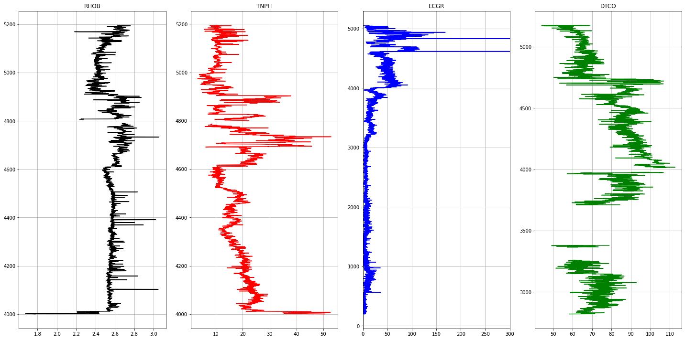

Photo by <a href="https://unsplash.com/@pawel_czerwinski?utm_source=unsplash&utm_medium=referral&utm_content=creditCopyText">Pawel Czerwinski</a> on <a href="https://unsplash.com/s/photos/diffraction?utm_source=unsplash&utm_medium=referral&utm_content=creditCopyText">Unsplash</a>
  

# Sonic Log Prediction

## Summary 
Sonic logs are required for well-seismic ties, an essential step in the exploration workflow. However, due to various resource constraints, sonic logs might not be recorded in several wells in a field. On the other hand, it is seen that basic logs like Gamma Ray, Neutron Porosity, Bulk Density, Resistivity are almost always recorded in all wells. 
Geoscientists approximate missing sonic logs from sonic logs of nearby wells using empirical techniques. These techniques might not generalise to wells other than the well in question. There is also the consistency problem. 

This analysis uses a data driven approach to predict missing sonic logs on a field scale. This might help predict sonic logs for all wells in a field , in turn vastly improving well seismic ties, seismic resolution , depth migration etc. 
This Analysis predicts Delta-T compressional from GR, RHOB, NPHI using Machine learning based algorithms. The dataset consists of 8 wells from Poseidon field of North West Australian Offshore, obtained from [Data Underground](https://dataunderground.org). LAS files containing spliced well logs sampled at 0.5m interval are used for the analysis ( Spliced logs provided by Occam Technologies ). 


3 Models have been trained, one each using Support Vector Machines, Gradient Boosting & Artificial Neural Networks. 

The model is trained on 6 out of 8 wells and validated on 2 wells. 

The analysis shows promising results with the mean square error obtained on validation wells being 0.165 & 0.07. 
Further, predicted sonic logs have high negative correlation with bulk density as dictated by physics. 

## Importing Data


```python
import numpy as np
import pandas as pd
import glob
import lasio as ls
import matplotlib.pyplot as plt
import warnings 
warnings.filterwarnings('ignore')
```


```python
log_list = glob.glob('Poseidon_logs/*.LAS')
log_list
```


    ['Poseidon_logs/Poseidon1Decim.LAS',
     'Poseidon_logs/Kronos1Decim.LAS',
     'Poseidon_logs/Boreas1Decim.LAS',
     'Poseidon_logs/Proteus1Decim.LAS',
     'Poseidon_logs/Pharos1Decim.LAS',
     'Poseidon_logs/Torosa1LDecim.LAS',
     'Poseidon_logs/PoseidonNorth1Decim.LAS',
     'Poseidon_logs/Poseidon2Decim.LAS']


```python
# Predictors
columns_of_interest = ['RHOB', 'TNPH','ECGR','DTCO']
mnemonic_replacements = {
    'NPHI' : 'TNPH' ,
    'HROM' : 'RHOB',
    'GR'   : 'ECGR',
    'GRD'   : 'ECGR',
    'TNP'  : 'TNPH',
    'RHOZ' : 'RHOB',
    'HTNP' : 'TNPH',
    'BATC' : 'DTCO',
    'GRARC'   : 'ECGR',
    'DTC' : 'DTCO'
   
}
```


```python
# Reading LAS files 

las_data = {}
las_df = {}
well_list = []

for las_file in log_list : 
    well_name = las_file.split('Decim.LAS')[0].split('/')[1]
    
    well_list.append(well_name)
    
    las = ls.read(las_file)
    
    # saving las in las_data 
    
    las_data[well_name] = las
    
    df = las.df()
    
    # mnemonic replacements 
    for column in df.columns.values : 
        if column in mnemonic_replacements.keys() : 
            df = df.rename(columns = {column : mnemonic_replacements[column]})
    
    
    las_df[well_name] = df
    print('\nWell Name : ', well_name )
    print(df.head())
    print("No of datapoints :",df.shape[0])
print(well_list)
```

    
    Well Name :  Poseidon1
           ECGR    ATRX    ATRT  TNPH  CAL1  HDAR  RHOB  DTSM  DTCO
    DEPT                                                           
    579.5   NaN  0.6000  0.6700   NaN   NaN   NaN   NaN   NaN   NaN
    580.0   NaN  0.6700  0.7000   NaN   NaN   NaN   NaN   NaN   NaN
    580.5   NaN  0.6200  0.6700   NaN   NaN   NaN   NaN   NaN   NaN
    581.0   NaN  0.5500  0.6400   NaN   NaN   NaN   NaN   NaN   NaN
    581.5   NaN  0.5598  0.6295   NaN   NaN   NaN   NaN   NaN   NaN
    No of datapoints : 9073
    
    Well Name :  Kronos1
             ECGR  RS  RD  TNPH  RHOB  DCAV  DTCO  DTSM
    DEPT                                               
    531.0  0.5559 NaN NaN   NaN   NaN   NaN   NaN   NaN
    531.5  0.9649 NaN NaN   NaN   NaN   NaN   NaN   NaN
    532.0  0.7309 NaN NaN   NaN   NaN   NaN   NaN   NaN
    532.5  4.3208 NaN NaN   NaN   NaN   NaN   NaN   NaN
    533.0 -0.0001 NaN NaN   NaN   NaN   NaN   NaN   NaN
    No of datapoints : 9584
    
    Well Name :  Boreas1
             ECGR  RS  RD  RHOB  TNPH  DTCO  DTSM  HDAR
    DEPT                                               
    200.0  3.8287 NaN NaN   NaN   NaN   NaN   NaN   NaN
    200.5  3.8287 NaN NaN   NaN   NaN   NaN   NaN   NaN
    201.0  3.1437 NaN NaN   NaN   NaN   NaN   NaN   NaN
    201.5  1.4981 NaN NaN   NaN   NaN   NaN   NaN   NaN
    202.0  3.9696 NaN NaN   NaN   NaN   NaN   NaN   NaN
    No of datapoints : 10012
    
    Well Name :  Proteus1
              ECGR  RS  RD  DTCO  DTSM  HDAR  RHOB  TNPH
    DEPT                                                
    489.5  16.2084 NaN NaN   NaN   NaN   NaN   NaN   NaN
    490.0  20.6540 NaN NaN   NaN   NaN   NaN   NaN   NaN
    490.5  19.2559 NaN NaN   NaN   NaN   NaN   NaN   NaN
    491.0  15.8395 NaN NaN   NaN   NaN   NaN   NaN   NaN
    491.5  14.7239 NaN NaN   NaN   NaN   NaN   NaN   NaN
    No of datapoints : 9521
    
    Well Name :  Pharos1
           RHOB  TNPH     ECGR  P16H  P34H  DTCO  DTS
    DEPT                                             
    482.0   NaN   NaN  48.9556   NaN   NaN   NaN  NaN
    482.5   NaN   NaN  54.2686   NaN   NaN   NaN  NaN
    483.0   NaN   NaN  56.0523   NaN   NaN   NaN  NaN
    483.5   NaN   NaN  53.8891   NaN   NaN   NaN  NaN
    484.0   NaN   NaN  67.2855   NaN   NaN   NaN  NaN
    No of datapoints : 9488
    
    Well Name :  Torosa1L
              ECGR      RS      RD  RHOB  TNPH  HDAR  DTCO  DTS
    DEPT                                                       
    555.0  12.3003  0.6826  0.7422   NaN   NaN   NaN   NaN  NaN
    555.5  24.5442  0.4900  0.7223   NaN   NaN   NaN   NaN  NaN
    556.0  25.4925  0.4401  0.4498   NaN   NaN   NaN   NaN  NaN
    556.5  25.2527  0.4874  0.7347   NaN   NaN   NaN   NaN  NaN
    557.0  28.6476  0.4607  0.6694   NaN   NaN   NaN   NaN  NaN
    No of datapoints : 8257
    
    Well Name :  PoseidonNorth1
              ECGR  RS  RD  RHOB  TNPH  DTCO  DTSM  HDAR
    DEPT                                                
    508.0  24.4403 NaN NaN   NaN   NaN   NaN   NaN   NaN
    508.5  29.6471 NaN NaN   NaN   NaN   NaN   NaN   NaN
    509.0  36.3076 NaN NaN   NaN   NaN   NaN   NaN   NaN
    509.5  56.3806 NaN NaN   NaN   NaN   NaN   NaN   NaN
    510.0  54.7321 NaN NaN   NaN   NaN   NaN   NaN   NaN
    No of datapoints : 9544
    
    Well Name :  Poseidon2
              ECGR      RS      RD  DTCO  DTSM  DCAV  RHOB  TNPH
    DEPT                                                        
    490.0  17.6006  0.6898  0.3094   NaN   NaN   NaN   NaN   NaN
    490.5  17.6006  0.6898  0.3094   NaN   NaN   NaN   NaN   NaN
    491.0  17.6006  0.6898  0.3094   NaN   NaN   NaN   NaN   NaN
    491.5  16.7792  0.6959  0.3141   NaN   NaN   NaN   NaN   NaN
    492.0  15.9579  0.6959  0.3141   NaN   NaN   NaN   NaN   NaN
    No of datapoints : 9723
    ['Poseidon1', 'Kronos1', 'Boreas1', 'Proteus1', 'Pharos1', 'Torosa1L', 'PoseidonNorth1', 'Poseidon2']


The well names are : 'Boreas1', 'Poseidon1', 'Kronos1', 'Proteus1', 'Poseidon2', 'Torosa1L', 'PoseidonNorth1', 'Pharos1'.  
The following curves are extracted from each LAS file. 
* ECGR - EDTC Corrected Gamma Ray
* RHOB - Bulk Density
* TNPH - Thermal Neutron Porosity ( Ratio Method ) in selected lithology
* DTCO - Delta T Compressional
 

## Visualising Logs


```python
# Plotting Logs 
def plot_logs(well) : 

    fig,ax = plt.subplots(nrows=1, ncols= len(columns_of_interest), figsize=(20,10))
    colors = ['black', 'red', 'blue', 'green', 'purple', 'black', 'orange']

    for i,log in enumerate(columns_of_interest) : 
        ax[i].plot(well[log], well['DEPT'], color = colors[i])
        ax[i].set_title(log)
        ax[i].grid(True)

    ax[2].set_xlim(0,300)
    plt.tight_layout(1.1)
    plt.show()

for well in well_list : 
    print('Well Name :', well)
    well1 = las_df[well]
    plot_logs(well1[columns_of_interest].reset_index())
```

    Well Name : Poseidon1


    

    


    Well Name : Kronos1


    

    


    Well Name : Boreas1


    

    


    Well Name : Proteus1


    

    


    Well Name : Pharos1


    

    


    Well Name : Torosa1L


    

    


    Well Name : PoseidonNorth1


    

    


    Well Name : Poseidon2


    

    


## Data Preparation


```python
# restricting depth ranges per well to reduce the number of missing values.
depth_ranges = {
    'Pharos1' : [4000,5000],
    'PoseidonNorth1' : [3800,4900],
    'Torosa1L' : [3600, 4600],
    'Poseidon2' : [4100, 5000],
    'Proteus1' : [4950, 5200],
    'Kronos1' : [4750,5000],
    'Poseidon1' : [4600, 4950],
    'Boreas1' : [4000,5100]
    
}

for well in well_list : 
    df = las_df[well]
    df = df[columns_of_interest].reset_index()
    print("\nWell Name : ", well)
    print("Well Start : ", df['DEPT'].min() , '\t Well Stop :', df['DEPT'].max())
    print("Missing Value % ", 100 * df.isnull().sum()/df.shape[0])
    
    depth_start = depth_ranges[well][0]
    depth_stop = depth_ranges[well][-1]
    
    condition = (df['DEPT'] >= depth_start) & (df['DEPT'] <=depth_stop)
    las_df[well] = df[condition]
    
    assert (las_df[well]['DEPT'].min() >= depth_start) and (las_df[well]['DEPT'].max() <= depth_stop) , 'Depths change error'
    print("New Well Start : ", las_df[well]['DEPT'].min() , '\t New Well Stop :',las_df[well]['DEPT'].max(), '\t Datapoints : ', las_df[well].shape[0])
    print("New Missing Value % ", 100 * las_df[well].isnull().sum()/las_df[well].shape[0])
    print('\n--------------------------------------------------------')
    
    
```

    
    Well Name :  Poseidon1
    Well Start :  579.5 	 Well Stop : 5115.5
    Missing Value %  DEPT     0.000000
    RHOB    86.200816
    TNPH    85.781991
    ECGR    17.480436
    DTCO    87.556486
    dtype: float64
    New Well Start :  4600.0 	 New Well Stop : 4950.0 	 Datapoints :  701
    New Missing Value %  DEPT    0.0
    RHOB    0.0
    TNPH    0.0
    ECGR    0.0
    DTCO    0.0
    dtype: float64
    
    --------------------------------------------------------
    
    Well Name :  Kronos1
    Well Start :  531.0 	 Well Stop : 5322.5
    Missing Value %  DEPT     0.000000
    RHOB    74.989566
    TNPH    75.156511
    ECGR     2.493740
    DTCO    87.447830
    dtype: float64
    New Well Start :  4750.0 	 New Well Stop : 5000.0 	 Datapoints :  501
    New Missing Value %  DEPT    0.000000
    RHOB    6.187625
    TNPH    6.786427
    ECGR    0.000000
    DTCO    0.000000
    dtype: float64
    
    --------------------------------------------------------
    
    Well Name :  Boreas1
    Well Start :  200.0 	 Well Stop : 5205.5
    Missing Value %  DEPT     0.000000
    RHOB    76.568118
    TNPH    76.538154
    ECGR     3.016380
    DTCO    63.084299
    dtype: float64
    New Well Start :  4000.0 	 New Well Stop : 5100.0 	 Datapoints :  2201
    New Missing Value %  DEPT    0.000000
    RHOB    2.089959
    TNPH    1.862790
    ECGR    4.134484
    DTCO    1.135847
    dtype: float64
    
    --------------------------------------------------------
    
    Well Name :  Proteus1
    Well Start :  489.5 	 Well Stop : 5249.5
    Missing Value %  DEPT     0.000000
    RHOB    93.225502
    TNPH    92.826384
    ECGR     1.890558
    DTCO    52.221405
    dtype: float64
    New Well Start :  4950.0 	 New Well Stop : 5200.0 	 Datapoints :  501
    New Missing Value %  DEPT    0.0
    RHOB    0.0
    TNPH    0.0
    ECGR    0.0
    DTCO    0.0
    dtype: float64
    
    --------------------------------------------------------
    
    Well Name :  Pharos1
    Well Start :  482.0 	 Well Stop : 5225.5
    Missing Value %  DEPT     0.000000
    RHOB    75.231872
    TNPH    74.936762
    ECGR     0.221332
    DTCO    76.117201
    dtype: float64
    New Well Start :  4000.0 	 New Well Stop : 5000.0 	 Datapoints :  2001
    New Missing Value %  DEPT    0.000000
    RHOB    0.499750
    TNPH    0.549725
    ECGR    0.000000
    DTCO    5.247376
    dtype: float64
    
    --------------------------------------------------------
    
    Well Name :  Torosa1L
    Well Start :  555.0 	 Well Stop : 4683.0
    Missing Value %  DEPT     0.000000
    RHOB    73.610270
    TNPH    70.812644
    ECGR     0.181664
    DTCO     7.036454
    dtype: float64
    New Well Start :  3600.0 	 New Well Stop : 4600.0 	 Datapoints :  2001
    New Missing Value %  DEPT    0.0
    RHOB    0.0
    TNPH    0.0
    ECGR    0.0
    DTCO    0.0
    dtype: float64
    
    --------------------------------------------------------
    
    Well Name :  PoseidonNorth1
    Well Start :  508.0 	 Well Stop : 5279.5
    Missing Value %  DEPT     0.000000
    RHOB    75.901090
    TNPH    75.869656
    ECGR    18.692372
    DTCO    67.026404
    dtype: float64
    New Well Start :  3800.0 	 New Well Stop : 4900.0 	 Datapoints :  2201
    New Missing Value %  DEPT    0.0
    RHOB    0.0
    TNPH    0.0
    ECGR    0.0
    DTCO    0.0
    dtype: float64
    
    --------------------------------------------------------
    
    Well Name :  Poseidon2
    Well Start :  490.0 	 Well Stop : 5351.0
    Missing Value %  DEPT     0.000000
    RHOB    75.079708
    TNPH    74.154068
    ECGR     0.123419
    DTCO    41.571531
    dtype: float64
    New Well Start :  4100.0 	 New Well Stop : 5000.0 	 Datapoints :  1801
    New Missing Value %  DEPT    0.000000
    RHOB    0.000000
    TNPH    0.000000
    ECGR    0.000000
    DTCO    1.554692
    dtype: float64
    
    --------------------------------------------------------


```python
# Concatenating well data into one dataframe 
# Adding a column called Well_name to distinguish data points of each well
for well in well_list :     
    las_df[well]['Well'] = well
    
well_df = pd.concat(las_df.values(), axis=0)
well_df = well_df[columns_of_interest + ['Well']]
well_df.head()
```


<div>
<table border="1" class="dataframe">
  <thead>
    <tr style="text-align: right;">
      <th></th>
      <th>RHOB</th>
      <th>TNPH</th>
      <th>ECGR</th>
      <th>DTCO</th>
      <th>Well</th>
    </tr>
  </thead>
  <tbody>
    <tr>
      <th>8041</th>
      <td>2.5211</td>
      <td>10.10</td>
      <td>34.3997</td>
      <td>70.4003</td>
      <td>Poseidon1</td>
    </tr>
    <tr>
      <th>8042</th>
      <td>2.5112</td>
      <td>12.40</td>
      <td>42.8228</td>
      <td>80.4120</td>
      <td>Poseidon1</td>
    </tr>
    <tr>
      <th>8043</th>
      <td>2.5277</td>
      <td>15.30</td>
      <td>60.1452</td>
      <td>82.5646</td>
      <td>Poseidon1</td>
    </tr>
    <tr>
      <th>8044</th>
      <td>2.5127</td>
      <td>12.28</td>
      <td>36.4007</td>
      <td>72.5366</td>
      <td>Poseidon1</td>
    </tr>
    <tr>
      <th>8045</th>
      <td>2.5271</td>
      <td>10.16</td>
      <td>35.3279</td>
      <td>70.7520</td>
      <td>Poseidon1</td>
    </tr>
  </tbody>
</table>
</div>


## Missing Value Treatment


```python

missing_values_df = pd.DataFrame( index = well_df.columns.values )


for well_name in well_df['Well'].unique() : 
    condition = well_df['Well'] == well_name 
    subset = well_df[condition]
    missing_values_df[well_name] =  100 * subset.isnull().sum()/subset.shape[0]
missing_values_df = missing_values_df.T
missing_values_df.sort_values(by=['DTCO'],ascending=[True]).style.bar()


```


  <table id="T_e4547_" ><thead>    <tr>        <th class="blank level0" ></th>        <th class="col_heading level0 col0" >RHOB</th>        <th class="col_heading level0 col1" >TNPH</th>        <th class="col_heading level0 col2" >ECGR</th>        <th class="col_heading level0 col3" >DTCO</th>        <th class="col_heading level0 col4" >Well</th>    </tr></thead><tbody>
                <tr>
                        <th id="T_e4547_level0_row0" class="row_heading level0 row0" >Poseidon1</th>
                        <td id="T_e4547_row0_col0" class="data row0 col0" >0.000000</td>
                        <td id="T_e4547_row0_col1" class="data row0 col1" >0.000000</td>
                        <td id="T_e4547_row0_col2" class="data row0 col2" >0.000000</td>
                        <td id="T_e4547_row0_col3" class="data row0 col3" >0.000000</td>
                        <td id="T_e4547_row0_col4" class="data row0 col4" >0.000000</td>
            </tr>
            <tr>
                        <th id="T_e4547_level0_row1" class="row_heading level0 row1" >Kronos1</th>
                        <td id="T_e4547_row1_col0" class="data row1 col0" >6.187625</td>
                        <td id="T_e4547_row1_col1" class="data row1 col1" >6.786427</td>
                        <td id="T_e4547_row1_col2" class="data row1 col2" >0.000000</td>
                        <td id="T_e4547_row1_col3" class="data row1 col3" >0.000000</td>
                        <td id="T_e4547_row1_col4" class="data row1 col4" >0.000000</td>
            </tr>
            <tr>
                        <th id="T_e4547_level0_row2" class="row_heading level0 row2" >Proteus1</th>
                        <td id="T_e4547_row2_col0" class="data row2 col0" >0.000000</td>
                        <td id="T_e4547_row2_col1" class="data row2 col1" >0.000000</td>
                        <td id="T_e4547_row2_col2" class="data row2 col2" >0.000000</td>
                        <td id="T_e4547_row2_col3" class="data row2 col3" >0.000000</td>
                        <td id="T_e4547_row2_col4" class="data row2 col4" >0.000000</td>
            </tr>
            <tr>
                        <th id="T_e4547_level0_row3" class="row_heading level0 row3" >Torosa1L</th>
                        <td id="T_e4547_row3_col0" class="data row3 col0" >0.000000</td>
                        <td id="T_e4547_row3_col1" class="data row3 col1" >0.000000</td>
                        <td id="T_e4547_row3_col2" class="data row3 col2" >0.000000</td>
                        <td id="T_e4547_row3_col3" class="data row3 col3" >0.000000</td>
                        <td id="T_e4547_row3_col4" class="data row3 col4" >0.000000</td>
            </tr>
            <tr>
                        <th id="T_e4547_level0_row4" class="row_heading level0 row4" >PoseidonNorth1</th>
                        <td id="T_e4547_row4_col0" class="data row4 col0" >0.000000</td>
                        <td id="T_e4547_row4_col1" class="data row4 col1" >0.000000</td>
                        <td id="T_e4547_row4_col2" class="data row4 col2" >0.000000</td>
                        <td id="T_e4547_row4_col3" class="data row4 col3" >0.000000</td>
                        <td id="T_e4547_row4_col4" class="data row4 col4" >0.000000</td>
            </tr>
            <tr>
                        <th id="T_e4547_level0_row5" class="row_heading level0 row5" >Boreas1</th>
                        <td id="T_e4547_row5_col0" class="data row5 col0" >2.089959</td>
                        <td id="T_e4547_row5_col1" class="data row5 col1" >1.862790</td>
                        <td id="T_e4547_row5_col2" class="data row5 col2" >4.134484</td>
                        <td id="T_e4547_row5_col3" class="data row5 col3" >1.135847</td>
                        <td id="T_e4547_row5_col4" class="data row5 col4" >0.000000</td>
            </tr>
            <tr>
                        <th id="T_e4547_level0_row6" class="row_heading level0 row6" >Poseidon2</th>
                        <td id="T_e4547_row6_col0" class="data row6 col0" >0.000000</td>
                        <td id="T_e4547_row6_col1" class="data row6 col1" >0.000000</td>
                        <td id="T_e4547_row6_col2" class="data row6 col2" >0.000000</td>
                        <td id="T_e4547_row6_col3" class="data row6 col3" >1.554692</td>
                        <td id="T_e4547_row6_col4" class="data row6 col4" >0.000000</td>
            </tr>
            <tr>
                        <th id="T_e4547_level0_row7" class="row_heading level0 row7" >Pharos1</th>
                        <td id="T_e4547_row7_col0" class="data row7 col0" >0.499750</td>
                        <td id="T_e4547_row7_col1" class="data row7 col1" >0.549725</td>
                        <td id="T_e4547_row7_col2" class="data row7 col2" >0.000000</td>
                        <td id="T_e4547_row7_col3" class="data row7 col3" >5.247376</td>
                        <td id="T_e4547_row7_col4" class="data row7 col4" >0.000000</td>
            </tr>
    </tbody></table>


## Train & Test split


```python
training_wells = ['PoseidonNorth1', 'Torosa1L','Boreas1', 'Poseidon2','Kronos1', 'Proteus1']
testing_wells = [well for well in well_list if well not in training_wells]

print('Training Wells : ',training_wells)
print('Testing Wells : ' , testing_wells)

train_dataset = pd.concat([las_df[well] for well in training_wells],axis=0)
test_dataset = pd.concat([las_df[well] for well in testing_wells],axis=0)
train_dataset.head()

```

    Training Wells :  ['PoseidonNorth1', 'Torosa1L', 'Boreas1', 'Poseidon2', 'Kronos1', 'Proteus1']
    Testing Wells :  ['Poseidon1', 'Pharos1']


<div>

<table border="1" class="dataframe">
  <thead>
    <tr style="text-align: right;">
      <th></th>
      <th>DEPT</th>
      <th>RHOB</th>
      <th>TNPH</th>
      <th>ECGR</th>
      <th>DTCO</th>
      <th>Well</th>
    </tr>
  </thead>
  <tbody>
    <tr>
      <th>6584</th>
      <td>3800.0</td>
      <td>2.5913</td>
      <td>35.5945</td>
      <td>83.2622</td>
      <td>98.2931</td>
      <td>PoseidonNorth1</td>
    </tr>
    <tr>
      <th>6585</th>
      <td>3800.5</td>
      <td>2.5680</td>
      <td>34.2785</td>
      <td>73.9849</td>
      <td>98.1903</td>
      <td>PoseidonNorth1</td>
    </tr>
    <tr>
      <th>6586</th>
      <td>3801.0</td>
      <td>2.6482</td>
      <td>29.6083</td>
      <td>83.8913</td>
      <td>98.1472</td>
      <td>PoseidonNorth1</td>
    </tr>
    <tr>
      <th>6587</th>
      <td>3801.5</td>
      <td>2.7102</td>
      <td>34.2985</td>
      <td>91.5737</td>
      <td>95.7302</td>
      <td>PoseidonNorth1</td>
    </tr>
    <tr>
      <th>6588</th>
      <td>3802.0</td>
      <td>2.9027</td>
      <td>34.7045</td>
      <td>86.1709</td>
      <td>95.8680</td>
      <td>PoseidonNorth1</td>
    </tr>
  </tbody>
</table>
</div>


```python
train_dataset.shape
```


    (9206, 6)


```python
100 * train_dataset.isnull().sum() / train_dataset.shape[0]
```


    DEPT    0.000000
    RHOB    0.836411
    TNPH    0.814686
    ECGR    0.988486
    DTCO    0.575711
    Well    0.000000
    dtype: float64


```python
train_dataset.dropna(subset=columns_of_interest, inplace=True)
test_dataset.dropna(subset=columns_of_interest, inplace=True)
```

## Correlation


```python
# Pairplot 
import seaborn as sns
sns.set_style('whitegrid')
sns.pairplot(data=train_dataset, vars = ['RHOB', 'TNPH','ECGR','DTCO'], diag_kind='kde')
```


    <seaborn.axisgrid.PairGrid at 0x7f511c422990>


    

    


```python
fig,ax = plt.subplots(figsize=(10,10))
sns.heatmap(train_dataset[columns_of_interest].corr(method='spearman'), annot=True ,ax=ax, center=0)
plt.title('Correlations')
plt.show()
```


    

    


## Normalization


```python
# move the depth column to the right
depth_train, depth_pred = train_dataset.pop('DEPT'), test_dataset.pop('DEPT')
train_dataset['DEPT'], test_dataset['DEPT'] = depth_train, depth_pred
```


```python
columns_of_interest
```


    ['RHOB', 'TNPH', 'ECGR', 'DTCO']


```python
from sklearn.compose import ColumnTransformer
from sklearn.preprocessing import PowerTransformer


scaler = PowerTransformer(method='yeo-johnson')
column_drop = ['WELL','DEPT']
ct = ColumnTransformer([('transform', scaler, columns_of_interest)], remainder='passthrough')

train_dataset_norm = ct.fit_transform(train_dataset)
train_dataset_norm = pd.DataFrame(train_dataset_norm, columns = train_dataset.columns)
train_dataset_norm 
```


<div>

<table border="1" class="dataframe">
  <thead>
    <tr style="text-align: right;">
      <th></th>
      <th>RHOB</th>
      <th>TNPH</th>
      <th>ECGR</th>
      <th>DTCO</th>
      <th>Well</th>
      <th>DEPT</th>
    </tr>
  </thead>
  <tbody>
    <tr>
      <th>0</th>
      <td>0.194983</td>
      <td>1.41744</td>
      <td>0.288585</td>
      <td>1.069585</td>
      <td>PoseidonNorth1</td>
      <td>3800.0</td>
    </tr>
    <tr>
      <th>1</th>
      <td>-0.024624</td>
      <td>1.295228</td>
      <td>0.0322</td>
      <td>1.061787</td>
      <td>PoseidonNorth1</td>
      <td>3800.5</td>
    </tr>
    <tr>
      <th>2</th>
      <td>0.74861</td>
      <td>0.851648</td>
      <td>0.305598</td>
      <td>1.058519</td>
      <td>PoseidonNorth1</td>
      <td>3801.0</td>
    </tr>
    <tr>
      <th>3</th>
      <td>1.380549</td>
      <td>1.297094</td>
      <td>0.509886</td>
      <td>0.876203</td>
      <td>PoseidonNorth1</td>
      <td>3801.5</td>
    </tr>
    <tr>
      <th>4</th>
      <td>3.543468</td>
      <td>1.334914</td>
      <td>0.366876</td>
      <td>0.886546</td>
      <td>PoseidonNorth1</td>
      <td>3802.0</td>
    </tr>
    <tr>
      <th>...</th>
      <td>...</td>
      <td>...</td>
      <td>...</td>
      <td>...</td>
      <td>...</td>
      <td>...</td>
    </tr>
    <tr>
      <th>8969</th>
      <td>-3.48235</td>
      <td>-0.712419</td>
      <td>-1.350794</td>
      <td>-1.010424</td>
      <td>Proteus1</td>
      <td>5198.0</td>
    </tr>
    <tr>
      <th>8970</th>
      <td>1.775529</td>
      <td>-0.25349</td>
      <td>0.321077</td>
      <td>-1.018072</td>
      <td>Proteus1</td>
      <td>5198.5</td>
    </tr>
    <tr>
      <th>8971</th>
      <td>1.506393</td>
      <td>-0.751591</td>
      <td>-2.436269</td>
      <td>-1.541108</td>
      <td>Proteus1</td>
      <td>5199.0</td>
    </tr>
    <tr>
      <th>8972</th>
      <td>2.664714</td>
      <td>-2.337805</td>
      <td>-2.461197</td>
      <td>-1.597139</td>
      <td>Proteus1</td>
      <td>5199.5</td>
    </tr>
    <tr>
      <th>8973</th>
      <td>0.283779</td>
      <td>-2.130702</td>
      <td>-1.708333</td>
      <td>-1.674272</td>
      <td>Proteus1</td>
      <td>5200.0</td>
    </tr>
  </tbody>
</table>
<p>8974 rows × 6 columns</p>
</div>


```python
# Pair Plot after normalization 

sns.pairplot(data=train_dataset, vars = ['RHOB', 'TNPH','ECGR','DTCO'], diag_kind='kde')
```


    <seaborn.axisgrid.PairGrid at 0x7f5102e4e350>


    

    


## Outlier Removal


```python
train_dataset_drop = train_dataset_norm.copy()
train_dataset_drop = train_dataset_drop.drop(columns=['Well','DEPT'], )
train_dataset_drop
```


<div>

<table border="1" class="dataframe">
  <thead>
    <tr style="text-align: right;">
      <th></th>
      <th>RHOB</th>
      <th>TNPH</th>
      <th>ECGR</th>
      <th>DTCO</th>
    </tr>
  </thead>
  <tbody>
    <tr>
      <th>0</th>
      <td>0.194983</td>
      <td>1.41744</td>
      <td>0.288585</td>
      <td>1.069585</td>
    </tr>
    <tr>
      <th>1</th>
      <td>-0.024624</td>
      <td>1.295228</td>
      <td>0.0322</td>
      <td>1.061787</td>
    </tr>
    <tr>
      <th>2</th>
      <td>0.74861</td>
      <td>0.851648</td>
      <td>0.305598</td>
      <td>1.058519</td>
    </tr>
    <tr>
      <th>3</th>
      <td>1.380549</td>
      <td>1.297094</td>
      <td>0.509886</td>
      <td>0.876203</td>
    </tr>
    <tr>
      <th>4</th>
      <td>3.543468</td>
      <td>1.334914</td>
      <td>0.366876</td>
      <td>0.886546</td>
    </tr>
    <tr>
      <th>...</th>
      <td>...</td>
      <td>...</td>
      <td>...</td>
      <td>...</td>
    </tr>
    <tr>
      <th>8969</th>
      <td>-3.48235</td>
      <td>-0.712419</td>
      <td>-1.350794</td>
      <td>-1.010424</td>
    </tr>
    <tr>
      <th>8970</th>
      <td>1.775529</td>
      <td>-0.25349</td>
      <td>0.321077</td>
      <td>-1.018072</td>
    </tr>
    <tr>
      <th>8971</th>
      <td>1.506393</td>
      <td>-0.751591</td>
      <td>-2.436269</td>
      <td>-1.541108</td>
    </tr>
    <tr>
      <th>8972</th>
      <td>2.664714</td>
      <td>-2.337805</td>
      <td>-2.461197</td>
      <td>-1.597139</td>
    </tr>
    <tr>
      <th>8973</th>
      <td>0.283779</td>
      <td>-2.130702</td>
      <td>-1.708333</td>
      <td>-1.674272</td>
    </tr>
  </tbody>
</table>
<p>8974 rows × 4 columns</p>
</div>


```python
from sklearn.svm import OneClassSVM
svm = OneClassSVM(nu=0.1)
yhat = svm.fit_predict(train_dataset_drop)
mask = yhat != -1
train_dataset_svm = train_dataset_norm[mask]
print('Number of points after outliers removed with One-class SVM     :', len(train_dataset_svm))
```

    Number of points after outliers removed with One-class SVM     : 8076


## Modelling


```python
y_train = train_dataset_svm['DTCO']
X_train = train_dataset_svm[['RHOB','TNPH','ECGR']]
```


```python
# Derived Features
from scipy.ndimage import median_filter

for col in X_train.columns : 
    X_train[col + '_GRAD'] = np.gradient(X_train[col].values)
    X_train[col + '_AVG'] = median_filter(X_train[col].values.tolist(),10,mode='nearest')
```


```python
X_train.columns
```


    Index(['RHOB', 'TNPH', 'ECGR', 'RHOB_GRAD', 'RHOB_AVG', 'TNPH_GRAD',
           'TNPH_AVG', 'ECGR_GRAD', 'ECGR_AVG'],
          dtype='object')


```python
# Random Forest
from sklearn.ensemble import RandomForestRegressor 
rf_model = RandomForestRegressor()

rf_model.fit(X_train, y_train)
print('Train Accuracy :', rf_model.score(X_train, y_train))

# for well in test_wells : 
#     X_test, y_test = process_test_set(test_dataset, well, scaler)
#     print('Test Accuracy in ' + well + ' : ', rf_model.score(X_test_scaled, y_test))

```

    Train Accuracy : 0.9917603654437802


```python
# Gradient Boost
from sklearn.ensemble import GradientBoostingRegressor
gb_model = GradientBoostingRegressor()
gb_model.fit(X_train, y_train)
print('Train Accuracy :',gb_model.score(X_train, y_train))

```

    Train Accuracy : 0.9081315988009683


## Hyper Parameter Tuning


```python
# estimator = GradientBoostingRegressor()

# ## Hyperparameters
# max_depth = [10, 20, 30,50,  100]
# min_samples_leaf = [1, 2,3, 4]
# min_samples_split = [2, 10]
# n_estimators = [100,200,300]

# param_grid = {'n_estimators': n_estimators,'max_depth': max_depth , 'min_samples_leaf' : min_samples_leaf, 'min_samples_split' : min_samples_split}

# from sklearn.model_selection import RandomizedSearchCV
# search = RandomizedSearchCV(estimator, param_grid , cv = 5, verbose=1,n_jobs=-1)
# search.fit(X_train, y_train)
# search.best_params_
```


```python
# estimator = RandomForestRegressor()
# ## Hyperparameters
# max_depth = [10, 20, 30,50,  100]
# min_samples_leaf = [1, 2,3, 4]
# min_samples_split = [2, 10]
# n_estimators = [100,200,300]

# param_grid = {'n_estimators': n_estimators,'max_depth': max_depth , 'min_samples_leaf' : min_samples_leaf, 'min_samples_split' : min_samples_split}

# from sklearn.model_selection import RandomizedSearchCV
# search = RandomizedSearchCV(estimator, param_grid , cv = 5, verbose=1,n_jobs=-1, n_iter=20)
# search.fit(X_train, y_train)
# search.best_params_
```


```python
#search.best_estimator_
```


```python
# New Gradient Boosting model with the best hyper parameters
gb_model_tuned = GradientBoostingRegressor(max_depth =  20, n_estimators= 100,min_samples_leaf=4,min_samples_split=2)
gb_model_tuned.fit(X_train, y_train)
print('Train Accuracy :',gb_model_tuned.score(X_train, y_train))
```

    Train Accuracy : 0.9998761339778823


```python
rf_model_tuned = RandomForestRegressor(max_depth=50, min_samples_leaf=2, min_samples_split=10,
                      n_estimators=200)
rf_model_tuned.fit(X_train,y_train)
```


    RandomForestRegressor(max_depth=50, min_samples_leaf=2, min_samples_split=10,
                          n_estimators=200)


## Test Wells


```python
# normalisation
test_dataset_norm = pd.DataFrame(ct.transform(test_dataset), columns = test_dataset.columns)
```


```python
test_dataset_norm
```


<div>

<table border="1" class="dataframe">
  <thead>
    <tr style="text-align: right;">
      <th></th>
      <th>RHOB</th>
      <th>TNPH</th>
      <th>ECGR</th>
      <th>DTCO</th>
      <th>Well</th>
      <th>DEPT</th>
    </tr>
  </thead>
  <tbody>
    <tr>
      <th>0</th>
      <td>-0.454429</td>
      <td>-1.257473</td>
      <td>-1.226668</td>
      <td>-0.912366</td>
      <td>Poseidon1</td>
      <td>4600.0</td>
    </tr>
    <tr>
      <th>1</th>
      <td>-0.543094</td>
      <td>-0.975991</td>
      <td>-0.928349</td>
      <td>-0.233124</td>
      <td>Poseidon1</td>
      <td>4600.5</td>
    </tr>
    <tr>
      <th>2</th>
      <td>-0.394922</td>
      <td>-0.638131</td>
      <td>-0.372358</td>
      <td>-0.082209</td>
      <td>Poseidon1</td>
      <td>4601.0</td>
    </tr>
    <tr>
      <th>3</th>
      <td>-0.529706</td>
      <td>-0.990353</td>
      <td>-1.153705</td>
      <td>-0.770638</td>
      <td>Poseidon1</td>
      <td>4601.5</td>
    </tr>
    <tr>
      <th>4</th>
      <td>-0.400345</td>
      <td>-1.249951</td>
      <td>-1.192646</td>
      <td>-0.889156</td>
      <td>Poseidon1</td>
      <td>4602.0</td>
    </tr>
    <tr>
      <th>...</th>
      <td>...</td>
      <td>...</td>
      <td>...</td>
      <td>...</td>
      <td>...</td>
      <td>...</td>
    </tr>
    <tr>
      <th>2579</th>
      <td>-0.847423</td>
      <td>-1.802829</td>
      <td>-2.111444</td>
      <td>-1.249448</td>
      <td>Pharos1</td>
      <td>4998.0</td>
    </tr>
    <tr>
      <th>2580</th>
      <td>-0.406668</td>
      <td>-1.645907</td>
      <td>-1.818261</td>
      <td>-1.338187</td>
      <td>Pharos1</td>
      <td>4998.5</td>
    </tr>
    <tr>
      <th>2581</th>
      <td>-1.341027</td>
      <td>-1.628059</td>
      <td>-1.834552</td>
      <td>-1.27002</td>
      <td>Pharos1</td>
      <td>4999.0</td>
    </tr>
    <tr>
      <th>2582</th>
      <td>-2.260172</td>
      <td>-2.131092</td>
      <td>-2.367431</td>
      <td>-1.088848</td>
      <td>Pharos1</td>
      <td>4999.5</td>
    </tr>
    <tr>
      <th>2583</th>
      <td>-2.370962</td>
      <td>-2.157379</td>
      <td>-2.45466</td>
      <td>-0.973624</td>
      <td>Pharos1</td>
      <td>5000.0</td>
    </tr>
  </tbody>
</table>
<p>2584 rows × 6 columns</p>
</div>


```python
# outlier removal 
test_dataset_drop = test_dataset_norm.copy()

yhat = svm.predict(test_dataset_drop[['RHOB','TNPH','ECGR','DTCO']])
mask = yhat != -1
test_dataset_svm = test_dataset_norm[mask]
test_dataset_svm_unscaled = test_dataset[mask]
print('Number of points after outliers removed with One-class SVM     :', len(test_dataset_svm))
```

    Number of points after outliers removed with One-class SVM     : 2152


```python
X_test = []
y_test = []

for i, well in enumerate(testing_wells) : 
    test = None
    test = test_dataset_svm.loc[test_dataset_svm['Well'] == well]
    
    test = test.drop(columns=['Well','DEPT'])
    
    
    # Derived Features

    for col in ['RHOB','TNPH','ECGR'] : 
        test[col + '_GRAD'] = np.gradient(test[col].values)
        test[col + '_AVG'] = median_filter(test[col].values.tolist(),10,mode='nearest')
    
    y_test.append(test.pop('DTCO').values)
    X_test.append(test.values)
    

```


```python
# predictions 
from sklearn.metrics import mean_squared_error
y_test_pred_gb = []
y_test_pred_rf = []
for i in range(len(X_test)) : 
    y_test_pred_gb.append(gb_model_tuned.predict(X_test[i]))
    y_test_pred_rf.append(rf_model_tuned.predict(X_test[i]))
    print('\n------------------------')
    print('Test Accuracy of Well using Gradient Boosting Model ', testing_wells[i], ' : ', gb_model_tuned.score(X_test[i], y_test[i]))
    print('MSE of Well using Gradient Boosting Model ', testing_wells[i], ' : ', mean_squared_error(y_test[i], y_test_pred_gb[i]))
    print('Test Accuracy of Well using RF Model ', testing_wells[i], ' : ', rf_model_tuned.score(X_test[i], y_test[i]))
    print('MSE of Well using RF Model ', testing_wells[i], ' : ', mean_squared_error(y_test[i], y_test_pred_rf[i]))
```

    
    ------------------------
    Test Accuracy of Well using Gradient Boosting Model  Poseidon1  :  0.7519203113851671
    MSE of Well using Gradient Boosting Model  Poseidon1  :  0.162851261183905
    Test Accuracy of Well using RF Model  Poseidon1  :  0.7812918613913131
    MSE of Well using RF Model  Poseidon1  :  0.14357038418775003
    
    ------------------------
    Test Accuracy of Well using Gradient Boosting Model  Pharos1  :  0.7545701941806116
    MSE of Well using Gradient Boosting Model  Pharos1  :  0.09787985129034865
    Test Accuracy of Well using RF Model  Pharos1  :  0.7866187967475008
    MSE of Well using RF Model  Pharos1  :  0.08509854935011467


## Using Artificial Neural Networks


```python
import tensorflow as tf
tf.random.set_seed(42)
import keras 
from keras.models import Sequential
from keras.layers import Dense, Dropout, Activation, BatchNormalization, Dropout
from keras.callbacks import ModelCheckpoint
```

    2021-07-11 19:25:27.814036: W tensorflow/stream_executor/platform/default/dso_loader.cc:60] Could not load dynamic library 'libcudart.so.11.0'; dlerror: libcudart.so.11.0: cannot open shared object file: No such file or directory
    2021-07-11 19:25:27.814077: I tensorflow/stream_executor/cuda/cudart_stub.cc:29] Ignore above cudart dlerror if you do not have a GPU set up on your machine.


```python
# Over Parameterised ANN 
model = Sequential([
   Dense(128, activation='relu',kernel_initializer='normal', input_shape=(9,) ) , 
    BatchNormalization(),
    Dropout(0.10),

    Dense(64, kernel_initializer='normal',activation='relu' ) , 
    BatchNormalization(), 
    Dropout(0.10),

    Dense(32, kernel_initializer='normal',activation='relu' ) , 
    BatchNormalization(),
    Dropout(0.10),
    
    Dense(16, kernel_initializer='normal',activation='relu' ) , 
    BatchNormalization(),
    Dropout(0.10),
    
    Dense(8, kernel_initializer='normal',activation='relu' ) , 
    BatchNormalization(),
    Dropout(0.10),

    Dense(4, kernel_initializer='normal',activation='relu' ) ,
    BatchNormalization(),
    Dropout(0.10),

    Dense(units=1, kernel_initializer='normal') ]
    
)


model.compile(optimizer='adam', loss='mean_squared_error')
print(model.summary())
model_checkpoint = ModelCheckpoint('best_model',monitor='val_loss', mode = 'min', save_best_only=True, verbose=1)

def scheduler(epoch, lr):
    if epoch <=10 : 
        return lr 
    else : 
        return lr * tf.math.exp(-0.1 * epoch)
    
lr_callback = tf.keras.callbacks.LearningRateScheduler(scheduler)

X_train_tf = tf.convert_to_tensor(X_train.values, np.float32)
y_train_tf = tf.convert_to_tensor(y_train.values, np.float32)


```

    2021-07-11 19:25:32.081060: I tensorflow/compiler/jit/xla_cpu_device.cc:41] Not creating XLA devices, tf_xla_enable_xla_devices not set
    2021-07-11 19:25:32.081302: W tensorflow/stream_executor/platform/default/dso_loader.cc:60] Could not load dynamic library 'libcuda.so.1'; dlerror: libcuda.so.1: cannot open shared object file: No such file or directory
    2021-07-11 19:25:32.081316: W tensorflow/stream_executor/cuda/cuda_driver.cc:326] failed call to cuInit: UNKNOWN ERROR (303)
    2021-07-11 19:25:32.081333: I tensorflow/stream_executor/cuda/cuda_diagnostics.cc:156] kernel driver does not appear to be running on this host (p-fbd0b10b-3636-4896-bb87-fbf506835cad): /proc/driver/nvidia/version does not exist
    2021-07-11 19:25:32.081543: I tensorflow/core/platform/cpu_feature_guard.cc:142] This TensorFlow binary is optimized with oneAPI Deep Neural Network Library (oneDNN) to use the following CPU instructions in performance-critical operations:  AVX2 AVX512F FMA
    To enable them in other operations, rebuild TensorFlow with the appropriate compiler flags.
    2021-07-11 19:25:32.081688: I tensorflow/compiler/jit/xla_gpu_device.cc:99] Not creating XLA devices, tf_xla_enable_xla_devices not set
    Model: "sequential"
    _________________________________________________________________
    Layer (type)                 Output Shape              Param #   
    =================================================================
    dense (Dense)                (None, 128)               1280      
    _________________________________________________________________
    batch_normalization (BatchNo (None, 128)               512       
    _________________________________________________________________
    dropout (Dropout)            (None, 128)               0         
    _________________________________________________________________
    dense_1 (Dense)              (None, 64)                8256      
    _________________________________________________________________
    batch_normalization_1 (Batch (None, 64)                256       
    _________________________________________________________________
    dropout_1 (Dropout)          (None, 64)                0         
    _________________________________________________________________
    dense_2 (Dense)              (None, 32)                2080      
    _________________________________________________________________
    batch_normalization_2 (Batch (None, 32)                128       
    _________________________________________________________________
    dropout_2 (Dropout)          (None, 32)                0         
    _________________________________________________________________
    dense_3 (Dense)              (None, 16)                528       
    _________________________________________________________________
    batch_normalization_3 (Batch (None, 16)                64        
    _________________________________________________________________
    dropout_3 (Dropout)          (None, 16)                0         
    _________________________________________________________________
    dense_4 (Dense)              (None, 8)                 136       
    _________________________________________________________________
    batch_normalization_4 (Batch (None, 8)                 32        
    _________________________________________________________________
    dropout_4 (Dropout)          (None, 8)                 0         
    _________________________________________________________________
    dense_5 (Dense)              (None, 4)                 36        
    _________________________________________________________________
    batch_normalization_5 (Batch (None, 4)                 16        
    _________________________________________________________________
    dropout_5 (Dropout)          (None, 4)                 0         
    _________________________________________________________________
    dense_6 (Dense)              (None, 1)                 5         
    =================================================================
    Total params: 13,329
    Trainable params: 12,825
    Non-trainable params: 504
    _________________________________________________________________
    None


```python
history = model.fit(X_train_tf, y_train_tf, batch_size=00, validation_split=0.3, epochs=40,callbacks=[model_checkpoint, lr_callback])
```

    Epoch 1/40
    2021-07-11 19:25:32.416134: I tensorflow/compiler/mlir/mlir_graph_optimization_pass.cc:116] None of the MLIR optimization passes are enabled (registered 2)
    2021-07-11 19:25:32.416620: I tensorflow/core/platform/profile_utils/cpu_utils.cc:112] CPU Frequency: 2499995000 Hz
    177/177 [==============================] - 2s 6ms/step - loss: 0.6706 - val_loss: 1.0109
    
    Epoch 00001: val_loss improved from inf to 1.01087, saving model to best_model
    2021-07-11 19:25:35.935800: W tensorflow/python/util/util.cc:348] Sets are not currently considered sequences, but this may change in the future, so consider avoiding using them.
    INFO:tensorflow:Assets written to: best_model/assets
    Epoch 2/40
    177/177 [==============================] - 1s 3ms/step - loss: 0.2181 - val_loss: 0.6717
    
    Epoch 00002: val_loss improved from 1.01087 to 0.67171, saving model to best_model
    INFO:tensorflow:Assets written to: best_model/assets
    Epoch 3/40
    177/177 [==============================] - 1s 3ms/step - loss: 0.1860 - val_loss: 0.2183
    
    Epoch 00003: val_loss improved from 0.67171 to 0.21830, saving model to best_model
    INFO:tensorflow:Assets written to: best_model/assets
    Epoch 4/40
    177/177 [==============================] - 1s 3ms/step - loss: 0.1927 - val_loss: 0.1277
    
    Epoch 00004: val_loss improved from 0.21830 to 0.12774, saving model to best_model
    INFO:tensorflow:Assets written to: best_model/assets
    Epoch 5/40
    177/177 [==============================] - 1s 4ms/step - loss: 0.1761 - val_loss: 0.1395
    
    Epoch 00005: val_loss did not improve from 0.12774
    Epoch 6/40
    177/177 [==============================] - 1s 3ms/step - loss: 0.1792 - val_loss: 0.1409
    
    Epoch 00006: val_loss did not improve from 0.12774
    Epoch 7/40
    177/177 [==============================] - 1s 3ms/step - loss: 0.1682 - val_loss: 0.1790
    
    Epoch 00007: val_loss did not improve from 0.12774
    Epoch 8/40
    177/177 [==============================] - 1s 3ms/step - loss: 0.1706 - val_loss: 0.1403
    
    Epoch 00008: val_loss did not improve from 0.12774
    Epoch 9/40
    177/177 [==============================] - 1s 3ms/step - loss: 0.1751 - val_loss: 0.1392
    
    Epoch 00009: val_loss did not improve from 0.12774
    Epoch 10/40
    177/177 [==============================] - 1s 3ms/step - loss: 0.1725 - val_loss: 0.1580
    
    Epoch 00010: val_loss did not improve from 0.12774
    Epoch 11/40
    177/177 [==============================] - 1s 3ms/step - loss: 0.1775 - val_loss: 0.1340
    
    Epoch 00011: val_loss did not improve from 0.12774
    Epoch 12/40
    177/177 [==============================] - 1s 3ms/step - loss: 0.1675 - val_loss: 0.1367
    
    Epoch 00012: val_loss did not improve from 0.12774
    Epoch 13/40
    177/177 [==============================] - 1s 3ms/step - loss: 0.1543 - val_loss: 0.1406
    
    Epoch 00013: val_loss did not improve from 0.12774
    Epoch 14/40
    177/177 [==============================] - 1s 3ms/step - loss: 0.1471 - val_loss: 0.1436
    
    Epoch 00014: val_loss did not improve from 0.12774
    Epoch 15/40
    177/177 [==============================] - 1s 4ms/step - loss: 0.1496 - val_loss: 0.1432
    
    Epoch 00015: val_loss did not improve from 0.12774
    Epoch 16/40
    177/177 [==============================] - 1s 3ms/step - loss: 0.1599 - val_loss: 0.1423
    
    Epoch 00016: val_loss did not improve from 0.12774
    Epoch 17/40
    177/177 [==============================] - 1s 3ms/step - loss: 0.1613 - val_loss: 0.1413
    
    Epoch 00017: val_loss did not improve from 0.12774
    Epoch 18/40
    177/177 [==============================] - 1s 3ms/step - loss: 0.1445 - val_loss: 0.1421
    
    Epoch 00018: val_loss did not improve from 0.12774
    Epoch 19/40
    177/177 [==============================] - 1s 3ms/step - loss: 0.1512 - val_loss: 0.1420
    
    Epoch 00019: val_loss did not improve from 0.12774
    Epoch 20/40
    177/177 [==============================] - 1s 3ms/step - loss: 0.1469 - val_loss: 0.1416
    
    Epoch 00020: val_loss did not improve from 0.12774
    Epoch 21/40
    177/177 [==============================] - 1s 3ms/step - loss: 0.1556 - val_loss: 0.1422
    
    Epoch 00021: val_loss did not improve from 0.12774
    Epoch 22/40
    177/177 [==============================] - 1s 3ms/step - loss: 0.1545 - val_loss: 0.1425
    
    Epoch 00022: val_loss did not improve from 0.12774
    Epoch 23/40
    177/177 [==============================] - 1s 3ms/step - loss: 0.1496 - val_loss: 0.1426
    
    Epoch 00023: val_loss did not improve from 0.12774
    Epoch 24/40
    177/177 [==============================] - 1s 3ms/step - loss: 0.1540 - val_loss: 0.1418
    
    Epoch 00024: val_loss did not improve from 0.12774
    Epoch 25/40
    177/177 [==============================] - 1s 3ms/step - loss: 0.1472 - val_loss: 0.1407
    
    Epoch 00025: val_loss did not improve from 0.12774
    Epoch 26/40
    177/177 [==============================] - 1s 3ms/step - loss: 0.1550 - val_loss: 0.1411
    
    Epoch 00026: val_loss did not improve from 0.12774
    Epoch 27/40
    177/177 [==============================] - 1s 3ms/step - loss: 0.1572 - val_loss: 0.1428
    
    Epoch 00027: val_loss did not improve from 0.12774
    Epoch 28/40
    177/177 [==============================] - 1s 3ms/step - loss: 0.1663 - val_loss: 0.1426
    
    Epoch 00028: val_loss did not improve from 0.12774
    Epoch 29/40
    177/177 [==============================] - 1s 3ms/step - loss: 0.1568 - val_loss: 0.1418
    
    Epoch 00029: val_loss did not improve from 0.12774
    Epoch 30/40
    177/177 [==============================] - 1s 3ms/step - loss: 0.1565 - val_loss: 0.1426
    
    Epoch 00030: val_loss did not improve from 0.12774
    Epoch 31/40
    177/177 [==============================] - 1s 3ms/step - loss: 0.1573 - val_loss: 0.1442
    
    Epoch 00031: val_loss did not improve from 0.12774
    Epoch 32/40
    177/177 [==============================] - 1s 3ms/step - loss: 0.1512 - val_loss: 0.1425
    
    Epoch 00032: val_loss did not improve from 0.12774
    Epoch 33/40
    177/177 [==============================] - 1s 4ms/step - loss: 0.1498 - val_loss: 0.1419
    
    Epoch 00033: val_loss did not improve from 0.12774
    Epoch 34/40
    177/177 [==============================] - 1s 3ms/step - loss: 0.1529 - val_loss: 0.1418
    
    Epoch 00034: val_loss did not improve from 0.12774
    Epoch 35/40
    177/177 [==============================] - 1s 3ms/step - loss: 0.1542 - val_loss: 0.1419
    
    Epoch 00035: val_loss did not improve from 0.12774
    Epoch 36/40
    177/177 [==============================] - 1s 3ms/step - loss: 0.1591 - val_loss: 0.1432
    
    Epoch 00036: val_loss did not improve from 0.12774
    Epoch 37/40
    177/177 [==============================] - 1s 3ms/step - loss: 0.1611 - val_loss: 0.1430
    
    Epoch 00037: val_loss did not improve from 0.12774
    Epoch 38/40
    177/177 [==============================] - 1s 3ms/step - loss: 0.1492 - val_loss: 0.1423
    
    Epoch 00038: val_loss did not improve from 0.12774
    Epoch 39/40
    177/177 [==============================] - 1s 3ms/step - loss: 0.1604 - val_loss: 0.1420
    
    Epoch 00039: val_loss did not improve from 0.12774
    Epoch 40/40
    177/177 [==============================] - 1s 3ms/step - loss: 0.1460 - val_loss: 0.1428
    
    Epoch 00040: val_loss did not improve from 0.12774


```python
def plot_model_history(history):
    fig, axes = plt.subplots(nrows=1, ncols=1)
    axes.plot(history.history['loss'])   
    axes.plot(history.history['val_loss'])
    axes.legend(['loss','val_loss'])

plot_model_history(history)
```


    

    


```python
y_test_pred_nn = []

for i in range(len(X_test)) : 
    print('Test Well : ',testing_wells[i] )
    X_test_tf = tf.convert_to_tensor(X_test[i], np.float32)
    y_test_tf =tf.convert_to_tensor(y_test[i], np.float32)
    y_test_pred_nn.append(model.predict(X_test_tf))
    print('MSE :', model.evaluate(X_test_tf, y_test_tf))
    print('\n---------------------\n')
```

    Test Well :  Poseidon1
    16/16 [==============================] - 0s 1ms/step - loss: 0.1655
    MSE : 0.16550424695014954
    
    ---------------------
    
    Test Well :  Pharos1
    52/52 [==============================] - 0s 883us/step - loss: 0.0743
    MSE : 0.07427336275577545
    
    ---------------------
    


```python
# 
for i in range(len(testing_wells)) :
    preds = y_test_pred_nn[i]
    rows = preds.shape[0]

    df = pd.DataFrame(columns = columns_of_interest, index = range(rows))
    for j in range(len(columns_of_interest)-1) : 
        df[:][j] = 0
    df['DTCO'] = preds

    rescaled_df = pd.DataFrame(ct.named_transformers_.transform.inverse_transform(df) , columns = columns_of_interest)


    condition = test_dataset_svm_unscaled['Well'] == testing_wells[i] 

    test_dataset_svm_unscaled.loc[condition, 'DTCO_Predicted'] = rescaled_df['DTCO'].values
```


```python
test_dataset_svm_unscaled
```


<div>

<table border="1" class="dataframe">
  <thead>
    <tr style="text-align: right;">
      <th></th>
      <th>RHOB</th>
      <th>TNPH</th>
      <th>ECGR</th>
      <th>DTCO</th>
      <th>Well</th>
      <th>DEPT</th>
      <th>DTCO_Predicted</th>
    </tr>
  </thead>
  <tbody>
    <tr>
      <th>8041</th>
      <td>2.5211</td>
      <td>10.1000</td>
      <td>34.3997</td>
      <td>70.4003</td>
      <td>Poseidon1</td>
      <td>4600.0</td>
      <td>73.254893</td>
    </tr>
    <tr>
      <th>8042</th>
      <td>2.5112</td>
      <td>12.4000</td>
      <td>42.8228</td>
      <td>80.4120</td>
      <td>Poseidon1</td>
      <td>4600.5</td>
      <td>72.147674</td>
    </tr>
    <tr>
      <th>8043</th>
      <td>2.5277</td>
      <td>15.3000</td>
      <td>60.1452</td>
      <td>82.5646</td>
      <td>Poseidon1</td>
      <td>4601.0</td>
      <td>75.254447</td>
    </tr>
    <tr>
      <th>8044</th>
      <td>2.5127</td>
      <td>12.2800</td>
      <td>36.4007</td>
      <td>72.5366</td>
      <td>Poseidon1</td>
      <td>4601.5</td>
      <td>72.460500</td>
    </tr>
    <tr>
      <th>8045</th>
      <td>2.5271</td>
      <td>10.1600</td>
      <td>35.3279</td>
      <td>70.7520</td>
      <td>Poseidon1</td>
      <td>4602.0</td>
      <td>76.343241</td>
    </tr>
    <tr>
      <th>...</th>
      <td>...</td>
      <td>...</td>
      <td>...</td>
      <td>...</td>
      <td>...</td>
      <td>...</td>
      <td>...</td>
    </tr>
    <tr>
      <th>9030</th>
      <td>2.4565</td>
      <td>6.8472</td>
      <td>16.4082</td>
      <td>64.9338</td>
      <td>Pharos1</td>
      <td>4997.0</td>
      <td>65.889312</td>
    </tr>
    <tr>
      <th>9031</th>
      <td>2.4493</td>
      <td>6.0554</td>
      <td>13.1265</td>
      <td>64.0184</td>
      <td>Pharos1</td>
      <td>4997.5</td>
      <td>65.930052</td>
    </tr>
    <tr>
      <th>9032</th>
      <td>2.4766</td>
      <td>5.9867</td>
      <td>13.4912</td>
      <td>65.2055</td>
      <td>Pharos1</td>
      <td>4998.0</td>
      <td>66.617091</td>
    </tr>
    <tr>
      <th>9033</th>
      <td>2.5264</td>
      <td>7.1198</td>
      <td>19.6898</td>
      <td>63.8091</td>
      <td>Pharos1</td>
      <td>4998.5</td>
      <td>66.574747</td>
    </tr>
    <tr>
      <th>9034</th>
      <td>2.4183</td>
      <td>7.2514</td>
      <td>19.3252</td>
      <td>64.8829</td>
      <td>Pharos1</td>
      <td>4999.0</td>
      <td>66.289676</td>
    </tr>
  </tbody>
</table>
<p>2152 rows × 7 columns</p>
</div>


## Plotting Results


```python
# Plotting Results
def plot_logs(well) : 
    columns = columns_of_interest + ['DTCO_Predicted']
    fig,ax = plt.subplots(nrows=1, ncols= len(columns), figsize=(20,10))
    colors = ['black', 'red', 'blue', 'green', 'purple', 'black', 'orange']

    for i,log in enumerate(columns) : 
        if log not in ['DEPT','Well'] : 
            ax[i].plot(well[log], well['DEPT'], color = colors[i])
            ax[i].set_title(log)
            ax[i].grid(True)

    ax[2].set_xlim(0,300)
    plt.tight_layout(1.1)
    plt.show()

for well in testing_wells : 
    print('Well Name :', well)
    condition = test_dataset_svm_unscaled['Well'] == well 
    
    plot_logs(test_dataset_svm_unscaled[condition])
```

    Well Name : Poseidon1


    

    


    Well Name : Pharos1


    

    

